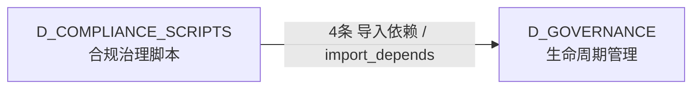

# 39_d_compliance_scripts / 合规治理脚本 / D_COMPLIANCE_SCRIPTS

> **文档作用 / Purpose**: 展示 合规治理脚本（D_COMPLIANCE_SCRIPTS）功能域的模块清单、域内依赖关系、跨域依赖关系、架构分层视图，供架构审查和域治理参考。

> 本文档由 generate_domain_doc.py 从 depgraph (PostgreSQL) 自动生成
> 数据源: depgraph (PostgreSQL) nodes表 + edges表

## 域基本信息 / Domain Overview

| 字段 | 值 | Field | Value |
|------|------|-------|-------|
| 编号 | 39 | Number | 39 |
| 域ID | D_COMPLIANCE_SCRIPTS | Domain ID | D_COMPLIANCE_SCRIPTS |
| 域名称 | 合规治理脚本 | Domain Name | D_COMPLIANCE_SCRIPTS |
| 层级 | L2 业务域层 | Layer | L2 Domain |
| 模块数 | 17 | Module Count | 17 |
| 域内依赖 | 0 | Internal Dependencies | 0 |
| 跨域入边 | 0 | Cross-domain Incoming | 0 |
| 跨域出边 | 4 | Cross-domain Outgoing | 4 |
| 设计态模块 | 0 | Design Modules | 0 |
| 生产态模块 | 17 | Production Modules | 17 |
| 容量 | 0/150 (正常) | Capacity | 0/150 (正常) |
| 描述 | 合规治理脚本（d11_compliance） | Description | 合规治理脚本（d11_compliance） |

## 模块分层清单 / Module Layered List

> 按 architecture_layer 分组的模块清单（共 17 个模块 / 17 modules）。

### L2 领域层 / Domain Layer (17 modules)

| # | 模块路径 / Module Path | 模块名称 / Module Name (功能简介 / Description) | 成熟度 / Maturity | 蓝图 / Blueprint |
|:--:|---------|---------|:---:|:---:|
| 1 | scripts/governance/d11_compliance/audit_registration.py | audit_registration.py — 孤儿注册检测（RULE-TWO... | 生产态 / production |  |
| 2 | scripts/governance/d11_compliance/ci_self_check.py | CI Entry: Self-Check — Drift Detector 自身完整... | 生产态 / production |  |
| 3 | scripts/governance/d11_compliance/fix_shared_bypass.py | fix_shared_bypass.py - D-D-07 auto-fix tool (va... | 生产态 / production |  |
| 4 | scripts/governance/d11_compliance/g9_compliance_check.py | G9 四蓝图跨模块集成合规门禁执行器. | 生产态 / production |  |
| 5 | scripts/governance/d11_compliance/task_self_check.py | task_self_check.py — 任务系统自身健康检查 | 生产态 / production |  |
| 6 | scripts/governance/d11_compliance/validate_commit_gateway.py | validate_commit_gateway.py — GATE-COMMIT-GW 门... | 生产态 / production |  |
| 7 | scripts/governance/d11_compliance/validate_commit_message.py | validate_commit_message.py — Conventional Comm... | 生产态 / production |  |
| 8 | scripts/governance/d11_compliance/validate_exit_codes.py | validate_exit_codes.py — 审计脚本退出码规范门禁 | 生产态 / production |  |
| 9 | scripts/governance/d11_compliance/validate_frozen_require... | validate_frozen_requirements.py — 依赖版本锁定... | 生产态 / production |  |
| 10 | scripts/governance/d11_compliance/validate_manifest_admis... | Module docstring — see module-level docstring ... | 生产态 / production |  |
| 11 | scripts/governance/d11_compliance/validate_no_utf8_bom.py | validate_no_utf8_bom.py — UTF-8 BOM 检测门禁 | 生产态 / production |  |
| 12 | scripts/governance/d11_compliance/validate_script_naming.py | validate_script_naming.py — 审计脚本命名规范门禁 | 生产态 / production |  |
| 13 | scripts/governance/d11_compliance/validate_script_quality.py | validate_script_quality.py — 治理脚本质量合规检查 | 生产态 / production |  |
| 14 | scripts/governance/d11_compliance/validate_task_decomposi... | validate_task_decomposition_bypass.py — Task D... | 生产态 / production |  |
| 15 | scripts/governance/d11_compliance/validate_vocabulary_cov... | Module docstring — see module-level docstring ... | 生产态 / production |  |
| 16 | scripts/governance/d11_compliance/verify_audit_integrity.py | verify_audit_integrity.py — MOD-INF-020 · 零... | 生产态 / production |  |
| 17 | scripts/governance/d11_compliance/verify_schema_health.py | verify_schema_health.py — depgraph (PostgreSQL... | 生产态 / production |  |

## 域内依赖图 / Internal Dependency Diagram

> 依赖图内嵌在本文档中，IDE 可直接渲染显示。参考 decision_index.md 设计，分三个视图：合并全景图、运营态子图、设计态子图（按 design_maturity 实际值拆分）。
>
> **图例说明 / Legend**：
> - **实线边框 = 运营态模块**（production，已上线运行）
> - **虚线边框 = 设计态模块**（design，蓝图阶段，代码未写）
> - **实线箭头 = 运营态依赖**（已生效的依赖关系）
> - **虚线箭头 = 非运营态依赖**（计划中/验证中的依赖关系）

### 合并全景图（全部模块，标签标注成熟度）

> 展示全部 17 个模块（生产态 17 + 设计态 0），标签标注成熟度。

### 运营态子图（仅 design_maturity=production 的模块和依赖）

> 仅展示已上线运行的模块（共 17 个，0 条域内依赖）。

```mermaid
graph TD
    subgraph D_COMPLIANCE_SCRIPTS["D_COMPLIANCE_SCRIPTS 合规治理脚本"]
        scripts_governance_d11_compliance_audit_registration_py["(生产态 / production) audit_registration.py — 孤儿注册检测（RULE-TWO...<br/>文件: audit_registration.py"]
        scripts_governance_d11_compliance_ci_self_check_py["(生产态 / production) CI Entry: Self-Check — Drift Detector 自身完整...<br/>文件: ci_self_check.py"]
        scripts_governance_d11_compliance_fix_shared_bypass_py["(生产态 / production) fix_shared_bypass.py - D-D-07 auto-fix tool (va...<br/>文件: fix_shared_bypass.py"]
        scripts_governance_d11_compliance_g9_compliance_check_py["(生产态 / production) G9 四蓝图跨模块集成合规门禁执行器.<br/>文件: g9_compliance_check.py"]
        scripts_governance_d11_compliance_task_self_check_py["(生产态 / production) task_self_check.py — 任务系统自身健康检查<br/>文件: task_self_check.py"]
        scripts_governance_d11_compliance_validate_commit_gateway_py["(生产态 / production) validate_commit_gateway.py — GATE-COMMIT-GW 门...<br/>文件: validate_commit_gateway.py"]
        scripts_governance_d11_compliance_validate_commit_message_py["(生产态 / production) validate_commit_message.py — Conventional Comm...<br/>文件: validate_commit_message.py"]
        scripts_governance_d11_compliance_validate_exit_codes_py["(生产态 / production) validate_exit_codes.py — 审计脚本退出码规范门禁<br/>文件: validate_exit_codes.py"]
        scripts_governance_d11_compliance_validate_frozen_requirements_py["(生产态 / production) validate_frozen_requirements.py — 依赖版本锁定...<br/>文件: validate_frozen_requirements.py"]
        scripts_governance_d11_compliance_validate_manifest_admission_py["(生产态 / production) Module docstring — see module-level docstring ...<br/>文件: validate_manifest_admission.py"]
        scripts_governance_d11_compliance_validate_no_utf8_bom_py["(生产态 / production) validate_no_utf8_bom.py — UTF-8 BOM 检测门禁<br/>文件: validate_no_utf8_bom.py"]
        scripts_governance_d11_compliance_validate_script_naming_py["(生产态 / production) validate_script_naming.py — 审计脚本命名规范门禁<br/>文件: validate_script_naming.py"]
        scripts_governance_d11_compliance_validate_script_quality_py["(生产态 / production) validate_script_quality.py — 治理脚本质量合规检查<br/>文件: validate_script_quality.py"]
        scripts_governance_d11_compliance_validate_task_decomposition_bypass_py["(生产态 / production) validate_task_decomposition_bypass.py — Task D...<br/>文件: validate_task_decomposition_bypass.py"]
        scripts_governance_d11_compliance_validate_vocabulary_coverage_py["(生产态 / production) Module docstring — see module-level docstring ...<br/>文件: validate_vocabulary_coverage.py"]
        scripts_governance_d11_compliance_verify_audit_integrity_py["(生产态 / production) verify_audit_integrity.py — MOD-INF-020 · 零...<br/>文件: verify_audit_integrity.py"]
        scripts_governance_d11_compliance_verify_schema_health_py["(生产态 / production) verify_schema_health.py — depgraph (PostgreSQL...<br/>文件: verify_schema_health.py"]
    end
    D_GOVERNANCE["(生产态 / production) D_GOVERNANCE"]
    scripts_governance_d11_compliance_task_self_check_py -->|导入依赖 / import_depends| D_GOVERNANCE
    scripts_governance_d11_compliance_verify_schema_health_py -->|导入依赖 / import_depends| D_GOVERNANCE
    scripts_governance_d11_compliance_task_self_check_py -->|导入依赖 / import_depends| D_GOVERNANCE
    scripts_governance_d11_compliance_verify_schema_health_py -->|导入依赖 / import_depends| D_GOVERNANCE
    classDef production fill:#e1f5fe,stroke:#01579b,stroke-width:2px,color:#000
    classDef design fill:#fff3e0,stroke:#e65100,stroke-width:2px,color:#000,stroke-dasharray: 5 5
    classDef external_prod fill:#e8f5e9,stroke:#1b5e20,stroke-width:1px,color:#000
    classDef external_design fill:#fce4ec,stroke:#880e4f,stroke-width:1px,color:#000,stroke-dasharray: 5 5
    class scripts_governance_d11_compliance_audit_registration_py,scripts_governance_d11_compliance_ci_self_check_py,scripts_governance_d11_compliance_fix_shared_bypass_py,scripts_governance_d11_compliance_g9_compliance_check_py,scripts_governance_d11_compliance_task_self_check_py,scripts_governance_d11_compliance_validate_commit_gateway_py,scripts_governance_d11_compliance_validate_commit_message_py,scripts_governance_d11_compliance_validate_exit_codes_py,scripts_governance_d11_compliance_validate_frozen_requirements_py,scripts_governance_d11_compliance_validate_manifest_admission_py,scripts_governance_d11_compliance_validate_no_utf8_bom_py,scripts_governance_d11_compliance_validate_script_naming_py,scripts_governance_d11_compliance_validate_script_quality_py,scripts_governance_d11_compliance_validate_task_decomposition_bypass_py,scripts_governance_d11_compliance_validate_vocabulary_coverage_py,scripts_governance_d11_compliance_verify_audit_integrity_py,scripts_governance_d11_compliance_verify_schema_health_py production
    class D_GOVERNANCE external_prod
```

### 设计态子图（仅 design_maturity=design 的模块和依赖）

> 仅展示蓝图阶段、代码未写的设计态模块（共 0 个，0 条域内依赖）。

> （无设计态模块 / No design modules）

## 跨域依赖 / Cross-domain Dependencies

### 本域依赖的其他域（出边）/ Depends On

| # | 本域模块 / Source Module | → | 外部域-目标模块 / Target Module | 依赖类型 / Type |
|:--:|---------|:--:|---------|---------|
| 1 | task_self_check.py — 任务系统自身健康检查 (tas... | → | D_GOVERNANCE 生命周期管理: SQLite 元数据层 Schema DDL + 版本化迁移框架（T-... | 导入依赖 / import_depends |
| 2 | task_self_check.py — 任务系统自身健康检查 (tas... | → | D_GOVERNANCE 生命周期管理: TaskRepository — 任务登记表 CRUD + 状态机（T-1... | 导入依赖 / import_depends |
| 3 | verify_schema_health.py — depgraph (PostgreSQL... | → | D_GOVERNANCE 生命周期管理: depgraph Schema DDL + 版本化迁移框架 (depgraph_... | 导入依赖 / import_depends |
| 4 | verify_schema_health.py — depgraph (PostgreSQL... | → | D_GOVERNANCE 生命周期管理: decisiongraph Schema DDL + 不变量声明 (decision... | 导入依赖 / import_depends |

### 依赖本域的其他域（入边）/ Depended By

无跨域入边依赖 / No cross-domain incoming dependencies

### 跨域依赖图 / Cross-domain Dependency Diagram

> 本域与 1 个外部域直接连接（出边 4 条 + 入边 0 条 = 4 条）。只显示直接连接的域，不展开具体节点。

## 说明 / Notes

- **数据源 / Data Source**: `depgraph (PostgreSQL)` 的 `nodes`、`edges`、`domains` 表
- **生成器 / Generator**: `generate_domain_doc.py`（G2+G10 合并）
- **维护方式 / Maintenance**: 自动生成，全景图更新时刷新
- **文件名规则 / File Naming**: `{编号:02d}_{域ID小写}.md`，如 `16_d_trading.md`
- **图例说明 / Legend**: `[production]`=已上线 / `[design]`=设计中 / `[unknown]`=未知
