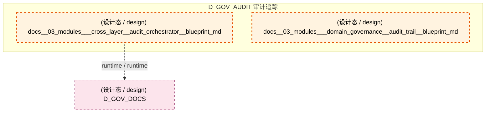

# 39_d_gov_audit / audit_orchestration / 审计追踪 / Audit Trail

> **功能简介 / Overview**: 审计追踪，负责变更审计追踪和操作日志管理

> **文档作用 / Purpose**: 展示 审计追踪（D_GOV_AUDIT）功能域的模块清单、域内依赖关系、跨域依赖关系、架构分层视图，供架构审查和域治理参考。

> 本文档由 generate_domain_doc.py 从 depgraph (PostgreSQL) 自动生成
> 最后更新: 2026-07-17 03:16:03
> 数据源: depgraph (PostgreSQL) nodes表 + edges表

## 域基本信息 / Domain Overview

| 字段 | 值 | Field | Value |
|------|------|-------|-------|
| 编号 | 39 | Number | 39 |
| 域ID | D_GOV_AUDIT | Domain ID | D_GOV_AUDIT |
| 域名称 | 审计追踪 | Domain Name | Audit Trail |
| 层级 | L2 业务域层 | Layer | L2 Domain |
| 模块数 | 276 | Module Count | 276 |
| 域内依赖 | 101 | Internal Dependencies | 101 |
| 跨域入边 | 141 | Cross-domain Incoming | 141 |
| 跨域出边 | 266 | Cross-domain Outgoing | 266 |
| 设计态模块 | 2 | Design Modules | 2 |
| 原型态模块 | 206 | Prototype Modules | 206 |
| 生产态模块 | 68 | Production Modules | 68 |
| 容量 | 68/150 (正常) | Capacity | 68/150 (正常) |
| 描述 | 审计管线编排 | Description | 审计管线编排 |

## 模块分层清单 / Module Layered List

> 按 architecture_layer 分组的模块清单（共 276 个模块 / 276 modules）。

### L1 基础层 / Foundation Layer (2 modules)

| # | 模块路径 / Module Path | 模块名称 / Module Name (功能简介 / Description) | 成熟度 / Maturity | 蓝图 / Blueprint |
|:--:|---------|---------|:---:|:---:|
| 1 | docs/03_modules/_cross_layer/audit_orchestrator/blueprint.md | docs__03_modules___cross_layer__audit_orchestrator__blueprint_md | 设计态 / design | [MOD-INF-027](../../03_modules/_cross_layer/audit_orchestrator/blueprint.md) |
| 2 | docs/03_modules/_domain_governance/audit_trail/blueprint.md | docs__03_modules___domain_governance__audit_trail__blueprint_md | 设计态 / design | [MOD-INF-020](../../03_modules/_domain_governance/audit_trail/blueprint.md) |

### L2 领域层 / Domain Layer (274 modules)

| # | 模块路径 / Module Path | 模块名称 / Module Name (功能简介 / Description) | 成熟度 / Maturity | 蓝图 / Blueprint |
|:--:|---------|---------|:---:|:---:|
| 1 | scripts/governance/repair/audit_design_completeness.py | [INVARIANTS] 按path精确匹配+按功能名模糊匹配; ... | 原型态 / prototype |  |
| 2 | scripts/governance/repair/red_blue_test.py | [INVARIANTS] 20项红蓝对抗测试 | 原型态 / prototype |  |
| 3 | scripts/governance/repair/rollback_depgraph.py | [INVARIANTS] 仅接受depgraph.backup.*路径; 回滚... | 原型态 / prototype |  |
| 4 | src/zephyr/gov_audit/__init__.py | __init__.py | 生产态 / production | [MOD-INF-020](../../03_modules/_domain_governance/audit_trail/blueprint.md) |
| 5 | src/zephyr/gov_audit/_orchestrator_compat.py | audit-orchestrator 兼容重导出层（ARCH-042 阶段4... | 生产态 / production | [MOD-INF-020](../../03_modules/_domain_governance/audit_trail/blueprint.md) |
| 6 | src/zephyr/gov_audit/action_history.py | ActionHistory — 操作历史持久化审计 + 去重 + 循... | 生产态 / production | [MOD-INF-024](../../03_modules/_domain_autonomy_perm/budget_enforcer/blueprint.md) |
| 7 | src/zephyr/gov_audit/agent_signer.py | audit-trail.agent_signer — MOD-INF-020 · Agen... | 生产态 / production | [MOD-INF-020](../../03_modules/_domain_governance/audit_trail/blueprint.md) |
| 8 | src/zephyr/gov_audit/anomaly.py | anomaly.py | 生产态 / production | [MOD-INF-020](../../03_modules/_domain_governance/audit_trail/blueprint.md) |
| 9 | src/zephyr/gov_audit/api_lifecycle.py | api_lifecycle.py | 生产态 / production | [MOD-INF-020](../../03_modules/_domain_governance/audit_trail/blueprint.md) |
| 10 | src/zephyr/gov_audit/audit_admission_controller.py | audit_admission_controller.py | 原型态 / prototype | [MOD-INF-020](../../03_modules/_domain_governance/audit_trail/blueprint.md) |
| 11 | src/zephyr/gov_audit/audit_schema.py | audit_schema — 审计视图与查询入口（SH-DB-001 v... | 生产态 / production | [MOD-INF-020](../../03_modules/_domain_governance/audit_trail/blueprint.md) |
| 12 | src/zephyr/gov_audit/audit_write_failure_protector.py | Audit Write Failure Protector — v0.13.0 审计写... | 生产态 / production | [MOD-INF-022](../../03_modules/_domain_autonomy_perm/escalation_protocol/blueprint.md) |
| 13 | src/zephyr/gov_audit/bridge.py | bridge.py | 生产态 / production | [MOD-INF-020](../../03_modules/_domain_governance/audit_trail/blueprint.md) |
| 14 | src/zephyr/gov_audit/bridges/__init__.py | Audit Trail — MOD-INF-020 | 原型态 / prototype | [MOD-INF-020](../../03_modules/_domain_governance/audit_trail/blueprint.md) |
| 15 | src/zephyr/gov_audit/bridges/audit_anomaly.py | G-CT-002 Audit 异常检测器 — AnomalyEvent Pydan... | 原型态 / prototype | [MOD-INF-020](../../03_modules/_domain_governance/audit_trail/blueprint.md) |
| 16 | src/zephyr/gov_audit/bridges/audit_contracts.py | G-CT-001 契约消费端 — Audit.write() 公共接口. | 原型态 / prototype | [MOD-INF-020](../../03_modules/_domain_governance/audit_trail/blueprint.md) |
| 17 | src/zephyr/gov_audit/bridges/audit_delegation_bridge.py | Audit ↔ DelegationManager 委托链审计桥接. | 生产态 / production | [MOD-INF-020](../../03_modules/_domain_governance/audit_trail/blueprint.md) |
| 18 | src/zephyr/gov_audit/bridges/audit_drift_bridge.py | G-CT-007 Audit ↔ Drift 双向桥接 — MOD-INF-020... | 原型态 / prototype | [MOD-INF-020](../../03_modules/_domain_governance/audit_trail/blueprint.md) |
| 19 | src/zephyr/gov_audit/bridges/audit_feedback_bridge.py | Audit ↔ Feedback Loop 三角闭环桥接. | 生产态 / production | [MOD-INF-020](../../03_modules/_domain_governance/audit_trail/blueprint.md) |
| 20 | src/zephyr/gov_audit/bridges/audit_tiered_storage_bridge.py | Audit ↔ WarmHotGate 三层存储桥接. | 生产态 / production | [MOD-INF-020](../../03_modules/_domain_governance/audit_trail/blueprint.md) |
| 21 | src/zephyr/gov_audit/bridges/audit_trust_bridge.py | Audit ↔ ContinuousTrust 信任分数桥接. | 生产态 / production | [MOD-INF-020](../../03_modules/_domain_governance/audit_trail/blueprint.md) |
| 22 | src/zephyr/gov_audit/changelog_manager.py | changelog_manager.py | 生产态 / production | [MOD-INF-020](../../03_modules/_domain_governance/audit_trail/blueprint.md) |
| 23 | src/zephyr/gov_audit/cli.py | cli.py | 生产态 / production | [MOD-INF-020](../../03_modules/_domain_governance/audit_trail/blueprint.md) |
| 24 | src/zephyr/gov_audit/code_archaeology.py | code_archaeology.py | 生产态 / production | [MOD-INF-020](../../03_modules/_domain_governance/audit_trail/blueprint.md) |
| 25 | src/zephyr/gov_audit/cold_start.py | cold_start.py | 生产态 / production | [MOD-INF-020](../../03_modules/_domain_governance/audit_trail/blueprint.md) |
| 26 | src/zephyr/gov_audit/compliance_map.py | audit-trail.compliance_map — MOD-INF-020 · 合... | 生产态 / production | [MOD-INF-020](../../03_modules/_domain_governance/audit_trail/blueprint.md) |
| 27 | src/zephyr/gov_audit/contracts.py | contracts.py | 生产态 / production | [MOD-INF-020](../../03_modules/_domain_governance/audit_trail/blueprint.md) |
| 28 | src/zephyr/gov_audit/corporate_actions.py | corporate_actions.py | 生产态 / production | [MOD-INF-020](../../03_modules/_domain_governance/audit_trail/blueprint.md) |
| 29 | src/zephyr/gov_audit/delegation_auditor.py | delegation_auditor.py | 生产态 / production | [MOD-INF-020](../../03_modules/_domain_governance/audit_trail/blueprint.md) |
| 30 | src/zephyr/gov_audit/delegation_bridge.py | delegation_bridge.py | 原型态 / prototype | [MOD-INF-020](../../03_modules/_domain_governance/audit_trail/blueprint.md) |
| 31 | src/zephyr/gov_audit/dora_metrics.py | dora_metrics.py | 生产态 / production | [MOD-INF-020](../../03_modules/_domain_governance/audit_trail/blueprint.md) |
| 32 | src/zephyr/gov_audit/event_store.py | EventStore — Event Sourcing 事件追加与回放（DW... | 生产态 / production | [MOD-INF-020](../../03_modules/_domain_governance/audit_trail/blueprint.md) |
| 33 | src/zephyr/gov_audit/evidence_pack.py | audit-trail.evidence_pack — MOD-INF-020 · 证... | 生产态 / production | [MOD-INF-020](../../03_modules/_domain_governance/audit_trail/blueprint.md) |
| 34 | src/zephyr/gov_audit/external_tool_audit.py | external_tool_audit.py | 生产态 / production | [MOD-INF-020](../../03_modules/_domain_governance/audit_trail/blueprint.md) |
| 35 | src/zephyr/gov_audit/feedback_bridge.py | feedback_bridge.py | 生产态 / production | [MOD-INF-020](../../03_modules/_domain_governance/audit_trail/blueprint.md) |
| 36 | src/zephyr/gov_audit/feedback_policy.py | feedback_policy.py | 生产态 / production | [MOD-INF-020](../../03_modules/_domain_governance/audit_trail/blueprint.md) |
| 37 | src/zephyr/gov_audit/feedback_self_audit.py | audit-trail.feedback_self_audit — MOD-INF-020 ... | 生产态 / production | [MOD-INF-020](../../03_modules/_domain_governance/audit_trail/blueprint.md) |
| 38 | src/zephyr/gov_audit/finding_ingest.py | finding_ingest.py | 原型态 / prototype | [MOD-INF-020](../../03_modules/_domain_governance/audit_trail/blueprint.md) |
| 39 | src/zephyr/gov_audit/finding_model.py | finding_model.py | 原型态 / prototype | [MOD-INF-020](../../03_modules/_domain_governance/audit_trail/blueprint.md) |
| 40 | src/zephyr/gov_audit/forensic_package.py | Forensic Package — v0.8.0 取证就绪: escalation... | 生产态 / production | [MOD-INF-022](../../03_modules/_domain_autonomy_perm/escalation_protocol/blueprint.md) |
| 41 | src/zephyr/gov_audit/genesis.py | genesis.py | 生产态 / production | [MOD-INF-020](../../03_modules/_domain_governance/audit_trail/blueprint.md) |
| 42 | src/zephyr/gov_audit/glossary_matrix.py | glossary_matrix.py | 生产态 / production | [MOD-INF-020](../../03_modules/_domain_governance/audit_trail/blueprint.md) |
| 43 | src/zephyr/gov_audit/incremental_review.py | incremental_review.py | 生产态 / production | [MOD-INF-020](../../03_modules/_domain_governance/audit_trail/blueprint.md) |
| 44 | src/zephyr/gov_audit/indexer.py | indexer.py | 生产态 / production | [MOD-INF-020](../../03_modules/_domain_governance/audit_trail/blueprint.md) |
| 45 | src/zephyr/gov_audit/integrity.py | audit-trail.integrity — MOD-INF-020 · 密码学... | 生产态 / production | [MOD-INF-020](../../03_modules/_domain_governance/audit_trail/blueprint.md) |
| 46 | src/zephyr/gov_audit/integrity_verifier.py | Integrity Verifier — v0.8.0 代码完整性验证器: ... | 生产态 / production | [MOD-INF-022](../../03_modules/_domain_autonomy_perm/escalation_protocol/blueprint.md) |
| 47 | src/zephyr/gov_audit/kb_gate.py | audit-trail.kb_gate — MOD-INF-020 · KB 审计门控 | 生产态 / production | [MOD-INF-020](../../03_modules/_domain_governance/audit_trail/blueprint.md) |
| 48 | src/zephyr/gov_audit/log_rotation.py | log_rotation.py | 生产态 / production | [MOD-INF-020](../../03_modules/_domain_governance/audit_trail/blueprint.md) |
| 49 | src/zephyr/gov_audit/merkle_audit.py | Merkle Audit — 兼容别名，SSoT已迁移至 zephyr.g... | 生产态 / production | [MOD-INF-022](../../03_modules/_domain_autonomy_perm/escalation_protocol/blueprint.md) |
| 50 | src/zephyr/gov_audit/merkle_hourly.py | audit-trail.merkle_hourly — MOD-INF-020 · 每... | 生产态 / production | [MOD-INF-020](../../03_modules/_domain_governance/audit_trail/blueprint.md) |
| 51 | src/zephyr/gov_audit/models.py | models.py | 生产态 / production | [MOD-INF-020](../../03_modules/_domain_governance/audit_trail/blueprint.md) |
| 52 | src/zephyr/gov_audit/observability_dashboard.py | observability_dashboard.py | 生产态 / production | [MOD-INF-020](../../03_modules/_domain_governance/audit_trail/blueprint.md) |
| 53 | src/zephyr/gov_audit/pipeline_runner.py | pipeline_runner.py | 生产态 / production | [MOD-INF-020](../../03_modules/_domain_governance/audit_trail/blueprint.md) |
| 54 | src/zephyr/gov_audit/privacy.py | audit-trail.privacy — MOD-INF-020 · PII 检测与脱敏 | 生产态 / production | [MOD-INF-020](../../03_modules/_domain_governance/audit_trail/blueprint.md) |
| 55 | src/zephyr/gov_audit/provenance_tracker.py | provenance_tracker.py | 生产态 / production | [MOD-INF-020](../../03_modules/_domain_governance/audit_trail/blueprint.md) |
| 56 | src/zephyr/gov_audit/query.py | query.py | 生产态 / production | [MOD-INF-020](../../03_modules/_domain_governance/audit_trail/blueprint.md) |
| 57 | src/zephyr/gov_audit/replay_engine.py | replay_engine.py | 生产态 / production | [MOD-INF-020](../../03_modules/_domain_governance/audit_trail/blueprint.md) |
| 58 | src/zephyr/gov_audit/resource_aware_pool.py | resource_aware_pool.py | 原型态 / prototype | [MOD-INF-020](../../03_modules/_domain_governance/audit_trail/blueprint.md) |
| 59 | src/zephyr/gov_audit/retention.py | retention.py | 生产态 / production | [MOD-INF-020](../../03_modules/_domain_governance/audit_trail/blueprint.md) |
| 60 | src/zephyr/gov_audit/sbom_generator.py | LicenseType 枚举——许可证类型定义（P3 价值审判... | 生产态 / production | [MOD-INF-020](../../03_modules/_domain_governance/audit_trail/blueprint.md) |
| 61 | src/zephyr/gov_audit/spec_auditor.py | spec_auditor.py | 生产态 / production | [MOD-INF-020](../../03_modules/_domain_governance/audit_trail/blueprint.md) |
| 62 | src/zephyr/gov_audit/supply_chain.py | audit-trail.supply_chain — MOD-INF-020 · 供应... | 生产态 / production | [MOD-INF-020](../../03_modules/_domain_governance/audit_trail/blueprint.md) |
| 63 | src/zephyr/gov_audit/supply_chain_security.py | supply_chain_security.py | 生产态 / production | [MOD-INF-020](../../03_modules/_domain_governance/audit_trail/blueprint.md) |
| 64 | src/zephyr/gov_audit/text_to_finding_adapter.py | text_to_finding_adapter.py | 原型态 / prototype | [MOD-INF-020](../../03_modules/_domain_governance/audit_trail/blueprint.md) |
| 65 | src/zephyr/gov_audit/tiered_storage.py | tiered_storage.py | 生产态 / production | [MOD-INF-020](../../03_modules/_domain_governance/audit_trail/blueprint.md) |
| 66 | src/zephyr/gov_audit/tiered_storage_bridge.py | tiered_storage_bridge.py | 原型态 / prototype | [MOD-INF-020](../../03_modules/_domain_governance/audit_trail/blueprint.md) |
| 67 | src/zephyr/gov_audit/trust_bridge.py | trust_bridge.py | 原型态 / prototype | [MOD-INF-020](../../03_modules/_domain_governance/audit_trail/blueprint.md) |
| 68 | src/zephyr/gov_audit/trust_engine.py | trust_engine.py | 生产态 / production | [MOD-INF-020](../../03_modules/_domain_governance/audit_trail/blueprint.md) |
| 69 | src/zephyr/gov_audit/trust_ring_manager.py | trust_ring_manager.py | 生产态 / production | [MOD-INF-024](../../03_modules/_domain_autonomy_perm/budget_enforcer/blueprint.md) |
| 70 | src/zephyr/gov_audit/wqa_scorer.py | wqa_scorer.py | 生产态 / production | [MOD-INF-020](../../03_modules/_domain_governance/audit_trail/blueprint.md) |
| 71 | src/zephyr/gov_audit/writer.py | writer.py | 生产态 / production | [MOD-INF-020](../../03_modules/_domain_governance/audit_trail/blueprint.md) |
| 72 | src/zephyr/gov_enforcement/behavioral_admission/ai_code_s... | ai_code_standards.py | 生产态 / production | [MOD-GOVERNANCE](../../03_modules/_domain_governance/blueprint.md) |
| 73 | src/zephyr/gov_enforcement/behavioral_admission/mcp_resul... | mcp_result_push.py | 生产态 / production | [MOD-GOVERNANCE](../../03_modules/_domain_governance/blueprint.md) |
| 74 | src/zephyr/gov_enforcement/behavioral_admission/post_proc... | post_process.py —— AI 生成代码后处理管道（Pha... | 生产态 / production | [MOD-GOVERNANCE](../../03_modules/_domain_governance/blueprint.md) |
| 75 | src/zephyr/gov_enforcement/behavioral_admission/vibe_codi... | vibe_coding_enforcer.py | 生产态 / production | [MOD-GOVERNANCE](../../03_modules/_domain_governance/blueprint.md) |
| 76 | src/zephyr/gov_enforcement/rule_enforcement/audit_chain_v... | 审计链验证工具——独立重放门禁判定+Hash链完整性... | 生产态 / production | [MOD-GATE_ENGINE](../../03_modules/_cross_layer/gate_engine/blueprint.md) |
| 77 | src/zephyr/gov_enforcement/rule_enforcement/sys_master_co... | SYS-MASTER-001 Compliance Checker | 生产态 / production | [MOD-GATE_ENGINE](../../03_modules/_cross_layer/gate_engine/blueprint.md) |
| 78 | src/zephyr/governance/audit/__init__.py | governance.audit — auto-generated package init. | 原型态 / prototype |  |
| 79 | src/zephyr/governance/audit/default_attribution_engine.py | Re-export wrapper: default_attribution_engine c... | 原型态 / prototype | [MOD-L07-001](../../03_modules/_domain_reporting/blueprint.md) |
| 80 | src/zephyr/governance/audit/default_tca_engine.py | Re-export wrapper: default_tca_engine canonical... | 原型态 / prototype | [MOD-L07-001](../../03_modules/_domain_reporting/blueprint.md) |
| 81 | src/zephyr/governance/audit/reconciliation_registry.py | reconciliation_registry.py — GitCommitGateway ... | 生产态 / production | [MOD-INF-035](../../03_modules/_cross_layer/auto_runtime_core/blueprint.md) |
| 82 | src/zephyr/governance/audit/snapshot_manager.py | SnapshotManager — Event Sourcing 快照管理（DW-... | 生产态 / production | [MOD-INF-020](../../03_modules/_domain_governance/audit_trail/blueprint.md) |
| 83 | src/zephyr/governance/financial_governance/financial_comp... | financial_compliance.py | 生产态 / production | [MOD-GOVERNANCE](../../03_modules/_domain_governance/blueprint.md) |
| 84 | src/zephyr/governance/semantic_audit/__init__.py | __init__.py | 原型态 / prototype |  |
| 85 | src/zephyr/governance/semantic_audit/alignment_engine.py | 三元对齐检测：蓝图声明清单 vs 磁盘实际文件 vs i... | 原型态 / prototype | [MOD-INF-028](../../03_modules/_cross_layer/semantic_auditor/blueprint.md) |
| 86 | src/zephyr/governance/semantic_audit/compliance_map.py | audit-trail.compliance_map — MOD-INF-020 · 合... | 原型态 / prototype | [MOD-INF-028](../../03_modules/_cross_layer/semantic_auditor/blueprint.md) |
| 87 | src/zephyr/governance/semantic_audit/feedback_self_audit.py | audit-trail.feedback_self_audit — MOD-INF-020 ... | 原型态 / prototype | [MOD-INF-028](../../03_modules/_cross_layer/semantic_auditor/blueprint.md) |
| 88 | src/zephyr/governance/semantic_audit/fix_prioritizer.py | 按 severity -> certainty -> blast_radius 三级排... | 原型态 / prototype | [MOD-INF-028](../../03_modules/_cross_layer/semantic_auditor/blueprint.md) |
| 89 | src/zephyr/governance/semantic_audit/fix_result_prioritiz... | fix_prioritizer — MOD-INF-028 §3.1 Stage 8 | 原型态 / prototype | [MOD-INF-028](../../03_modules/_cross_layer/semantic_auditor/blueprint.md) |
| 90 | src/zephyr/governance/semantic_audit/forbidden_patterns.yaml | forbidden_patterns.yaml | 生产态 / production |  |
| 91 | src/zephyr/governance/semantic_audit/issue_aggregator.py | 收集各阶段审计结果，去重合并排序输出。 | 原型态 / prototype | [MOD-INF-028](../../03_modules/_cross_layer/semantic_auditor/blueprint.md) |
| 92 | src/zephyr/governance/semantic_audit/kb_gate.py | audit-trail.kb_gate — MOD-INF-020 · KB 审计门控 | 原型态 / prototype | [MOD-INF-028](../../03_modules/_cross_layer/semantic_auditor/blueprint.md) |
| 93 | src/zephyr/governance/semantic_audit/llm_bridge.py | 接收 RED 问题,生成修复文本。LLM 只润色不做判断... | 原型态 / prototype | [MOD-INF-028](../../03_modules/_cross_layer/semantic_auditor/blueprint.md) |
| 94 | src/zephyr/governance/semantic_audit/models.py | 语义审计管线数据模型 — MOD-INF-028 §4.2 | 生产态 / production | [MOD-INF-028](../../03_modules/_cross_layer/semantic_auditor/blueprint.md) |
| 95 | src/zephyr/governance/semantic_audit/orchestrator.py | SemanticAuditor 编排器——9阶段管道统一调度. | 原型态 / prototype | [MOD-INF-028](../../03_modules/_cross_layer/semantic_auditor/blueprint.md) |
| 96 | src/zephyr/governance/semantic_audit/privacy.py | audit-trail.privacy — MOD-INF-020 · PII 检测与脱敏 | 原型态 / prototype | [MOD-INF-028](../../03_modules/_cross_layer/semantic_auditor/blueprint.md) |
| 97 | src/zephyr/governance/semantic_audit/reference_extractor.py | AST 解析文件，提取 9 个维度的引用信息。 | 原型态 / prototype | [MOD-INF-028](../../03_modules/_cross_layer/semantic_auditor/blueprint.md) |
| 98 | src/zephyr/governance/semantic_audit/safety_boundary.py | 禁碰规则过滤 + 置信度阈值。输入 TriggerResult ... | 原型态 / prototype | [MOD-INF-028](../../03_modules/_cross_layer/semantic_auditor/blueprint.md) |
| 99 | src/zephyr/governance/semantic_audit/self_healer.py | Stage 7 自愈闭环 — 修复->自测->回滚. | 原型态 / prototype | [MOD-INF-028](../../03_modules/_cross_layer/semantic_auditor/blueprint.md) |
| 100 | src/zephyr/governance/semantic_audit/self_health.py | 7 SLI + 5 容量 SLI + 退化检测。定时自检,输出 HE... | 原型态 / prototype | [MOD-INF-028](../../03_modules/_cross_layer/semantic_auditor/blueprint.md) |
| 101 | src/zephyr/governance/semantic_audit/semantic_cache.py | semantic_cache.py | 生产态 / production | [MOD-INF-024](../../03_modules/_domain_autonomy_perm/budget_enforcer/blueprint.md) |
| 102 | src/zephyr/governance/semantic_audit/spec_auditor.py | G-CT-007 — Audit.record_agent_spec() 记录 Agen... | 原型态 / prototype | [MOD-INF-028](../../03_modules/_cross_layer/semantic_auditor/blueprint.md) |
| 103 | src/zephyr/governance/semantic_audit/trigger_engine.py | 监听文件变更，判定是否触发语义审计。 | 原型态 / prototype | [MOD-INF-028](../../03_modules/_cross_layer/semantic_auditor/blueprint.md) |
| 104 | tests/audit/test_ab_test.py | test_ab_test.py | 原型态 / prototype | [MOD-FEEDBACK_LOOP](../../03_modules/_cross_layer/feedback_loop/blueprint.md) |
| 105 | tests/audit/test_absence_manager.py | test_absence_manager.py | 原型态 / prototype | [MOD-INF-033](../../03_modules/_cross_layer/behavioral_auditor/blueprint.md) |
| 106 | tests/audit/test_amplification_guard.py | test_amplification_guard.py | 原型态 / prototype | [MOD-FEEDBACK_LOOP](../../03_modules/_cross_layer/feedback_loop/blueprint.md) |
| 107 | tests/audit/test_api_dependency_metrics.py | test_api_dependency_metrics.py | 原型态 / prototype | [MOD-FEEDBACK_LOOP](../../03_modules/_cross_layer/feedback_loop/blueprint.md) |
| 108 | tests/audit/test_architecture_contracts.py | test_architecture_contracts.py | 原型态 / prototype | [MOD-INF-023](../../03_modules/_domain_governance/drift_detector/blueprint.md) |
| 109 | tests/audit/test_architecture_principles.py | test_architecture_principles.py | 原型态 / prototype | [MOD-INF-023](../../03_modules/_domain_governance/drift_detector/blueprint.md) |
| 110 | tests/audit/test_audit_anomaly.py | test_audit_anomaly.py | 原型态 / prototype | [MOD-INF-020](../../03_modules/_domain_governance/audit_trail/blueprint.md) |
| 111 | tests/audit/test_audit_api_lifecycle.py | test_audit_api_lifecycle.py | 原型态 / prototype | [MOD-INF-020](../../03_modules/_domain_governance/audit_trail/blueprint.md) |
| 112 | tests/audit/test_audit_bridge.py | test_audit_bridge.py | 原型态 / prototype | [MOD-INF-020](../../03_modules/_domain_governance/audit_trail/blueprint.md) |
| 113 | tests/audit/test_audit_chain_verifier.py | test_audit_chain_verifier.py | 原型态 / prototype | [MOD-GATE_ENGINE](../../03_modules/_cross_layer/gate_engine/blueprint.md) |
| 114 | tests/audit/test_audit_cli.py | test_audit_cli.py | 原型态 / prototype | [MOD-INF-020](../../03_modules/_domain_governance/audit_trail/blueprint.md) |
| 115 | tests/audit/test_audit_contracts.py | test_audit_contracts.py | 原型态 / prototype | [MOD-INF-020](../../03_modules/_domain_governance/audit_trail/blueprint.md) |
| 116 | tests/audit/test_audit_dim_d1_d4_e2e.py | test_audit_dim_d1_d4_e2e.py | 原型态 / prototype | [MOD-INF-027](../../03_modules/_cross_layer/audit_orchestrator/blueprint.md) |
| 117 | tests/audit/test_audit_dim_d5_d8_e2e.py | test_audit_dim_d5_d8_e2e.py | 原型态 / prototype | [MOD-INF-027](../../03_modules/_cross_layer/audit_orchestrator/blueprint.md) |
| 118 | tests/audit/test_audit_dim_d9_d12_e2e.py | test_audit_dim_d9_d12_e2e.py | 原型态 / prototype | [MOD-INF-027](../../03_modules/_cross_layer/audit_orchestrator/blueprint.md) |
| 119 | tests/audit/test_audit_financial_compliance.py | test_audit_financial_compliance.py | 原型态 / prototype | [MOD-INF-020](../../03_modules/_domain_governance/audit_trail/blueprint.md) |
| 120 | tests/audit/test_audit_full_closure_e2e.py | test_audit_full_closure_e2e.py | 原型态 / prototype | [MOD-INF-027](../../03_modules/_cross_layer/audit_orchestrator/blueprint.md) |
| 121 | tests/audit/test_audit_full_pipeline_e2e.py | test_audit_full_pipeline_e2e.py | 原型态 / prototype | [MOD-INF-027](../../03_modules/_cross_layer/audit_orchestrator/blueprint.md) |
| 122 | tests/audit/test_audit_incremental_review.py | test_audit_incremental_review.py | 原型态 / prototype | [MOD-INF-020](../../03_modules/_domain_governance/audit_trail/blueprint.md) |
| 123 | tests/audit/test_audit_indexer.py | test_audit_indexer.py | 原型态 / prototype | [MOD-INF-020](../../03_modules/_domain_governance/audit_trail/blueprint.md) |
| 124 | tests/audit/test_audit_integrity.py | test_audit_integrity.py | 原型态 / prototype | [MOD-INF-020](../../03_modules/_domain_governance/audit_trail/blueprint.md) |
| 125 | tests/audit/test_audit_log_guard.py | test_audit_log_guard.py | 原型态 / prototype | [MOD-INF-018](../../03_modules/_domain_autonomy_core/agent_role_based_access_control/blueprint.md) |
| 126 | tests/audit/test_audit_models.py | test_audit_models.py | 原型态 / prototype | [MOD-INF-020](../../03_modules/_domain_governance/audit_trail/blueprint.md) |
| 127 | tests/audit/test_audit_observability_dashboard.py | test_audit_observability_dashboard.py | 原型态 / prototype | [MOD-INF-020](../../03_modules/_domain_governance/audit_trail/blueprint.md) |
| 128 | tests/audit/test_audit_orchestrator_e2e.py | test_audit_orchestrator_e2e.py | 原型态 / prototype | [MOD-INF-027](../../03_modules/_cross_layer/audit_orchestrator/blueprint.md) |
| 129 | tests/audit/test_audit_orphan_judge_e2e.py | [INVARIANTS] E2E tests cover DecisionTable 12-r... | 原型态 / prototype | [MOD-INF-029](../../03_modules/_cross_layer/orphan_judge/blueprint.md) |
| 130 | tests/audit/test_audit_provenance_tracker.py | test_audit_provenance_tracker.py | 原型态 / prototype | [MOD-INF-020](../../03_modules/_domain_governance/audit_trail/blueprint.md) |
| 131 | tests/audit/test_audit_red_blue_e2e.py | test_audit_red_blue_e2e.py | 原型态 / prototype | [MOD-INF-030](../../03_modules/_cross_layer/red_blue_validator/blueprint.md) |
| 132 | tests/audit/test_audit_registry_gate_e2e.py | test_audit_registry_gate_e2e.py | 原型态 / prototype | [MOD-INF-027](../../03_modules/_cross_layer/audit_orchestrator/blueprint.md) |
| 133 | tests/audit/test_audit_self_healer_e2e.py | test_audit_self_healer_e2e.py | 原型态 / prototype | [MOD-INF-028](../../03_modules/_cross_layer/semantic_auditor/blueprint.md) |
| 134 | tests/audit/test_audit_spec_auditor.py | test_audit_spec_auditor.py | 原型态 / prototype | [MOD-INF-020](../../03_modules/_domain_governance/audit_trail/blueprint.md) |
| 135 | tests/audit/test_audit_supply_chain_security.py | test_audit_supply_chain_security.py | 原型态 / prototype | [MOD-INF-020](../../03_modules/_domain_governance/audit_trail/blueprint.md) |
| 136 | tests/audit/test_audit_write_failure_protector.py | test_audit_write_failure_protector.py | 原型态 / prototype | [MOD-INF-021](../../03_modules/_domain_autonomy_core/rollback_system/blueprint.md) |
| 137 | tests/audit/test_backcompat_checker.py | test_backcompat_checker.py | 原型态 / prototype | [MOD-INF-033](../../03_modules/_cross_layer/behavioral_auditor/blueprint.md) |
| 138 | tests/audit/test_baseline_manager.py | test_baseline_manager.py | 原型态 / prototype | [MOD-INF-033](../../03_modules/_cross_layer/behavioral_auditor/blueprint.md) |
| 139 | tests/audit/test_baseline_poisoning_guard.py | test_baseline_poisoning_guard.py | 原型态 / prototype | [MOD-INF-033](../../03_modules/_cross_layer/behavioral_auditor/blueprint.md) |
| 140 | tests/audit/test_benchmark_integrity.py | test_benchmark_integrity.py | 原型态 / prototype | [MOD-INF-023](../../03_modules/_domain_governance/drift_detector/blueprint.md) |
| 141 | tests/audit/test_brain_integration_root.py | test_brain_integration_root.py | 原型态 / prototype | [MOD-INF-033](../../03_modules/_cross_layer/behavioral_auditor/blueprint.md) |
| 142 | tests/audit/test_build_reproducibility_verifier.py | test_build_reproducibility_verifier.py | 原型态 / prototype | [MOD-FEEDBACK_LOOP](../../03_modules/_cross_layer/feedback_loop/blueprint.md) |
| 143 | tests/audit/test_build_reproducibility_verifier_v2.py | test_build_reproducibility_verifier_v2.py | 原型态 / prototype | [MOD-FEEDBACK_LOOP](../../03_modules/_cross_layer/feedback_loop/blueprint.md) |
| 144 | tests/audit/test_burn_rate_alerter.py | test_burn_rate_alerter.py | 原型态 / prototype | [MOD-FEEDBACK_LOOP](../../03_modules/_cross_layer/feedback_loop/blueprint.md) |
| 145 | tests/audit/test_burnout_alarm.py | test_burnout_alarm.py | 原型态 / prototype | [MOD-FEEDBACK_LOOP](../../03_modules/_cross_layer/feedback_loop/blueprint.md) |
| 146 | tests/audit/test_cascade_detector.py | test_cascade_detector.py | 原型态 / prototype | [MOD-INF-033](../../03_modules/_cross_layer/behavioral_auditor/blueprint.md) |
| 147 | tests/audit/test_causal_inference_engine.py | test_causal_inference_engine.py | 原型态 / prototype | [MOD-FEEDBACK_LOOP](../../03_modules/_cross_layer/feedback_loop/blueprint.md) |
| 148 | tests/audit/test_code_review_ai.py | test_code_review_ai.py | 原型态 / prototype | [MOD-INF-033](../../03_modules/_cross_layer/behavioral_auditor/blueprint.md) |
| 149 | tests/audit/test_cognitive_load_budget.py | test_cognitive_load_budget.py | 原型态 / prototype | [MOD-FEEDBACK_LOOP](../../03_modules/_cross_layer/feedback_loop/blueprint.md) |
| 150 | tests/audit/test_correlation_engine.py | test_correlation_engine.py | 原型态 / prototype | [MOD-INF-033](../../03_modules/_cross_layer/behavioral_auditor/blueprint.md) |
| 151 | tests/audit/test_credibility_engine.py | test_credibility_engine.py | 原型态 / prototype | [MOD-INF-033](../../03_modules/_cross_layer/behavioral_auditor/blueprint.md) |
| 152 | tests/audit/test_crypto_bootstrap.py | test_crypto_bootstrap.py | 原型态 / prototype | [MOD-FEEDBACK_LOOP](../../03_modules/_cross_layer/feedback_loop/blueprint.md) |
| 153 | tests/audit/test_detector_dispatcher.py | test_detector_dispatcher.py | 原型态 / prototype | [MOD-INF-033](../../03_modules/_cross_layer/behavioral_auditor/blueprint.md) |
| 154 | tests/audit/test_deterministic_replay.py | test_deterministic_replay.py | 原型态 / prototype | [MOD-FEEDBACK_LOOP](../../03_modules/_cross_layer/feedback_loop/blueprint.md) |
| 155 | tests/audit/test_diagnosis_kpi.py | test_diagnosis_kpi.py | 原型态 / prototype | [MOD-FEEDBACK_LOOP](../../03_modules/_cross_layer/feedback_loop/blueprint.md) |
| 156 | tests/audit/test_emergent_behavior_detector.py | test_emergent_behavior_detector.py | 原型态 / prototype | [MOD-FEEDBACK_LOOP](../../03_modules/_cross_layer/feedback_loop/blueprint.md) |
| 157 | tests/audit/test_events_ba.py | test_events_ba.py | 原型态 / prototype | [MOD-INF-033](../../03_modules/_cross_layer/behavioral_auditor/blueprint.md) |
| 158 | tests/audit/test_forensics_engine.py | test_forensics_engine.py | 原型态 / prototype | [MOD-INF-033](../../03_modules/_cross_layer/behavioral_auditor/blueprint.md) |
| 159 | tests/audit/test_gitignore_auditor.py | test_gitignore_auditor.py | 原型态 / prototype | [MOD-INF-033](../../03_modules/_cross_layer/behavioral_auditor/blueprint.md) |
| 160 | tests/audit/test_global_health_map.py | test_global_health_map.py | 原型态 / prototype | [MOD-FEEDBACK_LOOP](../../03_modules/_cross_layer/feedback_loop/blueprint.md) |
| 161 | tests/audit/test_handoff_manager.py | test_handoff_manager.py | 原型态 / prototype | [MOD-INF-025](../../03_modules/_domain_infrastructure_operations/agent_to_agent_protocol/blueprint.md) |
| 162 | tests/audit/test_headless_scanner.py | test_headless_scanner.py | 原型态 / prototype | [MOD-INF-033](../../03_modules/_cross_layer/behavioral_auditor/blueprint.md) |
| 163 | tests/audit/test_human_anomaly_flood_detector.py | test_human_anomaly_flood_detector.py | 原型态 / prototype | [MOD-FEEDBACK_LOOP](../../03_modules/_cross_layer/feedback_loop/blueprint.md) |
| 164 | tests/audit/test_incremental_scanner.py | test_incremental_scanner.py | 原型态 / prototype | [MOD-INF-033](../../03_modules/_cross_layer/behavioral_auditor/blueprint.md) |
| 165 | tests/audit/test_interactive_diagnosis.py | test_interactive_diagnosis.py | 原型态 / prototype | [MOD-FEEDBACK_LOOP](../../03_modules/_cross_layer/feedback_loop/blueprint.md) |
| 166 | tests/audit/test_intermittent_failure_pattern.py | test_intermittent_failure_pattern.py | 原型态 / prototype | [MOD-FEEDBACK_LOOP](../../03_modules/_cross_layer/feedback_loop/blueprint.md) |
| 167 | tests/audit/test_latency_slo.py | test_latency_slo.py | 原型态 / prototype | [MOD-FEEDBACK_LOOP](../../03_modules/_cross_layer/feedback_loop/blueprint.md) |
| 168 | tests/audit/test_ml_engineering.py | test_ml_engineering.py | 原型态 / prototype | [MOD-INF-023](../../03_modules/_domain_governance/drift_detector/blueprint.md) |
| 169 | tests/audit/test_mtti_tracker.py | test_mtti_tracker.py | 原型态 / prototype | [MOD-FEEDBACK_LOOP](../../03_modules/_cross_layer/feedback_loop/blueprint.md) |
| 170 | tests/audit/test_naming_magic_checker.py | test_naming_magic_checker.py | 原型态 / prototype | [MOD-INF-033](../../03_modules/_cross_layer/behavioral_auditor/blueprint.md) |
| 171 | tests/audit/test_orphan_scanner.py | test_orphan_scanner.py | 原型态 / prototype | [MOD-INF-033](../../03_modules/_cross_layer/behavioral_auditor/blueprint.md) |
| 172 | tests/audit/test_performance_baseline.py | test_performance_baseline.py | 原型态 / prototype | [MOD-INF-023](../../03_modules/_domain_governance/drift_detector/blueprint.md) |
| 173 | tests/audit/test_point_in_time_reconstructor.py | test_point_in_time_reconstructor.py | 原型态 / prototype | [MOD-FEEDBACK_LOOP](../../03_modules/_cross_layer/feedback_loop/blueprint.md) |
| 174 | tests/audit/test_pre_flight_simulator.py | test_pre_flight_simulator.py | 原型态 / prototype | [MOD-FEEDBACK_LOOP](../../03_modules/_cross_layer/feedback_loop/blueprint.md) |
| 175 | tests/audit/test_preventive_repair.py | test_preventive_repair.py | 原型态 / prototype | [MOD-FEEDBACK_LOOP](../../03_modules/_cross_layer/feedback_loop/blueprint.md) |
| 176 | tests/audit/test_python_compat.py | test_python_compat.py | 原型态 / prototype | [MOD-INF-033](../../03_modules/_cross_layer/behavioral_auditor/blueprint.md) |
| 177 | tests/audit/test_regime_detector.py | test_regime_detector.py | 原型态 / prototype | [MOD-INF-023](../../03_modules/_domain_governance/drift_detector/blueprint.md) |
| 178 | tests/audit/test_regime_gain_scheduling.py | test_regime_gain_scheduling.py | 原型态 / prototype | [MOD-FEEDBACK_LOOP](../../03_modules/_cross_layer/feedback_loop/blueprint.md) |
| 179 | tests/audit/test_roi_engine.py | test_roi_engine.py | 原型态 / prototype | [MOD-INF-033](../../03_modules/_cross_layer/behavioral_auditor/blueprint.md) |
| 180 | tests/audit/test_scan_mutex.py | test_scan_mutex.py | 原型态 / prototype | [MOD-INF-033](../../03_modules/_cross_layer/behavioral_auditor/blueprint.md) |
| 181 | tests/audit/test_serialization_format_tracker.py | test_serialization_format_tracker.py | 原型态 / prototype | [MOD-FEEDBACK_LOOP](../../03_modules/_cross_layer/feedback_loop/blueprint.md) |
| 182 | tests/audit/test_sim2real_calibration.py | test_sim2real_calibration.py | 原型态 / prototype | [MOD-FEEDBACK_LOOP](../../03_modules/_cross_layer/feedback_loop/blueprint.md) |
| 183 | tests/audit/test_socratic_questions.py | test_socratic_questions.py | 原型态 / prototype | [MOD-FEEDBACK_LOOP](../../03_modules/_cross_layer/feedback_loop/blueprint.md) |
| 184 | tests/audit/test_state_machine.py | test_state_machine.py | 原型态 / prototype | [MOD-INF-033](../../03_modules/_cross_layer/behavioral_auditor/blueprint.md) |
| 185 | tests/audit/test_statistical_hygiene_auditor.py | test_statistical_hygiene_auditor.py | 原型态 / prototype | [MOD-FEEDBACK_LOOP](../../03_modules/_cross_layer/feedback_loop/blueprint.md) |
| 186 | tests/audit/test_sub_agent_collusion.py | test_sub_agent_collusion.py | 原型态 / prototype | [MOD-FEEDBACK_LOOP](../../03_modules/_cross_layer/feedback_loop/blueprint.md) |
| 187 | tests/audit/test_suppression_learner.py | test_suppression_learner.py | 原型态 / prototype | [MOD-INF-033](../../03_modules/_cross_layer/behavioral_auditor/blueprint.md) |
| 188 | tests/audit/test_symlink_checker.py | test_symlink_checker.py | 原型态 / prototype | [MOD-INF-033](../../03_modules/_cross_layer/behavioral_auditor/blueprint.md) |
| 189 | tests/audit/test_tamper_proof_audit.py | test_tamper_proof_audit.py | 原型态 / prototype | [MOD-INF-033](../../03_modules/_cross_layer/behavioral_auditor/blueprint.md) |
| 190 | tests/audit/test_test_fixture_checker.py | test_test_fixture_checker.py | 原型态 / prototype | [MOD-INF-033](../../03_modules/_cross_layer/behavioral_auditor/blueprint.md) |
| 191 | tests/audit/test_toctou_revalidation.py | test_toctou_revalidation.py | 原型态 / prototype | [MOD-FEEDBACK_LOOP](../../03_modules/_cross_layer/feedback_loop/blueprint.md) |
| 192 | tests/audit/test_toil_quantification.py | test_toil_quantification.py | 原型态 / prototype | [MOD-FEEDBACK_LOOP](../../03_modules/_cross_layer/feedback_loop/blueprint.md) |
| 193 | tests/audit/test_tone_adapter.py | test_tone_adapter.py | 原型态 / prototype | [MOD-FEEDBACK_LOOP](../../03_modules/_cross_layer/feedback_loop/blueprint.md) |
| 194 | tests/audit/test_tone_adapter_v2.py | test_tone_adapter_v2.py | 原型态 / prototype | [MOD-FEEDBACK_LOOP](../../03_modules/_cross_layer/feedback_loop/blueprint.md) |
| 195 | tests/audit/test_traffic_replay_validator.py | test_traffic_replay_validator.py | 原型态 / prototype | [MOD-FEEDBACK_LOOP](../../03_modules/_cross_layer/feedback_loop/blueprint.md) |
| 196 | tests/audit/test_trend_analyzer.py | test_trend_analyzer.py | 原型态 / prototype | [MOD-INF-033](../../03_modules/_cross_layer/behavioral_auditor/blueprint.md) |
| 197 | tests/audit/test_value_added_baseline.py | test_value_added_baseline.py | 原型态 / prototype | [MOD-FEEDBACK_LOOP](../../03_modules/_cross_layer/feedback_loop/blueprint.md) |
| 198 | tests/audit/test_verification_engine.py | test_verification_engine.py | 原型态 / prototype | [MOD-FEEDBACK_LOOP](../../03_modules/_cross_layer/feedback_loop/blueprint.md) |
| 199 | tests/audit/test_zombie_fle_detector.py | test_zombie_fle_detector.py | 原型态 / prototype | [MOD-FEEDBACK_LOOP](../../03_modules/_cross_layer/feedback_loop/blueprint.md) |
| 200 | tests/ba/test_ba_canary_controller.py | test_ba_canary_controller.py | 原型态 / prototype | [MOD-INF-033](../../03_modules/_cross_layer/behavioral_auditor/blueprint.md) |

> (仅显示前 200 个模块，共 274 个)

## 域内依赖图 / Internal Dependency Diagram

> 依赖图内嵌在本文档中，IDE 可直接渲染显示。参考 decision_index.md 设计，分四个视图：合并全景图、运营态子图、设计态子图、原型态子图（按 design_maturity 实际值拆分）。
>
> **图例说明 / Legend**：
> - **实线边框 = 运营态模块**（production，已上线运行）
> - **虚线边框 = 设计态模块**（design，蓝图阶段，代码未写）
> - **虚线边框 = 原型态模块**（prototype，代码已写，验证中未稳定上线）
> - **实线箭头 = 运营态依赖**（已生效的依赖关系）
> - **虚线箭头 = 非运营态依赖**（计划中/验证中的依赖关系）

### 合并全景图（全部模块，标签标注成熟度）

> 展示全部 276 个模块（生产态 68 + 设计态 2 + 原型态 206），标签标注成熟度。

#### 第 1 页 / 共 10 页

```mermaid
graph TD
    subgraph D_GOV_AUDIT["D_GOV_AUDIT 审计追踪"]
        docs_03_modules_cross_layer_audit_orchestrator_blueprint_md["(设计态 / design) docs__03_modules___cross_layer__audit_orchestrator__blueprint_md"]
        docs_03_modules_domain_governance_audit_trail_blueprint_md["(设计态 / design) docs__03_modules___domain_governance__audit_trail__blueprint_md"]
        scripts_governance_repair_audit_design_completeness_py["(原型态 / prototype) (INVARIANTS) 按path精确匹配+按功能名模糊匹配; ...<br/>文件: audit_design_completeness.py"]
        scripts_governance_repair_red_blue_test_py["(原型态 / prototype) (INVARIANTS) 20项红蓝对抗测试<br/>文件: red_blue_test.py"]
        scripts_governance_repair_rollback_depgraph_py["(原型态 / prototype) (INVARIANTS) 仅接受depgraph.backup.*路径; 回滚...<br/>文件: rollback_depgraph.py"]
        src_zephyr_gov_audit_init_py["(生产态 / production) __init__.py"]
        src_zephyr_gov_audit_orchestrator_compat_py["(生产态 / production) audit-orchestrator 兼容重导出层（ARCH-042 阶段4...<br/>文件: _orchestrator_compat.py"]
        src_zephyr_gov_audit_action_history_py["(生产态 / production) ActionHistory — 操作历史持久化审计 + 去重 + 循...<br/>文件: action_history.py"]
        src_zephyr_gov_audit_agent_signer_py["(生产态 / production) audit-trail.agent_signer — MOD-INF-020 · Agen...<br/>文件: agent_signer.py"]
        src_zephyr_gov_audit_anomaly_py["(生产态 / production) anomaly.py"]
        src_zephyr_gov_audit_api_lifecycle_py["(生产态 / production) api_lifecycle.py"]
        src_zephyr_gov_audit_audit_admission_controller_py["(原型态 / prototype) audit_admission_controller.py"]
        src_zephyr_gov_audit_audit_schema_py["(生产态 / production) audit_schema — 审计视图与查询入口（SH-DB-001 v...<br/>文件: audit_schema.py"]
        src_zephyr_gov_audit_audit_write_failure_protector_py["(生产态 / production) Audit Write Failure Protector — v0.13.0 审计写...<br/>文件: audit_write_failure_protector.py"]
        src_zephyr_gov_audit_bridge_py["(生产态 / production) bridge.py"]
        src_zephyr_gov_audit_bridges_init_py["(原型态 / prototype) Audit Trail — MOD-INF-020<br/>文件: __init__.py"]
        src_zephyr_gov_audit_bridges_audit_anomaly_py["(原型态 / prototype) G-CT-002 Audit 异常检测器 — AnomalyEvent Pydan...<br/>文件: audit_anomaly.py"]
        src_zephyr_gov_audit_bridges_audit_contracts_py["(原型态 / prototype) G-CT-001 契约消费端 — Audit.write() 公共接口.<br/>文件: audit_contracts.py"]
        src_zephyr_gov_audit_bridges_audit_delegation_bridge_py["(生产态 / production) Audit ↔ DelegationManager 委托链审计桥接.<br/>文件: audit_delegation_bridge.py"]
        src_zephyr_gov_audit_bridges_audit_drift_bridge_py["(原型态 / prototype) G-CT-007 Audit ↔ Drift 双向桥接 — MOD-INF-020...<br/>文件: audit_drift_bridge.py"]
        src_zephyr_gov_audit_bridges_audit_feedback_bridge_py["(生产态 / production) Audit ↔ Feedback Loop 三角闭环桥接.<br/>文件: audit_feedback_bridge.py"]
        src_zephyr_gov_audit_bridges_audit_tiered_storage_bridge_py["(生产态 / production) Audit ↔ WarmHotGate 三层存储桥接.<br/>文件: audit_tiered_storage_bridge.py"]
        src_zephyr_gov_audit_bridges_audit_trust_bridge_py["(生产态 / production) Audit ↔ ContinuousTrust 信任分数桥接.<br/>文件: audit_trust_bridge.py"]
        src_zephyr_gov_audit_changelog_manager_py["(生产态 / production) changelog_manager.py"]
        src_zephyr_gov_audit_cli_py["(生产态 / production) cli.py"]
        src_zephyr_gov_audit_code_archaeology_py["(生产态 / production) code_archaeology.py"]
        src_zephyr_gov_audit_cold_start_py["(生产态 / production) cold_start.py"]
        src_zephyr_gov_audit_compliance_map_py["(生产态 / production) audit-trail.compliance_map — MOD-INF-020 · 合...<br/>文件: compliance_map.py"]
        src_zephyr_gov_audit_contracts_py["(生产态 / production) contracts.py"]
        src_zephyr_gov_audit_corporate_actions_py["(生产态 / production) corporate_actions.py"]
    end
    src_zephyr_gov_audit_cli_py -.->|导入依赖 / import_depends| src_zephyr_gov_audit_audit_admission_controller_py
    src_zephyr_gov_audit_bridges_audit_feedback_bridge_py -->|导入依赖 / import_depends| src_zephyr_gov_audit_anomaly_py
    src_zephyr_gov_audit_bridges_audit_drift_bridge_py -.->|导入依赖 / import_depends| src_zephyr_gov_audit_anomaly_py
    src_zephyr_gov_audit_orchestrator_compat_py -->|导入依赖 / import_depends| src_zephyr_gov_audit_anomaly_py
    src_zephyr_gov_audit_orchestrator_compat_py -->|导入依赖 / import_depends| src_zephyr_gov_audit_bridge_py
    src_zephyr_gov_audit_orchestrator_compat_py -->|导入依赖 / import_depends| src_zephyr_gov_audit_contracts_py
    src_zephyr_gov_audit_bridges_init_py -.->|导入依赖 / import_depends| src_zephyr_gov_audit_bridges_audit_anomaly_py
    src_zephyr_gov_audit_bridges_init_py -.->|导入依赖 / import_depends| src_zephyr_gov_audit_bridges_audit_contracts_py
    src_zephyr_gov_audit_bridges_init_py -.->|导入依赖 / import_depends| src_zephyr_gov_audit_bridges_audit_delegation_bridge_py
    src_zephyr_gov_audit_bridges_init_py -.->|导入依赖 / import_depends| src_zephyr_gov_audit_bridges_audit_feedback_bridge_py
    src_zephyr_gov_audit_bridges_init_py -.->|导入依赖 / import_depends| src_zephyr_gov_audit_bridges_audit_drift_bridge_py
    src_zephyr_gov_audit_bridges_init_py -.->|导入依赖 / import_depends| src_zephyr_gov_audit_bridges_audit_tiered_storage_bridge_py
    src_zephyr_gov_audit_bridges_init_py -.->|导入依赖 / import_depends| src_zephyr_gov_audit_bridges_audit_trust_bridge_py
    D_GOV_DOCS["(设计态 / design) D_GOV_DOCS"]
    docs_03_modules_cross_layer_audit_orchestrator_blueprint_md -.->|runtime / runtime| D_GOV_DOCS
    D_SHARED["(生产态 / production) D_SHARED"]
    src_zephyr_gov_audit_agent_signer_py -->|导入依赖 / import_depends| D_SHARED
    src_zephyr_gov_audit_audit_schema_py -->|导入依赖 / import_depends| D_SHARED
    D_GOV_DRIFT["(生产态 / production) D_GOV_DRIFT"]
    src_zephyr_gov_audit_bridge_py -->|导入依赖 / import_depends| D_GOV_DRIFT
    src_zephyr_gov_audit_cold_start_py -->|导入依赖 / import_depends| D_SHARED
    src_zephyr_gov_audit_cold_start_py -->|导入依赖 / import_depends| D_SHARED
    src_zephyr_gov_audit_cli_py -->|导入依赖 / import_depends| D_GOV_DRIFT
    D_SECURITY["(生产态 / production) D_SECURITY"]
    src_zephyr_gov_audit_cli_py -->|导入依赖 / import_depends| D_SECURITY
    src_zephyr_gov_audit_cli_py -->|导入依赖 / import_depends| D_GOV_DRIFT
    src_zephyr_gov_audit_bridges_audit_drift_bridge_py -.->|导入依赖 / import_depends| D_GOV_DRIFT
    src_zephyr_gov_audit_bridges_audit_drift_bridge_py -.->|导入依赖 / import_depends| D_GOV_DRIFT
    src_zephyr_gov_audit_orchestrator_compat_py -->|导入依赖 / import_depends| D_GOV_DRIFT
    D_GOVERNANCE["(生产态 / production) D_GOVERNANCE"]
    src_zephyr_gov_audit_bridges_audit_trust_bridge_py -->|导入依赖 / import_depends| D_GOVERNANCE
    scripts_governance_repair_red_blue_test_py -.->|导入依赖 / import_depends| D_SHARED
    scripts_governance_repair_rollback_depgraph_py -.->|导入依赖 / import_depends| D_SHARED
    D_GOV_REPAIR["(生产态 / production) D_GOV_REPAIR"]
    D_GOV_REPAIR -->|导入依赖 / import_depends| src_zephyr_gov_audit_changelog_manager_py
    D_GOV_REPAIR -->|导入依赖 / import_depends| src_zephyr_gov_audit_code_archaeology_py
    D_GOV_REPAIR -->|导入依赖 / import_depends| src_zephyr_gov_audit_compliance_map_py
    D_GOV_REPAIR -->|导入依赖 / import_depends| src_zephyr_gov_audit_corporate_actions_py
    D_GOVERNANCE -->|导入依赖 / import_depends| src_zephyr_gov_audit_audit_schema_py
    D_GOV_RULE["(生产态 / production) D_GOV_RULE"]
    D_GOV_RULE -->|导入依赖 / import_depends| src_zephyr_gov_audit_bridge_py
    D_SECURITY -->|导入依赖 / import_depends| src_zephyr_gov_audit_bridge_py
    D_INFRA_RUNTIME["(生产态 / production) D_INFRA_RUNTIME"]
    D_INFRA_RUNTIME -->|导入依赖 / import_depends| src_zephyr_gov_audit_bridge_py
    D_AUTONOMY_CORE["(原型态 / prototype) D_AUTONOMY_CORE"]
    D_AUTONOMY_CORE -.->|测试依赖 / test_depends| src_zephyr_gov_audit_action_history_py
    D_AUTONOMY_CORE -.->|测试依赖 / test_depends| src_zephyr_gov_audit_agent_signer_py
    D_INFRA_A2A["(原型态 / prototype) D_INFRA_A2A"]
    D_INFRA_A2A -.->|测试依赖 / test_depends| src_zephyr_gov_audit_anomaly_py
    D_INFRA_A2A -.->|测试依赖 / test_depends| src_zephyr_gov_audit_bridges_audit_delegation_bridge_py
    D_GOVERNANCE -.->|测试依赖 / test_depends| src_zephyr_gov_audit_anomaly_py
    D_GOVERNANCE -.->|测试依赖 / test_depends| src_zephyr_gov_audit_code_archaeology_py
    D_GOVERNANCE -.->|测试依赖 / test_depends| src_zephyr_gov_audit_bridge_py
    classDef production fill:#e1f5fe,stroke:#01579b,stroke-width:2px,color:#000
    classDef design fill:#fff3e0,stroke:#e65100,stroke-width:2px,color:#000,stroke-dasharray: 5 5
    classDef external_prod fill:#e8f5e9,stroke:#1b5e20,stroke-width:1px,color:#000
    classDef external_design fill:#fce4ec,stroke:#880e4f,stroke-width:1px,color:#000,stroke-dasharray: 5 5
    class src_zephyr_gov_audit_init_py,src_zephyr_gov_audit_orchestrator_compat_py,src_zephyr_gov_audit_action_history_py,src_zephyr_gov_audit_agent_signer_py,src_zephyr_gov_audit_anomaly_py,src_zephyr_gov_audit_api_lifecycle_py,src_zephyr_gov_audit_audit_schema_py,src_zephyr_gov_audit_audit_write_failure_protector_py,src_zephyr_gov_audit_bridge_py,src_zephyr_gov_audit_bridges_audit_delegation_bridge_py,src_zephyr_gov_audit_bridges_audit_feedback_bridge_py,src_zephyr_gov_audit_bridges_audit_tiered_storage_bridge_py,src_zephyr_gov_audit_bridges_audit_trust_bridge_py,src_zephyr_gov_audit_changelog_manager_py,src_zephyr_gov_audit_cli_py,src_zephyr_gov_audit_code_archaeology_py,src_zephyr_gov_audit_cold_start_py,src_zephyr_gov_audit_compliance_map_py,src_zephyr_gov_audit_contracts_py,src_zephyr_gov_audit_corporate_actions_py production
    class docs_03_modules_cross_layer_audit_orchestrator_blueprint_md,docs_03_modules_domain_governance_audit_trail_blueprint_md,scripts_governance_repair_audit_design_completeness_py,scripts_governance_repair_red_blue_test_py,scripts_governance_repair_rollback_depgraph_py,src_zephyr_gov_audit_audit_admission_controller_py,src_zephyr_gov_audit_bridges_init_py,src_zephyr_gov_audit_bridges_audit_anomaly_py,src_zephyr_gov_audit_bridges_audit_contracts_py,src_zephyr_gov_audit_bridges_audit_drift_bridge_py design
    class D_SHARED,D_GOV_DRIFT,D_SECURITY,D_GOVERNANCE,D_GOV_REPAIR,D_GOV_RULE,D_INFRA_RUNTIME external_prod
    class D_GOV_DOCS,D_AUTONOMY_CORE,D_INFRA_A2A external_design
```



#### 第 2 页 / 共 10 页

```mermaid
graph TD
    subgraph D_GOV_AUDIT["D_GOV_AUDIT 审计追踪"]
        src_zephyr_gov_audit_delegation_auditor_py["(生产态 / production) delegation_auditor.py"]
        src_zephyr_gov_audit_delegation_bridge_py["(原型态 / prototype) delegation_bridge.py"]
        src_zephyr_gov_audit_dora_metrics_py["(生产态 / production) dora_metrics.py"]
        src_zephyr_gov_audit_event_store_py["(生产态 / production) EventStore — Event Sourcing 事件追加与回放（DW...<br/>文件: event_store.py"]
        src_zephyr_gov_audit_evidence_pack_py["(生产态 / production) audit-trail.evidence_pack — MOD-INF-020 · 证...<br/>文件: evidence_pack.py"]
        src_zephyr_gov_audit_external_tool_audit_py["(生产态 / production) external_tool_audit.py"]
        src_zephyr_gov_audit_feedback_bridge_py["(生产态 / production) feedback_bridge.py"]
        src_zephyr_gov_audit_feedback_policy_py["(生产态 / production) feedback_policy.py"]
        src_zephyr_gov_audit_feedback_self_audit_py["(生产态 / production) audit-trail.feedback_self_audit — MOD-INF-020 ...<br/>文件: feedback_self_audit.py"]
        src_zephyr_gov_audit_finding_ingest_py["(原型态 / prototype) finding_ingest.py"]
        src_zephyr_gov_audit_finding_model_py["(原型态 / prototype) finding_model.py"]
        src_zephyr_gov_audit_forensic_package_py["(生产态 / production) Forensic Package — v0.8.0 取证就绪: escalation...<br/>文件: forensic_package.py"]
        src_zephyr_gov_audit_genesis_py["(生产态 / production) genesis.py"]
        src_zephyr_gov_audit_glossary_matrix_py["(生产态 / production) glossary_matrix.py"]
        src_zephyr_gov_audit_incremental_review_py["(生产态 / production) incremental_review.py"]
        src_zephyr_gov_audit_indexer_py["(生产态 / production) indexer.py"]
        src_zephyr_gov_audit_integrity_py["(生产态 / production) audit-trail.integrity — MOD-INF-020 · 密码学...<br/>文件: integrity.py"]
        src_zephyr_gov_audit_integrity_verifier_py["(生产态 / production) Integrity Verifier — v0.8.0 代码完整性验证器: ...<br/>文件: integrity_verifier.py"]
        src_zephyr_gov_audit_kb_gate_py["(生产态 / production) audit-trail.kb_gate — MOD-INF-020 · KB 审计门控<br/>文件: kb_gate.py"]
        src_zephyr_gov_audit_log_rotation_py["(生产态 / production) log_rotation.py"]
        src_zephyr_gov_audit_merkle_audit_py["(生产态 / production) Merkle Audit — 兼容别名，SSoT已迁移至 zephyr.g...<br/>文件: merkle_audit.py"]
        src_zephyr_gov_audit_merkle_hourly_py["(生产态 / production) audit-trail.merkle_hourly — MOD-INF-020 · 每...<br/>文件: merkle_hourly.py"]
        src_zephyr_gov_audit_models_py["(生产态 / production) models.py"]
        src_zephyr_gov_audit_observability_dashboard_py["(生产态 / production) observability_dashboard.py"]
        src_zephyr_gov_audit_pipeline_runner_py["(生产态 / production) pipeline_runner.py"]
        src_zephyr_gov_audit_privacy_py["(生产态 / production) audit-trail.privacy — MOD-INF-020 · PII 检测与脱敏<br/>文件: privacy.py"]
        src_zephyr_gov_audit_provenance_tracker_py["(生产态 / production) provenance_tracker.py"]
        src_zephyr_gov_audit_query_py["(生产态 / production) query.py"]
        src_zephyr_gov_audit_replay_engine_py["(生产态 / production) replay_engine.py"]
        src_zephyr_gov_audit_resource_aware_pool_py["(原型态 / prototype) resource_aware_pool.py"]
    end
    src_zephyr_gov_audit_delegation_auditor_py -.->|导入依赖 / import_depends| src_zephyr_gov_audit_delegation_bridge_py
    src_zephyr_gov_audit_feedback_policy_py -->|导入依赖 / import_depends| src_zephyr_gov_audit_feedback_bridge_py
    src_zephyr_gov_audit_finding_ingest_py -.->|导入依赖 / import_depends| src_zephyr_gov_audit_finding_model_py
    src_zephyr_gov_audit_merkle_hourly_py -->|导入依赖 / import_depends| src_zephyr_gov_audit_integrity_py
    src_zephyr_gov_audit_query_py -->|导入依赖 / import_depends| src_zephyr_gov_audit_models_py
    src_zephyr_gov_audit_pipeline_runner_py -.->|导入依赖 / import_depends| src_zephyr_gov_audit_finding_model_py
    D_GOV_OPS_RESILIENCE["(生产态 / production) D_GOV_OPS_RESILIENCE"]
    src_zephyr_gov_audit_delegation_bridge_py -.->|导入依赖 / import_depends| D_GOV_OPS_RESILIENCE
    D_GOVERNANCE["(生产态 / production) D_GOVERNANCE"]
    src_zephyr_gov_audit_event_store_py -->|导入依赖 / import_depends| D_GOVERNANCE
    D_SHARED["(生产态 / production) D_SHARED"]
    src_zephyr_gov_audit_event_store_py -->|导入依赖 / import_depends| D_SHARED
    src_zephyr_gov_audit_evidence_pack_py -->|导入依赖 / import_depends| D_SHARED
    src_zephyr_gov_audit_evidence_pack_py -.->|导入依赖 / import_depends| D_GOVERNANCE
    src_zephyr_gov_audit_feedback_bridge_py -->|导入依赖 / import_depends| D_SHARED
    D_FEEDBACK_LOOP["(生产态 / production) D_FEEDBACK_LOOP"]
    src_zephyr_gov_audit_feedback_bridge_py -->|导入依赖 / import_depends| D_FEEDBACK_LOOP
    src_zephyr_gov_audit_finding_ingest_py -.->|导入依赖 / import_depends| D_SHARED
    D_INTEGRATION["(生产态 / production) D_INTEGRATION"]
    src_zephyr_gov_audit_finding_model_py -.->|导入依赖 / import_depends| D_INTEGRATION
    src_zephyr_gov_audit_genesis_py -->|导入依赖 / import_depends| D_SHARED
    src_zephyr_gov_audit_indexer_py -->|导入依赖 / import_depends| D_SHARED
    src_zephyr_gov_audit_integrity_py -->|导入依赖 / import_depends| D_SHARED
    src_zephyr_gov_audit_kb_gate_py -->|导入依赖 / import_depends| D_GOVERNANCE
    src_zephyr_gov_audit_log_rotation_py -->|导入依赖 / import_depends| D_SHARED
    src_zephyr_gov_audit_privacy_py -->|导入依赖 / import_depends| D_GOVERNANCE
    D_GOV_REPAIR["(生产态 / production) D_GOV_REPAIR"]
    D_GOV_REPAIR -->|导入依赖 / import_depends| src_zephyr_gov_audit_privacy_py
    D_GOV_OPS_RESILIENCE -->|导入依赖 / import_depends| src_zephyr_gov_audit_query_py
    D_GOV_DRIFT["(生产态 / production) D_GOV_DRIFT"]
    D_GOV_DRIFT -.->|导入依赖 / import_depends| src_zephyr_gov_audit_finding_ingest_py
    D_GOV_ENFORCEMENT["(原型态 / prototype) D_GOV_ENFORCEMENT"]
    D_GOV_ENFORCEMENT -.->|导入依赖 / import_depends| src_zephyr_gov_audit_event_store_py
    D_GOV_ENFORCEMENT -.->|导入依赖 / import_depends| src_zephyr_gov_audit_models_py
    D_INFRA_RECOVERY["(生产态 / production) D_INFRA_RECOVERY"]
    D_INFRA_RECOVERY -->|导入依赖 / import_depends| src_zephyr_gov_audit_query_py
    D_SECURITY["(生产态 / production) D_SECURITY"]
    D_SECURITY -.->|导入依赖 / import_depends| src_zephyr_gov_audit_finding_model_py
    D_SECURITY -.->|导入依赖 / import_depends| src_zephyr_gov_audit_finding_model_py
    D_GOV_SCRIPTS["(原型态 / prototype) D_GOV_SCRIPTS"]
    D_GOV_SCRIPTS -.->|导入依赖 / import_depends| src_zephyr_gov_audit_indexer_py
    D_SHARED -.->|测试依赖 / test_depends| src_zephyr_gov_audit_integrity_verifier_py
    D_INFRA_RUNTIME["(原型态 / prototype) D_INFRA_RUNTIME"]
    D_INFRA_RUNTIME -.->|测试依赖 / test_depends| src_zephyr_gov_audit_event_store_py
    D_INTEGRATION -.->|测试依赖 / test_depends| src_zephyr_gov_audit_external_tool_audit_py
    D_FEEDBACK_LOOP -.->|测试依赖 / test_depends| src_zephyr_gov_audit_feedback_self_audit_py
    D_FEEDBACK_LOOP -.->|测试依赖 / test_depends| src_zephyr_gov_audit_feedback_policy_py
    D_GOVERNANCE -.->|测试依赖 / test_depends| src_zephyr_gov_audit_models_py
    classDef production fill:#e1f5fe,stroke:#01579b,stroke-width:2px,color:#000
    classDef design fill:#fff3e0,stroke:#e65100,stroke-width:2px,color:#000,stroke-dasharray: 5 5
    classDef external_prod fill:#e8f5e9,stroke:#1b5e20,stroke-width:1px,color:#000
    classDef external_design fill:#fce4ec,stroke:#880e4f,stroke-width:1px,color:#000,stroke-dasharray: 5 5
    class src_zephyr_gov_audit_delegation_auditor_py,src_zephyr_gov_audit_dora_metrics_py,src_zephyr_gov_audit_event_store_py,src_zephyr_gov_audit_evidence_pack_py,src_zephyr_gov_audit_external_tool_audit_py,src_zephyr_gov_audit_feedback_bridge_py,src_zephyr_gov_audit_feedback_policy_py,src_zephyr_gov_audit_feedback_self_audit_py,src_zephyr_gov_audit_forensic_package_py,src_zephyr_gov_audit_genesis_py,src_zephyr_gov_audit_glossary_matrix_py,src_zephyr_gov_audit_incremental_review_py,src_zephyr_gov_audit_indexer_py,src_zephyr_gov_audit_integrity_py,src_zephyr_gov_audit_integrity_verifier_py,src_zephyr_gov_audit_kb_gate_py,src_zephyr_gov_audit_log_rotation_py,src_zephyr_gov_audit_merkle_audit_py,src_zephyr_gov_audit_merkle_hourly_py,src_zephyr_gov_audit_models_py,src_zephyr_gov_audit_observability_dashboard_py,src_zephyr_gov_audit_pipeline_runner_py,src_zephyr_gov_audit_privacy_py,src_zephyr_gov_audit_provenance_tracker_py,src_zephyr_gov_audit_query_py,src_zephyr_gov_audit_replay_engine_py production
    class src_zephyr_gov_audit_delegation_bridge_py,src_zephyr_gov_audit_finding_ingest_py,src_zephyr_gov_audit_finding_model_py,src_zephyr_gov_audit_resource_aware_pool_py design
    class D_GOV_OPS_RESILIENCE,D_GOVERNANCE,D_SHARED,D_FEEDBACK_LOOP,D_INTEGRATION,D_GOV_REPAIR,D_GOV_DRIFT,D_INFRA_RECOVERY,D_SECURITY external_prod
    class D_GOV_ENFORCEMENT,D_GOV_SCRIPTS,D_INFRA_RUNTIME external_design
```



#### 第 3 页 / 共 10 页

```mermaid
graph TD
    subgraph D_GOV_AUDIT["D_GOV_AUDIT 审计追踪"]
        src_zephyr_gov_audit_retention_py["(生产态 / production) retention.py"]
        src_zephyr_gov_audit_sbom_generator_py["(生产态 / production) LicenseType 枚举——许可证类型定义（P3 价值审判...<br/>文件: sbom_generator.py"]
        src_zephyr_gov_audit_spec_auditor_py["(生产态 / production) spec_auditor.py"]
        src_zephyr_gov_audit_supply_chain_py["(生产态 / production) audit-trail.supply_chain — MOD-INF-020 · 供应...<br/>文件: supply_chain.py"]
        src_zephyr_gov_audit_supply_chain_security_py["(生产态 / production) supply_chain_security.py"]
        src_zephyr_gov_audit_text_to_finding_adapter_py["(原型态 / prototype) text_to_finding_adapter.py"]
        src_zephyr_gov_audit_tiered_storage_py["(生产态 / production) tiered_storage.py"]
        src_zephyr_gov_audit_tiered_storage_bridge_py["(原型态 / prototype) tiered_storage_bridge.py"]
        src_zephyr_gov_audit_trust_bridge_py["(原型态 / prototype) trust_bridge.py"]
        src_zephyr_gov_audit_trust_engine_py["(生产态 / production) trust_engine.py"]
        src_zephyr_gov_audit_trust_ring_manager_py["(生产态 / production) trust_ring_manager.py"]
        src_zephyr_gov_audit_wqa_scorer_py["(生产态 / production) wqa_scorer.py"]
        src_zephyr_gov_audit_writer_py["(生产态 / production) writer.py"]
        src_zephyr_gov_enforcement_behavioral_admission_ai_code_standards_py["(生产态 / production) ai_code_standards.py"]
        src_zephyr_gov_enforcement_behavioral_admission_mcp_result_push_py["(生产态 / production) mcp_result_push.py"]
        src_zephyr_gov_enforcement_behavioral_admission_post_process_py["(生产态 / production) post_process.py —— AI 生成代码后处理管道（Pha...<br/>文件: post_process.py"]
        src_zephyr_gov_enforcement_behavioral_admission_vibe_coding_enforcer_py["(生产态 / production) vibe_coding_enforcer.py"]
        src_zephyr_gov_enforcement_rule_enforcement_audit_chain_verifier_py["(生产态 / production) 审计链验证工具——独立重放门禁判定+Hash链完整性...<br/>文件: audit_chain_verifier.py"]
        src_zephyr_gov_enforcement_rule_enforcement_sys_master_compliance_py["(生产态 / production) SYS-MASTER-001 Compliance Checker<br/>文件: sys_master_compliance.py"]
        src_zephyr_governance_audit_init_py["(原型态 / prototype) governance.audit — auto-generated package init.<br/>文件: __init__.py"]
        src_zephyr_governance_audit_default_attribution_engine_py["(原型态 / prototype) Re-export wrapper: default_attribution_engine c...<br/>文件: default_attribution_engine.py"]
        src_zephyr_governance_audit_default_tca_engine_py["(原型态 / prototype) Re-export wrapper: default_tca_engine canonical...<br/>文件: default_tca_engine.py"]
        src_zephyr_governance_audit_reconciliation_registry_py["(生产态 / production) reconciliation_registry.py — GitCommitGateway ...<br/>文件: reconciliation_registry.py"]
        src_zephyr_governance_audit_snapshot_manager_py["(生产态 / production) SnapshotManager — Event Sourcing 快照管理（DW-...<br/>文件: snapshot_manager.py"]
        src_zephyr_governance_financial_governance_financial_compliance_py["(生产态 / production) financial_compliance.py"]
        src_zephyr_governance_semantic_audit_init_py["(原型态 / prototype) __init__.py"]
        src_zephyr_governance_semantic_audit_alignment_engine_py["(原型态 / prototype) 三元对齐检测：蓝图声明清单 vs 磁盘实际文件 vs i...<br/>文件: alignment_engine.py"]
        src_zephyr_governance_semantic_audit_compliance_map_py["(原型态 / prototype) audit-trail.compliance_map — MOD-INF-020 · 合...<br/>文件: compliance_map.py"]
        src_zephyr_governance_semantic_audit_feedback_self_audit_py["(原型态 / prototype) audit-trail.feedback_self_audit — MOD-INF-020 ...<br/>文件: feedback_self_audit.py"]
        src_zephyr_governance_semantic_audit_fix_prioritizer_py["(原型态 / prototype) 按 severity -> certainty -> blast_radius 三级排...<br/>文件: fix_prioritizer.py"]
    end
    src_zephyr_governance_audit_reconciliation_registry_py -.->|导入依赖 / import_depends| src_zephyr_governance_audit_init_py
    src_zephyr_governance_semantic_audit_feedback_self_audit_py -.->|config_depends / config_depends| src_zephyr_governance_semantic_audit_init_py
    src_zephyr_gov_audit_tiered_storage_bridge_py -.->|导入依赖 / import_depends| src_zephyr_gov_audit_tiered_storage_py
    src_zephyr_gov_audit_trust_bridge_py -.->|导入依赖 / import_depends| src_zephyr_gov_audit_trust_engine_py
    src_zephyr_gov_enforcement_rule_enforcement_audit_chain_verifier_py -->|导入依赖 / import_depends| src_zephyr_gov_audit_writer_py
    D_SHARED["(生产态 / production) D_SHARED"]
    src_zephyr_governance_audit_reconciliation_registry_py -->|导入依赖 / import_depends| D_SHARED
    D_GOVERNANCE["(生产态 / production) D_GOVERNANCE"]
    src_zephyr_governance_audit_reconciliation_registry_py -->|导入依赖 / import_depends| D_GOVERNANCE
    D_SECURITY["(生产态 / production) D_SECURITY"]
    src_zephyr_governance_audit_reconciliation_registry_py -->|导入依赖 / import_depends| D_SECURITY
    src_zephyr_governance_audit_snapshot_manager_py -->|导入依赖 / import_depends| D_SHARED
    src_zephyr_gov_audit_retention_py -->|导入依赖 / import_depends| D_SHARED
    src_zephyr_gov_enforcement_rule_enforcement_audit_chain_verifier_py -->|导入依赖 / import_depends| D_SHARED
    src_zephyr_gov_enforcement_rule_enforcement_sys_master_compliance_py -->|导入依赖 / import_depends| D_SHARED
    src_zephyr_governance_audit_snapshot_manager_py -->|导入依赖 / import_depends| D_GOVERNANCE
    D_GOV_RULE["(生产态 / production) D_GOV_RULE"]
    src_zephyr_gov_enforcement_rule_enforcement_audit_chain_verifier_py -->|导入依赖 / import_depends| D_GOV_RULE
    D_REPORTING["(原型态 / prototype) D_REPORTING"]
    src_zephyr_governance_audit_default_tca_engine_py -.->|导入依赖 / import_depends| D_REPORTING
    src_zephyr_gov_audit_writer_py -->|导入依赖 / import_depends| D_SHARED
    D_INTEGRATION["(生产态 / production) D_INTEGRATION"]
    src_zephyr_gov_audit_text_to_finding_adapter_py -.->|导入依赖 / import_depends| D_INTEGRATION
    src_zephyr_governance_audit_default_attribution_engine_py -.->|导入依赖 / import_depends| D_REPORTING
    src_zephyr_governance_audit_snapshot_manager_py -->|导入依赖 / import_depends| D_SHARED
    src_zephyr_gov_audit_writer_py -->|导入依赖 / import_depends| D_SHARED
    D_GOV_REPAIR["(生产态 / production) D_GOV_REPAIR"]
    D_GOV_REPAIR -->|导入依赖 / import_depends| src_zephyr_governance_audit_snapshot_manager_py
    D_GOV_REPAIR -->|导入依赖 / import_depends| src_zephyr_gov_audit_spec_auditor_py
    D_GOV_REPAIR -->|导入依赖 / import_depends| src_zephyr_gov_audit_supply_chain_py
    D_GOV_REPAIR -->|导入依赖 / import_depends| src_zephyr_gov_audit_wqa_scorer_py
    D_GOV_REPAIR -->|导入依赖 / import_depends| src_zephyr_gov_enforcement_behavioral_admission_post_process_py
    D_GOV_REPAIR -->|导入依赖 / import_depends| src_zephyr_gov_enforcement_behavioral_admission_ai_code_standards_py
    D_GOV_REPAIR -->|导入依赖 / import_depends| src_zephyr_gov_enforcement_behavioral_admission_vibe_coding_enforcer_py
    D_GOV_OPS_RESILIENCE["(生产态 / production) D_GOV_OPS_RESILIENCE"]
    D_GOV_OPS_RESILIENCE -->|导入依赖 / import_depends| src_zephyr_gov_enforcement_rule_enforcement_sys_master_compliance_py
    D_GOV_OPS_RESILIENCE -->|导入依赖 / import_depends| src_zephyr_gov_audit_writer_py
    D_GOV_ENFORCEMENT["(原型态 / prototype) D_GOV_ENFORCEMENT"]
    D_GOV_ENFORCEMENT -.->|导入依赖 / import_depends| src_zephyr_gov_enforcement_behavioral_admission_mcp_result_push_py
    D_GOV_ENFORCEMENT -.->|导入依赖 / import_depends| src_zephyr_gov_enforcement_behavioral_admission_vibe_coding_enforcer_py
    D_GOV_ENFORCEMENT -->|导入依赖 / import_depends| src_zephyr_governance_audit_reconciliation_registry_py
    D_INFRA_RECOVERY["(生产态 / production) D_INFRA_RECOVERY"]
    D_INFRA_RECOVERY -->|导入依赖 / import_depends| src_zephyr_gov_audit_writer_py
    D_INTEGRATION -->|导入依赖 / import_depends| src_zephyr_gov_audit_writer_py
    D_INTEGRATION -->|导入依赖 / import_depends| src_zephyr_gov_audit_writer_py
    classDef production fill:#e1f5fe,stroke:#01579b,stroke-width:2px,color:#000
    classDef design fill:#fff3e0,stroke:#e65100,stroke-width:2px,color:#000,stroke-dasharray: 5 5
    classDef external_prod fill:#e8f5e9,stroke:#1b5e20,stroke-width:1px,color:#000
    classDef external_design fill:#fce4ec,stroke:#880e4f,stroke-width:1px,color:#000,stroke-dasharray: 5 5
    class src_zephyr_gov_audit_retention_py,src_zephyr_gov_audit_sbom_generator_py,src_zephyr_gov_audit_spec_auditor_py,src_zephyr_gov_audit_supply_chain_py,src_zephyr_gov_audit_supply_chain_security_py,src_zephyr_gov_audit_tiered_storage_py,src_zephyr_gov_audit_trust_engine_py,src_zephyr_gov_audit_trust_ring_manager_py,src_zephyr_gov_audit_wqa_scorer_py,src_zephyr_gov_audit_writer_py,src_zephyr_gov_enforcement_behavioral_admission_ai_code_standards_py,src_zephyr_gov_enforcement_behavioral_admission_mcp_result_push_py,src_zephyr_gov_enforcement_behavioral_admission_post_process_py,src_zephyr_gov_enforcement_behavioral_admission_vibe_coding_enforcer_py,src_zephyr_gov_enforcement_rule_enforcement_audit_chain_verifier_py,src_zephyr_gov_enforcement_rule_enforcement_sys_master_compliance_py,src_zephyr_governance_audit_reconciliation_registry_py,src_zephyr_governance_audit_snapshot_manager_py,src_zephyr_governance_financial_governance_financial_compliance_py production
    class src_zephyr_gov_audit_text_to_finding_adapter_py,src_zephyr_gov_audit_tiered_storage_bridge_py,src_zephyr_gov_audit_trust_bridge_py,src_zephyr_governance_audit_init_py,src_zephyr_governance_audit_default_attribution_engine_py,src_zephyr_governance_audit_default_tca_engine_py,src_zephyr_governance_semantic_audit_init_py,src_zephyr_governance_semantic_audit_alignment_engine_py,src_zephyr_governance_semantic_audit_compliance_map_py,src_zephyr_governance_semantic_audit_feedback_self_audit_py,src_zephyr_governance_semantic_audit_fix_prioritizer_py design
    class D_SHARED,D_GOVERNANCE,D_SECURITY,D_GOV_RULE,D_INTEGRATION,D_GOV_REPAIR,D_GOV_OPS_RESILIENCE,D_INFRA_RECOVERY external_prod
    class D_REPORTING,D_GOV_ENFORCEMENT external_design
```



#### 第 4 页 / 共 10 页

```mermaid
graph TD
    subgraph D_GOV_AUDIT["D_GOV_AUDIT 审计追踪"]
        src_zephyr_governance_semantic_audit_fix_result_prioritizer_py["(原型态 / prototype) fix_prioritizer — MOD-INF-028 §3.1 Stage 8<br/>文件: fix_result_prioritizer.py"]
        src_zephyr_governance_semantic_audit_forbidden_patterns_yaml["(生产态 / production) forbidden_patterns.yaml"]
        src_zephyr_governance_semantic_audit_issue_aggregator_py["(原型态 / prototype) 收集各阶段审计结果，去重合并排序输出。<br/>文件: issue_aggregator.py"]
        src_zephyr_governance_semantic_audit_kb_gate_py["(原型态 / prototype) audit-trail.kb_gate — MOD-INF-020 · KB 审计门控<br/>文件: kb_gate.py"]
        src_zephyr_governance_semantic_audit_llm_bridge_py["(原型态 / prototype) 接收 RED 问题,生成修复文本。LLM 只润色不做判断...<br/>文件: llm_bridge.py"]
        src_zephyr_governance_semantic_audit_models_py["(生产态 / production) 语义审计管线数据模型 — MOD-INF-028 §4.2<br/>文件: models.py"]
        src_zephyr_governance_semantic_audit_orchestrator_py["(原型态 / prototype) SemanticAuditor 编排器——9阶段管道统一调度.<br/>文件: orchestrator.py"]
        src_zephyr_governance_semantic_audit_privacy_py["(原型态 / prototype) audit-trail.privacy — MOD-INF-020 · PII 检测与脱敏<br/>文件: privacy.py"]
        src_zephyr_governance_semantic_audit_reference_extractor_py["(原型态 / prototype) AST 解析文件，提取 9 个维度的引用信息。<br/>文件: reference_extractor.py"]
        src_zephyr_governance_semantic_audit_safety_boundary_py["(原型态 / prototype) 禁碰规则过滤 + 置信度阈值。输入 TriggerResult ...<br/>文件: safety_boundary.py"]
        src_zephyr_governance_semantic_audit_self_healer_py["(原型态 / prototype) Stage 7 自愈闭环 — 修复->自测->回滚.<br/>文件: self_healer.py"]
        src_zephyr_governance_semantic_audit_self_health_py["(原型态 / prototype) 7 SLI + 5 容量 SLI + 退化检测。定时自检,输出 HE...<br/>文件: self_health.py"]
        src_zephyr_governance_semantic_audit_semantic_cache_py["(生产态 / production) semantic_cache.py"]
        src_zephyr_governance_semantic_audit_spec_auditor_py["(原型态 / prototype) G-CT-007 — Audit.record_agent_spec() 记录 Agen...<br/>文件: spec_auditor.py"]
        src_zephyr_governance_semantic_audit_trigger_engine_py["(原型态 / prototype) 监听文件变更，判定是否触发语义审计。<br/>文件: trigger_engine.py"]
        tests_audit_test_ab_test_py["(原型态 / prototype) test_ab_test.py"]
        tests_audit_test_absence_manager_py["(原型态 / prototype) test_absence_manager.py"]
        tests_audit_test_amplification_guard_py["(原型态 / prototype) test_amplification_guard.py"]
        tests_audit_test_api_dependency_metrics_py["(原型态 / prototype) test_api_dependency_metrics.py"]
        tests_audit_test_architecture_contracts_py["(原型态 / prototype) test_architecture_contracts.py"]
        tests_audit_test_architecture_principles_py["(原型态 / prototype) test_architecture_principles.py"]
        tests_audit_test_audit_anomaly_py["(原型态 / prototype) test_audit_anomaly.py"]
        tests_audit_test_audit_api_lifecycle_py["(原型态 / prototype) test_audit_api_lifecycle.py"]
        tests_audit_test_audit_bridge_py["(原型态 / prototype) test_audit_bridge.py"]
        tests_audit_test_audit_chain_verifier_py["(原型态 / prototype) test_audit_chain_verifier.py"]
        tests_audit_test_audit_cli_py["(原型态 / prototype) test_audit_cli.py"]
        tests_audit_test_audit_contracts_py["(原型态 / prototype) test_audit_contracts.py"]
        tests_audit_test_audit_dim_d1_d4_e2e_py["(原型态 / prototype) test_audit_dim_d1_d4_e2e.py"]
        tests_audit_test_audit_dim_d5_d8_e2e_py["(原型态 / prototype) test_audit_dim_d5_d8_e2e.py"]
        tests_audit_test_audit_dim_d9_d12_e2e_py["(原型态 / prototype) test_audit_dim_d9_d12_e2e.py"]
    end
    src_zephyr_governance_semantic_audit_fix_result_prioritizer_py -.->|导入依赖 / import_depends| src_zephyr_governance_semantic_audit_models_py
    src_zephyr_governance_semantic_audit_llm_bridge_py -.->|导入依赖 / import_depends| src_zephyr_governance_semantic_audit_models_py
    src_zephyr_governance_semantic_audit_issue_aggregator_py -.->|导入依赖 / import_depends| src_zephyr_governance_semantic_audit_models_py
    src_zephyr_governance_semantic_audit_reference_extractor_py -.->|导入依赖 / import_depends| src_zephyr_governance_semantic_audit_models_py
    src_zephyr_governance_semantic_audit_safety_boundary_py -.->|导入依赖 / import_depends| src_zephyr_governance_semantic_audit_models_py
    src_zephyr_governance_semantic_audit_orchestrator_py -.->|导入依赖 / import_depends| src_zephyr_governance_semantic_audit_llm_bridge_py
    src_zephyr_governance_semantic_audit_orchestrator_py -.->|导入依赖 / import_depends| src_zephyr_governance_semantic_audit_issue_aggregator_py
    src_zephyr_governance_semantic_audit_orchestrator_py -.->|导入依赖 / import_depends| src_zephyr_governance_semantic_audit_models_py
    src_zephyr_governance_semantic_audit_orchestrator_py -.->|导入依赖 / import_depends| src_zephyr_governance_semantic_audit_reference_extractor_py
    src_zephyr_governance_semantic_audit_orchestrator_py -.->|导入依赖 / import_depends| src_zephyr_governance_semantic_audit_self_healer_py
    src_zephyr_governance_semantic_audit_orchestrator_py -.->|导入依赖 / import_depends| src_zephyr_governance_semantic_audit_self_health_py
    src_zephyr_governance_semantic_audit_orchestrator_py -.->|导入依赖 / import_depends| src_zephyr_governance_semantic_audit_safety_boundary_py
    src_zephyr_governance_semantic_audit_orchestrator_py -.->|导入依赖 / import_depends| src_zephyr_governance_semantic_audit_trigger_engine_py
    src_zephyr_governance_semantic_audit_trigger_engine_py -.->|导入依赖 / import_depends| src_zephyr_governance_semantic_audit_models_py
    src_zephyr_governance_semantic_audit_trigger_engine_py -.->|导入依赖 / import_depends| src_zephyr_governance_semantic_audit_reference_extractor_py
    D_GOVERNANCE["(生产态 / production) D_GOVERNANCE"]
    src_zephyr_governance_semantic_audit_kb_gate_py -.->|导入依赖 / import_depends| D_GOVERNANCE
    D_SHARED["(生产态 / production) D_SHARED"]
    src_zephyr_governance_semantic_audit_issue_aggregator_py -.->|导入依赖 / import_depends| D_SHARED
    src_zephyr_governance_semantic_audit_privacy_py -.->|导入依赖 / import_depends| D_GOVERNANCE
    D_FBL_VERIFICATION["(生产态 / production) D_FBL_VERIFICATION"]
    tests_audit_test_ab_test_py -.->|测试依赖 / test_depends| D_FBL_VERIFICATION
    D_FBL_DIAGNOSERS["(生产态 / production) D_FBL_DIAGNOSERS"]
    tests_audit_test_api_dependency_metrics_py -.->|测试依赖 / test_depends| D_FBL_DIAGNOSERS
    tests_audit_test_amplification_guard_py -.->|测试依赖 / test_depends| D_FBL_DIAGNOSERS
    tests_audit_test_architecture_contracts_py -.->|测试依赖 / test_depends| D_GOVERNANCE
    D_GOV_DRIFT["(生产态 / production) D_GOV_DRIFT"]
    tests_audit_test_absence_manager_py -.->|测试依赖 / test_depends| D_GOV_DRIFT
    tests_audit_test_architecture_principles_py -.->|测试依赖 / test_depends| D_GOVERNANCE
    D_GOV_RULE["(生产态 / production) D_GOV_RULE"]
    tests_audit_test_audit_chain_verifier_py -.->|测试依赖 / test_depends| D_GOV_RULE
    D_INTEGRATION["(原型态 / prototype) D_INTEGRATION"]
    D_INTEGRATION -.->|导入依赖 / import_depends| src_zephyr_governance_semantic_audit_models_py
    D_GOV_REPAIR["(生产态 / production) D_GOV_REPAIR"]
    D_GOV_REPAIR -.->|导入依赖 / import_depends| src_zephyr_governance_semantic_audit_self_health_py
    D_GOV_OPS_RESILIENCE["(生产态 / production) D_GOV_OPS_RESILIENCE"]
    D_GOV_OPS_RESILIENCE -->|导入依赖 / import_depends| src_zephyr_governance_semantic_audit_models_py
    D_GOV_REPAIR -.->|导入依赖 / import_depends| src_zephyr_governance_semantic_audit_self_healer_py
    D_GOV_REPAIR -.->|导入依赖 / import_depends| src_zephyr_governance_semantic_audit_fix_result_prioritizer_py
    classDef production fill:#e1f5fe,stroke:#01579b,stroke-width:2px,color:#000
    classDef design fill:#fff3e0,stroke:#e65100,stroke-width:2px,color:#000,stroke-dasharray: 5 5
    classDef external_prod fill:#e8f5e9,stroke:#1b5e20,stroke-width:1px,color:#000
    classDef external_design fill:#fce4ec,stroke:#880e4f,stroke-width:1px,color:#000,stroke-dasharray: 5 5
    class src_zephyr_governance_semantic_audit_forbidden_patterns_yaml,src_zephyr_governance_semantic_audit_models_py,src_zephyr_governance_semantic_audit_semantic_cache_py production
    class src_zephyr_governance_semantic_audit_fix_result_prioritizer_py,src_zephyr_governance_semantic_audit_issue_aggregator_py,src_zephyr_governance_semantic_audit_kb_gate_py,src_zephyr_governance_semantic_audit_llm_bridge_py,src_zephyr_governance_semantic_audit_orchestrator_py,src_zephyr_governance_semantic_audit_privacy_py,src_zephyr_governance_semantic_audit_reference_extractor_py,src_zephyr_governance_semantic_audit_safety_boundary_py,src_zephyr_governance_semantic_audit_self_healer_py,src_zephyr_governance_semantic_audit_self_health_py,src_zephyr_governance_semantic_audit_spec_auditor_py,src_zephyr_governance_semantic_audit_trigger_engine_py,tests_audit_test_ab_test_py,tests_audit_test_absence_manager_py,tests_audit_test_amplification_guard_py,tests_audit_test_api_dependency_metrics_py,tests_audit_test_architecture_contracts_py,tests_audit_test_architecture_principles_py,tests_audit_test_audit_anomaly_py,tests_audit_test_audit_api_lifecycle_py,tests_audit_test_audit_bridge_py,tests_audit_test_audit_chain_verifier_py,tests_audit_test_audit_cli_py,tests_audit_test_audit_contracts_py,tests_audit_test_audit_dim_d1_d4_e2e_py,tests_audit_test_audit_dim_d5_d8_e2e_py,tests_audit_test_audit_dim_d9_d12_e2e_py design
    class D_GOVERNANCE,D_SHARED,D_FBL_VERIFICATION,D_FBL_DIAGNOSERS,D_GOV_DRIFT,D_GOV_RULE,D_GOV_REPAIR,D_GOV_OPS_RESILIENCE external_prod
    class D_INTEGRATION external_design
```



#### 第 5 页 / 共 10 页


#### 第 6 页 / 共 10 页

```mermaid
graph TD
    subgraph D_GOV_AUDIT["D_GOV_AUDIT 审计追踪"]
        tests_audit_test_cognitive_load_budget_py["(原型态 / prototype) test_cognitive_load_budget.py"]
        tests_audit_test_correlation_engine_py["(原型态 / prototype) test_correlation_engine.py"]
        tests_audit_test_credibility_engine_py["(原型态 / prototype) test_credibility_engine.py"]
        tests_audit_test_crypto_bootstrap_py["(原型态 / prototype) test_crypto_bootstrap.py"]
        tests_audit_test_detector_dispatcher_py["(原型态 / prototype) test_detector_dispatcher.py"]
        tests_audit_test_deterministic_replay_py["(原型态 / prototype) test_deterministic_replay.py"]
        tests_audit_test_diagnosis_kpi_py["(原型态 / prototype) test_diagnosis_kpi.py"]
        tests_audit_test_emergent_behavior_detector_py["(原型态 / prototype) test_emergent_behavior_detector.py"]
        tests_audit_test_events_ba_py["(原型态 / prototype) test_events_ba.py"]
        tests_audit_test_forensics_engine_py["(原型态 / prototype) test_forensics_engine.py"]
        tests_audit_test_gitignore_auditor_py["(原型态 / prototype) test_gitignore_auditor.py"]
        tests_audit_test_global_health_map_py["(原型态 / prototype) test_global_health_map.py"]
        tests_audit_test_handoff_manager_py["(原型态 / prototype) test_handoff_manager.py"]
        tests_audit_test_headless_scanner_py["(原型态 / prototype) test_headless_scanner.py"]
        tests_audit_test_human_anomaly_flood_detector_py["(原型态 / prototype) test_human_anomaly_flood_detector.py"]
        tests_audit_test_incremental_scanner_py["(原型态 / prototype) test_incremental_scanner.py"]
        tests_audit_test_interactive_diagnosis_py["(原型态 / prototype) test_interactive_diagnosis.py"]
        tests_audit_test_intermittent_failure_pattern_py["(原型态 / prototype) test_intermittent_failure_pattern.py"]
        tests_audit_test_latency_slo_py["(原型态 / prototype) test_latency_slo.py"]
        tests_audit_test_ml_engineering_py["(原型态 / prototype) test_ml_engineering.py"]
        tests_audit_test_mtti_tracker_py["(原型态 / prototype) test_mtti_tracker.py"]
        tests_audit_test_naming_magic_checker_py["(原型态 / prototype) test_naming_magic_checker.py"]
        tests_audit_test_orphan_scanner_py["(原型态 / prototype) test_orphan_scanner.py"]
        tests_audit_test_performance_baseline_py["(原型态 / prototype) test_performance_baseline.py"]
        tests_audit_test_point_in_time_reconstructor_py["(原型态 / prototype) test_point_in_time_reconstructor.py"]
        tests_audit_test_pre_flight_simulator_py["(原型态 / prototype) test_pre_flight_simulator.py"]
        tests_audit_test_preventive_repair_py["(原型态 / prototype) test_preventive_repair.py"]
        tests_audit_test_python_compat_py["(原型态 / prototype) test_python_compat.py"]
        tests_audit_test_regime_detector_py["(原型态 / prototype) test_regime_detector.py"]
        tests_audit_test_regime_gain_scheduling_py["(原型态 / prototype) test_regime_gain_scheduling.py"]
    end
    D_FBL_DIAGNOSERS["(生产态 / production) D_FBL_DIAGNOSERS"]
    tests_audit_test_cognitive_load_budget_py -.->|测试依赖 / test_depends| D_FBL_DIAGNOSERS
    D_FEEDBACK_LOOP["(生产态 / production) D_FEEDBACK_LOOP"]
    tests_audit_test_crypto_bootstrap_py -.->|测试依赖 / test_depends| D_FEEDBACK_LOOP
    D_GOV_DRIFT["(生产态 / production) D_GOV_DRIFT"]
    tests_audit_test_detector_dispatcher_py -.->|测试依赖 / test_depends| D_GOV_DRIFT
    tests_audit_test_deterministic_replay_py -.->|测试依赖 / test_depends| D_FEEDBACK_LOOP
    tests_audit_test_diagnosis_kpi_py -.->|测试依赖 / test_depends| D_FBL_DIAGNOSERS
    tests_audit_test_forensics_engine_py -.->|测试依赖 / test_depends| D_GOV_DRIFT
    tests_audit_test_global_health_map_py -.->|测试依赖 / test_depends| D_FBL_DIAGNOSERS
    D_SECURITY["(生产态 / production) D_SECURITY"]
    tests_audit_test_events_ba_py -.->|测试依赖 / test_depends| D_SECURITY
    tests_audit_test_gitignore_auditor_py -.->|测试依赖 / test_depends| D_GOV_DRIFT
    tests_audit_test_handoff_manager_py -.->|测试依赖 / test_depends| D_GOV_DRIFT
    tests_audit_test_human_anomaly_flood_detector_py -.->|测试依赖 / test_depends| D_FBL_DIAGNOSERS
    tests_audit_test_headless_scanner_py -.->|测试依赖 / test_depends| D_GOV_DRIFT
    tests_audit_test_headless_scanner_py -.->|测试依赖 / test_depends| D_GOV_DRIFT
    tests_audit_test_incremental_scanner_py -.->|测试依赖 / test_depends| D_GOV_DRIFT
    D_FBL_DETECTORS["(生产态 / production) D_FBL_DETECTORS"]
    tests_audit_test_intermittent_failure_pattern_py -.->|测试依赖 / test_depends| D_FBL_DETECTORS
    classDef production fill:#e1f5fe,stroke:#01579b,stroke-width:2px,color:#000
    classDef design fill:#fff3e0,stroke:#e65100,stroke-width:2px,color:#000,stroke-dasharray: 5 5
    classDef external_prod fill:#e8f5e9,stroke:#1b5e20,stroke-width:1px,color:#000
    classDef external_design fill:#fce4ec,stroke:#880e4f,stroke-width:1px,color:#000,stroke-dasharray: 5 5
    class tests_audit_test_cognitive_load_budget_py,tests_audit_test_correlation_engine_py,tests_audit_test_credibility_engine_py,tests_audit_test_crypto_bootstrap_py,tests_audit_test_detector_dispatcher_py,tests_audit_test_deterministic_replay_py,tests_audit_test_diagnosis_kpi_py,tests_audit_test_emergent_behavior_detector_py,tests_audit_test_events_ba_py,tests_audit_test_forensics_engine_py,tests_audit_test_gitignore_auditor_py,tests_audit_test_global_health_map_py,tests_audit_test_handoff_manager_py,tests_audit_test_headless_scanner_py,tests_audit_test_human_anomaly_flood_detector_py,tests_audit_test_incremental_scanner_py,tests_audit_test_interactive_diagnosis_py,tests_audit_test_intermittent_failure_pattern_py,tests_audit_test_latency_slo_py,tests_audit_test_ml_engineering_py,tests_audit_test_mtti_tracker_py,tests_audit_test_naming_magic_checker_py,tests_audit_test_orphan_scanner_py,tests_audit_test_performance_baseline_py,tests_audit_test_point_in_time_reconstructor_py,tests_audit_test_pre_flight_simulator_py,tests_audit_test_preventive_repair_py,tests_audit_test_python_compat_py,tests_audit_test_regime_detector_py,tests_audit_test_regime_gain_scheduling_py design
    class D_FBL_DIAGNOSERS,D_FEEDBACK_LOOP,D_GOV_DRIFT,D_SECURITY,D_FBL_DETECTORS external_prod
```



#### 第 7 页 / 共 10 页


#### 第 8 页 / 共 10 页


#### 第 9 页 / 共 10 页

```mermaid
graph TD
    subgraph D_GOV_AUDIT["D_GOV_AUDIT 审计追踪"]
        tests_phase_test_phase_check_registry_py["(原型态 / prototype) test_phase_check_registry.py"]
        tests_phase_test_phase_executor_root_py["(原型态 / prototype) test_phase_executor_root.py"]
        tests_phase_test_phase_hold_py["(原型态 / prototype) test_phase_hold.py"]
        tests_phase_test_phase_manager_py["(原型态 / prototype) test_phase_manager.py"]
        tests_phase_test_phase_planner_py["(原型态 / prototype) test_phase_planner.py"]
        tests_self_check_test_self_api_throttle_defense_py["(原型态 / prototype) test_self_api_throttle_defense.py"]
        tests_self_check_test_self_audit_py["(原型态 / prototype) test_self_audit.py"]
        tests_self_check_test_self_benchmark_py["(原型态 / prototype) test_self_benchmark.py"]
        tests_self_check_test_self_bottleneck_detector_py["(原型态 / prototype) test_self_bottleneck_detector.py"]
        tests_self_check_test_self_budget_tracker_py["(原型态 / prototype) test_self_budget_tracker.py"]
        tests_self_check_test_self_check_py["(原型态 / prototype) test_self_check.py"]
        tests_self_check_test_self_diagnosis_py["(原型态 / prototype) test_self_diagnosis.py"]
        tests_self_check_test_self_diagnosis_data_leak_detector_py["(原型态 / prototype) test_self_diagnosis_data_leak_detector.py"]
        tests_self_check_test_self_evolution_fidelity_gate_py["(原型态 / prototype) test_self_evolution_fidelity_gate.py"]
        tests_self_check_test_self_ha_py["(原型态 / prototype) test_self_ha.py"]
        tests_self_check_test_self_heal_agent_py["(原型态 / prototype) test_self_heal_agent.py"]
        tests_self_check_test_self_health_monitor_py["(原型态 / prototype) test_self_health_monitor.py"]
        tests_self_check_test_self_llm_observability_py["(原型态 / prototype) test_self_llm_observability.py"]
        tests_self_check_test_self_modification_audit_py["(原型态 / prototype) test_self_modification_audit.py"]
        tests_self_check_test_self_modification_rate_limiter_py["(原型态 / prototype) test_self_modification_rate_limiter.py"]
        tests_self_check_test_self_monitor_py["(原型态 / prototype) test_self_monitor.py"]
        tests_self_check_test_self_reflection_py["(原型态 / prototype) test_self_reflection.py"]
        tests_self_check_test_self_scanner_py["(原型态 / prototype) test_self_scanner.py"]
        tests_self_check_test_self_test_py["(原型态 / prototype) test_self_test.py"]
        tests_self_check_test_self_test_verifier_py["(原型态 / prototype) test_self_test_verifier.py"]
        tests_self_check_test_self_upgrade_canary_py["(原型态 / prototype) test_self_upgrade_canary.py"]
        tests_self_check_test_self_validator_py["(原型态 / prototype) test_self_validator.py"]
        tests_semantic_auditor_init_py["(原型态 / prototype) __init__.py"]
        tests_semantic_auditor_test_blast_radius_py["(原型态 / prototype) blast_radius 单元测试 — BlastRadiusAnalyzer 全...<br/>文件: test_blast_radius.py"]
        tests_semantic_auditor_test_blast_radius_red_team_py["(原型态 / prototype) blast_radius 红蓝对抗测试 — 对抗性场景覆盖.<br/>文件: test_blast_radius_red_team.py"]
    end
    D_GOV_OPS_RESILIENCE["(生产态 / production) D_GOV_OPS_RESILIENCE"]
    tests_phase_test_phase_check_registry_py -.->|测试依赖 / test_depends| D_GOV_OPS_RESILIENCE
    D_ORCHESTRATOR["(生产态 / production) D_ORCHESTRATOR"]
    tests_phase_test_phase_executor_root_py -.->|测试依赖 / test_depends| D_ORCHESTRATOR
    tests_phase_test_phase_manager_py -.->|测试依赖 / test_depends| D_GOV_OPS_RESILIENCE
    D_AUTONOMY_CORE["(生产态 / production) D_AUTONOMY_CORE"]
    tests_phase_test_phase_planner_py -.->|测试依赖 / test_depends| D_AUTONOMY_CORE
    D_FBL_DETECTORS["(生产态 / production) D_FBL_DETECTORS"]
    tests_self_check_test_self_audit_py -.->|测试依赖 / test_depends| D_FBL_DETECTORS
    D_FEEDBACK_LOOP["(生产态 / production) D_FEEDBACK_LOOP"]
    tests_self_check_test_self_api_throttle_defense_py -.->|测试依赖 / test_depends| D_FEEDBACK_LOOP
    tests_self_check_test_self_diagnosis_data_leak_detector_py -.->|测试依赖 / test_depends| D_FBL_DETECTORS
    D_FBL_DIAGNOSERS["(生产态 / production) D_FBL_DIAGNOSERS"]
    tests_self_check_test_self_bottleneck_detector_py -.->|测试依赖 / test_depends| D_FBL_DIAGNOSERS
    tests_self_check_test_self_budget_tracker_py -.->|测试依赖 / test_depends| D_GOV_OPS_RESILIENCE
    tests_self_check_test_self_diagnosis_py -.->|测试依赖 / test_depends| D_FEEDBACK_LOOP
    tests_self_check_test_self_ha_py -.->|测试依赖 / test_depends| D_FBL_DETECTORS
    tests_self_check_test_self_evolution_fidelity_gate_py -.->|测试依赖 / test_depends| D_AUTONOMY_CORE
    tests_self_check_test_self_modification_rate_limiter_py -.->|测试依赖 / test_depends| D_FEEDBACK_LOOP
    D_GOV_DRIFT["(生产态 / production) D_GOV_DRIFT"]
    tests_self_check_test_self_check_py -.->|测试依赖 / test_depends| D_GOV_DRIFT
    tests_self_check_test_self_llm_observability_py -.->|测试依赖 / test_depends| D_FBL_DIAGNOSERS
    classDef production fill:#e1f5fe,stroke:#01579b,stroke-width:2px,color:#000
    classDef design fill:#fff3e0,stroke:#e65100,stroke-width:2px,color:#000,stroke-dasharray: 5 5
    classDef external_prod fill:#e8f5e9,stroke:#1b5e20,stroke-width:1px,color:#000
    classDef external_design fill:#fce4ec,stroke:#880e4f,stroke-width:1px,color:#000,stroke-dasharray: 5 5
    class tests_phase_test_phase_check_registry_py,tests_phase_test_phase_executor_root_py,tests_phase_test_phase_hold_py,tests_phase_test_phase_manager_py,tests_phase_test_phase_planner_py,tests_self_check_test_self_api_throttle_defense_py,tests_self_check_test_self_audit_py,tests_self_check_test_self_benchmark_py,tests_self_check_test_self_bottleneck_detector_py,tests_self_check_test_self_budget_tracker_py,tests_self_check_test_self_check_py,tests_self_check_test_self_diagnosis_py,tests_self_check_test_self_diagnosis_data_leak_detector_py,tests_self_check_test_self_evolution_fidelity_gate_py,tests_self_check_test_self_ha_py,tests_self_check_test_self_heal_agent_py,tests_self_check_test_self_health_monitor_py,tests_self_check_test_self_llm_observability_py,tests_self_check_test_self_modification_audit_py,tests_self_check_test_self_modification_rate_limiter_py,tests_self_check_test_self_monitor_py,tests_self_check_test_self_reflection_py,tests_self_check_test_self_scanner_py,tests_self_check_test_self_test_py,tests_self_check_test_self_test_verifier_py,tests_self_check_test_self_upgrade_canary_py,tests_self_check_test_self_validator_py,tests_semantic_auditor_init_py,tests_semantic_auditor_test_blast_radius_py,tests_semantic_auditor_test_blast_radius_red_team_py design
    class D_GOV_OPS_RESILIENCE,D_ORCHESTRATOR,D_AUTONOMY_CORE,D_FBL_DETECTORS,D_FEEDBACK_LOOP,D_FBL_DIAGNOSERS,D_GOV_DRIFT external_prod
```



#### 第 10 页 / 共 10 页

```mermaid
graph TD
    subgraph D_GOV_AUDIT["D_GOV_AUDIT 审计追踪"]
        tests_semantic_auditor_test_semantic_auditor_py["(原型态 / prototype) test_semantic_auditor.py"]
        tests_semantic_auditor_test_semantic_cache_py["(原型态 / prototype) test_semantic_cache.py"]
        tests_semantic_auditor_test_semantic_diff_py["(原型态 / prototype) test_semantic_diff.py"]
        tests_semantic_auditor_test_semantic_intent_preservation_guard_py["(原型态 / prototype) test_semantic_intent_preservation_guard.py"]
        tests_semantic_auditor_test_semantic_rollback_tag_py["(原型态 / prototype) test_semantic_rollback_tag.py"]
        tests_semantic_auditor_test_semantic_similar_detector_py["(原型态 / prototype) test_semantic_similar_detector.py"]
    end
    D_FEEDBACK_LOOP["(生产态 / production) D_FEEDBACK_LOOP"]
    tests_semantic_auditor_test_semantic_intent_preservation_guard_py -.->|测试依赖 / test_depends| D_FEEDBACK_LOOP
    D_INFRA_RECOVERY["(生产态 / production) D_INFRA_RECOVERY"]
    tests_semantic_auditor_test_semantic_rollback_tag_py -.->|测试依赖 / test_depends| D_INFRA_RECOVERY
    tests_semantic_auditor_test_semantic_similar_detector_py -.->|测试依赖 / test_depends| D_INFRA_RECOVERY
    classDef production fill:#e1f5fe,stroke:#01579b,stroke-width:2px,color:#000
    classDef design fill:#fff3e0,stroke:#e65100,stroke-width:2px,color:#000,stroke-dasharray: 5 5
    classDef external_prod fill:#e8f5e9,stroke:#1b5e20,stroke-width:1px,color:#000
    classDef external_design fill:#fce4ec,stroke:#880e4f,stroke-width:1px,color:#000,stroke-dasharray: 5 5
    class tests_semantic_auditor_test_semantic_auditor_py,tests_semantic_auditor_test_semantic_cache_py,tests_semantic_auditor_test_semantic_diff_py,tests_semantic_auditor_test_semantic_intent_preservation_guard_py,tests_semantic_auditor_test_semantic_rollback_tag_py,tests_semantic_auditor_test_semantic_similar_detector_py design
    class D_FEEDBACK_LOOP,D_INFRA_RECOVERY external_prod
```



### 运营态子图（仅 design_maturity=production 的模块和依赖）

> 仅展示已上线运行的模块（共 68 个，27 条域内依赖）。

```mermaid
graph TD
    subgraph D_GOV_AUDIT["D_GOV_AUDIT 审计追踪"]
        src_zephyr_gov_audit_init_py["(生产态 / production) __init__.py"]
        src_zephyr_gov_audit_orchestrator_compat_py["(生产态 / production) audit-orchestrator 兼容重导出层（ARCH-042 阶段4...<br/>文件: _orchestrator_compat.py"]
        src_zephyr_gov_audit_action_history_py["(生产态 / production) ActionHistory — 操作历史持久化审计 + 去重 + 循...<br/>文件: action_history.py"]
        src_zephyr_gov_audit_agent_signer_py["(生产态 / production) audit-trail.agent_signer — MOD-INF-020 · Agen...<br/>文件: agent_signer.py"]
        src_zephyr_gov_audit_anomaly_py["(生产态 / production) anomaly.py"]
        src_zephyr_gov_audit_api_lifecycle_py["(生产态 / production) api_lifecycle.py"]
        src_zephyr_gov_audit_audit_schema_py["(生产态 / production) audit_schema — 审计视图与查询入口（SH-DB-001 v...<br/>文件: audit_schema.py"]
        src_zephyr_gov_audit_audit_write_failure_protector_py["(生产态 / production) Audit Write Failure Protector — v0.13.0 审计写...<br/>文件: audit_write_failure_protector.py"]
        src_zephyr_gov_audit_bridge_py["(生产态 / production) bridge.py"]
        src_zephyr_gov_audit_bridges_audit_delegation_bridge_py["(生产态 / production) Audit ↔ DelegationManager 委托链审计桥接.<br/>文件: audit_delegation_bridge.py"]
        src_zephyr_gov_audit_bridges_audit_feedback_bridge_py["(生产态 / production) Audit ↔ Feedback Loop 三角闭环桥接.<br/>文件: audit_feedback_bridge.py"]
        src_zephyr_gov_audit_bridges_audit_tiered_storage_bridge_py["(生产态 / production) Audit ↔ WarmHotGate 三层存储桥接.<br/>文件: audit_tiered_storage_bridge.py"]
        src_zephyr_gov_audit_bridges_audit_trust_bridge_py["(生产态 / production) Audit ↔ ContinuousTrust 信任分数桥接.<br/>文件: audit_trust_bridge.py"]
        src_zephyr_gov_audit_changelog_manager_py["(生产态 / production) changelog_manager.py"]
        src_zephyr_gov_audit_cli_py["(生产态 / production) cli.py"]
        src_zephyr_gov_audit_code_archaeology_py["(生产态 / production) code_archaeology.py"]
        src_zephyr_gov_audit_cold_start_py["(生产态 / production) cold_start.py"]
        src_zephyr_gov_audit_compliance_map_py["(生产态 / production) audit-trail.compliance_map — MOD-INF-020 · 合...<br/>文件: compliance_map.py"]
        src_zephyr_gov_audit_contracts_py["(生产态 / production) contracts.py"]
        src_zephyr_gov_audit_corporate_actions_py["(生产态 / production) corporate_actions.py"]
        src_zephyr_gov_audit_delegation_auditor_py["(生产态 / production) delegation_auditor.py"]
        src_zephyr_gov_audit_dora_metrics_py["(生产态 / production) dora_metrics.py"]
        src_zephyr_gov_audit_event_store_py["(生产态 / production) EventStore — Event Sourcing 事件追加与回放（DW...<br/>文件: event_store.py"]
        src_zephyr_gov_audit_evidence_pack_py["(生产态 / production) audit-trail.evidence_pack — MOD-INF-020 · 证...<br/>文件: evidence_pack.py"]
        src_zephyr_gov_audit_external_tool_audit_py["(生产态 / production) external_tool_audit.py"]
        src_zephyr_gov_audit_feedback_bridge_py["(生产态 / production) feedback_bridge.py"]
        src_zephyr_gov_audit_feedback_policy_py["(生产态 / production) feedback_policy.py"]
        src_zephyr_gov_audit_feedback_self_audit_py["(生产态 / production) audit-trail.feedback_self_audit — MOD-INF-020 ...<br/>文件: feedback_self_audit.py"]
        src_zephyr_gov_audit_forensic_package_py["(生产态 / production) Forensic Package — v0.8.0 取证就绪: escalation...<br/>文件: forensic_package.py"]
        src_zephyr_gov_audit_genesis_py["(生产态 / production) genesis.py"]
        src_zephyr_gov_audit_glossary_matrix_py["(生产态 / production) glossary_matrix.py"]
        src_zephyr_gov_audit_incremental_review_py["(生产态 / production) incremental_review.py"]
        src_zephyr_gov_audit_indexer_py["(生产态 / production) indexer.py"]
        src_zephyr_gov_audit_integrity_py["(生产态 / production) audit-trail.integrity — MOD-INF-020 · 密码学...<br/>文件: integrity.py"]
        src_zephyr_gov_audit_integrity_verifier_py["(生产态 / production) Integrity Verifier — v0.8.0 代码完整性验证器: ...<br/>文件: integrity_verifier.py"]
        src_zephyr_gov_audit_kb_gate_py["(生产态 / production) audit-trail.kb_gate — MOD-INF-020 · KB 审计门控<br/>文件: kb_gate.py"]
        src_zephyr_gov_audit_log_rotation_py["(生产态 / production) log_rotation.py"]
        src_zephyr_gov_audit_merkle_audit_py["(生产态 / production) Merkle Audit — 兼容别名，SSoT已迁移至 zephyr.g...<br/>文件: merkle_audit.py"]
        src_zephyr_gov_audit_merkle_hourly_py["(生产态 / production) audit-trail.merkle_hourly — MOD-INF-020 · 每...<br/>文件: merkle_hourly.py"]
        src_zephyr_gov_audit_models_py["(生产态 / production) models.py"]
        src_zephyr_gov_audit_observability_dashboard_py["(生产态 / production) observability_dashboard.py"]
        src_zephyr_gov_audit_pipeline_runner_py["(生产态 / production) pipeline_runner.py"]
        src_zephyr_gov_audit_privacy_py["(生产态 / production) audit-trail.privacy — MOD-INF-020 · PII 检测与脱敏<br/>文件: privacy.py"]
        src_zephyr_gov_audit_provenance_tracker_py["(生产态 / production) provenance_tracker.py"]
        src_zephyr_gov_audit_query_py["(生产态 / production) query.py"]
        src_zephyr_gov_audit_replay_engine_py["(生产态 / production) replay_engine.py"]
        src_zephyr_gov_audit_retention_py["(生产态 / production) retention.py"]
        src_zephyr_gov_audit_sbom_generator_py["(生产态 / production) LicenseType 枚举——许可证类型定义（P3 价值审判...<br/>文件: sbom_generator.py"]
        src_zephyr_gov_audit_spec_auditor_py["(生产态 / production) spec_auditor.py"]
        src_zephyr_gov_audit_supply_chain_py["(生产态 / production) audit-trail.supply_chain — MOD-INF-020 · 供应...<br/>文件: supply_chain.py"]
        src_zephyr_gov_audit_supply_chain_security_py["(生产态 / production) supply_chain_security.py"]
        src_zephyr_gov_audit_tiered_storage_py["(生产态 / production) tiered_storage.py"]
        src_zephyr_gov_audit_trust_engine_py["(生产态 / production) trust_engine.py"]
        src_zephyr_gov_audit_trust_ring_manager_py["(生产态 / production) trust_ring_manager.py"]
        src_zephyr_gov_audit_wqa_scorer_py["(生产态 / production) wqa_scorer.py"]
        src_zephyr_gov_audit_writer_py["(生产态 / production) writer.py"]
        src_zephyr_gov_enforcement_behavioral_admission_ai_code_standards_py["(生产态 / production) ai_code_standards.py"]
        src_zephyr_gov_enforcement_behavioral_admission_mcp_result_push_py["(生产态 / production) mcp_result_push.py"]
        src_zephyr_gov_enforcement_behavioral_admission_post_process_py["(生产态 / production) post_process.py —— AI 生成代码后处理管道（Pha...<br/>文件: post_process.py"]
        src_zephyr_gov_enforcement_behavioral_admission_vibe_coding_enforcer_py["(生产态 / production) vibe_coding_enforcer.py"]
        src_zephyr_gov_enforcement_rule_enforcement_audit_chain_verifier_py["(生产态 / production) 审计链验证工具——独立重放门禁判定+Hash链完整性...<br/>文件: audit_chain_verifier.py"]
        src_zephyr_gov_enforcement_rule_enforcement_sys_master_compliance_py["(生产态 / production) SYS-MASTER-001 Compliance Checker<br/>文件: sys_master_compliance.py"]
        src_zephyr_governance_audit_reconciliation_registry_py["(生产态 / production) reconciliation_registry.py — GitCommitGateway ...<br/>文件: reconciliation_registry.py"]
        src_zephyr_governance_audit_snapshot_manager_py["(生产态 / production) SnapshotManager — Event Sourcing 快照管理（DW-...<br/>文件: snapshot_manager.py"]
        src_zephyr_governance_financial_governance_financial_compliance_py["(生产态 / production) financial_compliance.py"]
        src_zephyr_governance_semantic_audit_forbidden_patterns_yaml["(生产态 / production) forbidden_patterns.yaml"]
        src_zephyr_governance_semantic_audit_models_py["(生产态 / production) 语义审计管线数据模型 — MOD-INF-028 §4.2<br/>文件: models.py"]
        src_zephyr_governance_semantic_audit_semantic_cache_py["(生产态 / production) semantic_cache.py"]
    end
    src_zephyr_governance_audit_snapshot_manager_py -->|导入依赖 / import_depends| src_zephyr_gov_audit_event_store_py
    src_zephyr_gov_audit_audit_write_failure_protector_py -->|导入依赖 / import_depends| src_zephyr_gov_audit_writer_py
    src_zephyr_gov_audit_bridge_py -->|导入依赖 / import_depends| src_zephyr_gov_audit_feedback_bridge_py
    src_zephyr_gov_audit_bridge_py -->|导入依赖 / import_depends| src_zephyr_gov_audit_merkle_hourly_py
    src_zephyr_gov_audit_compliance_map_py -->|导入依赖 / import_depends| src_zephyr_gov_audit_models_py
    src_zephyr_gov_audit_contracts_py -->|导入依赖 / import_depends| src_zephyr_gov_audit_models_py
    src_zephyr_gov_audit_feedback_policy_py -->|导入依赖 / import_depends| src_zephyr_gov_audit_feedback_bridge_py
    src_zephyr_gov_audit_integrity_py -->|导入依赖 / import_depends| src_zephyr_gov_audit_agent_signer_py
    src_zephyr_gov_audit_indexer_py -->|导入依赖 / import_depends| src_zephyr_gov_audit_contracts_py
    src_zephyr_gov_audit_merkle_hourly_py -->|导入依赖 / import_depends| src_zephyr_gov_audit_integrity_py
    src_zephyr_gov_audit_query_py -->|导入依赖 / import_depends| src_zephyr_gov_audit_contracts_py
    src_zephyr_gov_audit_query_py -->|导入依赖 / import_depends| src_zephyr_gov_audit_models_py
    src_zephyr_gov_audit_writer_py -->|导入依赖 / import_depends| src_zephyr_gov_audit_contracts_py
    src_zephyr_gov_audit_writer_py -->|导入依赖 / import_depends| src_zephyr_gov_audit_integrity_py
    src_zephyr_gov_audit_writer_py -->|导入依赖 / import_depends| src_zephyr_gov_audit_models_py
    src_zephyr_gov_audit_bridges_audit_delegation_bridge_py -->|导入依赖 / import_depends| src_zephyr_gov_audit_writer_py
    src_zephyr_gov_audit_bridges_audit_feedback_bridge_py -->|导入依赖 / import_depends| src_zephyr_gov_audit_anomaly_py
    src_zephyr_gov_audit_bridges_audit_feedback_bridge_py -->|导入依赖 / import_depends| src_zephyr_gov_audit_query_py
    src_zephyr_gov_audit_orchestrator_compat_py -->|导入依赖 / import_depends| src_zephyr_gov_audit_anomaly_py
    src_zephyr_gov_audit_orchestrator_compat_py -->|导入依赖 / import_depends| src_zephyr_gov_audit_bridge_py
    src_zephyr_gov_audit_orchestrator_compat_py -->|导入依赖 / import_depends| src_zephyr_gov_audit_contracts_py
    src_zephyr_gov_audit_orchestrator_compat_py -->|导入依赖 / import_depends| src_zephyr_gov_audit_integrity_py
    src_zephyr_gov_audit_orchestrator_compat_py -->|导入依赖 / import_depends| src_zephyr_gov_audit_indexer_py
    src_zephyr_gov_audit_orchestrator_compat_py -->|导入依赖 / import_depends| src_zephyr_gov_audit_models_py
    src_zephyr_gov_audit_orchestrator_compat_py -->|导入依赖 / import_depends| src_zephyr_gov_audit_query_py
    src_zephyr_gov_audit_orchestrator_compat_py -->|导入依赖 / import_depends| src_zephyr_gov_audit_writer_py
    src_zephyr_gov_enforcement_rule_enforcement_audit_chain_verifier_py -->|导入依赖 / import_depends| src_zephyr_gov_audit_writer_py
    D_SHARED["(生产态 / production) D_SHARED"]
    src_zephyr_governance_audit_reconciliation_registry_py -->|导入依赖 / import_depends| D_SHARED
    D_GOVERNANCE["(生产态 / production) D_GOVERNANCE"]
    src_zephyr_governance_audit_reconciliation_registry_py -->|导入依赖 / import_depends| D_GOVERNANCE
    D_SECURITY["(生产态 / production) D_SECURITY"]
    src_zephyr_governance_audit_reconciliation_registry_py -->|导入依赖 / import_depends| D_SECURITY
    src_zephyr_governance_audit_snapshot_manager_py -->|导入依赖 / import_depends| D_SHARED
    src_zephyr_gov_audit_agent_signer_py -->|导入依赖 / import_depends| D_SHARED
    src_zephyr_gov_audit_audit_schema_py -->|导入依赖 / import_depends| D_SHARED
    D_GOV_DRIFT["(生产态 / production) D_GOV_DRIFT"]
    src_zephyr_gov_audit_bridge_py -->|导入依赖 / import_depends| D_GOV_DRIFT
    src_zephyr_gov_audit_cold_start_py -->|导入依赖 / import_depends| D_SHARED
    src_zephyr_gov_audit_cold_start_py -->|导入依赖 / import_depends| D_SHARED
    src_zephyr_gov_audit_cli_py -->|导入依赖 / import_depends| D_GOV_DRIFT
    src_zephyr_gov_audit_cli_py -->|导入依赖 / import_depends| D_SECURITY
    src_zephyr_gov_audit_cli_py -->|导入依赖 / import_depends| D_GOV_DRIFT
    src_zephyr_gov_audit_event_store_py -->|导入依赖 / import_depends| D_GOVERNANCE
    src_zephyr_gov_audit_event_store_py -->|导入依赖 / import_depends| D_SHARED
    src_zephyr_gov_audit_evidence_pack_py -->|导入依赖 / import_depends| D_SHARED
    D_GOV_REPAIR["(生产态 / production) D_GOV_REPAIR"]
    D_GOV_REPAIR -->|导入依赖 / import_depends| src_zephyr_gov_audit_changelog_manager_py
    D_GOV_REPAIR -->|导入依赖 / import_depends| src_zephyr_gov_audit_code_archaeology_py
    D_GOV_REPAIR -->|导入依赖 / import_depends| src_zephyr_gov_audit_compliance_map_py
    D_GOV_REPAIR -->|导入依赖 / import_depends| src_zephyr_gov_audit_corporate_actions_py
    D_GOV_REPAIR -->|导入依赖 / import_depends| src_zephyr_gov_audit_privacy_py
    D_GOV_REPAIR -->|导入依赖 / import_depends| src_zephyr_governance_audit_snapshot_manager_py
    D_GOV_REPAIR -->|导入依赖 / import_depends| src_zephyr_gov_audit_spec_auditor_py
    D_GOV_REPAIR -->|导入依赖 / import_depends| src_zephyr_gov_audit_supply_chain_py
    D_GOV_REPAIR -->|导入依赖 / import_depends| src_zephyr_gov_audit_wqa_scorer_py
    D_GOV_REPAIR -->|导入依赖 / import_depends| src_zephyr_gov_enforcement_behavioral_admission_post_process_py
    D_GOV_REPAIR -->|导入依赖 / import_depends| src_zephyr_gov_enforcement_behavioral_admission_ai_code_standards_py
    D_GOV_REPAIR -->|导入依赖 / import_depends| src_zephyr_gov_enforcement_behavioral_admission_vibe_coding_enforcer_py
    D_GOV_OPS_RESILIENCE["(生产态 / production) D_GOV_OPS_RESILIENCE"]
    D_GOV_OPS_RESILIENCE -->|导入依赖 / import_depends| src_zephyr_gov_enforcement_rule_enforcement_sys_master_compliance_py
    D_GOV_OPS_RESILIENCE -->|导入依赖 / import_depends| src_zephyr_gov_audit_query_py
    D_GOVERNANCE -->|导入依赖 / import_depends| src_zephyr_gov_audit_audit_schema_py
    classDef production fill:#e1f5fe,stroke:#01579b,stroke-width:2px,color:#000
    classDef design fill:#fff3e0,stroke:#e65100,stroke-width:2px,color:#000,stroke-dasharray: 5 5
    classDef external_prod fill:#e8f5e9,stroke:#1b5e20,stroke-width:1px,color:#000
    classDef external_design fill:#fce4ec,stroke:#880e4f,stroke-width:1px,color:#000,stroke-dasharray: 5 5
    class src_zephyr_gov_audit_init_py,src_zephyr_gov_audit_orchestrator_compat_py,src_zephyr_gov_audit_action_history_py,src_zephyr_gov_audit_agent_signer_py,src_zephyr_gov_audit_anomaly_py,src_zephyr_gov_audit_api_lifecycle_py,src_zephyr_gov_audit_audit_schema_py,src_zephyr_gov_audit_audit_write_failure_protector_py,src_zephyr_gov_audit_bridge_py,src_zephyr_gov_audit_bridges_audit_delegation_bridge_py,src_zephyr_gov_audit_bridges_audit_feedback_bridge_py,src_zephyr_gov_audit_bridges_audit_tiered_storage_bridge_py,src_zephyr_gov_audit_bridges_audit_trust_bridge_py,src_zephyr_gov_audit_changelog_manager_py,src_zephyr_gov_audit_cli_py,src_zephyr_gov_audit_code_archaeology_py,src_zephyr_gov_audit_cold_start_py,src_zephyr_gov_audit_compliance_map_py,src_zephyr_gov_audit_contracts_py,src_zephyr_gov_audit_corporate_actions_py,src_zephyr_gov_audit_delegation_auditor_py,src_zephyr_gov_audit_dora_metrics_py,src_zephyr_gov_audit_event_store_py,src_zephyr_gov_audit_evidence_pack_py,src_zephyr_gov_audit_external_tool_audit_py,src_zephyr_gov_audit_feedback_bridge_py,src_zephyr_gov_audit_feedback_policy_py,src_zephyr_gov_audit_feedback_self_audit_py,src_zephyr_gov_audit_forensic_package_py,src_zephyr_gov_audit_genesis_py,src_zephyr_gov_audit_glossary_matrix_py,src_zephyr_gov_audit_incremental_review_py,src_zephyr_gov_audit_indexer_py,src_zephyr_gov_audit_integrity_py,src_zephyr_gov_audit_integrity_verifier_py,src_zephyr_gov_audit_kb_gate_py,src_zephyr_gov_audit_log_rotation_py,src_zephyr_gov_audit_merkle_audit_py,src_zephyr_gov_audit_merkle_hourly_py,src_zephyr_gov_audit_models_py,src_zephyr_gov_audit_observability_dashboard_py,src_zephyr_gov_audit_pipeline_runner_py,src_zephyr_gov_audit_privacy_py,src_zephyr_gov_audit_provenance_tracker_py,src_zephyr_gov_audit_query_py,src_zephyr_gov_audit_replay_engine_py,src_zephyr_gov_audit_retention_py,src_zephyr_gov_audit_sbom_generator_py,src_zephyr_gov_audit_spec_auditor_py,src_zephyr_gov_audit_supply_chain_py,src_zephyr_gov_audit_supply_chain_security_py,src_zephyr_gov_audit_tiered_storage_py,src_zephyr_gov_audit_trust_engine_py,src_zephyr_gov_audit_trust_ring_manager_py,src_zephyr_gov_audit_wqa_scorer_py,src_zephyr_gov_audit_writer_py,src_zephyr_gov_enforcement_behavioral_admission_ai_code_standards_py,src_zephyr_gov_enforcement_behavioral_admission_mcp_result_push_py,src_zephyr_gov_enforcement_behavioral_admission_post_process_py,src_zephyr_gov_enforcement_behavioral_admission_vibe_coding_enforcer_py,src_zephyr_gov_enforcement_rule_enforcement_audit_chain_verifier_py,src_zephyr_gov_enforcement_rule_enforcement_sys_master_compliance_py,src_zephyr_governance_audit_reconciliation_registry_py,src_zephyr_governance_audit_snapshot_manager_py,src_zephyr_governance_financial_governance_financial_compliance_py,src_zephyr_governance_semantic_audit_forbidden_patterns_yaml,src_zephyr_governance_semantic_audit_models_py,src_zephyr_governance_semantic_audit_semantic_cache_py production
    class D_SHARED,D_GOVERNANCE,D_SECURITY,D_GOV_DRIFT,D_GOV_REPAIR,D_GOV_OPS_RESILIENCE external_prod
```

### 设计态子图（仅 design_maturity=design 的模块和依赖）

> 仅展示蓝图阶段、代码未写的设计态模块（共 2 个，0 条域内依赖）。



### 原型态子图（仅 design_maturity=prototype 的模块和依赖）

> 仅展示代码已写、验证中未稳定上线的原型态模块（共 206 个，21 条域内依赖）。

```mermaid
graph TD
    subgraph D_GOV_AUDIT["D_GOV_AUDIT 审计追踪"]
        scripts_governance_repair_audit_design_completeness_py["(原型态 / prototype) (INVARIANTS) 按path精确匹配+按功能名模糊匹配; ...<br/>文件: audit_design_completeness.py"]
        scripts_governance_repair_red_blue_test_py["(原型态 / prototype) (INVARIANTS) 20项红蓝对抗测试<br/>文件: red_blue_test.py"]
        scripts_governance_repair_rollback_depgraph_py["(原型态 / prototype) (INVARIANTS) 仅接受depgraph.backup.*路径; 回滚...<br/>文件: rollback_depgraph.py"]
        src_zephyr_gov_audit_audit_admission_controller_py["(原型态 / prototype) audit_admission_controller.py"]
        src_zephyr_gov_audit_bridges_init_py["(原型态 / prototype) Audit Trail — MOD-INF-020<br/>文件: __init__.py"]
        src_zephyr_gov_audit_bridges_audit_anomaly_py["(原型态 / prototype) G-CT-002 Audit 异常检测器 — AnomalyEvent Pydan...<br/>文件: audit_anomaly.py"]
        src_zephyr_gov_audit_bridges_audit_contracts_py["(原型态 / prototype) G-CT-001 契约消费端 — Audit.write() 公共接口.<br/>文件: audit_contracts.py"]
        src_zephyr_gov_audit_bridges_audit_drift_bridge_py["(原型态 / prototype) G-CT-007 Audit ↔ Drift 双向桥接 — MOD-INF-020...<br/>文件: audit_drift_bridge.py"]
        src_zephyr_gov_audit_delegation_bridge_py["(原型态 / prototype) delegation_bridge.py"]
        src_zephyr_gov_audit_finding_ingest_py["(原型态 / prototype) finding_ingest.py"]
        src_zephyr_gov_audit_finding_model_py["(原型态 / prototype) finding_model.py"]
        src_zephyr_gov_audit_resource_aware_pool_py["(原型态 / prototype) resource_aware_pool.py"]
        src_zephyr_gov_audit_text_to_finding_adapter_py["(原型态 / prototype) text_to_finding_adapter.py"]
        src_zephyr_gov_audit_tiered_storage_bridge_py["(原型态 / prototype) tiered_storage_bridge.py"]
        src_zephyr_gov_audit_trust_bridge_py["(原型态 / prototype) trust_bridge.py"]
        src_zephyr_governance_audit_init_py["(原型态 / prototype) governance.audit — auto-generated package init.<br/>文件: __init__.py"]
        src_zephyr_governance_audit_default_attribution_engine_py["(原型态 / prototype) Re-export wrapper: default_attribution_engine c...<br/>文件: default_attribution_engine.py"]
        src_zephyr_governance_audit_default_tca_engine_py["(原型态 / prototype) Re-export wrapper: default_tca_engine canonical...<br/>文件: default_tca_engine.py"]
        src_zephyr_governance_semantic_audit_init_py["(原型态 / prototype) __init__.py"]
        src_zephyr_governance_semantic_audit_alignment_engine_py["(原型态 / prototype) 三元对齐检测：蓝图声明清单 vs 磁盘实际文件 vs i...<br/>文件: alignment_engine.py"]
        src_zephyr_governance_semantic_audit_compliance_map_py["(原型态 / prototype) audit-trail.compliance_map — MOD-INF-020 · 合...<br/>文件: compliance_map.py"]
        src_zephyr_governance_semantic_audit_feedback_self_audit_py["(原型态 / prototype) audit-trail.feedback_self_audit — MOD-INF-020 ...<br/>文件: feedback_self_audit.py"]
        src_zephyr_governance_semantic_audit_fix_prioritizer_py["(原型态 / prototype) 按 severity -> certainty -> blast_radius 三级排...<br/>文件: fix_prioritizer.py"]
        src_zephyr_governance_semantic_audit_fix_result_prioritizer_py["(原型态 / prototype) fix_prioritizer — MOD-INF-028 §3.1 Stage 8<br/>文件: fix_result_prioritizer.py"]
        src_zephyr_governance_semantic_audit_issue_aggregator_py["(原型态 / prototype) 收集各阶段审计结果，去重合并排序输出。<br/>文件: issue_aggregator.py"]
        src_zephyr_governance_semantic_audit_kb_gate_py["(原型态 / prototype) audit-trail.kb_gate — MOD-INF-020 · KB 审计门控<br/>文件: kb_gate.py"]
        src_zephyr_governance_semantic_audit_llm_bridge_py["(原型态 / prototype) 接收 RED 问题,生成修复文本。LLM 只润色不做判断...<br/>文件: llm_bridge.py"]
        src_zephyr_governance_semantic_audit_orchestrator_py["(原型态 / prototype) SemanticAuditor 编排器——9阶段管道统一调度.<br/>文件: orchestrator.py"]
        src_zephyr_governance_semantic_audit_privacy_py["(原型态 / prototype) audit-trail.privacy — MOD-INF-020 · PII 检测与脱敏<br/>文件: privacy.py"]
        src_zephyr_governance_semantic_audit_reference_extractor_py["(原型态 / prototype) AST 解析文件，提取 9 个维度的引用信息。<br/>文件: reference_extractor.py"]
        src_zephyr_governance_semantic_audit_safety_boundary_py["(原型态 / prototype) 禁碰规则过滤 + 置信度阈值。输入 TriggerResult ...<br/>文件: safety_boundary.py"]
        src_zephyr_governance_semantic_audit_self_healer_py["(原型态 / prototype) Stage 7 自愈闭环 — 修复->自测->回滚.<br/>文件: self_healer.py"]
        src_zephyr_governance_semantic_audit_self_health_py["(原型态 / prototype) 7 SLI + 5 容量 SLI + 退化检测。定时自检,输出 HE...<br/>文件: self_health.py"]
        src_zephyr_governance_semantic_audit_spec_auditor_py["(原型态 / prototype) G-CT-007 — Audit.record_agent_spec() 记录 Agen...<br/>文件: spec_auditor.py"]
        src_zephyr_governance_semantic_audit_trigger_engine_py["(原型态 / prototype) 监听文件变更，判定是否触发语义审计。<br/>文件: trigger_engine.py"]
        tests_audit_test_ab_test_py["(原型态 / prototype) test_ab_test.py"]
        tests_audit_test_absence_manager_py["(原型态 / prototype) test_absence_manager.py"]
        tests_audit_test_amplification_guard_py["(原型态 / prototype) test_amplification_guard.py"]
        tests_audit_test_api_dependency_metrics_py["(原型态 / prototype) test_api_dependency_metrics.py"]
        tests_audit_test_architecture_contracts_py["(原型态 / prototype) test_architecture_contracts.py"]
        tests_audit_test_architecture_principles_py["(原型态 / prototype) test_architecture_principles.py"]
        tests_audit_test_audit_anomaly_py["(原型态 / prototype) test_audit_anomaly.py"]
        tests_audit_test_audit_api_lifecycle_py["(原型态 / prototype) test_audit_api_lifecycle.py"]
        tests_audit_test_audit_bridge_py["(原型态 / prototype) test_audit_bridge.py"]
        tests_audit_test_audit_chain_verifier_py["(原型态 / prototype) test_audit_chain_verifier.py"]
        tests_audit_test_audit_cli_py["(原型态 / prototype) test_audit_cli.py"]
        tests_audit_test_audit_contracts_py["(原型态 / prototype) test_audit_contracts.py"]
        tests_audit_test_audit_dim_d1_d4_e2e_py["(原型态 / prototype) test_audit_dim_d1_d4_e2e.py"]
        tests_audit_test_audit_dim_d5_d8_e2e_py["(原型态 / prototype) test_audit_dim_d5_d8_e2e.py"]
        tests_audit_test_audit_dim_d9_d12_e2e_py["(原型态 / prototype) test_audit_dim_d9_d12_e2e.py"]
        tests_audit_test_audit_financial_compliance_py["(原型态 / prototype) test_audit_financial_compliance.py"]
        tests_audit_test_audit_full_closure_e2e_py["(原型态 / prototype) test_audit_full_closure_e2e.py"]
        tests_audit_test_audit_full_pipeline_e2e_py["(原型态 / prototype) test_audit_full_pipeline_e2e.py"]
        tests_audit_test_audit_incremental_review_py["(原型态 / prototype) test_audit_incremental_review.py"]
        tests_audit_test_audit_indexer_py["(原型态 / prototype) test_audit_indexer.py"]
        tests_audit_test_audit_integrity_py["(原型态 / prototype) test_audit_integrity.py"]
        tests_audit_test_audit_log_guard_py["(原型态 / prototype) test_audit_log_guard.py"]
        tests_audit_test_audit_models_py["(原型态 / prototype) test_audit_models.py"]
        tests_audit_test_audit_observability_dashboard_py["(原型态 / prototype) test_audit_observability_dashboard.py"]
        tests_audit_test_audit_orchestrator_e2e_py["(原型态 / prototype) test_audit_orchestrator_e2e.py"]
        tests_audit_test_audit_orphan_judge_e2e_py["(原型态 / prototype) (INVARIANTS) E2E tests cover DecisionTable 12-r...<br/>文件: test_audit_orphan_judge_e2e.py"]
        tests_audit_test_audit_provenance_tracker_py["(原型态 / prototype) test_audit_provenance_tracker.py"]
        tests_audit_test_audit_red_blue_e2e_py["(原型态 / prototype) test_audit_red_blue_e2e.py"]
        tests_audit_test_audit_registry_gate_e2e_py["(原型态 / prototype) test_audit_registry_gate_e2e.py"]
        tests_audit_test_audit_self_healer_e2e_py["(原型态 / prototype) test_audit_self_healer_e2e.py"]
        tests_audit_test_audit_spec_auditor_py["(原型态 / prototype) test_audit_spec_auditor.py"]
        tests_audit_test_audit_supply_chain_security_py["(原型态 / prototype) test_audit_supply_chain_security.py"]
        tests_audit_test_audit_write_failure_protector_py["(原型态 / prototype) test_audit_write_failure_protector.py"]
        tests_audit_test_backcompat_checker_py["(原型态 / prototype) test_backcompat_checker.py"]
        tests_audit_test_baseline_manager_py["(原型态 / prototype) test_baseline_manager.py"]
        tests_audit_test_baseline_poisoning_guard_py["(原型态 / prototype) test_baseline_poisoning_guard.py"]
        tests_audit_test_benchmark_integrity_py["(原型态 / prototype) test_benchmark_integrity.py"]
        tests_audit_test_brain_integration_root_py["(原型态 / prototype) test_brain_integration_root.py"]
        tests_audit_test_build_reproducibility_verifier_py["(原型态 / prototype) test_build_reproducibility_verifier.py"]
        tests_audit_test_build_reproducibility_verifier_v2_py["(原型态 / prototype) test_build_reproducibility_verifier_v2.py"]
        tests_audit_test_burn_rate_alerter_py["(原型态 / prototype) test_burn_rate_alerter.py"]
        tests_audit_test_burnout_alarm_py["(原型态 / prototype) test_burnout_alarm.py"]
        tests_audit_test_cascade_detector_py["(原型态 / prototype) test_cascade_detector.py"]
        tests_audit_test_causal_inference_engine_py["(原型态 / prototype) test_causal_inference_engine.py"]
        tests_audit_test_code_review_ai_py["(原型态 / prototype) test_code_review_ai.py"]
        tests_audit_test_cognitive_load_budget_py["(原型态 / prototype) test_cognitive_load_budget.py"]
        tests_audit_test_correlation_engine_py["(原型态 / prototype) test_correlation_engine.py"]
        tests_audit_test_credibility_engine_py["(原型态 / prototype) test_credibility_engine.py"]
        tests_audit_test_crypto_bootstrap_py["(原型态 / prototype) test_crypto_bootstrap.py"]
        tests_audit_test_detector_dispatcher_py["(原型态 / prototype) test_detector_dispatcher.py"]
        tests_audit_test_deterministic_replay_py["(原型态 / prototype) test_deterministic_replay.py"]
        tests_audit_test_diagnosis_kpi_py["(原型态 / prototype) test_diagnosis_kpi.py"]
        tests_audit_test_emergent_behavior_detector_py["(原型态 / prototype) test_emergent_behavior_detector.py"]
        tests_audit_test_events_ba_py["(原型态 / prototype) test_events_ba.py"]
        tests_audit_test_forensics_engine_py["(原型态 / prototype) test_forensics_engine.py"]
        tests_audit_test_gitignore_auditor_py["(原型态 / prototype) test_gitignore_auditor.py"]
        tests_audit_test_global_health_map_py["(原型态 / prototype) test_global_health_map.py"]
        tests_audit_test_handoff_manager_py["(原型态 / prototype) test_handoff_manager.py"]
        tests_audit_test_headless_scanner_py["(原型态 / prototype) test_headless_scanner.py"]
        tests_audit_test_human_anomaly_flood_detector_py["(原型态 / prototype) test_human_anomaly_flood_detector.py"]
        tests_audit_test_incremental_scanner_py["(原型态 / prototype) test_incremental_scanner.py"]
        tests_audit_test_interactive_diagnosis_py["(原型态 / prototype) test_interactive_diagnosis.py"]
        tests_audit_test_intermittent_failure_pattern_py["(原型态 / prototype) test_intermittent_failure_pattern.py"]
        tests_audit_test_latency_slo_py["(原型态 / prototype) test_latency_slo.py"]
        tests_audit_test_ml_engineering_py["(原型态 / prototype) test_ml_engineering.py"]
        tests_audit_test_mtti_tracker_py["(原型态 / prototype) test_mtti_tracker.py"]
        tests_audit_test_naming_magic_checker_py["(原型态 / prototype) test_naming_magic_checker.py"]
        tests_audit_test_orphan_scanner_py["(原型态 / prototype) test_orphan_scanner.py"]
        tests_audit_test_performance_baseline_py["(原型态 / prototype) test_performance_baseline.py"]
        tests_audit_test_point_in_time_reconstructor_py["(原型态 / prototype) test_point_in_time_reconstructor.py"]
        tests_audit_test_pre_flight_simulator_py["(原型态 / prototype) test_pre_flight_simulator.py"]
        tests_audit_test_preventive_repair_py["(原型态 / prototype) test_preventive_repair.py"]
        tests_audit_test_python_compat_py["(原型态 / prototype) test_python_compat.py"]
        tests_audit_test_regime_detector_py["(原型态 / prototype) test_regime_detector.py"]
        tests_audit_test_regime_gain_scheduling_py["(原型态 / prototype) test_regime_gain_scheduling.py"]
        tests_audit_test_roi_engine_py["(原型态 / prototype) test_roi_engine.py"]
        tests_audit_test_scan_mutex_py["(原型态 / prototype) test_scan_mutex.py"]
        tests_audit_test_serialization_format_tracker_py["(原型态 / prototype) test_serialization_format_tracker.py"]
        tests_audit_test_sim2real_calibration_py["(原型态 / prototype) test_sim2real_calibration.py"]
        tests_audit_test_socratic_questions_py["(原型态 / prototype) test_socratic_questions.py"]
        tests_audit_test_state_machine_py["(原型态 / prototype) test_state_machine.py"]
        tests_audit_test_statistical_hygiene_auditor_py["(原型态 / prototype) test_statistical_hygiene_auditor.py"]
        tests_audit_test_sub_agent_collusion_py["(原型态 / prototype) test_sub_agent_collusion.py"]
        tests_audit_test_suppression_learner_py["(原型态 / prototype) test_suppression_learner.py"]
        tests_audit_test_symlink_checker_py["(原型态 / prototype) test_symlink_checker.py"]
        tests_audit_test_tamper_proof_audit_py["(原型态 / prototype) test_tamper_proof_audit.py"]
        tests_audit_test_test_fixture_checker_py["(原型态 / prototype) test_test_fixture_checker.py"]
        tests_audit_test_toctou_revalidation_py["(原型态 / prototype) test_toctou_revalidation.py"]
        tests_audit_test_toil_quantification_py["(原型态 / prototype) test_toil_quantification.py"]
        tests_audit_test_tone_adapter_py["(原型态 / prototype) test_tone_adapter.py"]
        tests_audit_test_tone_adapter_v2_py["(原型态 / prototype) test_tone_adapter_v2.py"]
        tests_audit_test_traffic_replay_validator_py["(原型态 / prototype) test_traffic_replay_validator.py"]
        tests_audit_test_trend_analyzer_py["(原型态 / prototype) test_trend_analyzer.py"]
        tests_audit_test_value_added_baseline_py["(原型态 / prototype) test_value_added_baseline.py"]
        tests_audit_test_verification_engine_py["(原型态 / prototype) test_verification_engine.py"]
        tests_audit_test_zombie_fle_detector_py["(原型态 / prototype) test_zombie_fle_detector.py"]
        tests_ba_test_ba_canary_controller_py["(原型态 / prototype) test_ba_canary_controller.py"]
        tests_ba_test_ba_chaos_injector_py["(原型态 / prototype) test_ba_chaos_injector.py"]
        tests_ba_test_ba_dashboard_py["(原型态 / prototype) test_ba_dashboard.py"]
        tests_ba_test_ba_data_lifecycle_py["(原型态 / prototype) test_ba_data_lifecycle.py"]
        tests_ba_test_ba_dependency_manager_py["(原型态 / prototype) test_ba_dependency_manager.py"]
        tests_ba_test_ba_events_py["(原型态 / prototype) test_ba_events.py"]
        tests_ba_test_ba_handoff_manager_py["(原型态 / prototype) test_ba_handoff_manager.py"]
        tests_ba_test_ba_integration_test_runner_py["(原型态 / prototype) test_ba_integration_test_runner.py"]
        tests_ba_test_ba_main_py["(原型态 / prototype) test_ba_main.py"]
        tests_ba_test_ba_state_machine_py["(原型态 / prototype) test_ba_state_machine.py"]
        tests_drift_test_concept_drift_py["(原型态 / prototype) test_concept_drift.py"]
        tests_drift_test_drift_bridge_py["(原型态 / prototype) test_drift_bridge.py"]
        tests_drift_test_drift_detector_ee_py["(原型态 / prototype) test_drift_detector_ee.py"]
        tests_drift_test_drift_detector_gate_py["(原型态 / prototype) test_drift_detector_gate.py"]
        tests_drift_test_drift_engine_py["(原型态 / prototype) test_drift_engine.py"]
        tests_drift_test_drift_fix_py["(原型态 / prototype) test_drift_fix.py"]
        tests_drift_test_drift_fixer_py["(原型态 / prototype) test_drift_fixer.py"]
        tests_drift_test_drift_hotfix_bypass_py["(原型态 / prototype) test_drift_hotfix_bypass.py"]
        tests_drift_test_drift_infrastructure_py["(原型态 / prototype) test_drift_infrastructure.py"]
        tests_drift_test_drift_models_py["(原型态 / prototype) test_drift_models.py"]
        tests_drift_test_drift_result_types_py["(原型态 / prototype) test_drift_result_types.py"]
        tests_drift_test_drift_training_py["(原型态 / prototype) test_drift_training.py"]
        tests_drift_test_schema_evolution_root_py["(原型态 / prototype) test_schema_evolution_root.py"]
        tests_drift_test_version_migrator_py["(原型态 / prototype) test_version_migrator.py"]
        tests_f_lifecycle_test_f10_red_blue_py["(原型态 / prototype) DM-202009: F10 红蓝对抗测试套件。<br/>文件: test_f10_red_blue.py"]
        tests_f_lifecycle_test_f18_automation_py["(原型态 / prototype) F18 治理脚本系统自动化测试.<br/>文件: test_f18_automation.py"]
        tests_f_lifecycle_test_f18_redblue_py["(原型态 / prototype) F18 红蓝极限对抗测试.<br/>文件: test_f18_redblue.py"]
        tests_f_lifecycle_test_f21_auto_run_py["(原型态 / prototype) F21 自动运行测试 — DM-201250<br/>文件: test_f21_auto_run.py"]
        tests_f_lifecycle_test_f21_auto_shutdown_py["(原型态 / prototype) F21 自动关闭测试 — DM-201250<br/>文件: test_f21_auto_shutdown.py"]
        tests_f_lifecycle_test_f21_auto_startup_py["(原型态 / prototype) F21 自动启动测试 — DM-201250<br/>文件: test_f21_auto_startup.py"]
        tests_f_lifecycle_test_f21_event_driven_py["(原型态 / prototype) F21 事件启动测试 — DM-201250<br/>文件: test_f21_event_driven.py"]
        tests_f_lifecycle_test_f5_auto_shutdown_py["(原型态 / prototype) test_f5_auto_shutdown.py"]
        tests_f_lifecycle_test_f5_auto_startup_py["(原型态 / prototype) test_f5_auto_startup.py"]
        tests_f_lifecycle_test_f5_e2e_lifecycle_py["(原型态 / prototype) F5 端到端集成测试 — boot→run→shutdown→resta...<br/>文件: test_f5_e2e_lifecycle.py"]
        tests_f_lifecycle_test_f5_event_startup_py["(原型态 / prototype) test_f5_event_startup.py"]
        tests_f_lifecycle_test_f5_red_team_extreme_py["(原型态 / prototype) F5 红蓝对抗极端测试 — DM-201513<br/>文件: test_f5_red_team_extreme.py"]
        tests_f_lifecycle_test_flag_lifecycle_py["(原型态 / prototype) test_flag_lifecycle.py"]
        tests_f_lifecycle_test_lifecycle_hooks_py["(原型态 / prototype) test_lifecycle_hooks.py"]
        tests_f_lifecycle_test_openfeature_py["(原型态 / prototype) test_openfeature.py"]
        tests_phase_test_phase_check_registry_py["(原型态 / prototype) test_phase_check_registry.py"]
        tests_phase_test_phase_executor_root_py["(原型态 / prototype) test_phase_executor_root.py"]
        tests_phase_test_phase_hold_py["(原型态 / prototype) test_phase_hold.py"]
        tests_phase_test_phase_manager_py["(原型态 / prototype) test_phase_manager.py"]
        tests_phase_test_phase_planner_py["(原型态 / prototype) test_phase_planner.py"]
        tests_self_check_test_self_api_throttle_defense_py["(原型态 / prototype) test_self_api_throttle_defense.py"]
        tests_self_check_test_self_audit_py["(原型态 / prototype) test_self_audit.py"]
        tests_self_check_test_self_benchmark_py["(原型态 / prototype) test_self_benchmark.py"]
        tests_self_check_test_self_bottleneck_detector_py["(原型态 / prototype) test_self_bottleneck_detector.py"]
        tests_self_check_test_self_budget_tracker_py["(原型态 / prototype) test_self_budget_tracker.py"]
        tests_self_check_test_self_check_py["(原型态 / prototype) test_self_check.py"]
        tests_self_check_test_self_diagnosis_py["(原型态 / prototype) test_self_diagnosis.py"]
        tests_self_check_test_self_diagnosis_data_leak_detector_py["(原型态 / prototype) test_self_diagnosis_data_leak_detector.py"]
        tests_self_check_test_self_evolution_fidelity_gate_py["(原型态 / prototype) test_self_evolution_fidelity_gate.py"]
        tests_self_check_test_self_ha_py["(原型态 / prototype) test_self_ha.py"]
        tests_self_check_test_self_heal_agent_py["(原型态 / prototype) test_self_heal_agent.py"]
        tests_self_check_test_self_health_monitor_py["(原型态 / prototype) test_self_health_monitor.py"]
        tests_self_check_test_self_llm_observability_py["(原型态 / prototype) test_self_llm_observability.py"]
        tests_self_check_test_self_modification_audit_py["(原型态 / prototype) test_self_modification_audit.py"]
        tests_self_check_test_self_modification_rate_limiter_py["(原型态 / prototype) test_self_modification_rate_limiter.py"]
        tests_self_check_test_self_monitor_py["(原型态 / prototype) test_self_monitor.py"]
        tests_self_check_test_self_reflection_py["(原型态 / prototype) test_self_reflection.py"]
        tests_self_check_test_self_scanner_py["(原型态 / prototype) test_self_scanner.py"]
        tests_self_check_test_self_test_py["(原型态 / prototype) test_self_test.py"]
        tests_self_check_test_self_test_verifier_py["(原型态 / prototype) test_self_test_verifier.py"]
        tests_self_check_test_self_upgrade_canary_py["(原型态 / prototype) test_self_upgrade_canary.py"]
        tests_self_check_test_self_validator_py["(原型态 / prototype) test_self_validator.py"]
        tests_semantic_auditor_init_py["(原型态 / prototype) __init__.py"]
        tests_semantic_auditor_test_blast_radius_py["(原型态 / prototype) blast_radius 单元测试 — BlastRadiusAnalyzer 全...<br/>文件: test_blast_radius.py"]
        tests_semantic_auditor_test_blast_radius_red_team_py["(原型态 / prototype) blast_radius 红蓝对抗测试 — 对抗性场景覆盖.<br/>文件: test_blast_radius_red_team.py"]
        tests_semantic_auditor_test_semantic_auditor_py["(原型态 / prototype) test_semantic_auditor.py"]
        tests_semantic_auditor_test_semantic_cache_py["(原型态 / prototype) test_semantic_cache.py"]
        tests_semantic_auditor_test_semantic_diff_py["(原型态 / prototype) test_semantic_diff.py"]
        tests_semantic_auditor_test_semantic_intent_preservation_guard_py["(原型态 / prototype) test_semantic_intent_preservation_guard.py"]
        tests_semantic_auditor_test_semantic_rollback_tag_py["(原型态 / prototype) test_semantic_rollback_tag.py"]
        tests_semantic_auditor_test_semantic_similar_detector_py["(原型态 / prototype) test_semantic_similar_detector.py"]
    end
    src_zephyr_governance_semantic_audit_alignment_engine_py -.->|导入依赖 / import_depends| src_zephyr_governance_semantic_audit_reference_extractor_py
    src_zephyr_governance_semantic_audit_feedback_self_audit_py -.->|config_depends / config_depends| src_zephyr_governance_semantic_audit_init_py
    src_zephyr_governance_semantic_audit_orchestrator_py -.->|导入依赖 / import_depends| src_zephyr_governance_semantic_audit_alignment_engine_py
    src_zephyr_governance_semantic_audit_orchestrator_py -.->|导入依赖 / import_depends| src_zephyr_governance_semantic_audit_fix_prioritizer_py
    src_zephyr_governance_semantic_audit_orchestrator_py -.->|导入依赖 / import_depends| src_zephyr_governance_semantic_audit_llm_bridge_py
    src_zephyr_governance_semantic_audit_orchestrator_py -.->|导入依赖 / import_depends| src_zephyr_governance_semantic_audit_issue_aggregator_py
    src_zephyr_governance_semantic_audit_orchestrator_py -.->|导入依赖 / import_depends| src_zephyr_governance_semantic_audit_reference_extractor_py
    src_zephyr_governance_semantic_audit_orchestrator_py -.->|导入依赖 / import_depends| src_zephyr_governance_semantic_audit_self_healer_py
    src_zephyr_governance_semantic_audit_orchestrator_py -.->|导入依赖 / import_depends| src_zephyr_governance_semantic_audit_self_health_py
    src_zephyr_governance_semantic_audit_orchestrator_py -.->|导入依赖 / import_depends| src_zephyr_governance_semantic_audit_safety_boundary_py
    src_zephyr_governance_semantic_audit_orchestrator_py -.->|导入依赖 / import_depends| src_zephyr_governance_semantic_audit_trigger_engine_py
    src_zephyr_governance_semantic_audit_spec_auditor_py -.->|config_depends / config_depends| src_zephyr_governance_semantic_audit_init_py
    src_zephyr_governance_semantic_audit_trigger_engine_py -.->|导入依赖 / import_depends| src_zephyr_governance_semantic_audit_reference_extractor_py
    src_zephyr_gov_audit_audit_admission_controller_py -.->|导入依赖 / import_depends| src_zephyr_gov_audit_finding_model_py
    src_zephyr_gov_audit_audit_admission_controller_py -.->|导入依赖 / import_depends| src_zephyr_gov_audit_finding_ingest_py
    src_zephyr_gov_audit_finding_ingest_py -.->|导入依赖 / import_depends| src_zephyr_gov_audit_finding_model_py
    src_zephyr_gov_audit_text_to_finding_adapter_py -.->|导入依赖 / import_depends| src_zephyr_gov_audit_finding_model_py
    src_zephyr_gov_audit_bridges_init_py -.->|导入依赖 / import_depends| src_zephyr_gov_audit_bridges_audit_anomaly_py
    src_zephyr_gov_audit_bridges_init_py -.->|导入依赖 / import_depends| src_zephyr_gov_audit_bridges_audit_contracts_py
    src_zephyr_gov_audit_bridges_init_py -.->|导入依赖 / import_depends| src_zephyr_gov_audit_bridges_audit_drift_bridge_py
    tests_semantic_auditor_test_semantic_diff_py -.->|config_depends / config_depends| tests_semantic_auditor_init_py
    D_GOVERNANCE["(生产态 / production) D_GOVERNANCE"]
    src_zephyr_governance_semantic_audit_kb_gate_py -.->|导入依赖 / import_depends| D_GOVERNANCE
    D_SHARED["(生产态 / production) D_SHARED"]
    src_zephyr_governance_semantic_audit_issue_aggregator_py -.->|导入依赖 / import_depends| D_SHARED
    src_zephyr_governance_semantic_audit_privacy_py -.->|导入依赖 / import_depends| D_GOVERNANCE
    D_GOV_OPS_RESILIENCE["(生产态 / production) D_GOV_OPS_RESILIENCE"]
    src_zephyr_gov_audit_delegation_bridge_py -.->|导入依赖 / import_depends| D_GOV_OPS_RESILIENCE
    src_zephyr_gov_audit_finding_ingest_py -.->|导入依赖 / import_depends| D_SHARED
    D_INTEGRATION["(生产态 / production) D_INTEGRATION"]
    src_zephyr_gov_audit_finding_model_py -.->|导入依赖 / import_depends| D_INTEGRATION
    D_GOV_DRIFT["(生产态 / production) D_GOV_DRIFT"]
    src_zephyr_gov_audit_bridges_audit_drift_bridge_py -.->|导入依赖 / import_depends| D_GOV_DRIFT
    src_zephyr_gov_audit_bridges_audit_drift_bridge_py -.->|导入依赖 / import_depends| D_GOV_DRIFT
    scripts_governance_repair_red_blue_test_py -.->|导入依赖 / import_depends| D_SHARED
    scripts_governance_repair_rollback_depgraph_py -.->|导入依赖 / import_depends| D_SHARED
    D_FBL_VERIFICATION["(生产态 / production) D_FBL_VERIFICATION"]
    tests_audit_test_ab_test_py -.->|测试依赖 / test_depends| D_FBL_VERIFICATION
    D_FBL_DIAGNOSERS["(生产态 / production) D_FBL_DIAGNOSERS"]
    tests_audit_test_api_dependency_metrics_py -.->|测试依赖 / test_depends| D_FBL_DIAGNOSERS
    tests_audit_test_amplification_guard_py -.->|测试依赖 / test_depends| D_FBL_DIAGNOSERS
    tests_audit_test_architecture_contracts_py -.->|测试依赖 / test_depends| D_GOVERNANCE
    tests_audit_test_absence_manager_py -.->|测试依赖 / test_depends| D_GOV_DRIFT
    D_GOV_REPAIR["(生产态 / production) D_GOV_REPAIR"]
    D_GOV_REPAIR -.->|导入依赖 / import_depends| src_zephyr_governance_semantic_audit_fix_result_prioritizer_py
    D_GOV_REPAIR -.->|导入依赖 / import_depends| src_zephyr_governance_semantic_audit_self_healer_py
    D_GOV_REPAIR -.->|导入依赖 / import_depends| src_zephyr_governance_semantic_audit_self_health_py
    D_GOV_DRIFT -.->|导入依赖 / import_depends| src_zephyr_gov_audit_finding_model_py
    D_INFRA_RUNTIME["(生产态 / production) D_INFRA_RUNTIME"]
    D_INFRA_RUNTIME -.->|导入依赖 / import_depends| src_zephyr_gov_audit_finding_model_py
    D_SECURITY["(原型态 / prototype) D_SECURITY"]
    D_SECURITY -.->|导入依赖 / import_depends| src_zephyr_gov_audit_finding_model_py
    D_SECURITY -.->|导入依赖 / import_depends| src_zephyr_gov_audit_finding_model_py
    D_GOV_DRIFT -.->|导入依赖 / import_depends| src_zephyr_gov_audit_finding_ingest_py
    D_GOV_DRIFT -.->|导入依赖 / import_depends| src_zephyr_gov_audit_trust_bridge_py
    D_COMPLIANCE["(原型态 / prototype) D_COMPLIANCE"]
    D_COMPLIANCE -.->|导入依赖 / import_depends| src_zephyr_gov_audit_bridges_audit_anomaly_py
    D_COMPLIANCE -.->|导入依赖 / import_depends| src_zephyr_gov_audit_bridges_audit_contracts_py
    D_COMPLIANCE -.->|导入依赖 / import_depends| src_zephyr_gov_audit_bridges_audit_drift_bridge_py
    D_COMPLIANCE -.->|导入依赖 / import_depends| src_zephyr_gov_audit_bridges_init_py
    D_GOVERNANCE -.->|config_depends / config_depends| scripts_governance_repair_audit_design_completeness_py
    classDef production fill:#e1f5fe,stroke:#01579b,stroke-width:2px,color:#000
    classDef design fill:#fff3e0,stroke:#e65100,stroke-width:2px,color:#000,stroke-dasharray: 5 5
    classDef external_prod fill:#e8f5e9,stroke:#1b5e20,stroke-width:1px,color:#000
    classDef external_design fill:#fce4ec,stroke:#880e4f,stroke-width:1px,color:#000,stroke-dasharray: 5 5
    class scripts_governance_repair_audit_design_completeness_py,scripts_governance_repair_red_blue_test_py,scripts_governance_repair_rollback_depgraph_py,src_zephyr_gov_audit_audit_admission_controller_py,src_zephyr_gov_audit_bridges_init_py,src_zephyr_gov_audit_bridges_audit_anomaly_py,src_zephyr_gov_audit_bridges_audit_contracts_py,src_zephyr_gov_audit_bridges_audit_drift_bridge_py,src_zephyr_gov_audit_delegation_bridge_py,src_zephyr_gov_audit_finding_ingest_py,src_zephyr_gov_audit_finding_model_py,src_zephyr_gov_audit_resource_aware_pool_py,src_zephyr_gov_audit_text_to_finding_adapter_py,src_zephyr_gov_audit_tiered_storage_bridge_py,src_zephyr_gov_audit_trust_bridge_py,src_zephyr_governance_audit_init_py,src_zephyr_governance_audit_default_attribution_engine_py,src_zephyr_governance_audit_default_tca_engine_py,src_zephyr_governance_semantic_audit_init_py,src_zephyr_governance_semantic_audit_alignment_engine_py,src_zephyr_governance_semantic_audit_compliance_map_py,src_zephyr_governance_semantic_audit_feedback_self_audit_py,src_zephyr_governance_semantic_audit_fix_prioritizer_py,src_zephyr_governance_semantic_audit_fix_result_prioritizer_py,src_zephyr_governance_semantic_audit_issue_aggregator_py,src_zephyr_governance_semantic_audit_kb_gate_py,src_zephyr_governance_semantic_audit_llm_bridge_py,src_zephyr_governance_semantic_audit_orchestrator_py,src_zephyr_governance_semantic_audit_privacy_py,src_zephyr_governance_semantic_audit_reference_extractor_py,src_zephyr_governance_semantic_audit_safety_boundary_py,src_zephyr_governance_semantic_audit_self_healer_py,src_zephyr_governance_semantic_audit_self_health_py,src_zephyr_governance_semantic_audit_spec_auditor_py,src_zephyr_governance_semantic_audit_trigger_engine_py,tests_audit_test_ab_test_py,tests_audit_test_absence_manager_py,tests_audit_test_amplification_guard_py,tests_audit_test_api_dependency_metrics_py,tests_audit_test_architecture_contracts_py,tests_audit_test_architecture_principles_py,tests_audit_test_audit_anomaly_py,tests_audit_test_audit_api_lifecycle_py,tests_audit_test_audit_bridge_py,tests_audit_test_audit_chain_verifier_py,tests_audit_test_audit_cli_py,tests_audit_test_audit_contracts_py,tests_audit_test_audit_dim_d1_d4_e2e_py,tests_audit_test_audit_dim_d5_d8_e2e_py,tests_audit_test_audit_dim_d9_d12_e2e_py,tests_audit_test_audit_financial_compliance_py,tests_audit_test_audit_full_closure_e2e_py,tests_audit_test_audit_full_pipeline_e2e_py,tests_audit_test_audit_incremental_review_py,tests_audit_test_audit_indexer_py,tests_audit_test_audit_integrity_py,tests_audit_test_audit_log_guard_py,tests_audit_test_audit_models_py,tests_audit_test_audit_observability_dashboard_py,tests_audit_test_audit_orchestrator_e2e_py,tests_audit_test_audit_orphan_judge_e2e_py,tests_audit_test_audit_provenance_tracker_py,tests_audit_test_audit_red_blue_e2e_py,tests_audit_test_audit_registry_gate_e2e_py,tests_audit_test_audit_self_healer_e2e_py,tests_audit_test_audit_spec_auditor_py,tests_audit_test_audit_supply_chain_security_py,tests_audit_test_audit_write_failure_protector_py,tests_audit_test_backcompat_checker_py,tests_audit_test_baseline_manager_py,tests_audit_test_baseline_poisoning_guard_py,tests_audit_test_benchmark_integrity_py,tests_audit_test_brain_integration_root_py,tests_audit_test_build_reproducibility_verifier_py,tests_audit_test_build_reproducibility_verifier_v2_py,tests_audit_test_burn_rate_alerter_py,tests_audit_test_burnout_alarm_py,tests_audit_test_cascade_detector_py,tests_audit_test_causal_inference_engine_py,tests_audit_test_code_review_ai_py,tests_audit_test_cognitive_load_budget_py,tests_audit_test_correlation_engine_py,tests_audit_test_credibility_engine_py,tests_audit_test_crypto_bootstrap_py,tests_audit_test_detector_dispatcher_py,tests_audit_test_deterministic_replay_py,tests_audit_test_diagnosis_kpi_py,tests_audit_test_emergent_behavior_detector_py,tests_audit_test_events_ba_py,tests_audit_test_forensics_engine_py,tests_audit_test_gitignore_auditor_py,tests_audit_test_global_health_map_py,tests_audit_test_handoff_manager_py,tests_audit_test_headless_scanner_py,tests_audit_test_human_anomaly_flood_detector_py,tests_audit_test_incremental_scanner_py,tests_audit_test_interactive_diagnosis_py,tests_audit_test_intermittent_failure_pattern_py,tests_audit_test_latency_slo_py,tests_audit_test_ml_engineering_py,tests_audit_test_mtti_tracker_py,tests_audit_test_naming_magic_checker_py,tests_audit_test_orphan_scanner_py,tests_audit_test_performance_baseline_py,tests_audit_test_point_in_time_reconstructor_py,tests_audit_test_pre_flight_simulator_py,tests_audit_test_preventive_repair_py,tests_audit_test_python_compat_py,tests_audit_test_regime_detector_py,tests_audit_test_regime_gain_scheduling_py,tests_audit_test_roi_engine_py,tests_audit_test_scan_mutex_py,tests_audit_test_serialization_format_tracker_py,tests_audit_test_sim2real_calibration_py,tests_audit_test_socratic_questions_py,tests_audit_test_state_machine_py,tests_audit_test_statistical_hygiene_auditor_py,tests_audit_test_sub_agent_collusion_py,tests_audit_test_suppression_learner_py,tests_audit_test_symlink_checker_py,tests_audit_test_tamper_proof_audit_py,tests_audit_test_test_fixture_checker_py,tests_audit_test_toctou_revalidation_py,tests_audit_test_toil_quantification_py,tests_audit_test_tone_adapter_py,tests_audit_test_tone_adapter_v2_py,tests_audit_test_traffic_replay_validator_py,tests_audit_test_trend_analyzer_py,tests_audit_test_value_added_baseline_py,tests_audit_test_verification_engine_py,tests_audit_test_zombie_fle_detector_py,tests_ba_test_ba_canary_controller_py,tests_ba_test_ba_chaos_injector_py,tests_ba_test_ba_dashboard_py,tests_ba_test_ba_data_lifecycle_py,tests_ba_test_ba_dependency_manager_py,tests_ba_test_ba_events_py,tests_ba_test_ba_handoff_manager_py,tests_ba_test_ba_integration_test_runner_py,tests_ba_test_ba_main_py,tests_ba_test_ba_state_machine_py,tests_drift_test_concept_drift_py,tests_drift_test_drift_bridge_py,tests_drift_test_drift_detector_ee_py,tests_drift_test_drift_detector_gate_py,tests_drift_test_drift_engine_py,tests_drift_test_drift_fix_py,tests_drift_test_drift_fixer_py,tests_drift_test_drift_hotfix_bypass_py,tests_drift_test_drift_infrastructure_py,tests_drift_test_drift_models_py,tests_drift_test_drift_result_types_py,tests_drift_test_drift_training_py,tests_drift_test_schema_evolution_root_py,tests_drift_test_version_migrator_py,tests_f_lifecycle_test_f10_red_blue_py,tests_f_lifecycle_test_f18_automation_py,tests_f_lifecycle_test_f18_redblue_py,tests_f_lifecycle_test_f21_auto_run_py,tests_f_lifecycle_test_f21_auto_shutdown_py,tests_f_lifecycle_test_f21_auto_startup_py,tests_f_lifecycle_test_f21_event_driven_py,tests_f_lifecycle_test_f5_auto_shutdown_py,tests_f_lifecycle_test_f5_auto_startup_py,tests_f_lifecycle_test_f5_e2e_lifecycle_py,tests_f_lifecycle_test_f5_event_startup_py,tests_f_lifecycle_test_f5_red_team_extreme_py,tests_f_lifecycle_test_flag_lifecycle_py,tests_f_lifecycle_test_lifecycle_hooks_py,tests_f_lifecycle_test_openfeature_py,tests_phase_test_phase_check_registry_py,tests_phase_test_phase_executor_root_py,tests_phase_test_phase_hold_py,tests_phase_test_phase_manager_py,tests_phase_test_phase_planner_py,tests_self_check_test_self_api_throttle_defense_py,tests_self_check_test_self_audit_py,tests_self_check_test_self_benchmark_py,tests_self_check_test_self_bottleneck_detector_py,tests_self_check_test_self_budget_tracker_py,tests_self_check_test_self_check_py,tests_self_check_test_self_diagnosis_py,tests_self_check_test_self_diagnosis_data_leak_detector_py,tests_self_check_test_self_evolution_fidelity_gate_py,tests_self_check_test_self_ha_py,tests_self_check_test_self_heal_agent_py,tests_self_check_test_self_health_monitor_py,tests_self_check_test_self_llm_observability_py,tests_self_check_test_self_modification_audit_py,tests_self_check_test_self_modification_rate_limiter_py,tests_self_check_test_self_monitor_py,tests_self_check_test_self_reflection_py,tests_self_check_test_self_scanner_py,tests_self_check_test_self_test_py,tests_self_check_test_self_test_verifier_py,tests_self_check_test_self_upgrade_canary_py,tests_self_check_test_self_validator_py,tests_semantic_auditor_init_py,tests_semantic_auditor_test_blast_radius_py,tests_semantic_auditor_test_blast_radius_red_team_py,tests_semantic_auditor_test_semantic_auditor_py,tests_semantic_auditor_test_semantic_cache_py,tests_semantic_auditor_test_semantic_diff_py,tests_semantic_auditor_test_semantic_intent_preservation_guard_py,tests_semantic_auditor_test_semantic_rollback_tag_py,tests_semantic_auditor_test_semantic_similar_detector_py design
    class D_GOVERNANCE,D_SHARED,D_GOV_OPS_RESILIENCE,D_INTEGRATION,D_GOV_DRIFT,D_FBL_VERIFICATION,D_FBL_DIAGNOSERS,D_GOV_REPAIR,D_INFRA_RUNTIME external_prod
    class D_SECURITY,D_COMPLIANCE external_design
```

## 跨域依赖 / Cross-domain Dependencies

### 本域依赖的其他域（出边）/ Depends On

| # | 本域模块 / Source Module | → | 外部域-目标模块 / Target Module | 依赖类型 / Type |
|:--:|---------|:--:|---------|---------|
| 1 | test_ba_main.py | → | D_AUTONOMY_CORE 自治核心: agent-spec MOD-INF-019 CLI — 蓝图->Skill 升级.... | 测试依赖 / test_depends |
| 2 | test_phase_planner.py | → | D_AUTONOMY_CORE 自治核心: MOD-INF-019: Agent Spec — Phase Planner (phase... | 测试依赖 / test_depends |
| 3 | test_self_evolution_fidelity_gate.py | → | D_AUTONOMY_CORE 自治核心: MOD-INF-019: Agent Spec — Self Evolution Fidel... | 测试依赖 / test_depends |
| 4 | test_emergent_behavior_detector.py | → | D_FBL_DETECTORS: Emergent Behavior Detector — v0.38.0 R473 (eme... | 测试依赖 / test_depends |
| 5 | test_intermittent_failure_pattern.py | → | D_FBL_DETECTORS: Intermittent Failure Pattern Detector — v0.40.... | 测试依赖 / test_depends |
| 6 | test_traffic_replay_validator.py | → | D_FBL_DETECTORS: Traffic Replay Validator — v0.14.0 R202 (traff... | 测试依赖 / test_depends |
| 7 | test_concept_drift.py | → | D_FBL_DETECTORS: Concept Drift Detector — v0.5.0 R42 (concept_d... | 测试依赖 / test_depends |
| 8 | test_version_migrator.py | → | D_FBL_DETECTORS: Version Migrator — v0.12.0 R169 (version_migra... | 测试依赖 / test_depends |
| 9 | test_flag_lifecycle.py | → | D_FBL_DETECTORS: Flag Lifecycle Detector — v0.13.0 R180 (flag_l... | 测试依赖 / test_depends |
| 10 | test_openfeature.py | → | D_FBL_DETECTORS: OpenFeature Integration — v0.13.0 R181 (openfe... | 测试依赖 / test_depends |
| 11 | test_self_audit.py | → | D_FBL_DETECTORS: Self Audit — v0.13.0 R183 (self_audit.py) | 测试依赖 / test_depends |
| 12 | test_self_diagnosis_data_leak_detector.py | → | D_FBL_DETECTORS: R530: SelfDiagnosisDataLeakDetector (self_diagn... | 测试依赖 / test_depends |
| 13 | test_self_ha.py | → | D_FBL_DETECTORS: Self HA — v0.13.0 R173 (self_ha.py) | 测试依赖 / test_depends |
| 14 | test_amplification_guard.py | → | D_FBL_DIAGNOSERS: Amplification Guard — v0.10.0 R134 (amplificat... | 测试依赖 / test_depends |
| 15 | test_api_dependency_metrics.py | → | D_FBL_DIAGNOSERS: API Dependency Metrics — v0.17.0+ R237-R242 (a... | 测试依赖 / test_depends |
| 16 | test_burn_rate_alerter.py | → | D_FBL_DIAGNOSERS: Burn Rate Alerter — v0.14.0 R200 (burn_rate_al... | 测试依赖 / test_depends |
| 17 | test_burnout_alarm.py | → | D_FBL_DIAGNOSERS: Burnout Alarm — v0.8.0 R100 (burnout_alarm.py) | 测试依赖 / test_depends |
| 18 | test_causal_inference_engine.py | → | D_FBL_DIAGNOSERS: Causal Inference Engine — v0.3.0 R5-R7 (causal... | 测试依赖 / test_depends |
| 19 | test_cognitive_load_budget.py | → | D_FBL_DIAGNOSERS: Cognitive Load Budget — v0.16.0 R223 (cognitiv... | 测试依赖 / test_depends |
| 20 | test_diagnosis_kpi.py | → | D_FBL_DIAGNOSERS: Diagnosis KPI — v0.9.0 R116 (diagnosis_kpi.py) | 测试依赖 / test_depends |
| 21 | test_global_health_map.py | → | D_FBL_DIAGNOSERS: Global Health Map — v0.8.0 R103 (global_health... | 测试依赖 / test_depends |
| 22 | test_human_anomaly_flood_detector.py | → | D_FBL_DIAGNOSERS: Human Anomaly Flood Detector — v0.40.0 R500 (h... | 测试依赖 / test_depends |
| 23 | test_interactive_diagnosis.py | → | D_FBL_DIAGNOSERS: Interactive Diagnosis — v0.7.0 R80 (interactiv... | 测试依赖 / test_depends |
| 24 | test_latency_slo.py | → | D_FBL_DIAGNOSERS: Latency SLO Monitor — v0.14.0 R192 (latency_sl... | 测试依赖 / test_depends |
| 25 | test_mtti_tracker.py | → | D_FBL_DIAGNOSERS: MTTI Tracker — v0.16.0 R221 (mtti_tracker.py) | 测试依赖 / test_depends |
| 26 | test_regime_gain_scheduling.py | → | D_FBL_DIAGNOSERS: Regime Gain Scheduling — v0.37.0 R453 (regime_... | 测试依赖 / test_depends |
| 27 | test_socratic_questions.py | → | D_FBL_DIAGNOSERS: Socratic Questions — v0.7.0 R81 (socratic_ques... | 测试依赖 / test_depends |
| 28 | test_statistical_hygiene_auditor.py | → | D_FBL_DIAGNOSERS: Statistical Hygiene Auditor — v0.38.0 R476 (st... | 测试依赖 / test_depends |
| 29 | test_toil_quantification.py | → | D_FBL_DIAGNOSERS: Toil Quantification — v0.37.0 R457 (toil_quant... | 测试依赖 / test_depends |
| 30 | test_tone_adapter.py | → | D_FBL_DIAGNOSERS: Tone Adapter — v0.9.0 R127 (tone_adapter.py) | 测试依赖 / test_depends |
| 31 | test_tone_adapter_v2.py | → | D_FBL_DIAGNOSERS: Tone Adapter v2 — v0.10.0 R141 (tone_adapter_v... | 测试依赖 / test_depends |
| 32 | test_value_added_baseline.py | → | D_FBL_DIAGNOSERS: Value Added Baseline — v0.10.0 R138 (value_add... | 测试依赖 / test_depends |
| 33 | test_zombie_fle_detector.py | → | D_FBL_DIAGNOSERS: Zombie FLE Detector — v0.16.0 R222 (zombie_fle... | 测试依赖 / test_depends |
| 34 | test_self_benchmark.py | → | D_FBL_DIAGNOSERS: Self Benchmark — v0.9.0 R115 (self_benchmark.py) | 测试依赖 / test_depends |
| 35 | test_self_bottleneck_detector.py | → | D_FBL_DIAGNOSERS: Self-Bottleneck Detector — v0.38.0 R479 (self_... | 测试依赖 / test_depends |
| 36 | test_self_health_monitor.py | → | D_FBL_DIAGNOSERS: Self Health Monitor — v0.4.0 R29 (self_health_... | 测试依赖 / test_depends |
| 37 | test_self_llm_observability.py | → | D_FBL_DIAGNOSERS: Self LLM Observability — v0.12.0 R160 (self_ll... | 测试依赖 / test_depends |
| 38 | test_ab_test.py | → | D_FBL_VERIFICATION 反馈验证: A/B Test Verifier — v0.9.0 R117 (ab_test.py) | 测试依赖 / test_depends |
| 39 | test_build_reproducibility_verifier.py | → | D_FBL_VERIFICATION 反馈验证: Build Reproducibility Verifier — v0.38.0 R484 ... | 测试依赖 / test_depends |
| 40 | test_build_reproducibility_verifier_v2.py | → | D_FBL_VERIFICATION 反馈验证: Build Reproducibility Verifier — v0.38.0 R484 ... | 测试依赖 / test_depends |
| 41 | test_pre_flight_simulator.py | → | D_FBL_VERIFICATION 反馈验证: Pre-Flight Simulator — v0.12.0 R169b (pre_flig... | 测试依赖 / test_depends |
| 42 | test_preventive_repair.py | → | D_FBL_VERIFICATION 反馈验证: Preventive Repair — v0.6.0 R69 (preventive_rep... | 测试依赖 / test_depends |
| 43 | test_sim2real_calibration.py | → | D_FBL_VERIFICATION 反馈验证: Sim2Real Calibration — v0.6.0 R56 (sim2real_ca... | 测试依赖 / test_depends |
| 44 | test_toctou_revalidation.py | → | D_FBL_VERIFICATION 反馈验证: TOCTOU Revalidation — v0.37.0 R458 (toctou_rev... | 测试依赖 / test_depends |
| 45 | test_verification_engine.py | → | D_FBL_VERIFICATION 反馈验证: verification_engine.py | 测试依赖 / test_depends |
| 46 | feedback_bridge.py | → | D_FEEDBACK_LOOP 反馈循环引擎: Feedback Loop Engine — MOD-FEEDBACK_LOOP. (__i... | 导入依赖 / import_depends |
| 47 | test_audit_spec_auditor.py | → | D_FEEDBACK_LOOP 反馈循环引擎: protocols.py | 测试依赖 / test_depends |
| 48 | test_crypto_bootstrap.py | → | D_FEEDBACK_LOOP 反馈循环引擎: Cryptographic Bootstrap — v0.15.0 R204 (crypto... | 测试依赖 / test_depends |
| 49 | test_deterministic_replay.py | → | D_FEEDBACK_LOOP 反馈循环引擎: Deterministic Replay — v0.15.0 R206 (determini... | 测试依赖 / test_depends |
| 50 | test_point_in_time_reconstructor.py | → | D_FEEDBACK_LOOP 反馈循环引擎: Point-in-Time Reconstructor — v0.37.0 R465 (po... | 测试依赖 / test_depends |
| 51 | test_serialization_format_tracker.py | → | D_FEEDBACK_LOOP 反馈循环引擎: Serialization Format Tracker — v0.39.0 R488 (s... | 测试依赖 / test_depends |
| 52 | test_sub_agent_collusion.py | → | D_FEEDBACK_LOOP 反馈循环引擎: Sub-Agent Collusion Detector — v0.15.0 R213 (s... | 测试依赖 / test_depends |
| 53 | test_schema_evolution_root.py | → | D_FEEDBACK_LOOP 反馈循环引擎: Schema Evolution — v0.9.0 R111 (schema_evoluti... | 测试依赖 / test_depends |
| 54 | test_self_api_throttle_defense.py | → | D_FEEDBACK_LOOP 反馈循环引擎: Self API Throttle Defense — v0.39.0 R491 (self... | 测试依赖 / test_depends |
| 55 | test_self_diagnosis.py | → | D_FEEDBACK_LOOP 反馈循环引擎: self_diagnosis.py — 自我诊断 (DD120, TASK-020)... | 测试依赖 / test_depends |
| 56 | test_self_modification_audit.py | → | D_FEEDBACK_LOOP 反馈循环引擎: Self-Modification Audit — v0.15.0 R218 (self_m... | 测试依赖 / test_depends |
| 57 | test_self_modification_rate_limiter.py | → | D_FEEDBACK_LOOP 反馈循环引擎: R522: SelfModificationRateLimiter (self_modific... | 测试依赖 / test_depends |
| 58 | test_self_reflection.py | → | D_FEEDBACK_LOOP 反馈循环引擎: Self Reflection — v0.7.0 R75 (self_reflection.py) | 测试依赖 / test_depends |
| 59 | test_self_upgrade_canary.py | → | D_FEEDBACK_LOOP 反馈循环引擎: Self Upgrade Canary — v0.14.0 R194 (self_upgra... | 测试依赖 / test_depends |
| 60 | test_semantic_intent_preservation_guard.py | → | D_FEEDBACK_LOOP 反馈循环引擎: R505: SemanticIntentPreservationGuard (semantic... | 测试依赖 / test_depends |
| 61 | audit_schema — 审计视图与查询入口（SH-DB-001 v... | → | D_GOVERNANCE 生命周期管理: SQLite 元数据层 Schema DDL + 版本化迁移框架（T-... | 导入依赖 / import_depends |
| 62 | Audit ↔ ContinuousTrust 信任分数桥接. (audit_t... | → | D_GOVERNANCE 生命周期管理: Continuous Trust Ledger — 持续信任评估引擎。 (... | 导入依赖 / import_depends |
| 63 | EventStore — Event Sourcing 事件追加与回放（DW... | → | D_GOVERNANCE 生命周期管理: SQLite 元数据层 Schema DDL + 版本化迁移框架（T-... | 导入依赖 / import_depends |
| 64 | audit-trail.evidence_pack — MOD-INF-020 · 证.... | → | D_GOVERNANCE 生命周期管理: evidence_pack.py | 导入依赖 / import_depends |
| 65 | audit-trail.kb_gate — MOD-INF-020 · KB 审计门... | → | D_GOVERNANCE 生命周期管理: rule_patterns.py — 治理规则正则 + 安全审计模式... | 导入依赖 / import_depends |
| 66 | audit-trail.privacy — MOD-INF-020 · PII 检测... | → | D_GOVERNANCE 生命周期管理: rule_patterns.py — 治理规则正则 + 安全审计模式... | 导入依赖 / import_depends |
| 67 | spec_auditor.py | → | D_GOVERNANCE 生命周期管理: G-CT-003 契约：Agent Spec -> RBAC 能力检查. (re... | 导入依赖 / import_depends |
| 68 | reconciliation_registry.py — GitCommitGateway ... | → | D_GOVERNANCE 生命周期管理: depgraph Schema DDL + 版本化迁移框架 (depgraph_... | 导入依赖 / import_depends |
| 69 | SnapshotManager — Event Sourcing 快照管理（DW-... | → | D_GOVERNANCE 生命周期管理: SQLite 元数据层 Schema DDL + 版本化迁移框架（T-... | 导入依赖 / import_depends |
| 70 | audit-trail.kb_gate — MOD-INF-020 · KB 审计门... | → | D_GOVERNANCE 生命周期管理: rule_patterns.py — 治理规则正则 + 安全审计模式... | 导入依赖 / import_depends |
| 71 | audit-trail.privacy — MOD-INF-020 · PII 检测... | → | D_GOVERNANCE 生命周期管理: rule_patterns.py — 治理规则正则 + 安全审计模式... | 导入依赖 / import_depends |
| 72 | test_architecture_contracts.py | → | D_GOVERNANCE 生命周期管理: architecture_contracts.py | 测试依赖 / test_depends |
| 73 | test_architecture_principles.py | → | D_GOVERNANCE 生命周期管理: architecture_principles.py | 测试依赖 / test_depends |
| 74 | test_ba_data_lifecycle.py | → | D_GOVERNANCE 生命周期管理: data_lifecycle.py | 测试依赖 / test_depends |
| 75 | test_ba_dependency_manager.py | → | D_GOVERNANCE 生命周期管理: dependency_manager.py | 测试依赖 / test_depends |
| 76 | F18 治理脚本系统自动化测试. (test_f18_automatio... | → | D_GOVERNANCE 生命周期管理: depgraph Schema DDL + 版本化迁移框架 (depgraph_... | 测试依赖 / test_depends |
| 77 | F5 端到端集成测试 — boot→run→shutdown→resta... | → | D_GOVERNANCE 生命周期管理: Delegation Engine — MOD-INF-022 (delegation_en... | 测试依赖 / test_depends |
| 78 | F5 红蓝对抗极端测试 — DM-201513 (test_f5_red_t... | → | D_GOVERNANCE 生命周期管理: Delegation Engine — MOD-INF-022 (delegation_en... | 测试依赖 / test_depends |
| 79 | test_self_test.py | → | D_GOVERNANCE 生命周期管理: Escalation Protocol Self-Test — MOD-INF-022. (... | 测试依赖 / test_depends |
| 80 | test_self_validator.py | → | D_GOVERNANCE 生命周期管理: Self Validator — v0.10.0 升级协议自验证器: pro... | 测试依赖 / test_depends |
| 81 | test_self_scanner.py | → | D_GOV_CODE_QUALITY 代码质量治理: 引擎自扫描器 — Dogfooding 检测引擎自身源码重复... | 测试依赖 / test_depends |
| 82 | blueprint.md | → | D_GOV_DOCS 架构文档治理: blueprint.md | runtime / runtime |
| 83 | audit-orchestrator 兼容重导出层（ARCH-042 阶段4... | → | D_GOV_DRIFT 漂移检测: self_monitor.py | 导入依赖 / import_depends |
| 84 | bridge.py | → | D_GOV_DRIFT 漂移检测: drift_bridge.py | 导入依赖 / import_depends |
| 85 | G-CT-007 Audit ↔ Drift 双向桥接 — MOD-INF-020... | → | D_GOV_DRIFT 漂移检测: Drift Engine — 编排器核心 (SRC-0030 精简后) (d... | 导入依赖 / import_depends |
| 86 | G-CT-007 Audit ↔ Drift 双向桥接 — MOD-INF-020... | → | D_GOV_DRIFT 漂移检测: Drift Detector 数据模型 — drift_models.py (dri... | 导入依赖 / import_depends |
| 87 | cli.py | → | D_GOV_DRIFT 漂移检测: Drift Engine — 编排器核心 (SRC-0030 精简后) (d... | 导入依赖 / import_depends |
| 88 | cli.py | → | D_GOV_DRIFT 漂移检测: integrity.py | 导入依赖 / import_depends |
| 89 | Merkle Audit — 兼容别名，SSoT已迁移至 zephyr.g... | → | D_GOV_DRIFT 漂移检测: integrity.py | 导入依赖 / import_depends |
| 90 | test_absence_manager.py | → | D_GOV_DRIFT 漂移检测: Owner Absence Manager — Owner缺席模式 §6.32。... | 测试依赖 / test_depends |
| 91 | test_audit_integrity.py | → | D_GOV_DRIFT 漂移检测: integrity.py | 测试依赖 / test_depends |
| 92 | test_backcompat_checker.py | → | D_GOV_DRIFT 漂移检测: Backward Compatibility Checker — 向后兼容策略.... | 测试依赖 / test_depends |
| 93 | test_baseline_manager.py | → | D_GOV_DRIFT 漂移检测: Baseline Manager — baseline_manager.py (baseli... | 测试依赖 / test_depends |
| 94 | test_baseline_poisoning_guard.py | → | D_GOV_DRIFT 漂移检测: Baseline Poisoning Guard — 基线投毒防护 D-023-... | 测试依赖 / test_depends |
| 95 | test_benchmark_integrity.py | → | D_GOV_DRIFT 漂移检测: benchmark_integrity.py | 测试依赖 / test_depends |
| 96 | test_brain_integration_root.py | → | D_GOV_DRIFT 漂移检测: ProbeHierarchy - K8s 3-Probe + Terraform Reconc... | 测试依赖 / test_depends |
| 97 | test_cascade_detector.py | → | D_GOV_DRIFT 漂移检测: Cascade Failure Detector — 级联故障检测 D-023-... | 测试依赖 / test_depends |
| 98 | test_correlation_engine.py | → | D_GOV_DRIFT 漂移检测: Correlation Engine — correlation_engine.py (co... | 测试依赖 / test_depends |
| 99 | test_credibility_engine.py | → | D_GOV_DRIFT 漂移检测: Credibility Engine — credibility_engine.py (cr... | 测试依赖 / test_depends |
| 100 | test_detector_dispatcher.py | → | D_GOV_DRIFT 漂移检测: Detector Dispatcher — detector_dispatcher.py (... | 测试依赖 / test_depends |
| 101 | test_detector_dispatcher.py | → | D_GOV_DRIFT 漂移检测: Drift Detector 数据模型 — drift_models.py (dri... | 测试依赖 / test_depends |
| 102 | test_forensics_engine.py | → | D_GOV_DRIFT 漂移检测: Drift Forensics Engine — 漂移取证引擎 §6.17。... | 测试依赖 / test_depends |
| 103 | test_gitignore_auditor.py | → | D_GOV_DRIFT 漂移检测: .gitignore Integrity Auditor — gitignore完整性... | 测试依赖 / test_depends |
| 104 | test_handoff_manager.py | → | D_GOV_DRIFT 漂移检测: Cross-Session Handoff Manager — 跨Session修复.... | 测试依赖 / test_depends |
| 105 | test_headless_scanner.py | → | D_GOV_DRIFT 漂移检测: Drift Detector 数据模型 — drift_models.py (dri... | 测试依赖 / test_depends |
| 106 | test_headless_scanner.py | → | D_GOV_DRIFT 漂移检测: Headless Scanner — headless_scanner.py (headle... | 测试依赖 / test_depends |
| 107 | test_incremental_scanner.py | → | D_GOV_DRIFT 漂移检测: Incremental Scanner — incremental_scanner.py (... | 测试依赖 / test_depends |
| 108 | test_ml_engineering.py | → | D_GOV_DRIFT 漂移检测: ml_engineering.py | 测试依赖 / test_depends |
| 109 | test_naming_magic_checker.py | → | D_GOV_DRIFT 漂移检测: Naming Magic Checker — 命名魔数与隐式约定检测 ... | 测试依赖 / test_depends |
| 110 | test_orphan_scanner.py | → | D_GOV_DRIFT 漂移检测: Orphan Resource Scanner — 孤儿资源检测 §6.28... | 测试依赖 / test_depends |
| 111 | test_performance_baseline.py | → | D_GOV_DRIFT 漂移检测: performance_baseline.py | 测试依赖 / test_depends |
| 112 | test_python_compat.py | → | D_GOV_DRIFT 漂移检测: Python Compatibility Checker — Python版本兼容.... | 测试依赖 / test_depends |
| 113 | test_regime_detector.py | → | D_GOV_DRIFT 漂移检测: regime_detector.py | 测试依赖 / test_depends |
| 114 | test_roi_engine.py | → | D_GOV_DRIFT 漂移检测: ROI Engine — roi_engine.py (roi_engine.py) | 测试依赖 / test_depends |
| 115 | test_scan_mutex.py | → | D_GOV_DRIFT 漂移检测: Drift Detector 数据模型 — drift_models.py (dri... | 测试依赖 / test_depends |
| 116 | test_scan_mutex.py | → | D_GOV_DRIFT 漂移检测: Scan Mutex — scan_mutex.py (scan_mutex.py) | 测试依赖 / test_depends |
| 117 | test_state_machine.py | → | D_GOV_DRIFT 漂移检测: Drift Detector 数据模型 — drift_models.py (dri... | 测试依赖 / test_depends |
| 118 | test_suppression_learner.py | → | D_GOV_DRIFT 漂移检测: Suppression Learner — suppression_learner.py (... | 测试依赖 / test_depends |
| 119 | test_symlink_checker.py | → | D_GOV_DRIFT 漂移检测: Symlink Integrity Checker — 软链接完整性检测 .... | 测试依赖 / test_depends |
| 120 | test_tamper_proof_audit.py | → | D_GOV_DRIFT 漂移检测: Tamper-Proof Audit — 防篡改审计 D-023-37 · §... | 测试依赖 / test_depends |
| 121 | test_test_fixture_checker.py | → | D_GOV_DRIFT 漂移检测: Test Fixture Checker — 测试夹具漂移检测 D-023-... | 测试依赖 / test_depends |
| 122 | test_trend_analyzer.py | → | D_GOV_DRIFT 漂移检测: Trend Analyzer — trend_analyzer.py (trend_anal... | 测试依赖 / test_depends |
| 123 | test_ba_canary_controller.py | → | D_GOV_DRIFT 漂移检测: Detector Canary Controller — 检测器金丝雀部署 ... | 测试依赖 / test_depends |
| 124 | test_ba_chaos_injector.py | → | D_GOV_DRIFT 漂移检测: Drift Chaos Injector — 混沌工程主动漂移注入 §... | 测试依赖 / test_depends |
| 125 | test_ba_dashboard.py | → | D_GOV_DRIFT 漂移检测: Coverage Dashboard — dashboard.py (dashboard.py) | 测试依赖 / test_depends |
| 126 | test_ba_handoff_manager.py | → | D_GOV_DRIFT 漂移检测: Cross-Session Handoff Manager — 跨Session修复.... | 测试依赖 / test_depends |
| 127 | test_ba_state_machine.py | → | D_GOV_DRIFT 漂移检测: Drift Detector 数据模型 — drift_models.py (dri... | 测试依赖 / test_depends |
| 128 | test_drift_bridge.py | → | D_GOV_DRIFT 漂移检测: drift_bridge.py | 测试依赖 / test_depends |
| 129 | test_drift_detector_ee.py | → | D_GOV_DRIFT 漂移检测: Drift Detector — 兼容别名，SSoT已迁移至 zephyr... | 测试依赖 / test_depends |
| 130 | test_drift_detector_gate.py | → | D_GOV_DRIFT 漂移检测: Drift Detector — 兼容别名，SSoT已迁移至 zephyr... | 测试依赖 / test_depends |
| 131 | test_drift_engine.py | → | D_GOV_DRIFT 漂移检测: Drift Engine — 编排器核心 (SRC-0030 精简后) (d... | 测试依赖 / test_depends |
| 132 | test_drift_engine.py | → | D_GOV_DRIFT 漂移检测: Drift Detector 数据模型 — drift_models.py (dri... | 测试依赖 / test_depends |
| 133 | test_drift_hotfix_bypass.py | → | D_GOV_DRIFT 漂移检测: Drift Hotfix Bypass — drift_hotfix_bypass.py (... | 测试依赖 / test_depends |
| 134 | test_drift_infrastructure.py | → | D_GOV_DRIFT 漂移检测: Drift Detector 基础设施 — drift_infrastructure... | 测试依赖 / test_depends |
| 135 | test_drift_models.py | → | D_GOV_DRIFT 漂移检测: Drift Detector 数据模型 — drift_models.py (dri... | 测试依赖 / test_depends |
| 136 | test_drift_result_types.py | → | D_GOV_DRIFT 漂移检测: Drift Detector 结果类型 + 专项检测函数 — drift... | 测试依赖 / test_depends |
| 137 | test_drift_training.py | → | D_GOV_DRIFT 漂移检测: Drift Detector AI 训练闭环 + 跨语言检测 — drif... | 测试依赖 / test_depends |
| 138 | test_self_check.py | → | D_GOV_DRIFT 漂移检测: Self-Drift Check — self_check.py (self_check.py) | 测试依赖 / test_depends |
| 139 | test_self_monitor.py | → | D_GOV_DRIFT 漂移检测: self_monitor.py | 测试依赖 / test_depends |
| 140 | test_self_test_verifier.py | → | D_GOV_DRIFT 漂移检测: Self Test Verifier — self_test_verifier.py (se... | 测试依赖 / test_depends |
| 141 | test_code_review_ai.py | → | D_GOV_ENFORCEMENT 规则执行: code_review_ai.py | 测试依赖 / test_depends |
| 142 | delegation_bridge.py | → | D_GOV_OPS_RESILIENCE 运维弹性治理: Escalation Engine — MOD-INF-022 (escalation_en... | 导入依赖 / import_depends |
| 143 | pipeline_runner.py | → | D_GOV_OPS_RESILIENCE 运维弹性治理: PhaseManager->GateEngine 检查注册表桥梁 — 44 .... | 导入依赖 / import_depends |
| 144 | F18 治理脚本系统自动化测试. (test_f18_automatio... | → | D_GOV_OPS_RESILIENCE 运维弹性治理: GovernanceAutoRunner — 治理脚本自动运行/自动关... | 测试依赖 / test_depends |
| 145 | F18 治理脚本系统自动化测试. (test_f18_automatio... | → | D_GOV_OPS_RESILIENCE 运维弹性治理: Phase Manager — ZephyrAlpha 施工阶段门控引擎. ... | 测试依赖 / test_depends |
| 146 | F18 红蓝极限对抗测试. (test_f18_redblue.py) | → | D_GOV_OPS_RESILIENCE 运维弹性治理: GovernanceAutoRunner — 治理脚本自动运行/自动关... | 测试依赖 / test_depends |
| 147 | test_f5_auto_shutdown.py | → | D_GOV_OPS_RESILIENCE 运维弹性治理: Escalation Protocol data models — MOD-INF-022 ... | 测试依赖 / test_depends |
| 148 | test_f5_auto_shutdown.py | → | D_GOV_OPS_RESILIENCE 运维弹性治理: F5BootIntegration — F5 自动启动/关闭集成 (MOD-... | 测试依赖 / test_depends |
| 149 | test_f5_auto_shutdown.py | → | D_GOV_OPS_RESILIENCE 运维弹性治理: F5ShutdownManager — F5 自动关闭/状态持久化/信.... | 测试依赖 / test_depends |
| 150 | test_f5_auto_startup.py | → | D_GOV_OPS_RESILIENCE 运维弹性治理: Escalation Protocol data models — MOD-INF-022 ... | 测试依赖 / test_depends |
| 151 | test_f5_auto_startup.py | → | D_GOV_OPS_RESILIENCE 运维弹性治理: F5BootIntegration — F5 自动启动/关闭集成 (MOD-... | 测试依赖 / test_depends |
| 152 | F5 端到端集成测试 — boot→run→shutdown→resta... | → | D_GOV_OPS_RESILIENCE 运维弹性治理: Escalation Engine — MOD-INF-022 (escalation_en... | 测试依赖 / test_depends |
| 153 | F5 端到端集成测试 — boot→run→shutdown→resta... | → | D_GOV_OPS_RESILIENCE 运维弹性治理: Deadlock Detector — D-022-04 多Agent死锁+循环.... | 测试依赖 / test_depends |
| 154 | F5 端到端集成测试 — boot→run→shutdown→resta... | → | D_GOV_OPS_RESILIENCE 运维弹性治理: F5BootIntegration — F5 自动启动/关闭集成 (MOD-... | 测试依赖 / test_depends |
| 155 | F5 端到端集成测试 — boot→run→shutdown→resta... | → | D_GOV_OPS_RESILIENCE 运维弹性治理: F5EventSubscriber — F5 事件启动机制 (MOD-INF-0... | 测试依赖 / test_depends |
| 156 | F5 端到端集成测试 — boot→run→shutdown→resta... | → | D_GOV_OPS_RESILIENCE 运维弹性治理: F5ShutdownManager — F5 自动关闭/状态持久化/信.... | 测试依赖 / test_depends |
| 157 | test_f5_event_startup.py | → | D_GOV_OPS_RESILIENCE 运维弹性治理: Escalation Protocol data models — MOD-INF-022 ... | 测试依赖 / test_depends |
| 158 | test_f5_event_startup.py | → | D_GOV_OPS_RESILIENCE 运维弹性治理: F5BootIntegration — F5 自动启动/关闭集成 (MOD-... | 测试依赖 / test_depends |
| 159 | test_f5_event_startup.py | → | D_GOV_OPS_RESILIENCE 运维弹性治理: F5EventSubscriber — F5 事件启动机制 (MOD-INF-0... | 测试依赖 / test_depends |
| 160 | F5 红蓝对抗极端测试 — DM-201513 (test_f5_red_t... | → | D_GOV_OPS_RESILIENCE 运维弹性治理: Escalation API — v0.7.0 Service Account API: .... | 测试依赖 / test_depends |
| 161 | F5 红蓝对抗极端测试 — DM-201513 (test_f5_red_t... | → | D_GOV_OPS_RESILIENCE 运维弹性治理: Escalation Engine — MOD-INF-022 (escalation_en... | 测试依赖 / test_depends |
| 162 | F5 红蓝对抗极端测试 — DM-201513 (test_f5_red_t... | → | D_GOV_OPS_RESILIENCE 运维弹性治理: Escalation Loop Detector — v0.10.0 跨模块升级.... | 测试依赖 / test_depends |
| 163 | F5 红蓝对抗极端测试 — DM-201513 (test_f5_red_t... | → | D_GOV_OPS_RESILIENCE 运维弹性治理: Escalation Protocol data models — MOD-INF-022 ... | 测试依赖 / test_depends |
| 164 | F5 红蓝对抗极端测试 — DM-201513 (test_f5_red_t... | → | D_GOV_OPS_RESILIENCE 运维弹性治理: Deadlock Detector — D-022-04 多Agent死锁+循环.... | 测试依赖 / test_depends |
| 165 | test_phase_check_registry.py | → | D_GOV_OPS_RESILIENCE 运维弹性治理: PhaseManager->GateEngine 检查注册表桥梁 — 44 .... | 测试依赖 / test_depends |
| 166 | test_phase_manager.py | → | D_GOV_OPS_RESILIENCE 运维弹性治理: Phase Manager — ZephyrAlpha 施工阶段门控引擎. ... | 测试依赖 / test_depends |
| 167 | test_self_budget_tracker.py | → | D_GOV_OPS_RESILIENCE 运维弹性治理: self_budget_tracker.py | 测试依赖 / test_depends |
| 168 | blast_radius 单元测试 — BlastRadiusAnalyzer 全... | → | D_GOV_OPS_RESILIENCE 运维弹性治理: blast_radius — MOD-INF-028 §3.1 Stage 9 (blas... | 测试依赖 / test_depends |
| 169 | blast_radius 红蓝对抗测试 — 对抗性场景覆盖. (t... | → | D_GOV_OPS_RESILIENCE 运维弹性治理: blast_radius — MOD-INF-028 §3.1 Stage 9 (blas... | 测试依赖 / test_depends |
| 170 | 审计链验证工具——独立重放门禁判定+Hash链完整性... | → | D_GOV_RULE 规则治理: 门禁上下文传播——GateContext 构建/序列化/跨模.... | 导入依赖 / import_depends |
| 171 | test_audit_chain_verifier.py | → | D_GOV_RULE 规则治理: 门禁上下文传播——GateContext 构建/序列化/跨模.... | 测试依赖 / test_depends |
| 172 | test_audit_red_blue_e2e.py | → | D_GOV_RULE 规则治理: GateEngine — KMS G1-G6 + Orc G0/G7 + 交易 G10-... | 测试依赖 / test_depends |
| 173 | test_ba_integration_test_runner.py | → | D_GOV_RULE 规则治理: 集成测试运行器（Integration Test Runner） (inte... | 测试依赖 / test_depends |
| 174 | test_f5_auto_shutdown.py | → | D_INFRA_A2A A2A通信: A2A 三级仲裁引擎 — priority -> rule -> escalat... | 测试依赖 / test_depends |
| 175 | F5 端到端集成测试 — boot→run→shutdown→resta... | → | D_INFRA_A2A A2A通信: A2A 三级仲裁引擎 — priority -> rule -> escalat... | 测试依赖 / test_depends |
| 176 | F5 红蓝对抗极端测试 — DM-201513 (test_f5_red_t... | → | D_INFRA_A2A A2A通信: A2A 三级仲裁引擎 — priority -> rule -> escalat... | 测试依赖 / test_depends |
| 177 | F5 红蓝对抗极端测试 — DM-201513 (test_f5_red_t... | → | D_INFRA_A2A A2A通信: 级联守卫——防止失败在Agent间级联 (cascade_guard.py) | 测试依赖 / test_depends |
| 178 | test_drift_fix.py | → | D_INFRA_RECOVERY 回滚恢复: drift_fix.py | 测试依赖 / test_depends |
| 179 | test_semantic_rollback_tag.py | → | D_INFRA_RECOVERY 回滚恢复: SemanticRollbackTag — 语义化 Rollback Tag 管理... | 测试依赖 / test_depends |
| 180 | test_semantic_similar_detector.py | → | D_INFRA_RECOVERY 回滚恢复: SemanticSimilarDetector — 语义变形攻击检测。 (... | 测试依赖 / test_depends |
| 181 | test_state_machine.py | → | D_INFRA_RUNTIME 运行时集成: state_machine.py | 测试依赖 / test_depends |
| 182 | test_ba_state_machine.py | → | D_INFRA_RUNTIME 运行时集成: state_machine.py | 测试依赖 / test_depends |
| 183 | test_drift_fixer.py | → | D_INFRA_RUNTIME 运行时集成: drift_fixer.py | 测试依赖 / test_depends |
| 184 | test_drift_fixer.py | → | D_INFRA_RUNTIME 运行时集成: models.py | 测试依赖 / test_depends |
| 185 | F21 自动运行测试 — DM-201250 (test_f21_auto_ru... | → | D_INFRA_RUNTIME 运行时集成: HealthMonitor — 健康监控 + 自愈 (health_monito... | 测试依赖 / test_depends |
| 186 | F21 自动关闭测试 — DM-201250 (test_f21_auto_sh... | → | D_INFRA_RUNTIME 运行时集成: boot_hooks.py | 测试依赖 / test_depends |
| 187 | F21 自动关闭测试 — DM-201250 (test_f21_auto_sh... | → | D_INFRA_RUNTIME 运行时集成: Finalizer — 优雅清理器 (finalizer.py) | 测试依赖 / test_depends |
| 188 | F21 自动启动测试 — DM-201250 (test_f21_auto_st... | → | D_INFRA_RUNTIME 运行时集成: boot_hooks.py | 测试依赖 / test_depends |
| 189 | F21 自动启动测试 — DM-201250 (test_f21_auto_st... | → | D_INFRA_RUNTIME 运行时集成: Finalizer — 优雅清理器 (finalizer.py) | 测试依赖 / test_depends |
| 190 | test_lifecycle_hooks.py | → | D_INFRA_RUNTIME 运行时集成: hooks.py —— 模块生命周期钩子（Phase 2 新增 | ... | 测试依赖 / test_depends |
| 191 | finding_model.py | → | D_INTEGRATION 管线路由: base_config.py | 导入依赖 / import_depends |
| 192 | pipeline_runner.py | → | D_INTEGRATION 管线路由: base_config.py | 导入依赖 / import_depends |
| 193 | text_to_finding_adapter.py | → | D_INTEGRATION 管线路由: base_config.py | 导入依赖 / import_depends |
| 194 | DM-202009: F10 红蓝对抗测试套件。 (test_f10_red... | → | D_INTELLIGENCE 上下文管理: CapabilityPassport --- AI 模型能力护照 (capabil... | 测试依赖 / test_depends |
| 195 | DM-202009: F10 红蓝对抗测试套件。 (test_f10_red... | → | D_INTELLIGENCE 上下文管理: ExamOrchestrator --- 五轴入职考试主控 (exam_orc... | 测试依赖 / test_depends |
| 196 | DM-202009: F10 红蓝对抗测试套件。 (test_f10_red... | → | D_INTELLIGENCE 上下文管理: ExamTestCases --- v3.0.5 扩展考试题库（96 题 / ... | 测试依赖 / test_depends |
| 197 | DM-202009: F10 红蓝对抗测试套件。 (test_f10_red... | → | D_INTELLIGENCE 上下文管理: Results Writer — 持久化 benchmark 结果，支持历... | 测试依赖 / test_depends |
| 198 | test_phase_executor_root.py | → | D_ORCHESTRATOR 代理编排器: Phase 执行引擎（Phase Executor） (phase_executo... | 测试依赖 / test_depends |
| 199 | Re-export wrapper: default_attribution_engine c... | → | D_REPORTING 报告: D_REPORTING — Default Attribution Engine (defa... | 导入依赖 / import_depends |
| 200 | Re-export wrapper: default_tca_engine canonical... | → | D_REPORTING 报告: D_REPORTING — Default TCA Engine (default_tca_... | 导入依赖 / import_depends |
| 201 | cli.py | → | D_SECURITY 对抗验证: judge.py | 导入依赖 / import_depends |
| 202 | cli.py | → | D_SECURITY 对抗验证: validator.py | 导入依赖 / import_depends |
| 203 | reconciliation_registry.py — GitCommitGateway ... | → | D_SECURITY 对抗验证: Session 级并发协调模块（P2-SES 落地）。 (sessio... | 导入依赖 / import_depends |
| 204 | test_audit_log_guard.py | → | D_SECURITY 对抗验证: Stub module: zephyr.security.access_control.gua... | 测试依赖 / test_depends |
| 205 | [INVARIANTS] E2E tests cover DecisionTable 12-r... | → | D_SECURITY 对抗验证: cascade_analyzer.py | 测试依赖 / test_depends |
| 206 | [INVARIANTS] E2E tests cover DecisionTable 12-r... | → | D_SECURITY 对抗验证: decision_table.py | 测试依赖 / test_depends |
| 207 | [INVARIANTS] E2E tests cover DecisionTable 12-r... | → | D_SECURITY 对抗验证: deprecation_tracker.py | 测试依赖 / test_depends |
| 208 | [INVARIANTS] E2E tests cover DecisionTable 12-r... | → | D_SECURITY 对抗验证: judge.py | 测试依赖 / test_depends |
| 209 | [INVARIANTS] E2E tests cover DecisionTable 12-r... | → | D_SECURITY 对抗验证: safety_fence.py | 测试依赖 / test_depends |
| 210 | test_events_ba.py | → | D_SECURITY 对抗验证: G-CT-005 — ManagedDriftEvent Pydantic V2 BaseM... | 测试依赖 / test_depends |
| 211 | test_ba_events.py | → | D_SECURITY 对抗验证: G-CT-005 — ManagedDriftEvent Pydantic V2 BaseM... | 测试依赖 / test_depends |
| 212 | test_drift_fix.py | → | D_SECURITY 对抗验证: G-CT-005 — ManagedDriftEvent Pydantic V2 BaseM... | 测试依赖 / test_depends |
| 213 | test_self_heal_agent.py | → | D_SECURITY 对抗验证: zephyr.security.access_control — Agent RBAC 权... | 测试依赖 / test_depends |
| 214 | [INVARIANTS] 20项红蓝对抗测试 (red_blue_test.py) | → | D_SHARED 共享服务: paths.py — 项目路径常量 SSoT（Single Source of... | 导入依赖 / import_depends |
| 215 | [INVARIANTS] 仅接受depgraph.backup.*路径; 回滚.... | → | D_SHARED 共享服务: paths.py — 项目路径常量 SSoT（Single Source of... | 导入依赖 / import_depends |
| 216 | audit-trail.agent_signer — MOD-INF-020 · Agen... | → | D_SHARED 共享服务: serialization.py —— 统一序列化/反序列化基础设... | 导入依赖 / import_depends |
| 217 | audit_schema — 审计视图与查询入口（SH-DB-001 v... | → | D_SHARED 共享服务: paths.py — 项目路径常量 SSoT（Single Source of... | 导入依赖 / import_depends |
| 218 | audit_schema — 审计视图与查询入口（SH-DB-001 v... | → | D_SHARED 共享服务: SQLite 连接工厂真源（SSoT） (sqlite_factory.py) | 导入依赖 / import_depends |
| 219 | G-CT-007 Audit ↔ Drift 双向桥接 — MOD-INF-020... | → | D_SHARED 共享服务: schemas.py | 导入依赖 / import_depends |
| 220 | cli.py | → | D_SHARED 共享服务: serialization.py —— 统一序列化/反序列化基础设... | 导入依赖 / import_depends |
| 221 | cold_start.py | → | D_SHARED 共享服务: serialization.py —— 统一序列化/反序列化基础设... | 导入依赖 / import_depends |
| 222 | cold_start.py | → | D_SHARED 共享服务: time_utils.py —— 时间/日期工具（Phase 9 新增 ... | 导入依赖 / import_depends |
| 223 | EventStore — Event Sourcing 事件追加与回放（DW... | → | D_SHARED 共享服务: paths.py — 项目路径常量 SSoT（Single Source of... | 导入依赖 / import_depends |
| 224 | audit-trail.evidence_pack — MOD-INF-020 · 证.... | → | D_SHARED 共享服务: serialization.py —— 统一序列化/反序列化基础设... | 导入依赖 / import_depends |
| 225 | feedback_bridge.py | → | D_SHARED 共享服务: paths.py — 项目路径常量 SSoT（Single Source of... | 导入依赖 / import_depends |
| 226 | finding_ingest.py | → | D_SHARED 共享服务: EventBus — 事件总线（带背压控制）(M-07) (event... | 导入依赖 / import_depends |
| 227 | Forensic Package — v0.8.0 取证就绪: escalation... | → | D_SHARED 共享服务: serialization.py —— 统一序列化/反序列化基础设... | 导入依赖 / import_depends |
| 228 | genesis.py | → | D_SHARED 共享服务: serialization.py —— 统一序列化/反序列化基础设... | 导入依赖 / import_depends |
| 229 | indexer.py | → | D_SHARED 共享服务: serialization.py —— 统一序列化/反序列化基础设... | 导入依赖 / import_depends |
| 230 | indexer.py | → | D_SHARED 共享服务: time_utils.py —— 时间/日期工具（Phase 9 新增 ... | 导入依赖 / import_depends |
| 231 | audit-trail.integrity — MOD-INF-020 · 密码学.... | → | D_SHARED 共享服务: serialization.py —— 统一序列化/反序列化基础设... | 导入依赖 / import_depends |
| 232 | log_rotation.py | → | D_SHARED 共享服务: time_utils.py —— 时间/日期工具（Phase 9 新增 ... | 导入依赖 / import_depends |
| 233 | audit-trail.merkle_hourly — MOD-INF-020 · 每.... | → | D_SHARED 共享服务: serialization.py —— 统一序列化/反序列化基础设... | 导入依赖 / import_depends |
| 234 | query.py | → | D_SHARED 共享服务: time_utils.py —— 时间/日期工具（Phase 9 新增 ... | 导入依赖 / import_depends |
| 235 | replay_engine.py | → | D_SHARED 共享服务: serialization.py —— 统一序列化/反序列化基础设... | 导入依赖 / import_depends |
| 236 | replay_engine.py | → | D_SHARED 共享服务: streaming_reader.py - Memory-efficient streamin... | 导入依赖 / import_depends |
| 237 | replay_engine.py | → | D_SHARED 共享服务: time_utils.py —— 时间/日期工具（Phase 9 新增 ... | 导入依赖 / import_depends |
| 238 | retention.py | → | D_SHARED 共享服务: time_utils.py —— 时间/日期工具（Phase 9 新增 ... | 导入依赖 / import_depends |
| 239 | writer.py | → | D_SHARED 共享服务: serialization.py —— 统一序列化/反序列化基础设... | 导入依赖 / import_depends |
| 240 | writer.py | → | D_SHARED 共享服务: time_utils.py —— 时间/日期工具（Phase 9 新增 ... | 导入依赖 / import_depends |
| 241 | mcp_result_push.py | → | D_SHARED 共享服务: paths.py — 项目路径常量 SSoT（Single Source of... | 导入依赖 / import_depends |
| 242 | 审计链验证工具——独立重放门禁判定+Hash链完整性... | → | D_SHARED 共享服务: serialization.py —— 统一序列化/反序列化基础设... | 导入依赖 / import_depends |
| 243 | SYS-MASTER-001 Compliance Checker (sys_master_c... | → | D_SHARED 共享服务: paths.py — 项目路径常量 SSoT（Single Source of... | 导入依赖 / import_depends |
| 244 | reconciliation_registry.py — GitCommitGateway ... | → | D_SHARED 共享服务: time_utils.py —— 时间/日期工具（Phase 9 新增 ... | 导入依赖 / import_depends |
| 245 | SnapshotManager — Event Sourcing 快照管理（DW-... | → | D_SHARED 共享服务: paths.py — 项目路径常量 SSoT（Single Source of... | 导入依赖 / import_depends |
| 246 | SnapshotManager — Event Sourcing 快照管理（DW-... | → | D_SHARED 共享服务: serialization.py —— 统一序列化/反序列化基础设... | 导入依赖 / import_depends |
| 247 | 收集各阶段审计结果，去重合并排序输出。 (issue_a... | → | D_SHARED 共享服务: time_utils.py —— 时间/日期工具（Phase 9 新增 ... | 导入依赖 / import_depends |
| 248 | test_audit_red_blue_e2e.py | → | D_SHARED 共享服务: paths.py — 项目路径常量 SSoT（Single Source of... | 测试依赖 / test_depends |
| 249 | F18 治理脚本系统自动化测试. (test_f18_automatio... | → | D_SHARED 共享服务: paths.py — 项目路径常量 SSoT（Single Source of... | 测试依赖 / test_depends |
| 250 | F18 红蓝极限对抗测试. (test_f18_redblue.py) | → | D_SHARED 共享服务: paths.py — 项目路径常量 SSoT（Single Source of... | 测试依赖 / test_depends |
| 251 | F21 自动关闭测试 — DM-201250 (test_f21_auto_sh... | → | D_SHARED 共享服务: EventBus — 事件总线（带背压控制）(M-07) (event... | 测试依赖 / test_depends |
| 252 | F21 自动关闭测试 — DM-201250 (test_f21_auto_sh... | → | D_SHARED 共享服务: health.py —— ZephyrAlpha 聚合健康检查 (health.py) | 测试依赖 / test_depends |
| 253 | F21 自动启动测试 — DM-201250 (test_f21_auto_st... | → | D_SHARED 共享服务: health.py —— ZephyrAlpha 聚合健康检查 (health.py) | 测试依赖 / test_depends |
| 254 | F21 自动启动测试 — DM-201250 (test_f21_auto_st... | → | D_SHARED 共享服务: CT-HEALTH-001: System-wide Health Discovery Reg... | 测试依赖 / test_depends |
| 255 | F21 自动启动测试 — DM-201250 (test_f21_auto_st... | → | D_SHARED 共享服务: Healthcheck Service — 运行时健康检查服务。 (he... | 测试依赖 / test_depends |
| 256 | F21 自动启动测试 — DM-201250 (test_f21_auto_st... | → | D_SHARED 共享服务: longevity_monitor.py | 测试依赖 / test_depends |
| 257 | F21 自动启动测试 — DM-201250 (test_f21_auto_st... | → | D_SHARED 共享服务: Autonomy Monitor — AI 自主等级监控与降级。 (au... | 测试依赖 / test_depends |
| 258 | F21 自动启动测试 — DM-201250 (test_f21_auto_st... | → | D_SHARED 共享服务: metrics.py —— 轻量级 Metrics 收集基础设施（Ph... | 测试依赖 / test_depends |
| 259 | F21 事件启动测试 — DM-201250 (test_f21_event_d... | → | D_SHARED 共享服务: EventBus — 事件总线（带背压控制）(M-07) (event... | 测试依赖 / test_depends |
| 260 | F21 事件启动测试 — DM-201250 (test_f21_event_d... | → | D_SHARED 共享服务: health.py —— ZephyrAlpha 聚合健康检查 (health.py) | 测试依赖 / test_depends |
| 261 | F21 事件启动测试 — DM-201250 (test_f21_event_d... | → | D_SHARED 共享服务: metrics.py —— 轻量级 Metrics 收集基础设施（Ph... | 测试依赖 / test_depends |
| 262 | F5 端到端集成测试 — boot→run→shutdown→resta... | → | D_SHARED 共享服务: EventBus — 事件总线（带背压控制）(M-07) (event... | 测试依赖 / test_depends |
| 263 | test_f5_event_startup.py | → | D_SHARED 共享服务: EventBus — 事件总线（带背压控制）(M-07) (event... | 测试依赖 / test_depends |
| 264 | F21 自动运行测试 — DM-201250 (test_f21_auto_ru... | → | D_TRADING 交易运营: __init__.py | 测试依赖 / test_depends |
| 265 | F21 自动关闭测试 — DM-201250 (test_f21_auto_sh... | → | D_TRADING 交易运营: __init__.py | 测试依赖 / test_depends |
| 266 | F21 自动启动测试 — DM-201250 (test_f21_auto_st... | → | D_TRADING 交易运营: __init__.py | 测试依赖 / test_depends |

### 依赖本域的其他域（入边）/ Depended By

| # | 外部域-源模块 / Source Module | → | 本域模块 / Target Module | 依赖类型 / Type |
|:--:|---------|:--:|---------|---------|
| 1 | D_AUTONOMY_CORE 自治核心: skill_executor.py | → | writer.py | 导入依赖 / import_depends |
| 2 | D_AUTONOMY_CORE 自治核心: MOD-INF-019: Agent Spec — Skill Sandbox (skill... | → | bridge.py | 导入依赖 / import_depends |
| 3 | D_AUTONOMY_CORE 自治核心: MOD-INF-019: Agent Spec — SpecEngine 蓝图->Ski... | → | writer.py | 导入依赖 / import_depends |
| 4 | D_AUTONOMY_CORE 自治核心: test_action_history.py | → | ActionHistory — 操作历史持久化审计 + 去重 + 循... | 测试依赖 / test_depends |
| 5 | D_AUTONOMY_CORE 自治核心: test_agent_signer.py | → | audit-trail.agent_signer — MOD-INF-020 · Agen... | 测试依赖 / test_depends |
| 6 | D_COMPLIANCE 合规: Re-export wrapper: audit-orchestrator has migra... | → | __init__.py | 导入依赖 / import_depends |
| 7 | D_COMPLIANCE 合规: Re-export wrapper: audit-trail has migrated to ... | → | __init__.py | 导入依赖 / import_depends |
| 8 | D_COMPLIANCE 合规: Re-export wrapper: audit-trail has migrated to ... | → | Audit Trail — MOD-INF-020 (__init__.py) | 导入依赖 / import_depends |
| 9 | D_COMPLIANCE 合规: Audit Trail — MOD-INF-020 (__init__.py) | → | G-CT-002 Audit 异常检测器 — AnomalyEvent Pydan... | 导入依赖 / import_depends |
| 10 | D_COMPLIANCE 合规: Audit Trail — MOD-INF-020 (__init__.py) | → | G-CT-001 契约消费端 — Audit.write() 公共接口. ... | 导入依赖 / import_depends |
| 11 | D_COMPLIANCE 合规: Audit Trail — MOD-INF-020 (__init__.py) | → | Audit ↔ DelegationManager 委托链审计桥接. (aud... | 导入依赖 / import_depends |
| 12 | D_COMPLIANCE 合规: Audit Trail — MOD-INF-020 (__init__.py) | → | G-CT-007 Audit ↔ Drift 双向桥接 — MOD-INF-020... | 导入依赖 / import_depends |
| 13 | D_COMPLIANCE 合规: Audit Trail — MOD-INF-020 (__init__.py) | → | Audit ↔ Feedback Loop 三角闭环桥接. (audit_fee... | 导入依赖 / import_depends |
| 14 | D_COMPLIANCE 合规: Audit Trail — MOD-INF-020 (__init__.py) | → | Audit ↔ WarmHotGate 三层存储桥接. (audit_tiere... | 导入依赖 / import_depends |
| 15 | D_COMPLIANCE 合规: Audit Trail — MOD-INF-020 (__init__.py) | → | Audit ↔ ContinuousTrust 信任分数桥接. (audit_t... | 导入依赖 / import_depends |
| 16 | D_COMPLIANCE 合规: Re-export wrapper: financial_compliance has mig... | → | financial_compliance.py | 导入依赖 / import_depends |
| 17 | D_FBL_VERIFICATION 反馈验证: Safety Gates L66-L67 — Financial Prudence + Fu... | → | bridge.py | 导入依赖 / import_depends |
| 18 | D_FEEDBACK_LOOP 反馈循环引擎: test_feedback_bridge.py | → | feedback_bridge.py | 测试依赖 / test_depends |
| 19 | D_FEEDBACK_LOOP 反馈循环引擎: test_feedback_policy.py | → | feedback_policy.py | 测试依赖 / test_depends |
| 20 | D_FEEDBACK_LOOP 反馈循环引擎: test_feedback_self_audit.py | → | audit-trail.feedback_self_audit — MOD-INF-020 ... | 测试依赖 / test_depends |
| 21 | D_GOVERNANCE 生命周期管理: apply_verification_results.py — 第32轮验证结果... | → | [INVARIANTS] 按path精确匹配+按功能名模糊匹配; .... | config_depends / config_depends |
| 22 | D_GOVERNANCE 生命周期管理: ProjectionEngine — 事件折叠为当前状态（DW-0003... | → | EventStore — Event Sourcing 事件追加与回放（DW... | 导入依赖 / import_depends |
| 23 | D_GOVERNANCE 生命周期管理: DatabaseManager — 连接池 + 健康检查 + 自动备份... | → | audit_schema — 审计视图与查询入口（SH-DB-001 v... | 导入依赖 / import_depends |
| 24 | D_GOVERNANCE 生命周期管理: GovernanceServer: 治理域统一MCP入口 (governance... | → | writer.py | 导入依赖 / import_depends |
| 25 | D_GOVERNANCE 生命周期管理: test_anomaly.py | → | anomaly.py | 测试依赖 / test_depends |
| 26 | D_GOVERNANCE 生命周期管理: test_anomaly.py | → | models.py | 测试依赖 / test_depends |
| 27 | D_GOVERNANCE 生命周期管理: test_bridge.py | → | bridge.py | 测试依赖 / test_depends |
| 28 | D_GOVERNANCE 生命周期管理: test_changelog_manager.py | → | changelog_manager.py | 测试依赖 / test_depends |
| 29 | D_GOVERNANCE 生命周期管理: test_code_archaeology.py | → | code_archaeology.py | 测试依赖 / test_depends |
| 30 | D_GOVERNANCE 生命周期管理: test_compliance_map.py | → | audit-trail.compliance_map — MOD-INF-020 · 合... | 测试依赖 / test_depends |
| 31 | D_GOVERNANCE 生命周期管理: test_compliance_map.py | → | models.py | 测试依赖 / test_depends |
| 32 | D_GOVERNANCE 生命周期管理: test_corporate_actions.py | → | corporate_actions.py | 测试依赖 / test_depends |
| 33 | D_GOVERNANCE 生命周期管理: test_delegation_auditor.py | → | delegation_auditor.py | 测试依赖 / test_depends |
| 34 | D_GOVERNANCE 生命周期管理: test_delegation_bridge.py | → | Audit ↔ DelegationManager 委托链审计桥接. (aud... | 测试依赖 / test_depends |
| 35 | D_GOVERNANCE 生命周期管理: test_dora_metrics.py | → | dora_metrics.py | 测试依赖 / test_depends |
| 36 | D_GOVERNANCE 生命周期管理: test_evidence_pack.py | → | audit-trail.evidence_pack — MOD-INF-020 · 证.... | 测试依赖 / test_depends |
| 37 | D_GOVERNANCE 生命周期管理: test_forensic_package.py | → | Forensic Package — v0.8.0 取证就绪: escalation... | 测试依赖 / test_depends |
| 38 | D_GOVERNANCE 生命周期管理: test_genesis.py | → | genesis.py | 测试依赖 / test_depends |
| 39 | D_GOVERNANCE 生命周期管理: test_glossary_matrix.py | → | glossary_matrix.py | 测试依赖 / test_depends |
| 40 | D_GOVERNANCE 生命周期管理: test_indexer.py | → | indexer.py | 测试依赖 / test_depends |
| 41 | D_GOVERNANCE 生命周期管理: test_integrity_verifier.py | → | Integrity Verifier — v0.8.0 代码完整性验证器: ... | 测试依赖 / test_depends |
| 42 | D_GOVERNANCE 生命周期管理: test_log_rotation.py | → | log_rotation.py | 测试依赖 / test_depends |
| 43 | D_GOVERNANCE 生命周期管理: test_merkle_audit.py | → | Merkle Audit — 兼容别名，SSoT已迁移至 zephyr.g... | 测试依赖 / test_depends |
| 44 | D_GOVERNANCE 生命周期管理: test_merkle_hourly.py | → | audit-trail.merkle_hourly — MOD-INF-020 · 每.... | 测试依赖 / test_depends |
| 45 | D_GOVERNANCE 生命周期管理: test_orchestrator.py | → | audit-orchestrator 兼容重导出层（ARCH-042 阶段4... | 测试依赖 / test_depends |
| 46 | D_GOVERNANCE 生命周期管理: test_privacy.py | → | audit-trail.privacy — MOD-INF-020 · PII 检测... | 测试依赖 / test_depends |
| 47 | D_GOVERNANCE 生命周期管理: test_query.py | → | __init__.py | 测试依赖 / test_depends |
| 48 | D_GOVERNANCE 生命周期管理: test_query.py | → | indexer.py | 测试依赖 / test_depends |
| 49 | D_GOVERNANCE 生命周期管理: test_query.py | → | audit-trail.integrity — MOD-INF-020 · 密码学.... | 测试依赖 / test_depends |
| 50 | D_GOVERNANCE 生命周期管理: test_query.py | → | models.py | 测试依赖 / test_depends |
| 51 | D_GOVERNANCE 生命周期管理: test_query.py | → | query.py | 测试依赖 / test_depends |
| 52 | D_GOVERNANCE 生命周期管理: test_replay_engine.py | → | replay_engine.py | 测试依赖 / test_depends |
| 53 | D_GOVERNANCE 生命周期管理: test_retention.py | → | retention.py | 测试依赖 / test_depends |
| 54 | D_GOVERNANCE 生命周期管理: test_sbom_generator.py | → | __init__.py | 测试依赖 / test_depends |
| 55 | D_GOVERNANCE 生命周期管理: test_sbom_generator.py | → | LicenseType 枚举——许可证类型定义（P3 价值审判... | 测试依赖 / test_depends |
| 56 | D_GOVERNANCE 生命周期管理: test_spec_auditor.py | → | spec_auditor.py | 测试依赖 / test_depends |
| 57 | D_GOVERNANCE 生命周期管理: test_supply_chain.py | → | audit-trail.supply_chain — MOD-INF-020 · 供应... | 测试依赖 / test_depends |
| 58 | D_GOVERNANCE 生命周期管理: test_tiered_storage.py | → | tiered_storage.py | 测试依赖 / test_depends |
| 59 | D_GOVERNANCE 生命周期管理: test_tiered_storage_bridge.py | → | Audit ↔ WarmHotGate 三层存储桥接. (audit_tiere... | 测试依赖 / test_depends |
| 60 | D_GOVERNANCE 生命周期管理: test_trust_bridge.py | → | Audit ↔ ContinuousTrust 信任分数桥接. (audit_t... | 测试依赖 / test_depends |
| 61 | D_GOVERNANCE 生命周期管理: test_trust_engine.py | → | trust_engine.py | 测试依赖 / test_depends |
| 62 | D_GOVERNANCE 生命周期管理: test_verdict_engine.py | → | models.py | 测试依赖 / test_depends |
| 63 | D_GOVERNANCE 生命周期管理: test_wqa_scorer.py | → | wqa_scorer.py | 测试依赖 / test_depends |
| 64 | D_GOVERNANCE 生命周期管理: test_writer.py | → | writer.py | 测试依赖 / test_depends |
| 65 | D_GOVERNANCE 生命周期管理: test_trust_ring_manager.py | → | trust_ring_manager.py | 测试依赖 / test_depends |
| 66 | D_GOV_DRIFT 漂移检测: Drift Engine — 编排器核心 (SRC-0030 精简后) (d... | → | finding_ingest.py | 导入依赖 / import_depends |
| 67 | D_GOV_DRIFT 漂移检测: Drift Engine — 编排器核心 (SRC-0030 精简后) (d... | → | finding_model.py | 导入依赖 / import_depends |
| 68 | D_GOV_DRIFT 漂移检测: 真源优先级裁决器（Truth Source Validator） (tru... | → | bridge.py | 导入依赖 / import_depends |
| 69 | D_GOV_DRIFT 漂移检测: integrity.py | → | audit-trail.merkle_hourly — MOD-INF-020 · 每.... | 导入依赖 / import_depends |
| 70 | D_GOV_DRIFT 漂移检测: integrity.py | → | models.py | 导入依赖 / import_depends |
| 71 | D_GOV_DRIFT 漂移检测: integrity.py | → | trust_bridge.py | 导入依赖 / import_depends |
| 72 | D_GOV_ENFORCEMENT 规则执行: __init__.py | → | mcp_result_push.py | 导入依赖 / import_depends |
| 73 | D_GOV_ENFORCEMENT 规则执行: __init__.py | → | post_process.py —— AI 生成代码后处理管道（Pha... | 导入依赖 / import_depends |
| 74 | D_GOV_ENFORCEMENT 规则执行: __init__.py | → | vibe_coding_enforcer.py | 导入依赖 / import_depends |
| 75 | D_GOV_ENFORCEMENT 规则执行: GateEventAdapter — GateRepo 事件适配器（DW-000... | → | EventStore — Event Sourcing 事件追加与回放（DW... | 导入依赖 / import_depends |
| 76 | D_GOV_ENFORCEMENT 规则执行: verdict_engine.py | → | models.py | 导入依赖 / import_depends |
| 77 | D_GOV_ENFORCEMENT 规则执行: GitCommitGateway — 全项目唯一合法 git commit .... | → | reconciliation_registry.py — GitCommitGateway ... | 导入依赖 / import_depends |
| 78 | D_GOV_OPS_RESILIENCE 运维弹性治理: PhaseManager->GateEngine 检查注册表桥梁 — 44 .... | → | audit-trail.integrity — MOD-INF-020 · 密码学.... | 导入依赖 / import_depends |
| 79 | D_GOV_OPS_RESILIENCE 运维弹性治理: PhaseManager->GateEngine 检查注册表桥梁 — 44 .... | → | query.py | 导入依赖 / import_depends |
| 80 | D_GOV_OPS_RESILIENCE 运维弹性治理: PhaseManager->GateEngine 检查注册表桥梁 — 44 .... | → | SYS-MASTER-001 Compliance Checker (sys_master_c... | 导入依赖 / import_depends |
| 81 | D_GOV_OPS_RESILIENCE 运维弹性治理: blast_radius — MOD-INF-028 §3.1 Stage 9 (blas... | → | 语义审计管线数据模型 — MOD-INF-028 §4.2 (mode... | 导入依赖 / import_depends |
| 82 | D_GOV_OPS_RESILIENCE 运维弹性治理: tamper_evident_log.py | → | writer.py | 导入依赖 / import_depends |
| 83 | D_GOV_REPAIR 治理修复: Agent 治理八件套 · Governance Domain — DOM-GO... | → | audit-trail.agent_signer — MOD-INF-020 · Agen... | 导入依赖 / import_depends |
| 84 | D_GOV_REPAIR 治理修复: Agent 治理八件套 · Governance Domain — DOM-GO... | → | changelog_manager.py | 导入依赖 / import_depends |
| 85 | D_GOV_REPAIR 治理修复: Agent 治理八件套 · Governance Domain — DOM-GO... | → | code_archaeology.py | 导入依赖 / import_depends |
| 86 | D_GOV_REPAIR 治理修复: Agent 治理八件套 · Governance Domain — DOM-GO... | → | audit-trail.compliance_map — MOD-INF-020 · 合... | 导入依赖 / import_depends |
| 87 | D_GOV_REPAIR 治理修复: Agent 治理八件套 · Governance Domain — DOM-GO... | → | corporate_actions.py | 导入依赖 / import_depends |
| 88 | D_GOV_REPAIR 治理修复: Agent 治理八件套 · Governance Domain — DOM-GO... | → | dora_metrics.py | 导入依赖 / import_depends |
| 89 | D_GOV_REPAIR 治理修复: Agent 治理八件套 · Governance Domain — DOM-GO... | → | audit-trail.feedback_self_audit — MOD-INF-020 ... | 导入依赖 / import_depends |
| 90 | D_GOV_REPAIR 治理修复: Agent 治理八件套 · Governance Domain — DOM-GO... | → | glossary_matrix.py | 导入依赖 / import_depends |
| 91 | D_GOV_REPAIR 治理修复: Agent 治理八件套 · Governance Domain — DOM-GO... | → | audit-trail.kb_gate — MOD-INF-020 · KB 审计门... | 导入依赖 / import_depends |
| 92 | D_GOV_REPAIR 治理修复: Agent 治理八件套 · Governance Domain — DOM-GO... | → | audit-trail.privacy — MOD-INF-020 · PII 检测... | 导入依赖 / import_depends |
| 93 | D_GOV_REPAIR 治理修复: Agent 治理八件套 · Governance Domain — DOM-GO... | → | LicenseType 枚举——许可证类型定义（P3 价值审判... | 导入依赖 / import_depends |
| 94 | D_GOV_REPAIR 治理修复: Agent 治理八件套 · Governance Domain — DOM-GO... | → | spec_auditor.py | 导入依赖 / import_depends |
| 95 | D_GOV_REPAIR 治理修复: Agent 治理八件套 · Governance Domain — DOM-GO... | → | audit-trail.supply_chain — MOD-INF-020 · 供应... | 导入依赖 / import_depends |
| 96 | D_GOV_REPAIR 治理修复: Agent 治理八件套 · Governance Domain — DOM-GO... | → | wqa_scorer.py | 导入依赖 / import_depends |
| 97 | D_GOV_REPAIR 治理修复: Agent 治理八件套 · Governance Domain — DOM-GO... | → | ai_code_standards.py | 导入依赖 / import_depends |
| 98 | D_GOV_REPAIR 治理修复: Agent 治理八件套 · Governance Domain — DOM-GO... | → | mcp_result_push.py | 导入依赖 / import_depends |
| 99 | D_GOV_REPAIR 治理修复: Agent 治理八件套 · Governance Domain — DOM-GO... | → | post_process.py —— AI 生成代码后处理管道（Pha... | 导入依赖 / import_depends |
| 100 | D_GOV_REPAIR 治理修复: Agent 治理八件套 · Governance Domain — DOM-GO... | → | vibe_coding_enforcer.py | 导入依赖 / import_depends |
| 101 | D_GOV_REPAIR 治理修复: Agent 治理八件套 · Governance Domain — DOM-GO... | → | SnapshotManager — Event Sourcing 快照管理（DW-... | 导入依赖 / import_depends |
| 102 | D_GOV_REPAIR 治理修复: Agent 治理八件套 · Governance Domain — DOM-GO... | → | financial_compliance.py | 导入依赖 / import_depends |
| 103 | D_GOV_REPAIR 治理修复: Agent 治理八件套 · Governance Domain — DOM-GO... | → | fix_prioritizer — MOD-INF-028 §3.1 Stage 8 (f... | 导入依赖 / import_depends |
| 104 | D_GOV_REPAIR 治理修复: Agent 治理八件套 · Governance Domain — DOM-GO... | → | Stage 7 自愈闭环 — 修复->自测->回滚. (self_hea... | 导入依赖 / import_depends |
| 105 | D_GOV_REPAIR 治理修复: Agent 治理八件套 · Governance Domain — DOM-GO... | → | 7 SLI + 5 容量 SLI + 退化检测。定时自检,输出 HE... | 导入依赖 / import_depends |
| 106 | D_GOV_RULE 规则治理: 能力检查器（Capability Checker） (capability_ch... | → | bridge.py | 导入依赖 / import_depends |
| 107 | D_GOV_RULE 规则治理: Owner 紧急旁路——时间限定的门禁临时绕过 + 审计... | → | bridge.py | 导入依赖 / import_depends |
| 108 | D_GOV_SCRIPTS 脚本治理: Red/Blue Team Adversarial Test v3: SYS-MASTER-0... | → | SYS-MASTER-001 Compliance Checker (sys_master_c... | 导入依赖 / import_depends |
| 109 | D_GOV_SCRIPTS 脚本治理: scripts/governance/rebuild_audit_index.py — 重... | → | indexer.py | 导入依赖 / import_depends |
| 110 | D_INFRA_A2A A2A通信: test_bridges_anomaly.py | → | anomaly.py | 测试依赖 / test_depends |
| 111 | D_INFRA_A2A A2A通信: test_bridges_contracts.py | → | contracts.py | 测试依赖 / test_depends |
| 112 | D_INFRA_A2A A2A通信: test_bridges_delegation_bridge.py | → | Audit ↔ DelegationManager 委托链审计桥接. (aud... | 测试依赖 / test_depends |
| 113 | D_INFRA_A2A A2A通信: test_bridges_feedback_bridge.py | → | Audit ↔ Feedback Loop 三角闭环桥接. (audit_fee... | 测试依赖 / test_depends |
| 114 | D_INFRA_A2A A2A通信: test_bridges_spec_auditor.py | → | spec_auditor.py | 测试依赖 / test_depends |
| 115 | D_INFRA_A2A A2A通信: test_bridges_tiered_storage_bridge.py | → | Audit ↔ WarmHotGate 三层存储桥接. (audit_tiere... | 测试依赖 / test_depends |
| 116 | D_INFRA_A2A A2A通信: test_bridges_trust_bridge.py | → | Audit ↔ ContinuousTrust 信任分数桥接. (audit_t... | 测试依赖 / test_depends |
| 117 | D_INFRA_RECOVERY 回滚恢复: G-CT-004 契约：Rollback -> Audit 记录回滚操作. ... | → | contracts.py | 导入依赖 / import_depends |
| 118 | D_INFRA_RECOVERY 回滚恢复: G-CT-002 Rollback 消费端 — on_audit_anomaly() ... | → | anomaly.py | 导入依赖 / import_depends |
| 119 | D_INFRA_RECOVERY 回滚恢复: RollbackAbuseDetector — 回滚滥用检测。 (rollba... | → | query.py | 导入依赖 / import_depends |
| 120 | D_INFRA_RECOVERY 回滚恢复: RollbackAuditNexus — 回滚审计记录聚合到 Nexus ... | → | writer.py | 导入依赖 / import_depends |
| 121 | D_INFRA_RECOVERY 回滚恢复: RollbackExecutor — 回滚执行器核心封装。 (rollb... | → | writer.py | 导入依赖 / import_depends |
| 122 | D_INFRA_RUNTIME 运行时集成: AssetLifecycle — MOD-INF-026 L5 ITIL生命周期自... | → | writer.py | 导入依赖 / import_depends |
| 123 | D_INFRA_RUNTIME 运行时集成: engine.py | → | finding_model.py | 导入依赖 / import_depends |
| 124 | D_INFRA_RUNTIME 运行时集成: resource_optimization.py - MAPE-K autonomic res... | → | bridge.py | 导入依赖 / import_depends |
| 125 | D_INFRA_RUNTIME 运行时集成: test_cold_start.py | → | cold_start.py | 测试依赖 / test_depends |
| 126 | D_INFRA_RUNTIME 运行时集成: test_event_store_stress.py — Event Store 压力.... | → | EventStore — Event Sourcing 事件追加与回放（DW... | 测试依赖 / test_depends |
| 127 | D_INFRA_RUNTIME 运行时集成: test_event_store_stress.py — Event Store 压力.... | → | SnapshotManager — Event Sourcing 快照管理（DW-... | 测试依赖 / test_depends |
| 128 | D_INTEGRATION 管线路由: 接收 RED 问题,生成修复文本。LLM 只润色不做判断.... | → | 语义审计管线数据模型 — MOD-INF-028 §4.2 (mode... | 导入依赖 / import_depends |
| 129 | D_INTEGRATION 管线路由: MCP 全量工具调用审计日志（MOD-INF-013 §12 Step... | → | writer.py | 导入依赖 / import_depends |
| 130 | D_INTEGRATION 管线路由: PipelineOrchestrator — M1-M11 管线协调器 (pipe... | → | writer.py | 导入依赖 / import_depends |
| 131 | D_INTEGRATION 管线路由: test_external_tool_audit.py | → | external_tool_audit.py | 测试依赖 / test_depends |
| 132 | D_KNOWLEDGE 知识管理: test_kb_gate.py | → | audit-trail.kb_gate — MOD-INF-020 · KB 审计门... | 测试依赖 / test_depends |
| 133 | D_SECURITY 对抗验证: judge.py | → | finding_model.py | 导入依赖 / import_depends |
| 134 | D_SECURITY 对抗验证: defense_runner.py | → | finding_model.py | 导入依赖 / import_depends |
| 135 | D_SECURITY 对抗验证: behavior_audit_logger.py | → | bridge.py | 导入依赖 / import_depends |
| 136 | D_SECURITY 对抗验证: isolation.py | → | bridge.py | 导入依赖 / import_depends |
| 137 | D_SHARED 共享服务: session_audit.py —— Session 审计轨迹（Phase 1... | → | writer.py | 导入依赖 / import_depends |
| 138 | D_SHARED 共享服务: test_e_forensic_package.py | → | Forensic Package — v0.8.0 取证就绪: escalation... | 测试依赖 / test_depends |
| 139 | D_SHARED 共享服务: test_e_integrity_verifier.py | → | Integrity Verifier — v0.8.0 代码完整性验证器: ... | 测试依赖 / test_depends |
| 140 | D_SHARED 共享服务: test_e_merkle_audit.py | → | Merkle Audit — 兼容别名，SSoT已迁移至 zephyr.g... | 测试依赖 / test_depends |
| 141 | D_TRADING 交易运营: verdict_engine.py | → | models.py | 导入依赖 / import_depends |

### 跨域依赖图 / Cross-domain Dependency Diagram

> 本域与 26 个外部域直接连接（出边 266 条 + 入边 141 条 = 407 条）。只显示直接连接的域，不展开具体节点。

```mermaid
graph LR
    D_GOV_AUDIT["D_GOV_AUDIT<br/>审计追踪"]
    D_GOV_DRIFT["D_GOV_DRIFT<br/>漂移检测"]
    D_SHARED["D_SHARED<br/>共享服务"]
    D_GOV_OPS_RESILIENCE["D_GOV_OPS_RESILIENCE<br/>运维弹性治理"]
    D_FBL_DIAGNOSERS["D_FBL_DIAGNOSERS"]
    D_GOVERNANCE["D_GOVERNANCE<br/>生命周期管理"]
    D_FEEDBACK_LOOP["D_FEEDBACK_LOOP<br/>反馈循环引擎"]
    D_SECURITY["D_SECURITY<br/>对抗验证"]
    D_FBL_DETECTORS["D_FBL_DETECTORS"]
    D_INFRA_RUNTIME["D_INFRA_RUNTIME<br/>运行时集成"]
    D_FBL_VERIFICATION["D_FBL_VERIFICATION<br/>反馈验证"]
    D_INTELLIGENCE["D_INTELLIGENCE<br/>上下文管理"]
    D_GOV_RULE["D_GOV_RULE<br/>规则治理"]
    D_INFRA_A2A["D_INFRA_A2A<br/>A2A通信"]
    D_TRADING["D_TRADING<br/>交易运营"]
    D_INFRA_RECOVERY["D_INFRA_RECOVERY<br/>回滚恢复"]
    D_INTEGRATION["D_INTEGRATION<br/>管线路由"]
    D_AUTONOMY_CORE["D_AUTONOMY_CORE<br/>自治核心"]
    D_REPORTING["D_REPORTING<br/>报告"]
    D_ORCHESTRATOR["D_ORCHESTRATOR<br/>代理编排器"]
    D_GOV_DOCS["D_GOV_DOCS<br/>架构文档治理"]
    D_GOV_CODE_QUALITY["D_GOV_CODE_QUALITY<br/>代码质量治理"]
    D_GOV_ENFORCEMENT["D_GOV_ENFORCEMENT<br/>规则执行"]
    D_GOV_REPAIR["D_GOV_REPAIR<br/>治理修复"]
    D_COMPLIANCE["D_COMPLIANCE<br/>合规"]
    D_GOV_SCRIPTS["D_GOV_SCRIPTS<br/>脚本治理"]
    D_KNOWLEDGE["D_KNOWLEDGE<br/>知识管理"]
    D_GOV_AUDIT -->|58条 导入依赖 / import_depends, 测试依赖 / test_depends| D_GOV_DRIFT
    D_GOV_AUDIT -->|50条 导入依赖 / import_depends, 测试依赖 / test_depends| D_SHARED
    D_GOV_AUDIT -->|28条 导入依赖 / import_depends, 测试依赖 / test_depends| D_GOV_OPS_RESILIENCE
    D_GOV_AUDIT -->|24条 测试依赖 / test_depends| D_FBL_DIAGNOSERS
    D_GOV_AUDIT -->|20条 导入依赖 / import_depends, 测试依赖 / test_depends| D_GOVERNANCE
    D_GOV_AUDIT -->|15条 导入依赖 / import_depends, 测试依赖 / test_depends| D_FEEDBACK_LOOP
    D_GOV_AUDIT -->|13条 导入依赖 / import_depends, 测试依赖 / test_depends| D_SECURITY
    D_GOV_AUDIT -->|10条 测试依赖 / test_depends| D_FBL_DETECTORS
    D_GOV_AUDIT -->|10条 测试依赖 / test_depends| D_INFRA_RUNTIME
    D_GOV_AUDIT -->|8条 测试依赖 / test_depends| D_FBL_VERIFICATION
    D_GOV_AUDIT -->|4条 测试依赖 / test_depends| D_INTELLIGENCE
    D_GOV_AUDIT -->|4条 导入依赖 / import_depends, 测试依赖 / test_depends| D_GOV_RULE
    D_GOV_AUDIT -->|4条 测试依赖 / test_depends| D_INFRA_A2A
    D_GOV_AUDIT -->|3条 测试依赖 / test_depends| D_TRADING
    D_GOV_AUDIT -->|3条 测试依赖 / test_depends| D_INFRA_RECOVERY
    D_GOV_AUDIT -->|3条 导入依赖 / import_depends| D_INTEGRATION
    D_GOV_AUDIT -->|3条 测试依赖 / test_depends| D_AUTONOMY_CORE
    D_GOV_AUDIT -->|2条 导入依赖 / import_depends| D_REPORTING
    D_GOV_AUDIT -->|1条 测试依赖 / test_depends| D_ORCHESTRATOR
    D_GOV_AUDIT -->|1条 runtime / runtime| D_GOV_DOCS
    D_GOV_AUDIT -->|1条 测试依赖 / test_depends| D_GOV_CODE_QUALITY
    D_GOV_AUDIT -->|1条 测试依赖 / test_depends| D_GOV_ENFORCEMENT
    D_GOVERNANCE -->|45条 config_depends / config_depends, 导入依赖 / import_depends, 测试依赖 / test_depends| D_GOV_AUDIT
    D_GOV_REPAIR -->|23条 导入依赖 / import_depends| D_GOV_AUDIT
    D_COMPLIANCE -->|11条 导入依赖 / import_depends| D_GOV_AUDIT
    D_INFRA_A2A -->|7条 测试依赖 / test_depends| D_GOV_AUDIT
    D_INFRA_RUNTIME -->|6条 导入依赖 / import_depends, 测试依赖 / test_depends| D_GOV_AUDIT
    D_GOV_DRIFT -->|6条 导入依赖 / import_depends| D_GOV_AUDIT
    D_GOV_ENFORCEMENT -->|6条 导入依赖 / import_depends| D_GOV_AUDIT
    D_GOV_OPS_RESILIENCE -->|5条 导入依赖 / import_depends| D_GOV_AUDIT
    D_AUTONOMY_CORE -->|5条 导入依赖 / import_depends, 测试依赖 / test_depends| D_GOV_AUDIT
    D_INFRA_RECOVERY -->|5条 导入依赖 / import_depends| D_GOV_AUDIT
    D_SHARED -->|4条 导入依赖 / import_depends, 测试依赖 / test_depends| D_GOV_AUDIT
    D_INTEGRATION -->|4条 导入依赖 / import_depends, 测试依赖 / test_depends| D_GOV_AUDIT
    D_SECURITY -->|4条 导入依赖 / import_depends| D_GOV_AUDIT
    D_FEEDBACK_LOOP -->|3条 测试依赖 / test_depends| D_GOV_AUDIT
    D_GOV_RULE -->|2条 导入依赖 / import_depends| D_GOV_AUDIT
    D_GOV_SCRIPTS -->|2条 导入依赖 / import_depends| D_GOV_AUDIT
    D_KNOWLEDGE -->|1条 测试依赖 / test_depends| D_GOV_AUDIT
    D_FBL_VERIFICATION -->|1条 导入依赖 / import_depends| D_GOV_AUDIT
    D_TRADING -->|1条 导入依赖 / import_depends| D_GOV_AUDIT
```



## 说明 / Notes

- **数据源 / Data Source**: `depgraph (PostgreSQL)` 的 `nodes`、`edges`、`domains` 表
- **生成器 / Generator**: `generate_domain_doc.py`（G2+G10 合并）
- **维护方式 / Maintenance**: 自动生成，全景图更新时刷新
- **文件名规则 / File Naming**: `{编号:02d}_{域ID小写}.md`，如 `16_d_trading.md`
- **图例说明 / Legend**: `[production]`=已上线 / `[design]`=设计中 / `[prototype]`=原型 / `[unknown]`=未知
