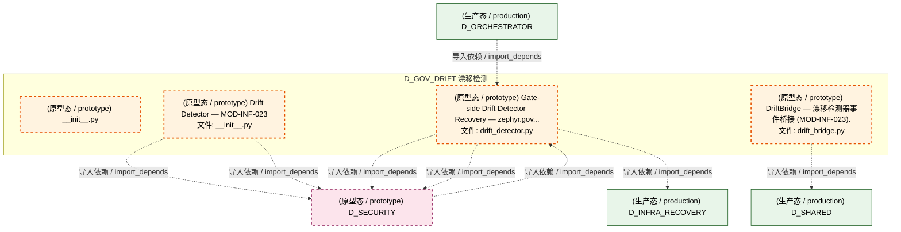
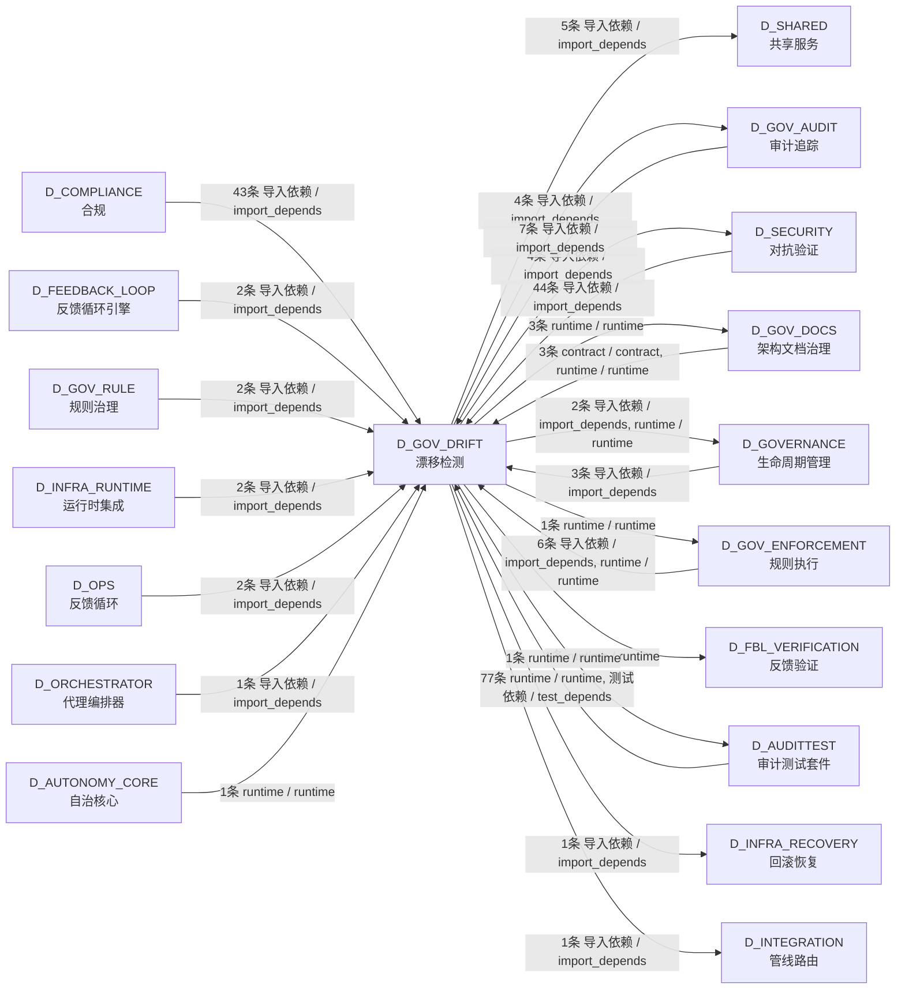

# 39_d_gov_drift / drift_detection / 漂移检测 / Drift Detection

> **功能简介 / Overview**: 漂移检测，负责架构漂移检测和漂移告警

> **文档作用 / Purpose**: 展示 漂移检测（D_GOV_DRIFT）功能域的模块清单、域内依赖关系、跨域依赖关系、架构分层视图，供架构审查和域治理参考。

> 本文档由 generate_domain_doc.py 从 depgraph (PostgreSQL) 自动生成
> 最后更新: 2026-07-13 04:28:14
> 数据源: depgraph (PostgreSQL) nodes表 + edges表

## 域基本信息 / Domain Overview

| 字段 | 值 | Field | Value |
|------|------|-------|-------|
| 编号 | 39 | Number | 39 |
| 域ID | D_GOV_DRIFT | Domain ID | D_GOV_DRIFT |
| 域名称 | 漂移检测 | Domain Name | Drift Detection |
| 层级 | L2 业务域层 | Layer | L2 Domain |
| 模块数 | 71 | Module Count | 71 |
| 域内依赖 | 10 | Internal Dependencies | 10 |
| 跨域入边 | 193 | Cross-domain Incoming | 193 |
| 跨域出边 | 23 | Cross-domain Outgoing | 23 |
| 设计态模块 | 1 | Design Modules | 1 |
| 原型态模块 | 4 | Prototype Modules | 4 |
| 生产态模块 | 66 | Production Modules | 66 |
| 容量 | 66/150 (正常) | Capacity | 66/150 (正常) |
| 描述 | 39个漂移检测器注册与调度 | Description | 39个漂移检测器注册与调度 |

## 模块分层清单 / Module Layered List

> 按 architecture_layer 分组的模块清单（共 71 个模块 / 71 modules）。

### L1 基础层 / Foundation Layer (1 modules)

| # | 模块路径 / Module Path | 模块名称 / Module Name (功能简介 / Description) | 成熟度 / Maturity | 蓝图 / Blueprint |
|:--:|---------|---------|:---:|:---:|
| 1 | docs/03_modules/_domain_governance/drift_detector/bluepri... | docs__03_modules___domain_governance__drift_detector__blueprint_md | 设计态 / design | [MOD-INF-023](../../03_modules/_domain_governance/drift_detector/blueprint.md) |

### L2 领域层 / Domain Layer (70 modules)

| # | 模块路径 / Module Path | 模块名称 / Module Name (功能简介 / Description) | 成熟度 / Maturity | 蓝图 / Blueprint |
|:--:|---------|---------|:---:|:---:|
| 1 | scripts/governance/d11_compliance/validate_blueprint_over... | validate_blueprint_overlap.py | 生产态 / production |  |
| 2 | scripts/governance/d11_compliance/validate_truth_source_c... | validate_truth_source_cascade.py | 生产态 / production |  |
| 3 | scripts/governance/d5_architecture/validators/validate_au... | validate_authority_registry.py | 生产态 / production |  |
| 4 | scripts/governance/d5_architecture/validators/validate_ss... | validate_ssot.py | 生产态 / production |  |
| 5 | src/zephyr/gov_audit/drift_bridge.py | drift_bridge.py | 生产态 / production | [MOD-INF-020](../../03_modules/_domain_governance/audit_trail/blueprint.md) |
| 6 | src/zephyr/gov_audit/self_monitor.py | self_monitor.py | 生产态 / production | [MOD-INF-020](../../03_modules/_domain_governance/audit_trail/blueprint.md) |
| 7 | src/zephyr/gov_drift/__init__.py | __init__.py | 原型态 / prototype |  |
| 8 | src/zephyr/gov_drift/absence_manager.py | absence_manager.py | 生产态 / production |  |
| 9 | src/zephyr/gov_drift/ai_construction_detectors.py | ai_construction_detectors.py | 生产态 / production |  |
| 10 | src/zephyr/gov_drift/ai_context_injector.py | ai_context_injector.py | 生产态 / production |  |
| 11 | src/zephyr/gov_drift/artifact_scanner.py | ArtifactScanner — SSRF / Path Traversal / Cred... | 生产态 / production | [MOD-L10-001](../../03_modules/_domain_compliance/blueprint.md) |
| 12 | src/zephyr/gov_drift/autonomy_regressor.py | Autonomy Regressor — v0.10.0 渐进自治可逆性管... | 生产态 / production | [MOD-INF-022](../../03_modules/_domain_autonomy_perm/escalation_protocol/blueprint.md) |
| 13 | src/zephyr/gov_drift/backcompat_checker.py | backcompat_checker.py | 生产态 / production |  |
| 14 | src/zephyr/gov_drift/baseline_manager.py | baseline_manager.py | 生产态 / production |  |
| 15 | src/zephyr/gov_drift/baseline_poisoning_guard.py | baseline_poisoning_guard.py | 生产态 / production |  |
| 16 | src/zephyr/gov_drift/bootstrapping_calibrator.py | bootstrapping_calibrator.py | 生产态 / production | [MOD-INF-024](../../03_modules/_domain_autonomy_perm/budget_enforcer/blueprint.md) |
| 17 | src/zephyr/gov_drift/brain_integration.py | brain_integration.py | 生产态 / production |  |
| 18 | src/zephyr/gov_drift/canary_controller.py | canary_controller.py | 生产态 / production |  |
| 19 | src/zephyr/gov_drift/cascade_detector.py | cascade_detector.py | 生产态 / production |  |
| 20 | src/zephyr/gov_drift/chaos_injector.py | chaos_injector.py | 生产态 / production |  |
| 21 | src/zephyr/gov_drift/config_consistency.py | config_consistency.py | 生产态 / production |  |
| 22 | src/zephyr/gov_drift/contract_drift_detector.py | contract_drift_detector.py | 生产态 / production |  |
| 23 | src/zephyr/gov_drift/correlation_engine.py | correlation_engine.py | 生产态 / production |  |
| 24 | src/zephyr/gov_drift/credibility_engine.py | credibility_engine.py | 生产态 / production |  |
| 25 | src/zephyr/gov_drift/cross_module_score.py | cross_module_score.py | 生产态 / production |  |
| 26 | src/zephyr/gov_drift/dashboard.py | dashboard.py | 生产态 / production |  |
| 27 | src/zephyr/gov_drift/detector_dispatcher.py | detector_dispatcher.py | 生产态 / production |  |
| 28 | src/zephyr/gov_drift/drift_detector.py | Drift Detector — 兼容别名，SSoT已迁移至 zephyr... | 生产态 / production | [MOD-INF-022](../../03_modules/_domain_autonomy_perm/escalation_protocol/blueprint.md) |
| 29 | src/zephyr/gov_drift/drift_engine.py | drift_engine.py | 生产态 / production |  |
| 30 | src/zephyr/gov_drift/drift_hotfix_bypass.py | drift_hotfix_bypass.py | 生产态 / production |  |
| 31 | src/zephyr/gov_drift/drift_infrastructure.py | drift_infrastructure.py | 生产态 / production |  |
| 32 | src/zephyr/gov_drift/drift_models.py | drift_models.py | 生产态 / production |  |
| 33 | src/zephyr/gov_drift/drift_result_types.py | drift_result_types.py | 生产态 / production |  |
| 34 | src/zephyr/gov_drift/drift_training.py | drift_training.py | 生产态 / production |  |
| 35 | src/zephyr/gov_drift/file_attr_checker.py | file_attr_checker.py | 生产态 / production |  |
| 36 | src/zephyr/gov_drift/forensics_engine.py | forensics_engine.py | 生产态 / production |  |
| 37 | src/zephyr/gov_drift/gate_persistence.py | gate_persistence.py | 生产态 / production |  |
| 38 | src/zephyr/gov_drift/git_bisector.py | git_bisector.py | 生产态 / production |  |
| 39 | src/zephyr/gov_drift/gitignore_auditor.py | gitignore_auditor.py | 生产态 / production |  |
| 40 | src/zephyr/gov_drift/handoff_manager.py | handoff_manager.py | 生产态 / production |  |
| 41 | src/zephyr/gov_drift/headless_scanner.py | headless_scanner.py | 生产态 / production |  |
| 42 | src/zephyr/gov_drift/incremental_scanner.py | incremental_scanner.py | 生产态 / production |  |
| 43 | src/zephyr/gov_drift/migration_plan.yaml | migration_plan.yaml | 生产态 / production | [MOD-INF-011](../../03_modules/_domain_knowledge/vector_memory/blueprint.md) |
| 44 | src/zephyr/gov_drift/naming_magic_checker.py | naming_magic_checker.py | 生产态 / production |  |
| 45 | src/zephyr/gov_drift/orphan_scanner.py | orphan_scanner.py | 生产态 / production |  |
| 46 | src/zephyr/gov_drift/python_compat.py | python_compat.py | 生产态 / production |  |
| 47 | src/zephyr/gov_drift/resource_guard.py | resource_guard.py | 生产态 / production |  |
| 48 | src/zephyr/gov_drift/reward_hacking_rebound_detector.py | Reward Hacking Rebound Detector — v0.14.0 §2.37-D. | 生产态 / production | [MOD-INF-022](../../03_modules/_domain_autonomy_perm/escalation_protocol/blueprint.md) |
| 49 | src/zephyr/gov_drift/roi_engine.py | roi_engine.py | 生产态 / production |  |
| 50 | src/zephyr/gov_drift/rollback_bridge.py | rollback_bridge.py | 生产态 / production |  |
| 51 | src/zephyr/gov_drift/scan_mutex.py | scan_mutex.py | 生产态 / production |  |
| 52 | src/zephyr/gov_drift/self_check.py | self_check.py | 生产态 / production |  |
| 53 | src/zephyr/gov_drift/self_test_verifier.py | self_test_verifier.py | 生产态 / production |  |
| 54 | src/zephyr/gov_drift/silence_detector.py | Silence Detector — v0.8.0 静默窗口检测器: agen... | 生产态 / production | [MOD-INF-022](../../03_modules/_domain_autonomy_perm/escalation_protocol/blueprint.md) |
| 55 | src/zephyr/gov_drift/spiral_ews.py | spiral_ews.py | 生产态 / production | [MOD-INF-024](../../03_modules/_domain_autonomy_perm/budget_enforcer/blueprint.md) |
| 56 | src/zephyr/gov_drift/suppression_learner.py | suppression_learner.py | 生产态 / production |  |
| 57 | src/zephyr/gov_drift/symlink_checker.py | symlink_checker.py | 生产态 / production |  |
| 58 | src/zephyr/gov_drift/tamper_proof_audit.py | tamper_proof_audit.py | 生产态 / production |  |
| 59 | src/zephyr/gov_drift/test_fixture_checker.py | test_fixture_checker.py | 生产态 / production |  |
| 60 | src/zephyr/gov_drift/trend_analyzer.py | trend_analyzer.py | 生产态 / production |  |
| 61 | src/zephyr/gov_drift/vigil_runtime.py | Vigil Runtime — v0.6.0 VIGIL维护运行时: 运维to... | 生产态 / production | [MOD-INF-022](../../03_modules/_domain_autonomy_perm/escalation_protocol/blueprint.md) |
| 62 | src/zephyr/gov_enforcement/rule_enforcement/breaking_chan... | Breaking Change 检测器（GATE-CDC-2）——字段删... | 生产态 / production | [MOD-GATE_ENGINE](../../03_modules/_cross_layer/gate_engine/blueprint.md) |
| 63 | src/zephyr/gov_enforcement/rule_enforcement/drift_detecto... | Gate-side Drift Detector Recovery — zephyr.gov... | 原型态 / prototype | [MOD-GATE_ENGINE](../../03_modules/_cross_layer/gate_engine/blueprint.md) |
| 64 | src/zephyr/gov_enforcement/rule_enforcement/gate_engine/g... | 门禁健康仪表板——per-gate SLI 报告、误报率、延... | 生产态 / production | [MOD-GATE_ENGINE](../../03_modules/_cross_layer/gate_engine/blueprint.md) |
| 65 | src/zephyr/gov_enforcement/rule_enforcement/gate_engine/g... | 门禁引擎完整性守卫——自检SHA-256校验+trust roo... | 生产态 / production | [MOD-GATE_ENGINE](../../03_modules/_cross_layer/gate_engine/blueprint.md) |
| 66 | src/zephyr/gov_enforcement/rule_enforcement/invariants/en... | EN-002 — Enforcement Mode Validator | 生产态 / production | [MOD-GATE_ENGINE](../../03_modules/_cross_layer/gate_engine/blueprint.md) |
| 67 | src/zephyr/gov_enforcement/rule_enforcement/truth_source_... | 真源优先级裁决器（Truth Source Validator） | 生产态 / production | [MOD-GATE_ENGINE](../../03_modules/_cross_layer/gate_engine/blueprint.md) |
| 68 | src/zephyr/governance/drift_detector_core/bridges/__init_... | Drift Detector — MOD-INF-023 | 原型态 / prototype | [MOD-INF-023](../../03_modules/_domain_governance/drift_detector/blueprint.md) |
| 69 | src/zephyr/governance/drift_detector_core/bridges/drift_b... | DriftBridge — 漂移检测器事件桥接 (MOD-INF-023). | 原型态 / prototype | [MOD-INF-023](../../03_modules/_domain_governance/drift_detector/blueprint.md) |
| 70 | src/zephyr/governance/integrity.py | integrity.py | 生产态 / production | [MOD-INF-020](../../03_modules/_domain_governance/audit_trail/blueprint.md) |

## 域内依赖图 / Internal Dependency Diagram

> 依赖图内嵌在本文档中，IDE 可直接渲染显示。参考 decision_index.md 设计，分四个视图：合并全景图、运营态子图、设计态子图、原型态子图（按 design_maturity 实际值拆分）。
>
> **图例说明 / Legend**：
> - **实线边框 = 运营态模块**（production，已上线运行）
> - **虚线边框 = 设计态模块**（design，蓝图阶段，代码未写）
> - **虚线边框 = 原型态模块**（prototype，代码已写，验证中未稳定上线）
> - **实线箭头 = 运营态依赖**（已生效的依赖关系）
> - **虚线箭头 = 非运营态依赖**（计划中/验证中的依赖关系）

### 合并全景图（全部模块，标签标注成熟度）

> 展示全部 71 个模块（生产态 66 + 设计态 1 + 原型态 4），标签标注成熟度。

#### 第 1 页 / 共 3 页

```mermaid
graph TD
    subgraph D_GOV_DRIFT["D_GOV_DRIFT 漂移检测"]
        docs_03_modules_domain_governance_drift_detector_blueprint_md["(设计态 / design) docs__03_modules___domain_governance__drift_detector__blueprint_md"]
        scripts_governance_d11_compliance_validate_blueprint_overlap_py["(生产态 / production) validate_blueprint_overlap.py"]
        scripts_governance_d11_compliance_validate_truth_source_cascade_py["(生产态 / production) validate_truth_source_cascade.py"]
        scripts_governance_d5_architecture_validators_validate_authority_registry_py["(生产态 / production) validate_authority_registry.py"]
        scripts_governance_d5_architecture_validators_validate_ssot_py["(生产态 / production) validate_ssot.py"]
        src_zephyr_gov_audit_drift_bridge_py["(生产态 / production) drift_bridge.py"]
        src_zephyr_gov_audit_self_monitor_py["(生产态 / production) self_monitor.py"]
        src_zephyr_gov_drift_init_py["(原型态 / prototype) __init__.py"]
        src_zephyr_gov_drift_absence_manager_py["(生产态 / production) absence_manager.py"]
        src_zephyr_gov_drift_ai_construction_detectors_py["(生产态 / production) ai_construction_detectors.py"]
        src_zephyr_gov_drift_ai_context_injector_py["(生产态 / production) ai_context_injector.py"]
        src_zephyr_gov_drift_artifact_scanner_py["(生产态 / production) ArtifactScanner — SSRF / Path Traversal / Cred...<br/>文件: artifact_scanner.py"]
        src_zephyr_gov_drift_autonomy_regressor_py["(生产态 / production) Autonomy Regressor — v0.10.0 渐进自治可逆性管...<br/>文件: autonomy_regressor.py"]
        src_zephyr_gov_drift_backcompat_checker_py["(生产态 / production) backcompat_checker.py"]
        src_zephyr_gov_drift_baseline_manager_py["(生产态 / production) baseline_manager.py"]
        src_zephyr_gov_drift_baseline_poisoning_guard_py["(生产态 / production) baseline_poisoning_guard.py"]
        src_zephyr_gov_drift_bootstrapping_calibrator_py["(生产态 / production) bootstrapping_calibrator.py"]
        src_zephyr_gov_drift_brain_integration_py["(生产态 / production) brain_integration.py"]
        src_zephyr_gov_drift_canary_controller_py["(生产态 / production) canary_controller.py"]
        src_zephyr_gov_drift_cascade_detector_py["(生产态 / production) cascade_detector.py"]
        src_zephyr_gov_drift_chaos_injector_py["(生产态 / production) chaos_injector.py"]
        src_zephyr_gov_drift_config_consistency_py["(生产态 / production) config_consistency.py"]
        src_zephyr_gov_drift_contract_drift_detector_py["(生产态 / production) contract_drift_detector.py"]
        src_zephyr_gov_drift_correlation_engine_py["(生产态 / production) correlation_engine.py"]
        src_zephyr_gov_drift_credibility_engine_py["(生产态 / production) credibility_engine.py"]
        src_zephyr_gov_drift_cross_module_score_py["(生产态 / production) cross_module_score.py"]
        src_zephyr_gov_drift_dashboard_py["(生产态 / production) dashboard.py"]
        src_zephyr_gov_drift_detector_dispatcher_py["(生产态 / production) detector_dispatcher.py"]
        src_zephyr_gov_drift_drift_detector_py["(生产态 / production) Drift Detector — 兼容别名，SSoT已迁移至 zephyr...<br/>文件: drift_detector.py"]
        src_zephyr_gov_drift_drift_engine_py["(生产态 / production) drift_engine.py"]
    end
    src_zephyr_gov_audit_drift_bridge_py -->|导入依赖 / import_depends| src_zephyr_gov_drift_drift_detector_py
    src_zephyr_gov_audit_self_monitor_py -->|导入依赖 / import_depends| src_zephyr_gov_audit_drift_bridge_py
    src_zephyr_gov_drift_init_py -.->|config_depends / config_depends| src_zephyr_gov_drift_absence_manager_py
    D_GOV_DOCS["(设计态 / design) D_GOV_DOCS"]
    docs_03_modules_domain_governance_drift_detector_blueprint_md -.->|runtime / runtime| D_GOV_DOCS
    docs_03_modules_domain_governance_drift_detector_blueprint_md -.->|runtime / runtime| D_GOV_DOCS
    D_FBL_VERIFICATION["(原型态 / prototype) D_FBL_VERIFICATION"]
    docs_03_modules_domain_governance_drift_detector_blueprint_md -.->|runtime / runtime| D_FBL_VERIFICATION
    D_AUDITTEST["(原型态 / prototype) D_AUDITTEST"]
    docs_03_modules_domain_governance_drift_detector_blueprint_md -.->|runtime / runtime| D_AUDITTEST
    D_GOV_ENFORCEMENT["(原型态 / prototype) D_GOV_ENFORCEMENT"]
    docs_03_modules_domain_governance_drift_detector_blueprint_md -.->|runtime / runtime| D_GOV_ENFORCEMENT
    D_GOVERNANCE["(原型态 / prototype) D_GOVERNANCE"]
    docs_03_modules_domain_governance_drift_detector_blueprint_md -.->|runtime / runtime| D_GOVERNANCE
    docs_03_modules_domain_governance_drift_detector_blueprint_md -.->|runtime / runtime| D_GOV_DOCS
    D_SHARED["(生产态 / production) D_SHARED"]
    src_zephyr_gov_audit_self_monitor_py -->|导入依赖 / import_depends| D_SHARED
    src_zephyr_gov_drift_drift_detector_py -->|导入依赖 / import_depends| D_SHARED
    scripts_governance_d5_architecture_validators_validate_ssot_py -->|导入依赖 / import_depends| D_GOVERNANCE
    D_GOV_ENFORCEMENT -.->|runtime / runtime| docs_03_modules_domain_governance_drift_detector_blueprint_md
    D_GOV_DOCS -.->|runtime / runtime| docs_03_modules_domain_governance_drift_detector_blueprint_md
    D_GOV_DOCS -.->|runtime / runtime| docs_03_modules_domain_governance_drift_detector_blueprint_md
    D_GOV_DOCS -.->|contract / contract| docs_03_modules_domain_governance_drift_detector_blueprint_md
    D_AUTONOMY_CORE["(原型态 / prototype) D_AUTONOMY_CORE"]
    D_AUTONOMY_CORE -.->|runtime / runtime| docs_03_modules_domain_governance_drift_detector_blueprint_md
    D_AUDITTEST -.->|runtime / runtime| docs_03_modules_domain_governance_drift_detector_blueprint_md
    D_GOV_ENFORCEMENT -.->|导入依赖 / import_depends| src_zephyr_gov_drift_artifact_scanner_py
    D_COMPLIANCE["(原型态 / prototype) D_COMPLIANCE"]
    D_COMPLIANCE -.->|导入依赖 / import_depends| src_zephyr_gov_drift_absence_manager_py
    D_COMPLIANCE -.->|导入依赖 / import_depends| src_zephyr_gov_drift_ai_construction_detectors_py
    D_COMPLIANCE -.->|导入依赖 / import_depends| src_zephyr_gov_drift_ai_context_injector_py
    D_COMPLIANCE -.->|导入依赖 / import_depends| src_zephyr_gov_drift_backcompat_checker_py
    D_COMPLIANCE -.->|导入依赖 / import_depends| src_zephyr_gov_drift_baseline_manager_py
    D_COMPLIANCE -.->|导入依赖 / import_depends| src_zephyr_gov_drift_baseline_poisoning_guard_py
    D_COMPLIANCE -.->|导入依赖 / import_depends| src_zephyr_gov_drift_canary_controller_py
    D_COMPLIANCE -.->|导入依赖 / import_depends| src_zephyr_gov_drift_cascade_detector_py
    classDef production fill:#e1f5fe,stroke:#01579b,stroke-width:2px,color:#000
    classDef design fill:#fff3e0,stroke:#e65100,stroke-width:2px,color:#000,stroke-dasharray: 5 5
    classDef external_prod fill:#e8f5e9,stroke:#1b5e20,stroke-width:1px,color:#000
    classDef external_design fill:#fce4ec,stroke:#880e4f,stroke-width:1px,color:#000,stroke-dasharray: 5 5
    class scripts_governance_d11_compliance_validate_blueprint_overlap_py,scripts_governance_d11_compliance_validate_truth_source_cascade_py,scripts_governance_d5_architecture_validators_validate_authority_registry_py,scripts_governance_d5_architecture_validators_validate_ssot_py,src_zephyr_gov_audit_drift_bridge_py,src_zephyr_gov_audit_self_monitor_py,src_zephyr_gov_drift_absence_manager_py,src_zephyr_gov_drift_ai_construction_detectors_py,src_zephyr_gov_drift_ai_context_injector_py,src_zephyr_gov_drift_artifact_scanner_py,src_zephyr_gov_drift_autonomy_regressor_py,src_zephyr_gov_drift_backcompat_checker_py,src_zephyr_gov_drift_baseline_manager_py,src_zephyr_gov_drift_baseline_poisoning_guard_py,src_zephyr_gov_drift_bootstrapping_calibrator_py,src_zephyr_gov_drift_brain_integration_py,src_zephyr_gov_drift_canary_controller_py,src_zephyr_gov_drift_cascade_detector_py,src_zephyr_gov_drift_chaos_injector_py,src_zephyr_gov_drift_config_consistency_py,src_zephyr_gov_drift_contract_drift_detector_py,src_zephyr_gov_drift_correlation_engine_py,src_zephyr_gov_drift_credibility_engine_py,src_zephyr_gov_drift_cross_module_score_py,src_zephyr_gov_drift_dashboard_py,src_zephyr_gov_drift_detector_dispatcher_py,src_zephyr_gov_drift_drift_detector_py,src_zephyr_gov_drift_drift_engine_py production
    class docs_03_modules_domain_governance_drift_detector_blueprint_md,src_zephyr_gov_drift_init_py design
    class D_SHARED external_prod
    class D_GOV_DOCS,D_FBL_VERIFICATION,D_AUDITTEST,D_GOV_ENFORCEMENT,D_GOVERNANCE,D_AUTONOMY_CORE,D_COMPLIANCE external_design
```

#### 第 2 页 / 共 3 页

```mermaid
graph TD
    subgraph D_GOV_DRIFT["D_GOV_DRIFT 漂移检测"]
        src_zephyr_gov_drift_drift_hotfix_bypass_py["(生产态 / production) drift_hotfix_bypass.py"]
        src_zephyr_gov_drift_drift_infrastructure_py["(生产态 / production) drift_infrastructure.py"]
        src_zephyr_gov_drift_drift_models_py["(生产态 / production) drift_models.py"]
        src_zephyr_gov_drift_drift_result_types_py["(生产态 / production) drift_result_types.py"]
        src_zephyr_gov_drift_drift_training_py["(生产态 / production) drift_training.py"]
        src_zephyr_gov_drift_file_attr_checker_py["(生产态 / production) file_attr_checker.py"]
        src_zephyr_gov_drift_forensics_engine_py["(生产态 / production) forensics_engine.py"]
        src_zephyr_gov_drift_gate_persistence_py["(生产态 / production) gate_persistence.py"]
        src_zephyr_gov_drift_git_bisector_py["(生产态 / production) git_bisector.py"]
        src_zephyr_gov_drift_gitignore_auditor_py["(生产态 / production) gitignore_auditor.py"]
        src_zephyr_gov_drift_handoff_manager_py["(生产态 / production) handoff_manager.py"]
        src_zephyr_gov_drift_headless_scanner_py["(生产态 / production) headless_scanner.py"]
        src_zephyr_gov_drift_incremental_scanner_py["(生产态 / production) incremental_scanner.py"]
        src_zephyr_gov_drift_migration_plan_yaml["(生产态 / production) migration_plan.yaml"]
        src_zephyr_gov_drift_naming_magic_checker_py["(生产态 / production) naming_magic_checker.py"]
        src_zephyr_gov_drift_orphan_scanner_py["(生产态 / production) orphan_scanner.py"]
        src_zephyr_gov_drift_python_compat_py["(生产态 / production) python_compat.py"]
        src_zephyr_gov_drift_resource_guard_py["(生产态 / production) resource_guard.py"]
        src_zephyr_gov_drift_reward_hacking_rebound_detector_py["(生产态 / production) Reward Hacking Rebound Detector — v0.14.0 §2.37-D.<br/>文件: reward_hacking_rebound_detector.py"]
        src_zephyr_gov_drift_roi_engine_py["(生产态 / production) roi_engine.py"]
        src_zephyr_gov_drift_rollback_bridge_py["(生产态 / production) rollback_bridge.py"]
        src_zephyr_gov_drift_scan_mutex_py["(生产态 / production) scan_mutex.py"]
        src_zephyr_gov_drift_self_check_py["(生产态 / production) self_check.py"]
        src_zephyr_gov_drift_self_test_verifier_py["(生产态 / production) self_test_verifier.py"]
        src_zephyr_gov_drift_silence_detector_py["(生产态 / production) Silence Detector — v0.8.0 静默窗口检测器: agen...<br/>文件: silence_detector.py"]
        src_zephyr_gov_drift_spiral_ews_py["(生产态 / production) spiral_ews.py"]
        src_zephyr_gov_drift_suppression_learner_py["(生产态 / production) suppression_learner.py"]
        src_zephyr_gov_drift_symlink_checker_py["(生产态 / production) symlink_checker.py"]
        src_zephyr_gov_drift_tamper_proof_audit_py["(生产态 / production) tamper_proof_audit.py"]
        src_zephyr_gov_drift_test_fixture_checker_py["(生产态 / production) test_fixture_checker.py"]
    end
    D_COMPLIANCE["(原型态 / prototype) D_COMPLIANCE"]
    D_COMPLIANCE -.->|导入依赖 / import_depends| src_zephyr_gov_drift_drift_hotfix_bypass_py
    D_COMPLIANCE -.->|导入依赖 / import_depends| src_zephyr_gov_drift_drift_infrastructure_py
    D_COMPLIANCE -.->|导入依赖 / import_depends| src_zephyr_gov_drift_drift_models_py
    D_COMPLIANCE -.->|导入依赖 / import_depends| src_zephyr_gov_drift_drift_result_types_py
    D_COMPLIANCE -.->|导入依赖 / import_depends| src_zephyr_gov_drift_drift_training_py
    D_COMPLIANCE -.->|导入依赖 / import_depends| src_zephyr_gov_drift_file_attr_checker_py
    D_COMPLIANCE -.->|导入依赖 / import_depends| src_zephyr_gov_drift_forensics_engine_py
    D_COMPLIANCE -.->|导入依赖 / import_depends| src_zephyr_gov_drift_gate_persistence_py
    D_COMPLIANCE -.->|导入依赖 / import_depends| src_zephyr_gov_drift_git_bisector_py
    D_COMPLIANCE -.->|导入依赖 / import_depends| src_zephyr_gov_drift_gitignore_auditor_py
    D_COMPLIANCE -.->|导入依赖 / import_depends| src_zephyr_gov_drift_handoff_manager_py
    D_COMPLIANCE -.->|导入依赖 / import_depends| src_zephyr_gov_drift_headless_scanner_py
    D_COMPLIANCE -.->|导入依赖 / import_depends| src_zephyr_gov_drift_incremental_scanner_py
    D_COMPLIANCE -.->|导入依赖 / import_depends| src_zephyr_gov_drift_naming_magic_checker_py
    D_COMPLIANCE -.->|导入依赖 / import_depends| src_zephyr_gov_drift_orphan_scanner_py
    classDef production fill:#e1f5fe,stroke:#01579b,stroke-width:2px,color:#000
    classDef design fill:#fff3e0,stroke:#e65100,stroke-width:2px,color:#000,stroke-dasharray: 5 5
    classDef external_prod fill:#e8f5e9,stroke:#1b5e20,stroke-width:1px,color:#000
    classDef external_design fill:#fce4ec,stroke:#880e4f,stroke-width:1px,color:#000,stroke-dasharray: 5 5
    class src_zephyr_gov_drift_drift_hotfix_bypass_py,src_zephyr_gov_drift_drift_infrastructure_py,src_zephyr_gov_drift_drift_models_py,src_zephyr_gov_drift_drift_result_types_py,src_zephyr_gov_drift_drift_training_py,src_zephyr_gov_drift_file_attr_checker_py,src_zephyr_gov_drift_forensics_engine_py,src_zephyr_gov_drift_gate_persistence_py,src_zephyr_gov_drift_git_bisector_py,src_zephyr_gov_drift_gitignore_auditor_py,src_zephyr_gov_drift_handoff_manager_py,src_zephyr_gov_drift_headless_scanner_py,src_zephyr_gov_drift_incremental_scanner_py,src_zephyr_gov_drift_migration_plan_yaml,src_zephyr_gov_drift_naming_magic_checker_py,src_zephyr_gov_drift_orphan_scanner_py,src_zephyr_gov_drift_python_compat_py,src_zephyr_gov_drift_resource_guard_py,src_zephyr_gov_drift_reward_hacking_rebound_detector_py,src_zephyr_gov_drift_roi_engine_py,src_zephyr_gov_drift_rollback_bridge_py,src_zephyr_gov_drift_scan_mutex_py,src_zephyr_gov_drift_self_check_py,src_zephyr_gov_drift_self_test_verifier_py,src_zephyr_gov_drift_silence_detector_py,src_zephyr_gov_drift_spiral_ews_py,src_zephyr_gov_drift_suppression_learner_py,src_zephyr_gov_drift_symlink_checker_py,src_zephyr_gov_drift_tamper_proof_audit_py,src_zephyr_gov_drift_test_fixture_checker_py production
    class D_COMPLIANCE external_design
```

#### 第 3 页 / 共 3 页

```mermaid
graph TD
    subgraph D_GOV_DRIFT["D_GOV_DRIFT 漂移检测"]
        src_zephyr_gov_drift_trend_analyzer_py["(生产态 / production) trend_analyzer.py"]
        src_zephyr_gov_drift_vigil_runtime_py["(生产态 / production) Vigil Runtime — v0.6.0 VIGIL维护运行时: 运维to...<br/>文件: vigil_runtime.py"]
        src_zephyr_gov_enforcement_rule_enforcement_breaking_change_detector_py["(生产态 / production) Breaking Change 检测器（GATE-CDC-2）——字段删...<br/>文件: breaking_change_detector.py"]
        src_zephyr_gov_enforcement_rule_enforcement_drift_detector_py["(原型态 / prototype) Gate-side Drift Detector Recovery — zephyr.gov...<br/>文件: drift_detector.py"]
        src_zephyr_gov_enforcement_rule_enforcement_gate_engine_gate_health_py["(生产态 / production) 门禁健康仪表板——per-gate SLI 报告、误报率、延...<br/>文件: gate_health.py"]
        src_zephyr_gov_enforcement_rule_enforcement_gate_engine_gate_integrity_guard_py["(生产态 / production) 门禁引擎完整性守卫——自检SHA-256校验+trust roo...<br/>文件: gate_integrity_guard.py"]
        src_zephyr_gov_enforcement_rule_enforcement_invariants_en_002_enforcement_validator_py["(生产态 / production) EN-002 — Enforcement Mode Validator<br/>文件: en_002_enforcement_validator.py"]
        src_zephyr_gov_enforcement_rule_enforcement_truth_source_validator_py["(生产态 / production) 真源优先级裁决器（Truth Source Validator）<br/>文件: truth_source_validator.py"]
        src_zephyr_governance_drift_detector_core_bridges_init_py["(原型态 / prototype) Drift Detector — MOD-INF-023<br/>文件: __init__.py"]
        src_zephyr_governance_drift_detector_core_bridges_drift_bridge_py["(原型态 / prototype) DriftBridge — 漂移检测器事件桥接 (MOD-INF-023).<br/>文件: drift_bridge.py"]
        src_zephyr_governance_integrity_py["(生产态 / production) integrity.py"]
    end
    D_GOV_AUDIT["(生产态 / production) D_GOV_AUDIT"]
    src_zephyr_governance_integrity_py -->|导入依赖 / import_depends| D_GOV_AUDIT
    src_zephyr_governance_integrity_py -->|导入依赖 / import_depends| D_GOV_AUDIT
    src_zephyr_governance_integrity_py -.->|导入依赖 / import_depends| D_GOV_AUDIT
    D_SHARED["(生产态 / production) D_SHARED"]
    src_zephyr_governance_drift_detector_core_bridges_drift_bridge_py -.->|导入依赖 / import_depends| D_SHARED
    D_SECURITY["(原型态 / prototype) D_SECURITY"]
    src_zephyr_governance_drift_detector_core_bridges_init_py -.->|导入依赖 / import_depends| D_SECURITY
    src_zephyr_governance_drift_detector_core_bridges_init_py -.->|导入依赖 / import_depends| D_SECURITY
    src_zephyr_gov_enforcement_rule_enforcement_drift_detector_py -.->|导入依赖 / import_depends| D_SECURITY
    D_INFRA_RECOVERY["(生产态 / production) D_INFRA_RECOVERY"]
    src_zephyr_gov_enforcement_rule_enforcement_drift_detector_py -.->|导入依赖 / import_depends| D_INFRA_RECOVERY
    src_zephyr_gov_enforcement_rule_enforcement_drift_detector_py -.->|导入依赖 / import_depends| D_SECURITY
    src_zephyr_gov_enforcement_rule_enforcement_truth_source_validator_py -->|导入依赖 / import_depends| D_GOV_AUDIT
    src_zephyr_gov_enforcement_rule_enforcement_truth_source_validator_py -.->|导入依赖 / import_depends| D_SHARED
    D_INTEGRATION["(生产态 / production) D_INTEGRATION"]
    src_zephyr_gov_enforcement_rule_enforcement_invariants_en_002_enforcement_validator_py -->|导入依赖 / import_depends| D_INTEGRATION
    src_zephyr_gov_enforcement_rule_enforcement_invariants_en_002_enforcement_validator_py -->|导入依赖 / import_depends| D_SHARED
    D_GOV_ENFORCEMENT["(原型态 / prototype) D_GOV_ENFORCEMENT"]
    D_GOV_ENFORCEMENT -.->|导入依赖 / import_depends| src_zephyr_governance_integrity_py
    D_COMPLIANCE["(原型态 / prototype) D_COMPLIANCE"]
    D_COMPLIANCE -.->|导入依赖 / import_depends| src_zephyr_gov_drift_trend_analyzer_py
    D_FEEDBACK_LOOP["(生产态 / production) D_FEEDBACK_LOOP"]
    D_FEEDBACK_LOOP -->|导入依赖 / import_depends| src_zephyr_governance_integrity_py
    D_GOV_AUDIT -->|导入依赖 / import_depends| src_zephyr_governance_integrity_py
    D_GOV_AUDIT -->|导入依赖 / import_depends| src_zephyr_governance_integrity_py
    D_SECURITY -.->|导入依赖 / import_depends| src_zephyr_gov_drift_trend_analyzer_py
    D_GOV_ENFORCEMENT -->|导入依赖 / import_depends| src_zephyr_gov_enforcement_rule_enforcement_breaking_change_detector_py
    D_GOV_ENFORCEMENT -->|导入依赖 / import_depends| src_zephyr_gov_enforcement_rule_enforcement_gate_engine_gate_health_py
    D_GOV_ENFORCEMENT -->|导入依赖 / import_depends| src_zephyr_gov_enforcement_rule_enforcement_gate_engine_gate_integrity_guard_py
    D_GOV_RULE["(生产态 / production) D_GOV_RULE"]
    D_GOV_RULE -->|导入依赖 / import_depends| src_zephyr_gov_enforcement_rule_enforcement_invariants_en_002_enforcement_validator_py
    D_ORCHESTRATOR["(生产态 / production) D_ORCHESTRATOR"]
    D_ORCHESTRATOR -.->|导入依赖 / import_depends| src_zephyr_gov_enforcement_rule_enforcement_drift_detector_py
    D_SECURITY -.->|导入依赖 / import_depends| src_zephyr_gov_enforcement_rule_enforcement_drift_detector_py
    D_AUDITTEST["(原型态 / prototype) D_AUDITTEST"]
    D_AUDITTEST -.->|测试依赖 / test_depends| src_zephyr_governance_integrity_py
    D_AUDITTEST -.->|测试依赖 / test_depends| src_zephyr_gov_drift_trend_analyzer_py
    D_AUDITTEST -.->|测试依赖 / test_depends| src_zephyr_gov_enforcement_rule_enforcement_gate_engine_gate_integrity_guard_py
    classDef production fill:#e1f5fe,stroke:#01579b,stroke-width:2px,color:#000
    classDef design fill:#fff3e0,stroke:#e65100,stroke-width:2px,color:#000,stroke-dasharray: 5 5
    classDef external_prod fill:#e8f5e9,stroke:#1b5e20,stroke-width:1px,color:#000
    classDef external_design fill:#fce4ec,stroke:#880e4f,stroke-width:1px,color:#000,stroke-dasharray: 5 5
    class src_zephyr_gov_drift_trend_analyzer_py,src_zephyr_gov_drift_vigil_runtime_py,src_zephyr_gov_enforcement_rule_enforcement_breaking_change_detector_py,src_zephyr_gov_enforcement_rule_enforcement_gate_engine_gate_health_py,src_zephyr_gov_enforcement_rule_enforcement_gate_engine_gate_integrity_guard_py,src_zephyr_gov_enforcement_rule_enforcement_invariants_en_002_enforcement_validator_py,src_zephyr_gov_enforcement_rule_enforcement_truth_source_validator_py,src_zephyr_governance_integrity_py production
    class src_zephyr_gov_enforcement_rule_enforcement_drift_detector_py,src_zephyr_governance_drift_detector_core_bridges_init_py,src_zephyr_governance_drift_detector_core_bridges_drift_bridge_py design
    class D_GOV_AUDIT,D_SHARED,D_INFRA_RECOVERY,D_INTEGRATION,D_FEEDBACK_LOOP,D_GOV_RULE,D_ORCHESTRATOR external_prod
    class D_SECURITY,D_GOV_ENFORCEMENT,D_COMPLIANCE,D_AUDITTEST external_design
```

### 运营态子图（仅 design_maturity=production 的模块和依赖）

> 仅展示已上线运行的模块（共 66 个，2 条域内依赖）。

### 设计态子图（仅 design_maturity=design 的模块和依赖）

> 仅展示蓝图阶段、代码未写的设计态模块（共 1 个，0 条域内依赖）。

```mermaid
graph TD
    subgraph D_GOV_DRIFT["D_GOV_DRIFT 漂移检测"]
        docs_03_modules_domain_governance_drift_detector_blueprint_md["(设计态 / design) docs__03_modules___domain_governance__drift_detector__blueprint_md"]
    end
    D_GOV_DOCS["(设计态 / design) D_GOV_DOCS"]
    docs_03_modules_domain_governance_drift_detector_blueprint_md -.->|runtime / runtime| D_GOV_DOCS
    D_GOVERNANCE["(原型态 / prototype) D_GOVERNANCE"]
    docs_03_modules_domain_governance_drift_detector_blueprint_md -.->|runtime / runtime| D_GOVERNANCE
    D_GOV_ENFORCEMENT["(原型态 / prototype) D_GOV_ENFORCEMENT"]
    docs_03_modules_domain_governance_drift_detector_blueprint_md -.->|runtime / runtime| D_GOV_ENFORCEMENT
    D_AUDITTEST["(原型态 / prototype) D_AUDITTEST"]
    docs_03_modules_domain_governance_drift_detector_blueprint_md -.->|runtime / runtime| D_AUDITTEST
    D_FBL_VERIFICATION["(原型态 / prototype) D_FBL_VERIFICATION"]
    docs_03_modules_domain_governance_drift_detector_blueprint_md -.->|runtime / runtime| D_FBL_VERIFICATION
    docs_03_modules_domain_governance_drift_detector_blueprint_md -.->|runtime / runtime| D_GOV_DOCS
    docs_03_modules_domain_governance_drift_detector_blueprint_md -.->|runtime / runtime| D_GOV_DOCS
    D_GOV_ENFORCEMENT -.->|runtime / runtime| docs_03_modules_domain_governance_drift_detector_blueprint_md
    D_GOV_DOCS -.->|runtime / runtime| docs_03_modules_domain_governance_drift_detector_blueprint_md
    D_GOV_DOCS -.->|runtime / runtime| docs_03_modules_domain_governance_drift_detector_blueprint_md
    D_GOV_DOCS -.->|contract / contract| docs_03_modules_domain_governance_drift_detector_blueprint_md
    D_AUTONOMY_CORE["(原型态 / prototype) D_AUTONOMY_CORE"]
    D_AUTONOMY_CORE -.->|runtime / runtime| docs_03_modules_domain_governance_drift_detector_blueprint_md
    D_AUDITTEST -.->|runtime / runtime| docs_03_modules_domain_governance_drift_detector_blueprint_md
    classDef production fill:#e1f5fe,stroke:#01579b,stroke-width:2px,color:#000
    classDef design fill:#fff3e0,stroke:#e65100,stroke-width:2px,color:#000,stroke-dasharray: 5 5
    classDef external_prod fill:#e8f5e9,stroke:#1b5e20,stroke-width:1px,color:#000
    classDef external_design fill:#fce4ec,stroke:#880e4f,stroke-width:1px,color:#000,stroke-dasharray: 5 5
    class docs_03_modules_domain_governance_drift_detector_blueprint_md design
    class D_GOV_DOCS,D_GOVERNANCE,D_GOV_ENFORCEMENT,D_AUDITTEST,D_FBL_VERIFICATION,D_AUTONOMY_CORE external_design
```

### 原型态子图（仅 design_maturity=prototype 的模块和依赖）

> 仅展示代码已写、验证中未稳定上线的原型态模块（共 4 个，0 条域内依赖）。

## 跨域依赖 / Cross-domain Dependencies

### 本域依赖的其他域（出边）/ Depends On

| # | 本域模块 / Source Module | → | 外部域-目标模块 / Target Module | 依赖类型 / Type |
|:--:|---------|:--:|---------|---------|
| 1 | blueprint.md | → | D_AUDITTEST 审计测试套件: test_a2a_check.py | runtime / runtime |
| 2 | blueprint.md | → | D_FBL_VERIFICATION 反馈验证: _governance_gates.py | runtime / runtime |
| 3 | blueprint.md | → | D_GOVERNANCE 生命周期管理: Construction Verifier — 施工验证器: 任务卡完成... | runtime / runtime |
| 4 | validate_ssot.py | → | D_GOVERNANCE 生命周期管理: 文件头部格式解析 SSoT（Single Source of Truth）... | 导入依赖 / import_depends |
| 5 | 真源优先级裁决器（Truth Source Validator） (tru... | → | D_GOV_AUDIT 审计追踪: bridge.py | 导入依赖 / import_depends |
| 6 | integrity.py | → | D_GOV_AUDIT 审计追踪: models.py | 导入依赖 / import_depends |
| 7 | integrity.py | → | D_GOV_AUDIT 审计追踪: trust_bridge.py | 导入依赖 / import_depends |
| 8 | integrity.py | → | D_GOV_AUDIT 审计追踪: merkle_hourly.py | 导入依赖 / import_depends |
| 9 | blueprint.md | → | D_GOV_DOCS 架构文档治理: blueprint.md | runtime / runtime |
| 10 | blueprint.md | → | D_GOV_DOCS 架构文档治理: blueprint.md | runtime / runtime |
| 11 | blueprint.md | → | D_GOV_DOCS 架构文档治理: blueprint.md | runtime / runtime |
| 12 | blueprint.md | → | D_GOV_ENFORCEMENT 规则执行: Audit Trail — MOD-INF-020 (__init__.py) | runtime / runtime |
| 13 | Gate-side Drift Detector Recovery — zephyr.gov... | → | D_INFRA_RECOVERY 回滚恢复: drift_fix.py | 导入依赖 / import_depends |
| 14 | EN-002 — Enforcement Mode Validator (en_002_en... | → | D_INTEGRATION 管线路由: schemas.py | 导入依赖 / import_depends |
| 15 | Gate-side Drift Detector Recovery — zephyr.gov... | → | D_SECURITY 对抗验证: G-CT-005 — ManagedDriftEvent Pydantic V2 BaseM... | 导入依赖 / import_depends |
| 16 | Gate-side Drift Detector Recovery — zephyr.gov... | → | D_SECURITY 对抗验证: Auto Reconciler — reconciler.py (reconciler.py) | 导入依赖 / import_depends |
| 17 | Drift Detector — MOD-INF-023 (__init__.py) | → | D_SECURITY 对抗验证: Auto Reconciler — reconciler.py (reconciler.py) | 导入依赖 / import_depends |
| 18 | Drift Detector — MOD-INF-023 (__init__.py) | → | D_SECURITY 对抗验证: Drift State Machine — state_machine.py (state_... | 导入依赖 / import_depends |
| 19 | self_monitor.py | → | D_SHARED 共享服务: time_utils.py —— 时间/日期工具（Phase 9 新增 ... | 导入依赖 / import_depends |
| 20 | Drift Detector — 兼容别名，SSoT已迁移至 zephyr... | → | D_SHARED 共享服务: EventBus — 事件总线（带背压控制）(M-07) (event... | 导入依赖 / import_depends |
| 21 | EN-002 — Enforcement Mode Validator (en_002_en... | → | D_SHARED 共享服务: paths.py — 项目路径常量 SSoT（Single Source of... | 导入依赖 / import_depends |
| 22 | 真源优先级裁决器（Truth Source Validator） (tru... | → | D_SHARED 共享服务: schemas.py | 导入依赖 / import_depends |
| 23 | DriftBridge — 漂移检测器事件桥接 (MOD-INF-023)... | → | D_SHARED 共享服务: EventBus — 事件总线（带背压控制）(M-07) (event... | 导入依赖 / import_depends |

### 依赖本域的其他域（入边）/ Depended By

| # | 外部域-源模块 / Source Module | → | 本域模块 / Target Module | 依赖类型 / Type |
|:--:|---------|:--:|---------|---------|
| 1 | D_AUDITTEST 审计测试套件: test_ai_construction_detectors.py | → | ai_construction_detectors.py | 测试依赖 / test_depends |
| 2 | D_AUDITTEST 审计测试套件: test_ai_construction_detectors.py | → | drift_models.py | 测试依赖 / test_depends |
| 3 | D_AUDITTEST 审计测试套件: test_ai_context_injector.py | → | ai_context_injector.py | 测试依赖 / test_depends |
| 4 | D_AUDITTEST 审计测试套件: test_absence_manager.py | → | absence_manager.py | 测试依赖 / test_depends |
| 5 | D_AUDITTEST 审计测试套件: test_audit_integrity.py | → | integrity.py | 测试依赖 / test_depends |
| 6 | D_AUDITTEST 审计测试套件: test_backcompat_checker.py | → | backcompat_checker.py | 测试依赖 / test_depends |
| 7 | D_AUDITTEST 审计测试套件: test_baseline_manager.py | → | baseline_manager.py | 测试依赖 / test_depends |
| 8 | D_AUDITTEST 审计测试套件: test_baseline_poisoning_guard.py | → | baseline_poisoning_guard.py | 测试依赖 / test_depends |
| 9 | D_AUDITTEST 审计测试套件: test_brain_integration_root.py | → | brain_integration.py | 测试依赖 / test_depends |
| 10 | D_AUDITTEST 审计测试套件: test_cascade_detector.py | → | cascade_detector.py | 测试依赖 / test_depends |
| 11 | D_AUDITTEST 审计测试套件: test_correlation_engine.py | → | correlation_engine.py | 测试依赖 / test_depends |
| 12 | D_AUDITTEST 审计测试套件: test_credibility_engine.py | → | credibility_engine.py | 测试依赖 / test_depends |
| 13 | D_AUDITTEST 审计测试套件: test_detector_dispatcher.py | → | detector_dispatcher.py | 测试依赖 / test_depends |
| 14 | D_AUDITTEST 审计测试套件: test_detector_dispatcher.py | → | drift_models.py | 测试依赖 / test_depends |
| 15 | D_AUDITTEST 审计测试套件: test_forensics_engine.py | → | forensics_engine.py | 测试依赖 / test_depends |
| 16 | D_AUDITTEST 审计测试套件: test_gitignore_auditor.py | → | gitignore_auditor.py | 测试依赖 / test_depends |
| 17 | D_AUDITTEST 审计测试套件: test_handoff_manager.py | → | handoff_manager.py | 测试依赖 / test_depends |
| 18 | D_AUDITTEST 审计测试套件: test_headless_scanner.py | → | drift_models.py | 测试依赖 / test_depends |
| 19 | D_AUDITTEST 审计测试套件: test_headless_scanner.py | → | headless_scanner.py | 测试依赖 / test_depends |
| 20 | D_AUDITTEST 审计测试套件: test_incremental_scanner.py | → | incremental_scanner.py | 测试依赖 / test_depends |
| 21 | D_AUDITTEST 审计测试套件: test_naming_magic_checker.py | → | naming_magic_checker.py | 测试依赖 / test_depends |
| 22 | D_AUDITTEST 审计测试套件: test_orphan_scanner.py | → | orphan_scanner.py | 测试依赖 / test_depends |
| 23 | D_AUDITTEST 审计测试套件: test_python_compat.py | → | python_compat.py | 测试依赖 / test_depends |
| 24 | D_AUDITTEST 审计测试套件: test_roi_engine.py | → | roi_engine.py | 测试依赖 / test_depends |
| 25 | D_AUDITTEST 审计测试套件: test_scan_mutex.py | → | drift_models.py | 测试依赖 / test_depends |
| 26 | D_AUDITTEST 审计测试套件: test_scan_mutex.py | → | scan_mutex.py | 测试依赖 / test_depends |
| 27 | D_AUDITTEST 审计测试套件: test_state_machine.py | → | drift_models.py | 测试依赖 / test_depends |
| 28 | D_AUDITTEST 审计测试套件: test_suppression_learner.py | → | suppression_learner.py | 测试依赖 / test_depends |
| 29 | D_AUDITTEST 审计测试套件: test_symlink_checker.py | → | symlink_checker.py | 测试依赖 / test_depends |
| 30 | D_AUDITTEST 审计测试套件: test_tamper_proof_audit.py | → | tamper_proof_audit.py | 测试依赖 / test_depends |
| 31 | D_AUDITTEST 审计测试套件: test_test_fixture_checker.py | → | test_fixture_checker.py | 测试依赖 / test_depends |
| 32 | D_AUDITTEST 审计测试套件: test_trend_analyzer.py | → | trend_analyzer.py | 测试依赖 / test_depends |
| 33 | D_AUDITTEST 审计测试套件: test_auto_bootstrap.py | → | blueprint.md | runtime / runtime |
| 34 | D_AUDITTEST 审计测试套件: test_autonomy_regressor.py | → | Autonomy Regressor — v0.10.0 渐进自治可逆性管.... | 测试依赖 / test_depends |
| 35 | D_AUDITTEST 审计测试套件: test_ba_canary_controller.py | → | canary_controller.py | 测试依赖 / test_depends |
| 36 | D_AUDITTEST 审计测试套件: test_ba_chaos_injector.py | → | chaos_injector.py | 测试依赖 / test_depends |
| 37 | D_AUDITTEST 审计测试套件: test_ba_dashboard.py | → | dashboard.py | 测试依赖 / test_depends |
| 38 | D_AUDITTEST 审计测试套件: test_ba_handoff_manager.py | → | handoff_manager.py | 测试依赖 / test_depends |
| 39 | D_AUDITTEST 审计测试套件: test_ba_state_machine.py | → | drift_models.py | 测试依赖 / test_depends |
| 40 | D_AUDITTEST 审计测试套件: test_bridges_drift_bridge.py | → | drift_bridge.py | 测试依赖 / test_depends |
| 41 | D_AUDITTEST 审计测试套件: DM-201504: F4 BudgetEngine自动关闭——shutdown.... | → | spiral_ews.py | 测试依赖 / test_depends |
| 42 | D_AUDITTEST 审计测试套件: test_canary_controller.py | → | canary_controller.py | 测试依赖 / test_depends |
| 43 | D_AUDITTEST 审计测试套件: test_chaos_injector.py | → | chaos_injector.py | 测试依赖 / test_depends |
| 44 | D_AUDITTEST 审计测试套件: test_config_consistency.py | → | config_consistency.py | 测试依赖 / test_depends |
| 45 | D_AUDITTEST 审计测试套件: test_contract_drift_detector.py | → | contract_drift_detector.py | 测试依赖 / test_depends |
| 46 | D_AUDITTEST 审计测试套件: test_cross_module_score.py | → | cross_module_score.py | 测试依赖 / test_depends |
| 47 | D_AUDITTEST 审计测试套件: test_drift_bridge.py | → | drift_bridge.py | 测试依赖 / test_depends |
| 48 | D_AUDITTEST 审计测试套件: test_drift_detector_ee.py | → | Drift Detector — 兼容别名，SSoT已迁移至 zephyr... | 测试依赖 / test_depends |
| 49 | D_AUDITTEST 审计测试套件: test_drift_detector_gate.py | → | Drift Detector — 兼容别名，SSoT已迁移至 zephyr... | 测试依赖 / test_depends |
| 50 | D_AUDITTEST 审计测试套件: test_drift_engine.py | → | drift_engine.py | 测试依赖 / test_depends |
| 51 | D_AUDITTEST 审计测试套件: test_drift_engine.py | → | drift_models.py | 测试依赖 / test_depends |
| 52 | D_AUDITTEST 审计测试套件: test_drift_hotfix_bypass.py | → | drift_hotfix_bypass.py | 测试依赖 / test_depends |
| 53 | D_AUDITTEST 审计测试套件: test_drift_infrastructure.py | → | drift_infrastructure.py | 测试依赖 / test_depends |
| 54 | D_AUDITTEST 审计测试套件: test_drift_models.py | → | drift_models.py | 测试依赖 / test_depends |
| 55 | D_AUDITTEST 审计测试套件: test_drift_result_types.py | → | drift_result_types.py | 测试依赖 / test_depends |
| 56 | D_AUDITTEST 审计测试套件: test_drift_training.py | → | drift_training.py | 测试依赖 / test_depends |
| 57 | D_AUDITTEST 审计测试套件: test_e_reward_hacking.py | → | Reward Hacking Rebound Detector — v0.14.0 §2.... | 测试依赖 / test_depends |
| 58 | D_AUDITTEST 审计测试套件: test_e_silence_detector.py | → | Silence Detector — v0.8.0 静默窗口检测器: agen... | 测试依赖 / test_depends |
| 59 | D_AUDITTEST 审计测试套件: test_file_attr_checker.py | → | file_attr_checker.py | 测试依赖 / test_depends |
| 60 | D_AUDITTEST 审计测试套件: test_gate_health.py | → | 门禁健康仪表板——per-gate SLI 报告、误报率、延... | 测试依赖 / test_depends |
| 61 | D_AUDITTEST 审计测试套件: test_gate_integrity_guard.py | → | 门禁引擎完整性守卫——自检SHA-256校验+trust roo... | 测试依赖 / test_depends |
| 62 | D_AUDITTEST 审计测试套件: test_gate_persistence.py | → | gate_persistence.py | 测试依赖 / test_depends |
| 63 | D_AUDITTEST 审计测试套件: test_git_bisector.py | → | git_bisector.py | 测试依赖 / test_depends |
| 64 | D_AUDITTEST 审计测试套件: test_reward_hacking_rebound_detector.py | → | Reward Hacking Rebound Detector — v0.14.0 §2.... | 测试依赖 / test_depends |
| 65 | D_AUDITTEST 审计测试套件: test_vigil_runtime.py | → | Vigil Runtime — v0.6.0 VIGIL维护运行时: 运维to... | 测试依赖 / test_depends |
| 66 | D_AUDITTEST 审计测试套件: test_integrity_root.py | → | integrity.py | 测试依赖 / test_depends |
| 67 | D_AUDITTEST 审计测试套件: test_bootstrapping_calibrator.py | → | bootstrapping_calibrator.py | 测试依赖 / test_depends |
| 68 | D_AUDITTEST 审计测试套件: test_silence_detector.py | → | Silence Detector — v0.8.0 静默窗口检测器: agen... | 测试依赖 / test_depends |
| 69 | D_AUDITTEST 审计测试套件: test_spiral_ews.py | → | spiral_ews.py | 测试依赖 / test_depends |
| 70 | D_AUDITTEST 审计测试套件: test_en_002_enforcement_validator.py | → | EN-002 — Enforcement Mode Validator (en_002_en... | 测试依赖 / test_depends |
| 71 | D_AUDITTEST 审计测试套件: test_breaking_change_detector.py | → | Breaking Change 检测器（GATE-CDC-2）——字段删.... | 测试依赖 / test_depends |
| 72 | D_AUDITTEST 审计测试套件: test_kb_integrity.py | → | integrity.py | 测试依赖 / test_depends |
| 73 | D_AUDITTEST 审计测试套件: test_resource_guard.py | → | resource_guard.py | 测试依赖 / test_depends |
| 74 | D_AUDITTEST 审计测试套件: test_rollback_bridge.py | → | rollback_bridge.py | 测试依赖 / test_depends |
| 75 | D_AUDITTEST 审计测试套件: test_self_check.py | → | self_check.py | 测试依赖 / test_depends |
| 76 | D_AUDITTEST 审计测试套件: test_self_monitor.py | → | self_monitor.py | 测试依赖 / test_depends |
| 77 | D_AUDITTEST 审计测试套件: test_self_test_verifier.py | → | self_test_verifier.py | 测试依赖 / test_depends |
| 78 | D_AUTONOMY_CORE 自治核心: file_autoregister.py | → | blueprint.md | runtime / runtime |
| 79 | D_COMPLIANCE 合规: __init__.py | → | absence_manager.py | 导入依赖 / import_depends |
| 80 | D_COMPLIANCE 合规: __init__.py | → | ai_construction_detectors.py | 导入依赖 / import_depends |
| 81 | D_COMPLIANCE 合规: __init__.py | → | ai_context_injector.py | 导入依赖 / import_depends |
| 82 | D_COMPLIANCE 合规: __init__.py | → | backcompat_checker.py | 导入依赖 / import_depends |
| 83 | D_COMPLIANCE 合规: __init__.py | → | baseline_manager.py | 导入依赖 / import_depends |
| 84 | D_COMPLIANCE 合规: __init__.py | → | baseline_poisoning_guard.py | 导入依赖 / import_depends |
| 85 | D_COMPLIANCE 合规: __init__.py | → | canary_controller.py | 导入依赖 / import_depends |
| 86 | D_COMPLIANCE 合规: __init__.py | → | cascade_detector.py | 导入依赖 / import_depends |
| 87 | D_COMPLIANCE 合规: __init__.py | → | chaos_injector.py | 导入依赖 / import_depends |
| 88 | D_COMPLIANCE 合规: __init__.py | → | config_consistency.py | 导入依赖 / import_depends |
| 89 | D_COMPLIANCE 合规: __init__.py | → | contract_drift_detector.py | 导入依赖 / import_depends |
| 90 | D_COMPLIANCE 合规: __init__.py | → | correlation_engine.py | 导入依赖 / import_depends |
| 91 | D_COMPLIANCE 合规: __init__.py | → | credibility_engine.py | 导入依赖 / import_depends |
| 92 | D_COMPLIANCE 合规: __init__.py | → | cross_module_score.py | 导入依赖 / import_depends |
| 93 | D_COMPLIANCE 合规: __init__.py | → | dashboard.py | 导入依赖 / import_depends |
| 94 | D_COMPLIANCE 合规: __init__.py | → | detector_dispatcher.py | 导入依赖 / import_depends |
| 95 | D_COMPLIANCE 合规: __init__.py | → | drift_engine.py | 导入依赖 / import_depends |
| 96 | D_COMPLIANCE 合规: __init__.py | → | drift_hotfix_bypass.py | 导入依赖 / import_depends |
| 97 | D_COMPLIANCE 合规: __init__.py | → | drift_infrastructure.py | 导入依赖 / import_depends |
| 98 | D_COMPLIANCE 合规: __init__.py | → | drift_models.py | 导入依赖 / import_depends |
| 99 | D_COMPLIANCE 合规: __init__.py | → | drift_result_types.py | 导入依赖 / import_depends |
| 100 | D_COMPLIANCE 合规: __init__.py | → | drift_training.py | 导入依赖 / import_depends |
| 101 | D_COMPLIANCE 合规: __init__.py | → | file_attr_checker.py | 导入依赖 / import_depends |
| 102 | D_COMPLIANCE 合规: __init__.py | → | forensics_engine.py | 导入依赖 / import_depends |
| 103 | D_COMPLIANCE 合规: __init__.py | → | gate_persistence.py | 导入依赖 / import_depends |
| 104 | D_COMPLIANCE 合规: __init__.py | → | git_bisector.py | 导入依赖 / import_depends |
| 105 | D_COMPLIANCE 合规: __init__.py | → | gitignore_auditor.py | 导入依赖 / import_depends |
| 106 | D_COMPLIANCE 合规: __init__.py | → | handoff_manager.py | 导入依赖 / import_depends |
| 107 | D_COMPLIANCE 合规: __init__.py | → | headless_scanner.py | 导入依赖 / import_depends |
| 108 | D_COMPLIANCE 合规: __init__.py | → | incremental_scanner.py | 导入依赖 / import_depends |
| 109 | D_COMPLIANCE 合规: __init__.py | → | naming_magic_checker.py | 导入依赖 / import_depends |
| 110 | D_COMPLIANCE 合规: __init__.py | → | orphan_scanner.py | 导入依赖 / import_depends |
| 111 | D_COMPLIANCE 合规: __init__.py | → | python_compat.py | 导入依赖 / import_depends |
| 112 | D_COMPLIANCE 合规: __init__.py | → | resource_guard.py | 导入依赖 / import_depends |
| 113 | D_COMPLIANCE 合规: __init__.py | → | roi_engine.py | 导入依赖 / import_depends |
| 114 | D_COMPLIANCE 合规: __init__.py | → | rollback_bridge.py | 导入依赖 / import_depends |
| 115 | D_COMPLIANCE 合规: __init__.py | → | scan_mutex.py | 导入依赖 / import_depends |
| 116 | D_COMPLIANCE 合规: __init__.py | → | self_check.py | 导入依赖 / import_depends |
| 117 | D_COMPLIANCE 合规: __init__.py | → | suppression_learner.py | 导入依赖 / import_depends |
| 118 | D_COMPLIANCE 合规: __init__.py | → | symlink_checker.py | 导入依赖 / import_depends |
| 119 | D_COMPLIANCE 合规: __init__.py | → | tamper_proof_audit.py | 导入依赖 / import_depends |
| 120 | D_COMPLIANCE 合规: __init__.py | → | test_fixture_checker.py | 导入依赖 / import_depends |
| 121 | D_COMPLIANCE 合规: __init__.py | → | trend_analyzer.py | 导入依赖 / import_depends |
| 122 | D_FEEDBACK_LOOP 反馈循环引擎: FLE 全链路调度器 —— collect->detect->diagnose... | → | drift_engine.py | 导入依赖 / import_depends |
| 123 | D_FEEDBACK_LOOP 反馈循环引擎: FLE 全链路调度器 —— collect->detect->diagnose... | → | integrity.py | 导入依赖 / import_depends |
| 124 | D_GOVERNANCE 生命周期管理: GovernanceServer: 治理域统一MCP入口 (governance... | → | drift_engine.py | 导入依赖 / import_depends |
| 125 | D_GOVERNANCE 生命周期管理: GovernanceServer: 治理域统一MCP入口 (governance... | → | drift_infrastructure.py | 导入依赖 / import_depends |
| 126 | D_GOVERNANCE 生命周期管理: GovernanceServer: 治理域统一MCP入口 (governance... | → | drift_models.py | 导入依赖 / import_depends |
| 127 | D_GOV_AUDIT 审计追踪: audit-orchestrator 兼容重导出层（ARCH-042 阶段4... | → | self_monitor.py | 导入依赖 / import_depends |
| 128 | D_GOV_AUDIT 审计追踪: bridge.py | → | drift_bridge.py | 导入依赖 / import_depends |
| 129 | D_GOV_AUDIT 审计追踪: G-CT-007 Audit ↔ Drift 双向桥接 — MOD-INF-020... | → | drift_engine.py | 导入依赖 / import_depends |
| 130 | D_GOV_AUDIT 审计追踪: G-CT-007 Audit ↔ Drift 双向桥接 — MOD-INF-020... | → | drift_models.py | 导入依赖 / import_depends |
| 131 | D_GOV_AUDIT 审计追踪: cli.py | → | drift_engine.py | 导入依赖 / import_depends |
| 132 | D_GOV_AUDIT 审计追踪: cli.py | → | integrity.py | 导入依赖 / import_depends |
| 133 | D_GOV_AUDIT 审计追踪: Merkle Audit — 兼容别名，SSoT已迁移至 zephyr.g... | → | integrity.py | 导入依赖 / import_depends |
| 134 | D_GOV_DOCS 架构文档治理: blueprint.md | → | blueprint.md | runtime / runtime |
| 135 | D_GOV_DOCS 架构文档治理: blueprint.md | → | blueprint.md | runtime / runtime |
| 136 | D_GOV_DOCS 架构文档治理: blueprint.md | → | blueprint.md | contract / contract |
| 137 | D_GOV_ENFORCEMENT 规则执行: Re-export wrapper: artifact_scanner has migrate... | → | ArtifactScanner — SSRF / Path Traversal / Cred... | 导入依赖 / import_depends |
| 138 | D_GOV_ENFORCEMENT 规则执行: Audit Trail — MOD-INF-020 (__init__.py) | → | blueprint.md | runtime / runtime |
| 139 | D_GOV_ENFORCEMENT 规则执行: Re-export wrapper: integrity has migrated to ze... | → | integrity.py | 导入依赖 / import_depends |
| 140 | D_GOV_ENFORCEMENT 规则执行: ZephyrAlpha 门禁子包 (__init__.py) | → | Breaking Change 检测器（GATE-CDC-2）——字段删.... | 导入依赖 / import_depends |
| 141 | D_GOV_ENFORCEMENT 规则执行: ZephyrAlpha 门禁子包 (__init__.py) | → | 门禁健康仪表板——per-gate SLI 报告、误报率、延... | 导入依赖 / import_depends |
| 142 | D_GOV_ENFORCEMENT 规则执行: ZephyrAlpha 门禁子包 (__init__.py) | → | 门禁引擎完整性守卫——自检SHA-256校验+trust roo... | 导入依赖 / import_depends |
| 143 | D_GOV_RULE 规则治理: GateEngine — KMS G1-G6 + Orc G0/G7 + 交易 G10-... | → | drift_infrastructure.py | 导入依赖 / import_depends |
| 144 | D_GOV_RULE 规则治理: GateEngine — KMS G1-G6 + Orc G0/G7 + 交易 G10-... | → | EN-002 — Enforcement Mode Validator (en_002_en... | 导入依赖 / import_depends |
| 145 | D_INFRA_RUNTIME 运行时集成: ZephyrAlpha — system-telemetry/contract_metric... | → | contract_drift_detector.py | 导入依赖 / import_depends |
| 146 | D_INFRA_RUNTIME 运行时集成: lifecycle_manager.py | → | self_monitor.py | 导入依赖 / import_depends |
| 147 | D_OPS 反馈循环: Budget Enforcer core engine — MOD-INF-024 (bud... | → | drift_infrastructure.py | 导入依赖 / import_depends |
| 148 | D_OPS 反馈循环: Budget Enforcer core engine — MOD-INF-024 (bud... | → | spiral_ews.py | 导入依赖 / import_depends |
| 149 | D_ORCHESTRATOR 代理编排器: TriggerRouter — RI-03 触发路由器（M3 跨模块触.... | → | Gate-side Drift Detector Recovery — zephyr.gov... | 导入依赖 / import_depends |
| 150 | D_SECURITY 对抗验证: Drift Detector MOD-INF-023 CLI — 漂移扫描入口... | → | drift_engine.py | 导入依赖 / import_depends |
| 151 | D_SECURITY 对抗验证: Drift Detector MOD-INF-023 CLI — 漂移扫描入口... | → | drift_infrastructure.py | 导入依赖 / import_depends |
| 152 | D_SECURITY 对抗验证: Drift Detector MOD-INF-023 CLI — 漂移扫描入口... | → | self_check.py | 导入依赖 / import_depends |
| 153 | D_SECURITY 对抗验证: Drift Detector MOD-INF-023 CLI — 漂移扫描入口... | → | self_test_verifier.py | 导入依赖 / import_depends |
| 154 | D_SECURITY 对抗验证: _analysis.py | → | correlation_engine.py | 导入依赖 / import_depends |
| 155 | D_SECURITY 对抗验证: _analysis.py | → | credibility_engine.py | 导入依赖 / import_depends |
| 156 | D_SECURITY 对抗验证: _analysis.py | → | cross_module_score.py | 导入依赖 / import_depends |
| 157 | D_SECURITY 对抗验证: _analysis.py | → | forensics_engine.py | 导入依赖 / import_depends |
| 158 | D_SECURITY 对抗验证: _analysis.py | → | git_bisector.py | 导入依赖 / import_depends |
| 159 | D_SECURITY 对抗验证: _analysis.py | → | roi_engine.py | 导入依赖 / import_depends |
| 160 | D_SECURITY 对抗验证: _analysis.py | → | rollback_bridge.py | 导入依赖 / import_depends |
| 161 | D_SECURITY 对抗验证: _analysis.py | → | self_check.py | 导入依赖 / import_depends |
| 162 | D_SECURITY 对抗验证: _analysis.py | → | suppression_learner.py | 导入依赖 / import_depends |
| 163 | D_SECURITY 对抗验证: _analysis.py | → | tamper_proof_audit.py | 导入依赖 / import_depends |
| 164 | D_SECURITY 对抗验证: _analysis.py | → | trend_analyzer.py | 导入依赖 / import_depends |
| 165 | D_SECURITY 对抗验证: _core.py | → | config_consistency.py | 导入依赖 / import_depends |
| 166 | D_SECURITY 对抗验证: _core.py | → | drift_engine.py | 导入依赖 / import_depends |
| 167 | D_SECURITY 对抗验证: _core.py | → | drift_models.py | 导入依赖 / import_depends |
| 168 | D_SECURITY 对抗验证: _drift.py | → | contract_drift_detector.py | 导入依赖 / import_depends |
| 169 | D_SECURITY 对抗验证: _drift.py | → | drift_hotfix_bypass.py | 导入依赖 / import_depends |
| 170 | D_SECURITY 对抗验证: _drift.py | → | drift_infrastructure.py | 导入依赖 / import_depends |
| 171 | D_SECURITY 对抗验证: _drift.py | → | drift_result_types.py | 导入依赖 / import_depends |
| 172 | D_SECURITY 对抗验证: _drift.py | → | drift_training.py | 导入依赖 / import_depends |
| 173 | D_SECURITY 对抗验证: _infrastructure.py | → | absence_manager.py | 导入依赖 / import_depends |
| 174 | D_SECURITY 对抗验证: _infrastructure.py | → | ai_context_injector.py | 导入依赖 / import_depends |
| 175 | D_SECURITY 对抗验证: _infrastructure.py | → | baseline_manager.py | 导入依赖 / import_depends |
| 176 | D_SECURITY 对抗验证: _infrastructure.py | → | canary_controller.py | 导入依赖 / import_depends |
| 177 | D_SECURITY 对抗验证: _infrastructure.py | → | config_consistency.py | 导入依赖 / import_depends |
| 178 | D_SECURITY 对抗验证: _infrastructure.py | → | dashboard.py | 导入依赖 / import_depends |
| 179 | D_SECURITY 对抗验证: _infrastructure.py | → | gate_persistence.py | 导入依赖 / import_depends |
| 180 | D_SECURITY 对抗验证: _infrastructure.py | → | handoff_manager.py | 导入依赖 / import_depends |
| 181 | D_SECURITY 对抗验证: _infrastructure.py | → | resource_guard.py | 导入依赖 / import_depends |
| 182 | D_SECURITY 对抗验证: _scanners.py | → | incremental_scanner.py | 导入依赖 / import_depends |
| 183 | D_SECURITY 对抗验证: _scanners.py | → | naming_magic_checker.py | 导入依赖 / import_depends |
| 184 | D_SECURITY 对抗验证: _scanners.py | → | orphan_scanner.py | 导入依赖 / import_depends |
| 185 | D_SECURITY 对抗验证: _scanners.py | → | python_compat.py | 导入依赖 / import_depends |
| 186 | D_SECURITY 对抗验证: _scanners.py | → | scan_mutex.py | 导入依赖 / import_depends |
| 187 | D_SECURITY 对抗验证: _scanners.py | → | symlink_checker.py | 导入依赖 / import_depends |
| 188 | D_SECURITY 对抗验证: _scanners.py | → | test_fixture_checker.py | 导入依赖 / import_depends |
| 189 | D_SECURITY 对抗验证: Cold Start Bootstrapper — 冷启动引导 §6.31。 ... | → | drift_engine.py | 导入依赖 / import_depends |
| 190 | D_SECURITY 对抗验证: Auto Reconciler — reconciler.py (reconciler.py) | → | drift_models.py | 导入依赖 / import_depends |
| 191 | D_SECURITY 对抗验证: Drift Runbook Generator — 漂移演练手册自动生成... | → | drift_models.py | 导入依赖 / import_depends |
| 192 | D_SECURITY 对抗验证: Drift State Machine — state_machine.py (state_... | → | drift_models.py | 导入依赖 / import_depends |
| 193 | D_SECURITY 对抗验证: drift_bridge.py | → | Gate-side Drift Detector Recovery — zephyr.gov... | 导入依赖 / import_depends |

### 跨域依赖图 / Cross-domain Dependency Diagram

> 本域与 17 个外部域直接连接（出边 23 条 + 入边 193 条 = 216 条）。只显示直接连接的域，不展开具体节点。

## 说明 / Notes

- **数据源 / Data Source**: `depgraph (PostgreSQL)` 的 `nodes`、`edges`、`domains` 表
- **生成器 / Generator**: `generate_domain_doc.py`（G2+G10 合并）
- **维护方式 / Maintenance**: 自动生成，全景图更新时刷新
- **文件名规则 / File Naming**: `{编号:02d}_{域ID小写}.md`，如 `16_d_trading.md`
- **图例说明 / Legend**: `[production]`=已上线 / `[design]`=设计中 / `[prototype]`=原型 / `[unknown]`=未知
