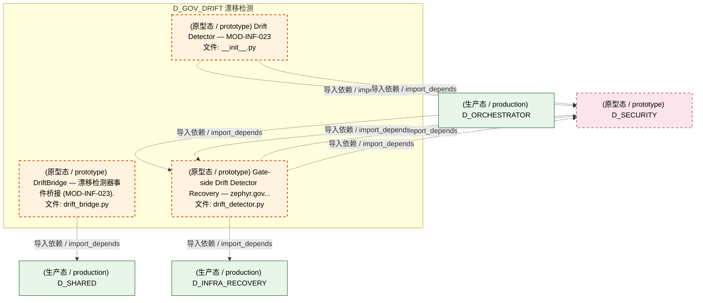
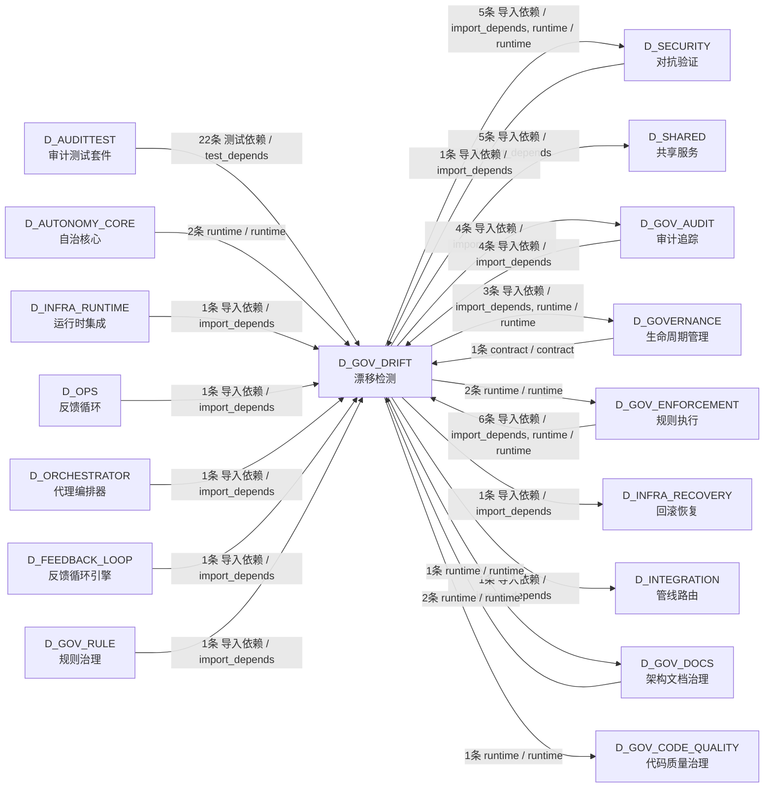

# 39_d_gov_drift / drift_detection / 漂移检测 / Drift Detection

> **功能简介 / Overview**: 漂移检测，负责架构漂移检测和漂移告警

> **文档作用 / Purpose**: 展示 漂移检测（D_GOV_DRIFT）功能域的模块清单、域内依赖关系、跨域依赖关系、架构分层视图，供架构审查和域治理参考。

> 本文档由 generate_domain_doc.py 从 depgraph (PostgreSQL) 自动生成
> 最后更新: 2026-07-13 01:55:40
> 数据源: depgraph (PostgreSQL) nodes表 + edges表

## 域基本信息 / Domain Overview

| 字段 | 值 | Field | Value |
|------|------|-------|-------|
| 编号 | 39 | Number | 39 |
| 域ID | D_GOV_DRIFT | Domain ID | D_GOV_DRIFT |
| 域名称 | 漂移检测 | Domain Name | Drift Detection |
| 层级 | L2 业务域层 | Layer | L2 Domain |
| 模块数 | 26 | Module Count | 26 |
| 域内依赖 | 3 | Internal Dependencies | 3 |
| 跨域入边 | 43 | Cross-domain Incoming | 43 |
| 跨域出边 | 23 | Cross-domain Outgoing | 23 |
| 设计态模块 | 1 | Design Modules | 1 |
| 原型态模块 | 3 | Prototype Modules | 3 |
| 生产态模块 | 22 | Production Modules | 22 |
| 容量 | 22/150 (正常) | Capacity | 22/150 (正常) |
| 描述 | 39个漂移检测器注册与调度 | Description | 39个漂移检测器注册与调度 |

## 模块分层清单 / Module Layered List

> 按 architecture_layer 分组的模块清单（共 26 个模块 / 26 modules）。

### L1 基础层 / Foundation Layer (1 modules)

| # | 模块路径 / Module Path | 模块名称 / Module Name (功能简介 / Description) | 成熟度 / Maturity | 蓝图 / Blueprint |
|:--:|---------|---------|:---:|:---:|
| 1 | docs/03_modules/_domain_governance/drift_detector/bluepri... | docs__03_modules___domain_governance__drift_detector__blueprint_md | 设计态 / design | [MOD-INF-023](../../03_modules/_domain_governance/drift_detector/blueprint.md) |

### L2 领域层 / Domain Layer (25 modules)

| # | 模块路径 / Module Path | 模块名称 / Module Name (功能简介 / Description) | 成熟度 / Maturity | 蓝图 / Blueprint |
|:--:|---------|---------|:---:|:---:|
| 1 | scripts/governance/d11_compliance/validate_blueprint_over... | validate_blueprint_overlap.py | 生产态 / production |  |
| 2 | scripts/governance/d11_compliance/validate_truth_source_c... | validate_truth_source_cascade.py | 生产态 / production |  |
| 3 | scripts/governance/d5_architecture/validators/validate_au... | validate_authority_registry.py | 生产态 / production |  |
| 4 | scripts/governance/d5_architecture/validators/validate_ss... | validate_ssot.py | 生产态 / production |  |
| 5 | src/zephyr/governance/audit_trail/drift_bridge.py | drift_bridge.py | 生产态 / production | [MOD-INF-020](../../03_modules/_domain_governance/audit_trail/blueprint.md) |
| 6 | src/zephyr/governance/audit_trail/self_monitor.py | self_monitor.py | 生产态 / production | [MOD-INF-020](../../03_modules/_domain_governance/audit_trail/blueprint.md) |
| 7 | src/zephyr/governance/drift_detection/__init__.py | __init__.py | 生产态 / production |  |
| 8 | src/zephyr/governance/drift_detection/artifact_scanner.py | ArtifactScanner — SSRF / Path Traversal / Cred... | 生产态 / production | [MOD-L10-001](../../03_modules/_domain_compliance/blueprint.md) |
| 9 | src/zephyr/governance/drift_detection/autonomy_regressor.py | Autonomy Regressor — v0.10.0 渐进自治可逆性管... | 生产态 / production | [MOD-INF-022](../../03_modules/_domain_autonomy_perm/escalation_protocol/blueprint.md) |
| 10 | src/zephyr/governance/drift_detection/bootstrapping_calib... | bootstrapping_calibrator.py | 生产态 / production | [MOD-INF-024](../../03_modules/_domain_autonomy_perm/budget_enforcer/blueprint.md) |
| 11 | src/zephyr/governance/drift_detection/drift_detector.py | Drift Detector — 兼容别名，SSoT已迁移至 zephyr... | 生产态 / production | [MOD-INF-022](../../03_modules/_domain_autonomy_perm/escalation_protocol/blueprint.md) |
| 12 | src/zephyr/governance/drift_detection/migration_plan.yaml | migration_plan.yaml | 生产态 / production | [MOD-INF-011](../../03_modules/_domain_knowledge/vector_memory/blueprint.md) |
| 13 | src/zephyr/governance/drift_detection/reward_hacking_rebo... | Reward Hacking Rebound Detector — v0.14.0 §2.37-D. | 生产态 / production | [MOD-INF-022](../../03_modules/_domain_autonomy_perm/escalation_protocol/blueprint.md) |
| 14 | src/zephyr/governance/drift_detection/silence_detector.py | Silence Detector — v0.8.0 静默窗口检测器: agen... | 生产态 / production | [MOD-INF-022](../../03_modules/_domain_autonomy_perm/escalation_protocol/blueprint.md) |
| 15 | src/zephyr/governance/drift_detection/spiral_ews.py | spiral_ews.py | 生产态 / production | [MOD-INF-024](../../03_modules/_domain_autonomy_perm/budget_enforcer/blueprint.md) |
| 16 | src/zephyr/governance/drift_detection/vigil_runtime.py | Vigil Runtime — v0.6.0 VIGIL维护运行时: 运维to... | 生产态 / production | [MOD-INF-022](../../03_modules/_domain_autonomy_perm/escalation_protocol/blueprint.md) |
| 17 | src/zephyr/governance/drift_detector_core/bridges/__init_... | Drift Detector — MOD-INF-023 | 原型态 / prototype | [MOD-INF-023](../../03_modules/_domain_governance/drift_detector/blueprint.md) |
| 18 | src/zephyr/governance/drift_detector_core/bridges/drift_b... | DriftBridge — 漂移检测器事件桥接 (MOD-INF-023). | 原型态 / prototype | [MOD-INF-023](../../03_modules/_domain_governance/drift_detector/blueprint.md) |
| 19 | src/zephyr/governance/integrity.py | integrity.py | 生产态 / production | [MOD-INF-020](../../03_modules/_domain_governance/audit_trail/blueprint.md) |
| 20 | src/zephyr/governance/rule_enforcement/breaking_change_de... | Breaking Change 检测器（GATE-CDC-2）——字段删... | 生产态 / production | [MOD-GATE_ENGINE](../../03_modules/_cross_layer/gate_engine/blueprint.md) |
| 21 | src/zephyr/governance/rule_enforcement/drift_detector.py | Gate-side Drift Detector Recovery — zephyr.gov... | 原型态 / prototype | [MOD-GATE_ENGINE](../../03_modules/_cross_layer/gate_engine/blueprint.md) |
| 22 | src/zephyr/governance/rule_enforcement/gate_engine/gate_h... | 门禁健康仪表板——per-gate SLI 报告、误报率、延... | 生产态 / production | [MOD-GATE_ENGINE](../../03_modules/_cross_layer/gate_engine/blueprint.md) |
| 23 | src/zephyr/governance/rule_enforcement/gate_engine/gate_i... | 门禁引擎完整性守卫——自检SHA-256校验+trust roo... | 生产态 / production | [MOD-GATE_ENGINE](../../03_modules/_cross_layer/gate_engine/blueprint.md) |
| 24 | src/zephyr/governance/rule_enforcement/invariants/en_002_... | EN-002 — Enforcement Mode Validator | 生产态 / production | [MOD-GATE_ENGINE](../../03_modules/_cross_layer/gate_engine/blueprint.md) |
| 25 | src/zephyr/governance/rule_enforcement/truth_source_valid... | 真源优先级裁决器（Truth Source Validator） | 生产态 / production | [MOD-GATE_ENGINE](../../03_modules/_cross_layer/gate_engine/blueprint.md) |

## 域内依赖图 / Internal Dependency Diagram

> 依赖图内嵌在本文档中，IDE 可直接渲染显示。参考 decision_index.md 设计，分四个视图：合并全景图、运营态子图、设计态子图、原型态子图（按 design_maturity 实际值拆分）。
>
> **图例说明 / Legend**：
> - **实线边框 = 运营态模块**（production，已上线运行）
> - **虚线边框 = 设计态模块**（design，蓝图阶段，代码未写）
> - **虚线边框 = 原型态模块**（prototype，代码已写，验证中未稳定上线）
> - **实线箭头 = 运营态依赖**（已生效的依赖关系）
> - **虚线箭头 = 非运营态依赖**（计划中/验证中的依赖关系）

### 合并全景图（全部模块，标签标注成熟度）

> 展示全部 26 个模块（生产态 22 + 设计态 1 + 原型态 3），标签标注成熟度。

```mermaid
graph TD
    subgraph D_GOV_DRIFT["D_GOV_DRIFT 漂移检测"]
        docs_03_modules_domain_governance_drift_detector_blueprint_md["(设计态 / design) docs__03_modules___domain_governance__drift_detector__blueprint_md"]
        scripts_governance_d11_compliance_validate_blueprint_overlap_py["(生产态 / production) validate_blueprint_overlap.py"]
        scripts_governance_d11_compliance_validate_truth_source_cascade_py["(生产态 / production) validate_truth_source_cascade.py"]
        scripts_governance_d5_architecture_validators_validate_authority_registry_py["(生产态 / production) validate_authority_registry.py"]
        scripts_governance_d5_architecture_validators_validate_ssot_py["(生产态 / production) validate_ssot.py"]
        src_zephyr_governance_audit_trail_drift_bridge_py["(生产态 / production) drift_bridge.py"]
        src_zephyr_governance_audit_trail_self_monitor_py["(生产态 / production) self_monitor.py"]
        src_zephyr_governance_drift_detection_init_py["(生产态 / production) __init__.py"]
        src_zephyr_governance_drift_detection_artifact_scanner_py["(生产态 / production) ArtifactScanner — SSRF / Path Traversal / Cred...<br/>文件: artifact_scanner.py"]
        src_zephyr_governance_drift_detection_autonomy_regressor_py["(生产态 / production) Autonomy Regressor — v0.10.0 渐进自治可逆性管...<br/>文件: autonomy_regressor.py"]
        src_zephyr_governance_drift_detection_bootstrapping_calibrator_py["(生产态 / production) bootstrapping_calibrator.py"]
        src_zephyr_governance_drift_detection_drift_detector_py["(生产态 / production) Drift Detector — 兼容别名，SSoT已迁移至 zephyr...<br/>文件: drift_detector.py"]
        src_zephyr_governance_drift_detection_migration_plan_yaml["(生产态 / production) migration_plan.yaml"]
        src_zephyr_governance_drift_detection_reward_hacking_rebound_detector_py["(生产态 / production) Reward Hacking Rebound Detector — v0.14.0 §2.37-D.<br/>文件: reward_hacking_rebound_detector.py"]
        src_zephyr_governance_drift_detection_silence_detector_py["(生产态 / production) Silence Detector — v0.8.0 静默窗口检测器: agen...<br/>文件: silence_detector.py"]
        src_zephyr_governance_drift_detection_spiral_ews_py["(生产态 / production) spiral_ews.py"]
        src_zephyr_governance_drift_detection_vigil_runtime_py["(生产态 / production) Vigil Runtime — v0.6.0 VIGIL维护运行时: 运维to...<br/>文件: vigil_runtime.py"]
        src_zephyr_governance_drift_detector_core_bridges_init_py["(原型态 / prototype) Drift Detector — MOD-INF-023<br/>文件: __init__.py"]
        src_zephyr_governance_drift_detector_core_bridges_drift_bridge_py["(原型态 / prototype) DriftBridge — 漂移检测器事件桥接 (MOD-INF-023).<br/>文件: drift_bridge.py"]
        src_zephyr_governance_integrity_py["(生产态 / production) integrity.py"]
        src_zephyr_governance_rule_enforcement_breaking_change_detector_py["(生产态 / production) Breaking Change 检测器（GATE-CDC-2）——字段删...<br/>文件: breaking_change_detector.py"]
        src_zephyr_governance_rule_enforcement_drift_detector_py["(原型态 / prototype) Gate-side Drift Detector Recovery — zephyr.gov...<br/>文件: drift_detector.py"]
        src_zephyr_governance_rule_enforcement_gate_engine_gate_health_py["(生产态 / production) 门禁健康仪表板——per-gate SLI 报告、误报率、延...<br/>文件: gate_health.py"]
        src_zephyr_governance_rule_enforcement_gate_engine_gate_integrity_guard_py["(生产态 / production) 门禁引擎完整性守卫——自检SHA-256校验+trust roo...<br/>文件: gate_integrity_guard.py"]
        src_zephyr_governance_rule_enforcement_invariants_en_002_enforcement_validator_py["(生产态 / production) EN-002 — Enforcement Mode Validator<br/>文件: en_002_enforcement_validator.py"]
        src_zephyr_governance_rule_enforcement_truth_source_validator_py["(生产态 / production) 真源优先级裁决器（Truth Source Validator）<br/>文件: truth_source_validator.py"]
    end
    src_zephyr_governance_audit_trail_drift_bridge_py -->|导入依赖 / import_depends| src_zephyr_governance_drift_detection_drift_detector_py
    src_zephyr_governance_audit_trail_self_monitor_py -->|导入依赖 / import_depends| src_zephyr_governance_audit_trail_drift_bridge_py
    src_zephyr_governance_drift_detection_migration_plan_yaml -->|config_depends / config_depends| src_zephyr_governance_drift_detection_init_py
    D_GOV_DOCS["(设计态 / design) D_GOV_DOCS"]
    docs_03_modules_domain_governance_drift_detector_blueprint_md -.->|runtime / runtime| D_GOV_DOCS
    D_GOVERNANCE["(原型态 / prototype) D_GOVERNANCE"]
    docs_03_modules_domain_governance_drift_detector_blueprint_md -.->|runtime / runtime| D_GOVERNANCE
    D_GOV_ENFORCEMENT["(原型态 / prototype) D_GOV_ENFORCEMENT"]
    docs_03_modules_domain_governance_drift_detector_blueprint_md -.->|runtime / runtime| D_GOV_ENFORCEMENT
    D_SECURITY["(生产态 / production) D_SECURITY"]
    docs_03_modules_domain_governance_drift_detector_blueprint_md -.->|runtime / runtime| D_SECURITY
    D_GOV_CODE_QUALITY["(生产态 / production) D_GOV_CODE_QUALITY"]
    docs_03_modules_domain_governance_drift_detector_blueprint_md -.->|runtime / runtime| D_GOV_CODE_QUALITY
    docs_03_modules_domain_governance_drift_detector_blueprint_md -.->|runtime / runtime| D_GOV_ENFORCEMENT
    docs_03_modules_domain_governance_drift_detector_blueprint_md -.->|runtime / runtime| D_GOVERNANCE
    D_GOV_AUDIT["(生产态 / production) D_GOV_AUDIT"]
    src_zephyr_governance_integrity_py -->|导入依赖 / import_depends| D_GOV_AUDIT
    src_zephyr_governance_integrity_py -->|导入依赖 / import_depends| D_GOV_AUDIT
    src_zephyr_governance_integrity_py -.->|导入依赖 / import_depends| D_GOV_AUDIT
    D_SHARED["(生产态 / production) D_SHARED"]
    src_zephyr_governance_audit_trail_self_monitor_py -->|导入依赖 / import_depends| D_SHARED
    src_zephyr_governance_drift_detection_drift_detector_py -->|导入依赖 / import_depends| D_SHARED
    src_zephyr_governance_drift_detector_core_bridges_drift_bridge_py -.->|导入依赖 / import_depends| D_SHARED
    src_zephyr_governance_drift_detector_core_bridges_init_py -.->|导入依赖 / import_depends| D_SECURITY
    src_zephyr_governance_drift_detector_core_bridges_init_py -.->|导入依赖 / import_depends| D_SECURITY
    D_GOV_ENFORCEMENT -.->|runtime / runtime| docs_03_modules_domain_governance_drift_detector_blueprint_md
    D_GOV_DOCS -.->|runtime / runtime| docs_03_modules_domain_governance_drift_detector_blueprint_md
    D_GOV_DOCS -.->|runtime / runtime| docs_03_modules_domain_governance_drift_detector_blueprint_md
    D_GOVERNANCE -.->|contract / contract| docs_03_modules_domain_governance_drift_detector_blueprint_md
    D_AUTONOMY_CORE["(原型态 / prototype) D_AUTONOMY_CORE"]
    D_AUTONOMY_CORE -.->|runtime / runtime| docs_03_modules_domain_governance_drift_detector_blueprint_md
    D_AUTONOMY_CORE -.->|runtime / runtime| docs_03_modules_domain_governance_drift_detector_blueprint_md
    D_GOV_ENFORCEMENT -.->|导入依赖 / import_depends| src_zephyr_governance_drift_detection_artifact_scanner_py
    D_GOV_ENFORCEMENT -.->|导入依赖 / import_depends| src_zephyr_governance_integrity_py
    D_GOV_AUDIT -->|导入依赖 / import_depends| src_zephyr_governance_audit_trail_drift_bridge_py
    D_GOV_AUDIT -->|导入依赖 / import_depends| src_zephyr_governance_integrity_py
    D_GOV_AUDIT -->|导入依赖 / import_depends| src_zephyr_governance_integrity_py
    D_GOV_AUDIT -->|导入依赖 / import_depends| src_zephyr_governance_audit_trail_self_monitor_py
    D_OPS["(生产态 / production) D_OPS"]
    D_OPS -->|导入依赖 / import_depends| src_zephyr_governance_drift_detection_spiral_ews_py
    D_GOV_ENFORCEMENT -->|导入依赖 / import_depends| src_zephyr_governance_rule_enforcement_breaking_change_detector_py
    D_GOV_ENFORCEMENT -->|导入依赖 / import_depends| src_zephyr_governance_rule_enforcement_gate_engine_gate_health_py
    classDef production fill:#e1f5fe,stroke:#01579b,stroke-width:2px,color:#000
    classDef design fill:#fff3e0,stroke:#e65100,stroke-width:2px,color:#000,stroke-dasharray: 5 5
    classDef external_prod fill:#e8f5e9,stroke:#1b5e20,stroke-width:1px,color:#000
    classDef external_design fill:#fce4ec,stroke:#880e4f,stroke-width:1px,color:#000,stroke-dasharray: 5 5
    class scripts_governance_d11_compliance_validate_blueprint_overlap_py,scripts_governance_d11_compliance_validate_truth_source_cascade_py,scripts_governance_d5_architecture_validators_validate_authority_registry_py,scripts_governance_d5_architecture_validators_validate_ssot_py,src_zephyr_governance_audit_trail_drift_bridge_py,src_zephyr_governance_audit_trail_self_monitor_py,src_zephyr_governance_drift_detection_init_py,src_zephyr_governance_drift_detection_artifact_scanner_py,src_zephyr_governance_drift_detection_autonomy_regressor_py,src_zephyr_governance_drift_detection_bootstrapping_calibrator_py,src_zephyr_governance_drift_detection_drift_detector_py,src_zephyr_governance_drift_detection_migration_plan_yaml,src_zephyr_governance_drift_detection_reward_hacking_rebound_detector_py,src_zephyr_governance_drift_detection_silence_detector_py,src_zephyr_governance_drift_detection_spiral_ews_py,src_zephyr_governance_drift_detection_vigil_runtime_py,src_zephyr_governance_integrity_py,src_zephyr_governance_rule_enforcement_breaking_change_detector_py,src_zephyr_governance_rule_enforcement_gate_engine_gate_health_py,src_zephyr_governance_rule_enforcement_gate_engine_gate_integrity_guard_py,src_zephyr_governance_rule_enforcement_invariants_en_002_enforcement_validator_py,src_zephyr_governance_rule_enforcement_truth_source_validator_py production
    class docs_03_modules_domain_governance_drift_detector_blueprint_md,src_zephyr_governance_drift_detector_core_bridges_init_py,src_zephyr_governance_drift_detector_core_bridges_drift_bridge_py,src_zephyr_governance_rule_enforcement_drift_detector_py design
    class D_SECURITY,D_GOV_CODE_QUALITY,D_GOV_AUDIT,D_SHARED,D_OPS external_prod
    class D_GOV_DOCS,D_GOVERNANCE,D_GOV_ENFORCEMENT,D_AUTONOMY_CORE external_design
```

### 运营态子图（仅 design_maturity=production 的模块和依赖）

> 仅展示已上线运行的模块（共 22 个，3 条域内依赖）。

```mermaid
graph TD
    subgraph D_GOV_DRIFT["D_GOV_DRIFT 漂移检测"]
        scripts_governance_d11_compliance_validate_blueprint_overlap_py["(生产态 / production) validate_blueprint_overlap.py"]
        scripts_governance_d11_compliance_validate_truth_source_cascade_py["(生产态 / production) validate_truth_source_cascade.py"]
        scripts_governance_d5_architecture_validators_validate_authority_registry_py["(生产态 / production) validate_authority_registry.py"]
        scripts_governance_d5_architecture_validators_validate_ssot_py["(生产态 / production) validate_ssot.py"]
        src_zephyr_governance_audit_trail_drift_bridge_py["(生产态 / production) drift_bridge.py"]
        src_zephyr_governance_audit_trail_self_monitor_py["(生产态 / production) self_monitor.py"]
        src_zephyr_governance_drift_detection_init_py["(生产态 / production) __init__.py"]
        src_zephyr_governance_drift_detection_artifact_scanner_py["(生产态 / production) ArtifactScanner — SSRF / Path Traversal / Cred...<br/>文件: artifact_scanner.py"]
        src_zephyr_governance_drift_detection_autonomy_regressor_py["(生产态 / production) Autonomy Regressor — v0.10.0 渐进自治可逆性管...<br/>文件: autonomy_regressor.py"]
        src_zephyr_governance_drift_detection_bootstrapping_calibrator_py["(生产态 / production) bootstrapping_calibrator.py"]
        src_zephyr_governance_drift_detection_drift_detector_py["(生产态 / production) Drift Detector — 兼容别名，SSoT已迁移至 zephyr...<br/>文件: drift_detector.py"]
        src_zephyr_governance_drift_detection_migration_plan_yaml["(生产态 / production) migration_plan.yaml"]
        src_zephyr_governance_drift_detection_reward_hacking_rebound_detector_py["(生产态 / production) Reward Hacking Rebound Detector — v0.14.0 §2.37-D.<br/>文件: reward_hacking_rebound_detector.py"]
        src_zephyr_governance_drift_detection_silence_detector_py["(生产态 / production) Silence Detector — v0.8.0 静默窗口检测器: agen...<br/>文件: silence_detector.py"]
        src_zephyr_governance_drift_detection_spiral_ews_py["(生产态 / production) spiral_ews.py"]
        src_zephyr_governance_drift_detection_vigil_runtime_py["(生产态 / production) Vigil Runtime — v0.6.0 VIGIL维护运行时: 运维to...<br/>文件: vigil_runtime.py"]
        src_zephyr_governance_integrity_py["(生产态 / production) integrity.py"]
        src_zephyr_governance_rule_enforcement_breaking_change_detector_py["(生产态 / production) Breaking Change 检测器（GATE-CDC-2）——字段删...<br/>文件: breaking_change_detector.py"]
        src_zephyr_governance_rule_enforcement_gate_engine_gate_health_py["(生产态 / production) 门禁健康仪表板——per-gate SLI 报告、误报率、延...<br/>文件: gate_health.py"]
        src_zephyr_governance_rule_enforcement_gate_engine_gate_integrity_guard_py["(生产态 / production) 门禁引擎完整性守卫——自检SHA-256校验+trust roo...<br/>文件: gate_integrity_guard.py"]
        src_zephyr_governance_rule_enforcement_invariants_en_002_enforcement_validator_py["(生产态 / production) EN-002 — Enforcement Mode Validator<br/>文件: en_002_enforcement_validator.py"]
        src_zephyr_governance_rule_enforcement_truth_source_validator_py["(生产态 / production) 真源优先级裁决器（Truth Source Validator）<br/>文件: truth_source_validator.py"]
    end
    src_zephyr_governance_audit_trail_drift_bridge_py -->|导入依赖 / import_depends| src_zephyr_governance_drift_detection_drift_detector_py
    src_zephyr_governance_audit_trail_self_monitor_py -->|导入依赖 / import_depends| src_zephyr_governance_audit_trail_drift_bridge_py
    src_zephyr_governance_drift_detection_migration_plan_yaml -->|config_depends / config_depends| src_zephyr_governance_drift_detection_init_py
    D_GOV_AUDIT["(生产态 / production) D_GOV_AUDIT"]
    src_zephyr_governance_integrity_py -->|导入依赖 / import_depends| D_GOV_AUDIT
    src_zephyr_governance_integrity_py -->|导入依赖 / import_depends| D_GOV_AUDIT
    src_zephyr_governance_integrity_py -.->|导入依赖 / import_depends| D_GOV_AUDIT
    D_SHARED["(生产态 / production) D_SHARED"]
    src_zephyr_governance_audit_trail_self_monitor_py -->|导入依赖 / import_depends| D_SHARED
    src_zephyr_governance_drift_detection_drift_detector_py -->|导入依赖 / import_depends| D_SHARED
    src_zephyr_governance_rule_enforcement_truth_source_validator_py -->|导入依赖 / import_depends| D_GOV_AUDIT
    src_zephyr_governance_rule_enforcement_truth_source_validator_py -.->|导入依赖 / import_depends| D_SHARED
    D_INTEGRATION["(生产态 / production) D_INTEGRATION"]
    src_zephyr_governance_rule_enforcement_invariants_en_002_enforcement_validator_py -->|导入依赖 / import_depends| D_INTEGRATION
    src_zephyr_governance_rule_enforcement_invariants_en_002_enforcement_validator_py -->|导入依赖 / import_depends| D_SHARED
    D_GOVERNANCE["(生产态 / production) D_GOVERNANCE"]
    scripts_governance_d5_architecture_validators_validate_ssot_py -->|导入依赖 / import_depends| D_GOVERNANCE
    D_GOV_ENFORCEMENT["(原型态 / prototype) D_GOV_ENFORCEMENT"]
    D_GOV_ENFORCEMENT -.->|导入依赖 / import_depends| src_zephyr_governance_drift_detection_artifact_scanner_py
    D_GOV_ENFORCEMENT -.->|导入依赖 / import_depends| src_zephyr_governance_integrity_py
    D_GOV_AUDIT -->|导入依赖 / import_depends| src_zephyr_governance_audit_trail_drift_bridge_py
    D_GOV_AUDIT -->|导入依赖 / import_depends| src_zephyr_governance_integrity_py
    D_GOV_AUDIT -->|导入依赖 / import_depends| src_zephyr_governance_integrity_py
    D_GOV_AUDIT -->|导入依赖 / import_depends| src_zephyr_governance_audit_trail_self_monitor_py
    D_OPS["(生产态 / production) D_OPS"]
    D_OPS -->|导入依赖 / import_depends| src_zephyr_governance_drift_detection_spiral_ews_py
    D_GOV_ENFORCEMENT -->|导入依赖 / import_depends| src_zephyr_governance_rule_enforcement_breaking_change_detector_py
    D_GOV_ENFORCEMENT -->|导入依赖 / import_depends| src_zephyr_governance_rule_enforcement_gate_engine_gate_health_py
    D_GOV_ENFORCEMENT -->|导入依赖 / import_depends| src_zephyr_governance_rule_enforcement_gate_engine_gate_integrity_guard_py
    D_GOV_RULE["(生产态 / production) D_GOV_RULE"]
    D_GOV_RULE -->|导入依赖 / import_depends| src_zephyr_governance_rule_enforcement_invariants_en_002_enforcement_validator_py
    D_INFRA_RUNTIME["(生产态 / production) D_INFRA_RUNTIME"]
    D_INFRA_RUNTIME -->|导入依赖 / import_depends| src_zephyr_governance_audit_trail_self_monitor_py
    D_FEEDBACK_LOOP["(生产态 / production) D_FEEDBACK_LOOP"]
    D_FEEDBACK_LOOP -->|导入依赖 / import_depends| src_zephyr_governance_integrity_py
    D_AUDITTEST["(原型态 / prototype) D_AUDITTEST"]
    D_AUDITTEST -.->|测试依赖 / test_depends| src_zephyr_governance_integrity_py
    D_AUDITTEST -.->|测试依赖 / test_depends| src_zephyr_governance_drift_detection_autonomy_regressor_py
    classDef production fill:#e1f5fe,stroke:#01579b,stroke-width:2px,color:#000
    classDef design fill:#fff3e0,stroke:#e65100,stroke-width:2px,color:#000,stroke-dasharray: 5 5
    classDef external_prod fill:#e8f5e9,stroke:#1b5e20,stroke-width:1px,color:#000
    classDef external_design fill:#fce4ec,stroke:#880e4f,stroke-width:1px,color:#000,stroke-dasharray: 5 5
    class scripts_governance_d11_compliance_validate_blueprint_overlap_py,scripts_governance_d11_compliance_validate_truth_source_cascade_py,scripts_governance_d5_architecture_validators_validate_authority_registry_py,scripts_governance_d5_architecture_validators_validate_ssot_py,src_zephyr_governance_audit_trail_drift_bridge_py,src_zephyr_governance_audit_trail_self_monitor_py,src_zephyr_governance_drift_detection_init_py,src_zephyr_governance_drift_detection_artifact_scanner_py,src_zephyr_governance_drift_detection_autonomy_regressor_py,src_zephyr_governance_drift_detection_bootstrapping_calibrator_py,src_zephyr_governance_drift_detection_drift_detector_py,src_zephyr_governance_drift_detection_migration_plan_yaml,src_zephyr_governance_drift_detection_reward_hacking_rebound_detector_py,src_zephyr_governance_drift_detection_silence_detector_py,src_zephyr_governance_drift_detection_spiral_ews_py,src_zephyr_governance_drift_detection_vigil_runtime_py,src_zephyr_governance_integrity_py,src_zephyr_governance_rule_enforcement_breaking_change_detector_py,src_zephyr_governance_rule_enforcement_gate_engine_gate_health_py,src_zephyr_governance_rule_enforcement_gate_engine_gate_integrity_guard_py,src_zephyr_governance_rule_enforcement_invariants_en_002_enforcement_validator_py,src_zephyr_governance_rule_enforcement_truth_source_validator_py production
    class D_GOV_AUDIT,D_SHARED,D_INTEGRATION,D_GOVERNANCE,D_OPS,D_GOV_RULE,D_INFRA_RUNTIME,D_FEEDBACK_LOOP external_prod
    class D_GOV_ENFORCEMENT,D_AUDITTEST external_design
```

### 设计态子图（仅 design_maturity=design 的模块和依赖）

> 仅展示蓝图阶段、代码未写的设计态模块（共 1 个，0 条域内依赖）。

```mermaid
graph TD
    subgraph D_GOV_DRIFT["D_GOV_DRIFT 漂移检测"]
        docs_03_modules_domain_governance_drift_detector_blueprint_md["(设计态 / design) docs__03_modules___domain_governance__drift_detector__blueprint_md"]
    end
    D_GOV_DOCS["(设计态 / design) D_GOV_DOCS"]
    docs_03_modules_domain_governance_drift_detector_blueprint_md -.->|runtime / runtime| D_GOV_DOCS
    D_GOVERNANCE["(原型态 / prototype) D_GOVERNANCE"]
    docs_03_modules_domain_governance_drift_detector_blueprint_md -.->|runtime / runtime| D_GOVERNANCE
    D_GOV_ENFORCEMENT["(原型态 / prototype) D_GOV_ENFORCEMENT"]
    docs_03_modules_domain_governance_drift_detector_blueprint_md -.->|runtime / runtime| D_GOV_ENFORCEMENT
    D_SECURITY["(生产态 / production) D_SECURITY"]
    docs_03_modules_domain_governance_drift_detector_blueprint_md -.->|runtime / runtime| D_SECURITY
    D_GOV_CODE_QUALITY["(生产态 / production) D_GOV_CODE_QUALITY"]
    docs_03_modules_domain_governance_drift_detector_blueprint_md -.->|runtime / runtime| D_GOV_CODE_QUALITY
    docs_03_modules_domain_governance_drift_detector_blueprint_md -.->|runtime / runtime| D_GOV_ENFORCEMENT
    docs_03_modules_domain_governance_drift_detector_blueprint_md -.->|runtime / runtime| D_GOVERNANCE
    D_GOV_ENFORCEMENT -.->|runtime / runtime| docs_03_modules_domain_governance_drift_detector_blueprint_md
    D_GOV_DOCS -.->|runtime / runtime| docs_03_modules_domain_governance_drift_detector_blueprint_md
    D_GOV_DOCS -.->|runtime / runtime| docs_03_modules_domain_governance_drift_detector_blueprint_md
    D_GOVERNANCE -.->|contract / contract| docs_03_modules_domain_governance_drift_detector_blueprint_md
    D_AUTONOMY_CORE["(原型态 / prototype) D_AUTONOMY_CORE"]
    D_AUTONOMY_CORE -.->|runtime / runtime| docs_03_modules_domain_governance_drift_detector_blueprint_md
    D_AUTONOMY_CORE -.->|runtime / runtime| docs_03_modules_domain_governance_drift_detector_blueprint_md
    classDef production fill:#e1f5fe,stroke:#01579b,stroke-width:2px,color:#000
    classDef design fill:#fff3e0,stroke:#e65100,stroke-width:2px,color:#000,stroke-dasharray: 5 5
    classDef external_prod fill:#e8f5e9,stroke:#1b5e20,stroke-width:1px,color:#000
    classDef external_design fill:#fce4ec,stroke:#880e4f,stroke-width:1px,color:#000,stroke-dasharray: 5 5
    class docs_03_modules_domain_governance_drift_detector_blueprint_md design
    class D_SECURITY,D_GOV_CODE_QUALITY external_prod
    class D_GOV_DOCS,D_GOVERNANCE,D_GOV_ENFORCEMENT,D_AUTONOMY_CORE external_design
```

### 原型态子图（仅 design_maturity=prototype 的模块和依赖）

> 仅展示代码已写、验证中未稳定上线的原型态模块（共 3 个，0 条域内依赖）。

## 跨域依赖 / Cross-domain Dependencies

### 本域依赖的其他域（出边）/ Depends On

| # | 本域模块 / Source Module | → | 外部域-目标模块 / Target Module | 依赖类型 / Type |
|:--:|---------|:--:|---------|---------|
| 1 | blueprint.md | → | D_GOVERNANCE 生命周期管理: Construction Verifier — 施工验证器: 任务卡完成... | runtime / runtime |
| 2 | blueprint.md | → | D_GOVERNANCE 生命周期管理: dataflowgraph Schema DDL + 连接入口 (dataflowgr... | runtime / runtime |
| 3 | validate_ssot.py | → | D_GOVERNANCE 生命周期管理: 文件头部格式解析 SSoT（Single Source of Truth）... | 导入依赖 / import_depends |
| 4 | integrity.py | → | D_GOV_AUDIT 审计追踪: models.py | 导入依赖 / import_depends |
| 5 | integrity.py | → | D_GOV_AUDIT 审计追踪: trust_bridge.py | 导入依赖 / import_depends |
| 6 | integrity.py | → | D_GOV_AUDIT 审计追踪: merkle_hourly.py | 导入依赖 / import_depends |
| 7 | 真源优先级裁决器（Truth Source Validator） (tru... | → | D_GOV_AUDIT 审计追踪: bridge.py | 导入依赖 / import_depends |
| 8 | blueprint.md | → | D_GOV_CODE_QUALITY 代码质量治理: module_id_consistency_gate.py — module_id 三声... | runtime / runtime |
| 9 | blueprint.md | → | D_GOV_DOCS 架构文档治理: blueprint.md | runtime / runtime |
| 10 | blueprint.md | → | D_GOV_ENFORCEMENT 规则执行: Audit Trail — MOD-INF-020 (__init__.py) | runtime / runtime |
| 11 | blueprint.md | → | D_GOV_ENFORCEMENT 规则执行: Re-export shim — ComplianceRule 真源已合并至 z... | runtime / runtime |
| 12 | Gate-side Drift Detector Recovery — zephyr.gov... | → | D_INFRA_RECOVERY 回滚恢复: drift_fix.py | 导入依赖 / import_depends |
| 13 | EN-002 — Enforcement Mode Validator (en_002_en... | → | D_INTEGRATION 管线路由: schemas.py | 导入依赖 / import_depends |
| 14 | blueprint.md | → | D_SECURITY 对抗验证: PathGuard — 路径守卫. (path_guard.py) | runtime / runtime |
| 15 | Drift Detector — MOD-INF-023 (__init__.py) | → | D_SECURITY 对抗验证: Auto Reconciler — reconciler.py (reconciler.py) | 导入依赖 / import_depends |
| 16 | Drift Detector — MOD-INF-023 (__init__.py) | → | D_SECURITY 对抗验证: Drift State Machine — state_machine.py (state_... | 导入依赖 / import_depends |
| 17 | Gate-side Drift Detector Recovery — zephyr.gov... | → | D_SECURITY 对抗验证: G-CT-005 — ManagedDriftEvent Pydantic V2 BaseM... | 导入依赖 / import_depends |
| 18 | Gate-side Drift Detector Recovery — zephyr.gov... | → | D_SECURITY 对抗验证: Auto Reconciler — reconciler.py (reconciler.py) | 导入依赖 / import_depends |
| 19 | self_monitor.py | → | D_SHARED 共享服务: time_utils.py —— 时间/日期工具（Phase 9 新增 ... | 导入依赖 / import_depends |
| 20 | Drift Detector — 兼容别名，SSoT已迁移至 zephyr... | → | D_SHARED 共享服务: EventBus — 事件总线（带背压控制）(M-07) (event... | 导入依赖 / import_depends |
| 21 | DriftBridge — 漂移检测器事件桥接 (MOD-INF-023)... | → | D_SHARED 共享服务: EventBus — 事件总线（带背压控制）(M-07) (event... | 导入依赖 / import_depends |
| 22 | EN-002 — Enforcement Mode Validator (en_002_en... | → | D_SHARED 共享服务: paths.py — 项目路径常量 SSoT（Single Source of... | 导入依赖 / import_depends |
| 23 | 真源优先级裁决器（Truth Source Validator） (tru... | → | D_SHARED 共享服务: schemas.py | 导入依赖 / import_depends |

### 依赖本域的其他域（入边）/ Depended By

| # | 外部域-源模块 / Source Module | → | 本域模块 / Target Module | 依赖类型 / Type |
|:--:|---------|:--:|---------|---------|
| 1 | D_AUDITTEST 审计测试套件: test_audit_integrity.py | → | integrity.py | 测试依赖 / test_depends |
| 2 | D_AUDITTEST 审计测试套件: test_autonomy_regressor.py | → | Autonomy Regressor — v0.10.0 渐进自治可逆性管.... | 测试依赖 / test_depends |
| 3 | D_AUDITTEST 审计测试套件: test_bridges_drift_bridge.py | → | drift_bridge.py | 测试依赖 / test_depends |
| 4 | D_AUDITTEST 审计测试套件: DM-201504: F4 BudgetEngine自动关闭——shutdown.... | → | spiral_ews.py | 测试依赖 / test_depends |
| 5 | D_AUDITTEST 审计测试套件: test_data_lifecycle.py | → | __init__.py | 测试依赖 / test_depends |
| 6 | D_AUDITTEST 审计测试套件: test_drift_bridge.py | → | drift_bridge.py | 测试依赖 / test_depends |
| 7 | D_AUDITTEST 审计测试套件: test_drift_detector_ee.py | → | Drift Detector — 兼容别名，SSoT已迁移至 zephyr... | 测试依赖 / test_depends |
| 8 | D_AUDITTEST 审计测试套件: test_drift_detector_gate.py | → | Drift Detector — 兼容别名，SSoT已迁移至 zephyr... | 测试依赖 / test_depends |
| 9 | D_AUDITTEST 审计测试套件: test_e_reward_hacking.py | → | Reward Hacking Rebound Detector — v0.14.0 §2.... | 测试依赖 / test_depends |
| 10 | D_AUDITTEST 审计测试套件: test_e_silence_detector.py | → | Silence Detector — v0.8.0 静默窗口检测器: agen... | 测试依赖 / test_depends |
| 11 | D_AUDITTEST 审计测试套件: test_gate_health.py | → | 门禁健康仪表板——per-gate SLI 报告、误报率、延... | 测试依赖 / test_depends |
| 12 | D_AUDITTEST 审计测试套件: test_gate_integrity_guard.py | → | 门禁引擎完整性守卫——自检SHA-256校验+trust roo... | 测试依赖 / test_depends |
| 13 | D_AUDITTEST 审计测试套件: test_reward_hacking_rebound_detector.py | → | Reward Hacking Rebound Detector — v0.14.0 §2.... | 测试依赖 / test_depends |
| 14 | D_AUDITTEST 审计测试套件: test_vigil_runtime.py | → | Vigil Runtime — v0.6.0 VIGIL维护运行时: 运维to... | 测试依赖 / test_depends |
| 15 | D_AUDITTEST 审计测试套件: test_integrity_root.py | → | integrity.py | 测试依赖 / test_depends |
| 16 | D_AUDITTEST 审计测试套件: test_bootstrapping_calibrator.py | → | bootstrapping_calibrator.py | 测试依赖 / test_depends |
| 17 | D_AUDITTEST 审计测试套件: test_silence_detector.py | → | Silence Detector — v0.8.0 静默窗口检测器: agen... | 测试依赖 / test_depends |
| 18 | D_AUDITTEST 审计测试套件: test_spiral_ews.py | → | spiral_ews.py | 测试依赖 / test_depends |
| 19 | D_AUDITTEST 审计测试套件: test_en_002_enforcement_validator.py | → | EN-002 — Enforcement Mode Validator (en_002_en... | 测试依赖 / test_depends |
| 20 | D_AUDITTEST 审计测试套件: test_breaking_change_detector.py | → | Breaking Change 检测器（GATE-CDC-2）——字段删.... | 测试依赖 / test_depends |
| 21 | D_AUDITTEST 审计测试套件: test_kb_integrity.py | → | integrity.py | 测试依赖 / test_depends |
| 22 | D_AUDITTEST 审计测试套件: test_self_monitor.py | → | self_monitor.py | 测试依赖 / test_depends |
| 23 | D_AUTONOMY_CORE 自治核心: file_autoregister.py | → | blueprint.md | runtime / runtime |
| 24 | D_AUTONOMY_CORE 自治核心: otel_instrumentation.py — 全链路 OTel (B12, DD... | → | blueprint.md | runtime / runtime |
| 25 | D_FEEDBACK_LOOP 反馈循环引擎: FLE 全链路调度器 —— collect->detect->diagnose... | → | integrity.py | 导入依赖 / import_depends |
| 26 | D_GOVERNANCE 生命周期管理: model_provider_data.py | → | blueprint.md | contract / contract |
| 27 | D_GOV_AUDIT 审计追踪: audit-orchestrator 兼容重导出层（ARCH-042 阶段4... | → | self_monitor.py | 导入依赖 / import_depends |
| 28 | D_GOV_AUDIT 审计追踪: bridge.py | → | drift_bridge.py | 导入依赖 / import_depends |
| 29 | D_GOV_AUDIT 审计追踪: cli.py | → | integrity.py | 导入依赖 / import_depends |
| 30 | D_GOV_AUDIT 审计追踪: Merkle Audit — 兼容别名，SSoT已迁移至 zephyr.g... | → | integrity.py | 导入依赖 / import_depends |
| 31 | D_GOV_DOCS 架构文档治理: blueprint.md | → | blueprint.md | runtime / runtime |
| 32 | D_GOV_DOCS 架构文档治理: blueprint.md | → | blueprint.md | runtime / runtime |
| 33 | D_GOV_ENFORCEMENT 规则执行: Re-export wrapper: artifact_scanner has migrate... | → | ArtifactScanner — SSRF / Path Traversal / Cred... | 导入依赖 / import_depends |
| 34 | D_GOV_ENFORCEMENT 规则执行: Audit Trail — MOD-INF-020 (__init__.py) | → | blueprint.md | runtime / runtime |
| 35 | D_GOV_ENFORCEMENT 规则执行: Re-export wrapper: integrity has migrated to ze... | → | integrity.py | 导入依赖 / import_depends |
| 36 | D_GOV_ENFORCEMENT 规则执行: ZephyrAlpha 门禁子包 (__init__.py) | → | Breaking Change 检测器（GATE-CDC-2）——字段删.... | 导入依赖 / import_depends |
| 37 | D_GOV_ENFORCEMENT 规则执行: ZephyrAlpha 门禁子包 (__init__.py) | → | 门禁健康仪表板——per-gate SLI 报告、误报率、延... | 导入依赖 / import_depends |
| 38 | D_GOV_ENFORCEMENT 规则执行: ZephyrAlpha 门禁子包 (__init__.py) | → | 门禁引擎完整性守卫——自检SHA-256校验+trust roo... | 导入依赖 / import_depends |
| 39 | D_GOV_RULE 规则治理: GateEngine — KMS G1-G6 + Orc G0/G7 + 交易 G10-... | → | EN-002 — Enforcement Mode Validator (en_002_en... | 导入依赖 / import_depends |
| 40 | D_INFRA_RUNTIME 运行时集成: lifecycle_manager.py | → | self_monitor.py | 导入依赖 / import_depends |
| 41 | D_OPS 反馈循环: Budget Enforcer core engine — MOD-INF-024 (bud... | → | spiral_ews.py | 导入依赖 / import_depends |
| 42 | D_ORCHESTRATOR 代理编排器: TriggerRouter — RI-03 触发路由器（M3 跨模块触.... | → | Gate-side Drift Detector Recovery — zephyr.gov... | 导入依赖 / import_depends |
| 43 | D_SECURITY 对抗验证: drift_bridge.py | → | Gate-side Drift Detector Recovery — zephyr.gov... | 导入依赖 / import_depends |

### 跨域依赖图 / Cross-domain Dependency Diagram

> 本域与 16 个外部域直接连接（出边 23 条 + 入边 43 条 = 66 条）。只显示直接连接的域，不展开具体节点。

## 说明 / Notes

- **数据源 / Data Source**: `depgraph (PostgreSQL)` 的 `nodes`、`edges`、`domains` 表
- **生成器 / Generator**: `generate_domain_doc.py`（G2+G10 合并）
- **维护方式 / Maintenance**: 自动生成，全景图更新时刷新
- **文件名规则 / File Naming**: `{编号:02d}_{域ID小写}.md`，如 `16_d_trading.md`
- **图例说明 / Legend**: `[production]`=已上线 / `[design]`=设计中 / `[prototype]`=原型 / `[unknown]`=未知
