# 39_d_gov_rule / 规则治理

> **文档作用 / Purpose**: 展示 规则治理（D-GOV_RULE）功能域的模块清单、域内依赖关系和跨域依赖关系，供架构审查和域治理参考。

> 本文档由 generate_domain_doc.py 从 depgraph.db 自动生成
> 最后更新: 2026-06-25 20:00:20
> 数据源: depgraph.db nodes表 + edges表

## 域基本信息 / Domain Overview

| 字段 | 值 | Field | Value |
|------|------|-------|-------|
| 编号 | 39 | Number | 39 |
| 域ID | D-GOV_RULE | Domain ID | D-GOV_RULE |
| 域名称 | 规则治理 | Domain Name | 规则治理 |
| 层级 | L2_domain | Layer | L2_domain |
| 模块数 | 12 | Module Count | 12 |
| 域内依赖 | 0 | Internal Dependencies | 0 |
| 跨域入边 | 9 | Cross-domain Incoming | 9 |
| 跨域出边 | 4 | Cross-domain Outgoing | 4 |
| 设计态模块 | 1 | Design Modules | 1 |
| 原型态模块 | 0 | Prototype Modules | 0 |
| 生产态模块 | 11 | Production Modules | 11 |
| 容量 | 11/150 (正常) | Capacity | 11/150 (正常) |
| 描述 | 规则执行、注册表管理、策略同步、标准定义。从 D-GOVERNANCE 拆分。 | Description | 规则执行、注册表管理、策略同步、标准定义。从 D-GOVERNANCE 拆分。 |

## 模块清单 / Module List

共 12 个模块（按路径排序，全部显示）

| 模块路径 / Module Path | 模块名称 / Module Name | 设计成熟度 / Maturity | 构建状态 / Build Status |
|---------|---------|-----------|---------|
| F2-gate-engine/ |  | design | stable |
| config/alert_rules.yaml |  | production | deprecated |
| config/budget_policy.yaml |  | production | deprecated |
| config/capacity/ai_context_policy.yaml |  | production | deprecated |
| config/capacity/sandbox_policy.yaml |  | production | deprecated |
| config/compression/policy.yaml |  | production | deprecated |
| config/context_rules.yaml |  | production | deprecated |
| config/context_rules_v1.yaml |  | production | deprecated |
| config/data/survivorship_policy.yaml |  | production | deprecated |
| config/feature_activation_policy.yaml |  | production | deprecated |
| src/zephyr/governance/constitutional_update/constitutional_update.py |  | production | generated |
| src/zephyr/governance/rule_engine.py |  | production | generated |

## 域内依赖图 / Internal Dependency Diagram

> 依赖图内嵌在本文档中，IDE 可直接渲染显示。每30个节点一组分页显示。
>
> **图例说明 / Legend**：
> - **实线边框 = 运营态模块**（production，已上线运行）
> - **虚线边框 = 设计态模块**（design，还在设计中）
> - **实线箭头 = 运营态依赖**（已生效的依赖关系）
> - **虚线箭头 = 设计态依赖**（计划中的依赖关系）

```mermaid
graph TD
    subgraph D_GOV_RULE["D-GOV_RULE 规则治理"]
        F2_gate_engine["F2-gate-engine/ design"]
        config_alert_rules_yaml["config/alert_rules.yaml production"]
        config_budget_policy_yaml["config/budget_policy.yaml production"]
        config_capacity_ai_context_policy_yaml["config/capacity/ai_context_policy.yaml production"]
        config_capacity_sandbox_policy_yaml["config/capacity/sandbox_policy.yaml production"]
        config_compression_policy_yaml["config/compression/policy.yaml production"]
        config_context_rules_yaml["config/context_rules.yaml production"]
        config_context_rules_v1_yaml["config/context_rules_v1.yaml production"]
        config_data_survivorship_policy_yaml["config/data/survivorship_policy.yaml production"]
        config_feature_activation_policy_yaml["config/feature_activation_policy.yaml production"]
        src_zephyr_governance_constitutional_update_constitutional_update_py["src/zephyr/governance/constitutional_update/con... production"]
        src_zephyr_governance_rule_engine_py["src/zephyr/governance/rule_engine.py production"]
    end
    D_INTEGRATION["D-INTEGRATION production"]
    src_zephyr_governance_constitutional_update_constitutional_update_py -->|import_depends| D_INTEGRATION
    D_SHARED["D-SHARED production"]
    src_zephyr_governance_constitutional_update_constitutional_update_py -->|import_depends| D_SHARED
    D_OPS["D-OPS design"]
    F2_gate_engine -.->|contract| D_OPS
    D_SECURITY["D-SECURITY design"]
    F2_gate_engine -.->|contract| D_SECURITY
    D_GOVERNANCE["D-GOVERNANCE production"]
    D_GOVERNANCE -->|import_depends| src_zephyr_governance_rule_engine_py
    D_GOVERNANCE -.->|test_depends| src_zephyr_governance_rule_engine_py
    D_GOVERNANCE -.->|test_depends| src_zephyr_governance_rule_engine_py
    D_GOVERNANCE -.->|import_depends| src_zephyr_governance_constitutional_update_constitutional_update_py
    D_GOVERNANCE -.->|test_depends| src_zephyr_governance_constitutional_update_constitutional_update_py
    D_GOVERNANCE -.->|test_depends| src_zephyr_governance_constitutional_update_constitutional_update_py
    D_GOVERNANCE -.->|test_depends| src_zephyr_governance_constitutional_update_constitutional_update_py
    D_GOVERNANCE -.->|runtime| F2_gate_engine
    D_INTEGRATION -.->|runtime| F2_gate_engine
    classDef production fill:#e1f5fe,stroke:#01579b,stroke-width:2px,color:#000
    classDef design fill:#fff3e0,stroke:#e65100,stroke-width:2px,color:#000,stroke-dasharray: 5 5
    classDef external_prod fill:#e8f5e9,stroke:#1b5e20,stroke-width:1px,color:#000
    classDef external_design fill:#fce4ec,stroke:#880e4f,stroke-width:1px,color:#000,stroke-dasharray: 5 5
    class config_alert_rules_yaml,config_budget_policy_yaml,config_capacity_ai_context_policy_yaml,config_capacity_sandbox_policy_yaml,config_compression_policy_yaml,config_context_rules_yaml,config_context_rules_v1_yaml,config_data_survivorship_policy_yaml,config_feature_activation_policy_yaml,src_zephyr_governance_constitutional_update_constitutional_update_py,src_zephyr_governance_rule_engine_py production
    class F2_gate_engine design
    class D_INTEGRATION,D_SHARED,D_GOVERNANCE external_prod
    class D_OPS,D_SECURITY external_design
```

## 跨域依赖 / Cross-domain Dependencies

### 本域依赖的其他域（出边）/ Depends On

| 目标域 / Target Domain | 依赖数 / Count | 依赖类型 / Type |
|--------|:---:|---------|
| D-SHARED | 1 | import_depends |
| D-SECURITY | 1 | contract |
| D-OPS | 1 | contract |
| D-INTEGRATION | 1 | import_depends |

### 依赖本域的其他域（入边）/ Depended By

| 源域 / Source Domain | 依赖数 / Count | 依赖类型 / Type |
|------|:---:|---------|
| D-GOVERNANCE | 8 | import_depends,test_depends,runtime |
| D-INTEGRATION | 1 | runtime |

## 说明 / Notes

- **数据源 / Data Source**: `depgraph.db` 的 `nodes`、`edges`、`domains` 表
- **生成器 / Generator**: `generate_domain_doc.py`
- **维护方式 / Maintenance**: 自动生成，全景图更新时刷新
- **文件名规则 / File Naming**: `{编号:02d}_{域ID小写}.md`，如 `16_d_trading.md`
