# 39_d_gov_scripts / 脚本治理

> **文档作用 / Purpose**: 展示 脚本治理（D_GOV_SCRIPTS）功能域的模块清单、域内依赖关系、跨域依赖关系、架构分层视图，供架构审查和域治理参考。

> 本文档由 generate_domain_doc.py 从 depgraph (PostgreSQL) 自动生成
> 最后更新: 2026-07-02 02:09:35
> 数据源: depgraph (PostgreSQL) nodes表 + edges表

## 域基本信息 / Domain Overview

| 字段 | 值 | Field | Value |
|------|------|-------|-------|
| 编号 | 39 | Number | 39 |
| 域ID | D_GOV_SCRIPTS | Domain ID | D_GOV_SCRIPTS |
| 域名称 | 脚本治理 | Domain Name | 脚本治理 |
| 层级 | L2_domain | Layer | L2_domain |
| 模块数 | 355 | Module Count | 355 |
| 域内依赖 | 289 | Internal Dependencies | 289 |
| 跨域入边 | 13 | Cross-domain Incoming | 13 |
| 跨域出边 | 60 | Cross-domain Outgoing | 60 |
| 设计态模块 | 0 | Design Modules | 0 |
| 原型态模块 | 350 | Prototype Modules | 350 |
| 生产态模块 | 5 | Production Modules | 5 |
| 容量 | 26/150 (正常) | Capacity | 26/150 (正常) |
| 描述 | 代码去重检测 | Description | 代码去重检测 |

## 域内依赖图 / Internal Dependency Diagram

> 依赖图内嵌在本文档中，IDE 可直接渲染显示。每30个节点一组分页显示。
>
> **图例说明 / Legend**：
> - **实线边框 = 运营态模块**（production，已上线运行）
> - **虚线边框 = 设计态模块**（design，还在设计中）
> - **实线箭头 = 运营态依赖**（已生效的依赖关系）
> - **虚线箭头 = 设计态依赖**（计划中的依赖关系）

### 第 1 页 / 共 12 页 / Page 1 of 12

```mermaid
graph TD
    subgraph D_GOV_SCRIPTS["D_GOV_SCRIPTS 脚本治理"]
        scripts_init_py["scripts/__init__.py prototype"]
        scripts_archive_construction_create_db_alignment_tasks_py["scripts/_archive/construction/create_db_alignme... prototype"]
        scripts_archive_construction_create_dm_phase9_tasks_py["scripts/_archive/construction/create_dm_phase9_... prototype"]
        scripts_archive_construction_dm014_orphan_edge_repair_py["scripts/_archive/construction/dm014_orphan_edge... prototype"]
        scripts_archive_governance_create_depgraph_task_cards_py["scripts/_archive/governance/create_depgraph_tas... prototype"]
        scripts_archive_governance_d3_metadata_assign_module_id_py["scripts/_archive/governance/d3_metadata/assign_... prototype"]
        scripts_archive_governance_d3_metadata_check_frontmatter_metadata_py["scripts/_archive/governance/d3_metadata/check_f... prototype"]
        scripts_archive_governance_d3_metadata_check_template_compliance_py["scripts/_archive/governance/d3_metadata/check_t... prototype"]
        scripts_archive_governance_d3_metadata_detect_deprecated_overdue_py["scripts/_archive/governance/d3_metadata/detect_... prototype"]
        scripts_archive_governance_d3_metadata_detect_skip_active_status_py["scripts/_archive/governance/d3_metadata/detect_... prototype"]
        scripts_archive_governance_d3_metadata_detect_stale_version_py["scripts/_archive/governance/d3_metadata/detect_... prototype"]
        scripts_archive_governance_d3_metadata_fix_dm411_bare_relative_imports_py["scripts/_archive/governance/d3_metadata/fix_dm4... prototype"]
        scripts_archive_governance_d3_metadata_fix_dm413_duplicate_test_names_py["scripts/_archive/governance/d3_metadata/fix_dm4... prototype"]
        scripts_archive_governance_d3_metadata_fix_n06_module_id_prefix_py["scripts/_archive/governance/d3_metadata/fix_n06... prototype"]
        scripts_archive_governance_d3_metadata_generate_rule_catalog_py["scripts/_archive/governance/d3_metadata/generat... prototype"]
        scripts_archive_governance_d3_metadata_scan_deep_content_py["scripts/_archive/governance/d3_metadata/scan_de... prototype"]
        scripts_archive_governance_d3_metadata_validate_blueprint_registry_py["scripts/_archive/governance/d3_metadata/validat... prototype"]
        scripts_archive_governance_d3_metadata_validate_cross_module_dependencies_py["scripts/_archive/governance/d3_metadata/validat... prototype"]
        scripts_archive_governance_d3_metadata_validate_derived_from_py["scripts/_archive/governance/d3_metadata/validat... prototype"]
        scripts_archive_governance_d3_metadata_validate_enum_consistency_py["scripts/_archive/governance/d3_metadata/validat... prototype"]
        scripts_archive_governance_d3_metadata_validate_frontmatter_values_py["scripts/_archive/governance/d3_metadata/validat... prototype"]
        scripts_archive_governance_d3_metadata_validate_no_duplicate_files_py["scripts/_archive/governance/d3_metadata/validat... prototype"]
        scripts_archive_governance_d3_metadata_validate_ssot_status_py["scripts/_archive/governance/d3_metadata/validat... prototype"]
        scripts_archive_governance_d3_metadata_validate_superseded_by_py["scripts/_archive/governance/d3_metadata/validat... prototype"]
        scripts_archive_governance_dm101_blueprint_domain_mapping_py["scripts/_archive/governance/dm101_blueprint_dom... prototype"]
        scripts_archive_governance_merge_domain_nodes_py["scripts/_archive/governance/merge_domain_nodes.py prototype"]
        scripts_archive_migration_migration_shared_py["scripts/_archive/migration/_migration_shared.py prototype"]
        scripts_archive_migration_verify_manifest_py["scripts/_archive/migration/_verify_manifest.py prototype"]
        scripts_archive_migration_verify_step4_py["scripts/_archive/migration/_verify_step4.py prototype"]
        scripts_archive_migration_apply_rulings_py["scripts/_archive/migration/apply_rulings.py prototype"]
    end
    classDef production fill:#e1f5fe,stroke:#01579b,stroke-width:2px,color:#000
    classDef design fill:#fff3e0,stroke:#e65100,stroke-width:2px,color:#000,stroke-dasharray: 5 5
    classDef external_prod fill:#e8f5e9,stroke:#1b5e20,stroke-width:1px,color:#000
    classDef external_design fill:#fce4ec,stroke:#880e4f,stroke-width:1px,color:#000,stroke-dasharray: 5 5
    class scripts_init_py,scripts_archive_construction_create_db_alignment_tasks_py,scripts_archive_construction_create_dm_phase9_tasks_py,scripts_archive_construction_dm014_orphan_edge_repair_py,scripts_archive_governance_create_depgraph_task_cards_py,scripts_archive_governance_d3_metadata_assign_module_id_py,scripts_archive_governance_d3_metadata_check_frontmatter_metadata_py,scripts_archive_governance_d3_metadata_check_template_compliance_py,scripts_archive_governance_d3_metadata_detect_deprecated_overdue_py,scripts_archive_governance_d3_metadata_detect_skip_active_status_py,scripts_archive_governance_d3_metadata_detect_stale_version_py,scripts_archive_governance_d3_metadata_fix_dm411_bare_relative_imports_py,scripts_archive_governance_d3_metadata_fix_dm413_duplicate_test_names_py,scripts_archive_governance_d3_metadata_fix_n06_module_id_prefix_py,scripts_archive_governance_d3_metadata_generate_rule_catalog_py,scripts_archive_governance_d3_metadata_scan_deep_content_py,scripts_archive_governance_d3_metadata_validate_blueprint_registry_py,scripts_archive_governance_d3_metadata_validate_cross_module_dependencies_py,scripts_archive_governance_d3_metadata_validate_derived_from_py,scripts_archive_governance_d3_metadata_validate_enum_consistency_py,scripts_archive_governance_d3_metadata_validate_frontmatter_values_py,scripts_archive_governance_d3_metadata_validate_no_duplicate_files_py,scripts_archive_governance_d3_metadata_validate_ssot_status_py,scripts_archive_governance_d3_metadata_validate_superseded_by_py,scripts_archive_governance_dm101_blueprint_domain_mapping_py,scripts_archive_governance_merge_domain_nodes_py,scripts_archive_migration_migration_shared_py,scripts_archive_migration_verify_manifest_py,scripts_archive_migration_verify_step4_py,scripts_archive_migration_apply_rulings_py design
```



### 第 2 页 / 共 12 页 / Page 2 of 12

```mermaid
graph TD
    subgraph D_GOV_SCRIPTS["D_GOV_SCRIPTS 脚本治理"]
        scripts_archive_migration_check_coverage_py["scripts/_archive/migration/check_coverage.py prototype"]
        scripts_archive_migration_comprehensive_import_fix_py["scripts/_archive/migration/comprehensive_import... prototype"]
        scripts_archive_migration_create_target_dirs_py["scripts/_archive/migration/create_target_dirs.py prototype"]
        scripts_archive_migration_cross_domain_import_fix_py["scripts/_archive/migration/cross_domain_import_... prototype"]
        scripts_archive_migration_domain_prefix_import_fix_py["scripts/_archive/migration/domain_prefix_import... prototype"]
        scripts_archive_migration_execute_move_py["scripts/_archive/migration/execute_move.py prototype"]
        scripts_archive_migration_generate_migration_registry_py["scripts/_archive/migration/generate_migration_r... prototype"]
        scripts_archive_migration_generate_path_migration_mapping_py["scripts/_archive/migration/generate_path_migrat... prototype"]
        scripts_archive_migration_inject_domain_fields_py["scripts/_archive/migration/inject_domain_fields.py prototype"]
        scripts_archive_migration_lock_batch_py["scripts/_archive/migration/lock_batch.py prototype"]
        scripts_archive_migration_migrate_security_split_py["scripts/_archive/migration/migrate_security_spl... prototype"]
        scripts_archive_migration_preflight_check_py["scripts/_archive/migration/preflight_check.py prototype"]
        scripts_archive_migration_rollback_batch_py["scripts/_archive/migration/rollback_batch.py prototype"]
        scripts_archive_migration_safe_delete_operational_py["scripts/_archive/migration/safe_delete_operatio... prototype"]
        scripts_archive_migration_scan_import_impact_py["scripts/_archive/migration/scan_import_impact.py prototype"]
        scripts_archive_migration_shared_import_fix_py["scripts/_archive/migration/shared_import_fix.py prototype"]
        scripts_archive_migration_test_import_fix_py["scripts/_archive/migration/test_import_fix.py prototype"]
        scripts_archive_migration_unnest_from_mcp_server_py["scripts/_archive/migration/unnest_from_mcp_serv... prototype"]
        scripts_archive_migration_update_imports_py["scripts/_archive/migration/update_imports.py prototype"]
        scripts_archive_migration_update_non_import_refs_py["scripts/_archive/migration/update_non_import_re... prototype"]
        scripts_archive_migration_verify_batch_py["scripts/_archive/migration/verify_batch.py prototype"]
        scripts_archive_migration_verify_migration_alignment_py["scripts/_archive/migration/verify_migration_ali... prototype"]
        scripts_archive_ops_fill_blueprint_ids_py["scripts/_archive/ops/fill_blueprint_ids.py prototype"]
        scripts_a2a_full_verification_py["scripts/a2a_full_verification.py prototype"]
        scripts_arch_guard_init_py["scripts/arch_guard/__init__.py prototype"]
        scripts_arch_guard_arch_ssot_py["scripts/arch_guard/_arch_ssot.py prototype"]
        scripts_arch_guard_tools_build_ocp_manifest_py["scripts/arch_guard/_tools/build_ocp_manifest.py prototype"]
        scripts_arch_guard_tools_inject_idempotency_py["scripts/arch_guard/_tools/inject_idempotency.py prototype"]
        scripts_arch_guard_tools_patch_p1_paths_py["scripts/arch_guard/_tools/patch_p1_paths.py prototype"]
        scripts_arch_guard_check_acl_boundary_py["scripts/arch_guard/check_acl_boundary.py prototype"]
    end
    scripts_arch_guard_check_acl_boundary_py -.->|config_depends| scripts_arch_guard_init_py
    scripts_arch_guard_arch_ssot_py -.->|config_depends| scripts_arch_guard_init_py
    scripts_arch_guard_tools_inject_idempotency_py -.->|config_depends| scripts_arch_guard_tools_build_ocp_manifest_py
    scripts_arch_guard_tools_patch_p1_paths_py -.->|config_depends| scripts_arch_guard_tools_inject_idempotency_py
    scripts_archive_migration_cross_domain_import_fix_py -.->|config_depends| scripts_archive_migration_check_coverage_py
    scripts_archive_migration_comprehensive_import_fix_py -.->|config_depends| scripts_archive_migration_check_coverage_py
    scripts_archive_migration_create_target_dirs_py -.->|config_depends| scripts_archive_migration_check_coverage_py
    scripts_archive_migration_domain_prefix_import_fix_py -.->|config_depends| scripts_archive_migration_check_coverage_py
    scripts_archive_migration_generate_migration_registry_py -.->|config_depends| scripts_archive_migration_check_coverage_py
    scripts_archive_migration_generate_path_migration_mapping_py -.->|config_depends| scripts_archive_migration_check_coverage_py
    scripts_archive_migration_execute_move_py -.->|config_depends| scripts_archive_migration_check_coverage_py
    scripts_archive_migration_lock_batch_py -.->|config_depends| scripts_archive_migration_check_coverage_py
    scripts_archive_migration_migrate_security_split_py -.->|config_depends| scripts_archive_migration_check_coverage_py
    scripts_archive_migration_inject_domain_fields_py -.->|config_depends| scripts_archive_migration_check_coverage_py
    scripts_archive_migration_rollback_batch_py -.->|config_depends| scripts_archive_migration_check_coverage_py
    scripts_archive_migration_safe_delete_operational_py -.->|config_depends| scripts_archive_migration_check_coverage_py
    scripts_archive_migration_preflight_check_py -.->|config_depends| scripts_archive_migration_check_coverage_py
    scripts_archive_migration_shared_import_fix_py -.->|config_depends| scripts_archive_migration_check_coverage_py
    scripts_archive_migration_scan_import_impact_py -.->|config_depends| scripts_archive_migration_check_coverage_py
    scripts_archive_migration_test_import_fix_py -.->|config_depends| scripts_archive_migration_check_coverage_py
    scripts_archive_migration_unnest_from_mcp_server_py -.->|config_depends| scripts_archive_migration_check_coverage_py
    scripts_archive_migration_update_imports_py -.->|config_depends| scripts_archive_migration_check_coverage_py
    scripts_archive_migration_verify_batch_py -.->|config_depends| scripts_archive_migration_check_coverage_py
    scripts_archive_migration_verify_migration_alignment_py -.->|config_depends| scripts_archive_migration_check_coverage_py
    scripts_archive_migration_update_non_import_refs_py -.->|config_depends| scripts_archive_migration_check_coverage_py
    D_INFRA_RUNTIME["D_INFRA_RUNTIME production"]
    scripts_a2a_full_verification_py -.->|import_depends| D_INFRA_RUNTIME
    D_INTEGRATION["D_INTEGRATION production"]
    scripts_a2a_full_verification_py -.->|import_depends| D_INTEGRATION
    D_GOV_AUDIT["D_GOV_AUDIT production"]
    scripts_a2a_full_verification_py -.->|import_depends| D_GOV_AUDIT
    D_SECURITY["D_SECURITY production"]
    scripts_a2a_full_verification_py -.->|import_depends| D_SECURITY
    classDef production fill:#e1f5fe,stroke:#01579b,stroke-width:2px,color:#000
    classDef design fill:#fff3e0,stroke:#e65100,stroke-width:2px,color:#000,stroke-dasharray: 5 5
    classDef external_prod fill:#e8f5e9,stroke:#1b5e20,stroke-width:1px,color:#000
    classDef external_design fill:#fce4ec,stroke:#880e4f,stroke-width:1px,color:#000,stroke-dasharray: 5 5
    class scripts_archive_migration_check_coverage_py,scripts_archive_migration_comprehensive_import_fix_py,scripts_archive_migration_create_target_dirs_py,scripts_archive_migration_cross_domain_import_fix_py,scripts_archive_migration_domain_prefix_import_fix_py,scripts_archive_migration_execute_move_py,scripts_archive_migration_generate_migration_registry_py,scripts_archive_migration_generate_path_migration_mapping_py,scripts_archive_migration_inject_domain_fields_py,scripts_archive_migration_lock_batch_py,scripts_archive_migration_migrate_security_split_py,scripts_archive_migration_preflight_check_py,scripts_archive_migration_rollback_batch_py,scripts_archive_migration_safe_delete_operational_py,scripts_archive_migration_scan_import_impact_py,scripts_archive_migration_shared_import_fix_py,scripts_archive_migration_test_import_fix_py,scripts_archive_migration_unnest_from_mcp_server_py,scripts_archive_migration_update_imports_py,scripts_archive_migration_update_non_import_refs_py,scripts_archive_migration_verify_batch_py,scripts_archive_migration_verify_migration_alignment_py,scripts_archive_ops_fill_blueprint_ids_py,scripts_a2a_full_verification_py,scripts_arch_guard_init_py,scripts_arch_guard_arch_ssot_py,scripts_arch_guard_tools_build_ocp_manifest_py,scripts_arch_guard_tools_inject_idempotency_py,scripts_arch_guard_tools_patch_p1_paths_py,scripts_arch_guard_check_acl_boundary_py design
    class D_INFRA_RUNTIME,D_INTEGRATION,D_GOV_AUDIT,D_SECURITY external_prod
```



### 第 3 页 / 共 12 页 / Page 3 of 12


### 第 4 页 / 共 12 页 / Page 4 of 12

```mermaid
graph TD
    subgraph D_GOV_SCRIPTS["D_GOV_SCRIPTS 脚本治理"]
        scripts_construction_demo_a2a_chat_py["scripts/construction/demo_a2a_chat.py prototype"]
        scripts_construction_demo_a2a_coordination_py["scripts/construction/demo_a2a_coordination.py prototype"]
        scripts_construction_demo_e2e_pipeline_py["scripts/construction/demo_e2e_pipeline.py prototype"]
        scripts_construction_finalize_tasks_py["scripts/construction/finalize_tasks.py prototype"]
        scripts_construction_local_layer_daemon_py["scripts/construction/local_layer_daemon.py prototype"]
        scripts_construction_reset_test_task_py["scripts/construction/reset_test_task.py prototype"]
        scripts_construction_start_brain_py["scripts/construction/start_brain.py prototype"]
        scripts_construction_test_event_hook_py["scripts/construction/test_event_hook.py prototype"]
        scripts_dm90971_add_test_headers_py["scripts/dm90971_add_test_headers.py prototype"]
        scripts_fix_freeze_manifest_py["scripts/fix_freeze_manifest.py prototype"]
        scripts_fix_orphan_all_py["scripts/fix_orphan_all.py prototype"]
        scripts_generate_manifest_py["scripts/generate_manifest.py prototype"]
        scripts_generate_pathway_registry_py["scripts/generate_pathway_registry.py prototype"]
        scripts_governance_init_py["scripts/governance/__init__.py prototype"]
        scripts_governance_concurrency_py["scripts/governance/_concurrency.py prototype"]
        scripts_governance_shared_init_py["scripts/governance/_shared/__init__.py prototype"]
        scripts_governance_shared_base_py["scripts/governance/_shared/base.py prototype"]
        scripts_governance_shared_constants_py["scripts/governance/_shared/constants.py prototype"]
        scripts_governance_shared_encoding_py["scripts/governance/_shared/encoding.py prototype"]
        scripts_governance_shared_frontmatter_py["scripts/governance/_shared/frontmatter.py production"]
        scripts_governance_shared_libcst_docstring_adder_py["scripts/governance/_shared/libcst_docstring_add... prototype"]
        scripts_governance_shared_registry_entry_count_py["scripts/governance/_shared/registry_entry_count.py prototype"]
        scripts_governance_shared_thresholds_py["scripts/governance/_shared/thresholds.py prototype"]
        scripts_governance_shared_walk_py["scripts/governance/_shared/walk.py prototype"]
        scripts_governance_shared_yaml_utils_py["scripts/governance/_shared/yaml_utils.py prototype"]
        scripts_governance_sync_check_p0_status_py["scripts/governance/_sync/check_p0_status.py prototype"]
        scripts_governance_sync_cleanup_p0_auto_bridged_py["scripts/governance/_sync/cleanup_p0_auto_bridge... prototype"]
        scripts_governance_sync_cleanup_p0_ops_pending_py["scripts/governance/_sync/cleanup_p0_ops_pending.py prototype"]
        scripts_governance_sync_fix_orphan_deps_py["scripts/governance/_sync/fix_orphan_deps.py prototype"]
        scripts_governance_adversarial_log_py["scripts/governance/adversarial_log.py prototype"]
    end
    scripts_governance_adversarial_log_py -.->|config_depends| scripts_governance_init_py
    scripts_governance_concurrency_py -.->|config_depends| scripts_governance_init_py
    scripts_governance_shared_encoding_py -.->|config_depends| scripts_governance_shared_init_py
    scripts_governance_shared_constants_py -.->|config_depends| scripts_governance_shared_init_py
    scripts_governance_shared_libcst_docstring_adder_py -.->|config_depends| scripts_governance_shared_init_py
    scripts_governance_shared_registry_entry_count_py -.->|config_depends| scripts_governance_shared_init_py
    scripts_governance_shared_thresholds_py -.->|config_depends| scripts_governance_shared_init_py
    scripts_governance_sync_check_p0_status_py -.->|config_depends| scripts_governance_sync_cleanup_p0_auto_bridged_py
    scripts_governance_shared_walk_py -.->|config_depends| scripts_governance_shared_init_py
    scripts_governance_sync_cleanup_p0_ops_pending_py -.->|config_depends| scripts_governance_sync_check_p0_status_py
    scripts_governance_shared_yaml_utils_py -.->|config_depends| scripts_governance_shared_init_py
    scripts_governance_sync_fix_orphan_deps_py -.->|config_depends| scripts_governance_sync_check_p0_status_py
    D_INTEGRATION["D_INTEGRATION production"]
    scripts_construction_demo_a2a_coordination_py -.->|import_depends| D_INTEGRATION
    D_MKT_DATA["D_MKT_DATA production"]
    scripts_construction_demo_e2e_pipeline_py -.->|import_depends| D_MKT_DATA
    D_GOVERNANCE["D_GOVERNANCE production"]
    scripts_construction_demo_e2e_pipeline_py -.->|import_depends| D_GOVERNANCE
    D_FUNDAMENTAL_SIGNAL["D_FUNDAMENTAL_SIGNAL prototype"]
    scripts_construction_demo_e2e_pipeline_py -.->|import_depends| D_FUNDAMENTAL_SIGNAL
    D_RISK["D_RISK prototype"]
    scripts_construction_demo_e2e_pipeline_py -.->|import_depends| D_RISK
    scripts_construction_demo_e2e_pipeline_py -.->|import_depends| D_RISK
    scripts_construction_demo_e2e_pipeline_py -.->|import_depends| D_RISK
    scripts_construction_demo_e2e_pipeline_py -.->|import_depends| D_GOVERNANCE
    D_EX_CORE["D_EX_CORE production"]
    scripts_construction_demo_e2e_pipeline_py -.->|import_depends| D_EX_CORE
    D_SIMULATION["D_SIMULATION prototype"]
    scripts_construction_demo_e2e_pipeline_py -.->|import_depends| D_SIMULATION
    D_SECURITY["D_SECURITY prototype"]
    scripts_construction_demo_e2e_pipeline_py -.->|import_depends| D_SECURITY
    D_INTELLIGENCE["D_INTELLIGENCE production"]
    scripts_construction_demo_e2e_pipeline_py -.->|import_depends| D_INTELLIGENCE
    scripts_construction_demo_e2e_pipeline_py -.->|import_depends| D_INTEGRATION
    scripts_construction_local_layer_daemon_py -.->|import_depends| D_GOVERNANCE
    D_INFRA_RUNTIME["D_INFRA_RUNTIME production"]
    scripts_construction_local_layer_daemon_py -.->|import_depends| D_INFRA_RUNTIME
    D_GOV_DRIFT["D_GOV_DRIFT production"]
    D_GOV_DRIFT -->|import_depends| scripts_governance_shared_frontmatter_py
    classDef production fill:#e1f5fe,stroke:#01579b,stroke-width:2px,color:#000
    classDef design fill:#fff3e0,stroke:#e65100,stroke-width:2px,color:#000,stroke-dasharray: 5 5
    classDef external_prod fill:#e8f5e9,stroke:#1b5e20,stroke-width:1px,color:#000
    classDef external_design fill:#fce4ec,stroke:#880e4f,stroke-width:1px,color:#000,stroke-dasharray: 5 5
    class scripts_governance_shared_frontmatter_py production
    class scripts_construction_demo_a2a_chat_py,scripts_construction_demo_a2a_coordination_py,scripts_construction_demo_e2e_pipeline_py,scripts_construction_finalize_tasks_py,scripts_construction_local_layer_daemon_py,scripts_construction_reset_test_task_py,scripts_construction_start_brain_py,scripts_construction_test_event_hook_py,scripts_dm90971_add_test_headers_py,scripts_fix_freeze_manifest_py,scripts_fix_orphan_all_py,scripts_generate_manifest_py,scripts_generate_pathway_registry_py,scripts_governance_init_py,scripts_governance_concurrency_py,scripts_governance_shared_init_py,scripts_governance_shared_base_py,scripts_governance_shared_constants_py,scripts_governance_shared_encoding_py,scripts_governance_shared_libcst_docstring_adder_py,scripts_governance_shared_registry_entry_count_py,scripts_governance_shared_thresholds_py,scripts_governance_shared_walk_py,scripts_governance_shared_yaml_utils_py,scripts_governance_sync_check_p0_status_py,scripts_governance_sync_cleanup_p0_auto_bridged_py,scripts_governance_sync_cleanup_p0_ops_pending_py,scripts_governance_sync_fix_orphan_deps_py,scripts_governance_adversarial_log_py design
    class D_INTEGRATION,D_MKT_DATA,D_GOVERNANCE,D_EX_CORE,D_INTELLIGENCE,D_INFRA_RUNTIME,D_GOV_DRIFT external_prod
    class D_FUNDAMENTAL_SIGNAL,D_RISK,D_SIMULATION,D_SECURITY external_design
```



### 第 5 页 / 共 12 页 / Page 5 of 12


### 第 6 页 / 共 12 页 / Page 6 of 12


### 第 7 页 / 共 12 页 / Page 7 of 12

```mermaid
graph TD
    subgraph D_GOV_SCRIPTS["D_GOV_SCRIPTS 脚本治理"]
        scripts_governance_d3_metadata_init_py["scripts/governance/d3_metadata/__init__.py prototype"]
        scripts_governance_d3_metadata_check_naming_convention_py["scripts/governance/d3_metadata/check_naming_con... prototype"]
        scripts_governance_d3_metadata_check_registry_consistency_py["scripts/governance/d3_metadata/check_registry_c... prototype"]
        scripts_governance_d3_metadata_deep_content_scanner_py["scripts/governance/d3_metadata/deep_content_sca... prototype"]
        scripts_governance_d3_metadata_generate_derived_files_py["scripts/governance/d3_metadata/generate_derived... prototype"]
        scripts_governance_d3_metadata_validate_architecture_py["scripts/governance/d3_metadata/validate_archite... prototype"]
        scripts_governance_d3_metadata_validate_blueprint_provenance_py["scripts/governance/d3_metadata/validate_bluepri... prototype"]
        scripts_governance_d3_metadata_validate_module_id_py["scripts/governance/d3_metadata/validate_module_... prototype"]
        scripts_governance_d3_metadata_validate_registry_master_index_py["scripts/governance/d3_metadata/validate_registr... prototype"]
        scripts_governance_d4_paths_init_py["scripts/governance/d4_paths/__init__.py prototype"]
        scripts_governance_d4_paths_detect_deprecated_path_writes_py["scripts/governance/d4_paths/detect_deprecated_p... prototype"]
        scripts_governance_d4_paths_detect_excessive_file_moves_py["scripts/governance/d4_paths/detect_excessive_fi... prototype"]
        scripts_governance_d4_paths_detect_ruins_references_py["scripts/governance/d4_paths/detect_ruins_refere... prototype"]
        scripts_governance_d4_paths_detect_split_delete_ref_commit_py["scripts/governance/d4_paths/detect_split_delete... prototype"]
        scripts_governance_d6_security_init_py["scripts/governance/d6_security/__init__.py prototype"]
        scripts_governance_d6_security_check_protected_paths_py["scripts/governance/d6_security/check_protected_... prototype"]
        scripts_governance_d6_security_detect_anchor_file_deletion_py["scripts/governance/d6_security/detect_anchor_fi... prototype"]
        scripts_governance_d6_security_detect_git_dangerous_py["scripts/governance/d6_security/detect_git_dange... prototype"]
        scripts_governance_d6_security_detect_keywords_in_logs_py["scripts/governance/d6_security/detect_keywords_... prototype"]
        scripts_governance_d6_security_detect_permanent_file_deletion_py["scripts/governance/d6_security/detect_permanent... prototype"]
        scripts_governance_d6_security_detect_secrets_py["scripts/governance/d6_security/detect_secrets.py prototype"]
        scripts_governance_d6_security_detect_shell_dangerous_py["scripts/governance/d6_security/detect_shell_dan... prototype"]
        scripts_governance_d6_security_detect_shell_true_py["scripts/governance/d6_security/detect_shell_tru... prototype"]
        scripts_governance_d6_security_detect_threading_lock_py["scripts/governance/d6_security/detect_threading... prototype"]
        scripts_governance_d6_security_detect_vague_terms_py["scripts/governance/d6_security/detect_vague_ter... prototype"]
        scripts_governance_d6_security_run_adversarial_checks_py["scripts/governance/d6_security/run_adversarial_... prototype"]
        scripts_governance_d6_security_scan_runtime_log_secrets_py["scripts/governance/d6_security/scan_runtime_log... prototype"]
        scripts_governance_d6_security_scan_secret_leak_py["scripts/governance/d6_security/scan_secret_leak.py prototype"]
        scripts_governance_d6_security_validate_gate_discipline_py["scripts/governance/d6_security/validate_gate_di... prototype"]
        scripts_governance_d7_code_init_py["scripts/governance/d7_code/__init__.py prototype"]
    end
    scripts_governance_d3_metadata_check_registry_consistency_py -.->|config_depends| scripts_governance_d3_metadata_init_py
    scripts_governance_d3_metadata_deep_content_scanner_py -.->|config_depends| scripts_governance_d3_metadata_init_py
    scripts_governance_d3_metadata_generate_derived_files_py -.->|config_depends| scripts_governance_d3_metadata_init_py
    scripts_governance_d3_metadata_validate_architecture_py -.->|config_depends| scripts_governance_d3_metadata_init_py
    scripts_governance_d3_metadata_validate_blueprint_provenance_py -.->|config_depends| scripts_governance_d3_metadata_init_py
    scripts_governance_d3_metadata_validate_module_id_py -.->|config_depends| scripts_governance_d3_metadata_init_py
    scripts_governance_d3_metadata_validate_registry_master_index_py -.->|config_depends| scripts_governance_d3_metadata_init_py
    scripts_governance_d4_paths_detect_ruins_references_py -.->|config_depends| scripts_governance_d4_paths_init_py
    scripts_governance_d4_paths_detect_excessive_file_moves_py -.->|config_depends| scripts_governance_d4_paths_init_py
    scripts_governance_d4_paths_detect_deprecated_path_writes_py -.->|config_depends| scripts_governance_d4_paths_init_py
    scripts_governance_d4_paths_detect_split_delete_ref_commit_py -.->|config_depends| scripts_governance_d4_paths_init_py
    scripts_governance_d6_security_check_protected_paths_py -.->|config_depends| scripts_governance_d6_security_init_py
    scripts_governance_d6_security_detect_anchor_file_deletion_py -.->|config_depends| scripts_governance_d6_security_init_py
    scripts_governance_d6_security_detect_permanent_file_deletion_py -.->|config_depends| scripts_governance_d6_security_init_py
    scripts_governance_d6_security_detect_keywords_in_logs_py -.->|config_depends| scripts_governance_d6_security_init_py
    scripts_governance_d6_security_detect_shell_dangerous_py -.->|config_depends| scripts_governance_d6_security_init_py
    scripts_governance_d6_security_detect_secrets_py -.->|config_depends| scripts_governance_d6_security_init_py
    scripts_governance_d6_security_detect_git_dangerous_py -.->|config_depends| scripts_governance_d6_security_init_py
    scripts_governance_d6_security_detect_shell_true_py -.->|config_depends| scripts_governance_d6_security_init_py
    scripts_governance_d6_security_run_adversarial_checks_py -.->|config_depends| scripts_governance_d6_security_init_py
    scripts_governance_d6_security_scan_secret_leak_py -.->|config_depends| scripts_governance_d6_security_init_py
    scripts_governance_d6_security_detect_vague_terms_py -.->|config_depends| scripts_governance_d6_security_init_py
    scripts_governance_d6_security_detect_threading_lock_py -.->|config_depends| scripts_governance_d6_security_init_py
    scripts_governance_d6_security_scan_runtime_log_secrets_py -.->|config_depends| scripts_governance_d6_security_init_py
    scripts_governance_d6_security_validate_gate_discipline_py -.->|config_depends| scripts_governance_d6_security_init_py
    classDef production fill:#e1f5fe,stroke:#01579b,stroke-width:2px,color:#000
    classDef design fill:#fff3e0,stroke:#e65100,stroke-width:2px,color:#000,stroke-dasharray: 5 5
    classDef external_prod fill:#e8f5e9,stroke:#1b5e20,stroke-width:1px,color:#000
    classDef external_design fill:#fce4ec,stroke:#880e4f,stroke-width:1px,color:#000,stroke-dasharray: 5 5
    class scripts_governance_d3_metadata_init_py,scripts_governance_d3_metadata_check_naming_convention_py,scripts_governance_d3_metadata_check_registry_consistency_py,scripts_governance_d3_metadata_deep_content_scanner_py,scripts_governance_d3_metadata_generate_derived_files_py,scripts_governance_d3_metadata_validate_architecture_py,scripts_governance_d3_metadata_validate_blueprint_provenance_py,scripts_governance_d3_metadata_validate_module_id_py,scripts_governance_d3_metadata_validate_registry_master_index_py,scripts_governance_d4_paths_init_py,scripts_governance_d4_paths_detect_deprecated_path_writes_py,scripts_governance_d4_paths_detect_excessive_file_moves_py,scripts_governance_d4_paths_detect_ruins_references_py,scripts_governance_d4_paths_detect_split_delete_ref_commit_py,scripts_governance_d6_security_init_py,scripts_governance_d6_security_check_protected_paths_py,scripts_governance_d6_security_detect_anchor_file_deletion_py,scripts_governance_d6_security_detect_git_dangerous_py,scripts_governance_d6_security_detect_keywords_in_logs_py,scripts_governance_d6_security_detect_permanent_file_deletion_py,scripts_governance_d6_security_detect_secrets_py,scripts_governance_d6_security_detect_shell_dangerous_py,scripts_governance_d6_security_detect_shell_true_py,scripts_governance_d6_security_detect_threading_lock_py,scripts_governance_d6_security_detect_vague_terms_py,scripts_governance_d6_security_run_adversarial_checks_py,scripts_governance_d6_security_scan_runtime_log_secrets_py,scripts_governance_d6_security_scan_secret_leak_py,scripts_governance_d6_security_validate_gate_discipline_py,scripts_governance_d7_code_init_py design
```



### 第 8 页 / 共 12 页 / Page 8 of 12

```mermaid
graph TD
    subgraph D_GOV_SCRIPTS["D_GOV_SCRIPTS 脚本治理"]
        scripts_governance_d7_code_check_ai_capability_boundary_py["scripts/governance/d7_code/check_ai_capability_... prototype"]
        scripts_governance_d7_code_check_encoding_py["scripts/governance/d7_code/check_encoding.py prototype"]
        scripts_governance_d7_code_check_idempotency_py["scripts/governance/d7_code/check_idempotency.py prototype"]
        scripts_governance_d7_code_check_pit_compliance_py["scripts/governance/d7_code/check_pit_compliance.py prototype"]
        scripts_governance_d7_code_detect_absolute_path_hardcoding_py["scripts/governance/d7_code/detect_absolute_path... prototype"]
        scripts_governance_d7_code_detect_direct_llm_calls_py["scripts/governance/d7_code/detect_direct_llm_ca... prototype"]
        scripts_governance_d7_code_detect_missing_encoding_py["scripts/governance/d7_code/detect_missing_encod... prototype"]
        scripts_governance_d7_code_detect_pydantic_any_fields_py["scripts/governance/d7_code/detect_pydantic_any_... prototype"]
        scripts_governance_d7_code_detect_silent_degradation_py["scripts/governance/d7_code/detect_silent_degrad... prototype"]
        scripts_governance_d7_code_fix_n12_ke_naming_py["scripts/governance/d7_code/fix_n12_ke_naming.py prototype"]
        scripts_governance_d7_code_fix_n15_blueprint_path_py["scripts/governance/d7_code/fix_n15_blueprint_pa... prototype"]
        scripts_governance_d7_code_validate_contracts_purity_py["scripts/governance/d7_code/validate_contracts_p... prototype"]
        scripts_governance_d7_code_validate_docstring_coverage_py["scripts/governance/d7_code/validate_docstring_c... prototype"]
        scripts_governance_d7_code_validate_fle_action_metadata_py["scripts/governance/d7_code/validate_fle_action_... prototype"]
        scripts_governance_d7_code_validate_fle_imports_py["scripts/governance/d7_code/validate_fle_imports.py prototype"]
        scripts_governance_d7_code_validate_import_style_py["scripts/governance/d7_code/validate_import_styl... prototype"]
        scripts_governance_d7_code_validate_init_all_py["scripts/governance/d7_code/validate_init_all.py prototype"]
        scripts_governance_d7_code_validate_kb_write_provenance_py["scripts/governance/d7_code/validate_kb_write_pr... prototype"]
        scripts_governance_d7_code_validate_python_syntax_py["scripts/governance/d7_code/validate_python_synt... prototype"]
        scripts_governance_d7_code_validate_test_assertion_depth_py["scripts/governance/d7_code/validate_test_assert... prototype"]
        scripts_governance_d7_code_validate_test_coverage_py["scripts/governance/d7_code/validate_test_covera... prototype"]
        scripts_governance_d7_code_validate_type_annotation_coverage_py["scripts/governance/d7_code/validate_type_annota... prototype"]
        scripts_governance_d7_code_validate_unused_imports_py["scripts/governance/d7_code/validate_unused_impo... prototype"]
        scripts_governance_d8_doc_sync_init_py["scripts/governance/d8_doc_sync/__init__.py prototype"]
        scripts_governance_d8_doc_sync_detect_ai_products_in_docs_py["scripts/governance/d8_doc_sync/detect_ai_produc... prototype"]
        scripts_governance_d8_doc_sync_detect_dated_snapshots_py["scripts/governance/d8_doc_sync/detect_dated_sna... prototype"]
        scripts_governance_d8_doc_sync_validate_document_lifecycle_py["scripts/governance/d8_doc_sync/validate_documen... prototype"]
        scripts_governance_d8_doc_sync_validate_document_ttl_py["scripts/governance/d8_doc_sync/validate_documen... prototype"]
        scripts_governance_d9_knowledge_init_py["scripts/governance/d9_knowledge/__init__.py prototype"]
        scripts_governance_d9_knowledge_detect_duplicated_normative_language_py["scripts/governance/d9_knowledge/detect_duplicat... prototype"]
    end
    scripts_governance_d8_doc_sync_validate_document_ttl_py -.->|config_depends| scripts_governance_d8_doc_sync_init_py
    scripts_governance_d8_doc_sync_detect_dated_snapshots_py -.->|config_depends| scripts_governance_d8_doc_sync_init_py
    scripts_governance_d8_doc_sync_detect_ai_products_in_docs_py -.->|config_depends| scripts_governance_d8_doc_sync_init_py
    scripts_governance_d8_doc_sync_validate_document_lifecycle_py -.->|config_depends| scripts_governance_d8_doc_sync_init_py
    scripts_governance_d9_knowledge_detect_duplicated_normative_language_py -.->|config_depends| scripts_governance_d9_knowledge_init_py
    classDef production fill:#e1f5fe,stroke:#01579b,stroke-width:2px,color:#000
    classDef design fill:#fff3e0,stroke:#e65100,stroke-width:2px,color:#000,stroke-dasharray: 5 5
    classDef external_prod fill:#e8f5e9,stroke:#1b5e20,stroke-width:1px,color:#000
    classDef external_design fill:#fce4ec,stroke:#880e4f,stroke-width:1px,color:#000,stroke-dasharray: 5 5
    class scripts_governance_d7_code_check_ai_capability_boundary_py,scripts_governance_d7_code_check_encoding_py,scripts_governance_d7_code_check_idempotency_py,scripts_governance_d7_code_check_pit_compliance_py,scripts_governance_d7_code_detect_absolute_path_hardcoding_py,scripts_governance_d7_code_detect_direct_llm_calls_py,scripts_governance_d7_code_detect_missing_encoding_py,scripts_governance_d7_code_detect_pydantic_any_fields_py,scripts_governance_d7_code_detect_silent_degradation_py,scripts_governance_d7_code_fix_n12_ke_naming_py,scripts_governance_d7_code_fix_n15_blueprint_path_py,scripts_governance_d7_code_validate_contracts_purity_py,scripts_governance_d7_code_validate_docstring_coverage_py,scripts_governance_d7_code_validate_fle_action_metadata_py,scripts_governance_d7_code_validate_fle_imports_py,scripts_governance_d7_code_validate_import_style_py,scripts_governance_d7_code_validate_init_all_py,scripts_governance_d7_code_validate_kb_write_provenance_py,scripts_governance_d7_code_validate_python_syntax_py,scripts_governance_d7_code_validate_test_assertion_depth_py,scripts_governance_d7_code_validate_test_coverage_py,scripts_governance_d7_code_validate_type_annotation_coverage_py,scripts_governance_d7_code_validate_unused_imports_py,scripts_governance_d8_doc_sync_init_py,scripts_governance_d8_doc_sync_detect_ai_products_in_docs_py,scripts_governance_d8_doc_sync_detect_dated_snapshots_py,scripts_governance_d8_doc_sync_validate_document_lifecycle_py,scripts_governance_d8_doc_sync_validate_document_ttl_py,scripts_governance_d9_knowledge_init_py,scripts_governance_d9_knowledge_detect_duplicated_normative_language_py design
```



### 第 9 页 / 共 12 页 / Page 9 of 12

```mermaid
graph TD
    subgraph D_GOV_SCRIPTS["D_GOV_SCRIPTS 脚本治理"]
        scripts_governance_d9_knowledge_detect_orphan_documents_py["scripts/governance/d9_knowledge/detect_orphan_d... prototype"]
        scripts_governance_dependency_graph_py["scripts/governance/dependency_graph.py production"]
        scripts_governance_detect_causal_conflicts_py["scripts/governance/detect_causal_conflicts.py prototype"]
        scripts_governance_diagnose_depgraph_py["scripts/governance/diagnose_depgraph.py prototype"]
        scripts_governance_env_check_py["scripts/governance/env_check.py prototype"]
        scripts_governance_extract_depgraph_py["scripts/governance/extract_depgraph.py prototype"]
        scripts_governance_fix_orphan_exports_py["scripts/governance/fix_orphan_exports.py prototype"]
        scripts_governance_g9_compliance_check_py["scripts/governance/g9_compliance_check.py prototype"]
        scripts_governance_gate_engine_selfcheck_py["scripts/governance/gate_engine_selfcheck.py prototype"]
        scripts_governance_generate_asset_index_py["scripts/governance/generate_asset_index.py prototype"]
        scripts_governance_generate_nav_table_py["scripts/governance/generate_nav_table.py prototype"]
        scripts_governance_generate_path_ownership_map_py["scripts/governance/generate_path_ownership_map.py prototype"]
        scripts_governance_generate_project_depgraph_py["scripts/governance/generate_project_depgraph.py prototype"]
        scripts_governance_generate_project_path_tree_py["scripts/governance/generate_project_path_tree.py prototype"]
        scripts_governance_generators_init_py["scripts/governance/generators/__init__.py prototype"]
        scripts_governance_generators_fix_module_manifest_layout_py["scripts/governance/generators/fix_module_manife... prototype"]
        scripts_governance_generators_generate_gate_registry_py["scripts/governance/generators/generate_gate_reg... prototype"]
        scripts_governance_generators_generate_registry_master_index_py["scripts/governance/generators/generate_registry... prototype"]
        scripts_governance_generators_generate_script_manifest_py["scripts/governance/generators/generate_script_m... prototype"]
        scripts_governance_generators_inject_manifests_py["scripts/governance/generators/inject_manifests.py prototype"]
        scripts_governance_generators_refresh_master_entries_py["scripts/governance/generators/refresh_master_en... prototype"]
        scripts_governance_generators_sync_audit_protocol_numbers_py["scripts/governance/generators/sync_audit_protoc... prototype"]
        scripts_governance_governance_watchdog_py["scripts/governance/governance_watchdog.py prototype"]
        scripts_governance_meta_init_py["scripts/governance/meta/__init__.py prototype"]
        scripts_governance_meta_arbitrate_findings_py["scripts/governance/meta/arbitrate_findings.py prototype"]
        scripts_governance_meta_backup_runtime_state_py["scripts/governance/meta/backup_runtime_state.py prototype"]
        scripts_governance_meta_benchmark_test_fixtures_bad_imports_py["scripts/governance/meta/benchmark/test_fixtures... prototype"]
        scripts_governance_meta_benchmark_test_fixtures_incomplete_module_py["scripts/governance/meta/benchmark/test_fixtures... prototype"]
        scripts_governance_meta_benchmark_test_fixtures_orphan_file_without_module_registration_py["scripts/governance/meta/benchmark/test_fixtures... prototype"]
        scripts_governance_meta_compute_sla_metrics_py["scripts/governance/meta/compute_sla_metrics.py prototype"]
    end
    scripts_governance_generators_generate_gate_registry_py -.->|config_depends| scripts_governance_generators_init_py
    scripts_governance_generators_generate_registry_master_index_py -.->|config_depends| scripts_governance_generators_init_py
    scripts_governance_generators_fix_module_manifest_layout_py -.->|config_depends| scripts_governance_generators_init_py
    scripts_governance_generators_inject_manifests_py -.->|config_depends| scripts_governance_generators_init_py
    scripts_governance_generators_sync_audit_protocol_numbers_py -.->|config_depends| scripts_governance_generators_init_py
    scripts_governance_generators_generate_script_manifest_py -.->|config_depends| scripts_governance_generators_init_py
    scripts_governance_meta_arbitrate_findings_py -.->|config_depends| scripts_governance_meta_init_py
    scripts_governance_generators_refresh_master_entries_py -.->|config_depends| scripts_governance_generators_init_py
    scripts_governance_meta_backup_runtime_state_py -.->|config_depends| scripts_governance_meta_init_py
    scripts_governance_meta_compute_sla_metrics_py -.->|config_depends| scripts_governance_meta_init_py
    scripts_governance_meta_benchmark_test_fixtures_incomplete_module_py -.->|config_depends| scripts_governance_meta_benchmark_test_fixtures_bad_imports_py
    scripts_governance_meta_benchmark_test_fixtures_orphan_file_without_module_registration_py -.->|config_depends| scripts_governance_meta_benchmark_test_fixtures_incomplete_module_py
    D_GOV_ENFORCEMENT["D_GOV_ENFORCEMENT production"]
    scripts_governance_gate_engine_selfcheck_py -.->|import_depends| D_GOV_ENFORCEMENT
    scripts_governance_gate_engine_selfcheck_py -.->|import_depends| D_GOV_ENFORCEMENT
    classDef production fill:#e1f5fe,stroke:#01579b,stroke-width:2px,color:#000
    classDef design fill:#fff3e0,stroke:#e65100,stroke-width:2px,color:#000,stroke-dasharray: 5 5
    classDef external_prod fill:#e8f5e9,stroke:#1b5e20,stroke-width:1px,color:#000
    classDef external_design fill:#fce4ec,stroke:#880e4f,stroke-width:1px,color:#000,stroke-dasharray: 5 5
    class scripts_governance_dependency_graph_py production
    class scripts_governance_d9_knowledge_detect_orphan_documents_py,scripts_governance_detect_causal_conflicts_py,scripts_governance_diagnose_depgraph_py,scripts_governance_env_check_py,scripts_governance_extract_depgraph_py,scripts_governance_fix_orphan_exports_py,scripts_governance_g9_compliance_check_py,scripts_governance_gate_engine_selfcheck_py,scripts_governance_generate_asset_index_py,scripts_governance_generate_nav_table_py,scripts_governance_generate_path_ownership_map_py,scripts_governance_generate_project_depgraph_py,scripts_governance_generate_project_path_tree_py,scripts_governance_generators_init_py,scripts_governance_generators_fix_module_manifest_layout_py,scripts_governance_generators_generate_gate_registry_py,scripts_governance_generators_generate_registry_master_index_py,scripts_governance_generators_generate_script_manifest_py,scripts_governance_generators_inject_manifests_py,scripts_governance_generators_refresh_master_entries_py,scripts_governance_generators_sync_audit_protocol_numbers_py,scripts_governance_governance_watchdog_py,scripts_governance_meta_init_py,scripts_governance_meta_arbitrate_findings_py,scripts_governance_meta_backup_runtime_state_py,scripts_governance_meta_benchmark_test_fixtures_bad_imports_py,scripts_governance_meta_benchmark_test_fixtures_incomplete_module_py,scripts_governance_meta_benchmark_test_fixtures_orphan_file_without_module_registration_py,scripts_governance_meta_compute_sla_metrics_py design
    class D_GOV_ENFORCEMENT external_prod
```



### 第 10 页 / 共 12 页 / Page 10 of 12


### 第 11 页 / 共 12 页 / Page 11 of 12


### 第 12 页 / 共 12 页 / Page 12 of 12

```mermaid
graph TD
    subgraph D_GOV_SCRIPTS["D_GOV_SCRIPTS 脚本治理"]
        scripts_governance_verify_audit_integrity_py["scripts/governance/verify_audit_integrity.py prototype"]
        scripts_governance_verify_final_delivery_py["scripts/governance/verify_final_delivery.py prototype"]
        scripts_governance_verify_rule_yaml_migration_py["scripts/governance/verify_rule_yaml_migration.py prototype"]
        scripts_hooks_auto_handoff_log_py["scripts/hooks/auto_handoff_log.py prototype"]
        scripts_hooks_contract_fingerprint_hook_sh["scripts/hooks/contract_fingerprint_hook.sh prototype"]
        scripts_hooks_git_secrets_setup_sh["scripts/hooks/git_secrets_setup.sh prototype"]
        scripts_lock_files_py["scripts/lock_files.py prototype"]
        scripts_mcp_generate_ide_config_py["scripts/mcp/generate_ide_config.py prototype"]
        scripts_mcp_launcher_py["scripts/mcp/launcher.py prototype"]
        scripts_mcp_start_all_py["scripts/mcp/start_all.py prototype"]
        scripts_mcp_status_all_py["scripts/mcp/status_all.py prototype"]
        scripts_mcp_stop_all_py["scripts/mcp/stop_all.py prototype"]
        scripts_migration_dm311_autonomy_core_split_py["scripts/migration/dm311_autonomy_core_split.py prototype"]
        scripts_migration_dm314_infra_ops_split_py["scripts/migration/dm314_infra_ops_split.py prototype"]
        scripts_ops_align_header_ten_fields_py["scripts/ops/align_header_ten_fields.py prototype"]
        scripts_ops_cleanup_duplicate_headers_py["scripts/ops/cleanup_duplicate_headers.py prototype"]
        scripts_ops_dedup_header_fields_py["scripts/ops/dedup_header_fields.py prototype"]
        scripts_ops_final_header_cleanup_py["scripts/ops/final_header_cleanup.py prototype"]
        scripts_ops_migrate_docstring_headers_py["scripts/ops/migrate_docstring_headers.py prototype"]
        scripts_ops_normalize_headers_py["scripts/ops/normalize_headers.py prototype"]
        scripts_ops_recover_git_headers_py["scripts/ops/recover_git_headers.py prototype"]
        scripts_ops_verify_header_completeness_py["scripts/ops/verify_header_completeness.py prototype"]
        scripts_rollback_py["scripts/rollback.py prototype"]
        scripts_run_deepseek_v4_exam_py["scripts/run_deepseek_v4_exam.py prototype"]
        scripts_scaffold_py["scripts/scaffold.py prototype"]
    end
    scripts_hooks_auto_handoff_log_py -.->|config_depends| scripts_hooks_git_secrets_setup_sh
    scripts_mcp_status_all_py -.->|config_depends| scripts_mcp_start_all_py
    scripts_mcp_stop_all_py -.->|config_depends| scripts_mcp_status_all_py
    scripts_migration_dm311_autonomy_core_split_py -.->|config_depends| scripts_migration_dm314_infra_ops_split_py
    scripts_mcp_generate_ide_config_py -.->|config_depends| scripts_mcp_status_all_py
    scripts_hooks_contract_fingerprint_hook_sh -.->|config_depends| scripts_hooks_auto_handoff_log_py
    D_GOVERNANCE["D_GOVERNANCE production"]
    scripts_rollback_py -.->|import_depends| D_GOVERNANCE
    D_INFRA_RUNTIME["D_INFRA_RUNTIME production"]
    scripts_rollback_py -.->|import_depends| D_INFRA_RUNTIME
    D_INTEGRATION["D_INTEGRATION production"]
    scripts_run_deepseek_v4_exam_py -.->|import_depends| D_INTEGRATION
    scripts_scaffold_py -.->|import_depends| D_INFRA_RUNTIME
    scripts_scaffold_py -.->|import_depends| D_INTEGRATION
    scripts_scaffold_py -.->|import_depends| D_GOVERNANCE
    scripts_mcp_launcher_py -.->|import_depends| D_INTEGRATION
    classDef production fill:#e1f5fe,stroke:#01579b,stroke-width:2px,color:#000
    classDef design fill:#fff3e0,stroke:#e65100,stroke-width:2px,color:#000,stroke-dasharray: 5 5
    classDef external_prod fill:#e8f5e9,stroke:#1b5e20,stroke-width:1px,color:#000
    classDef external_design fill:#fce4ec,stroke:#880e4f,stroke-width:1px,color:#000,stroke-dasharray: 5 5
    class scripts_governance_verify_audit_integrity_py,scripts_governance_verify_final_delivery_py,scripts_governance_verify_rule_yaml_migration_py,scripts_hooks_auto_handoff_log_py,scripts_hooks_contract_fingerprint_hook_sh,scripts_hooks_git_secrets_setup_sh,scripts_lock_files_py,scripts_mcp_generate_ide_config_py,scripts_mcp_launcher_py,scripts_mcp_start_all_py,scripts_mcp_status_all_py,scripts_mcp_stop_all_py,scripts_migration_dm311_autonomy_core_split_py,scripts_migration_dm314_infra_ops_split_py,scripts_ops_align_header_ten_fields_py,scripts_ops_cleanup_duplicate_headers_py,scripts_ops_dedup_header_fields_py,scripts_ops_final_header_cleanup_py,scripts_ops_migrate_docstring_headers_py,scripts_ops_normalize_headers_py,scripts_ops_recover_git_headers_py,scripts_ops_verify_header_completeness_py,scripts_rollback_py,scripts_run_deepseek_v4_exam_py,scripts_scaffold_py design
    class D_GOVERNANCE,D_INFRA_RUNTIME,D_INTEGRATION external_prod
```



## 跨域依赖 / Cross-domain Dependencies

### 本域依赖的其他域（出边）/ Depends On

| 目标域 / Target Domain | 依赖数 / Count | 依赖类型 / Type |
|--------|:---:|---------|
| D_GOVERNANCE | 12 | import_depends |
| D_INTEGRATION | 12 | import_depends |
| D_INFRA_RUNTIME | 11 | import_depends |
| D_GOV_ENFORCEMENT | 10 | import_depends |
| D_RISK | 3 | import_depends |
| D_GOV_AUDIT | 2 | import_depends |
| D_SECURITY | 2 | import_depends |
| D_OPS | 2 | import_depends |
| D_SIMULATION | 1 | import_depends |
| D_FUNDAMENTAL_SIGNAL | 1 | import_depends |
| D_INTELLIGENCE | 1 | import_depends |
| D_MKT_DATA | 1 | import_depends |
| D_SHARED | 1 | import_depends |
| D_EX_CORE | 1 | import_depends |

### 依赖本域的其他域（入边）/ Depended By

| 源域 / Source Domain | 依赖数 / Count | 依赖类型 / Type |
|------|:---:|---------|
| D_GOVERNANCE | 12 | test_depends |
| D_GOV_DRIFT | 1 | import_depends |

## 架构分层视图 / Architecture Overview

> 按 architecture_layer 分层显示 脚本治理（D_GOV_SCRIPTS）的模块分布。共 355 个模块 / 355 modules。

```

┌──────────────────────────────────────────────────────────────────┐
│            L1 基础层 / Foundation Layer (355 modules)            │
├──────────────────────────────────────────────────────────────────┤
│   scripts/__init__.py  [prototype]                               │
│   scripts/_archive/construction/create_db_alignment_tasks.py ... │
│   scripts/_archive/construction/create_dm_phase9_tasks.py  [p... │
│   scripts/_archive/construction/dm014_orphan_edge_repair.py  ... │
│   scripts/_archive/governance/create_depgraph_task_cards.py  ... │
│   scripts/_archive/governance/d3_metadata/assign_module_id.py... │
│   scripts/_archive/governance/d3_metadata/check_frontmatter_m... │
│   scripts/_archive/governance/d3_metadata/check_template_comp... │
│   scripts/_archive/governance/d3_metadata/detect_deprecated_o... │
│   scripts/_archive/governance/d3_metadata/detect_skip_active_... │
│   scripts/_archive/governance/d3_metadata/detect_stale_versio... │
│   scripts/_archive/governance/d3_metadata/fix_dm411_bare_rela... │
│   scripts/_archive/governance/d3_metadata/fix_dm413_duplicate... │
│   scripts/_archive/governance/d3_metadata/fix_n06_module_id_p... │
│   scripts/_archive/governance/d3_metadata/generate_rule_catal... │
│   scripts/_archive/governance/d3_metadata/scan_deep_content.p... │
│   scripts/_archive/governance/d3_metadata/validate_blueprint_... │
│   scripts/_archive/governance/d3_metadata/validate_cross_modu... │
│   ...还有 337 个模块 / 337 more modules                          │
└──────────────────────────────────────────────────────────────────┘

```

## 模块分层清单 / Module Layered List

> 按 architecture_layer 分组的模块清单（共 355 个模块 / 355 modules）。

### L1 基础层 / Foundation Layer (355 modules)

| # | 模块路径 / Module Path | 模块名称 / Module Name | 成熟度 / Maturity | 构建状态 / Build Status |
|:--:|---------|---------|:---:|:---:|
| 1 | scripts/__init__.py | scripts/__init__.py | prototype | generated |
| 2 | scripts/_archive/construction/create_db_alignment_tasks.py | scripts/_archive/construction/create_... | prototype | generated |
| 3 | scripts/_archive/construction/create_dm_phase9_tasks.py | scripts/_archive/construction/create_... | prototype | generated |
| 4 | scripts/_archive/construction/dm014_orphan_edge_repair.py | scripts/_archive/construction/dm014_o... | prototype | generated |
| 5 | scripts/_archive/governance/create_depgraph_task_cards.py | scripts/_archive/governance/create_de... | prototype | generated |
| 6 | scripts/_archive/governance/d3_metadata/assign_module_id.py | scripts/_archive/governance/d3_metada... | prototype | generated |
| 7 | scripts/_archive/governance/d3_metadata/check_frontmatter... | scripts/_archive/governance/d3_metada... | prototype | generated |
| 8 | scripts/_archive/governance/d3_metadata/check_template_co... | scripts/_archive/governance/d3_metada... | prototype | generated |
| 9 | scripts/_archive/governance/d3_metadata/detect_deprecated... | scripts/_archive/governance/d3_metada... | prototype | generated |
| 10 | scripts/_archive/governance/d3_metadata/detect_skip_activ... | scripts/_archive/governance/d3_metada... | prototype | generated |
| 11 | scripts/_archive/governance/d3_metadata/detect_stale_vers... | scripts/_archive/governance/d3_metada... | prototype | generated |
| 12 | scripts/_archive/governance/d3_metadata/fix_dm411_bare_re... | scripts/_archive/governance/d3_metada... | prototype | generated |
| 13 | scripts/_archive/governance/d3_metadata/fix_dm413_duplica... | scripts/_archive/governance/d3_metada... | prototype | generated |
| 14 | scripts/_archive/governance/d3_metadata/fix_n06_module_id... | scripts/_archive/governance/d3_metada... | prototype | generated |
| 15 | scripts/_archive/governance/d3_metadata/generate_rule_cat... | scripts/_archive/governance/d3_metada... | prototype | generated |
| 16 | scripts/_archive/governance/d3_metadata/scan_deep_content.py | scripts/_archive/governance/d3_metada... | prototype | generated |
| 17 | scripts/_archive/governance/d3_metadata/validate_blueprin... | scripts/_archive/governance/d3_metada... | prototype | generated |
| 18 | scripts/_archive/governance/d3_metadata/validate_cross_mo... | scripts/_archive/governance/d3_metada... | prototype | generated |
| 19 | scripts/_archive/governance/d3_metadata/validate_derived_... | scripts/_archive/governance/d3_metada... | prototype | generated |
| 20 | scripts/_archive/governance/d3_metadata/validate_enum_con... | scripts/_archive/governance/d3_metada... | prototype | generated |
| 21 | scripts/_archive/governance/d3_metadata/validate_frontmat... | scripts/_archive/governance/d3_metada... | prototype | generated |
| 22 | scripts/_archive/governance/d3_metadata/validate_no_dupli... | scripts/_archive/governance/d3_metada... | prototype | generated |
| 23 | scripts/_archive/governance/d3_metadata/validate_ssot_sta... | scripts/_archive/governance/d3_metada... | prototype | generated |
| 24 | scripts/_archive/governance/d3_metadata/validate_supersed... | scripts/_archive/governance/d3_metada... | prototype | generated |
| 25 | scripts/_archive/governance/dm101_blueprint_domain_mappin... | scripts/_archive/governance/dm101_blu... | prototype | generated |
| 26 | scripts/_archive/governance/merge_domain_nodes.py | scripts/_archive/governance/merge_dom... | prototype | generated |
| 27 | scripts/_archive/migration/_migration_shared.py | scripts/_archive/migration/_migration... | prototype | generated |
| 28 | scripts/_archive/migration/_verify_manifest.py | scripts/_archive/migration/_verify_ma... | prototype | generated |
| 29 | scripts/_archive/migration/_verify_step4.py | scripts/_archive/migration/_verify_st... | prototype | generated |
| 30 | scripts/_archive/migration/apply_rulings.py | scripts/_archive/migration/apply_ruli... | prototype | generated |
| 31 | scripts/_archive/migration/check_coverage.py | scripts/_archive/migration/check_cove... | prototype | generated |
| 32 | scripts/_archive/migration/comprehensive_import_fix.py | scripts/_archive/migration/comprehens... | prototype | generated |
| 33 | scripts/_archive/migration/create_target_dirs.py | scripts/_archive/migration/create_tar... | prototype | generated |
| 34 | scripts/_archive/migration/cross_domain_import_fix.py | scripts/_archive/migration/cross_doma... | prototype | generated |
| 35 | scripts/_archive/migration/domain_prefix_import_fix.py | scripts/_archive/migration/domain_pre... | prototype | generated |
| 36 | scripts/_archive/migration/execute_move.py | scripts/_archive/migration/execute_mo... | prototype | generated |
| 37 | scripts/_archive/migration/generate_migration_registry.py | scripts/_archive/migration/generate_m... | prototype | generated |
| 38 | scripts/_archive/migration/generate_path_migration_mappin... | scripts/_archive/migration/generate_p... | prototype | generated |
| 39 | scripts/_archive/migration/inject_domain_fields.py | scripts/_archive/migration/inject_dom... | prototype | generated |
| 40 | scripts/_archive/migration/lock_batch.py | scripts/_archive/migration/lock_batch.py | prototype | generated |
| 41 | scripts/_archive/migration/migrate_security_split.py | scripts/_archive/migration/migrate_se... | prototype | generated |
| 42 | scripts/_archive/migration/preflight_check.py | scripts/_archive/migration/preflight_... | prototype | generated |
| 43 | scripts/_archive/migration/rollback_batch.py | scripts/_archive/migration/rollback_b... | prototype | generated |
| 44 | scripts/_archive/migration/safe_delete_operational.py | scripts/_archive/migration/safe_delet... | prototype | generated |
| 45 | scripts/_archive/migration/scan_import_impact.py | scripts/_archive/migration/scan_impor... | prototype | generated |
| 46 | scripts/_archive/migration/shared_import_fix.py | scripts/_archive/migration/shared_imp... | prototype | generated |
| 47 | scripts/_archive/migration/test_import_fix.py | scripts/_archive/migration/test_impor... | prototype | generated |
| 48 | scripts/_archive/migration/unnest_from_mcp_server.py | scripts/_archive/migration/unnest_fro... | prototype | generated |
| 49 | scripts/_archive/migration/update_imports.py | scripts/_archive/migration/update_imp... | prototype | generated |
| 50 | scripts/_archive/migration/update_non_import_refs.py | scripts/_archive/migration/update_non... | prototype | generated |
| 51 | scripts/_archive/migration/verify_batch.py | scripts/_archive/migration/verify_bat... | prototype | generated |
| 52 | scripts/_archive/migration/verify_migration_alignment.py | scripts/_archive/migration/verify_mig... | prototype | generated |
| 53 | scripts/_archive/ops/fill_blueprint_ids.py | scripts/_archive/ops/fill_blueprint_i... | prototype | generated |
| 54 | scripts/a2a_full_verification.py | scripts/a2a_full_verification.py | prototype | generated |
| 55 | scripts/arch_guard/__init__.py | scripts/arch_guard/__init__.py | prototype | generated |
| 56 | scripts/arch_guard/_arch_ssot.py | scripts/arch_guard/_arch_ssot.py | prototype | generated |
| 57 | scripts/arch_guard/_tools/build_ocp_manifest.py | scripts/arch_guard/_tools/build_ocp_m... | prototype | generated |
| 58 | scripts/arch_guard/_tools/inject_idempotency.py | scripts/arch_guard/_tools/inject_idem... | prototype | generated |
| 59 | scripts/arch_guard/_tools/patch_p1_paths.py | scripts/arch_guard/_tools/patch_p1_pa... | prototype | generated |
| 60 | scripts/arch_guard/check_acl_boundary.py | scripts/arch_guard/check_acl_boundary.py | prototype | generated |
| 61 | scripts/arch_guard/check_cross_plane_communication.py | scripts/arch_guard/check_cross_plane_... | prototype | generated |
| 62 | scripts/arch_guard/check_fe_acl_boundary.py | scripts/arch_guard/check_fe_acl_bound... | prototype | generated |
| 63 | scripts/arch_guard/check_hot_path_purity.py | scripts/arch_guard/check_hot_path_pur... | prototype | generated |
| 64 | scripts/arch_guard/check_scaffold_exit_gates.py | scripts/arch_guard/check_scaffold_exi... | prototype | generated |
| 65 | scripts/arch_guard/check_schema_consistency.py | scripts/arch_guard/check_schema_consi... | prototype | generated |
| 66 | scripts/arch_guard/fitness_functions/__init__.py | scripts/arch_guard/fitness_functions/... | prototype | generated |
| 67 | scripts/arch_guard/fitness_functions/check_aisg_gateway.py | scripts/arch_guard/fitness_functions/... | prototype | generated |
| 68 | scripts/arch_guard/fitness_functions/check_audit_log_immu... | scripts/arch_guard/fitness_functions/... | prototype | generated |
| 69 | scripts/arch_guard/fitness_functions/check_bvb_compliance.py | scripts/arch_guard/fitness_functions/... | prototype | generated |
| 70 | scripts/arch_guard/fitness_functions/check_capacity_slo_s... | scripts/arch_guard/fitness_functions/... | prototype | generated |
| 71 | scripts/arch_guard/fitness_functions/check_daily_loss_lim... | scripts/arch_guard/fitness_functions/... | prototype | generated |
| 72 | scripts/arch_guard/fitness_functions/check_hot_warm_ipc.py | scripts/arch_guard/fitness_functions/... | prototype | generated |
| 73 | scripts/arch_guard/fitness_functions/check_idempotency_ke... | scripts/arch_guard/fitness_functions/... | prototype | generated |
| 74 | scripts/arch_guard/fitness_functions/check_kill_switch_la... | scripts/arch_guard/fitness_functions/... | prototype | generated |
| 75 | scripts/arch_guard/fitness_functions/check_log_secret_lea... | scripts/arch_guard/fitness_functions/... | prototype | generated |
| 76 | scripts/arch_guard/fitness_functions/check_no_cross_plane... | scripts/arch_guard/fitness_functions/... | prototype | generated |
| 77 | scripts/arch_guard/fitness_functions/check_ocp_signatures.py | scripts/arch_guard/fitness_functions/... | prototype | generated |
| 78 | scripts/arch_guard/fitness_functions/check_pit_compliance.py | scripts/arch_guard/fitness_functions/... | prototype | generated |
| 79 | scripts/arch_guard/fitness_functions/check_position_limit.py | scripts/arch_guard/fitness_functions/... | prototype | generated |
| 80 | scripts/arch_guard/fitness_functions/check_risk_params_co... | scripts/arch_guard/fitness_functions/... | prototype | generated |
| 81 | scripts/arch_guard/fitness_functions/check_survivorship_b... | scripts/arch_guard/fitness_functions/... | prototype | generated |
| 82 | scripts/arch_guard/fitness_functions/check_warm_cold_asyn... | scripts/arch_guard/fitness_functions/... | prototype | generated |
| 83 | scripts/arch_guard/import_linter/__init__.py | scripts/arch_guard/import_linter/__in... | prototype | generated |
| 84 | scripts/arch_guard/import_linter/layer_boundary_check.py | scripts/arch_guard/import_linter/laye... | prototype | generated |
| 85 | scripts/arch_guard/run_all.py | scripts/arch_guard/run_all.py | prototype | generated |
| 86 | scripts/construction/_e2e_check.py | scripts/construction/_e2e_check.py | prototype | generated |
| 87 | scripts/construction/_e2e_deep.py | scripts/construction/_e2e_deep.py | prototype | generated |
| 88 | scripts/construction/check_statuses.py | scripts/construction/check_statuses.py | prototype | generated |
| 89 | scripts/construction/check_transition_code.py | scripts/construction/check_transition... | prototype | generated |
| 90 | scripts/construction/d_init_task_system.py | scripts/construction/d_init_task_syst... | prototype | generated |
| 91 | scripts/construction/demo_a2a_chat.py | scripts/construction/demo_a2a_chat.py | prototype | generated |
| 92 | scripts/construction/demo_a2a_coordination.py | scripts/construction/demo_a2a_coordin... | prototype | generated |
| 93 | scripts/construction/demo_e2e_pipeline.py | scripts/construction/demo_e2e_pipelin... | prototype | generated |
| 94 | scripts/construction/finalize_tasks.py | scripts/construction/finalize_tasks.py | prototype | generated |
| 95 | scripts/construction/local_layer_daemon.py | scripts/construction/local_layer_daem... | prototype | generated |
| 96 | scripts/construction/reset_test_task.py | scripts/construction/reset_test_task.py | prototype | generated |
| 97 | scripts/construction/start_brain.py | scripts/construction/start_brain.py | prototype | generated |
| 98 | scripts/construction/test_event_hook.py | scripts/construction/test_event_hook.py | prototype | generated |
| 99 | scripts/dm90971_add_test_headers.py | scripts/dm90971_add_test_headers.py | prototype | generated |
| 100 | scripts/fix_freeze_manifest.py | scripts/fix_freeze_manifest.py | prototype | generated |
| 101 | scripts/fix_orphan_all.py | scripts/fix_orphan_all.py | prototype | generated |
| 102 | scripts/generate_manifest.py | scripts/generate_manifest.py | prototype | generated |
| 103 | scripts/generate_pathway_registry.py | scripts/generate_pathway_registry.py | prototype | generated |
| 104 | scripts/governance/__init__.py | scripts/governance/__init__.py | prototype | generated |
| 105 | scripts/governance/_concurrency.py | scripts/governance/_concurrency.py | prototype | generated |
| 106 | scripts/governance/_shared/__init__.py | scripts/governance/_shared/__init__.py | prototype | generated |
| 107 | scripts/governance/_shared/base.py | scripts/governance/_shared/base.py | prototype | generated |
| 108 | scripts/governance/_shared/constants.py | scripts/governance/_shared/constants.py | prototype | generated |
| 109 | scripts/governance/_shared/encoding.py | scripts/governance/_shared/encoding.py | prototype | generated |
| 110 | scripts/governance/_shared/frontmatter.py | scripts/governance/_shared/frontmatte... | production | generated |
| 111 | scripts/governance/_shared/libcst_docstring_adder.py | scripts/governance/_shared/libcst_doc... | prototype | generated |
| 112 | scripts/governance/_shared/registry_entry_count.py | scripts/governance/_shared/registry_e... | prototype | generated |
| 113 | scripts/governance/_shared/thresholds.py | scripts/governance/_shared/thresholds.py | prototype | generated |
| 114 | scripts/governance/_shared/walk.py | scripts/governance/_shared/walk.py | prototype | generated |
| 115 | scripts/governance/_shared/yaml_utils.py | scripts/governance/_shared/yaml_utils.py | prototype | generated |
| 116 | scripts/governance/_sync/check_p0_status.py | scripts/governance/_sync/check_p0_sta... | prototype | generated |
| 117 | scripts/governance/_sync/cleanup_p0_auto_bridged.py | scripts/governance/_sync/cleanup_p0_a... | prototype | generated |
| 118 | scripts/governance/_sync/cleanup_p0_ops_pending.py | scripts/governance/_sync/cleanup_p0_o... | prototype | generated |
| 119 | scripts/governance/_sync/fix_orphan_deps.py | scripts/governance/_sync/fix_orphan_d... | prototype | generated |
| 120 | scripts/governance/adversarial_log.py | scripts/governance/adversarial_log.py | prototype | generated |
| 121 | scripts/governance/adversarial_sys_master_test.py | scripts/governance/adversarial_sys_ma... | prototype | generated |
| 122 | scripts/governance/analyze_change_impact.py | scripts/governance/analyze_change_imp... | prototype | generated |
| 123 | scripts/governance/apply_depgraph.py | scripts/governance/apply_depgraph.py | prototype | generated |
| 124 | scripts/governance/audit_domain_nodes.py | scripts/governance/audit_domain_nodes.py | prototype | generated |
| 125 | scripts/governance/audit_registration.py | scripts/governance/audit_registration.py | prototype | generated |
| 126 | scripts/governance/auto_sync_all_registries.py | scripts/governance/auto_sync_all_regi... | prototype | generated |
| 127 | scripts/governance/changelog.py | scripts/governance/changelog.py | prototype | generated |
| 128 | scripts/governance/check_audit_rbac_isolation.py | scripts/governance/check_audit_rbac_i... | prototype | generated |
| 129 | scripts/governance/check_blueprint_compliance.py | scripts/governance/check_blueprint_co... | prototype | generated |
| 130 | scripts/governance/check_handoff_manifests.py | scripts/governance/check_handoff_mani... | prototype | generated |
| 131 | scripts/governance/ci_self_check.py | scripts/governance/ci_self_check.py | prototype | generated |
| 132 | scripts/governance/construction_gate.py | scripts/governance/construction_gate.py | prototype | generated |
| 133 | scripts/governance/create_alignment_tasks.py | scripts/governance/create_alignment_t... | prototype | generated |
| 134 | scripts/governance/d10_performance/__init__.py | scripts/governance/d10_performance/__... | prototype | generated |
| 135 | scripts/governance/d10_performance/collect_system_threads.py | scripts/governance/d10_performance/co... | prototype | generated |
| 136 | scripts/governance/d11_compliance/__init__.py | scripts/governance/d11_compliance/__i... | prototype | generated |
| 137 | scripts/governance/d11_compliance/fix_shared_bypass.py | scripts/governance/d11_compliance/fix... | prototype | generated |
| 138 | scripts/governance/d11_compliance/validate_blueprint_over... | scripts/governance/d11_compliance/val... | production | generated |
| 139 | scripts/governance/d11_compliance/validate_commit_message.py | scripts/governance/d11_compliance/val... | prototype | generated |
| 140 | scripts/governance/d11_compliance/validate_exit_codes.py | scripts/governance/d11_compliance/val... | prototype | generated |
| 141 | scripts/governance/d11_compliance/validate_frozen_require... | scripts/governance/d11_compliance/val... | prototype | generated |
| 142 | scripts/governance/d11_compliance/validate_manifest_admis... | scripts/governance/d11_compliance/val... | prototype | generated |
| 143 | scripts/governance/d11_compliance/validate_no_utf8_bom.py | scripts/governance/d11_compliance/val... | prototype | generated |
| 144 | scripts/governance/d11_compliance/validate_script_naming.py | scripts/governance/d11_compliance/val... | prototype | generated |
| 145 | scripts/governance/d11_compliance/validate_script_quality.py | scripts/governance/d11_compliance/val... | prototype | generated |
| 146 | scripts/governance/d11_compliance/validate_task_decomposi... | scripts/governance/d11_compliance/val... | prototype | generated |
| 147 | scripts/governance/d11_compliance/validate_truth_source_c... | scripts/governance/d11_compliance/val... | production | generated |
| 148 | scripts/governance/d11_compliance/validate_vocabulary_cov... | scripts/governance/d11_compliance/val... | prototype | generated |
| 149 | scripts/governance/d12_ai_hallucination/__init__.py | scripts/governance/d12_ai_hallucinati... | prototype | generated |
| 150 | scripts/governance/d12_ai_hallucination/check_logger_kwar... | scripts/governance/d12_ai_hallucinati... | prototype | generated |
| 151 | scripts/governance/d12_ai_hallucination/validate_gate_pro... | scripts/governance/d12_ai_hallucinati... | prototype | generated |
| 152 | scripts/governance/d12_ai_hallucination/validate_session_... | scripts/governance/d12_ai_hallucinati... | prototype | generated |
| 153 | scripts/governance/d12_ai_hallucination/validate_session_... | scripts/governance/d12_ai_hallucinati... | prototype | generated |
| 154 | scripts/governance/d1_structure/__init__.py | scripts/governance/d1_structure/__ini... | prototype | generated |
| 155 | scripts/governance/d1_structure/archive_drafts_zone.py | scripts/governance/d1_structure/archi... | production | generated |
| 156 | scripts/governance/d1_structure/audit_config_format.py | scripts/governance/d1_structure/audit... | prototype | generated |
| 157 | scripts/governance/d1_structure/audit_directory_integrity.py | scripts/governance/d1_structure/audit... | prototype | generated |
| 158 | scripts/governance/d1_structure/audit_directory_scalabili... | scripts/governance/d1_structure/audit... | prototype | generated |
| 159 | scripts/governance/d1_structure/audit_findings_by_scope.py | scripts/governance/d1_structure/audit... | prototype | generated |
| 160 | scripts/governance/d1_structure/batch_create_index_md.py | scripts/governance/d1_structure/batch... | prototype | generated |
| 161 | scripts/governance/d1_structure/cbg_reset.py | scripts/governance/d1_structure/cbg_r... | prototype | generated |
| 162 | scripts/governance/d1_structure/check_index_integrity.py | scripts/governance/d1_structure/check... | prototype | generated |
| 163 | scripts/governance/d1_structure/detect_orphan_py.py | scripts/governance/d1_structure/detec... | prototype | generated |
| 164 | scripts/governance/d1_structure/detect_residual_files.py | scripts/governance/d1_structure/detec... | prototype | generated |
| 165 | scripts/governance/d1_structure/detect_temp_files.py | scripts/governance/d1_structure/detec... | prototype | generated |
| 166 | scripts/governance/d1_structure/drafts_zone_archiver.py | scripts/governance/d1_structure/draft... | prototype | generated |
| 167 | scripts/governance/d1_structure/generate_missing_index_md.py | scripts/governance/d1_structure/gener... | prototype | generated |
| 168 | scripts/governance/d1_structure/reset_cbg.py | scripts/governance/d1_structure/reset... | prototype | generated |
| 169 | scripts/governance/d1_structure/run_script_smoke_test.py | scripts/governance/d1_structure/run_s... | prototype | generated |
| 170 | scripts/governance/d1_structure/sync_index_from_manifest.py | scripts/governance/d1_structure/sync_... | prototype | generated |
| 171 | scripts/governance/d1_structure/sync_policies_index.py | scripts/governance/d1_structure/sync_... | prototype | generated |
| 172 | scripts/governance/d1_structure/validate_config_integrity.py | scripts/governance/d1_structure/valid... | prototype | generated |
| 173 | scripts/governance/d1_structure/validate_d1_output_sanity.py | scripts/governance/d1_structure/valid... | prototype | generated |
| 174 | scripts/governance/d1_structure/validate_immutable_core.py | scripts/governance/d1_structure/valid... | prototype | generated |
| 175 | scripts/governance/d1_structure/validate_index_reality.py | scripts/governance/d1_structure/valid... | prototype | generated |
| 176 | scripts/governance/d1_structure/validate_read_before_writ... | scripts/governance/d1_structure/valid... | prototype | generated |
| 177 | scripts/governance/d2_links/__init__.py | scripts/governance/d2_links/__init__.py | prototype | generated |
| 178 | scripts/governance/d2_links/audit_broken_links.py | scripts/governance/d2_links/audit_bro... | prototype | generated |
| 179 | scripts/governance/d2_links/detect_relative_references.py | scripts/governance/d2_links/detect_re... | prototype | generated |
| 180 | scripts/governance/d2_links/validate_depends_on_format.py | scripts/governance/d2_links/validate_... | prototype | generated |
| 181 | scripts/governance/d3_metadata/__init__.py | scripts/governance/d3_metadata/__init... | prototype | generated |
| 182 | scripts/governance/d3_metadata/check_naming_convention.py | scripts/governance/d3_metadata/check_... | prototype | generated |
| 183 | scripts/governance/d3_metadata/check_registry_consistency.py | scripts/governance/d3_metadata/check_... | prototype | generated |
| 184 | scripts/governance/d3_metadata/deep_content_scanner.py | scripts/governance/d3_metadata/deep_c... | prototype | generated |
| 185 | scripts/governance/d3_metadata/generate_derived_files.py | scripts/governance/d3_metadata/genera... | prototype | generated |
| 186 | scripts/governance/d3_metadata/validate_architecture.py | scripts/governance/d3_metadata/valida... | prototype | generated |
| 187 | scripts/governance/d3_metadata/validate_blueprint_provena... | scripts/governance/d3_metadata/valida... | prototype | generated |
| 188 | scripts/governance/d3_metadata/validate_module_id.py | scripts/governance/d3_metadata/valida... | prototype | generated |
| 189 | scripts/governance/d3_metadata/validate_registry_master_i... | scripts/governance/d3_metadata/valida... | prototype | generated |
| 190 | scripts/governance/d4_paths/__init__.py | scripts/governance/d4_paths/__init__.py | prototype | generated |
| 191 | scripts/governance/d4_paths/detect_deprecated_path_writes.py | scripts/governance/d4_paths/detect_de... | prototype | generated |
| 192 | scripts/governance/d4_paths/detect_excessive_file_moves.py | scripts/governance/d4_paths/detect_ex... | prototype | generated |
| 193 | scripts/governance/d4_paths/detect_ruins_references.py | scripts/governance/d4_paths/detect_ru... | prototype | generated |
| 194 | scripts/governance/d4_paths/detect_split_delete_ref_commi... | scripts/governance/d4_paths/detect_sp... | prototype | generated |
| 195 | scripts/governance/d6_security/__init__.py | scripts/governance/d6_security/__init... | prototype | generated |
| 196 | scripts/governance/d6_security/check_protected_paths.py | scripts/governance/d6_security/check_... | prototype | generated |
| 197 | scripts/governance/d6_security/detect_anchor_file_deletio... | scripts/governance/d6_security/detect... | prototype | generated |
| 198 | scripts/governance/d6_security/detect_git_dangerous.py | scripts/governance/d6_security/detect... | prototype | generated |
| 199 | scripts/governance/d6_security/detect_keywords_in_logs.py | scripts/governance/d6_security/detect... | prototype | generated |
| 200 | scripts/governance/d6_security/detect_permanent_file_dele... | scripts/governance/d6_security/detect... | prototype | generated |

> (仅显示前 200 个模块，共 355 个)

## 依赖关系图 / Dependency Graph

> 域内模块依赖关系（共 289 条 / 289 edges）。按依赖类型分组，使用 → 表示方向。

```

┌──────────────────────────────────────────────────────────────────┐
│      依赖关系图 / Dependency Graph (共 289 条 / 289 edges)       │
├──────────────────────────────────────────────────────────────────┤
│   依赖类型数 / Dependency Types: 2                               │
│   [config_depends]: 288 条 / edges                               │
│   [import_depends]: 1 条 / edges                                 │
└──────────────────────────────────────────────────────────────────┘

┌──────────────────────────────────────────────────────────────────┐
│                [config_depends] (288 条 / edges)                 │
├──────────────────────────────────────────────────────────────────┤
│   fix_freeze_manifest.py → __init__.py                           │
│   generate_manifest.py → __init__.py                             │
│   dm90971_add_test_headers.py → __init__.py                      │
│   generate_pathway_registry.py → __init__.py                     │
│   fix_orphan_all.py → __init__.py                                │
│   lock_files.py → __init__.py                                    │
│   check_hot_path_purity.py → __init__.py                         │
│   check_cross_plane_communi... → __init__.py                     │
│   check_scaffold_exit_gates.py → __init__.py                     │
│   check_schema_consistency.py → __init__.py                      │
│   check_acl_boundary.py → __init__.py                            │
│   check_fe_acl_boundary.py → __init__.py                         │
│   run_all.py → __init__.py                                       │
│   _arch_ssot.py → __init__.py                                    │
│   check_daily_loss_limit.py → __init__.py                        │
│   check_bvb_compliance.py → __init__.py                          │
│   check_idempotency_key.py → __init__.py                         │
│   check_audit_log_immutabil... → __init__.py                     │
│   check_aisg_gateway.py → __init__.py                            │
│   check_hot_warm_ipc.py → __init__.py                            │
│   check_capacity_slo_ssot.py → __init__.py                       │
│   check_kill_switch_latency.py → __init__.py                     │
│   check_no_cross_plane_muta... → __init__.py                     │
│   check_log_secret_leak.py → __init__.py                         │
│   check_survivorship_bias.py → __init__.py                       │
│   check_pit_compliance.py → __init__.py                          │
│   check_ocp_signatures.py → __init__.py                          │
│   check_position_limit.py → __init__.py                          │
│   check_risk_params_consist... → __init__.py                     │
│   layer_boundary_check.py → __init__.py                          │
│   check_warm_cold_async.py → __init__.py                         │
│   inject_idempotency.py → build_ocp_manifest.py                  │
│   patch_p1_paths.py → inject_idempotency.py                      │
│   demo_a2a_chat.py → check_statuses.py                           │
│   create_dm_phase9_tasks.py → check_statuses.py                  │
│   create_db_alignment_tasks.py → check_statuses.py               │
│   dm014_orphan_edge_repair.py → check_statuses.py                │
│   _e2e_check.py → check_statuses.py                              │
│   _e2e_deep.py → check_statuses.py                               │
│   adversarial_log.py → __init__.py                               │
│   apply_depgraph.py → __init__.py                                │
│   audit_domain_nodes.py → __init__.py                            │
│   audit_registration.py → __init__.py                            │
│   auto_sync_all_registries.py → __init__.py                      │
│   check_audit_rbac_isolatio... → __init__.py                     │
│   changelog.py → __init__.py                                     │
│   ci_self_check.py → __init__.py                                 │
│   check_handoff_manifests.py → __init__.py                       │
│   check_blueprint_complianc... → __init__.py                     │
│   ...还有 239 条 / 239 more edges                                │
└──────────────────────────────────────────────────────────────────┘

**[import_depends]** (1 条 / edges) — 已达显示上限，省略 / limit reached

> (最多显示前 50 条依赖边，共 289 条)

```

## 说明 / Notes

- **数据源 / Data Source**: `depgraph (PostgreSQL)` 的 `nodes`、`edges`、`domains` 表
- **生成器 / Generator**: `generate_domain_doc.py`（G2+G10 合并）
- **维护方式 / Maintenance**: 自动生成，全景图更新时刷新
- **文件名规则 / File Naming**: `{编号:02d}_{域ID小写}.md`，如 `16_d_trading.md`
- **图例说明 / Legend**: `[production]`=已上线 / `[design]`=设计中 / `[prototype]`=原型 / `[unknown]`=未知
