# 39_d_gov_scripts / code_dedup

> **文档作用 / Purpose**: 展示 code_dedup（D-GOV_SCRIPTS）功能域的模块清单、域内依赖关系和跨域依赖关系，供架构审查和域治理参考。

> 本文档由 generate_domain_doc.py 从 depgraph.db 自动生成
> 最后更新以 git log 为准
> 数据源: depgraph.db nodes表 + edges表

## 域基本信息 / Domain Overview

| 字段 | 值 | Field | Value |
|------|------|-------|-------|
| 编号 | 39 | Number | 39 |
| 域ID | D-GOV_SCRIPTS | Domain ID | D-GOV_SCRIPTS |
| 域名称 | code_dedup | Domain Name | code_dedup |
| 层级 | L2_domain | Layer | L2_domain |
| 模块数 | 415 | Module Count | 415 |
| 域内依赖 | 317 | Internal Dependencies | 317 |
| 跨域入边 | 13 | Cross-domain Incoming | 13 |
| 跨域出边 | 81 | Cross-domain Outgoing | 81 |
| 设计态模块 | 0 | Design Modules | 0 |
| 原型态模块 | 389 | Prototype Modules | 389 |
| 生产态模块 | 26 | Production Modules | 26 |
| 容量 | 26/150 (正常) | Capacity | 26/150 (正常) |
| 描述 | 代码去重检测 | Description | 代码去重检测 |

## 模块清单 / Module List

共 415 个模块（按路径排序，全部显示）

| 模块路径 / Module Path | 模块名称 / Module Name | 设计成熟度 / Maturity | 构建状态 / Build Status |
|---------|---------|-----------|---------|
| scripts/__init__.py |  | prototype | generated |
| scripts/_archive/construction/create_db_alignment_tasks.py |  | prototype | generated |
| scripts/_archive/construction/create_dm_phase9_tasks.py |  | prototype | generated |
| scripts/_archive/construction/dm014_orphan_edge_repair.py |  | prototype | generated |
| scripts/_archive/governance/create_depgraph_task_cards.py |  | prototype | generated |
| scripts/_archive/governance/d3_metadata/assign_module_id.py |  | prototype | generated |
| scripts/_archive/governance/d3_metadata/check_frontmatter_metadata.py |  | prototype | generated |
| scripts/_archive/governance/d3_metadata/check_template_compliance.py |  | prototype | generated |
| scripts/_archive/governance/d3_metadata/detect_deprecated_overdue.py |  | prototype | generated |
| scripts/_archive/governance/d3_metadata/detect_skip_active_status.py |  | prototype | generated |
| scripts/_archive/governance/d3_metadata/detect_stale_version.py |  | prototype | generated |
| scripts/_archive/governance/d3_metadata/fix_dm411_bare_relative_imports.py |  | prototype | generated |
| scripts/_archive/governance/d3_metadata/fix_dm413_duplicate_test_names.py |  | prototype | generated |
| scripts/_archive/governance/d3_metadata/fix_n06_module_id_prefix.py |  | prototype | generated |
| scripts/_archive/governance/d3_metadata/generate_rule_catalog.py |  | prototype | generated |
| scripts/_archive/governance/d3_metadata/scan_deep_content.py |  | prototype | generated |
| scripts/_archive/governance/d3_metadata/validate_blueprint_registry.py |  | prototype | generated |
| scripts/_archive/governance/d3_metadata/validate_cross_module_dependencies.py |  | prototype | generated |
| scripts/_archive/governance/d3_metadata/validate_derived_from.py |  | prototype | generated |
| scripts/_archive/governance/d3_metadata/validate_enum_consistency.py |  | prototype | generated |
| scripts/_archive/governance/d3_metadata/validate_frontmatter_values.py |  | prototype | generated |
| scripts/_archive/governance/d3_metadata/validate_no_duplicate_files.py |  | prototype | generated |
| scripts/_archive/governance/d3_metadata/validate_ssot_status.py |  | prototype | generated |
| scripts/_archive/governance/d3_metadata/validate_superseded_by.py |  | prototype | generated |
| scripts/_archive/governance/dm101_blueprint_domain_mapping.py |  | prototype | generated |
| scripts/_archive/governance/merge_domain_nodes.py |  | prototype | generated |
| scripts/_archive/migration/_migration_shared.py |  | prototype | generated |
| scripts/_archive/migration/_verify_manifest.py |  | prototype | generated |
| scripts/_archive/migration/_verify_step4.py |  | prototype | generated |
| scripts/_archive/migration/apply_rulings.py |  | prototype | generated |
| scripts/_archive/migration/check_coverage.py |  | prototype | generated |
| scripts/_archive/migration/comprehensive_import_fix.py |  | prototype | generated |
| scripts/_archive/migration/create_target_dirs.py |  | prototype | generated |
| scripts/_archive/migration/cross_domain_import_fix.py |  | prototype | generated |
| scripts/_archive/migration/domain_prefix_import_fix.py |  | prototype | generated |
| scripts/_archive/migration/execute_move.py |  | prototype | generated |
| scripts/_archive/migration/generate_migration_registry.py |  | prototype | generated |
| scripts/_archive/migration/generate_path_migration_mapping.py |  | prototype | generated |
| scripts/_archive/migration/inject_domain_fields.py |  | prototype | generated |
| scripts/_archive/migration/lock_batch.py |  | prototype | generated |
| scripts/_archive/migration/migrate_security_split.py |  | prototype | generated |
| scripts/_archive/migration/preflight_check.py |  | prototype | generated |
| scripts/_archive/migration/rollback_batch.py |  | prototype | generated |
| scripts/_archive/migration/safe_delete_operational.py |  | prototype | generated |
| scripts/_archive/migration/scan_import_impact.py |  | prototype | generated |
| scripts/_archive/migration/shared_import_fix.py |  | prototype | generated |
| scripts/_archive/migration/test_import_fix.py |  | prototype | generated |
| scripts/_archive/migration/unnest_from_mcp_server.py |  | prototype | generated |
| scripts/_archive/migration/update_imports.py |  | prototype | generated |
| scripts/_archive/migration/update_non_import_refs.py |  | prototype | generated |
| scripts/_archive/migration/verify_batch.py |  | prototype | generated |
| scripts/_archive/migration/verify_migration_alignment.py |  | prototype | generated |
| scripts/_archive/ops/fill_blueprint_ids.py |  | prototype | generated |
| scripts/a2a_full_verification.py |  | prototype | generated |
| scripts/arch_guard/__init__.py |  | prototype | generated |
| scripts/arch_guard/_arch_ssot.py |  | prototype | generated |
| scripts/arch_guard/_tools/build_ocp_manifest.py |  | prototype | generated |
| scripts/arch_guard/_tools/inject_idempotency.py |  | prototype | generated |
| scripts/arch_guard/_tools/patch_p1_paths.py |  | prototype | generated |
| scripts/arch_guard/check_acl_boundary.py |  | prototype | generated |
| scripts/arch_guard/check_cross_plane_communication.py |  | prototype | generated |
| scripts/arch_guard/check_fe_acl_boundary.py |  | prototype | generated |
| scripts/arch_guard/check_hot_path_purity.py |  | prototype | generated |
| scripts/arch_guard/check_scaffold_exit_gates.py |  | prototype | generated |
| scripts/arch_guard/check_schema_consistency.py |  | prototype | generated |
| scripts/arch_guard/fitness_functions/__init__.py |  | prototype | generated |
| scripts/arch_guard/fitness_functions/check_aisg_gateway.py |  | prototype | generated |
| scripts/arch_guard/fitness_functions/check_audit_log_immutability.py |  | prototype | generated |
| scripts/arch_guard/fitness_functions/check_bvb_compliance.py |  | prototype | generated |
| scripts/arch_guard/fitness_functions/check_capacity_slo_ssot.py |  | prototype | generated |
| scripts/arch_guard/fitness_functions/check_daily_loss_limit.py |  | prototype | generated |
| scripts/arch_guard/fitness_functions/check_hot_warm_ipc.py |  | prototype | generated |
| scripts/arch_guard/fitness_functions/check_idempotency_key.py |  | prototype | generated |
| scripts/arch_guard/fitness_functions/check_kill_switch_latency.py |  | prototype | generated |
| scripts/arch_guard/fitness_functions/check_log_secret_leak.py |  | prototype | generated |
| scripts/arch_guard/fitness_functions/check_no_cross_plane_mutable_state.py |  | prototype | generated |
| scripts/arch_guard/fitness_functions/check_ocp_signatures.py |  | prototype | generated |
| scripts/arch_guard/fitness_functions/check_pit_compliance.py |  | prototype | generated |
| scripts/arch_guard/fitness_functions/check_position_limit.py |  | prototype | generated |
| scripts/arch_guard/fitness_functions/check_risk_params_consistency.py |  | prototype | generated |
| scripts/arch_guard/fitness_functions/check_survivorship_bias.py |  | prototype | generated |
| scripts/arch_guard/fitness_functions/check_warm_cold_async.py |  | prototype | generated |
| scripts/arch_guard/import_linter/__init__.py |  | prototype | generated |
| scripts/arch_guard/import_linter/layer_boundary_check.py |  | prototype | generated |
| scripts/arch_guard/run_all.py |  | prototype | generated |
| scripts/check_naming_convention.py |  | prototype | generated |
| scripts/construction/_e2e_check.py |  | prototype | generated |
| scripts/construction/_e2e_deep.py |  | prototype | generated |
| scripts/construction/check_statuses.py |  | prototype | generated |
| scripts/construction/check_transition_code.py |  | prototype | generated |
| scripts/construction/d_init_task_system.py |  | prototype | generated |
| scripts/construction/demo_a2a_chat.py |  | prototype | generated |
| scripts/construction/demo_a2a_coordination.py |  | prototype | generated |
| scripts/construction/demo_e2e_pipeline.py |  | prototype | generated |
| scripts/construction/finalize_tasks.py |  | prototype | generated |
| scripts/construction/local_layer_daemon.py |  | prototype | generated |
| scripts/construction/reset_test_task.py |  | prototype | generated |
| scripts/construction/start_brain.py |  | prototype | generated |
| scripts/construction/test_event_hook.py |  | prototype | generated |
| scripts/context/generate_architecture_context.py |  | prototype | deprecated |
| scripts/dm90971_add_test_headers.py |  | prototype | generated |
| scripts/fix_freeze_manifest.py |  | prototype | generated |
| scripts/fix_orphan_all.py |  | prototype | generated |
| scripts/generate_manifest.py |  | prototype | generated |
| scripts/generate_pathway_registry.py |  | prototype | generated |
| scripts/governance/__init__.py |  | prototype | generated |
| scripts/governance/_concurrency.py |  | prototype | generated |
| scripts/governance/_e2e_verify.py |  | prototype | generated |
| scripts/governance/_finding_lifecycle.py |  | prototype | generated |
| scripts/governance/_resource_guard.py |  | prototype | generated |
| scripts/governance/_shared/__init__.py |  | prototype | generated |
| scripts/governance/_shared/base.py |  | prototype | generated |
| scripts/governance/_shared/constants.py |  | prototype | generated |
| scripts/governance/_shared/deprecated_paths.yaml |  | production | deprecated |
| scripts/governance/_shared/encoding.py |  | prototype | generated |
| scripts/governance/_shared/frontmatter.py |  | production | generated |
| scripts/governance/_shared/libcst_docstring_adder.py |  | prototype | generated |
| scripts/governance/_shared/plugin_contract_schema.yaml |  | production | deprecated |
| scripts/governance/_shared/registry_entry_count.py |  | prototype | generated |
| scripts/governance/_shared/thresholds.py |  | prototype | generated |
| scripts/governance/_shared/thresholds.yaml |  | production | deprecated |
| scripts/governance/_shared/walk.py |  | prototype | generated |
| scripts/governance/_shared/yaml_utils.py |  | prototype | generated |
| scripts/governance/_sync/check_p0_status.py |  | prototype | generated |
| scripts/governance/_sync/cleanup_p0_auto_bridged.py |  | prototype | generated |
| scripts/governance/_sync/cleanup_p0_ops_pending.py |  | prototype | generated |
| scripts/governance/_sync/fix_orphan_deps.py |  | prototype | generated |
| scripts/governance/_verify_fle_gates.py |  | prototype | generated |
| scripts/governance/_verify_yaml.py |  | prototype | generated |
| scripts/governance/add_file_headers.py |  | prototype | generated |
| scripts/governance/adversarial_log.py |  | prototype | generated |
| scripts/governance/adversarial_sys_master_test.py |  | prototype | generated |
| scripts/governance/analyze_change_impact.py |  | prototype | generated |
| scripts/governance/apply_depgraph.py |  | prototype | generated |
| scripts/governance/audit_blueprint_alignment.py |  | prototype | generated |
| scripts/governance/audit_domain_nodes.py |  | prototype | generated |
| scripts/governance/audit_registration.py |  | prototype | generated |
| scripts/governance/audit_session_07.py |  | prototype | generated |
| scripts/governance/auto_sync_all_registries.py |  | prototype | generated |
| scripts/governance/blind_spot_registry.py |  | prototype | generated |
| scripts/governance/build_script_dep_graph.py |  | prototype | generated |
| scripts/governance/changelog.py |  | prototype | generated |
| scripts/governance/check_audit_rbac_isolation.py |  | prototype | generated |
| scripts/governance/check_blueprint_compliance.py |  | prototype | generated |
| scripts/governance/check_handoff_manifests.py |  | prototype | generated |
| scripts/governance/check_naming_convention.py |  | prototype | generated |
| scripts/governance/check_registry_consistency.py |  | prototype | generated |
| scripts/governance/check_rule_four_way_alignment.py |  | prototype | generated |
| scripts/governance/ci_self_check.py |  | prototype | generated |
| scripts/governance/construction_gate.py |  | prototype | generated |
| scripts/governance/create_alignment_tasks.py |  | prototype | generated |
| scripts/governance/crosscheck_sys_master_deps.py |  | prototype | generated |
| scripts/governance/d10_performance/__init__.py |  | prototype | generated |
| scripts/governance/d10_performance/collect_system_threads.py |  | prototype | generated |
| scripts/governance/d11_compliance/__init__.py |  | prototype | generated |
| scripts/governance/d11_compliance/fix_shared_bypass.py |  | prototype | generated |
| scripts/governance/d11_compliance/validate_blueprint_overlap.py |  | production | generated |
| scripts/governance/d11_compliance/validate_commit_message.py |  | prototype | generated |
| scripts/governance/d11_compliance/validate_exit_codes.py |  | prototype | generated |
| scripts/governance/d11_compliance/validate_frozen_requirements.py |  | prototype | generated |
| scripts/governance/d11_compliance/validate_manifest_admission.py |  | prototype | generated |
| scripts/governance/d11_compliance/validate_no_utf8_bom.py |  | prototype | generated |
| scripts/governance/d11_compliance/validate_script_naming.py |  | prototype | generated |
| scripts/governance/d11_compliance/validate_script_quality.py |  | prototype | generated |
| scripts/governance/d11_compliance/validate_task_decomposition_bypass.py |  | prototype | generated |
| scripts/governance/d11_compliance/validate_truth_source_cascade.py |  | production | generated |
| scripts/governance/d11_compliance/validate_vocabulary_coverage.py |  | prototype | generated |
| scripts/governance/d12_ai_hallucination/__init__.py |  | prototype | generated |
| scripts/governance/d12_ai_hallucination/check_logger_kwargs.py |  | prototype | generated |
| scripts/governance/d12_ai_hallucination/validate_gate_prompt_conflict.py |  | prototype | generated |
| scripts/governance/d12_ai_hallucination/validate_session_budget.py |  | prototype | generated |
| scripts/governance/d12_ai_hallucination/validate_session_gate_check.py |  | prototype | generated |
| scripts/governance/d1_structure/__init__.py |  | prototype | generated |
| scripts/governance/d1_structure/archive_drafts_zone.py |  | production | generated |
| scripts/governance/d1_structure/audit_config_format.py |  | prototype | generated |
| scripts/governance/d1_structure/audit_directory_integrity.py |  | prototype | generated |
| scripts/governance/d1_structure/audit_directory_scalability.py |  | prototype | generated |
| scripts/governance/d1_structure/audit_findings_by_scope.py |  | prototype | generated |
| scripts/governance/d1_structure/batch_create_index_md.py |  | prototype | generated |
| scripts/governance/d1_structure/cbg_reset.py |  | prototype | generated |
| scripts/governance/d1_structure/check_index_integrity.py |  | prototype | generated |
| scripts/governance/d1_structure/detect_orphan_py.py |  | prototype | generated |
| scripts/governance/d1_structure/detect_residual_files.py |  | prototype | generated |
| scripts/governance/d1_structure/detect_temp_files.py |  | prototype | generated |
| scripts/governance/d1_structure/drafts_zone_archiver.py |  | prototype | generated |
| scripts/governance/d1_structure/generate_missing_index_md.py |  | prototype | generated |
| scripts/governance/d1_structure/reset_cbg.py |  | prototype | generated |
| scripts/governance/d1_structure/run_script_smoke_test.py |  | prototype | generated |
| scripts/governance/d1_structure/sync_index_from_manifest.py |  | prototype | generated |
| scripts/governance/d1_structure/sync_policies_index.py |  | prototype | generated |
| scripts/governance/d1_structure/validate_config_integrity.py |  | prototype | generated |
| scripts/governance/d1_structure/validate_d1_output_sanity.py |  | prototype | generated |
| scripts/governance/d1_structure/validate_immutable_core.py |  | prototype | generated |
| scripts/governance/d1_structure/validate_index_reality.py |  | prototype | generated |
| scripts/governance/d1_structure/validate_read_before_write.py |  | prototype | generated |
| scripts/governance/d2_links/__init__.py |  | prototype | generated |
| scripts/governance/d2_links/audit_broken_links.py |  | prototype | generated |
| scripts/governance/d2_links/detect_relative_references.py |  | prototype | generated |
| scripts/governance/d2_links/validate_depends_on_format.py |  | prototype | generated |
| scripts/governance/d3_metadata/__init__.py |  | prototype | generated |
| scripts/governance/d3_metadata/check_naming_convention.py |  | prototype | generated |
| scripts/governance/d3_metadata/check_registry_consistency.py |  | prototype | generated |
| scripts/governance/d3_metadata/deep_content_scanner.py |  | prototype | generated |
| scripts/governance/d3_metadata/generate_derived_files.py |  | prototype | generated |
| scripts/governance/d3_metadata/validate_architecture.py |  | prototype | generated |
| scripts/governance/d3_metadata/validate_blueprint_provenance.py |  | prototype | generated |
| scripts/governance/d3_metadata/validate_module_id.py |  | prototype | generated |
| scripts/governance/d3_metadata/validate_registry_master_index.py |  | prototype | generated |
| scripts/governance/d4_paths/__init__.py |  | prototype | generated |
| scripts/governance/d4_paths/detect_deprecated_path_writes.py |  | prototype | generated |
| scripts/governance/d4_paths/detect_excessive_file_moves.py |  | prototype | generated |
| scripts/governance/d4_paths/detect_ruins_references.py |  | prototype | generated |
| scripts/governance/d4_paths/detect_split_delete_ref_commit.py |  | prototype | generated |
| scripts/governance/d6_security/__init__.py |  | prototype | generated |
| scripts/governance/d6_security/check_protected_paths.py |  | prototype | generated |
| scripts/governance/d6_security/detect_anchor_file_deletion.py |  | prototype | generated |
| scripts/governance/d6_security/detect_git_dangerous.py |  | prototype | generated |
| scripts/governance/d6_security/detect_keywords_in_logs.py |  | prototype | generated |
| scripts/governance/d6_security/detect_permanent_file_deletion.py |  | prototype | generated |
| scripts/governance/d6_security/detect_secrets.py |  | prototype | generated |
| scripts/governance/d6_security/detect_shell_dangerous.py |  | prototype | generated |
| scripts/governance/d6_security/detect_shell_true.py |  | prototype | generated |
| scripts/governance/d6_security/detect_threading_lock.py |  | prototype | generated |
| scripts/governance/d6_security/detect_vague_terms.py |  | prototype | generated |
| scripts/governance/d6_security/run_adversarial_checks.py |  | prototype | generated |
| scripts/governance/d6_security/scan_runtime_log_secrets.py |  | prototype | generated |
| scripts/governance/d6_security/scan_secret_leak.py |  | prototype | generated |
| scripts/governance/d6_security/validate_gate_discipline.py |  | prototype | generated |
| scripts/governance/d7_code/__init__.py |  | prototype | generated |
| scripts/governance/d7_code/check_ai_capability_boundary.py |  | prototype | generated |
| scripts/governance/d7_code/check_encoding.py |  | prototype | generated |
| scripts/governance/d7_code/check_idempotency.py |  | prototype | generated |
| scripts/governance/d7_code/check_pit_compliance.py |  | prototype | generated |
| scripts/governance/d7_code/detect_absolute_path_hardcoding.py |  | prototype | generated |
| scripts/governance/d7_code/detect_direct_llm_calls.py |  | prototype | generated |
| scripts/governance/d7_code/detect_missing_encoding.py |  | prototype | generated |
| scripts/governance/d7_code/detect_pydantic_any_fields.py |  | prototype | generated |
| scripts/governance/d7_code/detect_silent_degradation.py |  | prototype | generated |
| scripts/governance/d7_code/fix_n12_ke_naming.py |  | prototype | generated |
| scripts/governance/d7_code/fix_n15_blueprint_path.py |  | prototype | generated |
| scripts/governance/d7_code/validate_contracts_purity.py |  | prototype | generated |
| scripts/governance/d7_code/validate_docstring_coverage.py |  | prototype | generated |
| scripts/governance/d7_code/validate_fle_action_metadata.py |  | prototype | generated |
| scripts/governance/d7_code/validate_fle_imports.py |  | prototype | generated |
| scripts/governance/d7_code/validate_import_style.py |  | prototype | generated |
| scripts/governance/d7_code/validate_init_all.py |  | prototype | generated |
| scripts/governance/d7_code/validate_kb_write_provenance.py |  | prototype | generated |
| scripts/governance/d7_code/validate_python_syntax.py |  | prototype | generated |
| scripts/governance/d7_code/validate_test_assertion_depth.py |  | prototype | generated |
| scripts/governance/d7_code/validate_test_coverage.py |  | prototype | generated |
| scripts/governance/d7_code/validate_type_annotation_coverage.py |  | prototype | generated |
| scripts/governance/d7_code/validate_unused_imports.py |  | prototype | generated |
| scripts/governance/d8_doc_sync/__init__.py |  | prototype | generated |
| scripts/governance/d8_doc_sync/detect_ai_products_in_docs.py |  | prototype | generated |
| scripts/governance/d8_doc_sync/detect_dated_snapshots.py |  | prototype | generated |
| scripts/governance/d8_doc_sync/validate_document_lifecycle.py |  | prototype | generated |
| scripts/governance/d8_doc_sync/validate_document_ttl.py |  | prototype | generated |
| scripts/governance/d9_knowledge/__init__.py |  | prototype | generated |
| scripts/governance/d9_knowledge/detect_duplicated_normative_language.py |  | prototype | generated |
| scripts/governance/d9_knowledge/detect_orphan_documents.py |  | prototype | generated |
| scripts/governance/dependency_graph.py |  | production | generated |
| scripts/governance/detect_causal_conflicts.py |  | prototype | generated |
| scripts/governance/diagnose_depgraph.py |  | prototype | generated |
| scripts/governance/dm105_depgraph_triage.py |  | prototype | generated |
| scripts/governance/dm106_p2b_verification.py |  | prototype | generated |
| scripts/governance/env_check.py |  | prototype | generated |
| scripts/governance/extract_depgraph.py |  | prototype | generated |
| scripts/governance/fix_orphan_exports.py |  | prototype | generated |
| scripts/governance/g9_compliance_check.py |  | prototype | generated |
| scripts/governance/gate_engine_selfcheck.py |  | prototype | generated |
| scripts/governance/generate_asset_index.py |  | prototype | generated |
| scripts/governance/generate_nav_table.py |  | prototype | generated |
| scripts/governance/generate_path_ownership_map.py |  | prototype | generated |
| scripts/governance/generate_project_depgraph.py |  | prototype | generated |
| scripts/governance/generate_project_path_tree.py |  | prototype | generated |
| scripts/governance/generators/__init__.py |  | prototype | generated |
| scripts/governance/generators/fix_module_manifest_layout.py |  | prototype | generated |
| scripts/governance/generators/generate_contracts.py |  | prototype | generated |
| scripts/governance/generators/generate_gate_registry.py |  | prototype | generated |
| scripts/governance/generators/generate_registry_master_index.py |  | prototype | generated |
| scripts/governance/generators/generate_script_manifest.py |  | prototype | generated |
| scripts/governance/generators/inject_manifests.py |  | prototype | generated |
| scripts/governance/generators/refresh_master_entries.py |  | prototype | generated |
| scripts/governance/generators/sync_audit_protocol_numbers.py |  | prototype | generated |
| scripts/governance/governance_watchdog.py |  | prototype | generated |
| scripts/governance/list_phase0_tasks.py |  | prototype | generated |
| scripts/governance/meta/__init__.py |  | prototype | generated |
| scripts/governance/meta/arbitrate_findings.py |  | prototype | generated |
| scripts/governance/meta/backup_runtime_state.py |  | prototype | generated |
| scripts/governance/meta/benchmark/test_fixtures/bad_imports.py |  | prototype | generated |
| scripts/governance/meta/benchmark/test_fixtures/incomplete_module.py |  | prototype | generated |
| ...nance/meta/benchmark/test_fixtures/orphan_file_without_module_registration.py |  | prototype | generated |
| scripts/governance/meta/burn_rate_acceleration.yaml |  | production | deprecated |
| scripts/governance/meta/compliance_framework_map.yaml |  | production | deprecated |
| scripts/governance/meta/compute_sla_metrics.py |  | prototype | generated |
| scripts/governance/meta/create_task_from_finding.py |  | prototype | generated |
| scripts/governance/meta/detect_config_deviation.py |  | prototype | generated |
| scripts/governance/meta/detect_fix_oscillation.py |  | prototype | generated |
| scripts/governance/meta/detect_hallucinated_packages.py |  | prototype | generated |
| scripts/governance/meta/detect_script_divergence.py |  | prototype | generated |
| scripts/governance/meta/detect_script_rot.py |  | prototype | generated |
| scripts/governance/meta/drill_schedule.yaml |  | production | deprecated |
| scripts/governance/meta/error_budget_state.yaml |  | production | deprecated |
| scripts/governance/meta/false_negative_cases/__init__.py |  | prototype | deprecated |
| scripts/governance/meta/false_negative_cases/architecture_cases.yaml |  | production | deprecated |
| scripts/governance/meta/false_negative_cases/data_quality_cases.yaml |  | production | deprecated |
| scripts/governance/meta/false_negative_cases/governance_cases.yaml |  | production | deprecated |
| scripts/governance/meta/false_negative_cases/security_cases.yaml |  | production | deprecated |
| scripts/governance/meta/finding_state_machine.py |  | prototype | generated |
| scripts/governance/meta/kill_switch_state.yaml |  | production | deprecated |
| scripts/governance/meta/manage_baseline.py |  | prototype | generated |
| scripts/governance/meta/manage_error_budget.py |  | prototype | generated |
| scripts/governance/meta/manage_finding_timeseries.py |  | prototype | generated |
| scripts/governance/meta/manage_kill_switch.py |  | prototype | generated |
| scripts/governance/meta/manage_script_ab_test.py |  | prototype | generated |
| scripts/governance/meta/manage_script_retirement.py |  | prototype | generated |
| scripts/governance/meta/manage_shadow_mode.py |  | prototype | generated |
| scripts/governance/meta/milestone_gate_matrix.yaml |  | production | deprecated |
| scripts/governance/meta/model_compatibility_matrix.yaml |  | production | deprecated |
| scripts/governance/meta/phase_e_context_check.py |  | prototype | generated |
| scripts/governance/meta/quality_enforcement_matrix.yaml |  | production | deprecated |
| scripts/governance/meta/risk_mitigation_matrix.yaml |  | production | deprecated |
| scripts/governance/meta/score_script_effectiveness.py |  | prototype | generated |
| scripts/governance/meta/script_retirement_state.yaml |  | production | deprecated |
| scripts/governance/meta/shadow_mode_state.yaml |  | production | deprecated |
| scripts/governance/meta/standalone_risk_matrix.yaml |  | production | deprecated |
| scripts/governance/meta/trace_finding_lifecycle.py |  | prototype | generated |
| scripts/governance/meta/track_script_costs.py |  | prototype | generated |
| scripts/governance/meta/trust_tier_policy.yaml |  | production | deprecated |
| scripts/governance/meta/validate_automation_boundary.py |  | prototype | generated |
| scripts/governance/meta/validate_cross_model_consensus.py |  | prototype | generated |
| scripts/governance/meta/validate_dependency_chain.py |  | prototype | generated |
| scripts/governance/meta/validate_emergency_bypass_log.py |  | prototype | generated |
| scripts/governance/meta/validate_end_to_end_benchmark.py |  | prototype | generated |
| scripts/governance/meta/validate_environment_health.py |  | prototype | generated |
| scripts/governance/meta/validate_false_negatives.py |  | prototype | generated |
| scripts/governance/meta/validate_gate_engine_external.py |  | prototype | generated |
| scripts/governance/meta/validate_mutation_testing.py |  | prototype | generated |
| scripts/governance/meta/validate_rule_freshness.py |  | prototype | generated |
| scripts/governance/meta/validate_rules_file_backdoor.py |  | prototype | generated |
| scripts/governance/meta/validate_rules_integrity.py |  | prototype | generated |
| scripts/governance/meta/validate_script_onboarding.py |  | prototype | generated |
| scripts/governance/meta/validate_script_provenance.py |  | prototype | generated |
| scripts/governance/meta/validate_script_system_health.py |  | prototype | generated |
| scripts/governance/meta/validate_threshold_changes.py |  | prototype | generated |
| scripts/governance/meta/validate_trust_tier.py |  | prototype | generated |
| scripts/governance/observability/__init__.py |  | prototype | generated |
| scripts/governance/observability/gate_cache.py |  | prototype | generated |
| scripts/governance/phase_a_backup.py |  | prototype | generated |
| scripts/governance/pre_delete_safety_check.py |  | prototype | generated |
| scripts/governance/pre_op_check.py |  | prototype | generated |
| scripts/governance/pre_write_gate.py |  | prototype | generated |
| scripts/governance/rebuild_audit_index.py |  | prototype | generated |
| scripts/governance/rebuild_progress.py |  | prototype | generated |
| scripts/governance/rename_kebab_to_snake.py |  | prototype | generated |
| scripts/governance/ri_boundary_check.py |  | prototype | generated |
| scripts/governance/ri_build_completion_check.py |  | prototype | generated |
| scripts/governance/run_all.py |  | prototype | generated |
| scripts/governance/run_incremental.py |  | prototype | generated |
| scripts/governance/scan_ground_truth_deps.py |  | prototype | generated |
| scripts/governance/score_architecture.py |  | prototype | generated |
| scripts/governance/session_simulator.py |  | prototype | generated |
| scripts/governance/session_startup_check.py |  | prototype | generated |
| scripts/governance/status.py |  | prototype | generated |
| scripts/governance/sync_blueprint_status.py |  | prototype | generated |
| scripts/governance/sync_progress.py |  | prototype | generated |
| scripts/governance/sync_rule_registry.py |  | prototype | generated |
| scripts/governance/sync_yaml_to_depgraph.py |  | prototype | generated |
| scripts/governance/task_self_check.py |  | prototype | generated |
| scripts/governance/task_summary.py |  | prototype | generated |
| scripts/governance/test_concurrent_safety.ps1 |  | prototype | generated |
| scripts/governance/test_lock_scenarios.py |  | prototype | generated |
| scripts/governance/update_progress.py |  | prototype | generated |
| scripts/governance/validate_module_id_naming.py |  | prototype | generated |
| scripts/governance/validate_tool_contracts_consistency.py |  | prototype | generated |
| scripts/governance/verify_audit_integrity.py |  | prototype | generated |
| scripts/governance/verify_downstream_anchors.py |  | prototype | generated |
| scripts/governance/verify_file_paths.py |  | prototype | generated |
| scripts/governance/verify_final_delivery.py |  | prototype | generated |
| scripts/governance/verify_rule_yaml_migration.py |  | prototype | generated |
| scripts/governance/vms_blindspot_check.py |  | prototype | generated |
| scripts/governance/vms_build_completion_check.py |  | prototype | generated |
| scripts/governance/vms_cron_monitor.py |  | prototype | generated |
| scripts/governance/vms_cross_file_check.py |  | prototype | generated |
| scripts/governance/vms_health_check.py |  | prototype | generated |
| scripts/governance/vms_migrate.py |  | prototype | generated |
| scripts/governance/vms_migration_dry_run.py |  | prototype | generated |
| scripts/governance/vms_phase_rollback.py |  | prototype | generated |
| scripts/governance/vms_snapshot_backup.py |  | prototype | generated |
| scripts/governance/vms_version_sync_check.py |  | prototype | generated |
| scripts/hooks/auto_handoff_log.py |  | prototype | generated |
| scripts/hooks/contract_fingerprint_hook.sh |  | prototype | generated |
| scripts/hooks/git_secrets_setup.sh |  | prototype | generated |
| scripts/kb/self_test.py |  | prototype | deprecated |
| scripts/lock_files.py |  | prototype | generated |
| scripts/mcp/generate_ide_config.py |  | prototype | generated |
| scripts/mcp/launcher.py |  | prototype | generated |
| scripts/mcp/start_all.py |  | prototype | generated |
| scripts/mcp/status_all.py |  | prototype | generated |
| scripts/mcp/stop_all.py |  | prototype | generated |
| scripts/migration/dm311_autonomy_core_split.py |  | prototype | generated |
| scripts/migration/dm314_infra_ops_split.py |  | prototype | generated |
| scripts/ops/align_header_ten_fields.py |  | prototype | generated |
| scripts/ops/cleanup_duplicate_headers.py |  | prototype | generated |
| scripts/ops/dedup_header_fields.py |  | prototype | generated |
| scripts/ops/final_header_cleanup.py |  | prototype | generated |
| scripts/ops/migrate_docstring_headers.py |  | prototype | generated |
| scripts/ops/normalize_headers.py |  | prototype | generated |
| scripts/ops/recover_git_headers.py |  | prototype | generated |
| scripts/ops/verify_header_completeness.py |  | prototype | generated |
| scripts/pre_commit/verify_dedup.py |  | prototype | deprecated |
| scripts/registry_scope.yaml |  | production | deprecated |
| scripts/rollback.py |  | prototype | generated |
| scripts/run_deepseek_v4_exam.py |  | prototype | generated |
| scripts/scaffold.py |  | prototype | generated |

## 域内依赖图 / Internal Dependency Diagram

> 依赖图内嵌在本文档中，IDE 可直接渲染显示。每30个节点一组分页显示。
>
> **图例说明 / Legend**：
> - **实线边框 = 运营态模块**（production，已上线运行）
> - **虚线边框 = 设计态模块**（design，还在设计中）
> - **实线箭头 = 运营态依赖**（已生效的依赖关系）
> - **虚线箭头 = 设计态依赖**（计划中的依赖关系）

### 第 1 页 / 共 14 页 / Page 1 of 14

```mermaid
graph TD
    subgraph D_GOV_SCRIPTS["D-GOV_SCRIPTS code_dedup"]
        scripts_init_py["scripts/__init__.py prototype"]
        scripts_archive_construction_create_db_alignment_tasks_py["scripts/_archive/construction/create_db_alignme... prototype"]
        scripts_archive_construction_create_dm_phase9_tasks_py["scripts/_archive/construction/create_dm_phase9_... prototype"]
        scripts_archive_construction_dm014_orphan_edge_repair_py["scripts/_archive/construction/dm014_orphan_edge... prototype"]
        scripts_archive_governance_create_depgraph_task_cards_py["scripts/_archive/governance/create_depgraph_tas... prototype"]
        scripts_archive_governance_d3_metadata_assign_module_id_py["scripts/_archive/governance/d3_metadata/assign_... prototype"]
        scripts_archive_governance_d3_metadata_check_frontmatter_metadata_py["scripts/_archive/governance/d3_metadata/check_f... prototype"]
        scripts_archive_governance_d3_metadata_check_template_compliance_py["scripts/_archive/governance/d3_metadata/check_t... prototype"]
        scripts_archive_governance_d3_metadata_detect_deprecated_overdue_py["scripts/_archive/governance/d3_metadata/detect_... prototype"]
        scripts_archive_governance_d3_metadata_detect_skip_active_status_py["scripts/_archive/governance/d3_metadata/detect_... prototype"]
        scripts_archive_governance_d3_metadata_detect_stale_version_py["scripts/_archive/governance/d3_metadata/detect_... prototype"]
        scripts_archive_governance_d3_metadata_fix_dm411_bare_relative_imports_py["scripts/_archive/governance/d3_metadata/fix_dm4... prototype"]
        scripts_archive_governance_d3_metadata_fix_dm413_duplicate_test_names_py["scripts/_archive/governance/d3_metadata/fix_dm4... prototype"]
        scripts_archive_governance_d3_metadata_fix_n06_module_id_prefix_py["scripts/_archive/governance/d3_metadata/fix_n06... prototype"]
        scripts_archive_governance_d3_metadata_generate_rule_catalog_py["scripts/_archive/governance/d3_metadata/generat... prototype"]
        scripts_archive_governance_d3_metadata_scan_deep_content_py["scripts/_archive/governance/d3_metadata/scan_de... prototype"]
        scripts_archive_governance_d3_metadata_validate_blueprint_registry_py["scripts/_archive/governance/d3_metadata/validat... prototype"]
        scripts_archive_governance_d3_metadata_validate_cross_module_dependencies_py["scripts/_archive/governance/d3_metadata/validat... prototype"]
        scripts_archive_governance_d3_metadata_validate_derived_from_py["scripts/_archive/governance/d3_metadata/validat... prototype"]
        scripts_archive_governance_d3_metadata_validate_enum_consistency_py["scripts/_archive/governance/d3_metadata/validat... prototype"]
        scripts_archive_governance_d3_metadata_validate_frontmatter_values_py["scripts/_archive/governance/d3_metadata/validat... prototype"]
        scripts_archive_governance_d3_metadata_validate_no_duplicate_files_py["scripts/_archive/governance/d3_metadata/validat... prototype"]
        scripts_archive_governance_d3_metadata_validate_ssot_status_py["scripts/_archive/governance/d3_metadata/validat... prototype"]
        scripts_archive_governance_d3_metadata_validate_superseded_by_py["scripts/_archive/governance/d3_metadata/validat... prototype"]
        scripts_archive_governance_dm101_blueprint_domain_mapping_py["scripts/_archive/governance/dm101_blueprint_dom... prototype"]
        scripts_archive_governance_merge_domain_nodes_py["scripts/_archive/governance/merge_domain_nodes.py prototype"]
        scripts_archive_migration_migration_shared_py["scripts/_archive/migration/_migration_shared.py prototype"]
        scripts_archive_migration_verify_manifest_py["scripts/_archive/migration/_verify_manifest.py prototype"]
        scripts_archive_migration_verify_step4_py["scripts/_archive/migration/_verify_step4.py prototype"]
        scripts_archive_migration_apply_rulings_py["scripts/_archive/migration/apply_rulings.py prototype"]
    end
    classDef production fill:#e1f5fe,stroke:#01579b,stroke-width:2px,color:#000
    classDef design fill:#fff3e0,stroke:#e65100,stroke-width:2px,color:#000,stroke-dasharray: 5 5
    classDef external_prod fill:#e8f5e9,stroke:#1b5e20,stroke-width:1px,color:#000
    classDef external_design fill:#fce4ec,stroke:#880e4f,stroke-width:1px,color:#000,stroke-dasharray: 5 5
    class scripts_init_py,scripts_archive_construction_create_db_alignment_tasks_py,scripts_archive_construction_create_dm_phase9_tasks_py,scripts_archive_construction_dm014_orphan_edge_repair_py,scripts_archive_governance_create_depgraph_task_cards_py,scripts_archive_governance_d3_metadata_assign_module_id_py,scripts_archive_governance_d3_metadata_check_frontmatter_metadata_py,scripts_archive_governance_d3_metadata_check_template_compliance_py,scripts_archive_governance_d3_metadata_detect_deprecated_overdue_py,scripts_archive_governance_d3_metadata_detect_skip_active_status_py,scripts_archive_governance_d3_metadata_detect_stale_version_py,scripts_archive_governance_d3_metadata_fix_dm411_bare_relative_imports_py,scripts_archive_governance_d3_metadata_fix_dm413_duplicate_test_names_py,scripts_archive_governance_d3_metadata_fix_n06_module_id_prefix_py,scripts_archive_governance_d3_metadata_generate_rule_catalog_py,scripts_archive_governance_d3_metadata_scan_deep_content_py,scripts_archive_governance_d3_metadata_validate_blueprint_registry_py,scripts_archive_governance_d3_metadata_validate_cross_module_dependencies_py,scripts_archive_governance_d3_metadata_validate_derived_from_py,scripts_archive_governance_d3_metadata_validate_enum_consistency_py,scripts_archive_governance_d3_metadata_validate_frontmatter_values_py,scripts_archive_governance_d3_metadata_validate_no_duplicate_files_py,scripts_archive_governance_d3_metadata_validate_ssot_status_py,scripts_archive_governance_d3_metadata_validate_superseded_by_py,scripts_archive_governance_dm101_blueprint_domain_mapping_py,scripts_archive_governance_merge_domain_nodes_py,scripts_archive_migration_migration_shared_py,scripts_archive_migration_verify_manifest_py,scripts_archive_migration_verify_step4_py,scripts_archive_migration_apply_rulings_py design
```

### 第 2 页 / 共 14 页 / Page 2 of 14

### 第 3 页 / 共 14 页 / Page 3 of 14

```mermaid
graph TD
    subgraph D_GOV_SCRIPTS["D-GOV_SCRIPTS code_dedup"]
        scripts_arch_guard_check_cross_plane_communication_py["scripts/arch_guard/check_cross_plane_communicat... prototype"]
        scripts_arch_guard_check_fe_acl_boundary_py["scripts/arch_guard/check_fe_acl_boundary.py prototype"]
        scripts_arch_guard_check_hot_path_purity_py["scripts/arch_guard/check_hot_path_purity.py prototype"]
        scripts_arch_guard_check_scaffold_exit_gates_py["scripts/arch_guard/check_scaffold_exit_gates.py prototype"]
        scripts_arch_guard_check_schema_consistency_py["scripts/arch_guard/check_schema_consistency.py prototype"]
        scripts_arch_guard_fitness_functions_init_py["scripts/arch_guard/fitness_functions/__init__.py prototype"]
        scripts_arch_guard_fitness_functions_check_aisg_gateway_py["scripts/arch_guard/fitness_functions/check_aisg... prototype"]
        scripts_arch_guard_fitness_functions_check_audit_log_immutability_py["scripts/arch_guard/fitness_functions/check_audi... prototype"]
        scripts_arch_guard_fitness_functions_check_bvb_compliance_py["scripts/arch_guard/fitness_functions/check_bvb_... prototype"]
        scripts_arch_guard_fitness_functions_check_capacity_slo_ssot_py["scripts/arch_guard/fitness_functions/check_capa... prototype"]
        scripts_arch_guard_fitness_functions_check_daily_loss_limit_py["scripts/arch_guard/fitness_functions/check_dail... prototype"]
        scripts_arch_guard_fitness_functions_check_hot_warm_ipc_py["scripts/arch_guard/fitness_functions/check_hot_... prototype"]
        scripts_arch_guard_fitness_functions_check_idempotency_key_py["scripts/arch_guard/fitness_functions/check_idem... prototype"]
        scripts_arch_guard_fitness_functions_check_kill_switch_latency_py["scripts/arch_guard/fitness_functions/check_kill... prototype"]
        scripts_arch_guard_fitness_functions_check_log_secret_leak_py["scripts/arch_guard/fitness_functions/check_log_... prototype"]
        scripts_arch_guard_fitness_functions_check_no_cross_plane_mutable_state_py["scripts/arch_guard/fitness_functions/check_no_c... prototype"]
        scripts_arch_guard_fitness_functions_check_ocp_signatures_py["scripts/arch_guard/fitness_functions/check_ocp_... prototype"]
        scripts_arch_guard_fitness_functions_check_pit_compliance_py["scripts/arch_guard/fitness_functions/check_pit_... prototype"]
        scripts_arch_guard_fitness_functions_check_position_limit_py["scripts/arch_guard/fitness_functions/check_posi... prototype"]
        scripts_arch_guard_fitness_functions_check_risk_params_consistency_py["scripts/arch_guard/fitness_functions/check_risk... prototype"]
        scripts_arch_guard_fitness_functions_check_survivorship_bias_py["scripts/arch_guard/fitness_functions/check_surv... prototype"]
        scripts_arch_guard_fitness_functions_check_warm_cold_async_py["scripts/arch_guard/fitness_functions/check_warm... prototype"]
        scripts_arch_guard_import_linter_init_py["scripts/arch_guard/import_linter/__init__.py prototype"]
        scripts_arch_guard_import_linter_layer_boundary_check_py["scripts/arch_guard/import_linter/layer_boundary... prototype"]
        scripts_arch_guard_run_all_py["scripts/arch_guard/run_all.py prototype"]
        scripts_check_naming_convention_py["scripts/check_naming_convention.py prototype"]
        scripts_construction_e2e_check_py["scripts/construction/_e2e_check.py prototype"]
        scripts_construction_e2e_deep_py["scripts/construction/_e2e_deep.py prototype"]
        scripts_construction_check_statuses_py["scripts/construction/check_statuses.py prototype"]
        scripts_construction_check_transition_code_py["scripts/construction/check_transition_code.py prototype"]
    end
    scripts_arch_guard_fitness_functions_check_daily_loss_limit_py -.->|config_depends| scripts_arch_guard_fitness_functions_init_py
    scripts_arch_guard_fitness_functions_check_bvb_compliance_py -.->|config_depends| scripts_arch_guard_fitness_functions_init_py
    scripts_arch_guard_fitness_functions_check_idempotency_key_py -.->|config_depends| scripts_arch_guard_fitness_functions_init_py
    scripts_arch_guard_fitness_functions_check_audit_log_immutability_py -.->|config_depends| scripts_arch_guard_fitness_functions_init_py
    scripts_arch_guard_fitness_functions_check_aisg_gateway_py -.->|config_depends| scripts_arch_guard_fitness_functions_init_py
    scripts_arch_guard_fitness_functions_check_hot_warm_ipc_py -.->|config_depends| scripts_arch_guard_fitness_functions_init_py
    scripts_arch_guard_fitness_functions_check_capacity_slo_ssot_py -.->|config_depends| scripts_arch_guard_fitness_functions_init_py
    scripts_arch_guard_fitness_functions_check_kill_switch_latency_py -.->|config_depends| scripts_arch_guard_fitness_functions_init_py
    scripts_arch_guard_fitness_functions_check_no_cross_plane_mutable_state_py -.->|config_depends| scripts_arch_guard_fitness_functions_init_py
    scripts_arch_guard_fitness_functions_check_log_secret_leak_py -.->|config_depends| scripts_arch_guard_fitness_functions_init_py
    scripts_arch_guard_fitness_functions_check_survivorship_bias_py -.->|config_depends| scripts_arch_guard_fitness_functions_init_py
    scripts_arch_guard_fitness_functions_check_pit_compliance_py -.->|config_depends| scripts_arch_guard_fitness_functions_init_py
    scripts_arch_guard_fitness_functions_check_ocp_signatures_py -.->|config_depends| scripts_arch_guard_fitness_functions_init_py
    scripts_arch_guard_fitness_functions_check_position_limit_py -.->|config_depends| scripts_arch_guard_fitness_functions_init_py
    scripts_arch_guard_fitness_functions_check_risk_params_consistency_py -.->|config_depends| scripts_arch_guard_fitness_functions_init_py
    scripts_arch_guard_import_linter_layer_boundary_check_py -.->|config_depends| scripts_arch_guard_import_linter_init_py
    scripts_arch_guard_fitness_functions_check_warm_cold_async_py -.->|config_depends| scripts_arch_guard_fitness_functions_init_py
    scripts_construction_e2e_check_py -.->|config_depends| scripts_construction_check_statuses_py
    scripts_construction_e2e_deep_py -.->|config_depends| scripts_construction_check_statuses_py
    D_GOVERNANCE["D-GOVERNANCE production"]
    scripts_construction_check_statuses_py -.->|import_depends| D_GOVERNANCE
    scripts_construction_check_statuses_py -.->|import_depends| D_GOVERNANCE
    scripts_construction_check_transition_code_py -.->|import_depends| D_GOVERNANCE
    classDef production fill:#e1f5fe,stroke:#01579b,stroke-width:2px,color:#000
    classDef design fill:#fff3e0,stroke:#e65100,stroke-width:2px,color:#000,stroke-dasharray: 5 5
    classDef external_prod fill:#e8f5e9,stroke:#1b5e20,stroke-width:1px,color:#000
    classDef external_design fill:#fce4ec,stroke:#880e4f,stroke-width:1px,color:#000,stroke-dasharray: 5 5
    class scripts_arch_guard_check_cross_plane_communication_py,scripts_arch_guard_check_fe_acl_boundary_py,scripts_arch_guard_check_hot_path_purity_py,scripts_arch_guard_check_scaffold_exit_gates_py,scripts_arch_guard_check_schema_consistency_py,scripts_arch_guard_fitness_functions_init_py,scripts_arch_guard_fitness_functions_check_aisg_gateway_py,scripts_arch_guard_fitness_functions_check_audit_log_immutability_py,scripts_arch_guard_fitness_functions_check_bvb_compliance_py,scripts_arch_guard_fitness_functions_check_capacity_slo_ssot_py,scripts_arch_guard_fitness_functions_check_daily_loss_limit_py,scripts_arch_guard_fitness_functions_check_hot_warm_ipc_py,scripts_arch_guard_fitness_functions_check_idempotency_key_py,scripts_arch_guard_fitness_functions_check_kill_switch_latency_py,scripts_arch_guard_fitness_functions_check_log_secret_leak_py,scripts_arch_guard_fitness_functions_check_no_cross_plane_mutable_state_py,scripts_arch_guard_fitness_functions_check_ocp_signatures_py,scripts_arch_guard_fitness_functions_check_pit_compliance_py,scripts_arch_guard_fitness_functions_check_position_limit_py,scripts_arch_guard_fitness_functions_check_risk_params_consistency_py,scripts_arch_guard_fitness_functions_check_survivorship_bias_py,scripts_arch_guard_fitness_functions_check_warm_cold_async_py,scripts_arch_guard_import_linter_init_py,scripts_arch_guard_import_linter_layer_boundary_check_py,scripts_arch_guard_run_all_py,scripts_check_naming_convention_py,scripts_construction_e2e_check_py,scripts_construction_e2e_deep_py,scripts_construction_check_statuses_py,scripts_construction_check_transition_code_py design
    class D_GOVERNANCE external_prod
```

### 第 4 页 / 共 14 页 / Page 4 of 14

```mermaid
graph TD
    subgraph D_GOV_SCRIPTS["D-GOV_SCRIPTS code_dedup"]
        scripts_construction_d_init_task_system_py["scripts/construction/d_init_task_system.py prototype"]
        scripts_construction_demo_a2a_chat_py["scripts/construction/demo_a2a_chat.py prototype"]
        scripts_construction_demo_a2a_coordination_py["scripts/construction/demo_a2a_coordination.py prototype"]
        scripts_construction_demo_e2e_pipeline_py["scripts/construction/demo_e2e_pipeline.py prototype"]
        scripts_construction_finalize_tasks_py["scripts/construction/finalize_tasks.py prototype"]
        scripts_construction_local_layer_daemon_py["scripts/construction/local_layer_daemon.py prototype"]
        scripts_construction_reset_test_task_py["scripts/construction/reset_test_task.py prototype"]
        scripts_construction_start_brain_py["scripts/construction/start_brain.py prototype"]
        scripts_construction_test_event_hook_py["scripts/construction/test_event_hook.py prototype"]
        scripts_context_generate_architecture_context_py["scripts/context/generate_architecture_context.py prototype"]
        scripts_dm90971_add_test_headers_py["scripts/dm90971_add_test_headers.py prototype"]
        scripts_fix_freeze_manifest_py["scripts/fix_freeze_manifest.py prototype"]
        scripts_fix_orphan_all_py["scripts/fix_orphan_all.py prototype"]
        scripts_generate_manifest_py["scripts/generate_manifest.py prototype"]
        scripts_generate_pathway_registry_py["scripts/generate_pathway_registry.py prototype"]
        scripts_governance_init_py["scripts/governance/__init__.py prototype"]
        scripts_governance_concurrency_py["scripts/governance/_concurrency.py prototype"]
        scripts_governance_e2e_verify_py["scripts/governance/_e2e_verify.py prototype"]
        scripts_governance_finding_lifecycle_py["scripts/governance/_finding_lifecycle.py prototype"]
        scripts_governance_resource_guard_py["scripts/governance/_resource_guard.py prototype"]
        scripts_governance_shared_init_py["scripts/governance/_shared/__init__.py prototype"]
        scripts_governance_shared_base_py["scripts/governance/_shared/base.py prototype"]
        scripts_governance_shared_constants_py["scripts/governance/_shared/constants.py prototype"]
        scripts_governance_shared_deprecated_paths_yaml["scripts/governance/_shared/deprecated_paths.yaml production"]
        scripts_governance_shared_encoding_py["scripts/governance/_shared/encoding.py prototype"]
        scripts_governance_shared_frontmatter_py["scripts/governance/_shared/frontmatter.py production"]
        scripts_governance_shared_libcst_docstring_adder_py["scripts/governance/_shared/libcst_docstring_add... prototype"]
        scripts_governance_shared_plugin_contract_schema_yaml["scripts/governance/_shared/plugin_contract_sche... production"]
        scripts_governance_shared_registry_entry_count_py["scripts/governance/_shared/registry_entry_count.py prototype"]
        scripts_governance_shared_thresholds_py["scripts/governance/_shared/thresholds.py prototype"]
    end
    scripts_governance_concurrency_py -.->|config_depends| scripts_governance_init_py
    scripts_governance_finding_lifecycle_py -.->|config_depends| scripts_governance_init_py
    scripts_governance_resource_guard_py -.->|config_depends| scripts_governance_init_py
    scripts_governance_shared_encoding_py -.->|config_depends| scripts_governance_shared_init_py
    scripts_governance_shared_constants_py -.->|config_depends| scripts_governance_shared_init_py
    scripts_governance_shared_libcst_docstring_adder_py -.->|config_depends| scripts_governance_shared_init_py
    scripts_governance_shared_registry_entry_count_py -.->|config_depends| scripts_governance_shared_init_py
    scripts_governance_shared_thresholds_py -.->|config_depends| scripts_governance_shared_init_py
    D_INTEGRATION["D-INTEGRATION production"]
    scripts_construction_demo_a2a_coordination_py -.->|import_depends| D_INTEGRATION
    D_MKT_DATA["D-MKT_DATA production"]
    scripts_construction_demo_e2e_pipeline_py -.->|import_depends| D_MKT_DATA
    D_GOVERNANCE["D-GOVERNANCE production"]
    scripts_construction_demo_e2e_pipeline_py -.->|import_depends| D_GOVERNANCE
    D_FUNDAMENTAL_SIGNAL["D-FUNDAMENTAL_SIGNAL prototype"]
    scripts_construction_demo_e2e_pipeline_py -.->|import_depends| D_FUNDAMENTAL_SIGNAL
    scripts_construction_demo_e2e_pipeline_py -.->|import_depends| D_INTEGRATION
    D_RISK["D-RISK prototype"]
    scripts_construction_demo_e2e_pipeline_py -.->|import_depends| D_RISK
    scripts_construction_demo_e2e_pipeline_py -.->|import_depends| D_RISK
    scripts_construction_demo_e2e_pipeline_py -.->|import_depends| D_RISK
    scripts_construction_demo_e2e_pipeline_py -.->|import_depends| D_GOVERNANCE
    D_EX_CORE["D-EX_CORE production"]
    scripts_construction_demo_e2e_pipeline_py -.->|import_depends| D_EX_CORE
    D_SIMULATION["D-SIMULATION prototype"]
    scripts_construction_demo_e2e_pipeline_py -.->|import_depends| D_SIMULATION
    D_SECURITY["D-SECURITY prototype"]
    scripts_construction_demo_e2e_pipeline_py -.->|import_depends| D_SECURITY
    D_INTELLIGENCE["D-INTELLIGENCE production"]
    scripts_construction_demo_e2e_pipeline_py -.->|import_depends| D_INTELLIGENCE
    scripts_construction_demo_e2e_pipeline_py -.->|import_depends| D_INTEGRATION
    scripts_construction_d_init_task_system_py -.->|import_depends| D_GOVERNANCE
    D_GOV_DRIFT["D-GOV_DRIFT production"]
    D_GOV_DRIFT -->|import_depends| scripts_governance_shared_frontmatter_py
    D_GOVERNANCE -.->|test_depends| scripts_governance_shared_frontmatter_py
    D_GOVERNANCE -.->|test_depends| scripts_governance_shared_frontmatter_py
    D_GOVERNANCE -.->|test_depends| scripts_governance_shared_frontmatter_py
    D_GOVERNANCE -.->|test_depends| scripts_governance_shared_frontmatter_py
    D_GOVERNANCE -.->|test_depends| scripts_governance_shared_frontmatter_py
    classDef production fill:#e1f5fe,stroke:#01579b,stroke-width:2px,color:#000
    classDef design fill:#fff3e0,stroke:#e65100,stroke-width:2px,color:#000,stroke-dasharray: 5 5
    classDef external_prod fill:#e8f5e9,stroke:#1b5e20,stroke-width:1px,color:#000
    classDef external_design fill:#fce4ec,stroke:#880e4f,stroke-width:1px,color:#000,stroke-dasharray: 5 5
    class scripts_governance_shared_deprecated_paths_yaml,scripts_governance_shared_frontmatter_py,scripts_governance_shared_plugin_contract_schema_yaml production
    class scripts_construction_d_init_task_system_py,scripts_construction_demo_a2a_chat_py,scripts_construction_demo_a2a_coordination_py,scripts_construction_demo_e2e_pipeline_py,scripts_construction_finalize_tasks_py,scripts_construction_local_layer_daemon_py,scripts_construction_reset_test_task_py,scripts_construction_start_brain_py,scripts_construction_test_event_hook_py,scripts_context_generate_architecture_context_py,scripts_dm90971_add_test_headers_py,scripts_fix_freeze_manifest_py,scripts_fix_orphan_all_py,scripts_generate_manifest_py,scripts_generate_pathway_registry_py,scripts_governance_init_py,scripts_governance_concurrency_py,scripts_governance_e2e_verify_py,scripts_governance_finding_lifecycle_py,scripts_governance_resource_guard_py,scripts_governance_shared_init_py,scripts_governance_shared_base_py,scripts_governance_shared_constants_py,scripts_governance_shared_encoding_py,scripts_governance_shared_libcst_docstring_adder_py,scripts_governance_shared_registry_entry_count_py,scripts_governance_shared_thresholds_py design
    class D_INTEGRATION,D_MKT_DATA,D_GOVERNANCE,D_EX_CORE,D_INTELLIGENCE,D_GOV_DRIFT external_prod
    class D_FUNDAMENTAL_SIGNAL,D_RISK,D_SIMULATION,D_SECURITY external_design
```

### 第 5 页 / 共 14 页 / Page 5 of 14

```mermaid
graph TD
    subgraph D_GOV_SCRIPTS["D-GOV_SCRIPTS code_dedup"]
        scripts_governance_shared_thresholds_yaml["scripts/governance/_shared/thresholds.yaml production"]
        scripts_governance_shared_walk_py["scripts/governance/_shared/walk.py prototype"]
        scripts_governance_shared_yaml_utils_py["scripts/governance/_shared/yaml_utils.py prototype"]
        scripts_governance_sync_check_p0_status_py["scripts/governance/_sync/check_p0_status.py prototype"]
        scripts_governance_sync_cleanup_p0_auto_bridged_py["scripts/governance/_sync/cleanup_p0_auto_bridge... prototype"]
        scripts_governance_sync_cleanup_p0_ops_pending_py["scripts/governance/_sync/cleanup_p0_ops_pending.py prototype"]
        scripts_governance_sync_fix_orphan_deps_py["scripts/governance/_sync/fix_orphan_deps.py prototype"]
        scripts_governance_verify_fle_gates_py["scripts/governance/_verify_fle_gates.py prototype"]
        scripts_governance_verify_yaml_py["scripts/governance/_verify_yaml.py prototype"]
        scripts_governance_add_file_headers_py["scripts/governance/add_file_headers.py prototype"]
        scripts_governance_adversarial_log_py["scripts/governance/adversarial_log.py prototype"]
        scripts_governance_adversarial_sys_master_test_py["scripts/governance/adversarial_sys_master_test.py prototype"]
        scripts_governance_analyze_change_impact_py["scripts/governance/analyze_change_impact.py prototype"]
        scripts_governance_apply_depgraph_py["scripts/governance/apply_depgraph.py prototype"]
        scripts_governance_audit_blueprint_alignment_py["scripts/governance/audit_blueprint_alignment.py prototype"]
        scripts_governance_audit_domain_nodes_py["scripts/governance/audit_domain_nodes.py prototype"]
        scripts_governance_audit_registration_py["scripts/governance/audit_registration.py prototype"]
        scripts_governance_audit_session_07_py["scripts/governance/audit_session_07.py prototype"]
        scripts_governance_auto_sync_all_registries_py["scripts/governance/auto_sync_all_registries.py prototype"]
        scripts_governance_blind_spot_registry_py["scripts/governance/blind_spot_registry.py prototype"]
        scripts_governance_build_script_dep_graph_py["scripts/governance/build_script_dep_graph.py prototype"]
        scripts_governance_changelog_py["scripts/governance/changelog.py prototype"]
        scripts_governance_check_audit_rbac_isolation_py["scripts/governance/check_audit_rbac_isolation.py prototype"]
        scripts_governance_check_blueprint_compliance_py["scripts/governance/check_blueprint_compliance.py prototype"]
        scripts_governance_check_handoff_manifests_py["scripts/governance/check_handoff_manifests.py prototype"]
        scripts_governance_check_naming_convention_py["scripts/governance/check_naming_convention.py prototype"]
        scripts_governance_check_registry_consistency_py["scripts/governance/check_registry_consistency.py prototype"]
        scripts_governance_check_rule_four_way_alignment_py["scripts/governance/check_rule_four_way_alignmen... prototype"]
        scripts_governance_ci_self_check_py["scripts/governance/ci_self_check.py prototype"]
        scripts_governance_construction_gate_py["scripts/governance/construction_gate.py prototype"]
    end
    scripts_governance_sync_check_p0_status_py -.->|config_depends| scripts_governance_sync_cleanup_p0_auto_bridged_py
    scripts_governance_sync_cleanup_p0_ops_pending_py -.->|config_depends| scripts_governance_sync_check_p0_status_py
    scripts_governance_sync_fix_orphan_deps_py -.->|config_depends| scripts_governance_sync_check_p0_status_py
    D_INFRA_RUNTIME["D-INFRA_RUNTIME production"]
    scripts_governance_analyze_change_impact_py -.->|import_depends| D_INFRA_RUNTIME
    D_GOV_ENFORCEMENT["D-GOV_ENFORCEMENT production"]
    scripts_governance_adversarial_sys_master_test_py -.->|import_depends| D_GOV_ENFORCEMENT
    D_GOVERNANCE["D-GOVERNANCE production"]
    scripts_governance_construction_gate_py -.->|import_depends| D_GOVERNANCE
    classDef production fill:#e1f5fe,stroke:#01579b,stroke-width:2px,color:#000
    classDef design fill:#fff3e0,stroke:#e65100,stroke-width:2px,color:#000,stroke-dasharray: 5 5
    classDef external_prod fill:#e8f5e9,stroke:#1b5e20,stroke-width:1px,color:#000
    classDef external_design fill:#fce4ec,stroke:#880e4f,stroke-width:1px,color:#000,stroke-dasharray: 5 5
    class scripts_governance_shared_thresholds_yaml production
    class scripts_governance_shared_walk_py,scripts_governance_shared_yaml_utils_py,scripts_governance_sync_check_p0_status_py,scripts_governance_sync_cleanup_p0_auto_bridged_py,scripts_governance_sync_cleanup_p0_ops_pending_py,scripts_governance_sync_fix_orphan_deps_py,scripts_governance_verify_fle_gates_py,scripts_governance_verify_yaml_py,scripts_governance_add_file_headers_py,scripts_governance_adversarial_log_py,scripts_governance_adversarial_sys_master_test_py,scripts_governance_analyze_change_impact_py,scripts_governance_apply_depgraph_py,scripts_governance_audit_blueprint_alignment_py,scripts_governance_audit_domain_nodes_py,scripts_governance_audit_registration_py,scripts_governance_audit_session_07_py,scripts_governance_auto_sync_all_registries_py,scripts_governance_blind_spot_registry_py,scripts_governance_build_script_dep_graph_py,scripts_governance_changelog_py,scripts_governance_check_audit_rbac_isolation_py,scripts_governance_check_blueprint_compliance_py,scripts_governance_check_handoff_manifests_py,scripts_governance_check_naming_convention_py,scripts_governance_check_registry_consistency_py,scripts_governance_check_rule_four_way_alignment_py,scripts_governance_ci_self_check_py,scripts_governance_construction_gate_py design
    class D_INFRA_RUNTIME,D_GOV_ENFORCEMENT,D_GOVERNANCE external_prod
```

### 第 6 页 / 共 14 页 / Page 6 of 14

```mermaid
graph TD
    subgraph D_GOV_SCRIPTS["D-GOV_SCRIPTS code_dedup"]
        scripts_governance_create_alignment_tasks_py["scripts/governance/create_alignment_tasks.py prototype"]
        scripts_governance_crosscheck_sys_master_deps_py["scripts/governance/crosscheck_sys_master_deps.py prototype"]
        scripts_governance_d10_performance_init_py["scripts/governance/d10_performance/__init__.py prototype"]
        scripts_governance_d10_performance_collect_system_threads_py["scripts/governance/d10_performance/collect_syst... prototype"]
        scripts_governance_d11_compliance_init_py["scripts/governance/d11_compliance/__init__.py prototype"]
        scripts_governance_d11_compliance_fix_shared_bypass_py["scripts/governance/d11_compliance/fix_shared_by... prototype"]
        scripts_governance_d11_compliance_validate_blueprint_overlap_py["scripts/governance/d11_compliance/validate_blue... production"]
        scripts_governance_d11_compliance_validate_commit_message_py["scripts/governance/d11_compliance/validate_comm... prototype"]
        scripts_governance_d11_compliance_validate_exit_codes_py["scripts/governance/d11_compliance/validate_exit... prototype"]
        scripts_governance_d11_compliance_validate_frozen_requirements_py["scripts/governance/d11_compliance/validate_froz... prototype"]
        scripts_governance_d11_compliance_validate_manifest_admission_py["scripts/governance/d11_compliance/validate_mani... prototype"]
        scripts_governance_d11_compliance_validate_no_utf8_bom_py["scripts/governance/d11_compliance/validate_no_u... prototype"]
        scripts_governance_d11_compliance_validate_script_naming_py["scripts/governance/d11_compliance/validate_scri... prototype"]
        scripts_governance_d11_compliance_validate_script_quality_py["scripts/governance/d11_compliance/validate_scri... prototype"]
        scripts_governance_d11_compliance_validate_task_decomposition_bypass_py["scripts/governance/d11_compliance/validate_task... prototype"]
        scripts_governance_d11_compliance_validate_truth_source_cascade_py["scripts/governance/d11_compliance/validate_trut... production"]
        scripts_governance_d11_compliance_validate_vocabulary_coverage_py["scripts/governance/d11_compliance/validate_voca... prototype"]
        scripts_governance_d12_ai_hallucination_init_py["scripts/governance/d12_ai_hallucination/__init_... prototype"]
        scripts_governance_d12_ai_hallucination_check_logger_kwargs_py["scripts/governance/d12_ai_hallucination/check_l... prototype"]
        scripts_governance_d12_ai_hallucination_validate_gate_prompt_conflict_py["scripts/governance/d12_ai_hallucination/validat... prototype"]
        scripts_governance_d12_ai_hallucination_validate_session_budget_py["scripts/governance/d12_ai_hallucination/validat... prototype"]
        scripts_governance_d12_ai_hallucination_validate_session_gate_check_py["scripts/governance/d12_ai_hallucination/validat... prototype"]
        scripts_governance_d1_structure_init_py["scripts/governance/d1_structure/__init__.py prototype"]
        scripts_governance_d1_structure_archive_drafts_zone_py["scripts/governance/d1_structure/archive_drafts_... production"]
        scripts_governance_d1_structure_audit_config_format_py["scripts/governance/d1_structure/audit_config_fo... prototype"]
        scripts_governance_d1_structure_audit_directory_integrity_py["scripts/governance/d1_structure/audit_directory... prototype"]
        scripts_governance_d1_structure_audit_directory_scalability_py["scripts/governance/d1_structure/audit_directory... prototype"]
        scripts_governance_d1_structure_audit_findings_by_scope_py["scripts/governance/d1_structure/audit_findings_... prototype"]
        scripts_governance_d1_structure_batch_create_index_md_py["scripts/governance/d1_structure/batch_create_in... prototype"]
        scripts_governance_d1_structure_cbg_reset_py["scripts/governance/d1_structure/cbg_reset.py prototype"]
    end
    scripts_governance_d10_performance_collect_system_threads_py -.->|config_depends| scripts_governance_d10_performance_init_py
    scripts_governance_d11_compliance_validate_commit_message_py -.->|config_depends| scripts_governance_d11_compliance_init_py
    scripts_governance_d11_compliance_fix_shared_bypass_py -.->|config_depends| scripts_governance_d11_compliance_init_py
    scripts_governance_d11_compliance_validate_exit_codes_py -.->|config_depends| scripts_governance_d11_compliance_init_py
    scripts_governance_d11_compliance_validate_frozen_requirements_py -.->|config_depends| scripts_governance_d11_compliance_init_py
    scripts_governance_d11_compliance_validate_no_utf8_bom_py -.->|config_depends| scripts_governance_d11_compliance_init_py
    scripts_governance_d11_compliance_validate_manifest_admission_py -.->|config_depends| scripts_governance_d11_compliance_init_py
    scripts_governance_d11_compliance_validate_task_decomposition_bypass_py -.->|config_depends| scripts_governance_d11_compliance_init_py
    scripts_governance_d11_compliance_validate_script_quality_py -.->|config_depends| scripts_governance_d11_compliance_init_py
    scripts_governance_d11_compliance_validate_script_naming_py -.->|config_depends| scripts_governance_d11_compliance_init_py
    scripts_governance_d11_compliance_validate_vocabulary_coverage_py -.->|config_depends| scripts_governance_d11_compliance_init_py
    scripts_governance_d12_ai_hallucination_validate_gate_prompt_conflict_py -.->|config_depends| scripts_governance_d12_ai_hallucination_init_py
    scripts_governance_d12_ai_hallucination_check_logger_kwargs_py -.->|config_depends| scripts_governance_d12_ai_hallucination_init_py
    scripts_governance_d12_ai_hallucination_validate_session_budget_py -.->|config_depends| scripts_governance_d12_ai_hallucination_init_py
    scripts_governance_d12_ai_hallucination_validate_session_gate_check_py -.->|config_depends| scripts_governance_d12_ai_hallucination_init_py
    scripts_governance_d1_structure_audit_config_format_py -.->|config_depends| scripts_governance_d1_structure_init_py
    scripts_governance_d1_structure_audit_directory_integrity_py -.->|config_depends| scripts_governance_d1_structure_init_py
    scripts_governance_d1_structure_audit_findings_by_scope_py -.->|config_depends| scripts_governance_d1_structure_init_py
    scripts_governance_d1_structure_audit_directory_scalability_py -.->|config_depends| scripts_governance_d1_structure_init_py
    scripts_governance_d1_structure_batch_create_index_md_py -.->|config_depends| scripts_governance_d1_structure_init_py
    D_GOVERNANCE["D-GOVERNANCE production"]
    scripts_governance_create_alignment_tasks_py -.->|import_depends| D_GOVERNANCE
    D_GOV_ENFORCEMENT["D-GOV_ENFORCEMENT production"]
    scripts_governance_d1_structure_cbg_reset_py -.->|import_depends| D_GOV_ENFORCEMENT
    D_GOVERNANCE -.->|test_depends| scripts_governance_d11_compliance_validate_blueprint_overlap_py
    D_GOVERNANCE -.->|test_depends| scripts_governance_d11_compliance_validate_blueprint_overlap_py
    D_GOVERNANCE -.->|test_depends| scripts_governance_d11_compliance_validate_truth_source_cascade_py
    D_GOVERNANCE -.->|test_depends| scripts_governance_d11_compliance_validate_truth_source_cascade_py
    D_GOVERNANCE -.->|test_depends| scripts_governance_d1_structure_archive_drafts_zone_py
    D_GOVERNANCE -.->|test_depends| scripts_governance_d1_structure_archive_drafts_zone_py
    classDef production fill:#e1f5fe,stroke:#01579b,stroke-width:2px,color:#000
    classDef design fill:#fff3e0,stroke:#e65100,stroke-width:2px,color:#000,stroke-dasharray: 5 5
    classDef external_prod fill:#e8f5e9,stroke:#1b5e20,stroke-width:1px,color:#000
    classDef external_design fill:#fce4ec,stroke:#880e4f,stroke-width:1px,color:#000,stroke-dasharray: 5 5
    class scripts_governance_d11_compliance_validate_blueprint_overlap_py,scripts_governance_d11_compliance_validate_truth_source_cascade_py,scripts_governance_d1_structure_archive_drafts_zone_py production
    class scripts_governance_create_alignment_tasks_py,scripts_governance_crosscheck_sys_master_deps_py,scripts_governance_d10_performance_init_py,scripts_governance_d10_performance_collect_system_threads_py,scripts_governance_d11_compliance_init_py,scripts_governance_d11_compliance_fix_shared_bypass_py,scripts_governance_d11_compliance_validate_commit_message_py,scripts_governance_d11_compliance_validate_exit_codes_py,scripts_governance_d11_compliance_validate_frozen_requirements_py,scripts_governance_d11_compliance_validate_manifest_admission_py,scripts_governance_d11_compliance_validate_no_utf8_bom_py,scripts_governance_d11_compliance_validate_script_naming_py,scripts_governance_d11_compliance_validate_script_quality_py,scripts_governance_d11_compliance_validate_task_decomposition_bypass_py,scripts_governance_d11_compliance_validate_vocabulary_coverage_py,scripts_governance_d12_ai_hallucination_init_py,scripts_governance_d12_ai_hallucination_check_logger_kwargs_py,scripts_governance_d12_ai_hallucination_validate_gate_prompt_conflict_py,scripts_governance_d12_ai_hallucination_validate_session_budget_py,scripts_governance_d12_ai_hallucination_validate_session_gate_check_py,scripts_governance_d1_structure_init_py,scripts_governance_d1_structure_audit_config_format_py,scripts_governance_d1_structure_audit_directory_integrity_py,scripts_governance_d1_structure_audit_directory_scalability_py,scripts_governance_d1_structure_audit_findings_by_scope_py,scripts_governance_d1_structure_batch_create_index_md_py,scripts_governance_d1_structure_cbg_reset_py design
    class D_GOVERNANCE,D_GOV_ENFORCEMENT external_prod
```

### 第 7 页 / 共 14 页 / Page 7 of 14

### 第 8 页 / 共 14 页 / Page 8 of 14

```mermaid
graph TD
    subgraph D_GOV_SCRIPTS["D-GOV_SCRIPTS code_dedup"]
        scripts_governance_d4_paths_detect_excessive_file_moves_py["scripts/governance/d4_paths/detect_excessive_fi... prototype"]
        scripts_governance_d4_paths_detect_ruins_references_py["scripts/governance/d4_paths/detect_ruins_refere... prototype"]
        scripts_governance_d4_paths_detect_split_delete_ref_commit_py["scripts/governance/d4_paths/detect_split_delete... prototype"]
        scripts_governance_d6_security_init_py["scripts/governance/d6_security/__init__.py prototype"]
        scripts_governance_d6_security_check_protected_paths_py["scripts/governance/d6_security/check_protected_... prototype"]
        scripts_governance_d6_security_detect_anchor_file_deletion_py["scripts/governance/d6_security/detect_anchor_fi... prototype"]
        scripts_governance_d6_security_detect_git_dangerous_py["scripts/governance/d6_security/detect_git_dange... prototype"]
        scripts_governance_d6_security_detect_keywords_in_logs_py["scripts/governance/d6_security/detect_keywords_... prototype"]
        scripts_governance_d6_security_detect_permanent_file_deletion_py["scripts/governance/d6_security/detect_permanent... prototype"]
        scripts_governance_d6_security_detect_secrets_py["scripts/governance/d6_security/detect_secrets.py prototype"]
        scripts_governance_d6_security_detect_shell_dangerous_py["scripts/governance/d6_security/detect_shell_dan... prototype"]
        scripts_governance_d6_security_detect_shell_true_py["scripts/governance/d6_security/detect_shell_tru... prototype"]
        scripts_governance_d6_security_detect_threading_lock_py["scripts/governance/d6_security/detect_threading... prototype"]
        scripts_governance_d6_security_detect_vague_terms_py["scripts/governance/d6_security/detect_vague_ter... prototype"]
        scripts_governance_d6_security_run_adversarial_checks_py["scripts/governance/d6_security/run_adversarial_... prototype"]
        scripts_governance_d6_security_scan_runtime_log_secrets_py["scripts/governance/d6_security/scan_runtime_log... prototype"]
        scripts_governance_d6_security_scan_secret_leak_py["scripts/governance/d6_security/scan_secret_leak.py prototype"]
        scripts_governance_d6_security_validate_gate_discipline_py["scripts/governance/d6_security/validate_gate_di... prototype"]
        scripts_governance_d7_code_init_py["scripts/governance/d7_code/__init__.py prototype"]
        scripts_governance_d7_code_check_ai_capability_boundary_py["scripts/governance/d7_code/check_ai_capability_... prototype"]
        scripts_governance_d7_code_check_encoding_py["scripts/governance/d7_code/check_encoding.py prototype"]
        scripts_governance_d7_code_check_idempotency_py["scripts/governance/d7_code/check_idempotency.py prototype"]
        scripts_governance_d7_code_check_pit_compliance_py["scripts/governance/d7_code/check_pit_compliance.py prototype"]
        scripts_governance_d7_code_detect_absolute_path_hardcoding_py["scripts/governance/d7_code/detect_absolute_path... prototype"]
        scripts_governance_d7_code_detect_direct_llm_calls_py["scripts/governance/d7_code/detect_direct_llm_ca... prototype"]
        scripts_governance_d7_code_detect_missing_encoding_py["scripts/governance/d7_code/detect_missing_encod... prototype"]
        scripts_governance_d7_code_detect_pydantic_any_fields_py["scripts/governance/d7_code/detect_pydantic_any_... prototype"]
        scripts_governance_d7_code_detect_silent_degradation_py["scripts/governance/d7_code/detect_silent_degrad... prototype"]
        scripts_governance_d7_code_fix_n12_ke_naming_py["scripts/governance/d7_code/fix_n12_ke_naming.py prototype"]
        scripts_governance_d7_code_fix_n15_blueprint_path_py["scripts/governance/d7_code/fix_n15_blueprint_pa... prototype"]
    end
    scripts_governance_d6_security_check_protected_paths_py -.->|config_depends| scripts_governance_d6_security_init_py
    scripts_governance_d6_security_detect_anchor_file_deletion_py -.->|config_depends| scripts_governance_d6_security_init_py
    scripts_governance_d6_security_detect_permanent_file_deletion_py -.->|config_depends| scripts_governance_d6_security_init_py
    scripts_governance_d6_security_detect_keywords_in_logs_py -.->|config_depends| scripts_governance_d6_security_init_py
    scripts_governance_d6_security_detect_shell_dangerous_py -.->|config_depends| scripts_governance_d6_security_init_py
    scripts_governance_d6_security_detect_secrets_py -.->|config_depends| scripts_governance_d6_security_init_py
    scripts_governance_d6_security_detect_git_dangerous_py -.->|config_depends| scripts_governance_d6_security_init_py
    scripts_governance_d6_security_detect_shell_true_py -.->|config_depends| scripts_governance_d6_security_init_py
    scripts_governance_d6_security_run_adversarial_checks_py -.->|config_depends| scripts_governance_d6_security_init_py
    scripts_governance_d6_security_scan_secret_leak_py -.->|config_depends| scripts_governance_d6_security_init_py
    scripts_governance_d6_security_detect_vague_terms_py -.->|config_depends| scripts_governance_d6_security_init_py
    scripts_governance_d6_security_detect_threading_lock_py -.->|config_depends| scripts_governance_d6_security_init_py
    scripts_governance_d6_security_scan_runtime_log_secrets_py -.->|config_depends| scripts_governance_d6_security_init_py
    scripts_governance_d6_security_validate_gate_discipline_py -.->|config_depends| scripts_governance_d6_security_init_py
    scripts_governance_d7_code_check_ai_capability_boundary_py -.->|config_depends| scripts_governance_d7_code_init_py
    scripts_governance_d7_code_check_pit_compliance_py -.->|config_depends| scripts_governance_d7_code_init_py
    scripts_governance_d7_code_check_encoding_py -.->|config_depends| scripts_governance_d7_code_init_py
    scripts_governance_d7_code_detect_absolute_path_hardcoding_py -.->|config_depends| scripts_governance_d7_code_init_py
    scripts_governance_d7_code_check_idempotency_py -.->|config_depends| scripts_governance_d7_code_init_py
    scripts_governance_d7_code_detect_direct_llm_calls_py -.->|config_depends| scripts_governance_d7_code_init_py
    scripts_governance_d7_code_detect_silent_degradation_py -.->|config_depends| scripts_governance_d7_code_init_py
    scripts_governance_d7_code_detect_pydantic_any_fields_py -.->|config_depends| scripts_governance_d7_code_init_py
    scripts_governance_d7_code_detect_missing_encoding_py -.->|config_depends| scripts_governance_d7_code_init_py
    classDef production fill:#e1f5fe,stroke:#01579b,stroke-width:2px,color:#000
    classDef design fill:#fff3e0,stroke:#e65100,stroke-width:2px,color:#000,stroke-dasharray: 5 5
    classDef external_prod fill:#e8f5e9,stroke:#1b5e20,stroke-width:1px,color:#000
    classDef external_design fill:#fce4ec,stroke:#880e4f,stroke-width:1px,color:#000,stroke-dasharray: 5 5
    class scripts_governance_d4_paths_detect_excessive_file_moves_py,scripts_governance_d4_paths_detect_ruins_references_py,scripts_governance_d4_paths_detect_split_delete_ref_commit_py,scripts_governance_d6_security_init_py,scripts_governance_d6_security_check_protected_paths_py,scripts_governance_d6_security_detect_anchor_file_deletion_py,scripts_governance_d6_security_detect_git_dangerous_py,scripts_governance_d6_security_detect_keywords_in_logs_py,scripts_governance_d6_security_detect_permanent_file_deletion_py,scripts_governance_d6_security_detect_secrets_py,scripts_governance_d6_security_detect_shell_dangerous_py,scripts_governance_d6_security_detect_shell_true_py,scripts_governance_d6_security_detect_threading_lock_py,scripts_governance_d6_security_detect_vague_terms_py,scripts_governance_d6_security_run_adversarial_checks_py,scripts_governance_d6_security_scan_runtime_log_secrets_py,scripts_governance_d6_security_scan_secret_leak_py,scripts_governance_d6_security_validate_gate_discipline_py,scripts_governance_d7_code_init_py,scripts_governance_d7_code_check_ai_capability_boundary_py,scripts_governance_d7_code_check_encoding_py,scripts_governance_d7_code_check_idempotency_py,scripts_governance_d7_code_check_pit_compliance_py,scripts_governance_d7_code_detect_absolute_path_hardcoding_py,scripts_governance_d7_code_detect_direct_llm_calls_py,scripts_governance_d7_code_detect_missing_encoding_py,scripts_governance_d7_code_detect_pydantic_any_fields_py,scripts_governance_d7_code_detect_silent_degradation_py,scripts_governance_d7_code_fix_n12_ke_naming_py,scripts_governance_d7_code_fix_n15_blueprint_path_py design
```

### 第 9 页 / 共 14 页 / Page 9 of 14

```mermaid
graph TD
    subgraph D_GOV_SCRIPTS["D-GOV_SCRIPTS code_dedup"]
        scripts_governance_d7_code_validate_contracts_purity_py["scripts/governance/d7_code/validate_contracts_p... prototype"]
        scripts_governance_d7_code_validate_docstring_coverage_py["scripts/governance/d7_code/validate_docstring_c... prototype"]
        scripts_governance_d7_code_validate_fle_action_metadata_py["scripts/governance/d7_code/validate_fle_action_... prototype"]
        scripts_governance_d7_code_validate_fle_imports_py["scripts/governance/d7_code/validate_fle_imports.py prototype"]
        scripts_governance_d7_code_validate_import_style_py["scripts/governance/d7_code/validate_import_styl... prototype"]
        scripts_governance_d7_code_validate_init_all_py["scripts/governance/d7_code/validate_init_all.py prototype"]
        scripts_governance_d7_code_validate_kb_write_provenance_py["scripts/governance/d7_code/validate_kb_write_pr... prototype"]
        scripts_governance_d7_code_validate_python_syntax_py["scripts/governance/d7_code/validate_python_synt... prototype"]
        scripts_governance_d7_code_validate_test_assertion_depth_py["scripts/governance/d7_code/validate_test_assert... prototype"]
        scripts_governance_d7_code_validate_test_coverage_py["scripts/governance/d7_code/validate_test_covera... prototype"]
        scripts_governance_d7_code_validate_type_annotation_coverage_py["scripts/governance/d7_code/validate_type_annota... prototype"]
        scripts_governance_d7_code_validate_unused_imports_py["scripts/governance/d7_code/validate_unused_impo... prototype"]
        scripts_governance_d8_doc_sync_init_py["scripts/governance/d8_doc_sync/__init__.py prototype"]
        scripts_governance_d8_doc_sync_detect_ai_products_in_docs_py["scripts/governance/d8_doc_sync/detect_ai_produc... prototype"]
        scripts_governance_d8_doc_sync_detect_dated_snapshots_py["scripts/governance/d8_doc_sync/detect_dated_sna... prototype"]
        scripts_governance_d8_doc_sync_validate_document_lifecycle_py["scripts/governance/d8_doc_sync/validate_documen... prototype"]
        scripts_governance_d8_doc_sync_validate_document_ttl_py["scripts/governance/d8_doc_sync/validate_documen... prototype"]
        scripts_governance_d9_knowledge_init_py["scripts/governance/d9_knowledge/__init__.py prototype"]
        scripts_governance_d9_knowledge_detect_duplicated_normative_language_py["scripts/governance/d9_knowledge/detect_duplicat... prototype"]
        scripts_governance_d9_knowledge_detect_orphan_documents_py["scripts/governance/d9_knowledge/detect_orphan_d... prototype"]
        scripts_governance_dependency_graph_py["scripts/governance/dependency_graph.py production"]
        scripts_governance_detect_causal_conflicts_py["scripts/governance/detect_causal_conflicts.py prototype"]
        scripts_governance_diagnose_depgraph_py["scripts/governance/diagnose_depgraph.py prototype"]
        scripts_governance_dm105_depgraph_triage_py["scripts/governance/dm105_depgraph_triage.py prototype"]
        scripts_governance_dm106_p2b_verification_py["scripts/governance/dm106_p2b_verification.py prototype"]
        scripts_governance_env_check_py["scripts/governance/env_check.py prototype"]
        scripts_governance_extract_depgraph_py["scripts/governance/extract_depgraph.py prototype"]
        scripts_governance_fix_orphan_exports_py["scripts/governance/fix_orphan_exports.py prototype"]
        scripts_governance_g9_compliance_check_py["scripts/governance/g9_compliance_check.py prototype"]
        scripts_governance_gate_engine_selfcheck_py["scripts/governance/gate_engine_selfcheck.py prototype"]
    end
    scripts_governance_d8_doc_sync_validate_document_ttl_py -.->|config_depends| scripts_governance_d8_doc_sync_init_py
    scripts_governance_d8_doc_sync_detect_dated_snapshots_py -.->|config_depends| scripts_governance_d8_doc_sync_init_py
    scripts_governance_d8_doc_sync_detect_ai_products_in_docs_py -.->|config_depends| scripts_governance_d8_doc_sync_init_py
    scripts_governance_d8_doc_sync_validate_document_lifecycle_py -.->|config_depends| scripts_governance_d8_doc_sync_init_py
    scripts_governance_d9_knowledge_detect_duplicated_normative_language_py -.->|config_depends| scripts_governance_d9_knowledge_init_py
    scripts_governance_d9_knowledge_detect_orphan_documents_py -.->|config_depends| scripts_governance_d9_knowledge_init_py
    D_GOV_ENFORCEMENT["D-GOV_ENFORCEMENT production"]
    scripts_governance_gate_engine_selfcheck_py -.->|import_depends| D_GOV_ENFORCEMENT
    scripts_governance_gate_engine_selfcheck_py -.->|import_depends| D_GOV_ENFORCEMENT
    D_GOVERNANCE["D-GOVERNANCE prototype"]
    D_GOVERNANCE -.->|test_depends| scripts_governance_dependency_graph_py
    classDef production fill:#e1f5fe,stroke:#01579b,stroke-width:2px,color:#000
    classDef design fill:#fff3e0,stroke:#e65100,stroke-width:2px,color:#000,stroke-dasharray: 5 5
    classDef external_prod fill:#e8f5e9,stroke:#1b5e20,stroke-width:1px,color:#000
    classDef external_design fill:#fce4ec,stroke:#880e4f,stroke-width:1px,color:#000,stroke-dasharray: 5 5
    class scripts_governance_dependency_graph_py production
    class scripts_governance_d7_code_validate_contracts_purity_py,scripts_governance_d7_code_validate_docstring_coverage_py,scripts_governance_d7_code_validate_fle_action_metadata_py,scripts_governance_d7_code_validate_fle_imports_py,scripts_governance_d7_code_validate_import_style_py,scripts_governance_d7_code_validate_init_all_py,scripts_governance_d7_code_validate_kb_write_provenance_py,scripts_governance_d7_code_validate_python_syntax_py,scripts_governance_d7_code_validate_test_assertion_depth_py,scripts_governance_d7_code_validate_test_coverage_py,scripts_governance_d7_code_validate_type_annotation_coverage_py,scripts_governance_d7_code_validate_unused_imports_py,scripts_governance_d8_doc_sync_init_py,scripts_governance_d8_doc_sync_detect_ai_products_in_docs_py,scripts_governance_d8_doc_sync_detect_dated_snapshots_py,scripts_governance_d8_doc_sync_validate_document_lifecycle_py,scripts_governance_d8_doc_sync_validate_document_ttl_py,scripts_governance_d9_knowledge_init_py,scripts_governance_d9_knowledge_detect_duplicated_normative_language_py,scripts_governance_d9_knowledge_detect_orphan_documents_py,scripts_governance_detect_causal_conflicts_py,scripts_governance_diagnose_depgraph_py,scripts_governance_dm105_depgraph_triage_py,scripts_governance_dm106_p2b_verification_py,scripts_governance_env_check_py,scripts_governance_extract_depgraph_py,scripts_governance_fix_orphan_exports_py,scripts_governance_g9_compliance_check_py,scripts_governance_gate_engine_selfcheck_py design
    class D_GOV_ENFORCEMENT external_prod
    class D_GOVERNANCE external_design
```

### 第 10 页 / 共 14 页 / Page 10 of 14

```mermaid
graph TD
    subgraph D_GOV_SCRIPTS["D-GOV_SCRIPTS code_dedup"]
        scripts_governance_generate_asset_index_py["scripts/governance/generate_asset_index.py prototype"]
        scripts_governance_generate_nav_table_py["scripts/governance/generate_nav_table.py prototype"]
        scripts_governance_generate_path_ownership_map_py["scripts/governance/generate_path_ownership_map.py prototype"]
        scripts_governance_generate_project_depgraph_py["scripts/governance/generate_project_depgraph.py prototype"]
        scripts_governance_generate_project_path_tree_py["scripts/governance/generate_project_path_tree.py prototype"]
        scripts_governance_generators_init_py["scripts/governance/generators/__init__.py prototype"]
        scripts_governance_generators_fix_module_manifest_layout_py["scripts/governance/generators/fix_module_manife... prototype"]
        scripts_governance_generators_generate_contracts_py["scripts/governance/generators/generate_contract... prototype"]
        scripts_governance_generators_generate_gate_registry_py["scripts/governance/generators/generate_gate_reg... prototype"]
        scripts_governance_generators_generate_registry_master_index_py["scripts/governance/generators/generate_registry... prototype"]
        scripts_governance_generators_generate_script_manifest_py["scripts/governance/generators/generate_script_m... prototype"]
        scripts_governance_generators_inject_manifests_py["scripts/governance/generators/inject_manifests.py prototype"]
        scripts_governance_generators_refresh_master_entries_py["scripts/governance/generators/refresh_master_en... prototype"]
        scripts_governance_generators_sync_audit_protocol_numbers_py["scripts/governance/generators/sync_audit_protoc... prototype"]
        scripts_governance_governance_watchdog_py["scripts/governance/governance_watchdog.py prototype"]
        scripts_governance_list_phase0_tasks_py["scripts/governance/list_phase0_tasks.py prototype"]
        scripts_governance_meta_init_py["scripts/governance/meta/__init__.py prototype"]
        scripts_governance_meta_arbitrate_findings_py["scripts/governance/meta/arbitrate_findings.py prototype"]
        scripts_governance_meta_backup_runtime_state_py["scripts/governance/meta/backup_runtime_state.py prototype"]
        scripts_governance_meta_benchmark_test_fixtures_bad_imports_py["scripts/governance/meta/benchmark/test_fixtures... prototype"]
        scripts_governance_meta_benchmark_test_fixtures_incomplete_module_py["scripts/governance/meta/benchmark/test_fixtures... prototype"]
        scripts_governance_meta_benchmark_test_fixtures_orphan_file_without_module_registration_py["scripts/governance/meta/benchmark/test_fixtures... prototype"]
        scripts_governance_meta_burn_rate_acceleration_yaml["scripts/governance/meta/burn_rate_acceleration.... production"]
        scripts_governance_meta_compliance_framework_map_yaml["scripts/governance/meta/compliance_framework_ma... production"]
        scripts_governance_meta_compute_sla_metrics_py["scripts/governance/meta/compute_sla_metrics.py prototype"]
        scripts_governance_meta_create_task_from_finding_py["scripts/governance/meta/create_task_from_findin... prototype"]
        scripts_governance_meta_detect_config_deviation_py["scripts/governance/meta/detect_config_deviation.py prototype"]
        scripts_governance_meta_detect_fix_oscillation_py["scripts/governance/meta/detect_fix_oscillation.py prototype"]
        scripts_governance_meta_detect_hallucinated_packages_py["scripts/governance/meta/detect_hallucinated_pac... prototype"]
        scripts_governance_meta_detect_script_divergence_py["scripts/governance/meta/detect_script_divergenc... prototype"]
    end
    scripts_governance_generators_generate_gate_registry_py -.->|config_depends| scripts_governance_generators_init_py
    scripts_governance_generators_generate_contracts_py -.->|config_depends| scripts_governance_generators_init_py
    scripts_governance_generators_generate_registry_master_index_py -.->|config_depends| scripts_governance_generators_init_py
    scripts_governance_generators_fix_module_manifest_layout_py -.->|config_depends| scripts_governance_generators_init_py
    scripts_governance_generators_inject_manifests_py -.->|config_depends| scripts_governance_generators_init_py
    scripts_governance_generators_sync_audit_protocol_numbers_py -.->|config_depends| scripts_governance_generators_init_py
    scripts_governance_generators_generate_script_manifest_py -.->|config_depends| scripts_governance_generators_init_py
    scripts_governance_meta_arbitrate_findings_py -.->|config_depends| scripts_governance_meta_init_py
    scripts_governance_generators_refresh_master_entries_py -.->|config_depends| scripts_governance_generators_init_py
    scripts_governance_meta_detect_config_deviation_py -.->|config_depends| scripts_governance_meta_init_py
    scripts_governance_meta_backup_runtime_state_py -.->|config_depends| scripts_governance_meta_init_py
    scripts_governance_meta_compute_sla_metrics_py -.->|config_depends| scripts_governance_meta_init_py
    scripts_governance_meta_detect_fix_oscillation_py -.->|config_depends| scripts_governance_meta_init_py
    scripts_governance_meta_detect_hallucinated_packages_py -.->|config_depends| scripts_governance_meta_init_py
    scripts_governance_meta_detect_script_divergence_py -.->|config_depends| scripts_governance_meta_init_py
    scripts_governance_meta_benchmark_test_fixtures_incomplete_module_py -.->|config_depends| scripts_governance_meta_benchmark_test_fixtures_bad_imports_py
    scripts_governance_meta_benchmark_test_fixtures_orphan_file_without_module_registration_py -.->|config_depends| scripts_governance_meta_benchmark_test_fixtures_incomplete_module_py
    D_GOVERNANCE["D-GOVERNANCE production"]
    scripts_governance_meta_create_task_from_finding_py -.->|import_depends| D_GOVERNANCE
    D_GOV_ENFORCEMENT["D-GOV_ENFORCEMENT production"]
    scripts_governance_meta_create_task_from_finding_py -.->|import_depends| D_GOV_ENFORCEMENT
    D_INTEGRATION["D-INTEGRATION production"]
    scripts_governance_meta_create_task_from_finding_py -.->|import_depends| D_INTEGRATION
    D_SHARED["D-SHARED production"]
    scripts_governance_meta_create_task_from_finding_py -.->|import_depends| D_SHARED
    scripts_governance_meta_create_task_from_finding_py -.->|import_depends| D_GOVERNANCE
    classDef production fill:#e1f5fe,stroke:#01579b,stroke-width:2px,color:#000
    classDef design fill:#fff3e0,stroke:#e65100,stroke-width:2px,color:#000,stroke-dasharray: 5 5
    classDef external_prod fill:#e8f5e9,stroke:#1b5e20,stroke-width:1px,color:#000
    classDef external_design fill:#fce4ec,stroke:#880e4f,stroke-width:1px,color:#000,stroke-dasharray: 5 5
    class scripts_governance_meta_burn_rate_acceleration_yaml,scripts_governance_meta_compliance_framework_map_yaml production
    class scripts_governance_generate_asset_index_py,scripts_governance_generate_nav_table_py,scripts_governance_generate_path_ownership_map_py,scripts_governance_generate_project_depgraph_py,scripts_governance_generate_project_path_tree_py,scripts_governance_generators_init_py,scripts_governance_generators_fix_module_manifest_layout_py,scripts_governance_generators_generate_contracts_py,scripts_governance_generators_generate_gate_registry_py,scripts_governance_generators_generate_registry_master_index_py,scripts_governance_generators_generate_script_manifest_py,scripts_governance_generators_inject_manifests_py,scripts_governance_generators_refresh_master_entries_py,scripts_governance_generators_sync_audit_protocol_numbers_py,scripts_governance_governance_watchdog_py,scripts_governance_list_phase0_tasks_py,scripts_governance_meta_init_py,scripts_governance_meta_arbitrate_findings_py,scripts_governance_meta_backup_runtime_state_py,scripts_governance_meta_benchmark_test_fixtures_bad_imports_py,scripts_governance_meta_benchmark_test_fixtures_incomplete_module_py,scripts_governance_meta_benchmark_test_fixtures_orphan_file_without_module_registration_py,scripts_governance_meta_compute_sla_metrics_py,scripts_governance_meta_create_task_from_finding_py,scripts_governance_meta_detect_config_deviation_py,scripts_governance_meta_detect_fix_oscillation_py,scripts_governance_meta_detect_hallucinated_packages_py,scripts_governance_meta_detect_script_divergence_py design
    class D_GOVERNANCE,D_GOV_ENFORCEMENT,D_INTEGRATION,D_SHARED external_prod
```

### 第 11 页 / 共 14 页 / Page 11 of 14

### 第 12 页 / 共 14 页 / Page 12 of 14

### 第 13 页 / 共 14 页 / Page 13 of 14

### 第 14 页 / 共 14 页 / Page 14 of 14

```mermaid
graph TD
    subgraph D_GOV_SCRIPTS["D-GOV_SCRIPTS code_dedup"]
        scripts_hooks_auto_handoff_log_py["scripts/hooks/auto_handoff_log.py prototype"]
        scripts_hooks_contract_fingerprint_hook_sh["scripts/hooks/contract_fingerprint_hook.sh prototype"]
        scripts_hooks_git_secrets_setup_sh["scripts/hooks/git_secrets_setup.sh prototype"]
        scripts_kb_self_test_py["scripts/kb/self_test.py prototype"]
        scripts_lock_files_py["scripts/lock_files.py prototype"]
        scripts_mcp_generate_ide_config_py["scripts/mcp/generate_ide_config.py prototype"]
        scripts_mcp_launcher_py["scripts/mcp/launcher.py prototype"]
        scripts_mcp_start_all_py["scripts/mcp/start_all.py prototype"]
        scripts_mcp_status_all_py["scripts/mcp/status_all.py prototype"]
        scripts_mcp_stop_all_py["scripts/mcp/stop_all.py prototype"]
        scripts_migration_dm311_autonomy_core_split_py["scripts/migration/dm311_autonomy_core_split.py prototype"]
        scripts_migration_dm314_infra_ops_split_py["scripts/migration/dm314_infra_ops_split.py prototype"]
        scripts_ops_align_header_ten_fields_py["scripts/ops/align_header_ten_fields.py prototype"]
        scripts_ops_cleanup_duplicate_headers_py["scripts/ops/cleanup_duplicate_headers.py prototype"]
        scripts_ops_dedup_header_fields_py["scripts/ops/dedup_header_fields.py prototype"]
        scripts_ops_final_header_cleanup_py["scripts/ops/final_header_cleanup.py prototype"]
        scripts_ops_migrate_docstring_headers_py["scripts/ops/migrate_docstring_headers.py prototype"]
        scripts_ops_normalize_headers_py["scripts/ops/normalize_headers.py prototype"]
        scripts_ops_recover_git_headers_py["scripts/ops/recover_git_headers.py prototype"]
        scripts_ops_verify_header_completeness_py["scripts/ops/verify_header_completeness.py prototype"]
        scripts_pre_commit_verify_dedup_py["scripts/pre_commit/verify_dedup.py prototype"]
        scripts_registry_scope_yaml["scripts/registry_scope.yaml production"]
        scripts_rollback_py["scripts/rollback.py prototype"]
        scripts_run_deepseek_v4_exam_py["scripts/run_deepseek_v4_exam.py prototype"]
        scripts_scaffold_py["scripts/scaffold.py prototype"]
    end
    scripts_hooks_auto_handoff_log_py -.->|config_depends| scripts_hooks_git_secrets_setup_sh
    scripts_mcp_status_all_py -.->|config_depends| scripts_mcp_start_all_py
    scripts_mcp_stop_all_py -.->|config_depends| scripts_mcp_status_all_py
    scripts_migration_dm311_autonomy_core_split_py -.->|config_depends| scripts_migration_dm314_infra_ops_split_py
    scripts_mcp_generate_ide_config_py -.->|config_depends| scripts_mcp_status_all_py
    scripts_hooks_contract_fingerprint_hook_sh -.->|config_depends| scripts_hooks_auto_handoff_log_py
    D_GOVERNANCE["D-GOVERNANCE production"]
    scripts_rollback_py -.->|import_depends| D_GOVERNANCE
    D_INFRA_RUNTIME["D-INFRA_RUNTIME production"]
    scripts_rollback_py -.->|import_depends| D_INFRA_RUNTIME
    D_INTEGRATION["D-INTEGRATION production"]
    scripts_run_deepseek_v4_exam_py -.->|import_depends| D_INTEGRATION
    scripts_scaffold_py -.->|import_depends| D_INFRA_RUNTIME
    scripts_scaffold_py -.->|import_depends| D_INTEGRATION
    scripts_scaffold_py -.->|import_depends| D_GOVERNANCE
    scripts_mcp_launcher_py -.->|import_depends| D_INTEGRATION
    classDef production fill:#e1f5fe,stroke:#01579b,stroke-width:2px,color:#000
    classDef design fill:#fff3e0,stroke:#e65100,stroke-width:2px,color:#000,stroke-dasharray: 5 5
    classDef external_prod fill:#e8f5e9,stroke:#1b5e20,stroke-width:1px,color:#000
    classDef external_design fill:#fce4ec,stroke:#880e4f,stroke-width:1px,color:#000,stroke-dasharray: 5 5
    class scripts_registry_scope_yaml production
    class scripts_hooks_auto_handoff_log_py,scripts_hooks_contract_fingerprint_hook_sh,scripts_hooks_git_secrets_setup_sh,scripts_kb_self_test_py,scripts_lock_files_py,scripts_mcp_generate_ide_config_py,scripts_mcp_launcher_py,scripts_mcp_start_all_py,scripts_mcp_status_all_py,scripts_mcp_stop_all_py,scripts_migration_dm311_autonomy_core_split_py,scripts_migration_dm314_infra_ops_split_py,scripts_ops_align_header_ten_fields_py,scripts_ops_cleanup_duplicate_headers_py,scripts_ops_dedup_header_fields_py,scripts_ops_final_header_cleanup_py,scripts_ops_migrate_docstring_headers_py,scripts_ops_normalize_headers_py,scripts_ops_recover_git_headers_py,scripts_ops_verify_header_completeness_py,scripts_pre_commit_verify_dedup_py,scripts_rollback_py,scripts_run_deepseek_v4_exam_py,scripts_scaffold_py design
    class D_GOVERNANCE,D_INFRA_RUNTIME,D_INTEGRATION external_prod
```

## 跨域依赖 / Cross-domain Dependencies

### 本域依赖的其他域（出边）/ Depends On

| 目标域 / Target Domain | 依赖数 / Count | 依赖类型 / Type |
|--------|:---:|---------|
| D-GOVERNANCE | 30 | import_depends |
| D-INTEGRATION | 13 | import_depends |
| D-INFRA_RUNTIME | 11 | import_depends |
| D-GOV_ENFORCEMENT | 10 | import_depends |
| D-SHARED | 3 | import_depends |
| D-RISK | 3 | import_depends |
| D-SECURITY | 2 | import_depends |
| D-OPS | 2 | import_depends |
| D-GOV_AUDIT | 2 | import_depends |
| D-SIMULATION | 1 | import_depends |
| D-MKT_DATA | 1 | import_depends |
| D-INTELLIGENCE | 1 | import_depends |
| D-FUNDAMENTAL_SIGNAL | 1 | import_depends |
| D-EX_CORE | 1 | import_depends |

### 依赖本域的其他域（入边）/ Depended By

| 源域 / Source Domain | 依赖数 / Count | 依赖类型 / Type |
|------|:---:|---------|
| D-GOVERNANCE | 12 | test_depends |
| D-GOV_DRIFT | 1 | import_depends |

## 说明 / Notes

- **数据源 / Data Source**: `depgraph.db` 的 `nodes`、`edges`、`domains` 表
- **生成器 / Generator**: `generate_domain_doc.py`
- **维护方式 / Maintenance**: 自动生成，全景图更新时刷新
- **文件名规则 / File Naming**: `{编号:02d}_{域ID小写}.md`，如 `16_d_trading.md`
