# 39_d_intelligence / context_management / 上下文管理 / Context Management

> **功能简介 / Overview**: 上下文管理与智能调度

> **文档作用 / Purpose**: 展示 上下文管理（D_INTELLIGENCE）功能域的模块清单、域内依赖关系、跨域依赖关系、架构分层视图，供架构审查和域治理参考。

> 本文档由 generate_domain_doc.py 从 depgraph (PostgreSQL) 自动生成
> 最后更新: 2026-07-09 01:10:31
> 数据源: depgraph (PostgreSQL) nodes表 + edges表

## 域基本信息 / Domain Overview

| 字段 | 值 | Field | Value |
|------|------|-------|-------|
| 编号 | 39 | Number | 39 |
| 域ID | D_INTELLIGENCE | Domain ID | D_INTELLIGENCE |
| 域名称 | 上下文管理 | Domain Name | Context Management |
| 层级 | L2 业务域层 | Layer | L2 Domain |
| 模块数 | 43 | Module Count | 43 |
| 域内依赖 | 33 | Internal Dependencies | 33 |
| 跨域入边 | 60 | Cross-domain Incoming | 60 |
| 跨域出边 | 31 | Cross-domain Outgoing | 31 |
| 设计态模块 | 0 | Design Modules | 0 |
| 原型态模块 | 22 | Prototype Modules | 22 |
| 生产态模块 | 21 | Production Modules | 21 |
| 容量 | 21/150 (正常) | Capacity | 21/150 (正常) |
| 描述 | 上下文预算管理(context_budget/token_budget) | Description | 上下文预算管理(context_budget/token_budget) |

## 域内依赖图 / Internal Dependency Diagram

> 依赖图内嵌在本文档中，IDE 可直接渲染显示。每30个节点一组分页显示。
>
> **图例说明 / Legend**：
> - **实线边框 = 运营态模块**（production，已上线运行）
> - **虚线边框 = 设计态模块**（design，还在设计中）
> - **实线箭头 = 运营态依赖**（已生效的依赖关系）
> - **虚线箭头 = 设计态依赖**（计划中的依赖关系）

### 第 1 页 / 共 2 页 / Page 1 of 2

```mermaid
graph TD
    subgraph D_INTELLIGENCE["D_INTELLIGENCE 上下文管理"]
        src_zephyr_intelligence_init_py["(原型态 / prototype) __init__.py"]
        src_zephyr_intelligence_extensions_init_py["(原型态 / prototype) __init__.py"]
        src_zephyr_intelligence_api_init_py["(原型态 / prototype) __init__.py"]
        src_zephyr_intelligence_core_init_py["(原型态 / prototype) __init__.py"]
        src_zephyr_intelligence_infrastructure_init_py["(原型态 / prototype) __init__.py"]
        src_zephyr_intelligence_model_drift_detector_py["(生产态 / production) model_drift_detector.py"]
        src_zephyr_intelligence_model_evaluation_init_py["(原型态 / prototype) __init__.py"]
        src_zephyr_intelligence_model_evaluation_activate_py["(生产态 / production) activate.py"]
        src_zephyr_intelligence_model_evaluation_experiment_tracker_init_py["(原型态 / prototype) __init__.py"]
        src_zephyr_intelligence_model_evaluation_implementations_init_py["(原型态 / prototype) __init__.py"]
        src_zephyr_intelligence_model_evaluation_implementations_default_inference_engine_py["(生产态 / production) default_inference_engine.py"]
        src_zephyr_intelligence_model_evaluation_inference_base_py["(生产态 / production) inference_base.py"]
        src_zephyr_intelligence_model_evaluation_notebook_integration_init_py["(原型态 / prototype) __init__.py"]
        src_zephyr_intelligence_model_evaluation_reranker_py["(生产态 / production) reranker.py"]
        src_zephyr_intelligence_model_evaluation_sync_engine_py["(原型态 / prototype) sync_engine.py"]
        src_zephyr_intelligence_model_evaluation_target_lib_init_py["(原型态 / prototype) __init__.py"]
        src_zephyr_intelligence_model_evaluation_unified_memory_api_py["(生产态 / production) unified_memory_api.py"]
        src_zephyr_intelligence_model_profiling_init_py["(原型态 / prototype) __init__.py"]
        src_zephyr_intelligence_model_profiling_benchmark_suite_py["(原型态 / prototype) benchmark_suite.py"]
        src_zephyr_intelligence_model_profiling_capability_passport_py["(生产态 / production) capability_passport.py"]
        src_zephyr_intelligence_model_profiling_case_assembler_py["(原型态 / prototype) case_assembler.py"]
        src_zephyr_intelligence_model_profiling_cli_py["(生产态 / production) cli.py"]
        src_zephyr_intelligence_model_profiling_deepseek_v4_chat_py["(生产态 / production) deepseek_v4_chat.py"]
        src_zephyr_intelligence_model_profiling_exam_executor_py["(原型态 / prototype) exam_executor.py"]
        src_zephyr_intelligence_model_profiling_exam_judge_py["(生产态 / production) exam_judge.py"]
        src_zephyr_intelligence_model_profiling_exam_orchestrator_py["(生产态 / production) exam_orchestrator.py"]
        src_zephyr_intelligence_model_profiling_exam_rubric_py["(原型态 / prototype) exam_rubric.py"]
        src_zephyr_intelligence_model_profiling_exam_test_cases_py["(生产态 / production) exam_test_cases.py"]
        src_zephyr_intelligence_model_profiling_job_matcher_py["(生产态 / production) job_matcher.py"]
        src_zephyr_intelligence_model_profiling_model_discovery_py["(生产态 / production) model_discovery.py"]
    end
    src_zephyr_intelligence_init_py -.->|config_depends / config_depends| src_zephyr_intelligence_model_drift_detector_py
    src_zephyr_intelligence_model_evaluation_init_py -.->|config_depends / config_depends| src_zephyr_intelligence_model_evaluation_reranker_py
    src_zephyr_intelligence_model_evaluation_implementations_init_py -.->|导入依赖 / import_depends| src_zephyr_intelligence_model_evaluation_implementations_default_inference_engine_py
    src_zephyr_intelligence_model_profiling_cli_py -.->|导入依赖 / import_depends| src_zephyr_intelligence_model_profiling_init_py
    src_zephyr_intelligence_model_profiling_exam_orchestrator_py -->|导入依赖 / import_depends| src_zephyr_intelligence_model_profiling_capability_passport_py
    src_zephyr_intelligence_model_profiling_exam_orchestrator_py -->|导入依赖 / import_depends| src_zephyr_intelligence_model_profiling_exam_judge_py
    src_zephyr_intelligence_model_profiling_exam_orchestrator_py -.->|导入依赖 / import_depends| src_zephyr_intelligence_model_profiling_exam_rubric_py
    src_zephyr_intelligence_model_profiling_exam_orchestrator_py -.->|导入依赖 / import_depends| src_zephyr_intelligence_model_profiling_exam_executor_py
    src_zephyr_intelligence_model_profiling_exam_orchestrator_py -->|导入依赖 / import_depends| src_zephyr_intelligence_model_profiling_job_matcher_py
    src_zephyr_intelligence_model_profiling_exam_orchestrator_py -->|导入依赖 / import_depends| src_zephyr_intelligence_model_profiling_exam_test_cases_py
    src_zephyr_intelligence_model_profiling_job_matcher_py -->|导入依赖 / import_depends| src_zephyr_intelligence_model_profiling_capability_passport_py
    src_zephyr_intelligence_model_profiling_init_py -.->|导入依赖 / import_depends| src_zephyr_intelligence_model_profiling_benchmark_suite_py
    src_zephyr_intelligence_model_profiling_init_py -.->|导入依赖 / import_depends| src_zephyr_intelligence_model_profiling_model_discovery_py
    src_zephyr_intelligence_model_profiling_exam_test_cases_py -.->|导入依赖 / import_depends| src_zephyr_intelligence_model_profiling_case_assembler_py
    D_SHARED["[生产态 / production] D_SHARED"]
    src_zephyr_intelligence_model_profiling_case_assembler_py -.->|导入依赖 / import_depends| D_SHARED
    D_BACKTEST["[生产态 / production] D_BACKTEST"]
    src_zephyr_intelligence_model_evaluation_experiment_tracker_init_py -.->|导入依赖 / import_depends| D_BACKTEST
    D_INTEGRATION["[生产态 / production] D_INTEGRATION"]
    src_zephyr_intelligence_model_evaluation_sync_engine_py -.->|导入依赖 / import_depends| D_INTEGRATION
    D_GOVERNANCE["[生产态 / production] D_GOVERNANCE"]
    src_zephyr_intelligence_model_evaluation_sync_engine_py -.->|导入依赖 / import_depends| D_GOVERNANCE
    D_AUTONOMY_CORE["[生产态 / production] D_AUTONOMY_CORE"]
    src_zephyr_intelligence_model_evaluation_sync_engine_py -.->|导入依赖 / import_depends| D_AUTONOMY_CORE
    src_zephyr_intelligence_model_evaluation_implementations_init_py -.->|导入依赖 / import_depends| D_BACKTEST
    src_zephyr_intelligence_model_evaluation_notebook_integration_init_py -.->|导入依赖 / import_depends| D_BACKTEST
    src_zephyr_intelligence_model_drift_detector_py -->|导入依赖 / import_depends| D_SHARED
    D_ML_TRAIN["[原型态 / prototype] D_ML_TRAIN"]
    src_zephyr_intelligence_model_evaluation_inference_base_py -.->|导入依赖 / import_depends| D_ML_TRAIN
    src_zephyr_intelligence_model_evaluation_inference_base_py -.->|导入依赖 / import_depends| D_ML_TRAIN
    src_zephyr_intelligence_model_evaluation_unified_memory_api_py -->|导入依赖 / import_depends| D_GOVERNANCE
    src_zephyr_intelligence_model_evaluation_unified_memory_api_py -->|导入依赖 / import_depends| D_SHARED
    src_zephyr_intelligence_model_evaluation_unified_memory_api_py -->|导入依赖 / import_depends| D_GOVERNANCE
    D_GOV_ENFORCEMENT["[生产态 / production] D_GOV_ENFORCEMENT"]
    src_zephyr_intelligence_model_evaluation_activate_py -->|导入依赖 / import_depends| D_GOV_ENFORCEMENT
    src_zephyr_intelligence_model_evaluation_activate_py -->|导入依赖 / import_depends| D_GOV_ENFORCEMENT
    D_TRADING["[生产态 / production] D_TRADING"]
    D_TRADING -.->|导入依赖 / import_depends| src_zephyr_intelligence_model_evaluation_sync_engine_py
    D_GOVERNANCE -.->|导入依赖 / import_depends| src_zephyr_intelligence_model_profiling_exam_rubric_py
    D_TRADING -.->|导入依赖 / import_depends| src_zephyr_intelligence_model_profiling_init_py
    D_AUDITTEST["[原型态 / prototype] D_AUDITTEST"]
    D_AUDITTEST -.->|测试依赖 / test_depends| src_zephyr_intelligence_model_evaluation_reranker_py
    D_INTEGRATION -->|导入依赖 / import_depends| src_zephyr_intelligence_model_evaluation_reranker_py
    D_AUTONOMY_CORE -->|导入依赖 / import_depends| src_zephyr_intelligence_model_evaluation_reranker_py
    D_AUDITTEST -.->|测试依赖 / test_depends| src_zephyr_intelligence_model_drift_detector_py
    D_AUDITTEST -.->|测试依赖 / test_depends| src_zephyr_intelligence_model_evaluation_inference_base_py
    D_AUDITTEST -.->|测试依赖 / test_depends| src_zephyr_intelligence_model_evaluation_unified_memory_api_py
    D_SECURITY["[原型态 / prototype] D_SECURITY"]
    D_SECURITY -.->|导入依赖 / import_depends| src_zephyr_intelligence_model_evaluation_unified_memory_api_py
    D_AUTONOMY_CORE -->|导入依赖 / import_depends| src_zephyr_intelligence_model_evaluation_unified_memory_api_py
    D_AUDITTEST -.->|测试依赖 / test_depends| src_zephyr_intelligence_model_evaluation_activate_py
    D_AUDITTEST -.->|测试依赖 / test_depends| src_zephyr_intelligence_model_evaluation_activate_py
    D_GOVERNANCE -.->|导入依赖 / import_depends| src_zephyr_intelligence_model_evaluation_implementations_default_inference_engine_py
    D_AUDITTEST -.->|测试依赖 / test_depends| src_zephyr_intelligence_model_profiling_capability_passport_py
    classDef production fill:#e1f5fe,stroke:#01579b,stroke-width:2px,color:#000
    classDef design fill:#fff3e0,stroke:#e65100,stroke-width:2px,color:#000,stroke-dasharray: 5 5
    classDef external_prod fill:#e8f5e9,stroke:#1b5e20,stroke-width:1px,color:#000
    classDef external_design fill:#fce4ec,stroke:#880e4f,stroke-width:1px,color:#000,stroke-dasharray: 5 5
    class src_zephyr_intelligence_model_drift_detector_py,src_zephyr_intelligence_model_evaluation_activate_py,src_zephyr_intelligence_model_evaluation_implementations_default_inference_engine_py,src_zephyr_intelligence_model_evaluation_inference_base_py,src_zephyr_intelligence_model_evaluation_reranker_py,src_zephyr_intelligence_model_evaluation_unified_memory_api_py,src_zephyr_intelligence_model_profiling_capability_passport_py,src_zephyr_intelligence_model_profiling_cli_py,src_zephyr_intelligence_model_profiling_deepseek_v4_chat_py,src_zephyr_intelligence_model_profiling_exam_judge_py,src_zephyr_intelligence_model_profiling_exam_orchestrator_py,src_zephyr_intelligence_model_profiling_exam_test_cases_py,src_zephyr_intelligence_model_profiling_job_matcher_py,src_zephyr_intelligence_model_profiling_model_discovery_py production
    class src_zephyr_intelligence_init_py,src_zephyr_intelligence_extensions_init_py,src_zephyr_intelligence_api_init_py,src_zephyr_intelligence_core_init_py,src_zephyr_intelligence_infrastructure_init_py,src_zephyr_intelligence_model_evaluation_init_py,src_zephyr_intelligence_model_evaluation_experiment_tracker_init_py,src_zephyr_intelligence_model_evaluation_implementations_init_py,src_zephyr_intelligence_model_evaluation_notebook_integration_init_py,src_zephyr_intelligence_model_evaluation_sync_engine_py,src_zephyr_intelligence_model_evaluation_target_lib_init_py,src_zephyr_intelligence_model_profiling_init_py,src_zephyr_intelligence_model_profiling_benchmark_suite_py,src_zephyr_intelligence_model_profiling_case_assembler_py,src_zephyr_intelligence_model_profiling_exam_executor_py,src_zephyr_intelligence_model_profiling_exam_rubric_py design
    class D_SHARED,D_BACKTEST,D_INTEGRATION,D_GOVERNANCE,D_AUTONOMY_CORE,D_GOV_ENFORCEMENT,D_TRADING external_prod
    class D_ML_TRAIN,D_AUDITTEST,D_SECURITY external_design
```



### 第 2 页 / 共 2 页 / Page 2 of 2

```mermaid
graph TD
    subgraph D_INTELLIGENCE["D_INTELLIGENCE 上下文管理"]
        src_zephyr_intelligence_model_profiling_pipeline_routing_init_py["(原型态 / prototype) __init__.py"]
        src_zephyr_intelligence_model_profiling_pipeline_routing_benchmark_suite_py["(生产态 / production) benchmark_suite.py"]
        src_zephyr_intelligence_model_profiling_pipeline_routing_cli_py["(原型态 / prototype) cli.py"]
        src_zephyr_intelligence_model_profiling_pipeline_routing_profiler_py["(生产态 / production) profiler.py"]
        src_zephyr_intelligence_model_profiling_pipeline_routing_results_writer_py["(生产态 / production) results_writer.py"]
        src_zephyr_intelligence_model_profiling_pipeline_routing_task_model_learner_py["(生产态 / production) task_model_learner.py"]
        src_zephyr_intelligence_model_profiling_profiler_py["(原型态 / prototype) profiler.py"]
        src_zephyr_intelligence_model_profiling_provider_data_py["(生产态 / production) provider_data.py"]
        src_zephyr_intelligence_model_profiling_results_writer_py["(生产态 / production) results_writer.py"]
        src_zephyr_intelligence_model_profiling_task_model_learner_py["(原型态 / prototype) task_model_learner.py"]
        src_zephyr_intelligence_models_init_py["(原型态 / prototype) __init__.py"]
        src_zephyr_intelligence_services_init_py["(原型态 / prototype) __init__.py"]
        src_zephyr_research_init_py["(生产态 / production) __init__.py"]
    end
    src_zephyr_intelligence_model_profiling_results_writer_py -.->|导入依赖 / import_depends| src_zephyr_intelligence_model_profiling_profiler_py
    src_zephyr_intelligence_model_profiling_pipeline_routing_profiler_py -->|导入依赖 / import_depends| src_zephyr_intelligence_model_profiling_pipeline_routing_benchmark_suite_py
    src_zephyr_intelligence_model_profiling_pipeline_routing_results_writer_py -->|导入依赖 / import_depends| src_zephyr_intelligence_model_profiling_pipeline_routing_profiler_py
    src_zephyr_intelligence_model_profiling_pipeline_routing_cli_py -.->|导入依赖 / import_depends| src_zephyr_intelligence_model_profiling_pipeline_routing_profiler_py
    src_zephyr_intelligence_model_profiling_pipeline_routing_cli_py -.->|导入依赖 / import_depends| src_zephyr_intelligence_model_profiling_pipeline_routing_results_writer_py
    src_zephyr_intelligence_model_profiling_pipeline_routing_init_py -.->|导入依赖 / import_depends| src_zephyr_intelligence_model_profiling_pipeline_routing_benchmark_suite_py
    src_zephyr_intelligence_model_profiling_pipeline_routing_init_py -.->|导入依赖 / import_depends| src_zephyr_intelligence_model_profiling_pipeline_routing_profiler_py
    src_zephyr_intelligence_model_profiling_pipeline_routing_init_py -.->|导入依赖 / import_depends| src_zephyr_intelligence_model_profiling_pipeline_routing_cli_py
    src_zephyr_intelligence_model_profiling_pipeline_routing_init_py -.->|导入依赖 / import_depends| src_zephyr_intelligence_model_profiling_pipeline_routing_task_model_learner_py
    D_SHARED["[生产态 / production] D_SHARED"]
    src_zephyr_intelligence_model_profiling_profiler_py -.->|导入依赖 / import_depends| D_SHARED
    src_zephyr_intelligence_model_profiling_results_writer_py -->|导入依赖 / import_depends| D_SHARED
    src_zephyr_intelligence_model_profiling_pipeline_routing_profiler_py -->|导入依赖 / import_depends| D_SHARED
    src_zephyr_intelligence_model_profiling_pipeline_routing_results_writer_py -->|导入依赖 / import_depends| D_SHARED
    D_INFRA_RUNTIME["[生产态 / production] D_INFRA_RUNTIME"]
    src_zephyr_intelligence_model_profiling_pipeline_routing_task_model_learner_py -->|导入依赖 / import_depends| D_INFRA_RUNTIME
    D_GOVERNANCE["[生产态 / production] D_GOVERNANCE"]
    D_GOVERNANCE -->|导入依赖 / import_depends| src_zephyr_intelligence_model_profiling_provider_data_py
    D_GOVERNANCE -->|导入依赖 / import_depends| src_zephyr_intelligence_model_profiling_results_writer_py
    D_INTEGRATION["[生产态 / production] D_INTEGRATION"]
    D_INTEGRATION -->|导入依赖 / import_depends| src_zephyr_intelligence_model_profiling_pipeline_routing_profiler_py
    D_INTEGRATION -->|导入依赖 / import_depends| src_zephyr_intelligence_model_profiling_pipeline_routing_results_writer_py
    D_TRADING["[生产态 / production] D_TRADING"]
    D_TRADING -.->|导入依赖 / import_depends| src_zephyr_intelligence_model_profiling_task_model_learner_py
    D_TRADING -->|导入依赖 / import_depends| src_zephyr_intelligence_model_profiling_results_writer_py
    D_AUDITTEST["[原型态 / prototype] D_AUDITTEST"]
    D_AUDITTEST -.->|测试依赖 / test_depends| src_zephyr_intelligence_model_profiling_results_writer_py
    D_AUDITTEST -.->|测试依赖 / test_depends| src_zephyr_intelligence_model_profiling_pipeline_routing_benchmark_suite_py
    D_AUDITTEST -.->|测试依赖 / test_depends| src_zephyr_intelligence_model_profiling_provider_data_py
    D_AUDITTEST -.->|测试依赖 / test_depends| src_zephyr_intelligence_model_profiling_pipeline_routing_profiler_py
    D_AUDITTEST -.->|测试依赖 / test_depends| src_zephyr_intelligence_model_profiling_pipeline_routing_results_writer_py
    D_AUDITTEST -.->|测试依赖 / test_depends| src_zephyr_intelligence_model_profiling_pipeline_routing_benchmark_suite_py
    D_AUDITTEST -.->|测试依赖 / test_depends| src_zephyr_intelligence_model_profiling_pipeline_routing_profiler_py
    D_AUDITTEST -.->|测试依赖 / test_depends| src_zephyr_intelligence_model_profiling_pipeline_routing_task_model_learner_py
    classDef production fill:#e1f5fe,stroke:#01579b,stroke-width:2px,color:#000
    classDef design fill:#fff3e0,stroke:#e65100,stroke-width:2px,color:#000,stroke-dasharray: 5 5
    classDef external_prod fill:#e8f5e9,stroke:#1b5e20,stroke-width:1px,color:#000
    classDef external_design fill:#fce4ec,stroke:#880e4f,stroke-width:1px,color:#000,stroke-dasharray: 5 5
    class src_zephyr_intelligence_model_profiling_pipeline_routing_benchmark_suite_py,src_zephyr_intelligence_model_profiling_pipeline_routing_profiler_py,src_zephyr_intelligence_model_profiling_pipeline_routing_results_writer_py,src_zephyr_intelligence_model_profiling_pipeline_routing_task_model_learner_py,src_zephyr_intelligence_model_profiling_provider_data_py,src_zephyr_intelligence_model_profiling_results_writer_py,src_zephyr_research_init_py production
    class src_zephyr_intelligence_model_profiling_pipeline_routing_init_py,src_zephyr_intelligence_model_profiling_pipeline_routing_cli_py,src_zephyr_intelligence_model_profiling_profiler_py,src_zephyr_intelligence_model_profiling_task_model_learner_py,src_zephyr_intelligence_models_init_py,src_zephyr_intelligence_services_init_py design
    class D_SHARED,D_INFRA_RUNTIME,D_GOVERNANCE,D_INTEGRATION,D_TRADING external_prod
    class D_AUDITTEST external_design
```



## 跨域依赖 / Cross-domain Dependencies

### 本域依赖的其他域（出边）/ Depends On

| 目标域 / Target Domain | 依赖数 / Count | 依赖类型 / Type |
|--------|:---:|---------|
| D_SHARED | 14 | 导入依赖 / import_depends |
| D_GOVERNANCE | 4 | 导入依赖 / import_depends |
| D_ML_TRAIN | 4 | 导入依赖 / import_depends |
| D_BACKTEST | 3 | 导入依赖 / import_depends |
| D_GOV_ENFORCEMENT | 2 | 导入依赖 / import_depends |
| D_TRADING | 1 | 导入依赖 / import_depends |
| D_INFRA_RUNTIME | 1 | 导入依赖 / import_depends |
| D_INTEGRATION | 1 | 导入依赖 / import_depends |
| D_AUTONOMY_CORE | 1 | 导入依赖 / import_depends |

### 依赖本域的其他域（入边）/ Depended By

| 源域 / Source Domain | 依赖数 / Count | 依赖类型 / Type |
|------|:---:|---------|
| D_AUDITTEST | 31 | 测试依赖 / test_depends |
| D_GOVERNANCE | 17 | 导入依赖 / import_depends |
| D_TRADING | 5 | 导入依赖 / import_depends |
| D_INTEGRATION | 3 | 导入依赖 / import_depends |
| D_AUTONOMY_CORE | 2 | 导入依赖 / import_depends |
| D_GOV_SCRIPTS | 1 | 导入依赖 / import_depends |
| D_SECURITY | 1 | 导入依赖 / import_depends |

## 架构分层视图 / Architecture Overview

> 按 architecture_layer 分层显示 上下文管理（D_INTELLIGENCE）的模块分布。共 43 个模块 / 43 modules。

```

┌──────────────────────────────────────────────────────────────────┐
│      L2 领域层 / Domain Layer（共 43 个模块 / 43 modules）       │
├──────────────────────────────────────────────────────────────────┤
│   __init__.py [原型态 / prototype]                               │
│   __init__.py [原型态 / prototype]                               │
│   __init__.py [原型态 / prototype]                               │
│   __init__.py [原型态 / prototype]                               │
│   __init__.py [原型态 / prototype]                               │
│   model_drift_detector.py [生产态 / production]                  │
│   __init__.py [原型态 / prototype]                               │
│   activate.py [生产态 / production]                              │
│   __init__.py [原型态 / prototype]                               │
│   __init__.py [原型态 / prototype]                               │
│   default_inference_engine.py [生产态 / production]              │
│   inference_base.py [生产态 / production]                        │
│   __init__.py [原型态 / prototype]                               │
│   reranker.py [生产态 / production]                              │
│   sync_engine.py [原型态 / prototype]                            │
│   __init__.py [原型态 / prototype]                               │
│   unified_memory_api.py [生产态 / production]                    │
│   __init__.py [原型态 / prototype]                               │
│   ...还有 25 个模块 / 25 more modules                            │
└──────────────────────────────────────────────────────────────────┘

```

## 模块分层清单 / Module Layered List

> 按 architecture_layer 分组的模块清单（共 43 个模块 / 43 modules）。

### L2 领域层 / Domain Layer (43 modules)

| # | 模块路径 / Module Path | 模块名称 / Module Name | 功能简介 / Description | 成熟度 / Maturity | 构建状态 / Build Status |
|:--:|---------|---------|---------|:---:|:---:|
| 1 | src/zephyr/intelligence/__init__.py | src/zephyr/intelligence/__init__.py | Intelligence Domain | prototype | generated |
| 2 | src/zephyr/intelligence/_extensions/__init__.py | src/zephyr/intelligence/_extensions/_... |  | prototype | generated |
| 3 | src/zephyr/intelligence/api/__init__.py | src/zephyr/intelligence/api/__init__.py |  | prototype | generated |
| 4 | src/zephyr/intelligence/core/__init__.py | src/zephyr/intelligence/core/__init__.py |  | prototype | generated |
| 5 | src/zephyr/intelligence/infrastructure/__init__.py | src/zephyr/intelligence/infrastructur... |  | prototype | generated |
| 6 | src/zephyr/intelligence/model_drift_detector.py | src/zephyr/intelligence/model_drift_d... | ModelDriftDetector — LLM 模型行为漂移检测。 | production | generated |
| 7 | src/zephyr/intelligence/model_evaluation/__init__.py | src/zephyr/intelligence/model_evaluat... | Intelligence — Model Evaluation Domain | prototype | generated |
| 8 | src/zephyr/intelligence/model_evaluation/activate.py | src/zephyr/intelligence/model_evaluat... | G4 Activate 门禁 — 人工激活（T-2-13-D） | production | generated |
| 9 | src/zephyr/intelligence/model_evaluation/experiment_track... | src/zephyr/intelligence/model_evaluat... | D_RESEARCH — Research & Innovation Concrete Implementations | prototype | generated |
| 10 | src/zephyr/intelligence/model_evaluation/implementations/... | src/zephyr/intelligence/model_evaluat... | Intelligence — Model Evaluation Concrete Implementations | prototype | generated |
| 11 | src/zephyr/intelligence/model_evaluation/implementations/... | src/zephyr/intelligence/model_evaluat... | D_ML_TRAIN — Default Inference Engine | production | generated |
| 12 | src/zephyr/intelligence/model_evaluation/inference_base.py | src/zephyr/intelligence/model_evaluat... |  | production | generated |
| 13 | src/zephyr/intelligence/model_evaluation/notebook_integra... | src/zephyr/intelligence/model_evaluat... | D_RESEARCH Research & Innovation | prototype | generated |
| 14 | src/zephyr/intelligence/model_evaluation/reranker.py | src/zephyr/intelligence/model_evaluat... | Cross-Encoder 重排序层 — BGE-reranker-v2-m3（T-MOD-KB-001-RERANKER） | production | generated |
| 15 | src/zephyr/intelligence/model_evaluation/sync_engine.py | src/zephyr/intelligence/model_evaluat... | KB->VMS 同步引擎 — sync_to_vms() 生产者 | prototype | generated |
| 16 | src/zephyr/intelligence/model_evaluation/target_lib/__ini... | src/zephyr/intelligence/model_evaluat... |  | prototype | generated |
| 17 | src/zephyr/intelligence/model_evaluation/unified_memory_a... | src/zephyr/intelligence/model_evaluat... | UnifiedMemoryAPI — RI-02 统一记忆 API（M2 跨模块封装） | production | generated |
| 18 | src/zephyr/intelligence/model_profiling/__init__.py | src/zephyr/intelligence/model_profili... | Model Profiling — 本地 + 远程模型性能基准测试 | prototype | generated |
| 19 | src/zephyr/intelligence/model_profiling/benchmark_suite.py | src/zephyr/intelligence/model_profili... | BenchmarkSuite — 多维度模型性能测试用例集 | prototype | generated |
| 20 | src/zephyr/intelligence/model_profiling/capability_passpo... | src/zephyr/intelligence/model_profili... | CapabilityPassport --- AI 模型能力护照 | production | generated |
| 21 | src/zephyr/intelligence/model_profiling/case_assembler.py | src/zephyr/intelligence/model_profili... | 真实多文件注入装配器（Phase 3 极限深度）。 | prototype | generated |
| 22 | src/zephyr/intelligence/model_profiling/cli.py | src/zephyr/intelligence/model_profili... | model-profiler.cli — 模型性能检测命令行入口 | production | generated |
| 23 | src/zephyr/intelligence/model_profiling/deepseek_v4_chat.py | src/zephyr/intelligence/model_profili... | DeepSeekV4Chat --- DeepSeek V4 系列模型 API 客户端 | production | generated |
| 24 | src/zephyr/intelligence/model_profiling/exam_executor.py | src/zephyr/intelligence/model_profili... | ExamExecutor --- 执行式代码评测（HumanEval pass@1 风格，v3.0.5）。 | prototype | generated |
| 25 | src/zephyr/intelligence/model_profiling/exam_judge.py | src/zephyr/intelligence/model_profili... | ExamJudge --- LLM-as-judge 评分器 | production | generated |
| 26 | src/zephyr/intelligence/model_profiling/exam_orchestrator.py | src/zephyr/intelligence/model_profili... | ExamOrchestrator --- 五轴入职考试主控 | production | generated |
| 27 | src/zephyr/intelligence/model_profiling/exam_rubric.py | src/zephyr/intelligence/model_profili... | ExamRubric --- 奥赛题结构化多维清单评分（v3.0.5）。 | prototype | generated |
| 28 | src/zephyr/intelligence/model_profiling/exam_test_cases.py | src/zephyr/intelligence/model_profili... | ExamTestCases --- v3.0.5 扩展考试题库（96 题 / 29 能力 / 5 难度） | production | generated |
| 29 | src/zephyr/intelligence/model_profiling/job_matcher.py | src/zephyr/intelligence/model_profili... | JobMatcher --- 模型岗位匹配器 | production | generated |
| 30 | src/zephyr/intelligence/model_profiling/model_discovery.py | src/zephyr/intelligence/model_profili... | ModelDiscovery — 枚举所有本地 Ollama 模型 + 远程 API 模型 | production | generated |
| 31 | src/zephyr/intelligence/model_profiling/pipeline_routing/... | src/zephyr/intelligence/model_profili... | Model Profiler — Pipeline Routing variant | prototype | generated |
| 32 | src/zephyr/intelligence/model_profiling/pipeline_routing/... | src/zephyr/intelligence/model_profili... | BenchmarkSuite — 多维度模型性能测试用例集 | production | generated |
| 33 | src/zephyr/intelligence/model_profiling/pipeline_routing/... | src/zephyr/intelligence/model_profili... | model-profiler.cli — 模型性能检测命令行入口 | prototype | generated |
| 34 | src/zephyr/intelligence/model_profiling/pipeline_routing/... | src/zephyr/intelligence/model_profili... | ModelProfiler — 核心性能分析引擎 | production | generated |
| 35 | src/zephyr/intelligence/model_profiling/pipeline_routing/... | src/zephyr/intelligence/model_profili... | Results Writer — 持久化 benchmark 结果，支持历史对比（漂移检测） | production | generated |
| 36 | src/zephyr/intelligence/model_profiling/pipeline_routing/... | src/zephyr/intelligence/model_profili... | ModelTaskMatrix — 任务×模型性能学习引擎 | production | generated |
| 37 | src/zephyr/intelligence/model_profiling/profiler.py | src/zephyr/intelligence/model_profili... | ModelProfiler — 核心性能分析引擎 | prototype | generated |
| 38 | src/zephyr/intelligence/model_profiling/provider_data.py | src/zephyr/intelligence/model_profili... |  | production | generated |
| 39 | src/zephyr/intelligence/model_profiling/results_writer.py | src/zephyr/intelligence/model_profili... | Results Writer — 持久化 benchmark 结果，支持历史对比（漂移检测） | production | generated |
| 40 | src/zephyr/intelligence/model_profiling/task_model_learne... | src/zephyr/intelligence/model_profili... | ModelTaskMatrix — 任务×模型性能学习引擎 | prototype | generated |
| 41 | src/zephyr/intelligence/models/__init__.py | src/zephyr/intelligence/models/__init... |  | prototype | generated |
| 42 | src/zephyr/intelligence/services/__init__.py | src/zephyr/intelligence/services/__in... |  | prototype | generated |
| 43 | src/zephyr/research/__init__.py | src/zephyr/research/__init__.py | MOD-L09-001 Research Innovation Core. | production | generated |

## 依赖关系图 / Dependency Graph

> 域内模块依赖关系（共 33 条 / 33 edges）。按依赖类型分组，使用 → 表示方向。

```

┌──────────────────────────────────────────────────────────────────┐
│       依赖关系图 / Dependency Graph (共 33 条 / 33 edges)        │
├──────────────────────────────────────────────────────────────────┤
│   依赖类型数 / Dependency Types: 2                               │
│   [import_depends]: 31 条 / edges                                │
│   [config_depends]: 2 条 / edges                                 │
└──────────────────────────────────────────────────────────────────┘

┌──────────────────────────────────────────────────────────────────┐
│           [导入依赖 / import_depends]（31 条 / edges）           │
├──────────────────────────────────────────────────────────────────┤
│   __init__.py → default_inference_engine.py                      │
│   cli.py → __init__.py                                           │
│   cli.py → results_writer.py                                     │
│   exam_orchestrator.py → capability_passport.py                  │
│   exam_orchestrator.py → exam_judge.py                           │
│   exam_orchestrator.py → exam_rubric.py                          │
│   exam_orchestrator.py → exam_executor.py                        │
│   exam_orchestrator.py → job_matcher.py                          │
│   exam_orchestrator.py → exam_test_cases.py                      │
│   exam_orchestrator.py → provider_data.py                        │
│   job_matcher.py → capability_passport.py                        │
│   __init__.py → benchmark_suite.py                               │
│   __init__.py → model_discovery.py                               │
│   __init__.py → profiler.py                                      │
│   __init__.py → task_model_learner.py                            │
│   model_discovery.py → provider_data.py                          │
│   exam_test_cases.py → case_assembler.py                         │
│   profiler.py → benchmark_suite.py                               │
│   profiler.py → model_discovery.py                               │
│   results_writer.py → profiler.py                                │
│   profiler.py → model_discovery.py                               │
│   profiler.py → benchmark_suite.py                               │
│   results_writer.py → profiler.py                                │
│   cli.py → model_discovery.py                                    │
│   cli.py → profiler.py                                           │
│   cli.py → results_writer.py                                     │
│   __init__.py → model_discovery.py                               │
│   __init__.py → benchmark_suite.py                               │
│   __init__.py → profiler.py                                      │
│   __init__.py → cli.py                                           │
│   __init__.py → task_model_learner.py                            │
└──────────────────────────────────────────────────────────────────┘

┌──────────────────────────────────────────────────────────────────┐
│        [config_depends / config_depends]（2 条 / edges）         │
├──────────────────────────────────────────────────────────────────┤
│   __init__.py → model_drift_detector.py                          │
│   __init__.py → reranker.py                                      │
└──────────────────────────────────────────────────────────────────┘

```

## 说明 / Notes

- **数据源 / Data Source**: `depgraph (PostgreSQL)` 的 `nodes`、`edges`、`domains` 表
- **生成器 / Generator**: `generate_domain_doc.py`（G2+G10 合并）
- **维护方式 / Maintenance**: 自动生成，全景图更新时刷新
- **文件名规则 / File Naming**: `{编号:02d}_{域ID小写}.md`，如 `16_d_trading.md`
- **图例说明 / Legend**: `[生产态 / production]`=已上线 / `[设计态 / design]`=设计中 / `[原型态 / prototype]`=原型 / `[未知 / unknown]`=未知
