# 40_d_cross_asset / 跨资产域 / Cross Asset

> **功能简介 / Overview**: 跨资产，负责多资产类别投资和跨资产套利策略

> **文档作用 / Purpose**: 展示 跨资产（D_CROSS_ASSET）功能域的域内依赖关系、跨域依赖关系，模块信息（成熟度/中英文名/大白话/文件路径）内嵌于 Mermaid 节点，供架构审查和域治理参考。

> 本文档由 generate_domain_doc.py 从 depgraph (PostgreSQL) 自动生成
> 数据源: depgraph (PostgreSQL) nodes表 + edges表

> **[可缩放 HTML 版 / Zoomable HTML](http://localhost:8765/docs/02_enterprise_architecture/02_domain_architecture_docs/_zoomable_html/40_d_cross_asset.html)** — Ctrl+滚轮缩放 ｜ 双击重置 ｜ Ctrl+Shift+D 切换拖动/选择模式

## 域基本信息 / Domain Overview

| 字段 | 值 | Field | Value |
|------|------|-------|-------|
| 编号 | 40 | Number | 40 |
| 域ID | D_CROSS_ASSET | Domain ID | D_CROSS_ASSET |
| 域名称 | 跨资产 | Domain Name | Cross Asset |
| 层级 | L2 业务域层 | Layer | L2 Domain |
| 模块数 | 7 | Module Count | 7 |
| 域内依赖 | 0 | Internal Dependencies | 0 |
| 跨域入边 | 0 | Cross-domain Incoming | 0 |
| 跨域出边 | 0 | Cross-domain Outgoing | 0 |
| 设计态模块 | 0 | Design Modules | 0 |
| 生产态模块 | 7 | Production Modules | 7 |
| 容量 | 7/150 (正常) | Capacity | 7/150 (正常) |
| 描述 | 跨资产，负责多资产类别投资和跨资产套利策略 | Description | 跨资产，负责多资产类别投资和跨资产套利策略 |

## 域内依赖图 / Internal Dependency Diagram

> 依赖图内嵌在本文档中，IDE 可直接渲染；网页版可 Ctrl+滚轮缩放 + 拖动平移查看细节。全景图用颜色区分运营态/设计态，不再分页/拆子图。
>
> **图例说明 / Legend**：
> - 🟦 **蓝色 = 运营态模块**（production，已上线运行）
> - 🟧 **橙色虚线 = 设计态模块**（design，蓝图阶段，代码未写）
> - **实线箭头 = 运营态依赖**（已生效的依赖关系）
> - **虚线箭头 = 非运营态依赖**（计划中/验证中的依赖关系）

### 全景依赖图（全部模块，颜色区分运营态/设计态）

> 展示全部 7 个模块（生产态 7 + 设计态 0），节点含成熟度+中英文名+大白话+文件路径。

```mermaid
%%{init: {'theme': 'base', 'themeVariables': {'primaryColor': '#eaeaea', 'primaryTextColor': '#333333', 'primaryBorderColor': '#666666', 'lineColor': '#666666', 'secondaryColor': '#eaeaea', 'tertiaryColor': '#eaeaea', 'fontSize': '14px'}}}%%
flowchart TD
    src_zephyr_cross_asset_init_py["(生产态 / production) 跨资产域包 / Cross Asset Domain Package<br/>跨资产域的文件夹入口，标记该域的代码边界。本身不含业务逻辑，给域内模块一个稳定归属。<br/>文件: cross_asset/__init__.py"]
    src_zephyr_cross_asset_extensions_init_py["(生产态 / production) 跨资产扩展包 / Cross Asset Extensions Package<br/>跨资产域下 _extensions 子包，归集该方向的模块。本身不含业务逻辑，只是组织归属。<br/>文件: _extensions/__init__.py"]
    src_zephyr_cross_asset_api_init_py["(生产态 / production) 跨资产API包 / Cross Asset API Package<br/>跨资产域下 api 子包，归集该方向的模块。本身不含业务逻辑，只是组织归属。<br/>文件: api/__init__.py"]
    src_zephyr_cross_asset_core_init_py["(生产态 / production) 跨资产核心包 / Cross Asset Core Package<br/>跨资产域下 core 子包，归集该方向的模块。本身不含业务逻辑，只是组织归属。<br/>文件: core/__init__.py"]
    src_zephyr_cross_asset_infrastructure_init_py["(生产态 / production) 跨资产基础设施包 / Cross Asset Infrastructure Package<br/>跨资产域下 infrastructure 子包，归集该方向的模块。本身不含业务逻辑，只是组织归属。<br/>文件: infrastructure/__init__.py"]
    src_zephyr_cross_asset_models_init_py["(生产态 / production) 跨资产模型包 / Cross Asset Models Package<br/>跨资产域下 models 子包，归集该方向的模块。本身不含业务逻辑，只是组织归属。<br/>文件: models/__init__.py"]
    src_zephyr_cross_asset_services_init_py["(生产态 / production) 跨资产服务包 / Cross Asset Services Package<br/>跨资产域下 services 子包，归集该方向的模块。本身不含业务逻辑，只是组织归属。<br/>文件: services/__init__.py"]
    src_zephyr_cross_asset_init_py ~~~ src_zephyr_cross_asset_extensions_init_py
    src_zephyr_cross_asset_extensions_init_py ~~~ src_zephyr_cross_asset_api_init_py
    src_zephyr_cross_asset_api_init_py ~~~ src_zephyr_cross_asset_core_init_py
    src_zephyr_cross_asset_core_init_py ~~~ src_zephyr_cross_asset_infrastructure_init_py
    src_zephyr_cross_asset_infrastructure_init_py ~~~ src_zephyr_cross_asset_models_init_py
    src_zephyr_cross_asset_models_init_py ~~~ src_zephyr_cross_asset_services_init_py
    classDef production fill:#e1f5fe,stroke:#01579b,stroke-width:2px,color:#000
    classDef design fill:#fff3e0,stroke:#e65100,stroke-width:2px,color:#000,stroke-dasharray: 5 5
    classDef external_prod fill:#e8f4fd,stroke:#0277bd,stroke-width:1px,color:#000
    classDef external_design fill:#fff8e7,stroke:#ef6c00,stroke-width:1px,color:#000,stroke-dasharray: 5 5
    class src_zephyr_cross_asset_init_py,src_zephyr_cross_asset_extensions_init_py,src_zephyr_cross_asset_api_init_py,src_zephyr_cross_asset_core_init_py,src_zephyr_cross_asset_infrastructure_init_py,src_zephyr_cross_asset_models_init_py,src_zephyr_cross_asset_services_init_py production
```

## 跨域依赖 / Cross-domain Dependencies

### 本域依赖的其他域（出边）/ Depends On

无跨域出边依赖 / No cross-domain outgoing dependencies

### 依赖本域的其他域（入边）/ Depended By

无跨域入边依赖 / No cross-domain incoming dependencies

### 跨域依赖图 / Cross-domain Dependency Diagram

> 本域与 0 个外部域直接连接（出边 0 条 + 入边 0 条 = 0 条）。只显示直接连接的域，不展开具体节点。

> （无跨域依赖 / No cross-domain dependencies）

## 说明 / Notes

- **数据源 / Data Source**: `depgraph (PostgreSQL)` 的 `nodes`、`edges`、`domains` 表
- **生成器 / Generator**: `generate_domain_doc.py`（G2+G10 合并）
- **维护方式 / Maintenance**: 自动生成，全景图更新时刷新
- **文件名规则 / File Naming**: `{编号:02d}_{域ID小写}.md`，如 `16_d_trading.md`
- **图例说明 / Legend**: `[production]`=已上线 / `[design]`=设计中 / `[unknown]`=未知
