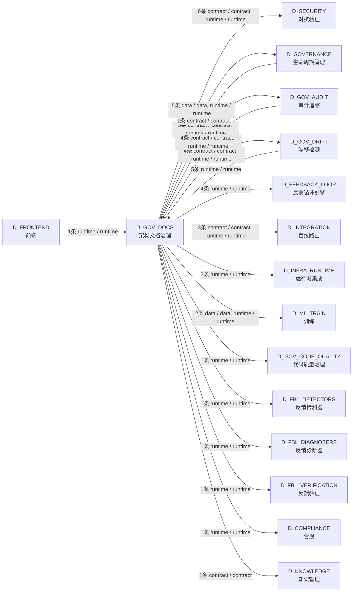

# 40_d_gov_docs / 架构文档治理 / 架构文档治理 / Architecture Docs Governance

> **功能简介 / Overview**: 架构文档治理，负责架构文档生成、一致性和版本管理

> **文档作用 / Purpose**: 展示 架构文档治理（D_GOV_DOCS）功能域的模块清单、域内依赖关系、跨域依赖关系、架构分层视图，供架构审查和域治理参考。

> 本文档由 generate_domain_doc.py 从 depgraph (PostgreSQL) 自动生成
> 数据源: depgraph (PostgreSQL) nodes表 + edges表

## 域基本信息 / Domain Overview

| 字段 | 值 | Field | Value |
|------|------|-------|-------|
| 编号 | 40 | Number | 40 |
| 域ID | D_GOV_DOCS | Domain ID | D_GOV_DOCS |
| 域名称 | 架构文档治理 | Domain Name | Architecture Docs Governance |
| 层级 | L2 业务域层 | Layer | L2 Domain |
| 模块数 | 26 | Module Count | 26 |
| 域内依赖 | 35 | Internal Dependencies | 35 |
| 跨域入边 | 11 | Cross-domain Incoming | 11 |
| 跨域出边 | 37 | Cross-domain Outgoing | 37 |
| 设计态模块 | 26 | Design Modules | 26 |
| 原型态模块 | 0 | Prototype Modules | 0 |
| 生产态模块 | 0 | Production Modules | 0 |
| 容量 | 0/150 (正常) | Capacity | 0/150 (正常) |
| 描述 | 架构模型文档(architecture_model) | Description | 架构模型文档(architecture_model) |

## 模块分层清单 / Module Layered List

> 按 architecture_layer 分组的模块清单（共 26 个模块 / 26 modules）。

### L1 基础层 / Foundation Layer (22 modules)

| # | 模块路径 / Module Path | 模块名称 / Module Name (功能简介 / Description) | 成熟度 / Maturity | 蓝图 / Blueprint |
|:--:|---------|---------|:---:|:---:|
| 1 | docs/03_modules/_cross_layer/auto_fix_engine/blueprint.md | docs__03_modules___cross_layer__auto_fix_engine__blueprint_md | 设计态 / design | [MOD-INF-031](../../03_modules/_cross_layer/auto_fix_engine/blueprint.md) |
| 2 | docs/03_modules/_cross_layer/auto_runtime_core/blueprint.md | docs__03_modules___cross_layer__auto_runtime_core__blueprint_md | 设计态 / design | [MOD-INF-030](../../03_modules/_cross_layer/red_blue_validator/blueprint.md) |
| 3 | docs/03_modules/_cross_layer/behavioral_auditor/blueprint.md | docs__03_modules___cross_layer__behavioral_auditor__blueprint_md | 设计态 / design | [MOD-INF-033](../../03_modules/_cross_layer/behavioral_auditor/blueprint.md) |
| 4 | docs/03_modules/_cross_layer/context_engine/blueprint.md | docs__03_modules___cross_layer__context_engine__blueprint_md | 设计态 / design | [MOD-CONTEXT_ENGINE](../../03_modules/_cross_layer/context_engine/blueprint.md) |
| 5 | docs/03_modules/_cross_layer/database/blueprint.md | docs__03_modules___cross_layer__database__blueprint_md | 设计态 / design | [SH-DB-001](../../03_modules/_cross_layer/database/blueprint.md) |
| 6 | docs/03_modules/_cross_layer/feedback_loop/blueprint.md | docs__03_modules___cross_layer__feedback_loop__blueprint_md | 设计态 / design | [MOD-FEEDBACK_LOOP](../../03_modules/_cross_layer/feedback_loop/blueprint.md) |
| 7 | docs/03_modules/_cross_layer/gate_engine/blueprint.md | docs__03_modules___cross_layer__gate_engine__blueprint_md | 设计态 / design | [MOD-GATE_ENGINE](../../03_modules/_cross_layer/gate_engine/blueprint.md) |
| 8 | docs/03_modules/_cross_layer/model_capability_exam/bluepr... | docs__03_modules___cross_layer__model_capability_exam__blueprint_md | 设计态 / design | [MOD-INF-036](../../03_modules/_cross_layer/model_capability_exam/blueprint.md) |
| 9 | docs/03_modules/_cross_layer/orphan_judge/blueprint.md | docs__03_modules___cross_layer__orphan_judge__blueprint_md | 设计态 / design | [MOD-INF-029](../../03_modules/_cross_layer/orphan_judge/blueprint.md) |
| 10 | docs/03_modules/_cross_layer/pipeline/blueprint.md | docs__03_modules___cross_layer__pipeline__blueprint_md | 设计态 / design | [MOD-INF-009](../../03_modules/_cross_layer/pipeline/blueprint.md) |
| 11 | docs/03_modules/_cross_layer/red_blue_validator/blueprint.md | docs__03_modules___cross_layer__red_blue_validator__blueprint_md | 设计态 / design | [MOD-INF-030](../../03_modules/_cross_layer/red_blue_validator/blueprint.md) |
| 12 | docs/03_modules/_cross_layer/resource_optimization_engine... | docs__03_modules___cross_layer__resource_optimization_engine__blueprint_md | 设计态 / design | [MOD-RESOURCE_OPTIMIZATION_ENGINE](../../03_modules/_cross_layer/resource_optimization_engine/blueprint.md) |
| 13 | docs/03_modules/_cross_layer/semantic_auditor/blueprint.md | docs__03_modules___cross_layer__semantic_auditor__blueprint_md | 设计态 / design | [MOD-INF-028](../../03_modules/_cross_layer/semantic_auditor/blueprint.md) |
| 14 | docs/03_modules/_cross_layer/shared_core/blueprint.md | docs__03_modules___cross_layer__shared_core__blueprint_md | 设计态 / design | [MOD-INF-016](../../03_modules/_cross_layer/shared_core/blueprint.md) |
| 15 | docs/03_modules/_domain_autonomy_core/agent_spec/blueprin... | docs__03_modules___domain_autonomy_core__agent_spec__blueprint_md | 设计态 / design | [MOD-INF-019](../../03_modules/_domain_autonomy_core/agent_spec/blueprint.md) |
| 16 | docs/03_modules/_domain_autonomy_core/rollback_system/blu... | docs__03_modules___domain_autonomy_core__rollback_system__blueprint_md | 设计态 / design | [MOD-INF-021](../../03_modules/_domain_autonomy_core/rollback_system/blueprint.md) |
| 17 | docs/03_modules/_domain_autonomy_perm/budget_enforcer/blu... | docs__03_modules___domain_autonomy_perm__budget_enforcer__blueprint_md | 设计态 / design | [MOD-INF-024](../../03_modules/_domain_autonomy_perm/budget_enforcer/blueprint.md) |
| 18 | docs/03_modules/_domain_autonomy_perm/escalation_protocol... | docs__03_modules___domain_autonomy_perm__escalation_protocol__blueprint_md | 设计态 / design | [MOD-INF-022](../../03_modules/_domain_autonomy_perm/escalation_protocol/blueprint.md) |
| 19 | docs/03_modules/_domain_governance/blueprint.md | docs__03_modules___domain_governance__blueprint_md | 设计态 / design | [MOD-GOVERNANCE](../../03_modules/_domain_governance/blueprint.md) |
| 20 | docs/03_modules/_domain_governance/code_dedup_engine/blue... | docs__03_modules___domain_governance__code_dedup_engine__blueprint_md | 设计态 / design | [MOD-INF-017](../../03_modules/_domain_governance/code_dedup_engine/blueprint.md) |
| 21 | docs/03_modules/_domain_governance/governance_automation/... | docs__03_modules___domain_governance__governance_automation__blueprint_md | 设计态 / design | [MOD-INF-005](../../03_modules/_domain_governance/governance_automation/blueprint.md) |
| 22 | docs/03_modules/_domain_governance/registry_governance/bl... | docs__03_modules___domain_governance__registry_governance__blueprint_md | 设计态 / design | [MOD-INF-037](../../03_modules/_domain_governance/registry_governance/blueprint.md) |

### L2 领域层 / Domain Layer (4 modules)

| # | 模块路径 / Module Path | 模块名称 / Module Name (功能简介 / Description) | 成熟度 / Maturity | 蓝图 / Blueprint |
|:--:|---------|---------|:---:|:---:|
| 1 | docs/03_modules/_master_blueprint/blueprint_agent_spec.md/ |  | 设计态 / design | [MOD-MASTER-001](../../03_modules/_master_blueprint/blueprint_agent_spec.md) |
| 2 | docs/03_modules/_master_blueprint/blueprint_baseline.md/ |  | 设计态 / design | [MOD-MASTER-002](../../03_modules/_master_blueprint/blueprint_baseline.md) |
| 3 | docs/03_modules/_master_blueprint/blueprint_capacity.md/ |  | 设计态 / design | [MOD-MASTER-003](../../03_modules/_master_blueprint/blueprint_capacity.md) |
| 4 | docs/03_modules/_system_master/blueprint.md/ |  | 设计态 / design | [SYS-MASTER-001](../../03_modules/_system_master/blueprint.md) |

## 域内依赖图 / Internal Dependency Diagram

> 依赖图内嵌在本文档中，IDE 可直接渲染显示。参考 decision_index.md 设计，分四个视图：合并全景图、运营态子图、设计态子图、原型态子图（按 design_maturity 实际值拆分）。
>
> **图例说明 / Legend**：
> - **实线边框 = 运营态模块**（production，已上线运行）
> - **虚线边框 = 设计态模块**（design，蓝图阶段，代码未写）
> - **虚线边框 = 原型态模块**（prototype，代码已写，验证中未稳定上线）
> - **实线箭头 = 运营态依赖**（已生效的依赖关系）
> - **虚线箭头 = 非运营态依赖**（计划中/验证中的依赖关系）

### 合并全景图（全部模块，标签标注成熟度）

> 展示全部 26 个模块（生产态 0 + 设计态 26 + 原型态 0），标签标注成熟度。

### 运营态子图（仅 design_maturity=production 的模块和依赖）

> 仅展示已上线运行的模块（共 0 个，0 条域内依赖）。

> （无运营态模块 / No production modules）

### 设计态子图（仅 design_maturity=design 的模块和依赖）

> 仅展示蓝图阶段、代码未写的设计态模块（共 26 个，35 条域内依赖）。

```mermaid
graph TD
    subgraph D_GOV_DOCS["D_GOV_DOCS 架构文档治理"]
        docs_03_modules_cross_layer_auto_fix_engine_blueprint_md["(设计态 / design) docs__03_modules___cross_layer__auto_fix_engine__blueprint_md"]
        docs_03_modules_cross_layer_auto_runtime_core_blueprint_md["(设计态 / design) docs__03_modules___cross_layer__auto_runtime_core__blueprint_md"]
        docs_03_modules_cross_layer_behavioral_auditor_blueprint_md["(设计态 / design) docs__03_modules___cross_layer__behavioral_auditor__blueprint_md"]
        docs_03_modules_cross_layer_context_engine_blueprint_md["(设计态 / design) docs__03_modules___cross_layer__context_engine__blueprint_md"]
        docs_03_modules_cross_layer_database_blueprint_md["(设计态 / design) docs__03_modules___cross_layer__database__blueprint_md"]
        docs_03_modules_cross_layer_feedback_loop_blueprint_md["(设计态 / design) docs__03_modules___cross_layer__feedback_loop__blueprint_md"]
        docs_03_modules_cross_layer_gate_engine_blueprint_md["(设计态 / design) docs__03_modules___cross_layer__gate_engine__blueprint_md"]
        docs_03_modules_cross_layer_model_capability_exam_blueprint_md["(设计态 / design) docs__03_modules___cross_layer__model_capability_exam__blueprint_md"]
        docs_03_modules_cross_layer_orphan_judge_blueprint_md["(设计态 / design) docs__03_modules___cross_layer__orphan_judge__blueprint_md"]
        docs_03_modules_cross_layer_pipeline_blueprint_md["(设计态 / design) docs__03_modules___cross_layer__pipeline__blueprint_md"]
        docs_03_modules_cross_layer_red_blue_validator_blueprint_md["(设计态 / design) docs__03_modules___cross_layer__red_blue_validator__blueprint_md"]
        docs_03_modules_cross_layer_resource_optimization_engine_blueprint_md["(设计态 / design) docs__03_modules___cross_layer__resource_optimization_engine__blueprint_md"]
        docs_03_modules_cross_layer_semantic_auditor_blueprint_md["(设计态 / design) docs__03_modules___cross_layer__semantic_auditor__blueprint_md"]
        docs_03_modules_cross_layer_shared_core_blueprint_md["(设计态 / design) docs__03_modules___cross_layer__shared_core__blueprint_md"]
        docs_03_modules_domain_autonomy_core_agent_spec_blueprint_md["(设计态 / design) docs__03_modules___domain_autonomy_core__agent_spec__blueprint_md"]
        docs_03_modules_domain_autonomy_core_rollback_system_blueprint_md["(设计态 / design) docs__03_modules___domain_autonomy_core__rollback_system__blueprint_md"]
        docs_03_modules_domain_autonomy_perm_budget_enforcer_blueprint_md["(设计态 / design) docs__03_modules___domain_autonomy_perm__budget_enforcer__blueprint_md"]
        docs_03_modules_domain_autonomy_perm_escalation_protocol_blueprint_md["(设计态 / design) docs__03_modules___domain_autonomy_perm__escalation_protocol__blueprint_md"]
        docs_03_modules_domain_governance_blueprint_md["(设计态 / design) docs__03_modules___domain_governance__blueprint_md"]
        docs_03_modules_domain_governance_code_dedup_engine_blueprint_md["(设计态 / design) docs__03_modules___domain_governance__code_dedup_engine__blueprint_md"]
        docs_03_modules_domain_governance_governance_automation_blueprint_md["(设计态 / design) docs__03_modules___domain_governance__governance_automation__blueprint_md"]
        docs_03_modules_domain_governance_registry_governance_blueprint_md["(设计态 / design) docs__03_modules___domain_governance__registry_governance__blueprint_md"]
        docs_03_modules_master_blueprint_blueprint_agent_spec_md["(设计态 / design) "]
        docs_03_modules_master_blueprint_blueprint_baseline_md["(设计态 / design) "]
        docs_03_modules_master_blueprint_blueprint_capacity_md["(设计态 / design) "]
        docs_03_modules_system_master_blueprint_md["(设计态 / design) "]
    end
    docs_03_modules_cross_layer_pipeline_blueprint_md -.->|runtime / runtime| docs_03_modules_cross_layer_model_capability_exam_blueprint_md
    docs_03_modules_cross_layer_red_blue_validator_blueprint_md -.->|runtime / runtime| docs_03_modules_cross_layer_auto_fix_engine_blueprint_md
    docs_03_modules_cross_layer_red_blue_validator_blueprint_md -.->|runtime / runtime| docs_03_modules_cross_layer_gate_engine_blueprint_md
    docs_03_modules_cross_layer_red_blue_validator_blueprint_md -.->|runtime / runtime| docs_03_modules_cross_layer_orphan_judge_blueprint_md
    docs_03_modules_cross_layer_red_blue_validator_blueprint_md -.->|runtime / runtime| docs_03_modules_cross_layer_semantic_auditor_blueprint_md
    docs_03_modules_cross_layer_red_blue_validator_blueprint_md -.->|data / data| docs_03_modules_domain_autonomy_perm_budget_enforcer_blueprint_md
    docs_03_modules_cross_layer_red_blue_validator_blueprint_md -.->|runtime / runtime| docs_03_modules_domain_autonomy_perm_escalation_protocol_blueprint_md
    docs_03_modules_cross_layer_red_blue_validator_blueprint_md -.->|runtime / runtime| docs_03_modules_domain_governance_code_dedup_engine_blueprint_md
    docs_03_modules_cross_layer_resource_optimization_engine_blueprint_md -.->|runtime / runtime| docs_03_modules_cross_layer_feedback_loop_blueprint_md
    docs_03_modules_cross_layer_resource_optimization_engine_blueprint_md -.->|contract / contract| docs_03_modules_cross_layer_gate_engine_blueprint_md
    docs_03_modules_cross_layer_resource_optimization_engine_blueprint_md -.->|runtime / runtime| docs_03_modules_cross_layer_pipeline_blueprint_md
    docs_03_modules_cross_layer_resource_optimization_engine_blueprint_md -.->|runtime / runtime| docs_03_modules_cross_layer_shared_core_blueprint_md
    docs_03_modules_cross_layer_resource_optimization_engine_blueprint_md -.->|contract / contract| docs_03_modules_domain_autonomy_core_agent_spec_blueprint_md
    docs_03_modules_cross_layer_resource_optimization_engine_blueprint_md -.->|runtime / runtime| docs_03_modules_domain_autonomy_perm_budget_enforcer_blueprint_md
    docs_03_modules_domain_autonomy_core_agent_spec_blueprint_md -.->|runtime / runtime| docs_03_modules_cross_layer_context_engine_blueprint_md
    docs_03_modules_domain_autonomy_core_agent_spec_blueprint_md -.->|data / data| docs_03_modules_cross_layer_database_blueprint_md
    docs_03_modules_domain_autonomy_core_agent_spec_blueprint_md -.->|runtime / runtime| docs_03_modules_cross_layer_feedback_loop_blueprint_md
    docs_03_modules_domain_autonomy_core_agent_spec_blueprint_md -.->|runtime / runtime| docs_03_modules_cross_layer_gate_engine_blueprint_md
    docs_03_modules_domain_autonomy_core_agent_spec_blueprint_md -.->|runtime / runtime| docs_03_modules_cross_layer_pipeline_blueprint_md
    docs_03_modules_domain_autonomy_core_agent_spec_blueprint_md -.->|runtime / runtime| docs_03_modules_domain_autonomy_core_rollback_system_blueprint_md
    docs_03_modules_domain_autonomy_core_agent_spec_blueprint_md -.->|runtime / runtime| docs_03_modules_domain_autonomy_perm_budget_enforcer_blueprint_md
    docs_03_modules_domain_autonomy_core_agent_spec_blueprint_md -.->|runtime / runtime| docs_03_modules_domain_autonomy_perm_escalation_protocol_blueprint_md
    docs_03_modules_domain_autonomy_core_agent_spec_blueprint_md -.->|contract / contract| docs_03_modules_domain_governance_governance_automation_blueprint_md
    docs_03_modules_domain_autonomy_core_rollback_system_blueprint_md -.->|runtime / runtime| docs_03_modules_cross_layer_gate_engine_blueprint_md
    docs_03_modules_domain_autonomy_perm_budget_enforcer_blueprint_md -.->|runtime / runtime| docs_03_modules_cross_layer_context_engine_blueprint_md
    docs_03_modules_domain_autonomy_perm_budget_enforcer_blueprint_md -.->|data / data| docs_03_modules_cross_layer_database_blueprint_md
    docs_03_modules_domain_autonomy_perm_budget_enforcer_blueprint_md -.->|data / data| docs_03_modules_cross_layer_shared_core_blueprint_md
    docs_03_modules_domain_autonomy_perm_budget_enforcer_blueprint_md -.->|contract / contract| docs_03_modules_domain_autonomy_perm_escalation_protocol_blueprint_md
    docs_03_modules_domain_autonomy_perm_escalation_protocol_blueprint_md -.->|contract / contract| docs_03_modules_domain_autonomy_core_rollback_system_blueprint_md
    docs_03_modules_domain_governance_code_dedup_engine_blueprint_md -.->|contract / contract| docs_03_modules_cross_layer_context_engine_blueprint_md
    docs_03_modules_domain_governance_code_dedup_engine_blueprint_md -.->|data / data| docs_03_modules_cross_layer_database_blueprint_md
    docs_03_modules_domain_governance_code_dedup_engine_blueprint_md -.->|runtime / runtime| docs_03_modules_cross_layer_feedback_loop_blueprint_md
    docs_03_modules_domain_governance_code_dedup_engine_blueprint_md -.->|runtime / runtime| docs_03_modules_cross_layer_gate_engine_blueprint_md
    docs_03_modules_domain_governance_code_dedup_engine_blueprint_md -.->|contract / contract| docs_03_modules_cross_layer_shared_core_blueprint_md
    docs_03_modules_domain_governance_code_dedup_engine_blueprint_md -.->|contract / contract| docs_03_modules_domain_governance_governance_automation_blueprint_md
    D_GOVERNANCE["(原型态 / prototype) D_GOVERNANCE"]
    docs_03_modules_domain_governance_governance_automation_blueprint_md -.->|runtime / runtime| D_GOVERNANCE
    docs_03_modules_domain_governance_governance_automation_blueprint_md -.->|runtime / runtime| D_GOVERNANCE
    D_FEEDBACK_LOOP["(原型态 / prototype) D_FEEDBACK_LOOP"]
    docs_03_modules_cross_layer_feedback_loop_blueprint_md -.->|runtime / runtime| D_FEEDBACK_LOOP
    D_FBL_DETECTORS["(原型态 / prototype) D_FBL_DETECTORS"]
    docs_03_modules_cross_layer_feedback_loop_blueprint_md -.->|runtime / runtime| D_FBL_DETECTORS
    D_FBL_DIAGNOSERS["(原型态 / prototype) D_FBL_DIAGNOSERS"]
    docs_03_modules_cross_layer_feedback_loop_blueprint_md -.->|runtime / runtime| D_FBL_DIAGNOSERS
    D_FBL_VERIFICATION["(生产态 / production) D_FBL_VERIFICATION"]
    docs_03_modules_cross_layer_feedback_loop_blueprint_md -.->|runtime / runtime| D_FBL_VERIFICATION
    docs_03_modules_cross_layer_feedback_loop_blueprint_md -.->|runtime / runtime| D_FEEDBACK_LOOP
    docs_03_modules_cross_layer_feedback_loop_blueprint_md -.->|runtime / runtime| D_FEEDBACK_LOOP
    docs_03_modules_cross_layer_feedback_loop_blueprint_md -.->|runtime / runtime| D_FEEDBACK_LOOP
    D_COMPLIANCE["(原型态 / prototype) D_COMPLIANCE"]
    docs_03_modules_cross_layer_feedback_loop_blueprint_md -.->|runtime / runtime| D_COMPLIANCE
    D_GOV_CODE_QUALITY["(原型态 / prototype) D_GOV_CODE_QUALITY"]
    docs_03_modules_cross_layer_feedback_loop_blueprint_md -.->|runtime / runtime| D_GOV_CODE_QUALITY
    D_INTEGRATION["(原型态 / prototype) D_INTEGRATION"]
    docs_03_modules_cross_layer_feedback_loop_blueprint_md -.->|runtime / runtime| D_INTEGRATION
    D_GOV_AUDIT["(设计态 / design) D_GOV_AUDIT"]
    docs_03_modules_domain_autonomy_core_rollback_system_blueprint_md -.->|contract / contract| D_GOV_AUDIT
    D_SECURITY["(生产态 / production) D_SECURITY"]
    docs_03_modules_domain_autonomy_core_rollback_system_blueprint_md -.->|runtime / runtime| D_SECURITY
    docs_03_modules_cross_layer_red_blue_validator_blueprint_md -.->|contract / contract| D_GOV_AUDIT
    D_GOVERNANCE -.->|contract / contract| docs_03_modules_domain_governance_governance_automation_blueprint_md
    D_GOV_DRIFT["(设计态 / design) D_GOV_DRIFT"]
    D_GOV_DRIFT -.->|runtime / runtime| docs_03_modules_domain_autonomy_core_rollback_system_blueprint_md
    D_GOV_DRIFT -.->|runtime / runtime| docs_03_modules_domain_autonomy_perm_escalation_protocol_blueprint_md
    D_GOV_DRIFT -.->|runtime / runtime| docs_03_modules_cross_layer_gate_engine_blueprint_md
    D_GOV_DRIFT -.->|runtime / runtime| docs_03_modules_cross_layer_shared_core_blueprint_md
    D_GOV_DRIFT -.->|runtime / runtime| docs_03_modules_cross_layer_database_blueprint_md
    D_GOV_AUDIT -.->|runtime / runtime| docs_03_modules_cross_layer_database_blueprint_md
    D_GOV_AUDIT -.->|runtime / runtime| docs_03_modules_cross_layer_gate_engine_blueprint_md
    D_GOV_AUDIT -.->|contract / contract| docs_03_modules_cross_layer_shared_core_blueprint_md
    D_GOV_AUDIT -.->|runtime / runtime| docs_03_modules_cross_layer_red_blue_validator_blueprint_md
    D_FRONTEND["(设计态 / design) D_FRONTEND"]
    D_FRONTEND -.->|runtime / runtime| docs_03_modules_domain_governance_blueprint_md
    classDef production fill:#e1f5fe,stroke:#01579b,stroke-width:2px,color:#000
    classDef design fill:#fff3e0,stroke:#e65100,stroke-width:2px,color:#000,stroke-dasharray: 5 5
    classDef external_prod fill:#e8f5e9,stroke:#1b5e20,stroke-width:1px,color:#000
    classDef external_design fill:#fce4ec,stroke:#880e4f,stroke-width:1px,color:#000,stroke-dasharray: 5 5
    class docs_03_modules_cross_layer_auto_fix_engine_blueprint_md,docs_03_modules_cross_layer_auto_runtime_core_blueprint_md,docs_03_modules_cross_layer_behavioral_auditor_blueprint_md,docs_03_modules_cross_layer_context_engine_blueprint_md,docs_03_modules_cross_layer_database_blueprint_md,docs_03_modules_cross_layer_feedback_loop_blueprint_md,docs_03_modules_cross_layer_gate_engine_blueprint_md,docs_03_modules_cross_layer_model_capability_exam_blueprint_md,docs_03_modules_cross_layer_orphan_judge_blueprint_md,docs_03_modules_cross_layer_pipeline_blueprint_md,docs_03_modules_cross_layer_red_blue_validator_blueprint_md,docs_03_modules_cross_layer_resource_optimization_engine_blueprint_md,docs_03_modules_cross_layer_semantic_auditor_blueprint_md,docs_03_modules_cross_layer_shared_core_blueprint_md,docs_03_modules_domain_autonomy_core_agent_spec_blueprint_md,docs_03_modules_domain_autonomy_core_rollback_system_blueprint_md,docs_03_modules_domain_autonomy_perm_budget_enforcer_blueprint_md,docs_03_modules_domain_autonomy_perm_escalation_protocol_blueprint_md,docs_03_modules_domain_governance_blueprint_md,docs_03_modules_domain_governance_code_dedup_engine_blueprint_md,docs_03_modules_domain_governance_governance_automation_blueprint_md,docs_03_modules_domain_governance_registry_governance_blueprint_md,docs_03_modules_master_blueprint_blueprint_agent_spec_md,docs_03_modules_master_blueprint_blueprint_baseline_md,docs_03_modules_master_blueprint_blueprint_capacity_md,docs_03_modules_system_master_blueprint_md design
    class D_FBL_VERIFICATION,D_SECURITY external_prod
    class D_GOVERNANCE,D_FEEDBACK_LOOP,D_FBL_DETECTORS,D_FBL_DIAGNOSERS,D_COMPLIANCE,D_GOV_CODE_QUALITY,D_INTEGRATION,D_GOV_AUDIT,D_GOV_DRIFT,D_FRONTEND external_design
```

### 原型态子图（仅 design_maturity=prototype 的模块和依赖）

> 仅展示代码已写、验证中未稳定上线的原型态模块（共 0 个，0 条域内依赖）。

> （无原型态模块 / No prototype modules）

## 跨域依赖 / Cross-domain Dependencies

### 本域依赖的其他域（出边）/ Depends On

| # | 本域模块 / Source Module | → | 外部域-目标模块 / Target Module | 依赖类型 / Type |
|:--:|---------|:--:|---------|---------|
| 1 | blueprint.md | → | D_COMPLIANCE 合规: security_gateway_base.py | runtime / runtime |
| 2 | blueprint.md | → | D_FBL_DETECTORS 反馈检测器: __init__.py | runtime / runtime |
| 3 | blueprint.md | → | D_FBL_DIAGNOSERS 反馈诊断器: __init__.py | runtime / runtime |
| 4 | blueprint.md | → | D_FBL_VERIFICATION 反馈验证: Cross-Session Knowledge Integrity — v0.16.0 R2... | runtime / runtime |
| 5 | blueprint.md | → | D_FEEDBACK_LOOP 反馈循环引擎: feedback-loop.collectors — auto-generated pack... | runtime / runtime |
| 6 | blueprint.md | → | D_FEEDBACK_LOOP 反馈循环引擎: Auto Reward — v0.7.0 R76 (auto_reward.py) | runtime / runtime |
| 7 | blueprint.md | → | D_FEEDBACK_LOOP 反馈循环引擎: TOCTOU Guard — v0.15.0 R207 (toctou_guard.py) | runtime / runtime |
| 8 | blueprint.md | → | D_FEEDBACK_LOOP 反馈循环引擎: feedback-loop.resilience — auto-generated pack... | runtime / runtime |
| 9 | blueprint.md | → | D_GOVERNANCE 生命周期管理: audit_logger.py | runtime / runtime |
| 10 | blueprint.md | → | D_GOVERNANCE 生命周期管理: post_sync_validator — post_sync_standard 命令.... | data / data |
| 11 | blueprint.md | → | D_GOVERNANCE 生命周期管理: Batch2 治理层契约 — 15条 Pydantic v2 Schema（P... | runtime / runtime |
| 12 | blueprint.md | → | D_GOVERNANCE 生命周期管理: post_sync_validator — post_sync_standard 命令.... | runtime / runtime |
| 13 | blueprint.md | → | D_GOVERNANCE 生命周期管理: Batch2 治理层契约 — 15条 Pydantic v2 Schema（P... | runtime / runtime |
| 14 | blueprint.md | → | D_GOV_AUDIT 审计追踪: blueprint.md | contract / contract |
| 15 | blueprint.md | → | D_GOV_AUDIT 审计追踪: blueprint.md | contract / contract |
| 16 | blueprint.md | → | D_GOV_AUDIT 审计追踪: blueprint.md | runtime / runtime |
| 17 | blueprint.md | → | D_GOV_AUDIT 审计追踪: blueprint.md | contract / contract |
| 18 | blueprint.md | → | D_GOV_AUDIT 审计追踪: blueprint.md | runtime / runtime |
| 19 | blueprint.md | → | D_GOV_CODE_QUALITY 代码质量治理: ch_final_gate.py — ch_writer.query() 直接调用.... | runtime / runtime |
| 20 | blueprint.md | → | D_GOV_DRIFT 漂移检测: blueprint.md | runtime / runtime |
| 21 | blueprint.md | → | D_GOV_DRIFT 漂移检测: blueprint.md | runtime / runtime |
| 22 | blueprint.md | → | D_GOV_DRIFT 漂移检测: blueprint.md | runtime / runtime |
| 23 | blueprint.md | → | D_GOV_DRIFT 漂移检测: blueprint.md | contract / contract |
| 24 | blueprint.md | → | D_INFRA_RUNTIME 运行时集成: blueprint.md | runtime / runtime |
| 25 | blueprint.md | → | D_INFRA_RUNTIME 运行时集成: blueprint.md | runtime / runtime |
| 26 | blueprint.md | → | D_INTEGRATION 管线路由: Structural Protocol interfaces for cross-module... | runtime / runtime |
| 27 | blueprint.md | → | D_INTEGRATION 管线路由: MCP Prompt 模板提供者（MOD-INF-013 Phase 6 — .... | runtime / runtime |
| 28 | blueprint.md | → | D_INTEGRATION 管线路由: MCP Prompt 模板提供者（MOD-INF-013 Phase 6 — .... | contract / contract |
| 29 | blueprint.md | → | D_KNOWLEDGE 知识管理: blueprint.md | contract / contract |
| 30 | blueprint.md | → | D_ML_TRAIN 训练: blueprint.md | runtime / runtime |
| 31 | blueprint.md | → | D_ML_TRAIN 训练: blueprint.md | data / data |
| 32 | blueprint.md | → | D_SECURITY 对抗验证: AgentRbac 异常类型. (exceptions.py) | contract / contract |
| 33 | blueprint.md | → | D_SECURITY 对抗验证: LLM Security Gateway - Streamlit Dashboard. (ap... | contract / contract |
| 34 | blueprint.md | → | D_SECURITY 对抗验证: AgentRbac 异常类型. (exceptions.py) | runtime / runtime |
| 35 | blueprint.md | → | D_SECURITY 对抗验证: LLM Security Gateway - Streamlit Dashboard. (ap... | runtime / runtime |
| 36 | blueprint.md | → | D_SECURITY 对抗验证: AgentRbac 异常类型. (exceptions.py) | runtime / runtime |
| 37 | blueprint.md | → | D_SECURITY 对抗验证: LLM Security Gateway - Streamlit Dashboard. (ap... | contract / contract |

### 依赖本域的其他域（入边）/ Depended By

| # | 外部域-源模块 / Source Module | → | 本域模块 / Target Module | 依赖类型 / Type |
|:--:|---------|:--:|---------|---------|
| 1 | D_FRONTEND 前端:  | → | blueprint.md | runtime / runtime |
| 2 | D_GOVERNANCE 生命周期管理: post_sync_validator — post_sync_standard 命令.... | → | blueprint.md | contract / contract |
| 3 | D_GOV_AUDIT 审计追踪: blueprint.md | → | blueprint.md | runtime / runtime |
| 4 | D_GOV_AUDIT 审计追踪: blueprint.md | → | blueprint.md | runtime / runtime |
| 5 | D_GOV_AUDIT 审计追踪: blueprint.md | → | blueprint.md | runtime / runtime |
| 6 | D_GOV_AUDIT 审计追踪: blueprint.md | → | blueprint.md | contract / contract |
| 7 | D_GOV_DRIFT 漂移检测: blueprint.md | → | blueprint.md | runtime / runtime |
| 8 | D_GOV_DRIFT 漂移检测: blueprint.md | → | blueprint.md | runtime / runtime |
| 9 | D_GOV_DRIFT 漂移检测: blueprint.md | → | blueprint.md | runtime / runtime |
| 10 | D_GOV_DRIFT 漂移检测: blueprint.md | → | blueprint.md | runtime / runtime |
| 11 | D_GOV_DRIFT 漂移检测: blueprint.md | → | blueprint.md | runtime / runtime |

### 跨域依赖图 / Cross-domain Dependency Diagram

> 本域与 15 个外部域直接连接（出边 37 条 + 入边 11 条 = 48 条）。只显示直接连接的域，不展开具体节点。

## 说明 / Notes

- **数据源 / Data Source**: `depgraph (PostgreSQL)` 的 `nodes`、`edges`、`domains` 表
- **生成器 / Generator**: `generate_domain_doc.py`（G2+G10 合并）
- **维护方式 / Maintenance**: 自动生成，全景图更新时刷新
- **文件名规则 / File Naming**: `{编号:02d}_{域ID小写}.md`，如 `16_d_trading.md`
- **图例说明 / Legend**: `[production]`=已上线 / `[design]`=设计中 / `[prototype]`=原型 / `[unknown]`=未知
