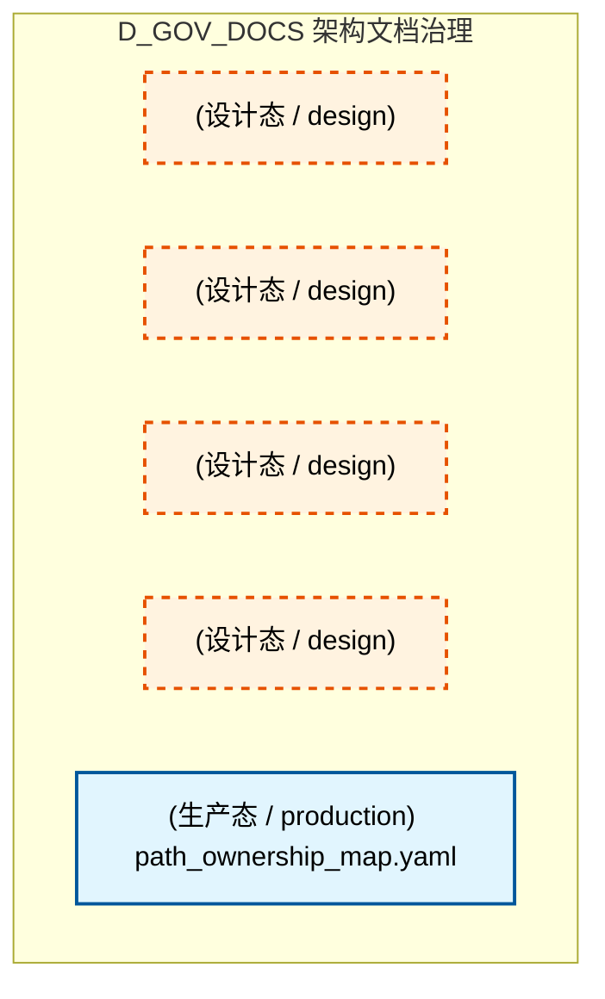
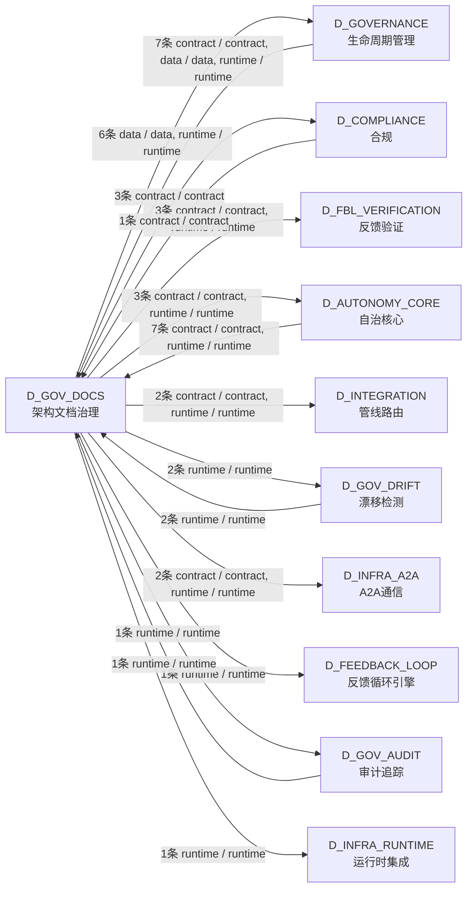

# 40_d_gov_docs / architecture_docs / 架构文档治理 / Architecture Docs Governance

> **功能简介 / Overview**: 架构文档治理，负责架构文档生成、一致性和版本管理

> **文档作用 / Purpose**: 展示 架构文档治理（D_GOV_DOCS）功能域的模块清单、域内依赖关系、跨域依赖关系、架构分层视图，供架构审查和域治理参考。

> 本文档由 generate_domain_doc.py 从 depgraph (PostgreSQL) 自动生成
> 最后更新: 2026-07-15 11:53:27
> 数据源: depgraph (PostgreSQL) nodes表 + edges表

## 域基本信息 / Domain Overview

| 字段 | 值 | Field | Value |
|------|------|-------|-------|
| 编号 | 40 | Number | 40 |
| 域ID | D_GOV_DOCS | Domain ID | D_GOV_DOCS |
| 域名称 | 架构文档治理 | Domain Name | Architecture Docs Governance |
| 层级 | L2 业务域层 | Layer | L2 Domain |
| 模块数 | 95 | Module Count | 95 |
| 域内依赖 | 4 | Internal Dependencies | 4 |
| 跨域入边 | 18 | Cross-domain Incoming | 18 |
| 跨域出边 | 24 | Cross-domain Outgoing | 24 |
| 设计态模块 | 26 | Design Modules | 26 |
| 原型态模块 | 0 | Prototype Modules | 0 |
| 生产态模块 | 69 | Production Modules | 69 |
| 容量 | 69/150 (正常) | Capacity | 69/150 (正常) |
| 描述 | 架构模型文档(architecture_model) | Description | 架构模型文档(architecture_model) |

## 模块分层清单 / Module Layered List

> 按 architecture_layer 分组的模块清单（共 95 个模块 / 95 modules）。

### L1 基础层 / Foundation Layer (22 modules)

| # | 模块路径 / Module Path | 模块名称 / Module Name (功能简介 / Description) | 成熟度 / Maturity | 蓝图 / Blueprint |
|:--:|---------|---------|:---:|:---:|
| 1 | docs/03_modules/_cross_layer/auto_fix_engine/blueprint.md | docs__03_modules___cross_layer__auto_fix_engine__blueprint_md | 设计态 / design | [MOD-INF-031](../../03_modules/_cross_layer/auto_fix_engine/blueprint.md) |
| 2 | docs/03_modules/_cross_layer/auto_runtime_core/blueprint.md | docs__03_modules___cross_layer__auto_runtime_core__blueprint_md | 设计态 / design | [MOD-INF-030](../../03_modules/_cross_layer/red_blue_validator/blueprint.md) |
| 3 | docs/03_modules/_cross_layer/behavioral_auditor/blueprint.md | docs__03_modules___cross_layer__behavioral_auditor__blueprint_md | 设计态 / design | [MOD-INF-033](../../03_modules/_cross_layer/behavioral_auditor/blueprint.md) |
| 4 | docs/03_modules/_cross_layer/context_engine/blueprint.md | docs__03_modules___cross_layer__context_engine__blueprint_md | 设计态 / design | [MOD-CONTEXT_ENGINE](../../03_modules/_cross_layer/context_engine/blueprint.md) |
| 5 | docs/03_modules/_cross_layer/database/blueprint.md | docs__03_modules___cross_layer__database__blueprint_md | 设计态 / design | [SH-DB-001](../../03_modules/_cross_layer/database/blueprint.md) |
| 6 | docs/03_modules/_cross_layer/feedback_loop/blueprint.md | docs__03_modules___cross_layer__feedback_loop__blueprint_md | 设计态 / design | [MOD-FEEDBACK_LOOP](../../03_modules/_cross_layer/feedback_loop/blueprint.md) |
| 7 | docs/03_modules/_cross_layer/gate_engine/blueprint.md | docs__03_modules___cross_layer__gate_engine__blueprint_md | 设计态 / design | [MOD-GATE_ENGINE](../../03_modules/_cross_layer/gate_engine/blueprint.md) |
| 8 | docs/03_modules/_cross_layer/model_capability_exam/bluepr... | docs__03_modules___cross_layer__model_capability_exam__blueprint_md | 设计态 / design | [MOD-INF-036](../../03_modules/_cross_layer/model_capability_exam/blueprint.md) |
| 9 | docs/03_modules/_cross_layer/orphan_judge/blueprint.md | docs__03_modules___cross_layer__orphan_judge__blueprint_md | 设计态 / design | [MOD-INF-029](../../03_modules/_cross_layer/orphan_judge/blueprint.md) |
| 10 | docs/03_modules/_cross_layer/pipeline/blueprint.md | docs__03_modules___cross_layer__pipeline__blueprint_md | 设计态 / design | [MOD-INF-009](../../03_modules/_cross_layer/pipeline/blueprint.md) |
| 11 | docs/03_modules/_cross_layer/red_blue_validator/blueprint.md | docs__03_modules___cross_layer__red_blue_validator__blueprint_md | 设计态 / design | [MOD-INF-030](../../03_modules/_cross_layer/red_blue_validator/blueprint.md) |
| 12 | docs/03_modules/_cross_layer/resource_optimization_engine... | docs__03_modules___cross_layer__resource_optimization_engine__blueprint_md | 设计态 / design | [MOD-RESOURCE_OPTIMIZATION_ENGINE](../../03_modules/_cross_layer/resource_optimization_engine/blueprint.md) |
| 13 | docs/03_modules/_cross_layer/semantic_auditor/blueprint.md | docs__03_modules___cross_layer__semantic_auditor__blueprint_md | 设计态 / design | [MOD-INF-028](../../03_modules/_cross_layer/semantic_auditor/blueprint.md) |
| 14 | docs/03_modules/_cross_layer/shared_core/blueprint.md | docs__03_modules___cross_layer__shared_core__blueprint_md | 设计态 / design | [MOD-INF-016](../../03_modules/_cross_layer/shared_core/blueprint.md) |
| 15 | docs/03_modules/_domain_autonomy_core/agent_spec/blueprin... | docs__03_modules___domain_autonomy_core__agent_spec__blueprint_md | 设计态 / design | [MOD-INF-019](../../03_modules/_domain_autonomy_core/agent_spec/blueprint.md) |
| 16 | docs/03_modules/_domain_autonomy_core/rollback_system/blu... | docs__03_modules___domain_autonomy_core__rollback_system__blueprint_md | 设计态 / design | [MOD-INF-021](../../03_modules/_domain_autonomy_core/rollback_system/blueprint.md) |
| 17 | docs/03_modules/_domain_autonomy_perm/budget_enforcer/blu... | docs__03_modules___domain_autonomy_perm__budget_enforcer__blueprint_md | 设计态 / design | [MOD-INF-024](../../03_modules/_domain_autonomy_perm/budget_enforcer/blueprint.md) |
| 18 | docs/03_modules/_domain_autonomy_perm/escalation_protocol... | docs__03_modules___domain_autonomy_perm__escalation_protocol__blueprint_md | 设计态 / design | [MOD-INF-022](../../03_modules/_domain_autonomy_perm/escalation_protocol/blueprint.md) |
| 19 | docs/03_modules/_domain_governance/blueprint.md | docs__03_modules___domain_governance__blueprint_md | 设计态 / design | [MOD-GOVERNANCE](../../03_modules/_domain_governance/blueprint.md) |
| 20 | docs/03_modules/_domain_governance/code_dedup_engine/blue... | docs__03_modules___domain_governance__code_dedup_engine__blueprint_md | 设计态 / design | [MOD-INF-017](../../03_modules/_domain_governance/code_dedup_engine/blueprint.md) |
| 21 | docs/03_modules/_domain_governance/governance_automation/... | docs__03_modules___domain_governance__governance_automation__blueprint_md | 设计态 / design | [MOD-INF-005](../../03_modules/_domain_governance/governance_automation/blueprint.md) |
| 22 | docs/03_modules/_domain_governance/registry_governance/bl... | docs__03_modules___domain_governance__registry_governance__blueprint_md | 设计态 / design | [MOD-INF-037](../../03_modules/_domain_governance/registry_governance/blueprint.md) |

### L2 领域层 / Domain Layer (73 modules)

| # | 模块路径 / Module Path | 模块名称 / Module Name (功能简介 / Description) | 成熟度 / Maturity | 蓝图 / Blueprint |
|:--:|---------|---------|:---:|:---:|
| 1 | docs/01_policies_and_standards/_registry/schemas/session_... | session_log_schema.yaml | 生产态 / production | [MOD-GOVERNANCE](../../03_modules/_domain_governance/blueprint.md) |
| 2 | docs/01_policies_and_standards/rules/trae_001_file_operat... | trae_001_file_operation_security.yaml | 生产态 / production |  |
| 3 | docs/01_policies_and_standards/rules/trae_002_anti_orphan... | trae_002_anti_orphan_search_first.yaml | 生产态 / production |  |
| 4 | docs/01_policies_and_standards/rules/trae_003_task_granul... | trae_003_task_granularity_threshold.yaml | 生产态 / production |  |
| 5 | docs/01_policies_and_standards/rules/trae_004_parallel_at... | trae_004_parallel_atomic_transaction.yaml | 生产态 / production |  |
| 6 | docs/01_policies_and_standards/rules/trae_005_modificatio... | trae_005_modification_governance.yaml | 生产态 / production |  |
| 7 | docs/01_policies_and_standards/rules/trae_006_anti_halluc... | trae_006_anti_hallucination_structure.yaml | 生产态 / production |  |
| 8 | docs/01_policies_and_standards/rules/trae_007_anti_halluc... | trae_007_anti_hallucination_behavior.yaml | 生产态 / production |  |
| 9 | docs/01_policies_and_standards/rules/trae_008_anti_halluc... | trae_008_anti_hallucination_output.yaml | 生产态 / production |  |
| 10 | docs/01_policies_and_standards/rules/trae_009_anti_halluc... | trae_009_anti_hallucination_safety.yaml | 生产态 / production |  |
| 11 | docs/01_policies_and_standards/rules/trae_010_code_naming... | trae_010_code_naming_organization.yaml | 生产态 / production |  |
| 12 | docs/01_policies_and_standards/rules/trae_011_code_type_i... | trae_011_code_type_import.yaml | 生产态 / production |  |
| 13 | docs/01_policies_and_standards/rules/trae_012_code_test_s... | trae_012_code_test_security.yaml | 生产态 / production |  |
| 14 | docs/01_policies_and_standards/rules/trae_013_arch_cross_... | trae_013_arch_cross_package_dep.yaml | 生产态 / production |  |
| 15 | docs/01_policies_and_standards/rules/trae_014_arch_bluepr... | trae_014_arch_blueprint_alignment.yaml | 生产态 / production |  |
| 16 | docs/01_policies_and_standards/rules/trae_015_arch_path_r... | trae_015_arch_path_registration.yaml | 生产态 / production |  |
| 17 | docs/01_policies_and_standards/rules/trae_016_arch_drift_... | trae_016_arch_drift_detection.yaml | 生产态 / production |  |
| 18 | docs/01_policies_and_standards/rules/trae_017_arch_govern... | trae_017_arch_governance_order.yaml | 生产态 / production |  |
| 19 | docs/01_policies_and_standards/rules/trae_018_behavior_co... | trae_018_behavior_code_prohibition.yaml | 生产态 / production |  |
| 20 | docs/01_policies_and_standards/rules/trae_019_behavior_se... | trae_019_behavior_security_prohibition.yaml | 生产态 / production |  |
| 21 | docs/01_policies_and_standards/rules/trae_020_behavior_go... | trae_020_behavior_governance_prohibition.yaml | 生产态 / production |  |
| 22 | docs/01_policies_and_standards/rules/trae_021_behavior_ot... | trae_021_behavior_other_prohibition.yaml | 生产态 / production |  |
| 23 | docs/01_policies_and_standards/rules/trae_022_behavior_co... | trae_022_behavior_conditional_code.yaml | 生产态 / production |  |
| 24 | docs/01_policies_and_standards/rules/trae_023_behavior_co... | trae_023_behavior_conditional_governance.yaml | 生产态 / production |  |
| 25 | docs/01_policies_and_standards/rules/trae_024_methodology... | trae_024_methodology_diagnosis.yaml | 生产态 / production |  |
| 26 | docs/01_policies_and_standards/rules/trae_025_methodology... | trae_025_methodology_decision.yaml | 生产态 / production |  |
| 27 | docs/01_policies_and_standards/rules/trae_026_methodology... | trae_026_methodology_quality.yaml | 生产态 / production |  |
| 28 | docs/01_policies_and_standards/rules/trae_027_methodology... | trae_027_methodology_collaboration.yaml | 生产态 / production |  |
| 29 | docs/01_policies_and_standards/rules/trae_028_doc_structu... | trae_028_doc_structure_naming.yaml | 生产态 / production |  |
| 30 | docs/01_policies_and_standards/rules/trae_029_doc_operati... | trae_029_doc_operation_security.yaml | 生产态 / production |  |
| 31 | docs/01_policies_and_standards/rules/trae_030_doc_numberi... | trae_030_doc_numbering_metadata.yaml | 生产态 / production |  |
| 32 | docs/01_policies_and_standards/rules/trae_031_security_ke... | trae_031_security_key_access.yaml | 生产态 / production |  |
| 33 | docs/01_policies_and_standards/rules/trae_032_module_life... | trae_032_module_lifecycle.yaml | 生产态 / production |  |
| 34 | docs/01_policies_and_standards/rules/trae_033_module_regi... | trae_033_module_registration_sync.yaml | 生产态 / production |  |
| 35 | docs/01_policies_and_standards/rules/trae_034_task_card_s... | trae_034_task_card_standard.yaml | 生产态 / production |  |
| 36 | docs/01_policies_and_standards/rules/trae_035_task_constr... | trae_035_task_construction_verification.yaml | 生产态 / production |  |
| 37 | docs/01_policies_and_standards/rules/trae_036_arch_gate_t... | trae_036_arch_gate_transition.yaml | 生产态 / production |  |
| 38 | docs/01_policies_and_standards/rules/trae_037_arch_qualif... | trae_037_arch_qualification_versioning.yaml | 生产态 / production |  |
| 39 | docs/01_policies_and_standards/rules/trae_038_arch_ctr_in... | trae_038_arch_ctr_injection.yaml | 生产态 / production |  |
| 40 | docs/01_policies_and_standards/rules/trae_039_ai_hallucin... | trae_039_ai_hallucination_detection.yaml | 生产态 / production |  |
| 41 | docs/01_policies_and_standards/rules/trae_040_ai_model_ro... | trae_040_ai_model_routing.yaml | 生产态 / production |  |
| 42 | docs/01_policies_and_standards/rules/trae_041_meta_rule_c... | trae_041_meta_rule_classification.yaml | 生产态 / production |  |
| 43 | docs/01_policies_and_standards/rules/trae_042_meta_rule_s... | trae_042_meta_rule_standard.yaml | 生产态 / production |  |
| 44 | docs/01_policies_and_standards/rules/trae_043_meta_rule_m... | trae_043_meta_rule_metadata.yaml | 生产态 / production |  |
| 45 | docs/01_policies_and_standards/rules/trae_044_compliance_... | trae_044_compliance_audit.yaml | 生产态 / production |  |
| 46 | docs/01_policies_and_standards/rules/trae_045_data_qualit... | trae_045_data_quality_lineage.yaml | 生产态 / production |  |
| 47 | docs/01_policies_and_standards/rules/trae_046_engineering... | trae_046_engineering_code_restructure.yaml | 生产态 / production |  |
| 48 | docs/01_policies_and_standards/rules/trae_047_engineering... | trae_047_engineering_file_header.yaml | 生产态 / production |  |
| 49 | docs/01_policies_and_standards/rules/trae_048_ops_vibe_co... | trae_048_ops_vibe_coding_session.yaml | 生产态 / production |  |
| 50 | docs/01_policies_and_standards/rules/trae_049_ops_domain_... | trae_049_ops_domain_manual.yaml | 生产态 / production |  |
| 51 | docs/01_policies_and_standards/rules/trae_050_domain_poli... | trae_050_domain_policy_data_factor.yaml | 生产态 / production |  |
| 52 | docs/01_policies_and_standards/rules/trae_051_domain_poli... | trae_051_domain_policy_risk_backtest.yaml | 生产态 / production |  |
| 53 | docs/01_policies_and_standards/rules/trae_052_cross_bluep... | trae_052_cross_blueprint_change_cleanup.yaml | 生产态 / production |  |
| 54 | docs/01_policies_and_standards/rules/trae_053_automation_... | trae_053_automation_dual_track.yaml | 生产态 / production |  |
| 55 | docs/01_policies_and_standards/rules/trae_054_depgraph_ac... | trae_054_depgraph_access_protocol.yaml | 生产态 / production |  |
| 56 | docs/01_policies_and_standards/rules/trae_055_arch_domain... | trae_055_arch_domain_capacity.yaml | 生产态 / production |  |
| 57 | docs/01_policies_and_standards/rules/trae_056_module_crea... | trae_056_module_creation_workflow.yaml | 生产态 / production |  |
| 58 | docs/01_policies_and_standards/rules/trae_057_ai_consumer... | trae_057_ai_consumer_first.yaml | 生产态 / production |  |
| 59 | docs/01_policies_and_standards/rules/trae_058_depgraph_sc... | trae_058_depgraph_scan_exclusions.yaml | 生产态 / production |  |
| 60 | docs/01_policies_and_standards/rules/trae_059_schema_vers... | trae_059_schema_version_write_protection.yaml | 生产态 / production |  |
| 61 | docs/01_policies_and_standards/rules/trae_060_inward_cons... | trae_060_inward_consolidation.yaml | 生产态 / production |  |
| 62 | docs/01_policies_and_standards/rules/trae_061_decisiongra... | trae_061_decisiongraph_access_protocol.yaml | 生产态 / production |  |
| 63 | docs/01_policies_and_standards/rules/trae_062_ssot_classi... | trae_062_ssot_classification.yaml | 生产态 / production |  |
| 64 | docs/02_enterprise_architecture/05_dataflow_architecture/... | data_acquisition_requirements.yaml | 生产态 / production |  |
| 65 | docs/02_enterprise_architecture/migration-registry.yaml | migration-registry.yaml | 生产态 / production |  |
| 66 | docs/03_modules/_cross_layer/database/business_data_categ... | business_data_categories.yaml | 生产态 / production |  |
| 67 | docs/03_modules/_domain_infrastructure_operations/agent_t... | arbitration_rules.yaml | 生产态 / production | [MOD-INF-025](../../03_modules/_domain_infrastructure_operations/agent_to_agent_protocol/blueprint.md) |
| 68 | docs/03_modules/_domain_infrastructure_operations/agent_t... | trigger_config.yaml | 生产态 / production | [MOD-INF-025](../../03_modules/_domain_infrastructure_operations/agent_to_agent_protocol/blueprint.md) |
| 69 | docs/03_modules/_master_blueprint/blueprint_agent_spec.md/ |  | 设计态 / design |  |
| 70 | docs/03_modules/_master_blueprint/blueprint_baseline.md/ |  | 设计态 / design |  |
| 71 | docs/03_modules/_master_blueprint/blueprint_capacity.md/ |  | 设计态 / design |  |
| 72 | docs/03_modules/_system_master/blueprint.md/ |  | 设计态 / design | [SYS-MASTER-001](../../03_modules/_system_master/blueprint.md) |
| 73 | docs/03_modules/path_ownership_map.yaml | path_ownership_map.yaml | 生产态 / production |  |

## 域内依赖图 / Internal Dependency Diagram

> 依赖图内嵌在本文档中，IDE 可直接渲染显示。参考 decision_index.md 设计，分四个视图：合并全景图、运营态子图、设计态子图、原型态子图（按 design_maturity 实际值拆分）。
>
> **图例说明 / Legend**：
> - **实线边框 = 运营态模块**（production，已上线运行）
> - **虚线边框 = 设计态模块**（design，蓝图阶段，代码未写）
> - **虚线边框 = 原型态模块**（prototype，代码已写，验证中未稳定上线）
> - **实线箭头 = 运营态依赖**（已生效的依赖关系）
> - **虚线箭头 = 非运营态依赖**（计划中/验证中的依赖关系）

### 合并全景图（全部模块，标签标注成熟度）

> 展示全部 95 个模块（生产态 69 + 设计态 26 + 原型态 0），标签标注成熟度。

#### 第 1 页 / 共 4 页

```mermaid
graph TD
    subgraph D_GOV_DOCS["D_GOV_DOCS 架构文档治理"]
        docs_01_policies_and_standards_registry_schemas_session_log_schema_yaml["(生产态 / production) session_log_schema.yaml"]
        docs_01_policies_and_standards_rules_trae_001_file_operation_security_yaml["(生产态 / production) trae_001_file_operation_security.yaml"]
        docs_01_policies_and_standards_rules_trae_002_anti_orphan_search_first_yaml["(生产态 / production) trae_002_anti_orphan_search_first.yaml"]
        docs_01_policies_and_standards_rules_trae_003_task_granularity_threshold_yaml["(生产态 / production) trae_003_task_granularity_threshold.yaml"]
        docs_01_policies_and_standards_rules_trae_004_parallel_atomic_transaction_yaml["(生产态 / production) trae_004_parallel_atomic_transaction.yaml"]
        docs_01_policies_and_standards_rules_trae_005_modification_governance_yaml["(生产态 / production) trae_005_modification_governance.yaml"]
        docs_01_policies_and_standards_rules_trae_006_anti_hallucination_structure_yaml["(生产态 / production) trae_006_anti_hallucination_structure.yaml"]
        docs_01_policies_and_standards_rules_trae_007_anti_hallucination_behavior_yaml["(生产态 / production) trae_007_anti_hallucination_behavior.yaml"]
        docs_01_policies_and_standards_rules_trae_008_anti_hallucination_output_yaml["(生产态 / production) trae_008_anti_hallucination_output.yaml"]
        docs_01_policies_and_standards_rules_trae_009_anti_hallucination_safety_yaml["(生产态 / production) trae_009_anti_hallucination_safety.yaml"]
        docs_01_policies_and_standards_rules_trae_010_code_naming_organization_yaml["(生产态 / production) trae_010_code_naming_organization.yaml"]
        docs_01_policies_and_standards_rules_trae_011_code_type_import_yaml["(生产态 / production) trae_011_code_type_import.yaml"]
        docs_01_policies_and_standards_rules_trae_012_code_test_security_yaml["(生产态 / production) trae_012_code_test_security.yaml"]
        docs_01_policies_and_standards_rules_trae_013_arch_cross_package_dep_yaml["(生产态 / production) trae_013_arch_cross_package_dep.yaml"]
        docs_01_policies_and_standards_rules_trae_014_arch_blueprint_alignment_yaml["(生产态 / production) trae_014_arch_blueprint_alignment.yaml"]
        docs_01_policies_and_standards_rules_trae_015_arch_path_registration_yaml["(生产态 / production) trae_015_arch_path_registration.yaml"]
        docs_01_policies_and_standards_rules_trae_016_arch_drift_detection_yaml["(生产态 / production) trae_016_arch_drift_detection.yaml"]
        docs_01_policies_and_standards_rules_trae_017_arch_governance_order_yaml["(生产态 / production) trae_017_arch_governance_order.yaml"]
        docs_01_policies_and_standards_rules_trae_018_behavior_code_prohibition_yaml["(生产态 / production) trae_018_behavior_code_prohibition.yaml"]
        docs_01_policies_and_standards_rules_trae_019_behavior_security_prohibition_yaml["(生产态 / production) trae_019_behavior_security_prohibition.yaml"]
        docs_01_policies_and_standards_rules_trae_020_behavior_governance_prohibition_yaml["(生产态 / production) trae_020_behavior_governance_prohibition.yaml"]
        docs_01_policies_and_standards_rules_trae_021_behavior_other_prohibition_yaml["(生产态 / production) trae_021_behavior_other_prohibition.yaml"]
        docs_01_policies_and_standards_rules_trae_022_behavior_conditional_code_yaml["(生产态 / production) trae_022_behavior_conditional_code.yaml"]
        docs_01_policies_and_standards_rules_trae_023_behavior_conditional_governance_yaml["(生产态 / production) trae_023_behavior_conditional_governance.yaml"]
        docs_01_policies_and_standards_rules_trae_024_methodology_diagnosis_yaml["(生产态 / production) trae_024_methodology_diagnosis.yaml"]
        docs_01_policies_and_standards_rules_trae_025_methodology_decision_yaml["(生产态 / production) trae_025_methodology_decision.yaml"]
        docs_01_policies_and_standards_rules_trae_026_methodology_quality_yaml["(生产态 / production) trae_026_methodology_quality.yaml"]
        docs_01_policies_and_standards_rules_trae_027_methodology_collaboration_yaml["(生产态 / production) trae_027_methodology_collaboration.yaml"]
        docs_01_policies_and_standards_rules_trae_028_doc_structure_naming_yaml["(生产态 / production) trae_028_doc_structure_naming.yaml"]
        docs_01_policies_and_standards_rules_trae_029_doc_operation_security_yaml["(生产态 / production) trae_029_doc_operation_security.yaml"]
    end
    classDef production fill:#e1f5fe,stroke:#01579b,stroke-width:2px,color:#000
    classDef design fill:#fff3e0,stroke:#e65100,stroke-width:2px,color:#000,stroke-dasharray: 5 5
    classDef external_prod fill:#e8f5e9,stroke:#1b5e20,stroke-width:1px,color:#000
    classDef external_design fill:#fce4ec,stroke:#880e4f,stroke-width:1px,color:#000,stroke-dasharray: 5 5
    class docs_01_policies_and_standards_registry_schemas_session_log_schema_yaml,docs_01_policies_and_standards_rules_trae_001_file_operation_security_yaml,docs_01_policies_and_standards_rules_trae_002_anti_orphan_search_first_yaml,docs_01_policies_and_standards_rules_trae_003_task_granularity_threshold_yaml,docs_01_policies_and_standards_rules_trae_004_parallel_atomic_transaction_yaml,docs_01_policies_and_standards_rules_trae_005_modification_governance_yaml,docs_01_policies_and_standards_rules_trae_006_anti_hallucination_structure_yaml,docs_01_policies_and_standards_rules_trae_007_anti_hallucination_behavior_yaml,docs_01_policies_and_standards_rules_trae_008_anti_hallucination_output_yaml,docs_01_policies_and_standards_rules_trae_009_anti_hallucination_safety_yaml,docs_01_policies_and_standards_rules_trae_010_code_naming_organization_yaml,docs_01_policies_and_standards_rules_trae_011_code_type_import_yaml,docs_01_policies_and_standards_rules_trae_012_code_test_security_yaml,docs_01_policies_and_standards_rules_trae_013_arch_cross_package_dep_yaml,docs_01_policies_and_standards_rules_trae_014_arch_blueprint_alignment_yaml,docs_01_policies_and_standards_rules_trae_015_arch_path_registration_yaml,docs_01_policies_and_standards_rules_trae_016_arch_drift_detection_yaml,docs_01_policies_and_standards_rules_trae_017_arch_governance_order_yaml,docs_01_policies_and_standards_rules_trae_018_behavior_code_prohibition_yaml,docs_01_policies_and_standards_rules_trae_019_behavior_security_prohibition_yaml,docs_01_policies_and_standards_rules_trae_020_behavior_governance_prohibition_yaml,docs_01_policies_and_standards_rules_trae_021_behavior_other_prohibition_yaml,docs_01_policies_and_standards_rules_trae_022_behavior_conditional_code_yaml,docs_01_policies_and_standards_rules_trae_023_behavior_conditional_governance_yaml,docs_01_policies_and_standards_rules_trae_024_methodology_diagnosis_yaml,docs_01_policies_and_standards_rules_trae_025_methodology_decision_yaml,docs_01_policies_and_standards_rules_trae_026_methodology_quality_yaml,docs_01_policies_and_standards_rules_trae_027_methodology_collaboration_yaml,docs_01_policies_and_standards_rules_trae_028_doc_structure_naming_yaml,docs_01_policies_and_standards_rules_trae_029_doc_operation_security_yaml production
```

#### 第 2 页 / 共 4 页

```mermaid
graph TD
    subgraph D_GOV_DOCS["D_GOV_DOCS 架构文档治理"]
        docs_01_policies_and_standards_rules_trae_030_doc_numbering_metadata_yaml["(生产态 / production) trae_030_doc_numbering_metadata.yaml"]
        docs_01_policies_and_standards_rules_trae_031_security_key_access_yaml["(生产态 / production) trae_031_security_key_access.yaml"]
        docs_01_policies_and_standards_rules_trae_032_module_lifecycle_yaml["(生产态 / production) trae_032_module_lifecycle.yaml"]
        docs_01_policies_and_standards_rules_trae_033_module_registration_sync_yaml["(生产态 / production) trae_033_module_registration_sync.yaml"]
        docs_01_policies_and_standards_rules_trae_034_task_card_standard_yaml["(生产态 / production) trae_034_task_card_standard.yaml"]
        docs_01_policies_and_standards_rules_trae_035_task_construction_verification_yaml["(生产态 / production) trae_035_task_construction_verification.yaml"]
        docs_01_policies_and_standards_rules_trae_036_arch_gate_transition_yaml["(生产态 / production) trae_036_arch_gate_transition.yaml"]
        docs_01_policies_and_standards_rules_trae_037_arch_qualification_versioning_yaml["(生产态 / production) trae_037_arch_qualification_versioning.yaml"]
        docs_01_policies_and_standards_rules_trae_038_arch_ctr_injection_yaml["(生产态 / production) trae_038_arch_ctr_injection.yaml"]
        docs_01_policies_and_standards_rules_trae_039_ai_hallucination_detection_yaml["(生产态 / production) trae_039_ai_hallucination_detection.yaml"]
        docs_01_policies_and_standards_rules_trae_040_ai_model_routing_yaml["(生产态 / production) trae_040_ai_model_routing.yaml"]
        docs_01_policies_and_standards_rules_trae_041_meta_rule_classification_yaml["(生产态 / production) trae_041_meta_rule_classification.yaml"]
        docs_01_policies_and_standards_rules_trae_042_meta_rule_standard_yaml["(生产态 / production) trae_042_meta_rule_standard.yaml"]
        docs_01_policies_and_standards_rules_trae_043_meta_rule_metadata_yaml["(生产态 / production) trae_043_meta_rule_metadata.yaml"]
        docs_01_policies_and_standards_rules_trae_044_compliance_audit_yaml["(生产态 / production) trae_044_compliance_audit.yaml"]
        docs_01_policies_and_standards_rules_trae_045_data_quality_lineage_yaml["(生产态 / production) trae_045_data_quality_lineage.yaml"]
        docs_01_policies_and_standards_rules_trae_046_engineering_code_restructure_yaml["(生产态 / production) trae_046_engineering_code_restructure.yaml"]
        docs_01_policies_and_standards_rules_trae_047_engineering_file_header_yaml["(生产态 / production) trae_047_engineering_file_header.yaml"]
        docs_01_policies_and_standards_rules_trae_048_ops_vibe_coding_session_yaml["(生产态 / production) trae_048_ops_vibe_coding_session.yaml"]
        docs_01_policies_and_standards_rules_trae_049_ops_domain_manual_yaml["(生产态 / production) trae_049_ops_domain_manual.yaml"]
        docs_01_policies_and_standards_rules_trae_050_domain_policy_data_factor_yaml["(生产态 / production) trae_050_domain_policy_data_factor.yaml"]
        docs_01_policies_and_standards_rules_trae_051_domain_policy_risk_backtest_yaml["(生产态 / production) trae_051_domain_policy_risk_backtest.yaml"]
        docs_01_policies_and_standards_rules_trae_052_cross_blueprint_change_cleanup_yaml["(生产态 / production) trae_052_cross_blueprint_change_cleanup.yaml"]
        docs_01_policies_and_standards_rules_trae_053_automation_dual_track_yaml["(生产态 / production) trae_053_automation_dual_track.yaml"]
        docs_01_policies_and_standards_rules_trae_054_depgraph_access_protocol_yaml["(生产态 / production) trae_054_depgraph_access_protocol.yaml"]
        docs_01_policies_and_standards_rules_trae_055_arch_domain_capacity_yaml["(生产态 / production) trae_055_arch_domain_capacity.yaml"]
        docs_01_policies_and_standards_rules_trae_056_module_creation_workflow_yaml["(生产态 / production) trae_056_module_creation_workflow.yaml"]
        docs_01_policies_and_standards_rules_trae_057_ai_consumer_first_yaml["(生产态 / production) trae_057_ai_consumer_first.yaml"]
        docs_01_policies_and_standards_rules_trae_058_depgraph_scan_exclusions_yaml["(生产态 / production) trae_058_depgraph_scan_exclusions.yaml"]
        docs_01_policies_and_standards_rules_trae_059_schema_version_write_protection_yaml["(生产态 / production) trae_059_schema_version_write_protection.yaml"]
    end
    classDef production fill:#e1f5fe,stroke:#01579b,stroke-width:2px,color:#000
    classDef design fill:#fff3e0,stroke:#e65100,stroke-width:2px,color:#000,stroke-dasharray: 5 5
    classDef external_prod fill:#e8f5e9,stroke:#1b5e20,stroke-width:1px,color:#000
    classDef external_design fill:#fce4ec,stroke:#880e4f,stroke-width:1px,color:#000,stroke-dasharray: 5 5
    class docs_01_policies_and_standards_rules_trae_030_doc_numbering_metadata_yaml,docs_01_policies_and_standards_rules_trae_031_security_key_access_yaml,docs_01_policies_and_standards_rules_trae_032_module_lifecycle_yaml,docs_01_policies_and_standards_rules_trae_033_module_registration_sync_yaml,docs_01_policies_and_standards_rules_trae_034_task_card_standard_yaml,docs_01_policies_and_standards_rules_trae_035_task_construction_verification_yaml,docs_01_policies_and_standards_rules_trae_036_arch_gate_transition_yaml,docs_01_policies_and_standards_rules_trae_037_arch_qualification_versioning_yaml,docs_01_policies_and_standards_rules_trae_038_arch_ctr_injection_yaml,docs_01_policies_and_standards_rules_trae_039_ai_hallucination_detection_yaml,docs_01_policies_and_standards_rules_trae_040_ai_model_routing_yaml,docs_01_policies_and_standards_rules_trae_041_meta_rule_classification_yaml,docs_01_policies_and_standards_rules_trae_042_meta_rule_standard_yaml,docs_01_policies_and_standards_rules_trae_043_meta_rule_metadata_yaml,docs_01_policies_and_standards_rules_trae_044_compliance_audit_yaml,docs_01_policies_and_standards_rules_trae_045_data_quality_lineage_yaml,docs_01_policies_and_standards_rules_trae_046_engineering_code_restructure_yaml,docs_01_policies_and_standards_rules_trae_047_engineering_file_header_yaml,docs_01_policies_and_standards_rules_trae_048_ops_vibe_coding_session_yaml,docs_01_policies_and_standards_rules_trae_049_ops_domain_manual_yaml,docs_01_policies_and_standards_rules_trae_050_domain_policy_data_factor_yaml,docs_01_policies_and_standards_rules_trae_051_domain_policy_risk_backtest_yaml,docs_01_policies_and_standards_rules_trae_052_cross_blueprint_change_cleanup_yaml,docs_01_policies_and_standards_rules_trae_053_automation_dual_track_yaml,docs_01_policies_and_standards_rules_trae_054_depgraph_access_protocol_yaml,docs_01_policies_and_standards_rules_trae_055_arch_domain_capacity_yaml,docs_01_policies_and_standards_rules_trae_056_module_creation_workflow_yaml,docs_01_policies_and_standards_rules_trae_057_ai_consumer_first_yaml,docs_01_policies_and_standards_rules_trae_058_depgraph_scan_exclusions_yaml,docs_01_policies_and_standards_rules_trae_059_schema_version_write_protection_yaml production
```

#### 第 3 页 / 共 4 页

```mermaid
graph TD
    subgraph D_GOV_DOCS["D_GOV_DOCS 架构文档治理"]
        docs_01_policies_and_standards_rules_trae_060_inward_consolidation_yaml["(生产态 / production) trae_060_inward_consolidation.yaml"]
        docs_01_policies_and_standards_rules_trae_061_decisiongraph_access_protocol_yaml["(生产态 / production) trae_061_decisiongraph_access_protocol.yaml"]
        docs_01_policies_and_standards_rules_trae_062_ssot_classification_yaml["(生产态 / production) trae_062_ssot_classification.yaml"]
        docs_02_enterprise_architecture_05_dataflow_architecture_data_acquisition_requirements_yaml["(生产态 / production) data_acquisition_requirements.yaml"]
        docs_02_enterprise_architecture_migration_registry_yaml["(生产态 / production) migration-registry.yaml"]
        docs_03_modules_cross_layer_auto_fix_engine_blueprint_md["(设计态 / design) docs__03_modules___cross_layer__auto_fix_engine__blueprint_md"]
        docs_03_modules_cross_layer_auto_runtime_core_blueprint_md["(设计态 / design) docs__03_modules___cross_layer__auto_runtime_core__blueprint_md"]
        docs_03_modules_cross_layer_behavioral_auditor_blueprint_md["(设计态 / design) docs__03_modules___cross_layer__behavioral_auditor__blueprint_md"]
        docs_03_modules_cross_layer_context_engine_blueprint_md["(设计态 / design) docs__03_modules___cross_layer__context_engine__blueprint_md"]
        docs_03_modules_cross_layer_database_blueprint_md["(设计态 / design) docs__03_modules___cross_layer__database__blueprint_md"]
        docs_03_modules_cross_layer_database_business_data_categories_yaml["(生产态 / production) business_data_categories.yaml"]
        docs_03_modules_cross_layer_feedback_loop_blueprint_md["(设计态 / design) docs__03_modules___cross_layer__feedback_loop__blueprint_md"]
        docs_03_modules_cross_layer_gate_engine_blueprint_md["(设计态 / design) docs__03_modules___cross_layer__gate_engine__blueprint_md"]
        docs_03_modules_cross_layer_model_capability_exam_blueprint_md["(设计态 / design) docs__03_modules___cross_layer__model_capability_exam__blueprint_md"]
        docs_03_modules_cross_layer_orphan_judge_blueprint_md["(设计态 / design) docs__03_modules___cross_layer__orphan_judge__blueprint_md"]
        docs_03_modules_cross_layer_pipeline_blueprint_md["(设计态 / design) docs__03_modules___cross_layer__pipeline__blueprint_md"]
        docs_03_modules_cross_layer_red_blue_validator_blueprint_md["(设计态 / design) docs__03_modules___cross_layer__red_blue_validator__blueprint_md"]
        docs_03_modules_cross_layer_resource_optimization_engine_blueprint_md["(设计态 / design) docs__03_modules___cross_layer__resource_optimization_engine__blueprint_md"]
        docs_03_modules_cross_layer_semantic_auditor_blueprint_md["(设计态 / design) docs__03_modules___cross_layer__semantic_auditor__blueprint_md"]
        docs_03_modules_cross_layer_shared_core_blueprint_md["(设计态 / design) docs__03_modules___cross_layer__shared_core__blueprint_md"]
        docs_03_modules_domain_autonomy_core_agent_spec_blueprint_md["(设计态 / design) docs__03_modules___domain_autonomy_core__agent_spec__blueprint_md"]
        docs_03_modules_domain_autonomy_core_rollback_system_blueprint_md["(设计态 / design) docs__03_modules___domain_autonomy_core__rollback_system__blueprint_md"]
        docs_03_modules_domain_autonomy_perm_budget_enforcer_blueprint_md["(设计态 / design) docs__03_modules___domain_autonomy_perm__budget_enforcer__blueprint_md"]
        docs_03_modules_domain_autonomy_perm_escalation_protocol_blueprint_md["(设计态 / design) docs__03_modules___domain_autonomy_perm__escalation_protocol__blueprint_md"]
        docs_03_modules_domain_governance_blueprint_md["(设计态 / design) docs__03_modules___domain_governance__blueprint_md"]
        docs_03_modules_domain_governance_code_dedup_engine_blueprint_md["(设计态 / design) docs__03_modules___domain_governance__code_dedup_engine__blueprint_md"]
        docs_03_modules_domain_governance_governance_automation_blueprint_md["(设计态 / design) docs__03_modules___domain_governance__governance_automation__blueprint_md"]
        docs_03_modules_domain_governance_registry_governance_blueprint_md["(设计态 / design) docs__03_modules___domain_governance__registry_governance__blueprint_md"]
        docs_03_modules_domain_infrastructure_operations_agent_to_agent_protocol_arbitration_rules_yaml["(生产态 / production) arbitration_rules.yaml"]
        docs_03_modules_domain_infrastructure_operations_agent_to_agent_protocol_trigger_config_yaml["(生产态 / production) trigger_config.yaml"]
    end
    docs_03_modules_cross_layer_red_blue_validator_blueprint_md -.->|runtime / runtime| docs_03_modules_cross_layer_auto_fix_engine_blueprint_md
    docs_03_modules_cross_layer_red_blue_validator_blueprint_md -.->|runtime / runtime| docs_03_modules_cross_layer_orphan_judge_blueprint_md
    docs_03_modules_cross_layer_resource_optimization_engine_blueprint_md -.->|runtime / runtime| docs_03_modules_cross_layer_pipeline_blueprint_md
    docs_03_modules_cross_layer_resource_optimization_engine_blueprint_md -.->|runtime / runtime| docs_03_modules_cross_layer_shared_core_blueprint_md
    D_GOVERNANCE["(原型态 / prototype) D_GOVERNANCE"]
    docs_03_modules_domain_governance_governance_automation_blueprint_md -.->|runtime / runtime| D_GOVERNANCE
    docs_03_modules_domain_governance_governance_automation_blueprint_md -.->|runtime / runtime| D_GOVERNANCE
    D_COMPLIANCE["(原型态 / prototype) D_COMPLIANCE"]
    docs_03_modules_domain_autonomy_core_rollback_system_blueprint_md -.->|contract / contract| D_COMPLIANCE
    D_INFRA_A2A["(原型态 / prototype) D_INFRA_A2A"]
    docs_03_modules_domain_autonomy_core_rollback_system_blueprint_md -.->|runtime / runtime| D_INFRA_A2A
    D_FBL_VERIFICATION["(原型态 / prototype) D_FBL_VERIFICATION"]
    docs_03_modules_domain_autonomy_core_rollback_system_blueprint_md -.->|runtime / runtime| D_FBL_VERIFICATION
    docs_03_modules_cross_layer_red_blue_validator_blueprint_md -.->|runtime / runtime| D_FBL_VERIFICATION
    docs_03_modules_cross_layer_red_blue_validator_blueprint_md -.->|contract / contract| D_COMPLIANCE
    D_GOV_AUDIT["(原型态 / prototype) D_GOV_AUDIT"]
    docs_03_modules_cross_layer_red_blue_validator_blueprint_md -.->|runtime / runtime| D_GOV_AUDIT
    docs_03_modules_cross_layer_red_blue_validator_blueprint_md -.->|runtime / runtime| D_GOVERNANCE
    docs_03_modules_cross_layer_red_blue_validator_blueprint_md -.->|contract / contract| D_INFRA_A2A
    D_GOV_DRIFT["(设计态 / design) D_GOV_DRIFT"]
    docs_03_modules_cross_layer_red_blue_validator_blueprint_md -.->|runtime / runtime| D_GOV_DRIFT
    docs_03_modules_cross_layer_red_blue_validator_blueprint_md -.->|runtime / runtime| D_GOVERNANCE
    D_AUTONOMY_CORE["(生产态 / production) D_AUTONOMY_CORE"]
    docs_03_modules_cross_layer_red_blue_validator_blueprint_md -.->|contract / contract| D_AUTONOMY_CORE
    D_INTEGRATION["(原型态 / prototype) D_INTEGRATION"]
    docs_03_modules_cross_layer_red_blue_validator_blueprint_md -.->|runtime / runtime| D_INTEGRATION
    docs_03_modules_cross_layer_red_blue_validator_blueprint_md -.->|data / data| D_GOVERNANCE
    D_GOVERNANCE -.->|contract / contract| docs_03_modules_domain_governance_governance_automation_blueprint_md
    D_GOVERNANCE -.->|contract / contract| docs_03_modules_domain_autonomy_core_rollback_system_blueprint_md
    D_GOV_DRIFT -.->|runtime / runtime| docs_03_modules_domain_autonomy_core_rollback_system_blueprint_md
    D_GOV_DRIFT -.->|runtime / runtime| docs_03_modules_cross_layer_shared_core_blueprint_md
    D_COMPLIANCE -.->|contract / contract| docs_03_modules_cross_layer_shared_core_blueprint_md
    D_GOVERNANCE -.->|contract / contract| docs_03_modules_domain_governance_governance_automation_blueprint_md
    D_GOVERNANCE -.->|contract / contract| docs_03_modules_cross_layer_context_engine_blueprint_md
    D_GOVERNANCE -.->|contract / contract| docs_03_modules_cross_layer_shared_core_blueprint_md
    D_GOV_AUDIT -.->|runtime / runtime| docs_03_modules_cross_layer_red_blue_validator_blueprint_md
    D_GOVERNANCE -.->|data / data| docs_03_modules_cross_layer_shared_core_blueprint_md
    D_GOVERNANCE -.->|runtime / runtime| docs_03_modules_cross_layer_context_engine_blueprint_md
    D_AUTONOMY_CORE -.->|runtime / runtime| docs_03_modules_cross_layer_context_engine_blueprint_md
    D_AUTONOMY_CORE -.->|runtime / runtime| docs_03_modules_cross_layer_pipeline_blueprint_md
    D_AUTONOMY_CORE -.->|contract / contract| docs_03_modules_domain_governance_governance_automation_blueprint_md
    D_AUTONOMY_CORE -.->|runtime / runtime| docs_03_modules_domain_autonomy_core_rollback_system_blueprint_md
    classDef production fill:#e1f5fe,stroke:#01579b,stroke-width:2px,color:#000
    classDef design fill:#fff3e0,stroke:#e65100,stroke-width:2px,color:#000,stroke-dasharray: 5 5
    classDef external_prod fill:#e8f5e9,stroke:#1b5e20,stroke-width:1px,color:#000
    classDef external_design fill:#fce4ec,stroke:#880e4f,stroke-width:1px,color:#000,stroke-dasharray: 5 5
    class docs_01_policies_and_standards_rules_trae_060_inward_consolidation_yaml,docs_01_policies_and_standards_rules_trae_061_decisiongraph_access_protocol_yaml,docs_01_policies_and_standards_rules_trae_062_ssot_classification_yaml,docs_02_enterprise_architecture_05_dataflow_architecture_data_acquisition_requirements_yaml,docs_02_enterprise_architecture_migration_registry_yaml,docs_03_modules_cross_layer_database_business_data_categories_yaml,docs_03_modules_domain_infrastructure_operations_agent_to_agent_protocol_arbitration_rules_yaml,docs_03_modules_domain_infrastructure_operations_agent_to_agent_protocol_trigger_config_yaml production
    class docs_03_modules_cross_layer_auto_fix_engine_blueprint_md,docs_03_modules_cross_layer_auto_runtime_core_blueprint_md,docs_03_modules_cross_layer_behavioral_auditor_blueprint_md,docs_03_modules_cross_layer_context_engine_blueprint_md,docs_03_modules_cross_layer_database_blueprint_md,docs_03_modules_cross_layer_feedback_loop_blueprint_md,docs_03_modules_cross_layer_gate_engine_blueprint_md,docs_03_modules_cross_layer_model_capability_exam_blueprint_md,docs_03_modules_cross_layer_orphan_judge_blueprint_md,docs_03_modules_cross_layer_pipeline_blueprint_md,docs_03_modules_cross_layer_red_blue_validator_blueprint_md,docs_03_modules_cross_layer_resource_optimization_engine_blueprint_md,docs_03_modules_cross_layer_semantic_auditor_blueprint_md,docs_03_modules_cross_layer_shared_core_blueprint_md,docs_03_modules_domain_autonomy_core_agent_spec_blueprint_md,docs_03_modules_domain_autonomy_core_rollback_system_blueprint_md,docs_03_modules_domain_autonomy_perm_budget_enforcer_blueprint_md,docs_03_modules_domain_autonomy_perm_escalation_protocol_blueprint_md,docs_03_modules_domain_governance_blueprint_md,docs_03_modules_domain_governance_code_dedup_engine_blueprint_md,docs_03_modules_domain_governance_governance_automation_blueprint_md,docs_03_modules_domain_governance_registry_governance_blueprint_md design
    class D_AUTONOMY_CORE external_prod
    class D_GOVERNANCE,D_COMPLIANCE,D_INFRA_A2A,D_FBL_VERIFICATION,D_GOV_AUDIT,D_GOV_DRIFT,D_INTEGRATION external_design
```

#### 第 4 页 / 共 4 页

### 运营态子图（仅 design_maturity=production 的模块和依赖）

> 仅展示已上线运行的模块（共 69 个，0 条域内依赖）。

```mermaid
graph TD
    subgraph D_GOV_DOCS["D_GOV_DOCS 架构文档治理"]
        docs_01_policies_and_standards_registry_schemas_session_log_schema_yaml["(生产态 / production) session_log_schema.yaml"]
        docs_01_policies_and_standards_rules_trae_001_file_operation_security_yaml["(生产态 / production) trae_001_file_operation_security.yaml"]
        docs_01_policies_and_standards_rules_trae_002_anti_orphan_search_first_yaml["(生产态 / production) trae_002_anti_orphan_search_first.yaml"]
        docs_01_policies_and_standards_rules_trae_003_task_granularity_threshold_yaml["(生产态 / production) trae_003_task_granularity_threshold.yaml"]
        docs_01_policies_and_standards_rules_trae_004_parallel_atomic_transaction_yaml["(生产态 / production) trae_004_parallel_atomic_transaction.yaml"]
        docs_01_policies_and_standards_rules_trae_005_modification_governance_yaml["(生产态 / production) trae_005_modification_governance.yaml"]
        docs_01_policies_and_standards_rules_trae_006_anti_hallucination_structure_yaml["(生产态 / production) trae_006_anti_hallucination_structure.yaml"]
        docs_01_policies_and_standards_rules_trae_007_anti_hallucination_behavior_yaml["(生产态 / production) trae_007_anti_hallucination_behavior.yaml"]
        docs_01_policies_and_standards_rules_trae_008_anti_hallucination_output_yaml["(生产态 / production) trae_008_anti_hallucination_output.yaml"]
        docs_01_policies_and_standards_rules_trae_009_anti_hallucination_safety_yaml["(生产态 / production) trae_009_anti_hallucination_safety.yaml"]
        docs_01_policies_and_standards_rules_trae_010_code_naming_organization_yaml["(生产态 / production) trae_010_code_naming_organization.yaml"]
        docs_01_policies_and_standards_rules_trae_011_code_type_import_yaml["(生产态 / production) trae_011_code_type_import.yaml"]
        docs_01_policies_and_standards_rules_trae_012_code_test_security_yaml["(生产态 / production) trae_012_code_test_security.yaml"]
        docs_01_policies_and_standards_rules_trae_013_arch_cross_package_dep_yaml["(生产态 / production) trae_013_arch_cross_package_dep.yaml"]
        docs_01_policies_and_standards_rules_trae_014_arch_blueprint_alignment_yaml["(生产态 / production) trae_014_arch_blueprint_alignment.yaml"]
        docs_01_policies_and_standards_rules_trae_015_arch_path_registration_yaml["(生产态 / production) trae_015_arch_path_registration.yaml"]
        docs_01_policies_and_standards_rules_trae_016_arch_drift_detection_yaml["(生产态 / production) trae_016_arch_drift_detection.yaml"]
        docs_01_policies_and_standards_rules_trae_017_arch_governance_order_yaml["(生产态 / production) trae_017_arch_governance_order.yaml"]
        docs_01_policies_and_standards_rules_trae_018_behavior_code_prohibition_yaml["(生产态 / production) trae_018_behavior_code_prohibition.yaml"]
        docs_01_policies_and_standards_rules_trae_019_behavior_security_prohibition_yaml["(生产态 / production) trae_019_behavior_security_prohibition.yaml"]
        docs_01_policies_and_standards_rules_trae_020_behavior_governance_prohibition_yaml["(生产态 / production) trae_020_behavior_governance_prohibition.yaml"]
        docs_01_policies_and_standards_rules_trae_021_behavior_other_prohibition_yaml["(生产态 / production) trae_021_behavior_other_prohibition.yaml"]
        docs_01_policies_and_standards_rules_trae_022_behavior_conditional_code_yaml["(生产态 / production) trae_022_behavior_conditional_code.yaml"]
        docs_01_policies_and_standards_rules_trae_023_behavior_conditional_governance_yaml["(生产态 / production) trae_023_behavior_conditional_governance.yaml"]
        docs_01_policies_and_standards_rules_trae_024_methodology_diagnosis_yaml["(生产态 / production) trae_024_methodology_diagnosis.yaml"]
        docs_01_policies_and_standards_rules_trae_025_methodology_decision_yaml["(生产态 / production) trae_025_methodology_decision.yaml"]
        docs_01_policies_and_standards_rules_trae_026_methodology_quality_yaml["(生产态 / production) trae_026_methodology_quality.yaml"]
        docs_01_policies_and_standards_rules_trae_027_methodology_collaboration_yaml["(生产态 / production) trae_027_methodology_collaboration.yaml"]
        docs_01_policies_and_standards_rules_trae_028_doc_structure_naming_yaml["(生产态 / production) trae_028_doc_structure_naming.yaml"]
        docs_01_policies_and_standards_rules_trae_029_doc_operation_security_yaml["(生产态 / production) trae_029_doc_operation_security.yaml"]
        docs_01_policies_and_standards_rules_trae_030_doc_numbering_metadata_yaml["(生产态 / production) trae_030_doc_numbering_metadata.yaml"]
        docs_01_policies_and_standards_rules_trae_031_security_key_access_yaml["(生产态 / production) trae_031_security_key_access.yaml"]
        docs_01_policies_and_standards_rules_trae_032_module_lifecycle_yaml["(生产态 / production) trae_032_module_lifecycle.yaml"]
        docs_01_policies_and_standards_rules_trae_033_module_registration_sync_yaml["(生产态 / production) trae_033_module_registration_sync.yaml"]
        docs_01_policies_and_standards_rules_trae_034_task_card_standard_yaml["(生产态 / production) trae_034_task_card_standard.yaml"]
        docs_01_policies_and_standards_rules_trae_035_task_construction_verification_yaml["(生产态 / production) trae_035_task_construction_verification.yaml"]
        docs_01_policies_and_standards_rules_trae_036_arch_gate_transition_yaml["(生产态 / production) trae_036_arch_gate_transition.yaml"]
        docs_01_policies_and_standards_rules_trae_037_arch_qualification_versioning_yaml["(生产态 / production) trae_037_arch_qualification_versioning.yaml"]
        docs_01_policies_and_standards_rules_trae_038_arch_ctr_injection_yaml["(生产态 / production) trae_038_arch_ctr_injection.yaml"]
        docs_01_policies_and_standards_rules_trae_039_ai_hallucination_detection_yaml["(生产态 / production) trae_039_ai_hallucination_detection.yaml"]
        docs_01_policies_and_standards_rules_trae_040_ai_model_routing_yaml["(生产态 / production) trae_040_ai_model_routing.yaml"]
        docs_01_policies_and_standards_rules_trae_041_meta_rule_classification_yaml["(生产态 / production) trae_041_meta_rule_classification.yaml"]
        docs_01_policies_and_standards_rules_trae_042_meta_rule_standard_yaml["(生产态 / production) trae_042_meta_rule_standard.yaml"]
        docs_01_policies_and_standards_rules_trae_043_meta_rule_metadata_yaml["(生产态 / production) trae_043_meta_rule_metadata.yaml"]
        docs_01_policies_and_standards_rules_trae_044_compliance_audit_yaml["(生产态 / production) trae_044_compliance_audit.yaml"]
        docs_01_policies_and_standards_rules_trae_045_data_quality_lineage_yaml["(生产态 / production) trae_045_data_quality_lineage.yaml"]
        docs_01_policies_and_standards_rules_trae_046_engineering_code_restructure_yaml["(生产态 / production) trae_046_engineering_code_restructure.yaml"]
        docs_01_policies_and_standards_rules_trae_047_engineering_file_header_yaml["(生产态 / production) trae_047_engineering_file_header.yaml"]
        docs_01_policies_and_standards_rules_trae_048_ops_vibe_coding_session_yaml["(生产态 / production) trae_048_ops_vibe_coding_session.yaml"]
        docs_01_policies_and_standards_rules_trae_049_ops_domain_manual_yaml["(生产态 / production) trae_049_ops_domain_manual.yaml"]
        docs_01_policies_and_standards_rules_trae_050_domain_policy_data_factor_yaml["(生产态 / production) trae_050_domain_policy_data_factor.yaml"]
        docs_01_policies_and_standards_rules_trae_051_domain_policy_risk_backtest_yaml["(生产态 / production) trae_051_domain_policy_risk_backtest.yaml"]
        docs_01_policies_and_standards_rules_trae_052_cross_blueprint_change_cleanup_yaml["(生产态 / production) trae_052_cross_blueprint_change_cleanup.yaml"]
        docs_01_policies_and_standards_rules_trae_053_automation_dual_track_yaml["(生产态 / production) trae_053_automation_dual_track.yaml"]
        docs_01_policies_and_standards_rules_trae_054_depgraph_access_protocol_yaml["(生产态 / production) trae_054_depgraph_access_protocol.yaml"]
        docs_01_policies_and_standards_rules_trae_055_arch_domain_capacity_yaml["(生产态 / production) trae_055_arch_domain_capacity.yaml"]
        docs_01_policies_and_standards_rules_trae_056_module_creation_workflow_yaml["(生产态 / production) trae_056_module_creation_workflow.yaml"]
        docs_01_policies_and_standards_rules_trae_057_ai_consumer_first_yaml["(生产态 / production) trae_057_ai_consumer_first.yaml"]
        docs_01_policies_and_standards_rules_trae_058_depgraph_scan_exclusions_yaml["(生产态 / production) trae_058_depgraph_scan_exclusions.yaml"]
        docs_01_policies_and_standards_rules_trae_059_schema_version_write_protection_yaml["(生产态 / production) trae_059_schema_version_write_protection.yaml"]
        docs_01_policies_and_standards_rules_trae_060_inward_consolidation_yaml["(生产态 / production) trae_060_inward_consolidation.yaml"]
        docs_01_policies_and_standards_rules_trae_061_decisiongraph_access_protocol_yaml["(生产态 / production) trae_061_decisiongraph_access_protocol.yaml"]
        docs_01_policies_and_standards_rules_trae_062_ssot_classification_yaml["(生产态 / production) trae_062_ssot_classification.yaml"]
        docs_02_enterprise_architecture_05_dataflow_architecture_data_acquisition_requirements_yaml["(生产态 / production) data_acquisition_requirements.yaml"]
        docs_02_enterprise_architecture_migration_registry_yaml["(生产态 / production) migration-registry.yaml"]
        docs_03_modules_cross_layer_database_business_data_categories_yaml["(生产态 / production) business_data_categories.yaml"]
        docs_03_modules_domain_infrastructure_operations_agent_to_agent_protocol_arbitration_rules_yaml["(生产态 / production) arbitration_rules.yaml"]
        docs_03_modules_domain_infrastructure_operations_agent_to_agent_protocol_trigger_config_yaml["(生产态 / production) trigger_config.yaml"]
        docs_03_modules_path_ownership_map_yaml["(生产态 / production) path_ownership_map.yaml"]
    end
    classDef production fill:#e1f5fe,stroke:#01579b,stroke-width:2px,color:#000
    classDef design fill:#fff3e0,stroke:#e65100,stroke-width:2px,color:#000,stroke-dasharray: 5 5
    classDef external_prod fill:#e8f5e9,stroke:#1b5e20,stroke-width:1px,color:#000
    classDef external_design fill:#fce4ec,stroke:#880e4f,stroke-width:1px,color:#000,stroke-dasharray: 5 5
    class docs_01_policies_and_standards_registry_schemas_session_log_schema_yaml,docs_01_policies_and_standards_rules_trae_001_file_operation_security_yaml,docs_01_policies_and_standards_rules_trae_002_anti_orphan_search_first_yaml,docs_01_policies_and_standards_rules_trae_003_task_granularity_threshold_yaml,docs_01_policies_and_standards_rules_trae_004_parallel_atomic_transaction_yaml,docs_01_policies_and_standards_rules_trae_005_modification_governance_yaml,docs_01_policies_and_standards_rules_trae_006_anti_hallucination_structure_yaml,docs_01_policies_and_standards_rules_trae_007_anti_hallucination_behavior_yaml,docs_01_policies_and_standards_rules_trae_008_anti_hallucination_output_yaml,docs_01_policies_and_standards_rules_trae_009_anti_hallucination_safety_yaml,docs_01_policies_and_standards_rules_trae_010_code_naming_organization_yaml,docs_01_policies_and_standards_rules_trae_011_code_type_import_yaml,docs_01_policies_and_standards_rules_trae_012_code_test_security_yaml,docs_01_policies_and_standards_rules_trae_013_arch_cross_package_dep_yaml,docs_01_policies_and_standards_rules_trae_014_arch_blueprint_alignment_yaml,docs_01_policies_and_standards_rules_trae_015_arch_path_registration_yaml,docs_01_policies_and_standards_rules_trae_016_arch_drift_detection_yaml,docs_01_policies_and_standards_rules_trae_017_arch_governance_order_yaml,docs_01_policies_and_standards_rules_trae_018_behavior_code_prohibition_yaml,docs_01_policies_and_standards_rules_trae_019_behavior_security_prohibition_yaml,docs_01_policies_and_standards_rules_trae_020_behavior_governance_prohibition_yaml,docs_01_policies_and_standards_rules_trae_021_behavior_other_prohibition_yaml,docs_01_policies_and_standards_rules_trae_022_behavior_conditional_code_yaml,docs_01_policies_and_standards_rules_trae_023_behavior_conditional_governance_yaml,docs_01_policies_and_standards_rules_trae_024_methodology_diagnosis_yaml,docs_01_policies_and_standards_rules_trae_025_methodology_decision_yaml,docs_01_policies_and_standards_rules_trae_026_methodology_quality_yaml,docs_01_policies_and_standards_rules_trae_027_methodology_collaboration_yaml,docs_01_policies_and_standards_rules_trae_028_doc_structure_naming_yaml,docs_01_policies_and_standards_rules_trae_029_doc_operation_security_yaml,docs_01_policies_and_standards_rules_trae_030_doc_numbering_metadata_yaml,docs_01_policies_and_standards_rules_trae_031_security_key_access_yaml,docs_01_policies_and_standards_rules_trae_032_module_lifecycle_yaml,docs_01_policies_and_standards_rules_trae_033_module_registration_sync_yaml,docs_01_policies_and_standards_rules_trae_034_task_card_standard_yaml,docs_01_policies_and_standards_rules_trae_035_task_construction_verification_yaml,docs_01_policies_and_standards_rules_trae_036_arch_gate_transition_yaml,docs_01_policies_and_standards_rules_trae_037_arch_qualification_versioning_yaml,docs_01_policies_and_standards_rules_trae_038_arch_ctr_injection_yaml,docs_01_policies_and_standards_rules_trae_039_ai_hallucination_detection_yaml,docs_01_policies_and_standards_rules_trae_040_ai_model_routing_yaml,docs_01_policies_and_standards_rules_trae_041_meta_rule_classification_yaml,docs_01_policies_and_standards_rules_trae_042_meta_rule_standard_yaml,docs_01_policies_and_standards_rules_trae_043_meta_rule_metadata_yaml,docs_01_policies_and_standards_rules_trae_044_compliance_audit_yaml,docs_01_policies_and_standards_rules_trae_045_data_quality_lineage_yaml,docs_01_policies_and_standards_rules_trae_046_engineering_code_restructure_yaml,docs_01_policies_and_standards_rules_trae_047_engineering_file_header_yaml,docs_01_policies_and_standards_rules_trae_048_ops_vibe_coding_session_yaml,docs_01_policies_and_standards_rules_trae_049_ops_domain_manual_yaml,docs_01_policies_and_standards_rules_trae_050_domain_policy_data_factor_yaml,docs_01_policies_and_standards_rules_trae_051_domain_policy_risk_backtest_yaml,docs_01_policies_and_standards_rules_trae_052_cross_blueprint_change_cleanup_yaml,docs_01_policies_and_standards_rules_trae_053_automation_dual_track_yaml,docs_01_policies_and_standards_rules_trae_054_depgraph_access_protocol_yaml,docs_01_policies_and_standards_rules_trae_055_arch_domain_capacity_yaml,docs_01_policies_and_standards_rules_trae_056_module_creation_workflow_yaml,docs_01_policies_and_standards_rules_trae_057_ai_consumer_first_yaml,docs_01_policies_and_standards_rules_trae_058_depgraph_scan_exclusions_yaml,docs_01_policies_and_standards_rules_trae_059_schema_version_write_protection_yaml,docs_01_policies_and_standards_rules_trae_060_inward_consolidation_yaml,docs_01_policies_and_standards_rules_trae_061_decisiongraph_access_protocol_yaml,docs_01_policies_and_standards_rules_trae_062_ssot_classification_yaml,docs_02_enterprise_architecture_05_dataflow_architecture_data_acquisition_requirements_yaml,docs_02_enterprise_architecture_migration_registry_yaml,docs_03_modules_cross_layer_database_business_data_categories_yaml,docs_03_modules_domain_infrastructure_operations_agent_to_agent_protocol_arbitration_rules_yaml,docs_03_modules_domain_infrastructure_operations_agent_to_agent_protocol_trigger_config_yaml,docs_03_modules_path_ownership_map_yaml production
```

### 设计态子图（仅 design_maturity=design 的模块和依赖）

> 仅展示蓝图阶段、代码未写的设计态模块（共 26 个，4 条域内依赖）。

```mermaid
graph TD
    subgraph D_GOV_DOCS["D_GOV_DOCS 架构文档治理"]
        docs_03_modules_cross_layer_auto_fix_engine_blueprint_md["(设计态 / design) docs__03_modules___cross_layer__auto_fix_engine__blueprint_md"]
        docs_03_modules_cross_layer_auto_runtime_core_blueprint_md["(设计态 / design) docs__03_modules___cross_layer__auto_runtime_core__blueprint_md"]
        docs_03_modules_cross_layer_behavioral_auditor_blueprint_md["(设计态 / design) docs__03_modules___cross_layer__behavioral_auditor__blueprint_md"]
        docs_03_modules_cross_layer_context_engine_blueprint_md["(设计态 / design) docs__03_modules___cross_layer__context_engine__blueprint_md"]
        docs_03_modules_cross_layer_database_blueprint_md["(设计态 / design) docs__03_modules___cross_layer__database__blueprint_md"]
        docs_03_modules_cross_layer_feedback_loop_blueprint_md["(设计态 / design) docs__03_modules___cross_layer__feedback_loop__blueprint_md"]
        docs_03_modules_cross_layer_gate_engine_blueprint_md["(设计态 / design) docs__03_modules___cross_layer__gate_engine__blueprint_md"]
        docs_03_modules_cross_layer_model_capability_exam_blueprint_md["(设计态 / design) docs__03_modules___cross_layer__model_capability_exam__blueprint_md"]
        docs_03_modules_cross_layer_orphan_judge_blueprint_md["(设计态 / design) docs__03_modules___cross_layer__orphan_judge__blueprint_md"]
        docs_03_modules_cross_layer_pipeline_blueprint_md["(设计态 / design) docs__03_modules___cross_layer__pipeline__blueprint_md"]
        docs_03_modules_cross_layer_red_blue_validator_blueprint_md["(设计态 / design) docs__03_modules___cross_layer__red_blue_validator__blueprint_md"]
        docs_03_modules_cross_layer_resource_optimization_engine_blueprint_md["(设计态 / design) docs__03_modules___cross_layer__resource_optimization_engine__blueprint_md"]
        docs_03_modules_cross_layer_semantic_auditor_blueprint_md["(设计态 / design) docs__03_modules___cross_layer__semantic_auditor__blueprint_md"]
        docs_03_modules_cross_layer_shared_core_blueprint_md["(设计态 / design) docs__03_modules___cross_layer__shared_core__blueprint_md"]
        docs_03_modules_domain_autonomy_core_agent_spec_blueprint_md["(设计态 / design) docs__03_modules___domain_autonomy_core__agent_spec__blueprint_md"]
        docs_03_modules_domain_autonomy_core_rollback_system_blueprint_md["(设计态 / design) docs__03_modules___domain_autonomy_core__rollback_system__blueprint_md"]
        docs_03_modules_domain_autonomy_perm_budget_enforcer_blueprint_md["(设计态 / design) docs__03_modules___domain_autonomy_perm__budget_enforcer__blueprint_md"]
        docs_03_modules_domain_autonomy_perm_escalation_protocol_blueprint_md["(设计态 / design) docs__03_modules___domain_autonomy_perm__escalation_protocol__blueprint_md"]
        docs_03_modules_domain_governance_blueprint_md["(设计态 / design) docs__03_modules___domain_governance__blueprint_md"]
        docs_03_modules_domain_governance_code_dedup_engine_blueprint_md["(设计态 / design) docs__03_modules___domain_governance__code_dedup_engine__blueprint_md"]
        docs_03_modules_domain_governance_governance_automation_blueprint_md["(设计态 / design) docs__03_modules___domain_governance__governance_automation__blueprint_md"]
        docs_03_modules_domain_governance_registry_governance_blueprint_md["(设计态 / design) docs__03_modules___domain_governance__registry_governance__blueprint_md"]
        docs_03_modules_master_blueprint_blueprint_agent_spec_md["(设计态 / design) "]
        docs_03_modules_master_blueprint_blueprint_baseline_md["(设计态 / design) "]
        docs_03_modules_master_blueprint_blueprint_capacity_md["(设计态 / design) "]
        docs_03_modules_system_master_blueprint_md["(设计态 / design) "]
    end
    docs_03_modules_cross_layer_red_blue_validator_blueprint_md -.->|runtime / runtime| docs_03_modules_cross_layer_auto_fix_engine_blueprint_md
    docs_03_modules_cross_layer_red_blue_validator_blueprint_md -.->|runtime / runtime| docs_03_modules_cross_layer_orphan_judge_blueprint_md
    docs_03_modules_cross_layer_resource_optimization_engine_blueprint_md -.->|runtime / runtime| docs_03_modules_cross_layer_pipeline_blueprint_md
    docs_03_modules_cross_layer_resource_optimization_engine_blueprint_md -.->|runtime / runtime| docs_03_modules_cross_layer_shared_core_blueprint_md
    D_GOVERNANCE["(原型态 / prototype) D_GOVERNANCE"]
    docs_03_modules_domain_governance_governance_automation_blueprint_md -.->|runtime / runtime| D_GOVERNANCE
    docs_03_modules_domain_governance_governance_automation_blueprint_md -.->|runtime / runtime| D_GOVERNANCE
    D_COMPLIANCE["(原型态 / prototype) D_COMPLIANCE"]
    docs_03_modules_domain_autonomy_core_rollback_system_blueprint_md -.->|contract / contract| D_COMPLIANCE
    D_INFRA_A2A["(原型态 / prototype) D_INFRA_A2A"]
    docs_03_modules_domain_autonomy_core_rollback_system_blueprint_md -.->|runtime / runtime| D_INFRA_A2A
    D_FBL_VERIFICATION["(原型态 / prototype) D_FBL_VERIFICATION"]
    docs_03_modules_domain_autonomy_core_rollback_system_blueprint_md -.->|runtime / runtime| D_FBL_VERIFICATION
    docs_03_modules_cross_layer_red_blue_validator_blueprint_md -.->|runtime / runtime| D_FBL_VERIFICATION
    docs_03_modules_cross_layer_red_blue_validator_blueprint_md -.->|contract / contract| D_COMPLIANCE
    D_GOV_AUDIT["(原型态 / prototype) D_GOV_AUDIT"]
    docs_03_modules_cross_layer_red_blue_validator_blueprint_md -.->|runtime / runtime| D_GOV_AUDIT
    docs_03_modules_cross_layer_red_blue_validator_blueprint_md -.->|runtime / runtime| D_GOVERNANCE
    docs_03_modules_cross_layer_red_blue_validator_blueprint_md -.->|contract / contract| D_INFRA_A2A
    D_GOV_DRIFT["(设计态 / design) D_GOV_DRIFT"]
    docs_03_modules_cross_layer_red_blue_validator_blueprint_md -.->|runtime / runtime| D_GOV_DRIFT
    docs_03_modules_cross_layer_red_blue_validator_blueprint_md -.->|runtime / runtime| D_GOVERNANCE
    D_AUTONOMY_CORE["(生产态 / production) D_AUTONOMY_CORE"]
    docs_03_modules_cross_layer_red_blue_validator_blueprint_md -.->|contract / contract| D_AUTONOMY_CORE
    D_INTEGRATION["(原型态 / prototype) D_INTEGRATION"]
    docs_03_modules_cross_layer_red_blue_validator_blueprint_md -.->|runtime / runtime| D_INTEGRATION
    docs_03_modules_cross_layer_red_blue_validator_blueprint_md -.->|data / data| D_GOVERNANCE
    D_GOVERNANCE -.->|contract / contract| docs_03_modules_domain_governance_governance_automation_blueprint_md
    D_GOVERNANCE -.->|contract / contract| docs_03_modules_domain_autonomy_core_rollback_system_blueprint_md
    D_GOV_DRIFT -.->|runtime / runtime| docs_03_modules_domain_autonomy_core_rollback_system_blueprint_md
    D_GOV_DRIFT -.->|runtime / runtime| docs_03_modules_cross_layer_shared_core_blueprint_md
    D_COMPLIANCE -.->|contract / contract| docs_03_modules_cross_layer_shared_core_blueprint_md
    D_GOVERNANCE -.->|contract / contract| docs_03_modules_domain_governance_governance_automation_blueprint_md
    D_GOVERNANCE -.->|contract / contract| docs_03_modules_cross_layer_context_engine_blueprint_md
    D_GOVERNANCE -.->|contract / contract| docs_03_modules_cross_layer_shared_core_blueprint_md
    D_GOV_AUDIT -.->|runtime / runtime| docs_03_modules_cross_layer_red_blue_validator_blueprint_md
    D_GOVERNANCE -.->|data / data| docs_03_modules_cross_layer_shared_core_blueprint_md
    D_GOVERNANCE -.->|runtime / runtime| docs_03_modules_cross_layer_context_engine_blueprint_md
    D_AUTONOMY_CORE -.->|runtime / runtime| docs_03_modules_cross_layer_context_engine_blueprint_md
    D_AUTONOMY_CORE -.->|runtime / runtime| docs_03_modules_cross_layer_pipeline_blueprint_md
    D_AUTONOMY_CORE -.->|contract / contract| docs_03_modules_domain_governance_governance_automation_blueprint_md
    D_AUTONOMY_CORE -.->|runtime / runtime| docs_03_modules_domain_autonomy_core_rollback_system_blueprint_md
    classDef production fill:#e1f5fe,stroke:#01579b,stroke-width:2px,color:#000
    classDef design fill:#fff3e0,stroke:#e65100,stroke-width:2px,color:#000,stroke-dasharray: 5 5
    classDef external_prod fill:#e8f5e9,stroke:#1b5e20,stroke-width:1px,color:#000
    classDef external_design fill:#fce4ec,stroke:#880e4f,stroke-width:1px,color:#000,stroke-dasharray: 5 5
    class docs_03_modules_cross_layer_auto_fix_engine_blueprint_md,docs_03_modules_cross_layer_auto_runtime_core_blueprint_md,docs_03_modules_cross_layer_behavioral_auditor_blueprint_md,docs_03_modules_cross_layer_context_engine_blueprint_md,docs_03_modules_cross_layer_database_blueprint_md,docs_03_modules_cross_layer_feedback_loop_blueprint_md,docs_03_modules_cross_layer_gate_engine_blueprint_md,docs_03_modules_cross_layer_model_capability_exam_blueprint_md,docs_03_modules_cross_layer_orphan_judge_blueprint_md,docs_03_modules_cross_layer_pipeline_blueprint_md,docs_03_modules_cross_layer_red_blue_validator_blueprint_md,docs_03_modules_cross_layer_resource_optimization_engine_blueprint_md,docs_03_modules_cross_layer_semantic_auditor_blueprint_md,docs_03_modules_cross_layer_shared_core_blueprint_md,docs_03_modules_domain_autonomy_core_agent_spec_blueprint_md,docs_03_modules_domain_autonomy_core_rollback_system_blueprint_md,docs_03_modules_domain_autonomy_perm_budget_enforcer_blueprint_md,docs_03_modules_domain_autonomy_perm_escalation_protocol_blueprint_md,docs_03_modules_domain_governance_blueprint_md,docs_03_modules_domain_governance_code_dedup_engine_blueprint_md,docs_03_modules_domain_governance_governance_automation_blueprint_md,docs_03_modules_domain_governance_registry_governance_blueprint_md,docs_03_modules_master_blueprint_blueprint_agent_spec_md,docs_03_modules_master_blueprint_blueprint_baseline_md,docs_03_modules_master_blueprint_blueprint_capacity_md,docs_03_modules_system_master_blueprint_md design
    class D_AUTONOMY_CORE external_prod
    class D_GOVERNANCE,D_COMPLIANCE,D_INFRA_A2A,D_FBL_VERIFICATION,D_GOV_AUDIT,D_GOV_DRIFT,D_INTEGRATION external_design
```

### 原型态子图（仅 design_maturity=prototype 的模块和依赖）

> 仅展示代码已写、验证中未稳定上线的原型态模块（共 0 个，0 条域内依赖）。

> （无原型态模块 / No prototype modules）

## 跨域依赖 / Cross-domain Dependencies

### 本域依赖的其他域（出边）/ Depends On

| # | 本域模块 / Source Module | → | 外部域-目标模块 / Target Module | 依赖类型 / Type |
|:--:|---------|:--:|---------|---------|
| 1 | blueprint.md | → | D_AUTONOMY_CORE 自治核心: adversarial_robustness.py — 对抗鲁棒性 (B8, DD... | contract / contract |
| 2 | blueprint.md | → | D_AUTONOMY_CORE 自治核心: Agent Spec -> Pipeline 集成桥接层 (__init__.py) | contract / contract |
| 3 | blueprint.md | → | D_AUTONOMY_CORE 自治核心: test_auto_bootstrap.py | runtime / runtime |
| 4 | blueprint.md | → | D_COMPLIANCE 合规: Audit Trail — MOD-INF-020 (__init__.py) | contract / contract |
| 5 | blueprint.md | → | D_COMPLIANCE 合规: Audit Trail — MOD-INF-020 (__init__.py) | contract / contract |
| 6 | blueprint.md | → | D_COMPLIANCE 合规: Audit Trail — MOD-INF-020 (__init__.py) | contract / contract |
| 7 | blueprint.md | → | D_FBL_VERIFICATION 反馈验证: _governance_gates.py | runtime / runtime |
| 8 | blueprint.md | → | D_FBL_VERIFICATION 反馈验证: _governance_gates.py | contract / contract |
| 9 | blueprint.md | → | D_FBL_VERIFICATION 反馈验证: _governance_gates.py | runtime / runtime |
| 10 | blueprint.md | → | D_FEEDBACK_LOOP 反馈循环引擎: FLE->Orc 告警分派器 — dispatch() 生产者 (alert... | runtime / runtime |
| 11 | blueprint.md | → | D_GOVERNANCE 生命周期管理: Construction Verifier — 施工验证器: 任务卡完成... | runtime / runtime |
| 12 | blueprint.md | → | D_GOVERNANCE 生命周期管理: model_provider_data.py | data / data |
| 13 | blueprint.md | → | D_GOVERNANCE 生命周期管理: Self-Benchmark (W3-7) — 5 组已知对自验证 + 引.... | runtime / runtime |
| 14 | blueprint.md | → | D_GOVERNANCE 生命周期管理: model_provider_data.py | runtime / runtime |
| 15 | blueprint.md | → | D_GOVERNANCE 生命周期管理: post_sync_validator — post_sync_standard 命令.... | runtime / runtime |
| 16 | blueprint.md | → | D_GOVERNANCE 生命周期管理: Batch2 治理层契约 — 15条 Pydantic v2 Schema（P... | runtime / runtime |
| 17 | blueprint.md | → | D_GOV_AUDIT 审计追踪: audit-trail.compliance_map — MOD-INF-020 · 合... | runtime / runtime |
| 18 | blueprint.md | → | D_GOV_DRIFT 漂移检测: blueprint.md | runtime / runtime |
| 19 | blueprint.md | → | D_GOV_DRIFT 漂移检测: blueprint.md | runtime / runtime |
| 20 | blueprint.md | → | D_INFRA_A2A A2A通信: test_a2a_check.py | contract / contract |
| 21 | blueprint.md | → | D_INFRA_A2A A2A通信: test_a2a_check.py | runtime / runtime |
| 22 | blueprint.md | → | D_INFRA_RUNTIME 运行时集成: blueprint.md | runtime / runtime |
| 23 | blueprint.md | → | D_INTEGRATION 管线路由: Handoff 自动加载器——从 handoff 包恢复 AI sess... | runtime / runtime |
| 24 | blueprint.md | → | D_INTEGRATION 管线路由: Handoff 自动加载器——从 handoff 包恢复 AI sess... | contract / contract |

### 依赖本域的其他域（入边）/ Depended By

| # | 外部域-源模块 / Source Module | → | 本域模块 / Target Module | 依赖类型 / Type |
|:--:|---------|:--:|---------|---------|
| 1 | D_AUTONOMY_CORE 自治核心: Agent Spec -> Pipeline 集成桥接层 (__init__.py) | → | blueprint.md | runtime / runtime |
| 2 | D_AUTONOMY_CORE 自治核心: Agent Spec -> Pipeline 集成桥接层 (__init__.py) | → | blueprint.md | runtime / runtime |
| 3 | D_AUTONOMY_CORE 自治核心: Agent Spec -> Pipeline 集成桥接层 (__init__.py) | → | blueprint.md | runtime / runtime |
| 4 | D_AUTONOMY_CORE 自治核心: Agent Spec -> Pipeline 集成桥接层 (__init__.py) | → | blueprint.md | contract / contract |
| 5 | D_AUTONOMY_CORE 自治核心: test_auto_bootstrap.py | → | blueprint.md | runtime / runtime |
| 6 | D_AUTONOMY_CORE 自治核心: test_auto_bootstrap.py | → | blueprint.md | contract / contract |
| 7 | D_AUTONOMY_CORE 自治核心: test_auto_bootstrap.py | → | blueprint.md | runtime / runtime |
| 8 | D_COMPLIANCE 合规: Audit Trail — MOD-INF-020 (__init__.py) | → | blueprint.md | contract / contract |
| 9 | D_GOVERNANCE 生命周期管理: Construction Verifier — 施工验证器: 任务卡完成... | → | blueprint.md | contract / contract |
| 10 | D_GOVERNANCE 生命周期管理: post_sync_validator — post_sync_standard 命令.... | → | blueprint.md | contract / contract |
| 11 | D_GOVERNANCE 生命周期管理: model_provider_data.py | → | blueprint.md | runtime / runtime |
| 12 | D_GOVERNANCE 生命周期管理: model_provider_data.py | → | blueprint.md | data / data |
| 13 | D_GOVERNANCE 生命周期管理: Self-Benchmark (W3-7) — 5 组已知对自验证 + 引.... | → | blueprint.md | contract / contract |
| 14 | D_GOVERNANCE 生命周期管理: Self-Benchmark (W3-7) — 5 组已知对自验证 + 引.... | → | blueprint.md | contract / contract |
| 15 | D_GOVERNANCE 生命周期管理: Self-Benchmark (W3-7) — 5 组已知对自验证 + 引.... | → | blueprint.md | contract / contract |
| 16 | D_GOV_AUDIT 审计追踪: blueprint.md | → | blueprint.md | runtime / runtime |
| 17 | D_GOV_DRIFT 漂移检测: blueprint.md | → | blueprint.md | runtime / runtime |
| 18 | D_GOV_DRIFT 漂移检测: blueprint.md | → | blueprint.md | runtime / runtime |

### 跨域依赖图 / Cross-domain Dependency Diagram

> 本域与 10 个外部域直接连接（出边 24 条 + 入边 18 条 = 42 条）。只显示直接连接的域，不展开具体节点。

## 说明 / Notes

- **数据源 / Data Source**: `depgraph (PostgreSQL)` 的 `nodes`、`edges`、`domains` 表
- **生成器 / Generator**: `generate_domain_doc.py`（G2+G10 合并）
- **维护方式 / Maintenance**: 自动生成，全景图更新时刷新
- **文件名规则 / File Naming**: `{编号:02d}_{域ID小写}.md`，如 `16_d_trading.md`
- **图例说明 / Legend**: `[production]`=已上线 / `[design]`=设计中 / `[prototype]`=原型 / `[unknown]`=未知
