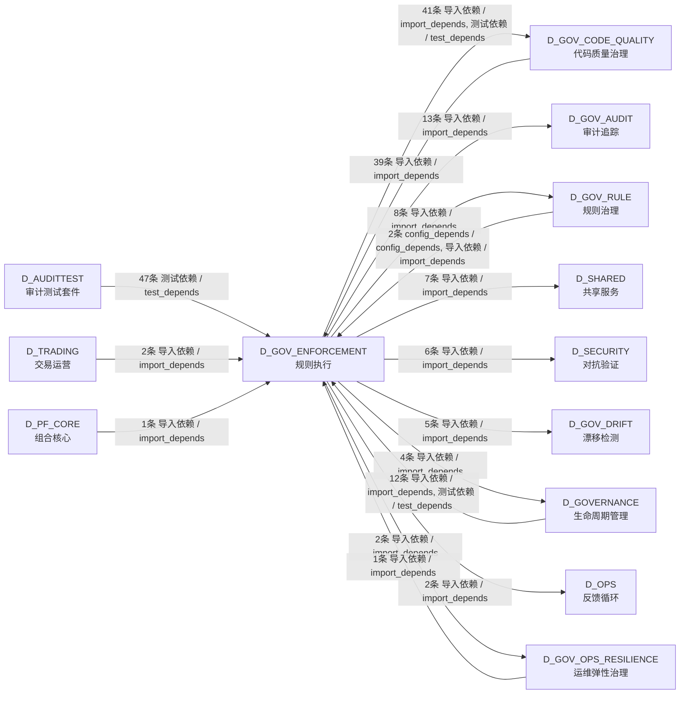

# 40_d_gov_enforcement / rule_enforcement / 规则执行 / Rule Enforcement

> **功能简介 / Overview**: 规则执行，负责治理规则执行和门禁拦截

> **文档作用 / Purpose**: 展示 规则执行（D_GOV_ENFORCEMENT）功能域的模块清单、域内依赖关系、跨域依赖关系、架构分层视图，供架构审查和域治理参考。

> 本文档由 generate_domain_doc.py 从 depgraph (PostgreSQL) 自动生成
> 最后更新: 2026-07-13 00:56:17
> 数据源: depgraph (PostgreSQL) nodes表 + edges表

## 域基本信息 / Domain Overview

| 字段 | 值 | Field | Value |
|------|------|-------|-------|
| 编号 | 40 | Number | 40 |
| 域ID | D_GOV_ENFORCEMENT | Domain ID | D_GOV_ENFORCEMENT |
| 域名称 | 规则执行 | Domain Name | Rule Enforcement |
| 层级 | L2 业务域层 | Layer | L2 Domain |
| 模块数 | 50 | Module Count | 50 |
| 域内依赖 | 11 | Internal Dependencies | 11 |
| 跨域入边 | 104 | Cross-domain Incoming | 104 |
| 跨域出边 | 88 | Cross-domain Outgoing | 88 |
| 设计态模块 | 0 | Design Modules | 0 |
| 原型态模块 | 35 | Prototype Modules | 35 |
| 生产态模块 | 15 | Production Modules | 15 |
| 容量 | 15/150 (正常) | Capacity | 15/150 (正常) |
| 描述 | 门禁引擎流程编排(GatePipeline/GateEngine) | Description | 门禁引擎流程编排(GatePipeline/GateEngine) |

## 模块分层清单 / Module Layered List

> 按 architecture_layer 分组的模块清单（共 50 个模块 / 50 modules）。

### L1 基础层 / Foundation Layer (1 modules)

| # | 模块路径 / Module Path | 模块名称 / Module Name (功能简介 / Description) | 成熟度 / Maturity | 蓝图 / Blueprint |
|:--:|---------|---------|:---:|:---:|
| 1 | docs/01_policies_and_standards/_registry/catalogs/rule_en... | [聚合节点 / Aggregated] 门禁规则集 / Gate Rule Set (83 items) | 生产态 / production |  |
| ↳1 |   ↳ src/zephyr/governance/rule_enforcement/admission/mad... | 对标：Architecture Decision Records (KB 决策记录) + YAGNI principle。 任何新... | - | - |
| ↳2 |   ↳ src/zephyr/governance/rule_enforcement/admission/mad... | 对标：Wardley Mapping + Phase-based delivery。 任何新模块 MUST 证明与当前开发... | - | - |
| ↳3 |   ↳ src/zephyr/governance/rule_enforcement/admission/mad... | 对标：Layer Isolation Principle + ArchUnit fitness functions。 新模块的依赖关... | - | - |
| ↳4 |   ↳ src/zephyr/governance/rule_enforcement/admission/mad... | 对标：Interface Segregation Principle (ISP) + Contract-First Design。 任何新... | - | - |
| ↳5 |   ↳ src/zephyr/governance/rule_enforcement/admission/mad... | 对标：TPL-DEPGRAPH-001 v4.0.0 + project_rules.md 铁律 #7。 依赖图产出物 MUST ... | - | - |
| ↳6 |   ↳ src/zephyr/governance/rule_enforcement/g1_ingest.yaml | Ingest stage admission gate - validates file existence, encoding compliance, ... | - | - |
| ↳7 |   ↳ src/zephyr/governance/rule_enforcement/g2_triage.yaml | Triage stage admission gate - validates classification labels and priority sc... | - | - |
| ↳8 |   ↳ src/zephyr/governance/rule_enforcement/g3_evaluate.yaml | Evaluate stage admission gate - ensures knowledge value score meets threshold... | - | - |
| ↳9 |   ↳ src/zephyr/governance/rule_enforcement/g4_activate.yaml | Activate stage admission gate - ensures dependencies are ready and no conflic... | - | - |
| ↳10 |   ↳ src/zephyr/governance/rule_enforcement/g5_extract.yaml | Extract stage admission gate - ensures extraction templates are ready and tar... | - | - |
| ↳11 |   ↳ src/zephyr/governance/rule_enforcement/g6_blueprint_... | beta hard compliance gate — AI agent MUST read the relevant blueprint BEFORE... | - | - |
| ↳12 |   ↳ src/zephyr/governance/rule_enforcement/g6_ctr_compli... | CTR contract compliance gate - ensures all data through reporting domain modu... | - | - |
| ↳13 |   ↳ src/zephyr/governance/rule_enforcement/g6_path_tree_... | GOV-DOC-004 §四-A 强制门禁 — 文件创建/删除/移动后必须刷新物理路径树快照和路... | - | - |
| ↳14 |   ↳ src/zephyr/governance/rule_enforcement/g7_position_l... | AI 生成的策略配置（D_PORTFOLIO_CORE/D_EXECUTION_CORE 产出）必须尊重 RiskLimit... | - | - |
| ↳15 |   ↳ src/zephyr/governance/rule_enforcement/g7c_cross_gat... | 跨门禁时序一致性校验：检测任务执行期间蓝图版本是否发生变化。 FOR EACH module_... | - | - |
| ↳16 |   ↳ src/zephyr/governance/rule_enforcement/g7d_depth_com... | G7交付门禁通过后的深度合规校验：单元测试覆盖率、依赖CVE、回归测试、lint检查。... | - | - |
| ↳17 |   ↳ src/zephyr/governance/rule_enforcement/g8.yaml | SSoT 一致性门禁——校验每份 blueprint.md 的 frontmatter construction_progress... | - | - |
| ↳18 |   ↳ src/zephyr/governance/rule_enforcement/g8_leverage.yaml | 检查 AI 生成的策略总杠杆（含衍生品）不超过 RiskLimits.max_gross_leverage。 一... | - | - |
| ↳19 |   ↳ src/zephyr/governance/rule_enforcement/g9.yaml | 机械验证四个关键蓝图系统与 Pipeline 的跨模块集成链路。 | - | - |
| ↳20 |   ↳ src/zephyr/governance/rule_enforcement/g9_strategy_c... | 当 AI 生成新策略或修改现有策略时，检查新策略与已有策略的相关性。 防止 AI 产生... | - | - |
| ↳21 |   ↳ src/zephyr/governance/rule_enforcement/g_asset_inven... | 资产盘点系统健康门禁 — 验证 unified-asset-index.yaml 存在且健康评分达标，确... | - | - |
| ↳22 |   ↳ src/zephyr/governance/rule_enforcement/g_forward_ref... | 前向引用检测门禁——检测 class X 定义内部引用 X 自身的模式（前向引用 bug）。 ... | - | - |
| ↳23 |   ↳ src/zephyr/governance/rule_enforcement/g_trae_003.yaml | 自动化门禁：强制执行 TRAE-003（任务粒度与完成门槛协议）规则。将规则从文档约束... | - | - |
| ↳24 |   ↳ src/zephyr/governance/rule_enforcement/g_trae_004.yaml | 自动化门禁：强制执行 TRAE-004（并行执行与原子事务协议）规则。将规则从文档约束... | - | - |
| ↳25 |   ↳ src/zephyr/governance/rule_enforcement/g_trae_006.yaml | 自动化门禁：强制执行 TRAE-006（防幻觉-结构追溯层）规则。将规则从文档约束升级... | - | - |
| ↳26 |   ↳ src/zephyr/governance/rule_enforcement/g_trae_007.yaml | 自动化门禁：强制执行 TRAE-007（防幻觉-行为约束层）规则。将规则从文档约束升级... | - | - |
| ↳27 |   ↳ src/zephyr/governance/rule_enforcement/g_trae_008.yaml | 自动化门禁：强制执行 TRAE-008（防幻觉-输出验证层）规则。将规则从文档约束升级... | - | - |
| ↳28 |   ↳ src/zephyr/governance/rule_enforcement/g_trae_009.yaml | 自动化门禁：强制执行 TRAE-009（防幻觉-安全防护层）规则。将规则从文档约束升级... | - | - |
| ↳29 |   ↳ src/zephyr/governance/rule_enforcement/g_trae_010.yaml | 自动化门禁：强制执行 TRAE-010（代码构建-命名与组织）规则。将规则从文档约束升... | - | - |
| ↳30 |   ↳ src/zephyr/governance/rule_enforcement/g_trae_011.yaml | 自动化门禁：强制执行 TRAE-011（代码构建-类型与导入）规则。将规则从文档约束升... | - | - |
| ↳31 |   ↳ src/zephyr/governance/rule_enforcement/g_trae_012.yaml | 自动化门禁：强制执行 TRAE-012（代码构建-测试与安全）规则。将规则从文档约束升... | - | - |
| ↳32 |   ↳ src/zephyr/governance/rule_enforcement/g_trae_016.yaml | 自动化门禁：强制执行 TRAE-016（架构约束-漂移检测）规则。将规则从文档约束升级... | - | - |
| ↳33 |   ↳ src/zephyr/governance/rule_enforcement/g_trae_017.yaml | 自动化门禁：强制执行 TRAE-017（架构约束-治理顺序）规则。将规则从文档约束升级... | - | - |
| ↳34 |   ↳ src/zephyr/governance/rule_enforcement/g_trae_018.yaml | 自动化门禁：强制执行 TRAE-018（行为边界-代码操作绝对禁止）规则。将规则从文档... | - | - |
| ↳35 |   ↳ src/zephyr/governance/rule_enforcement/g_trae_020.yaml | 自动化门禁：强制执行 TRAE-020（行为边界-治理纪律绝对禁止）规则。将规则从文档... | - | - |
| ↳36 |   ↳ src/zephyr/governance/rule_enforcement/g_trae_021.yaml | 自动化门禁：强制执行 TRAE-021（行为边界-其余绝对禁止）规则。将规则从文档约束... | - | - |
| ↳37 |   ↳ src/zephyr/governance/rule_enforcement/g_trae_022.yaml | 自动化门禁：强制执行 TRAE-022（行为边界-条件禁止(代码与安全)）规则。将规则从... | - | - |
| ↳38 |   ↳ src/zephyr/governance/rule_enforcement/g_trae_023.yaml | 自动化门禁：强制执行 TRAE-023（行为边界-条件禁止(治理与文档)）规则。将规则从... | - | - |
| ↳39 |   ↳ src/zephyr/governance/rule_enforcement/g_trae_024.yaml | 自动化门禁：强制执行 TRAE-024（方法论-诊断与根因分析）规则。将规则从文档约束... | - | - |
| ↳40 |   ↳ src/zephyr/governance/rule_enforcement/g_trae_025.yaml | 自动化门禁：强制执行 TRAE-025（方法论-决策与执行）规则。将规则从文档约束升级... | - | - |
| ↳41 |   ↳ src/zephyr/governance/rule_enforcement/g_trae_026.yaml | 自动化门禁：强制执行 TRAE-026（方法论-质量与度量）规则。将规则从文档约束升级... | - | - |
| ↳42 |   ↳ src/zephyr/governance/rule_enforcement/g_trae_027.yaml | 自动化门禁：强制执行 TRAE-027（方法论-协作与演进）规则。将规则从文档约束升级... | - | - |
| ↳43 |   ↳ src/zephyr/governance/rule_enforcement/g_trae_028.yaml | 自动化门禁：强制执行 TRAE-028（文档治理-结构与命名）规则。将规则从文档约束升... | - | - |
| ↳44 |   ↳ src/zephyr/governance/rule_enforcement/g_trae_029.yaml | 自动化门禁：强制执行 TRAE-029（文档治理-操作安全）规则。将规则从文档约束升级... | - | - |
| ↳45 |   ↳ src/zephyr/governance/rule_enforcement/g_trae_030.yaml | 自动化门禁：强制执行 TRAE-030（文档治理-编号与元数据）规则。将规则从文档约束... | - | - |
| ↳46 |   ↳ src/zephyr/governance/rule_enforcement/g_trae_031.yaml | 自动化门禁：强制执行 TRAE-031（安全治理-密钥与访问控制）规则。将规则从文档约... | - | - |
| ↳47 |   ↳ src/zephyr/governance/rule_enforcement/g_trae_032.yaml | 自动化门禁：强制执行 TRAE-032（模块治理-准入与生命周期）规则。将规则从文档约... | - | - |
| ↳48 |   ↳ src/zephyr/governance/rule_enforcement/g_trae_033.yaml | 自动化门禁：强制执行 TRAE-033（模块治理-注册与同步）规则。将规则从文档约束升... | - | - |
| ↳49 |   ↳ src/zephyr/governance/rule_enforcement/g_trae_034.yaml | 自动化门禁：强制执行 TRAE-034（任务系统-卡片标准与生命周期）规则。将规则从文... | - | - |
| ↳50 |   ↳ src/zephyr/governance/rule_enforcement/g_trae_035.yaml | 自动化门禁：强制执行 TRAE-035（任务系统-施工与验证）规则。将规则从文档约束升... | - | - |
| ↳51 |   ↳ src/zephyr/governance/rule_enforcement/g_trae_036.yaml | 自动化门禁：强制执行 TRAE-036（架构治理-门禁与过渡）规则。将规则从文档约束升... | - | - |
| ↳52 |   ↳ src/zephyr/governance/rule_enforcement/g_trae_037.yaml | 自动化门禁：强制执行 TRAE-037（架构治理-合格与版本化）规则。将规则从文档约束... | - | - |
| ↳53 |   ↳ src/zephyr/governance/rule_enforcement/g_trae_038.yaml | 自动化门禁：强制执行 TRAE-038（架构治理-CTR注入规则）规则。将规则从文档约束升... | - | - |
| ↳54 |   ↳ src/zephyr/governance/rule_enforcement/g_trae_039.yaml | 自动化门禁：强制执行 TRAE-039（AI治理-幻觉检测与自检）规则。将规则从文档约束... | - | - |
| ↳55 |   ↳ src/zephyr/governance/rule_enforcement/g_trae_040.yaml | 自动化门禁：强制执行 TRAE-040（AI治理-模型路由与协作）规则。将规则从文档约束... | - | - |
| ↳56 |   ↳ src/zephyr/governance/rule_enforcement/g_trae_041.yaml | 自动化门禁：强制执行 TRAE-041（元规则-规则分类与裁决）规则。将规则从文档约束... | - | - |
| ↳57 |   ↳ src/zephyr/governance/rule_enforcement/g_trae_042.yaml | 自动化门禁：强制执行 TRAE-042（元规则-标准体系与模板）规则。将规则从文档约束... | - | - |
| ↳58 |   ↳ src/zephyr/governance/rule_enforcement/g_trae_043.yaml | 自动化门禁：强制执行 TRAE-043（元规则-元数据与度量）规则。将规则从文档约束升... | - | - |
| ↳59 |   ↳ src/zephyr/governance/rule_enforcement/g_trae_044.yaml | 自动化门禁：强制执行 TRAE-044（合规治理-审计与监管）规则。将规则从文档约束升... | - | - |
| ↳60 |   ↳ src/zephyr/governance/rule_enforcement/g_trae_045.yaml | 自动化门禁：强制执行 TRAE-045（数据治理-质量与血缘）规则。将规则从文档约束升... | - | - |
| ↳61 |   ↳ src/zephyr/governance/rule_enforcement/g_trae_046.yaml | 自动化门禁：强制执行 TRAE-046（工程治理-代码重组安全）规则。将规则从文档约束... | - | - |
| ↳62 |   ↳ src/zephyr/governance/rule_enforcement/g_trae_047.yaml | 自动化门禁：强制执行 TRAE-047（工程治理-文件头部与扩展）规则。将规则从文档约... | - | - |
| ↳63 |   ↳ src/zephyr/governance/rule_enforcement/g_trae_048.yaml | 自动化门禁：强制执行 TRAE-048（操作-Vibe Coding会话管理）规则。将规则从文档约... | - | - |
| ↳64 |   ↳ src/zephyr/governance/rule_enforcement/g_trae_049.yaml | 自动化门禁：强制执行 TRAE-049（操作-领域操作手册）规则。将规则从文档约束升级... | - | - |
| ↳65 |   ↳ src/zephyr/governance/rule_enforcement/g_trae_050.yaml | 自动化门禁：强制执行 TRAE-050（域策略-数据源与因子层）规则。将规则从文档约束... | - | - |
| ↳66 |   ↳ src/zephyr/governance/rule_enforcement/g_trae_051.yaml | 自动化门禁：强制执行 TRAE-051（域策略-风控与盘后层）规则。将规则从文档约束升... | - | - |
| ↳67 |   ↳ src/zephyr/governance/rule_enforcement/g_trae_052.yaml | 自动化门禁：强制执行 TRAE-052（铁律补充-跨蓝图变更与项目瘦身）规则。将规则从... | - | - |
| ↳68 |   ↳ src/zephyr/governance/rule_enforcement/g_trae_053.yaml | 自动化门禁：强制执行 TRAE-053（铁律补充-自动化双轨判定）规则。将规则从文档约... | - | - |
| ↳69 |   ↳ src/zephyr/governance/rule_enforcement/g_trae_054.yaml | 自动化门禁：强制执行 TRAE-054（depgraph 程序化访问协议）规则。将规则从文档约... | - | - |
| ↳70 |   ↳ src/zephyr/governance/rule_enforcement/g_trae_055.yaml | 自动化门禁：强制执行 TRAE-055（架构容量与域治理规则）规则。将规则从文档约束升... | - | - |
| ↳71 |   ↳ src/zephyr/governance/rule_enforcement/g_trae_059.yaml | 自动化门禁：强制执行 TRAE-059（_schema_version 写入保护规范）。 两层检查：(1)... | - | - |
| ↳72 |   ↳ src/zephyr/governance/rule_enforcement/gate_dedup.yaml | 代码去重门禁——每次 GateEngine.evaluate("GATE-DEDUP") 触发时， 调用 code_ded... | - | - |
| ↳73 |   ↳ src/zephyr/governance/rule_enforcement/gct_024_budge... |  | - | - |
| ↳74 |   ↳ src/zephyr/governance/rule_enforcement/invariants/en... | 扫描 14 层 + shared/contracts 的全部 Python 导入，构建依赖 DAG， Kahn's algor... | - | - |
| ↳75 |   ↳ src/zephyr/governance/rule_enforcement/invariants/en... | 读取 cross_layer_contracts.yaml，验证每条 P0 契约均声明了 enforcement （enfor... | - | - |
| ↳76 |   ↳ src/zephyr/governance/rule_enforcement/invariants/en... | 读取 cross_layer_contracts.yaml 中的字段定义，与 codegen 生成的 Python datacl... | - | - |
| ↳77 |   ↳ src/zephyr/governance/rule_enforcement/observability... | Phase 1 observability baseline gate — validates System Telemetry (MOD-INF-01... | - | - |
| ↳78 |   ↳ src/zephyr/governance/rule_enforcement/post_doc_revi... | Session 关门时审查本次 session 修改的文档+蓝图/规则， 按 trae_030 §0 时态判... | - | - |
| ↳79 |   ↳ src/zephyr/governance/rule_enforcement/sys_master_co... | 系统总蓝图合规门禁——验证 SYS-MASTER-001（三级金字塔顶点）与 MOD-MASTER-001 ... | - | - |
| ↳80 |   ↳ src/zephyr/governance/rule_enforcement/task/g0_entry... | G0 是所有任务（AI Agent 任务 + 人工作业）进入 ZephyrAlpha 工作流系统 的强制性... | - | - |
| ↳81 |   ↳ src/zephyr/governance/rule_enforcement/task/g0_orc_g... | 任务进入执行队列前的可自动化校验：priority 枚举、核心字段非空、task_id 正则。... | - | - |
| ↳82 |   ↳ src/zephyr/governance/rule_enforcement/task/g7_orc_g... | 收尾校验：TaskCard.verification_status=verified；audit_findings 全部 resolved... | - | - |
| ↳83 |   ↳ src/zephyr/governance/rule_enforcement/zero_residue.yaml | 零残留原则自动化执行层——每次 GateEngine.evaluate("ZERO-RESIDUE") 触发时， ... | - | - |

### L2 领域层 / Domain Layer (49 modules)

| # | 模块路径 / Module Path | 模块名称 / Module Name (功能简介 / Description) | 成熟度 / Maturity | 蓝图 / Blueprint |
|:--:|---------|---------|:---:|:---:|
| 1 | src/zephyr/compliance/__init__.py | D_COMPLIANCE Compliance — Re-export wrapper (D... | 原型态 / prototype | [MOD-L10-001](../../03_modules/_domain_compliance/blueprint.md) |
| 2 | src/zephyr/compliance/_extensions/__init__.py | __init__.py | 原型态 / prototype |  |
| 3 | src/zephyr/compliance/aisg_sandbox.py | Re-export wrapper: aisg_sandbox has migrated to... | 原型态 / prototype | [MOD-L10-001](../../03_modules/_domain_compliance/blueprint.md) |
| 4 | src/zephyr/compliance/api/__init__.py | __init__.py | 原型态 / prototype |  |
| 5 | src/zephyr/compliance/artifact_scanner.py | Re-export wrapper: artifact_scanner has migrate... | 原型态 / prototype | [MOD-L10-001](../../03_modules/_domain_compliance/blueprint.md) |
| 6 | src/zephyr/compliance/audit_orchestrator/__init__.py | Re-export wrapper: audit-orchestrator has migra... | 原型态 / prototype |  |
| 7 | src/zephyr/compliance/audit_trail/__init__.py | Re-export wrapper: audit-trail has migrated to ... | 原型态 / prototype |  |
| 8 | src/zephyr/compliance/audit_trail/bridges/__init__.py | Audit Trail — MOD-INF-020 | 原型态 / prototype | [MOD-INF-020](../../03_modules/_domain_governance/audit_trail/blueprint.md) |
| 9 | src/zephyr/compliance/behavioral_admission/__init__.py | Re-export wrapper: behavioral-admission has mig... | 原型态 / prototype |  |
| 10 | src/zephyr/compliance/behavioral_auditor/__init__.py | Re-export wrapper: behavioral-auditor has migra... | 原型态 / prototype |  |
| 11 | src/zephyr/compliance/compliance_gate_a6/__init__.py | Re-export wrapper: compliance_gate_a6 has migra... | 原型态 / prototype |  |
| 12 | src/zephyr/compliance/compliance_manager.py | Re-export wrapper: compliance_manager has migra... | 原型态 / prototype | [MOD-L10-001](../../03_modules/_domain_compliance/blueprint.md) |
| 13 | src/zephyr/compliance/core/__init__.py | __init__.py | 原型态 / prototype |  |
| 14 | src/zephyr/compliance/default_security_gateway.py | default_security_gateway.py | 原型态 / prototype | [MOD-L10-001](../../03_modules/_domain_compliance/blueprint.md) |
| 15 | src/zephyr/compliance/evidence_pack.py | Re-export wrapper: evidence_pack has migrated t... | 原型态 / prototype | [MOD-L10-001](../../03_modules/_domain_compliance/blueprint.md) |
| 16 | src/zephyr/compliance/financial_compliance.py | Re-export wrapper: financial_compliance has mig... | 原型态 / prototype | [MOD-L10-001](../../03_modules/_domain_compliance/blueprint.md) |
| 17 | src/zephyr/compliance/implementations/__init__.py | Re-export wrapper: implementations has migrated... | 原型态 / prototype |  |
| 18 | src/zephyr/compliance/infrastructure/__init__.py | __init__.py | 原型态 / prototype |  |
| 19 | src/zephyr/compliance/integrity.py | Re-export wrapper: integrity has migrated to ze... | 原型态 / prototype | [MOD-L10-001](../../03_modules/_domain_compliance/blueprint.md) |
| 20 | src/zephyr/compliance/merkle_hourly.py | Re-export wrapper: merkle_hourly has migrated t... | 原型态 / prototype | [MOD-L10-001](../../03_modules/_domain_compliance/blueprint.md) |
| 21 | src/zephyr/compliance/models/__init__.py | __init__.py | 原型态 / prototype |  |
| 22 | src/zephyr/compliance/security_gateway_base.py | security_gateway_base.py | 原型态 / prototype | [MOD-L10-001](../../03_modules/_domain_compliance/blueprint.md) |
| 23 | src/zephyr/compliance/services/__init__.py | __init__.py | 原型态 / prototype |  |
| 24 | src/zephyr/compliance/zero_knowledge_audit_stub/__init__.py | Re-export wrapper: zero_knowledge_audit_stub ha... | 原型态 / prototype |  |
| 25 | src/zephyr/governance/rule_bridge/__init__.py | governance.rule_bridge — auto-generated packag... | 原型态 / prototype |  |
| 26 | src/zephyr/governance/rule_bridge/commit_gate_registry.py | commit_gate_registry.py — GitCommitGateway pre... | 生产态 / production |  |
| 27 | src/zephyr/governance/rule_bridge/git_commit_gateway.py | GitCommitGateway — 全项目唯一合法 git commit ... | 生产态 / production | [MOD-INF-035](../../03_modules/_cross_layer/auto_runtime_core/blueprint.md) |
| 28 | src/zephyr/governance/rule_bridge/session_claim.py | session_claim.py — AI 对话并发声明 helper（FP-... | 原型态 / prototype |  |
| 29 | src/zephyr/governance/rule_bridge/session_worktree.py | session_worktree.py — AI 对话 worktree 物理隔... | 生产态 / production |  |
| 30 | src/zephyr/governance/rule_bridge/worktree_manager.py | worktree_manager.py — session worktree 物理隔... | 生产态 / production |  |
| 31 | src/zephyr/governance/rule_enforcement/__init__.py | ZephyrAlpha 门禁子包 | 生产态 / production | [MOD-GATE_ENGINE](../../03_modules/_cross_layer/gate_engine/blueprint.md) |
| 32 | src/zephyr/governance/rule_enforcement/admission/__init__.py | ZephyrAlpha — gates/admission/ — 模块准入门禁... | 原型态 / prototype | [MOD-GATE_ENGINE](../../03_modules/_cross_layer/gate_engine/blueprint.md) |
| 33 | src/zephyr/governance/rule_enforcement/approval.py | G-CT-004 — Backward-compat re-export of Approv... | 生产态 / production | [MOD-INF-022](../../03_modules/_domain_autonomy_perm/escalation_protocol/blueprint.md) |
| 34 | src/zephyr/governance/rule_enforcement/compliance_rule.py | Re-export shim — ComplianceRule 真源已合并至 z... | 原型态 / prototype | [MOD-INF-016](../../03_modules/_cross_layer/shared_core/blueprint.md) |
| 35 | src/zephyr/governance/rule_enforcement/default_quality_ga... | D_DATA — Default Data Quality Gate | 生产态 / production | [MOD-L00-001](../../03_modules/_domain_data/blueprint.md) |
| 36 | src/zephyr/governance/rule_enforcement/dlq_retry_policy.py | DLQ 重试策略 — 指数退避自动重试 | 原型态 / prototype | [SH-DB-001](../../03_modules/_cross_layer/database/blueprint.md) |
| 37 | src/zephyr/governance/rule_enforcement/invariants/__init_... | __init__.py | 原型态 / prototype | [MOD-GATE_ENGINE](../../03_modules/_cross_layer/gate_engine/blueprint.md) |
| 38 | src/zephyr/governance/rule_enforcement/invariants/post_do... | PostDocReviewScanner — Session 关门时文档内容... | 生产态 / production | [MOD-GATE_ENGINE](../../03_modules/_cross_layer/gate_engine/blueprint.md) |
| 39 | src/zephyr/governance/rule_enforcement/output_quality_gat... | output_quality_gate.py | 生产态 / production | [MOD-INF-024](../../03_modules/_domain_autonomy_perm/budget_enforcer/blueprint.md) |
| 40 | src/zephyr/governance/rule_enforcement/pre_flight_gate.py | pre_flight_gate.py | 生产态 / production | [MOD-INF-024](../../03_modules/_domain_autonomy_perm/budget_enforcer/blueprint.md) |
| 41 | src/zephyr/governance/rule_enforcement/quality_gate.py | D_DATA — Data Quality Gate | 原型态 / prototype | [MOD-L00-001](../../03_modules/_domain_data/blueprint.md) |
| 42 | src/zephyr/governance/rule_enforcement/rule_engine/rule_c... | Rule Canary Manager — v0.10.0 规则金丝雀: 1%用... | 生产态 / production | [MOD-INF-022](../../03_modules/_domain_autonomy_perm/escalation_protocol/blueprint.md) |
| 43 | src/zephyr/governance/rule_enforcement/rule_engine/rule_d... | Rule Debt Auditor — v0.7.0 规则债务审计器: 分... | 生产态 / production | [MOD-INF-022](../../03_modules/_domain_autonomy_perm/escalation_protocol/blueprint.md) |
| 44 | src/zephyr/governance/rule_enforcement/rule_engine/rule_s... | Rule Shadow Runner — v0.10.0 规则影子模式: 新... | 生产态 / production | [MOD-INF-022](../../03_modules/_domain_autonomy_perm/escalation_protocol/blueprint.md) |
| 45 | src/zephyr/governance/rule_enforcement/rule_engine/rule_w... | RuleWatcher — YAML 规则文件变更检测与自动同步 | 原型态 / prototype |  |
| 46 | src/zephyr/governance/rule_enforcement/slo_contract.py | SLO-Driven Escalation Contract — D-022-12. | 生产态 / production | [MOD-INF-022](../../03_modules/_domain_autonomy_perm/escalation_protocol/blueprint.md) |
| 47 | src/zephyr/governance/rule_enforcement/task/__init__.py | ZephyrAlpha — gates/task/ — 任务触发门禁 | 原型态 / prototype | [MOD-GATE_ENGINE](../../03_modules/_cross_layer/gate_engine/blueprint.md) |
| 48 | tests/governance/commit_gates/test_create_guard.py | test_create_guard.py — CREATE-GUARD 门禁单元测... | 原型态 / prototype |  |
| 49 | tests/governance/commit_gates/test_r5_digit_suffix_gate.py | test_r5_digit_suffix_gate.py — R5-DIGIT-SUFFIX... | 原型态 / prototype |  |

## 域内依赖图 / Internal Dependency Diagram

> 依赖图内嵌在本文档中，IDE 可直接渲染显示。参考 decision_index.md 设计，分四个视图：合并全景图、运营态子图、设计态子图、原型态子图（按 design_maturity 实际值拆分）。
>
> **图例说明 / Legend**：
> - **实线边框 = 运营态模块**（production，已上线运行）
> - **虚线边框 = 设计态模块**（design，蓝图阶段，代码未写）
> - **虚线边框 = 原型态模块**（prototype，代码已写，验证中未稳定上线）
> - **实线箭头 = 运营态依赖**（已生效的依赖关系）
> - **虚线箭头 = 非运营态依赖**（计划中/验证中的依赖关系）

### 合并全景图（全部模块，标签标注成熟度）

> 展示全部 50 个模块（生产态 15 + 设计态 0 + 原型态 35），标签标注成熟度。

#### 第 1 页 / 共 2 页

```mermaid
graph TD
    subgraph D_GOV_ENFORCEMENT["D_GOV_ENFORCEMENT 规则执行"]
        docs_01_policies_and_standards_registry_catalogs_rule_enforcement_registry_yaml["(生产态 / production)  Gate Rule Set — ARCH-052 聚合节点 production"]
        src_zephyr_compliance_init_py["(原型态 / prototype) D_COMPLIANCE Compliance — Re-export wrapper (D...<br/>文件: __init__.py"]
        src_zephyr_compliance_extensions_init_py["(原型态 / prototype) __init__.py"]
        src_zephyr_compliance_aisg_sandbox_py["(原型态 / prototype) Re-export wrapper: aisg_sandbox has migrated to...<br/>文件: aisg_sandbox.py"]
        src_zephyr_compliance_api_init_py["(原型态 / prototype) __init__.py"]
        src_zephyr_compliance_artifact_scanner_py["(原型态 / prototype) Re-export wrapper: artifact_scanner has migrate...<br/>文件: artifact_scanner.py"]
        src_zephyr_compliance_audit_orchestrator_init_py["(原型态 / prototype) Re-export wrapper: audit-orchestrator has migra...<br/>文件: __init__.py"]
        src_zephyr_compliance_audit_trail_init_py["(原型态 / prototype) Re-export wrapper: audit-trail has migrated to ...<br/>文件: __init__.py"]
        src_zephyr_compliance_audit_trail_bridges_init_py["(原型态 / prototype) Audit Trail — MOD-INF-020<br/>文件: __init__.py"]
        src_zephyr_compliance_behavioral_admission_init_py["(原型态 / prototype) Re-export wrapper: behavioral-admission has mig...<br/>文件: __init__.py"]
        src_zephyr_compliance_behavioral_auditor_init_py["(原型态 / prototype) Re-export wrapper: behavioral-auditor has migra...<br/>文件: __init__.py"]
        src_zephyr_compliance_compliance_gate_a6_init_py["(原型态 / prototype) Re-export wrapper: compliance_gate_a6 has migra...<br/>文件: __init__.py"]
        src_zephyr_compliance_compliance_manager_py["(原型态 / prototype) Re-export wrapper: compliance_manager has migra...<br/>文件: compliance_manager.py"]
        src_zephyr_compliance_core_init_py["(原型态 / prototype) __init__.py"]
        src_zephyr_compliance_default_security_gateway_py["(原型态 / prototype) default_security_gateway.py"]
        src_zephyr_compliance_evidence_pack_py["(原型态 / prototype) Re-export wrapper: evidence_pack has migrated t...<br/>文件: evidence_pack.py"]
        src_zephyr_compliance_financial_compliance_py["(原型态 / prototype) Re-export wrapper: financial_compliance has mig...<br/>文件: financial_compliance.py"]
        src_zephyr_compliance_implementations_init_py["(原型态 / prototype) Re-export wrapper: implementations has migrated...<br/>文件: __init__.py"]
        src_zephyr_compliance_infrastructure_init_py["(原型态 / prototype) __init__.py"]
        src_zephyr_compliance_integrity_py["(原型态 / prototype) Re-export wrapper: integrity has migrated to ze...<br/>文件: integrity.py"]
        src_zephyr_compliance_merkle_hourly_py["(原型态 / prototype) Re-export wrapper: merkle_hourly has migrated t...<br/>文件: merkle_hourly.py"]
        src_zephyr_compliance_models_init_py["(原型态 / prototype) __init__.py"]
        src_zephyr_compliance_security_gateway_base_py["(原型态 / prototype) security_gateway_base.py"]
        src_zephyr_compliance_services_init_py["(原型态 / prototype) __init__.py"]
        src_zephyr_compliance_zero_knowledge_audit_stub_init_py["(原型态 / prototype) Re-export wrapper: zero_knowledge_audit_stub ha...<br/>文件: __init__.py"]
        src_zephyr_governance_rule_bridge_init_py["(原型态 / prototype) governance.rule_bridge — auto-generated packag...<br/>文件: __init__.py"]
        src_zephyr_governance_rule_bridge_commit_gate_registry_py["(生产态 / production) commit_gate_registry.py — GitCommitGateway pre...<br/>文件: commit_gate_registry.py"]
        src_zephyr_governance_rule_bridge_git_commit_gateway_py["(生产态 / production) GitCommitGateway — 全项目唯一合法 git commit ...<br/>文件: git_commit_gateway.py"]
        src_zephyr_governance_rule_bridge_session_claim_py["(原型态 / prototype) session_claim.py — AI 对话并发声明 helper（FP-...<br/>文件: session_claim.py"]
        src_zephyr_governance_rule_bridge_session_worktree_py["(生产态 / production) session_worktree.py — AI 对话 worktree 物理隔...<br/>文件: session_worktree.py"]
    end
    src_zephyr_compliance_init_py -.->|config_depends / config_depends| src_zephyr_compliance_aisg_sandbox_py
    src_zephyr_governance_rule_bridge_git_commit_gateway_py -->|导入依赖 / import_depends| src_zephyr_governance_rule_bridge_commit_gate_registry_py
    src_zephyr_governance_rule_bridge_session_worktree_py -->|导入依赖 / import_depends| src_zephyr_governance_rule_bridge_git_commit_gateway_py
    src_zephyr_governance_rule_bridge_session_worktree_py -.->|导入依赖 / import_depends| src_zephyr_governance_rule_bridge_session_claim_py
    src_zephyr_governance_rule_bridge_init_py -.->|config_depends / config_depends| src_zephyr_governance_rule_bridge_commit_gate_registry_py
    D_GOVERNANCE["(生产态 / production) D_GOVERNANCE"]
    src_zephyr_compliance_aisg_sandbox_py -.->|导入依赖 / import_depends| D_GOVERNANCE
    D_GOV_OPS_RESILIENCE["(生产态 / production) D_GOV_OPS_RESILIENCE"]
    src_zephyr_compliance_default_security_gateway_py -.->|导入依赖 / import_depends| D_GOV_OPS_RESILIENCE
    D_GOV_DRIFT["(生产态 / production) D_GOV_DRIFT"]
    src_zephyr_compliance_artifact_scanner_py -.->|导入依赖 / import_depends| D_GOV_DRIFT
    src_zephyr_compliance_compliance_manager_py -.->|导入依赖 / import_depends| D_GOVERNANCE
    src_zephyr_compliance_evidence_pack_py -.->|导入依赖 / import_depends| D_GOVERNANCE
    src_zephyr_compliance_security_gateway_base_py -.->|导入依赖 / import_depends| D_GOV_OPS_RESILIENCE
    src_zephyr_compliance_integrity_py -.->|导入依赖 / import_depends| D_GOV_DRIFT
    D_GOV_AUDIT["(生产态 / production) D_GOV_AUDIT"]
    src_zephyr_compliance_merkle_hourly_py -.->|导入依赖 / import_depends| D_GOV_AUDIT
    src_zephyr_compliance_audit_orchestrator_init_py -.->|导入依赖 / import_depends| D_GOV_AUDIT
    src_zephyr_compliance_audit_trail_init_py -.->|导入依赖 / import_depends| D_GOV_AUDIT
    src_zephyr_compliance_audit_trail_bridges_init_py -.->|导入依赖 / import_depends| D_GOV_AUDIT
    src_zephyr_compliance_audit_trail_bridges_init_py -.->|导入依赖 / import_depends| D_GOV_AUDIT
    src_zephyr_compliance_audit_trail_bridges_init_py -.->|导入依赖 / import_depends| D_GOV_AUDIT
    src_zephyr_compliance_audit_trail_bridges_init_py -.->|导入依赖 / import_depends| D_GOV_AUDIT
    src_zephyr_compliance_audit_trail_bridges_init_py -.->|导入依赖 / import_depends| D_GOV_AUDIT
    D_GOV_CODE_QUALITY["(生产态 / production) D_GOV_CODE_QUALITY"]
    D_GOV_CODE_QUALITY -->|导入依赖 / import_depends| src_zephyr_governance_rule_bridge_commit_gate_registry_py
    D_GOV_CODE_QUALITY -->|导入依赖 / import_depends| src_zephyr_governance_rule_bridge_commit_gate_registry_py
    D_GOV_CODE_QUALITY -->|导入依赖 / import_depends| src_zephyr_governance_rule_bridge_commit_gate_registry_py
    D_GOV_CODE_QUALITY -->|导入依赖 / import_depends| src_zephyr_governance_rule_bridge_commit_gate_registry_py
    D_GOV_CODE_QUALITY -->|导入依赖 / import_depends| src_zephyr_governance_rule_bridge_commit_gate_registry_py
    D_GOV_CODE_QUALITY -->|导入依赖 / import_depends| src_zephyr_governance_rule_bridge_commit_gate_registry_py
    D_GOV_CODE_QUALITY -->|导入依赖 / import_depends| src_zephyr_governance_rule_bridge_commit_gate_registry_py
    D_GOV_CODE_QUALITY -->|导入依赖 / import_depends| src_zephyr_governance_rule_bridge_commit_gate_registry_py
    D_GOV_CODE_QUALITY -->|导入依赖 / import_depends| src_zephyr_governance_rule_bridge_commit_gate_registry_py
    D_GOV_CODE_QUALITY -->|导入依赖 / import_depends| src_zephyr_governance_rule_bridge_commit_gate_registry_py
    D_GOV_CODE_QUALITY -->|导入依赖 / import_depends| src_zephyr_governance_rule_bridge_commit_gate_registry_py
    D_GOV_CODE_QUALITY -->|导入依赖 / import_depends| src_zephyr_governance_rule_bridge_commit_gate_registry_py
    D_GOV_CODE_QUALITY -->|导入依赖 / import_depends| src_zephyr_governance_rule_bridge_commit_gate_registry_py
    D_GOV_CODE_QUALITY -->|导入依赖 / import_depends| src_zephyr_governance_rule_bridge_commit_gate_registry_py
    D_GOV_CODE_QUALITY -->|导入依赖 / import_depends| src_zephyr_governance_rule_bridge_commit_gate_registry_py
    classDef production fill:#e1f5fe,stroke:#01579b,stroke-width:2px,color:#000
    classDef design fill:#fff3e0,stroke:#e65100,stroke-width:2px,color:#000,stroke-dasharray: 5 5
    classDef external_prod fill:#e8f5e9,stroke:#1b5e20,stroke-width:1px,color:#000
    classDef external_design fill:#fce4ec,stroke:#880e4f,stroke-width:1px,color:#000,stroke-dasharray: 5 5
    class docs_01_policies_and_standards_registry_catalogs_rule_enforcement_registry_yaml,src_zephyr_governance_rule_bridge_commit_gate_registry_py,src_zephyr_governance_rule_bridge_git_commit_gateway_py,src_zephyr_governance_rule_bridge_session_worktree_py production
    class src_zephyr_compliance_init_py,src_zephyr_compliance_extensions_init_py,src_zephyr_compliance_aisg_sandbox_py,src_zephyr_compliance_api_init_py,src_zephyr_compliance_artifact_scanner_py,src_zephyr_compliance_audit_orchestrator_init_py,src_zephyr_compliance_audit_trail_init_py,src_zephyr_compliance_audit_trail_bridges_init_py,src_zephyr_compliance_behavioral_admission_init_py,src_zephyr_compliance_behavioral_auditor_init_py,src_zephyr_compliance_compliance_gate_a6_init_py,src_zephyr_compliance_compliance_manager_py,src_zephyr_compliance_core_init_py,src_zephyr_compliance_default_security_gateway_py,src_zephyr_compliance_evidence_pack_py,src_zephyr_compliance_financial_compliance_py,src_zephyr_compliance_implementations_init_py,src_zephyr_compliance_infrastructure_init_py,src_zephyr_compliance_integrity_py,src_zephyr_compliance_merkle_hourly_py,src_zephyr_compliance_models_init_py,src_zephyr_compliance_security_gateway_base_py,src_zephyr_compliance_services_init_py,src_zephyr_compliance_zero_knowledge_audit_stub_init_py,src_zephyr_governance_rule_bridge_init_py,src_zephyr_governance_rule_bridge_session_claim_py design
    class D_GOVERNANCE,D_GOV_OPS_RESILIENCE,D_GOV_DRIFT,D_GOV_AUDIT,D_GOV_CODE_QUALITY external_prod
```

#### 第 2 页 / 共 2 页

```mermaid
graph TD
    subgraph D_GOV_ENFORCEMENT["D_GOV_ENFORCEMENT 规则执行"]
        src_zephyr_governance_rule_bridge_worktree_manager_py["(生产态 / production) worktree_manager.py — session worktree 物理隔...<br/>文件: worktree_manager.py"]
        src_zephyr_governance_rule_enforcement_init_py["(生产态 / production) ZephyrAlpha 门禁子包<br/>文件: __init__.py"]
        src_zephyr_governance_rule_enforcement_admission_init_py["(原型态 / prototype) ZephyrAlpha — gates/admission/ — 模块准入门禁...<br/>文件: __init__.py"]
        src_zephyr_governance_rule_enforcement_approval_py["(生产态 / production) G-CT-004 — Backward-compat re-export of Approv...<br/>文件: approval.py"]
        src_zephyr_governance_rule_enforcement_compliance_rule_py["(原型态 / prototype) Re-export shim — ComplianceRule 真源已合并至 z...<br/>文件: compliance_rule.py"]
        src_zephyr_governance_rule_enforcement_default_quality_gate_py["(生产态 / production) D_DATA — Default Data Quality Gate<br/>文件: default_quality_gate.py"]
        src_zephyr_governance_rule_enforcement_dlq_retry_policy_py["(原型态 / prototype) DLQ 重试策略 — 指数退避自动重试<br/>文件: dlq_retry_policy.py"]
        src_zephyr_governance_rule_enforcement_invariants_init_py["(原型态 / prototype) __init__.py"]
        src_zephyr_governance_rule_enforcement_invariants_post_doc_review_check_py["(生产态 / production) PostDocReviewScanner — Session 关门时文档内容...<br/>文件: post_doc_review_check.py"]
        src_zephyr_governance_rule_enforcement_output_quality_gate_py["(生产态 / production) output_quality_gate.py"]
        src_zephyr_governance_rule_enforcement_pre_flight_gate_py["(生产态 / production) pre_flight_gate.py"]
        src_zephyr_governance_rule_enforcement_quality_gate_py["(原型态 / prototype) D_DATA — Data Quality Gate<br/>文件: quality_gate.py"]
        src_zephyr_governance_rule_enforcement_rule_engine_rule_canary_manager_py["(生产态 / production) Rule Canary Manager — v0.10.0 规则金丝雀: 1%用...<br/>文件: rule_canary_manager.py"]
        src_zephyr_governance_rule_enforcement_rule_engine_rule_debt_auditor_py["(生产态 / production) Rule Debt Auditor — v0.7.0 规则债务审计器: 分...<br/>文件: rule_debt_auditor.py"]
        src_zephyr_governance_rule_enforcement_rule_engine_rule_shadow_runner_py["(生产态 / production) Rule Shadow Runner — v0.10.0 规则影子模式: 新...<br/>文件: rule_shadow_runner.py"]
        src_zephyr_governance_rule_enforcement_rule_engine_rule_watcher_py["(原型态 / prototype) RuleWatcher — YAML 规则文件变更检测与自动同步<br/>文件: rule_watcher.py"]
        src_zephyr_governance_rule_enforcement_slo_contract_py["(生产态 / production) SLO-Driven Escalation Contract — D-022-12.<br/>文件: slo_contract.py"]
        src_zephyr_governance_rule_enforcement_task_init_py["(原型态 / prototype) ZephyrAlpha — gates/task/ — 任务触发门禁<br/>文件: __init__.py"]
        tests_governance_commit_gates_test_create_guard_py["(原型态 / prototype) test_create_guard.py — CREATE-GUARD 门禁单元测...<br/>文件: test_create_guard.py"]
        tests_governance_commit_gates_test_r5_digit_suffix_gate_py["(原型态 / prototype) test_r5_digit_suffix_gate.py — R5-DIGIT-SUFFIX...<br/>文件: test_r5_digit_suffix_gate.py"]
    end
    src_zephyr_governance_rule_enforcement_default_quality_gate_py -.->|导入依赖 / import_depends| src_zephyr_governance_rule_enforcement_quality_gate_py
    src_zephyr_governance_rule_enforcement_invariants_init_py -.->|导入依赖 / import_depends| src_zephyr_governance_rule_enforcement_invariants_post_doc_review_check_py
    D_GOVERNANCE["(生产态 / production) D_GOVERNANCE"]
    src_zephyr_governance_rule_enforcement_dlq_retry_policy_py -.->|导入依赖 / import_depends| D_GOVERNANCE
    D_SHARED["(原型态 / prototype) D_SHARED"]
    src_zephyr_governance_rule_enforcement_rule_engine_rule_watcher_py -.->|导入依赖 / import_depends| D_SHARED
    D_GOV_CODE_QUALITY["(生产态 / production) D_GOV_CODE_QUALITY"]
    tests_governance_commit_gates_test_create_guard_py -.->|测试依赖 / test_depends| D_GOV_CODE_QUALITY
    tests_governance_commit_gates_test_r5_digit_suffix_gate_py -.->|测试依赖 / test_depends| D_GOV_CODE_QUALITY
    src_zephyr_governance_rule_bridge_worktree_manager_py -->|导入依赖 / import_depends| D_SHARED
    D_OPS["(生产态 / production) D_OPS"]
    src_zephyr_governance_rule_enforcement_pre_flight_gate_py -->|导入依赖 / import_depends| D_OPS
    src_zephyr_governance_rule_enforcement_pre_flight_gate_py -->|导入依赖 / import_depends| D_OPS
    D_GOV_RULE["(生产态 / production) D_GOV_RULE"]
    src_zephyr_governance_rule_enforcement_init_py -->|导入依赖 / import_depends| D_GOV_RULE
    src_zephyr_governance_rule_enforcement_init_py -->|导入依赖 / import_depends| D_GOV_RULE
    D_GOV_DRIFT["(生产态 / production) D_GOV_DRIFT"]
    src_zephyr_governance_rule_enforcement_init_py -->|导入依赖 / import_depends| D_GOV_DRIFT
    src_zephyr_governance_rule_enforcement_init_py -->|导入依赖 / import_depends| D_GOV_DRIFT
    src_zephyr_governance_rule_enforcement_init_py -->|导入依赖 / import_depends| D_GOV_RULE
    src_zephyr_governance_rule_enforcement_init_py -->|导入依赖 / import_depends| D_GOV_RULE
    src_zephyr_governance_rule_enforcement_init_py -->|导入依赖 / import_depends| D_GOV_RULE
    src_zephyr_governance_rule_enforcement_init_py -->|导入依赖 / import_depends| D_GOV_RULE
    D_TRADING["(原型态 / prototype) D_TRADING"]
    D_TRADING -.->|导入依赖 / import_depends| src_zephyr_governance_rule_enforcement_compliance_rule_py
    D_TRADING -.->|导入依赖 / import_depends| src_zephyr_governance_rule_enforcement_compliance_rule_py
    D_PF_CORE["(生产态 / production) D_PF_CORE"]
    D_PF_CORE -.->|导入依赖 / import_depends| src_zephyr_governance_rule_enforcement_compliance_rule_py
    D_GOVERNANCE -.->|导入依赖 / import_depends| src_zephyr_governance_rule_enforcement_compliance_rule_py
    D_GOV_OPS_RESILIENCE["(生产态 / production) D_GOV_OPS_RESILIENCE"]
    D_GOV_OPS_RESILIENCE -.->|导入依赖 / import_depends| src_zephyr_governance_rule_enforcement_compliance_rule_py
    D_GOVERNANCE -.->|导入依赖 / import_depends| src_zephyr_governance_rule_enforcement_compliance_rule_py
    D_GOVERNANCE -.->|导入依赖 / import_depends| src_zephyr_governance_rule_enforcement_quality_gate_py
    D_AUDITTEST["(原型态 / prototype) D_AUDITTEST"]
    D_AUDITTEST -.->|测试依赖 / test_depends| src_zephyr_governance_rule_bridge_worktree_manager_py
    D_AUDITTEST -.->|测试依赖 / test_depends| src_zephyr_governance_rule_enforcement_approval_py
    D_AUDITTEST -.->|测试依赖 / test_depends| src_zephyr_governance_rule_enforcement_approval_py
    D_AUDITTEST -.->|测试依赖 / test_depends| src_zephyr_governance_rule_enforcement_approval_py
    D_AUDITTEST -.->|测试依赖 / test_depends| src_zephyr_governance_rule_enforcement_pre_flight_gate_py
    D_AUDITTEST -.->|测试依赖 / test_depends| src_zephyr_governance_rule_enforcement_output_quality_gate_py
    D_AUDITTEST -.->|测试依赖 / test_depends| src_zephyr_governance_rule_enforcement_slo_contract_py
    D_AUDITTEST -.->|测试依赖 / test_depends| src_zephyr_governance_rule_enforcement_slo_contract_py
    classDef production fill:#e1f5fe,stroke:#01579b,stroke-width:2px,color:#000
    classDef design fill:#fff3e0,stroke:#e65100,stroke-width:2px,color:#000,stroke-dasharray: 5 5
    classDef external_prod fill:#e8f5e9,stroke:#1b5e20,stroke-width:1px,color:#000
    classDef external_design fill:#fce4ec,stroke:#880e4f,stroke-width:1px,color:#000,stroke-dasharray: 5 5
    class src_zephyr_governance_rule_bridge_worktree_manager_py,src_zephyr_governance_rule_enforcement_init_py,src_zephyr_governance_rule_enforcement_approval_py,src_zephyr_governance_rule_enforcement_default_quality_gate_py,src_zephyr_governance_rule_enforcement_invariants_post_doc_review_check_py,src_zephyr_governance_rule_enforcement_output_quality_gate_py,src_zephyr_governance_rule_enforcement_pre_flight_gate_py,src_zephyr_governance_rule_enforcement_rule_engine_rule_canary_manager_py,src_zephyr_governance_rule_enforcement_rule_engine_rule_debt_auditor_py,src_zephyr_governance_rule_enforcement_rule_engine_rule_shadow_runner_py,src_zephyr_governance_rule_enforcement_slo_contract_py production
    class src_zephyr_governance_rule_enforcement_admission_init_py,src_zephyr_governance_rule_enforcement_compliance_rule_py,src_zephyr_governance_rule_enforcement_dlq_retry_policy_py,src_zephyr_governance_rule_enforcement_invariants_init_py,src_zephyr_governance_rule_enforcement_quality_gate_py,src_zephyr_governance_rule_enforcement_rule_engine_rule_watcher_py,src_zephyr_governance_rule_enforcement_task_init_py,tests_governance_commit_gates_test_create_guard_py,tests_governance_commit_gates_test_r5_digit_suffix_gate_py design
    class D_GOVERNANCE,D_GOV_CODE_QUALITY,D_OPS,D_GOV_RULE,D_GOV_DRIFT,D_PF_CORE,D_GOV_OPS_RESILIENCE external_prod
    class D_SHARED,D_TRADING,D_AUDITTEST external_design
```

### 运营态子图（仅 design_maturity=production 的模块和依赖）

> 仅展示已上线运行的模块（共 15 个，4 条域内依赖）。

```mermaid
graph TD
    subgraph D_GOV_ENFORCEMENT["D_GOV_ENFORCEMENT 规则执行"]
        docs_01_policies_and_standards_registry_catalogs_rule_enforcement_registry_yaml["(生产态 / production)  Gate Rule Set — ARCH-052 聚合节点 production"]
        src_zephyr_governance_rule_bridge_commit_gate_registry_py["(生产态 / production) commit_gate_registry.py — GitCommitGateway pre...<br/>文件: commit_gate_registry.py"]
        src_zephyr_governance_rule_bridge_git_commit_gateway_py["(生产态 / production) GitCommitGateway — 全项目唯一合法 git commit ...<br/>文件: git_commit_gateway.py"]
        src_zephyr_governance_rule_bridge_session_worktree_py["(生产态 / production) session_worktree.py — AI 对话 worktree 物理隔...<br/>文件: session_worktree.py"]
        src_zephyr_governance_rule_bridge_worktree_manager_py["(生产态 / production) worktree_manager.py — session worktree 物理隔...<br/>文件: worktree_manager.py"]
        src_zephyr_governance_rule_enforcement_init_py["(生产态 / production) ZephyrAlpha 门禁子包<br/>文件: __init__.py"]
        src_zephyr_governance_rule_enforcement_approval_py["(生产态 / production) G-CT-004 — Backward-compat re-export of Approv...<br/>文件: approval.py"]
        src_zephyr_governance_rule_enforcement_default_quality_gate_py["(生产态 / production) D_DATA — Default Data Quality Gate<br/>文件: default_quality_gate.py"]
        src_zephyr_governance_rule_enforcement_invariants_post_doc_review_check_py["(生产态 / production) PostDocReviewScanner — Session 关门时文档内容...<br/>文件: post_doc_review_check.py"]
        src_zephyr_governance_rule_enforcement_output_quality_gate_py["(生产态 / production) output_quality_gate.py"]
        src_zephyr_governance_rule_enforcement_pre_flight_gate_py["(生产态 / production) pre_flight_gate.py"]
        src_zephyr_governance_rule_enforcement_rule_engine_rule_canary_manager_py["(生产态 / production) Rule Canary Manager — v0.10.0 规则金丝雀: 1%用...<br/>文件: rule_canary_manager.py"]
        src_zephyr_governance_rule_enforcement_rule_engine_rule_debt_auditor_py["(生产态 / production) Rule Debt Auditor — v0.7.0 规则债务审计器: 分...<br/>文件: rule_debt_auditor.py"]
        src_zephyr_governance_rule_enforcement_rule_engine_rule_shadow_runner_py["(生产态 / production) Rule Shadow Runner — v0.10.0 规则影子模式: 新...<br/>文件: rule_shadow_runner.py"]
        src_zephyr_governance_rule_enforcement_slo_contract_py["(生产态 / production) SLO-Driven Escalation Contract — D-022-12.<br/>文件: slo_contract.py"]
    end
    src_zephyr_governance_rule_bridge_git_commit_gateway_py -->|导入依赖 / import_depends| src_zephyr_governance_rule_bridge_commit_gate_registry_py
    src_zephyr_governance_rule_bridge_git_commit_gateway_py -->|导入依赖 / import_depends| src_zephyr_governance_rule_bridge_worktree_manager_py
    src_zephyr_governance_rule_bridge_session_worktree_py -->|导入依赖 / import_depends| src_zephyr_governance_rule_bridge_git_commit_gateway_py
    src_zephyr_governance_rule_bridge_session_worktree_py -->|导入依赖 / import_depends| src_zephyr_governance_rule_bridge_worktree_manager_py
    D_SECURITY["(生产态 / production) D_SECURITY"]
    src_zephyr_governance_rule_bridge_git_commit_gateway_py -->|导入依赖 / import_depends| D_SECURITY
    src_zephyr_governance_rule_bridge_git_commit_gateway_py -.->|导入依赖 / import_depends| D_SECURITY
    D_SHARED["(生产态 / production) D_SHARED"]
    src_zephyr_governance_rule_bridge_git_commit_gateway_py -->|导入依赖 / import_depends| D_SHARED
    src_zephyr_governance_rule_bridge_git_commit_gateway_py -->|导入依赖 / import_depends| D_SHARED
    D_GOV_CODE_QUALITY["(生产态 / production) D_GOV_CODE_QUALITY"]
    src_zephyr_governance_rule_bridge_git_commit_gateway_py -->|导入依赖 / import_depends| D_GOV_CODE_QUALITY
    src_zephyr_governance_rule_bridge_git_commit_gateway_py -->|导入依赖 / import_depends| D_GOV_CODE_QUALITY
    src_zephyr_governance_rule_bridge_git_commit_gateway_py -->|导入依赖 / import_depends| D_GOV_CODE_QUALITY
    src_zephyr_governance_rule_bridge_git_commit_gateway_py -->|导入依赖 / import_depends| D_GOV_CODE_QUALITY
    src_zephyr_governance_rule_bridge_git_commit_gateway_py -->|导入依赖 / import_depends| D_GOV_CODE_QUALITY
    src_zephyr_governance_rule_bridge_git_commit_gateway_py -->|导入依赖 / import_depends| D_GOV_CODE_QUALITY
    src_zephyr_governance_rule_bridge_git_commit_gateway_py -->|导入依赖 / import_depends| D_GOV_CODE_QUALITY
    src_zephyr_governance_rule_bridge_git_commit_gateway_py -->|导入依赖 / import_depends| D_GOV_CODE_QUALITY
    src_zephyr_governance_rule_bridge_git_commit_gateway_py -->|导入依赖 / import_depends| D_GOV_CODE_QUALITY
    src_zephyr_governance_rule_bridge_git_commit_gateway_py -->|导入依赖 / import_depends| D_GOV_CODE_QUALITY
    src_zephyr_governance_rule_bridge_git_commit_gateway_py -->|导入依赖 / import_depends| D_GOV_CODE_QUALITY
    D_GOV_CODE_QUALITY -->|导入依赖 / import_depends| src_zephyr_governance_rule_bridge_commit_gate_registry_py
    D_GOV_CODE_QUALITY -->|导入依赖 / import_depends| src_zephyr_governance_rule_bridge_commit_gate_registry_py
    D_GOV_CODE_QUALITY -->|导入依赖 / import_depends| src_zephyr_governance_rule_bridge_commit_gate_registry_py
    D_GOV_CODE_QUALITY -->|导入依赖 / import_depends| src_zephyr_governance_rule_bridge_commit_gate_registry_py
    D_GOV_CODE_QUALITY -->|导入依赖 / import_depends| src_zephyr_governance_rule_bridge_commit_gate_registry_py
    D_GOV_CODE_QUALITY -->|导入依赖 / import_depends| src_zephyr_governance_rule_bridge_commit_gate_registry_py
    D_GOV_CODE_QUALITY -->|导入依赖 / import_depends| src_zephyr_governance_rule_bridge_commit_gate_registry_py
    D_GOV_CODE_QUALITY -->|导入依赖 / import_depends| src_zephyr_governance_rule_bridge_commit_gate_registry_py
    D_GOV_CODE_QUALITY -->|导入依赖 / import_depends| src_zephyr_governance_rule_bridge_commit_gate_registry_py
    D_GOV_CODE_QUALITY -->|导入依赖 / import_depends| src_zephyr_governance_rule_bridge_commit_gate_registry_py
    D_GOV_CODE_QUALITY -->|导入依赖 / import_depends| src_zephyr_governance_rule_bridge_commit_gate_registry_py
    D_GOV_CODE_QUALITY -->|导入依赖 / import_depends| src_zephyr_governance_rule_bridge_commit_gate_registry_py
    D_GOV_CODE_QUALITY -->|导入依赖 / import_depends| src_zephyr_governance_rule_bridge_commit_gate_registry_py
    D_GOV_CODE_QUALITY -->|导入依赖 / import_depends| src_zephyr_governance_rule_bridge_commit_gate_registry_py
    D_GOV_CODE_QUALITY -->|导入依赖 / import_depends| src_zephyr_governance_rule_bridge_commit_gate_registry_py
    classDef production fill:#e1f5fe,stroke:#01579b,stroke-width:2px,color:#000
    classDef design fill:#fff3e0,stroke:#e65100,stroke-width:2px,color:#000,stroke-dasharray: 5 5
    classDef external_prod fill:#e8f5e9,stroke:#1b5e20,stroke-width:1px,color:#000
    classDef external_design fill:#fce4ec,stroke:#880e4f,stroke-width:1px,color:#000,stroke-dasharray: 5 5
    class docs_01_policies_and_standards_registry_catalogs_rule_enforcement_registry_yaml,src_zephyr_governance_rule_bridge_commit_gate_registry_py,src_zephyr_governance_rule_bridge_git_commit_gateway_py,src_zephyr_governance_rule_bridge_session_worktree_py,src_zephyr_governance_rule_bridge_worktree_manager_py,src_zephyr_governance_rule_enforcement_init_py,src_zephyr_governance_rule_enforcement_approval_py,src_zephyr_governance_rule_enforcement_default_quality_gate_py,src_zephyr_governance_rule_enforcement_invariants_post_doc_review_check_py,src_zephyr_governance_rule_enforcement_output_quality_gate_py,src_zephyr_governance_rule_enforcement_pre_flight_gate_py,src_zephyr_governance_rule_enforcement_rule_engine_rule_canary_manager_py,src_zephyr_governance_rule_enforcement_rule_engine_rule_debt_auditor_py,src_zephyr_governance_rule_enforcement_rule_engine_rule_shadow_runner_py,src_zephyr_governance_rule_enforcement_slo_contract_py production
    class D_SECURITY,D_SHARED,D_GOV_CODE_QUALITY external_prod
```

### 设计态子图（仅 design_maturity=design 的模块和依赖）

> 仅展示蓝图阶段、代码未写的设计态模块（共 0 个，0 条域内依赖）。

> （无设计态模块 / No design modules）

### 原型态子图（仅 design_maturity=prototype 的模块和依赖）

> 仅展示代码已写、验证中未稳定上线的原型态模块（共 35 个，1 条域内依赖）。

```mermaid
graph TD
    subgraph D_GOV_ENFORCEMENT["D_GOV_ENFORCEMENT 规则执行"]
        src_zephyr_compliance_init_py["(原型态 / prototype) D_COMPLIANCE Compliance — Re-export wrapper (D...<br/>文件: __init__.py"]
        src_zephyr_compliance_extensions_init_py["(原型态 / prototype) __init__.py"]
        src_zephyr_compliance_aisg_sandbox_py["(原型态 / prototype) Re-export wrapper: aisg_sandbox has migrated to...<br/>文件: aisg_sandbox.py"]
        src_zephyr_compliance_api_init_py["(原型态 / prototype) __init__.py"]
        src_zephyr_compliance_artifact_scanner_py["(原型态 / prototype) Re-export wrapper: artifact_scanner has migrate...<br/>文件: artifact_scanner.py"]
        src_zephyr_compliance_audit_orchestrator_init_py["(原型态 / prototype) Re-export wrapper: audit-orchestrator has migra...<br/>文件: __init__.py"]
        src_zephyr_compliance_audit_trail_init_py["(原型态 / prototype) Re-export wrapper: audit-trail has migrated to ...<br/>文件: __init__.py"]
        src_zephyr_compliance_audit_trail_bridges_init_py["(原型态 / prototype) Audit Trail — MOD-INF-020<br/>文件: __init__.py"]
        src_zephyr_compliance_behavioral_admission_init_py["(原型态 / prototype) Re-export wrapper: behavioral-admission has mig...<br/>文件: __init__.py"]
        src_zephyr_compliance_behavioral_auditor_init_py["(原型态 / prototype) Re-export wrapper: behavioral-auditor has migra...<br/>文件: __init__.py"]
        src_zephyr_compliance_compliance_gate_a6_init_py["(原型态 / prototype) Re-export wrapper: compliance_gate_a6 has migra...<br/>文件: __init__.py"]
        src_zephyr_compliance_compliance_manager_py["(原型态 / prototype) Re-export wrapper: compliance_manager has migra...<br/>文件: compliance_manager.py"]
        src_zephyr_compliance_core_init_py["(原型态 / prototype) __init__.py"]
        src_zephyr_compliance_default_security_gateway_py["(原型态 / prototype) default_security_gateway.py"]
        src_zephyr_compliance_evidence_pack_py["(原型态 / prototype) Re-export wrapper: evidence_pack has migrated t...<br/>文件: evidence_pack.py"]
        src_zephyr_compliance_financial_compliance_py["(原型态 / prototype) Re-export wrapper: financial_compliance has mig...<br/>文件: financial_compliance.py"]
        src_zephyr_compliance_implementations_init_py["(原型态 / prototype) Re-export wrapper: implementations has migrated...<br/>文件: __init__.py"]
        src_zephyr_compliance_infrastructure_init_py["(原型态 / prototype) __init__.py"]
        src_zephyr_compliance_integrity_py["(原型态 / prototype) Re-export wrapper: integrity has migrated to ze...<br/>文件: integrity.py"]
        src_zephyr_compliance_merkle_hourly_py["(原型态 / prototype) Re-export wrapper: merkle_hourly has migrated t...<br/>文件: merkle_hourly.py"]
        src_zephyr_compliance_models_init_py["(原型态 / prototype) __init__.py"]
        src_zephyr_compliance_security_gateway_base_py["(原型态 / prototype) security_gateway_base.py"]
        src_zephyr_compliance_services_init_py["(原型态 / prototype) __init__.py"]
        src_zephyr_compliance_zero_knowledge_audit_stub_init_py["(原型态 / prototype) Re-export wrapper: zero_knowledge_audit_stub ha...<br/>文件: __init__.py"]
        src_zephyr_governance_rule_bridge_init_py["(原型态 / prototype) governance.rule_bridge — auto-generated packag...<br/>文件: __init__.py"]
        src_zephyr_governance_rule_bridge_session_claim_py["(原型态 / prototype) session_claim.py — AI 对话并发声明 helper（FP-...<br/>文件: session_claim.py"]
        src_zephyr_governance_rule_enforcement_admission_init_py["(原型态 / prototype) ZephyrAlpha — gates/admission/ — 模块准入门禁...<br/>文件: __init__.py"]
        src_zephyr_governance_rule_enforcement_compliance_rule_py["(原型态 / prototype) Re-export shim — ComplianceRule 真源已合并至 z...<br/>文件: compliance_rule.py"]
        src_zephyr_governance_rule_enforcement_dlq_retry_policy_py["(原型态 / prototype) DLQ 重试策略 — 指数退避自动重试<br/>文件: dlq_retry_policy.py"]
        src_zephyr_governance_rule_enforcement_invariants_init_py["(原型态 / prototype) __init__.py"]
        src_zephyr_governance_rule_enforcement_quality_gate_py["(原型态 / prototype) D_DATA — Data Quality Gate<br/>文件: quality_gate.py"]
        src_zephyr_governance_rule_enforcement_rule_engine_rule_watcher_py["(原型态 / prototype) RuleWatcher — YAML 规则文件变更检测与自动同步<br/>文件: rule_watcher.py"]
        src_zephyr_governance_rule_enforcement_task_init_py["(原型态 / prototype) ZephyrAlpha — gates/task/ — 任务触发门禁<br/>文件: __init__.py"]
        tests_governance_commit_gates_test_create_guard_py["(原型态 / prototype) test_create_guard.py — CREATE-GUARD 门禁单元测...<br/>文件: test_create_guard.py"]
        tests_governance_commit_gates_test_r5_digit_suffix_gate_py["(原型态 / prototype) test_r5_digit_suffix_gate.py — R5-DIGIT-SUFFIX...<br/>文件: test_r5_digit_suffix_gate.py"]
    end
    src_zephyr_compliance_init_py -.->|config_depends / config_depends| src_zephyr_compliance_aisg_sandbox_py
    D_GOVERNANCE["(生产态 / production) D_GOVERNANCE"]
    src_zephyr_compliance_aisg_sandbox_py -.->|导入依赖 / import_depends| D_GOVERNANCE
    D_GOV_OPS_RESILIENCE["(生产态 / production) D_GOV_OPS_RESILIENCE"]
    src_zephyr_compliance_default_security_gateway_py -.->|导入依赖 / import_depends| D_GOV_OPS_RESILIENCE
    D_GOV_DRIFT["(生产态 / production) D_GOV_DRIFT"]
    src_zephyr_compliance_artifact_scanner_py -.->|导入依赖 / import_depends| D_GOV_DRIFT
    src_zephyr_compliance_compliance_manager_py -.->|导入依赖 / import_depends| D_GOVERNANCE
    src_zephyr_compliance_evidence_pack_py -.->|导入依赖 / import_depends| D_GOVERNANCE
    src_zephyr_compliance_security_gateway_base_py -.->|导入依赖 / import_depends| D_GOV_OPS_RESILIENCE
    src_zephyr_compliance_integrity_py -.->|导入依赖 / import_depends| D_GOV_DRIFT
    D_GOV_AUDIT["(生产态 / production) D_GOV_AUDIT"]
    src_zephyr_compliance_merkle_hourly_py -.->|导入依赖 / import_depends| D_GOV_AUDIT
    src_zephyr_compliance_audit_orchestrator_init_py -.->|导入依赖 / import_depends| D_GOV_AUDIT
    src_zephyr_compliance_audit_trail_init_py -.->|导入依赖 / import_depends| D_GOV_AUDIT
    src_zephyr_compliance_audit_trail_bridges_init_py -.->|导入依赖 / import_depends| D_GOV_AUDIT
    src_zephyr_compliance_audit_trail_bridges_init_py -.->|导入依赖 / import_depends| D_GOV_AUDIT
    src_zephyr_compliance_audit_trail_bridges_init_py -.->|导入依赖 / import_depends| D_GOV_AUDIT
    src_zephyr_compliance_audit_trail_bridges_init_py -.->|导入依赖 / import_depends| D_GOV_AUDIT
    src_zephyr_compliance_audit_trail_bridges_init_py -.->|导入依赖 / import_depends| D_GOV_AUDIT
    D_GOVERNANCE -.->|导入依赖 / import_depends| src_zephyr_governance_rule_enforcement_compliance_rule_py
    D_GOVERNANCE -.->|导入依赖 / import_depends| src_zephyr_governance_rule_enforcement_quality_gate_py
    D_GOV_OPS_RESILIENCE -.->|导入依赖 / import_depends| src_zephyr_governance_rule_enforcement_compliance_rule_py
    D_GOVERNANCE -.->|导入依赖 / import_depends| src_zephyr_governance_rule_enforcement_compliance_rule_py
    D_PF_CORE["(生产态 / production) D_PF_CORE"]
    D_PF_CORE -.->|导入依赖 / import_depends| src_zephyr_governance_rule_enforcement_compliance_rule_py
    D_TRADING["(原型态 / prototype) D_TRADING"]
    D_TRADING -.->|导入依赖 / import_depends| src_zephyr_governance_rule_enforcement_compliance_rule_py
    D_TRADING -.->|导入依赖 / import_depends| src_zephyr_governance_rule_enforcement_compliance_rule_py
    classDef production fill:#e1f5fe,stroke:#01579b,stroke-width:2px,color:#000
    classDef design fill:#fff3e0,stroke:#e65100,stroke-width:2px,color:#000,stroke-dasharray: 5 5
    classDef external_prod fill:#e8f5e9,stroke:#1b5e20,stroke-width:1px,color:#000
    classDef external_design fill:#fce4ec,stroke:#880e4f,stroke-width:1px,color:#000,stroke-dasharray: 5 5
    class src_zephyr_compliance_init_py,src_zephyr_compliance_extensions_init_py,src_zephyr_compliance_aisg_sandbox_py,src_zephyr_compliance_api_init_py,src_zephyr_compliance_artifact_scanner_py,src_zephyr_compliance_audit_orchestrator_init_py,src_zephyr_compliance_audit_trail_init_py,src_zephyr_compliance_audit_trail_bridges_init_py,src_zephyr_compliance_behavioral_admission_init_py,src_zephyr_compliance_behavioral_auditor_init_py,src_zephyr_compliance_compliance_gate_a6_init_py,src_zephyr_compliance_compliance_manager_py,src_zephyr_compliance_core_init_py,src_zephyr_compliance_default_security_gateway_py,src_zephyr_compliance_evidence_pack_py,src_zephyr_compliance_financial_compliance_py,src_zephyr_compliance_implementations_init_py,src_zephyr_compliance_infrastructure_init_py,src_zephyr_compliance_integrity_py,src_zephyr_compliance_merkle_hourly_py,src_zephyr_compliance_models_init_py,src_zephyr_compliance_security_gateway_base_py,src_zephyr_compliance_services_init_py,src_zephyr_compliance_zero_knowledge_audit_stub_init_py,src_zephyr_governance_rule_bridge_init_py,src_zephyr_governance_rule_bridge_session_claim_py,src_zephyr_governance_rule_enforcement_admission_init_py,src_zephyr_governance_rule_enforcement_compliance_rule_py,src_zephyr_governance_rule_enforcement_dlq_retry_policy_py,src_zephyr_governance_rule_enforcement_invariants_init_py,src_zephyr_governance_rule_enforcement_quality_gate_py,src_zephyr_governance_rule_enforcement_rule_engine_rule_watcher_py,src_zephyr_governance_rule_enforcement_task_init_py,tests_governance_commit_gates_test_create_guard_py,tests_governance_commit_gates_test_r5_digit_suffix_gate_py design
    class D_GOVERNANCE,D_GOV_OPS_RESILIENCE,D_GOV_DRIFT,D_GOV_AUDIT,D_PF_CORE external_prod
    class D_TRADING external_design
```

## 跨域依赖 / Cross-domain Dependencies

### 本域依赖的其他域（出边）/ Depends On

| # | 本域模块 / Source Module | → | 外部域-目标模块 / Target Module | 依赖类型 / Type |
|:--:|---------|:--:|---------|---------|
| 1 | Re-export wrapper: aisg_sandbox has migrated to... | → | D_GOVERNANCE 生命周期管理: AISG Sandbox Testing — AI Security Gateway 沙.... | 导入依赖 / import_depends |
| 2 | Re-export wrapper: compliance_manager has migra... | → | D_GOVERNANCE 生命周期管理: ZephyrAlpha — D_COMPLIANCE Compliance Layer —... | 导入依赖 / import_depends |
| 3 | Re-export wrapper: evidence_pack has migrated t... | → | D_GOVERNANCE 生命周期管理: evidence_pack.py | 导入依赖 / import_depends |
| 4 | DLQ 重试策略 — 指数退避自动重试 (dlq_retry_pol... | → | D_GOVERNANCE 生命周期管理: SQLite 元数据层 Schema DDL + 版本化迁移框架（T-... | 导入依赖 / import_depends |
| 5 | Re-export wrapper: audit-orchestrator has migra... | → | D_GOV_AUDIT 审计追踪: __init__.py | 导入依赖 / import_depends |
| 6 | Re-export wrapper: audit-trail has migrated to ... | → | D_GOV_AUDIT 审计追踪: __init__.py | 导入依赖 / import_depends |
| 7 | Audit Trail — MOD-INF-020 (__init__.py) | → | D_GOV_AUDIT 审计追踪: G-CT-002 Audit 异常检测器 — AnomalyEvent Pydan... | 导入依赖 / import_depends |
| 8 | Audit Trail — MOD-INF-020 (__init__.py) | → | D_GOV_AUDIT 审计追踪: G-CT-001 契约消费端 — Audit.write() 公共接口. ... | 导入依赖 / import_depends |
| 9 | Audit Trail — MOD-INF-020 (__init__.py) | → | D_GOV_AUDIT 审计追踪: Audit ↔ DelegationManager 委托链审计桥接. (aud... | 导入依赖 / import_depends |
| 10 | Audit Trail — MOD-INF-020 (__init__.py) | → | D_GOV_AUDIT 审计追踪: G-CT-007 Audit ↔ Drift 双向桥接 — MOD-INF-020... | 导入依赖 / import_depends |
| 11 | Audit Trail — MOD-INF-020 (__init__.py) | → | D_GOV_AUDIT 审计追踪: Audit ↔ Feedback Loop 三角闭环桥接. (audit_fee... | 导入依赖 / import_depends |
| 12 | Audit Trail — MOD-INF-020 (__init__.py) | → | D_GOV_AUDIT 审计追踪: Audit ↔ WarmHotGate 三层存储桥接. (audit_tiere... | 导入依赖 / import_depends |
| 13 | Audit Trail — MOD-INF-020 (__init__.py) | → | D_GOV_AUDIT 审计追踪: Audit ↔ ContinuousTrust 信任分数桥接. (audit_t... | 导入依赖 / import_depends |
| 14 | Re-export wrapper: behavioral-auditor has migra... | → | D_GOV_AUDIT 审计追踪: __init__.py | 导入依赖 / import_depends |
| 15 | Re-export wrapper: merkle_hourly has migrated t... | → | D_GOV_AUDIT 审计追踪: merkle_hourly.py | 导入依赖 / import_depends |
| 16 | Re-export wrapper: zero_knowledge_audit_stub ha... | → | D_GOV_AUDIT 审计追踪: D_COMPLIANCE Compliance (__init__.py) | 导入依赖 / import_depends |
| 17 | GitCommitGateway — 全项目唯一合法 git commit .... | → | D_GOV_AUDIT 审计追踪: reconciliation_registry.py — GitCommitGateway ... | 导入依赖 / import_depends |
| 18 | GitCommitGateway — 全项目唯一合法 git commit .... | → | D_GOV_CODE_QUALITY 代码质量治理: arch_reference_gate.py — #ARCH-NNN 悬空引用自.... | 导入依赖 / import_depends |
| 19 | GitCommitGateway — 全项目唯一合法 git commit .... | → | D_GOV_CODE_QUALITY 代码质量治理: bare_getenv_gate.py — 裸 os.getenv 读密钥阻断.... | 导入依赖 / import_depends |
| 20 | GitCommitGateway — 全项目唯一合法 git commit .... | → | D_GOV_CODE_QUALITY 代码质量治理: bare_sql_gate.py — 裸SQL字面量阻断门禁（NO-BAR... | 导入依赖 / import_depends |
| 21 | GitCommitGateway — 全项目唯一合法 git commit .... | → | D_GOV_CODE_QUALITY 代码质量治理: capability_overlap_gate.py — 新建 .py 文件 Cap... | 导入依赖 / import_depends |
| 22 | GitCommitGateway — 全项目唯一合法 git commit .... | → | D_GOV_CODE_QUALITY 代码质量治理: ch_batch_size_gate.py — CH 批量写入防回退门禁.... | 导入依赖 / import_depends |
| 23 | GitCommitGateway — 全项目唯一合法 git commit .... | → | D_GOV_CODE_QUALITY 代码质量治理: claim_required_gate.py — claim_files 前置检查.... | 导入依赖 / import_depends |
| 24 | GitCommitGateway — 全项目唯一合法 git commit .... | → | D_GOV_CODE_QUALITY 代码质量治理: create_guard.py — 新建 .py / 非 rules/ .yaml .... | 导入依赖 / import_depends |
| 25 | GitCommitGateway — 全项目唯一合法 git commit .... | → | D_GOV_CODE_QUALITY 代码质量治理: dangling_reference_gate.py — AGENTS.md §X.Y .... | 导入依赖 / import_depends |
| 26 | GitCommitGateway — 全项目唯一合法 git commit .... | → | D_GOV_CODE_QUALITY 代码质量治理: datetime_now_forbidden_gate.py — 生成器代码 da... | 导入依赖 / import_depends |
| 27 | GitCommitGateway — 全项目唯一合法 git commit .... | → | D_GOV_CODE_QUALITY 代码质量治理: directory_contract_gate.py — DCR-001~007 等效.... | 导入依赖 / import_depends |
| 28 | GitCommitGateway — 全项目唯一合法 git commit .... | → | D_GOV_CODE_QUALITY 代码质量治理: doc_ref_broken_gate.py — 文档相对路径断裂引用.... | 导入依赖 / import_depends |
| 29 | GitCommitGateway — 全项目唯一合法 git commit .... | → | D_GOV_CODE_QUALITY 代码质量治理: empty_handler_gate.py — 空事件 handler 函数阻.... | 导入依赖 / import_depends |
| 30 | GitCommitGateway — 全项目唯一合法 git commit .... | → | D_GOV_CODE_QUALITY 代码质量治理: exempt_zone_frontmatter_gate.py — 豁免区 front... | 导入依赖 / import_depends |
| 31 | GitCommitGateway — 全项目唯一合法 git commit .... | → | D_GOV_CODE_QUALITY 代码质量治理: file_copy_gate.py — 新增 .py 文件复制检测阻断.... | 导入依赖 / import_depends |
| 32 | GitCommitGateway — 全项目唯一合法 git commit .... | → | D_GOV_CODE_QUALITY 代码质量治理: file_placement_ttl_gate.py — 文件放置与 TTL 一... | 导入依赖 / import_depends |
| 33 | GitCommitGateway — 全项目唯一合法 git commit .... | → | D_GOV_CODE_QUALITY 代码质量治理: foreign_change_gate.py — 外来变更检测门禁（FOR... | 导入依赖 / import_depends |
| 34 | GitCommitGateway — 全项目唯一合法 git commit .... | → | D_GOV_CODE_QUALITY 代码质量治理: function_dup_gate.py — 重复函数实现阻断门禁（F... | 导入依赖 / import_depends |
| 35 | GitCommitGateway — 全项目唯一合法 git commit .... | → | D_GOV_CODE_QUALITY 代码质量治理: god_class_gate.py — God Class 阻断门禁（NO-GOD... | 导入依赖 / import_depends |
| 36 | GitCommitGateway — 全项目唯一合法 git commit .... | → | D_GOV_CODE_QUALITY 代码质量治理: hardcoded_url_gate.py — 硬编码 localhost URL .... | 导入依赖 / import_depends |
| 37 | GitCommitGateway — 全项目唯一合法 git commit .... | → | D_GOV_CODE_QUALITY 代码质量治理: held_overlap_gate.py — 搭便车防护门禁（HELD-OV... | 导入依赖 / import_depends |
| 38 | GitCommitGateway — 全项目唯一合法 git commit .... | → | D_GOV_CODE_QUALITY 代码质量治理: high_complexity_gate.py — 高循环复杂度阻断门禁... | 导入依赖 / import_depends |
| 39 | GitCommitGateway — 全项目唯一合法 git commit .... | → | D_GOV_CODE_QUALITY 代码质量治理: id_uniqueness_gate.py — pre-commit hook ID 唯.... | 导入依赖 / import_depends |
| 40 | GitCommitGateway — 全项目唯一合法 git commit .... | → | D_GOV_CODE_QUALITY 代码质量治理: import_direction_gate.py — shared 层向上依赖阻... | 导入依赖 / import_depends |
| 41 | GitCommitGateway — 全项目唯一合法 git commit .... | → | D_GOV_CODE_QUALITY 代码质量治理: long_param_list_gate.py — 长参数列表阻断门禁（... | 导入依赖 / import_depends |
| 42 | GitCommitGateway — 全项目唯一合法 git commit .... | → | D_GOV_CODE_QUALITY 代码质量治理: module_id_consistency_gate.py — module_id 三声... | 导入依赖 / import_depends |
| 43 | GitCommitGateway — 全项目唯一合法 git commit .... | → | D_GOV_CODE_QUALITY 代码质量治理: msg_exposure_gate.py — 错误消息暴露敏感信息阻.... | 导入依赖 / import_depends |
| 44 | GitCommitGateway — 全项目唯一合法 git commit .... | → | D_GOV_CODE_QUALITY 代码质量治理: msg_style_gate.py — 错误消息标点/箭头风格阻断.... | 导入依赖 / import_depends |
| 45 | GitCommitGateway — 全项目唯一合法 git commit .... | → | D_GOV_CODE_QUALITY 代码质量治理: orphan_module_gate.py — 孤儿模块（无 import 引... | 导入依赖 / import_depends |
| 46 | GitCommitGateway — 全项目唯一合法 git commit .... | → | D_GOV_CODE_QUALITY 代码质量治理: panorama_alignment_gate.py — 三图模块对齐门禁.... | 导入依赖 / import_depends |
| 47 | GitCommitGateway — 全项目唯一合法 git commit .... | → | D_GOV_CODE_QUALITY 代码质量治理: perm_trigger_gate.py — 永久系统脚本时间触发模.... | 导入依赖 / import_depends |
| 48 | GitCommitGateway — 全项目唯一合法 git commit .... | → | D_GOV_CODE_QUALITY 代码质量治理: r5_digit_suffix_gate.py — R5 数字后缀目录禁止.... | 导入依赖 / import_depends |
| 49 | GitCommitGateway — 全项目唯一合法 git commit .... | → | D_GOV_CODE_QUALITY 代码质量治理: rule_four_way_alignment_gate.py — 规则四方对齐... | 导入依赖 / import_depends |
| 50 | GitCommitGateway — 全项目唯一合法 git commit .... | → | D_GOV_CODE_QUALITY 代码质量治理: session_required_gate.py — session 注册强制门.... | 导入依赖 / import_depends |
| 51 | GitCommitGateway — 全项目唯一合法 git commit .... | → | D_GOV_CODE_QUALITY 代码质量治理: ssot_redefinition_gate.py — SSoT 符号重复定义.... | 导入依赖 / import_depends |
| 52 | GitCommitGateway — 全项目唯一合法 git commit .... | → | D_GOV_CODE_QUALITY 代码质量治理: test_source_consistency_gate.py — 测试-源码符.... | 导入依赖 / import_depends |
| 53 | GitCommitGateway — 全项目唯一合法 git commit .... | → | D_GOV_CODE_QUALITY 代码质量治理: tests_coverage_gate.py — Gate 测试覆盖率校验 m... | 导入依赖 / import_depends |
| 54 | GitCommitGateway — 全项目唯一合法 git commit .... | → | D_GOV_CODE_QUALITY 代码质量治理: ttl_gate.py — ttl 字段校验门禁（治本：弥补 --n... | 导入依赖 / import_depends |
| 55 | GitCommitGateway — 全项目唯一合法 git commit .... | → | D_GOV_CODE_QUALITY 代码质量治理: unsafe_dict_spread_gate.py — ``**data`` 直接展... | 导入依赖 / import_depends |
| 56 | GitCommitGateway — 全项目唯一合法 git commit .... | → | D_GOV_CODE_QUALITY 代码质量治理: vocab_hardcode_gate.py — 新增 .py 文件词表硬编... | 导入依赖 / import_depends |
| 57 | test_create_guard.py — CREATE-GUARD 门禁单元测... | → | D_GOV_CODE_QUALITY 代码质量治理: create_guard.py — 新建 .py / 非 rules/ .yaml .... | 测试依赖 / test_depends |
| 58 | test_r5_digit_suffix_gate.py — R5-DIGIT-SUFFIX... | → | D_GOV_CODE_QUALITY 代码质量治理: r5_digit_suffix_gate.py — R5 数字后缀目录禁止.... | 测试依赖 / test_depends |
| 59 | Re-export wrapper: artifact_scanner has migrate... | → | D_GOV_DRIFT 漂移检测: ArtifactScanner — SSRF / Path Traversal / Cred... | 导入依赖 / import_depends |
| 60 | Re-export wrapper: integrity has migrated to ze... | → | D_GOV_DRIFT 漂移检测: integrity.py | 导入依赖 / import_depends |
| 61 | ZephyrAlpha 门禁子包 (__init__.py) | → | D_GOV_DRIFT 漂移检测: Breaking Change 检测器（GATE-CDC-2）——字段删.... | 导入依赖 / import_depends |
| 62 | ZephyrAlpha 门禁子包 (__init__.py) | → | D_GOV_DRIFT 漂移检测: 门禁健康仪表板——per-gate SLI 报告、误报率、延... | 导入依赖 / import_depends |
| 63 | ZephyrAlpha 门禁子包 (__init__.py) | → | D_GOV_DRIFT 漂移检测: 门禁引擎完整性守卫——自检SHA-256校验+trust roo... | 导入依赖 / import_depends |
| 64 | default_security_gateway.py | → | D_GOV_OPS_RESILIENCE 运维弹性治理: DefaultSecurityGateway — SecurityGateway 三层.... | 导入依赖 / import_depends |
| 65 | security_gateway_base.py | → | D_GOV_OPS_RESILIENCE 运维弹性治理: D_COMPLIANCE — Governance & Compliance Layer (... | 导入依赖 / import_depends |
| 66 | ZephyrAlpha 门禁子包 (__init__.py) | → | D_GOV_RULE 规则治理: 自适应阈值——从历史 FAIL/PASS 数据学习门禁参数... | 导入依赖 / import_depends |
| 67 | ZephyrAlpha 门禁子包 (__init__.py) | → | D_GOV_RULE 规则治理: ZephyrAlpha — gates/ai_capability_guard.py (ai... | 导入依赖 / import_depends |
| 68 | ZephyrAlpha 门禁子包 (__init__.py) | → | D_GOV_RULE 规则治理: 端到端场景走查验证器（End-to-End Walkthrough Va... | 导入依赖 / import_depends |
| 69 | ZephyrAlpha 门禁子包 (__init__.py) | → | D_GOV_RULE 规则治理: Owner 紧急旁路——时间限定的门禁临时绕过 + 审计... | 导入依赖 / import_depends |
| 70 | ZephyrAlpha 门禁子包 (__init__.py) | → | D_GOV_RULE 规则治理: 门禁模拟器——dry-run 全链路门禁演练，不修改任.... | 导入依赖 / import_depends |
| 71 | ZephyrAlpha 门禁子包 (__init__.py) | → | D_GOV_RULE 规则治理: 集成测试运行器（Integration Test Runner） (inte... | 导入依赖 / import_depends |
| 72 | ZephyrAlpha 门禁子包 (__init__.py) | → | D_GOV_RULE 规则治理: KISS 约束执行器（CT-KISS-001）——AI产出复杂度.... | 导入依赖 / import_depends |
| 73 | ZephyrAlpha 门禁子包 (__init__.py) | → | D_GOV_RULE 规则治理: Secrets 守护（CT-SECRETS-001）——.env校验+git ... | 导入依赖 / import_depends |
| 74 | pre_flight_gate.py | → | D_OPS 反馈循环: Budget Enforcer core engine — MOD-INF-024 (bud... | 导入依赖 / import_depends |
| 75 | pre_flight_gate.py | → | D_OPS 反馈循环: Budget Enforcer data models — MOD-INF-024 (bud... | 导入依赖 / import_depends |
| 76 | Re-export wrapper: compliance_gate_a6 has migra... | → | D_SECURITY 对抗验证: D_COMPLIANCE — Compliance Concrete Implementat... | 导入依赖 / import_depends |
| 77 | Re-export wrapper: implementations has migrated... | → | D_SECURITY 对抗验证: D_COMPLIANCE — Compliance Concrete Implementat... | 导入依赖 / import_depends |
| 78 | GitCommitGateway — 全项目唯一合法 git commit .... | → | D_SECURITY 对抗验证: Session 级并发协调模块（P2-SES 落地）。 (sessio... | 导入依赖 / import_depends |
| 79 | GitCommitGateway — 全项目唯一合法 git commit .... | → | D_SECURITY 对抗验证: CommitTrigger — 事件驱动红蓝对抗触发器 (MOD-IN... | 导入依赖 / import_depends |
| 80 | session_claim.py — AI 对话并发声明 helper（FP-... | → | D_SECURITY 对抗验证: Session 级并发协调模块（P2-SES 落地）。 (sessio... | 导入依赖 / import_depends |
| 81 | session_worktree.py — AI 对话 worktree 物理隔.... | → | D_SECURITY 对抗验证: Session 级并发协调模块（P2-SES 落地）。 (sessio... | 导入依赖 / import_depends |
| 82 | GitCommitGateway — 全项目唯一合法 git commit .... | → | D_SHARED 共享服务: process_pool.py - Shared process pool for MCP s... | 导入依赖 / import_depends |
| 83 | GitCommitGateway — 全项目唯一合法 git commit .... | → | D_SHARED 共享服务: paths.py — 项目路径常量 SSoT（Single Source of... | 导入依赖 / import_depends |
| 84 | session_claim.py — AI 对话并发声明 helper（FP-... | → | D_SHARED 共享服务: paths.py — 项目路径常量 SSoT（Single Source of... | 导入依赖 / import_depends |
| 85 | session_worktree.py — AI 对话 worktree 物理隔.... | → | D_SHARED 共享服务: paths.py — 项目路径常量 SSoT（Single Source of... | 导入依赖 / import_depends |
| 86 | worktree_manager.py — session worktree 物理隔.... | → | D_SHARED 共享服务: paths.py — 项目路径常量 SSoT（Single Source of... | 导入依赖 / import_depends |
| 87 | PostDocReviewScanner — Session 关门时文档内容.... | → | D_SHARED 共享服务: paths.py — 项目路径常量 SSoT（Single Source of... | 导入依赖 / import_depends |
| 88 | RuleWatcher — YAML 规则文件变更检测与自动同步 ... | → | D_SHARED 共享服务: SQLite 连接工厂真源（SSoT） (sqlite_factory.py) | 导入依赖 / import_depends |

### 依赖本域的其他域（入边）/ Depended By

| # | 外部域-源模块 / Source Module | → | 本域模块 / Target Module | 依赖类型 / Type |
|:--:|---------|:--:|---------|---------|
| 1 | D_AUDITTEST 审计测试套件: test_capability_overlap_gate.py — CAPABILITY-O... | → | commit_gate_registry.py — GitCommitGateway pre... | 测试依赖 / test_depends |
| 2 | D_AUDITTEST 审计测试套件: test_e_gov_approval.py | → | G-CT-004 — Backward-compat re-export of Approv... | 测试依赖 / test_depends |
| 3 | D_AUDITTEST 审计测试套件: test_e_slo_contract.py | → | SLO-Driven Escalation Contract — D-022-12. (sl... | 测试依赖 / test_depends |
| 4 | D_AUDITTEST 审计测试套件: test_escalation_gov_approval.py | → | G-CT-004 — Backward-compat re-export of Approv... | 测试依赖 / test_depends |
| 5 | D_AUDITTEST 审计测试套件: test_approval.py | → | G-CT-004 — Backward-compat re-export of Approv... | 测试依赖 / test_depends |
| 6 | D_AUDITTEST 审计测试套件: test_pre_flight_gate.py | → | pre_flight_gate.py | 测试依赖 / test_depends |
| 7 | D_AUDITTEST 审计测试套件: test_bare_getenv_gate.py — NO-BARE-GETENV 门禁... | → | commit_gate_registry.py — GitCommitGateway pre... | 测试依赖 / test_depends |
| 8 | D_AUDITTEST 审计测试套件: test_bare_sql_gate.py — NO-BARE-SQL 门禁单测 (... | → | commit_gate_registry.py — GitCommitGateway pre... | 测试依赖 / test_depends |
| 9 | D_AUDITTEST 审计测试套件: test_capability_overlap_gate.py — CAPABILITY-O... | → | commit_gate_registry.py — GitCommitGateway pre... | 测试依赖 / test_depends |
| 10 | D_AUDITTEST 审计测试套件: test_claim_required_gate.py — claim_files 前置... | → | commit_gate_registry.py — GitCommitGateway pre... | 测试依赖 / test_depends |
| 11 | D_AUDITTEST 审计测试套件: test_datetime_now_forbidden_gate.py — 生成器代... | → | commit_gate_registry.py — GitCommitGateway pre... | 测试依赖 / test_depends |
| 12 | D_AUDITTEST 审计测试套件: test_directory_contract_gate.py — DCR-001~007 ... | → | commit_gate_registry.py — GitCommitGateway pre... | 测试依赖 / test_depends |
| 13 | D_AUDITTEST 审计测试套件: test_doc_ref_broken_gate.py — DOC-REF-BROKEN .... | → | commit_gate_registry.py — GitCommitGateway pre... | 测试依赖 / test_depends |
| 14 | D_AUDITTEST 审计测试套件: test_empty_handler_gate.py — EMPTY-HANDLER 门.... | → | commit_gate_registry.py — GitCommitGateway pre... | 测试依赖 / test_depends |
| 15 | D_AUDITTEST 审计测试套件: test_exempt_zone_frontmatter_gate.py — EXEMPT-... | → | commit_gate_registry.py — GitCommitGateway pre... | 测试依赖 / test_depends |
| 16 | D_AUDITTEST 审计测试套件: test_file_copy_gate.py — FILE-COPY 门禁单测 (t... | → | commit_gate_registry.py — GitCommitGateway pre... | 测试依赖 / test_depends |
| 17 | D_AUDITTEST 审计测试套件: test_foreign_change_gate.py — 外来变更检测门禁... | → | commit_gate_registry.py — GitCommitGateway pre... | 测试依赖 / test_depends |
| 18 | D_AUDITTEST 审计测试套件: test_function_dup_gate.py — FUNCTION-DUP 门禁... | → | commit_gate_registry.py — GitCommitGateway pre... | 测试依赖 / test_depends |
| 19 | D_AUDITTEST 审计测试套件: test_god_class_gate.py — NO-GOD-CLASS 门禁单测... | → | commit_gate_registry.py — GitCommitGateway pre... | 测试依赖 / test_depends |
| 20 | D_AUDITTEST 审计测试套件: test_hardcoded_url_gate.py — NO-HARDCODED-URL ... | → | commit_gate_registry.py — GitCommitGateway pre... | 测试依赖 / test_depends |
| 21 | D_AUDITTEST 审计测试套件: test_held_overlap_gate.py — 搭便车防护门禁单测... | → | commit_gate_registry.py — GitCommitGateway pre... | 测试依赖 / test_depends |
| 22 | D_AUDITTEST 审计测试套件: test_high_complexity_gate.py — NO-HIGH-COMPLEX... | → | commit_gate_registry.py — GitCommitGateway pre... | 测试依赖 / test_depends |
| 23 | D_AUDITTEST 审计测试套件: test_id_uniqueness_gate.py — ID-UNIQUENESS 门.... | → | commit_gate_registry.py — GitCommitGateway pre... | 测试依赖 / test_depends |
| 24 | D_AUDITTEST 审计测试套件: test_import_direction_gate.py — NO-UPWARD-IMPO... | → | commit_gate_registry.py — GitCommitGateway pre... | 测试依赖 / test_depends |
| 25 | D_AUDITTEST 审计测试套件: test_long_param_list_gate.py — NO-LONG-PARAM-L... | → | commit_gate_registry.py — GitCommitGateway pre... | 测试依赖 / test_depends |
| 26 | D_AUDITTEST 审计测试套件: test_msg_exposure_gate.py — MSG-EXPOSURE 门禁... | → | commit_gate_registry.py — GitCommitGateway pre... | 测试依赖 / test_depends |
| 27 | D_AUDITTEST 审计测试套件: test_msg_style_gate.py — MSG-STYLE 门禁单测 (t... | → | commit_gate_registry.py — GitCommitGateway pre... | 测试依赖 / test_depends |
| 28 | D_AUDITTEST 审计测试套件: test_orphan_module_gate.py — ORPHAN-MODULE 门.... | → | commit_gate_registry.py — GitCommitGateway pre... | 测试依赖 / test_depends |
| 29 | D_AUDITTEST 审计测试套件: test_perm_trigger_gate.py — PERM-TRIGGER 门禁... | → | commit_gate_registry.py — GitCommitGateway pre... | 测试依赖 / test_depends |
| 30 | D_AUDITTEST 审计测试套件: test_rule_four_way_alignment_gate.py — RULE-FO... | → | commit_gate_registry.py — GitCommitGateway pre... | 测试依赖 / test_depends |
| 31 | D_AUDITTEST 审计测试套件: test_session_required_gate.py — SESSION-REQUIR... | → | commit_gate_registry.py — GitCommitGateway pre... | 测试依赖 / test_depends |
| 32 | D_AUDITTEST 审计测试套件: test_ssot_redefinition_gate.py — SSoT 符号重复... | → | commit_gate_registry.py — GitCommitGateway pre... | 测试依赖 / test_depends |
| 33 | D_AUDITTEST 审计测试套件: test_test_source_consistency_gate.py — TEST-SO... | → | commit_gate_registry.py — GitCommitGateway pre... | 测试依赖 / test_depends |
| 34 | D_AUDITTEST 审计测试套件: test_tests_coverage_gate.py — META-TESTS-COVER... | → | commit_gate_registry.py — GitCommitGateway pre... | 测试依赖 / test_depends |
| 35 | D_AUDITTEST 审计测试套件: test_ttl_gate.py — ttl 字段校验门禁单元测试。 ... | → | commit_gate_registry.py — GitCommitGateway pre... | 测试依赖 / test_depends |
| 36 | D_AUDITTEST 审计测试套件: test_unsafe_dict_spread_gate.py — ``**data`` .... | → | commit_gate_registry.py — GitCommitGateway pre... | 测试依赖 / test_depends |
| 37 | D_AUDITTEST 审计测试套件: test_vocab_hardcode_gate.py — VOCAB-HARDCODE .... | → | commit_gate_registry.py — GitCommitGateway pre... | 测试依赖 / test_depends |
| 38 | D_AUDITTEST 审计测试套件: test_slo_contract.py | → | SLO-Driven Escalation Contract — D-022-12. (sl... | 测试依赖 / test_depends |
| 39 | D_AUDITTEST 审计测试套件: test_commit_gate_registry.py — CommitGateRegis... | → | commit_gate_registry.py — GitCommitGateway pre... | 测试依赖 / test_depends |
| 40 | D_AUDITTEST 审计测试套件: test_session_worktree.py — worktree 物理隔离端... | → | session_worktree.py — AI 对话 worktree 物理隔.... | 测试依赖 / test_depends |
| 41 | D_AUDITTEST 审计测试套件: test_session_worktree.py — worktree 物理隔离端... | → | worktree_manager.py — session worktree 物理隔.... | 测试依赖 / test_depends |
| 42 | D_AUDITTEST 审计测试套件: test_ssot_gate — SSoT 创建门禁红蓝变异测试。 (... | → | GitCommitGateway — 全项目唯一合法 git commit .... | 测试依赖 / test_depends |
| 43 | D_AUDITTEST 审计测试套件: test_post_doc_review.py | → | PostDocReviewScanner — Session 关门时文档内容.... | 测试依赖 / test_depends |
| 44 | D_AUDITTEST 审计测试套件: test_output_quality_gate.py | → | output_quality_gate.py | 测试依赖 / test_depends |
| 45 | D_AUDITTEST 审计测试套件: test_rule_canary_manager.py | → | Rule Canary Manager — v0.10.0 规则金丝雀: 1%用... | 测试依赖 / test_depends |
| 46 | D_AUDITTEST 审计测试套件: test_rule_debt_auditor.py | → | Rule Debt Auditor — v0.7.0 规则债务审计器: 分.... | 测试依赖 / test_depends |
| 47 | D_AUDITTEST 审计测试套件: test_rule_shadow_runner.py | → | Rule Shadow Runner — v0.10.0 规则影子模式: 新.... | 测试依赖 / test_depends |
| 48 | D_GOVERNANCE 生命周期管理: git_commit.py — GitCommitGateway CLI 封装（OPS... | → | GitCommitGateway — 全项目唯一合法 git commit .... | 导入依赖 / import_depends |
| 49 | D_GOVERNANCE 生命周期管理: AI写入前强制门禁钩子: lock协议检查+GateEngine P... | → | ZephyrAlpha 门禁子包 (__init__.py) | 导入依赖 / import_depends |
| 50 | D_GOVERNANCE 生命周期管理: concurrent_commit_test.py — 幽灵提交红蓝对抗脚... | → | GitCommitGateway — 全项目唯一合法 git commit .... | 导入依赖 / import_depends |
| 51 | D_GOVERNANCE 生命周期管理: ZephyrAlpha — D_COMPLIANCE Compliance Layer —... | → | Re-export shim — ComplianceRule 真源已合并至 z... | 导入依赖 / import_depends |
| 52 | D_GOVERNANCE 生命周期管理: TaskRepository — 任务登记表 CRUD + 状态机（T-1... | → | GitCommitGateway — 全项目唯一合法 git commit .... | 导入依赖 / import_depends |
| 53 | D_GOVERNANCE 生命周期管理: D_DATA Data Source (__init__.py) | → | D_DATA — Data Quality Gate (quality_gate.py) | 导入依赖 / import_depends |
| 54 | D_GOVERNANCE 生命周期管理: zephyr.trading.trading_contracts — trading-dom... | → | Re-export shim — ComplianceRule 真源已合并至 z... | 导入依赖 / import_depends |
| 55 | D_GOVERNANCE 生命周期管理: session 隔离 stash 红蓝对抗极限测试。 (test_ses... | → | GitCommitGateway — 全项目唯一合法 git commit .... | 测试依赖 / test_depends |
| 56 | D_GOVERNANCE 生命周期管理: test_git_commit_concurrent.py — 幽灵提交红蓝对... | → | GitCommitGateway — 全项目唯一合法 git commit .... | 测试依赖 / test_depends |
| 57 | D_GOVERNANCE 生命周期管理: test_git_commit_extreme.py — GitCommitGateway ... | → | GitCommitGateway — 全项目唯一合法 git commit .... | 测试依赖 / test_depends |
| 58 | D_GOVERNANCE 生命周期管理: test_git_commit_gateway.py — GitCommitGateway ... | → | GitCommitGateway — 全项目唯一合法 git commit .... | 测试依赖 / test_depends |
| 59 | D_GOVERNANCE 生命周期管理: test_task_repo_gateway_e2e.py — 端到端链路测试... | → | GitCommitGateway — 全项目唯一合法 git commit .... | 测试依赖 / test_depends |
| 60 | D_GOV_CODE_QUALITY 代码质量治理: arch_reference_gate.py — #ARCH-NNN 悬空引用自.... | → | commit_gate_registry.py — GitCommitGateway pre... | 导入依赖 / import_depends |
| 61 | D_GOV_CODE_QUALITY 代码质量治理: bare_getenv_gate.py — 裸 os.getenv 读密钥阻断.... | → | commit_gate_registry.py — GitCommitGateway pre... | 导入依赖 / import_depends |
| 62 | D_GOV_CODE_QUALITY 代码质量治理: bare_sql_gate.py — 裸SQL字面量阻断门禁（NO-BAR... | → | commit_gate_registry.py — GitCommitGateway pre... | 导入依赖 / import_depends |
| 63 | D_GOV_CODE_QUALITY 代码质量治理: capability_overlap_gate.py — 新建 .py 文件 Cap... | → | commit_gate_registry.py — GitCommitGateway pre... | 导入依赖 / import_depends |
| 64 | D_GOV_CODE_QUALITY 代码质量治理: ch_batch_size_gate.py — CH 批量写入防回退门禁.... | → | commit_gate_registry.py — GitCommitGateway pre... | 导入依赖 / import_depends |
| 65 | D_GOV_CODE_QUALITY 代码质量治理: claim_required_gate.py — claim_files 前置检查.... | → | commit_gate_registry.py — GitCommitGateway pre... | 导入依赖 / import_depends |
| 66 | D_GOV_CODE_QUALITY 代码质量治理: create_guard.py — 新建 .py / 非 rules/ .yaml .... | → | commit_gate_registry.py — GitCommitGateway pre... | 导入依赖 / import_depends |
| 67 | D_GOV_CODE_QUALITY 代码质量治理: dangling_reference_gate.py — AGENTS.md §X.Y .... | → | commit_gate_registry.py — GitCommitGateway pre... | 导入依赖 / import_depends |
| 68 | D_GOV_CODE_QUALITY 代码质量治理: datetime_now_forbidden_gate.py — 生成器代码 da... | → | commit_gate_registry.py — GitCommitGateway pre... | 导入依赖 / import_depends |
| 69 | D_GOV_CODE_QUALITY 代码质量治理: directory_contract_gate.py — DCR-001~007 等效.... | → | commit_gate_registry.py — GitCommitGateway pre... | 导入依赖 / import_depends |
| 70 | D_GOV_CODE_QUALITY 代码质量治理: doc_ref_broken_gate.py — 文档相对路径断裂引用.... | → | commit_gate_registry.py — GitCommitGateway pre... | 导入依赖 / import_depends |
| 71 | D_GOV_CODE_QUALITY 代码质量治理: empty_handler_gate.py — 空事件 handler 函数阻.... | → | commit_gate_registry.py — GitCommitGateway pre... | 导入依赖 / import_depends |
| 72 | D_GOV_CODE_QUALITY 代码质量治理: exempt_zone_frontmatter_gate.py — 豁免区 front... | → | commit_gate_registry.py — GitCommitGateway pre... | 导入依赖 / import_depends |
| 73 | D_GOV_CODE_QUALITY 代码质量治理: file_copy_gate.py — 新增 .py 文件复制检测阻断.... | → | commit_gate_registry.py — GitCommitGateway pre... | 导入依赖 / import_depends |
| 74 | D_GOV_CODE_QUALITY 代码质量治理: file_placement_ttl_gate.py — 文件放置与 TTL 一... | → | commit_gate_registry.py — GitCommitGateway pre... | 导入依赖 / import_depends |
| 75 | D_GOV_CODE_QUALITY 代码质量治理: foreign_change_gate.py — 外来变更检测门禁（FOR... | → | commit_gate_registry.py — GitCommitGateway pre... | 导入依赖 / import_depends |
| 76 | D_GOV_CODE_QUALITY 代码质量治理: function_dup_gate.py — 重复函数实现阻断门禁（F... | → | commit_gate_registry.py — GitCommitGateway pre... | 导入依赖 / import_depends |
| 77 | D_GOV_CODE_QUALITY 代码质量治理: god_class_gate.py — God Class 阻断门禁（NO-GOD... | → | commit_gate_registry.py — GitCommitGateway pre... | 导入依赖 / import_depends |
| 78 | D_GOV_CODE_QUALITY 代码质量治理: hardcoded_url_gate.py — 硬编码 localhost URL .... | → | commit_gate_registry.py — GitCommitGateway pre... | 导入依赖 / import_depends |
| 79 | D_GOV_CODE_QUALITY 代码质量治理: held_overlap_gate.py — 搭便车防护门禁（HELD-OV... | → | commit_gate_registry.py — GitCommitGateway pre... | 导入依赖 / import_depends |
| 80 | D_GOV_CODE_QUALITY 代码质量治理: high_complexity_gate.py — 高循环复杂度阻断门禁... | → | commit_gate_registry.py — GitCommitGateway pre... | 导入依赖 / import_depends |
| 81 | D_GOV_CODE_QUALITY 代码质量治理: id_uniqueness_gate.py — pre-commit hook ID 唯.... | → | commit_gate_registry.py — GitCommitGateway pre... | 导入依赖 / import_depends |
| 82 | D_GOV_CODE_QUALITY 代码质量治理: import_direction_gate.py — shared 层向上依赖阻... | → | commit_gate_registry.py — GitCommitGateway pre... | 导入依赖 / import_depends |
| 83 | D_GOV_CODE_QUALITY 代码质量治理: long_param_list_gate.py — 长参数列表阻断门禁（... | → | commit_gate_registry.py — GitCommitGateway pre... | 导入依赖 / import_depends |
| 84 | D_GOV_CODE_QUALITY 代码质量治理: module_id_consistency_gate.py — module_id 三声... | → | commit_gate_registry.py — GitCommitGateway pre... | 导入依赖 / import_depends |
| 85 | D_GOV_CODE_QUALITY 代码质量治理: msg_exposure_gate.py — 错误消息暴露敏感信息阻.... | → | commit_gate_registry.py — GitCommitGateway pre... | 导入依赖 / import_depends |
| 86 | D_GOV_CODE_QUALITY 代码质量治理: msg_style_gate.py — 错误消息标点/箭头风格阻断.... | → | commit_gate_registry.py — GitCommitGateway pre... | 导入依赖 / import_depends |
| 87 | D_GOV_CODE_QUALITY 代码质量治理: orphan_module_gate.py — 孤儿模块（无 import 引... | → | commit_gate_registry.py — GitCommitGateway pre... | 导入依赖 / import_depends |
| 88 | D_GOV_CODE_QUALITY 代码质量治理: panorama_alignment_gate.py — 三图模块对齐门禁.... | → | commit_gate_registry.py — GitCommitGateway pre... | 导入依赖 / import_depends |
| 89 | D_GOV_CODE_QUALITY 代码质量治理: perm_trigger_gate.py — 永久系统脚本时间触发模.... | → | commit_gate_registry.py — GitCommitGateway pre... | 导入依赖 / import_depends |
| 90 | D_GOV_CODE_QUALITY 代码质量治理: r5_digit_suffix_gate.py — R5 数字后缀目录禁止.... | → | commit_gate_registry.py — GitCommitGateway pre... | 导入依赖 / import_depends |
| 91 | D_GOV_CODE_QUALITY 代码质量治理: rule_four_way_alignment_gate.py — 规则四方对齐... | → | commit_gate_registry.py — GitCommitGateway pre... | 导入依赖 / import_depends |
| 92 | D_GOV_CODE_QUALITY 代码质量治理: session_required_gate.py — session 注册强制门.... | → | commit_gate_registry.py — GitCommitGateway pre... | 导入依赖 / import_depends |
| 93 | D_GOV_CODE_QUALITY 代码质量治理: ssot_redefinition_gate.py — SSoT 符号重复定义.... | → | commit_gate_registry.py — GitCommitGateway pre... | 导入依赖 / import_depends |
| 94 | D_GOV_CODE_QUALITY 代码质量治理: test_source_consistency_gate.py — 测试-源码符.... | → | commit_gate_registry.py — GitCommitGateway pre... | 导入依赖 / import_depends |
| 95 | D_GOV_CODE_QUALITY 代码质量治理: tests_coverage_gate.py — Gate 测试覆盖率校验 m... | → | commit_gate_registry.py — GitCommitGateway pre... | 导入依赖 / import_depends |
| 96 | D_GOV_CODE_QUALITY 代码质量治理: ttl_gate.py — ttl 字段校验门禁（治本：弥补 --n... | → | commit_gate_registry.py — GitCommitGateway pre... | 导入依赖 / import_depends |
| 97 | D_GOV_CODE_QUALITY 代码质量治理: unsafe_dict_spread_gate.py — ``**data`` 直接展... | → | commit_gate_registry.py — GitCommitGateway pre... | 导入依赖 / import_depends |
| 98 | D_GOV_CODE_QUALITY 代码质量治理: vocab_hardcode_gate.py — 新增 .py 文件词表硬编... | → | commit_gate_registry.py — GitCommitGateway pre... | 导入依赖 / import_depends |
| 99 | D_GOV_OPS_RESILIENCE 运维弹性治理: D_COMPLIANCE — Governance & Compliance Layer (... | → | Re-export shim — ComplianceRule 真源已合并至 z... | 导入依赖 / import_depends |
| 100 | D_GOV_RULE 规则治理: GateEngine — KMS G1-G6 + Orc G0/G7 + 交易 G10-... | → | PostDocReviewScanner — Session 关门时文档内容.... | 导入依赖 / import_depends |
| 101 | D_GOV_RULE 规则治理: rule_engine package — 规则引擎模块集合（ARCH-0... | → | Rule Debt Auditor — v0.7.0 规则债务审计器: 分.... | config_depends / config_depends |
| 102 | D_PF_CORE 组合核心: Re-export wrapper: compliance_rule has migrated... | → | Re-export shim — ComplianceRule 真源已合并至 z... | 导入依赖 / import_depends |
| 103 | D_TRADING 交易运营: zephyr.trading.trading_contracts — trading-dom... | → | Re-export shim — ComplianceRule 真源已合并至 z... | 导入依赖 / import_depends |
| 104 | D_TRADING 交易运营: trading-contracts.risk — risk management domai... | → | Re-export shim — ComplianceRule 真源已合并至 z... | 导入依赖 / import_depends |

### 跨域依赖图 / Cross-domain Dependency Diagram

> 本域与 12 个外部域直接连接（出边 88 条 + 入边 104 条 = 192 条）。只显示直接连接的域，不展开具体节点。

## 说明 / Notes

- **数据源 / Data Source**: `depgraph (PostgreSQL)` 的 `nodes`、`edges`、`domains` 表
- **生成器 / Generator**: `generate_domain_doc.py`（G2+G10 合并）
- **维护方式 / Maintenance**: 自动生成，全景图更新时刷新
- **文件名规则 / File Naming**: `{编号:02d}_{域ID小写}.md`，如 `16_d_trading.md`
- **图例说明 / Legend**: `[production]`=已上线 / `[design]`=设计中 / `[prototype]`=原型 / `[unknown]`=未知
