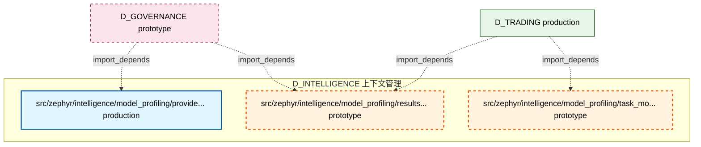

# 40_d_intelligence / 上下文管理

> **文档作用 / Purpose**: 展示 上下文管理（D_INTELLIGENCE）功能域的模块清单、域内依赖关系、跨域依赖关系、架构分层视图，供架构审查和域治理参考。

> 本文档由 generate_domain_doc.py 从 depgraph (PostgreSQL) 自动生成
> 最后更新: 2026-07-01 04:32:12
> 数据源: depgraph (PostgreSQL) nodes表 + edges表

## 域基本信息 / Domain Overview

| 字段 | 值 | Field | Value |
|------|------|-------|-------|
| 编号 | 40 | Number | 40 |
| 域ID | D_INTELLIGENCE | Domain ID | D_INTELLIGENCE |
| 域名称 | 上下文管理 | Domain Name | 上下文管理 |
| 层级 | L2_domain | Layer | L2_domain |
| 模块数 | 33 | Module Count | 33 |
| 域内依赖 | 28 | Internal Dependencies | 28 |
| 跨域入边 | 47 | Cross-domain Incoming | 47 |
| 跨域出边 | 16 | Cross-domain Outgoing | 16 |
| 设计态模块 | 0 | Design Modules | 0 |
| 原型态模块 | 17 | Prototype Modules | 17 |
| 生产态模块 | 16 | Production Modules | 16 |
| 容量 | 18/150 (正常) | Capacity | 18/150 (正常) |
| 描述 | 上下文预算管理(context_budget/token_budget) | Description | 上下文预算管理(context_budget/token_budget) |

## 域内依赖图 / Internal Dependency Diagram

> 依赖图内嵌在本文档中，IDE 可直接渲染显示。每30个节点一组分页显示。
>
> **图例说明 / Legend**：
> - **实线边框 = 运营态模块**（production，已上线运行）
> - **虚线边框 = 设计态模块**（design，还在设计中）
> - **实线箭头 = 运营态依赖**（已生效的依赖关系）
> - **虚线箭头 = 设计态依赖**（计划中的依赖关系）

### 第 1 页 / 共 2 页 / Page 1 of 2

```mermaid
graph TD
    subgraph D_INTELLIGENCE["D_INTELLIGENCE 上下文管理"]
        src_zephyr_intelligence_model_drift_detector_py["src/zephyr/intelligence/model_drift_detector.py prototype"]
        src_zephyr_intelligence_model_evaluation_init_py["src/zephyr/intelligence/model_evaluation/__init... prototype"]
        src_zephyr_intelligence_model_evaluation_activate_py["src/zephyr/intelligence/model_evaluation/activa... production"]
        src_zephyr_intelligence_model_evaluation_backtest_base_py["src/zephyr/intelligence/model_evaluation/backte... prototype"]
        src_zephyr_intelligence_model_evaluation_experiment_tracker_init_py["src/zephyr/intelligence/model_evaluation/experi... prototype"]
        src_zephyr_intelligence_model_evaluation_implementations_init_py["src/zephyr/intelligence/model_evaluation/implem... prototype"]
        src_zephyr_intelligence_model_evaluation_implementations_default_backtest_engine_py["src/zephyr/intelligence/model_evaluation/implem... prototype"]
        src_zephyr_intelligence_model_evaluation_implementations_default_inference_engine_py["src/zephyr/intelligence/model_evaluation/implem... production"]
        src_zephyr_intelligence_model_evaluation_inference_base_py["src/zephyr/intelligence/model_evaluation/infere... production"]
        src_zephyr_intelligence_model_evaluation_notebook_integration_init_py["src/zephyr/intelligence/model_evaluation/notebo... prototype"]
        src_zephyr_intelligence_model_evaluation_reranker_py["src/zephyr/intelligence/model_evaluation/rerank... production"]
        src_zephyr_intelligence_model_evaluation_sync_engine_py["src/zephyr/intelligence/model_evaluation/sync_e... prototype"]
        src_zephyr_intelligence_model_evaluation_unified_memory_api_py["src/zephyr/intelligence/model_evaluation/unifie... production"]
        src_zephyr_intelligence_model_profiling_init_py["src/zephyr/intelligence/model_profiling/__init_... prototype"]
        src_zephyr_intelligence_model_profiling_benchmark_suite_py["src/zephyr/intelligence/model_profiling/benchma... prototype"]
        src_zephyr_intelligence_model_profiling_capability_passport_py["src/zephyr/intelligence/model_profiling/capabil... production"]
        src_zephyr_intelligence_model_profiling_cli_py["src/zephyr/intelligence/model_profiling/cli.py production"]
        src_zephyr_intelligence_model_profiling_deepseek_v4_chat_py["src/zephyr/intelligence/model_profiling/deepsee... production"]
        src_zephyr_intelligence_model_profiling_exam_orchestrator_py["src/zephyr/intelligence/model_profiling/exam_or... production"]
        src_zephyr_intelligence_model_profiling_exam_test_cases_py["src/zephyr/intelligence/model_profiling/exam_te... production"]
        src_zephyr_intelligence_model_profiling_model_discovery_py["src/zephyr/intelligence/model_profiling/model_d... prototype"]
        src_zephyr_intelligence_model_profiling_pipeline_routing_init_py["src/zephyr/intelligence/model_profiling/pipelin... prototype"]
        src_zephyr_intelligence_model_profiling_pipeline_routing_benchmark_suite_py["src/zephyr/intelligence/model_profiling/pipelin... production"]
        src_zephyr_intelligence_model_profiling_pipeline_routing_cli_py["src/zephyr/intelligence/model_profiling/pipelin... prototype"]
        src_zephyr_intelligence_model_profiling_pipeline_routing_deepseek_v4_chat_py["src/zephyr/intelligence/model_profiling/pipelin... prototype"]
        src_zephyr_intelligence_model_profiling_pipeline_routing_model_discovery_py["src/zephyr/intelligence/model_profiling/pipelin... production"]
        src_zephyr_intelligence_model_profiling_pipeline_routing_profiler_py["src/zephyr/intelligence/model_profiling/pipelin... production"]
        src_zephyr_intelligence_model_profiling_pipeline_routing_results_writer_py["src/zephyr/intelligence/model_profiling/pipelin... production"]
        src_zephyr_intelligence_model_profiling_pipeline_routing_task_model_learner_py["src/zephyr/intelligence/model_profiling/pipelin... production"]
        src_zephyr_intelligence_model_profiling_profiler_py["src/zephyr/intelligence/model_profiling/profile... prototype"]
    end
    src_zephyr_intelligence_model_evaluation_backtest_base_py -.->|config_depends| src_zephyr_intelligence_model_evaluation_init_py
    src_zephyr_intelligence_model_evaluation_implementations_init_py -.->|import_depends| src_zephyr_intelligence_model_evaluation_implementations_default_backtest_engine_py
    src_zephyr_intelligence_model_evaluation_implementations_init_py -.->|import_depends| src_zephyr_intelligence_model_evaluation_implementations_default_inference_engine_py
    src_zephyr_intelligence_model_profiling_exam_orchestrator_py -->|import_depends| src_zephyr_intelligence_model_profiling_capability_passport_py
    src_zephyr_intelligence_model_profiling_exam_orchestrator_py -->|import_depends| src_zephyr_intelligence_model_profiling_exam_test_cases_py
    src_zephyr_intelligence_model_profiling_cli_py -.->|import_depends| src_zephyr_intelligence_model_profiling_init_py
    src_zephyr_intelligence_model_profiling_profiler_py -.->|import_depends| src_zephyr_intelligence_model_profiling_benchmark_suite_py
    src_zephyr_intelligence_model_profiling_profiler_py -.->|import_depends| src_zephyr_intelligence_model_profiling_model_discovery_py
    src_zephyr_intelligence_model_profiling_init_py -.->|import_depends| src_zephyr_intelligence_model_profiling_benchmark_suite_py
    src_zephyr_intelligence_model_profiling_init_py -.->|import_depends| src_zephyr_intelligence_model_profiling_profiler_py
    src_zephyr_intelligence_model_profiling_init_py -.->|import_depends| src_zephyr_intelligence_model_profiling_model_discovery_py
    src_zephyr_intelligence_model_profiling_pipeline_routing_cli_py -.->|import_depends| src_zephyr_intelligence_model_profiling_pipeline_routing_profiler_py
    src_zephyr_intelligence_model_profiling_pipeline_routing_cli_py -.->|import_depends| src_zephyr_intelligence_model_profiling_pipeline_routing_model_discovery_py
    src_zephyr_intelligence_model_profiling_pipeline_routing_cli_py -.->|import_depends| src_zephyr_intelligence_model_profiling_pipeline_routing_results_writer_py
    src_zephyr_intelligence_model_profiling_pipeline_routing_deepseek_v4_chat_py -.->|config_depends| src_zephyr_intelligence_model_profiling_pipeline_routing_init_py
    src_zephyr_intelligence_model_profiling_pipeline_routing_profiler_py -->|import_depends| src_zephyr_intelligence_model_profiling_pipeline_routing_benchmark_suite_py
    src_zephyr_intelligence_model_profiling_pipeline_routing_profiler_py -->|import_depends| src_zephyr_intelligence_model_profiling_pipeline_routing_model_discovery_py
    src_zephyr_intelligence_model_profiling_pipeline_routing_init_py -.->|import_depends| src_zephyr_intelligence_model_profiling_pipeline_routing_cli_py
    src_zephyr_intelligence_model_profiling_pipeline_routing_init_py -.->|import_depends| src_zephyr_intelligence_model_profiling_pipeline_routing_benchmark_suite_py
    src_zephyr_intelligence_model_profiling_pipeline_routing_init_py -.->|import_depends| src_zephyr_intelligence_model_profiling_pipeline_routing_profiler_py
    src_zephyr_intelligence_model_profiling_pipeline_routing_init_py -.->|import_depends| src_zephyr_intelligence_model_profiling_pipeline_routing_model_discovery_py
    src_zephyr_intelligence_model_profiling_pipeline_routing_init_py -.->|import_depends| src_zephyr_intelligence_model_profiling_pipeline_routing_task_model_learner_py
    src_zephyr_intelligence_model_profiling_pipeline_routing_results_writer_py -->|import_depends| src_zephyr_intelligence_model_profiling_pipeline_routing_profiler_py
    D_GOVERNANCE["D_GOVERNANCE production"]
    src_zephyr_intelligence_model_drift_detector_py -.->|config_depends| D_GOVERNANCE
    src_zephyr_intelligence_model_evaluation_activate_py -->|import_depends| D_GOVERNANCE
    D_GOV_ENFORCEMENT["D_GOV_ENFORCEMENT production"]
    src_zephyr_intelligence_model_evaluation_activate_py -->|import_depends| D_GOV_ENFORCEMENT
    D_ML_TRAIN["D_ML_TRAIN prototype"]
    src_zephyr_intelligence_model_evaluation_inference_base_py -.->|import_depends| D_ML_TRAIN
    src_zephyr_intelligence_model_evaluation_inference_base_py -.->|import_depends| D_ML_TRAIN
    src_zephyr_intelligence_model_evaluation_unified_memory_api_py -->|import_depends| D_GOVERNANCE
    D_AUTONOMY_CORE["D_AUTONOMY_CORE production"]
    src_zephyr_intelligence_model_evaluation_sync_engine_py -.->|import_depends| D_AUTONOMY_CORE
    src_zephyr_intelligence_model_evaluation_sync_engine_py -.->|import_depends| D_GOVERNANCE
    D_SIMULATION["D_SIMULATION prototype"]
    src_zephyr_intelligence_model_evaluation_experiment_tracker_init_py -.->|import_depends| D_SIMULATION
    src_zephyr_intelligence_model_evaluation_implementations_default_backtest_engine_py -.->|import_depends| D_SIMULATION
    D_SHARED["D_SHARED prototype"]
    src_zephyr_intelligence_model_evaluation_implementations_default_inference_engine_py -.->|import_depends| D_SHARED
    D_TRADING["D_TRADING production"]
    src_zephyr_intelligence_model_evaluation_implementations_default_inference_engine_py -->|import_depends| D_TRADING
    src_zephyr_intelligence_model_evaluation_implementations_default_inference_engine_py -.->|import_depends| D_ML_TRAIN
    src_zephyr_intelligence_model_evaluation_implementations_default_inference_engine_py -.->|import_depends| D_ML_TRAIN
    src_zephyr_intelligence_model_evaluation_notebook_integration_init_py -.->|import_depends| D_SIMULATION
    D_GOVERNANCE -.->|test_depends| src_zephyr_intelligence_model_evaluation_inference_base_py
    D_SECURITY["D_SECURITY prototype"]
    D_SECURITY -.->|import_depends| src_zephyr_intelligence_model_evaluation_unified_memory_api_py
    classDef production fill:#e1f5fe,stroke:#01579b,stroke-width:2px,color:#000
    classDef design fill:#fff3e0,stroke:#e65100,stroke-width:2px,color:#000,stroke-dasharray: 5 5
    classDef external_prod fill:#e8f5e9,stroke:#1b5e20,stroke-width:1px,color:#000
    classDef external_design fill:#fce4ec,stroke:#880e4f,stroke-width:1px,color:#000,stroke-dasharray: 5 5
    class src_zephyr_intelligence_model_evaluation_activate_py,src_zephyr_intelligence_model_evaluation_implementations_default_inference_engine_py,src_zephyr_intelligence_model_evaluation_inference_base_py,src_zephyr_intelligence_model_evaluation_reranker_py,src_zephyr_intelligence_model_evaluation_unified_memory_api_py,src_zephyr_intelligence_model_profiling_capability_passport_py,src_zephyr_intelligence_model_profiling_cli_py,src_zephyr_intelligence_model_profiling_deepseek_v4_chat_py,src_zephyr_intelligence_model_profiling_exam_orchestrator_py,src_zephyr_intelligence_model_profiling_exam_test_cases_py,src_zephyr_intelligence_model_profiling_pipeline_routing_benchmark_suite_py,src_zephyr_intelligence_model_profiling_pipeline_routing_model_discovery_py,src_zephyr_intelligence_model_profiling_pipeline_routing_profiler_py,src_zephyr_intelligence_model_profiling_pipeline_routing_results_writer_py,src_zephyr_intelligence_model_profiling_pipeline_routing_task_model_learner_py production
    class src_zephyr_intelligence_model_drift_detector_py,src_zephyr_intelligence_model_evaluation_init_py,src_zephyr_intelligence_model_evaluation_backtest_base_py,src_zephyr_intelligence_model_evaluation_experiment_tracker_init_py,src_zephyr_intelligence_model_evaluation_implementations_init_py,src_zephyr_intelligence_model_evaluation_implementations_default_backtest_engine_py,src_zephyr_intelligence_model_evaluation_notebook_integration_init_py,src_zephyr_intelligence_model_evaluation_sync_engine_py,src_zephyr_intelligence_model_profiling_init_py,src_zephyr_intelligence_model_profiling_benchmark_suite_py,src_zephyr_intelligence_model_profiling_model_discovery_py,src_zephyr_intelligence_model_profiling_pipeline_routing_init_py,src_zephyr_intelligence_model_profiling_pipeline_routing_cli_py,src_zephyr_intelligence_model_profiling_pipeline_routing_deepseek_v4_chat_py,src_zephyr_intelligence_model_profiling_profiler_py design
    class D_GOVERNANCE,D_GOV_ENFORCEMENT,D_AUTONOMY_CORE,D_TRADING external_prod
    class D_ML_TRAIN,D_SIMULATION,D_SHARED,D_SECURITY external_design
```



### 第 2 页 / 共 2 页 / Page 2 of 2



## 跨域依赖 / Cross-domain Dependencies

### 本域依赖的其他域（出边）/ Depends On

| 目标域 / Target Domain | 依赖数 / Count | 依赖类型 / Type |
|--------|:---:|---------|
| D_GOVERNANCE | 4 | config_depends,import_depends |
| D_ML_TRAIN | 4 | import_depends |
| D_SIMULATION | 3 | import_depends |
| D_SHARED | 1 | import_depends |
| D_AUTONOMY_CORE | 1 | import_depends |
| D_TRADING | 1 | import_depends |
| D_GOV_ENFORCEMENT | 1 | import_depends |
| D_INTEGRATION | 1 | import_depends |

### 依赖本域的其他域（入边）/ Depended By

| 源域 / Source Domain | 依赖数 / Count | 依赖类型 / Type |
|------|:---:|---------|
| D_GOVERNANCE | 35 | import_depends,test_depends |
| D_TRADING | 5 | import_depends |
| D_INTEGRATION | 3 | import_depends |
| D_AUTONOMY_CORE | 2 | import_depends |
| D_GOV_SCRIPTS | 1 | import_depends |
| D_SECURITY | 1 | import_depends |

## 架构分层视图 / Architecture Overview

> 按 architecture_layer 分层显示 上下文管理（D_INTELLIGENCE）的模块分布。共 33 个模块 / 33 modules。

```

┌──────────────────────────────────────────────────────────────────┐
│            L1 基础层 / Foundation Layer (33 modules)             │
├──────────────────────────────────────────────────────────────────┤
│   src/zephyr/intelligence/model_drift_detector.py  [prototype]   │
│   src/zephyr/intelligence/model_evaluation/__init__.py  [prot... │
│   src/zephyr/intelligence/model_evaluation/activate.py  [prod... │
│   src/zephyr/intelligence/model_evaluation/backtest_base.py  ... │
│   src/zephyr/intelligence/model_evaluation/experiment_tracker... │
│   src/zephyr/intelligence/model_evaluation/implementations/__... │
│   src/zephyr/intelligence/model_evaluation/implementations/de... │
│   src/zephyr/intelligence/model_evaluation/implementations/de... │
│   src/zephyr/intelligence/model_evaluation/inference_base.py ... │
│   src/zephyr/intelligence/model_evaluation/notebook_integrati... │
│   src/zephyr/intelligence/model_evaluation/reranker.py  [prod... │
│   src/zephyr/intelligence/model_evaluation/sync_engine.py  [p... │
│   src/zephyr/intelligence/model_evaluation/unified_memory_api... │
│   src/zephyr/intelligence/model_profiling/__init__.py  [proto... │
│   src/zephyr/intelligence/model_profiling/benchmark_suite.py ... │
│   src/zephyr/intelligence/model_profiling/capability_passport... │
│   src/zephyr/intelligence/model_profiling/cli.py  [production]   │
│   src/zephyr/intelligence/model_profiling/deepseek_v4_chat.py... │
│   ...还有 15 个模块 / 15 more modules                            │
└──────────────────────────────────────────────────────────────────┘

```

## 模块分层清单 / Module Layered List

> 按 architecture_layer 分组的模块清单（共 33 个模块 / 33 modules）。

### L1 基础层 / Foundation Layer (33 modules)

| # | 模块路径 / Module Path | 模块名称 / Module Name | 成熟度 / Maturity | 构建状态 / Build Status |
|:--:|---------|---------|:---:|:---:|
| 1 | src/zephyr/intelligence/model_drift_detector.py | src/zephyr/intelligence/model_drift_d... | prototype | generated |
| 2 | src/zephyr/intelligence/model_evaluation/__init__.py | src/zephyr/intelligence/model_evaluat... | prototype | generated |
| 3 | src/zephyr/intelligence/model_evaluation/activate.py | src/zephyr/intelligence/model_evaluat... | production | generated |
| 4 | src/zephyr/intelligence/model_evaluation/backtest_base.py | src/zephyr/intelligence/model_evaluat... | prototype | generated |
| 5 | src/zephyr/intelligence/model_evaluation/experiment_track... | src/zephyr/intelligence/model_evaluat... | prototype | generated |
| 6 | src/zephyr/intelligence/model_evaluation/implementations/... | src/zephyr/intelligence/model_evaluat... | prototype | generated |
| 7 | src/zephyr/intelligence/model_evaluation/implementations/... | src/zephyr/intelligence/model_evaluat... | prototype | generated |
| 8 | src/zephyr/intelligence/model_evaluation/implementations/... | src/zephyr/intelligence/model_evaluat... | production | generated |
| 9 | src/zephyr/intelligence/model_evaluation/inference_base.py | src/zephyr/intelligence/model_evaluat... | production | generated |
| 10 | src/zephyr/intelligence/model_evaluation/notebook_integra... | src/zephyr/intelligence/model_evaluat... | prototype | generated |
| 11 | src/zephyr/intelligence/model_evaluation/reranker.py | src/zephyr/intelligence/model_evaluat... | production | generated |
| 12 | src/zephyr/intelligence/model_evaluation/sync_engine.py | src/zephyr/intelligence/model_evaluat... | prototype | generated |
| 13 | src/zephyr/intelligence/model_evaluation/unified_memory_a... | src/zephyr/intelligence/model_evaluat... | production | generated |
| 14 | src/zephyr/intelligence/model_profiling/__init__.py | src/zephyr/intelligence/model_profili... | prototype | generated |
| 15 | src/zephyr/intelligence/model_profiling/benchmark_suite.py | src/zephyr/intelligence/model_profili... | prototype | generated |
| 16 | src/zephyr/intelligence/model_profiling/capability_passpo... | src/zephyr/intelligence/model_profili... | production | generated |
| 17 | src/zephyr/intelligence/model_profiling/cli.py | src/zephyr/intelligence/model_profili... | production | generated |
| 18 | src/zephyr/intelligence/model_profiling/deepseek_v4_chat.py | src/zephyr/intelligence/model_profili... | production | generated |
| 19 | src/zephyr/intelligence/model_profiling/exam_orchestrator.py | src/zephyr/intelligence/model_profili... | production | generated |
| 20 | src/zephyr/intelligence/model_profiling/exam_test_cases.py | src/zephyr/intelligence/model_profili... | production | generated |
| 21 | src/zephyr/intelligence/model_profiling/model_discovery.py | src/zephyr/intelligence/model_profili... | prototype | generated |
| 22 | src/zephyr/intelligence/model_profiling/pipeline_routing/... | src/zephyr/intelligence/model_profili... | prototype | generated |
| 23 | src/zephyr/intelligence/model_profiling/pipeline_routing/... | src/zephyr/intelligence/model_profili... | production | generated |
| 24 | src/zephyr/intelligence/model_profiling/pipeline_routing/... | src/zephyr/intelligence/model_profili... | prototype | generated |
| 25 | src/zephyr/intelligence/model_profiling/pipeline_routing/... | src/zephyr/intelligence/model_profili... | prototype | generated |
| 26 | src/zephyr/intelligence/model_profiling/pipeline_routing/... | src/zephyr/intelligence/model_profili... | production | generated |
| 27 | src/zephyr/intelligence/model_profiling/pipeline_routing/... | src/zephyr/intelligence/model_profili... | production | generated |
| 28 | src/zephyr/intelligence/model_profiling/pipeline_routing/... | src/zephyr/intelligence/model_profili... | production | generated |
| 29 | src/zephyr/intelligence/model_profiling/pipeline_routing/... | src/zephyr/intelligence/model_profili... | production | generated |
| 30 | src/zephyr/intelligence/model_profiling/profiler.py | src/zephyr/intelligence/model_profili... | prototype | generated |
| 31 | src/zephyr/intelligence/model_profiling/provider_data.py | src/zephyr/intelligence/model_profili... | production | generated |
| 32 | src/zephyr/intelligence/model_profiling/results_writer.py | src/zephyr/intelligence/model_profili... | prototype | generated |
| 33 | src/zephyr/intelligence/model_profiling/task_model_learne... | src/zephyr/intelligence/model_profili... | prototype | generated |

## 依赖关系图 / Dependency Graph

> 域内模块依赖关系（共 28 条 / 28 edges）。按依赖类型分组，使用 → 表示方向。

```

┌──────────────────────────────────────────────────────────────────┐
│       依赖关系图 / Dependency Graph (共 28 条 / 28 edges)        │
├──────────────────────────────────────────────────────────────────┤
│   依赖类型数 / Dependency Types: 2                               │
│   [import_depends]: 26 条 / edges                                │
│   [config_depends]: 2 条 / edges                                 │
└──────────────────────────────────────────────────────────────────┘

┌──────────────────────────────────────────────────────────────────┐
│                 [import_depends] (26 条 / edges)                 │
├──────────────────────────────────────────────────────────────────┤
│   __init__.py → default_backtest_engine.py                       │
│   __init__.py → default_inference_engine.py                      │
│   exam_orchestrator.py → capability_passport.py                  │
│   exam_orchestrator.py → exam_test_cases.py                      │
│   cli.py → results_writer.py                                     │
│   cli.py → __init__.py                                           │
│   results_writer.py → profiler.py                                │
│   profiler.py → benchmark_suite.py                               │
│   profiler.py → model_discovery.py                               │
│   model_discovery.py → provider_data.py                          │
│   __init__.py → benchmark_suite.py                               │
│   __init__.py → profiler.py                                      │
│   __init__.py → model_discovery.py                               │
│   __init__.py → task_model_learner.py                            │
│   cli.py → profiler.py                                           │
│   cli.py → model_discovery.py                                    │
│   cli.py → results_writer.py                                     │
│   profiler.py → benchmark_suite.py                               │
│   profiler.py → model_discovery.py                               │
│   __init__.py → cli.py                                           │
│   __init__.py → benchmark_suite.py                               │
│   __init__.py → profiler.py                                      │
│   __init__.py → model_discovery.py                               │
│   __init__.py → task_model_learner.py                            │
│   model_discovery.py → provider_data.py                          │
│   results_writer.py → profiler.py                                │
└──────────────────────────────────────────────────────────────────┘

┌──────────────────────────────────────────────────────────────────┐
│                 [config_depends] (2 条 / edges)                  │
├──────────────────────────────────────────────────────────────────┤
│   backtest_base.py → __init__.py                                 │
│   deepseek_v4_chat.py → __init__.py                              │
└──────────────────────────────────────────────────────────────────┘

```

## 说明 / Notes

- **数据源 / Data Source**: `depgraph (PostgreSQL)` 的 `nodes`、`edges`、`domains` 表
- **生成器 / Generator**: `generate_domain_doc.py`（G2+G10 合并）
- **维护方式 / Maintenance**: 自动生成，全景图更新时刷新
- **文件名规则 / File Naming**: `{编号:02d}_{域ID小写}.md`，如 `16_d_trading.md`
- **图例说明 / Legend**: `[production]`=已上线 / `[design]`=设计中 / `[prototype]`=原型 / `[unknown]`=未知
