# 40_d_intelligence / 上下文管理

> **文档作用 / Purpose**: 展示 上下文管理（D-INTELLIGENCE）功能域的模块清单、域内依赖关系和跨域依赖关系，供架构审查和域治理参考。

> 本文档由 generate_domain_doc.py 从 depgraph.db 自动生成
> 最后更新: 2026-06-29 01:07:22
> 数据源: depgraph.db nodes表 + edges表

## 域基本信息 / Domain Overview

| 字段 | 值 | Field | Value |
|------|------|-------|-------|
| 编号 | 40 | Number | 40 |
| 域ID | D-INTELLIGENCE | Domain ID | D-INTELLIGENCE |
| 域名称 | 上下文管理 | Domain Name | context_management |
| 层级 | L2_domain | Layer | L2_domain |
| 模块数 | 42 | Module Count | 42 |
| 域内依赖 | 29 | Internal Dependencies | 29 |
| 跨域入边 | 63 | Cross-domain Incoming | 63 |
| 跨域出边 | 24 | Cross-domain Outgoing | 24 |
| 设计态模块 | 0 | Design Modules | 0 |
| 原型态模块 | 25 | Prototype Modules | 25 |
| 生产态模块 | 17 | Production Modules | 17 |
| 容量 | 18/150 (正常) | Capacity | 18/150 (正常) |
| 描述 | 上下文预算管理(context_budget/token_budget) | Description | 上下文预算管理(context_budget/token_budget) |

## 模块清单 / Module List

共 42 个模块（按路径排序，全部显示）

| 模块路径 / Module Path | 模块名称 / Module Name | 设计成熟度 / Maturity | 构建状态 / Build Status |
|---------|---------|-----------|---------|
| src/zephyr/intelligence/__init__.py |  | prototype | deprecated |
| src/zephyr/intelligence/_extensions/__init__.py |  | prototype | deprecated |
| src/zephyr/intelligence/api/__init__.py |  | prototype | deprecated |
| src/zephyr/intelligence/core/__init__.py |  | prototype | deprecated |
| src/zephyr/intelligence/infrastructure/__init__.py |  | prototype | deprecated |
| src/zephyr/intelligence/model_drift_detector.py |  | prototype | generated |
| src/zephyr/intelligence/model_evaluation/__init__.py |  | prototype | generated |
| src/zephyr/intelligence/model_evaluation/activate.py |  | production | generated |
| src/zephyr/intelligence/model_evaluation/backtest_base.py |  | prototype | generated |
| src/zephyr/intelligence/model_evaluation/experiment_tracker/__init__.py |  | prototype | generated |
| src/zephyr/intelligence/model_evaluation/implementations/__init__.py |  | prototype | generated |
| ...phyr/intelligence/model_evaluation/implementations/default_backtest_engine.py |  | prototype | generated |
| ...hyr/intelligence/model_evaluation/implementations/default_inference_engine.py |  | production | generated |
| src/zephyr/intelligence/model_evaluation/inference_base.py |  | production | generated |
| src/zephyr/intelligence/model_evaluation/kb_repo.py |  | production | generated |
| src/zephyr/intelligence/model_evaluation/notebook_integration/__init__.py |  | prototype | generated |
| src/zephyr/intelligence/model_evaluation/reranker.py |  | production | generated |
| src/zephyr/intelligence/model_evaluation/sync_engine.py |  | prototype | generated |
| src/zephyr/intelligence/model_evaluation/target_lib/__init__.py |  | prototype | deprecated |
| src/zephyr/intelligence/model_evaluation/unified_memory_api.py |  | production | generated |
| src/zephyr/intelligence/model_profiling/__init__.py |  | prototype | generated |
| src/zephyr/intelligence/model_profiling/benchmark_suite.py |  | prototype | generated |
| src/zephyr/intelligence/model_profiling/capability_passport.py |  | production | generated |
| src/zephyr/intelligence/model_profiling/cli.py |  | production | generated |
| src/zephyr/intelligence/model_profiling/deepseek_v4_chat.py |  | production | generated |
| src/zephyr/intelligence/model_profiling/exam_orchestrator.py |  | production | generated |
| src/zephyr/intelligence/model_profiling/exam_test_cases.py |  | production | generated |
| src/zephyr/intelligence/model_profiling/model_discovery.py |  | prototype | generated |
| src/zephyr/intelligence/model_profiling/pipeline_routing/__init__.py |  | prototype | generated |
| src/zephyr/intelligence/model_profiling/pipeline_routing/benchmark_suite.py |  | production | generated |
| src/zephyr/intelligence/model_profiling/pipeline_routing/cli.py |  | prototype | generated |
| src/zephyr/intelligence/model_profiling/pipeline_routing/deepseek_v4_chat.py |  | prototype | generated |
| src/zephyr/intelligence/model_profiling/pipeline_routing/model_discovery.py |  | production | generated |
| src/zephyr/intelligence/model_profiling/pipeline_routing/profiler.py |  | production | generated |
| src/zephyr/intelligence/model_profiling/pipeline_routing/results_writer.py |  | production | generated |
| src/zephyr/intelligence/model_profiling/pipeline_routing/task_model_learner.py |  | production | generated |
| src/zephyr/intelligence/model_profiling/profiler.py |  | prototype | generated |
| src/zephyr/intelligence/model_profiling/provider_data.py |  | production | generated |
| src/zephyr/intelligence/model_profiling/results_writer.py |  | prototype | generated |
| src/zephyr/intelligence/model_profiling/task_model_learner.py |  | prototype | generated |
| src/zephyr/intelligence/models/__init__.py |  | prototype | deprecated |
| src/zephyr/intelligence/services/__init__.py |  | prototype | deprecated |

## 域内依赖图 / Internal Dependency Diagram

> 依赖图内嵌在本文档中，IDE 可直接渲染显示。每30个节点一组分页显示。
>
> **图例说明 / Legend**：
> - **实线边框 = 运营态模块**（production，已上线运行）
> - **虚线边框 = 设计态模块**（design，还在设计中）
> - **实线箭头 = 运营态依赖**（已生效的依赖关系）
> - **虚线箭头 = 设计态依赖**（计划中的依赖关系）

### 第 1 页 / 共 2 页 / Page 1 of 2

```mermaid
graph TD
    subgraph D_INTELLIGENCE["D-INTELLIGENCE 上下文管理"]
        src_zephyr_intelligence_init_py["src/zephyr/intelligence/__init__.py prototype"]
        src_zephyr_intelligence_extensions_init_py["src/zephyr/intelligence/_extensions/__init__.py prototype"]
        src_zephyr_intelligence_api_init_py["src/zephyr/intelligence/api/__init__.py prototype"]
        src_zephyr_intelligence_core_init_py["src/zephyr/intelligence/core/__init__.py prototype"]
        src_zephyr_intelligence_infrastructure_init_py["src/zephyr/intelligence/infrastructure/__init__.py prototype"]
        src_zephyr_intelligence_model_drift_detector_py["src/zephyr/intelligence/model_drift_detector.py prototype"]
        src_zephyr_intelligence_model_evaluation_init_py["src/zephyr/intelligence/model_evaluation/__init... prototype"]
        src_zephyr_intelligence_model_evaluation_activate_py["src/zephyr/intelligence/model_evaluation/activa... production"]
        src_zephyr_intelligence_model_evaluation_backtest_base_py["src/zephyr/intelligence/model_evaluation/backte... prototype"]
        src_zephyr_intelligence_model_evaluation_experiment_tracker_init_py["src/zephyr/intelligence/model_evaluation/experi... prototype"]
        src_zephyr_intelligence_model_evaluation_implementations_init_py["src/zephyr/intelligence/model_evaluation/implem... prototype"]
        src_zephyr_intelligence_model_evaluation_implementations_default_backtest_engine_py["src/zephyr/intelligence/model_evaluation/implem... prototype"]
        src_zephyr_intelligence_model_evaluation_implementations_default_inference_engine_py["src/zephyr/intelligence/model_evaluation/implem... production"]
        src_zephyr_intelligence_model_evaluation_inference_base_py["src/zephyr/intelligence/model_evaluation/infere... production"]
        src_zephyr_intelligence_model_evaluation_kb_repo_py["src/zephyr/intelligence/model_evaluation/kb_rep... production"]
        src_zephyr_intelligence_model_evaluation_notebook_integration_init_py["src/zephyr/intelligence/model_evaluation/notebo... prototype"]
        src_zephyr_intelligence_model_evaluation_reranker_py["src/zephyr/intelligence/model_evaluation/rerank... production"]
        src_zephyr_intelligence_model_evaluation_sync_engine_py["src/zephyr/intelligence/model_evaluation/sync_e... prototype"]
        src_zephyr_intelligence_model_evaluation_target_lib_init_py["src/zephyr/intelligence/model_evaluation/target... prototype"]
        src_zephyr_intelligence_model_evaluation_unified_memory_api_py["src/zephyr/intelligence/model_evaluation/unifie... production"]
        src_zephyr_intelligence_model_profiling_init_py["src/zephyr/intelligence/model_profiling/__init_... prototype"]
        src_zephyr_intelligence_model_profiling_benchmark_suite_py["src/zephyr/intelligence/model_profiling/benchma... prototype"]
        src_zephyr_intelligence_model_profiling_capability_passport_py["src/zephyr/intelligence/model_profiling/capabil... production"]
        src_zephyr_intelligence_model_profiling_cli_py["src/zephyr/intelligence/model_profiling/cli.py production"]
        src_zephyr_intelligence_model_profiling_deepseek_v4_chat_py["src/zephyr/intelligence/model_profiling/deepsee... production"]
        src_zephyr_intelligence_model_profiling_exam_orchestrator_py["src/zephyr/intelligence/model_profiling/exam_or... production"]
        src_zephyr_intelligence_model_profiling_exam_test_cases_py["src/zephyr/intelligence/model_profiling/exam_te... production"]
        src_zephyr_intelligence_model_profiling_model_discovery_py["src/zephyr/intelligence/model_profiling/model_d... prototype"]
        src_zephyr_intelligence_model_profiling_pipeline_routing_init_py["src/zephyr/intelligence/model_profiling/pipelin... prototype"]
        src_zephyr_intelligence_model_profiling_pipeline_routing_benchmark_suite_py["src/zephyr/intelligence/model_profiling/pipelin... production"]
    end
    src_zephyr_intelligence_model_evaluation_backtest_base_py -.->|config_depends| src_zephyr_intelligence_model_evaluation_init_py
    src_zephyr_intelligence_model_evaluation_activate_py -->|import_depends| src_zephyr_intelligence_model_evaluation_kb_repo_py
    src_zephyr_intelligence_model_evaluation_implementations_init_py -.->|import_depends| src_zephyr_intelligence_model_evaluation_implementations_default_backtest_engine_py
    src_zephyr_intelligence_model_evaluation_implementations_init_py -.->|import_depends| src_zephyr_intelligence_model_evaluation_implementations_default_inference_engine_py
    src_zephyr_intelligence_model_profiling_exam_orchestrator_py -->|import_depends| src_zephyr_intelligence_model_profiling_capability_passport_py
    src_zephyr_intelligence_model_profiling_exam_orchestrator_py -->|import_depends| src_zephyr_intelligence_model_profiling_exam_test_cases_py
    src_zephyr_intelligence_model_profiling_cli_py -.->|import_depends| src_zephyr_intelligence_model_profiling_init_py
    src_zephyr_intelligence_model_profiling_init_py -.->|import_depends| src_zephyr_intelligence_model_profiling_benchmark_suite_py
    src_zephyr_intelligence_model_profiling_init_py -.->|import_depends| src_zephyr_intelligence_model_profiling_model_discovery_py
    src_zephyr_intelligence_model_profiling_pipeline_routing_init_py -.->|import_depends| src_zephyr_intelligence_model_profiling_pipeline_routing_benchmark_suite_py
    D_GOVERNANCE["D-GOVERNANCE production"]
    src_zephyr_intelligence_model_drift_detector_py -.->|config_depends| D_GOVERNANCE
    D_GOV_ENFORCEMENT["D-GOV_ENFORCEMENT production"]
    src_zephyr_intelligence_infrastructure_init_py -.->|contract| D_GOV_ENFORCEMENT
    src_zephyr_intelligence_model_evaluation_activate_py -->|import_depends| D_GOVERNANCE
    D_INTEGRATION["D-INTEGRATION prototype"]
    src_zephyr_intelligence_model_evaluation_activate_py -.->|import_depends| D_INTEGRATION
    src_zephyr_intelligence_model_evaluation_activate_py -->|import_depends| D_GOV_ENFORCEMENT
    src_zephyr_intelligence_model_evaluation_kb_repo_py -->|import_depends| D_GOVERNANCE
    src_zephyr_intelligence_model_evaluation_kb_repo_py -->|import_depends| D_INTEGRATION
    src_zephyr_intelligence_model_evaluation_kb_repo_py -.->|import_depends| D_INTEGRATION
    src_zephyr_intelligence_model_evaluation_kb_repo_py -->|import_depends| D_INTEGRATION
    D_ML_TRAIN["D-ML_TRAIN prototype"]
    src_zephyr_intelligence_model_evaluation_inference_base_py -.->|import_depends| D_ML_TRAIN
    src_zephyr_intelligence_model_evaluation_inference_base_py -.->|import_depends| D_ML_TRAIN
    src_zephyr_intelligence_model_evaluation_unified_memory_api_py -->|import_depends| D_INTEGRATION
    src_zephyr_intelligence_model_evaluation_unified_memory_api_py -->|import_depends| D_GOVERNANCE
    D_AUTONOMY_CORE["D-AUTONOMY_CORE production"]
    src_zephyr_intelligence_model_evaluation_sync_engine_py -.->|import_depends| D_AUTONOMY_CORE
    src_zephyr_intelligence_model_evaluation_sync_engine_py -.->|import_depends| D_GOVERNANCE
    D_AUTONOMY_CORE -.->|import_depends| src_zephyr_intelligence_model_evaluation_unified_memory_api_py
    D_AUTONOMY_CORE -.->|import_depends| src_zephyr_intelligence_model_evaluation_reranker_py
    D_GOVERNANCE -.->|import_depends| src_zephyr_intelligence_model_evaluation_kb_repo_py
    D_GOV_DOCS["D-GOV_DOCS prototype"]
    D_GOV_DOCS -.->|import_depends| src_zephyr_intelligence_model_evaluation_kb_repo_py
    D_GOV_DOCS -.->|import_depends| src_zephyr_intelligence_model_evaluation_kb_repo_py
    D_INTEGRATION -.->|import_depends| src_zephyr_intelligence_model_evaluation_reranker_py
    D_SECURITY["D-SECURITY prototype"]
    D_SECURITY -.->|import_depends| src_zephyr_intelligence_model_evaluation_unified_memory_api_py
    D_TRADING["D-TRADING production"]
    D_TRADING -.->|import_depends| src_zephyr_intelligence_model_profiling_init_py
    D_TRADING -.->|import_depends| src_zephyr_intelligence_model_evaluation_sync_engine_py
    D_TRADING -.->|import_depends| src_zephyr_intelligence_model_profiling_capability_passport_py
    D_GOV_SCRIPTS["D-GOV_SCRIPTS prototype"]
    D_GOV_SCRIPTS -.->|import_depends| src_zephyr_intelligence_model_evaluation_implementations_default_inference_engine_py
    D_GOVERNANCE -.->|test_depends| src_zephyr_intelligence_model_profiling_pipeline_routing_benchmark_suite_py
    D_GOVERNANCE -.->|test_depends| src_zephyr_intelligence_model_profiling_cli_py
    D_GOVERNANCE -.->|test_depends| src_zephyr_intelligence_model_evaluation_inference_base_py
    D_GOVERNANCE -.->|test_depends| src_zephyr_intelligence_model_profiling_deepseek_v4_chat_py
    classDef production fill:#e1f5fe,stroke:#01579b,stroke-width:2px,color:#000
    classDef design fill:#fff3e0,stroke:#e65100,stroke-width:2px,color:#000,stroke-dasharray: 5 5
    classDef external_prod fill:#e8f5e9,stroke:#1b5e20,stroke-width:1px,color:#000
    classDef external_design fill:#fce4ec,stroke:#880e4f,stroke-width:1px,color:#000,stroke-dasharray: 5 5
    class src_zephyr_intelligence_model_evaluation_activate_py,src_zephyr_intelligence_model_evaluation_implementations_default_inference_engine_py,src_zephyr_intelligence_model_evaluation_inference_base_py,src_zephyr_intelligence_model_evaluation_kb_repo_py,src_zephyr_intelligence_model_evaluation_reranker_py,src_zephyr_intelligence_model_evaluation_unified_memory_api_py,src_zephyr_intelligence_model_profiling_capability_passport_py,src_zephyr_intelligence_model_profiling_cli_py,src_zephyr_intelligence_model_profiling_deepseek_v4_chat_py,src_zephyr_intelligence_model_profiling_exam_orchestrator_py,src_zephyr_intelligence_model_profiling_exam_test_cases_py,src_zephyr_intelligence_model_profiling_pipeline_routing_benchmark_suite_py production
    class src_zephyr_intelligence_init_py,src_zephyr_intelligence_extensions_init_py,src_zephyr_intelligence_api_init_py,src_zephyr_intelligence_core_init_py,src_zephyr_intelligence_infrastructure_init_py,src_zephyr_intelligence_model_drift_detector_py,src_zephyr_intelligence_model_evaluation_init_py,src_zephyr_intelligence_model_evaluation_backtest_base_py,src_zephyr_intelligence_model_evaluation_experiment_tracker_init_py,src_zephyr_intelligence_model_evaluation_implementations_init_py,src_zephyr_intelligence_model_evaluation_implementations_default_backtest_engine_py,src_zephyr_intelligence_model_evaluation_notebook_integration_init_py,src_zephyr_intelligence_model_evaluation_sync_engine_py,src_zephyr_intelligence_model_evaluation_target_lib_init_py,src_zephyr_intelligence_model_profiling_init_py,src_zephyr_intelligence_model_profiling_benchmark_suite_py,src_zephyr_intelligence_model_profiling_model_discovery_py,src_zephyr_intelligence_model_profiling_pipeline_routing_init_py design
    class D_GOVERNANCE,D_GOV_ENFORCEMENT,D_AUTONOMY_CORE,D_TRADING external_prod
    class D_INTEGRATION,D_ML_TRAIN,D_GOV_DOCS,D_SECURITY,D_GOV_SCRIPTS external_design
```

### 第 2 页 / 共 2 页 / Page 2 of 2

```mermaid
graph TD
    subgraph D_INTELLIGENCE["D-INTELLIGENCE 上下文管理"]
        src_zephyr_intelligence_model_profiling_pipeline_routing_cli_py["src/zephyr/intelligence/model_profiling/pipelin... prototype"]
        src_zephyr_intelligence_model_profiling_pipeline_routing_deepseek_v4_chat_py["src/zephyr/intelligence/model_profiling/pipelin... prototype"]
        src_zephyr_intelligence_model_profiling_pipeline_routing_model_discovery_py["src/zephyr/intelligence/model_profiling/pipelin... production"]
        src_zephyr_intelligence_model_profiling_pipeline_routing_profiler_py["src/zephyr/intelligence/model_profiling/pipelin... production"]
        src_zephyr_intelligence_model_profiling_pipeline_routing_results_writer_py["src/zephyr/intelligence/model_profiling/pipelin... production"]
        src_zephyr_intelligence_model_profiling_pipeline_routing_task_model_learner_py["src/zephyr/intelligence/model_profiling/pipelin... production"]
        src_zephyr_intelligence_model_profiling_profiler_py["src/zephyr/intelligence/model_profiling/profile... prototype"]
        src_zephyr_intelligence_model_profiling_provider_data_py["src/zephyr/intelligence/model_profiling/provide... production"]
        src_zephyr_intelligence_model_profiling_results_writer_py["src/zephyr/intelligence/model_profiling/results... prototype"]
        src_zephyr_intelligence_model_profiling_task_model_learner_py["src/zephyr/intelligence/model_profiling/task_mo... prototype"]
        src_zephyr_intelligence_models_init_py["src/zephyr/intelligence/models/__init__.py prototype"]
        src_zephyr_intelligence_services_init_py["src/zephyr/intelligence/services/__init__.py prototype"]
    end
    src_zephyr_intelligence_model_profiling_results_writer_py -.->|import_depends| src_zephyr_intelligence_model_profiling_profiler_py
    src_zephyr_intelligence_model_profiling_pipeline_routing_cli_py -.->|import_depends| src_zephyr_intelligence_model_profiling_pipeline_routing_profiler_py
    src_zephyr_intelligence_model_profiling_pipeline_routing_cli_py -.->|import_depends| src_zephyr_intelligence_model_profiling_pipeline_routing_model_discovery_py
    src_zephyr_intelligence_model_profiling_pipeline_routing_cli_py -.->|import_depends| src_zephyr_intelligence_model_profiling_pipeline_routing_results_writer_py
    src_zephyr_intelligence_model_profiling_pipeline_routing_profiler_py -->|import_depends| src_zephyr_intelligence_model_profiling_pipeline_routing_model_discovery_py
    src_zephyr_intelligence_model_profiling_pipeline_routing_model_discovery_py -->|import_depends| src_zephyr_intelligence_model_profiling_provider_data_py
    src_zephyr_intelligence_model_profiling_pipeline_routing_results_writer_py -->|import_depends| src_zephyr_intelligence_model_profiling_pipeline_routing_profiler_py
    D_INTEGRATION["D-INTEGRATION production"]
    src_zephyr_intelligence_model_profiling_pipeline_routing_task_model_learner_py -->|import_depends| D_INTEGRATION
    D_TRADING["D-TRADING production"]
    D_TRADING -.->|import_depends| src_zephyr_intelligence_model_profiling_results_writer_py
    D_GOVERNANCE["D-GOVERNANCE prototype"]
    D_GOVERNANCE -.->|import_depends| src_zephyr_intelligence_model_profiling_results_writer_py
    D_TRADING -.->|import_depends| src_zephyr_intelligence_model_profiling_task_model_learner_py
    D_GOVERNANCE -.->|test_depends| src_zephyr_intelligence_model_profiling_provider_data_py
    D_GOVERNANCE -.->|import_depends| src_zephyr_intelligence_model_profiling_provider_data_py
    D_GOVERNANCE -.->|test_depends| src_zephyr_intelligence_model_profiling_pipeline_routing_profiler_py
    D_GOVERNANCE -.->|test_depends| src_zephyr_intelligence_model_profiling_pipeline_routing_profiler_py
    D_INTEGRATION -.->|import_depends| src_zephyr_intelligence_model_profiling_pipeline_routing_profiler_py
    D_GOVERNANCE -.->|test_depends| src_zephyr_intelligence_model_profiling_pipeline_routing_model_discovery_py
    D_GOVERNANCE -.->|test_depends| src_zephyr_intelligence_model_profiling_pipeline_routing_task_model_learner_py
    D_GOVERNANCE -.->|test_depends| src_zephyr_intelligence_model_profiling_pipeline_routing_results_writer_py
    D_INTEGRATION -.->|import_depends| src_zephyr_intelligence_model_profiling_pipeline_routing_results_writer_py
    classDef production fill:#e1f5fe,stroke:#01579b,stroke-width:2px,color:#000
    classDef design fill:#fff3e0,stroke:#e65100,stroke-width:2px,color:#000,stroke-dasharray: 5 5
    classDef external_prod fill:#e8f5e9,stroke:#1b5e20,stroke-width:1px,color:#000
    classDef external_design fill:#fce4ec,stroke:#880e4f,stroke-width:1px,color:#000,stroke-dasharray: 5 5
    class src_zephyr_intelligence_model_profiling_pipeline_routing_model_discovery_py,src_zephyr_intelligence_model_profiling_pipeline_routing_profiler_py,src_zephyr_intelligence_model_profiling_pipeline_routing_results_writer_py,src_zephyr_intelligence_model_profiling_pipeline_routing_task_model_learner_py,src_zephyr_intelligence_model_profiling_provider_data_py production
    class src_zephyr_intelligence_model_profiling_pipeline_routing_cli_py,src_zephyr_intelligence_model_profiling_pipeline_routing_deepseek_v4_chat_py,src_zephyr_intelligence_model_profiling_profiler_py,src_zephyr_intelligence_model_profiling_results_writer_py,src_zephyr_intelligence_model_profiling_task_model_learner_py,src_zephyr_intelligence_models_init_py,src_zephyr_intelligence_services_init_py design
    class D_INTEGRATION,D_TRADING external_prod
    class D_GOVERNANCE external_design
```

## 跨域依赖 / Cross-domain Dependencies

### 本域依赖的其他域（出边）/ Depends On

| 目标域 / Target Domain | 依赖数 / Count | 依赖类型 / Type |
|--------|:---:|---------|
| D-GOVERNANCE | 6 | config_depends,import_depends |
| D-INTEGRATION | 6 | import_depends |
| D-ML_TRAIN | 4 | import_depends |
| D-SIMULATION | 3 | import_depends |
| D-GOV_ENFORCEMENT | 2 | contract,import_depends |
| D-TRADING | 1 | import_depends |
| D-SHARED | 1 | import_depends |
| D-AUTONOMY_CORE | 1 | import_depends |

### 依赖本域的其他域（入边）/ Depended By

| 源域 / Source Domain | 依赖数 / Count | 依赖类型 / Type |
|------|:---:|---------|
| D-GOVERNANCE | 49 | import_depends,test_depends |
| D-TRADING | 5 | import_depends |
| D-INTEGRATION | 3 | import_depends |
| D-GOV_DOCS | 2 | import_depends |
| D-AUTONOMY_CORE | 2 | import_depends |
| D-GOV_SCRIPTS | 1 | import_depends |
| D-SECURITY | 1 | import_depends |

## 说明 / Notes

- **数据源 / Data Source**: `depgraph.db` 的 `nodes`、`edges`、`domains` 表
- **生成器 / Generator**: `generate_domain_doc.py`
- **维护方式 / Maintenance**: 自动生成，全景图更新时刷新
- **文件名规则 / File Naming**: `{编号:02d}_{域ID小写}.md`，如 `16_d_trading.md`
