# 40_d_ml_train / model_evaluation

> **文档作用 / Purpose**: 展示 model_evaluation（D_ML_TRAIN）功能域的模块清单、域内依赖关系、跨域依赖关系、架构分层视图，供架构审查和域治理参考。

> 本文档由 generate_domain_doc.py 从 depgraph (PostgreSQL) 自动生成
> 最后更新: 2026-07-06 12:38:51
> 数据源: depgraph (PostgreSQL) nodes表 + edges表

## 域基本信息 / Domain Overview

| 字段 | 值 | Field | Value |
|------|------|-------|-------|
| 编号 | 40 | Number | 40 |
| 域ID | D_ML_TRAIN | Domain ID | D_ML_TRAIN |
| 域名称 | model_evaluation | Domain Name | model_evaluation |
| 层级 | L2_domain | Layer | L2_domain |
| 模块数 | 12 | Module Count | 12 |
| 域内依赖 | 5 | Internal Dependencies | 5 |
| 跨域入边 | 7 | Cross-domain Incoming | 7 |
| 跨域出边 | 5 | Cross-domain Outgoing | 5 |
| 设计态模块 | 1 | Design Modules | 1 |
| 原型态模块 | 11 | Prototype Modules | 11 |
| 生产态模块 | 0 | Production Modules | 0 |
| 容量 | 0/150 (正常) | Capacity | 0/150 (正常) |
| 描述 | 模型能力考试 | Description | 模型能力考试 |

## 域内依赖图 / Internal Dependency Diagram

> 依赖图内嵌在本文档中，IDE 可直接渲染显示。每30个节点一组分页显示。
>
> **图例说明 / Legend**：
> - **实线边框 = 运营态模块**（production，已上线运行）
> - **虚线边框 = 设计态模块**（design，还在设计中）
> - **实线箭头 = 运营态依赖**（已生效的依赖关系）
> - **虚线箭头 = 设计态依赖**（计划中的依赖关系）

```mermaid
graph TD
    subgraph D_ML_TRAIN["D_ML_TRAIN model_evaluation"]
        docs_03_modules_cross_layer_model_profiler_blueprint_md["docs__03_modules___cross_layer__model_profiler_... design"]
        src_zephyr_ml_train_init_py["src/zephyr/ml_train/__init__.py prototype"]
        src_zephyr_ml_train_extensions_init_py["src/zephyr/ml_train/_extensions/__init__.py prototype"]
        src_zephyr_ml_train_api_init_py["src/zephyr/ml_train/api/__init__.py prototype"]
        src_zephyr_ml_train_core_init_py["src/zephyr/ml_train/core/__init__.py prototype"]
        src_zephyr_ml_train_implementations_init_py["src/zephyr/ml_train/implementations/__init__.py prototype"]
        src_zephyr_ml_train_implementations_default_inference_engine_py["src/zephyr/ml_train/implementations/default_inf... prototype"]
        src_zephyr_ml_train_inference_base_py["src/zephyr/ml_train/inference_base.py prototype"]
        src_zephyr_ml_train_infrastructure_init_py["src/zephyr/ml_train/infrastructure/__init__.py prototype"]
        src_zephyr_ml_train_models_init_py["src/zephyr/ml_train/models/__init__.py prototype"]
        src_zephyr_ml_train_services_init_py["src/zephyr/ml_train/services/__init__.py prototype"]
        src_zephyr_ml_train_trainer_base_py["src/zephyr/ml_train/trainer_base.py prototype"]
    end
    src_zephyr_ml_train_inference_base_py -.->|import_depends| src_zephyr_ml_train_trainer_base_py
    src_zephyr_ml_train_init_py -.->|config_depends| src_zephyr_ml_train_inference_base_py
    src_zephyr_ml_train_implementations_default_inference_engine_py -.->|import_depends| src_zephyr_ml_train_inference_base_py
    src_zephyr_ml_train_implementations_default_inference_engine_py -.->|import_depends| src_zephyr_ml_train_trainer_base_py
    src_zephyr_ml_train_implementations_init_py -.->|import_depends| src_zephyr_ml_train_implementations_default_inference_engine_py
    D_SHARED["D_SHARED prototype"]
    src_zephyr_ml_train_inference_base_py -.->|import_depends| D_SHARED
    src_zephyr_ml_train_implementations_default_inference_engine_py -.->|import_depends| D_SHARED
    src_zephyr_ml_train_implementations_default_inference_engine_py -.->|import_depends| D_SHARED
    D_TRADING["D_TRADING production"]
    src_zephyr_ml_train_inference_base_py -.->|import_depends| D_TRADING
    src_zephyr_ml_train_implementations_default_inference_engine_py -.->|import_depends| D_TRADING
    D_GOVERNANCE["D_GOVERNANCE design"]
    D_GOVERNANCE -.->|data| docs_03_modules_cross_layer_model_profiler_blueprint_md
    D_INTELLIGENCE["D_INTELLIGENCE production"]
    D_INTELLIGENCE -.->|import_depends| src_zephyr_ml_train_trainer_base_py
    D_SHARED -.->|import_depends| src_zephyr_ml_train_trainer_base_py
    D_INTELLIGENCE -.->|import_depends| src_zephyr_ml_train_inference_base_py
    D_INTELLIGENCE -.->|import_depends| src_zephyr_ml_train_trainer_base_py
    D_INTELLIGENCE -.->|import_depends| src_zephyr_ml_train_inference_base_py
    D_SHARED -.->|import_depends| src_zephyr_ml_train_inference_base_py
    classDef production fill:#e1f5fe,stroke:#01579b,stroke-width:2px,color:#000
    classDef design fill:#fff3e0,stroke:#e65100,stroke-width:2px,color:#000,stroke-dasharray: 5 5
    classDef external_prod fill:#e8f5e9,stroke:#1b5e20,stroke-width:1px,color:#000
    classDef external_design fill:#fce4ec,stroke:#880e4f,stroke-width:1px,color:#000,stroke-dasharray: 5 5
    class docs_03_modules_cross_layer_model_profiler_blueprint_md,src_zephyr_ml_train_init_py,src_zephyr_ml_train_extensions_init_py,src_zephyr_ml_train_api_init_py,src_zephyr_ml_train_core_init_py,src_zephyr_ml_train_implementations_init_py,src_zephyr_ml_train_implementations_default_inference_engine_py,src_zephyr_ml_train_inference_base_py,src_zephyr_ml_train_infrastructure_init_py,src_zephyr_ml_train_models_init_py,src_zephyr_ml_train_services_init_py,src_zephyr_ml_train_trainer_base_py design
    class D_TRADING,D_INTELLIGENCE external_prod
    class D_SHARED,D_GOVERNANCE external_design
```



## 跨域依赖 / Cross-domain Dependencies

### 本域依赖的其他域（出边）/ Depends On

| 目标域 / Target Domain | 依赖数 / Count | 依赖类型 / Type |
|--------|:---:|---------|
| D_SHARED | 3 | import_depends |
| D_TRADING | 2 | import_depends |

### 依赖本域的其他域（入边）/ Depended By

| 源域 / Source Domain | 依赖数 / Count | 依赖类型 / Type |
|------|:---:|---------|
| D_INTELLIGENCE | 4 | import_depends |
| D_SHARED | 2 | import_depends |
| D_GOVERNANCE | 1 | data |

## 架构分层视图 / Architecture Overview

> 按 architecture_layer 分层显示 model_evaluation（D_ML_TRAIN）的模块分布。共 12 个模块 / 12 modules。

```

┌──────────────────────────────────────────────────────────────────┐
│             L1 基础层 / Foundation Layer (1 modules)             │
├──────────────────────────────────────────────────────────────────┤
│   docs__03_modules___cross_layer__model_profiler__blueprint_m... │
└──────────────────────────────────────────────────────────────────┘
                                  │
                                  ▼
┌──────────────────────────────────────────────────────────────────┐
│              L2 领域层 / Domain Layer (11 modules)               │
├──────────────────────────────────────────────────────────────────┤
│   src/zephyr/ml_train/__init__.py  [prototype]                   │
│   src/zephyr/ml_train/_extensions/__init__.py  [prototype]       │
│   src/zephyr/ml_train/api/__init__.py  [prototype]               │
│   src/zephyr/ml_train/core/__init__.py  [prototype]              │
│   src/zephyr/ml_train/implementations/__init__.py  [prototype]   │
│   src/zephyr/ml_train/implementations/default_inference_engin... │
│   src/zephyr/ml_train/inference_base.py  [prototype]             │
│   src/zephyr/ml_train/infrastructure/__init__.py  [prototype]    │
│   src/zephyr/ml_train/models/__init__.py  [prototype]            │
│   src/zephyr/ml_train/services/__init__.py  [prototype]          │
│   src/zephyr/ml_train/trainer_base.py  [prototype]               │
└──────────────────────────────────────────────────────────────────┘

```

## 模块分层清单 / Module Layered List

> 按 architecture_layer 分组的模块清单（共 12 个模块 / 12 modules）。

### L1 基础层 / Foundation Layer (1 modules)

| # | 模块路径 / Module Path | 模块名称 / Module Name | 成熟度 / Maturity | 构建状态 / Build Status |
|:--:|---------|---------|:---:|:---:|
| 1 | docs/03_modules/_cross_layer/model_profiler/blueprint.md | docs__03_modules___cross_layer__model... | design | planned |

### L2 领域层 / Domain Layer (11 modules)

| # | 模块路径 / Module Path | 模块名称 / Module Name | 成熟度 / Maturity | 构建状态 / Build Status |
|:--:|---------|---------|:---:|:---:|
| 1 | src/zephyr/ml_train/__init__.py | src/zephyr/ml_train/__init__.py | prototype | generated |
| 2 | src/zephyr/ml_train/_extensions/__init__.py | src/zephyr/ml_train/_extensions/__ini... | prototype | generated |
| 3 | src/zephyr/ml_train/api/__init__.py | src/zephyr/ml_train/api/__init__.py | prototype | generated |
| 4 | src/zephyr/ml_train/core/__init__.py | src/zephyr/ml_train/core/__init__.py | prototype | generated |
| 5 | src/zephyr/ml_train/implementations/__init__.py | src/zephyr/ml_train/implementations/_... | prototype | generated |
| 6 | src/zephyr/ml_train/implementations/default_inference_eng... | src/zephyr/ml_train/implementations/d... | prototype | generated |
| 7 | src/zephyr/ml_train/inference_base.py | src/zephyr/ml_train/inference_base.py | prototype | generated |
| 8 | src/zephyr/ml_train/infrastructure/__init__.py | src/zephyr/ml_train/infrastructure/__... | prototype | generated |
| 9 | src/zephyr/ml_train/models/__init__.py | src/zephyr/ml_train/models/__init__.py | prototype | generated |
| 10 | src/zephyr/ml_train/services/__init__.py | src/zephyr/ml_train/services/__init__.py | prototype | generated |
| 11 | src/zephyr/ml_train/trainer_base.py | src/zephyr/ml_train/trainer_base.py | prototype | generated |

## 依赖关系图 / Dependency Graph

> 域内模块依赖关系（共 5 条 / 5 edges）。按依赖类型分组，使用 → 表示方向。

```

┌──────────────────────────────────────────────────────────────────┐
│        依赖关系图 / Dependency Graph (共 5 条 / 5 edges)         │
├──────────────────────────────────────────────────────────────────┤
│   依赖类型数 / Dependency Types: 2                               │
│   [import_depends]: 4 条 / edges                                 │
│   [config_depends]: 1 条 / edges                                 │
└──────────────────────────────────────────────────────────────────┘

┌──────────────────────────────────────────────────────────────────┐
│                 [import_depends] (4 条 / edges)                  │
├──────────────────────────────────────────────────────────────────┤
│   inference_base.py → trainer_base.py                            │
│   default_inference_engine.py → inference_base.py                │
│   default_inference_engine.py → trainer_base.py                  │
│   __init__.py → default_inference_engine.py                      │
└──────────────────────────────────────────────────────────────────┘

┌──────────────────────────────────────────────────────────────────┐
│                 [config_depends] (1 条 / edges)                  │
├──────────────────────────────────────────────────────────────────┤
│   __init__.py → inference_base.py                                │
└──────────────────────────────────────────────────────────────────┘

```

## 说明 / Notes

- **数据源 / Data Source**: `depgraph (PostgreSQL)` 的 `nodes`、`edges`、`domains` 表
- **生成器 / Generator**: `generate_domain_doc.py`（G2+G10 合并）
- **维护方式 / Maintenance**: 自动生成，全景图更新时刷新
- **文件名规则 / File Naming**: `{编号:02d}_{域ID小写}.md`，如 `16_d_trading.md`
- **图例说明 / Legend**: `[production]`=已上线 / `[design]`=设计中 / `[prototype]`=原型 / `[unknown]`=未知
