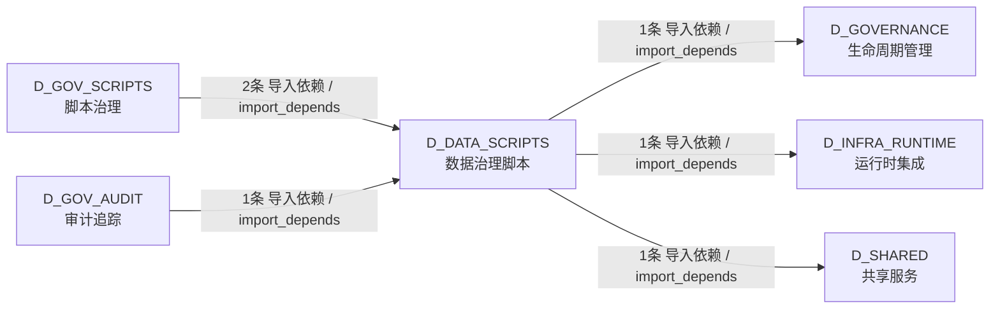

# 41_d_data_scripts / 数据治理脚本 / D_DATA_SCRIPTS

> **文档作用 / Purpose**: 展示 数据治理脚本（D_DATA_SCRIPTS）功能域的模块清单、域内依赖关系、跨域依赖关系、架构分层视图，供架构审查和域治理参考。

> 本文档由 generate_domain_doc.py 从 depgraph (PostgreSQL) 自动生成
> 数据源: depgraph (PostgreSQL) nodes表 + edges表

## 域基本信息 / Domain Overview

| 字段 | 值 | Field | Value |
|------|------|-------|-------|
| 编号 | 41 | Number | 41 |
| 域ID | D_DATA_SCRIPTS | Domain ID | D_DATA_SCRIPTS |
| 域名称 | 数据治理脚本 | Domain Name | D_DATA_SCRIPTS |
| 层级 | L2 业务域层 | Layer | L2 Domain |
| 模块数 | 21 | Module Count | 21 |
| 域内依赖 | 1 | Internal Dependencies | 1 |
| 跨域入边 | 3 | Cross-domain Incoming | 3 |
| 跨域出边 | 3 | Cross-domain Outgoing | 3 |
| 设计态模块 | 0 | Design Modules | 0 |
| 生产态模块 | 21 | Production Modules | 21 |
| 容量 | 0/150 (正常) | Capacity | 0/150 (正常) |
| 描述 | 数据治理脚本（d3_metadata） | Description | 数据治理脚本（d3_metadata） |

## 模块分层清单 / Module Layered List

> 按 architecture_layer 分组的模块清单（共 21 个模块 / 21 modules）。

### L2 领域层 / Domain Layer (21 modules)

| # | 模块路径 / Module Path | 模块名称 / Module Name (功能简介 / Description) | 成熟度 / Maturity | 蓝图 / Blueprint |
|:--:|---------|---------|:---:|:---:|
| 1 | scripts/governance/d3_metadata/auto_generate_index.py | GATE-INDEX: Validate and auto-fix index.md fact... | 生产态 / production |  |
| 2 | scripts/governance/d3_metadata/backfill_doctype_metadata.py | 批量回填 frontmatter doc_type 字段（doc_type 存... | 生产态 / production |  |
| 3 | scripts/governance/d3_metadata/backfill_ttl_metadata.py | 批量回填/重判 ttl 字段（6 格式统一入口，GATE-15... | 生产态 / production |  |
| 4 | scripts/governance/d3_metadata/check_blueprint_compliance.py | [INVARIANTS] REQUIRED_SECTIONS 必须与蓝图+施工... | 生产态 / production |  |
| 5 | scripts/governance/d3_metadata/check_frontmatter_metadata.py | GATE-15: Frontmatter metadata validation（ttl +... | 生产态 / production |  |
| 6 | scripts/governance/d3_metadata/check_module_singlesource.py | GATE-SSOT-SINGLESOURCE: SSoT 单一真源门禁（Phas... | 生产态 / production |  |
| 7 | scripts/governance/d3_metadata/check_naming_convention.py | GATE-11 命名规范门禁 — 全类型命名检测。 | 生产态 / production |  |
| 8 | scripts/governance/d3_metadata/check_registry_consistency.py | check_registry_consistency — 跨登记表一致性校验。 | 生产态 / production |  |
| 9 | scripts/governance/d3_metadata/check_schema_version_write... | G_TRAE_059 验证脚本：_schema_version 写入保护 +... | 生产态 / production |  |
| 10 | scripts/governance/d3_metadata/check_vocab_hardcode.py | GATE-VOCAB: 词表合法值硬编码检测（trae_060 §2） | 生产态 / production |  |
| 11 | scripts/governance/d3_metadata/classify_ttl_by_content.py | 基于内容关键词的 ttl 精细分类审查脚本。 | 生产态 / production |  |
| 12 | scripts/governance/d3_metadata/deep_content_scanner.py | deep_content_scanner.py — 深度内容扫描器 | 生产态 / production |  |
| 13 | scripts/governance/d3_metadata/generate_derived_files.py | generate_derived_files.py — 枚举自动派生生成器... | 生产态 / production |  |
| 14 | scripts/governance/d3_metadata/generate_rule_catalog.py | Scan docs/01_policies_and_standards and emit _r... | 生产态 / production |  |
| 15 | scripts/governance/d3_metadata/migrate_illegal_doctype.py | 批量迁移非法 doc_type 值（doc_type 存量治理 Sta... | 生产态 / production |  |
| 16 | scripts/governance/d3_metadata/validate_architecture.py | validate_architecture.py - Validate rule files ... | 生产态 / production |  |
| 17 | scripts/governance/d3_metadata/validate_blueprint_provena... | Blueprint Provenance Gate - V-12: validate prov... | 生产态 / production |  |
| 18 | scripts/governance/d3_metadata/validate_module_id.py | GATE-MODULEID: Validate module_id uniqueness an... | 生产态 / production |  |
| 19 | scripts/governance/d3_metadata/validate_module_id_naming.py | module_id / domain_id / submodule_id 格式校验真... | 生产态 / production |  |
| 20 | scripts/governance/d3_metadata/validate_registry_master_i... | 登记表总索引自校验门禁 (Registry Master Index S... | 生产态 / production |  |
| 21 | scripts/governance/d3_metadata/validate_tool_contracts_co... | Tool Contract 一致性校验脚本（MOD-INF-013 §9 R... | 生产态 / production |  |

## 域内依赖图 / Internal Dependency Diagram

> 依赖图内嵌在本文档中，IDE 可直接渲染显示。参考 decision_index.md 设计，分三个视图：合并全景图、运营态子图、设计态子图（按 design_maturity 实际值拆分）。
>
> **图例说明 / Legend**：
> - **实线边框 = 运营态模块**（production，已上线运行）
> - **虚线边框 = 设计态模块**（design，蓝图阶段，代码未写）
> - **实线箭头 = 运营态依赖**（已生效的依赖关系）
> - **虚线箭头 = 非运营态依赖**（计划中/验证中的依赖关系）

### 合并全景图（全部模块，标签标注成熟度）

> 展示全部 21 个模块（生产态 21 + 设计态 0），标签标注成熟度。

### 运营态子图（仅 design_maturity=production 的模块和依赖）

> 仅展示已上线运行的模块（共 21 个，1 条域内依赖）。

```mermaid
graph TD
    subgraph D_DATA_SCRIPTS["D_DATA_SCRIPTS 数据治理脚本"]
        scripts_governance_d3_metadata_auto_generate_index_py["(生产态 / production) GATE-INDEX: Validate and auto-fix index.md fact...<br/>文件: auto_generate_index.py"]
        scripts_governance_d3_metadata_backfill_doctype_metadata_py["(生产态 / production) 批量回填 frontmatter doc_type 字段（doc_type 存...<br/>文件: backfill_doctype_metadata.py"]
        scripts_governance_d3_metadata_backfill_ttl_metadata_py["(生产态 / production) 批量回填/重判 ttl 字段（6 格式统一入口，GATE-15...<br/>文件: backfill_ttl_metadata.py"]
        scripts_governance_d3_metadata_check_blueprint_compliance_py["(生产态 / production) (INVARIANTS) REQUIRED_SECTIONS 必须与蓝图+施工...<br/>文件: check_blueprint_compliance.py"]
        scripts_governance_d3_metadata_check_frontmatter_metadata_py["(生产态 / production) GATE-15: Frontmatter metadata validation（ttl +...<br/>文件: check_frontmatter_metadata.py"]
        scripts_governance_d3_metadata_check_module_singlesource_py["(生产态 / production) GATE-SSOT-SINGLESOURCE: SSoT 单一真源门禁（Phas...<br/>文件: check_module_singlesource.py"]
        scripts_governance_d3_metadata_check_naming_convention_py["(生产态 / production) GATE-11 命名规范门禁 — 全类型命名检测。<br/>文件: check_naming_convention.py"]
        scripts_governance_d3_metadata_check_registry_consistency_py["(生产态 / production) check_registry_consistency — 跨登记表一致性校验。<br/>文件: check_registry_consistency.py"]
        scripts_governance_d3_metadata_check_schema_version_writes_py["(生产态 / production) G_TRAE_059 验证脚本：_schema_version 写入保护 +...<br/>文件: check_schema_version_writes.py"]
        scripts_governance_d3_metadata_check_vocab_hardcode_py["(生产态 / production) GATE-VOCAB: 词表合法值硬编码检测（trae_060 §2）<br/>文件: check_vocab_hardcode.py"]
        scripts_governance_d3_metadata_classify_ttl_by_content_py["(生产态 / production) 基于内容关键词的 ttl 精细分类审查脚本。<br/>文件: classify_ttl_by_content.py"]
        scripts_governance_d3_metadata_deep_content_scanner_py["(生产态 / production) deep_content_scanner.py — 深度内容扫描器<br/>文件: deep_content_scanner.py"]
        scripts_governance_d3_metadata_generate_derived_files_py["(生产态 / production) generate_derived_files.py — 枚举自动派生生成器...<br/>文件: generate_derived_files.py"]
        scripts_governance_d3_metadata_generate_rule_catalog_py["(生产态 / production) Scan docs/01_policies_and_standards and emit _r...<br/>文件: generate_rule_catalog.py"]
        scripts_governance_d3_metadata_migrate_illegal_doctype_py["(生产态 / production) 批量迁移非法 doc_type 值（doc_type 存量治理 Sta...<br/>文件: migrate_illegal_doctype.py"]
        scripts_governance_d3_metadata_validate_architecture_py["(生产态 / production) validate_architecture.py - Validate rule files ...<br/>文件: validate_architecture.py"]
        scripts_governance_d3_metadata_validate_blueprint_provenance_py["(生产态 / production) Blueprint Provenance Gate - V-12: validate prov...<br/>文件: validate_blueprint_provenance.py"]
        scripts_governance_d3_metadata_validate_module_id_py["(生产态 / production) GATE-MODULEID: Validate module_id uniqueness an...<br/>文件: validate_module_id.py"]
        scripts_governance_d3_metadata_validate_module_id_naming_py["(生产态 / production) module_id / domain_id / submodule_id 格式校验真...<br/>文件: validate_module_id_naming.py"]
        scripts_governance_d3_metadata_validate_registry_master_index_py["(生产态 / production) 登记表总索引自校验门禁 (Registry Master Index S...<br/>文件: validate_registry_master_index.py"]
        scripts_governance_d3_metadata_validate_tool_contracts_consistency_py["(生产态 / production) Tool Contract 一致性校验脚本（MOD-INF-013 §9 R...<br/>文件: validate_tool_contracts_consistency.py"]
    end
    scripts_governance_d3_metadata_check_naming_convention_py -->|导入依赖 / import_depends| scripts_governance_d3_metadata_validate_module_id_naming_py
    D_SHARED["(生产态 / production) D_SHARED"]
    scripts_governance_d3_metadata_check_module_singlesource_py -->|导入依赖 / import_depends| D_SHARED
    D_INFRA_RUNTIME["(生产态 / production) D_INFRA_RUNTIME"]
    scripts_governance_d3_metadata_check_registry_consistency_py -->|导入依赖 / import_depends| D_INFRA_RUNTIME
    D_GOVERNANCE["(生产态 / production) D_GOVERNANCE"]
    scripts_governance_d3_metadata_check_schema_version_writes_py -->|导入依赖 / import_depends| D_GOVERNANCE
    D_GOV_SCRIPTS["(生产态 / production) D_GOV_SCRIPTS"]
    D_GOV_SCRIPTS -->|导入依赖 / import_depends| scripts_governance_d3_metadata_check_naming_convention_py
    D_GOV_SCRIPTS -->|导入依赖 / import_depends| scripts_governance_d3_metadata_validate_module_id_naming_py
    D_GOV_AUDIT["(生产态 / production) D_GOV_AUDIT"]
    D_GOV_AUDIT -->|导入依赖 / import_depends| scripts_governance_d3_metadata_validate_module_id_naming_py
    classDef production fill:#e1f5fe,stroke:#01579b,stroke-width:2px,color:#000
    classDef design fill:#fff3e0,stroke:#e65100,stroke-width:2px,color:#000,stroke-dasharray: 5 5
    classDef external_prod fill:#e8f5e9,stroke:#1b5e20,stroke-width:1px,color:#000
    classDef external_design fill:#fce4ec,stroke:#880e4f,stroke-width:1px,color:#000,stroke-dasharray: 5 5
    class scripts_governance_d3_metadata_auto_generate_index_py,scripts_governance_d3_metadata_backfill_doctype_metadata_py,scripts_governance_d3_metadata_backfill_ttl_metadata_py,scripts_governance_d3_metadata_check_blueprint_compliance_py,scripts_governance_d3_metadata_check_frontmatter_metadata_py,scripts_governance_d3_metadata_check_module_singlesource_py,scripts_governance_d3_metadata_check_naming_convention_py,scripts_governance_d3_metadata_check_registry_consistency_py,scripts_governance_d3_metadata_check_schema_version_writes_py,scripts_governance_d3_metadata_check_vocab_hardcode_py,scripts_governance_d3_metadata_classify_ttl_by_content_py,scripts_governance_d3_metadata_deep_content_scanner_py,scripts_governance_d3_metadata_generate_derived_files_py,scripts_governance_d3_metadata_generate_rule_catalog_py,scripts_governance_d3_metadata_migrate_illegal_doctype_py,scripts_governance_d3_metadata_validate_architecture_py,scripts_governance_d3_metadata_validate_blueprint_provenance_py,scripts_governance_d3_metadata_validate_module_id_py,scripts_governance_d3_metadata_validate_module_id_naming_py,scripts_governance_d3_metadata_validate_registry_master_index_py,scripts_governance_d3_metadata_validate_tool_contracts_consistency_py production
    class D_SHARED,D_INFRA_RUNTIME,D_GOVERNANCE,D_GOV_SCRIPTS,D_GOV_AUDIT external_prod
```

### 设计态子图（仅 design_maturity=design 的模块和依赖）

> 仅展示蓝图阶段、代码未写的设计态模块（共 0 个，0 条域内依赖）。

> （无设计态模块 / No design modules）

## 跨域依赖 / Cross-domain Dependencies

### 本域依赖的其他域（出边）/ Depends On

| # | 本域模块 / Source Module | → | 外部域-目标模块 / Target Module | 依赖类型 / Type |
|:--:|---------|:--:|---------|---------|
| 1 | G_TRAE_059 验证脚本：_schema_version 写入保护 +... | → | D_GOVERNANCE 生命周期管理: depgraph Schema DDL + 版本化迁移框架 (depgraph_... | 导入依赖 / import_depends |
| 2 | check_registry_consistency — 跨登记表一致性校... | → | D_INFRA_RUNTIME 运行时集成: Finding Schema — 审计发现标准化数据模型 (findi... | 导入依赖 / import_depends |
| 3 | GATE-SSOT-SINGLESOURCE: SSoT 单一真源门禁（Phas... | → | D_SHARED 共享服务: paths.py — 项目路径常量 SSoT（Single Source of... | 导入依赖 / import_depends |

### 依赖本域的其他域（入边）/ Depended By

| # | 外部域-源模块 / Source Module | → | 本域模块 / Target Module | 依赖类型 / Type |
|:--:|---------|:--:|---------|---------|
| 1 | D_GOV_AUDIT 审计追踪: reconciliation_registry.py — GitCommitGateway ... | → | module_id / domain_id / submodule_id 格式校验真... | 导入依赖 / import_depends |
| 2 | D_GOV_SCRIPTS 脚本治理: [INVARIANTS] 原子写入（RULE-ONE）；变更前验证；... | → | module_id / domain_id / submodule_id 格式校验真... | 导入依赖 / import_depends |
| 3 | D_GOV_SCRIPTS 脚本治理: scaffold.py — ZephyrAlpha 唯一创建入口（RULE-T... | → | GATE-11 命名规范门禁 — 全类型命名检测。 (check... | 导入依赖 / import_depends |

### 跨域依赖图 / Cross-domain Dependency Diagram

> 本域与 5 个外部域直接连接（出边 3 条 + 入边 3 条 = 6 条）。只显示直接连接的域，不展开具体节点。

## 说明 / Notes

- **数据源 / Data Source**: `depgraph (PostgreSQL)` 的 `nodes`、`edges`、`domains` 表
- **生成器 / Generator**: `generate_domain_doc.py`（G2+G10 合并）
- **维护方式 / Maintenance**: 自动生成，全景图更新时刷新
- **文件名规则 / File Naming**: `{编号:02d}_{域ID小写}.md`，如 `16_d_trading.md`
- **图例说明 / Legend**: `[production]`=已上线 / `[design]`=设计中 / `[unknown]`=未知
