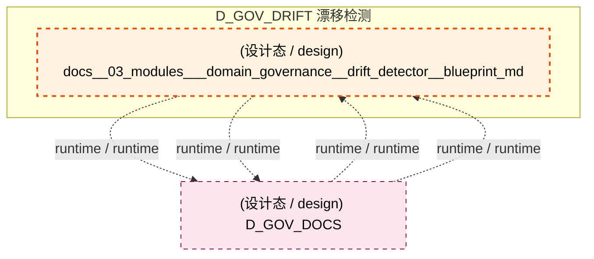
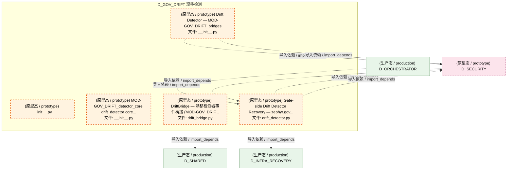
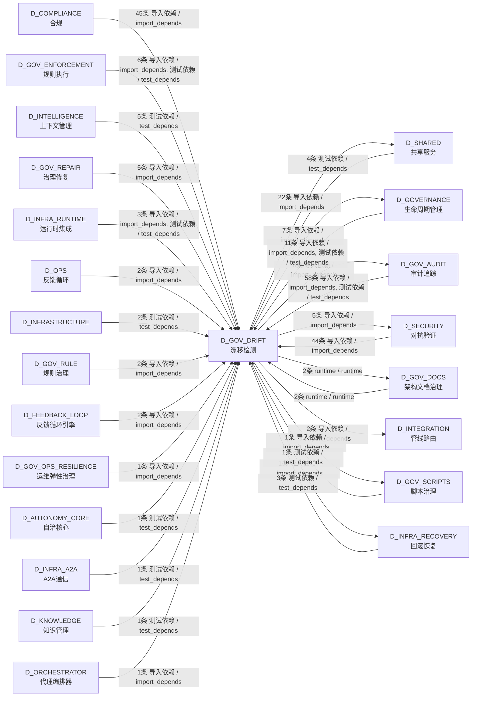

# 41_d_gov_drift / drift_detection / 漂移检测 / Drift Detection

> **功能简介 / Overview**: 漂移检测，负责架构漂移检测和漂移告警

> **文档作用 / Purpose**: 展示 漂移检测（D_GOV_DRIFT）功能域的模块清单、域内依赖关系、跨域依赖关系、架构分层视图，供架构审查和域治理参考。

> 本文档由 generate_domain_doc.py 从 depgraph (PostgreSQL) 自动生成
> 最后更新: 2026-07-17 00:08:03
> 数据源: depgraph (PostgreSQL) nodes表 + edges表

## 域基本信息 / Domain Overview

| 字段 | 值 | Field | Value |
|------|------|-------|-------|
| 编号 | 41 | Number | 41 |
| 域ID | D_GOV_DRIFT | Domain ID | D_GOV_DRIFT |
| 域名称 | 漂移检测 | Domain Name | Drift Detection |
| 层级 | L2 业务域层 | Layer | L2 Domain |
| 模块数 | 77 | Module Count | 77 |
| 域内依赖 | 28 | Internal Dependencies | 28 |
| 跨域入边 | 200 | Cross-domain Incoming | 200 |
| 跨域出边 | 46 | Cross-domain Outgoing | 46 |
| 设计态模块 | 1 | Design Modules | 1 |
| 原型态模块 | 5 | Prototype Modules | 5 |
| 生产态模块 | 71 | Production Modules | 71 |
| 容量 | 71/150 (正常) | Capacity | 71/150 (正常) |
| 描述 | 39个漂移检测器注册与调度 | Description | 39个漂移检测器注册与调度 |

## 模块分层清单 / Module Layered List

> 按 architecture_layer 分组的模块清单（共 77 个模块 / 77 modules）。

### L1 基础层 / Foundation Layer (1 modules)

| # | 模块路径 / Module Path | 模块名称 / Module Name (功能简介 / Description) | 成熟度 / Maturity | 蓝图 / Blueprint |
|:--:|---------|---------|:---:|:---:|
| 1 | docs/03_modules/_domain_governance/drift_detector/bluepri... | docs__03_modules___domain_governance__drift_detector__blueprint_md | 设计态 / design | [MOD-INF-023](../../03_modules/_domain_governance/drift_detector/blueprint.md) |

### L2 领域层 / Domain Layer (76 modules)

| # | 模块路径 / Module Path | 模块名称 / Module Name (功能简介 / Description) | 成熟度 / Maturity | 蓝图 / Blueprint |
|:--:|---------|---------|:---:|:---:|
| 1 | scripts/governance/d11_compliance/validate_blueprint_over... | validate_blueprint_overlap.py | 生产态 / production |  |
| 2 | scripts/governance/d11_compliance/validate_truth_source_c... | validate_truth_source_cascade.py | 生产态 / production |  |
| 3 | scripts/governance/d5_architecture/validators/validate_au... | validate_authority_registry.py | 生产态 / production |  |
| 4 | scripts/governance/d5_architecture/validators/validate_ss... | validate_ssot.py | 生产态 / production |  |
| 5 | src/zephyr/gov_audit/drift_bridge.py | drift_bridge.py | 生产态 / production | [MOD-INF-020](../../03_modules/_domain_governance/audit_trail/blueprint.md) |
| 6 | src/zephyr/gov_audit/self_monitor.py | self_monitor.py | 生产态 / production | [MOD-INF-020](../../03_modules/_domain_governance/audit_trail/blueprint.md) |
| 7 | src/zephyr/gov_drift/__init__.py | __init__.py | 原型态 / prototype | [MOD-INF-023](../../03_modules/_domain_governance/drift_detector/blueprint.md) |
| 8 | src/zephyr/gov_drift/absence_manager.py | Owner Absence Manager — Owner缺席模式 §6.32。 | 生产态 / production | [MOD-INF-023](../../03_modules/_domain_governance/drift_detector/blueprint.md) |
| 9 | src/zephyr/gov_drift/ai_construction_detectors.py | Drift Detector AI 施工检测器 — ai_construction... | 生产态 / production | [MOD-INF-023](../../03_modules/_domain_governance/drift_detector/blueprint.md) |
| 10 | src/zephyr/gov_drift/ai_context_injector.py | AI Context Injector — 施工前预检D-023-16 · §6.8。 | 生产态 / production | [MOD-INF-023](../../03_modules/_domain_governance/drift_detector/blueprint.md) |
| 11 | src/zephyr/gov_drift/artifact_scanner.py | ArtifactScanner — SSRF / Path Traversal / Cred... | 生产态 / production | [MOD-L10-001](../../03_modules/_domain_compliance/blueprint.md) |
| 12 | src/zephyr/gov_drift/autonomy_regressor.py | Autonomy Regressor — v0.10.0 渐进自治可逆性管... | 生产态 / production | [MOD-INF-022](../../03_modules/_domain_autonomy_perm/escalation_protocol/blueprint.md) |
| 13 | src/zephyr/gov_drift/backcompat_checker.py | Backward Compatibility Checker — 向后兼容策略... | 生产态 / production | [MOD-INF-023](../../03_modules/_domain_governance/drift_detector/blueprint.md) |
| 14 | src/zephyr/gov_drift/baseline_manager.py | Baseline Manager — baseline_manager.py | 生产态 / production | [MOD-INF-023](../../03_modules/_domain_governance/drift_detector/blueprint.md) |
| 15 | src/zephyr/gov_drift/baseline_poisoning_guard.py | Baseline Poisoning Guard — 基线投毒防护 D-023-... | 生产态 / production | [MOD-INF-023](../../03_modules/_domain_governance/drift_detector/blueprint.md) |
| 16 | src/zephyr/gov_drift/bootstrapping_calibrator.py | bootstrapping_calibrator.py | 生产态 / production | [MOD-INF-024](../../03_modules/_domain_autonomy_perm/budget_enforcer/blueprint.md) |
| 17 | src/zephyr/gov_drift/brain_integration.py | ProbeHierarchy - K8s 3-Probe + Terraform Reconc... | 生产态 / production | [MOD-INF-023](../../03_modules/_domain_governance/drift_detector/blueprint.md) |
| 18 | src/zephyr/gov_drift/canary_controller.py | Detector Canary Controller — 检测器金丝雀部署 ... | 生产态 / production | [MOD-INF-023](../../03_modules/_domain_governance/drift_detector/blueprint.md) |
| 19 | src/zephyr/gov_drift/cascade_detector.py | Cascade Failure Detector — 级联故障检测 D-023-... | 生产态 / production | [MOD-INF-023](../../03_modules/_domain_governance/drift_detector/blueprint.md) |
| 20 | src/zephyr/gov_drift/chaos_injector.py | Drift Chaos Injector — 混沌工程主动漂移注入 §... | 生产态 / production | [MOD-INF-023](../../03_modules/_domain_governance/drift_detector/blueprint.md) |
| 21 | src/zephyr/gov_drift/config_consistency.py | Config Consistency Checker — 配置多源一致性 D-... | 生产态 / production | [MOD-INF-023](../../03_modules/_domain_governance/drift_detector/blueprint.md) |
| 22 | src/zephyr/gov_drift/contract_drift_detector.py | contract_drift_detector — 契约漂移检测器。 | 生产态 / production | [MOD-INF-023](../../03_modules/_domain_governance/drift_detector/blueprint.md) |
| 23 | src/zephyr/gov_drift/correlation_engine.py | Correlation Engine — correlation_engine.py | 生产态 / production | [MOD-INF-023](../../03_modules/_domain_governance/drift_detector/blueprint.md) |
| 24 | src/zephyr/gov_drift/credibility_engine.py | Credibility Engine — credibility_engine.py | 生产态 / production | [MOD-INF-023](../../03_modules/_domain_governance/drift_detector/blueprint.md) |
| 25 | src/zephyr/gov_drift/cross_module_score.py | Cross Module Score — cross_module_score.py | 生产态 / production | [MOD-INF-023](../../03_modules/_domain_governance/drift_detector/blueprint.md) |
| 26 | src/zephyr/gov_drift/dashboard.py | Coverage Dashboard — dashboard.py | 生产态 / production | [MOD-INF-023](../../03_modules/_domain_governance/drift_detector/blueprint.md) |
| 27 | src/zephyr/gov_drift/detector_core/__init__.py | MOD-GOV_DRIFT_detector_core drift_detector core... | 原型态 / prototype |  |
| 28 | src/zephyr/gov_drift/detector_core/benchmark_integrity.py | benchmark_integrity.py | 生产态 / production | [MOD-INF-023](../../03_modules/_domain_governance/drift_detector/blueprint.md) |
| 29 | src/zephyr/gov_drift/detector_core/bridges/__init__.py | Drift Detector — MOD-GOV_DRIFT_bridges | 原型态 / prototype |  |
| 30 | src/zephyr/gov_drift/detector_core/bridges/drift_bridge.py | DriftBridge — 漂移检测器事件桥接 (MOD-GOV_DRIF... | 原型态 / prototype |  |
| 31 | src/zephyr/gov_drift/detector_core/ml_engineering.py | ml_engineering.py | 生产态 / production | [MOD-INF-023](../../03_modules/_domain_governance/drift_detector/blueprint.md) |
| 32 | src/zephyr/gov_drift/detector_core/model_drift_monitor.py | model_drift_monitor.py | 生产态 / production | [MOD-INF-023](../../03_modules/_domain_governance/drift_detector/blueprint.md) |
| 33 | src/zephyr/gov_drift/detector_core/performance_baseline.py | performance_baseline.py | 生产态 / production | [MOD-INF-023](../../03_modules/_domain_governance/drift_detector/blueprint.md) |
| 34 | src/zephyr/gov_drift/detector_core/regime_detector.py | regime_detector.py | 生产态 / production | [MOD-INF-023](../../03_modules/_domain_governance/drift_detector/blueprint.md) |
| 35 | src/zephyr/gov_drift/detector_dispatcher.py | Detector Dispatcher — detector_dispatcher.py | 生产态 / production | [MOD-INF-023](../../03_modules/_domain_governance/drift_detector/blueprint.md) |
| 36 | src/zephyr/gov_drift/drift_detector.py | Drift Detector — 兼容别名，SSoT已迁移至 zephyr... | 生产态 / production | [MOD-INF-022](../../03_modules/_domain_autonomy_perm/escalation_protocol/blueprint.md) |
| 37 | src/zephyr/gov_drift/drift_engine.py | Drift Engine — 编排器核心 (SRC-0030 精简后) | 生产态 / production | [MOD-INF-023](../../03_modules/_domain_governance/drift_detector/blueprint.md) |
| 38 | src/zephyr/gov_drift/drift_hotfix_bypass.py | Drift Hotfix Bypass — drift_hotfix_bypass.py | 生产态 / production | [MOD-INF-023](../../03_modules/_domain_governance/drift_detector/blueprint.md) |
| 39 | src/zephyr/gov_drift/drift_infrastructure.py | Drift Detector 基础设施 — drift_infrastructure.py | 生产态 / production | [MOD-INF-023](../../03_modules/_domain_governance/drift_detector/blueprint.md) |
| 40 | src/zephyr/gov_drift/drift_models.py | Drift Detector 数据模型 — drift_models.py | 生产态 / production | [MOD-INF-023](../../03_modules/_domain_governance/drift_detector/blueprint.md) |
| 41 | src/zephyr/gov_drift/drift_result_types.py | Drift Detector 结果类型 + 专项检测函数 — drift... | 生产态 / production | [MOD-INF-023](../../03_modules/_domain_governance/drift_detector/blueprint.md) |
| 42 | src/zephyr/gov_drift/drift_training.py | Drift Detector AI 训练闭环 + 跨语言检测 — drif... | 生产态 / production | [MOD-INF-023](../../03_modules/_domain_governance/drift_detector/blueprint.md) |
| 43 | src/zephyr/gov_drift/file_attr_checker.py | File Attribute Integrity — 文件底层属性完整性 ... | 生产态 / production | [MOD-INF-023](../../03_modules/_domain_governance/drift_detector/blueprint.md) |
| 44 | src/zephyr/gov_drift/forensics_engine.py | Drift Forensics Engine — 漂移取证引擎 §6.17。 | 生产态 / production | [MOD-INF-023](../../03_modules/_domain_governance/drift_detector/blueprint.md) |
| 45 | src/zephyr/gov_drift/gate_persistence.py | Gate Persistence — gate_persistence.py | 生产态 / production | [MOD-INF-023](../../03_modules/_domain_governance/drift_detector/blueprint.md) |
| 46 | src/zephyr/gov_drift/git_bisector.py | Git Bisector — git_bisector.py | 生产态 / production | [MOD-INF-023](../../03_modules/_domain_governance/drift_detector/blueprint.md) |
| 47 | src/zephyr/gov_drift/gitignore_auditor.py | .gitignore Integrity Auditor — gitignore完整性... | 生产态 / production | [MOD-INF-023](../../03_modules/_domain_governance/drift_detector/blueprint.md) |
| 48 | src/zephyr/gov_drift/handoff_manager.py | Cross-Session Handoff Manager — 跨Session修复... | 生产态 / production | [MOD-INF-023](../../03_modules/_domain_governance/drift_detector/blueprint.md) |
| 49 | src/zephyr/gov_drift/headless_scanner.py | Headless Scanner — headless_scanner.py | 生产态 / production | [MOD-INF-023](../../03_modules/_domain_governance/drift_detector/blueprint.md) |
| 50 | src/zephyr/gov_drift/incremental_scanner.py | Incremental Scanner — incremental_scanner.py | 生产态 / production | [MOD-INF-023](../../03_modules/_domain_governance/drift_detector/blueprint.md) |
| 51 | src/zephyr/gov_drift/migration_plan.yaml | migration_plan.yaml | 生产态 / production | [MOD-INF-011](../../03_modules/_domain_knowledge/vector_memory/blueprint.md) |
| 52 | src/zephyr/gov_drift/naming_magic_checker.py | Naming Magic Checker — 命名魔数与隐式约定检测 ... | 生产态 / production | [MOD-INF-023](../../03_modules/_domain_governance/drift_detector/blueprint.md) |
| 53 | src/zephyr/gov_drift/orphan_scanner.py | Orphan Resource Scanner — 孤儿资源检测 §6.28。 | 生产态 / production | [MOD-INF-023](../../03_modules/_domain_governance/drift_detector/blueprint.md) |
| 54 | src/zephyr/gov_drift/python_compat.py | Python Compatibility Checker — Python版本兼容... | 生产态 / production | [MOD-INF-023](../../03_modules/_domain_governance/drift_detector/blueprint.md) |
| 55 | src/zephyr/gov_drift/resource_guard.py | Resource Guard — 资源上限与优雅降级 D-023-23 ... | 生产态 / production | [MOD-INF-023](../../03_modules/_domain_governance/drift_detector/blueprint.md) |
| 56 | src/zephyr/gov_drift/reward_hacking_rebound_detector.py | Reward Hacking Rebound Detector — v0.14.0 §2.37-D. | 生产态 / production | [MOD-INF-022](../../03_modules/_domain_autonomy_perm/escalation_protocol/blueprint.md) |
| 57 | src/zephyr/gov_drift/roi_engine.py | ROI Engine — roi_engine.py | 生产态 / production | [MOD-INF-023](../../03_modules/_domain_governance/drift_detector/blueprint.md) |
| 58 | src/zephyr/gov_drift/rollback_bridge.py | G-CT-006 契约：Drift -> Rollback 漂移触发回滚. | 生产态 / production | [MOD-INF-023](../../03_modules/_domain_governance/drift_detector/blueprint.md) |
| 59 | src/zephyr/gov_drift/scan_mutex.py | Scan Mutex — scan_mutex.py | 生产态 / production | [MOD-INF-023](../../03_modules/_domain_governance/drift_detector/blueprint.md) |
| 60 | src/zephyr/gov_drift/self_check.py | Self-Drift Check — self_check.py | 生产态 / production | [MOD-INF-023](../../03_modules/_domain_governance/drift_detector/blueprint.md) |
| 61 | src/zephyr/gov_drift/self_test_verifier.py | Self Test Verifier — self_test_verifier.py | 生产态 / production | [MOD-INF-023](../../03_modules/_domain_governance/drift_detector/blueprint.md) |
| 62 | src/zephyr/gov_drift/silence_detector.py | Silence Detector — v0.8.0 静默窗口检测器: agen... | 生产态 / production | [MOD-INF-022](../../03_modules/_domain_autonomy_perm/escalation_protocol/blueprint.md) |
| 63 | src/zephyr/gov_drift/spiral_ews.py | spiral_ews.py | 生产态 / production | [MOD-INF-024](../../03_modules/_domain_autonomy_perm/budget_enforcer/blueprint.md) |
| 64 | src/zephyr/gov_drift/suppression_learner.py | Suppression Learner — suppression_learner.py | 生产态 / production | [MOD-INF-023](../../03_modules/_domain_governance/drift_detector/blueprint.md) |
| 65 | src/zephyr/gov_drift/symlink_checker.py | Symlink Integrity Checker — 软链接完整性检测 ... | 生产态 / production | [MOD-INF-023](../../03_modules/_domain_governance/drift_detector/blueprint.md) |
| 66 | src/zephyr/gov_drift/tamper_proof_audit.py | Tamper-Proof Audit — 防篡改审计 D-023-37 · §6.26。 | 生产态 / production | [MOD-INF-023](../../03_modules/_domain_governance/drift_detector/blueprint.md) |
| 67 | src/zephyr/gov_drift/test_fixture_checker.py | Test Fixture Checker — 测试夹具漂移检测 D-023-... | 生产态 / production | [MOD-INF-023](../../03_modules/_domain_governance/drift_detector/blueprint.md) |
| 68 | src/zephyr/gov_drift/trend_analyzer.py | Trend Analyzer — trend_analyzer.py | 生产态 / production | [MOD-INF-023](../../03_modules/_domain_governance/drift_detector/blueprint.md) |
| 69 | src/zephyr/gov_drift/vigil_runtime.py | Vigil Runtime — v0.6.0 VIGIL维护运行时: 运维to... | 生产态 / production | [MOD-INF-022](../../03_modules/_domain_autonomy_perm/escalation_protocol/blueprint.md) |
| 70 | src/zephyr/gov_enforcement/rule_enforcement/breaking_chan... | Breaking Change 检测器（GATE-CDC-2）——字段删... | 生产态 / production | [MOD-GATE_ENGINE](../../03_modules/_cross_layer/gate_engine/blueprint.md) |
| 71 | src/zephyr/gov_enforcement/rule_enforcement/drift_detecto... | Gate-side Drift Detector Recovery — zephyr.gov... | 原型态 / prototype | [MOD-GATE_ENGINE](../../03_modules/_cross_layer/gate_engine/blueprint.md) |
| 72 | src/zephyr/gov_enforcement/rule_enforcement/gate_engine/g... | 门禁健康仪表板——per-gate SLI 报告、误报率、延... | 生产态 / production | [MOD-GATE_ENGINE](../../03_modules/_cross_layer/gate_engine/blueprint.md) |
| 73 | src/zephyr/gov_enforcement/rule_enforcement/gate_engine/g... | 门禁引擎完整性守卫——自检SHA-256校验+trust roo... | 生产态 / production | [MOD-GATE_ENGINE](../../03_modules/_cross_layer/gate_engine/blueprint.md) |
| 74 | src/zephyr/gov_enforcement/rule_enforcement/invariants/en... | EN-002 — Enforcement Mode Validator | 生产态 / production | [MOD-GATE_ENGINE](../../03_modules/_cross_layer/gate_engine/blueprint.md) |
| 75 | src/zephyr/gov_enforcement/rule_enforcement/truth_source_... | 真源优先级裁决器（Truth Source Validator） | 生产态 / production | [MOD-GATE_ENGINE](../../03_modules/_cross_layer/gate_engine/blueprint.md) |
| 76 | src/zephyr/governance/integrity.py | integrity.py | 生产态 / production | [MOD-INF-020](../../03_modules/_domain_governance/audit_trail/blueprint.md) |

## 域内依赖图 / Internal Dependency Diagram

> 依赖图内嵌在本文档中，IDE 可直接渲染显示。参考 decision_index.md 设计，分四个视图：合并全景图、运营态子图、设计态子图、原型态子图（按 design_maturity 实际值拆分）。
>
> **图例说明 / Legend**：
> - **实线边框 = 运营态模块**（production，已上线运行）
> - **虚线边框 = 设计态模块**（design，蓝图阶段，代码未写）
> - **虚线边框 = 原型态模块**（prototype，代码已写，验证中未稳定上线）
> - **实线箭头 = 运营态依赖**（已生效的依赖关系）
> - **虚线箭头 = 非运营态依赖**（计划中/验证中的依赖关系）

### 合并全景图（全部模块，标签标注成熟度）

> 展示全部 77 个模块（生产态 71 + 设计态 1 + 原型态 5），标签标注成熟度。

#### 第 1 页 / 共 3 页

```mermaid
graph TD
    subgraph D_GOV_DRIFT["D_GOV_DRIFT 漂移检测"]
        docs_03_modules_domain_governance_drift_detector_blueprint_md["(设计态 / design) docs__03_modules___domain_governance__drift_detector__blueprint_md"]
        scripts_governance_d11_compliance_validate_blueprint_overlap_py["(生产态 / production) validate_blueprint_overlap.py"]
        scripts_governance_d11_compliance_validate_truth_source_cascade_py["(生产态 / production) validate_truth_source_cascade.py"]
        scripts_governance_d5_architecture_validators_validate_authority_registry_py["(生产态 / production) validate_authority_registry.py"]
        scripts_governance_d5_architecture_validators_validate_ssot_py["(生产态 / production) validate_ssot.py"]
        src_zephyr_gov_audit_drift_bridge_py["(生产态 / production) drift_bridge.py"]
        src_zephyr_gov_audit_self_monitor_py["(生产态 / production) self_monitor.py"]
        src_zephyr_gov_drift_init_py["(原型态 / prototype) __init__.py"]
        src_zephyr_gov_drift_absence_manager_py["(生产态 / production) Owner Absence Manager — Owner缺席模式 §6.32。<br/>文件: absence_manager.py"]
        src_zephyr_gov_drift_ai_construction_detectors_py["(生产态 / production) Drift Detector AI 施工检测器 — ai_construction...<br/>文件: ai_construction_detectors.py"]
        src_zephyr_gov_drift_ai_context_injector_py["(生产态 / production) AI Context Injector — 施工前预检D-023-16 · §6.8。<br/>文件: ai_context_injector.py"]
        src_zephyr_gov_drift_artifact_scanner_py["(生产态 / production) ArtifactScanner — SSRF / Path Traversal / Cred...<br/>文件: artifact_scanner.py"]
        src_zephyr_gov_drift_autonomy_regressor_py["(生产态 / production) Autonomy Regressor — v0.10.0 渐进自治可逆性管...<br/>文件: autonomy_regressor.py"]
        src_zephyr_gov_drift_backcompat_checker_py["(生产态 / production) Backward Compatibility Checker — 向后兼容策略...<br/>文件: backcompat_checker.py"]
        src_zephyr_gov_drift_baseline_manager_py["(生产态 / production) Baseline Manager — baseline_manager.py<br/>文件: baseline_manager.py"]
        src_zephyr_gov_drift_baseline_poisoning_guard_py["(生产态 / production) Baseline Poisoning Guard — 基线投毒防护 D-023-...<br/>文件: baseline_poisoning_guard.py"]
        src_zephyr_gov_drift_bootstrapping_calibrator_py["(生产态 / production) bootstrapping_calibrator.py"]
        src_zephyr_gov_drift_brain_integration_py["(生产态 / production) ProbeHierarchy - K8s 3-Probe + Terraform Reconc...<br/>文件: brain_integration.py"]
        src_zephyr_gov_drift_canary_controller_py["(生产态 / production) Detector Canary Controller — 检测器金丝雀部署 ...<br/>文件: canary_controller.py"]
        src_zephyr_gov_drift_cascade_detector_py["(生产态 / production) Cascade Failure Detector — 级联故障检测 D-023-...<br/>文件: cascade_detector.py"]
        src_zephyr_gov_drift_chaos_injector_py["(生产态 / production) Drift Chaos Injector — 混沌工程主动漂移注入 §...<br/>文件: chaos_injector.py"]
        src_zephyr_gov_drift_config_consistency_py["(生产态 / production) Config Consistency Checker — 配置多源一致性 D-...<br/>文件: config_consistency.py"]
        src_zephyr_gov_drift_contract_drift_detector_py["(生产态 / production) contract_drift_detector — 契约漂移检测器。<br/>文件: contract_drift_detector.py"]
        src_zephyr_gov_drift_correlation_engine_py["(生产态 / production) Correlation Engine — correlation_engine.py<br/>文件: correlation_engine.py"]
        src_zephyr_gov_drift_credibility_engine_py["(生产态 / production) Credibility Engine — credibility_engine.py<br/>文件: credibility_engine.py"]
        src_zephyr_gov_drift_cross_module_score_py["(生产态 / production) Cross Module Score — cross_module_score.py<br/>文件: cross_module_score.py"]
        src_zephyr_gov_drift_dashboard_py["(生产态 / production) Coverage Dashboard — dashboard.py<br/>文件: dashboard.py"]
        src_zephyr_gov_drift_detector_core_init_py["(原型态 / prototype) MOD-GOV_DRIFT_detector_core drift_detector core...<br/>文件: __init__.py"]
        src_zephyr_gov_drift_detector_core_benchmark_integrity_py["(生产态 / production) benchmark_integrity.py"]
        src_zephyr_gov_drift_detector_core_bridges_init_py["(原型态 / prototype) Drift Detector — MOD-GOV_DRIFT_bridges<br/>文件: __init__.py"]
    end
    src_zephyr_gov_audit_self_monitor_py -->|导入依赖 / import_depends| src_zephyr_gov_audit_drift_bridge_py
    src_zephyr_gov_drift_brain_integration_py -->|导入依赖 / import_depends| src_zephyr_gov_drift_credibility_engine_py
    src_zephyr_gov_drift_brain_integration_py -->|导入依赖 / import_depends| src_zephyr_gov_drift_correlation_engine_py
    src_zephyr_gov_drift_init_py -.->|config_depends / config_depends| src_zephyr_gov_drift_ai_construction_detectors_py
    src_zephyr_gov_drift_detector_core_init_py -.->|config_depends / config_depends| src_zephyr_gov_drift_detector_core_benchmark_integrity_py
    src_zephyr_gov_drift_detector_core_bridges_init_py -.->|导入依赖 / import_depends| src_zephyr_gov_drift_ai_construction_detectors_py
    D_GOV_DOCS["(设计态 / design) D_GOV_DOCS"]
    docs_03_modules_domain_governance_drift_detector_blueprint_md -.->|runtime / runtime| D_GOV_DOCS
    docs_03_modules_domain_governance_drift_detector_blueprint_md -.->|runtime / runtime| D_GOV_DOCS
    D_SECURITY["(原型态 / prototype) D_SECURITY"]
    src_zephyr_gov_drift_detector_core_bridges_init_py -.->|导入依赖 / import_depends| D_SECURITY
    src_zephyr_gov_drift_detector_core_bridges_init_py -.->|导入依赖 / import_depends| D_SECURITY
    D_SHARED["(生产态 / production) D_SHARED"]
    src_zephyr_gov_audit_self_monitor_py -->|导入依赖 / import_depends| D_SHARED
    src_zephyr_gov_drift_absence_manager_py -->|导入依赖 / import_depends| D_SHARED
    src_zephyr_gov_drift_cascade_detector_py -->|导入依赖 / import_depends| D_SHARED
    src_zephyr_gov_drift_canary_controller_py -->|导入依赖 / import_depends| D_SHARED
    src_zephyr_gov_drift_chaos_injector_py -.->|导入依赖 / import_depends| D_SHARED
    src_zephyr_gov_drift_chaos_injector_py -->|导入依赖 / import_depends| D_SHARED
    src_zephyr_gov_drift_brain_integration_py -.->|导入依赖 / import_depends| D_SECURITY
    src_zephyr_gov_drift_brain_integration_py -->|导入依赖 / import_depends| D_SHARED
    src_zephyr_gov_drift_brain_integration_py -.->|导入依赖 / import_depends| D_SHARED
    D_GOVERNANCE["(生产态 / production) D_GOVERNANCE"]
    src_zephyr_gov_drift_correlation_engine_py -->|导入依赖 / import_depends| D_GOVERNANCE
    src_zephyr_gov_drift_dashboard_py -->|导入依赖 / import_depends| D_GOVERNANCE
    D_GOV_AUDIT["(原型态 / prototype) D_GOV_AUDIT"]
    D_GOV_AUDIT -.->|测试依赖 / test_depends| src_zephyr_gov_drift_detector_core_benchmark_integrity_py
    D_INFRA_A2A["(原型态 / prototype) D_INFRA_A2A"]
    D_INFRA_A2A -.->|测试依赖 / test_depends| src_zephyr_gov_audit_drift_bridge_py
    D_COMPLIANCE["(原型态 / prototype) D_COMPLIANCE"]
    D_COMPLIANCE -.->|导入依赖 / import_depends| src_zephyr_gov_drift_contract_drift_detector_py
    D_COMPLIANCE -.->|导入依赖 / import_depends| src_zephyr_gov_drift_cross_module_score_py
    D_GOV_AUDIT -.->|测试依赖 / test_depends| src_zephyr_gov_drift_baseline_poisoning_guard_py
    D_COMPLIANCE -.->|导入依赖 / import_depends| src_zephyr_gov_drift_backcompat_checker_py
    D_INFRASTRUCTURE["(原型态 / prototype) D_INFRASTRUCTURE"]
    D_INFRASTRUCTURE -.->|测试依赖 / test_depends| src_zephyr_gov_drift_contract_drift_detector_py
    D_SECURITY -.->|导入依赖 / import_depends| src_zephyr_gov_drift_baseline_manager_py
    D_COMPLIANCE -.->|导入依赖 / import_depends| src_zephyr_gov_drift_absence_manager_py
    D_GOVERNANCE -.->|测试依赖 / test_depends| src_zephyr_gov_drift_bootstrapping_calibrator_py
    D_SECURITY -.->|导入依赖 / import_depends| src_zephyr_gov_drift_canary_controller_py
    D_SECURITY -.->|导入依赖 / import_depends| src_zephyr_gov_drift_config_consistency_py
    D_SECURITY -.->|导入依赖 / import_depends| src_zephyr_gov_drift_dashboard_py
    D_SHARED -.->|测试依赖 / test_depends| src_zephyr_gov_drift_cross_module_score_py
    D_SECURITY -.->|导入依赖 / import_depends| src_zephyr_gov_drift_contract_drift_detector_py
    classDef production fill:#e1f5fe,stroke:#01579b,stroke-width:2px,color:#000
    classDef design fill:#fff3e0,stroke:#e65100,stroke-width:2px,color:#000,stroke-dasharray: 5 5
    classDef external_prod fill:#e8f5e9,stroke:#1b5e20,stroke-width:1px,color:#000
    classDef external_design fill:#fce4ec,stroke:#880e4f,stroke-width:1px,color:#000,stroke-dasharray: 5 5
    class scripts_governance_d11_compliance_validate_blueprint_overlap_py,scripts_governance_d11_compliance_validate_truth_source_cascade_py,scripts_governance_d5_architecture_validators_validate_authority_registry_py,scripts_governance_d5_architecture_validators_validate_ssot_py,src_zephyr_gov_audit_drift_bridge_py,src_zephyr_gov_audit_self_monitor_py,src_zephyr_gov_drift_absence_manager_py,src_zephyr_gov_drift_ai_construction_detectors_py,src_zephyr_gov_drift_ai_context_injector_py,src_zephyr_gov_drift_artifact_scanner_py,src_zephyr_gov_drift_autonomy_regressor_py,src_zephyr_gov_drift_backcompat_checker_py,src_zephyr_gov_drift_baseline_manager_py,src_zephyr_gov_drift_baseline_poisoning_guard_py,src_zephyr_gov_drift_bootstrapping_calibrator_py,src_zephyr_gov_drift_brain_integration_py,src_zephyr_gov_drift_canary_controller_py,src_zephyr_gov_drift_cascade_detector_py,src_zephyr_gov_drift_chaos_injector_py,src_zephyr_gov_drift_config_consistency_py,src_zephyr_gov_drift_contract_drift_detector_py,src_zephyr_gov_drift_correlation_engine_py,src_zephyr_gov_drift_credibility_engine_py,src_zephyr_gov_drift_cross_module_score_py,src_zephyr_gov_drift_dashboard_py,src_zephyr_gov_drift_detector_core_benchmark_integrity_py production
    class docs_03_modules_domain_governance_drift_detector_blueprint_md,src_zephyr_gov_drift_init_py,src_zephyr_gov_drift_detector_core_init_py,src_zephyr_gov_drift_detector_core_bridges_init_py design
    class D_SHARED,D_GOVERNANCE external_prod
    class D_GOV_DOCS,D_SECURITY,D_GOV_AUDIT,D_INFRA_A2A,D_COMPLIANCE,D_INFRASTRUCTURE external_design
```



#### 第 2 页 / 共 3 页

```mermaid
graph TD
    subgraph D_GOV_DRIFT["D_GOV_DRIFT 漂移检测"]
        src_zephyr_gov_drift_detector_core_bridges_drift_bridge_py["(原型态 / prototype) DriftBridge — 漂移检测器事件桥接 (MOD-GOV_DRIF...<br/>文件: drift_bridge.py"]
        src_zephyr_gov_drift_detector_core_ml_engineering_py["(生产态 / production) ml_engineering.py"]
        src_zephyr_gov_drift_detector_core_model_drift_monitor_py["(生产态 / production) model_drift_monitor.py"]
        src_zephyr_gov_drift_detector_core_performance_baseline_py["(生产态 / production) performance_baseline.py"]
        src_zephyr_gov_drift_detector_core_regime_detector_py["(生产态 / production) regime_detector.py"]
        src_zephyr_gov_drift_detector_dispatcher_py["(生产态 / production) Detector Dispatcher — detector_dispatcher.py<br/>文件: detector_dispatcher.py"]
        src_zephyr_gov_drift_drift_detector_py["(生产态 / production) Drift Detector — 兼容别名，SSoT已迁移至 zephyr...<br/>文件: drift_detector.py"]
        src_zephyr_gov_drift_drift_engine_py["(生产态 / production) Drift Engine — 编排器核心 (SRC-0030 精简后)<br/>文件: drift_engine.py"]
        src_zephyr_gov_drift_drift_hotfix_bypass_py["(生产态 / production) Drift Hotfix Bypass — drift_hotfix_bypass.py<br/>文件: drift_hotfix_bypass.py"]
        src_zephyr_gov_drift_drift_infrastructure_py["(生产态 / production) Drift Detector 基础设施 — drift_infrastructure.py<br/>文件: drift_infrastructure.py"]
        src_zephyr_gov_drift_drift_models_py["(生产态 / production) Drift Detector 数据模型 — drift_models.py<br/>文件: drift_models.py"]
        src_zephyr_gov_drift_drift_result_types_py["(生产态 / production) Drift Detector 结果类型 + 专项检测函数 — drift...<br/>文件: drift_result_types.py"]
        src_zephyr_gov_drift_drift_training_py["(生产态 / production) Drift Detector AI 训练闭环 + 跨语言检测 — drif...<br/>文件: drift_training.py"]
        src_zephyr_gov_drift_file_attr_checker_py["(生产态 / production) File Attribute Integrity — 文件底层属性完整性 ...<br/>文件: file_attr_checker.py"]
        src_zephyr_gov_drift_forensics_engine_py["(生产态 / production) Drift Forensics Engine — 漂移取证引擎 §6.17。<br/>文件: forensics_engine.py"]
        src_zephyr_gov_drift_gate_persistence_py["(生产态 / production) Gate Persistence — gate_persistence.py<br/>文件: gate_persistence.py"]
        src_zephyr_gov_drift_git_bisector_py["(生产态 / production) Git Bisector — git_bisector.py<br/>文件: git_bisector.py"]
        src_zephyr_gov_drift_gitignore_auditor_py["(生产态 / production) .gitignore Integrity Auditor — gitignore完整性...<br/>文件: gitignore_auditor.py"]
        src_zephyr_gov_drift_handoff_manager_py["(生产态 / production) Cross-Session Handoff Manager — 跨Session修复...<br/>文件: handoff_manager.py"]
        src_zephyr_gov_drift_headless_scanner_py["(生产态 / production) Headless Scanner — headless_scanner.py<br/>文件: headless_scanner.py"]
        src_zephyr_gov_drift_incremental_scanner_py["(生产态 / production) Incremental Scanner — incremental_scanner.py<br/>文件: incremental_scanner.py"]
        src_zephyr_gov_drift_migration_plan_yaml["(生产态 / production) migration_plan.yaml"]
        src_zephyr_gov_drift_naming_magic_checker_py["(生产态 / production) Naming Magic Checker — 命名魔数与隐式约定检测 ...<br/>文件: naming_magic_checker.py"]
        src_zephyr_gov_drift_orphan_scanner_py["(生产态 / production) Orphan Resource Scanner — 孤儿资源检测 §6.28。<br/>文件: orphan_scanner.py"]
        src_zephyr_gov_drift_python_compat_py["(生产态 / production) Python Compatibility Checker — Python版本兼容...<br/>文件: python_compat.py"]
        src_zephyr_gov_drift_resource_guard_py["(生产态 / production) Resource Guard — 资源上限与优雅降级 D-023-23 ...<br/>文件: resource_guard.py"]
        src_zephyr_gov_drift_reward_hacking_rebound_detector_py["(生产态 / production) Reward Hacking Rebound Detector — v0.14.0 §2.37-D.<br/>文件: reward_hacking_rebound_detector.py"]
        src_zephyr_gov_drift_roi_engine_py["(生产态 / production) ROI Engine — roi_engine.py<br/>文件: roi_engine.py"]
        src_zephyr_gov_drift_rollback_bridge_py["(生产态 / production) G-CT-006 契约：Drift -> Rollback 漂移触发回滚.<br/>文件: rollback_bridge.py"]
        src_zephyr_gov_drift_scan_mutex_py["(生产态 / production) Scan Mutex — scan_mutex.py<br/>文件: scan_mutex.py"]
    end
    src_zephyr_gov_drift_detector_dispatcher_py -->|导入依赖 / import_depends| src_zephyr_gov_drift_drift_models_py
    src_zephyr_gov_drift_drift_infrastructure_py -->|导入依赖 / import_depends| src_zephyr_gov_drift_drift_models_py
    src_zephyr_gov_drift_drift_result_types_py -->|导入依赖 / import_depends| src_zephyr_gov_drift_drift_models_py
    src_zephyr_gov_drift_drift_result_types_py -->|导入依赖 / import_depends| src_zephyr_gov_drift_drift_engine_py
    src_zephyr_gov_drift_drift_training_py -->|导入依赖 / import_depends| src_zephyr_gov_drift_drift_models_py
    src_zephyr_gov_drift_drift_engine_py -->|导入依赖 / import_depends| src_zephyr_gov_drift_drift_infrastructure_py
    src_zephyr_gov_drift_drift_engine_py -->|导入依赖 / import_depends| src_zephyr_gov_drift_drift_models_py
    src_zephyr_gov_drift_headless_scanner_py -->|导入依赖 / import_depends| src_zephyr_gov_drift_drift_models_py
    src_zephyr_gov_drift_scan_mutex_py -->|导入依赖 / import_depends| src_zephyr_gov_drift_drift_models_py
    D_SHARED["(生产态 / production) D_SHARED"]
    src_zephyr_gov_drift_detector_core_bridges_drift_bridge_py -.->|导入依赖 / import_depends| D_SHARED
    src_zephyr_gov_drift_drift_detector_py -->|导入依赖 / import_depends| D_SHARED
    D_INTEGRATION["(原型态 / prototype) D_INTEGRATION"]
    src_zephyr_gov_drift_drift_hotfix_bypass_py -.->|导入依赖 / import_depends| D_INTEGRATION
    src_zephyr_gov_drift_drift_infrastructure_py -->|导入依赖 / import_depends| D_SHARED
    D_GOVERNANCE["(生产态 / production) D_GOVERNANCE"]
    src_zephyr_gov_drift_drift_result_types_py -->|导入依赖 / import_depends| D_GOVERNANCE
    src_zephyr_gov_drift_drift_models_py -->|导入依赖 / import_depends| D_SHARED
    src_zephyr_gov_drift_forensics_engine_py -->|导入依赖 / import_depends| D_SHARED
    src_zephyr_gov_drift_gate_persistence_py -->|导入依赖 / import_depends| D_SHARED
    src_zephyr_gov_drift_gate_persistence_py -->|导入依赖 / import_depends| D_GOVERNANCE
    src_zephyr_gov_drift_gate_persistence_py -->|导入依赖 / import_depends| D_SHARED
    D_GOV_AUDIT["(原型态 / prototype) D_GOV_AUDIT"]
    src_zephyr_gov_drift_drift_engine_py -.->|导入依赖 / import_depends| D_GOV_AUDIT
    src_zephyr_gov_drift_drift_engine_py -->|导入依赖 / import_depends| D_SHARED
    src_zephyr_gov_drift_drift_engine_py -.->|导入依赖 / import_depends| D_GOV_AUDIT
    src_zephyr_gov_drift_drift_engine_py -->|导入依赖 / import_depends| D_GOVERNANCE
    src_zephyr_gov_drift_handoff_manager_py -->|导入依赖 / import_depends| D_SHARED
    D_GOV_AUDIT -.->|测试依赖 / test_depends| src_zephyr_gov_drift_handoff_manager_py
    D_GOV_AUDIT -.->|测试依赖 / test_depends| src_zephyr_gov_drift_incremental_scanner_py
    D_GOV_AUDIT -.->|测试依赖 / test_depends| src_zephyr_gov_drift_detector_core_ml_engineering_py
    D_GOV_AUDIT -.->|测试依赖 / test_depends| src_zephyr_gov_drift_drift_detector_py
    D_GOV_AUDIT -.->|测试依赖 / test_depends| src_zephyr_gov_drift_drift_engine_py
    D_GOV_AUDIT -.->|测试依赖 / test_depends| src_zephyr_gov_drift_drift_models_py
    D_GOV_AUDIT -.->|测试依赖 / test_depends| src_zephyr_gov_drift_python_compat_py
    D_INFRA_RUNTIME["(原型态 / prototype) D_INFRA_RUNTIME"]
    D_INFRA_RUNTIME -.->|测试依赖 / test_depends| src_zephyr_gov_drift_resource_guard_py
    D_INFRA_RECOVERY["(原型态 / prototype) D_INFRA_RECOVERY"]
    D_INFRA_RECOVERY -.->|测试依赖 / test_depends| src_zephyr_gov_drift_rollback_bridge_py
    D_GOVERNANCE -->|导入依赖 / import_depends| src_zephyr_gov_drift_drift_infrastructure_py
    D_GOV_AUDIT -.->|导入依赖 / import_depends| src_zephyr_gov_drift_drift_engine_py
    D_COMPLIANCE["(原型态 / prototype) D_COMPLIANCE"]
    D_COMPLIANCE -.->|导入依赖 / import_depends| src_zephyr_gov_drift_drift_training_py
    D_GOV_AUDIT -.->|测试依赖 / test_depends| src_zephyr_gov_drift_drift_models_py
    D_SECURITY["(原型态 / prototype) D_SECURITY"]
    D_SECURITY -.->|导入依赖 / import_depends| src_zephyr_gov_drift_drift_engine_py
    D_COMPLIANCE -.->|导入依赖 / import_depends| src_zephyr_gov_drift_roi_engine_py
    classDef production fill:#e1f5fe,stroke:#01579b,stroke-width:2px,color:#000
    classDef design fill:#fff3e0,stroke:#e65100,stroke-width:2px,color:#000,stroke-dasharray: 5 5
    classDef external_prod fill:#e8f5e9,stroke:#1b5e20,stroke-width:1px,color:#000
    classDef external_design fill:#fce4ec,stroke:#880e4f,stroke-width:1px,color:#000,stroke-dasharray: 5 5
    class src_zephyr_gov_drift_detector_core_ml_engineering_py,src_zephyr_gov_drift_detector_core_model_drift_monitor_py,src_zephyr_gov_drift_detector_core_performance_baseline_py,src_zephyr_gov_drift_detector_core_regime_detector_py,src_zephyr_gov_drift_detector_dispatcher_py,src_zephyr_gov_drift_drift_detector_py,src_zephyr_gov_drift_drift_engine_py,src_zephyr_gov_drift_drift_hotfix_bypass_py,src_zephyr_gov_drift_drift_infrastructure_py,src_zephyr_gov_drift_drift_models_py,src_zephyr_gov_drift_drift_result_types_py,src_zephyr_gov_drift_drift_training_py,src_zephyr_gov_drift_file_attr_checker_py,src_zephyr_gov_drift_forensics_engine_py,src_zephyr_gov_drift_gate_persistence_py,src_zephyr_gov_drift_git_bisector_py,src_zephyr_gov_drift_gitignore_auditor_py,src_zephyr_gov_drift_handoff_manager_py,src_zephyr_gov_drift_headless_scanner_py,src_zephyr_gov_drift_incremental_scanner_py,src_zephyr_gov_drift_migration_plan_yaml,src_zephyr_gov_drift_naming_magic_checker_py,src_zephyr_gov_drift_orphan_scanner_py,src_zephyr_gov_drift_python_compat_py,src_zephyr_gov_drift_resource_guard_py,src_zephyr_gov_drift_reward_hacking_rebound_detector_py,src_zephyr_gov_drift_roi_engine_py,src_zephyr_gov_drift_rollback_bridge_py,src_zephyr_gov_drift_scan_mutex_py production
    class src_zephyr_gov_drift_detector_core_bridges_drift_bridge_py design
    class D_SHARED,D_GOVERNANCE external_prod
    class D_INTEGRATION,D_GOV_AUDIT,D_INFRA_RUNTIME,D_INFRA_RECOVERY,D_COMPLIANCE,D_SECURITY external_design
```



#### 第 3 页 / 共 3 页

```mermaid
graph TD
    subgraph D_GOV_DRIFT["D_GOV_DRIFT 漂移检测"]
        src_zephyr_gov_drift_self_check_py["(生产态 / production) Self-Drift Check — self_check.py<br/>文件: self_check.py"]
        src_zephyr_gov_drift_self_test_verifier_py["(生产态 / production) Self Test Verifier — self_test_verifier.py<br/>文件: self_test_verifier.py"]
        src_zephyr_gov_drift_silence_detector_py["(生产态 / production) Silence Detector — v0.8.0 静默窗口检测器: agen...<br/>文件: silence_detector.py"]
        src_zephyr_gov_drift_spiral_ews_py["(生产态 / production) spiral_ews.py"]
        src_zephyr_gov_drift_suppression_learner_py["(生产态 / production) Suppression Learner — suppression_learner.py<br/>文件: suppression_learner.py"]
        src_zephyr_gov_drift_symlink_checker_py["(生产态 / production) Symlink Integrity Checker — 软链接完整性检测 ...<br/>文件: symlink_checker.py"]
        src_zephyr_gov_drift_tamper_proof_audit_py["(生产态 / production) Tamper-Proof Audit — 防篡改审计 D-023-37 · §6.26。<br/>文件: tamper_proof_audit.py"]
        src_zephyr_gov_drift_test_fixture_checker_py["(生产态 / production) Test Fixture Checker — 测试夹具漂移检测 D-023-...<br/>文件: test_fixture_checker.py"]
        src_zephyr_gov_drift_trend_analyzer_py["(生产态 / production) Trend Analyzer — trend_analyzer.py<br/>文件: trend_analyzer.py"]
        src_zephyr_gov_drift_vigil_runtime_py["(生产态 / production) Vigil Runtime — v0.6.0 VIGIL维护运行时: 运维to...<br/>文件: vigil_runtime.py"]
        src_zephyr_gov_enforcement_rule_enforcement_breaking_change_detector_py["(生产态 / production) Breaking Change 检测器（GATE-CDC-2）——字段删...<br/>文件: breaking_change_detector.py"]
        src_zephyr_gov_enforcement_rule_enforcement_drift_detector_py["(原型态 / prototype) Gate-side Drift Detector Recovery — zephyr.gov...<br/>文件: drift_detector.py"]
        src_zephyr_gov_enforcement_rule_enforcement_gate_engine_gate_health_py["(生产态 / production) 门禁健康仪表板——per-gate SLI 报告、误报率、延...<br/>文件: gate_health.py"]
        src_zephyr_gov_enforcement_rule_enforcement_gate_engine_gate_integrity_guard_py["(生产态 / production) 门禁引擎完整性守卫——自检SHA-256校验+trust roo...<br/>文件: gate_integrity_guard.py"]
        src_zephyr_gov_enforcement_rule_enforcement_invariants_en_002_enforcement_validator_py["(生产态 / production) EN-002 — Enforcement Mode Validator<br/>文件: en_002_enforcement_validator.py"]
        src_zephyr_gov_enforcement_rule_enforcement_truth_source_validator_py["(生产态 / production) 真源优先级裁决器（Truth Source Validator）<br/>文件: truth_source_validator.py"]
        src_zephyr_governance_integrity_py["(生产态 / production) integrity.py"]
    end
    D_GOV_AUDIT["(生产态 / production) D_GOV_AUDIT"]
    src_zephyr_governance_integrity_py -->|导入依赖 / import_depends| D_GOV_AUDIT
    D_SECURITY["(原型态 / prototype) D_SECURITY"]
    src_zephyr_gov_enforcement_rule_enforcement_drift_detector_py -.->|导入依赖 / import_depends| D_SECURITY
    src_zephyr_gov_enforcement_rule_enforcement_drift_detector_py -.->|导入依赖 / import_depends| D_SECURITY
    src_zephyr_governance_integrity_py -.->|导入依赖 / import_depends| D_GOV_AUDIT
    D_SHARED["(生产态 / production) D_SHARED"]
    src_zephyr_gov_drift_trend_analyzer_py -->|导入依赖 / import_depends| D_SHARED
    D_GOVERNANCE["(生产态 / production) D_GOVERNANCE"]
    src_zephyr_gov_drift_trend_analyzer_py -->|导入依赖 / import_depends| D_GOVERNANCE
    src_zephyr_gov_drift_tamper_proof_audit_py -->|导入依赖 / import_depends| D_SHARED
    src_zephyr_gov_enforcement_rule_enforcement_truth_source_validator_py -->|导入依赖 / import_depends| D_GOV_AUDIT
    src_zephyr_gov_enforcement_rule_enforcement_truth_source_validator_py -.->|导入依赖 / import_depends| D_SHARED
    src_zephyr_governance_integrity_py -->|导入依赖 / import_depends| D_GOV_AUDIT
    src_zephyr_gov_drift_trend_analyzer_py -->|导入依赖 / import_depends| D_SHARED
    src_zephyr_gov_drift_tamper_proof_audit_py -->|导入依赖 / import_depends| D_GOVERNANCE
    src_zephyr_gov_enforcement_rule_enforcement_invariants_en_002_enforcement_validator_py -->|导入依赖 / import_depends| D_SHARED
    D_INTEGRATION["(生产态 / production) D_INTEGRATION"]
    src_zephyr_gov_enforcement_rule_enforcement_invariants_en_002_enforcement_validator_py -->|导入依赖 / import_depends| D_INTEGRATION
    D_INFRA_RECOVERY["(生产态 / production) D_INFRA_RECOVERY"]
    src_zephyr_gov_enforcement_rule_enforcement_drift_detector_py -.->|导入依赖 / import_depends| D_INFRA_RECOVERY
    D_ORCHESTRATOR["(生产态 / production) D_ORCHESTRATOR"]
    D_ORCHESTRATOR -.->|导入依赖 / import_depends| src_zephyr_gov_enforcement_rule_enforcement_drift_detector_py
    D_SECURITY -.->|导入依赖 / import_depends| src_zephyr_gov_enforcement_rule_enforcement_drift_detector_py
    D_GOV_AUDIT -->|导入依赖 / import_depends| src_zephyr_governance_integrity_py
    D_COMPLIANCE["(原型态 / prototype) D_COMPLIANCE"]
    D_COMPLIANCE -.->|导入依赖 / import_depends| src_zephyr_governance_integrity_py
    D_FEEDBACK_LOOP["(生产态 / production) D_FEEDBACK_LOOP"]
    D_FEEDBACK_LOOP -->|导入依赖 / import_depends| src_zephyr_governance_integrity_py
    D_KNOWLEDGE["(原型态 / prototype) D_KNOWLEDGE"]
    D_KNOWLEDGE -.->|测试依赖 / test_depends| src_zephyr_governance_integrity_py
    D_GOV_AUDIT -->|导入依赖 / import_depends| src_zephyr_governance_integrity_py
    D_GOV_AUDIT -.->|测试依赖 / test_depends| src_zephyr_governance_integrity_py
    D_GOVERNANCE -.->|测试依赖 / test_depends| src_zephyr_governance_integrity_py
    D_SECURITY -.->|导入依赖 / import_depends| src_zephyr_gov_drift_self_check_py
    D_SECURITY -.->|导入依赖 / import_depends| src_zephyr_gov_drift_self_check_py
    D_GOV_AUDIT -.->|测试依赖 / test_depends| src_zephyr_gov_drift_self_check_py
    D_COMPLIANCE -.->|导入依赖 / import_depends| src_zephyr_gov_drift_self_check_py
    D_SECURITY -.->|导入依赖 / import_depends| src_zephyr_gov_drift_self_test_verifier_py
    D_GOV_AUDIT -.->|测试依赖 / test_depends| src_zephyr_gov_drift_self_test_verifier_py
    classDef production fill:#e1f5fe,stroke:#01579b,stroke-width:2px,color:#000
    classDef design fill:#fff3e0,stroke:#e65100,stroke-width:2px,color:#000,stroke-dasharray: 5 5
    classDef external_prod fill:#e8f5e9,stroke:#1b5e20,stroke-width:1px,color:#000
    classDef external_design fill:#fce4ec,stroke:#880e4f,stroke-width:1px,color:#000,stroke-dasharray: 5 5
    class src_zephyr_gov_drift_self_check_py,src_zephyr_gov_drift_self_test_verifier_py,src_zephyr_gov_drift_silence_detector_py,src_zephyr_gov_drift_spiral_ews_py,src_zephyr_gov_drift_suppression_learner_py,src_zephyr_gov_drift_symlink_checker_py,src_zephyr_gov_drift_tamper_proof_audit_py,src_zephyr_gov_drift_test_fixture_checker_py,src_zephyr_gov_drift_trend_analyzer_py,src_zephyr_gov_drift_vigil_runtime_py,src_zephyr_gov_enforcement_rule_enforcement_breaking_change_detector_py,src_zephyr_gov_enforcement_rule_enforcement_gate_engine_gate_health_py,src_zephyr_gov_enforcement_rule_enforcement_gate_engine_gate_integrity_guard_py,src_zephyr_gov_enforcement_rule_enforcement_invariants_en_002_enforcement_validator_py,src_zephyr_gov_enforcement_rule_enforcement_truth_source_validator_py,src_zephyr_governance_integrity_py production
    class src_zephyr_gov_enforcement_rule_enforcement_drift_detector_py design
    class D_GOV_AUDIT,D_SHARED,D_GOVERNANCE,D_INTEGRATION,D_INFRA_RECOVERY,D_ORCHESTRATOR,D_FEEDBACK_LOOP external_prod
    class D_SECURITY,D_COMPLIANCE,D_KNOWLEDGE external_design
```



### 运营态子图（仅 design_maturity=production 的模块和依赖）

> 仅展示已上线运行的模块（共 71 个，19 条域内依赖）。

```mermaid
graph TD
    subgraph D_GOV_DRIFT["D_GOV_DRIFT 漂移检测"]
        scripts_governance_d11_compliance_validate_blueprint_overlap_py["(生产态 / production) validate_blueprint_overlap.py"]
        scripts_governance_d11_compliance_validate_truth_source_cascade_py["(生产态 / production) validate_truth_source_cascade.py"]
        scripts_governance_d5_architecture_validators_validate_authority_registry_py["(生产态 / production) validate_authority_registry.py"]
        scripts_governance_d5_architecture_validators_validate_ssot_py["(生产态 / production) validate_ssot.py"]
        src_zephyr_gov_audit_drift_bridge_py["(生产态 / production) drift_bridge.py"]
        src_zephyr_gov_audit_self_monitor_py["(生产态 / production) self_monitor.py"]
        src_zephyr_gov_drift_absence_manager_py["(生产态 / production) Owner Absence Manager — Owner缺席模式 §6.32。<br/>文件: absence_manager.py"]
        src_zephyr_gov_drift_ai_construction_detectors_py["(生产态 / production) Drift Detector AI 施工检测器 — ai_construction...<br/>文件: ai_construction_detectors.py"]
        src_zephyr_gov_drift_ai_context_injector_py["(生产态 / production) AI Context Injector — 施工前预检D-023-16 · §6.8。<br/>文件: ai_context_injector.py"]
        src_zephyr_gov_drift_artifact_scanner_py["(生产态 / production) ArtifactScanner — SSRF / Path Traversal / Cred...<br/>文件: artifact_scanner.py"]
        src_zephyr_gov_drift_autonomy_regressor_py["(生产态 / production) Autonomy Regressor — v0.10.0 渐进自治可逆性管...<br/>文件: autonomy_regressor.py"]
        src_zephyr_gov_drift_backcompat_checker_py["(生产态 / production) Backward Compatibility Checker — 向后兼容策略...<br/>文件: backcompat_checker.py"]
        src_zephyr_gov_drift_baseline_manager_py["(生产态 / production) Baseline Manager — baseline_manager.py<br/>文件: baseline_manager.py"]
        src_zephyr_gov_drift_baseline_poisoning_guard_py["(生产态 / production) Baseline Poisoning Guard — 基线投毒防护 D-023-...<br/>文件: baseline_poisoning_guard.py"]
        src_zephyr_gov_drift_bootstrapping_calibrator_py["(生产态 / production) bootstrapping_calibrator.py"]
        src_zephyr_gov_drift_brain_integration_py["(生产态 / production) ProbeHierarchy - K8s 3-Probe + Terraform Reconc...<br/>文件: brain_integration.py"]
        src_zephyr_gov_drift_canary_controller_py["(生产态 / production) Detector Canary Controller — 检测器金丝雀部署 ...<br/>文件: canary_controller.py"]
        src_zephyr_gov_drift_cascade_detector_py["(生产态 / production) Cascade Failure Detector — 级联故障检测 D-023-...<br/>文件: cascade_detector.py"]
        src_zephyr_gov_drift_chaos_injector_py["(生产态 / production) Drift Chaos Injector — 混沌工程主动漂移注入 §...<br/>文件: chaos_injector.py"]
        src_zephyr_gov_drift_config_consistency_py["(生产态 / production) Config Consistency Checker — 配置多源一致性 D-...<br/>文件: config_consistency.py"]
        src_zephyr_gov_drift_contract_drift_detector_py["(生产态 / production) contract_drift_detector — 契约漂移检测器。<br/>文件: contract_drift_detector.py"]
        src_zephyr_gov_drift_correlation_engine_py["(生产态 / production) Correlation Engine — correlation_engine.py<br/>文件: correlation_engine.py"]
        src_zephyr_gov_drift_credibility_engine_py["(生产态 / production) Credibility Engine — credibility_engine.py<br/>文件: credibility_engine.py"]
        src_zephyr_gov_drift_cross_module_score_py["(生产态 / production) Cross Module Score — cross_module_score.py<br/>文件: cross_module_score.py"]
        src_zephyr_gov_drift_dashboard_py["(生产态 / production) Coverage Dashboard — dashboard.py<br/>文件: dashboard.py"]
        src_zephyr_gov_drift_detector_core_benchmark_integrity_py["(生产态 / production) benchmark_integrity.py"]
        src_zephyr_gov_drift_detector_core_ml_engineering_py["(生产态 / production) ml_engineering.py"]
        src_zephyr_gov_drift_detector_core_model_drift_monitor_py["(生产态 / production) model_drift_monitor.py"]
        src_zephyr_gov_drift_detector_core_performance_baseline_py["(生产态 / production) performance_baseline.py"]
        src_zephyr_gov_drift_detector_core_regime_detector_py["(生产态 / production) regime_detector.py"]
        src_zephyr_gov_drift_detector_dispatcher_py["(生产态 / production) Detector Dispatcher — detector_dispatcher.py<br/>文件: detector_dispatcher.py"]
        src_zephyr_gov_drift_drift_detector_py["(生产态 / production) Drift Detector — 兼容别名，SSoT已迁移至 zephyr...<br/>文件: drift_detector.py"]
        src_zephyr_gov_drift_drift_engine_py["(生产态 / production) Drift Engine — 编排器核心 (SRC-0030 精简后)<br/>文件: drift_engine.py"]
        src_zephyr_gov_drift_drift_hotfix_bypass_py["(生产态 / production) Drift Hotfix Bypass — drift_hotfix_bypass.py<br/>文件: drift_hotfix_bypass.py"]
        src_zephyr_gov_drift_drift_infrastructure_py["(生产态 / production) Drift Detector 基础设施 — drift_infrastructure.py<br/>文件: drift_infrastructure.py"]
        src_zephyr_gov_drift_drift_models_py["(生产态 / production) Drift Detector 数据模型 — drift_models.py<br/>文件: drift_models.py"]
        src_zephyr_gov_drift_drift_result_types_py["(生产态 / production) Drift Detector 结果类型 + 专项检测函数 — drift...<br/>文件: drift_result_types.py"]
        src_zephyr_gov_drift_drift_training_py["(生产态 / production) Drift Detector AI 训练闭环 + 跨语言检测 — drif...<br/>文件: drift_training.py"]
        src_zephyr_gov_drift_file_attr_checker_py["(生产态 / production) File Attribute Integrity — 文件底层属性完整性 ...<br/>文件: file_attr_checker.py"]
        src_zephyr_gov_drift_forensics_engine_py["(生产态 / production) Drift Forensics Engine — 漂移取证引擎 §6.17。<br/>文件: forensics_engine.py"]
        src_zephyr_gov_drift_gate_persistence_py["(生产态 / production) Gate Persistence — gate_persistence.py<br/>文件: gate_persistence.py"]
        src_zephyr_gov_drift_git_bisector_py["(生产态 / production) Git Bisector — git_bisector.py<br/>文件: git_bisector.py"]
        src_zephyr_gov_drift_gitignore_auditor_py["(生产态 / production) .gitignore Integrity Auditor — gitignore完整性...<br/>文件: gitignore_auditor.py"]
        src_zephyr_gov_drift_handoff_manager_py["(生产态 / production) Cross-Session Handoff Manager — 跨Session修复...<br/>文件: handoff_manager.py"]
        src_zephyr_gov_drift_headless_scanner_py["(生产态 / production) Headless Scanner — headless_scanner.py<br/>文件: headless_scanner.py"]
        src_zephyr_gov_drift_incremental_scanner_py["(生产态 / production) Incremental Scanner — incremental_scanner.py<br/>文件: incremental_scanner.py"]
        src_zephyr_gov_drift_migration_plan_yaml["(生产态 / production) migration_plan.yaml"]
        src_zephyr_gov_drift_naming_magic_checker_py["(生产态 / production) Naming Magic Checker — 命名魔数与隐式约定检测 ...<br/>文件: naming_magic_checker.py"]
        src_zephyr_gov_drift_orphan_scanner_py["(生产态 / production) Orphan Resource Scanner — 孤儿资源检测 §6.28。<br/>文件: orphan_scanner.py"]
        src_zephyr_gov_drift_python_compat_py["(生产态 / production) Python Compatibility Checker — Python版本兼容...<br/>文件: python_compat.py"]
        src_zephyr_gov_drift_resource_guard_py["(生产态 / production) Resource Guard — 资源上限与优雅降级 D-023-23 ...<br/>文件: resource_guard.py"]
        src_zephyr_gov_drift_reward_hacking_rebound_detector_py["(生产态 / production) Reward Hacking Rebound Detector — v0.14.0 §2.37-D.<br/>文件: reward_hacking_rebound_detector.py"]
        src_zephyr_gov_drift_roi_engine_py["(生产态 / production) ROI Engine — roi_engine.py<br/>文件: roi_engine.py"]
        src_zephyr_gov_drift_rollback_bridge_py["(生产态 / production) G-CT-006 契约：Drift -> Rollback 漂移触发回滚.<br/>文件: rollback_bridge.py"]
        src_zephyr_gov_drift_scan_mutex_py["(生产态 / production) Scan Mutex — scan_mutex.py<br/>文件: scan_mutex.py"]
        src_zephyr_gov_drift_self_check_py["(生产态 / production) Self-Drift Check — self_check.py<br/>文件: self_check.py"]
        src_zephyr_gov_drift_self_test_verifier_py["(生产态 / production) Self Test Verifier — self_test_verifier.py<br/>文件: self_test_verifier.py"]
        src_zephyr_gov_drift_silence_detector_py["(生产态 / production) Silence Detector — v0.8.0 静默窗口检测器: agen...<br/>文件: silence_detector.py"]
        src_zephyr_gov_drift_spiral_ews_py["(生产态 / production) spiral_ews.py"]
        src_zephyr_gov_drift_suppression_learner_py["(生产态 / production) Suppression Learner — suppression_learner.py<br/>文件: suppression_learner.py"]
        src_zephyr_gov_drift_symlink_checker_py["(生产态 / production) Symlink Integrity Checker — 软链接完整性检测 ...<br/>文件: symlink_checker.py"]
        src_zephyr_gov_drift_tamper_proof_audit_py["(生产态 / production) Tamper-Proof Audit — 防篡改审计 D-023-37 · §6.26。<br/>文件: tamper_proof_audit.py"]
        src_zephyr_gov_drift_test_fixture_checker_py["(生产态 / production) Test Fixture Checker — 测试夹具漂移检测 D-023-...<br/>文件: test_fixture_checker.py"]
        src_zephyr_gov_drift_trend_analyzer_py["(生产态 / production) Trend Analyzer — trend_analyzer.py<br/>文件: trend_analyzer.py"]
        src_zephyr_gov_drift_vigil_runtime_py["(生产态 / production) Vigil Runtime — v0.6.0 VIGIL维护运行时: 运维to...<br/>文件: vigil_runtime.py"]
        src_zephyr_gov_enforcement_rule_enforcement_breaking_change_detector_py["(生产态 / production) Breaking Change 检测器（GATE-CDC-2）——字段删...<br/>文件: breaking_change_detector.py"]
        src_zephyr_gov_enforcement_rule_enforcement_gate_engine_gate_health_py["(生产态 / production) 门禁健康仪表板——per-gate SLI 报告、误报率、延...<br/>文件: gate_health.py"]
        src_zephyr_gov_enforcement_rule_enforcement_gate_engine_gate_integrity_guard_py["(生产态 / production) 门禁引擎完整性守卫——自检SHA-256校验+trust roo...<br/>文件: gate_integrity_guard.py"]
        src_zephyr_gov_enforcement_rule_enforcement_invariants_en_002_enforcement_validator_py["(生产态 / production) EN-002 — Enforcement Mode Validator<br/>文件: en_002_enforcement_validator.py"]
        src_zephyr_gov_enforcement_rule_enforcement_truth_source_validator_py["(生产态 / production) 真源优先级裁决器（Truth Source Validator）<br/>文件: truth_source_validator.py"]
        src_zephyr_governance_integrity_py["(生产态 / production) integrity.py"]
    end
    src_zephyr_gov_audit_drift_bridge_py -->|导入依赖 / import_depends| src_zephyr_gov_drift_drift_detector_py
    src_zephyr_gov_audit_self_monitor_py -->|导入依赖 / import_depends| src_zephyr_gov_audit_drift_bridge_py
    src_zephyr_gov_drift_ai_construction_detectors_py -->|导入依赖 / import_depends| src_zephyr_gov_drift_drift_models_py
    src_zephyr_gov_drift_chaos_injector_py -->|导入依赖 / import_depends| src_zephyr_gov_drift_drift_engine_py
    src_zephyr_gov_drift_brain_integration_py -->|导入依赖 / import_depends| src_zephyr_gov_drift_credibility_engine_py
    src_zephyr_gov_drift_brain_integration_py -->|导入依赖 / import_depends| src_zephyr_gov_drift_correlation_engine_py
    src_zephyr_gov_drift_brain_integration_py -->|导入依赖 / import_depends| src_zephyr_gov_drift_forensics_engine_py
    src_zephyr_gov_drift_brain_integration_py -->|导入依赖 / import_depends| src_zephyr_gov_drift_drift_engine_py
    src_zephyr_gov_drift_brain_integration_py -->|导入依赖 / import_depends| src_zephyr_gov_drift_orphan_scanner_py
    src_zephyr_gov_drift_brain_integration_py -->|导入依赖 / import_depends| src_zephyr_gov_drift_self_check_py
    src_zephyr_gov_drift_detector_dispatcher_py -->|导入依赖 / import_depends| src_zephyr_gov_drift_drift_models_py
    src_zephyr_gov_drift_drift_infrastructure_py -->|导入依赖 / import_depends| src_zephyr_gov_drift_drift_models_py
    src_zephyr_gov_drift_drift_result_types_py -->|导入依赖 / import_depends| src_zephyr_gov_drift_drift_models_py
    src_zephyr_gov_drift_drift_result_types_py -->|导入依赖 / import_depends| src_zephyr_gov_drift_drift_engine_py
    src_zephyr_gov_drift_drift_training_py -->|导入依赖 / import_depends| src_zephyr_gov_drift_drift_models_py
    src_zephyr_gov_drift_drift_engine_py -->|导入依赖 / import_depends| src_zephyr_gov_drift_drift_infrastructure_py
    src_zephyr_gov_drift_drift_engine_py -->|导入依赖 / import_depends| src_zephyr_gov_drift_drift_models_py
    src_zephyr_gov_drift_headless_scanner_py -->|导入依赖 / import_depends| src_zephyr_gov_drift_drift_models_py
    src_zephyr_gov_drift_scan_mutex_py -->|导入依赖 / import_depends| src_zephyr_gov_drift_drift_models_py
    D_GOV_AUDIT["(生产态 / production) D_GOV_AUDIT"]
    src_zephyr_governance_integrity_py -->|导入依赖 / import_depends| D_GOV_AUDIT
    D_GOVERNANCE["(生产态 / production) D_GOVERNANCE"]
    src_zephyr_gov_drift_correlation_engine_py -->|导入依赖 / import_depends| D_GOVERNANCE
    D_SHARED["(生产态 / production) D_SHARED"]
    src_zephyr_gov_drift_gate_persistence_py -->|导入依赖 / import_depends| D_SHARED
    src_zephyr_gov_drift_gate_persistence_py -->|导入依赖 / import_depends| D_GOVERNANCE
    D_INTEGRATION["(原型态 / prototype) D_INTEGRATION"]
    src_zephyr_gov_drift_drift_hotfix_bypass_py -.->|导入依赖 / import_depends| D_INTEGRATION
    src_zephyr_governance_integrity_py -.->|导入依赖 / import_depends| D_GOV_AUDIT
    src_zephyr_gov_drift_trend_analyzer_py -->|导入依赖 / import_depends| D_SHARED
    src_zephyr_gov_drift_trend_analyzer_py -->|导入依赖 / import_depends| D_GOVERNANCE
    src_zephyr_gov_drift_drift_infrastructure_py -->|导入依赖 / import_depends| D_SHARED
    src_zephyr_gov_drift_tamper_proof_audit_py -->|导入依赖 / import_depends| D_SHARED
    src_zephyr_gov_enforcement_rule_enforcement_truth_source_validator_py -->|导入依赖 / import_depends| D_GOV_AUDIT
    src_zephyr_gov_enforcement_rule_enforcement_truth_source_validator_py -.->|导入依赖 / import_depends| D_SHARED
    src_zephyr_gov_drift_drift_models_py -->|导入依赖 / import_depends| D_SHARED
    src_zephyr_gov_drift_drift_engine_py -->|导入依赖 / import_depends| D_GOVERNANCE
    src_zephyr_gov_drift_drift_engine_py -.->|导入依赖 / import_depends| D_GOV_AUDIT
    D_COMPLIANCE["(原型态 / prototype) D_COMPLIANCE"]
    D_COMPLIANCE -.->|导入依赖 / import_depends| src_zephyr_gov_drift_suppression_learner_py
    D_GOV_AUDIT -.->|测试依赖 / test_depends| src_zephyr_gov_drift_handoff_manager_py
    D_GOV_AUDIT -.->|测试依赖 / test_depends| src_zephyr_gov_drift_incremental_scanner_py
    D_GOV_AUDIT -.->|测试依赖 / test_depends| src_zephyr_gov_drift_detector_core_ml_engineering_py
    D_GOV_AUDIT -.->|测试依赖 / test_depends| src_zephyr_gov_drift_drift_detector_py
    D_GOV_AUDIT -.->|测试依赖 / test_depends| src_zephyr_gov_drift_drift_engine_py
    D_GOV_AUDIT -.->|测试依赖 / test_depends| src_zephyr_gov_drift_drift_models_py
    D_GOVERNANCE -.->|测试依赖 / test_depends| src_zephyr_gov_drift_vigil_runtime_py
    D_GOVERNANCE -.->|测试依赖 / test_depends| src_zephyr_governance_integrity_py
    D_GOV_AUDIT -.->|测试依赖 / test_depends| src_zephyr_gov_drift_python_compat_py
    D_INFRA_RUNTIME["(原型态 / prototype) D_INFRA_RUNTIME"]
    D_INFRA_RUNTIME -.->|测试依赖 / test_depends| src_zephyr_gov_drift_resource_guard_py
    D_INFRA_RECOVERY["(原型态 / prototype) D_INFRA_RECOVERY"]
    D_INFRA_RECOVERY -.->|测试依赖 / test_depends| src_zephyr_gov_drift_rollback_bridge_py
    D_GOVERNANCE -->|导入依赖 / import_depends| src_zephyr_gov_drift_drift_infrastructure_py
    D_GOVERNANCE -.->|测试依赖 / test_depends| src_zephyr_gov_drift_spiral_ews_py
    D_GOV_AUDIT -.->|测试依赖 / test_depends| src_zephyr_gov_drift_detector_core_benchmark_integrity_py
    classDef production fill:#e1f5fe,stroke:#01579b,stroke-width:2px,color:#000
    classDef design fill:#fff3e0,stroke:#e65100,stroke-width:2px,color:#000,stroke-dasharray: 5 5
    classDef external_prod fill:#e8f5e9,stroke:#1b5e20,stroke-width:1px,color:#000
    classDef external_design fill:#fce4ec,stroke:#880e4f,stroke-width:1px,color:#000,stroke-dasharray: 5 5
    class scripts_governance_d11_compliance_validate_blueprint_overlap_py,scripts_governance_d11_compliance_validate_truth_source_cascade_py,scripts_governance_d5_architecture_validators_validate_authority_registry_py,scripts_governance_d5_architecture_validators_validate_ssot_py,src_zephyr_gov_audit_drift_bridge_py,src_zephyr_gov_audit_self_monitor_py,src_zephyr_gov_drift_absence_manager_py,src_zephyr_gov_drift_ai_construction_detectors_py,src_zephyr_gov_drift_ai_context_injector_py,src_zephyr_gov_drift_artifact_scanner_py,src_zephyr_gov_drift_autonomy_regressor_py,src_zephyr_gov_drift_backcompat_checker_py,src_zephyr_gov_drift_baseline_manager_py,src_zephyr_gov_drift_baseline_poisoning_guard_py,src_zephyr_gov_drift_bootstrapping_calibrator_py,src_zephyr_gov_drift_brain_integration_py,src_zephyr_gov_drift_canary_controller_py,src_zephyr_gov_drift_cascade_detector_py,src_zephyr_gov_drift_chaos_injector_py,src_zephyr_gov_drift_config_consistency_py,src_zephyr_gov_drift_contract_drift_detector_py,src_zephyr_gov_drift_correlation_engine_py,src_zephyr_gov_drift_credibility_engine_py,src_zephyr_gov_drift_cross_module_score_py,src_zephyr_gov_drift_dashboard_py,src_zephyr_gov_drift_detector_core_benchmark_integrity_py,src_zephyr_gov_drift_detector_core_ml_engineering_py,src_zephyr_gov_drift_detector_core_model_drift_monitor_py,src_zephyr_gov_drift_detector_core_performance_baseline_py,src_zephyr_gov_drift_detector_core_regime_detector_py,src_zephyr_gov_drift_detector_dispatcher_py,src_zephyr_gov_drift_drift_detector_py,src_zephyr_gov_drift_drift_engine_py,src_zephyr_gov_drift_drift_hotfix_bypass_py,src_zephyr_gov_drift_drift_infrastructure_py,src_zephyr_gov_drift_drift_models_py,src_zephyr_gov_drift_drift_result_types_py,src_zephyr_gov_drift_drift_training_py,src_zephyr_gov_drift_file_attr_checker_py,src_zephyr_gov_drift_forensics_engine_py,src_zephyr_gov_drift_gate_persistence_py,src_zephyr_gov_drift_git_bisector_py,src_zephyr_gov_drift_gitignore_auditor_py,src_zephyr_gov_drift_handoff_manager_py,src_zephyr_gov_drift_headless_scanner_py,src_zephyr_gov_drift_incremental_scanner_py,src_zephyr_gov_drift_migration_plan_yaml,src_zephyr_gov_drift_naming_magic_checker_py,src_zephyr_gov_drift_orphan_scanner_py,src_zephyr_gov_drift_python_compat_py,src_zephyr_gov_drift_resource_guard_py,src_zephyr_gov_drift_reward_hacking_rebound_detector_py,src_zephyr_gov_drift_roi_engine_py,src_zephyr_gov_drift_rollback_bridge_py,src_zephyr_gov_drift_scan_mutex_py,src_zephyr_gov_drift_self_check_py,src_zephyr_gov_drift_self_test_verifier_py,src_zephyr_gov_drift_silence_detector_py,src_zephyr_gov_drift_spiral_ews_py,src_zephyr_gov_drift_suppression_learner_py,src_zephyr_gov_drift_symlink_checker_py,src_zephyr_gov_drift_tamper_proof_audit_py,src_zephyr_gov_drift_test_fixture_checker_py,src_zephyr_gov_drift_trend_analyzer_py,src_zephyr_gov_drift_vigil_runtime_py,src_zephyr_gov_enforcement_rule_enforcement_breaking_change_detector_py,src_zephyr_gov_enforcement_rule_enforcement_gate_engine_gate_health_py,src_zephyr_gov_enforcement_rule_enforcement_gate_engine_gate_integrity_guard_py,src_zephyr_gov_enforcement_rule_enforcement_invariants_en_002_enforcement_validator_py,src_zephyr_gov_enforcement_rule_enforcement_truth_source_validator_py,src_zephyr_governance_integrity_py production
    class D_GOV_AUDIT,D_GOVERNANCE,D_SHARED external_prod
    class D_INTEGRATION,D_COMPLIANCE,D_INFRA_RUNTIME,D_INFRA_RECOVERY external_design
```

### 设计态子图（仅 design_maturity=design 的模块和依赖）

> 仅展示蓝图阶段、代码未写的设计态模块（共 1 个，0 条域内依赖）。



### 原型态子图（仅 design_maturity=prototype 的模块和依赖）

> 仅展示代码已写、验证中未稳定上线的原型态模块（共 5 个，0 条域内依赖）。



## 跨域依赖 / Cross-domain Dependencies

### 本域依赖的其他域（出边）/ Depends On

| # | 本域模块 / Source Module | → | 外部域-目标模块 / Target Module | 依赖类型 / Type |
|:--:|---------|:--:|---------|---------|
| 1 | Correlation Engine — correlation_engine.py (co... | → | D_GOVERNANCE 生命周期管理: SQLite 元数据层 Schema DDL + 版本化迁移框架（T-... | 导入依赖 / import_depends |
| 2 | Coverage Dashboard — dashboard.py (dashboard.py) | → | D_GOVERNANCE 生命周期管理: SQLite 元数据层 Schema DDL + 版本化迁移框架（T-... | 导入依赖 / import_depends |
| 3 | Drift Engine — 编排器核心 (SRC-0030 精简后) (d... | → | D_GOVERNANCE 生命周期管理: SQLite 元数据层 Schema DDL + 版本化迁移框架（T-... | 导入依赖 / import_depends |
| 4 | Drift Detector 结果类型 + 专项检测函数 — drift... | → | D_GOVERNANCE 生命周期管理: SQLite 元数据层 Schema DDL + 版本化迁移框架（T-... | 导入依赖 / import_depends |
| 5 | Gate Persistence — gate_persistence.py (gate_p... | → | D_GOVERNANCE 生命周期管理: SQLite 元数据层 Schema DDL + 版本化迁移框架（T-... | 导入依赖 / import_depends |
| 6 | Tamper-Proof Audit — 防篡改审计 D-023-37 · §... | → | D_GOVERNANCE 生命周期管理: SQLite 元数据层 Schema DDL + 版本化迁移框架（T-... | 导入依赖 / import_depends |
| 7 | Trend Analyzer — trend_analyzer.py (trend_anal... | → | D_GOVERNANCE 生命周期管理: SQLite 元数据层 Schema DDL + 版本化迁移框架（T-... | 导入依赖 / import_depends |
| 8 | Drift Engine — 编排器核心 (SRC-0030 精简后) (d... | → | D_GOV_AUDIT 审计追踪: finding_ingest.py | 导入依赖 / import_depends |
| 9 | Drift Engine — 编排器核心 (SRC-0030 精简后) (d... | → | D_GOV_AUDIT 审计追踪: finding_model.py | 导入依赖 / import_depends |
| 10 | 真源优先级裁决器（Truth Source Validator） (tru... | → | D_GOV_AUDIT 审计追踪: bridge.py | 导入依赖 / import_depends |
| 11 | integrity.py | → | D_GOV_AUDIT 审计追踪: audit-trail.merkle_hourly — MOD-INF-020 · 每.... | 导入依赖 / import_depends |
| 12 | integrity.py | → | D_GOV_AUDIT 审计追踪: models.py | 导入依赖 / import_depends |
| 13 | integrity.py | → | D_GOV_AUDIT 审计追踪: trust_bridge.py | 导入依赖 / import_depends |
| 14 | blueprint.md | → | D_GOV_DOCS 架构文档治理: blueprint.md | runtime / runtime |
| 15 | blueprint.md | → | D_GOV_DOCS 架构文档治理: blueprint.md | runtime / runtime |
| 16 | validate_ssot.py | → | D_GOV_SCRIPTS 脚本治理: 文件头部格式解析 SSoT（Single Source of Truth）... | 导入依赖 / import_depends |
| 17 | Gate-side Drift Detector Recovery — zephyr.gov... | → | D_INFRA_RECOVERY 回滚恢复: drift_fix.py | 导入依赖 / import_depends |
| 18 | Drift Hotfix Bypass — drift_hotfix_bypass.py (... | → | D_INTEGRATION 管线路由: Structural Protocol interfaces for cross-module... | 导入依赖 / import_depends |
| 19 | EN-002 — Enforcement Mode Validator (en_002_en... | → | D_INTEGRATION 管线路由: schemas.py | 导入依赖 / import_depends |
| 20 | ProbeHierarchy - K8s 3-Probe + Terraform Reconc... | → | D_SECURITY 对抗验证: Cold Start Bootstrapper — 冷启动引导 §6.31。 ... | 导入依赖 / import_depends |
| 21 | Drift Detector — MOD-GOV_DRIFT_bridges (__init... | → | D_SECURITY 对抗验证: Auto Reconciler — reconciler.py (reconciler.py) | 导入依赖 / import_depends |
| 22 | Drift Detector — MOD-GOV_DRIFT_bridges (__init... | → | D_SECURITY 对抗验证: Drift State Machine — state_machine.py (state_... | 导入依赖 / import_depends |
| 23 | Gate-side Drift Detector Recovery — zephyr.gov... | → | D_SECURITY 对抗验证: G-CT-005 — ManagedDriftEvent Pydantic V2 BaseM... | 导入依赖 / import_depends |
| 24 | Gate-side Drift Detector Recovery — zephyr.gov... | → | D_SECURITY 对抗验证: Auto Reconciler — reconciler.py (reconciler.py) | 导入依赖 / import_depends |
| 25 | self_monitor.py | → | D_SHARED 共享服务: time_utils.py —— 时间/日期工具（Phase 9 新增 ... | 导入依赖 / import_depends |
| 26 | Owner Absence Manager — Owner缺席模式 §6.32。... | → | D_SHARED 共享服务: serialization.py —— 统一序列化/反序列化基础设... | 导入依赖 / import_depends |
| 27 | ProbeHierarchy - K8s 3-Probe + Terraform Reconc... | → | D_SHARED 共享服务: paths.py — 项目路径常量 SSoT（Single Source of... | 导入依赖 / import_depends |
| 28 | ProbeHierarchy - K8s 3-Probe + Terraform Reconc... | → | D_SHARED 共享服务: async_utils.py — async/sync 边界桥接（5.12.8 .... | 导入依赖 / import_depends |
| 29 | Detector Canary Controller — 检测器金丝雀部署 ... | → | D_SHARED 共享服务: serialization.py —— 统一序列化/反序列化基础设... | 导入依赖 / import_depends |
| 30 | Cascade Failure Detector — 级联故障检测 D-023-... | → | D_SHARED 共享服务: serialization.py —— 统一序列化/反序列化基础设... | 导入依赖 / import_depends |
| 31 | Drift Chaos Injector — 混沌工程主动漂移注入 §... | → | D_SHARED 共享服务: serialization.py —— 统一序列化/反序列化基础设... | 导入依赖 / import_depends |
| 32 | Drift Chaos Injector — 混沌工程主动漂移注入 §... | → | D_SHARED 共享服务: async_utils.py — async/sync 边界桥接（5.12.8 .... | 导入依赖 / import_depends |
| 33 | DriftBridge — 漂移检测器事件桥接 (MOD-GOV_DRIF... | → | D_SHARED 共享服务: EventBus — 事件总线（带背压控制）(M-07) (event... | 导入依赖 / import_depends |
| 34 | Drift Detector — 兼容别名，SSoT已迁移至 zephyr... | → | D_SHARED 共享服务: EventBus — 事件总线（带背压控制）(M-07) (event... | 导入依赖 / import_depends |
| 35 | Drift Engine — 编排器核心 (SRC-0030 精简后) (d... | → | D_SHARED 共享服务: paths.py — 项目路径常量 SSoT（Single Source of... | 导入依赖 / import_depends |
| 36 | Drift Detector 基础设施 — drift_infrastructure... | → | D_SHARED 共享服务: paths.py — 项目路径常量 SSoT（Single Source of... | 导入依赖 / import_depends |
| 37 | Drift Detector 数据模型 — drift_models.py (dri... | → | D_SHARED 共享服务: time_utils.py —— 时间/日期工具（Phase 9 新增 ... | 导入依赖 / import_depends |
| 38 | Drift Forensics Engine — 漂移取证引擎 §6.17。... | → | D_SHARED 共享服务: serialization.py —— 统一序列化/反序列化基础设... | 导入依赖 / import_depends |
| 39 | Gate Persistence — gate_persistence.py (gate_p... | → | D_SHARED 共享服务: paths.py — 项目路径常量 SSoT（Single Source of... | 导入依赖 / import_depends |
| 40 | Gate Persistence — gate_persistence.py (gate_p... | → | D_SHARED 共享服务: serialization.py —— 统一序列化/反序列化基础设... | 导入依赖 / import_depends |
| 41 | Cross-Session Handoff Manager — 跨Session修复.... | → | D_SHARED 共享服务: serialization.py —— 统一序列化/反序列化基础设... | 导入依赖 / import_depends |
| 42 | Tamper-Proof Audit — 防篡改审计 D-023-37 · §... | → | D_SHARED 共享服务: serialization.py —— 统一序列化/反序列化基础设... | 导入依赖 / import_depends |
| 43 | Trend Analyzer — trend_analyzer.py (trend_anal... | → | D_SHARED 共享服务: paths.py — 项目路径常量 SSoT（Single Source of... | 导入依赖 / import_depends |
| 44 | Trend Analyzer — trend_analyzer.py (trend_anal... | → | D_SHARED 共享服务: serialization.py —— 统一序列化/反序列化基础设... | 导入依赖 / import_depends |
| 45 | EN-002 — Enforcement Mode Validator (en_002_en... | → | D_SHARED 共享服务: paths.py — 项目路径常量 SSoT（Single Source of... | 导入依赖 / import_depends |
| 46 | 真源优先级裁决器（Truth Source Validator） (tru... | → | D_SHARED 共享服务: schemas.py | 导入依赖 / import_depends |

### 依赖本域的其他域（入边）/ Depended By

| # | 外部域-源模块 / Source Module | → | 本域模块 / Target Module | 依赖类型 / Type |
|:--:|---------|:--:|---------|---------|
| 1 | D_AUTONOMY_CORE 自治核心: test_autonomy_regressor.py | → | Autonomy Regressor — v0.10.0 渐进自治可逆性管.... | 测试依赖 / test_depends |
| 2 | D_COMPLIANCE 合规: Re-export wrapper: artifact_scanner has migrate... | → | ArtifactScanner — SSRF / Path Traversal / Cred... | 导入依赖 / import_depends |
| 3 | D_COMPLIANCE 合规: __init__.py | → | Owner Absence Manager — Owner缺席模式 §6.32。... | 导入依赖 / import_depends |
| 4 | D_COMPLIANCE 合规: __init__.py | → | Drift Detector AI 施工检测器 — ai_construction... | 导入依赖 / import_depends |
| 5 | D_COMPLIANCE 合规: __init__.py | → | AI Context Injector — 施工前预检D-023-16 · §... | 导入依赖 / import_depends |
| 6 | D_COMPLIANCE 合规: __init__.py | → | Backward Compatibility Checker — 向后兼容策略.... | 导入依赖 / import_depends |
| 7 | D_COMPLIANCE 合规: __init__.py | → | Baseline Manager — baseline_manager.py (baseli... | 导入依赖 / import_depends |
| 8 | D_COMPLIANCE 合规: __init__.py | → | Baseline Poisoning Guard — 基线投毒防护 D-023-... | 导入依赖 / import_depends |
| 9 | D_COMPLIANCE 合规: __init__.py | → | Detector Canary Controller — 检测器金丝雀部署 ... | 导入依赖 / import_depends |
| 10 | D_COMPLIANCE 合规: __init__.py | → | Cascade Failure Detector — 级联故障检测 D-023-... | 导入依赖 / import_depends |
| 11 | D_COMPLIANCE 合规: __init__.py | → | Drift Chaos Injector — 混沌工程主动漂移注入 §... | 导入依赖 / import_depends |
| 12 | D_COMPLIANCE 合规: __init__.py | → | Config Consistency Checker — 配置多源一致性 D-... | 导入依赖 / import_depends |
| 13 | D_COMPLIANCE 合规: __init__.py | → | contract_drift_detector — 契约漂移检测器。 (co... | 导入依赖 / import_depends |
| 14 | D_COMPLIANCE 合规: __init__.py | → | Correlation Engine — correlation_engine.py (co... | 导入依赖 / import_depends |
| 15 | D_COMPLIANCE 合规: __init__.py | → | Credibility Engine — credibility_engine.py (cr... | 导入依赖 / import_depends |
| 16 | D_COMPLIANCE 合规: __init__.py | → | Cross Module Score — cross_module_score.py (cr... | 导入依赖 / import_depends |
| 17 | D_COMPLIANCE 合规: __init__.py | → | Coverage Dashboard — dashboard.py (dashboard.py) | 导入依赖 / import_depends |
| 18 | D_COMPLIANCE 合规: __init__.py | → | Detector Dispatcher — detector_dispatcher.py (... | 导入依赖 / import_depends |
| 19 | D_COMPLIANCE 合规: __init__.py | → | Drift Engine — 编排器核心 (SRC-0030 精简后) (d... | 导入依赖 / import_depends |
| 20 | D_COMPLIANCE 合规: __init__.py | → | Drift Hotfix Bypass — drift_hotfix_bypass.py (... | 导入依赖 / import_depends |
| 21 | D_COMPLIANCE 合规: __init__.py | → | Drift Detector 基础设施 — drift_infrastructure... | 导入依赖 / import_depends |
| 22 | D_COMPLIANCE 合规: __init__.py | → | Drift Detector 数据模型 — drift_models.py (dri... | 导入依赖 / import_depends |
| 23 | D_COMPLIANCE 合规: __init__.py | → | Drift Detector 结果类型 + 专项检测函数 — drift... | 导入依赖 / import_depends |
| 24 | D_COMPLIANCE 合规: __init__.py | → | Drift Detector AI 训练闭环 + 跨语言检测 — drif... | 导入依赖 / import_depends |
| 25 | D_COMPLIANCE 合规: __init__.py | → | File Attribute Integrity — 文件底层属性完整性 ... | 导入依赖 / import_depends |
| 26 | D_COMPLIANCE 合规: __init__.py | → | Drift Forensics Engine — 漂移取证引擎 §6.17。... | 导入依赖 / import_depends |
| 27 | D_COMPLIANCE 合规: __init__.py | → | Gate Persistence — gate_persistence.py (gate_p... | 导入依赖 / import_depends |
| 28 | D_COMPLIANCE 合规: __init__.py | → | Git Bisector — git_bisector.py (git_bisector.py) | 导入依赖 / import_depends |
| 29 | D_COMPLIANCE 合规: __init__.py | → | .gitignore Integrity Auditor — gitignore完整性... | 导入依赖 / import_depends |
| 30 | D_COMPLIANCE 合规: __init__.py | → | Cross-Session Handoff Manager — 跨Session修复.... | 导入依赖 / import_depends |
| 31 | D_COMPLIANCE 合规: __init__.py | → | Headless Scanner — headless_scanner.py (headle... | 导入依赖 / import_depends |
| 32 | D_COMPLIANCE 合规: __init__.py | → | Incremental Scanner — incremental_scanner.py (... | 导入依赖 / import_depends |
| 33 | D_COMPLIANCE 合规: __init__.py | → | Naming Magic Checker — 命名魔数与隐式约定检测 ... | 导入依赖 / import_depends |
| 34 | D_COMPLIANCE 合规: __init__.py | → | Orphan Resource Scanner — 孤儿资源检测 §6.28... | 导入依赖 / import_depends |
| 35 | D_COMPLIANCE 合规: __init__.py | → | Python Compatibility Checker — Python版本兼容.... | 导入依赖 / import_depends |
| 36 | D_COMPLIANCE 合规: __init__.py | → | Resource Guard — 资源上限与优雅降级 D-023-23 .... | 导入依赖 / import_depends |
| 37 | D_COMPLIANCE 合规: __init__.py | → | ROI Engine — roi_engine.py (roi_engine.py) | 导入依赖 / import_depends |
| 38 | D_COMPLIANCE 合规: __init__.py | → | G-CT-006 契约：Drift -> Rollback 漂移触发回滚. ... | 导入依赖 / import_depends |
| 39 | D_COMPLIANCE 合规: __init__.py | → | Scan Mutex — scan_mutex.py (scan_mutex.py) | 导入依赖 / import_depends |
| 40 | D_COMPLIANCE 合规: __init__.py | → | Self-Drift Check — self_check.py (self_check.py) | 导入依赖 / import_depends |
| 41 | D_COMPLIANCE 合规: __init__.py | → | Suppression Learner — suppression_learner.py (... | 导入依赖 / import_depends |
| 42 | D_COMPLIANCE 合规: __init__.py | → | Symlink Integrity Checker — 软链接完整性检测 .... | 导入依赖 / import_depends |
| 43 | D_COMPLIANCE 合规: __init__.py | → | Tamper-Proof Audit — 防篡改审计 D-023-37 · §... | 导入依赖 / import_depends |
| 44 | D_COMPLIANCE 合规: __init__.py | → | Test Fixture Checker — 测试夹具漂移检测 D-023-... | 导入依赖 / import_depends |
| 45 | D_COMPLIANCE 合规: __init__.py | → | Trend Analyzer — trend_analyzer.py (trend_anal... | 导入依赖 / import_depends |
| 46 | D_COMPLIANCE 合规: Re-export wrapper: integrity has migrated to ze... | → | integrity.py | 导入依赖 / import_depends |
| 47 | D_FEEDBACK_LOOP 反馈循环引擎: FLE 全链路调度器 —— collect->detect->diagnose... | → | Drift Engine — 编排器核心 (SRC-0030 精简后) (d... | 导入依赖 / import_depends |
| 48 | D_FEEDBACK_LOOP 反馈循环引擎: FLE 全链路调度器 —— collect->detect->diagnose... | → | integrity.py | 导入依赖 / import_depends |
| 49 | D_GOVERNANCE 生命周期管理: GovernanceServer: 治理域统一MCP入口 (governance... | → | Drift Engine — 编排器核心 (SRC-0030 精简后) (d... | 导入依赖 / import_depends |
| 50 | D_GOVERNANCE 生命周期管理: GovernanceServer: 治理域统一MCP入口 (governance... | → | Drift Detector 基础设施 — drift_infrastructure... | 导入依赖 / import_depends |
| 51 | D_GOVERNANCE 生命周期管理: GovernanceServer: 治理域统一MCP入口 (governance... | → | Drift Detector 数据模型 — drift_models.py (dri... | 导入依赖 / import_depends |
| 52 | D_GOVERNANCE 生命周期管理: test_reward_hacking_rebound_detector.py | → | Reward Hacking Rebound Detector — v0.14.0 §2.... | 测试依赖 / test_depends |
| 53 | D_GOVERNANCE 生命周期管理: test_vigil_runtime.py | → | Vigil Runtime — v0.6.0 VIGIL维护运行时: 运维to... | 测试依赖 / test_depends |
| 54 | D_GOVERNANCE 生命周期管理: test_integrity_root.py | → | integrity.py | 测试依赖 / test_depends |
| 55 | D_GOVERNANCE 生命周期管理: test_bootstrapping_calibrator.py | → | bootstrapping_calibrator.py | 测试依赖 / test_depends |
| 56 | D_GOVERNANCE 生命周期管理: test_silence_detector.py | → | Silence Detector — v0.8.0 静默窗口检测器: agen... | 测试依赖 / test_depends |
| 57 | D_GOVERNANCE 生命周期管理: test_spiral_ews.py | → | spiral_ews.py | 测试依赖 / test_depends |
| 58 | D_GOVERNANCE 生命周期管理: test_en_002_enforcement_validator.py | → | EN-002 — Enforcement Mode Validator (en_002_en... | 测试依赖 / test_depends |
| 59 | D_GOVERNANCE 生命周期管理: test_breaking_change_detector.py | → | Breaking Change 检测器（GATE-CDC-2）——字段删.... | 测试依赖 / test_depends |
| 60 | D_GOV_AUDIT 审计追踪: audit-orchestrator 兼容重导出层（ARCH-042 阶段4... | → | self_monitor.py | 导入依赖 / import_depends |
| 61 | D_GOV_AUDIT 审计追踪: bridge.py | → | drift_bridge.py | 导入依赖 / import_depends |
| 62 | D_GOV_AUDIT 审计追踪: G-CT-007 Audit ↔ Drift 双向桥接 — MOD-INF-020... | → | Drift Engine — 编排器核心 (SRC-0030 精简后) (d... | 导入依赖 / import_depends |
| 63 | D_GOV_AUDIT 审计追踪: G-CT-007 Audit ↔ Drift 双向桥接 — MOD-INF-020... | → | Drift Detector 数据模型 — drift_models.py (dri... | 导入依赖 / import_depends |
| 64 | D_GOV_AUDIT 审计追踪: cli.py | → | Drift Engine — 编排器核心 (SRC-0030 精简后) (d... | 导入依赖 / import_depends |
| 65 | D_GOV_AUDIT 审计追踪: cli.py | → | integrity.py | 导入依赖 / import_depends |
| 66 | D_GOV_AUDIT 审计追踪: Merkle Audit — 兼容别名，SSoT已迁移至 zephyr.g... | → | integrity.py | 导入依赖 / import_depends |
| 67 | D_GOV_AUDIT 审计追踪: test_absence_manager.py | → | Owner Absence Manager — Owner缺席模式 §6.32。... | 测试依赖 / test_depends |
| 68 | D_GOV_AUDIT 审计追踪: test_audit_integrity.py | → | integrity.py | 测试依赖 / test_depends |
| 69 | D_GOV_AUDIT 审计追踪: test_backcompat_checker.py | → | Backward Compatibility Checker — 向后兼容策略.... | 测试依赖 / test_depends |
| 70 | D_GOV_AUDIT 审计追踪: test_baseline_manager.py | → | Baseline Manager — baseline_manager.py (baseli... | 测试依赖 / test_depends |
| 71 | D_GOV_AUDIT 审计追踪: test_baseline_poisoning_guard.py | → | Baseline Poisoning Guard — 基线投毒防护 D-023-... | 测试依赖 / test_depends |
| 72 | D_GOV_AUDIT 审计追踪: test_benchmark_integrity.py | → | benchmark_integrity.py | 测试依赖 / test_depends |
| 73 | D_GOV_AUDIT 审计追踪: test_brain_integration_root.py | → | ProbeHierarchy - K8s 3-Probe + Terraform Reconc... | 测试依赖 / test_depends |
| 74 | D_GOV_AUDIT 审计追踪: test_cascade_detector.py | → | Cascade Failure Detector — 级联故障检测 D-023-... | 测试依赖 / test_depends |
| 75 | D_GOV_AUDIT 审计追踪: test_correlation_engine.py | → | Correlation Engine — correlation_engine.py (co... | 测试依赖 / test_depends |
| 76 | D_GOV_AUDIT 审计追踪: test_credibility_engine.py | → | Credibility Engine — credibility_engine.py (cr... | 测试依赖 / test_depends |
| 77 | D_GOV_AUDIT 审计追踪: test_detector_dispatcher.py | → | Detector Dispatcher — detector_dispatcher.py (... | 测试依赖 / test_depends |
| 78 | D_GOV_AUDIT 审计追踪: test_detector_dispatcher.py | → | Drift Detector 数据模型 — drift_models.py (dri... | 测试依赖 / test_depends |
| 79 | D_GOV_AUDIT 审计追踪: test_forensics_engine.py | → | Drift Forensics Engine — 漂移取证引擎 §6.17。... | 测试依赖 / test_depends |
| 80 | D_GOV_AUDIT 审计追踪: test_gitignore_auditor.py | → | .gitignore Integrity Auditor — gitignore完整性... | 测试依赖 / test_depends |
| 81 | D_GOV_AUDIT 审计追踪: test_handoff_manager.py | → | Cross-Session Handoff Manager — 跨Session修复.... | 测试依赖 / test_depends |
| 82 | D_GOV_AUDIT 审计追踪: test_headless_scanner.py | → | Drift Detector 数据模型 — drift_models.py (dri... | 测试依赖 / test_depends |
| 83 | D_GOV_AUDIT 审计追踪: test_headless_scanner.py | → | Headless Scanner — headless_scanner.py (headle... | 测试依赖 / test_depends |
| 84 | D_GOV_AUDIT 审计追踪: test_incremental_scanner.py | → | Incremental Scanner — incremental_scanner.py (... | 测试依赖 / test_depends |
| 85 | D_GOV_AUDIT 审计追踪: test_ml_engineering.py | → | ml_engineering.py | 测试依赖 / test_depends |
| 86 | D_GOV_AUDIT 审计追踪: test_naming_magic_checker.py | → | Naming Magic Checker — 命名魔数与隐式约定检测 ... | 测试依赖 / test_depends |
| 87 | D_GOV_AUDIT 审计追踪: test_orphan_scanner.py | → | Orphan Resource Scanner — 孤儿资源检测 §6.28... | 测试依赖 / test_depends |
| 88 | D_GOV_AUDIT 审计追踪: test_performance_baseline.py | → | performance_baseline.py | 测试依赖 / test_depends |
| 89 | D_GOV_AUDIT 审计追踪: test_python_compat.py | → | Python Compatibility Checker — Python版本兼容.... | 测试依赖 / test_depends |
| 90 | D_GOV_AUDIT 审计追踪: test_regime_detector.py | → | regime_detector.py | 测试依赖 / test_depends |
| 91 | D_GOV_AUDIT 审计追踪: test_roi_engine.py | → | ROI Engine — roi_engine.py (roi_engine.py) | 测试依赖 / test_depends |
| 92 | D_GOV_AUDIT 审计追踪: test_scan_mutex.py | → | Drift Detector 数据模型 — drift_models.py (dri... | 测试依赖 / test_depends |
| 93 | D_GOV_AUDIT 审计追踪: test_scan_mutex.py | → | Scan Mutex — scan_mutex.py (scan_mutex.py) | 测试依赖 / test_depends |
| 94 | D_GOV_AUDIT 审计追踪: test_state_machine.py | → | Drift Detector 数据模型 — drift_models.py (dri... | 测试依赖 / test_depends |
| 95 | D_GOV_AUDIT 审计追踪: test_suppression_learner.py | → | Suppression Learner — suppression_learner.py (... | 测试依赖 / test_depends |
| 96 | D_GOV_AUDIT 审计追踪: test_symlink_checker.py | → | Symlink Integrity Checker — 软链接完整性检测 .... | 测试依赖 / test_depends |
| 97 | D_GOV_AUDIT 审计追踪: test_tamper_proof_audit.py | → | Tamper-Proof Audit — 防篡改审计 D-023-37 · §... | 测试依赖 / test_depends |
| 98 | D_GOV_AUDIT 审计追踪: test_test_fixture_checker.py | → | Test Fixture Checker — 测试夹具漂移检测 D-023-... | 测试依赖 / test_depends |
| 99 | D_GOV_AUDIT 审计追踪: test_trend_analyzer.py | → | Trend Analyzer — trend_analyzer.py (trend_anal... | 测试依赖 / test_depends |
| 100 | D_GOV_AUDIT 审计追踪: test_ba_canary_controller.py | → | Detector Canary Controller — 检测器金丝雀部署 ... | 测试依赖 / test_depends |
| 101 | D_GOV_AUDIT 审计追踪: test_ba_chaos_injector.py | → | Drift Chaos Injector — 混沌工程主动漂移注入 §... | 测试依赖 / test_depends |
| 102 | D_GOV_AUDIT 审计追踪: test_ba_dashboard.py | → | Coverage Dashboard — dashboard.py (dashboard.py) | 测试依赖 / test_depends |
| 103 | D_GOV_AUDIT 审计追踪: test_ba_handoff_manager.py | → | Cross-Session Handoff Manager — 跨Session修复.... | 测试依赖 / test_depends |
| 104 | D_GOV_AUDIT 审计追踪: test_ba_state_machine.py | → | Drift Detector 数据模型 — drift_models.py (dri... | 测试依赖 / test_depends |
| 105 | D_GOV_AUDIT 审计追踪: test_drift_bridge.py | → | drift_bridge.py | 测试依赖 / test_depends |
| 106 | D_GOV_AUDIT 审计追踪: test_drift_detector_ee.py | → | Drift Detector — 兼容别名，SSoT已迁移至 zephyr... | 测试依赖 / test_depends |
| 107 | D_GOV_AUDIT 审计追踪: test_drift_detector_gate.py | → | Drift Detector — 兼容别名，SSoT已迁移至 zephyr... | 测试依赖 / test_depends |
| 108 | D_GOV_AUDIT 审计追踪: test_drift_engine.py | → | Drift Engine — 编排器核心 (SRC-0030 精简后) (d... | 测试依赖 / test_depends |
| 109 | D_GOV_AUDIT 审计追踪: test_drift_engine.py | → | Drift Detector 数据模型 — drift_models.py (dri... | 测试依赖 / test_depends |
| 110 | D_GOV_AUDIT 审计追踪: test_drift_hotfix_bypass.py | → | Drift Hotfix Bypass — drift_hotfix_bypass.py (... | 测试依赖 / test_depends |
| 111 | D_GOV_AUDIT 审计追踪: test_drift_infrastructure.py | → | Drift Detector 基础设施 — drift_infrastructure... | 测试依赖 / test_depends |
| 112 | D_GOV_AUDIT 审计追踪: test_drift_models.py | → | Drift Detector 数据模型 — drift_models.py (dri... | 测试依赖 / test_depends |
| 113 | D_GOV_AUDIT 审计追踪: test_drift_result_types.py | → | Drift Detector 结果类型 + 专项检测函数 — drift... | 测试依赖 / test_depends |
| 114 | D_GOV_AUDIT 审计追踪: test_drift_training.py | → | Drift Detector AI 训练闭环 + 跨语言检测 — drif... | 测试依赖 / test_depends |
| 115 | D_GOV_AUDIT 审计追踪: test_self_check.py | → | Self-Drift Check — self_check.py (self_check.py) | 测试依赖 / test_depends |
| 116 | D_GOV_AUDIT 审计追踪: test_self_monitor.py | → | self_monitor.py | 测试依赖 / test_depends |
| 117 | D_GOV_AUDIT 审计追踪: test_self_test_verifier.py | → | Self Test Verifier — self_test_verifier.py (se... | 测试依赖 / test_depends |
| 118 | D_GOV_DOCS 架构文档治理: blueprint.md | → | blueprint.md | runtime / runtime |
| 119 | D_GOV_DOCS 架构文档治理: blueprint.md | → | blueprint.md | runtime / runtime |
| 120 | D_GOV_ENFORCEMENT 规则执行: ZephyrAlpha 门禁子包 (__init__.py) | → | Breaking Change 检测器（GATE-CDC-2）——字段删.... | 导入依赖 / import_depends |
| 121 | D_GOV_ENFORCEMENT 规则执行: ZephyrAlpha 门禁子包 (__init__.py) | → | 门禁健康仪表板——per-gate SLI 报告、误报率、延... | 导入依赖 / import_depends |
| 122 | D_GOV_ENFORCEMENT 规则执行: ZephyrAlpha 门禁子包 (__init__.py) | → | 门禁引擎完整性守卫——自检SHA-256校验+trust roo... | 导入依赖 / import_depends |
| 123 | D_GOV_ENFORCEMENT 规则执行: test_gate_health.py | → | 门禁健康仪表板——per-gate SLI 报告、误报率、延... | 测试依赖 / test_depends |
| 124 | D_GOV_ENFORCEMENT 规则执行: test_gate_integrity_guard.py | → | 门禁引擎完整性守卫——自检SHA-256校验+trust roo... | 测试依赖 / test_depends |
| 125 | D_GOV_ENFORCEMENT 规则执行: test_gate_persistence.py | → | Gate Persistence — gate_persistence.py (gate_p... | 测试依赖 / test_depends |
| 126 | D_GOV_OPS_RESILIENCE 运维弹性治理: PhaseManager->GateEngine 检查注册表桥梁 — 44 .... | → | Drift Chaos Injector — 混沌工程主动漂移注入 §... | 导入依赖 / import_depends |
| 127 | D_GOV_REPAIR 治理修复: Agent 治理八件套 · Governance Domain — DOM-GO... | → | benchmark_integrity.py | 导入依赖 / import_depends |
| 128 | D_GOV_REPAIR 治理修复: Agent 治理八件套 · Governance Domain — DOM-GO... | → | model_drift_monitor.py | 导入依赖 / import_depends |
| 129 | D_GOV_REPAIR 治理修复: Agent 治理八件套 · Governance Domain — DOM-GO... | → | performance_baseline.py | 导入依赖 / import_depends |
| 130 | D_GOV_REPAIR 治理修复: Agent 治理八件套 · Governance Domain — DOM-GO... | → | regime_detector.py | 导入依赖 / import_depends |
| 131 | D_GOV_REPAIR 治理修复: Agent 治理八件套 · Governance Domain — DOM-GO... | → | Drift Detector — 兼容别名，SSoT已迁移至 zephyr... | 导入依赖 / import_depends |
| 132 | D_GOV_RULE 规则治理: GateEngine — KMS G1-G6 + Orc G0/G7 + 交易 G10-... | → | Drift Detector 基础设施 — drift_infrastructure... | 导入依赖 / import_depends |
| 133 | D_GOV_RULE 规则治理: GateEngine — KMS G1-G6 + Orc G0/G7 + 交易 G10-... | → | EN-002 — Enforcement Mode Validator (en_002_en... | 导入依赖 / import_depends |
| 134 | D_GOV_SCRIPTS 脚本治理: test_git_bisector.py | → | Git Bisector — git_bisector.py (git_bisector.py) | 测试依赖 / test_depends |
| 135 | D_INFRASTRUCTURE: test_config_consistency.py | → | Config Consistency Checker — 配置多源一致性 D-... | 测试依赖 / test_depends |
| 136 | D_INFRASTRUCTURE: test_contract_drift_detector.py | → | contract_drift_detector — 契约漂移检测器。 (co... | 测试依赖 / test_depends |
| 137 | D_INFRA_A2A A2A通信: test_bridges_drift_bridge.py | → | drift_bridge.py | 测试依赖 / test_depends |
| 138 | D_INFRA_RECOVERY 回滚恢复: test_canary_controller.py | → | Detector Canary Controller — 检测器金丝雀部署 ... | 测试依赖 / test_depends |
| 139 | D_INFRA_RECOVERY 回滚恢复: test_chaos_injector.py | → | Drift Chaos Injector — 混沌工程主动漂移注入 §... | 测试依赖 / test_depends |
| 140 | D_INFRA_RECOVERY 回滚恢复: test_rollback_bridge.py | → | G-CT-006 契约：Drift -> Rollback 漂移触发回滚. ... | 测试依赖 / test_depends |
| 141 | D_INFRA_RUNTIME 运行时集成: ZephyrAlpha — system-telemetry/contract_metric... | → | contract_drift_detector — 契约漂移检测器。 (co... | 导入依赖 / import_depends |
| 142 | D_INFRA_RUNTIME 运行时集成: lifecycle_manager.py | → | self_monitor.py | 导入依赖 / import_depends |
| 143 | D_INFRA_RUNTIME 运行时集成: test_resource_guard.py | → | Resource Guard — 资源上限与优雅降级 D-023-23 .... | 测试依赖 / test_depends |
| 144 | D_INTELLIGENCE 上下文管理: test_ai_construction_detectors.py | → | Drift Detector AI 施工检测器 — ai_construction... | 测试依赖 / test_depends |
| 145 | D_INTELLIGENCE 上下文管理: test_ai_construction_detectors.py | → | Drift Detector 数据模型 — drift_models.py (dri... | 测试依赖 / test_depends |
| 146 | D_INTELLIGENCE 上下文管理: test_ai_context_injector.py | → | AI Context Injector — 施工前预检D-023-16 · §... | 测试依赖 / test_depends |
| 147 | D_INTELLIGENCE 上下文管理: DM-201504: F4 BudgetEngine自动关闭——shutdown.... | → | spiral_ews.py | 测试依赖 / test_depends |
| 148 | D_INTELLIGENCE 上下文管理: test_model_drift_monitor.py | → | model_drift_monitor.py | 测试依赖 / test_depends |
| 149 | D_KNOWLEDGE 知识管理: test_kb_integrity.py | → | integrity.py | 测试依赖 / test_depends |
| 150 | D_OPS 反馈循环: Budget Enforcer core engine — MOD-INF-024 (bud... | → | Drift Detector 基础设施 — drift_infrastructure... | 导入依赖 / import_depends |
| 151 | D_OPS 反馈循环: Budget Enforcer core engine — MOD-INF-024 (bud... | → | spiral_ews.py | 导入依赖 / import_depends |
| 152 | D_ORCHESTRATOR 代理编排器: TriggerRouter — RI-03 触发路由器（M3 跨模块触.... | → | Gate-side Drift Detector Recovery — zephyr.gov... | 导入依赖 / import_depends |
| 153 | D_SECURITY 对抗验证: Drift Detector MOD-INF-023 CLI — 漂移扫描入口... | → | Drift Engine — 编排器核心 (SRC-0030 精简后) (d... | 导入依赖 / import_depends |
| 154 | D_SECURITY 对抗验证: Drift Detector MOD-INF-023 CLI — 漂移扫描入口... | → | Drift Detector 基础设施 — drift_infrastructure... | 导入依赖 / import_depends |
| 155 | D_SECURITY 对抗验证: Drift Detector MOD-INF-023 CLI — 漂移扫描入口... | → | Self-Drift Check — self_check.py (self_check.py) | 导入依赖 / import_depends |
| 156 | D_SECURITY 对抗验证: Drift Detector MOD-INF-023 CLI — 漂移扫描入口... | → | Self Test Verifier — self_test_verifier.py (se... | 导入依赖 / import_depends |
| 157 | D_SECURITY 对抗验证: _analysis.py | → | Correlation Engine — correlation_engine.py (co... | 导入依赖 / import_depends |
| 158 | D_SECURITY 对抗验证: _analysis.py | → | Credibility Engine — credibility_engine.py (cr... | 导入依赖 / import_depends |
| 159 | D_SECURITY 对抗验证: _analysis.py | → | Cross Module Score — cross_module_score.py (cr... | 导入依赖 / import_depends |
| 160 | D_SECURITY 对抗验证: _analysis.py | → | Drift Forensics Engine — 漂移取证引擎 §6.17。... | 导入依赖 / import_depends |
| 161 | D_SECURITY 对抗验证: _analysis.py | → | Git Bisector — git_bisector.py (git_bisector.py) | 导入依赖 / import_depends |
| 162 | D_SECURITY 对抗验证: _analysis.py | → | ROI Engine — roi_engine.py (roi_engine.py) | 导入依赖 / import_depends |
| 163 | D_SECURITY 对抗验证: _analysis.py | → | G-CT-006 契约：Drift -> Rollback 漂移触发回滚. ... | 导入依赖 / import_depends |
| 164 | D_SECURITY 对抗验证: _analysis.py | → | Self-Drift Check — self_check.py (self_check.py) | 导入依赖 / import_depends |
| 165 | D_SECURITY 对抗验证: _analysis.py | → | Suppression Learner — suppression_learner.py (... | 导入依赖 / import_depends |
| 166 | D_SECURITY 对抗验证: _analysis.py | → | Tamper-Proof Audit — 防篡改审计 D-023-37 · §... | 导入依赖 / import_depends |
| 167 | D_SECURITY 对抗验证: _analysis.py | → | Trend Analyzer — trend_analyzer.py (trend_anal... | 导入依赖 / import_depends |
| 168 | D_SECURITY 对抗验证: _core.py | → | Config Consistency Checker — 配置多源一致性 D-... | 导入依赖 / import_depends |
| 169 | D_SECURITY 对抗验证: _core.py | → | Drift Engine — 编排器核心 (SRC-0030 精简后) (d... | 导入依赖 / import_depends |
| 170 | D_SECURITY 对抗验证: _core.py | → | Drift Detector 数据模型 — drift_models.py (dri... | 导入依赖 / import_depends |
| 171 | D_SECURITY 对抗验证: _drift.py | → | contract_drift_detector — 契约漂移检测器。 (co... | 导入依赖 / import_depends |
| 172 | D_SECURITY 对抗验证: _drift.py | → | Drift Hotfix Bypass — drift_hotfix_bypass.py (... | 导入依赖 / import_depends |
| 173 | D_SECURITY 对抗验证: _drift.py | → | Drift Detector 基础设施 — drift_infrastructure... | 导入依赖 / import_depends |
| 174 | D_SECURITY 对抗验证: _drift.py | → | Drift Detector 结果类型 + 专项检测函数 — drift... | 导入依赖 / import_depends |
| 175 | D_SECURITY 对抗验证: _drift.py | → | Drift Detector AI 训练闭环 + 跨语言检测 — drif... | 导入依赖 / import_depends |
| 176 | D_SECURITY 对抗验证: _infrastructure.py | → | Owner Absence Manager — Owner缺席模式 §6.32。... | 导入依赖 / import_depends |
| 177 | D_SECURITY 对抗验证: _infrastructure.py | → | AI Context Injector — 施工前预检D-023-16 · §... | 导入依赖 / import_depends |
| 178 | D_SECURITY 对抗验证: _infrastructure.py | → | Baseline Manager — baseline_manager.py (baseli... | 导入依赖 / import_depends |
| 179 | D_SECURITY 对抗验证: _infrastructure.py | → | Detector Canary Controller — 检测器金丝雀部署 ... | 导入依赖 / import_depends |
| 180 | D_SECURITY 对抗验证: _infrastructure.py | → | Config Consistency Checker — 配置多源一致性 D-... | 导入依赖 / import_depends |
| 181 | D_SECURITY 对抗验证: _infrastructure.py | → | Coverage Dashboard — dashboard.py (dashboard.py) | 导入依赖 / import_depends |
| 182 | D_SECURITY 对抗验证: _infrastructure.py | → | Gate Persistence — gate_persistence.py (gate_p... | 导入依赖 / import_depends |
| 183 | D_SECURITY 对抗验证: _infrastructure.py | → | Cross-Session Handoff Manager — 跨Session修复.... | 导入依赖 / import_depends |
| 184 | D_SECURITY 对抗验证: _infrastructure.py | → | Resource Guard — 资源上限与优雅降级 D-023-23 .... | 导入依赖 / import_depends |
| 185 | D_SECURITY 对抗验证: _scanners.py | → | Incremental Scanner — incremental_scanner.py (... | 导入依赖 / import_depends |
| 186 | D_SECURITY 对抗验证: _scanners.py | → | Naming Magic Checker — 命名魔数与隐式约定检测 ... | 导入依赖 / import_depends |
| 187 | D_SECURITY 对抗验证: _scanners.py | → | Orphan Resource Scanner — 孤儿资源检测 §6.28... | 导入依赖 / import_depends |
| 188 | D_SECURITY 对抗验证: _scanners.py | → | Python Compatibility Checker — Python版本兼容.... | 导入依赖 / import_depends |
| 189 | D_SECURITY 对抗验证: _scanners.py | → | Scan Mutex — scan_mutex.py (scan_mutex.py) | 导入依赖 / import_depends |
| 190 | D_SECURITY 对抗验证: _scanners.py | → | Symlink Integrity Checker — 软链接完整性检测 .... | 导入依赖 / import_depends |
| 191 | D_SECURITY 对抗验证: _scanners.py | → | Test Fixture Checker — 测试夹具漂移检测 D-023-... | 导入依赖 / import_depends |
| 192 | D_SECURITY 对抗验证: Cold Start Bootstrapper — 冷启动引导 §6.31。 ... | → | Drift Engine — 编排器核心 (SRC-0030 精简后) (d... | 导入依赖 / import_depends |
| 193 | D_SECURITY 对抗验证: Auto Reconciler — reconciler.py (reconciler.py) | → | Drift Detector 数据模型 — drift_models.py (dri... | 导入依赖 / import_depends |
| 194 | D_SECURITY 对抗验证: Drift Runbook Generator — 漂移演练手册自动生成... | → | Drift Detector 数据模型 — drift_models.py (dri... | 导入依赖 / import_depends |
| 195 | D_SECURITY 对抗验证: Drift State Machine — state_machine.py (state_... | → | Drift Detector 数据模型 — drift_models.py (dri... | 导入依赖 / import_depends |
| 196 | D_SECURITY 对抗验证: drift_bridge.py | → | Gate-side Drift Detector Recovery — zephyr.gov... | 导入依赖 / import_depends |
| 197 | D_SHARED 共享服务: test_cross_module_score.py | → | Cross Module Score — cross_module_score.py (cr... | 测试依赖 / test_depends |
| 198 | D_SHARED 共享服务: test_e_reward_hacking.py | → | Reward Hacking Rebound Detector — v0.14.0 §2.... | 测试依赖 / test_depends |
| 199 | D_SHARED 共享服务: test_e_silence_detector.py | → | Silence Detector — v0.8.0 静默窗口检测器: agen... | 测试依赖 / test_depends |
| 200 | D_SHARED 共享服务: test_file_attr_checker.py | → | File Attribute Integrity — 文件底层属性完整性 ... | 测试依赖 / test_depends |

### 跨域依赖图 / Cross-domain Dependency Diagram

> 本域与 22 个外部域直接连接（出边 46 条 + 入边 200 条 = 246 条）。只显示直接连接的域，不展开具体节点。



## 说明 / Notes

- **数据源 / Data Source**: `depgraph (PostgreSQL)` 的 `nodes`、`edges`、`domains` 表
- **生成器 / Generator**: `generate_domain_doc.py`（G2+G10 合并）
- **维护方式 / Maintenance**: 自动生成，全景图更新时刷新
- **文件名规则 / File Naming**: `{编号:02d}_{域ID小写}.md`，如 `16_d_trading.md`
- **图例说明 / Legend**: `[production]`=已上线 / `[design]`=设计中 / `[prototype]`=原型 / `[unknown]`=未知
