# 41_d_knowledge / 知识管理

> **文档作用 / Purpose**: 展示 知识管理（D-KNOWLEDGE）功能域的模块清单、域内依赖关系和跨域依赖关系，供架构审查和域治理参考。

> 本文档由 generate_domain_doc.py 从 depgraph.db 自动生成
> 最后更新以 git log 为准
> 数据源: depgraph.db nodes表 + edges表

## 域基本信息 / Domain Overview

| 字段 | 值 | Field | Value |
|------|------|-------|-------|
| 编号 | 41 | Number | 41 |
| 域ID | D-KNOWLEDGE | Domain ID | D-KNOWLEDGE |
| 域名称 | 知识管理 | Domain Name | knowledge_management |
| 层级 | L2_domain | Layer | L2_domain |
| 模块数 | 40 | Module Count | 40 |
| 域内依赖 | 5 | Internal Dependencies | 5 |
| 跨域入边 | 1 | Cross-domain Incoming | 1 |
| 跨域出边 | 29 | Cross-domain Outgoing | 29 |
| 设计态模块 | 2 | Design Modules | 2 |
| 原型态模块 | 37 | Prototype Modules | 37 |
| 生产态模块 | 1 | Production Modules | 1 |
| 容量 | 1/150 (正常) | Capacity | 1/150 (正常) |
| 描述 | 知识管线(ingest/triage/extract/activate/analyze) | Description | 知识管线(ingest/triage/extract/activate/analyze) |

## 模块清单 / Module List

共 40 个模块（按路径排序，全部显示）

| 模块路径 / Module Path | 模块名称 / Module Name | 设计成熟度 / Maturity | 构建状态 / Build Status |
|---------|---------|-----------|---------|
| architecture_model/layers/b_vector_memory.yaml |  | production | deprecated |
| docs/03_modules/_domain_knowledge/knowledge_base/blueprint.md | docs__03_modules___domain_knowledge__... | design | planned |
| docs/03_modules/_domain_knowledge/vector_memory/blueprint.md | docs__03_modules___domain_knowledge__... | design | planned |
| src/zephyr/governance/vector_memory/__init__.py |  | prototype | generated |
| src/zephyr/governance/vector_memory/bm25_index.py |  | prototype | generated |
| src/zephyr/governance/vector_memory/bridge_layer.py |  | prototype | generated |
| src/zephyr/governance/vector_memory/cache_layer.py |  | prototype | generated |
| src/zephyr/governance/vector_memory/chunk_strategy_router.py |  | prototype | generated |
| src/zephyr/governance/vector_memory/collection_manager.py |  | prototype | generated |
| src/zephyr/governance/vector_memory/collection_schemas.py |  | prototype | generated |
| src/zephyr/governance/vector_memory/context_ingest.py |  | prototype | generated |
| src/zephyr/governance/vector_memory/cross_collection_retriever.py |  | prototype | generated |
| src/zephyr/governance/vector_memory/delegated_vector_memory.py |  | prototype | generated |
| src/zephyr/governance/vector_memory/design_principles.py |  | prototype | generated |
| src/zephyr/governance/vector_memory/faiss_collection_manager.py |  | prototype | generated |
| src/zephyr/governance/vector_memory/hybrid_retriever.py |  | prototype | generated |
| src/zephyr/governance/vector_memory/in_memory_fake_vms.py |  | prototype | generated |
| src/zephyr/governance/vector_memory/in_memory_memory_backend.py |  | prototype | generated |
| src/zephyr/governance/vector_memory/in_process_vector_memory.py |  | prototype | generated |
| src/zephyr/governance/vector_memory/index_health_monitor.py |  | prototype | generated |
| src/zephyr/governance/vector_memory/interface.py |  | prototype | generated |
| src/zephyr/governance/vector_memory/migrate_chroma_to_faiss.py |  | prototype | generated |
| src/zephyr/governance/vector_memory/ollama_chat.py |  | prototype | generated |
| src/zephyr/governance/vector_memory/ollama_embedding.py |  | prototype | generated |
| src/zephyr/governance/vector_memory/provenance_enforcer.py |  | prototype | generated |
| src/zephyr/governance/vector_memory/retrieval_feedback.py |  | prototype | generated |
| src/zephyr/governance/vector_memory/sqlite_metadata_store.py |  | prototype | generated |
| src/zephyr/governance/vector_memory/vms_errors.py |  | prototype | generated |
| src/zephyr/governance/vector_memory/vms_schemas.py |  | prototype | generated |
| src/zephyr/knowledge/__init__.py |  | prototype | deprecated |
| src/zephyr/knowledge/_extensions/__init__.py |  | prototype | deprecated |
| src/zephyr/knowledge/api/__init__.py |  | prototype | deprecated |
| src/zephyr/knowledge/core/__init__.py |  | prototype | deprecated |
| src/zephyr/knowledge/infrastructure/__init__.py |  | prototype | deprecated |
| src/zephyr/knowledge/models/__init__.py |  | prototype | deprecated |
| src/zephyr/knowledge/services/__init__.py |  | prototype | deprecated |
| tests/test_skill_knowledge_base.py |  | prototype | generated |
| tests/test_vector_memory_root.py |  | prototype | deprecated |
| tests/unit/vector_memory/__init__.py |  | prototype | deprecated |
| tests/unit/vector_memory/test_vector_memory.py |  | prototype | generated |

## 域内依赖图 / Internal Dependency Diagram

> 依赖图内嵌在本文档中，IDE 可直接渲染显示。每30个节点一组分页显示。
>
> **图例说明 / Legend**：
> - **实线边框 = 运营态模块**（production，已上线运行）
> - **虚线边框 = 设计态模块**（design，还在设计中）
> - **实线箭头 = 运营态依赖**（已生效的依赖关系）
> - **虚线箭头 = 设计态依赖**（计划中的依赖关系）

### 第 1 页 / 共 2 页 / Page 1 of 2

```mermaid
graph TD
    subgraph D_KNOWLEDGE["D-KNOWLEDGE 知识管理"]
        architecture_model_layers_b_vector_memory_yaml["architecture_model/layers/b_vector_memory.yaml production"]
        docs_03_modules_domain_knowledge_knowledge_base_blueprint_md["docs__03_modules___domain_knowledge__knowledge_... design"]
        docs_03_modules_domain_knowledge_vector_memory_blueprint_md["docs__03_modules___domain_knowledge__vector_mem... design"]
        src_zephyr_governance_vector_memory_init_py["src/zephyr/governance/vector_memory/__init__.py prototype"]
        src_zephyr_governance_vector_memory_bm25_index_py["src/zephyr/governance/vector_memory/bm25_index.py prototype"]
        src_zephyr_governance_vector_memory_bridge_layer_py["src/zephyr/governance/vector_memory/bridge_laye... prototype"]
        src_zephyr_governance_vector_memory_cache_layer_py["src/zephyr/governance/vector_memory/cache_layer.py prototype"]
        src_zephyr_governance_vector_memory_chunk_strategy_router_py["src/zephyr/governance/vector_memory/chunk_strat... prototype"]
        src_zephyr_governance_vector_memory_collection_manager_py["src/zephyr/governance/vector_memory/collection_... prototype"]
        src_zephyr_governance_vector_memory_collection_schemas_py["src/zephyr/governance/vector_memory/collection_... prototype"]
        src_zephyr_governance_vector_memory_context_ingest_py["src/zephyr/governance/vector_memory/context_ing... prototype"]
        src_zephyr_governance_vector_memory_cross_collection_retriever_py["src/zephyr/governance/vector_memory/cross_colle... prototype"]
        src_zephyr_governance_vector_memory_delegated_vector_memory_py["src/zephyr/governance/vector_memory/delegated_v... prototype"]
        src_zephyr_governance_vector_memory_design_principles_py["src/zephyr/governance/vector_memory/design_prin... prototype"]
        src_zephyr_governance_vector_memory_faiss_collection_manager_py["src/zephyr/governance/vector_memory/faiss_colle... prototype"]
        src_zephyr_governance_vector_memory_hybrid_retriever_py["src/zephyr/governance/vector_memory/hybrid_retr... prototype"]
        src_zephyr_governance_vector_memory_in_memory_fake_vms_py["src/zephyr/governance/vector_memory/in_memory_f... prototype"]
        src_zephyr_governance_vector_memory_in_memory_memory_backend_py["src/zephyr/governance/vector_memory/in_memory_m... prototype"]
        src_zephyr_governance_vector_memory_in_process_vector_memory_py["src/zephyr/governance/vector_memory/in_process_... prototype"]
        src_zephyr_governance_vector_memory_index_health_monitor_py["src/zephyr/governance/vector_memory/index_healt... prototype"]
        src_zephyr_governance_vector_memory_interface_py["src/zephyr/governance/vector_memory/interface.py prototype"]
        src_zephyr_governance_vector_memory_migrate_chroma_to_faiss_py["src/zephyr/governance/vector_memory/migrate_chr... prototype"]
        src_zephyr_governance_vector_memory_ollama_chat_py["src/zephyr/governance/vector_memory/ollama_chat.py prototype"]
        src_zephyr_governance_vector_memory_ollama_embedding_py["src/zephyr/governance/vector_memory/ollama_embe... prototype"]
        src_zephyr_governance_vector_memory_provenance_enforcer_py["src/zephyr/governance/vector_memory/provenance_... prototype"]
        src_zephyr_governance_vector_memory_retrieval_feedback_py["src/zephyr/governance/vector_memory/retrieval_f... prototype"]
        src_zephyr_governance_vector_memory_sqlite_metadata_store_py["src/zephyr/governance/vector_memory/sqlite_meta... prototype"]
        src_zephyr_governance_vector_memory_vms_errors_py["src/zephyr/governance/vector_memory/vms_errors.py prototype"]
        src_zephyr_governance_vector_memory_vms_schemas_py["src/zephyr/governance/vector_memory/vms_schemas.py prototype"]
        src_zephyr_knowledge_init_py["src/zephyr/knowledge/__init__.py prototype"]
    end
    src_zephyr_governance_vector_memory_bm25_index_py -.->|config_depends| src_zephyr_governance_vector_memory_init_py
    src_zephyr_governance_vector_memory_cross_collection_retriever_py -.->|config_depends| src_zephyr_governance_vector_memory_init_py
    src_zephyr_governance_vector_memory_interface_py -.->|config_depends| src_zephyr_governance_vector_memory_init_py
    src_zephyr_governance_vector_memory_in_memory_memory_backend_py -.->|config_depends| src_zephyr_governance_vector_memory_init_py
    src_zephyr_governance_vector_memory_vms_errors_py -.->|config_depends| src_zephyr_governance_vector_memory_init_py
    D_GOVERNANCE["D-GOVERNANCE design"]
    docs_03_modules_domain_knowledge_vector_memory_blueprint_md -.->|runtime| D_GOVERNANCE
    src_zephyr_governance_vector_memory_bridge_layer_py -.->|import_depends| D_GOVERNANCE
    D_INTEGRATION["D-INTEGRATION production"]
    src_zephyr_governance_vector_memory_collection_manager_py -.->|import_depends| D_INTEGRATION
    src_zephyr_governance_vector_memory_cache_layer_py -.->|import_depends| D_INTEGRATION
    src_zephyr_governance_vector_memory_chunk_strategy_router_py -.->|import_depends| D_INTEGRATION
    src_zephyr_governance_vector_memory_context_ingest_py -.->|import_depends| D_GOVERNANCE
    src_zephyr_governance_vector_memory_collection_schemas_py -.->|import_depends| D_INTEGRATION
    src_zephyr_governance_vector_memory_delegated_vector_memory_py -.->|import_depends| D_GOVERNANCE
    src_zephyr_governance_vector_memory_faiss_collection_manager_py -.->|import_depends| D_INTEGRATION
    src_zephyr_governance_vector_memory_faiss_collection_manager_py -.->|import_depends| D_GOVERNANCE
    src_zephyr_governance_vector_memory_design_principles_py -.->|import_depends| D_GOVERNANCE
    src_zephyr_governance_vector_memory_index_health_monitor_py -.->|import_depends| D_INTEGRATION
    src_zephyr_governance_vector_memory_index_health_monitor_py -.->|import_depends| D_GOVERNANCE
    src_zephyr_governance_vector_memory_hybrid_retriever_py -.->|import_depends| D_INTEGRATION
    src_zephyr_governance_vector_memory_in_memory_fake_vms_py -.->|import_depends| D_GOVERNANCE
    D_GOVERNANCE -.->|contract| docs_03_modules_domain_knowledge_knowledge_base_blueprint_md
    classDef production fill:#e1f5fe,stroke:#01579b,stroke-width:2px,color:#000
    classDef design fill:#fff3e0,stroke:#e65100,stroke-width:2px,color:#000,stroke-dasharray: 5 5
    classDef external_prod fill:#e8f5e9,stroke:#1b5e20,stroke-width:1px,color:#000
    classDef external_design fill:#fce4ec,stroke:#880e4f,stroke-width:1px,color:#000,stroke-dasharray: 5 5
    class architecture_model_layers_b_vector_memory_yaml production
    class docs_03_modules_domain_knowledge_knowledge_base_blueprint_md,docs_03_modules_domain_knowledge_vector_memory_blueprint_md,src_zephyr_governance_vector_memory_init_py,src_zephyr_governance_vector_memory_bm25_index_py,src_zephyr_governance_vector_memory_bridge_layer_py,src_zephyr_governance_vector_memory_cache_layer_py,src_zephyr_governance_vector_memory_chunk_strategy_router_py,src_zephyr_governance_vector_memory_collection_manager_py,src_zephyr_governance_vector_memory_collection_schemas_py,src_zephyr_governance_vector_memory_context_ingest_py,src_zephyr_governance_vector_memory_cross_collection_retriever_py,src_zephyr_governance_vector_memory_delegated_vector_memory_py,src_zephyr_governance_vector_memory_design_principles_py,src_zephyr_governance_vector_memory_faiss_collection_manager_py,src_zephyr_governance_vector_memory_hybrid_retriever_py,src_zephyr_governance_vector_memory_in_memory_fake_vms_py,src_zephyr_governance_vector_memory_in_memory_memory_backend_py,src_zephyr_governance_vector_memory_in_process_vector_memory_py,src_zephyr_governance_vector_memory_index_health_monitor_py,src_zephyr_governance_vector_memory_interface_py,src_zephyr_governance_vector_memory_migrate_chroma_to_faiss_py,src_zephyr_governance_vector_memory_ollama_chat_py,src_zephyr_governance_vector_memory_ollama_embedding_py,src_zephyr_governance_vector_memory_provenance_enforcer_py,src_zephyr_governance_vector_memory_retrieval_feedback_py,src_zephyr_governance_vector_memory_sqlite_metadata_store_py,src_zephyr_governance_vector_memory_vms_errors_py,src_zephyr_governance_vector_memory_vms_schemas_py,src_zephyr_knowledge_init_py design
    class D_INTEGRATION external_prod
    class D_GOVERNANCE external_design
```

### 第 2 页 / 共 2 页 / Page 2 of 2

```mermaid
graph TD
    subgraph D_KNOWLEDGE["D-KNOWLEDGE 知识管理"]
        src_zephyr_knowledge_extensions_init_py["src/zephyr/knowledge/_extensions/__init__.py prototype"]
        src_zephyr_knowledge_api_init_py["src/zephyr/knowledge/api/__init__.py prototype"]
        src_zephyr_knowledge_core_init_py["src/zephyr/knowledge/core/__init__.py prototype"]
        src_zephyr_knowledge_infrastructure_init_py["src/zephyr/knowledge/infrastructure/__init__.py prototype"]
        src_zephyr_knowledge_models_init_py["src/zephyr/knowledge/models/__init__.py prototype"]
        src_zephyr_knowledge_services_init_py["src/zephyr/knowledge/services/__init__.py prototype"]
        tests_test_skill_knowledge_base_py["tests/test_skill_knowledge_base.py prototype"]
        tests_test_vector_memory_root_py["tests/test_vector_memory_root.py prototype"]
        tests_unit_vector_memory_init_py["tests/unit/vector_memory/__init__.py prototype"]
        tests_unit_vector_memory_test_vector_memory_py["tests/unit/vector_memory/test_vector_memory.py prototype"]
    end
    D_AUTONOMY_CORE["D-AUTONOMY_CORE production"]
    tests_test_skill_knowledge_base_py -.->|test_depends| D_AUTONOMY_CORE
    D_GOVERNANCE["D-GOVERNANCE production"]
    tests_unit_vector_memory_test_vector_memory_py -.->|test_depends| D_GOVERNANCE
    D_INTEGRATION["D-INTEGRATION production"]
    tests_unit_vector_memory_test_vector_memory_py -.->|test_depends| D_INTEGRATION
    classDef production fill:#e1f5fe,stroke:#01579b,stroke-width:2px,color:#000
    classDef design fill:#fff3e0,stroke:#e65100,stroke-width:2px,color:#000,stroke-dasharray: 5 5
    classDef external_prod fill:#e8f5e9,stroke:#1b5e20,stroke-width:1px,color:#000
    classDef external_design fill:#fce4ec,stroke:#880e4f,stroke-width:1px,color:#000,stroke-dasharray: 5 5
    class src_zephyr_knowledge_extensions_init_py,src_zephyr_knowledge_api_init_py,src_zephyr_knowledge_core_init_py,src_zephyr_knowledge_infrastructure_init_py,src_zephyr_knowledge_models_init_py,src_zephyr_knowledge_services_init_py,tests_test_skill_knowledge_base_py,tests_test_vector_memory_root_py,tests_unit_vector_memory_init_py,tests_unit_vector_memory_test_vector_memory_py design
    class D_AUTONOMY_CORE,D_GOVERNANCE,D_INTEGRATION external_prod
```

## 跨域依赖 / Cross-domain Dependencies

### 本域依赖的其他域（出边）/ Depends On

| 目标域 / Target Domain | 依赖数 / Count | 依赖类型 / Type |
|--------|:---:|---------|
| D-INTEGRATION | 15 | import_depends,test_depends |
| D-GOVERNANCE | 13 | runtime,import_depends,test_depends |
| D-AUTONOMY_CORE | 1 | test_depends |

### 依赖本域的其他域（入边）/ Depended By

| 源域 / Source Domain | 依赖数 / Count | 依赖类型 / Type |
|------|:---:|---------|
| D-GOVERNANCE | 1 | contract |

## 说明 / Notes

- **数据源 / Data Source**: `depgraph.db` 的 `nodes`、`edges`、`domains` 表
- **生成器 / Generator**: `generate_domain_doc.py`
- **维护方式 / Maintenance**: 自动生成，全景图更新时刷新
- **文件名规则 / File Naming**: `{编号:02d}_{域ID小写}.md`，如 `16_d_trading.md`
