# 41_d_knowledge / 知识管理

> **文档作用 / Purpose**: 展示 知识管理（D_KNOWLEDGE）功能域的模块清单、域内依赖关系、跨域依赖关系、架构全景图，供架构审查和域治理参考。

> 本文档由 generate_domain_doc.py 从 depgraph.db 自动生成
> 最后更新: 2026-06-29 17:30:56
> 数据源: depgraph.db nodes表 + edges表

## 域基本信息 / Domain Overview

| 字段 | 值 | Field | Value |
|------|------|-------|-------|
| 编号 | 41 | Number | 41 |
| 域ID | D_KNOWLEDGE | Domain ID | D_KNOWLEDGE |
| 域名称 | 知识管理 | Domain Name | 知识管理 |
| 层级 | L2_domain | Layer | L2_domain |
| 模块数 | 14 | Module Count | 14 |
| 域内依赖 | 0 | Internal Dependencies | 0 |
| 跨域入边 | 1 | Cross-domain Incoming | 1 |
| 跨域出边 | 4 | Cross-domain Outgoing | 4 |
| 设计态模块 | 2 | Design Modules | 2 |
| 原型态模块 | 11 | Prototype Modules | 11 |
| 生产态模块 | 1 | Production Modules | 1 |
| 容量 | 1/150 (正常) | Capacity | 1/150 (正常) |
| 描述 | 知识管线(ingest/triage/extract/activate/analyze) | Description | 知识管线(ingest/triage/extract/activate/analyze) |

## 域内依赖图 / Internal Dependency Diagram

> 依赖图内嵌在本文档中，IDE 可直接渲染显示。每30个节点一组分页显示。
>
> **图例说明 / Legend**：
> - **实线边框 = 运营态模块**（production，已上线运行）
> - **虚线边框 = 设计态模块**（design，还在设计中）
> - **实线箭头 = 运营态依赖**（已生效的依赖关系）
> - **虚线箭头 = 设计态依赖**（计划中的依赖关系）

```mermaid
graph TD
    subgraph D_KNOWLEDGE["D_KNOWLEDGE 知识管理"]
        architecture_model_layers_b_vector_memory_yaml["architecture_model/layers/b_vector_memory.yaml production"]
        docs_03_modules_domain_knowledge_knowledge_base_blueprint_md["docs__03_modules___domain_knowledge__knowledge_... design"]
        docs_03_modules_domain_knowledge_vector_memory_blueprint_md["docs__03_modules___domain_knowledge__vector_mem... design"]
        src_zephyr_knowledge_init_py["src/zephyr/knowledge/__init__.py prototype"]
        src_zephyr_knowledge_extensions_init_py["src/zephyr/knowledge/_extensions/__init__.py prototype"]
        src_zephyr_knowledge_api_init_py["src/zephyr/knowledge/api/__init__.py prototype"]
        src_zephyr_knowledge_core_init_py["src/zephyr/knowledge/core/__init__.py prototype"]
        src_zephyr_knowledge_infrastructure_init_py["src/zephyr/knowledge/infrastructure/__init__.py prototype"]
        src_zephyr_knowledge_models_init_py["src/zephyr/knowledge/models/__init__.py prototype"]
        src_zephyr_knowledge_services_init_py["src/zephyr/knowledge/services/__init__.py prototype"]
        tests_test_skill_knowledge_base_py["tests/test_skill_knowledge_base.py prototype"]
        tests_test_vector_memory_root_py["tests/test_vector_memory_root.py prototype"]
        tests_unit_vector_memory_init_py["tests/unit/vector_memory/__init__.py prototype"]
        tests_unit_vector_memory_test_vector_memory_py["tests/unit/vector_memory/test_vector_memory.py prototype"]
    end
    D_AUTONOMY_CORE["D_AUTONOMY_CORE production"]
    tests_test_skill_knowledge_base_py -.->|test_depends| D_AUTONOMY_CORE
    D_GOVERNANCE["D_GOVERNANCE production"]
    tests_unit_vector_memory_test_vector_memory_py -.->|test_depends| D_GOVERNANCE
    D_INTEGRATION["D_INTEGRATION production"]
    tests_unit_vector_memory_test_vector_memory_py -.->|test_depends| D_INTEGRATION
    docs_03_modules_domain_knowledge_vector_memory_blueprint_md -.->|runtime| D_GOVERNANCE
    D_GOVERNANCE -.->|contract| docs_03_modules_domain_knowledge_knowledge_base_blueprint_md
    classDef production fill:#e1f5fe,stroke:#01579b,stroke-width:2px,color:#000
    classDef design fill:#fff3e0,stroke:#e65100,stroke-width:2px,color:#000,stroke-dasharray: 5 5
    classDef external_prod fill:#e8f5e9,stroke:#1b5e20,stroke-width:1px,color:#000
    classDef external_design fill:#fce4ec,stroke:#880e4f,stroke-width:1px,color:#000,stroke-dasharray: 5 5
    class architecture_model_layers_b_vector_memory_yaml production
    class docs_03_modules_domain_knowledge_knowledge_base_blueprint_md,docs_03_modules_domain_knowledge_vector_memory_blueprint_md,src_zephyr_knowledge_init_py,src_zephyr_knowledge_extensions_init_py,src_zephyr_knowledge_api_init_py,src_zephyr_knowledge_core_init_py,src_zephyr_knowledge_infrastructure_init_py,src_zephyr_knowledge_models_init_py,src_zephyr_knowledge_services_init_py,tests_test_skill_knowledge_base_py,tests_test_vector_memory_root_py,tests_unit_vector_memory_init_py,tests_unit_vector_memory_test_vector_memory_py design
    class D_AUTONOMY_CORE,D_GOVERNANCE,D_INTEGRATION external_prod
```



## 跨域依赖 / Cross-domain Dependencies

### 本域依赖的其他域（出边）/ Depends On

| 目标域 / Target Domain | 依赖数 / Count | 依赖类型 / Type |
|--------|:---:|---------|
| D_GOVERNANCE | 2 | runtime,test_depends |
| D_AUTONOMY_CORE | 1 | test_depends |
| D_INTEGRATION | 1 | test_depends |

### 依赖本域的其他域（入边）/ Depended By

| 源域 / Source Domain | 依赖数 / Count | 依赖类型 / Type |
|------|:---:|---------|
| D_GOVERNANCE | 1 | contract |

## 架构全景图 / Architecture Overview

> 按 architecture_layer 分层显示 知识管理（D_KNOWLEDGE）的模块分布。共 14 个模块 / 14 modules。

```

┌──────────────────────────────────────────────────────────────────┐
│            L1 基础层 / Foundation Layer (14 modules)             │
├──────────────────────────────────────────────────────────────────┤
│   architecture_model/layers/b_vector_memory.yaml  [production]   │
│   docs__03_modules___domain_knowledge__knowledge_base__bluepr... │
│   docs__03_modules___domain_knowledge__vector_memory__bluepri... │
│   src/zephyr/knowledge/__init__.py  [prototype]                  │
│   src/zephyr/knowledge/_extensions/__init__.py  [prototype]      │
│   src/zephyr/knowledge/api/__init__.py  [prototype]              │
│   src/zephyr/knowledge/core/__init__.py  [prototype]             │
│   src/zephyr/knowledge/infrastructure/__init__.py  [prototype]   │
│   src/zephyr/knowledge/models/__init__.py  [prototype]           │
│   src/zephyr/knowledge/services/__init__.py  [prototype]         │
│   tests/test_skill_knowledge_base.py  [prototype]                │
│   tests/test_vector_memory_root.py  [prototype]                  │
│   tests/unit/vector_memory/__init__.py  [prototype]              │
│   tests/unit/vector_memory/test_vector_memory.py  [prototype]    │
└──────────────────────────────────────────────────────────────────┘

```

## 模块分层清单 / Module Layered List

> 按 architecture_layer 分组的模块清单（共 14 个模块 / 14 modules）。

### L1 基础层 / Foundation Layer (14 modules)

| # | 模块路径 / Module Path | 模块名称 / Module Name | 成熟度 / Maturity | 构建状态 / Build Status |
|:--:|---------|---------|:---:|:---:|
| 1 | architecture_model/layers/b_vector_memory.yaml | architecture_model/layers/b_vector_me... | production | deprecated |
| 2 | docs/03_modules/_domain_knowledge/knowledge_base/blueprin... | docs__03_modules___domain_knowledge__... | design | planned |
| 3 | docs/03_modules/_domain_knowledge/vector_memory/blueprint.md | docs__03_modules___domain_knowledge__... | design | planned |
| 4 | src/zephyr/knowledge/__init__.py | src/zephyr/knowledge/__init__.py | prototype | deprecated |
| 5 | src/zephyr/knowledge/_extensions/__init__.py | src/zephyr/knowledge/_extensions/__in... | prototype | deprecated |
| 6 | src/zephyr/knowledge/api/__init__.py | src/zephyr/knowledge/api/__init__.py | prototype | deprecated |
| 7 | src/zephyr/knowledge/core/__init__.py | src/zephyr/knowledge/core/__init__.py | prototype | deprecated |
| 8 | src/zephyr/knowledge/infrastructure/__init__.py | src/zephyr/knowledge/infrastructure/_... | prototype | deprecated |
| 9 | src/zephyr/knowledge/models/__init__.py | src/zephyr/knowledge/models/__init__.py | prototype | deprecated |
| 10 | src/zephyr/knowledge/services/__init__.py | src/zephyr/knowledge/services/__init_... | prototype | deprecated |
| 11 | tests/test_skill_knowledge_base.py | tests/test_skill_knowledge_base.py | prototype | generated |
| 12 | tests/test_vector_memory_root.py | tests/test_vector_memory_root.py | prototype | deprecated |
| 13 | tests/unit/vector_memory/__init__.py | tests/unit/vector_memory/__init__.py | prototype | deprecated |
| 14 | tests/unit/vector_memory/test_vector_memory.py | tests/unit/vector_memory/test_vector_... | prototype | generated |

## 依赖关系图 / Dependency Graph

> 域内模块依赖关系（共 0 条 / 0 edges）。按依赖类型分组，使用 → 表示方向。

（无域内依赖 / No internal dependencies）


## 说明 / Notes

- **数据源 / Data Source**: `depgraph.db` 的 `nodes`、`edges`、`domains` 表
- **生成器 / Generator**: `generate_domain_doc.py`（G2+G10 合并）
- **维护方式 / Maintenance**: 自动生成，全景图更新时刷新
- **文件名规则 / File Naming**: `{编号:02d}_{域ID小写}.md`，如 `16_d_trading.md`
- **图例说明 / Legend**: `[production]`=已上线 / `[design]`=设计中 / `[prototype]`=原型 / `[unknown]`=未知
