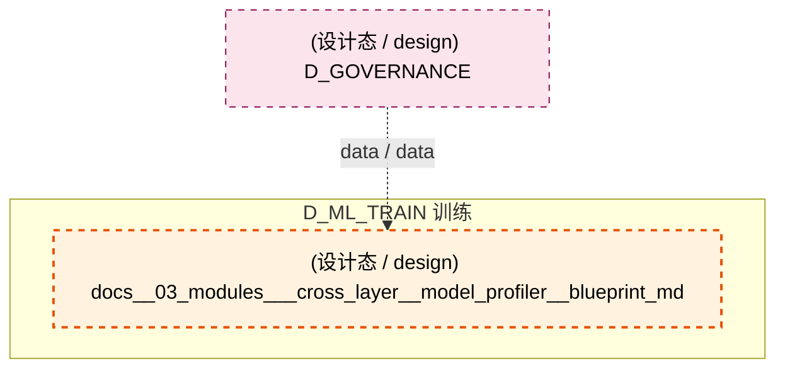
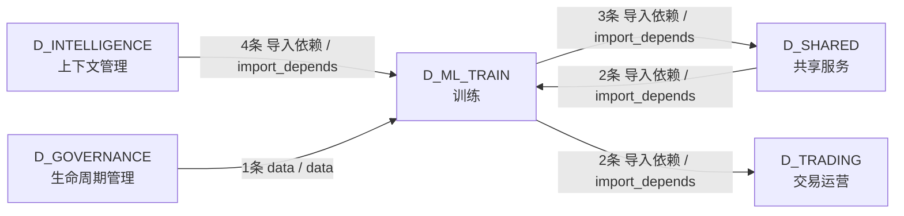

# 42_d_ml_train / model_evaluation / 训练 / Training

> **功能简介 / Overview**: 训练，负责模型训练、特征工程和模型评估

> **文档作用 / Purpose**: 展示 训练（D_ML_TRAIN）功能域的模块清单、域内依赖关系、跨域依赖关系、架构分层视图，供架构审查和域治理参考。

> 本文档由 generate_domain_doc.py 从 depgraph (PostgreSQL) 自动生成
> 最后更新: 2026-07-10 02:55:46
> 数据源: depgraph (PostgreSQL) nodes表 + edges表

## 域基本信息 / Domain Overview

| 字段 | 值 | Field | Value |
|------|------|-------|-------|
| 编号 | 42 | Number | 42 |
| 域ID | D_ML_TRAIN | Domain ID | D_ML_TRAIN |
| 域名称 | 训练 | Domain Name | Training |
| 层级 | L2 业务域层 | Layer | L2 Domain |
| 模块数 | 12 | Module Count | 12 |
| 域内依赖 | 5 | Internal Dependencies | 5 |
| 跨域入边 | 7 | Cross-domain Incoming | 7 |
| 跨域出边 | 5 | Cross-domain Outgoing | 5 |
| 设计态模块 | 1 | Design Modules | 1 |
| 原型态模块 | 11 | Prototype Modules | 11 |
| 生产态模块 | 0 | Production Modules | 0 |
| 容量 | 0/150 (正常) | Capacity | 0/150 (正常) |
| 描述 | 模型能力考试 | Description | 模型能力考试 |

## 模块分层清单 / Module Layered List

> 按 architecture_layer 分组的模块清单（共 12 个模块 / 12 modules）。

### L1 基础层 / Foundation Layer (1 modules)

| # | 模块路径 / Module Path | 模块名称 / Module Name (功能简介 / Description) | 成熟度 / Maturity | 蓝图 / Blueprint |
|:--:|---------|---------|:---:|:---:|
| 1 | docs/03_modules/_cross_layer/model_profiler/blueprint.md | docs__03_modules___cross_layer__model_profiler__blueprint_md | 设计态 / design | [MOD-INF-034](../../03_modules/_cross_layer/model_profiler/blueprint.md) |

### L2 领域层 / Domain Layer (11 modules)

| # | 模块路径 / Module Path | 模块名称 / Module Name (功能简介 / Description) | 成熟度 / Maturity | 蓝图 / Blueprint |
|:--:|---------|---------|:---:|:---:|
| 1 | src/zephyr/ml_train/__init__.py | D_ML_TRAIN — ML Training Domain | 原型态 / prototype | [MOD-L11-001](../../03_modules/_domain_machine_learning_train/blueprint.md) |
| 2 | src/zephyr/ml_train/_extensions/__init__.py | __init__.py | 原型态 / prototype |  |
| 3 | src/zephyr/ml_train/api/__init__.py | __init__.py | 原型态 / prototype |  |
| 4 | src/zephyr/ml_train/core/__init__.py | __init__.py | 原型态 / prototype |  |
| 5 | src/zephyr/ml_train/implementations/__init__.py | D_ML_TRAIN — ML Training Concrete Implementations | 原型态 / prototype | [MOD-L11-001](../../03_modules/_domain_machine_learning_train/blueprint.md) |
| 6 | src/zephyr/ml_train/implementations/default_inference_eng... | D_ML_TRAIN — Default Inference Engine | 原型态 / prototype | [MOD-L11-001](../../03_modules/_domain_machine_learning_train/blueprint.md) |
| 7 | src/zephyr/ml_train/inference_base.py | D_ML_TRAIN — ML Inference Base | 原型态 / prototype | [MOD-L11-001](../../03_modules/_domain_machine_learning_train/blueprint.md) |
| 8 | src/zephyr/ml_train/infrastructure/__init__.py | __init__.py | 原型态 / prototype |  |
| 9 | src/zephyr/ml_train/models/__init__.py | __init__.py | 原型态 / prototype |  |
| 10 | src/zephyr/ml_train/services/__init__.py | __init__.py | 原型态 / prototype |  |
| 11 | src/zephyr/ml_train/trainer_base.py | D_ML_TRAIN — ML Training Base | 原型态 / prototype | [MOD-L11-001](../../03_modules/_domain_machine_learning_train/blueprint.md) |

## 域内依赖图 / Internal Dependency Diagram

> 依赖图内嵌在本文档中，IDE 可直接渲染显示。参考 decision_index.md 设计，分四个视图：合并全景图、运营态子图、设计态子图、原型态子图（按 design_maturity 实际值拆分）。
>
> **图例说明 / Legend**：
> - **实线边框 = 运营态模块**（production，已上线运行）
> - **虚线边框 = 设计态模块**（design，蓝图阶段，代码未写）
> - **虚线边框 = 原型态模块**（prototype，代码已写，验证中未稳定上线）
> - **实线箭头 = 运营态依赖**（已生效的依赖关系）
> - **虚线箭头 = 非运营态依赖**（计划中/验证中的依赖关系）

### 合并全景图（全部模块，标签标注成熟度）

> 展示全部 12 个模块（生产态 0 + 设计态 1 + 原型态 11），标签标注成熟度。

```mermaid
graph TD
    subgraph D_ML_TRAIN["D_ML_TRAIN 训练"]
        docs_03_modules_cross_layer_model_profiler_blueprint_md["(设计态 / design) docs__03_modules___cross_layer__model_profiler__blueprint_md"]
        src_zephyr_ml_train_init_py["(原型态 / prototype) D_ML_TRAIN — ML Training Domain<br/>文件: __init__.py"]
        src_zephyr_ml_train_extensions_init_py["(原型态 / prototype) __init__.py"]
        src_zephyr_ml_train_api_init_py["(原型态 / prototype) __init__.py"]
        src_zephyr_ml_train_core_init_py["(原型态 / prototype) __init__.py"]
        src_zephyr_ml_train_implementations_init_py["(原型态 / prototype) D_ML_TRAIN — ML Training Concrete Implementations<br/>文件: __init__.py"]
        src_zephyr_ml_train_implementations_default_inference_engine_py["(原型态 / prototype) D_ML_TRAIN — Default Inference Engine<br/>文件: default_inference_engine.py"]
        src_zephyr_ml_train_inference_base_py["(原型态 / prototype) D_ML_TRAIN — ML Inference Base<br/>文件: inference_base.py"]
        src_zephyr_ml_train_infrastructure_init_py["(原型态 / prototype) __init__.py"]
        src_zephyr_ml_train_models_init_py["(原型态 / prototype) __init__.py"]
        src_zephyr_ml_train_services_init_py["(原型态 / prototype) __init__.py"]
        src_zephyr_ml_train_trainer_base_py["(原型态 / prototype) D_ML_TRAIN — ML Training Base<br/>文件: trainer_base.py"]
    end
    src_zephyr_ml_train_inference_base_py -.->|导入依赖 / import_depends| src_zephyr_ml_train_trainer_base_py
    src_zephyr_ml_train_init_py -.->|config_depends / config_depends| src_zephyr_ml_train_inference_base_py
    src_zephyr_ml_train_implementations_default_inference_engine_py -.->|导入依赖 / import_depends| src_zephyr_ml_train_inference_base_py
    src_zephyr_ml_train_implementations_default_inference_engine_py -.->|导入依赖 / import_depends| src_zephyr_ml_train_trainer_base_py
    src_zephyr_ml_train_implementations_init_py -.->|导入依赖 / import_depends| src_zephyr_ml_train_implementations_default_inference_engine_py
    D_SHARED["(原型态 / prototype) D_SHARED"]
    src_zephyr_ml_train_inference_base_py -.->|导入依赖 / import_depends| D_SHARED
    D_TRADING["(生产态 / production) D_TRADING"]
    src_zephyr_ml_train_inference_base_py -.->|导入依赖 / import_depends| D_TRADING
    src_zephyr_ml_train_implementations_default_inference_engine_py -.->|导入依赖 / import_depends| D_SHARED
    src_zephyr_ml_train_implementations_default_inference_engine_py -.->|导入依赖 / import_depends| D_SHARED
    src_zephyr_ml_train_implementations_default_inference_engine_py -.->|导入依赖 / import_depends| D_TRADING
    D_INTELLIGENCE["(生产态 / production) D_INTELLIGENCE"]
    D_INTELLIGENCE -.->|导入依赖 / import_depends| src_zephyr_ml_train_inference_base_py
    D_INTELLIGENCE -.->|导入依赖 / import_depends| src_zephyr_ml_train_trainer_base_py
    D_INTELLIGENCE -.->|导入依赖 / import_depends| src_zephyr_ml_train_inference_base_py
    D_INTELLIGENCE -.->|导入依赖 / import_depends| src_zephyr_ml_train_trainer_base_py
    D_SHARED -.->|导入依赖 / import_depends| src_zephyr_ml_train_inference_base_py
    D_SHARED -.->|导入依赖 / import_depends| src_zephyr_ml_train_trainer_base_py
    D_GOVERNANCE["(设计态 / design) D_GOVERNANCE"]
    D_GOVERNANCE -.->|data / data| docs_03_modules_cross_layer_model_profiler_blueprint_md
    classDef production fill:#e1f5fe,stroke:#01579b,stroke-width:2px,color:#000
    classDef design fill:#fff3e0,stroke:#e65100,stroke-width:2px,color:#000,stroke-dasharray: 5 5
    classDef external_prod fill:#e8f5e9,stroke:#1b5e20,stroke-width:1px,color:#000
    classDef external_design fill:#fce4ec,stroke:#880e4f,stroke-width:1px,color:#000,stroke-dasharray: 5 5
    class docs_03_modules_cross_layer_model_profiler_blueprint_md,src_zephyr_ml_train_init_py,src_zephyr_ml_train_extensions_init_py,src_zephyr_ml_train_api_init_py,src_zephyr_ml_train_core_init_py,src_zephyr_ml_train_implementations_init_py,src_zephyr_ml_train_implementations_default_inference_engine_py,src_zephyr_ml_train_inference_base_py,src_zephyr_ml_train_infrastructure_init_py,src_zephyr_ml_train_models_init_py,src_zephyr_ml_train_services_init_py,src_zephyr_ml_train_trainer_base_py design
    class D_TRADING,D_INTELLIGENCE external_prod
    class D_SHARED,D_GOVERNANCE external_design
```

### 运营态子图（仅 design_maturity=production 的模块和依赖）

> 仅展示已上线运行的模块（共 0 个，0 条域内依赖）。

> （无运营态模块 / No production modules）

### 设计态子图（仅 design_maturity=design 的模块和依赖）

> 仅展示蓝图阶段、代码未写的设计态模块（共 1 个，0 条域内依赖）。

### 原型态子图（仅 design_maturity=prototype 的模块和依赖）

> 仅展示代码已写、验证中未稳定上线的原型态模块（共 11 个，5 条域内依赖）。

```mermaid
graph TD
    subgraph D_ML_TRAIN["D_ML_TRAIN 训练"]
        src_zephyr_ml_train_init_py["(原型态 / prototype) D_ML_TRAIN — ML Training Domain<br/>文件: __init__.py"]
        src_zephyr_ml_train_extensions_init_py["(原型态 / prototype) __init__.py"]
        src_zephyr_ml_train_api_init_py["(原型态 / prototype) __init__.py"]
        src_zephyr_ml_train_core_init_py["(原型态 / prototype) __init__.py"]
        src_zephyr_ml_train_implementations_init_py["(原型态 / prototype) D_ML_TRAIN — ML Training Concrete Implementations<br/>文件: __init__.py"]
        src_zephyr_ml_train_implementations_default_inference_engine_py["(原型态 / prototype) D_ML_TRAIN — Default Inference Engine<br/>文件: default_inference_engine.py"]
        src_zephyr_ml_train_inference_base_py["(原型态 / prototype) D_ML_TRAIN — ML Inference Base<br/>文件: inference_base.py"]
        src_zephyr_ml_train_infrastructure_init_py["(原型态 / prototype) __init__.py"]
        src_zephyr_ml_train_models_init_py["(原型态 / prototype) __init__.py"]
        src_zephyr_ml_train_services_init_py["(原型态 / prototype) __init__.py"]
        src_zephyr_ml_train_trainer_base_py["(原型态 / prototype) D_ML_TRAIN — ML Training Base<br/>文件: trainer_base.py"]
    end
    src_zephyr_ml_train_inference_base_py -.->|导入依赖 / import_depends| src_zephyr_ml_train_trainer_base_py
    src_zephyr_ml_train_init_py -.->|config_depends / config_depends| src_zephyr_ml_train_inference_base_py
    src_zephyr_ml_train_implementations_default_inference_engine_py -.->|导入依赖 / import_depends| src_zephyr_ml_train_inference_base_py
    src_zephyr_ml_train_implementations_default_inference_engine_py -.->|导入依赖 / import_depends| src_zephyr_ml_train_trainer_base_py
    src_zephyr_ml_train_implementations_init_py -.->|导入依赖 / import_depends| src_zephyr_ml_train_implementations_default_inference_engine_py
    D_SHARED["(原型态 / prototype) D_SHARED"]
    src_zephyr_ml_train_inference_base_py -.->|导入依赖 / import_depends| D_SHARED
    D_TRADING["(生产态 / production) D_TRADING"]
    src_zephyr_ml_train_inference_base_py -.->|导入依赖 / import_depends| D_TRADING
    src_zephyr_ml_train_implementations_default_inference_engine_py -.->|导入依赖 / import_depends| D_SHARED
    src_zephyr_ml_train_implementations_default_inference_engine_py -.->|导入依赖 / import_depends| D_SHARED
    src_zephyr_ml_train_implementations_default_inference_engine_py -.->|导入依赖 / import_depends| D_TRADING
    D_INTELLIGENCE["(生产态 / production) D_INTELLIGENCE"]
    D_INTELLIGENCE -.->|导入依赖 / import_depends| src_zephyr_ml_train_inference_base_py
    D_INTELLIGENCE -.->|导入依赖 / import_depends| src_zephyr_ml_train_trainer_base_py
    D_INTELLIGENCE -.->|导入依赖 / import_depends| src_zephyr_ml_train_inference_base_py
    D_INTELLIGENCE -.->|导入依赖 / import_depends| src_zephyr_ml_train_trainer_base_py
    D_SHARED -.->|导入依赖 / import_depends| src_zephyr_ml_train_inference_base_py
    D_SHARED -.->|导入依赖 / import_depends| src_zephyr_ml_train_trainer_base_py
    classDef production fill:#e1f5fe,stroke:#01579b,stroke-width:2px,color:#000
    classDef design fill:#fff3e0,stroke:#e65100,stroke-width:2px,color:#000,stroke-dasharray: 5 5
    classDef external_prod fill:#e8f5e9,stroke:#1b5e20,stroke-width:1px,color:#000
    classDef external_design fill:#fce4ec,stroke:#880e4f,stroke-width:1px,color:#000,stroke-dasharray: 5 5
    class src_zephyr_ml_train_init_py,src_zephyr_ml_train_extensions_init_py,src_zephyr_ml_train_api_init_py,src_zephyr_ml_train_core_init_py,src_zephyr_ml_train_implementations_init_py,src_zephyr_ml_train_implementations_default_inference_engine_py,src_zephyr_ml_train_inference_base_py,src_zephyr_ml_train_infrastructure_init_py,src_zephyr_ml_train_models_init_py,src_zephyr_ml_train_services_init_py,src_zephyr_ml_train_trainer_base_py design
    class D_TRADING,D_INTELLIGENCE external_prod
    class D_SHARED external_design
```

## 跨域依赖 / Cross-domain Dependencies

### 本域依赖的其他域（出边）/ Depends On

| # | 本域模块 / Source Module | → | 外部域-目标模块 / Target Module | 依赖类型 / Type |
|:--:|---------|:--:|---------|---------|
| 1 | D_ML_TRAIN — Default Inference Engine (default... | → | D_SHARED 共享服务: model_serving_response.py | 导入依赖 / import_depends |
| 2 | D_ML_TRAIN — Default Inference Engine (default... | → | D_SHARED 共享服务: paths.py — 项目路径常量 SSoT（Single Source of... | 导入依赖 / import_depends |
| 3 | D_ML_TRAIN — ML Inference Base (inference_base.py) | → | D_SHARED 共享服务: model_serving_response.py | 导入依赖 / import_depends |
| 4 | D_ML_TRAIN — Default Inference Engine (default... | → | D_TRADING 交易运营: model_serving_request.py | 导入依赖 / import_depends |
| 5 | D_ML_TRAIN — ML Inference Base (inference_base.py) | → | D_TRADING 交易运营: model_serving_request.py | 导入依赖 / import_depends |

### 依赖本域的其他域（入边）/ Depended By

| # | 外部域-源模块 / Source Module | → | 本域模块 / Target Module | 依赖类型 / Type |
|:--:|---------|:--:|---------|---------|
| 1 | D_GOVERNANCE 生命周期管理: blueprint.md | → | blueprint.md | data / data |
| 2 | D_INTELLIGENCE 上下文管理: D_ML_TRAIN — Default Inference Engine (default... | → | D_ML_TRAIN — ML Inference Base (inference_base.py) | 导入依赖 / import_depends |
| 3 | D_INTELLIGENCE 上下文管理: D_ML_TRAIN — Default Inference Engine (default... | → | D_ML_TRAIN — ML Training Base (trainer_base.py) | 导入依赖 / import_depends |
| 4 | D_INTELLIGENCE 上下文管理: inference_base.py | → | D_ML_TRAIN — ML Inference Base (inference_base.py) | 导入依赖 / import_depends |
| 5 | D_INTELLIGENCE 上下文管理: inference_base.py | → | D_ML_TRAIN — ML Training Base (trainer_base.py) | 导入依赖 / import_depends |
| 6 | D_SHARED 共享服务: MLExperimentPipeline D_ML_TRAIN->实验跨层集成管... | → | D_ML_TRAIN — ML Inference Base (inference_base.py) | 导入依赖 / import_depends |
| 7 | D_SHARED 共享服务: MLExperimentPipeline D_ML_TRAIN->实验跨层集成管... | → | D_ML_TRAIN — ML Training Base (trainer_base.py) | 导入依赖 / import_depends |

### 跨域依赖图 / Cross-domain Dependency Diagram

> 本域与 4 个外部域直接连接（出边 5 条 + 入边 7 条 = 12 条）。只显示直接连接的域，不展开具体节点。

## 说明 / Notes

- **数据源 / Data Source**: `depgraph (PostgreSQL)` 的 `nodes`、`edges`、`domains` 表
- **生成器 / Generator**: `generate_domain_doc.py`（G2+G10 合并）
- **维护方式 / Maintenance**: 自动生成，全景图更新时刷新
- **文件名规则 / File Naming**: `{编号:02d}_{域ID小写}.md`，如 `16_d_trading.md`
- **图例说明 / Legend**: `[production]`=已上线 / `[design]`=设计中 / `[prototype]`=原型 / `[unknown]`=未知
