# 42_d_pf_core / 组合核心

> **文档作用 / Purpose**: 展示 组合核心（D_PF_CORE）功能域的模块清单、域内依赖关系、跨域依赖关系、架构分层视图，供架构审查和域治理参考。

> 本文档由 generate_domain_doc.py 从 depgraph (PostgreSQL) 自动生成
> 最后更新: 2026-07-06 05:46:45
> 数据源: depgraph (PostgreSQL) nodes表 + edges表

## 域基本信息 / Domain Overview

| 字段 | 值 | Field | Value |
|------|------|-------|-------|
| 编号 | 42 | Number | 42 |
| 域ID | D_PF_CORE | Domain ID | D_PF_CORE |
| 域名称 | 组合核心 | Domain Name | 组合核心 |
| 层级 | L2_domain | Layer | L2_domain |
| 模块数 | 14 | Module Count | 14 |
| 域内依赖 | 1 | Internal Dependencies | 1 |
| 跨域入边 | 3 | Cross-domain Incoming | 3 |
| 跨域出边 | 7 | Cross-domain Outgoing | 7 |
| 设计态模块 | 0 | Design Modules | 0 |
| 原型态模块 | 10 | Prototype Modules | 10 |
| 生产态模块 | 4 | Production Modules | 4 |
| 容量 | 4/150 (正常) | Capacity | 4/150 (正常) |
| 描述 | 组合核心域。负责投资组合核心引擎，包括组合优化器、风险预算分配、基准跟踪、再平衡引擎。 | Description | 组合核心域。负责投资组合核心引擎，包括组合优化器、风险预算分配、基准跟踪、再平衡引擎。 |

## 域内依赖图 / Internal Dependency Diagram

> 依赖图内嵌在本文档中，IDE 可直接渲染显示。每30个节点一组分页显示。
>
> **图例说明 / Legend**：
> - **实线边框 = 运营态模块**（production，已上线运行）
> - **虚线边框 = 设计态模块**（design，还在设计中）
> - **实线箭头 = 运营态依赖**（已生效的依赖关系）
> - **虚线箭头 = 设计态依赖**（计划中的依赖关系）

```mermaid
graph TD
    subgraph D_PF_CORE["D_PF_CORE 组合核心"]
        src_zephyr_pf_core_init_py["src/zephyr/pf_core/__init__.py prototype"]
        src_zephyr_pf_core_extensions_init_py["src/zephyr/pf_core/_extensions/__init__.py prototype"]
        src_zephyr_pf_core_api_init_py["src/zephyr/pf_core/api/__init__.py prototype"]
        src_zephyr_pf_core_compliance_rule_py["src/zephyr/pf_core/compliance_rule.py production"]
        src_zephyr_pf_core_core_init_py["src/zephyr/pf_core/core/__init__.py prototype"]
        src_zephyr_pf_core_default_equity_strategy_py["src/zephyr/pf_core/default_equity_strategy.py production"]
        src_zephyr_pf_core_infrastructure_init_py["src/zephyr/pf_core/infrastructure/__init__.py prototype"]
        src_zephyr_pf_core_performance_attribution_report_py["src/zephyr/pf_core/performance_attribution_repo... production"]
        src_zephyr_pf_core_risk_limits_py["src/zephyr/pf_core/risk_limits.py prototype"]
        src_zephyr_pf_core_services_init_py["src/zephyr/pf_core/services/__init__.py prototype"]
        src_zephyr_pf_core_strategies_init_py["src/zephyr/pf_core/strategies/__init__.py prototype"]
        src_zephyr_pf_core_strategy_base_py["src/zephyr/pf_core/strategy_base.py production"]
        src_zephyr_pf_core_strategy_engine_init_py["src/zephyr/pf_core/strategy_engine/__init__.py prototype"]
        src_zephyr_pf_core_strategy_registry_py["src/zephyr/pf_core/strategy_registry.py prototype"]
    end
    src_zephyr_pf_core_init_py -.->|config_depends| src_zephyr_pf_core_compliance_rule_py
    D_GOV_ENFORCEMENT["D_GOV_ENFORCEMENT prototype"]
    src_zephyr_pf_core_compliance_rule_py -.->|import_depends| D_GOV_ENFORCEMENT
    D_GOVERNANCE["D_GOVERNANCE prototype"]
    src_zephyr_pf_core_risk_limits_py -.->|import_depends| D_GOVERNANCE
    src_zephyr_pf_core_strategy_base_py -.->|import_depends| D_GOVERNANCE
    src_zephyr_pf_core_strategy_registry_py -.->|import_depends| D_GOVERNANCE
    src_zephyr_pf_core_default_equity_strategy_py -.->|import_depends| D_GOVERNANCE
    D_TRADING["D_TRADING production"]
    src_zephyr_pf_core_default_equity_strategy_py -->|import_depends| D_TRADING
    src_zephyr_pf_core_strategy_engine_init_py -.->|import_depends| D_GOVERNANCE
    D_GOVERNANCE -.->|import_depends| src_zephyr_pf_core_default_equity_strategy_py
    classDef production fill:#e1f5fe,stroke:#01579b,stroke-width:2px,color:#000
    classDef design fill:#fff3e0,stroke:#e65100,stroke-width:2px,color:#000,stroke-dasharray: 5 5
    classDef external_prod fill:#e8f5e9,stroke:#1b5e20,stroke-width:1px,color:#000
    classDef external_design fill:#fce4ec,stroke:#880e4f,stroke-width:1px,color:#000,stroke-dasharray: 5 5
    class src_zephyr_pf_core_compliance_rule_py,src_zephyr_pf_core_default_equity_strategy_py,src_zephyr_pf_core_performance_attribution_report_py,src_zephyr_pf_core_strategy_base_py production
    class src_zephyr_pf_core_init_py,src_zephyr_pf_core_extensions_init_py,src_zephyr_pf_core_api_init_py,src_zephyr_pf_core_core_init_py,src_zephyr_pf_core_infrastructure_init_py,src_zephyr_pf_core_risk_limits_py,src_zephyr_pf_core_services_init_py,src_zephyr_pf_core_strategies_init_py,src_zephyr_pf_core_strategy_engine_init_py,src_zephyr_pf_core_strategy_registry_py design
    class D_TRADING external_prod
    class D_GOV_ENFORCEMENT,D_GOVERNANCE external_design
```



## 跨域依赖 / Cross-domain Dependencies

### 本域依赖的其他域（出边）/ Depends On

| 目标域 / Target Domain | 依赖数 / Count | 依赖类型 / Type |
|--------|:---:|---------|
| D_GOVERNANCE | 5 | import_depends |
| D_GOV_ENFORCEMENT | 1 | import_depends |
| D_TRADING | 1 | import_depends |

### 依赖本域的其他域（入边）/ Depended By

| 源域 / Source Domain | 依赖数 / Count | 依赖类型 / Type |
|------|:---:|---------|
| D_AUDITTEST | 2 | test_depends |
| D_GOVERNANCE | 1 | import_depends |

## 架构分层视图 / Architecture Overview

> 按 architecture_layer 分层显示 组合核心（D_PF_CORE）的模块分布。共 14 个模块 / 14 modules。

```

┌──────────────────────────────────────────────────────────────────┐
│              L2 领域层 / Domain Layer (14 modules)               │
├──────────────────────────────────────────────────────────────────┤
│   src/zephyr/pf_core/__init__.py  [prototype]                    │
│   src/zephyr/pf_core/_extensions/__init__.py  [prototype]        │
│   src/zephyr/pf_core/api/__init__.py  [prototype]                │
│   src/zephyr/pf_core/compliance_rule.py  [production]            │
│   src/zephyr/pf_core/core/__init__.py  [prototype]               │
│   src/zephyr/pf_core/default_equity_strategy.py  [production]    │
│   src/zephyr/pf_core/infrastructure/__init__.py  [prototype]     │
│   src/zephyr/pf_core/performance_attribution_report.py  [prod... │
│   src/zephyr/pf_core/risk_limits.py  [prototype]                 │
│   src/zephyr/pf_core/services/__init__.py  [prototype]           │
│   src/zephyr/pf_core/strategies/__init__.py  [prototype]         │
│   src/zephyr/pf_core/strategy_base.py  [production]              │
│   src/zephyr/pf_core/strategy_engine/__init__.py  [prototype]    │
│   src/zephyr/pf_core/strategy_registry.py  [prototype]           │
└──────────────────────────────────────────────────────────────────┘

```

## 模块分层清单 / Module Layered List

> 按 architecture_layer 分组的模块清单（共 14 个模块 / 14 modules）。

### L2 领域层 / Domain Layer (14 modules)

| # | 模块路径 / Module Path | 模块名称 / Module Name | 成熟度 / Maturity | 构建状态 / Build Status |
|:--:|---------|---------|:---:|:---:|
| 1 | src/zephyr/pf_core/__init__.py | src/zephyr/pf_core/__init__.py | prototype | generated |
| 2 | src/zephyr/pf_core/_extensions/__init__.py | src/zephyr/pf_core/_extensions/__init... | prototype | generated |
| 3 | src/zephyr/pf_core/api/__init__.py | src/zephyr/pf_core/api/__init__.py | prototype | generated |
| 4 | src/zephyr/pf_core/compliance_rule.py | src/zephyr/pf_core/compliance_rule.py | production | generated |
| 5 | src/zephyr/pf_core/core/__init__.py | src/zephyr/pf_core/core/__init__.py | prototype | generated |
| 6 | src/zephyr/pf_core/default_equity_strategy.py | src/zephyr/pf_core/default_equity_str... | production | generated |
| 7 | src/zephyr/pf_core/infrastructure/__init__.py | src/zephyr/pf_core/infrastructure/__i... | prototype | generated |
| 8 | src/zephyr/pf_core/performance_attribution_report.py | src/zephyr/pf_core/performance_attrib... | production | generated |
| 9 | src/zephyr/pf_core/risk_limits.py | src/zephyr/pf_core/risk_limits.py | prototype | generated |
| 10 | src/zephyr/pf_core/services/__init__.py | src/zephyr/pf_core/services/__init__.py | prototype | generated |
| 11 | src/zephyr/pf_core/strategies/__init__.py | src/zephyr/pf_core/strategies/__init_... | prototype | generated |
| 12 | src/zephyr/pf_core/strategy_base.py | src/zephyr/pf_core/strategy_base.py | production | generated |
| 13 | src/zephyr/pf_core/strategy_engine/__init__.py | src/zephyr/pf_core/strategy_engine/__... | prototype | generated |
| 14 | src/zephyr/pf_core/strategy_registry.py | src/zephyr/pf_core/strategy_registry.py | prototype | generated |

## 依赖关系图 / Dependency Graph

> 域内模块依赖关系（共 1 条 / 1 edges）。按依赖类型分组，使用 → 表示方向。

```

┌──────────────────────────────────────────────────────────────────┐
│        依赖关系图 / Dependency Graph (共 1 条 / 1 edges)         │
├──────────────────────────────────────────────────────────────────┤
│   依赖类型数 / Dependency Types: 1                               │
│   [config_depends]: 1 条 / edges                                 │
└──────────────────────────────────────────────────────────────────┘

┌──────────────────────────────────────────────────────────────────┐
│                 [config_depends] (1 条 / edges)                  │
├──────────────────────────────────────────────────────────────────┤
│   __init__.py → compliance_rule.py                               │
└──────────────────────────────────────────────────────────────────┘

```

## 说明 / Notes

- **数据源 / Data Source**: `depgraph (PostgreSQL)` 的 `nodes`、`edges`、`domains` 表
- **生成器 / Generator**: `generate_domain_doc.py`（G2+G10 合并）
- **维护方式 / Maintenance**: 自动生成，全景图更新时刷新
- **文件名规则 / File Naming**: `{编号:02d}_{域ID小写}.md`，如 `16_d_trading.md`
- **图例说明 / Legend**: `[production]`=已上线 / `[design]`=设计中 / `[prototype]`=原型 / `[unknown]`=未知
