# 42_d_simulation 域文档

> 本文档由 generate_domain_doc.py 从 depgraph.db 自动生成
> 最后更新: 2026-06-24 02:24:12
> 数据源: depgraph.db nodes表 + edges表

## 域基本信息 / Domain Overview

| 字段 | 值 | Field | Value |
|------|------|-------|-------|
| 编号 | 42 | Number | 42 |
| 域ID | D-SIMULATION | Domain ID | D-SIMULATION |
| 域名称 | 仿真 | Domain Name | 仿真 |
| 层级 | L2_domain | Layer | L2_domain |
| 模块数 | 128 | Module Count | 128 |
| 域内依赖 | 114 | Internal Dependencies | 114 |
| 跨域入边 | 92 | Cross-domain Incoming | 92 |
| 跨域出边 | 138 | Cross-domain Outgoing | 138 |
| 设计态模块 | 110 | Design Modules | 110 |
| 原型态模块 | 8 | Prototype Modules | 8 |
| 生产态模块 | 4 | Production Modules | 4 |
| 容量 | 128/150 (正常) | Capacity | 128/150 (正常) |
| 描述 | 仿真引擎、场景生成、蒙特卡洛、回测模拟。策略验证沙箱。 | Description | 仿真引擎、场景生成、蒙特卡洛、回测模拟。策略验证沙箱。 |

## 模块清单 / Module List

共 128 个模块（按路径排序，最多显示前 200 个）

| 模块路径 | 模块名称 | 设计成熟度 | 构建状态 | Module Path | Module Name | Maturity | Build Status |
|---------|---------|-----------|---------|-------------|-------------|----------|--------------|
| D-SIMULATION/ADR Decision Simulator ADR决策仿真器 | ADR Decision Simulator ADR决策仿真器 | design | design_only | D-SIMULATION/ADR Decision Simulator ADR决策仿真器 | ADR Decision Simulator ADR决策仿真器 | design | design_only |
| D-SIMULATION/Agent-Based Market Model 基于Agent的市场模型 | Agent-Based Market Model 基于Agent的市场模型 | design | design_only | D-SIMULATION/Agent-Based Market Model 基于Agent的市场模型 | Agent-Based Market Model 基于Agent的市场模型 | design | design_only |
| D-SIMULATION/Approval Gate Dependency Extractor Enhancer 审批门依赖提取器 | Approval Gate Dependency Extractor En... | design | design_only | D-SIMULATION/Approval Gate Dependency Extractor Enhancer 审批门依赖提取器 | Approval Gate Dependency Extractor En... | design | design_only |
| D-SIMULATION/Approval Gate Dependency Extractor 审批门依赖提取器 | Approval Gate Dependency Extractor 审批... | design | design_only | D-SIMULATION/Approval Gate Dependency Extractor 审批门依赖提取器 | Approval Gate Dependency Extractor 审批... | design | design_only |
| D-SIMULATION/Architecture Anti-Pattern Topology Detector 架构反模式拓扑检测器 | Architecture Anti-Pattern Topology De... | design | design_only | D-SIMULATION/Architecture Anti-Pattern Topology Detector 架构反模式拓扑检测器 | Architecture Anti-Pattern Topology De... | design | design_only |
| D-SIMULATION/Architecture Anti-Pattern Topology Enhancer 架构反模式拓扑增强器 | Architecture Anti-Pattern Topology En... | design | design_only | D-SIMULATION/Architecture Anti-Pattern Topology Enhancer 架构反模式拓扑增强器 | Architecture Anti-Pattern Topology En... | design | design_only |
| D-SIMULATION/Argus Dependency-First Mutation Tester Argus依赖优先变异测试器 | Argus Dependency-First Mutation Teste... | design | design_only | D-SIMULATION/Argus Dependency-First Mutation Tester Argus依赖优先变异测试器 | Argus Dependency-First Mutation Teste... | design | design_only |
| D-SIMULATION/Argus Mutation Enhancer Argus变异增强器 | Argus Mutation Enhancer Argus变异增强器 | design | design_only | D-SIMULATION/Argus Mutation Enhancer Argus变异增强器 | Argus Mutation Enhancer Argus变异增强器 | design | design_only |
| D-SIMULATION/Auto Backtest Scheduler 自动回测调度器 | Auto Backtest Scheduler 自动回测调度器 | design | design_only | D-SIMULATION/Auto Backtest Scheduler 自动回测调度器 | Auto Backtest Scheduler 自动回测调度器 | design | design_only |
| D-SIMULATION/Automated Overfitting Detector 自动化过拟合检测 | Automated Overfitting Detector 自动化过拟合检测 | design | design_only | D-SIMULATION/Automated Overfitting Detector 自动化过拟合检测 | Automated Overfitting Detector 自动化过拟合检测 | design | design_only |
| D-SIMULATION/Backtest Acceleration Module 回测加速模块 | Backtest Acceleration Module 回测加速模块 | design | design_only | D-SIMULATION/Backtest Acceleration Module 回测加速模块 | Backtest Acceleration Module 回测加速模块 | design | design_only |
| D-SIMULATION/Backtest Anomaly Diagnoser 回测异常诊断 | Backtest Anomaly Diagnoser 回测异常诊断 | design | design_only | D-SIMULATION/Backtest Anomaly Diagnoser 回测异常诊断 | Backtest Anomaly Diagnoser 回测异常诊断 | design | design_only |
| D-SIMULATION/Backtest Cache Manager 回测缓存管理器 | Backtest Cache Manager 回测缓存管理器 | design | design_only | D-SIMULATION/Backtest Cache Manager 回测缓存管理器 | Backtest Cache Manager 回测缓存管理器 | design | design_only |
| D-SIMULATION/Backtest Data Quality Checker 回测数据质量检查器 | Backtest Data Quality Checker 回测数据质量检查器 | design | design_only | D-SIMULATION/Backtest Data Quality Checker 回测数据质量检查器 | Backtest Data Quality Checker 回测数据质量检查器 | design | design_only |
| D-SIMULATION/Backtest Overfitting Detector回测过拟合检测 | Backtest Overfitting Detector回测过拟合检测 | design | design_only | D-SIMULATION/Backtest Overfitting Detector回测过拟合检测 | Backtest Overfitting Detector回测过拟合检测 | design | design_only |
| D-SIMULATION/Backtest Pipeline Orchestrator 回测流水线编排器 | Backtest Pipeline Orchestrator 回测流水线编排器 | design | design_only | D-SIMULATION/Backtest Pipeline Orchestrator 回测流水线编排器 | Backtest Pipeline Orchestrator 回测流水线编排器 | design | design_only |
| D-SIMULATION/Backtest Report Auto Generator 回测报告自动生成 | Backtest Report Auto Generator 回测报告自动生成 | design | design_only | D-SIMULATION/Backtest Report Auto Generator 回测报告自动生成 | Backtest Report Auto Generator 回测报告自动生成 | design | design_only |
| D-SIMULATION/Backtest Result Comparator 回测结果对比 | Backtest Result Comparator 回测结果对比 | design | design_only | D-SIMULATION/Backtest Result Comparator 回测结果对比 | Backtest Result Comparator 回测结果对比 | design | design_only |
| D-SIMULATION/Backtest Result One-Click Deployer 回测结果一键部署 | Backtest Result One-Click Deployer 回测... | design | design_only | D-SIMULATION/Backtest Result One-Click Deployer 回测结果一键部署 | Backtest Result One-Click Deployer 回测... | design | design_only |
| D-SIMULATION/Backtest Result Statistical Significance Tester 回测结果统计显著性检验 | Backtest Result Statistical Significa... | design | design_only | D-SIMULATION/Backtest Result Statistical Significance Tester 回测结果统计显著性检验 | Backtest Result Statistical Significa... | design | design_only |
| D-SIMULATION/Capital Group Ecology & Multi-Party Game Simulation 资金群体生态与多方博弈模拟 | Capital Group Ecology & Multi-Party G... | design | design_only | D-SIMULATION/Capital Group Ecology & Multi-Party Game Simulation 资金群体生态与多方博弈模拟 | Capital Group Ecology & Multi-Party G... | design | design_only |
| D-SIMULATION/Carbon Intensity Queryer 碳强度查询器 | Carbon Intensity Queryer 碳强度查询器 | design | design_only | D-SIMULATION/Carbon Intensity Queryer 碳强度查询器 | Carbon Intensity Queryer 碳强度查询器 | design | design_only |
| D-SIMULATION/Carbon-Aware Scheduler Optimizer 碳感知调度优化器 | Carbon-Aware Scheduler Optimizer 碳感知调... | design | design_only | D-SIMULATION/Carbon-Aware Scheduler Optimizer 碳感知调度优化器 | Carbon-Aware Scheduler Optimizer 碳感知调... | design | design_only |
| D-SIMULATION/Chaos Engineering Environment 混沌工程环境 | Chaos Engineering Environment 混沌工程环境 | design | design_only | D-SIMULATION/Chaos Engineering Environment 混沌工程环境 | Chaos Engineering Environment 混沌工程环境 | design | design_only |
| D-SIMULATION/Chaos Experiment Auto-Generator 混沌实验自动生成器 | Chaos Experiment Auto-Generator 混沌实验自... | design | design_only | D-SIMULATION/Chaos Experiment Auto-Generator 混沌实验自动生成器 | Chaos Experiment Auto-Generator 混沌实验自... | design | design_only |
| D-SIMULATION/Convexity Budget Framework 凸性预算框架 | Convexity Budget Framework 凸性预算框架 | design | design_only | D-SIMULATION/Convexity Budget Framework 凸性预算框架 | Convexity Budget Framework 凸性预算框架 | design | design_only |
| D-SIMULATION/Correlation Regime Shift 相关性体制转换 | Correlation Regime Shift 相关性体制转换 | design | design_only | D-SIMULATION/Correlation Regime Shift 相关性体制转换 | Correlation Regime Shift 相关性体制转换 | design | design_only |
| D-SIMULATION/Counterparty Simulator 对手仿真器 | Counterparty Simulator 对手仿真器 | design | design_only | D-SIMULATION/Counterparty Simulator 对手仿真器 | Counterparty Simulator 对手仿真器 | design | design_only |
| D-SIMULATION/Cross-Engine Backtest Result Comparator 跨引擎回测结果比较器 | Cross-Engine Backtest Result Comparat... | design | design_only | D-SIMULATION/Cross-Engine Backtest Result Comparator 跨引擎回测结果比较器 | Cross-Engine Backtest Result Comparat... | design | design_only |
| D-SIMULATION/Cross-Env Dependency Diff Analyzer 跨环境依赖差异分析器 | Cross-Env Dependency Diff Analyzer 跨环... | design | design_only | D-SIMULATION/Cross-Env Dependency Diff Analyzer 跨环境依赖差异分析器 | Cross-Env Dependency Diff Analyzer 跨环... | design | design_only |
| D-SIMULATION/D-SIMULATION 仿真 | D-SIMULATION 仿真 | design | design_only | D-SIMULATION/D-SIMULATION 仿真 | D-SIMULATION 仿真 | design | design_only |
| D-SIMULATION/DANTE Dependency-Aware Test Generator DANTE依赖感知测试生成器 | DANTE Dependency-Aware Test Generator... | design | design_only | D-SIMULATION/DANTE Dependency-Aware Test Generator DANTE依赖感知测试生成器 | DANTE Dependency-Aware Test Generator... | design | design_only |
| D-SIMULATION/DANTE Test Generation Enhancer DANTE测试生成增强器 | DANTE Test Generation Enhancer DANTE测... | design | design_only | D-SIMULATION/DANTE Test Generation Enhancer DANTE测试生成增强器 | DANTE Test Generation Enhancer DANTE测... | design | design_only |
| D-SIMULATION/Deflated Sharpe Ratio Calculator DSR计算器 | Deflated Sharpe Ratio Calculator DSR计算器 | design | design_only | D-SIMULATION/Deflated Sharpe Ratio Calculator DSR计算器 | Deflated Sharpe Ratio Calculator DSR计算器 | design | design_only |
| D-SIMULATION/Dependency Chain Carbon Footprint Attributor 依赖链碳足迹归因器 | Dependency Chain Carbon Footprint Att... | design | design_only | D-SIMULATION/Dependency Chain Carbon Footprint Attributor 依赖链碳足迹归因器 | Dependency Chain Carbon Footprint Att... | design | design_only |
| D-SIMULATION/Dependency Graph Digital Twin 依赖图数字孪生 | Dependency Graph Digital Twin 依赖图数字孪生 | design | design_only | D-SIMULATION/Dependency Graph Digital Twin 依赖图数字孪生 | Dependency Graph Digital Twin 依赖图数字孪生 | design | design_only |
| D-SIMULATION/Dependency Graph Real-time Twin Engine 依赖图实时孪生引擎 | Dependency Graph Real-time Twin Engin... | design | design_only | D-SIMULATION/Dependency Graph Real-time Twin Engine 依赖图实时孪生引擎 | Dependency Graph Real-time Twin Engin... | design | design_only |
| D-SIMULATION/Dependency Hell 5-Dimension Detection Enhancer 依赖地狱5维检测增强器 | Dependency Hell 5-Dimension Detection... | design | design_only | D-SIMULATION/Dependency Hell 5-Dimension Detection Enhancer 依赖地狱5维检测增强器 | Dependency Hell 5-Dimension Detection... | design | design_only |
| D-SIMULATION/Digital Twin Market Simulation 数字孪生市场仿真 | Digital Twin Market Simulation 数字孪生市场仿真 | design | design_only | D-SIMULATION/Digital Twin Market Simulation 数字孪生市场仿真 | Digital Twin Market Simulation 数字孪生市场仿真 | design | design_only |
| D-SIMULATION/Dual-Mode Backtest Engine双模式回测引擎 | Dual-Mode Backtest Engine双模式回测引擎 | design | design_only | D-SIMULATION/Dual-Mode Backtest Engine双模式回测引擎 | Dual-Mode Backtest Engine双模式回测引擎 | design | design_only |
| D-SIMULATION/Energy Consumption Collector 能耗采集器 | Energy Consumption Collector 能耗采集器 | design | design_only | D-SIMULATION/Energy Consumption Collector 能耗采集器 | Energy Consumption Collector 能耗采集器 | design | design_only |
| D-SIMULATION/Event-Driven Backtester 事件驱动回测器 | Event-Driven Backtester 事件驱动回测器 | design | design_only | D-SIMULATION/Event-Driven Backtester 事件驱动回测器 | Event-Driven Backtester 事件驱动回测器 | design | design_only |
| D-SIMULATION/Extreme Event Simulator 极端事件仿真器 | Extreme Event Simulator 极端事件仿真器 | design | design_only | D-SIMULATION/Extreme Event Simulator 极端事件仿真器 | Extreme Event Simulator 极端事件仿真器 | design | design_only |
| D-SIMULATION/FeatureStore PIT Feature Store时点特征 | FeatureStore PIT Feature Store时点特征 | design | design_only | D-SIMULATION/FeatureStore PIT Feature Store时点特征 | FeatureStore PIT Feature Store时点特征 | design | design_only |
| D-SIMULATION/Greek Trilemma希腊三难困境 | Greek Trilemma希腊三难困境 | design | design_only | D-SIMULATION/Greek Trilemma希腊三难困境 | Greek Trilemma希腊三难困境 | design | design_only |
| D-SIMULATION/History Replay Engine历史重放引擎 | History Replay Engine历史重放引擎 | design | design_only | D-SIMULATION/History Replay Engine历史重放引擎 | History Replay Engine历史重放引擎 | design | design_only |
| D-SIMULATION/Indicator NaN Processor 指标NaN处理器 | Indicator NaN Processor 指标NaN处理器 | design | design_only | D-SIMULATION/Indicator NaN Processor 指标NaN处理器 | Indicator NaN Processor 指标NaN处理器 | design | design_only |
| D-SIMULATION/Liquidity Model & Slippage Simulator 流动性模型与滑点模拟器 | Liquidity Model & Slippage Simulator ... | design | design_only | D-SIMULATION/Liquidity Model & Slippage Simulator 流动性模型与滑点模拟器 | Liquidity Model & Slippage Simulator ... | design | design_only |
| D-SIMULATION/Liquidity Simulator 流动性仿真器 | Liquidity Simulator 流动性仿真器 | design | design_only | D-SIMULATION/Liquidity Simulator 流动性仿真器 | Liquidity Simulator 流动性仿真器 | design | design_only |
| D-SIMULATION/Live Environment Simulator实盘环境模拟 | Live Environment Simulator实盘环境模拟 | design | design_only | D-SIMULATION/Live Environment Simulator实盘环境模拟 | Live Environment Simulator实盘环境模拟 | design | design_only |
| D-SIMULATION/Look-Ahead Bias Detector未来函数风险检测 | Look-Ahead Bias Detector未来函数风险检测 | design | design_only | D-SIMULATION/Look-Ahead Bias Detector未来函数风险检测 | Look-Ahead Bias Detector未来函数风险检测 | design | design_only |
| D-SIMULATION/Market Simulator市场仿真器 | Market Simulator市场仿真器 | design | design_only | D-SIMULATION/Market Simulator市场仿真器 | Market Simulator市场仿真器 | design | design_only |
| D-SIMULATION/Monte Carlo Engine蒙特卡洛模拟 | Monte Carlo Engine蒙特卡洛模拟 | design | design_only | D-SIMULATION/Monte Carlo Engine蒙特卡洛模拟 | Monte Carlo Engine蒙特卡洛模拟 | design | design_only |
| D-SIMULATION/Multi-Strategy Backtest Comparator 多策略回测对比 | Multi-Strategy Backtest Comparator 多策... | design | design_only | D-SIMULATION/Multi-Strategy Backtest Comparator 多策略回测对比 | Multi-Strategy Backtest Comparator 多策... | design | design_only |
| D-SIMULATION/Mutation Score Dependency Gate 变异评分依赖门禁 | Mutation Score Dependency Gate 变异评分依赖门禁 | design | design_only | D-SIMULATION/Mutation Score Dependency Gate 变异评分依赖门禁 | Mutation Score Dependency Gate 变异评分依赖门禁 | design | design_only |
| D-SIMULATION/NozyIO Backtest Visual Reporter NozyIO回测可视化报告器 | NozyIO Backtest Visual Reporter NozyI... | design | design_only | D-SIMULATION/NozyIO Backtest Visual Reporter NozyIO回测可视化报告器 | NozyIO Backtest Visual Reporter NozyI... | design | design_only |
| D-SIMULATION/Order Matching Engine 订单撮合引擎 | Order Matching Engine 订单撮合引擎 | design | design_only | D-SIMULATION/Order Matching Engine 订单撮合引擎 | Order Matching Engine 订单撮合引擎 | design | design_only |
| D-SIMULATION/Overfitting Detector 过拟合检验器 | Overfitting Detector 过拟合检验器 | design | design_only | D-SIMULATION/Overfitting Detector 过拟合检验器 | Overfitting Detector 过拟合检验器 | design | design_only |
| D-SIMULATION/OverfittingDetected 过拟合检测触发 | OverfittingDetected 过拟合检测触发 | design | design_only | D-SIMULATION/OverfittingDetected 过拟合检测触发 | OverfittingDetected 过拟合检测触发 | design | design_only |
| D-SIMULATION/Parameter Optimization Result Analyzer 参数优化结果分析器 | Parameter Optimization Result Analyze... | design | design_only | D-SIMULATION/Parameter Optimization Result Analyzer 参数优化结果分析器 | Parameter Optimization Result Analyze... | design | design_only |
| D-SIMULATION/Parameter Robustness Tester 参数鲁棒性测试器 | Parameter Robustness Tester 参数鲁棒性测试器 | design | design_only | D-SIMULATION/Parameter Robustness Tester 参数鲁棒性测试器 | Parameter Robustness Tester 参数鲁棒性测试器 | design | design_only |
| D-SIMULATION/Parameter Sensitivity Analyzer 参数灵敏度分析器 | Parameter Sensitivity Analyzer 参数灵敏度分析器 | design | design_only | D-SIMULATION/Parameter Sensitivity Analyzer 参数灵敏度分析器 | Parameter Sensitivity Analyzer 参数灵敏度分析器 | design | design_only |
| D-SIMULATION/Performance Regression Dependency Gate 性能回归依赖门禁 | Performance Regression Dependency Gat... | design | design_only | D-SIMULATION/Performance Regression Dependency Gate 性能回归依赖门禁 | Performance Regression Dependency Gat... | design | design_only |
| D-SIMULATION/Pipeline DAG Scheduler 管线DAG调度器 | Pipeline DAG Scheduler 管线DAG调度器 | design | design_only | D-SIMULATION/Pipeline DAG Scheduler 管线DAG调度器 | Pipeline DAG Scheduler 管线DAG调度器 | design | design_only |
| D-SIMULATION/Pipeline DAG Scheduling Enhancer Pipeline DAG调度增强器 | Pipeline DAG Scheduling Enhancer Pipe... | design | design_only | D-SIMULATION/Pipeline DAG Scheduling Enhancer Pipeline DAG调度增强器 | Pipeline DAG Scheduling Enhancer Pipe... | design | design_only |
| ...ATION/Qlib Walk-Forward Simplified Version Integrator Qlib Walk-Forward简化版集成器 | Qlib Walk-Forward Simplified Version ... | design | design_only | ...ATION/Qlib Walk-Forward Simplified Version Integrator Qlib Walk-Forward简化版集成器 | Qlib Walk-Forward Simplified Version ... | design | design_only |
| D-SIMULATION/Real-time DT Synchronizer 实时数字孪生同步器 | Real-time DT Synchronizer 实时数字孪生同步器 | design | design_only | D-SIMULATION/Real-time DT Synchronizer 实时数字孪生同步器 | Real-time DT Synchronizer 实时数字孪生同步器 | design | design_only |
| D-SIMULATION/Risk Simulator风控仿真器 | Risk Simulator风控仿真器 | design | design_only | D-SIMULATION/Risk Simulator风控仿真器 | Risk Simulator风控仿真器 | design | design_only |
| D-SIMULATION/SCI Calculator SCI计算器 | SCI Calculator SCI计算器 | design | design_only | D-SIMULATION/SCI Calculator SCI计算器 | SCI Calculator SCI计算器 | design | design_only |
| D-SIMULATION/Scenario Generator场景生成器 | Scenario Generator场景生成器 | design | design_only | D-SIMULATION/Scenario Generator场景生成器 | Scenario Generator场景生成器 | design | design_only |
| D-SIMULATION/ScenarioGenerated 场景生成完成 | ScenarioGenerated 场景生成完成 | design | design_only | D-SIMULATION/ScenarioGenerated 场景生成完成 | ScenarioGenerated 场景生成完成 | design | design_only |
| D-SIMULATION/Semantic-Level Diff Understanding 语义级差异理解器 | Semantic-Level Diff Understanding 语义级... | design | design_only | D-SIMULATION/Semantic-Level Diff Understanding 语义级差异理解器 | Semantic-Level Diff Understanding 语义级... | design | design_only |
| D-SIMULATION/Sharpe Calculator Fixer Sharpe计算修正器 | Sharpe Calculator Fixer Sharpe计算修正器 | design | design_only | D-SIMULATION/Sharpe Calculator Fixer Sharpe计算修正器 | Sharpe Calculator Fixer Sharpe计算修正器 | design | design_only |
| D-SIMULATION/Simulation Profitability Evaluator 模拟盘盈利评估器 | Simulation Profitability Evaluator 模拟... | design | design_only | D-SIMULATION/Simulation Profitability Evaluator 模拟盘盈利评估器 | Simulation Profitability Evaluator 模拟... | design | design_only |
| D-SIMULATION/Simulation Result Analyzer 仿真结果分析器 | Simulation Result Analyzer 仿真结果分析器 | design | design_only | D-SIMULATION/Simulation Result Analyzer 仿真结果分析器 | Simulation Result Analyzer 仿真结果分析器 | design | design_only |
| D-SIMULATION/SimulationCompleted 仿真完成 | SimulationCompleted 仿真完成 | design | design_only | D-SIMULATION/SimulationCompleted 仿真完成 | SimulationCompleted 仿真完成 | design | design_only |
| D-SIMULATION/SimulationResult Interface 仿真结果接口 | SimulationResult Interface 仿真结果接口 | design | design_only | D-SIMULATION/SimulationResult Interface 仿真结果接口 | SimulationResult Interface 仿真结果接口 | design | design_only |
| D-SIMULATION/SimulationScenario 仿真场景 | SimulationScenario 仿真场景 | design | design_only | D-SIMULATION/SimulationScenario 仿真场景 | SimulationScenario 仿真场景 | design | design_only |
| D-SIMULATION/Strategy Decay Monitor Alerter 策略衰减监控告警器 | Strategy Decay Monitor Alerter 策略衰减监控告警器 | design | design_only | D-SIMULATION/Strategy Decay Monitor Alerter 策略衰减监控告警器 | Strategy Decay Monitor Alerter 策略衰减监控告警器 | design | design_only |
| D-SIMULATION/Strategy Simulator策略仿真器 | Strategy Simulator策略仿真器 | design | design_only | D-SIMULATION/Strategy Simulator策略仿真器 | Strategy Simulator策略仿真器 | design | design_only |
| D-SIMULATION/StressTestResult 压力测试结果 | StressTestResult 压力测试结果 | design | design_only | D-SIMULATION/StressTestResult 压力测试结果 | StressTestResult 压力测试结果 | design | design_only |
| D-SIMULATION/Technical Analysis Backtest Validator 技术分析回测验证器 | Technical Analysis Backtest Validator... | design | design_only | D-SIMULATION/Technical Analysis Backtest Validator 技术分析回测验证器 | Technical Analysis Backtest Validator... | design | design_only |
| D-SIMULATION/Test Data Factory 测试数据工厂 | Test Data Factory 测试数据工厂 | design | design_only | D-SIMULATION/Test Data Factory 测试数据工厂 | Test Data Factory 测试数据工厂 | design | design_only |
| D-SIMULATION/Test Environment Orchestrator 测试环境编排器 | Test Environment Orchestrator 测试环境编排器 | design | design_only | D-SIMULATION/Test Environment Orchestrator 测试环境编排器 | Test Environment Orchestrator 测试环境编排器 | design | design_only |
| D-SIMULATION/Test Impact Analyzer 测试影响分析器 | Test Impact Analyzer 测试影响分析器 | design | design_only | D-SIMULATION/Test Impact Analyzer 测试影响分析器 | Test Impact Analyzer 测试影响分析器 | design | design_only |
| D-SIMULATION/Validation Automation Pipeline验证自动化流水线 | Validation Automation Pipeline验证自动化流水线 | design | design_only | D-SIMULATION/Validation Automation Pipeline验证自动化流水线 | Validation Automation Pipeline验证自动化流水线 | design | design_only |
| D-SIMULATION/Walk-Forward Analyzer Walk-Forward分析 | Walk-Forward Analyzer Walk-Forward分析 | design | design_only | D-SIMULATION/Walk-Forward Analyzer Walk-Forward分析 | Walk-Forward Analyzer Walk-Forward分析 | design | design_only |
| D-SIMULATION/Walk-Forward Optimization Engine WFO引擎 | Walk-Forward Optimization Engine WFO引擎 | design | design_only | D-SIMULATION/Walk-Forward Optimization Engine WFO引擎 | Walk-Forward Optimization Engine WFO引擎 | design | design_only |
| D-SIMULATION/empyrical Integrator empyrical集成器 | empyrical Integrator empyrical集成器 | design | design_only | D-SIMULATION/empyrical Integrator empyrical集成器 | empyrical Integrator empyrical集成器 | design | design_only |
| D-SIMULATION/quantstats Integrator quantstats集成器 | quantstats Integrator quantstats集成器 | design | design_only | D-SIMULATION/quantstats Integrator quantstats集成器 | quantstats Integrator quantstats集成器 | design | design_only |
| D-SIMULATION/vectorbt Vectorized Backtest Integrator vectorbt向量化回测集成器 | vectorbt Vectorized Backtest Integrat... | design | design_only | D-SIMULATION/vectorbt Vectorized Backtest Integrator vectorbt向量化回测集成器 | vectorbt Vectorized Backtest Integrat... | design | design_only |
| D-SIMULATION/仿真域监控指标采集适配器 Adapter Monitoring Simulation | 仿真域监控指标采集适配器 Adapter Monitoring Simul... | design | design_only | D-SIMULATION/仿真域监控指标采集适配器 Adapter Monitoring Simulation | 仿真域监控指标采集适配器 Adapter Monitoring Simul... | design | design_only |
| D-SIMULATION/仿真域配置热更新适配器 Adapter Simulation Config | 仿真域配置热更新适配器 Adapter Simulation Config | design | design_only | D-SIMULATION/仿真域配置热更新适配器 Adapter Simulation Config | 仿真域配置热更新适配器 Adapter Simulation Config | design | design_only |
| D-SIMULATION/参数优化结果分析器 Analyzer Parameter | 参数优化结果分析器 Analyzer Parameter | design | design_only | D-SIMULATION/参数优化结果分析器 Analyzer Parameter | 参数优化结果分析器 Analyzer Parameter | design | design_only |
| D-SIMULATION/回测仿真 Walk-Forward回测 | 回测仿真 Walk-Forward回测 | design | design_only | D-SIMULATION/回测仿真 Walk-Forward回测 | 回测仿真 Walk-Forward回测 | design | design_only |
| D-SIMULATION/回测异常诊断 Backtest | 回测异常诊断 Backtest | design | design_only | D-SIMULATION/回测异常诊断 Backtest | 回测异常诊断 Backtest | design | design_only |
| D-SIMULATION/回测数据质量检查器 Data Quality Backtest | 回测数据质量检查器 Data Quality Backtest | design | design_only | D-SIMULATION/回测数据质量检查器 Data Quality Backtest | 回测数据质量检查器 Data Quality Backtest | design | design_only |
| D-SIMULATION/回测流水线执行记录查询与回放器 Execution Backtest Query | 回测流水线执行记录查询与回放器 Execution Backtest Query | design | design_only | D-SIMULATION/回测流水线执行记录查询与回放器 Execution Backtest Query | 回测流水线执行记录查询与回放器 Execution Backtest Query | design | design_only |
| D-SIMULATION/回测结果一键部署 Backtest | 回测结果一键部署 Backtest | design | design_only | D-SIMULATION/回测结果一键部署 Backtest | 回测结果一键部署 Backtest | design | design_only |
| D-SIMULATION/回测结果对比 Backtest | 回测结果对比 Backtest | design | design_only | D-SIMULATION/回测结果对比 Backtest | 回测结果对比 Backtest | design | design_only |
| D-SIMULATION/回测缓存管理器 Backtest Management Cache | 回测缓存管理器 Backtest Management Cache | design | design_only | D-SIMULATION/回测缓存管理器 Backtest Management Cache | 回测缓存管理器 Backtest Management Cache | design | design_only |
| D-SIMULATION/指标计算NaN处理器 | 指标计算NaN处理器 | design | design_only | D-SIMULATION/指标计算NaN处理器 | 指标计算NaN处理器 | design | design_only |
| D-SIMULATION/自动化过拟合检测 Automated Overfitting Detection | 自动化过拟合检测 Automated Overfitting Detection | design | design_only | D-SIMULATION/自动化过拟合检测 Automated Overfitting Detection | 自动化过拟合检测 Automated Overfitting Detection | design | design_only |
| D-SIMULATION/集成测试任务 Integration Task | 集成测试任务 Integration Task | design | design_only | D-SIMULATION/集成测试任务 Integration Task | 集成测试任务 Integration Task | design | design_only |
| D-SIMULATION/验收标准自动化测试与判定器 Acceptance Criteria Automated Testing and Judger | 验收标准自动化测试与判定器 Acceptance Criteria Aut... | design | design_only | D-SIMULATION/验收标准自动化测试与判定器 Acceptance Criteria Automated Testing and Judger | 验收标准自动化测试与判定器 Acceptance Criteria Aut... | design | design_only |
| src/zephyr/simulation/ | 仿真核心域 | design | design_only | src/zephyr/simulation/ | 仿真核心域 | design | design_only |
| src/zephyr/simulation/__init__.py |  | prototype | draft | src/zephyr/simulation/__init__.py |  | prototype | draft |
| src/zephyr/simulation/__init___from_resear.py |  | prototype | draft | src/zephyr/simulation/__init___from_resear.py |  | prototype | draft |
| src/zephyr/simulation/_extensions/__init__.py |  | scaffold_placeholder | orphan | src/zephyr/simulation/_extensions/__init__.py |  | scaffold_placeholder | orphan |
| src/zephyr/simulation/api/__init__.py |  | scaffold_placeholder | orphan | src/zephyr/simulation/api/__init__.py |  | scaffold_placeholder | orphan |
| src/zephyr/simulation/backtest_base.py |  | production | draft | src/zephyr/simulation/backtest_base.py |  | production | draft |
| src/zephyr/simulation/backtest_base_from_resear.py |  | prototype | draft | src/zephyr/simulation/backtest_base_from_resear.py |  | prototype | draft |
| src/zephyr/simulation/core/__init__.py |  | scaffold_placeholder | orphan | src/zephyr/simulation/core/__init__.py |  | scaffold_placeholder | orphan |
| src/zephyr/simulation/default_backtest_engine.py |  | production | draft | src/zephyr/simulation/default_backtest_engine.py |  | production | draft |
| src/zephyr/simulation/default_backtest_engine_from_resear.py |  | prototype | draft | src/zephyr/simulation/default_backtest_engine_from_resear.py |  | prototype | draft |
| src/zephyr/simulation/engine/ | 仿真引擎 | design | design_only | src/zephyr/simulation/engine/ | 仿真引擎 | design | design_only |
| src/zephyr/simulation/implementations/__init__.py |  | prototype | draft | src/zephyr/simulation/implementations/__init__.py |  | prototype | draft |
| src/zephyr/simulation/implementations/__init___from_resear.py |  | prototype | draft | src/zephyr/simulation/implementations/__init___from_resear.py |  | prototype | draft |
| src/zephyr/simulation/implementations/default_experiment_pipeline.py |  | production | draft | src/zephyr/simulation/implementations/default_experiment_pipeline.py |  | production | draft |
| src/zephyr/simulation/implementations/default_experiment_pipeline_from_resear.py |  | prototype | draft | src/zephyr/simulation/implementations/default_experiment_pipeline_from_resear.py |  | prototype | draft |
| src/zephyr/simulation/infrastructure/__init__.py |  | scaffold_placeholder | orphan | src/zephyr/simulation/infrastructure/__init__.py |  | scaffold_placeholder | orphan |
| src/zephyr/simulation/market_sim/ | 市场仿真器 | design | design_only | src/zephyr/simulation/market_sim/ | 市场仿真器 | design | design_only |
| src/zephyr/simulation/models/__init__.py |  | scaffold_placeholder | orphan | src/zephyr/simulation/models/__init__.py |  | scaffold_placeholder | orphan |
| src/zephyr/simulation/pipeline_base.py |  | production | draft | src/zephyr/simulation/pipeline_base.py |  | production | draft |
| src/zephyr/simulation/pipeline_base_from_resear.py |  | prototype | draft | src/zephyr/simulation/pipeline_base_from_resear.py |  | prototype | draft |
| src/zephyr/simulation/result/ | 仿真结果分析 | design | design_only | src/zephyr/simulation/result/ | 仿真结果分析 | design | design_only |
| src/zephyr/simulation/scenario/ | 场景管理器 | design | design_only | src/zephyr/simulation/scenario/ | 场景管理器 | design | design_only |
| src/zephyr/simulation/services/__init__.py |  | scaffold_placeholder | orphan | src/zephyr/simulation/services/__init__.py |  | scaffold_placeholder | orphan |

## 域内依赖图 / Internal Dependency Diagram

> 依赖图内嵌在本文档中，IDE 可直接渲染显示。
>
> **图例说明 / Legend**：
> - **实线边框 = 运营态模块**（production，已上线运行）
> - **虚线边框 = 设计态模块**（design，还在设计中）
> - **实线箭头 = 运营态依赖**（已生效的依赖关系）
> - **虚线箭头 = 设计态依赖**（计划中的依赖关系）

```mermaid
graph TD
    subgraph D_SIMULATION["D-SIMULATION 仿真"]
        D_SIMULATION_ADR_Decision_Simulator_ADR["ADR Decision Simulator ADR决策仿真器 design"]
        D_SIMULATION_Agent_Based_Market_Model_Agent["Agent-Based Market Model 基于Agent的市场模型 design"]
        D_SIMULATION_Approval_Gate_Dependency_Extractor_Enhancer["Approval Gate Dependency Extractor Enhancer 审批门... design"]
        D_SIMULATION_Approval_Gate_Dependency_Extractor["Approval Gate Dependency Extractor 审批门依赖提取器 design"]
        D_SIMULATION_Architecture_Anti_Pattern_Topology_Detector["Architecture Anti-Pattern Topology Detector 架构反... design"]
        D_SIMULATION_Architecture_Anti_Pattern_Topology_Enhancer["Architecture Anti-Pattern Topology Enhancer 架构反... design"]
        D_SIMULATION_Argus_Dependency_First_Mutation_Tester_Argus["Argus Dependency-First Mutation Tester Argus依赖优... design"]
        D_SIMULATION_Argus_Mutation_Enhancer_Argus["Argus Mutation Enhancer Argus变异增强器 design"]
        D_SIMULATION_Auto_Backtest_Scheduler["Auto Backtest Scheduler 自动回测调度器 design"]
        D_SIMULATION_Automated_Overfitting_Detector["Automated Overfitting Detector 自动化过拟合检测 design"]
        D_SIMULATION_Backtest_Acceleration_Module["Backtest Acceleration Module 回测加速模块 design"]
        D_SIMULATION_Backtest_Anomaly_Diagnoser["Backtest Anomaly Diagnoser 回测异常诊断 design"]
        D_SIMULATION_Backtest_Cache_Manager["Backtest Cache Manager 回测缓存管理器 design"]
        D_SIMULATION_Backtest_Data_Quality_Checker["Backtest Data Quality Checker 回测数据质量检查器 design"]
        D_SIMULATION_Backtest_Overfitting_Detector["Backtest Overfitting Detector回测过拟合检测 design"]
        D_SIMULATION_Backtest_Pipeline_Orchestrator["Backtest Pipeline Orchestrator 回测流水线编排器 design"]
        D_SIMULATION_Backtest_Report_Auto_Generator["Backtest Report Auto Generator 回测报告自动生成 design"]
        D_SIMULATION_Backtest_Result_Comparator["Backtest Result Comparator 回测结果对比 design"]
        D_SIMULATION_Backtest_Result_One_Click_Deployer["Backtest Result One-Click Deployer 回测结果一键部署 design"]
        D_SIMULATION_Backtest_Result_Statistical_Significance_Tester["Backtest Result Statistical Significance Tester... design"]
        D_SIMULATION_Capital_Group_Ecology_Multi_Party_Game_Simulation["Capital Group Ecology & Multi-Party Game Simula... design"]
        D_SIMULATION_Carbon_Intensity_Queryer["Carbon Intensity Queryer 碳强度查询器 design"]
        D_SIMULATION_Carbon_Aware_Scheduler_Optimizer["Carbon-Aware Scheduler Optimizer 碳感知调度优化器 design"]
        D_SIMULATION_Chaos_Engineering_Environment["Chaos Engineering Environment 混沌工程环境 design"]
        D_SIMULATION_Chaos_Experiment_Auto_Generator["Chaos Experiment Auto-Generator 混沌实验自动生成器 design"]
        D_SIMULATION_Convexity_Budget_Framework["Convexity Budget Framework 凸性预算框架 design"]
        D_SIMULATION_Correlation_Regime_Shift["Correlation Regime Shift 相关性体制转换 design"]
        D_SIMULATION_Counterparty_Simulator["Counterparty Simulator 对手仿真器 design"]
        D_SIMULATION_Cross_Engine_Backtest_Result_Comparator["Cross-Engine Backtest Result Comparator 跨引擎回测结果比较器 design"]
        D_SIMULATION_Cross_Env_Dependency_Diff_Analyzer["Cross-Env Dependency Diff Analyzer 跨环境依赖差异分析器 design"]
    end
    D_SIMULATION_Capital_Group_Ecology_Multi_Party_Game_Simulation -.->|import_depends| D_SIMULATION_Carbon_Intensity_Queryer
    D_SIMULATION_Counterparty_Simulator -.->|import_depends| D_SIMULATION_Correlation_Regime_Shift
    D_SIMULATION_Chaos_Experiment_Auto_Generator -.->|import_depends| D_SIMULATION_ADR_Decision_Simulator_ADR
    D_SIMULATION_Cross_Engine_Backtest_Result_Comparator -.->|import_depends| D_SIMULATION_Backtest_Acceleration_Module
    D_SIMULATION_Backtest_Acceleration_Module -.->|import_depends| D_SIMULATION_Backtest_Result_Statistical_Significance_Tester
    D_SIMULATION_Backtest_Report_Auto_Generator -.->|import_depends| D_SIMULATION_Backtest_Cache_Manager
    D_SIMULATION_Backtest_Data_Quality_Checker -.->|import_depends| D_SIMULATION_Backtest_Anomaly_Diagnoser
    D_SIMULATION_Backtest_Anomaly_Diagnoser -.->|import_depends| D_SIMULATION_Backtest_Result_Comparator
    D_SIMULATION_Backtest_Result_Comparator -.->|import_depends| D_SIMULATION_Backtest_Result_One_Click_Deployer
    D_SIMULATION_Architecture_Anti_Pattern_Topology_Detector -.->|import_depends| D_SIMULATION_Approval_Gate_Dependency_Extractor
    D_SIMULATION_Architecture_Anti_Pattern_Topology_Enhancer -.->|import_depends| D_SIMULATION_Approval_Gate_Dependency_Extractor_Enhancer
    D_SIMULATION_Argus_Mutation_Enhancer_Argus -.->|import_depends| D_SIMULATION_Cross_Env_Dependency_Diff_Analyzer
    D_FACTOR["D-FACTOR design"]
    D_SIMULATION_Capital_Group_Ecology_Multi_Party_Game_Simulation -.->|contract| D_FACTOR
    D_MKT_DATA["D-MKT_DATA design"]
    D_SIMULATION_Counterparty_Simulator -.->|data| D_MKT_DATA
    D_SECURITY["D-SECURITY design"]
    D_SIMULATION_Counterparty_Simulator -.->|contract| D_SECURITY
    D_INFRA_RUNTIME["D-INFRA_RUNTIME design"]
    D_SIMULATION_Agent_Based_Market_Model_Agent -.->|event| D_INFRA_RUNTIME
    D_RISK["D-RISK design"]
    D_SIMULATION_Agent_Based_Market_Model_Agent -.->|event| D_RISK
    D_EX_CORE["D-EX_CORE design"]
    D_SIMULATION_ADR_Decision_Simulator_ADR -.->|contract| D_EX_CORE
    D_SIGNAL["D-SIGNAL design"]
    D_SIMULATION_Auto_Backtest_Scheduler -.->|event| D_SIGNAL
    D_SIMULATION_Cross_Engine_Backtest_Result_Comparator -.->|event| D_INFRA_RUNTIME
    D_PF_CORE["D-PF_CORE design"]
    D_SIMULATION_Backtest_Acceleration_Module -.->|data| D_PF_CORE
    D_SIMULATION_Backtest_Result_Statistical_Significance_Tester -.->|contract| D_RISK
    D_SIMULATION_Backtest_Report_Auto_Generator -.->|event| D_MKT_DATA
    D_SIMULATION_Backtest_Report_Auto_Generator -.->|event| D_EX_CORE
    D_SIMULATION_Backtest_Cache_Manager -.->|data| D_SIGNAL
    D_SIMULATION_Backtest_Cache_Manager -.->|data| D_FACTOR
    D_SIMULATION_Backtest_Data_Quality_Checker -.->|contract| D_SECURITY
    D_COMPLIANCE["D-COMPLIANCE design"]
    D_COMPLIANCE -.->|contract| D_SIMULATION_Auto_Backtest_Scheduler
    D_COMPLIANCE -.->|contract| D_SIMULATION_Backtest_Pipeline_Orchestrator
    D_GOVERNANCE["D-GOVERNANCE design"]
    D_GOVERNANCE -.->|contract| D_SIMULATION_Cross_Engine_Backtest_Result_Comparator
    D_AUTONOMY_CORE["D-AUTONOMY_CORE design"]
    D_AUTONOMY_CORE -.->|config_depends| D_SIMULATION_Cross_Engine_Backtest_Result_Comparator
    D_COMPLIANCE -.->|contract| D_SIMULATION_Backtest_Acceleration_Module
    D_GOVERNANCE -.->|event| D_SIMULATION_Backtest_Acceleration_Module
    D_GOVERNANCE -.->|data| D_SIMULATION_Backtest_Result_Statistical_Significance_Tester
    D_OPS["D-OPS design"]
    D_OPS -.->|data| D_SIMULATION_Backtest_Report_Auto_Generator
    D_GOVERNANCE -.->|contract| D_SIMULATION_Backtest_Cache_Manager
    D_GOVERNANCE -.->|contract| D_SIMULATION_Backtest_Data_Quality_Checker
    D_FRONTEND["D-FRONTEND design"]
    D_FRONTEND -.->|data| D_SIMULATION_Backtest_Data_Quality_Checker
    D_AUTONOMY_CORE -.->|contract| D_SIMULATION_Backtest_Data_Quality_Checker
    D_REPORTING["D-REPORTING design"]
    D_REPORTING -.->|event| D_SIMULATION_Backtest_Anomaly_Diagnoser
    D_COMPLIANCE -.->|event| D_SIMULATION_Backtest_Anomaly_Diagnoser
    D_COMPLIANCE -.->|contract| D_SIMULATION_Backtest_Result_One_Click_Deployer
    classDef production fill:#e1f5fe,stroke:#01579b,stroke-width:2px,color:#000
    classDef design fill:#fff3e0,stroke:#e65100,stroke-width:2px,color:#000,stroke-dasharray: 5 5
    classDef external_prod fill:#e8f5e9,stroke:#1b5e20,stroke-width:1px,color:#000
    classDef external_design fill:#fce4ec,stroke:#880e4f,stroke-width:1px,color:#000,stroke-dasharray: 5 5
    class D_SIMULATION_ADR_Decision_Simulator_ADR,D_SIMULATION_Agent_Based_Market_Model_Agent,D_SIMULATION_Approval_Gate_Dependency_Extractor_Enhancer,D_SIMULATION_Approval_Gate_Dependency_Extractor,D_SIMULATION_Architecture_Anti_Pattern_Topology_Detector,D_SIMULATION_Architecture_Anti_Pattern_Topology_Enhancer,D_SIMULATION_Argus_Dependency_First_Mutation_Tester_Argus,D_SIMULATION_Argus_Mutation_Enhancer_Argus,D_SIMULATION_Auto_Backtest_Scheduler,D_SIMULATION_Automated_Overfitting_Detector,D_SIMULATION_Backtest_Acceleration_Module,D_SIMULATION_Backtest_Anomaly_Diagnoser,D_SIMULATION_Backtest_Cache_Manager,D_SIMULATION_Backtest_Data_Quality_Checker,D_SIMULATION_Backtest_Overfitting_Detector,D_SIMULATION_Backtest_Pipeline_Orchestrator,D_SIMULATION_Backtest_Report_Auto_Generator,D_SIMULATION_Backtest_Result_Comparator,D_SIMULATION_Backtest_Result_One_Click_Deployer,D_SIMULATION_Backtest_Result_Statistical_Significance_Tester,D_SIMULATION_Capital_Group_Ecology_Multi_Party_Game_Simulation,D_SIMULATION_Carbon_Intensity_Queryer,D_SIMULATION_Carbon_Aware_Scheduler_Optimizer,D_SIMULATION_Chaos_Engineering_Environment,D_SIMULATION_Chaos_Experiment_Auto_Generator,D_SIMULATION_Convexity_Budget_Framework,D_SIMULATION_Correlation_Regime_Shift,D_SIMULATION_Counterparty_Simulator,D_SIMULATION_Cross_Engine_Backtest_Result_Comparator,D_SIMULATION_Cross_Env_Dependency_Diff_Analyzer design
    class D_FACTOR,D_MKT_DATA,D_SECURITY,D_INFRA_RUNTIME,D_RISK,D_EX_CORE,D_SIGNAL,D_PF_CORE,D_COMPLIANCE,D_GOVERNANCE,D_AUTONOMY_CORE,D_OPS,D_FRONTEND,D_REPORTING external_design
```

> (依赖图最多显示前 30 个节点，共 128 个)

## 跨域依赖 / Cross-domain Dependencies

### 本域依赖的其他域（出边）/ Depends On

| 目标域 | 依赖数 | 依赖类型 | Target Domain | Count | Type |
|--------|:---:|---------|---------------|:---:|------|
| D-RISK | 19 | contract,event,data,config_depends | D-RISK | 19 | contract,event,data,config_depends |
| D-SIGNAL | 17 | data,config_depends,contract,event | D-SIGNAL | 17 | data,config_depends,contract,event |
| D-SECURITY | 16 | contract,data,config_depends | D-SECURITY | 16 | contract,data,config_depends |
| D-INTEGRATION | 15 | contract,import_depends,data,config_depends,event | D-INTEGRATION | 15 | contract,import_depends,data,config_depends,event |
| D-FACTOR | 14 | contract,event,data | D-FACTOR | 14 | contract,event,data |
| D-MKT_DATA | 10 | domain_dependency,contract,event,data | D-MKT_DATA | 10 | domain_dependency,contract,event,data |
| D-INTELLIGENCE | 9 | data,event,contract | D-INTELLIGENCE | 9 | data,event,contract |
| D-EX_CORE | 7 | contract,event,data | D-EX_CORE | 7 | contract,event,data |
| D-AUTONOMY_PERM | 7 | data,contract,config_depends | D-AUTONOMY_PERM | 7 | data,contract,config_depends |
| D-INFRA_RUNTIME | 6 | event,contract | D-INFRA_RUNTIME | 6 | event,contract |
| D-PF_CORE | 4 | data,event,contract | D-PF_CORE | 4 | data,event,contract |
| D-DATA_ENG | 4 | data,contract,event | D-DATA_ENG | 4 | data,contract,event |
| D-EX_SOR | 3 | data | D-EX_SOR | 3 | data |
| D-TRADING | 2 | data,event | D-TRADING | 2 | data,event |
| D-ML_TRAIN | 2 | data,event | D-ML_TRAIN | 2 | data,event |
| D-KNOWLEDGE | 2 | event,contract | D-KNOWLEDGE | 2 | event,contract |
| D-ML_SERVE | 1 | contract | D-ML_SERVE | 1 | contract |

### 依赖本域的其他域（入边）/ Depended By

| 源域 | 依赖数 | 依赖类型 | Source Domain | Count | Type |
|------|:---:|---------|---------------|:---:|------|
| D-GOVERNANCE | 28 | test_depends,import_depends,event,contract,data | D-GOVERNANCE | 28 | test_depends,import_depends,event,contract,data |
| D-COMPLIANCE | 20 | config_depends,contract,data,event | D-COMPLIANCE | 20 | config_depends,contract,data,event |
| D-AUTONOMY_CORE | 8 | contract,data,config_depends | D-AUTONOMY_CORE | 8 | contract,data,config_depends |
| D-OPS | 7 | contract,event,data | D-OPS | 7 | contract,event,data |
| D-FRONTEND | 7 | data,contract,config_depends | D-FRONTEND | 7 | data,contract,config_depends |
| D-INFRA_OPS | 6 | data,contract,event | D-INFRA_OPS | 6 | data,contract,event |
| D-PF_ALLOC | 3 | event,config_depends | D-PF_ALLOC | 3 | event,config_depends |
| D-INTELLIGENCE | 3 | import_depends | D-INTELLIGENCE | 3 | import_depends |
| D-CROSS_ASSET | 3 | contract,data | D-CROSS_ASSET | 3 | contract,data |
| D-REPORTING | 2 | data,event | D-REPORTING | 2 | data,event |
| D-ALT_DATA | 2 | contract,config_depends | D-ALT_DATA | 2 | contract,config_depends |
| D-SHARED | 1 | import_depends | D-SHARED | 1 | import_depends |
| D-DATA_SEC | 1 | data | D-DATA_SEC | 1 | data |
| D-BACKTEST | 1 | contract | D-BACKTEST | 1 | contract |

## 说明 / Notes

- **数据源 / Data Source**: `depgraph.db` 的 `nodes`、`edges`、`domains` 表
- **生成器 / Generator**: `generate_domain_doc.py`
- **维护方式 / Maintenance**: 自动生成，全景图更新时刷新
- **文件名规则 / File Naming**: `{编号:02d}_{域ID小写}.md`，如 `16_d_trading.md`
