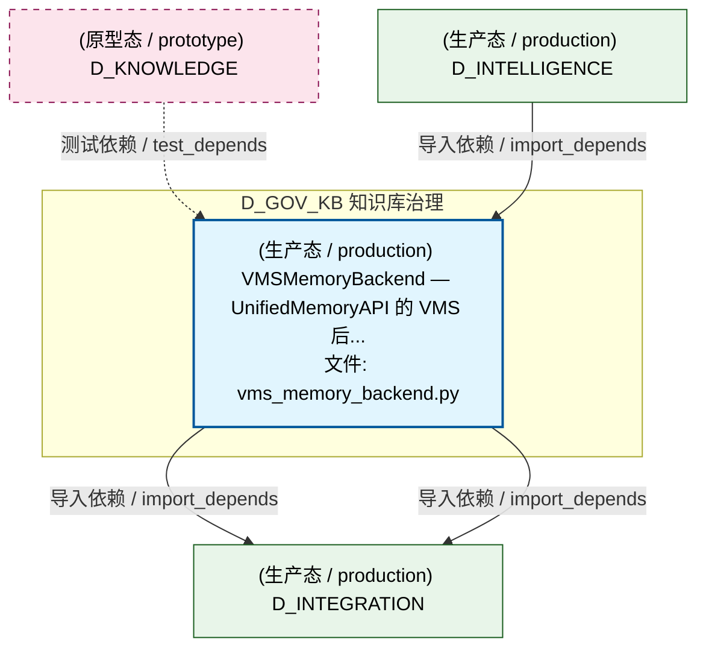
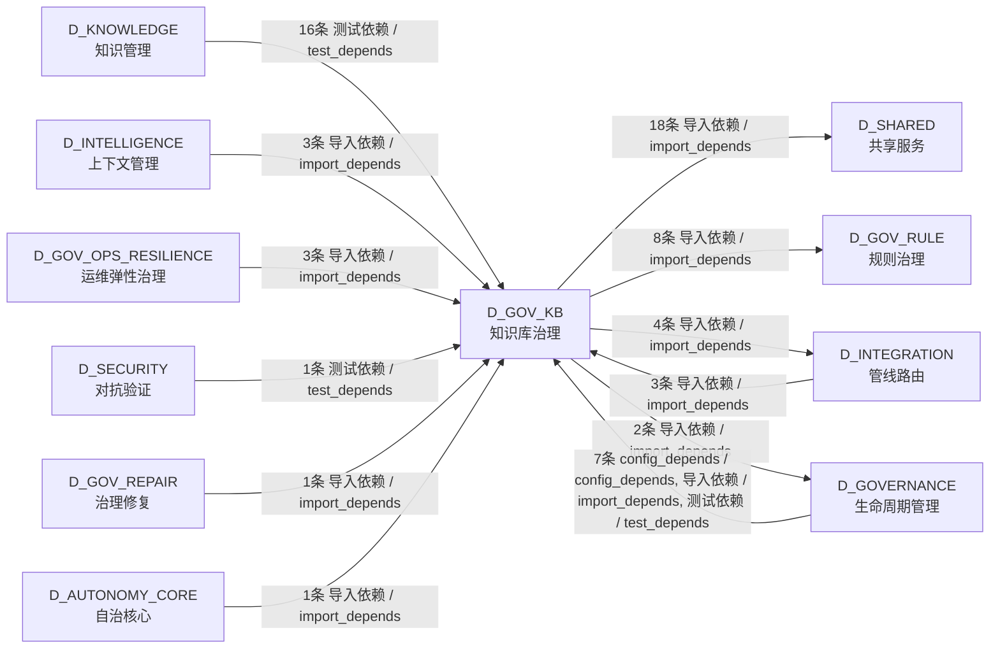

# 43_d_gov_kb / knowledge_base_governance / 知识库治理 / Knowledge Base Governance

> **功能简介 / Overview**: 知识库治理，负责知识管线、知识引擎和向量记忆后端管理

> **文档作用 / Purpose**: 展示 知识库治理（D_GOV_KB）功能域的模块清单、域内依赖关系、跨域依赖关系、架构分层视图，供架构审查和域治理参考。

> 本文档由 generate_domain_doc.py 从 depgraph (PostgreSQL) 自动生成
> 最后更新: 2026-07-17 03:58:57
> 数据源: depgraph (PostgreSQL) nodes表 + edges表

## 域基本信息 / Domain Overview

| 字段 | 值 | Field | Value |
|------|------|-------|-------|
| 编号 | 43 | Number | 43 |
| 域ID | D_GOV_KB | Domain ID | D_GOV_KB |
| 域名称 | 知识库治理 | Domain Name | Knowledge Base Governance |
| 层级 | L2 业务域层 | Layer | L2 Domain |
| 模块数 | 31 | Module Count | 31 |
| 域内依赖 | 15 | Internal Dependencies | 15 |
| 跨域入边 | 35 | Cross-domain Incoming | 35 |
| 跨域出边 | 32 | Cross-domain Outgoing | 32 |
| 设计态模块 | 0 | Design Modules | 0 |
| 原型态模块 | 14 | Prototype Modules | 14 |
| 生产态模块 | 17 | Production Modules | 17 |
| 容量 | 17/150 (正常) | Capacity | 17/150 (正常) |
| 描述 | 知识管线(ingest/triage/extract/activate/analyze) | Description | 知识管线(ingest/triage/extract/activate/analyze) |

## 模块分层清单 / Module Layered List

> 按 architecture_layer 分组的模块清单（共 31 个模块 / 31 modules）。

### L2 领域层 / Domain Layer (31 modules)

| # | 模块路径 / Module Path | 模块名称 / Module Name (功能简介 / Description) | 成熟度 / Maturity | 蓝图 / Blueprint |
|:--:|---------|---------|:---:|:---:|
| 1 | src/zephyr/gov_kb/__init__.py | __init__.py | 原型态 / prototype | [MOD-KB-001](../../03_modules/_domain_knowledge/knowledge_base/blueprint.md) |
| 2 | src/zephyr/gov_kb/_backend_protocol.py | Re-export shim — 真源在 zephyr.gov_kb.storage.... | 生产态 / production | [MOD-KB-001](../../03_modules/_domain_knowledge/knowledge_base/blueprint.md) |
| 3 | src/zephyr/gov_kb/batch_ingest.py | Re-export shim — 真源在 zephyr.gov_kb.pipeline... | 原型态 / prototype | [MOD-KB-001](../../03_modules/_domain_knowledge/knowledge_base/blueprint.md) |
| 4 | src/zephyr/gov_kb/bootstrap.py | 冷启动引导引擎 — 从存量文档自动生成首批KE（T-M... | 生产态 / production | [MOD-KB-001](../../03_modules/_domain_knowledge/knowledge_base/blueprint.md) |
| 5 | src/zephyr/gov_kb/embedding_migrate.py | EmbeddingMigrate · Embedding 版本管理 + 迁移管线 | 生产态 / production | [MOD-KB-001](../../03_modules/_domain_knowledge/knowledge_base/blueprint.md) |
| 6 | src/zephyr/gov_kb/filing_nlp_engine/__init__.py | __init__.py | 原型态 / prototype | [MOD-KB-001](../../03_modules/_domain_knowledge/knowledge_base/blueprint.md) |
| 7 | src/zephyr/gov_kb/freeze.py | 紧急冻结/解冻/安全模式断路器 | 生产态 / production | [MOD-KB-001](../../03_modules/_domain_knowledge/knowledge_base/blueprint.md) |
| 8 | src/zephyr/gov_kb/graph_validator.py | 知识图谱完整性校验器（T-2-11-C） | 生产态 / production | [MOD-KB-001](../../03_modules/_domain_knowledge/knowledge_base/blueprint.md) |
| 9 | src/zephyr/gov_kb/ingest.py | G1 Ingest 门禁 — 知识流水线入口校验（T-2-13-A） | 生产态 / production | [MOD-KB-001](../../03_modules/_domain_knowledge/knowledge_base/blueprint.md) |
| 10 | src/zephyr/gov_kb/integrity.py | SHA256源码manifest + CI防篡改检测 | 原型态 / prototype | [MOD-KB-001](../../03_modules/_domain_knowledge/knowledge_base/blueprint.md) |
| 11 | src/zephyr/gov_kb/kb_engine/kb_gate_task.py | Re-export shim — 真源在 zephyr.gov_kb.kb_gate_... | 原型态 / prototype | [MOD-KB-001](../../03_modules/_domain_knowledge/knowledge_base/blueprint.md) |
| 12 | src/zephyr/gov_kb/kb_gate_task.py | KB 五阶段门禁 evaluate 用的最小合法 Task（对齐 ... | 生产态 / production | [MOD-KB-001](../../03_modules/_domain_knowledge/knowledge_base/blueprint.md) |
| 13 | src/zephyr/gov_kb/ke_tombstone.py | SQLite墓碑表 + G2向量去重 | 生产态 / production | [MOD-KB-001](../../03_modules/_domain_knowledge/knowledge_base/blueprint.md) |
| 14 | src/zephyr/gov_kb/knowledge_engine.py | knowledge_engine.py | 生产态 / production | [MOD-GOVERNANCE](../../03_modules/_domain_governance/blueprint.md) |
| 15 | src/zephyr/gov_kb/load_bearing.py | 承重KE不可变性 + 承重墙自检 | 生产态 / production | [MOD-KB-001](../../03_modules/_domain_knowledge/knowledge_base/blueprint.md) |
| 16 | src/zephyr/gov_kb/migration/kb_gate_task.py | Re-export shim — 真源在 zephyr.gov_kb.kb_gate_... | 原型态 / prototype | [MOD-KB-001](../../03_modules/_domain_knowledge/knowledge_base/blueprint.md) |
| 17 | src/zephyr/gov_kb/pipeline/activate.py | G4 Activate 门禁 — 人工激活（T-2-13-D） | 原型态 / prototype | [MOD-INF-009](../../03_modules/_cross_layer/pipeline/blueprint.md) |
| 18 | src/zephyr/gov_kb/pipeline/analyze.py | G3 Evaluate 门禁 — 深度评估（T-2-13-C） | 生产态 / production | [MOD-INF-009](../../03_modules/_cross_layer/pipeline/blueprint.md) |
| 19 | src/zephyr/gov_kb/pipeline/batch_ingest.py | 批量入库 — scaffold P0/P1 知识候选批量入库（T-... | 原型态 / prototype | [MOD-INF-009](../../03_modules/_cross_layer/pipeline/blueprint.md) |
| 20 | src/zephyr/gov_kb/pipeline/extract.py | G5 Extract 门禁 — 知识升格（T-2-13-E） | 生产态 / production | [MOD-INF-009](../../03_modules/_cross_layer/pipeline/blueprint.md) |
| 21 | src/zephyr/gov_kb/quiet_period_monitor.py | 每日静默期检测 + 管道健康自检 | 生产态 / production | [MOD-KB-001](../../03_modules/_domain_knowledge/knowledge_base/blueprint.md) |
| 22 | src/zephyr/gov_kb/reranker.py | Cross-Encoder 重排序层 — BGE-reranker-v2-m3（T... | 原型态 / prototype | [MOD-KB-001](../../03_modules/_domain_knowledge/knowledge_base/blueprint.md) |
| 23 | src/zephyr/gov_kb/safety_brake.py | 冷静期引擎 + 魔鬼代言人 + 影响评估 | 生产态 / production | [MOD-KB-001](../../03_modules/_domain_knowledge/knowledge_base/blueprint.md) |
| 24 | src/zephyr/gov_kb/self_test.py | KB 13项一键体检 + --self-test入口 | 生产态 / production | [MOD-KB-001](../../03_modules/_domain_knowledge/knowledge_base/blueprint.md) |
| 25 | src/zephyr/gov_kb/sentiment_engine/__init__.py | __init__.py | 原型态 / prototype | [MOD-KB-001](../../03_modules/_domain_knowledge/knowledge_base/blueprint.md) |
| 26 | src/zephyr/gov_kb/storage/_backend_protocol.py | Backend protocol & shared data classes for the ... | 原型态 / prototype | [MOD-KB-001](../../03_modules/_domain_knowledge/knowledge_base/blueprint.md) |
| 27 | src/zephyr/gov_kb/storage/unified_memory_api.py | UnifiedMemoryAPI — RI-02 统一记忆 API（M2 跨模... | 原型态 / prototype | [MOD-KB-001](../../03_modules/_domain_knowledge/knowledge_base/blueprint.md) |
| 28 | src/zephyr/gov_kb/supply_chain_graph_engine/__init__.py | __init__.py | 原型态 / prototype | [MOD-KB-001](../../03_modules/_domain_knowledge/knowledge_base/blueprint.md) |
| 29 | src/zephyr/gov_kb/unified_memory_api.py | SRC-0042: Re-export shim -> 真源在 kb/storage/u... | 原型态 / prototype | [MOD-KB-001](../../03_modules/_domain_knowledge/knowledge_base/blueprint.md) |
| 30 | src/zephyr/gov_kb/verify.py | 确定性事实核查 — 取代AI猜测 | 生产态 / production | [MOD-KB-001](../../03_modules/_domain_knowledge/knowledge_base/blueprint.md) |
| 31 | src/zephyr/gov_kb/vms_memory_backend.py | VMSMemoryBackend — UnifiedMemoryAPI 的 VMS 后... | 生产态 / production | [MOD-KB-001](../../03_modules/_domain_knowledge/knowledge_base/blueprint.md) |

## 域内依赖图 / Internal Dependency Diagram

> 依赖图内嵌在本文档中，IDE 可直接渲染显示。参考 decision_index.md 设计，分四个视图：合并全景图、运营态子图、设计态子图、原型态子图（按 design_maturity 实际值拆分）。
>
> **图例说明 / Legend**：
> - **实线边框 = 运营态模块**（production，已上线运行）
> - **虚线边框 = 设计态模块**（design，蓝图阶段，代码未写）
> - **虚线边框 = 原型态模块**（prototype，代码已写，验证中未稳定上线）
> - **实线箭头 = 运营态依赖**（已生效的依赖关系）
> - **虚线箭头 = 非运营态依赖**（计划中/验证中的依赖关系）

### 合并全景图（全部模块，标签标注成熟度）

> 展示全部 31 个模块（生产态 17 + 设计态 0 + 原型态 14），标签标注成熟度。

#### 第 1 页 / 共 2 页

```mermaid
graph TD
    subgraph D_GOV_KB["D_GOV_KB 知识库治理"]
        src_zephyr_gov_kb_init_py["(原型态 / prototype) __init__.py"]
        src_zephyr_gov_kb_backend_protocol_py["(生产态 / production) Re-export shim — 真源在 zephyr.gov_kb.storage....<br/>文件: _backend_protocol.py"]
        src_zephyr_gov_kb_batch_ingest_py["(原型态 / prototype) Re-export shim — 真源在 zephyr.gov_kb.pipeline...<br/>文件: batch_ingest.py"]
        src_zephyr_gov_kb_bootstrap_py["(生产态 / production) 冷启动引导引擎 — 从存量文档自动生成首批KE（T-M...<br/>文件: bootstrap.py"]
        src_zephyr_gov_kb_embedding_migrate_py["(生产态 / production) EmbeddingMigrate · Embedding 版本管理 + 迁移管线<br/>文件: embedding_migrate.py"]
        src_zephyr_gov_kb_filing_nlp_engine_init_py["(原型态 / prototype) __init__.py"]
        src_zephyr_gov_kb_freeze_py["(生产态 / production) 紧急冻结/解冻/安全模式断路器<br/>文件: freeze.py"]
        src_zephyr_gov_kb_graph_validator_py["(生产态 / production) 知识图谱完整性校验器（T-2-11-C）<br/>文件: graph_validator.py"]
        src_zephyr_gov_kb_ingest_py["(生产态 / production) G1 Ingest 门禁 — 知识流水线入口校验（T-2-13-A）<br/>文件: ingest.py"]
        src_zephyr_gov_kb_integrity_py["(原型态 / prototype) SHA256源码manifest + CI防篡改检测<br/>文件: integrity.py"]
        src_zephyr_gov_kb_kb_engine_kb_gate_task_py["(原型态 / prototype) Re-export shim — 真源在 zephyr.gov_kb.kb_gate_...<br/>文件: kb_gate_task.py"]
        src_zephyr_gov_kb_kb_gate_task_py["(生产态 / production) KB 五阶段门禁 evaluate 用的最小合法 Task（对齐 ...<br/>文件: kb_gate_task.py"]
        src_zephyr_gov_kb_ke_tombstone_py["(生产态 / production) SQLite墓碑表 + G2向量去重<br/>文件: ke_tombstone.py"]
        src_zephyr_gov_kb_knowledge_engine_py["(生产态 / production) knowledge_engine.py"]
        src_zephyr_gov_kb_load_bearing_py["(生产态 / production) 承重KE不可变性 + 承重墙自检<br/>文件: load_bearing.py"]
        src_zephyr_gov_kb_migration_kb_gate_task_py["(原型态 / prototype) Re-export shim — 真源在 zephyr.gov_kb.kb_gate_...<br/>文件: kb_gate_task.py"]
        src_zephyr_gov_kb_pipeline_activate_py["(原型态 / prototype) G4 Activate 门禁 — 人工激活（T-2-13-D）<br/>文件: activate.py"]
        src_zephyr_gov_kb_pipeline_analyze_py["(生产态 / production) G3 Evaluate 门禁 — 深度评估（T-2-13-C）<br/>文件: analyze.py"]
        src_zephyr_gov_kb_pipeline_batch_ingest_py["(原型态 / prototype) 批量入库 — scaffold P0/P1 知识候选批量入库（T-...<br/>文件: batch_ingest.py"]
        src_zephyr_gov_kb_pipeline_extract_py["(生产态 / production) G5 Extract 门禁 — 知识升格（T-2-13-E）<br/>文件: extract.py"]
        src_zephyr_gov_kb_quiet_period_monitor_py["(生产态 / production) 每日静默期检测 + 管道健康自检<br/>文件: quiet_period_monitor.py"]
        src_zephyr_gov_kb_reranker_py["(原型态 / prototype) Cross-Encoder 重排序层 — BGE-reranker-v2-m3（T...<br/>文件: reranker.py"]
        src_zephyr_gov_kb_safety_brake_py["(生产态 / production) 冷静期引擎 + 魔鬼代言人 + 影响评估<br/>文件: safety_brake.py"]
        src_zephyr_gov_kb_self_test_py["(生产态 / production) KB 13项一键体检 + --self-test入口<br/>文件: self_test.py"]
        src_zephyr_gov_kb_sentiment_engine_init_py["(原型态 / prototype) __init__.py"]
        src_zephyr_gov_kb_storage_backend_protocol_py["(原型态 / prototype) Backend protocol & shared data classes for the ...<br/>文件: _backend_protocol.py"]
        src_zephyr_gov_kb_storage_unified_memory_api_py["(原型态 / prototype) UnifiedMemoryAPI — RI-02 统一记忆 API（M2 跨模...<br/>文件: unified_memory_api.py"]
        src_zephyr_gov_kb_supply_chain_graph_engine_init_py["(原型态 / prototype) __init__.py"]
        src_zephyr_gov_kb_unified_memory_api_py["(原型态 / prototype) SRC-0042: Re-export shim -> 真源在 kb/storage/u...<br/>文件: unified_memory_api.py"]
        src_zephyr_gov_kb_verify_py["(生产态 / production) 确定性事实核查 — 取代AI猜测<br/>文件: verify.py"]
    end
    src_zephyr_gov_kb_batch_ingest_py -.->|导入依赖 / import_depends| src_zephyr_gov_kb_pipeline_batch_ingest_py
    src_zephyr_gov_kb_bootstrap_py -->|导入依赖 / import_depends| src_zephyr_gov_kb_ingest_py
    src_zephyr_gov_kb_ingest_py -->|导入依赖 / import_depends| src_zephyr_gov_kb_kb_gate_task_py
    src_zephyr_gov_kb_unified_memory_api_py -.->|导入依赖 / import_depends| src_zephyr_gov_kb_storage_unified_memory_api_py
    src_zephyr_gov_kb_backend_protocol_py -.->|导入依赖 / import_depends| src_zephyr_gov_kb_storage_backend_protocol_py
    src_zephyr_gov_kb_init_py -.->|config_depends / config_depends| src_zephyr_gov_kb_batch_ingest_py
    src_zephyr_gov_kb_migration_kb_gate_task_py -.->|导入依赖 / import_depends| src_zephyr_gov_kb_kb_gate_task_py
    src_zephyr_gov_kb_kb_engine_kb_gate_task_py -.->|导入依赖 / import_depends| src_zephyr_gov_kb_kb_gate_task_py
    src_zephyr_gov_kb_pipeline_activate_py -.->|导入依赖 / import_depends| src_zephyr_gov_kb_kb_gate_task_py
    src_zephyr_gov_kb_pipeline_analyze_py -->|导入依赖 / import_depends| src_zephyr_gov_kb_kb_gate_task_py
    src_zephyr_gov_kb_pipeline_batch_ingest_py -.->|导入依赖 / import_depends| src_zephyr_gov_kb_ingest_py
    src_zephyr_gov_kb_pipeline_extract_py -->|导入依赖 / import_depends| src_zephyr_gov_kb_kb_gate_task_py
    src_zephyr_gov_kb_storage_unified_memory_api_py -.->|导入依赖 / import_depends| src_zephyr_gov_kb_storage_backend_protocol_py
    D_GOVERNANCE["(生产态 / production) D_GOVERNANCE"]
    src_zephyr_gov_kb_self_test_py -->|导入依赖 / import_depends| D_GOVERNANCE
    D_SHARED["(原型态 / prototype) D_SHARED"]
    src_zephyr_gov_kb_pipeline_activate_py -.->|导入依赖 / import_depends| D_SHARED
    src_zephyr_gov_kb_self_test_py -->|导入依赖 / import_depends| D_SHARED
    src_zephyr_gov_kb_ingest_py -.->|导入依赖 / import_depends| D_SHARED
    src_zephyr_gov_kb_ke_tombstone_py -->|导入依赖 / import_depends| D_GOVERNANCE
    D_GOV_RULE["(生产态 / production) D_GOV_RULE"]
    src_zephyr_gov_kb_pipeline_extract_py -->|导入依赖 / import_depends| D_GOV_RULE
    src_zephyr_gov_kb_pipeline_extract_py -->|导入依赖 / import_depends| D_GOV_RULE
    src_zephyr_gov_kb_pipeline_analyze_py -->|导入依赖 / import_depends| D_GOV_RULE
    src_zephyr_gov_kb_pipeline_analyze_py -->|导入依赖 / import_depends| D_GOV_RULE
    src_zephyr_gov_kb_pipeline_batch_ingest_py -.->|导入依赖 / import_depends| D_SHARED
    src_zephyr_gov_kb_pipeline_activate_py -.->|导入依赖 / import_depends| D_GOV_RULE
    src_zephyr_gov_kb_safety_brake_py -->|导入依赖 / import_depends| D_SHARED
    src_zephyr_gov_kb_quiet_period_monitor_py -->|导入依赖 / import_depends| D_SHARED
    src_zephyr_gov_kb_verify_py -->|导入依赖 / import_depends| D_SHARED
    src_zephyr_gov_kb_pipeline_activate_py -.->|导入依赖 / import_depends| D_GOV_RULE
    D_KNOWLEDGE["(原型态 / prototype) D_KNOWLEDGE"]
    D_KNOWLEDGE -.->|测试依赖 / test_depends| src_zephyr_gov_kb_self_test_py
    D_INTEGRATION["(生产态 / production) D_INTEGRATION"]
    D_INTEGRATION -.->|导入依赖 / import_depends| src_zephyr_gov_kb_unified_memory_api_py
    D_INTEGRATION -.->|导入依赖 / import_depends| src_zephyr_gov_kb_unified_memory_api_py
    D_GOVERNANCE -.->|测试依赖 / test_depends| src_zephyr_gov_kb_quiet_period_monitor_py
    D_GOVERNANCE -.->|测试依赖 / test_depends| src_zephyr_gov_kb_load_bearing_py
    D_KNOWLEDGE -.->|测试依赖 / test_depends| src_zephyr_gov_kb_pipeline_analyze_py
    D_KNOWLEDGE -.->|测试依赖 / test_depends| src_zephyr_gov_kb_bootstrap_py
    D_KNOWLEDGE -.->|测试依赖 / test_depends| src_zephyr_gov_kb_pipeline_extract_py
    D_KNOWLEDGE -.->|测试依赖 / test_depends| src_zephyr_gov_kb_embedding_migrate_py
    D_KNOWLEDGE -.->|测试依赖 / test_depends| src_zephyr_gov_kb_backend_protocol_py
    D_KNOWLEDGE -.->|测试依赖 / test_depends| src_zephyr_gov_kb_backend_protocol_py
    D_KNOWLEDGE -.->|测试依赖 / test_depends| src_zephyr_gov_kb_backend_protocol_py
    D_KNOWLEDGE -.->|测试依赖 / test_depends| src_zephyr_gov_kb_ke_tombstone_py
    D_SECURITY["(原型态 / prototype) D_SECURITY"]
    D_SECURITY -.->|测试依赖 / test_depends| src_zephyr_gov_kb_safety_brake_py
    D_GOV_REPAIR["(生产态 / production) D_GOV_REPAIR"]
    D_GOV_REPAIR -->|导入依赖 / import_depends| src_zephyr_gov_kb_knowledge_engine_py
    classDef production fill:#e1f5fe,stroke:#01579b,stroke-width:2px,color:#000
    classDef design fill:#fff3e0,stroke:#e65100,stroke-width:2px,color:#000,stroke-dasharray: 5 5
    classDef external_prod fill:#e8f5e9,stroke:#1b5e20,stroke-width:1px,color:#000
    classDef external_design fill:#fce4ec,stroke:#880e4f,stroke-width:1px,color:#000,stroke-dasharray: 5 5
    class src_zephyr_gov_kb_backend_protocol_py,src_zephyr_gov_kb_bootstrap_py,src_zephyr_gov_kb_embedding_migrate_py,src_zephyr_gov_kb_freeze_py,src_zephyr_gov_kb_graph_validator_py,src_zephyr_gov_kb_ingest_py,src_zephyr_gov_kb_kb_gate_task_py,src_zephyr_gov_kb_ke_tombstone_py,src_zephyr_gov_kb_knowledge_engine_py,src_zephyr_gov_kb_load_bearing_py,src_zephyr_gov_kb_pipeline_analyze_py,src_zephyr_gov_kb_pipeline_extract_py,src_zephyr_gov_kb_quiet_period_monitor_py,src_zephyr_gov_kb_safety_brake_py,src_zephyr_gov_kb_self_test_py,src_zephyr_gov_kb_verify_py production
    class src_zephyr_gov_kb_init_py,src_zephyr_gov_kb_batch_ingest_py,src_zephyr_gov_kb_filing_nlp_engine_init_py,src_zephyr_gov_kb_integrity_py,src_zephyr_gov_kb_kb_engine_kb_gate_task_py,src_zephyr_gov_kb_migration_kb_gate_task_py,src_zephyr_gov_kb_pipeline_activate_py,src_zephyr_gov_kb_pipeline_batch_ingest_py,src_zephyr_gov_kb_reranker_py,src_zephyr_gov_kb_sentiment_engine_init_py,src_zephyr_gov_kb_storage_backend_protocol_py,src_zephyr_gov_kb_storage_unified_memory_api_py,src_zephyr_gov_kb_supply_chain_graph_engine_init_py,src_zephyr_gov_kb_unified_memory_api_py design
    class D_GOVERNANCE,D_GOV_RULE,D_INTEGRATION,D_GOV_REPAIR external_prod
    class D_SHARED,D_KNOWLEDGE,D_SECURITY external_design
```

#### 第 2 页 / 共 2 页

### 运营态子图（仅 design_maturity=production 的模块和依赖）

> 仅展示已上线运行的模块（共 17 个，5 条域内依赖）。

```mermaid
graph TD
    subgraph D_GOV_KB["D_GOV_KB 知识库治理"]
        src_zephyr_gov_kb_backend_protocol_py["(生产态 / production) Re-export shim — 真源在 zephyr.gov_kb.storage....<br/>文件: _backend_protocol.py"]
        src_zephyr_gov_kb_bootstrap_py["(生产态 / production) 冷启动引导引擎 — 从存量文档自动生成首批KE（T-M...<br/>文件: bootstrap.py"]
        src_zephyr_gov_kb_embedding_migrate_py["(生产态 / production) EmbeddingMigrate · Embedding 版本管理 + 迁移管线<br/>文件: embedding_migrate.py"]
        src_zephyr_gov_kb_freeze_py["(生产态 / production) 紧急冻结/解冻/安全模式断路器<br/>文件: freeze.py"]
        src_zephyr_gov_kb_graph_validator_py["(生产态 / production) 知识图谱完整性校验器（T-2-11-C）<br/>文件: graph_validator.py"]
        src_zephyr_gov_kb_ingest_py["(生产态 / production) G1 Ingest 门禁 — 知识流水线入口校验（T-2-13-A）<br/>文件: ingest.py"]
        src_zephyr_gov_kb_kb_gate_task_py["(生产态 / production) KB 五阶段门禁 evaluate 用的最小合法 Task（对齐 ...<br/>文件: kb_gate_task.py"]
        src_zephyr_gov_kb_ke_tombstone_py["(生产态 / production) SQLite墓碑表 + G2向量去重<br/>文件: ke_tombstone.py"]
        src_zephyr_gov_kb_knowledge_engine_py["(生产态 / production) knowledge_engine.py"]
        src_zephyr_gov_kb_load_bearing_py["(生产态 / production) 承重KE不可变性 + 承重墙自检<br/>文件: load_bearing.py"]
        src_zephyr_gov_kb_pipeline_analyze_py["(生产态 / production) G3 Evaluate 门禁 — 深度评估（T-2-13-C）<br/>文件: analyze.py"]
        src_zephyr_gov_kb_pipeline_extract_py["(生产态 / production) G5 Extract 门禁 — 知识升格（T-2-13-E）<br/>文件: extract.py"]
        src_zephyr_gov_kb_quiet_period_monitor_py["(生产态 / production) 每日静默期检测 + 管道健康自检<br/>文件: quiet_period_monitor.py"]
        src_zephyr_gov_kb_safety_brake_py["(生产态 / production) 冷静期引擎 + 魔鬼代言人 + 影响评估<br/>文件: safety_brake.py"]
        src_zephyr_gov_kb_self_test_py["(生产态 / production) KB 13项一键体检 + --self-test入口<br/>文件: self_test.py"]
        src_zephyr_gov_kb_verify_py["(生产态 / production) 确定性事实核查 — 取代AI猜测<br/>文件: verify.py"]
        src_zephyr_gov_kb_vms_memory_backend_py["(生产态 / production) VMSMemoryBackend — UnifiedMemoryAPI 的 VMS 后...<br/>文件: vms_memory_backend.py"]
    end
    src_zephyr_gov_kb_bootstrap_py -->|导入依赖 / import_depends| src_zephyr_gov_kb_ingest_py
    src_zephyr_gov_kb_ingest_py -->|导入依赖 / import_depends| src_zephyr_gov_kb_kb_gate_task_py
    src_zephyr_gov_kb_vms_memory_backend_py -->|导入依赖 / import_depends| src_zephyr_gov_kb_backend_protocol_py
    src_zephyr_gov_kb_pipeline_analyze_py -->|导入依赖 / import_depends| src_zephyr_gov_kb_kb_gate_task_py
    src_zephyr_gov_kb_pipeline_extract_py -->|导入依赖 / import_depends| src_zephyr_gov_kb_kb_gate_task_py
    D_INTEGRATION["(生产态 / production) D_INTEGRATION"]
    src_zephyr_gov_kb_embedding_migrate_py -->|导入依赖 / import_depends| D_INTEGRATION
    D_SHARED["(生产态 / production) D_SHARED"]
    src_zephyr_gov_kb_freeze_py -->|导入依赖 / import_depends| D_SHARED
    D_GOV_RULE["(生产态 / production) D_GOV_RULE"]
    src_zephyr_gov_kb_ingest_py -->|导入依赖 / import_depends| D_GOV_RULE
    src_zephyr_gov_kb_ingest_py -->|导入依赖 / import_depends| D_GOV_RULE
    src_zephyr_gov_kb_ingest_py -.->|导入依赖 / import_depends| D_SHARED
    src_zephyr_gov_kb_graph_validator_py -->|导入依赖 / import_depends| D_SHARED
    src_zephyr_gov_kb_graph_validator_py -.->|导入依赖 / import_depends| D_SHARED
    src_zephyr_gov_kb_graph_validator_py -->|导入依赖 / import_depends| D_SHARED
    src_zephyr_gov_kb_kb_gate_task_py -->|导入依赖 / import_depends| D_SHARED
    src_zephyr_gov_kb_kb_gate_task_py -->|导入依赖 / import_depends| D_INTEGRATION
    src_zephyr_gov_kb_ke_tombstone_py -->|导入依赖 / import_depends| D_SHARED
    D_GOVERNANCE["(生产态 / production) D_GOVERNANCE"]
    src_zephyr_gov_kb_ke_tombstone_py -->|导入依赖 / import_depends| D_GOVERNANCE
    src_zephyr_gov_kb_load_bearing_py -->|导入依赖 / import_depends| D_SHARED
    src_zephyr_gov_kb_quiet_period_monitor_py -->|导入依赖 / import_depends| D_SHARED
    src_zephyr_gov_kb_quiet_period_monitor_py -->|导入依赖 / import_depends| D_SHARED
    D_KNOWLEDGE["(原型态 / prototype) D_KNOWLEDGE"]
    D_KNOWLEDGE -.->|测试依赖 / test_depends| src_zephyr_gov_kb_self_test_py
    D_GOVERNANCE -.->|测试依赖 / test_depends| src_zephyr_gov_kb_quiet_period_monitor_py
    D_GOVERNANCE -.->|测试依赖 / test_depends| src_zephyr_gov_kb_load_bearing_py
    D_KNOWLEDGE -.->|测试依赖 / test_depends| src_zephyr_gov_kb_pipeline_analyze_py
    D_KNOWLEDGE -.->|测试依赖 / test_depends| src_zephyr_gov_kb_bootstrap_py
    D_KNOWLEDGE -.->|测试依赖 / test_depends| src_zephyr_gov_kb_pipeline_extract_py
    D_KNOWLEDGE -.->|测试依赖 / test_depends| src_zephyr_gov_kb_embedding_migrate_py
    D_KNOWLEDGE -.->|测试依赖 / test_depends| src_zephyr_gov_kb_backend_protocol_py
    D_KNOWLEDGE -.->|测试依赖 / test_depends| src_zephyr_gov_kb_backend_protocol_py
    D_KNOWLEDGE -.->|测试依赖 / test_depends| src_zephyr_gov_kb_backend_protocol_py
    D_KNOWLEDGE -.->|测试依赖 / test_depends| src_zephyr_gov_kb_vms_memory_backend_py
    D_KNOWLEDGE -.->|测试依赖 / test_depends| src_zephyr_gov_kb_ke_tombstone_py
    D_SECURITY["(原型态 / prototype) D_SECURITY"]
    D_SECURITY -.->|测试依赖 / test_depends| src_zephyr_gov_kb_safety_brake_py
    D_GOV_REPAIR["(生产态 / production) D_GOV_REPAIR"]
    D_GOV_REPAIR -->|导入依赖 / import_depends| src_zephyr_gov_kb_knowledge_engine_py
    D_INTELLIGENCE["(生产态 / production) D_INTELLIGENCE"]
    D_INTELLIGENCE -->|导入依赖 / import_depends| src_zephyr_gov_kb_kb_gate_task_py
    classDef production fill:#e1f5fe,stroke:#01579b,stroke-width:2px,color:#000
    classDef design fill:#fff3e0,stroke:#e65100,stroke-width:2px,color:#000,stroke-dasharray: 5 5
    classDef external_prod fill:#e8f5e9,stroke:#1b5e20,stroke-width:1px,color:#000
    classDef external_design fill:#fce4ec,stroke:#880e4f,stroke-width:1px,color:#000,stroke-dasharray: 5 5
    class src_zephyr_gov_kb_backend_protocol_py,src_zephyr_gov_kb_bootstrap_py,src_zephyr_gov_kb_embedding_migrate_py,src_zephyr_gov_kb_freeze_py,src_zephyr_gov_kb_graph_validator_py,src_zephyr_gov_kb_ingest_py,src_zephyr_gov_kb_kb_gate_task_py,src_zephyr_gov_kb_ke_tombstone_py,src_zephyr_gov_kb_knowledge_engine_py,src_zephyr_gov_kb_load_bearing_py,src_zephyr_gov_kb_pipeline_analyze_py,src_zephyr_gov_kb_pipeline_extract_py,src_zephyr_gov_kb_quiet_period_monitor_py,src_zephyr_gov_kb_safety_brake_py,src_zephyr_gov_kb_self_test_py,src_zephyr_gov_kb_verify_py,src_zephyr_gov_kb_vms_memory_backend_py production
    class D_INTEGRATION,D_SHARED,D_GOV_RULE,D_GOVERNANCE,D_GOV_REPAIR,D_INTELLIGENCE external_prod
    class D_KNOWLEDGE,D_SECURITY external_design
```

### 设计态子图（仅 design_maturity=design 的模块和依赖）

> 仅展示蓝图阶段、代码未写的设计态模块（共 0 个，0 条域内依赖）。

> （无设计态模块 / No design modules）

### 原型态子图（仅 design_maturity=prototype 的模块和依赖）

> 仅展示代码已写、验证中未稳定上线的原型态模块（共 14 个，4 条域内依赖）。

```mermaid
graph TD
    subgraph D_GOV_KB["D_GOV_KB 知识库治理"]
        src_zephyr_gov_kb_init_py["(原型态 / prototype) __init__.py"]
        src_zephyr_gov_kb_batch_ingest_py["(原型态 / prototype) Re-export shim — 真源在 zephyr.gov_kb.pipeline...<br/>文件: batch_ingest.py"]
        src_zephyr_gov_kb_filing_nlp_engine_init_py["(原型态 / prototype) __init__.py"]
        src_zephyr_gov_kb_integrity_py["(原型态 / prototype) SHA256源码manifest + CI防篡改检测<br/>文件: integrity.py"]
        src_zephyr_gov_kb_kb_engine_kb_gate_task_py["(原型态 / prototype) Re-export shim — 真源在 zephyr.gov_kb.kb_gate_...<br/>文件: kb_gate_task.py"]
        src_zephyr_gov_kb_migration_kb_gate_task_py["(原型态 / prototype) Re-export shim — 真源在 zephyr.gov_kb.kb_gate_...<br/>文件: kb_gate_task.py"]
        src_zephyr_gov_kb_pipeline_activate_py["(原型态 / prototype) G4 Activate 门禁 — 人工激活（T-2-13-D）<br/>文件: activate.py"]
        src_zephyr_gov_kb_pipeline_batch_ingest_py["(原型态 / prototype) 批量入库 — scaffold P0/P1 知识候选批量入库（T-...<br/>文件: batch_ingest.py"]
        src_zephyr_gov_kb_reranker_py["(原型态 / prototype) Cross-Encoder 重排序层 — BGE-reranker-v2-m3（T...<br/>文件: reranker.py"]
        src_zephyr_gov_kb_sentiment_engine_init_py["(原型态 / prototype) __init__.py"]
        src_zephyr_gov_kb_storage_backend_protocol_py["(原型态 / prototype) Backend protocol & shared data classes for the ...<br/>文件: _backend_protocol.py"]
        src_zephyr_gov_kb_storage_unified_memory_api_py["(原型态 / prototype) UnifiedMemoryAPI — RI-02 统一记忆 API（M2 跨模...<br/>文件: unified_memory_api.py"]
        src_zephyr_gov_kb_supply_chain_graph_engine_init_py["(原型态 / prototype) __init__.py"]
        src_zephyr_gov_kb_unified_memory_api_py["(原型态 / prototype) SRC-0042: Re-export shim -> 真源在 kb/storage/u...<br/>文件: unified_memory_api.py"]
    end
    src_zephyr_gov_kb_batch_ingest_py -.->|导入依赖 / import_depends| src_zephyr_gov_kb_pipeline_batch_ingest_py
    src_zephyr_gov_kb_unified_memory_api_py -.->|导入依赖 / import_depends| src_zephyr_gov_kb_storage_unified_memory_api_py
    src_zephyr_gov_kb_init_py -.->|config_depends / config_depends| src_zephyr_gov_kb_batch_ingest_py
    src_zephyr_gov_kb_storage_unified_memory_api_py -.->|导入依赖 / import_depends| src_zephyr_gov_kb_storage_backend_protocol_py
    D_SHARED["(生产态 / production) D_SHARED"]
    src_zephyr_gov_kb_integrity_py -.->|导入依赖 / import_depends| D_SHARED
    D_GOV_RULE["(生产态 / production) D_GOV_RULE"]
    src_zephyr_gov_kb_pipeline_activate_py -.->|导入依赖 / import_depends| D_GOV_RULE
    src_zephyr_gov_kb_pipeline_activate_py -.->|导入依赖 / import_depends| D_GOV_RULE
    src_zephyr_gov_kb_pipeline_activate_py -.->|导入依赖 / import_depends| D_SHARED
    src_zephyr_gov_kb_pipeline_batch_ingest_py -.->|导入依赖 / import_depends| D_SHARED
    src_zephyr_gov_kb_storage_unified_memory_api_py -.->|导入依赖 / import_depends| D_SHARED
    D_GOV_OPS_RESILIENCE["(原型态 / prototype) D_GOV_OPS_RESILIENCE"]
    D_GOV_OPS_RESILIENCE -.->|导入依赖 / import_depends| src_zephyr_gov_kb_reranker_py
    D_INTEGRATION["(生产态 / production) D_INTEGRATION"]
    D_INTEGRATION -.->|导入依赖 / import_depends| src_zephyr_gov_kb_unified_memory_api_py
    D_INTEGRATION -.->|导入依赖 / import_depends| src_zephyr_gov_kb_unified_memory_api_py
    D_INTEGRATION -.->|导入依赖 / import_depends| src_zephyr_gov_kb_unified_memory_api_py
    D_GOVERNANCE["(原型态 / prototype) D_GOVERNANCE"]
    D_GOVERNANCE -.->|config_depends / config_depends| src_zephyr_gov_kb_migration_kb_gate_task_py
    D_GOVERNANCE -.->|config_depends / config_depends| src_zephyr_gov_kb_kb_engine_kb_gate_task_py
    D_GOVERNANCE -.->|config_depends / config_depends| src_zephyr_gov_kb_pipeline_activate_py
    D_GOVERNANCE -.->|config_depends / config_depends| src_zephyr_gov_kb_storage_unified_memory_api_py
    classDef production fill:#e1f5fe,stroke:#01579b,stroke-width:2px,color:#000
    classDef design fill:#fff3e0,stroke:#e65100,stroke-width:2px,color:#000,stroke-dasharray: 5 5
    classDef external_prod fill:#e8f5e9,stroke:#1b5e20,stroke-width:1px,color:#000
    classDef external_design fill:#fce4ec,stroke:#880e4f,stroke-width:1px,color:#000,stroke-dasharray: 5 5
    class src_zephyr_gov_kb_init_py,src_zephyr_gov_kb_batch_ingest_py,src_zephyr_gov_kb_filing_nlp_engine_init_py,src_zephyr_gov_kb_integrity_py,src_zephyr_gov_kb_kb_engine_kb_gate_task_py,src_zephyr_gov_kb_migration_kb_gate_task_py,src_zephyr_gov_kb_pipeline_activate_py,src_zephyr_gov_kb_pipeline_batch_ingest_py,src_zephyr_gov_kb_reranker_py,src_zephyr_gov_kb_sentiment_engine_init_py,src_zephyr_gov_kb_storage_backend_protocol_py,src_zephyr_gov_kb_storage_unified_memory_api_py,src_zephyr_gov_kb_supply_chain_graph_engine_init_py,src_zephyr_gov_kb_unified_memory_api_py design
    class D_SHARED,D_GOV_RULE,D_INTEGRATION external_prod
    class D_GOV_OPS_RESILIENCE,D_GOVERNANCE external_design
```

## 跨域依赖 / Cross-domain Dependencies

### 本域依赖的其他域（出边）/ Depends On

| # | 本域模块 / Source Module | → | 外部域-目标模块 / Target Module | 依赖类型 / Type |
|:--:|---------|:--:|---------|---------|
| 1 | SQLite墓碑表 + G2向量去重 (ke_tombstone.py) | → | D_GOVERNANCE 生命周期管理: SQLite 元数据层 Schema DDL + 版本化迁移框架（T-... | 导入依赖 / import_depends |
| 2 | KB 13项一键体检 + --self-test入口 (self_test.py) | → | D_GOVERNANCE 生命周期管理: SQLite 元数据层 Schema DDL + 版本化迁移框架（T-... | 导入依赖 / import_depends |
| 3 | G1 Ingest 门禁 — 知识流水线入口校验（T-2-13-A... | → | D_GOV_RULE 规则治理: GateEngine — KMS G1-G6 + Orc G0/G7 + 交易 G10-... | 导入依赖 / import_depends |
| 4 | G1 Ingest 门禁 — 知识流水线入口校验（T-2-13-A... | → | D_GOV_RULE 规则治理: gate_types.py | 导入依赖 / import_depends |
| 5 | G4 Activate 门禁 — 人工激活（T-2-13-D） (activ... | → | D_GOV_RULE 规则治理: GateEngine — KMS G1-G6 + Orc G0/G7 + 交易 G10-... | 导入依赖 / import_depends |
| 6 | G4 Activate 门禁 — 人工激活（T-2-13-D） (activ... | → | D_GOV_RULE 规则治理: gate_types.py | 导入依赖 / import_depends |
| 7 | G3 Evaluate 门禁 — 深度评估（T-2-13-C） (analy... | → | D_GOV_RULE 规则治理: GateEngine — KMS G1-G6 + Orc G0/G7 + 交易 G10-... | 导入依赖 / import_depends |
| 8 | G3 Evaluate 门禁 — 深度评估（T-2-13-C） (analy... | → | D_GOV_RULE 规则治理: gate_types.py | 导入依赖 / import_depends |
| 9 | G5 Extract 门禁 — 知识升格（T-2-13-E） (extrac... | → | D_GOV_RULE 规则治理: GateEngine — KMS G1-G6 + Orc G0/G7 + 交易 G10-... | 导入依赖 / import_depends |
| 10 | G5 Extract 门禁 — 知识升格（T-2-13-E） (extrac... | → | D_GOV_RULE 规则治理: gate_types.py | 导入依赖 / import_depends |
| 11 | EmbeddingMigrate · Embedding 版本管理 + 迁移管... | → | D_INTEGRATION 管线路由: schemas.py | 导入依赖 / import_depends |
| 12 | KB 五阶段门禁 evaluate 用的最小合法 Task（对齐 ... | → | D_INTEGRATION 管线路由: severity_types.py | 导入依赖 / import_depends |
| 13 | VMSMemoryBackend — UnifiedMemoryAPI 的 VMS 后.... | → | D_INTEGRATION 管线路由: BridgeLayer — MOD-INF-011 kb/ ↔ VMS 过渡桥接 ... | 导入依赖 / import_depends |
| 14 | VMSMemoryBackend — UnifiedMemoryAPI 的 VMS 后.... | → | D_INTEGRATION 管线路由: InProcessVectorMemory — MOD-INF-011 VMS 统一入... | 导入依赖 / import_depends |
| 15 | 紧急冻结/解冻/安全模式断路器 (freeze.py) | → | D_SHARED 共享服务: paths.py — 项目路径常量 SSoT（Single Source of... | 导入依赖 / import_depends |
| 16 | 知识图谱完整性校验器（T-2-11-C） (graph_validat... | → | D_SHARED 共享服务: paths.py — 项目路径常量 SSoT（Single Source of... | 导入依赖 / import_depends |
| 17 | 知识图谱完整性校验器（T-2-11-C） (graph_validat... | → | D_SHARED 共享服务: schemas.py | 导入依赖 / import_depends |
| 18 | 知识图谱完整性校验器（T-2-11-C） (graph_validat... | → | D_SHARED 共享服务: db_utils.py — SQLite 连接公共 API（SSoT: zephy... | 导入依赖 / import_depends |
| 19 | G1 Ingest 门禁 — 知识流水线入口校验（T-2-13-A... | → | D_SHARED 共享服务: async_utils.py — async/sync 边界桥接（5.12.8 .... | 导入依赖 / import_depends |
| 20 | SHA256源码manifest + CI防篡改检测 (integrity.py) | → | D_SHARED 共享服务: paths.py — 项目路径常量 SSoT（Single Source of... | 导入依赖 / import_depends |
| 21 | KB 五阶段门禁 evaluate 用的最小合法 Task（对齐 ... | → | D_SHARED 共享服务: task_types — 任务系统核心类型 re-export 层 (ta... | 导入依赖 / import_depends |
| 22 | SQLite墓碑表 + G2向量去重 (ke_tombstone.py) | → | D_SHARED 共享服务: paths.py — 项目路径常量 SSoT（Single Source of... | 导入依赖 / import_depends |
| 23 | 承重KE不可变性 + 承重墙自检 (load_bearing.py) | → | D_SHARED 共享服务: paths.py — 项目路径常量 SSoT（Single Source of... | 导入依赖 / import_depends |
| 24 | G4 Activate 门禁 — 人工激活（T-2-13-D） (activ... | → | D_SHARED 共享服务: schemas.py | 导入依赖 / import_depends |
| 25 | 批量入库 — scaffold P0/P1 知识候选批量入库（T-... | → | D_SHARED 共享服务: schemas.py | 导入依赖 / import_depends |
| 26 | 每日静默期检测 + 管道健康自检 (quiet_period_mon... | → | D_SHARED 共享服务: paths.py — 项目路径常量 SSoT（Single Source of... | 导入依赖 / import_depends |
| 27 | 每日静默期检测 + 管道健康自检 (quiet_period_mon... | → | D_SHARED 共享服务: time_utils.py —— 时间/日期工具（Phase 9 新增 ... | 导入依赖 / import_depends |
| 28 | 冷静期引擎 + 魔鬼代言人 + 影响评估 (safety_brak... | → | D_SHARED 共享服务: paths.py — 项目路径常量 SSoT（Single Source of... | 导入依赖 / import_depends |
| 29 | KB 13项一键体检 + --self-test入口 (self_test.py) | → | D_SHARED 共享服务: paths.py — 项目路径常量 SSoT（Single Source of... | 导入依赖 / import_depends |
| 30 | KB 13项一键体检 + --self-test入口 (self_test.py) | → | D_SHARED 共享服务: time_utils.py —— 时间/日期工具（Phase 9 新增 ... | 导入依赖 / import_depends |
| 31 | UnifiedMemoryAPI — RI-02 统一记忆 API（M2 跨模... | → | D_SHARED 共享服务: CBAC 能力检查器 (Capability-Based Access Contro... | 导入依赖 / import_depends |
| 32 | 确定性事实核查 — 取代AI猜测 (verify.py) | → | D_SHARED 共享服务: paths.py — 项目路径常量 SSoT（Single Source of... | 导入依赖 / import_depends |

### 依赖本域的其他域（入边）/ Depended By

| # | 外部域-源模块 / Source Module | → | 本域模块 / Target Module | 依赖类型 / Type |
|:--:|---------|:--:|---------|---------|
| 1 | D_AUTONOMY_CORE 自治核心: ContextAssembler — 上下文装配、校验、影子留档 ... | → | 冷启动引导引擎 — 从存量文档自动生成首批KE（T-M... | 导入依赖 / import_depends |
| 2 | D_GOVERNANCE 生命周期管理: KB 13项一键体检 — CLI入口薄包装 (self_test.py) | → | KB 13项一键体检 + --self-test入口 (self_test.py) | 导入依赖 / import_depends |
| 3 | D_GOVERNANCE 生命周期管理: __init__.py | → | Re-export shim — 真源在 zephyr.gov_kb.kb_gate_... | config_depends / config_depends |
| 4 | D_GOVERNANCE 生命周期管理: kb.migration — auto-generated package init. (_... | → | Re-export shim — 真源在 zephyr.gov_kb.kb_gate_... | config_depends / config_depends |
| 5 | D_GOVERNANCE 生命周期管理: kb.pipeline — auto-generated package init. (__... | → | G4 Activate 门禁 — 人工激活（T-2-13-D） (activ... | config_depends / config_depends |
| 6 | D_GOVERNANCE 生命周期管理: kb.storage — auto-generated package init. (__i... | → | UnifiedMemoryAPI — RI-02 统一记忆 API（M2 跨模... | config_depends / config_depends |
| 7 | D_GOVERNANCE 生命周期管理: test_load_bearing.py | → | 承重KE不可变性 + 承重墙自检 (load_bearing.py) | 测试依赖 / test_depends |
| 8 | D_GOVERNANCE 生命周期管理: test_quiet_period_monitor.py | → | 每日静默期检测 + 管道健康自检 (quiet_period_mon... | 测试依赖 / test_depends |
| 9 | D_GOV_OPS_RESILIENCE 运维弹性治理: G2 Triage 门禁 — 知识分类评分（T-2-13-B） (tri... | → | G1 Ingest 门禁 — 知识流水线入口校验（T-2-13-A... | 导入依赖 / import_depends |
| 10 | D_GOV_OPS_RESILIENCE 运维弹性治理: G2 Triage 门禁 — 知识分类评分（T-2-13-B） (tri... | → | KB 五阶段门禁 evaluate 用的最小合法 Task（对齐 ... | 导入依赖 / import_depends |
| 11 | D_GOV_OPS_RESILIENCE 运维弹性治理: D-DATA -> ServiceRegistry 注册模块 (service_reg... | → | Cross-Encoder 重排序层 — BGE-reranker-v2-m3（T... | 导入依赖 / import_depends |
| 12 | D_GOV_REPAIR 治理修复: Agent 治理八件套 · Governance Domain — DOM-GO... | → | knowledge_engine.py | 导入依赖 / import_depends |
| 13 | D_INTEGRATION 管线路由: KnowledgeBaseServer: 知识库语义检索 MCP Server ... | → | SRC-0042: Re-export shim -> 真源在 kb/storage/u... | 导入依赖 / import_depends |
| 14 | D_INTEGRATION 管线路由: Vector Memory Service (VMS) — MOD-INF-011 · v... | → | SRC-0042: Re-export shim -> 真源在 kb/storage/u... | 导入依赖 / import_depends |
| 15 | D_INTEGRATION 管线路由: DelegatedVectorMemory — VectorMemoryBase 的 RI... | → | SRC-0042: Re-export shim -> 真源在 kb/storage/u... | 导入依赖 / import_depends |
| 16 | D_INTELLIGENCE 上下文管理: G4 Activate 门禁 — 人工激活（T-2-13-D） (activ... | → | KB 五阶段门禁 evaluate 用的最小合法 Task（对齐 ... | 导入依赖 / import_depends |
| 17 | D_INTELLIGENCE 上下文管理: UnifiedMemoryAPI — RI-02 统一记忆 API（M2 跨模... | → | Re-export shim — 真源在 zephyr.gov_kb.storage.... | 导入依赖 / import_depends |
| 18 | D_INTELLIGENCE 上下文管理: UnifiedMemoryAPI — RI-02 统一记忆 API（M2 跨模... | → | VMSMemoryBackend — UnifiedMemoryAPI 的 VMS 后.... | 导入依赖 / import_depends |
| 19 | D_KNOWLEDGE 知识管理: test_kb_analyze.py | → | G3 Evaluate 门禁 — 深度评估（T-2-13-C） (analy... | 测试依赖 / test_depends |
| 20 | D_KNOWLEDGE 知识管理: test_kb_bootstrap.py | → | 冷启动引导引擎 — 从存量文档自动生成首批KE（T-M... | 测试依赖 / test_depends |
| 21 | D_KNOWLEDGE 知识管理: test_kb_embedding_migrate.py | → | EmbeddingMigrate · Embedding 版本管理 + 迁移管... | 测试依赖 / test_depends |
| 22 | D_KNOWLEDGE 知识管理: test_kb_extract.py | → | G5 Extract 门禁 — 知识升格（T-2-13-E） (extrac... | 测试依赖 / test_depends |
| 23 | D_KNOWLEDGE 知识管理: test_kb_freeze.py | → | 紧急冻结/解冻/安全模式断路器 (freeze.py) | 测试依赖 / test_depends |
| 24 | D_KNOWLEDGE 知识管理: test_kb_gate_task.py | → | KB 五阶段门禁 evaluate 用的最小合法 Task（对齐 ... | 测试依赖 / test_depends |
| 25 | D_KNOWLEDGE 知识管理: test_kb_graph_validator.py | → | 知识图谱完整性校验器（T-2-11-C） (graph_validat... | 测试依赖 / test_depends |
| 26 | D_KNOWLEDGE 知识管理: test_kb_migration_embedding.py | → | EmbeddingMigrate · Embedding 版本管理 + 迁移管... | 测试依赖 / test_depends |
| 27 | D_KNOWLEDGE 知识管理: test_kb_migration_gate.py | → | KB 五阶段门禁 evaluate 用的最小合法 Task（对齐 ... | 测试依赖 / test_depends |
| 28 | D_KNOWLEDGE 知识管理: test_kb_self_test.py | → | KB 13项一键体检 + --self-test入口 (self_test.py) | 测试依赖 / test_depends |
| 29 | D_KNOWLEDGE 知识管理: test_kb_storage_backend.py | → | Re-export shim — 真源在 zephyr.gov_kb.storage.... | 测试依赖 / test_depends |
| 30 | D_KNOWLEDGE 知识管理: test_kb_unified_memory_api.py | → | Re-export shim — 真源在 zephyr.gov_kb.storage.... | 测试依赖 / test_depends |
| 31 | D_KNOWLEDGE 知识管理: test_kb_verify.py | → | 确定性事实核查 — 取代AI猜测 (verify.py) | 测试依赖 / test_depends |
| 32 | D_KNOWLEDGE 知识管理: test_kb_vms_memory_backend.py | → | Re-export shim — 真源在 zephyr.gov_kb.storage.... | 测试依赖 / test_depends |
| 33 | D_KNOWLEDGE 知识管理: test_kb_vms_memory_backend.py | → | VMSMemoryBackend — UnifiedMemoryAPI 的 VMS 后.... | 测试依赖 / test_depends |
| 34 | D_KNOWLEDGE 知识管理: test_ke_tombstone.py | → | SQLite墓碑表 + G2向量去重 (ke_tombstone.py) | 测试依赖 / test_depends |
| 35 | D_SECURITY 对抗验证: test_safety_brake.py | → | 冷静期引擎 + 魔鬼代言人 + 影响评估 (safety_brak... | 测试依赖 / test_depends |

### 跨域依赖图 / Cross-domain Dependency Diagram

> 本域与 10 个外部域直接连接（出边 32 条 + 入边 35 条 = 67 条）。只显示直接连接的域，不展开具体节点。

## 说明 / Notes

- **数据源 / Data Source**: `depgraph (PostgreSQL)` 的 `nodes`、`edges`、`domains` 表
- **生成器 / Generator**: `generate_domain_doc.py`（G2+G10 合并）
- **维护方式 / Maintenance**: 自动生成，全景图更新时刷新
- **文件名规则 / File Naming**: `{编号:02d}_{域ID小写}.md`，如 `16_d_trading.md`
- **图例说明 / Legend**: `[production]`=已上线 / `[design]`=设计中 / `[prototype]`=原型 / `[unknown]`=未知
