# 43_d_ml_train / 训练

> **文档作用 / Purpose**: 展示 训练（D-ML_TRAIN）功能域的模块清单、域内依赖关系和跨域依赖关系，供架构审查和域治理参考。

> 本文档由 generate_domain_doc.py 从 depgraph.db 自动生成
> 最后更新: 2026-06-26 21:00:25
> 数据源: depgraph.db nodes表 + edges表

## 域基本信息 / Domain Overview

| 字段 | 值 | Field | Value |
|------|------|-------|-------|
| 编号 | 43 | Number | 43 |
| 域ID | D-ML_TRAIN | Domain ID | D-ML_TRAIN |
| 域名称 | 训练 | Domain Name | model_profiling |
| 层级 | L2_domain | Layer | L2_domain |
| 模块数 | 12 | Module Count | 12 |
| 域内依赖 | 5 | Internal Dependencies | 5 |
| 跨域入边 | 7 | Cross-domain Incoming | 7 |
| 跨域出边 | 4 | Cross-domain Outgoing | 4 |
| 设计态模块 | 1 | Design Modules | 1 |
| 原型态模块 | 11 | Prototype Modules | 11 |
| 生产态模块 | 0 | Production Modules | 0 |
| 容量 | 0/150 (正常) | Capacity | 0/150 (正常) |
| 描述 | 模型性能画像 | Description | 模型性能画像 |

## 模块清单 / Module List

共 12 个模块（按路径排序，全部显示）

| 模块路径 / Module Path | 模块名称 / Module Name | 设计成熟度 / Maturity | 构建状态 / Build Status |
|---------|---------|-----------|---------|
| docs/03_modules/_cross_layer/model_profiler/blueprint.md | docs__03_modules___cross_layer__model... | design | planned |
| src/zephyr/ml_train/__init__.py |  | prototype | generated |
| src/zephyr/ml_train/_extensions/__init__.py |  | prototype | deprecated |
| src/zephyr/ml_train/api/__init__.py |  | prototype | deprecated |
| src/zephyr/ml_train/core/__init__.py |  | prototype | deprecated |
| src/zephyr/ml_train/implementations/__init__.py |  | prototype | generated |
| src/zephyr/ml_train/implementations/default_inference_engine.py |  | prototype | generated |
| src/zephyr/ml_train/inference_base.py |  | prototype | generated |
| src/zephyr/ml_train/infrastructure/__init__.py |  | prototype | deprecated |
| src/zephyr/ml_train/models/__init__.py |  | prototype | deprecated |
| src/zephyr/ml_train/services/__init__.py |  | prototype | deprecated |
| src/zephyr/ml_train/trainer_base.py |  | prototype | generated |

## 域内依赖图 / Internal Dependency Diagram

> 依赖图内嵌在本文档中，IDE 可直接渲染显示。每30个节点一组分页显示。
>
> **图例说明 / Legend**：
> - **实线边框 = 运营态模块**（production，已上线运行）
> - **虚线边框 = 设计态模块**（design，还在设计中）
> - **实线箭头 = 运营态依赖**（已生效的依赖关系）
> - **虚线箭头 = 设计态依赖**（计划中的依赖关系）

```mermaid
graph TD
    subgraph D_ML_TRAIN["D-ML_TRAIN 训练"]
        docs_03_modules_cross_layer_model_profiler_blueprint_md["docs__03_modules___cross_layer__model_profiler_... design"]
        src_zephyr_ml_train_init_py["src/zephyr/ml_train/__init__.py prototype"]
        src_zephyr_ml_train_extensions_init_py["src/zephyr/ml_train/_extensions/__init__.py prototype"]
        src_zephyr_ml_train_api_init_py["src/zephyr/ml_train/api/__init__.py prototype"]
        src_zephyr_ml_train_core_init_py["src/zephyr/ml_train/core/__init__.py prototype"]
        src_zephyr_ml_train_implementations_init_py["src/zephyr/ml_train/implementations/__init__.py prototype"]
        src_zephyr_ml_train_implementations_default_inference_engine_py["src/zephyr/ml_train/implementations/default_inf... prototype"]
        src_zephyr_ml_train_inference_base_py["src/zephyr/ml_train/inference_base.py prototype"]
        src_zephyr_ml_train_infrastructure_init_py["src/zephyr/ml_train/infrastructure/__init__.py prototype"]
        src_zephyr_ml_train_models_init_py["src/zephyr/ml_train/models/__init__.py prototype"]
        src_zephyr_ml_train_services_init_py["src/zephyr/ml_train/services/__init__.py prototype"]
        src_zephyr_ml_train_trainer_base_py["src/zephyr/ml_train/trainer_base.py prototype"]
    end
    src_zephyr_ml_train_inference_base_py -.->|import_depends| src_zephyr_ml_train_trainer_base_py
    src_zephyr_ml_train_init_py -.->|config_depends| src_zephyr_ml_train_trainer_base_py
    src_zephyr_ml_train_implementations_default_inference_engine_py -.->|import_depends| src_zephyr_ml_train_trainer_base_py
    src_zephyr_ml_train_implementations_default_inference_engine_py -.->|import_depends| src_zephyr_ml_train_inference_base_py
    src_zephyr_ml_train_implementations_init_py -.->|import_depends| src_zephyr_ml_train_implementations_default_inference_engine_py
    D_TRADING["D-TRADING production"]
    src_zephyr_ml_train_inference_base_py -.->|import_depends| D_TRADING
    D_SHARED["D-SHARED prototype"]
    src_zephyr_ml_train_inference_base_py -.->|import_depends| D_SHARED
    src_zephyr_ml_train_implementations_default_inference_engine_py -.->|import_depends| D_TRADING
    src_zephyr_ml_train_implementations_default_inference_engine_py -.->|import_depends| D_SHARED
    D_GOVERNANCE["D-GOVERNANCE design"]
    D_GOVERNANCE -.->|data| docs_03_modules_cross_layer_model_profiler_blueprint_md
    D_INTELLIGENCE["D-INTELLIGENCE production"]
    D_INTELLIGENCE -.->|import_depends| src_zephyr_ml_train_trainer_base_py
    D_INTELLIGENCE -.->|import_depends| src_zephyr_ml_train_trainer_base_py
    D_SHARED -.->|import_depends| src_zephyr_ml_train_trainer_base_py
    D_INTELLIGENCE -.->|import_depends| src_zephyr_ml_train_inference_base_py
    D_INTELLIGENCE -.->|import_depends| src_zephyr_ml_train_inference_base_py
    D_SHARED -.->|import_depends| src_zephyr_ml_train_inference_base_py
    classDef production fill:#e1f5fe,stroke:#01579b,stroke-width:2px,color:#000
    classDef design fill:#fff3e0,stroke:#e65100,stroke-width:2px,color:#000,stroke-dasharray: 5 5
    classDef external_prod fill:#e8f5e9,stroke:#1b5e20,stroke-width:1px,color:#000
    classDef external_design fill:#fce4ec,stroke:#880e4f,stroke-width:1px,color:#000,stroke-dasharray: 5 5
    class docs_03_modules_cross_layer_model_profiler_blueprint_md,src_zephyr_ml_train_init_py,src_zephyr_ml_train_extensions_init_py,src_zephyr_ml_train_api_init_py,src_zephyr_ml_train_core_init_py,src_zephyr_ml_train_implementations_init_py,src_zephyr_ml_train_implementations_default_inference_engine_py,src_zephyr_ml_train_inference_base_py,src_zephyr_ml_train_infrastructure_init_py,src_zephyr_ml_train_models_init_py,src_zephyr_ml_train_services_init_py,src_zephyr_ml_train_trainer_base_py design
    class D_TRADING,D_INTELLIGENCE external_prod
    class D_SHARED,D_GOVERNANCE external_design
```

## 跨域依赖 / Cross-domain Dependencies

### 本域依赖的其他域（出边）/ Depends On

| 目标域 / Target Domain | 依赖数 / Count | 依赖类型 / Type |
|--------|:---:|---------|
| D-TRADING | 2 | import_depends |
| D-SHARED | 2 | import_depends |

### 依赖本域的其他域（入边）/ Depended By

| 源域 / Source Domain | 依赖数 / Count | 依赖类型 / Type |
|------|:---:|---------|
| D-INTELLIGENCE | 4 | import_depends |
| D-SHARED | 2 | import_depends |
| D-GOVERNANCE | 1 | data |

## 说明 / Notes

- **数据源 / Data Source**: `depgraph.db` 的 `nodes`、`edges`、`domains` 表
- **生成器 / Generator**: `generate_domain_doc.py`
- **维护方式 / Maintenance**: 自动生成，全景图更新时刷新
- **文件名规则 / File Naming**: `{编号:02d}_{域ID小写}.md`，如 `16_d_trading.md`
