# 43_d_position / 仓位管理 / Position Management

> **文档作用 / Purpose**: 展示 仓位管理（D_POSITION）功能域的模块清单、域内依赖关系、跨域依赖关系、架构分层视图，供架构审查和域治理参考。

> 本文档由 generate_domain_doc.py 从 depgraph (PostgreSQL) 自动生成
> 最后更新: 2026-07-06 16:37:14
> 数据源: depgraph (PostgreSQL) nodes表 + edges表

## 域基本信息 / Domain Overview

| 字段 | 值 | Field | Value |
|------|------|-------|-------|
| 编号 | 43 | Number | 43 |
| 域ID | D_POSITION | Domain ID | D_POSITION |
| 域名称 | 仓位管理 | Domain Name | Position Management |
| 层级 | L2 业务域层 | Layer | L2 Domain |
| 模块数 | 8 | Module Count | 8 |
| 域内依赖 | 1 | Internal Dependencies | 1 |
| 跨域入边 | 2 | Cross-domain Incoming | 2 |
| 跨域出边 | 0 | Cross-domain Outgoing | 0 |
| 设计态模块 | 0 | Design Modules | 0 |
| 原型态模块 | 7 | Prototype Modules | 7 |
| 生产态模块 | 1 | Production Modules | 1 |
| 容量 | 1/150 (正常) | Capacity | 1/150 (正常) |
| 描述 | 持仓跟踪、仓位计算、盈亏归因、仓位调整。仓位账本。 | Description | 持仓跟踪、仓位计算、盈亏归因、仓位调整。仓位账本。 |

## 域内依赖图 / Internal Dependency Diagram

> 依赖图内嵌在本文档中，IDE 可直接渲染显示。每30个节点一组分页显示。
>
> **图例说明 / Legend**：
> - **实线边框 = 运营态模块**（production，已上线运行）
> - **虚线边框 = 设计态模块**（design，还在设计中）
> - **实线箭头 = 运营态依赖**（已生效的依赖关系）
> - **虚线箭头 = 设计态依赖**（计划中的依赖关系）

```mermaid
graph TD
    subgraph D_POSITION["D_POSITION 仓位管理"]
        src_zephyr_position_init_py["src/zephyr/position/__init__.py prototype"]
        src_zephyr_position_extensions_init_py["src/zephyr/position/_extensions/__init__.py prototype"]
        src_zephyr_position_api_init_py["src/zephyr/position/api/__init__.py prototype"]
        src_zephyr_position_core_init_py["src/zephyr/position/core/__init__.py prototype"]
        src_zephyr_position_infrastructure_init_py["src/zephyr/position/infrastructure/__init__.py prototype"]
        src_zephyr_position_models_init_py["src/zephyr/position/models/__init__.py prototype"]
        src_zephyr_position_position_reconciler_py["src/zephyr/position/position_reconciler.py production"]
        src_zephyr_position_services_init_py["src/zephyr/position/services/__init__.py prototype"]
    end
    src_zephyr_position_init_py -.->|config_depends| src_zephyr_position_position_reconciler_py
    D_AUDITTEST["D_AUDITTEST prototype"]
    D_AUDITTEST -.->|test_depends| src_zephyr_position_position_reconciler_py
    D_AUDITTEST -.->|test_depends| src_zephyr_position_position_reconciler_py
    classDef production fill:#e1f5fe,stroke:#01579b,stroke-width:2px,color:#000
    classDef design fill:#fff3e0,stroke:#e65100,stroke-width:2px,color:#000,stroke-dasharray: 5 5
    classDef external_prod fill:#e8f5e9,stroke:#1b5e20,stroke-width:1px,color:#000
    classDef external_design fill:#fce4ec,stroke:#880e4f,stroke-width:1px,color:#000,stroke-dasharray: 5 5
    class src_zephyr_position_position_reconciler_py production
    class src_zephyr_position_init_py,src_zephyr_position_extensions_init_py,src_zephyr_position_api_init_py,src_zephyr_position_core_init_py,src_zephyr_position_infrastructure_init_py,src_zephyr_position_models_init_py,src_zephyr_position_services_init_py design
    class D_AUDITTEST external_design
```



## 跨域依赖 / Cross-domain Dependencies

### 本域依赖的其他域（出边）/ Depends On

无跨域出边依赖 / No cross-domain outgoing dependencies

### 依赖本域的其他域（入边）/ Depended By

| 源域 / Source Domain | 依赖数 / Count | 依赖类型 / Type |
|------|:---:|---------|
| D_AUDITTEST | 2 | test_depends |

## 架构分层视图 / Architecture Overview

> 按 architecture_layer 分层显示 仓位管理（D_POSITION）的模块分布。共 8 个模块 / 8 modules。

```

┌──────────────────────────────────────────────────────────────────┐
│               L2 领域层 / Domain Layer (8 modules)               │
├──────────────────────────────────────────────────────────────────┤
│   src/zephyr/position/__init__.py  [prototype]                   │
│   src/zephyr/position/_extensions/__init__.py  [prototype]       │
│   src/zephyr/position/api/__init__.py  [prototype]               │
│   src/zephyr/position/core/__init__.py  [prototype]              │
│   src/zephyr/position/infrastructure/__init__.py  [prototype]    │
│   src/zephyr/position/models/__init__.py  [prototype]            │
│   src/zephyr/position/position_reconciler.py  [production]       │
│   src/zephyr/position/services/__init__.py  [prototype]          │
└──────────────────────────────────────────────────────────────────┘

```

## 模块分层清单 / Module Layered List

> 按 architecture_layer 分组的模块清单（共 8 个模块 / 8 modules）。

### L2 领域层 / Domain Layer (8 modules)

| # | 模块路径 / Module Path | 模块名称 / Module Name | 功能简介 / Description | 成熟度 / Maturity | 构建状态 / Build Status |
|:--:|---------|---------|---------|:---:|:---:|
| 1 | src/zephyr/position/__init__.py | src/zephyr/position/__init__.py |  | prototype | generated |
| 2 | src/zephyr/position/_extensions/__init__.py | src/zephyr/position/_extensions/__ini... |  | prototype | generated |
| 3 | src/zephyr/position/api/__init__.py | src/zephyr/position/api/__init__.py |  | prototype | generated |
| 4 | src/zephyr/position/core/__init__.py | src/zephyr/position/core/__init__.py |  | prototype | generated |
| 5 | src/zephyr/position/infrastructure/__init__.py | src/zephyr/position/infrastructure/__... |  | prototype | generated |
| 6 | src/zephyr/position/models/__init__.py | src/zephyr/position/models/__init__.py |  | prototype | generated |
| 7 | src/zephyr/position/position_reconciler.py | src/zephyr/position/position_reconcil... | Position Reconciler — v0.10.1 持仓对账: execution report+book record+counter... | production | generated |
| 8 | src/zephyr/position/services/__init__.py | src/zephyr/position/services/__init__.py |  | prototype | generated |

## 依赖关系图 / Dependency Graph

> 域内模块依赖关系（共 1 条 / 1 edges）。按依赖类型分组，使用 → 表示方向。

```

┌──────────────────────────────────────────────────────────────────┐
│        依赖关系图 / Dependency Graph (共 1 条 / 1 edges)         │
├──────────────────────────────────────────────────────────────────┤
│   依赖类型数 / Dependency Types: 1                               │
│   [config_depends]: 1 条 / edges                                 │
└──────────────────────────────────────────────────────────────────┘

┌──────────────────────────────────────────────────────────────────┐
│                 [config_depends] (1 条 / edges)                  │
├──────────────────────────────────────────────────────────────────┤
│   __init__.py → position_reconciler.py                           │
└──────────────────────────────────────────────────────────────────┘

```

## 说明 / Notes

- **数据源 / Data Source**: `depgraph (PostgreSQL)` 的 `nodes`、`edges`、`domains` 表
- **生成器 / Generator**: `generate_domain_doc.py`（G2+G10 合并）
- **维护方式 / Maintenance**: 自动生成，全景图更新时刷新
- **文件名规则 / File Naming**: `{编号:02d}_{域ID小写}.md`，如 `16_d_trading.md`
- **图例说明 / Legend**: `[production]`=已上线 / `[design]`=设计中 / `[prototype]`=原型 / `[unknown]`=未知
