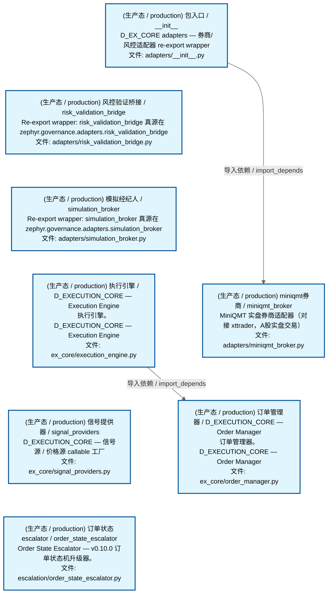
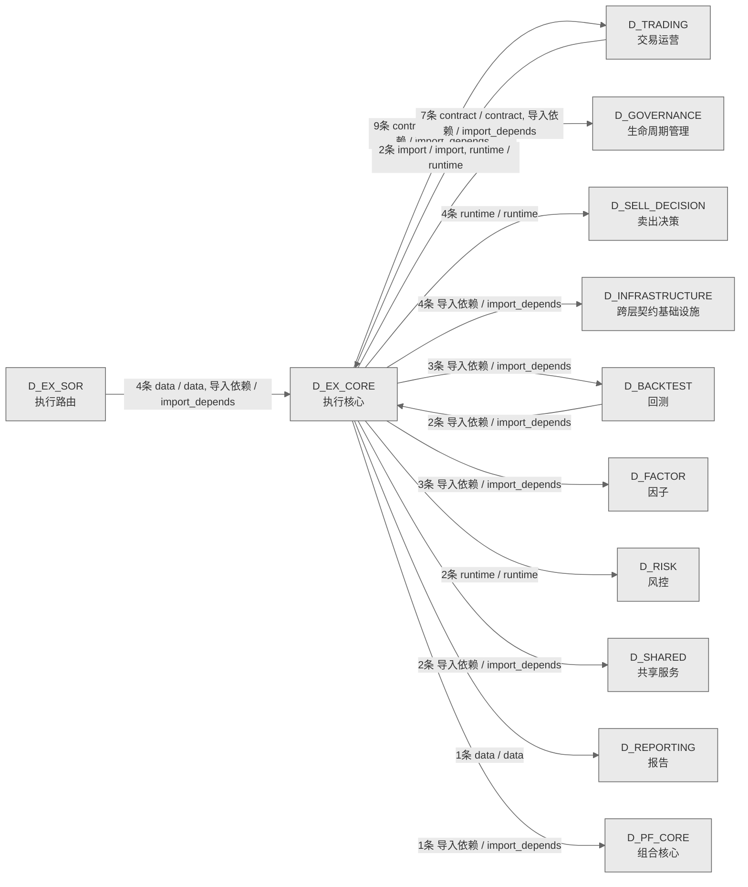

# 44_d_ex_core / 执行核心域 / Execution Core

> **功能简介 / Overview**: 执行核心，负责订单执行引擎、执行策略和执行管理

> **文档作用 / Purpose**: 展示 执行核心（D_EX_CORE）功能域的域内依赖关系、跨域依赖关系，模块信息（成熟度/中英文名/大白话/文件路径）内嵌于 Mermaid 节点，供架构审查和域治理参考。

> 本文档由 generate_domain_doc.py 从 depgraph (PostgreSQL) 自动生成
> 数据源: depgraph (PostgreSQL) nodes表 + edges表

> **[可缩放 HTML 版 / Zoomable HTML](http://localhost:8765/docs/02_enterprise_architecture/02_domain_architecture_docs/_zoomable_html/44_d_ex_core.html)** — Ctrl+滚轮缩放 ｜ 双击重置 ｜ Ctrl+Shift+D 切换拖动/选择模式

## 域基本信息 / Domain Overview

| 字段 | 值 | Field | Value |
|------|------|-------|-------|
| 编号 | 44 | Number | 44 |
| 域ID | D_EX_CORE | Domain ID | D_EX_CORE |
| 域名称 | 执行核心 | Domain Name | Execution Core |
| 层级 | L2 业务域层 | Layer | L2 Domain |
| 模块数 | 25 | Module Count | 25 |
| 域内依赖 | 21 | Internal Dependencies | 21 |
| 跨域入边 | 8 | Cross-domain Incoming | 8 |
| 跨域出边 | 36 | Cross-domain Outgoing | 36 |
| 设计态模块 | 17 | Design Modules | 17 |
| 生产态模块 | 8 | Production Modules | 8 |
| 容量 | 8/150 (正常) | Capacity | 8/150 (正常) |
| 描述 | 执行核心，负责订单执行引擎、执行策略和执行管理 | Description | 执行核心，负责订单执行引擎、执行策略和执行管理 |

## 域内依赖图 / Internal Dependency Diagram

> 依赖图内嵌在本文档中，IDE 可直接渲染；网页版可 Ctrl+滚轮缩放 + 拖动平移查看细节。
>
> **图例说明 / Legend**：
> - 🟦 **蓝色 = 运营态模块**（production，已上线运行）
> - 🟧 **橙色虚线 = 设计态模块**（design，蓝图阶段，代码未写）
> - **实线箭头 = 运营态依赖**（已生效的依赖关系）
> - **虚线箭头 = 非运营态依赖**（计划中/验证中的依赖关系）

### 全景图（全部模块，颜色区分运营态/设计态）

> 展示全部 25 个模块（生产态 8 + 设计态 17），含跨域依赖外部节点。节点含成熟度+名称+大白话/简介+文件路径。

```mermaid
%%{init: {'theme': 'base', 'themeVariables': {'primaryColor': '#eaeaea', 'primaryTextColor': '#333333', 'primaryBorderColor': '#666666', 'lineColor': '#666666', 'secondaryColor': '#eaeaea', 'tertiaryColor': '#eaeaea', 'fontSize': '14px'}}}%%
flowchart TD
    src_zephyr_ex_core_adapters_init_py["(生产态 / production) 包入口 / __init__<br/>D_EX_CORE adapters — 券商/风控适配器 re-export wrapper<br/>文件: adapters/__init__.py"]
    src_zephyr_ex_core_adapters_risk_validation_bridge_py["(生产态 / production) 风控验证桥接 / risk_validation_bridge<br/>Re-export wrapper: risk_validation_bridge 真源在 zephyr.governance.adapters.risk_validation_bridge<br/>文件: adapters/risk_validation_bridge.py"]
    src_zephyr_ex_core_auction_deviation_executor_py["(设计态 / design) 拍卖偏差执行器 / auction_deviation_executor<br/>拍卖偏差执行器，执行核心的执行器，执行具体操作。<br/>文件: ex_core/auction_deviation_executor.py"]
    src_zephyr_ex_core_batch_executor_py["(设计态 / design) 批次执行器 / batch_executor<br/>批次执行器，执行核心的执行器，执行具体操作。<br/>文件: ex_core/batch_executor.py"]
    src_zephyr_ex_core_batch_take_profit_executor_py["(设计态 / design) 批次止盈利润执行器 / batch_take_profit_executor<br/>批次止盈利润执行器，执行核心的执行器，执行具体操作。<br/>文件: ex_core/batch_take_profit_executor.py"]
    src_zephyr_ex_core_conditional_order_manager_py["(设计态 / design) conditional订单管理器 / conditional_order_manager<br/>conditional订单管理器，ex_core的管理器，统一管理一类资源的生命周期。<br/>文件: ex_core/conditional_order_manager.py"]
    src_zephyr_ex_core_execution_engine_py["(生产态 / production) 执行引擎 / D_EXECUTION_CORE — Execution Engine<br/>执行引擎。D_EXECUTION_CORE — Execution Engine<br/>文件: ex_core/execution_engine.py"]
    src_zephyr_ex_core_execution_mcp_server_py["(设计态 / design) 执行MCP服务端 / execution_mcp_server<br/>执行MCP服务端，ex_core的服务端，接收并处理请求。<br/>文件: ex_core/execution_mcp_server.py"]
    src_zephyr_ex_core_fill_handler_py["(设计态 / design) 成交处理器 / fill_handler<br/>成交处理器，ex_core的处理器，处理特定类型的事件或请求。<br/>文件: ex_core/fill_handler.py"]
    src_zephyr_ex_core_fill_processor_py["(设计态 / design) 成交处理器 / fill_processor<br/>成交处理器，执行核心的处理器，处理加工数据。<br/>文件: ex_core/fill_processor.py"]
    src_zephyr_ex_core_live_simulation_switcher_py["(设计态 / design) 实盘仿真切换器 / live_simulation_switcher<br/>实盘仿真切换器（live_simulation_switcher.py）<br/>文件: ex_core/live_simulation_switcher.py"]
    src_zephyr_ex_core_order_splitter_py["(设计态 / design) 订单拆分器 / order_splitter<br/>订单拆分器（order_splitter.py）<br/>文件: ex_core/order_splitter.py"]
    src_zephyr_ex_core_redis_idempotency["(设计态 / design) redis幂等性<br/>redis幂等性，执行核心的子目录，归集相关子模块。<br/>文件: redis_idempotency/"]
    src_zephyr_ex_core_sell_priority_scheduler_py["(设计态 / design) 卖出优先级调度器 / sell_priority_scheduler<br/>卖priority调度器，ex_core的调度器，按时间或优先级安排任务执行。<br/>文件: ex_core/sell_priority_scheduler.py"]
    src_zephyr_ex_core_services_live_portfolio_py["(设计态 / design) 实时组合 / live_portfolio<br/>实时组合（live_portfolio.py）<br/>文件: services/live_portfolio.py"]
    src_zephyr_ex_core_signal_providers_py["(生产态 / production) 信号提供器 / signal_providers<br/>D_EXECUTION_CORE — 信号源 / 价格源 callable 工厂<br/>文件: ex_core/signal_providers.py"]
    src_zephyr_ex_core_stop_loss_take_profit_executor_py["(设计态 / design) 停止亏损止盈利润执行器 / stop_loss_take_profit_executor<br/>停止亏损止盈利润执行器，执行核心的执行器，执行具体操作。<br/>文件: ex_core/stop_loss_take_profit_executor.py"]
    src_zephyr_ex_core_trading_session_py["(设计态 / design) 交易会话 / trading_session<br/>D_EXECUTION_CORE — TradingSession 盘中实时调仓编排器<br/>文件: ex_core/trading_session.py"]
    src_zephyr_governance_escalation_order_state_escalator_py["(生产态 / production) 订单状态escalator / order_state_escalator<br/>Order State Escalator — v0.10.0 订单状态机升级器。<br/>文件: escalation/order_state_escalator.py"]
    src_zephyr_ex_core_adapters_init_py ~~~ src_zephyr_ex_core_adapters_risk_validation_bridge_py
    src_zephyr_ex_core_adapters_risk_validation_bridge_py ~~~ src_zephyr_ex_core_auction_deviation_executor_py
    src_zephyr_ex_core_auction_deviation_executor_py ~~~ src_zephyr_ex_core_batch_executor_py
    src_zephyr_ex_core_batch_executor_py ~~~ src_zephyr_ex_core_batch_take_profit_executor_py
    src_zephyr_ex_core_batch_take_profit_executor_py ~~~ src_zephyr_ex_core_conditional_order_manager_py
    src_zephyr_ex_core_conditional_order_manager_py ~~~ src_zephyr_ex_core_execution_engine_py
    src_zephyr_ex_core_execution_engine_py ~~~ src_zephyr_ex_core_execution_mcp_server_py
    src_zephyr_ex_core_execution_mcp_server_py ~~~ src_zephyr_ex_core_fill_handler_py
    src_zephyr_ex_core_fill_handler_py ~~~ src_zephyr_ex_core_fill_processor_py
    src_zephyr_ex_core_fill_processor_py ~~~ src_zephyr_ex_core_live_simulation_switcher_py
    src_zephyr_ex_core_live_simulation_switcher_py ~~~ src_zephyr_ex_core_order_splitter_py
    src_zephyr_ex_core_order_splitter_py ~~~ src_zephyr_ex_core_redis_idempotency
    src_zephyr_ex_core_redis_idempotency ~~~ src_zephyr_ex_core_sell_priority_scheduler_py
    src_zephyr_ex_core_sell_priority_scheduler_py ~~~ src_zephyr_ex_core_services_live_portfolio_py
    src_zephyr_ex_core_services_live_portfolio_py ~~~ src_zephyr_ex_core_signal_providers_py
    src_zephyr_ex_core_signal_providers_py ~~~ src_zephyr_ex_core_stop_loss_take_profit_executor_py
    src_zephyr_ex_core_stop_loss_take_profit_executor_py ~~~ src_zephyr_ex_core_trading_session_py
    src_zephyr_ex_core_trading_session_py ~~~ src_zephyr_governance_escalation_order_state_escalator_py
    src_zephyr_ex_core_adapters_miniqmt_broker_py["(生产态 / production) miniqmt券商 / miniqmt_broker<br/>MiniQMT 实盘券商适配器（对接 xttrader，A股实盘交易）<br/>文件: adapters/miniqmt_broker.py"]
    src_zephyr_ex_core_adapters_simulation_broker_py["(生产态 / production) 模拟经纪人 / simulation_broker<br/>Re-export wrapper: simulation_broker 真源在 zephyr.governance.adapters.simulation_broker<br/>文件: adapters/simulation_broker.py"]
    src_zephyr_ex_core_execution_report_py["(设计态 / design) 执行报告 / execution_report<br/>执行报告，ex_core的报告器，汇总数据生成报告。<br/>文件: ex_core/execution_report.py"]
    src_zephyr_ex_core_order_manager_py["(生产态 / production) 订单管理器 / D_EXECUTION_CORE — Order Manager<br/>订单管理器。D_EXECUTION_CORE — Order Manager<br/>文件: ex_core/order_manager.py"]
    src_zephyr_ex_core_position_tracker["(设计态 / design) 持仓追踪器<br/>持仓追踪器，持仓的子目录，归集相关子模块。<br/>文件: position_tracker/"]
    src_zephyr_ex_core_adapters_miniqmt_broker_py ~~~ src_zephyr_ex_core_adapters_simulation_broker_py
    src_zephyr_ex_core_adapters_simulation_broker_py ~~~ src_zephyr_ex_core_execution_report_py
    src_zephyr_ex_core_execution_report_py ~~~ src_zephyr_ex_core_order_manager_py
    src_zephyr_ex_core_order_manager_py ~~~ src_zephyr_ex_core_position_tracker
    src_zephyr_ex_core_audit_journal["(设计态 / design) 审计日志<br/>审计日志，审计日志的子目录，归集相关子模块。<br/>文件: audit_journal/"]
    src_zephyr_ex_core_fill_handler_py -.->|runtime / runtime| src_zephyr_ex_core_position_tracker
    src_zephyr_ex_core_fill_handler_py -.->|event / event| src_zephyr_ex_core_audit_journal
    src_zephyr_ex_core_fill_handler_py -.->|导入依赖 / import_depends| src_zephyr_ex_core_order_manager_py
    src_zephyr_ex_core_position_tracker -.->|event / event| src_zephyr_ex_core_audit_journal
    src_zephyr_ex_core_redis_idempotency -.->|event / event| src_zephyr_ex_core_audit_journal
    src_zephyr_ex_core_services_live_portfolio_py -.->|导入依赖 / import_depends| src_zephyr_ex_core_adapters_miniqmt_broker_py
    src_zephyr_ex_core_trading_session_py -.->|导入依赖 / import_depends| src_zephyr_ex_core_order_manager_py
    src_zephyr_ex_core_fill_processor_py -.->|runtime / runtime| src_zephyr_ex_core_order_manager_py
    src_zephyr_ex_core_order_splitter_py -.->|runtime / runtime| src_zephyr_ex_core_order_manager_py
    src_zephyr_ex_core_stop_loss_take_profit_executor_py -.->|runtime / runtime| src_zephyr_ex_core_order_manager_py
    src_zephyr_ex_core_batch_executor_py -.->|runtime / runtime| src_zephyr_ex_core_order_manager_py
    src_zephyr_ex_core_batch_take_profit_executor_py -.->|runtime / runtime| src_zephyr_ex_core_order_manager_py
    src_zephyr_ex_core_auction_deviation_executor_py -.->|runtime / runtime| src_zephyr_ex_core_order_manager_py
    src_zephyr_ex_core_sell_priority_scheduler_py -.->|runtime / runtime| src_zephyr_ex_core_order_manager_py
    src_zephyr_ex_core_live_simulation_switcher_py -.->|runtime / runtime| src_zephyr_ex_core_adapters_simulation_broker_py
    src_zephyr_ex_core_live_simulation_switcher_py -.->|runtime / runtime| src_zephyr_ex_core_adapters_miniqmt_broker_py
    src_zephyr_ex_core_conditional_order_manager_py -.->|runtime / runtime| src_zephyr_ex_core_order_manager_py
    src_zephyr_ex_core_execution_mcp_server_py -.->|runtime / runtime| src_zephyr_ex_core_order_manager_py
    src_zephyr_ex_core_execution_engine_py -.->|runtime / runtime| src_zephyr_ex_core_execution_report_py
    src_zephyr_ex_core_execution_engine_py -->|导入依赖 / import_depends| src_zephyr_ex_core_order_manager_py
    src_zephyr_ex_core_adapters_init_py -->|导入依赖 / import_depends| src_zephyr_ex_core_adapters_miniqmt_broker_py
    D_SELL_DECISION["(设计态 / design) 卖出决策 / Sell Decision<br/>卖出决策，负责卖出信号生成、卖出时机判断和退出策略<br/>跨域节点 / cross-domain"]
    src_zephyr_ex_core_stop_loss_take_profit_executor_py -.->|runtime / runtime| D_SELL_DECISION
    D_PF_CORE["(生产态 / production) 组合核心 / Portfolio Core<br/>组合核心，负责投资组合构建、持仓管理和组合优化<br/>跨域节点 / cross-domain"]
    src_zephyr_ex_core_trading_session_py -.->|导入依赖 / import_depends| D_PF_CORE
    D_BACKTEST["(生产态 / production) 回测 / Backtest<br/>回测，负责历史数据回测、回测引擎和回测报告<br/>跨域节点 / cross-domain"]
    src_zephyr_ex_core_services_live_portfolio_py -.->|导入依赖 / import_depends| D_BACKTEST
    D_TRADING["(生产态 / production) 交易运营 / Trading Operations<br/>交易运营，负责交易生命周期管理、订单状态和成交处理<br/>跨域节点 / cross-domain"]
    src_zephyr_ex_core_services_live_portfolio_py -.->|导入依赖 / import_depends| D_TRADING
    src_zephyr_ex_core_sell_priority_scheduler_py -.->|runtime / runtime| D_SELL_DECISION
    src_zephyr_ex_core_services_live_portfolio_py -.->|导入依赖 / import_depends| D_BACKTEST
    src_zephyr_ex_core_services_live_portfolio_py -.->|导入依赖 / import_depends| D_TRADING
    src_zephyr_ex_core_trading_session_py -.->|contract / contract| D_TRADING
    D_GOVERNANCE["(生产态 / production) 生命周期管理 / Lifecycle Management<br/>生命周期管理，负责蓝图/模块/任务的声明周期管理和元数据治理<br/>跨域节点 / cross-domain"]
    src_zephyr_ex_core_trading_session_py -.->|contract / contract| D_GOVERNANCE
    src_zephyr_ex_core_trading_session_py -.->|contract / contract| D_GOVERNANCE
    D_RISK["(设计态 / design) 风控 / Risk Control<br/>风控，负责风险指标计算、风险限额管理和风险预警<br/>跨域节点 / cross-domain"]
    src_zephyr_ex_core_live_simulation_switcher_py -.->|runtime / runtime| D_RISK
    D_REPORTING["(设计态 / design) 报告 / Reporting<br/>报告，负责投资报告、风险报告和合规报告的生成与分发<br/>跨域节点 / cross-domain"]
    src_zephyr_ex_core_execution_report_py -.->|data / data| D_REPORTING
    src_zephyr_ex_core_stop_loss_take_profit_executor_py -.->|runtime / runtime| D_SELL_DECISION
    src_zephyr_ex_core_sell_priority_scheduler_py -.->|runtime / runtime| D_SELL_DECISION
    src_zephyr_ex_core_live_simulation_switcher_py -.->|runtime / runtime| D_RISK
    D_TRADING -.->|import / import| src_zephyr_ex_core_fill_handler_py
    D_BACKTEST -->|导入依赖 / import_depends| src_zephyr_ex_core_adapters_simulation_broker_py
    D_BACKTEST -->|导入依赖 / import_depends| src_zephyr_ex_core_adapters_miniqmt_broker_py
    D_TRADING -.->|runtime / runtime| src_zephyr_ex_core_order_manager_py
    D_EX_SOR["(设计态 / design) 执行路由 / Execution Routing<br/>执行路由，负责订单路由、智能拆单和执行场所选择<br/>跨域节点 / cross-domain"]
    D_EX_SOR -.->|导入依赖 / import_depends| src_zephyr_ex_core_execution_engine_py
    D_EX_SOR -.->|data / data| src_zephyr_ex_core_execution_report_py
    D_EX_SOR -.->|data / data| src_zephyr_ex_core_execution_report_py
    D_EX_SOR -.->|data / data| src_zephyr_ex_core_execution_report_py
    classDef production fill:#e1f5fe,stroke:#01579b,stroke-width:2px,color:#000
    classDef design fill:#fff3e0,stroke:#e65100,stroke-width:2px,color:#000,stroke-dasharray: 5 5
    classDef external_prod fill:#e8f4fd,stroke:#0277bd,stroke-width:1px,color:#000
    classDef external_design fill:#fff8e7,stroke:#ef6c00,stroke-width:1px,color:#000,stroke-dasharray: 5 5
    class src_zephyr_ex_core_adapters_init_py,src_zephyr_ex_core_adapters_miniqmt_broker_py,src_zephyr_ex_core_adapters_risk_validation_bridge_py,src_zephyr_ex_core_adapters_simulation_broker_py,src_zephyr_ex_core_execution_engine_py,src_zephyr_ex_core_order_manager_py,src_zephyr_ex_core_signal_providers_py,src_zephyr_governance_escalation_order_state_escalator_py production
    class src_zephyr_ex_core_auction_deviation_executor_py,src_zephyr_ex_core_audit_journal,src_zephyr_ex_core_batch_executor_py,src_zephyr_ex_core_batch_take_profit_executor_py,src_zephyr_ex_core_conditional_order_manager_py,src_zephyr_ex_core_execution_mcp_server_py,src_zephyr_ex_core_execution_report_py,src_zephyr_ex_core_fill_handler_py,src_zephyr_ex_core_fill_processor_py,src_zephyr_ex_core_live_simulation_switcher_py,src_zephyr_ex_core_order_splitter_py,src_zephyr_ex_core_position_tracker,src_zephyr_ex_core_redis_idempotency,src_zephyr_ex_core_sell_priority_scheduler_py,src_zephyr_ex_core_services_live_portfolio_py,src_zephyr_ex_core_stop_loss_take_profit_executor_py,src_zephyr_ex_core_trading_session_py design
    class D_PF_CORE,D_BACKTEST,D_TRADING,D_GOVERNANCE external_prod
    class D_SELL_DECISION,D_RISK,D_REPORTING,D_EX_SOR external_design
```

### 运营态的图（仅 design_maturity=production 的模块和域内依赖）

> 仅展示已上线运行的模块（共 8 个），不含跨域外部节点。跨域依赖见下方跨域依赖章节。

### 设计态的图（仅 design_maturity=design 的模块和域内依赖）

> 仅展示蓝图阶段、代码未写的设计态模块（共 17 个），不含跨域外部节点。

```mermaid
%%{init: {'theme': 'base', 'themeVariables': {'primaryColor': '#eaeaea', 'primaryTextColor': '#333333', 'primaryBorderColor': '#666666', 'lineColor': '#666666', 'secondaryColor': '#eaeaea', 'tertiaryColor': '#eaeaea', 'fontSize': '14px'}}}%%
flowchart TD
    src_zephyr_ex_core_auction_deviation_executor_py["(设计态 / design) 拍卖偏差执行器 / auction_deviation_executor<br/>拍卖偏差执行器，执行核心的执行器，执行具体操作。<br/>文件: ex_core/auction_deviation_executor.py"]
    src_zephyr_ex_core_batch_executor_py["(设计态 / design) 批次执行器 / batch_executor<br/>批次执行器，执行核心的执行器，执行具体操作。<br/>文件: ex_core/batch_executor.py"]
    src_zephyr_ex_core_batch_take_profit_executor_py["(设计态 / design) 批次止盈利润执行器 / batch_take_profit_executor<br/>批次止盈利润执行器，执行核心的执行器，执行具体操作。<br/>文件: ex_core/batch_take_profit_executor.py"]
    src_zephyr_ex_core_conditional_order_manager_py["(设计态 / design) conditional订单管理器 / conditional_order_manager<br/>conditional订单管理器，ex_core的管理器，统一管理一类资源的生命周期。<br/>文件: ex_core/conditional_order_manager.py"]
    src_zephyr_ex_core_execution_mcp_server_py["(设计态 / design) 执行MCP服务端 / execution_mcp_server<br/>执行MCP服务端，ex_core的服务端，接收并处理请求。<br/>文件: ex_core/execution_mcp_server.py"]
    src_zephyr_ex_core_execution_report_py["(设计态 / design) 执行报告 / execution_report<br/>执行报告，ex_core的报告器，汇总数据生成报告。<br/>文件: ex_core/execution_report.py"]
    src_zephyr_ex_core_fill_handler_py["(设计态 / design) 成交处理器 / fill_handler<br/>成交处理器，ex_core的处理器，处理特定类型的事件或请求。<br/>文件: ex_core/fill_handler.py"]
    src_zephyr_ex_core_fill_processor_py["(设计态 / design) 成交处理器 / fill_processor<br/>成交处理器，执行核心的处理器，处理加工数据。<br/>文件: ex_core/fill_processor.py"]
    src_zephyr_ex_core_live_simulation_switcher_py["(设计态 / design) 实盘仿真切换器 / live_simulation_switcher<br/>实盘仿真切换器（live_simulation_switcher.py）<br/>文件: ex_core/live_simulation_switcher.py"]
    src_zephyr_ex_core_order_splitter_py["(设计态 / design) 订单拆分器 / order_splitter<br/>订单拆分器（order_splitter.py）<br/>文件: ex_core/order_splitter.py"]
    src_zephyr_ex_core_redis_idempotency["(设计态 / design) redis幂等性<br/>redis幂等性，执行核心的子目录，归集相关子模块。<br/>文件: redis_idempotency/"]
    src_zephyr_ex_core_sell_priority_scheduler_py["(设计态 / design) 卖出优先级调度器 / sell_priority_scheduler<br/>卖priority调度器，ex_core的调度器，按时间或优先级安排任务执行。<br/>文件: ex_core/sell_priority_scheduler.py"]
    src_zephyr_ex_core_services_live_portfolio_py["(设计态 / design) 实时组合 / live_portfolio<br/>实时组合（live_portfolio.py）<br/>文件: services/live_portfolio.py"]
    src_zephyr_ex_core_stop_loss_take_profit_executor_py["(设计态 / design) 停止亏损止盈利润执行器 / stop_loss_take_profit_executor<br/>停止亏损止盈利润执行器，执行核心的执行器，执行具体操作。<br/>文件: ex_core/stop_loss_take_profit_executor.py"]
    src_zephyr_ex_core_trading_session_py["(设计态 / design) 交易会话 / trading_session<br/>D_EXECUTION_CORE — TradingSession 盘中实时调仓编排器<br/>文件: ex_core/trading_session.py"]
    src_zephyr_ex_core_auction_deviation_executor_py ~~~ src_zephyr_ex_core_batch_executor_py
    src_zephyr_ex_core_batch_executor_py ~~~ src_zephyr_ex_core_batch_take_profit_executor_py
    src_zephyr_ex_core_batch_take_profit_executor_py ~~~ src_zephyr_ex_core_conditional_order_manager_py
    src_zephyr_ex_core_conditional_order_manager_py ~~~ src_zephyr_ex_core_execution_mcp_server_py
    src_zephyr_ex_core_execution_mcp_server_py ~~~ src_zephyr_ex_core_execution_report_py
    src_zephyr_ex_core_execution_report_py ~~~ src_zephyr_ex_core_fill_handler_py
    src_zephyr_ex_core_fill_handler_py ~~~ src_zephyr_ex_core_fill_processor_py
    src_zephyr_ex_core_fill_processor_py ~~~ src_zephyr_ex_core_live_simulation_switcher_py
    src_zephyr_ex_core_live_simulation_switcher_py ~~~ src_zephyr_ex_core_order_splitter_py
    src_zephyr_ex_core_order_splitter_py ~~~ src_zephyr_ex_core_redis_idempotency
    src_zephyr_ex_core_redis_idempotency ~~~ src_zephyr_ex_core_sell_priority_scheduler_py
    src_zephyr_ex_core_sell_priority_scheduler_py ~~~ src_zephyr_ex_core_services_live_portfolio_py
    src_zephyr_ex_core_services_live_portfolio_py ~~~ src_zephyr_ex_core_stop_loss_take_profit_executor_py
    src_zephyr_ex_core_stop_loss_take_profit_executor_py ~~~ src_zephyr_ex_core_trading_session_py
    src_zephyr_ex_core_position_tracker["(设计态 / design) 持仓追踪器<br/>持仓追踪器，持仓的子目录，归集相关子模块。<br/>文件: position_tracker/"]
    src_zephyr_ex_core_audit_journal["(设计态 / design) 审计日志<br/>审计日志，审计日志的子目录，归集相关子模块。<br/>文件: audit_journal/"]
    src_zephyr_ex_core_fill_handler_py -.->|runtime / runtime| src_zephyr_ex_core_position_tracker
    src_zephyr_ex_core_fill_handler_py -.->|event / event| src_zephyr_ex_core_audit_journal
    src_zephyr_ex_core_position_tracker -.->|event / event| src_zephyr_ex_core_audit_journal
    src_zephyr_ex_core_redis_idempotency -.->|event / event| src_zephyr_ex_core_audit_journal
    classDef production fill:#e1f5fe,stroke:#01579b,stroke-width:2px,color:#000
    classDef design fill:#fff3e0,stroke:#e65100,stroke-width:2px,color:#000,stroke-dasharray: 5 5
    classDef external_prod fill:#e8f4fd,stroke:#0277bd,stroke-width:1px,color:#000
    classDef external_design fill:#fff8e7,stroke:#ef6c00,stroke-width:1px,color:#000,stroke-dasharray: 5 5
    class src_zephyr_ex_core_auction_deviation_executor_py,src_zephyr_ex_core_audit_journal,src_zephyr_ex_core_batch_executor_py,src_zephyr_ex_core_batch_take_profit_executor_py,src_zephyr_ex_core_conditional_order_manager_py,src_zephyr_ex_core_execution_mcp_server_py,src_zephyr_ex_core_execution_report_py,src_zephyr_ex_core_fill_handler_py,src_zephyr_ex_core_fill_processor_py,src_zephyr_ex_core_live_simulation_switcher_py,src_zephyr_ex_core_order_splitter_py,src_zephyr_ex_core_position_tracker,src_zephyr_ex_core_redis_idempotency,src_zephyr_ex_core_sell_priority_scheduler_py,src_zephyr_ex_core_services_live_portfolio_py,src_zephyr_ex_core_stop_loss_take_profit_executor_py,src_zephyr_ex_core_trading_session_py design
```

## 跨域依赖 / Cross-domain Dependencies

### 本域依赖的其他域（出边）/ Depends On

| # | 本域模块 / Source Module | → | 外部域-目标模块 / Target Module | 依赖类型 / Type |
|:--:|---------|:--:|---------|---------|
| 1 | miniqmt券商 / miniqmt_broker (adapters/miniqmt_broker.py) | → | D_BACKTEST 回测: 共享撮合逻辑模块（回测=实盘一致性核心） / matching_logic ... | 导入依赖 / import_depends |
| 2 | 实时组合 / live_portfolio (services/live_portfolio.py) | → | D_BACKTEST 回测: 共享撮合逻辑模块（回测=实盘一致性核心） / matching_logic ... | 导入依赖 / import_depends |
| 3 | 实时组合 / live_portfolio (services/live_portfolio.py) | → | D_BACKTEST 回测: 回测持仓管理模块 / portfolio (core/portfolio.py) | 导入依赖 / import_depends |
| 4 | 信号提供器 / signal_providers (ex_core/signal_providers.py) | → | D_FACTOR 因子: D-FACTOR-ANA-10 多因子合成——将多个因子值合成为综合信号... | 导入依赖 / import_depends |
| 5 | 信号提供器 / signal_providers (ex_core/signal_providers.py) | → | D_FACTOR 因子: D-FACTOR-03 因子评估回测运行器——端到端因子评估。 / back... | 导入依赖 / import_depends |
| 6 | 信号提供器 / signal_providers (ex_core/signal_providers.py) | → | D_FACTOR 因子: 因子基类 / ZephyrAlpha — D_FACTOR Alpha Factor Layer (fa... | 导入依赖 / import_depends |
| 7 | 包入口 / __init__ (adapters/__init__.py) | → | D_GOVERNANCE 生命周期管理: 风险验证桥接 / D_EXECUTION_CORE — Risk Validation Bridge... | 导入依赖 / import_depends |
| 8 | 包入口 / __init__ (adapters/__init__.py) | → | D_GOVERNANCE 生命周期管理: 仿真经纪人 / D_EXECUTION_CORE — Simulation Broker Adapte... | 导入依赖 / import_depends |
| 9 | 风控验证桥接 / risk_validation_bridge (adapters/risk_vali... | → | D_GOVERNANCE 生命周期管理: 风险验证桥接 / D_EXECUTION_CORE — Risk Validation Bridge... | 导入依赖 / import_depends |
| 10 | 模拟经纪人 / simulation_broker (adapters/simulation_broke... | → | D_GOVERNANCE 生命周期管理: 仿真经纪人 / D_EXECUTION_CORE — Simulation Broker Adapte... | 导入依赖 / import_depends |
| 11 | 执行引擎 / D_EXECUTION_CORE — Execution Engine (ex_core/... | → | D_GOVERNANCE 生命周期管理: 风险验证桥接 / D_EXECUTION_CORE — Risk Validation Bridge... | 导入依赖 / import_depends |
| 12 | 交易会话 / trading_session (ex_core/trading_session.py) | → | D_GOVERNANCE 生命周期管理: 风险验证桥接 / D_EXECUTION_CORE — Risk Validation Bridge... | contract / contract |
| 13 | 交易会话 / trading_session (ex_core/trading_session.py) | → | D_GOVERNANCE 生命周期管理: 策略基类 / D_PORTFOLIO_CORE — StrategyBase + StrategyMet... | contract / contract |
| 14 | 执行引擎 / D_EXECUTION_CORE — Execution Engine (ex_core/... | → | D_INFRASTRUCTURE 跨层契约基础设施: 订单 / order (contracts/order.py) | 导入依赖 / import_depends |
| 15 | 执行引擎 / D_EXECUTION_CORE — Execution Engine (ex_core/... | → | D_INFRASTRUCTURE 跨层契约基础设施: 风险limits / risk_limits (contracts/risk_limits.py) | 导入依赖 / import_depends |
| 16 | 订单管理器 / D_EXECUTION_CORE — Order Manager (ex_core/o... | → | D_INFRASTRUCTURE 跨层契约基础设施: 成交 / fill (contracts/fill.py) | 导入依赖 / import_depends |
| 17 | 订单管理器 / D_EXECUTION_CORE — Order Manager (ex_core/o... | → | D_INFRASTRUCTURE 跨层契约基础设施: 订单 / order (contracts/order.py) | 导入依赖 / import_depends |
| 18 | 交易会话 / trading_session (ex_core/trading_session.py) | → | D_PF_CORE 组合核心: 策略运行器 / strategy_runner (strategy_engine/strategy_ru... | 导入依赖 / import_depends |
| 19 | 执行报告 / execution_report (ex_core/execution_report.py) | → | D_REPORTING 报告: 报告发布器 / report_publisher (reporting/report_publisher... | data / data |
| 20 | 实盘仿真切换器 / live_simulation_switcher (ex_core/live_s... | → | D_RISK 风控: 回撤追踪器 (drawdown_tracker/) | runtime / runtime |
| 21 | 实盘仿真切换器 / live_simulation_switcher (ex_core/live_s... | → | D_RISK 风控: 回撤追踪器 (drawdown_tracker/) | runtime / runtime |
| 22 | 卖出优先级调度器 / sell_priority_scheduler (ex_core/sell_... | → | D_SELL_DECISION 卖出决策: 持仓分诊 / position_triage (core/position_triage.py) | runtime / runtime |
| 23 | 卖出优先级调度器 / sell_priority_scheduler (ex_core/sell_... | → | D_SELL_DECISION 卖出决策: 持仓分诊 / position_triage (core/position_triage.py) | runtime / runtime |
| 24 | 停止亏损止盈利润执行器 / stop_loss_take_profit_executor (... | → | D_SELL_DECISION 卖出决策: 持仓分诊 / position_triage (core/position_triage.py) | runtime / runtime |
| 25 | 停止亏损止盈利润执行器 / stop_loss_take_profit_executor (... | → | D_SELL_DECISION 卖出决策: 持仓分诊 / position_triage (core/position_triage.py) | runtime / runtime |
| 26 | miniqmt券商 / miniqmt_broker (adapters/miniqmt_broker.py) | → | D_SHARED 共享服务: 时间工具 / time_utils (utils/time_utils.py) | 导入依赖 / import_depends |
| 27 | 订单管理器 / D_EXECUTION_CORE — Order Manager (ex_core/o... | → | D_SHARED 共享服务: 订单枚举 / order_enums (enums/order_enums.py) | 导入依赖 / import_depends |
| 28 | 包入口 / __init__ (adapters/__init__.py) | → | D_TRADING 交易运营: 经纪人接口 / D_EXECUTION_CORE — BrokerInterface (trading... | 导入依赖 / import_depends |
| 29 | miniqmt券商 / miniqmt_broker (adapters/miniqmt_broker.py) | → | D_TRADING 交易运营: 经纪人接口 / D_EXECUTION_CORE — BrokerInterface (trading... | 导入依赖 / import_depends |
| 30 | miniqmt券商 / miniqmt_broker (adapters/miniqmt_broker.py) | → | D_TRADING 交易运营: 成交 / fill (execution/fill.py) | 导入依赖 / import_depends |
| 31 | miniqmt券商 / miniqmt_broker (adapters/miniqmt_broker.py) | → | D_TRADING 交易运营: 订单 / order (execution/order.py) | 导入依赖 / import_depends |
| 32 | miniqmt券商 / miniqmt_broker (adapters/miniqmt_broker.py) | → | D_TRADING 交易运营: 持仓 / position (execution/position.py) | 导入依赖 / import_depends |
| 33 | 订单管理器 / D_EXECUTION_CORE — Order Manager (ex_core/o... | → | D_TRADING 交易运营: 经纪人接口 / D_EXECUTION_CORE — BrokerInterface (trading... | 导入依赖 / import_depends |
| 34 | 实时组合 / live_portfolio (services/live_portfolio.py) | → | D_TRADING 交易运营: 持仓 / position (execution/position.py) | 导入依赖 / import_depends |
| 35 | 实时组合 / live_portfolio (services/live_portfolio.py) | → | D_TRADING 交易运营: 风险limits / risk_limits (risk/risk_limits.py) | 导入依赖 / import_depends |
| 36 | 交易会话 / trading_session (ex_core/trading_session.py) | → | D_TRADING 交易运营: 经纪人接口 / D_EXECUTION_CORE — BrokerInterface (trading... | contract / contract |

### 依赖本域的其他域（入边）/ Depended By

| # | 外部域-源模块 / Source Module | → | 本域模块 / Target Module | 依赖类型 / Type |
|:--:|---------|:--:|---------|---------|
| 1 | D_BACKTEST 回测: 事件driven引擎 / event_driven_engine (implementations/eve... | → | miniqmt券商 / miniqmt_broker (adapters/miniqmt_broker.py) | 导入依赖 / import_depends |
| 2 | D_BACKTEST 回测: 事件driven引擎 / event_driven_engine (implementations/eve... | → | 模拟经纪人 / simulation_broker (adapters/simulation_broke... | 导入依赖 / import_depends |
| 3 | D_EX_SOR 执行路由: 经纪人适配器管理器 / broker_adapter_manager (core/broker_... | → | 执行引擎 / D_EXECUTION_CORE — Execution Engine (ex_core/... | 导入依赖 / import_depends |
| 4 | D_EX_SOR 执行路由: 执行质量评分器 / execution_quality_scorer (services/execu... | → | 执行报告 / execution_report (ex_core/execution_report.py) | data / data |
| 5 | D_EX_SOR 执行路由: 滑点分析器 / slippage_analyzer (services/slippage_analyze... | → | 执行报告 / execution_report (ex_core/execution_report.py) | data / data |
| 6 | D_EX_SOR 执行路由: 交易成本优化器 / transaction_cost_optimizer (services/tra... | → | 执行报告 / execution_report (ex_core/execution_report.py) | data / data |
| 7 | D_TRADING 交易运营: 盈亏计算器 (pnl_calculator/) | → | 成交处理器 / fill_handler (ex_core/fill_handler.py) | import / import |
| 8 | D_TRADING 交易运营: 结算对账 / settlement_reconciliation (trading/settlement_... | → | 订单管理器 / D_EXECUTION_CORE — Order Manager (ex_core/o... | runtime / runtime |

### 跨域依赖图 / Cross-domain Dependency Diagram

> 本域与 11 个外部域直接连接（出边 36 条 + 入边 8 条 = 44 条）。只显示直接连接的域，不展开具体节点。

## 说明 / Notes

- **数据源 / Data Source**: `depgraph (PostgreSQL)` 的 `nodes`、`edges`、`domains` 表
- **生成器 / Generator**: `generate_domain_doc.py`（G2+G10 合并）
- **维护方式 / Maintenance**: 自动生成，全景图更新时刷新
- **文件名规则 / File Naming**: `{编号:02d}_{域ID小写}.md`，如 `16_d_trading.md`
- **图例说明 / Legend**: `[production]`=已上线 / `[design]`=设计中 / `[unknown]`=未知
