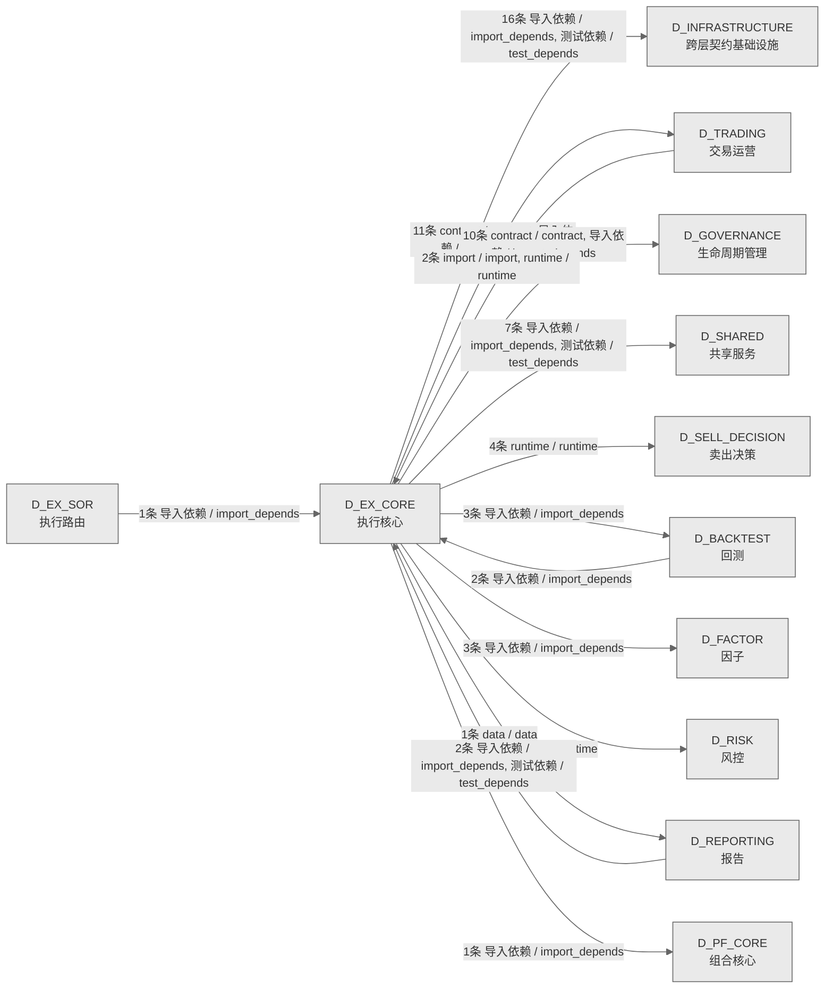

# 44_d_ex_core / 执行核心域 / Execution Core

> **功能简介 / Overview**: 执行核心，负责订单执行引擎、执行策略和执行管理

> **文档作用 / Purpose**: 展示 执行核心（D_EX_CORE）功能域的域内依赖关系、跨域依赖关系，模块信息（成熟度/中英文名/大白话/文件路径）内嵌于 Mermaid 节点，供架构审查和域治理参考。

> 本文档由 generate_domain_doc.py 从 depgraph (PostgreSQL) 自动生成
> 数据源: depgraph (PostgreSQL) nodes表 + edges表

> **[可缩放 HTML 版 / Zoomable HTML](http://localhost:8765/docs/02_enterprise_architecture/02_domain_architecture_docs/_zoomable_html/44_d_ex_core.html)** — Ctrl+滚轮缩放 ｜ 双击重置 ｜ Ctrl+Shift+D 切换拖动/选择模式

## 域基本信息 / Domain Overview

| 字段 | 值 | Field | Value |
|------|------|-------|-------|
| 编号 | 44 | Number | 44 |
| 域ID | D_EX_CORE | Domain ID | D_EX_CORE |
| 域名称 | 执行核心 | Domain Name | Execution Core |
| 层级 | L2 业务域层 | Layer | L2 Domain |
| 模块数 | 44 | Module Count | 44 |
| 域内依赖 | 33 | Internal Dependencies | 33 |
| 跨域入边 | 7 | Cross-domain Incoming | 7 |
| 跨域出边 | 57 | Cross-domain Outgoing | 57 |
| 设计态模块 | 28 | Design Modules | 28 |
| 生产态模块 | 16 | Production Modules | 16 |
| 容量 | 16/150 (正常) | Capacity | 16/150 (正常) |
| 描述 | 执行核心，负责订单执行引擎、执行策略和执行管理 | Description | 执行核心，负责订单执行引擎、执行策略和执行管理 |

## 域内依赖图 / Internal Dependency Diagram

> 依赖图内嵌在本文档中，IDE 可直接渲染；网页版可 Ctrl+滚轮缩放 + 拖动平移查看细节。
>
> **图例说明 / Legend**：
> - 🟦 **蓝色 = 运营态模块**（production，已上线运行）
> - 🟧 **橙色虚线 = 设计态模块**（design，蓝图阶段，代码未写）
> - **实线箭头 = 运营态依赖**（已生效的依赖关系）
> - **虚线箭头 = 非运营态依赖**（计划中/验证中的依赖关系）

### 全景图（全部模块，颜色区分运营态/设计态）

> 展示全部 44 个模块（生产态 16 + 设计态 28），含跨域依赖外部节点。节点含成熟度+名称+大白话/简介+文件路径。

```mermaid
%%{init: {'theme': 'base', 'themeVariables': {'primaryColor': '#eaeaea', 'primaryTextColor': '#333333', 'primaryBorderColor': '#666666', 'lineColor': '#666666', 'secondaryColor': '#eaeaea', 'tertiaryColor': '#eaeaea', 'fontSize': '14px'}}}%%
flowchart TD
    src_zephyr_ex_core_adapters_init_py["ex_core/adapters 包入口<br/>adapters 包入口，整合接口适配相关模块<br/>文件: adapters/__init__.py<br/>(生产态 / production)"]
    src_zephyr_ex_core_adapters_risk_validation_bridge_py["风控验证桥接<br/>兼容转发层，把调用转发到<br/>zephyr.governance.adapters.risk_validation_bridg<br/>eRe，老导入路径不用改<br/>文件: adapters/risk_validation_bridge.py<br/>(生产态 / production)"]
    src_zephyr_ex_core_aggregate_root_manager_py["ex_core/aggregate_root_manager<br/>ex core包的aggregate_root_manager模块<br/>文件: ex_core/aggregate_root_manager.py<br/>(设计态 / design)"]
    src_zephyr_ex_core_auction_deviation_executor_py["拍卖偏差执行器<br/>执行核心的执行器，执行具体操作（auction<br/>deviation executor）<br/>⛔ 门禁:实盘交易环境+集合竞价数据源+miniQMT实盘AP<br/>I(D-EX-CORE-32)<br/>auction_deviation_executor<br/>文件: ex_core/auction_deviation_executor.py<br/>(设计态 / design)"]
    src_zephyr_ex_core_audit_journal_init_py["ex_core/audit_journal 包入口<br/>D_EXECUTION_CORE — Execution Audit Journal 包<br/>文件: audit_journal/__init__.py<br/>(生产态 / production)"]
    src_zephyr_ex_core_batch_executor_py["批次执行器<br/>执行核心的执行器，执行具体操作（batch executor）<br/>⛔ 门禁:实盘交易环境+A股Tick数据源+miniQMT实盘API<br/>(D-EX-CORE-30)<br/>batch_executor<br/>文件: ex_core/batch_executor.py<br/>(设计态 / design)"]
    src_zephyr_ex_core_batch_take_profit_executor_py["批次止盈利润执行器<br/>执行核心的执行器，执行具体操作（batch take<br/>profit executor）<br/>⛔ 门禁:实盘交易环境+A股Tick数据源+miniQMT实盘API<br/>(D-EX-CORE-31)<br/>batch_take_profit_executor<br/>文件: ex_core/batch_take_profit_executor.py<br/>(设计态 / design)"]
    src_zephyr_ex_core_blueprint_implementer_py["ex_core/blueprint_implementer<br/>ex core包的blueprint_implementer模块<br/>⛔ 门禁:依赖模块(OMS+引擎+路由+报告)全部就绪<br/>(D-EX-CORE-37)<br/>文件: ex_core/blueprint_implementer.py<br/>(设计态 / design)"]
    src_zephyr_ex_core_conditional_order_manager_py["conditional订单管理器<br/>ex_core的管理器，统一管理一类资源的生命周期<br/>⛔ 门禁:EX-SOR算法路由就绪(D-EX-CORE-42)<br/>conditional_order_manager<br/>文件: ex_core/conditional_order_manager.py<br/>(设计态 / design)"]
    src_zephyr_ex_core_deployment_consistency_manager_py["ex_core/deployment_consistency_manager<br/>ex core包的deployment_consistency_manager模块<br/>⛔ 门禁:实盘环境+CI/CD灰度发布基础设施<br/>(D-EX-CORE-21)<br/>文件: ex_core/deployment_consistency_manager.py<br/>(设计态 / design)"]
    src_zephyr_ex_core_execution_engine_py["执行引擎<br/>本模块内 ``ExecutionEngineRunRecord``<br/>为引擎内部聚合快照，非 CTR-P1-007；<br/>D_EXECUTION_CORE — Execution Engine<br/>文件: ex_core/execution_engine.py<br/>(生产态 / production)"]
    src_zephyr_ex_core_execution_mcp_server_py["执行MCP服务端<br/>ex_core的服务端，接收并处理请求<br/>⛔ 门禁:MCP协议安全生态未成熟;开通需OAuth+RBAC+审<br/>计+沙箱+AI置信度>=95%稳定6月+渗透测试<br/>(D-EX-CORE-59)<br/>execution_mcp_server<br/>文件: ex_core/execution_mcp_server.py<br/>(设计态 / design)"]
    src_zephyr_ex_core_execution_risk_gate_py["ex_core/execution_risk_gate<br/>ex core包的execution_risk_gate模块<br/>⛔ 门禁:D-RISK域L04-limits就绪+风控规则引擎可调用<br/>(D-EX-CORE-07)<br/>文件: ex_core/execution_risk_gate.py<br/>(设计态 / design)"]
    src_zephyr_ex_core_execution_tca_py["ex_core/execution_tca<br/>ex core包的execution_tca模块<br/>⛔ 门禁:历史执行数据>=30天+滑点模型参数可获取<br/>(D-EX-CORE-12)<br/>文件: ex_core/execution_tca.py<br/>(设计态 / design)"]
    src_zephyr_ex_core_factory_py["ex_core/factory<br/>ex core包的factory模块<br/>文件: ex_core/factory.py<br/>(设计态 / design)"]
    src_zephyr_ex_core_fill_handler_py["成交处理器<br/>ex_core的处理器，处理特定类型的事件或请求<br/>⛔ 交易执行核心域，设计已就绪，等待开发排期<br/>fill_handler<br/>文件: ex_core/fill_handler.py<br/>(设计态 / design)"]
    src_zephyr_ex_core_live_simulation_switcher_py["实盘仿真切换器<br/>支撑交易核心流程（live simulation switcher）<br/>⛔ 门禁:实盘券商连接(OKX/XTP/CTP)就绪<br/>(D-EX-CORE-35)<br/>live_simulation_switcher<br/>文件: ex_core/live_simulation_switcher.py<br/>(设计态 / design)"]
    src_zephyr_ex_core_microstructure_modeler_py["ex_core/microstructure_modeler<br/>ex core包的microstructure_modeler模块<br/>⛔ 门禁:订单簿Level-2数据可获取+VPIN计算引擎就绪+<br/>LOB快照频率>=1秒(D-EX-CORE-61)<br/>文件: ex_core/microstructure_modeler.py<br/>(设计态 / design)"]
    src_zephyr_ex_core_miniqmt_channel_manager_py["ex_core/miniqmt_channel_manager<br/>ex core包的miniqmt_channel_manager模块<br/>文件: ex_core/miniqmt_channel_manager.py<br/>(设计态 / design)"]
    src_zephyr_ex_core_multi_contract_adapter_py["ex_core/multi_contract_adapter<br/>ex core包的multi_contract_adapter模块<br/>文件: ex_core/multi_contract_adapter.py<br/>(设计态 / design)"]
    src_zephyr_ex_core_order_execution_saga_py["下单执行 Saga 编排器<br/>D_EXECUTION_CORE 域事务编排基础设施:<br/>将单笔订单的执行封装为六步 Saga 事务,<br/>任何一步失败自动补偿回滚,<br/>保证系统不会处于'半完成'的不一致状态<br/>Order Execution Saga<br/>文件: ex_core/order_execution_saga.py<br/>(生产态 / production)"]
    src_zephyr_ex_core_performance_monitor_py["ex_core/performance_monitor<br/>ex core包的performance_monitor模块<br/>⛔ 门禁:生产环境APM基础设施(D-EX-CORE-36)<br/>文件: ex_core/performance_monitor.py<br/>(设计态 / design)"]
    src_zephyr_ex_core_pre_execution_checker_py["ex_core/pre_execution_checker<br/>ex core包的pre_execution_checker模块<br/>⛔ 门禁:D-RISK风控参数就绪+市场状态实时数据源<br/>(D-EX-CORE-24)<br/>文件: ex_core/pre_execution_checker.py<br/>(设计态 / design)"]
    src_zephyr_ex_core_redis_idempotency["redis幂等性<br/>执行核心的子目录，归集相关子模块<br/>⛔ 交易执行核心域，设计已就绪，等待开发排期<br/>文件: redis_idempotency/<br/>(设计态 / design)"]
    src_zephyr_ex_core_repository_interface_py["ex_core/repository_interface<br/>ex core包的repository_interface模块<br/>文件: ex_core/repository_interface.py<br/>(设计态 / design)"]
    src_zephyr_ex_core_sell_priority_scheduler_py["卖出优先级调度器<br/>卖priority调度器，ex_core的调度器，按时间或优先<br/>级安排任务执行。<br/>⛔ 门禁:实盘交易环境+miniQMT实盘API(D-EX-CORE-33)<br/>sell_priority_scheduler<br/>文件: ex_core/sell_priority_scheduler.py<br/>(设计态 / design)"]
    src_zephyr_ex_core_services_live_portfolio_py["实时组合<br/>支撑交易核心流程（live portfolio）<br/>⛔ 交易执行核心域，设计已就绪，等待开发排期<br/>live_portfolio<br/>文件: services/live_portfolio.py<br/>(设计态 / design)"]
    src_zephyr_ex_core_signal_providers_py["信号提供器<br/>D_EXECUTION_CORE — 信号源 / 价格源 callable 工厂<br/>signal_providers<br/>文件: ex_core/signal_providers.py<br/>(生产态 / production)"]
    src_zephyr_ex_core_stop_loss_take_profit_executor_py["停止亏损止盈利润执行器<br/>执行核心的执行器，执行具体操作（stop loss take<br/>profit executor）<br/>⛔ 门禁:实盘交易环境+A股Tick数据源+miniQMT实盘API<br/>(D-EX-CORE-29)<br/>stop_loss_take_profit_executor<br/>文件: ex_core/stop_loss_take_profit_executor.py<br/>(设计态 / design)"]
    src_zephyr_ex_core_trading_session_py["交易会话<br/>D_EXECUTION_CORE — TradingSession<br/>盘中实时调仓编排器<br/>trading_session<br/>文件: ex_core/trading_session.py<br/>(生产态 / production)"]
    src_zephyr_ex_core_value_objects_py["ex_core/value_objects<br/>ex core包的value_objects模块<br/>文件: ex_core/value_objects.py<br/>(设计态 / design)"]
    src_zephyr_governance_escalation_order_state_escalator_py["订单状态escalator<br/>Order State Escalator — v0.10.0<br/>订单状态机升级器。<br/>order_state_escalator<br/>文件: escalation/order_state_escalator.py<br/>(生产态 / production)"]
    tests_ex_core_test_position_reconciler_py["ex_core/test_position_reconciler<br/>PositionReconciler 单元测试 — D-EX-CORE-56<br/>盘中持仓对账器。<br/>文件: ex_core/test_position_reconciler.py<br/>(生产态 / production)"]
    src_zephyr_ex_core_adapters_init_py ~~~ src_zephyr_ex_core_adapters_risk_validation_bridge_py
    src_zephyr_ex_core_adapters_risk_validation_bridge_py ~~~ src_zephyr_ex_core_aggregate_root_manager_py
    src_zephyr_ex_core_aggregate_root_manager_py ~~~ src_zephyr_ex_core_auction_deviation_executor_py
    src_zephyr_ex_core_auction_deviation_executor_py ~~~ src_zephyr_ex_core_audit_journal_init_py
    src_zephyr_ex_core_audit_journal_init_py ~~~ src_zephyr_ex_core_batch_executor_py
    src_zephyr_ex_core_batch_executor_py ~~~ src_zephyr_ex_core_batch_take_profit_executor_py
    src_zephyr_ex_core_batch_take_profit_executor_py ~~~ src_zephyr_ex_core_blueprint_implementer_py
    src_zephyr_ex_core_blueprint_implementer_py ~~~ src_zephyr_ex_core_conditional_order_manager_py
    src_zephyr_ex_core_conditional_order_manager_py ~~~ src_zephyr_ex_core_deployment_consistency_manager_py
    src_zephyr_ex_core_deployment_consistency_manager_py ~~~ src_zephyr_ex_core_execution_engine_py
    src_zephyr_ex_core_execution_engine_py ~~~ src_zephyr_ex_core_execution_mcp_server_py
    src_zephyr_ex_core_execution_mcp_server_py ~~~ src_zephyr_ex_core_execution_risk_gate_py
    src_zephyr_ex_core_execution_risk_gate_py ~~~ src_zephyr_ex_core_execution_tca_py
    src_zephyr_ex_core_execution_tca_py ~~~ src_zephyr_ex_core_factory_py
    src_zephyr_ex_core_factory_py ~~~ src_zephyr_ex_core_fill_handler_py
    src_zephyr_ex_core_fill_handler_py ~~~ src_zephyr_ex_core_live_simulation_switcher_py
    src_zephyr_ex_core_live_simulation_switcher_py ~~~ src_zephyr_ex_core_microstructure_modeler_py
    src_zephyr_ex_core_microstructure_modeler_py ~~~ src_zephyr_ex_core_miniqmt_channel_manager_py
    src_zephyr_ex_core_miniqmt_channel_manager_py ~~~ src_zephyr_ex_core_multi_contract_adapter_py
    src_zephyr_ex_core_multi_contract_adapter_py ~~~ src_zephyr_ex_core_order_execution_saga_py
    src_zephyr_ex_core_order_execution_saga_py ~~~ src_zephyr_ex_core_performance_monitor_py
    src_zephyr_ex_core_performance_monitor_py ~~~ src_zephyr_ex_core_pre_execution_checker_py
    src_zephyr_ex_core_pre_execution_checker_py ~~~ src_zephyr_ex_core_redis_idempotency
    src_zephyr_ex_core_redis_idempotency ~~~ src_zephyr_ex_core_repository_interface_py
    src_zephyr_ex_core_repository_interface_py ~~~ src_zephyr_ex_core_sell_priority_scheduler_py
    src_zephyr_ex_core_sell_priority_scheduler_py ~~~ src_zephyr_ex_core_services_live_portfolio_py
    src_zephyr_ex_core_services_live_portfolio_py ~~~ src_zephyr_ex_core_signal_providers_py
    src_zephyr_ex_core_signal_providers_py ~~~ src_zephyr_ex_core_stop_loss_take_profit_executor_py
    src_zephyr_ex_core_stop_loss_take_profit_executor_py ~~~ src_zephyr_ex_core_trading_session_py
    src_zephyr_ex_core_trading_session_py ~~~ src_zephyr_ex_core_value_objects_py
    src_zephyr_ex_core_value_objects_py ~~~ src_zephyr_governance_escalation_order_state_escalator_py
    src_zephyr_governance_escalation_order_state_escalator_py ~~~ tests_ex_core_test_position_reconciler_py
    src_zephyr_ex_core_adapters_miniqmt_broker_py["miniqmt券商<br/>MiniQMT 实盘券商适配器（对接<br/>xttrader，A股实盘交易）<br/>miniqmt_broker<br/>文件: adapters/miniqmt_broker.py<br/>(生产态 / production)"]
    src_zephyr_ex_core_adapters_simulation_broker_py["模拟经纪人<br/>兼容转发层，把调用转发到<br/>zephyr.governance.adapters.simulation_brokerRe，<br/>老导入路径不用改<br/>文件: adapters/simulation_broker.py<br/>(生产态 / production)"]
    src_zephyr_ex_core_audit_journal_auditor_py["执行审计记录器<br/>D_EXECUTION_CORE 域审计基础设施: 记录执行事件<br/>(E-EX-01~08)的哈希链审计日志, 全量记录 +<br/>哈希链防篡改 + 可追溯, 产出执行审计报告<br/>Execution Audit Logger<br/>文件: audit_journal/auditor.py<br/>(生产态 / production)"]
    src_zephyr_ex_core_execution_report_py["执行报告<br/>ex_core的报告器，汇总数据生成报告<br/>⛔ 交易执行核心域，设计已就绪，等待开发排期<br/>execution_report<br/>文件: ex_core/execution_report.py<br/>(设计态 / design)"]
    src_zephyr_ex_core_position_reconciler_py["盘中持仓对账器<br/>定期比对'系统账'<br/>（PositionTracker，靠成交回报累计）与'外部账'<br/>（Broker 的 get_positions 查询），差异 ><br/>tolerance → 告警 + 冻结该标的交易<br/>D_EXECUTION_CORE<br/>文件: ex_core/position_reconciler.py<br/>(生产态 / production)"]
    src_zephyr_ex_core_rl_optimal_executor_py["ex_core/rl_optimal_executor<br/>ex core包的rl_optimal_executor模块<br/>⛔ 门禁:RL训练基础设施+历史执行数据>=90天+Almgren<br/>-Chriss基线可运行+RL偏差阈值可配置(D-EX-CORE-60)<br/>文件: ex_core/rl_optimal_executor.py<br/>(设计态 / design)"]
    src_zephyr_ex_core_adapters_miniqmt_broker_py ~~~ src_zephyr_ex_core_adapters_simulation_broker_py
    src_zephyr_ex_core_adapters_simulation_broker_py ~~~ src_zephyr_ex_core_audit_journal_auditor_py
    src_zephyr_ex_core_audit_journal_auditor_py ~~~ src_zephyr_ex_core_execution_report_py
    src_zephyr_ex_core_execution_report_py ~~~ src_zephyr_ex_core_position_reconciler_py
    src_zephyr_ex_core_position_reconciler_py ~~~ src_zephyr_ex_core_rl_optimal_executor_py
    src_zephyr_ex_core_order_splitter_py["订单拆分器<br/>支撑交易核心流程（order splitter）<br/>⛔ 门禁:TCA<br/>(D-EX-CORE-12)就绪+订单簿深度数据可获取<br/>(D-EX-CORE-14)<br/>order_splitter<br/>文件: ex_core/order_splitter.py<br/>(设计态 / design)"]
    src_zephyr_ex_core_position_tracker_init_py["ex_core/position_tracker 包入口<br/>D_EXECUTION_CORE — Position Tracker 包<br/>文件: position_tracker/__init__.py<br/>(生产态 / production)"]
    src_zephyr_ex_core_order_splitter_py ~~~ src_zephyr_ex_core_position_tracker_init_py
    src_zephyr_ex_core_fill_processor_py["成交处理器<br/>执行核心的处理器，处理加工数据<br/>⛔ 门禁:Broker<br/>Adapter回报回调稳定+佣金费率表数据源就绪<br/>(D-EX-CORE-08)<br/>fill_processor<br/>文件: ex_core/fill_processor.py<br/>(设计态 / design)"]
    src_zephyr_ex_core_position_tracker_tracker_py["Position Tracker<br/>从 SimulationBroker 拆出的独立持仓跟踪模块<br/>D_EXECUTION_CORE<br/>文件: position_tracker/tracker.py<br/>(生产态 / production)"]
    src_zephyr_ex_core_fill_processor_py ~~~ src_zephyr_ex_core_position_tracker_tracker_py
    src_zephyr_ex_core_order_manager_py["订单管理器<br/>管理订单全生命周期：创建->风控校验->路由->状态跟<br/>踪<br/>D_EXECUTION_CORE — Order Manager<br/>文件: ex_core/order_manager.py<br/>(生产态 / production)"]
    src_zephyr_ex_core_fill_handler_py -.->|导入依赖 / import_depends| src_zephyr_ex_core_order_manager_py
    src_zephyr_ex_core_services_live_portfolio_py -.->|导入依赖 / import_depends| src_zephyr_ex_core_adapters_miniqmt_broker_py
    src_zephyr_ex_core_fill_processor_py -.->|runtime / runtime| src_zephyr_ex_core_order_manager_py
    src_zephyr_ex_core_order_splitter_py -.->|runtime / runtime| src_zephyr_ex_core_order_manager_py
    src_zephyr_ex_core_stop_loss_take_profit_executor_py -.->|runtime / runtime| src_zephyr_ex_core_order_manager_py
    src_zephyr_ex_core_batch_executor_py -.->|runtime / runtime| src_zephyr_ex_core_order_manager_py
    src_zephyr_ex_core_batch_take_profit_executor_py -.->|runtime / runtime| src_zephyr_ex_core_order_manager_py
    src_zephyr_ex_core_auction_deviation_executor_py -.->|runtime / runtime| src_zephyr_ex_core_order_manager_py
    src_zephyr_ex_core_sell_priority_scheduler_py -.->|runtime / runtime| src_zephyr_ex_core_order_manager_py
    src_zephyr_ex_core_live_simulation_switcher_py -.->|runtime / runtime| src_zephyr_ex_core_adapters_miniqmt_broker_py
    src_zephyr_ex_core_live_simulation_switcher_py -.->|runtime / runtime| src_zephyr_ex_core_adapters_simulation_broker_py
    src_zephyr_ex_core_conditional_order_manager_py -.->|runtime / runtime| src_zephyr_ex_core_order_manager_py
    src_zephyr_ex_core_execution_mcp_server_py -.->|runtime / runtime| src_zephyr_ex_core_order_manager_py
    src_zephyr_ex_core_repository_interface_py -.->|runtime / runtime| src_zephyr_ex_core_position_tracker_init_py
    src_zephyr_ex_core_execution_risk_gate_py -.->|event / event| src_zephyr_ex_core_execution_report_py
    src_zephyr_ex_core_execution_tca_py -.->|data / data| src_zephyr_ex_core_execution_report_py
    src_zephyr_ex_core_rl_optimal_executor_py -.->|runtime / runtime| src_zephyr_ex_core_order_splitter_py
    src_zephyr_ex_core_microstructure_modeler_py -.->|data / data| src_zephyr_ex_core_order_splitter_py
    src_zephyr_ex_core_microstructure_modeler_py -.->|data / data| src_zephyr_ex_core_rl_optimal_executor_py
    src_zephyr_ex_core_execution_engine_py -.->|runtime / runtime| src_zephyr_ex_core_execution_report_py
    src_zephyr_ex_core_execution_engine_py -->|导入依赖 / import_depends| src_zephyr_ex_core_order_manager_py
    src_zephyr_ex_core_position_reconciler_py -->|data / data| src_zephyr_ex_core_position_tracker_init_py
    src_zephyr_ex_core_order_execution_saga_py -->|导入依赖 / import_depends| src_zephyr_ex_core_order_manager_py
    src_zephyr_ex_core_order_execution_saga_py -->|导入依赖 / import_depends| src_zephyr_ex_core_audit_journal_auditor_py
    src_zephyr_ex_core_order_execution_saga_py -->|导入依赖 / import_depends| src_zephyr_ex_core_position_tracker_tracker_py
    src_zephyr_ex_core_trading_session_py -->|导入依赖 / import_depends| src_zephyr_ex_core_order_manager_py
    src_zephyr_ex_core_trading_session_py -->|导入依赖 / import_depends| src_zephyr_ex_core_order_manager_py
    src_zephyr_ex_core_audit_journal_init_py -->|导入依赖 / import_depends| src_zephyr_ex_core_audit_journal_auditor_py
    src_zephyr_ex_core_adapters_init_py -->|导入依赖 / import_depends| src_zephyr_ex_core_adapters_miniqmt_broker_py
    src_zephyr_ex_core_position_tracker_init_py -.->|runtime / runtime| src_zephyr_ex_core_fill_processor_py
    src_zephyr_ex_core_position_tracker_init_py -->|导入依赖 / import_depends| src_zephyr_ex_core_position_tracker_tracker_py
    tests_ex_core_test_position_reconciler_py -->|测试依赖 / test_depends| src_zephyr_ex_core_position_reconciler_py
    tests_ex_core_test_position_reconciler_py -->|测试依赖 / test_depends| src_zephyr_ex_core_position_tracker_tracker_py
    D_SELL_DECISION["卖出决策<br/>卖出决策，负责卖出信号生成、卖出时机判断和退出策<br/>略<br/>Sell Decision<br/>跨域节点 / cross-domain<br/>(设计态 / design)"]
    src_zephyr_ex_core_stop_loss_take_profit_executor_py -.->|runtime / runtime| D_SELL_DECISION
    src_zephyr_ex_core_sell_priority_scheduler_py -.->|runtime / runtime| D_SELL_DECISION
    D_PF_CORE["组合核心<br/>组合核心，负责投资组合构建、持仓管理和组合优化<br/>Portfolio Core<br/>跨域节点 / cross-domain<br/>(生产态 / production)"]
    src_zephyr_ex_core_trading_session_py -->|导入依赖 / import_depends| D_PF_CORE
    D_BACKTEST["回测<br/>回测，负责历史数据回测、回测引擎和回测报告<br/>Backtest<br/>跨域节点 / cross-domain<br/>(生产态 / production)"]
    src_zephyr_ex_core_services_live_portfolio_py -.->|导入依赖 / import_depends| D_BACKTEST
    D_TRADING["交易运营<br/>交易运营，负责交易生命周期管理、订单状态和成交处<br/>理<br/>Trading Operations<br/>跨域节点 / cross-domain<br/>(生产态 / production)"]
    src_zephyr_ex_core_services_live_portfolio_py -.->|导入依赖 / import_depends| D_TRADING
    src_zephyr_ex_core_services_live_portfolio_py -.->|导入依赖 / import_depends| D_BACKTEST
    src_zephyr_ex_core_services_live_portfolio_py -.->|导入依赖 / import_depends| D_TRADING
    src_zephyr_ex_core_trading_session_py -->|contract / contract| D_TRADING
    D_GOVERNANCE["生命周期管理<br/>生命周期管理，负责蓝图/模块<br/>/任务的声明周期管理和元数据治理<br/>Lifecycle Management<br/>跨域节点 / cross-domain<br/>(生产态 / production)"]
    src_zephyr_ex_core_trading_session_py -->|contract / contract| D_GOVERNANCE
    src_zephyr_ex_core_trading_session_py -->|contract / contract| D_GOVERNANCE
    D_RISK["风控<br/>风控，负责风险指标计算、风险限额管理和风险预警<br/>Risk Control<br/>跨域节点 / cross-domain<br/>(生产态 / production)"]
    src_zephyr_ex_core_live_simulation_switcher_py -.->|runtime / runtime| D_RISK
    D_REPORTING["报告<br/>报告，负责投资报告、风险报告和合规报告的生成与分<br/>发<br/>Reporting<br/>跨域节点 / cross-domain<br/>(生产态 / production)"]
    src_zephyr_ex_core_execution_report_py -.->|data / data| D_REPORTING
    src_zephyr_ex_core_stop_loss_take_profit_executor_py -.->|runtime / runtime| D_SELL_DECISION
    src_zephyr_ex_core_sell_priority_scheduler_py -.->|runtime / runtime| D_SELL_DECISION
    D_SHARED["共享服务<br/>共享服务，负责跨域共享的工具、协议和基础服务<br/>Shared Services<br/>跨域节点 / cross-domain<br/>(生产态 / production)"]
    src_zephyr_ex_core_audit_journal_auditor_py -->|导入依赖 / import_depends| D_SHARED
    D_BACKTEST -->|导入依赖 / import_depends| src_zephyr_ex_core_adapters_simulation_broker_py
    D_BACKTEST -->|导入依赖 / import_depends| src_zephyr_ex_core_adapters_miniqmt_broker_py
    D_TRADING -->|runtime / runtime| src_zephyr_ex_core_order_manager_py
    D_EX_SOR["执行路由<br/>执行路由，负责订单路由、智能拆单和执行场所选择<br/>Execution Routing<br/>跨域节点 / cross-domain<br/>(生产态 / production)"]
    D_EX_SOR -->|导入依赖 / import_depends| src_zephyr_ex_core_execution_engine_py
    D_TRADING -.->|import / import| src_zephyr_ex_core_fill_handler_py
    D_REPORTING -->|导入依赖 / import_depends| src_zephyr_ex_core_position_tracker_tracker_py
    D_REPORTING -->|测试依赖 / test_depends| src_zephyr_ex_core_position_tracker_tracker_py
    classDef production fill:#e1f5fe,stroke:#01579b,stroke-width:2px,color:#000
    classDef design fill:#fff3e0,stroke:#e65100,stroke-width:2px,color:#000,stroke-dasharray: 5 5
    classDef external_prod fill:#e8f4fd,stroke:#0277bd,stroke-width:1px,color:#000
    classDef external_design fill:#fff8e7,stroke:#ef6c00,stroke-width:1px,color:#000,stroke-dasharray: 5 5
    class src_zephyr_ex_core_adapters_init_py,src_zephyr_ex_core_adapters_miniqmt_broker_py,src_zephyr_ex_core_adapters_risk_validation_bridge_py,src_zephyr_ex_core_adapters_simulation_broker_py,src_zephyr_ex_core_audit_journal_init_py,src_zephyr_ex_core_audit_journal_auditor_py,src_zephyr_ex_core_execution_engine_py,src_zephyr_ex_core_order_execution_saga_py,src_zephyr_ex_core_order_manager_py,src_zephyr_ex_core_position_reconciler_py,src_zephyr_ex_core_position_tracker_init_py,src_zephyr_ex_core_position_tracker_tracker_py,src_zephyr_ex_core_signal_providers_py,src_zephyr_ex_core_trading_session_py,src_zephyr_governance_escalation_order_state_escalator_py,tests_ex_core_test_position_reconciler_py production
    class src_zephyr_ex_core_aggregate_root_manager_py,src_zephyr_ex_core_auction_deviation_executor_py,src_zephyr_ex_core_batch_executor_py,src_zephyr_ex_core_batch_take_profit_executor_py,src_zephyr_ex_core_blueprint_implementer_py,src_zephyr_ex_core_conditional_order_manager_py,src_zephyr_ex_core_deployment_consistency_manager_py,src_zephyr_ex_core_execution_mcp_server_py,src_zephyr_ex_core_execution_report_py,src_zephyr_ex_core_execution_risk_gate_py,src_zephyr_ex_core_execution_tca_py,src_zephyr_ex_core_factory_py,src_zephyr_ex_core_fill_handler_py,src_zephyr_ex_core_fill_processor_py,src_zephyr_ex_core_live_simulation_switcher_py,src_zephyr_ex_core_microstructure_modeler_py,src_zephyr_ex_core_miniqmt_channel_manager_py,src_zephyr_ex_core_multi_contract_adapter_py,src_zephyr_ex_core_order_splitter_py,src_zephyr_ex_core_performance_monitor_py,src_zephyr_ex_core_pre_execution_checker_py,src_zephyr_ex_core_redis_idempotency,src_zephyr_ex_core_repository_interface_py,src_zephyr_ex_core_rl_optimal_executor_py,src_zephyr_ex_core_sell_priority_scheduler_py,src_zephyr_ex_core_services_live_portfolio_py,src_zephyr_ex_core_stop_loss_take_profit_executor_py,src_zephyr_ex_core_value_objects_py design
    class D_PF_CORE,D_BACKTEST,D_TRADING,D_GOVERNANCE,D_RISK,D_REPORTING,D_SHARED,D_EX_SOR external_prod
    class D_SELL_DECISION external_design
```

### 运营态的图（仅 design_maturity=production 的模块和域内依赖）

> 仅展示已上线运行的模块（共 16 个），不含跨域外部节点。跨域依赖见下方跨域依赖章节。

```mermaid
%%{init: {'theme': 'base', 'themeVariables': {'primaryColor': '#eaeaea', 'primaryTextColor': '#333333', 'primaryBorderColor': '#666666', 'lineColor': '#666666', 'secondaryColor': '#eaeaea', 'tertiaryColor': '#eaeaea', 'fontSize': '14px'}}}%%
flowchart TD
    src_zephyr_ex_core_adapters_init_py["ex_core/adapters 包入口<br/>adapters 包入口，整合接口适配相关模块<br/>文件: adapters/__init__.py<br/>(生产态 / production)"]
    src_zephyr_ex_core_adapters_risk_validation_bridge_py["风控验证桥接<br/>兼容转发层，把调用转发到<br/>zephyr.governance.adapters.risk_validation_bridg<br/>eRe，老导入路径不用改<br/>文件: adapters/risk_validation_bridge.py<br/>(生产态 / production)"]
    src_zephyr_ex_core_adapters_simulation_broker_py["模拟经纪人<br/>兼容转发层，把调用转发到<br/>zephyr.governance.adapters.simulation_brokerRe，<br/>老导入路径不用改<br/>文件: adapters/simulation_broker.py<br/>(生产态 / production)"]
    src_zephyr_ex_core_audit_journal_init_py["ex_core/audit_journal 包入口<br/>D_EXECUTION_CORE — Execution Audit Journal 包<br/>文件: audit_journal/__init__.py<br/>(生产态 / production)"]
    src_zephyr_ex_core_execution_engine_py["执行引擎<br/>本模块内 ``ExecutionEngineRunRecord``<br/>为引擎内部聚合快照，非 CTR-P1-007；<br/>D_EXECUTION_CORE — Execution Engine<br/>文件: ex_core/execution_engine.py<br/>(生产态 / production)"]
    src_zephyr_ex_core_order_execution_saga_py["下单执行 Saga 编排器<br/>D_EXECUTION_CORE 域事务编排基础设施:<br/>将单笔订单的执行封装为六步 Saga 事务,<br/>任何一步失败自动补偿回滚,<br/>保证系统不会处于'半完成'的不一致状态<br/>Order Execution Saga<br/>文件: ex_core/order_execution_saga.py<br/>(生产态 / production)"]
    src_zephyr_ex_core_signal_providers_py["信号提供器<br/>D_EXECUTION_CORE — 信号源 / 价格源 callable 工厂<br/>signal_providers<br/>文件: ex_core/signal_providers.py<br/>(生产态 / production)"]
    src_zephyr_ex_core_trading_session_py["交易会话<br/>D_EXECUTION_CORE — TradingSession<br/>盘中实时调仓编排器<br/>trading_session<br/>文件: ex_core/trading_session.py<br/>(生产态 / production)"]
    src_zephyr_governance_escalation_order_state_escalator_py["订单状态escalator<br/>Order State Escalator — v0.10.0<br/>订单状态机升级器。<br/>order_state_escalator<br/>文件: escalation/order_state_escalator.py<br/>(生产态 / production)"]
    tests_ex_core_test_position_reconciler_py["ex_core/test_position_reconciler<br/>PositionReconciler 单元测试 — D-EX-CORE-56<br/>盘中持仓对账器。<br/>文件: ex_core/test_position_reconciler.py<br/>(生产态 / production)"]
    src_zephyr_ex_core_adapters_init_py ~~~ src_zephyr_ex_core_adapters_risk_validation_bridge_py
    src_zephyr_ex_core_adapters_risk_validation_bridge_py ~~~ src_zephyr_ex_core_adapters_simulation_broker_py
    src_zephyr_ex_core_adapters_simulation_broker_py ~~~ src_zephyr_ex_core_audit_journal_init_py
    src_zephyr_ex_core_audit_journal_init_py ~~~ src_zephyr_ex_core_execution_engine_py
    src_zephyr_ex_core_execution_engine_py ~~~ src_zephyr_ex_core_order_execution_saga_py
    src_zephyr_ex_core_order_execution_saga_py ~~~ src_zephyr_ex_core_signal_providers_py
    src_zephyr_ex_core_signal_providers_py ~~~ src_zephyr_ex_core_trading_session_py
    src_zephyr_ex_core_trading_session_py ~~~ src_zephyr_governance_escalation_order_state_escalator_py
    src_zephyr_governance_escalation_order_state_escalator_py ~~~ tests_ex_core_test_position_reconciler_py
    src_zephyr_ex_core_adapters_miniqmt_broker_py["miniqmt券商<br/>MiniQMT 实盘券商适配器（对接<br/>xttrader，A股实盘交易）<br/>miniqmt_broker<br/>文件: adapters/miniqmt_broker.py<br/>(生产态 / production)"]
    src_zephyr_ex_core_audit_journal_auditor_py["执行审计记录器<br/>D_EXECUTION_CORE 域审计基础设施: 记录执行事件<br/>(E-EX-01~08)的哈希链审计日志, 全量记录 +<br/>哈希链防篡改 + 可追溯, 产出执行审计报告<br/>Execution Audit Logger<br/>文件: audit_journal/auditor.py<br/>(生产态 / production)"]
    src_zephyr_ex_core_order_manager_py["订单管理器<br/>管理订单全生命周期：创建->风控校验->路由->状态跟<br/>踪<br/>D_EXECUTION_CORE — Order Manager<br/>文件: ex_core/order_manager.py<br/>(生产态 / production)"]
    src_zephyr_ex_core_position_reconciler_py["盘中持仓对账器<br/>定期比对'系统账'<br/>（PositionTracker，靠成交回报累计）与'外部账'<br/>（Broker 的 get_positions 查询），差异 ><br/>tolerance → 告警 + 冻结该标的交易<br/>D_EXECUTION_CORE<br/>文件: ex_core/position_reconciler.py<br/>(生产态 / production)"]
    src_zephyr_ex_core_adapters_miniqmt_broker_py ~~~ src_zephyr_ex_core_audit_journal_auditor_py
    src_zephyr_ex_core_audit_journal_auditor_py ~~~ src_zephyr_ex_core_order_manager_py
    src_zephyr_ex_core_order_manager_py ~~~ src_zephyr_ex_core_position_reconciler_py
    src_zephyr_ex_core_position_tracker_init_py["ex_core/position_tracker 包入口<br/>D_EXECUTION_CORE — Position Tracker 包<br/>文件: position_tracker/__init__.py<br/>(生产态 / production)"]
    src_zephyr_ex_core_position_tracker_tracker_py["Position Tracker<br/>从 SimulationBroker 拆出的独立持仓跟踪模块<br/>D_EXECUTION_CORE<br/>文件: position_tracker/tracker.py<br/>(生产态 / production)"]
    src_zephyr_ex_core_execution_engine_py -->|导入依赖 / import_depends| src_zephyr_ex_core_order_manager_py
    src_zephyr_ex_core_position_reconciler_py -->|data / data| src_zephyr_ex_core_position_tracker_init_py
    src_zephyr_ex_core_order_execution_saga_py -->|导入依赖 / import_depends| src_zephyr_ex_core_order_manager_py
    src_zephyr_ex_core_order_execution_saga_py -->|导入依赖 / import_depends| src_zephyr_ex_core_audit_journal_auditor_py
    src_zephyr_ex_core_order_execution_saga_py -->|导入依赖 / import_depends| src_zephyr_ex_core_position_tracker_tracker_py
    src_zephyr_ex_core_trading_session_py -->|导入依赖 / import_depends| src_zephyr_ex_core_order_manager_py
    src_zephyr_ex_core_trading_session_py -->|导入依赖 / import_depends| src_zephyr_ex_core_order_manager_py
    src_zephyr_ex_core_audit_journal_init_py -->|导入依赖 / import_depends| src_zephyr_ex_core_audit_journal_auditor_py
    src_zephyr_ex_core_adapters_init_py -->|导入依赖 / import_depends| src_zephyr_ex_core_adapters_miniqmt_broker_py
    src_zephyr_ex_core_position_tracker_init_py -->|导入依赖 / import_depends| src_zephyr_ex_core_position_tracker_tracker_py
    tests_ex_core_test_position_reconciler_py -->|测试依赖 / test_depends| src_zephyr_ex_core_position_reconciler_py
    tests_ex_core_test_position_reconciler_py -->|测试依赖 / test_depends| src_zephyr_ex_core_position_tracker_tracker_py
    classDef production fill:#e1f5fe,stroke:#01579b,stroke-width:2px,color:#000
    classDef design fill:#fff3e0,stroke:#e65100,stroke-width:2px,color:#000,stroke-dasharray: 5 5
    classDef external_prod fill:#e8f4fd,stroke:#0277bd,stroke-width:1px,color:#000
    classDef external_design fill:#fff8e7,stroke:#ef6c00,stroke-width:1px,color:#000,stroke-dasharray: 5 5
    class src_zephyr_ex_core_adapters_init_py,src_zephyr_ex_core_adapters_miniqmt_broker_py,src_zephyr_ex_core_adapters_risk_validation_bridge_py,src_zephyr_ex_core_adapters_simulation_broker_py,src_zephyr_ex_core_audit_journal_init_py,src_zephyr_ex_core_audit_journal_auditor_py,src_zephyr_ex_core_execution_engine_py,src_zephyr_ex_core_order_execution_saga_py,src_zephyr_ex_core_order_manager_py,src_zephyr_ex_core_position_reconciler_py,src_zephyr_ex_core_position_tracker_init_py,src_zephyr_ex_core_position_tracker_tracker_py,src_zephyr_ex_core_signal_providers_py,src_zephyr_ex_core_trading_session_py,src_zephyr_governance_escalation_order_state_escalator_py,tests_ex_core_test_position_reconciler_py production
```



### 设计态的图（仅 design_maturity=design 的模块和域内依赖）

> 仅展示蓝图阶段、代码未写的设计态模块（共 28 个），不含跨域外部节点。


## 跨域依赖 / Cross-domain Dependencies

### 本域依赖的其他域（出边）/ Depends On

| # | 本域模块 / Source Module | → | 外部域-目标模块 / Target Module | 依赖类型 / Type |
|:--:|---------|:--:|---------|---------|
| 1 | miniqmt券商 / miniqmt_broker (adapters/miniqmt_broker.py) | → | D_BACKTEST 回测: 共享撮合逻辑模块（回测=实盘一致性核心） / matching_logic ... | 导入依赖 / import_depends |
| 2 | 实时组合 / live_portfolio (services/live_portfolio.py) | → | D_BACKTEST 回测: 共享撮合逻辑模块（回测=实盘一致性核心） / matching_logic ... | 导入依赖 / import_depends |
| 3 | 实时组合 / live_portfolio (services/live_portfolio.py) | → | D_BACKTEST 回测: 回测持仓管理模块 / portfolio (core/portfolio.py) | 导入依赖 / import_depends |
| 4 | 信号提供器 / signal_providers (ex_core/signal_providers.py) | → | D_FACTOR 因子: D-FACTOR-ANA-10 多因子合成——将多个因子值合成为综合信号... | 导入依赖 / import_depends |
| 5 | 信号提供器 / signal_providers (ex_core/signal_providers.py) | → | D_FACTOR 因子: D-FACTOR-03 因子评估回测运行器——端到端因子评估。 / back... | 导入依赖 / import_depends |
| 6 | 信号提供器 / signal_providers (ex_core/signal_providers.py) | → | D_FACTOR 因子: 因子基类 / ZephyrAlpha — D_FACTOR Alpha Factor Layer (fa... | 导入依赖 / import_depends |
| 7 | 包入口 / __init__ (adapters/__init__.py) | → | D_GOVERNANCE 生命周期管理: 风险验证桥接 / D_EXECUTION_CORE — Risk Validation Bridge... | 导入依赖 / import_depends |
| 8 | 包入口 / __init__ (adapters/__init__.py) | → | D_GOVERNANCE 生命周期管理: 仿真经纪人 / D_EXECUTION_CORE — Simulation Broker Adapte... | 导入依赖 / import_depends |
| 9 | 风控验证桥接 / risk_validation_bridge (adapters/risk_vali... | → | D_GOVERNANCE 生命周期管理: 风险验证桥接 / D_EXECUTION_CORE — Risk Validation Bridge... | 导入依赖 / import_depends |
| 10 | 模拟经纪人 / simulation_broker (adapters/simulation_broke... | → | D_GOVERNANCE 生命周期管理: 仿真经纪人 / D_EXECUTION_CORE — Simulation Broker Adapte... | 导入依赖 / import_depends |
| 11 | 执行引擎 / D_EXECUTION_CORE — Execution Engine (ex_core/... | → | D_GOVERNANCE 生命周期管理: 风险验证桥接 / D_EXECUTION_CORE — Risk Validation Bridge... | 导入依赖 / import_depends |
| 12 | 下单执行 Saga 编排器 / Order Execution Saga (ex_core/orde... | → | D_GOVERNANCE 生命周期管理: 风险验证桥接 / D_EXECUTION_CORE — Risk Validation Bridge... | 导入依赖 / import_depends |
| 13 | 交易会话 / trading_session (ex_core/trading_session.py) | → | D_GOVERNANCE 生命周期管理: 风险验证桥接 / D_EXECUTION_CORE — Risk Validation Bridge... | contract / contract |
| 14 | 交易会话 / trading_session (ex_core/trading_session.py) | → | D_GOVERNANCE 生命周期管理: 风险验证桥接 / D_EXECUTION_CORE — Risk Validation Bridge... | 导入依赖 / import_depends |
| 15 | 交易会话 / trading_session (ex_core/trading_session.py) | → | D_GOVERNANCE 生命周期管理: 策略基类 / D_PORTFOLIO_CORE — StrategyBase + StrategyMet... | 导入依赖 / import_depends |
| 16 | 交易会话 / trading_session (ex_core/trading_session.py) | → | D_GOVERNANCE 生命周期管理: 策略基类 / D_PORTFOLIO_CORE — StrategyBase + StrategyMet... | contract / contract |
| 17 | 执行引擎 / D_EXECUTION_CORE — Execution Engine (ex_core/... | → | D_INFRASTRUCTURE 跨层契约基础设施: 订单 / order (contracts/order.py) | 导入依赖 / import_depends |
| 18 | 执行引擎 / D_EXECUTION_CORE — Execution Engine (ex_core/... | → | D_INFRASTRUCTURE 跨层契约基础设施: 风险limits / risk_limits (contracts/risk_limits.py) | 导入依赖 / import_depends |
| 19 | 下单执行 Saga 编排器 / Order Execution Saga (ex_core/orde... | → | D_INFRASTRUCTURE 跨层契约基础设施: 成交 / fill (contracts/fill.py) | 导入依赖 / import_depends |
| 20 | 下单执行 Saga 编排器 / Order Execution Saga (ex_core/orde... | → | D_INFRASTRUCTURE 跨层契约基础设施: 订单 / order (contracts/order.py) | 导入依赖 / import_depends |
| 21 | 下单执行 Saga 编排器 / Order Execution Saga (ex_core/orde... | → | D_INFRASTRUCTURE 跨层契约基础设施: 风险limits / risk_limits (contracts/risk_limits.py) | 导入依赖 / import_depends |
| 22 | 订单管理器 / D_EXECUTION_CORE — Order Manager (ex_core/o... | → | D_INFRASTRUCTURE 跨层契约基础设施: 成交 / fill (contracts/fill.py) | 导入依赖 / import_depends |
| 23 | 订单管理器 / D_EXECUTION_CORE — Order Manager (ex_core/o... | → | D_INFRASTRUCTURE 跨层契约基础设施: 订单 / order (contracts/order.py) | 导入依赖 / import_depends |
| 24 | 盘中持仓对账器 / D_EXECUTION_CORE (ex_core/position_recon... | → | D_INFRASTRUCTURE 跨层契约基础设施: 持仓 / position (contracts/position.py) | 导入依赖 / import_depends |
| 25 | Position Tracker / D_EXECUTION_CORE (position_tracker/tra... | → | D_INFRASTRUCTURE 跨层契约基础设施: 成交 / fill (contracts/fill.py) | 导入依赖 / import_depends |
| 26 | Position Tracker / D_EXECUTION_CORE (position_tracker/tra... | → | D_INFRASTRUCTURE 跨层契约基础设施: 持仓 / position (contracts/position.py) | 导入依赖 / import_depends |
| 27 | 交易会话 / trading_session (ex_core/trading_session.py) | → | D_INFRASTRUCTURE 跨层契约基础设施: 成交 / fill (contracts/fill.py) | 导入依赖 / import_depends |
| 28 | 交易会话 / trading_session (ex_core/trading_session.py) | → | D_INFRASTRUCTURE 跨层契约基础设施: 订单 / order (contracts/order.py) | 导入依赖 / import_depends |
| 29 | 交易会话 / trading_session (ex_core/trading_session.py) | → | D_INFRASTRUCTURE 跨层契约基础设施: 持仓 / position (contracts/position.py) | 导入依赖 / import_depends |
| 30 | 交易会话 / trading_session (ex_core/trading_session.py) | → | D_INFRASTRUCTURE 跨层契约基础设施: 风险limits / risk_limits (contracts/risk_limits.py) | 导入依赖 / import_depends |
| 31 | PositionReconciler 单元测试 — D-EX-CORE-56 盘中持仓对账... | → | D_INFRASTRUCTURE 跨层契约基础设施: 成交 / fill (contracts/fill.py) | 测试依赖 / test_depends |
| 32 | PositionReconciler 单元测试 — D-EX-CORE-56 盘中持仓对账... | → | D_INFRASTRUCTURE 跨层契约基础设施: 持仓 / position (contracts/position.py) | 测试依赖 / test_depends |
| 33 | 交易会话 / trading_session (ex_core/trading_session.py) | → | D_PF_CORE 组合核心: 策略运行器 / strategy_runner (strategy_engine/strategy_ru... | 导入依赖 / import_depends |
| 34 | 执行报告 / execution_report (ex_core/execution_report.py) | → | D_REPORTING 报告: 报告发布器 / report_publisher (reporting/report_publisher... | data / data |
| 35 | 实盘仿真切换器 / live_simulation_switcher (ex_core/live_s... | → | D_RISK 风控: 风险校验器 / D_RISK — Risk Validator (risk/risk_validato... | runtime / runtime |
| 36 | 卖出优先级调度器 / sell_priority_scheduler (ex_core/sell_... | → | D_SELL_DECISION 卖出决策: 持仓分诊 / position_triage (core/position_triage.py) | runtime / runtime |
| 37 | 卖出优先级调度器 / sell_priority_scheduler (ex_core/sell_... | → | D_SELL_DECISION 卖出决策: 持仓分诊 / position_triage (core/position_triage.py) | runtime / runtime |
| 38 | 停止亏损止盈利润执行器 / stop_loss_take_profit_executor (... | → | D_SELL_DECISION 卖出决策: 持仓分诊 / position_triage (core/position_triage.py) | runtime / runtime |
| 39 | 停止亏损止盈利润执行器 / stop_loss_take_profit_executor (... | → | D_SELL_DECISION 卖出决策: 持仓分诊 / position_triage (core/position_triage.py) | runtime / runtime |
| 40 | miniqmt券商 / miniqmt_broker (adapters/miniqmt_broker.py) | → | D_SHARED 共享服务: 时间工具 / time_utils (utils/time_utils.py) | 导入依赖 / import_depends |
| 41 | 执行审计记录器 / Execution Audit Logger (audit_journal/au... | → | D_SHARED 共享服务: 错误 / errors (foundation/errors.py) | 导入依赖 / import_depends |
| 42 | 下单执行 Saga 编排器 / Order Execution Saga (ex_core/orde... | → | D_SHARED 共享服务: 订单枚举 / order_enums (enums/order_enums.py) | 导入依赖 / import_depends |
| 43 | 订单管理器 / D_EXECUTION_CORE — Order Manager (ex_core/o... | → | D_SHARED 共享服务: 订单枚举 / order_enums (enums/order_enums.py) | 导入依赖 / import_depends |
| 44 | Position Tracker / D_EXECUTION_CORE (position_tracker/tra... | → | D_SHARED 共享服务: 订单枚举 / order_enums (enums/order_enums.py) | 导入依赖 / import_depends |
| 45 | 交易会话 / trading_session (ex_core/trading_session.py) | → | D_SHARED 共享服务: 订单枚举 / order_enums (enums/order_enums.py) | 导入依赖 / import_depends |
| 46 | PositionReconciler 单元测试 — D-EX-CORE-56 盘中持仓对账... | → | D_SHARED 共享服务: 订单枚举 / order_enums (enums/order_enums.py) | 测试依赖 / test_depends |
| 47 | 包入口 / __init__ (adapters/__init__.py) | → | D_TRADING 交易运营: 经纪人接口 / D_EXECUTION_CORE — BrokerInterface (trading... | 导入依赖 / import_depends |
| 48 | miniqmt券商 / miniqmt_broker (adapters/miniqmt_broker.py) | → | D_TRADING 交易运营: 经纪人接口 / D_EXECUTION_CORE — BrokerInterface (trading... | 导入依赖 / import_depends |
| 49 | miniqmt券商 / miniqmt_broker (adapters/miniqmt_broker.py) | → | D_TRADING 交易运营: 成交 / fill (execution/fill.py) | 导入依赖 / import_depends |
| 50 | miniqmt券商 / miniqmt_broker (adapters/miniqmt_broker.py) | → | D_TRADING 交易运营: 订单 / order (execution/order.py) | 导入依赖 / import_depends |
| 51 | miniqmt券商 / miniqmt_broker (adapters/miniqmt_broker.py) | → | D_TRADING 交易运营: 持仓 / position (execution/position.py) | 导入依赖 / import_depends |
| 52 | 下单执行 Saga 编排器 / Order Execution Saga (ex_core/orde... | → | D_TRADING 交易运营: 经纪人接口 / D_EXECUTION_CORE — BrokerInterface (trading... | 导入依赖 / import_depends |
| 53 | 订单管理器 / D_EXECUTION_CORE — Order Manager (ex_core/o... | → | D_TRADING 交易运营: 经纪人接口 / D_EXECUTION_CORE — BrokerInterface (trading... | 导入依赖 / import_depends |
| 54 | 实时组合 / live_portfolio (services/live_portfolio.py) | → | D_TRADING 交易运营: 持仓 / position (execution/position.py) | 导入依赖 / import_depends |
| 55 | 实时组合 / live_portfolio (services/live_portfolio.py) | → | D_TRADING 交易运营: 风险limits / risk_limits (risk/risk_limits.py) | 导入依赖 / import_depends |
| 56 | 交易会话 / trading_session (ex_core/trading_session.py) | → | D_TRADING 交易运营: 经纪人接口 / D_EXECUTION_CORE — BrokerInterface (trading... | contract / contract |
| 57 | 交易会话 / trading_session (ex_core/trading_session.py) | → | D_TRADING 交易运营: 经纪人接口 / D_EXECUTION_CORE — BrokerInterface (trading... | 导入依赖 / import_depends |

### 依赖本域的其他域（入边）/ Depended By

| # | 外部域-源模块 / Source Module | → | 本域模块 / Target Module | 依赖类型 / Type |
|:--:|---------|:--:|---------|---------|
| 1 | D_BACKTEST 回测: 事件driven引擎 / event_driven_engine (implementations/eve... | → | miniqmt券商 / miniqmt_broker (adapters/miniqmt_broker.py) | 导入依赖 / import_depends |
| 2 | D_BACKTEST 回测: 事件driven引擎 / event_driven_engine (implementations/eve... | → | 模拟经纪人 / simulation_broker (adapters/simulation_broke... | 导入依赖 / import_depends |
| 3 | D_EX_SOR 执行路由: 经纪人适配器管理器 / broker_adapter_manager (core/broker_... | → | 执行引擎 / D_EXECUTION_CORE — Execution Engine (ex_core/... | 导入依赖 / import_depends |
| 4 | D_REPORTING 报告: 实时盈亏仪表盘 / realtime_pnl_dashboard (reporting/realti... | → | Position Tracker / D_EXECUTION_CORE (position_tracker/tra... | 导入依赖 / import_depends |
| 5 | D_REPORTING 报告: MOD-RPT-004 Real-time P&L Dashboard 单元测试. (reporting/... | → | Position Tracker / D_EXECUTION_CORE (position_tracker/tra... | 测试依赖 / test_depends |
| 6 | D_TRADING 交易运营: PnL Calculator / D_TRADING (trading/pnl_calculator.py) | → | 成交处理器 / fill_handler (ex_core/fill_handler.py) | import / import |
| 7 | D_TRADING 交易运营: 结算对账 / settlement_reconciliation (trading/settlement_... | → | 订单管理器 / D_EXECUTION_CORE — Order Manager (ex_core/o... | runtime / runtime |

### 跨域依赖图 / Cross-domain Dependency Diagram

> 本域与 11 个外部域直接连接（出边 57 条 + 入边 7 条 = 64 条）。只显示直接连接的域，不展开具体节点。



## 说明 / Notes

- **数据源 / Data Source**: `depgraph (PostgreSQL)` 的 `nodes`、`edges`、`domains` 表
- **生成器 / Generator**: `generate_domain_doc.py`（G2+G10 合并）
- **维护方式 / Maintenance**: 自动生成，全景图更新时刷新
- **文件名规则 / File Naming**: `{编号:02d}_{域ID小写}.md`，如 `16_d_trading.md`
- **图例说明 / Legend**: `[production]`=已上线 / `[design]`=设计中 / `[unknown]`=未知
