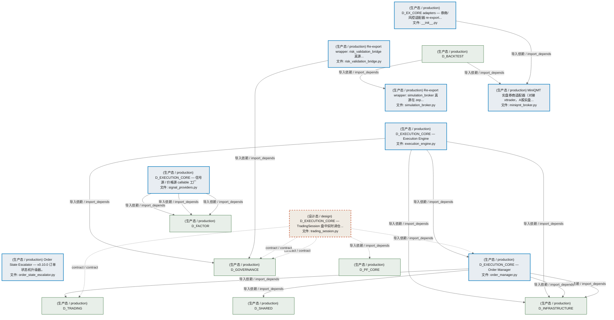
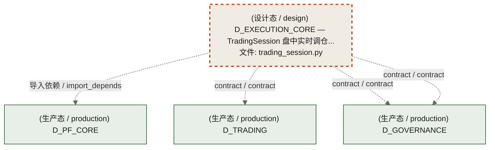
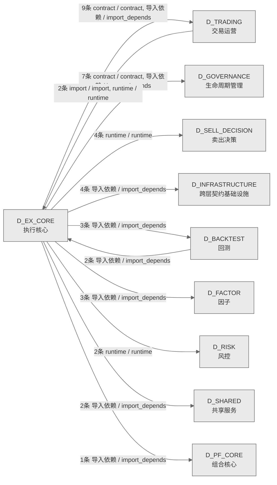

# 44_d_ex_core / 执行核心 / Execution Core

> **功能简介 / Overview**: 执行核心，负责订单执行引擎、执行策略和执行管理

> **文档作用 / Purpose**: 展示 执行核心（D_EX_CORE）功能域的模块清单、域内依赖关系、跨域依赖关系、架构分层视图，供架构审查和域治理参考。

> 本文档由 generate_domain_doc.py 从 depgraph (PostgreSQL) 自动生成
> 数据源: depgraph (PostgreSQL) nodes表 + edges表

## 域基本信息 / Domain Overview

| 字段 | 值 | Field | Value |
|------|------|-------|-------|
| 编号 | 44 | Number | 44 |
| 域ID | D_EX_CORE | Domain ID | D_EX_CORE |
| 域名称 | 执行核心 | Domain Name | Execution Core |
| 层级 | L2 业务域层 | Layer | L2 Domain |
| 模块数 | 9 | Module Count | 9 |
| 域内依赖 | 3 | Internal Dependencies | 3 |
| 跨域入边 | 4 | Cross-domain Incoming | 4 |
| 跨域出边 | 35 | Cross-domain Outgoing | 35 |
| 设计态模块 | 1 | Design Modules | 1 |
| 生产态模块 | 8 | Production Modules | 8 |
| 容量 | 8/150 (正常) | Capacity | 8/150 (正常) |
| 描述 | 执行核心，负责订单执行引擎、执行策略和执行管理 | Description | 执行核心，负责订单执行引擎、执行策略和执行管理 |

## 模块分层清单 / Module Layered List

> 按 architecture_layer 分组的模块清单（共 9 个模块 / 9 modules）。

### L0 基础设施层 / Infrastructure Layer (7 modules)

| # | 模块路径 / Module Path | 模块名称 / Module Name (功能简介 / Description) | 成熟度 / Maturity | 蓝图 / Blueprint |
|:--:|---------|---------|:---:|:---:|
| 1 | src/zephyr/ex_core/adapters/__init__.py | D_EX_CORE adapters — 券商/风控适配器 re-export... | 生产态 / production |  |
| 2 | src/zephyr/ex_core/adapters/miniqmt_broker.py | MiniQMT 实盘券商适配器（对接 xttrader，A股实盘... | 生产态 / production |  |
| 3 | src/zephyr/ex_core/adapters/risk_validation_bridge.py | Re-export wrapper: risk_validation_bridge 真源... | 生产态 / production |  |
| 4 | src/zephyr/ex_core/adapters/simulation_broker.py | Re-export wrapper: simulation_broker 真源在 zep... | 生产态 / production |  |
| 5 | src/zephyr/ex_core/execution_engine.py | D_EXECUTION_CORE — Execution Engine | 生产态 / production |  |
| 6 | src/zephyr/ex_core/order_manager.py | D_EXECUTION_CORE — Order Manager | 生产态 / production |  |
| 7 | src/zephyr/ex_core/signal_providers.py | D_EXECUTION_CORE — 信号源 / 价格源 callable 工厂 | 生产态 / production |  |

### L2 领域层 / Domain Layer (2 modules)

| # | 模块路径 / Module Path | 模块名称 / Module Name (功能简介 / Description) | 成熟度 / Maturity | 蓝图 / Blueprint |
|:--:|---------|---------|:---:|:---:|
| 1 | src/zephyr/ex_core/trading_session.py | D_EXECUTION_CORE — TradingSession 盘中实时调仓... | 设计态 / design |  |
| 2 | src/zephyr/governance/escalation/order_state_escalator.py | Order State Escalator — v0.10.0 订单状态机升级器。 | 生产态 / production |  |

## 域内依赖图 / Internal Dependency Diagram

> 依赖图内嵌在本文档中，IDE 可直接渲染显示。参考 decision_index.md 设计，分三个视图：合并全景图、运营态子图、设计态子图（按 design_maturity 实际值拆分）。
>
> **图例说明 / Legend**：
> - **实线边框 = 运营态模块**（production，已上线运行）
> - **虚线边框 = 设计态模块**（design，蓝图阶段，代码未写）
> - **实线箭头 = 运营态依赖**（已生效的依赖关系）
> - **虚线箭头 = 非运营态依赖**（计划中/验证中的依赖关系）

### 合并全景图（全部模块，标签标注成熟度）

> 展示全部 9 个模块（生产态 8 + 设计态 1），标签标注成熟度。

### 运营态子图（仅 design_maturity=production 的模块和依赖）

> 仅展示已上线运行的模块（共 8 个，2 条域内依赖）。

```mermaid
%%{init: {'theme': 'base', 'themeVariables': {'primaryColor': '#eaeaea', 'primaryTextColor': '#333333', 'primaryBorderColor': '#666666', 'lineColor': '#666666', 'secondaryColor': '#eaeaea', 'tertiaryColor': '#eaeaea', 'fontSize': '14px'}}}%%
flowchart TD
    src_zephyr_ex_core_adapters_init_py["(生产态 / production) D_EX_CORE adapters — 券商/风控适配器 re-export...<br/>文件: __init__.py"]
    src_zephyr_ex_core_adapters_risk_validation_bridge_py["(生产态 / production) Re-export wrapper: risk_validation_bridge 真源...<br/>文件: risk_validation_bridge.py"]
    src_zephyr_ex_core_adapters_simulation_broker_py["(生产态 / production) Re-export wrapper: simulation_broker 真源在 zep...<br/>文件: simulation_broker.py"]
    src_zephyr_ex_core_execution_engine_py["(生产态 / production) D_EXECUTION_CORE — Execution Engine<br/>文件: execution_engine.py"]
    src_zephyr_ex_core_signal_providers_py["(生产态 / production) D_EXECUTION_CORE — 信号源 / 价格源 callable 工厂<br/>文件: signal_providers.py"]
    src_zephyr_governance_escalation_order_state_escalator_py["(生产态 / production) Order State Escalator — v0.10.0 订单状态机升级器。<br/>文件: order_state_escalator.py"]
    src_zephyr_ex_core_adapters_init_py ~~~ src_zephyr_ex_core_adapters_risk_validation_bridge_py
    src_zephyr_ex_core_adapters_risk_validation_bridge_py ~~~ src_zephyr_ex_core_adapters_simulation_broker_py
    src_zephyr_ex_core_adapters_simulation_broker_py ~~~ src_zephyr_ex_core_execution_engine_py
    src_zephyr_ex_core_execution_engine_py ~~~ src_zephyr_ex_core_signal_providers_py
    src_zephyr_ex_core_signal_providers_py ~~~ src_zephyr_governance_escalation_order_state_escalator_py
    src_zephyr_ex_core_adapters_miniqmt_broker_py["(生产态 / production) MiniQMT 实盘券商适配器（对接 xttrader，A股实盘...<br/>文件: miniqmt_broker.py"]
    src_zephyr_ex_core_order_manager_py["(生产态 / production) D_EXECUTION_CORE — Order Manager<br/>文件: order_manager.py"]
    src_zephyr_ex_core_adapters_miniqmt_broker_py ~~~ src_zephyr_ex_core_order_manager_py
    src_zephyr_ex_core_execution_engine_py -->|导入依赖 / import_depends| src_zephyr_ex_core_order_manager_py
    src_zephyr_ex_core_adapters_init_py -->|导入依赖 / import_depends| src_zephyr_ex_core_adapters_miniqmt_broker_py
    D_INFRASTRUCTURE["(生产态 / production) D_INFRASTRUCTURE"]
    src_zephyr_ex_core_order_manager_py -->|导入依赖 / import_depends| D_INFRASTRUCTURE
    D_SHARED["(生产态 / production) D_SHARED"]
    src_zephyr_ex_core_order_manager_py -->|导入依赖 / import_depends| D_SHARED
    D_TRADING["(生产态 / production) D_TRADING"]
    src_zephyr_ex_core_order_manager_py -->|导入依赖 / import_depends| D_TRADING
    src_zephyr_ex_core_order_manager_py -->|导入依赖 / import_depends| D_INFRASTRUCTURE
    D_FACTOR["(生产态 / production) D_FACTOR"]
    src_zephyr_ex_core_signal_providers_py -->|导入依赖 / import_depends| D_FACTOR
    src_zephyr_ex_core_signal_providers_py -->|导入依赖 / import_depends| D_FACTOR
    src_zephyr_ex_core_signal_providers_py -->|导入依赖 / import_depends| D_FACTOR
    D_GOVERNANCE["(生产态 / production) D_GOVERNANCE"]
    src_zephyr_ex_core_adapters_risk_validation_bridge_py -->|导入依赖 / import_depends| D_GOVERNANCE
    src_zephyr_ex_core_execution_engine_py -->|导入依赖 / import_depends| D_INFRASTRUCTURE
    src_zephyr_ex_core_execution_engine_py -->|导入依赖 / import_depends| D_INFRASTRUCTURE
    src_zephyr_ex_core_execution_engine_py -->|导入依赖 / import_depends| D_GOVERNANCE
    src_zephyr_ex_core_adapters_miniqmt_broker_py -->|导入依赖 / import_depends| D_TRADING
    D_BACKTEST["(生产态 / production) D_BACKTEST"]
    src_zephyr_ex_core_adapters_miniqmt_broker_py -->|导入依赖 / import_depends| D_BACKTEST
    src_zephyr_ex_core_adapters_miniqmt_broker_py -->|导入依赖 / import_depends| D_TRADING
    src_zephyr_ex_core_adapters_miniqmt_broker_py -->|导入依赖 / import_depends| D_SHARED
    D_BACKTEST -->|导入依赖 / import_depends| src_zephyr_ex_core_adapters_simulation_broker_py
    D_BACKTEST -->|导入依赖 / import_depends| src_zephyr_ex_core_adapters_miniqmt_broker_py
    classDef production fill:#e8edf2,stroke:#0277bd,stroke-width:2px,color:#1a1a1a
    classDef design fill:#f0ebe3,stroke:#bf360c,stroke-width:2px,color:#1a1a1a,stroke-dasharray: 5 5
    classDef external_prod fill:#e8efe9,stroke:#1b5e20,stroke-width:1px,color:#1a1a1a
    classDef external_design fill:#efe5ea,stroke:#880e4f,stroke-width:1px,color:#1a1a1a,stroke-dasharray: 5 5
    class src_zephyr_ex_core_adapters_init_py,src_zephyr_ex_core_adapters_miniqmt_broker_py,src_zephyr_ex_core_adapters_risk_validation_bridge_py,src_zephyr_ex_core_adapters_simulation_broker_py,src_zephyr_ex_core_execution_engine_py,src_zephyr_ex_core_order_manager_py,src_zephyr_ex_core_signal_providers_py,src_zephyr_governance_escalation_order_state_escalator_py production
    class D_INFRASTRUCTURE,D_SHARED,D_TRADING,D_FACTOR,D_GOVERNANCE,D_BACKTEST external_prod
```

### 设计态子图（仅 design_maturity=design 的模块和依赖）

> 仅展示蓝图阶段、代码未写的设计态模块（共 1 个，0 条域内依赖）。

## 跨域依赖 / Cross-domain Dependencies

### 本域依赖的其他域（出边）/ Depends On

| # | 本域模块 / Source Module | → | 外部域-目标模块 / Target Module | 依赖类型 / Type |
|:--:|---------|:--:|---------|---------|
| 1 | MiniQMT 实盘券商适配器（对接 xttrader，A股实盘.... | → | D_BACKTEST 回测: 共享撮合逻辑模块（回测=实盘一致性核心） (matchi... | 导入依赖 / import_depends |
| 2 | D_EXECUTION_CORE — 信号源 / 价格源 callable 工... | → | D_FACTOR 因子: D-FACTOR-ANA-10 多因子合成——将多个因子值合成.... | 导入依赖 / import_depends |
| 3 | D_EXECUTION_CORE — 信号源 / 价格源 callable 工... | → | D_FACTOR 因子: D-FACTOR-03 因子评估回测运行器——端到端因子评... | 导入依赖 / import_depends |
| 4 | D_EXECUTION_CORE — 信号源 / 价格源 callable 工... | → | D_FACTOR 因子: ZephyrAlpha — D_FACTOR Alpha Factor Layer (fac... | 导入依赖 / import_depends |
| 5 | D_EX_CORE adapters — 券商/风控适配器 re-export... | → | D_GOVERNANCE 生命周期管理: D_EXECUTION_CORE — Risk Validation Bridge (DW-... | 导入依赖 / import_depends |
| 6 | D_EX_CORE adapters — 券商/风控适配器 re-export... | → | D_GOVERNANCE 生命周期管理: D_EXECUTION_CORE — Simulation Broker Adapter (... | 导入依赖 / import_depends |
| 7 | Re-export wrapper: risk_validation_bridge 真源.... | → | D_GOVERNANCE 生命周期管理: D_EXECUTION_CORE — Risk Validation Bridge (DW-... | 导入依赖 / import_depends |
| 8 | Re-export wrapper: simulation_broker 真源在 zep... | → | D_GOVERNANCE 生命周期管理: D_EXECUTION_CORE — Simulation Broker Adapter (... | 导入依赖 / import_depends |
| 9 | D_EXECUTION_CORE — Execution Engine (execution... | → | D_GOVERNANCE 生命周期管理: D_EXECUTION_CORE — Risk Validation Bridge (DW-... | 导入依赖 / import_depends |
| 10 | D_EXECUTION_CORE — TradingSession 盘中实时调仓... | → | D_GOVERNANCE 生命周期管理: D_EXECUTION_CORE — Risk Validation Bridge (DW-... | contract / contract |
| 11 | D_EXECUTION_CORE — TradingSession 盘中实时调仓... | → | D_GOVERNANCE 生命周期管理: D_PORTFOLIO_CORE — StrategyBase + StrategyMeta... | contract / contract |
| 12 | D_EXECUTION_CORE — Execution Engine (execution... | → | D_INFRASTRUCTURE 跨层契约基础设施: order.py | 导入依赖 / import_depends |
| 13 | D_EXECUTION_CORE — Execution Engine (execution... | → | D_INFRASTRUCTURE 跨层契约基础设施: risk_limits.py | 导入依赖 / import_depends |
| 14 | D_EXECUTION_CORE — Order Manager (order_manage... | → | D_INFRASTRUCTURE 跨层契约基础设施: fill.py | 导入依赖 / import_depends |
| 15 | D_EXECUTION_CORE — Order Manager (order_manage... | → | D_INFRASTRUCTURE 跨层契约基础设施: order.py | 导入依赖 / import_depends |
| 16 | D_EXECUTION_CORE — TradingSession 盘中实时调仓... | → | D_PF_CORE 组合核心: D_PORTFOLIO_CORE — StrategyRunner 策略运行器（... | 导入依赖 / import_depends |
| 17 | MiniQMT 实盘券商适配器（对接 xttrader，A股实盘.... | → | D_SHARED 共享服务: time_utils.py —— 时间/日期工具（Phase 9 新增 ... | 导入依赖 / import_depends |
| 18 | D_EXECUTION_CORE — Order Manager (order_manage... | → | D_SHARED 共享服务: OrderSide/OrderStatus/OrderType — 交易枚举真源... | 导入依赖 / import_depends |
| 19 | D_EX_CORE adapters — 券商/风控适配器 re-export... | → | D_TRADING 交易运营: D_EXECUTION_CORE — BrokerInterface (broker_int... | 导入依赖 / import_depends |
| 20 | MiniQMT 实盘券商适配器（对接 xttrader，A股实盘.... | → | D_TRADING 交易运营: D_EXECUTION_CORE — BrokerInterface (broker_int... | 导入依赖 / import_depends |
| 21 | MiniQMT 实盘券商适配器（对接 xttrader，A股实盘.... | → | D_TRADING 交易运营: Re-export wrapper: Fill 真源在 zephyr.shared.co... | 导入依赖 / import_depends |
| 22 | MiniQMT 实盘券商适配器（对接 xttrader，A股实盘.... | → | D_TRADING 交易运营: Re-export wrapper: Order 真源在 zephyr.shared.c... | 导入依赖 / import_depends |
| 23 | MiniQMT 实盘券商适配器（对接 xttrader，A股实盘.... | → | D_TRADING 交易运营: Re-export wrapper: PositionSnapshot 真源在 zeph... | 导入依赖 / import_depends |
| 24 | D_EXECUTION_CORE — Order Manager (order_manage... | → | D_TRADING 交易运营: D_EXECUTION_CORE — BrokerInterface (broker_int... | 导入依赖 / import_depends |
| 25 | D_EXECUTION_CORE — TradingSession 盘中实时调仓... | → | D_TRADING 交易运营: D_EXECUTION_CORE — BrokerInterface (broker_int... | contract / contract |

### 依赖本域的其他域（入边）/ Depended By

| # | 外部域-源模块 / Source Module | → | 本域模块 / Target Module | 依赖类型 / Type |
|:--:|---------|:--:|---------|---------|
| 1 | D_BACKTEST 回测: 事件驱动回测引擎（v1.1.0 新增，Tick 级回测核心... | → | MiniQMT 实盘券商适配器（对接 xttrader，A股实盘.... | 导入依赖 / import_depends |
| 2 | D_BACKTEST 回测: 事件驱动回测引擎（v1.1.0 新增，Tick 级回测核心... | → | Re-export wrapper: simulation_broker 真源在 zep... | 导入依赖 / import_depends |

### 跨域依赖图 / Cross-domain Dependency Diagram

> 本域与 9 个外部域直接连接（出边 35 条 + 入边 4 条 = 39 条）。只显示直接连接的域，不展开具体节点。

## 说明 / Notes

- **数据源 / Data Source**: `depgraph (PostgreSQL)` 的 `nodes`、`edges`、`domains` 表
- **生成器 / Generator**: `generate_domain_doc.py`（G2+G10 合并）
- **维护方式 / Maintenance**: 自动生成，全景图更新时刷新
- **文件名规则 / File Naming**: `{编号:02d}_{域ID小写}.md`，如 `16_d_trading.md`
- **图例说明 / Legend**: `[production]`=已上线 / `[design]`=设计中 / `[unknown]`=未知
