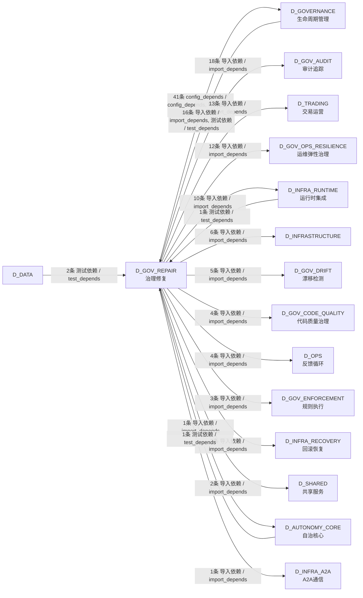

# 44_d_gov_repair / rollback / 治理修复 / Governance Repair

> **功能简介 / Overview**: 治理修复，负责治理问题自动修复和修复策略管理

> **文档作用 / Purpose**: 展示 治理修复（D_GOV_REPAIR）功能域的模块清单、域内依赖关系、跨域依赖关系、架构分层视图，供架构审查和域治理参考。

> 本文档由 generate_domain_doc.py 从 depgraph (PostgreSQL) 自动生成
> 最后更新: 2026-07-14 15:50:39
> 数据源: depgraph (PostgreSQL) nodes表 + edges表

## 域基本信息 / Domain Overview

| 字段 | 值 | Field | Value |
|------|------|-------|-------|
| 编号 | 44 | Number | 44 |
| 域ID | D_GOV_REPAIR | Domain ID | D_GOV_REPAIR |
| 域名称 | 治理修复 | Domain Name | Governance Repair |
| 层级 | L2 业务域层 | Layer | L2 Domain |
| 模块数 | 21 | Module Count | 21 |
| 域内依赖 | 3 | Internal Dependencies | 3 |
| 跨域入边 | 20 | Cross-domain Incoming | 20 |
| 跨域出边 | 122 | Cross-domain Outgoing | 122 |
| 设计态模块 | 0 | Design Modules | 0 |
| 原型态模块 | 17 | Prototype Modules | 17 |
| 生产态模块 | 4 | Production Modules | 4 |
| 容量 | 4/150 (正常) | Capacity | 4/150 (正常) |
| 描述 | 双轨Checkpoint(git commit + SQLite JSONL dump) | Description | 双轨Checkpoint(git commit + SQLite JSONL dump) |

## 模块分层清单 / Module Layered List

> 按 architecture_layer 分组的模块清单（共 21 个模块 / 21 modules）。

### L2 领域层 / Domain Layer (21 modules)

| # | 模块路径 / Module Path | 模块名称 / Module Name (功能简介 / Description) | 成熟度 / Maturity | 蓝图 / Blueprint |
|:--:|---------|---------|:---:|:---:|
| 1 | src/zephyr/governance/__init__.py | Agent 治理八件套 · Governance Domain — DOM-GO... | 生产态 / production | [MOD-GOVERNANCE](../../03_modules/_domain_governance/blueprint.md) |
| 2 | src/zephyr/governance/adapters/__init__.py | __init__.py | 原型态 / prototype |  |
| 3 | src/zephyr/governance/agent_spec/__init__.py | Agent Spec — MOD-INF-019 | 原型态 / prototype | [MOD-INF-019](../../03_modules/_domain_autonomy_core/agent_spec/blueprint.md) |
| 4 | src/zephyr/governance/architecture_governance/__init__.py | __init__.py | 原型态 / prototype |  |
| 5 | src/zephyr/governance/bridges/__init__.py | __init__.py | 原型态 / prototype |  |
| 6 | src/zephyr/governance/context_governance/__init__.py | __init__.py | 原型态 / prototype |  |
| 7 | src/zephyr/governance/data_governance/__init__.py | __init__.py | 原型态 / prototype |  |
| 8 | src/zephyr/governance/engine/__init__.py | D_FACTOR — Factors Package | 原型态 / prototype | [MOD-L02-001](../../03_modules/_domain_factor/blueprint.md) |
| 9 | src/zephyr/governance/financial_governance/__init__.py | __init__.py | 原型态 / prototype |  |
| 10 | src/zephyr/governance/financial_governance/budget_enforce... | budget_enforcement.py | 生产态 / production | [MOD-INF-024](../../03_modules/_domain_autonomy_perm/budget_enforcer/blueprint.md) |
| 11 | src/zephyr/governance/intelligence_governance/__init__.py | __init__.py | 原型态 / prototype |  |
| 12 | src/zephyr/governance/lifecycle_governance/__init__.py | __init__.py | 原型态 / prototype |  |
| 13 | src/zephyr/governance/observability_governance/__init__.py | __init__.py | 生产态 / production |  |
| 14 | src/zephyr/governance/persistence/__init__.py | __init__.py | 生产态 / production | [MOD-GOVERNANCE](../../03_modules/_domain_governance/blueprint.md) |
| 15 | src/zephyr/governance/services/__init__.py | __init__.py | 原型态 / prototype |  |
| 16 | src/zephyr/governance/strategies/__init__.py | Re-export wrapper: true source is zephyr.pf_cor... | 原型态 / prototype |  |
| 17 | src/zephyr/governance/trading_contracts/__init__.py | zephyr.trading.trading_contracts — trading-dom... | 原型态 / prototype | [MOD-INF-016](../../03_modules/_cross_layer/shared_core/blueprint.md) |
| 18 | src/zephyr/governance/trading_contracts/execution/__init_... | __init__.py | 原型态 / prototype |  |
| 19 | src/zephyr/governance/trading_contracts/market/__init__.py | __init__.py | 原型态 / prototype |  |
| 20 | src/zephyr/governance/trading_contracts/portfolio/contrac... | __init__.py | 原型态 / prototype |  |
| 21 | src/zephyr/governance/trading_contracts/risk/__init__.py | __init__.py | 原型态 / prototype |  |

## 域内依赖图 / Internal Dependency Diagram

> 依赖图内嵌在本文档中，IDE 可直接渲染显示。参考 decision_index.md 设计，分四个视图：合并全景图、运营态子图、设计态子图、原型态子图（按 design_maturity 实际值拆分）。
>
> **图例说明 / Legend**：
> - **实线边框 = 运营态模块**（production，已上线运行）
> - **虚线边框 = 设计态模块**（design，蓝图阶段，代码未写）
> - **虚线边框 = 原型态模块**（prototype，代码已写，验证中未稳定上线）
> - **实线箭头 = 运营态依赖**（已生效的依赖关系）
> - **虚线箭头 = 非运营态依赖**（计划中/验证中的依赖关系）

### 合并全景图（全部模块，标签标注成熟度）

> 展示全部 21 个模块（生产态 4 + 设计态 0 + 原型态 17），标签标注成熟度。

```mermaid
graph TD
    subgraph D_GOV_REPAIR["D_GOV_REPAIR 治理修复"]
        src_zephyr_governance_init_py["(生产态 / production) Agent 治理八件套 · Governance Domain — DOM-GO...<br/>文件: __init__.py"]
        src_zephyr_governance_adapters_init_py["(原型态 / prototype) __init__.py"]
        src_zephyr_governance_agent_spec_init_py["(原型态 / prototype) Agent Spec — MOD-INF-019<br/>文件: __init__.py"]
        src_zephyr_governance_architecture_governance_init_py["(原型态 / prototype) __init__.py"]
        src_zephyr_governance_bridges_init_py["(原型态 / prototype) __init__.py"]
        src_zephyr_governance_context_governance_init_py["(原型态 / prototype) __init__.py"]
        src_zephyr_governance_data_governance_init_py["(原型态 / prototype) __init__.py"]
        src_zephyr_governance_engine_init_py["(原型态 / prototype) D_FACTOR — Factors Package<br/>文件: __init__.py"]
        src_zephyr_governance_financial_governance_init_py["(原型态 / prototype) __init__.py"]
        src_zephyr_governance_financial_governance_budget_enforcement_py["(生产态 / production) budget_enforcement.py"]
        src_zephyr_governance_intelligence_governance_init_py["(原型态 / prototype) __init__.py"]
        src_zephyr_governance_lifecycle_governance_init_py["(原型态 / prototype) __init__.py"]
        src_zephyr_governance_observability_governance_init_py["(生产态 / production) __init__.py"]
        src_zephyr_governance_persistence_init_py["(生产态 / production) __init__.py"]
        src_zephyr_governance_services_init_py["(原型态 / prototype) __init__.py"]
        src_zephyr_governance_strategies_init_py["(原型态 / prototype) Re-export wrapper: true source is zephyr.pf_cor...<br/>文件: __init__.py"]
        src_zephyr_governance_trading_contracts_init_py["(原型态 / prototype) zephyr.trading.trading_contracts — trading-dom...<br/>文件: __init__.py"]
        src_zephyr_governance_trading_contracts_execution_init_py["(原型态 / prototype) __init__.py"]
        src_zephyr_governance_trading_contracts_market_init_py["(原型态 / prototype) __init__.py"]
        src_zephyr_governance_trading_contracts_portfolio_contracts_init_py["(原型态 / prototype) __init__.py"]
        src_zephyr_governance_trading_contracts_risk_init_py["(原型态 / prototype) __init__.py"]
    end
    src_zephyr_governance_init_py -.->|导入依赖 / import_depends| src_zephyr_governance_architecture_governance_init_py
    src_zephyr_governance_init_py -->|导入依赖 / import_depends| src_zephyr_governance_financial_governance_budget_enforcement_py
    src_zephyr_governance_data_governance_init_py -.->|导入依赖 / import_depends| src_zephyr_governance_init_py
    D_AUTONOMY_CORE["(生产态 / production) D_AUTONOMY_CORE"]
    src_zephyr_governance_financial_governance_budget_enforcement_py -->|导入依赖 / import_depends| D_AUTONOMY_CORE
    D_TRADING["(生产态 / production) D_TRADING"]
    src_zephyr_governance_trading_contracts_init_py -.->|导入依赖 / import_depends| D_TRADING
    D_GOVERNANCE["(原型态 / prototype) D_GOVERNANCE"]
    src_zephyr_governance_trading_contracts_execution_init_py -.->|导入依赖 / import_depends| D_GOVERNANCE
    src_zephyr_governance_trading_contracts_execution_init_py -.->|导入依赖 / import_depends| D_GOVERNANCE
    src_zephyr_governance_engine_init_py -.->|config_depends / config_depends| D_GOVERNANCE
    src_zephyr_governance_init_py -.->|导入依赖 / import_depends| D_GOVERNANCE
    D_GOV_DRIFT["(生产态 / production) D_GOV_DRIFT"]
    src_zephyr_governance_init_py -->|导入依赖 / import_depends| D_GOV_DRIFT
    D_GOV_OPS_RESILIENCE["(生产态 / production) D_GOV_OPS_RESILIENCE"]
    src_zephyr_governance_init_py -->|导入依赖 / import_depends| D_GOV_OPS_RESILIENCE
    D_GOV_AUDIT["(生产态 / production) D_GOV_AUDIT"]
    src_zephyr_governance_init_py -->|导入依赖 / import_depends| D_GOV_AUDIT
    src_zephyr_governance_init_py -.->|导入依赖 / import_depends| D_GOVERNANCE
    D_GOV_CODE_QUALITY["(原型态 / prototype) D_GOV_CODE_QUALITY"]
    src_zephyr_governance_init_py -.->|导入依赖 / import_depends| D_GOV_CODE_QUALITY
    src_zephyr_governance_init_py -->|导入依赖 / import_depends| D_GOVERNANCE
    src_zephyr_governance_init_py -->|导入依赖 / import_depends| D_GOV_AUDIT
    src_zephyr_governance_init_py -.->|导入依赖 / import_depends| D_GOV_CODE_QUALITY
    src_zephyr_governance_init_py -->|导入依赖 / import_depends| D_GOV_AUDIT
    D_AUTONOMY_CORE -.->|测试依赖 / test_depends| src_zephyr_governance_init_py
    D_DATA["(原型态 / prototype) D_DATA"]
    D_DATA -.->|测试依赖 / test_depends| src_zephyr_governance_observability_governance_init_py
    D_GOVERNANCE -->|导入依赖 / import_depends| src_zephyr_governance_init_py
    D_GOVERNANCE -.->|导入依赖 / import_depends| src_zephyr_governance_init_py
    D_GOVERNANCE -.->|导入依赖 / import_depends| src_zephyr_governance_init_py
    D_GOVERNANCE -.->|导入依赖 / import_depends| src_zephyr_governance_financial_governance_budget_enforcement_py
    D_GOVERNANCE -.->|导入依赖 / import_depends| src_zephyr_governance_init_py
    D_GOVERNANCE -.->|导入依赖 / import_depends| src_zephyr_governance_init_py
    D_GOVERNANCE -.->|导入依赖 / import_depends| src_zephyr_governance_init_py
    D_GOVERNANCE -.->|导入依赖 / import_depends| src_zephyr_governance_init_py
    D_GOVERNANCE -.->|导入依赖 / import_depends| src_zephyr_governance_init_py
    D_GOVERNANCE -.->|导入依赖 / import_depends| src_zephyr_governance_init_py
    D_GOVERNANCE -.->|导入依赖 / import_depends| src_zephyr_governance_init_py
    D_GOVERNANCE -.->|导入依赖 / import_depends| src_zephyr_governance_init_py
    D_GOVERNANCE -.->|测试依赖 / test_depends| src_zephyr_governance_init_py
    classDef production fill:#e1f5fe,stroke:#01579b,stroke-width:2px,color:#000
    classDef design fill:#fff3e0,stroke:#e65100,stroke-width:2px,color:#000,stroke-dasharray: 5 5
    classDef external_prod fill:#e8f5e9,stroke:#1b5e20,stroke-width:1px,color:#000
    classDef external_design fill:#fce4ec,stroke:#880e4f,stroke-width:1px,color:#000,stroke-dasharray: 5 5
    class src_zephyr_governance_init_py,src_zephyr_governance_financial_governance_budget_enforcement_py,src_zephyr_governance_observability_governance_init_py,src_zephyr_governance_persistence_init_py production
    class src_zephyr_governance_adapters_init_py,src_zephyr_governance_agent_spec_init_py,src_zephyr_governance_architecture_governance_init_py,src_zephyr_governance_bridges_init_py,src_zephyr_governance_context_governance_init_py,src_zephyr_governance_data_governance_init_py,src_zephyr_governance_engine_init_py,src_zephyr_governance_financial_governance_init_py,src_zephyr_governance_intelligence_governance_init_py,src_zephyr_governance_lifecycle_governance_init_py,src_zephyr_governance_services_init_py,src_zephyr_governance_strategies_init_py,src_zephyr_governance_trading_contracts_init_py,src_zephyr_governance_trading_contracts_execution_init_py,src_zephyr_governance_trading_contracts_market_init_py,src_zephyr_governance_trading_contracts_portfolio_contracts_init_py,src_zephyr_governance_trading_contracts_risk_init_py design
    class D_AUTONOMY_CORE,D_TRADING,D_GOV_DRIFT,D_GOV_OPS_RESILIENCE,D_GOV_AUDIT external_prod
    class D_GOVERNANCE,D_GOV_CODE_QUALITY,D_DATA external_design
```

### 运营态子图（仅 design_maturity=production 的模块和依赖）

> 仅展示已上线运行的模块（共 4 个，1 条域内依赖）。

```mermaid
graph TD
    subgraph D_GOV_REPAIR["D_GOV_REPAIR 治理修复"]
        src_zephyr_governance_init_py["(生产态 / production) Agent 治理八件套 · Governance Domain — DOM-GO...<br/>文件: __init__.py"]
        src_zephyr_governance_financial_governance_budget_enforcement_py["(生产态 / production) budget_enforcement.py"]
        src_zephyr_governance_observability_governance_init_py["(生产态 / production) __init__.py"]
        src_zephyr_governance_persistence_init_py["(生产态 / production) __init__.py"]
    end
    src_zephyr_governance_init_py -->|导入依赖 / import_depends| src_zephyr_governance_financial_governance_budget_enforcement_py
    D_AUTONOMY_CORE["(生产态 / production) D_AUTONOMY_CORE"]
    src_zephyr_governance_financial_governance_budget_enforcement_py -->|导入依赖 / import_depends| D_AUTONOMY_CORE
    D_GOVERNANCE["(原型态 / prototype) D_GOVERNANCE"]
    src_zephyr_governance_init_py -.->|导入依赖 / import_depends| D_GOVERNANCE
    D_GOV_DRIFT["(生产态 / production) D_GOV_DRIFT"]
    src_zephyr_governance_init_py -->|导入依赖 / import_depends| D_GOV_DRIFT
    D_GOV_OPS_RESILIENCE["(生产态 / production) D_GOV_OPS_RESILIENCE"]
    src_zephyr_governance_init_py -->|导入依赖 / import_depends| D_GOV_OPS_RESILIENCE
    D_GOV_AUDIT["(生产态 / production) D_GOV_AUDIT"]
    src_zephyr_governance_init_py -->|导入依赖 / import_depends| D_GOV_AUDIT
    src_zephyr_governance_init_py -.->|导入依赖 / import_depends| D_GOVERNANCE
    D_GOV_CODE_QUALITY["(原型态 / prototype) D_GOV_CODE_QUALITY"]
    src_zephyr_governance_init_py -.->|导入依赖 / import_depends| D_GOV_CODE_QUALITY
    src_zephyr_governance_init_py -->|导入依赖 / import_depends| D_GOVERNANCE
    src_zephyr_governance_init_py -->|导入依赖 / import_depends| D_GOV_AUDIT
    src_zephyr_governance_init_py -.->|导入依赖 / import_depends| D_GOV_CODE_QUALITY
    src_zephyr_governance_init_py -->|导入依赖 / import_depends| D_GOV_AUDIT
    D_INFRA_RUNTIME["(生产态 / production) D_INFRA_RUNTIME"]
    src_zephyr_governance_init_py -->|导入依赖 / import_depends| D_INFRA_RUNTIME
    src_zephyr_governance_init_py -.->|导入依赖 / import_depends| D_GOV_CODE_QUALITY
    src_zephyr_governance_init_py -->|导入依赖 / import_depends| D_GOV_AUDIT
    D_INFRA_RECOVERY["(原型态 / prototype) D_INFRA_RECOVERY"]
    src_zephyr_governance_init_py -.->|导入依赖 / import_depends| D_INFRA_RECOVERY
    D_AUTONOMY_CORE -.->|测试依赖 / test_depends| src_zephyr_governance_init_py
    D_DATA["(原型态 / prototype) D_DATA"]
    D_DATA -.->|测试依赖 / test_depends| src_zephyr_governance_observability_governance_init_py
    D_GOVERNANCE -->|导入依赖 / import_depends| src_zephyr_governance_init_py
    D_GOVERNANCE -.->|导入依赖 / import_depends| src_zephyr_governance_init_py
    D_GOVERNANCE -.->|导入依赖 / import_depends| src_zephyr_governance_init_py
    D_GOVERNANCE -.->|导入依赖 / import_depends| src_zephyr_governance_financial_governance_budget_enforcement_py
    D_GOVERNANCE -.->|导入依赖 / import_depends| src_zephyr_governance_init_py
    D_GOVERNANCE -.->|导入依赖 / import_depends| src_zephyr_governance_init_py
    D_GOVERNANCE -.->|导入依赖 / import_depends| src_zephyr_governance_init_py
    D_GOVERNANCE -.->|导入依赖 / import_depends| src_zephyr_governance_init_py
    D_GOVERNANCE -.->|导入依赖 / import_depends| src_zephyr_governance_init_py
    D_GOVERNANCE -.->|导入依赖 / import_depends| src_zephyr_governance_init_py
    D_GOVERNANCE -.->|导入依赖 / import_depends| src_zephyr_governance_init_py
    D_GOVERNANCE -.->|导入依赖 / import_depends| src_zephyr_governance_init_py
    D_GOVERNANCE -.->|测试依赖 / test_depends| src_zephyr_governance_init_py
    classDef production fill:#e1f5fe,stroke:#01579b,stroke-width:2px,color:#000
    classDef design fill:#fff3e0,stroke:#e65100,stroke-width:2px,color:#000,stroke-dasharray: 5 5
    classDef external_prod fill:#e8f5e9,stroke:#1b5e20,stroke-width:1px,color:#000
    classDef external_design fill:#fce4ec,stroke:#880e4f,stroke-width:1px,color:#000,stroke-dasharray: 5 5
    class src_zephyr_governance_init_py,src_zephyr_governance_financial_governance_budget_enforcement_py,src_zephyr_governance_observability_governance_init_py,src_zephyr_governance_persistence_init_py production
    class D_AUTONOMY_CORE,D_GOV_DRIFT,D_GOV_OPS_RESILIENCE,D_GOV_AUDIT,D_INFRA_RUNTIME external_prod
    class D_GOVERNANCE,D_GOV_CODE_QUALITY,D_INFRA_RECOVERY,D_DATA external_design
```

### 设计态子图（仅 design_maturity=design 的模块和依赖）

> 仅展示蓝图阶段、代码未写的设计态模块（共 0 个，0 条域内依赖）。

> （无设计态模块 / No design modules）

### 原型态子图（仅 design_maturity=prototype 的模块和依赖）

> 仅展示代码已写、验证中未稳定上线的原型态模块（共 17 个，0 条域内依赖）。

```mermaid
graph TD
    subgraph D_GOV_REPAIR["D_GOV_REPAIR 治理修复"]
        src_zephyr_governance_adapters_init_py["(原型态 / prototype) __init__.py"]
        src_zephyr_governance_agent_spec_init_py["(原型态 / prototype) Agent Spec — MOD-INF-019<br/>文件: __init__.py"]
        src_zephyr_governance_architecture_governance_init_py["(原型态 / prototype) __init__.py"]
        src_zephyr_governance_bridges_init_py["(原型态 / prototype) __init__.py"]
        src_zephyr_governance_context_governance_init_py["(原型态 / prototype) __init__.py"]
        src_zephyr_governance_data_governance_init_py["(原型态 / prototype) __init__.py"]
        src_zephyr_governance_engine_init_py["(原型态 / prototype) D_FACTOR — Factors Package<br/>文件: __init__.py"]
        src_zephyr_governance_financial_governance_init_py["(原型态 / prototype) __init__.py"]
        src_zephyr_governance_intelligence_governance_init_py["(原型态 / prototype) __init__.py"]
        src_zephyr_governance_lifecycle_governance_init_py["(原型态 / prototype) __init__.py"]
        src_zephyr_governance_services_init_py["(原型态 / prototype) __init__.py"]
        src_zephyr_governance_strategies_init_py["(原型态 / prototype) Re-export wrapper: true source is zephyr.pf_cor...<br/>文件: __init__.py"]
        src_zephyr_governance_trading_contracts_init_py["(原型态 / prototype) zephyr.trading.trading_contracts — trading-dom...<br/>文件: __init__.py"]
        src_zephyr_governance_trading_contracts_execution_init_py["(原型态 / prototype) __init__.py"]
        src_zephyr_governance_trading_contracts_market_init_py["(原型态 / prototype) __init__.py"]
        src_zephyr_governance_trading_contracts_portfolio_contracts_init_py["(原型态 / prototype) __init__.py"]
        src_zephyr_governance_trading_contracts_risk_init_py["(原型态 / prototype) __init__.py"]
    end
    D_TRADING["(生产态 / production) D_TRADING"]
    src_zephyr_governance_trading_contracts_init_py -.->|导入依赖 / import_depends| D_TRADING
    D_GOVERNANCE["(原型态 / prototype) D_GOVERNANCE"]
    src_zephyr_governance_trading_contracts_execution_init_py -.->|导入依赖 / import_depends| D_GOVERNANCE
    src_zephyr_governance_trading_contracts_execution_init_py -.->|导入依赖 / import_depends| D_GOVERNANCE
    src_zephyr_governance_engine_init_py -.->|config_depends / config_depends| D_GOVERNANCE
    src_zephyr_governance_adapters_init_py -.->|导入依赖 / import_depends| D_GOVERNANCE
    src_zephyr_governance_trading_contracts_execution_init_py -.->|导入依赖 / import_depends| D_GOVERNANCE
    D_INFRASTRUCTURE["(原型态 / prototype) D_INFRASTRUCTURE"]
    src_zephyr_governance_trading_contracts_init_py -.->|导入依赖 / import_depends| D_INFRASTRUCTURE
    src_zephyr_governance_trading_contracts_init_py -.->|导入依赖 / import_depends| D_INFRASTRUCTURE
    src_zephyr_governance_trading_contracts_init_py -.->|导入依赖 / import_depends| D_INFRASTRUCTURE
    src_zephyr_governance_trading_contracts_init_py -.->|导入依赖 / import_depends| D_INFRASTRUCTURE
    src_zephyr_governance_trading_contracts_init_py -.->|导入依赖 / import_depends| D_TRADING
    src_zephyr_governance_trading_contracts_execution_init_py -.->|导入依赖 / import_depends| D_GOVERNANCE
    src_zephyr_governance_trading_contracts_market_init_py -.->|导入依赖 / import_depends| D_GOVERNANCE
    src_zephyr_governance_trading_contracts_init_py -.->|导入依赖 / import_depends| D_TRADING
    src_zephyr_governance_trading_contracts_init_py -.->|导入依赖 / import_depends| D_TRADING
    classDef production fill:#e1f5fe,stroke:#01579b,stroke-width:2px,color:#000
    classDef design fill:#fff3e0,stroke:#e65100,stroke-width:2px,color:#000,stroke-dasharray: 5 5
    classDef external_prod fill:#e8f5e9,stroke:#1b5e20,stroke-width:1px,color:#000
    classDef external_design fill:#fce4ec,stroke:#880e4f,stroke-width:1px,color:#000,stroke-dasharray: 5 5
    class src_zephyr_governance_adapters_init_py,src_zephyr_governance_agent_spec_init_py,src_zephyr_governance_architecture_governance_init_py,src_zephyr_governance_bridges_init_py,src_zephyr_governance_context_governance_init_py,src_zephyr_governance_data_governance_init_py,src_zephyr_governance_engine_init_py,src_zephyr_governance_financial_governance_init_py,src_zephyr_governance_intelligence_governance_init_py,src_zephyr_governance_lifecycle_governance_init_py,src_zephyr_governance_services_init_py,src_zephyr_governance_strategies_init_py,src_zephyr_governance_trading_contracts_init_py,src_zephyr_governance_trading_contracts_execution_init_py,src_zephyr_governance_trading_contracts_market_init_py,src_zephyr_governance_trading_contracts_portfolio_contracts_init_py,src_zephyr_governance_trading_contracts_risk_init_py design
    class D_TRADING external_prod
    class D_GOVERNANCE,D_INFRASTRUCTURE external_design
```

## 跨域依赖 / Cross-domain Dependencies

### 本域依赖的其他域（出边）/ Depends On

| # | 本域模块 / Source Module | → | 外部域-目标模块 / Target Module | 依赖类型 / Type |
|:--:|---------|:--:|---------|---------|
| 1 | budget_enforcement.py | → | D_AUTONOMY_CORE 自治核心: skill_executor.py | 导入依赖 / import_depends |
| 2 | Agent 治理八件套 · Governance Domain — DOM-GO... | → | D_GOVERNANCE 生命周期管理: Construction Verifier — 施工验证器: 任务卡完成... | 导入依赖 / import_depends |
| 3 | Agent 治理八件套 · Governance Domain — DOM-GO... | → | D_GOVERNANCE 生命周期管理: LLMImpactAnalyzer — LLM-based commit 语义影响.... | 导入依赖 / import_depends |
| 4 | Agent 治理八件套 · Governance Domain — DOM-GO... | → | D_GOVERNANCE 生命周期管理: ZephyrAlpha — governance.base re-export shim. ... | 导入依赖 / import_depends |
| 5 | Agent 治理八件套 · Governance Domain — DOM-GO... | → | D_GOVERNANCE 生命周期管理: CapabilityLookup — 能力->真源文件反查注册表的.... | 导入依赖 / import_depends |
| 6 | Agent 治理八件套 · Governance Domain — DOM-GO... | → | D_GOVERNANCE 生命周期管理: context_manager.py | 导入依赖 / import_depends |
| 7 | Agent 治理八件套 · Governance Domain — DOM-GO... | → | D_GOVERNANCE 生命周期管理: context_recycling.py | 导入依赖 / import_depends |
| 8 | Agent 治理八件套 · Governance Domain — DOM-GO... | → | D_GOVERNANCE 生命周期管理: D_DATA — Akshare Data Provider (akshare_provid... | 导入依赖 / import_depends |
| 9 | Agent 治理八件套 · Governance Domain — DOM-GO... | → | D_GOVERNANCE 生命周期管理: 实验 — Experimentation Pipeline Layer (pipelin... | 导入依赖 / import_depends |
| 10 | Agent 治理八件套 · Governance Domain — DOM-GO... | → | D_GOVERNANCE 生命周期管理: DatabaseService: 统一管理两个数据库的连接池、生... | 导入依赖 / import_depends |
| 11 | __init__.py | → | D_GOVERNANCE 生命周期管理: D_EXECUTION_CORE — Risk Validation Bridge (DW-... | 导入依赖 / import_depends |
| 12 | __init__.py | → | D_GOVERNANCE 生命周期管理: D_EXECUTION_CORE — Simulation Broker Adapter (... | 导入依赖 / import_depends |
| 13 | __init__.py | → | D_GOVERNANCE 生命周期管理: D_EXECUTION_CORE — BrokerInterface (broker_int... | 导入依赖 / import_depends |
| 14 | Agent Spec — MOD-INF-019 (__init__.py) | → | D_GOVERNANCE 生命周期管理: G-CT-003 契约：Agent Spec -> RBAC 能力检查. (re... | 导入依赖 / import_depends |
| 15 | __init__.py | → | D_GOVERNANCE 生命周期管理: G-CT-007 — Audit.record_agent_spec() 记录 Agen... | config_depends / config_depends |
| 16 | __init__.py | → | D_GOVERNANCE 生命周期管理: Context Package — D-022-08 委托上下文包: 升级.... | config_depends / config_depends |
| 17 | D_FACTOR — Factors Package (__init__.py) | → | D_GOVERNANCE 生命周期管理: 实验 — Experimentation Pipeline Layer (pipelin... | config_depends / config_depends |
| 18 | __init__.py | → | D_GOVERNANCE 生命周期管理: Arbitrage Asymmetry Detector — v0.11.0 跨交易.... | config_depends / config_depends |
| 19 | budget_enforcement.py | → | D_GOVERNANCE 生命周期管理: model_router.py | 导入依赖 / import_depends |
| 20 | __init__.py | → | D_GOVERNANCE 生命周期管理: dataflowgraph Schema DDL + 连接入口 (dataflowgr... | 导入依赖 / import_depends |
| 21 | __init__.py | → | D_GOVERNANCE 生命周期管理: Memory Provenance — v0.9.0 记忆溯源追踪: 每条m... | config_depends / config_depends |
| 22 | Re-export wrapper: true source is zephyr.pf_cor... | → | D_GOVERNANCE 生命周期管理: D_PORTFOLIO_CORE — StrategyBase + StrategyMeta... | config_depends / config_depends |
| 23 | __init__.py | → | D_GOVERNANCE 生命周期管理: Re-export shim — 真源已合并至 zephyr.trading.t... | 导入依赖 / import_depends |
| 24 | __init__.py | → | D_GOVERNANCE 生命周期管理: Re-export shim — 真源已合并至 zephyr.trading.t... | 导入依赖 / import_depends |
| 25 | __init__.py | → | D_GOVERNANCE 生命周期管理: Re-export shim — 真源已合并至 zephyr.trading.t... | 导入依赖 / import_depends |
| 26 | __init__.py | → | D_GOVERNANCE 生命周期管理: Re-export shim — 真源已合并至 zephyr.trading.t... | 导入依赖 / import_depends |
| 27 | __init__.py | → | D_GOVERNANCE 生命周期管理: Re-export shim — 真源已合并至 zephyr.trading.t... | 导入依赖 / import_depends |
| 28 | __init__.py | → | D_GOVERNANCE 生命周期管理: Re-export shim — 真源已合并至 zephyr.trading.t... | 导入依赖 / import_depends |
| 29 | __init__.py | → | D_GOVERNANCE 生命周期管理: Re-export shim — 真源已合并至 zephyr.trading.t... | 导入依赖 / import_depends |
| 30 | __init__.py | → | D_GOVERNANCE 生命周期管理: Re-export shim — 真源已合并至 zephyr.trading.t... | 导入依赖 / import_depends |
| 31 | __init__.py | → | D_GOVERNANCE 生命周期管理: Re-export shim — 真源已合并至 zephyr.trading.t... | 导入依赖 / import_depends |
| 32 | __init__.py | → | D_GOVERNANCE 生命周期管理: Re-export shim — 真源已合并至 zephyr.trading.t... | 导入依赖 / import_depends |
| 33 | __init__.py | → | D_GOVERNANCE 生命周期管理: Re-export shim — 真源已合并至 zephyr.trading.t... | 导入依赖 / import_depends |
| 34 | __init__.py | → | D_GOVERNANCE 生命周期管理: Re-export shim — 真源已合并至 zephyr.trading.t... | 导入依赖 / import_depends |
| 35 | __init__.py | → | D_GOVERNANCE 生命周期管理: Re-export shim — 真源已合并至 zephyr.trading.t... | 导入依赖 / import_depends |
| 36 | __init__.py | → | D_GOVERNANCE 生命周期管理: Re-export shim — 真源已合并至 zephyr.trading.t... | 导入依赖 / import_depends |
| 37 | __init__.py | → | D_GOVERNANCE 生命周期管理: Re-export shim — 真源已合并至 zephyr.trading.t... | 导入依赖 / import_depends |
| 38 | __init__.py | → | D_GOVERNANCE 生命周期管理: Re-export shim — 真源已合并至 zephyr.trading.t... | 导入依赖 / import_depends |
| 39 | __init__.py | → | D_GOVERNANCE 生命周期管理: Re-export shim — 真源已合并至 zephyr.trading.t... | 导入依赖 / import_depends |
| 40 | __init__.py | → | D_GOVERNANCE 生命周期管理: Re-export shim — 真源已合并至 zephyr.trading.t... | 导入依赖 / import_depends |
| 41 | __init__.py | → | D_GOVERNANCE 生命周期管理: Re-export shim — 真源已合并至 zephyr.trading.t... | 导入依赖 / import_depends |
| 42 | __init__.py | → | D_GOVERNANCE 生命周期管理: Re-export shim — 真源已合并至 zephyr.trading.t... | 导入依赖 / import_depends |
| 43 | Agent 治理八件套 · Governance Domain — DOM-GO... | → | D_GOV_AUDIT 审计追踪: audit-trail.agent_signer — MOD-INF-020 · Agen... | 导入依赖 / import_depends |
| 44 | Agent 治理八件套 · Governance Domain — DOM-GO... | → | D_GOV_AUDIT 审计追踪: changelog_manager.py | 导入依赖 / import_depends |
| 45 | Agent 治理八件套 · Governance Domain — DOM-GO... | → | D_GOV_AUDIT 审计追踪: code_archaeology.py | 导入依赖 / import_depends |
| 46 | Agent 治理八件套 · Governance Domain — DOM-GO... | → | D_GOV_AUDIT 审计追踪: audit-trail.compliance_map — MOD-INF-020 · 合... | 导入依赖 / import_depends |
| 47 | Agent 治理八件套 · Governance Domain — DOM-GO... | → | D_GOV_AUDIT 审计追踪: corporate_actions.py | 导入依赖 / import_depends |
| 48 | Agent 治理八件套 · Governance Domain — DOM-GO... | → | D_GOV_AUDIT 审计追踪: dora_metrics.py | 导入依赖 / import_depends |
| 49 | Agent 治理八件套 · Governance Domain — DOM-GO... | → | D_GOV_AUDIT 审计追踪: audit-trail.feedback_self_audit — MOD-INF-020 ... | 导入依赖 / import_depends |
| 50 | Agent 治理八件套 · Governance Domain — DOM-GO... | → | D_GOV_AUDIT 审计追踪: glossary_matrix.py | 导入依赖 / import_depends |
| 51 | Agent 治理八件套 · Governance Domain — DOM-GO... | → | D_GOV_AUDIT 审计追踪: audit-trail.kb_gate — MOD-INF-020 · KB 审计门... | 导入依赖 / import_depends |
| 52 | Agent 治理八件套 · Governance Domain — DOM-GO... | → | D_GOV_AUDIT 审计追踪: audit-trail.privacy — MOD-INF-020 · PII 检测... | 导入依赖 / import_depends |
| 53 | Agent 治理八件套 · Governance Domain — DOM-GO... | → | D_GOV_AUDIT 审计追踪: LicenseType 枚举——许可证类型定义（P3 价值审判... | 导入依赖 / import_depends |
| 54 | Agent 治理八件套 · Governance Domain — DOM-GO... | → | D_GOV_AUDIT 审计追踪: spec_auditor.py | 导入依赖 / import_depends |
| 55 | Agent 治理八件套 · Governance Domain — DOM-GO... | → | D_GOV_AUDIT 审计追踪: audit-trail.supply_chain — MOD-INF-020 · 供应... | 导入依赖 / import_depends |
| 56 | Agent 治理八件套 · Governance Domain — DOM-GO... | → | D_GOV_AUDIT 审计追踪: wqa_scorer.py | 导入依赖 / import_depends |
| 57 | Agent 治理八件套 · Governance Domain — DOM-GO... | → | D_GOV_AUDIT 审计追踪: SnapshotManager — Event Sourcing 快照管理（DW-... | 导入依赖 / import_depends |
| 58 | Agent 治理八件套 · Governance Domain — DOM-GO... | → | D_GOV_AUDIT 审计追踪: fix_prioritizer — MOD-INF-028 §3.1 Stage 8 (f... | 导入依赖 / import_depends |
| 59 | Agent 治理八件套 · Governance Domain — DOM-GO... | → | D_GOV_AUDIT 审计追踪: Stage 7 自愈闭环 — 修复->自测->回滚. (self_hea... | 导入依赖 / import_depends |
| 60 | Agent 治理八件套 · Governance Domain — DOM-GO... | → | D_GOV_AUDIT 审计追踪: 7 SLI + 5 容量 SLI + 退化检测。定时自检,输出 HE... | 导入依赖 / import_depends |
| 61 | Agent 治理八件套 · Governance Domain — DOM-GO... | → | D_GOV_CODE_QUALITY 代码质量治理: 金丝雀工厂——生成已知oracle 文件 用于引擎检出+... | 导入依赖 / import_depends |
| 62 | Agent 治理八件套 · Governance Domain — DOM-GO... | → | D_GOV_CODE_QUALITY 代码质量治理: code-dedup-engine CLI——子命令映射+退出码+扫描... | 导入依赖 / import_depends |
| 63 | Agent 治理八件套 · Governance Domain — DOM-GO... | → | D_GOV_CODE_QUALITY 代码质量治理: 6Phase施工执行器 — Phase 0~5 执行状态追踪. (ph... | 导入依赖 / import_depends |
| 64 | Agent 治理八件套 · Governance Domain — DOM-GO... | → | D_GOV_CODE_QUALITY 代码质量治理: 盲点关闭追踪器 — 自动验证各轮盲点是否已覆盖. (... | 导入依赖 / import_depends |
| 65 | Agent 治理八件套 · Governance Domain — DOM-GO... | → | D_GOV_DRIFT 漂移检测: benchmark_integrity.py | 导入依赖 / import_depends |
| 66 | Agent 治理八件套 · Governance Domain — DOM-GO... | → | D_GOV_DRIFT 漂移检测: model_drift_monitor.py | 导入依赖 / import_depends |
| 67 | Agent 治理八件套 · Governance Domain — DOM-GO... | → | D_GOV_DRIFT 漂移检测: performance_baseline.py | 导入依赖 / import_depends |
| 68 | Agent 治理八件套 · Governance Domain — DOM-GO... | → | D_GOV_DRIFT 漂移检测: regime_detector.py | 导入依赖 / import_depends |
| 69 | Agent 治理八件套 · Governance Domain — DOM-GO... | → | D_GOV_DRIFT 漂移检测: Drift Detector — 兼容别名，SSoT已迁移至 zephyr... | 导入依赖 / import_depends |
| 70 | Agent 治理八件套 · Governance Domain — DOM-GO... | → | D_GOV_ENFORCEMENT 规则执行: GateEventAdapter — GateRepo 事件适配器（DW-000... | 导入依赖 / import_depends |
| 71 | Agent 治理八件套 · Governance Domain — DOM-GO... | → | D_GOV_ENFORCEMENT 规则执行: DLQ 重试策略 — 指数退避自动重试 (dlq_retry_pol... | 导入依赖 / import_depends |
| 72 | zephyr.trading.trading_contracts — trading-dom... | → | D_GOV_ENFORCEMENT 规则执行: Re-export shim — ComplianceRule 真源已合并至 z... | 导入依赖 / import_depends |
| 73 | Agent 治理八件套 · Governance Domain — DOM-GO... | → | D_GOV_OPS_RESILIENCE 运维弹性治理: consequence_manager.py | 导入依赖 / import_depends |
| 74 | Agent 治理八件套 · Governance Domain — DOM-GO... | → | D_GOV_OPS_RESILIENCE 运维弹性治理: Escalation Engine — MOD-INF-022 (escalation_en... | 导入依赖 / import_depends |
| 75 | Agent 治理八件套 · Governance Domain — DOM-GO... | → | D_GOV_OPS_RESILIENCE 运维弹性治理: incident_response.py | 导入依赖 / import_depends |
| 76 | Agent 治理八件套 · Governance Domain — DOM-GO... | → | D_GOV_OPS_RESILIENCE 运维弹性治理: spof_checker.py | 导入依赖 / import_depends |
| 77 | Agent 治理八件套 · Governance Domain — DOM-GO... | → | D_GOV_OPS_RESILIENCE 运维弹性治理: bandwidth_optimizer.py | 导入依赖 / import_depends |
| 78 | Agent 治理八件套 · Governance Domain — DOM-GO... | → | D_GOV_OPS_RESILIENCE 运维弹性治理: ops_foundation.py | 导入依赖 / import_depends |
| 79 | Agent 治理八件套 · Governance Domain — DOM-GO... | → | D_GOV_OPS_RESILIENCE 运维弹性治理: broker_resilience.py | 导入依赖 / import_depends |
| 80 | Agent 治理八件套 · Governance Domain — DOM-GO... | → | D_GOV_OPS_RESILIENCE 运维弹性治理: decision_fatigue.py | 导入依赖 / import_depends |
| 81 | Agent 治理八件套 · Governance Domain — DOM-GO... | → | D_GOV_OPS_RESILIENCE 运维弹性治理: decision_fatigue_cli.py | 导入依赖 / import_depends |
| 82 | budget_enforcement.py | → | D_GOV_OPS_RESILIENCE 运维弹性治理: Burn Rate Monitor — MOD-INF-024 (burn_rate_mon... | 导入依赖 / import_depends |
| 83 | budget_enforcement.py | → | D_GOV_OPS_RESILIENCE 运维弹性治理: degradation_manager.py | 导入依赖 / import_depends |
| 84 | budget_enforcement.py | → | D_GOV_OPS_RESILIENCE 运维弹性治理: timeout_guard.py | 导入依赖 / import_depends |
| 85 | zephyr.trading.trading_contracts — trading-dom... | → | D_INFRASTRUCTURE: capital_allocation_result.py | 导入依赖 / import_depends |
| 86 | zephyr.trading.trading_contracts — trading-dom... | → | D_INFRASTRUCTURE: execution_report.py | 导入依赖 / import_depends |
| 87 | zephyr.trading.trading_contracts — trading-dom... | → | D_INFRASTRUCTURE: fill.py | 导入依赖 / import_depends |
| 88 | zephyr.trading.trading_contracts — trading-dom... | → | D_INFRASTRUCTURE: model_serving_request.py | 导入依赖 / import_depends |
| 89 | zephyr.trading.trading_contracts — trading-dom... | → | D_INFRASTRUCTURE: order.py | 导入依赖 / import_depends |
| 90 | zephyr.trading.trading_contracts — trading-dom... | → | D_INFRASTRUCTURE: position.py | 导入依赖 / import_depends |
| 91 | Agent 治理八件套 · Governance Domain — DOM-GO... | → | D_INFRA_A2A A2A通信: 基础设施 Infrastructure — A2A Protocol 模块 (M... | 导入依赖 / import_depends |
| 92 | Agent 治理八件套 · Governance Domain — DOM-GO... | → | D_INFRA_RECOVERY 回滚恢复: MOD-INF-021 Rollback System — ZephyrAlpha 回滚... | 导入依赖 / import_depends |
| 93 | Agent 治理八件套 · Governance Domain — DOM-GO... | → | D_INFRA_RECOVERY 回滚恢复: ComplexityBudget — 回滚复杂度元 Budget 监控。 ... | 导入依赖 / import_depends |
| 94 | Agent 治理八件套 · Governance Domain — DOM-GO... | → | D_INFRA_RUNTIME 运行时集成: AssetClassifier — MOD-INF-026 L2 资产自动分类... | 导入依赖 / import_depends |
| 95 | Agent 治理八件套 · Governance Domain — DOM-GO... | → | D_INFRA_RUNTIME 运行时集成: AssetDashboard — MOD-INF-026 资产健康仪表盘生... | 导入依赖 / import_depends |
| 96 | Agent 治理八件套 · Governance Domain — DOM-GO... | → | D_INFRA_RUNTIME 运行时集成: MOD-INF-026 §18 — 资产依赖图。 (dependency.py) | 导入依赖 / import_depends |
| 97 | Agent 治理八件套 · Governance Domain — DOM-GO... | → | D_INFRA_RUNTIME 运行时集成: UnifiedAssetIndex — MOD-INF-026 L3 统一资产索.... | 导入依赖 / import_depends |
| 98 | Agent 治理八件套 · Governance Domain — DOM-GO... | → | D_INFRA_RUNTIME 运行时集成: AssetLifecycle — MOD-INF-026 L5 ITIL生命周期自... | 导入依赖 / import_depends |
| 99 | Agent 治理八件套 · Governance Domain — DOM-GO... | → | D_INFRA_RUNTIME 运行时集成: MOD-INF-026 §24-25 — Git 历史元数据提取 + 多 ... | 导入依赖 / import_depends |
| 100 | Agent 治理八件套 · Governance Domain — DOM-GO... | → | D_INFRA_RUNTIME 运行时集成: AssetInventoryModels — MOD-INF-026 Pydantic V2... | 导入依赖 / import_depends |
| 101 | Agent 治理八件套 · Governance Domain — DOM-GO... | → | D_INFRA_RUNTIME 运行时集成: ReconciliationEngine — MOD-INF-026 L4 注册表 v... | 导入依赖 / import_depends |
| 102 | Agent 治理八件套 · Governance Domain — DOM-GO... | → | D_INFRA_RUNTIME 运行时集成: MOD-INF-026 §17 — 24 个异构注册表统一解析适配... | 导入依赖 / import_depends |
| 103 | Agent 治理八件套 · Governance Domain — DOM-GO... | → | D_INFRA_RUNTIME 运行时集成: MOD-INF-026 §26 — 三重信任锚验证门 R20。 (tru... | 导入依赖 / import_depends |
| 104 | Agent 治理八件套 · Governance Domain — DOM-GO... | → | D_OPS 反馈循环: token_budget.py | 导入依赖 / import_depends |
| 105 | budget_enforcement.py | → | D_OPS 反馈循环: Budget Enforcer core engine — MOD-INF-024 (bud... | 导入依赖 / import_depends |
| 106 | budget_enforcement.py | → | D_OPS 反馈循环: Budget Enforcer data models — MOD-INF-024 (bud... | 导入依赖 / import_depends |
| 107 | budget_enforcement.py | → | D_OPS 反馈循环: budget_tracker.py | 导入依赖 / import_depends |
| 108 | zephyr.trading.trading_contracts — trading-dom... | → | D_SHARED 共享服务: OrderSide/OrderStatus/OrderType — 交易枚举真源... | 导入依赖 / import_depends |
| 109 | zephyr.trading.trading_contracts — trading-dom... | → | D_SHARED 共享服务: execution_rejection_error.py | 导入依赖 / import_depends |
| 110 | zephyr.trading.trading_contracts — trading-dom... | → | D_TRADING 交易运营: zephyr.trading.trading_contracts — trading-dom... | 导入依赖 / import_depends |
| 111 | zephyr.trading.trading_contracts — trading-dom... | → | D_TRADING 交易运营: factor_monitor_report.py | 导入依赖 / import_depends |
| 112 | zephyr.trading.trading_contracts — trading-dom... | → | D_TRADING 交易运营: factor_signal.py | 导入依赖 / import_depends |
| 113 | zephyr.trading.trading_contracts — trading-dom... | → | D_TRADING 交易运营: instrument.py | 导入依赖 / import_depends |
| 114 | zephyr.trading.trading_contracts — trading-dom... | → | D_TRADING 交易运营: macro_factor_signal.py | 导入依赖 / import_depends |
| 115 | zephyr.trading.trading_contracts — trading-dom... | → | D_TRADING 交易运营: market_data.py | 导入依赖 / import_depends |
| 116 | zephyr.trading.trading_contracts — trading-dom... | → | D_TRADING 交易运营: signal_degradation_warning.py | 导入依赖 / import_depends |
| 117 | zephyr.trading.trading_contracts — trading-dom... | → | D_TRADING 交易运营: synthesized_signal.py | 导入依赖 / import_depends |
| 118 | zephyr.trading.trading_contracts — trading-dom... | → | D_TRADING 交易运营: risk_dashboard_snapshot.py | 导入依赖 / import_depends |
| 119 | zephyr.trading.trading_contracts — trading-dom... | → | D_TRADING 交易运营: risk_limit_violation_error.py | 导入依赖 / import_depends |
| 120 | zephyr.trading.trading_contracts — trading-dom... | → | D_TRADING 交易运营: risk_limits.py | 导入依赖 / import_depends |
| 121 | zephyr.trading.trading_contracts — trading-dom... | → | D_TRADING 交易运营: risk_metrics.py | 导入依赖 / import_depends |
| 122 | zephyr.trading.trading_contracts — trading-dom... | → | D_TRADING 交易运营: risk_validator_protocol.py | 导入依赖 / import_depends |

### 依赖本域的其他域（入边）/ Depended By

| # | 外部域-源模块 / Source Module | → | 本域模块 / Target Module | 依赖类型 / Type |
|:--:|---------|:--:|---------|---------|
| 1 | D_AUTONOMY_CORE 自治核心: test_auto_test_generator.py | → | Agent 治理八件套 · Governance Domain — DOM-GO... | 测试依赖 / test_depends |
| 2 | D_DATA: test_data_lifecycle.py | → | Agent 治理八件套 · Governance Domain — DOM-GO... | 测试依赖 / test_depends |
| 3 | D_DATA: test_db_query.py | → | __init__.py | 测试依赖 / test_depends |
| 4 | D_GOVERNANCE 生命周期管理: C-track 端到端演示 —— 全流水线一次性运行 (dem... | → | Agent 治理八件套 · Governance Domain — DOM-GO... | 导入依赖 / import_depends |
| 5 | D_GOVERNANCE 生命周期管理: VMS Cron 监控器 — MOD-INF-011 · TASK-INF-0224... | → | Agent 治理八件套 · Governance Domain — DOM-GO... | 导入依赖 / import_depends |
| 6 | D_GOVERNANCE 生命周期管理: VMS Health Check 脚本 — MOD-INF-011 · Phase 3... | → | Agent 治理八件套 · Governance Domain — DOM-GO... | 导入依赖 / import_depends |
| 7 | D_GOVERNANCE 生命周期管理: VMS Phase 2 数据迁移脚本 — MOD-INF-011 (vms_mi... | → | Agent 治理八件套 · Governance Domain — DOM-GO... | 导入依赖 / import_depends |
| 8 | D_GOVERNANCE 生命周期管理: VMS 迁移 dry-run 脚本 — MOD-INF-011 Phase 2 前... | → | Agent 治理八件套 · Governance Domain — DOM-GO... | 导入依赖 / import_depends |
| 9 | D_GOVERNANCE 生命周期管理: verify_schema_health.py — depgraph (PostgreSQL... | → | Agent 治理八件套 · Governance Domain — DOM-GO... | 导入依赖 / import_depends |
| 10 | D_GOVERNANCE 生命周期管理: [INVARIANTS] 预算健康检查不可跳过;检查结果必须.... | → | budget_enforcement.py | 导入依赖 / import_depends |
| 11 | D_GOVERNANCE 生命周期管理: VMS Cron 监控器 — MOD-INF-011 · TASK-INF-0224... | → | Agent 治理八件套 · Governance Domain — DOM-GO... | 导入依赖 / import_depends |
| 12 | D_GOVERNANCE 生命周期管理: VMS Health Check 脚本 — MOD-INF-011 · Phase 3... | → | Agent 治理八件套 · Governance Domain — DOM-GO... | 导入依赖 / import_depends |
| 13 | D_GOVERNANCE 生命周期管理: VMS Phase 2 数据迁移脚本 — MOD-INF-011 (vms_mi... | → | Agent 治理八件套 · Governance Domain — DOM-GO... | 导入依赖 / import_depends |
| 14 | D_GOVERNANCE 生命周期管理: VMS 迁移 dry-run 脚本 — MOD-INF-011 Phase 2 前... | → | Agent 治理八件套 · Governance Domain — DOM-GO... | 导入依赖 / import_depends |
| 15 | D_GOVERNANCE 生命周期管理: scaffold.py — ZephyrAlpha 唯一创建入口（RULE-T... | → | Agent 治理八件套 · Governance Domain — DOM-GO... | 导入依赖 / import_depends |
| 16 | D_GOVERNANCE 生命周期管理: test_ssot_redefinition_gate.py — SSoT 符号重复... | → | Agent 治理八件套 · Governance Domain — DOM-GO... | 测试依赖 / test_depends |
| 17 | D_GOVERNANCE 生命周期管理: test_governance_drift_fix.py | → | Agent 治理八件套 · Governance Domain — DOM-GO... | 测试依赖 / test_depends |
| 18 | D_GOVERNANCE 生命周期管理: test_annotations.py | → | Agent 治理八件套 · Governance Domain — DOM-GO... | 测试依赖 / test_depends |
| 19 | D_GOVERNANCE 生命周期管理: test_governance_result_types.py | → | Agent 治理八件套 · Governance Domain — DOM-GO... | 测试依赖 / test_depends |
| 20 | D_INFRA_RUNTIME 运行时集成: test_temporal_drift_tracker.py | → | Agent 治理八件套 · Governance Domain — DOM-GO... | 测试依赖 / test_depends |

### 跨域依赖图 / Cross-domain Dependency Diagram

> 本域与 15 个外部域直接连接（出边 122 条 + 入边 20 条 = 142 条）。只显示直接连接的域，不展开具体节点。

## 说明 / Notes

- **数据源 / Data Source**: `depgraph (PostgreSQL)` 的 `nodes`、`edges`、`domains` 表
- **生成器 / Generator**: `generate_domain_doc.py`（G2+G10 合并）
- **维护方式 / Maintenance**: 自动生成，全景图更新时刷新
- **文件名规则 / File Naming**: `{编号:02d}_{域ID小写}.md`，如 `16_d_trading.md`
- **图例说明 / Legend**: `[production]`=已上线 / `[design]`=设计中 / `[prototype]`=原型 / `[unknown]`=未知
