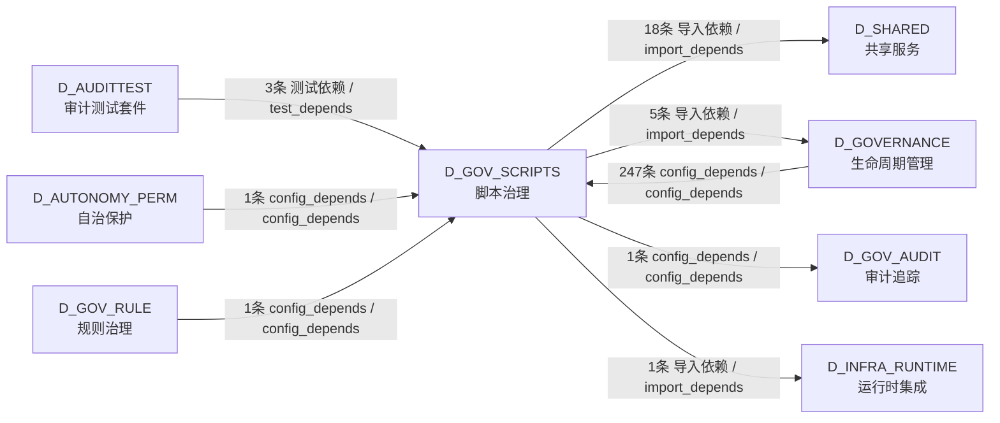

# 44_d_gov_scripts / script_governance / 脚本治理 / Script Governance

> **功能简介 / Overview**: 脚本治理，负责脚本生命周期管理和脚本质量门禁

> **文档作用 / Purpose**: 展示 脚本治理（D_GOV_SCRIPTS）功能域的模块清单、域内依赖关系、跨域依赖关系、架构分层视图，供架构审查和域治理参考。

> 本文档由 generate_domain_doc.py 从 depgraph (PostgreSQL) 自动生成
> 最后更新: 2026-07-13 00:56:20
> 数据源: depgraph (PostgreSQL) nodes表 + edges表

## 域基本信息 / Domain Overview

| 字段 | 值 | Field | Value |
|------|------|-------|-------|
| 编号 | 44 | Number | 44 |
| 域ID | D_GOV_SCRIPTS | Domain ID | D_GOV_SCRIPTS |
| 域名称 | 脚本治理 | Domain Name | Script Governance |
| 层级 | L2 业务域层 | Layer | L2 Domain |
| 模块数 | 89 | Module Count | 89 |
| 域内依赖 | 33 | Internal Dependencies | 33 |
| 跨域入边 | 252 | Cross-domain Incoming | 252 |
| 跨域出边 | 25 | Cross-domain Outgoing | 25 |
| 设计态模块 | 0 | Design Modules | 0 |
| 原型态模块 | 64 | Prototype Modules | 64 |
| 生产态模块 | 25 | Production Modules | 25 |
| 容量 | 25/150 (正常) | Capacity | 25/150 (正常) |
| 描述 | Phase Manager阶段管理 | Description | Phase Manager阶段管理 |

## 模块分层清单 / Module Layered List

> 按 architecture_layer 分组的模块清单（共 89 个模块 / 89 modules）。

### L1 基础层 / Foundation Layer (1 modules)

| # | 模块路径 / Module Path | 模块名称 / Module Name (功能简介 / Description) | 成熟度 / Maturity | 蓝图 / Blueprint |
|:--:|---------|---------|:---:|:---:|
| 1 | docs/01_policies_and_standards/_registry/catalogs/scripts... | [聚合节点 / Aggregated] 脚本集 / Script Collection (430 items) | 生产态 / production |  |
| ↳1 |   ↳ scripts/governance/__init__.py |  | - | - |
| ↳2 |   ↳ scripts/governance/_archive/one_off/analyze_orphan_c... |  | - | - |
| ↳3 |   ↳ scripts/governance/_archive/one_off/audit_post_sync_... |  | - | - |
| ↳4 |   ↳ scripts/governance/_archive/one_off/check_exam_case_... |  | - | - |
| ↳5 |   ↳ scripts/governance/_archive/one_off/check_rule_cover... |  | - | - |
| ↳6 |   ↳ scripts/governance/_archive/one_off/create_alignment... |  | - | - |
| ↳7 |   ↳ scripts/governance/_archive/one_off/dm105_depgraph_t... |  | - | - |
| ↳8 |   ↳ scripts/governance/_archive/one_off/fix_broken_post_... |  | - | - |
| ↳9 |   ↳ scripts/governance/_archive/one_off/group_orphan_mod... |  | - | - |
| ↳10 |   ↳ scripts/governance/_archive/one_off/list_phase0_tasks.py |  | - | - |
| ↳11 |   ↳ scripts/governance/_archive/one_off/migrate_clean_bu... |  | - | - |
| ↳12 |   ↳ scripts/governance/_archive/one_off/migrate_domain_i... |  | - | - |
| ↳13 |   ↳ scripts/governance/_archive/one_off/perf_depgraph_ba... |  | - | - |
| ↳14 |   ↳ scripts/governance/_archive/one_off/phase_a_backup.py |  | - | - |
| ↳15 |   ↳ scripts/governance/_archive/one_off/rename_kebab_to_... |  | - | - |
| ↳16 |   ↳ scripts/governance/_archive/one_off/rename_whitelist... |  | - | - |
| ↳17 |   ↳ scripts/governance/_archive/one_off/test_lock_scenar... |  | - | - |
| ↳18 |   ↳ scripts/governance/_archive/one_off/verify_final_del... |  | - | - |
| ↳19 |   ↳ scripts/governance/_archive/one_off/verify_rule_yaml... |  | - | - |
| ↳20 |   ↳ scripts/governance/_archive/prototype/adversarial_log.py |  | - | - |
| ↳21 |   ↳ scripts/governance/_archive/prototype/adversarial_sy... |  | - | - |
| ↳22 |   ↳ scripts/governance/_archive/prototype/audit_domain_n... |  | - | - |
| ↳23 |   ↳ scripts/governance/_archive/prototype/changelog.py |  | - | - |
| ↳24 |   ↳ scripts/governance/_archive/prototype/check_audit_rb... |  | - | - |
| ↳25 |   ↳ scripts/governance/_archive/prototype/construction_g... |  | - | - |
| ↳26 |   ↳ scripts/governance/_archive/prototype/generate_asset... |  | - | - |
| ↳27 |   ↳ scripts/governance/_archive/prototype/generate_nav_t... |  | - | - |
| ↳28 |   ↳ scripts/governance/_archive/prototype/rebuild_audit_... |  | - | - |
| ↳29 |   ↳ scripts/governance/_archive/prototype/scan_ground_tr... |  | - | - |
| ↳30 |   ↳ scripts/governance/_archive/prototype/session_simula... |  | - | - |
| ↳31 |   ↳ scripts/governance/_archive/prototype/sync_blueprint... |  | - | - |
| ↳32 |   ↳ scripts/governance/_archive/vms_ri/ri_boundary_check.py |  | - | - |
| ↳33 |   ↳ scripts/governance/_archive/vms_ri/ri_build_completi... |  | - | - |
| ↳34 |   ↳ scripts/governance/_archive/vms_ri/vms_blindspot_che... |  | - | - |
| ↳35 |   ↳ scripts/governance/_archive/vms_ri/vms_build_complet... |  | - | - |
| ↳36 |   ↳ scripts/governance/_archive/vms_ri/vms_cron_monitor.py |  | - | - |
| ↳37 |   ↳ scripts/governance/_archive/vms_ri/vms_cross_file_ch... |  | - | - |
| ↳38 |   ↳ scripts/governance/_archive/vms_ri/vms_health_check.py |  | - | - |
| ↳39 |   ↳ scripts/governance/_archive/vms_ri/vms_migrate.py |  | - | - |
| ↳40 |   ↳ scripts/governance/_archive/vms_ri/vms_migration_dry... |  | - | - |
| ↳41 |   ↳ scripts/governance/_archive/vms_ri/vms_phase_rollback.py |  | - | - |
| ↳42 |   ↳ scripts/governance/_archive/vms_ri/vms_version_sync_... |  | - | - |
| ↳43 |   ↳ scripts/governance/_shared/__init__.py |  | - | - |
| ↳44 |   ↳ scripts/governance/_shared/base.py |  | - | - |
| ↳45 |   ↳ scripts/governance/_shared/constants.py |  | - | - |
| ↳46 |   ↳ scripts/governance/_shared/deprecated_paths.yaml |  | - | - |
| ↳47 |   ↳ scripts/governance/_shared/encoding.py |  | - | - |
| ↳48 |   ↳ scripts/governance/_shared/file_utils.py |  | - | - |
| ↳49 |   ↳ scripts/governance/_shared/frontmatter.py |  | - | - |
| ↳50 |   ↳ scripts/governance/_shared/libcst_docstring_adder.py |  | - | - |
| ↳51 |   ↳ scripts/governance/_shared/plugin_contract_schema.yaml |  | - | - |
| ↳52 |   ↳ scripts/governance/_shared/registry_entry_count.py |  | - | - |
| ↳53 |   ↳ scripts/governance/_shared/thresholds.py |  | - | - |
| ↳54 |   ↳ scripts/governance/_shared/thresholds.yaml |  | - | - |
| ↳55 |   ↳ scripts/governance/_shared/walk.py |  | - | - |
| ↳56 |   ↳ scripts/governance/_shared/yaml_utils.py |  | - | - |
| ↳57 |   ↳ scripts/governance/_sync/check_p0_status.py |  | - | - |
| ↳58 |   ↳ scripts/governance/_sync/cleanup_p0_auto_bridged.py |  | - | - |
| ↳59 |   ↳ scripts/governance/_sync/cleanup_p0_ops_pending.py |  | - | - |
| ↳60 |   ↳ scripts/governance/_sync/fix_orphan_deps.py |  | - | - |
| ↳61 |   ↳ scripts/governance/_tasks/__init__.py |  | - | - |
| ↳62 |   ↳ scripts/governance/_tasks/list_phase0_tasks.py |  | - | - |
| ↳63 |   ↳ scripts/governance/_tasks/task_show.py |  | - | - |
| ↳64 |   ↳ scripts/governance/_tasks/task_summary.py |  | - | - |
| ↳65 |   ↳ scripts/governance/apply_dataflowgraph.py |  | - | - |
| ↳66 |   ↳ scripts/governance/apply_decisiongraph.py |  | - | - |
| ↳67 |   ↳ scripts/governance/apply_depgraph.py |  | - | - |
| ↳68 |   ↳ scripts/governance/architecture_health_dashboard.py |  | - | - |
| ↳69 |   ↳ scripts/governance/ast_import_rewriter.py |  | - | - |
| ↳70 |   ↳ scripts/governance/d10_performance/__init__.py |  | - | - |
| ↳71 |   ↳ scripts/governance/d10_performance/collect_system_th... |  | - | - |
| ↳72 |   ↳ scripts/governance/d11_compliance/__init__.py |  | - | - |
| ↳73 |   ↳ scripts/governance/d11_compliance/audit_registration.py |  | - | - |
| ↳74 |   ↳ scripts/governance/d11_compliance/check_ssot_gate.py |  | - | - |
| ↳75 |   ↳ scripts/governance/d11_compliance/check_test_structu... |  | - | - |
| ↳76 |   ↳ scripts/governance/d11_compliance/ci_self_check.py |  | - | - |
| ↳77 |   ↳ scripts/governance/d11_compliance/fix_shared_bypass.py |  | - | - |
| ↳78 |   ↳ scripts/governance/d11_compliance/g9_compliance_check.py |  | - | - |
| ↳79 |   ↳ scripts/governance/d11_compliance/task_self_check.py |  | - | - |
| ↳80 |   ↳ scripts/governance/d11_compliance/validate_blueprint... |  | - | - |
| ↳81 |   ↳ scripts/governance/d11_compliance/validate_commit_ga... |  | - | - |
| ↳82 |   ↳ scripts/governance/d11_compliance/validate_commit_me... |  | - | - |
| ↳83 |   ↳ scripts/governance/d11_compliance/validate_exit_codes.py |  | - | - |
| ↳84 |   ↳ scripts/governance/d11_compliance/validate_frozen_re... |  | - | - |
| ↳85 |   ↳ scripts/governance/d11_compliance/validate_manifest_... |  | - | - |
| ↳86 |   ↳ scripts/governance/d11_compliance/validate_no_utf8_b... |  | - | - |
| ↳87 |   ↳ scripts/governance/d11_compliance/validate_script_na... |  | - | - |
| ↳88 |   ↳ scripts/governance/d11_compliance/validate_script_qu... |  | - | - |
| ↳89 |   ↳ scripts/governance/d11_compliance/validate_task_deco... |  | - | - |
| ↳90 |   ↳ scripts/governance/d11_compliance/validate_truth_sou... |  | - | - |
| ↳91 |   ↳ scripts/governance/d11_compliance/validate_vocabular... |  | - | - |
| ↳92 |   ↳ scripts/governance/d11_compliance/verify_audit_integ... |  | - | - |
| ↳93 |   ↳ scripts/governance/d11_compliance/verify_key_imports.py |  | - | - |
| ↳94 |   ↳ scripts/governance/d11_compliance/verify_schema_heal... |  | - | - |
| ↳95 |   ↳ scripts/governance/d12_ai_hallucination/__init__.py |  | - | - |
| ↳96 |   ↳ scripts/governance/d12_ai_hallucination/check_logger... |  | - | - |
| ↳97 |   ↳ scripts/governance/d12_ai_hallucination/validate_gat... |  | - | - |
| ↳98 |   ↳ scripts/governance/d12_ai_hallucination/validate_ses... |  | - | - |
| ↳99 |   ↳ scripts/governance/d12_ai_hallucination/validate_ses... |  | - | - |
| ↳100 |   ↳ scripts/governance/d1_structure/__init__.py |  | - | - |
| | | > (仅显示前 100 个 items，共 430 个) | | |

### L2 领域层 / Domain Layer (88 modules)

| # | 模块路径 / Module Path | 模块名称 / Module Name (功能简介 / Description) | 成熟度 / Maturity | 蓝图 / Blueprint |
|:--:|---------|---------|:---:|:---:|
| 1 | scripts/governance/__init__.py | __init__.py | 生产态 / production |  |
| 2 | scripts/governance/_archive/one_off/analyze_orphan_consum... | analyze_orphan_consumers.py | 原型态 / prototype |  |
| 3 | scripts/governance/_archive/one_off/check_rule_coverage.py | governance/check_rule_coverage 脚本 — 规则文件... | 原型态 / prototype |  |
| 4 | scripts/governance/_archive/one_off/group_orphan_modules.py | 按域分组统计 ORPHAN MODULES — 用于建任务卡批量... | 原型态 / prototype |  |
| 5 | scripts/governance/_archive/one_off/migrate_clean_build_s... | OPS-2026062504: 数据清洗 depgraph (PostgreSQL) ... | 原型态 / prototype |  |
| 6 | scripts/governance/_archive/one_off/migrate_domain_id_hyp... | 域ID连字符→下划线迁移脚本（分层分批执行） | 原型态 / prototype |  |
| 7 | scripts/governance/_archive/one_off/perf_depgraph_baselin... | [INVARIANTS] 只读访问 depgraph（mode=ro）；禁止... | 原型态 / prototype |  |
| 8 | scripts/governance/_shared/__init__.py | __init__.py | 原型态 / prototype |  |
| 9 | scripts/governance/_shared/deprecated_paths.yaml | deprecated_paths.yaml | 生产态 / production | [MOD-INF-005](../../03_modules/_domain_governance/governance_automation/blueprint.md) |
| 10 | scripts/governance/_shared/plugin_contract_schema.yaml | plugin_contract_schema.yaml | 生产态 / production | [MOD-INF-005](../../03_modules/_domain_governance/governance_automation/blueprint.md) |
| 11 | scripts/governance/_shared/thresholds.yaml | thresholds.yaml | 生产态 / production | [MOD-INF-005](../../03_modules/_domain_governance/governance_automation/blueprint.md) |
| 12 | scripts/governance/_tasks/__init__.py | __init__.py | 原型态 / prototype |  |
| 13 | scripts/governance/ast_import_rewriter.py | AST-based import rewriter for governance direct... | 原型态 / prototype |  |
| 14 | scripts/governance/d10_performance/__init__.py | __init__.py | 原型态 / prototype | [MOD-INF-005](../../03_modules/_domain_governance/governance_automation/blueprint.md) |
| 15 | scripts/governance/d11_compliance/__init__.py | __init__.py | 原型态 / prototype |  |
| 16 | scripts/governance/d11_compliance/check_test_structure.py | 测试结构合规门禁——检查 test_*.py 文件结构，防... | 原型态 / prototype |  |
| 17 | scripts/governance/d11_compliance/verify_key_imports.py | governance/verify_key_imports 脚本 — 关键模块... | 原型态 / prototype |  |
| 18 | scripts/governance/d12_ai_hallucination/__init__.py | D12 AI 幻觉审计维度 | 原型态 / prototype | [MOD-INF-005](../../03_modules/_domain_governance/governance_automation/blueprint.md) |
| 19 | scripts/governance/d1_structure/__init__.py | __init__.py | 原型态 / prototype |  |
| 20 | scripts/governance/d2_links/__init__.py | D2 链接完整性 — 文档内/文档间交叉引用有效性审计。 | 原型态 / prototype | [MOD-INF-005](../../03_modules/_domain_governance/governance_automation/blueprint.md) |
| 21 | scripts/governance/d3_metadata/__init__.py | D3 元数据合规 — Markdown/YAML 文档元数据（fron... | 原型态 / prototype | [MOD-INF-005](../../03_modules/_domain_governance/governance_automation/blueprint.md) |
| 22 | scripts/governance/d3_metadata/validate_rule_frontmatter.py | GATE-RULE-FM: 校验所有 trae_XXX.yaml 的 frontma... | 原型态 / prototype | [MOD-INF-005](../../03_modules/_domain_governance/governance_automation/blueprint.md) |
| 23 | scripts/governance/d4_paths/__init__.py | D4 路径有效性 — 文件系统中路径引用/落位合规性... | 原型态 / prototype | [MOD-INF-005](../../03_modules/_domain_governance/governance_automation/blueprint.md) |
| 24 | scripts/governance/d5_architecture/__init__.py | __init__.py | 原型态 / prototype |  |
| 25 | scripts/governance/d5_architecture/analyzers/__init__.py | __init__.py | 原型态 / prototype | [MOD-INF-005](../../03_modules/_domain_governance/governance_automation/blueprint.md) |
| 26 | scripts/governance/d5_architecture/checkers/__init__.py | __init__.py | 原型态 / prototype | [MOD-INF-005](../../03_modules/_domain_governance/governance_automation/blueprint.md) |
| 27 | scripts/governance/d5_architecture/checkers/check_src_no_... | # [A_full] module_id=CFG-check-src-no-data | la... | 原型态 / prototype |  |
| 28 | scripts/governance/d5_architecture/detectors/__init__.py | __init__.py | 原型态 / prototype | [MOD-INF-005](../../03_modules/_domain_governance/governance_automation/blueprint.md) |
| 29 | scripts/governance/d5_architecture/dm200912_query_domains.py | DM-200912 Phase4-A: 查询 depgraph (PostgreSQL) ... | 原型态 / prototype |  |
| 30 | scripts/governance/d5_architecture/dm200916_write_direct.py | 从 depgraph (PostgreSQL) 派生 architecture_mode... | 原型态 / prototype |  |
| 31 | scripts/governance/d5_architecture/generators/__init__.py | __init__.py | 原型态 / prototype | [MOD-INF-005](../../03_modules/_domain_governance/governance_automation/blueprint.md) |
| 32 | scripts/governance/d5_architecture/generators/domain_name... | 功能域中文名称映射表 / Functional Domain Chines... | 原型态 / prototype |  |
| 33 | scripts/governance/d5_architecture/generators/generate_ca... | G11: 从 depgraph (PostgreSQL) 生成能力热力图 | 原型态 / prototype |  |
| 34 | scripts/governance/d5_architecture/generators/generate_ca... | G7: 从 depgraph (PostgreSQL) domains 表生成域容... | 原型态 / prototype |  |
| 35 | scripts/governance/d5_architecture/generators/generate_co... | G9: 从 depgraph (PostgreSQL) arch_constraints ... | 原型态 / prototype |  |
| 36 | scripts/governance/d5_architecture/generators/generate_cr... | G6: 从 depgraph (PostgreSQL) edges 表生成域间依... | 原型态 / prototype |  |
| 37 | scripts/governance/d5_architecture/generators/generate_de... | G8: 从 depgraph (PostgreSQL) nodes 表生成设计态... | 原型态 / prototype |  |
| 38 | scripts/governance/d5_architecture/generators/generate_do... | G3: 从 depgraph (PostgreSQL) edges 表生成指定域... | 原型态 / prototype |  |
| 39 | scripts/governance/d5_architecture/generators/generate_do... | G2+G10 合并：从 depgraph (PostgreSQL) nodes+edg... | 原型态 / prototype |  |
| 40 | scripts/governance/d5_architecture/generators/generate_do... | G5: 从 depgraph (PostgreSQL) domains+nodes 表生... | 原型态 / prototype |  |
| 41 | scripts/governance/d5_architecture/generators/generate_in... | G4: 从 depgraph (PostgreSQL) edges 表生成所有功... | 原型态 / prototype |  |
| 42 | scripts/governance/d5_architecture/generators/generate_na... | G10: 自动生成架构文档库导航总览 | 原型态 / prototype |  |
| 43 | scripts/governance/d5_architecture/generators/generate_pa... | G1: 从 depgraph (PostgreSQL) arch_directory_tre... | 原型态 / prototype |  |
| 44 | scripts/governance/d5_architecture/panorama_common.py | panorama_common.py — 四图投票共享工具（ARCH-05... | 原型态 / prototype |  |
| 45 | scripts/governance/d5_architecture/pre_commit_hook.ps1 | pre_commit_hook.ps1 | 原型态 / prototype |  |
| 46 | scripts/governance/d5_architecture/syncers/__init__.py | __init__.py | 原型态 / prototype | [MOD-INF-005](../../03_modules/_domain_governance/governance_automation/blueprint.md) |
| 47 | scripts/governance/d5_architecture/syncers/blueprint_fron... | blueprint_frontmatter_reconciler.py — 蓝图 fro... | 生产态 / production |  |
| 48 | scripts/governance/d5_architecture/validators/__init__.py | __init__.py | 原型态 / prototype |  |
| 49 | scripts/governance/d5_architecture/validators/blueprint/_... | __init__.py | 原型态 / prototype | [MOD-INF-005](../../03_modules/_domain_governance/governance_automation/blueprint.md) |
| 50 | scripts/governance/d5_architecture/validators/lifecycle/_... | __init__.py | 原型态 / prototype | [MOD-INF-005](../../03_modules/_domain_governance/governance_automation/blueprint.md) |
| 51 | scripts/governance/d5_architecture/validators/session/__i... | __init__.py | 原型态 / prototype | [MOD-INF-005](../../03_modules/_domain_governance/governance_automation/blueprint.md) |
| 52 | scripts/governance/d5_architecture/validators/yaml_md/__i... | __init__.py | 原型态 / prototype | [MOD-INF-005](../../03_modules/_domain_governance/governance_automation/blueprint.md) |
| 53 | scripts/governance/d6_security/__init__.py | D6 安全漏洞 — 代码/配置/依赖安全风险审计。 | 原型态 / prototype | [MOD-INF-005](../../03_modules/_domain_governance/governance_automation/blueprint.md) |
| 54 | scripts/governance/d7_code/__init__.py | D7 代码质量 — Python 代码静态分析与质量合规审计。 | 原型态 / prototype | [MOD-INF-005](../../03_modules/_domain_governance/governance_automation/blueprint.md) |
| 55 | scripts/governance/d8_doc_sync/__init__.py | D8 文档代码同步审计维度 | 原型态 / prototype | [MOD-INF-005](../../03_modules/_domain_governance/governance_automation/blueprint.md) |
| 56 | scripts/governance/d9_knowledge/__init__.py | D9 知识覆盖审计维度 | 原型态 / prototype | [MOD-INF-005](../../03_modules/_domain_governance/governance_automation/blueprint.md) |
| 57 | scripts/governance/generators/__init__.py | __init__.py | 原型态 / prototype | [MOD-INF-005](../../03_modules/_domain_governance/governance_automation/blueprint.md) |
| 58 | scripts/governance/git_hooks/post_commit_guard.sh | post_commit_guard.sh | 原型态 / prototype |  |
| 59 | scripts/governance/meta/__init__.py | meta/ — 脚本系统自我审计维度（第 13 维度） | 原型态 / prototype | [MOD-INF-005](../../03_modules/_domain_governance/governance_automation/blueprint.md) |
| 60 | scripts/governance/meta/burn_rate_acceleration.yaml | burn_rate_acceleration.yaml | 生产态 / production | [MOD-INF-005](../../03_modules/_domain_governance/governance_automation/blueprint.md) |
| 61 | scripts/governance/meta/compliance_framework_map.yaml | compliance_framework_map.yaml | 生产态 / production | [MOD-INF-005](../../03_modules/_domain_governance/governance_automation/blueprint.md) |
| 62 | scripts/governance/meta/drill_schedule.yaml | drill_schedule.yaml | 生产态 / production | [MOD-INF-005](../../03_modules/_domain_governance/governance_automation/blueprint.md) |
| 63 | scripts/governance/meta/error_budget_state.yaml | error_budget_state.yaml | 生产态 / production | [MOD-INF-005](../../03_modules/_domain_governance/governance_automation/blueprint.md) |
| 64 | scripts/governance/meta/false_negative_cases/__init__.py | False Negative Cases — Golden Test Case 库 | 原型态 / prototype | [MOD-INF-005](../../03_modules/_domain_governance/governance_automation/blueprint.md) |
| 65 | scripts/governance/meta/false_negative_cases/architecture... | architecture_cases.yaml | 生产态 / production | [MOD-INF-005](../../03_modules/_domain_governance/governance_automation/blueprint.md) |
| 66 | scripts/governance/meta/false_negative_cases/data_quality... | data_quality_cases.yaml | 生产态 / production | [MOD-INF-005](../../03_modules/_domain_governance/governance_automation/blueprint.md) |
| 67 | scripts/governance/meta/false_negative_cases/governance_c... | governance_cases.yaml | 生产态 / production | [MOD-INF-005](../../03_modules/_domain_governance/governance_automation/blueprint.md) |
| 68 | scripts/governance/meta/false_negative_cases/reconciliati... | reconciliation_registry_cases.yaml | 生产态 / production | [MOD-INF-005](../../03_modules/_domain_governance/governance_automation/blueprint.md) |
| 69 | scripts/governance/meta/false_negative_cases/security_cas... | security_cases.yaml | 生产态 / production | [MOD-INF-005](../../03_modules/_domain_governance/governance_automation/blueprint.md) |
| 70 | scripts/governance/meta/kill_switch_state.yaml | kill_switch_state.yaml | 生产态 / production | [MOD-INF-005](../../03_modules/_domain_governance/governance_automation/blueprint.md) |
| 71 | scripts/governance/meta/milestone_gate_matrix.yaml | milestone_gate_matrix.yaml | 生产态 / production | [MOD-INF-005](../../03_modules/_domain_governance/governance_automation/blueprint.md) |
| 72 | scripts/governance/meta/model_compatibility_matrix.yaml | model_compatibility_matrix.yaml | 生产态 / production | [MOD-INF-005](../../03_modules/_domain_governance/governance_automation/blueprint.md) |
| 73 | scripts/governance/meta/quality_enforcement_matrix.yaml | quality_enforcement_matrix.yaml | 生产态 / production | [MOD-INF-005](../../03_modules/_domain_governance/governance_automation/blueprint.md) |
| 74 | scripts/governance/meta/risk_mitigation_matrix.yaml | risk_mitigation_matrix.yaml | 生产态 / production | [MOD-INF-005](../../03_modules/_domain_governance/governance_automation/blueprint.md) |
| 75 | scripts/governance/meta/script_retirement_state.yaml | script_retirement_state.yaml | 生产态 / production | [MOD-INF-005](../../03_modules/_domain_governance/governance_automation/blueprint.md) |
| 76 | scripts/governance/meta/shadow_mode_state.yaml | shadow_mode_state.yaml | 生产态 / production | [MOD-INF-005](../../03_modules/_domain_governance/governance_automation/blueprint.md) |
| 77 | scripts/governance/meta/standalone_risk_matrix.yaml | standalone_risk_matrix.yaml | 生产态 / production | [MOD-INF-005](../../03_modules/_domain_governance/governance_automation/blueprint.md) |
| 78 | scripts/governance/meta/trust_tier_policy.yaml | trust_tier_policy.yaml | 生产态 / production | [MOD-INF-005](../../03_modules/_domain_governance/governance_automation/blueprint.md) |
| 79 | scripts/governance/migrate_sqlite_to_pg/migrate_data.py | SQLite → PostgreSQL 数据迁移脚本 | 原型态 / prototype |  |
| 80 | scripts/governance/observability/__init__.py | __init__.py | 原型态 / prototype | [MOD-INF-005](../../03_modules/_domain_governance/governance_automation/blueprint.md) |
| 81 | scripts/governance/repair/apply_verification_results.py | apply_verification_results.py — 第32轮验证结果... | 原型态 / prototype |  |
| 82 | scripts/governance/repair/concurrent_write_test.py | [INVARIANTS] 使用测试数据库副本，不污染生产数据 | 原型态 / prototype |  |
| 83 | scripts/governance/repair/p2_pg_concurrent_test.py | P2-T6 PostgreSQL 40并发写入红蓝测试。 | 原型态 / prototype |  |
| 84 | scripts/governance/sync_panorama_module.py | sync_panorama_module.py — 四图模块同步引擎（AR... | 生产态 / production |  |
| 85 | scripts/governance/test_concurrent_safety.ps1 | test_concurrent_safety.ps1 | 原型态 / prototype |  |
| 86 | scripts/governance/vms/__init__.py | __init__.py | 原型态 / prototype |  |
| 87 | tests/governance/scripts_governance/test_check_vocab_hard... | test_check_vocab_hardcode.py — GATE-VOCAB 检测... | 原型态 / prototype |  |
| 88 | tests/governance/scripts_governance/test_pre_write_gate.py | test_pre_write_gate.py — _check_session_overla... | 原型态 / prototype |  |

## 域内依赖图 / Internal Dependency Diagram

> 依赖图内嵌在本文档中，IDE 可直接渲染显示。参考 decision_index.md 设计，分四个视图：合并全景图、运营态子图、设计态子图、原型态子图（按 design_maturity 实际值拆分）。
>
> **图例说明 / Legend**：
> - **实线边框 = 运营态模块**（production，已上线运行）
> - **虚线边框 = 设计态模块**（design，蓝图阶段，代码未写）
> - **虚线边框 = 原型态模块**（prototype，代码已写，验证中未稳定上线）
> - **实线箭头 = 运营态依赖**（已生效的依赖关系）
> - **虚线箭头 = 非运营态依赖**（计划中/验证中的依赖关系）

### 合并全景图（全部模块，标签标注成熟度）

> 展示全部 89 个模块（生产态 25 + 设计态 0 + 原型态 64），标签标注成熟度。

#### 第 1 页 / 共 3 页

```mermaid
graph TD
    subgraph D_GOV_SCRIPTS["D_GOV_SCRIPTS 脚本治理"]
        docs_01_policies_and_standards_registry_catalogs_scripts_registry_yaml["(生产态 / production)  Script Collection — ARCH-052 聚合节点 production"]
        scripts_governance_init_py["(生产态 / production) __init__.py"]
        scripts_governance_archive_one_off_analyze_orphan_consumers_py["(原型态 / prototype) analyze_orphan_consumers.py"]
        scripts_governance_archive_one_off_check_rule_coverage_py["(原型态 / prototype) governance/check_rule_coverage 脚本 — 规则文件...<br/>文件: check_rule_coverage.py"]
        scripts_governance_archive_one_off_group_orphan_modules_py["(原型态 / prototype) 按域分组统计 ORPHAN MODULES — 用于建任务卡批量...<br/>文件: group_orphan_modules.py"]
        scripts_governance_archive_one_off_migrate_clean_build_status_py["(原型态 / prototype) OPS-2026062504: 数据清洗 depgraph (PostgreSQL) ...<br/>文件: migrate_clean_build_status.py"]
        scripts_governance_archive_one_off_migrate_domain_id_hyphen_to_underscore_py["(原型态 / prototype) 域ID连字符→下划线迁移脚本（分层分批执行）<br/>文件: migrate_domain_id_hyphen_to_underscore.py"]
        scripts_governance_archive_one_off_perf_depgraph_baseline_py["(原型态 / prototype) (INVARIANTS) 只读访问 depgraph（mode=ro）；禁止...<br/>文件: perf_depgraph_baseline.py"]
        scripts_governance_shared_init_py["(原型态 / prototype) __init__.py"]
        scripts_governance_shared_deprecated_paths_yaml["(生产态 / production) deprecated_paths.yaml"]
        scripts_governance_shared_plugin_contract_schema_yaml["(生产态 / production) plugin_contract_schema.yaml"]
        scripts_governance_shared_thresholds_yaml["(生产态 / production) thresholds.yaml"]
        scripts_governance_tasks_init_py["(原型态 / prototype) __init__.py"]
        scripts_governance_ast_import_rewriter_py["(原型态 / prototype) AST-based import rewriter for governance direct...<br/>文件: ast_import_rewriter.py"]
        scripts_governance_d10_performance_init_py["(原型态 / prototype) __init__.py"]
        scripts_governance_d11_compliance_init_py["(原型态 / prototype) __init__.py"]
        scripts_governance_d11_compliance_check_test_structure_py["(原型态 / prototype) 测试结构合规门禁——检查 test_*.py 文件结构，防...<br/>文件: check_test_structure.py"]
        scripts_governance_d11_compliance_verify_key_imports_py["(原型态 / prototype) governance/verify_key_imports 脚本 — 关键模块...<br/>文件: verify_key_imports.py"]
        scripts_governance_d12_ai_hallucination_init_py["(原型态 / prototype) D12 AI 幻觉审计维度<br/>文件: __init__.py"]
        scripts_governance_d1_structure_init_py["(原型态 / prototype) __init__.py"]
        scripts_governance_d2_links_init_py["(原型态 / prototype) D2 链接完整性 — 文档内/文档间交叉引用有效性审计。<br/>文件: __init__.py"]
        scripts_governance_d3_metadata_init_py["(原型态 / prototype) D3 元数据合规 — Markdown/YAML 文档元数据（fron...<br/>文件: __init__.py"]
        scripts_governance_d3_metadata_validate_rule_frontmatter_py["(原型态 / prototype) GATE-RULE-FM: 校验所有 trae_XXX.yaml 的 frontma...<br/>文件: validate_rule_frontmatter.py"]
        scripts_governance_d4_paths_init_py["(原型态 / prototype) D4 路径有效性 — 文件系统中路径引用/落位合规性...<br/>文件: __init__.py"]
        scripts_governance_d5_architecture_init_py["(原型态 / prototype) __init__.py"]
        scripts_governance_d5_architecture_analyzers_init_py["(原型态 / prototype) __init__.py"]
        scripts_governance_d5_architecture_checkers_init_py["(原型态 / prototype) __init__.py"]
        scripts_governance_d5_architecture_checkers_check_src_no_data_py["(原型态 / prototype) # (A_full) module_id=CFG-check-src-no-data / la...<br/>文件: check_src_no_data.py"]
        scripts_governance_d5_architecture_detectors_init_py["(原型态 / prototype) __init__.py"]
        scripts_governance_d5_architecture_dm200912_query_domains_py["(原型态 / prototype) DM-200912 Phase4-A: 查询 depgraph (PostgreSQL) ...<br/>文件: dm200912_query_domains.py"]
    end
    scripts_governance_ast_import_rewriter_py -.->|config_depends / config_depends| scripts_governance_init_py
    scripts_governance_d11_compliance_verify_key_imports_py -.->|config_depends / config_depends| scripts_governance_d11_compliance_init_py
    scripts_governance_d3_metadata_validate_rule_frontmatter_py -.->|config_depends / config_depends| scripts_governance_d3_metadata_init_py
    scripts_governance_d5_architecture_checkers_check_src_no_data_py -.->|config_depends / config_depends| scripts_governance_d5_architecture_checkers_init_py
    scripts_governance_archive_one_off_check_rule_coverage_py -.->|config_depends / config_depends| scripts_governance_archive_one_off_analyze_orphan_consumers_py
    scripts_governance_archive_one_off_migrate_clean_build_status_py -.->|config_depends / config_depends| scripts_governance_archive_one_off_analyze_orphan_consumers_py
    scripts_governance_archive_one_off_group_orphan_modules_py -.->|config_depends / config_depends| scripts_governance_archive_one_off_analyze_orphan_consumers_py
    scripts_governance_archive_one_off_migrate_domain_id_hyphen_to_underscore_py -.->|config_depends / config_depends| scripts_governance_archive_one_off_analyze_orphan_consumers_py
    scripts_governance_shared_plugin_contract_schema_yaml -.->|config_depends / config_depends| scripts_governance_shared_init_py
    scripts_governance_shared_thresholds_yaml -.->|config_depends / config_depends| scripts_governance_shared_init_py
    scripts_governance_shared_deprecated_paths_yaml -.->|config_depends / config_depends| scripts_governance_shared_init_py
    D_SHARED["(生产态 / production) D_SHARED"]
    scripts_governance_d11_compliance_check_test_structure_py -.->|导入依赖 / import_depends| D_SHARED
    scripts_governance_d5_architecture_dm200912_query_domains_py -.->|导入依赖 / import_depends| D_SHARED
    scripts_governance_archive_one_off_analyze_orphan_consumers_py -.->|导入依赖 / import_depends| D_SHARED
    scripts_governance_archive_one_off_perf_depgraph_baseline_py -.->|导入依赖 / import_depends| D_SHARED
    D_AUDITTEST["(原型态 / prototype) D_AUDITTEST"]
    D_AUDITTEST -.->|测试依赖 / test_depends| scripts_governance_init_py
    D_GOVERNANCE["(原型态 / prototype) D_GOVERNANCE"]
    D_GOVERNANCE -.->|config_depends / config_depends| scripts_governance_init_py
    D_GOVERNANCE -.->|config_depends / config_depends| scripts_governance_init_py
    D_GOVERNANCE -.->|config_depends / config_depends| scripts_governance_init_py
    D_GOVERNANCE -.->|config_depends / config_depends| scripts_governance_init_py
    D_GOVERNANCE -.->|config_depends / config_depends| scripts_governance_d10_performance_init_py
    D_GOVERNANCE -.->|config_depends / config_depends| scripts_governance_d11_compliance_init_py
    D_GOVERNANCE -.->|config_depends / config_depends| scripts_governance_d11_compliance_init_py
    D_GOVERNANCE -.->|config_depends / config_depends| scripts_governance_d11_compliance_init_py
    D_GOVERNANCE -.->|config_depends / config_depends| scripts_governance_d11_compliance_init_py
    D_GOVERNANCE -.->|config_depends / config_depends| scripts_governance_d11_compliance_init_py
    D_GOVERNANCE -.->|config_depends / config_depends| scripts_governance_d11_compliance_init_py
    D_GOVERNANCE -.->|config_depends / config_depends| scripts_governance_d11_compliance_init_py
    D_GOVERNANCE -.->|config_depends / config_depends| scripts_governance_d11_compliance_init_py
    D_GOVERNANCE -.->|config_depends / config_depends| scripts_governance_d11_compliance_init_py
    classDef production fill:#e1f5fe,stroke:#01579b,stroke-width:2px,color:#000
    classDef design fill:#fff3e0,stroke:#e65100,stroke-width:2px,color:#000,stroke-dasharray: 5 5
    classDef external_prod fill:#e8f5e9,stroke:#1b5e20,stroke-width:1px,color:#000
    classDef external_design fill:#fce4ec,stroke:#880e4f,stroke-width:1px,color:#000,stroke-dasharray: 5 5
    class docs_01_policies_and_standards_registry_catalogs_scripts_registry_yaml,scripts_governance_init_py,scripts_governance_shared_deprecated_paths_yaml,scripts_governance_shared_plugin_contract_schema_yaml,scripts_governance_shared_thresholds_yaml production
    class scripts_governance_archive_one_off_analyze_orphan_consumers_py,scripts_governance_archive_one_off_check_rule_coverage_py,scripts_governance_archive_one_off_group_orphan_modules_py,scripts_governance_archive_one_off_migrate_clean_build_status_py,scripts_governance_archive_one_off_migrate_domain_id_hyphen_to_underscore_py,scripts_governance_archive_one_off_perf_depgraph_baseline_py,scripts_governance_shared_init_py,scripts_governance_tasks_init_py,scripts_governance_ast_import_rewriter_py,scripts_governance_d10_performance_init_py,scripts_governance_d11_compliance_init_py,scripts_governance_d11_compliance_check_test_structure_py,scripts_governance_d11_compliance_verify_key_imports_py,scripts_governance_d12_ai_hallucination_init_py,scripts_governance_d1_structure_init_py,scripts_governance_d2_links_init_py,scripts_governance_d3_metadata_init_py,scripts_governance_d3_metadata_validate_rule_frontmatter_py,scripts_governance_d4_paths_init_py,scripts_governance_d5_architecture_init_py,scripts_governance_d5_architecture_analyzers_init_py,scripts_governance_d5_architecture_checkers_init_py,scripts_governance_d5_architecture_checkers_check_src_no_data_py,scripts_governance_d5_architecture_detectors_init_py,scripts_governance_d5_architecture_dm200912_query_domains_py design
    class D_SHARED external_prod
    class D_AUDITTEST,D_GOVERNANCE external_design
```



#### 第 2 页 / 共 3 页

```mermaid
graph TD
    subgraph D_GOV_SCRIPTS["D_GOV_SCRIPTS 脚本治理"]
        scripts_governance_d5_architecture_dm200916_write_direct_py["(原型态 / prototype) 从 depgraph (PostgreSQL) 派生 architecture_mode...<br/>文件: dm200916_write_direct.py"]
        scripts_governance_d5_architecture_generators_init_py["(原型态 / prototype) __init__.py"]
        scripts_governance_d5_architecture_generators_domain_name_mapping_py["(原型态 / prototype) 功能域中文名称映射表 / Functional Domain Chines...<br/>文件: domain_name_mapping.py"]
        scripts_governance_d5_architecture_generators_generate_capability_heatmap_py["(原型态 / prototype) G11: 从 depgraph (PostgreSQL) 生成能力热力图<br/>文件: generate_capability_heatmap.py"]
        scripts_governance_d5_architecture_generators_generate_capacity_report_py["(原型态 / prototype) G7: 从 depgraph (PostgreSQL) domains 表生成域容...<br/>文件: generate_capacity_report.py"]
        scripts_governance_d5_architecture_generators_generate_constraint_violations_py["(原型态 / prototype) G9: 从 depgraph (PostgreSQL) arch_constraints ...<br/>文件: generate_constraint_violations.py"]
        scripts_governance_d5_architecture_generators_generate_cross_domain_matrix_py["(原型态 / prototype) G6: 从 depgraph (PostgreSQL) edges 表生成域间依...<br/>文件: generate_cross_domain_matrix.py"]
        scripts_governance_d5_architecture_generators_generate_design_vs_production_py["(原型态 / prototype) G8: 从 depgraph (PostgreSQL) nodes 表生成设计态...<br/>文件: generate_design_vs_production.py"]
        scripts_governance_d5_architecture_generators_generate_domain_dependency_diagram_py["(原型态 / prototype) G3: 从 depgraph (PostgreSQL) edges 表生成指定域...<br/>文件: generate_domain_dependency_diagram.py"]
        scripts_governance_d5_architecture_generators_generate_domain_doc_py["(原型态 / prototype) G2+G10 合并：从 depgraph (PostgreSQL) nodes+edg...<br/>文件: generate_domain_doc.py"]
        scripts_governance_d5_architecture_generators_generate_domain_index_py["(原型态 / prototype) G5: 从 depgraph (PostgreSQL) domains+nodes 表生...<br/>文件: generate_domain_index.py"]
        scripts_governance_d5_architecture_generators_generate_integration_topology_py["(原型态 / prototype) G4: 从 depgraph (PostgreSQL) edges 表生成所有功...<br/>文件: generate_integration_topology.py"]
        scripts_governance_d5_architecture_generators_generate_navigation_index_py["(原型态 / prototype) G10: 自动生成架构文档库导航总览<br/>文件: generate_navigation_index.py"]
        scripts_governance_d5_architecture_generators_generate_path_tree_py["(原型态 / prototype) G1: 从 depgraph (PostgreSQL) arch_directory_tre...<br/>文件: generate_path_tree.py"]
        scripts_governance_d5_architecture_panorama_common_py["(原型态 / prototype) panorama_common.py — 四图投票共享工具（ARCH-05...<br/>文件: panorama_common.py"]
        scripts_governance_d5_architecture_pre_commit_hook_ps1["(原型态 / prototype) pre_commit_hook.ps1"]
        scripts_governance_d5_architecture_syncers_init_py["(原型态 / prototype) __init__.py"]
        scripts_governance_d5_architecture_syncers_blueprint_frontmatter_reconciler_py["(生产态 / production) blueprint_frontmatter_reconciler.py — 蓝图 fro...<br/>文件: blueprint_frontmatter_reconciler.py"]
        scripts_governance_d5_architecture_validators_init_py["(原型态 / prototype) __init__.py"]
        scripts_governance_d5_architecture_validators_blueprint_init_py["(原型态 / prototype) __init__.py"]
        scripts_governance_d5_architecture_validators_lifecycle_init_py["(原型态 / prototype) __init__.py"]
        scripts_governance_d5_architecture_validators_session_init_py["(原型态 / prototype) __init__.py"]
        scripts_governance_d5_architecture_validators_yaml_md_init_py["(原型态 / prototype) __init__.py"]
        scripts_governance_d6_security_init_py["(原型态 / prototype) D6 安全漏洞 — 代码/配置/依赖安全风险审计。<br/>文件: __init__.py"]
        scripts_governance_d7_code_init_py["(原型态 / prototype) D7 代码质量 — Python 代码静态分析与质量合规审计。<br/>文件: __init__.py"]
        scripts_governance_d8_doc_sync_init_py["(原型态 / prototype) D8 文档代码同步审计维度<br/>文件: __init__.py"]
        scripts_governance_d9_knowledge_init_py["(原型态 / prototype) D9 知识覆盖审计维度<br/>文件: __init__.py"]
        scripts_governance_generators_init_py["(原型态 / prototype) __init__.py"]
        scripts_governance_git_hooks_post_commit_guard_sh["(原型态 / prototype) post_commit_guard.sh"]
        scripts_governance_meta_init_py["(原型态 / prototype) meta/ — 脚本系统自我审计维度（第 13 维度）<br/>文件: __init__.py"]
    end
    scripts_governance_d5_architecture_generators_domain_name_mapping_py -.->|config_depends / config_depends| scripts_governance_d5_architecture_generators_init_py
    D_SHARED["(生产态 / production) D_SHARED"]
    scripts_governance_d5_architecture_dm200916_write_direct_py -.->|导入依赖 / import_depends| D_SHARED
    scripts_governance_d5_architecture_generators_generate_constraint_violations_py -.->|导入依赖 / import_depends| D_SHARED
    scripts_governance_d5_architecture_generators_generate_capacity_report_py -.->|导入依赖 / import_depends| D_SHARED
    scripts_governance_d5_architecture_generators_generate_capability_heatmap_py -.->|导入依赖 / import_depends| D_SHARED
    scripts_governance_d5_architecture_generators_generate_cross_domain_matrix_py -.->|导入依赖 / import_depends| D_SHARED
    scripts_governance_d5_architecture_generators_generate_design_vs_production_py -.->|导入依赖 / import_depends| D_SHARED
    scripts_governance_d5_architecture_generators_generate_domain_dependency_diagram_py -.->|导入依赖 / import_depends| D_SHARED
    scripts_governance_d5_architecture_generators_generate_domain_doc_py -.->|导入依赖 / import_depends| D_SHARED
    scripts_governance_d5_architecture_generators_generate_domain_index_py -.->|导入依赖 / import_depends| D_SHARED
    scripts_governance_d5_architecture_generators_generate_integration_topology_py -.->|导入依赖 / import_depends| D_SHARED
    scripts_governance_d5_architecture_generators_generate_navigation_index_py -.->|导入依赖 / import_depends| D_SHARED
    scripts_governance_d5_architecture_generators_generate_path_tree_py -.->|导入依赖 / import_depends| D_SHARED
    D_GOVERNANCE["(生产态 / production) D_GOVERNANCE"]
    scripts_governance_d5_architecture_syncers_blueprint_frontmatter_reconciler_py -->|导入依赖 / import_depends| D_GOVERNANCE
    D_AUDITTEST["(原型态 / prototype) D_AUDITTEST"]
    D_AUDITTEST -.->|测试依赖 / test_depends| scripts_governance_d5_architecture_syncers_blueprint_frontmatter_reconciler_py
    D_GOVERNANCE -.->|config_depends / config_depends| scripts_governance_d5_architecture_generators_init_py
    D_GOVERNANCE -.->|config_depends / config_depends| scripts_governance_d5_architecture_generators_init_py
    D_GOVERNANCE -.->|config_depends / config_depends| scripts_governance_d5_architecture_syncers_init_py
    D_GOVERNANCE -.->|config_depends / config_depends| scripts_governance_d5_architecture_syncers_init_py
    D_GOVERNANCE -.->|config_depends / config_depends| scripts_governance_d5_architecture_syncers_init_py
    D_GOVERNANCE -.->|config_depends / config_depends| scripts_governance_d5_architecture_syncers_init_py
    D_GOVERNANCE -.->|config_depends / config_depends| scripts_governance_d5_architecture_validators_init_py
    D_GOVERNANCE -.->|config_depends / config_depends| scripts_governance_d5_architecture_validators_init_py
    D_GOVERNANCE -.->|config_depends / config_depends| scripts_governance_d5_architecture_validators_init_py
    D_GOVERNANCE -.->|config_depends / config_depends| scripts_governance_d5_architecture_validators_init_py
    D_GOVERNANCE -.->|config_depends / config_depends| scripts_governance_d5_architecture_validators_init_py
    D_GOVERNANCE -.->|config_depends / config_depends| scripts_governance_d5_architecture_validators_init_py
    D_GOVERNANCE -.->|config_depends / config_depends| scripts_governance_d5_architecture_validators_init_py
    D_GOVERNANCE -.->|config_depends / config_depends| scripts_governance_d5_architecture_validators_init_py
    classDef production fill:#e1f5fe,stroke:#01579b,stroke-width:2px,color:#000
    classDef design fill:#fff3e0,stroke:#e65100,stroke-width:2px,color:#000,stroke-dasharray: 5 5
    classDef external_prod fill:#e8f5e9,stroke:#1b5e20,stroke-width:1px,color:#000
    classDef external_design fill:#fce4ec,stroke:#880e4f,stroke-width:1px,color:#000,stroke-dasharray: 5 5
    class scripts_governance_d5_architecture_syncers_blueprint_frontmatter_reconciler_py production
    class scripts_governance_d5_architecture_dm200916_write_direct_py,scripts_governance_d5_architecture_generators_init_py,scripts_governance_d5_architecture_generators_domain_name_mapping_py,scripts_governance_d5_architecture_generators_generate_capability_heatmap_py,scripts_governance_d5_architecture_generators_generate_capacity_report_py,scripts_governance_d5_architecture_generators_generate_constraint_violations_py,scripts_governance_d5_architecture_generators_generate_cross_domain_matrix_py,scripts_governance_d5_architecture_generators_generate_design_vs_production_py,scripts_governance_d5_architecture_generators_generate_domain_dependency_diagram_py,scripts_governance_d5_architecture_generators_generate_domain_doc_py,scripts_governance_d5_architecture_generators_generate_domain_index_py,scripts_governance_d5_architecture_generators_generate_integration_topology_py,scripts_governance_d5_architecture_generators_generate_navigation_index_py,scripts_governance_d5_architecture_generators_generate_path_tree_py,scripts_governance_d5_architecture_panorama_common_py,scripts_governance_d5_architecture_pre_commit_hook_ps1,scripts_governance_d5_architecture_syncers_init_py,scripts_governance_d5_architecture_validators_init_py,scripts_governance_d5_architecture_validators_blueprint_init_py,scripts_governance_d5_architecture_validators_lifecycle_init_py,scripts_governance_d5_architecture_validators_session_init_py,scripts_governance_d5_architecture_validators_yaml_md_init_py,scripts_governance_d6_security_init_py,scripts_governance_d7_code_init_py,scripts_governance_d8_doc_sync_init_py,scripts_governance_d9_knowledge_init_py,scripts_governance_generators_init_py,scripts_governance_git_hooks_post_commit_guard_sh,scripts_governance_meta_init_py design
    class D_SHARED,D_GOVERNANCE external_prod
    class D_AUDITTEST external_design
```



#### 第 3 页 / 共 3 页

```mermaid
graph TD
    subgraph D_GOV_SCRIPTS["D_GOV_SCRIPTS 脚本治理"]
        scripts_governance_meta_burn_rate_acceleration_yaml["(生产态 / production) burn_rate_acceleration.yaml"]
        scripts_governance_meta_compliance_framework_map_yaml["(生产态 / production) compliance_framework_map.yaml"]
        scripts_governance_meta_drill_schedule_yaml["(生产态 / production) drill_schedule.yaml"]
        scripts_governance_meta_error_budget_state_yaml["(生产态 / production) error_budget_state.yaml"]
        scripts_governance_meta_false_negative_cases_init_py["(原型态 / prototype) False Negative Cases — Golden Test Case 库<br/>文件: __init__.py"]
        scripts_governance_meta_false_negative_cases_architecture_cases_yaml["(生产态 / production) architecture_cases.yaml"]
        scripts_governance_meta_false_negative_cases_data_quality_cases_yaml["(生产态 / production) data_quality_cases.yaml"]
        scripts_governance_meta_false_negative_cases_governance_cases_yaml["(生产态 / production) governance_cases.yaml"]
        scripts_governance_meta_false_negative_cases_reconciliation_registry_cases_yaml["(生产态 / production) reconciliation_registry_cases.yaml"]
        scripts_governance_meta_false_negative_cases_security_cases_yaml["(生产态 / production) security_cases.yaml"]
        scripts_governance_meta_kill_switch_state_yaml["(生产态 / production) kill_switch_state.yaml"]
        scripts_governance_meta_milestone_gate_matrix_yaml["(生产态 / production) milestone_gate_matrix.yaml"]
        scripts_governance_meta_model_compatibility_matrix_yaml["(生产态 / production) model_compatibility_matrix.yaml"]
        scripts_governance_meta_quality_enforcement_matrix_yaml["(生产态 / production) quality_enforcement_matrix.yaml"]
        scripts_governance_meta_risk_mitigation_matrix_yaml["(生产态 / production) risk_mitigation_matrix.yaml"]
        scripts_governance_meta_script_retirement_state_yaml["(生产态 / production) script_retirement_state.yaml"]
        scripts_governance_meta_shadow_mode_state_yaml["(生产态 / production) shadow_mode_state.yaml"]
        scripts_governance_meta_standalone_risk_matrix_yaml["(生产态 / production) standalone_risk_matrix.yaml"]
        scripts_governance_meta_trust_tier_policy_yaml["(生产态 / production) trust_tier_policy.yaml"]
        scripts_governance_migrate_sqlite_to_pg_migrate_data_py["(原型态 / prototype) SQLite → PostgreSQL 数据迁移脚本<br/>文件: migrate_data.py"]
        scripts_governance_observability_init_py["(原型态 / prototype) __init__.py"]
        scripts_governance_repair_apply_verification_results_py["(原型态 / prototype) apply_verification_results.py — 第32轮验证结果...<br/>文件: apply_verification_results.py"]
        scripts_governance_repair_concurrent_write_test_py["(原型态 / prototype) (INVARIANTS) 使用测试数据库副本，不污染生产数据<br/>文件: concurrent_write_test.py"]
        scripts_governance_repair_p2_pg_concurrent_test_py["(原型态 / prototype) P2-T6 PostgreSQL 40并发写入红蓝测试。<br/>文件: p2_pg_concurrent_test.py"]
        scripts_governance_sync_panorama_module_py["(生产态 / production) sync_panorama_module.py — 四图模块同步引擎（AR...<br/>文件: sync_panorama_module.py"]
        scripts_governance_test_concurrent_safety_ps1["(原型态 / prototype) test_concurrent_safety.ps1"]
        scripts_governance_vms_init_py["(原型态 / prototype) __init__.py"]
        tests_governance_scripts_governance_test_check_vocab_hardcode_py["(原型态 / prototype) test_check_vocab_hardcode.py — GATE-VOCAB 检测...<br/>文件: test_check_vocab_hardcode.py"]
        tests_governance_scripts_governance_test_pre_write_gate_py["(原型态 / prototype) test_pre_write_gate.py — _check_session_overla...<br/>文件: test_pre_write_gate.py"]
    end
    scripts_governance_meta_false_negative_cases_architecture_cases_yaml -.->|config_depends / config_depends| scripts_governance_meta_false_negative_cases_init_py
    scripts_governance_meta_false_negative_cases_governance_cases_yaml -.->|config_depends / config_depends| scripts_governance_meta_false_negative_cases_init_py
    scripts_governance_meta_false_negative_cases_reconciliation_registry_cases_yaml -.->|config_depends / config_depends| scripts_governance_meta_false_negative_cases_init_py
    scripts_governance_meta_false_negative_cases_data_quality_cases_yaml -.->|config_depends / config_depends| scripts_governance_meta_false_negative_cases_init_py
    scripts_governance_meta_false_negative_cases_security_cases_yaml -.->|config_depends / config_depends| scripts_governance_meta_false_negative_cases_init_py
    D_SHARED["(生产态 / production) D_SHARED"]
    scripts_governance_migrate_sqlite_to_pg_migrate_data_py -.->|导入依赖 / import_depends| D_SHARED
    D_GOV_AUDIT["(原型态 / prototype) D_GOV_AUDIT"]
    scripts_governance_repair_apply_verification_results_py -.->|config_depends / config_depends| D_GOV_AUDIT
    D_GOVERNANCE["(生产态 / production) D_GOVERNANCE"]
    scripts_governance_repair_p2_pg_concurrent_test_py -.->|导入依赖 / import_depends| D_GOVERNANCE
    D_INFRA_RUNTIME["(生产态 / production) D_INFRA_RUNTIME"]
    scripts_governance_repair_concurrent_write_test_py -.->|导入依赖 / import_depends| D_INFRA_RUNTIME
    scripts_governance_repair_concurrent_write_test_py -.->|导入依赖 / import_depends| D_SHARED
    scripts_governance_sync_panorama_module_py -->|导入依赖 / import_depends| D_GOVERNANCE
    scripts_governance_sync_panorama_module_py -.->|导入依赖 / import_depends| D_GOVERNANCE
    scripts_governance_sync_panorama_module_py -->|导入依赖 / import_depends| D_GOVERNANCE
    D_AUDITTEST["(原型态 / prototype) D_AUDITTEST"]
    D_AUDITTEST -.->|测试依赖 / test_depends| scripts_governance_sync_panorama_module_py
    D_GOVERNANCE -.->|config_depends / config_depends| scripts_governance_vms_init_py
    D_GOVERNANCE -.->|config_depends / config_depends| scripts_governance_vms_init_py
    D_GOVERNANCE -.->|config_depends / config_depends| scripts_governance_vms_init_py
    D_GOVERNANCE -.->|config_depends / config_depends| scripts_governance_vms_init_py
    D_GOVERNANCE -.->|config_depends / config_depends| scripts_governance_vms_init_py
    classDef production fill:#e1f5fe,stroke:#01579b,stroke-width:2px,color:#000
    classDef design fill:#fff3e0,stroke:#e65100,stroke-width:2px,color:#000,stroke-dasharray: 5 5
    classDef external_prod fill:#e8f5e9,stroke:#1b5e20,stroke-width:1px,color:#000
    classDef external_design fill:#fce4ec,stroke:#880e4f,stroke-width:1px,color:#000,stroke-dasharray: 5 5
    class scripts_governance_meta_burn_rate_acceleration_yaml,scripts_governance_meta_compliance_framework_map_yaml,scripts_governance_meta_drill_schedule_yaml,scripts_governance_meta_error_budget_state_yaml,scripts_governance_meta_false_negative_cases_architecture_cases_yaml,scripts_governance_meta_false_negative_cases_data_quality_cases_yaml,scripts_governance_meta_false_negative_cases_governance_cases_yaml,scripts_governance_meta_false_negative_cases_reconciliation_registry_cases_yaml,scripts_governance_meta_false_negative_cases_security_cases_yaml,scripts_governance_meta_kill_switch_state_yaml,scripts_governance_meta_milestone_gate_matrix_yaml,scripts_governance_meta_model_compatibility_matrix_yaml,scripts_governance_meta_quality_enforcement_matrix_yaml,scripts_governance_meta_risk_mitigation_matrix_yaml,scripts_governance_meta_script_retirement_state_yaml,scripts_governance_meta_shadow_mode_state_yaml,scripts_governance_meta_standalone_risk_matrix_yaml,scripts_governance_meta_trust_tier_policy_yaml,scripts_governance_sync_panorama_module_py production
    class scripts_governance_meta_false_negative_cases_init_py,scripts_governance_migrate_sqlite_to_pg_migrate_data_py,scripts_governance_observability_init_py,scripts_governance_repair_apply_verification_results_py,scripts_governance_repair_concurrent_write_test_py,scripts_governance_repair_p2_pg_concurrent_test_py,scripts_governance_test_concurrent_safety_ps1,scripts_governance_vms_init_py,tests_governance_scripts_governance_test_check_vocab_hardcode_py,tests_governance_scripts_governance_test_pre_write_gate_py design
    class D_SHARED,D_GOVERNANCE,D_INFRA_RUNTIME external_prod
    class D_GOV_AUDIT,D_AUDITTEST external_design
```



### 运营态子图（仅 design_maturity=production 的模块和依赖）

> 仅展示已上线运行的模块（共 25 个，0 条域内依赖）。

```mermaid
graph TD
    subgraph D_GOV_SCRIPTS["D_GOV_SCRIPTS 脚本治理"]
        docs_01_policies_and_standards_registry_catalogs_scripts_registry_yaml["(生产态 / production)  Script Collection — ARCH-052 聚合节点 production"]
        scripts_governance_init_py["(生产态 / production) __init__.py"]
        scripts_governance_shared_deprecated_paths_yaml["(生产态 / production) deprecated_paths.yaml"]
        scripts_governance_shared_plugin_contract_schema_yaml["(生产态 / production) plugin_contract_schema.yaml"]
        scripts_governance_shared_thresholds_yaml["(生产态 / production) thresholds.yaml"]
        scripts_governance_d5_architecture_syncers_blueprint_frontmatter_reconciler_py["(生产态 / production) blueprint_frontmatter_reconciler.py — 蓝图 fro...<br/>文件: blueprint_frontmatter_reconciler.py"]
        scripts_governance_meta_burn_rate_acceleration_yaml["(生产态 / production) burn_rate_acceleration.yaml"]
        scripts_governance_meta_compliance_framework_map_yaml["(生产态 / production) compliance_framework_map.yaml"]
        scripts_governance_meta_drill_schedule_yaml["(生产态 / production) drill_schedule.yaml"]
        scripts_governance_meta_error_budget_state_yaml["(生产态 / production) error_budget_state.yaml"]
        scripts_governance_meta_false_negative_cases_architecture_cases_yaml["(生产态 / production) architecture_cases.yaml"]
        scripts_governance_meta_false_negative_cases_data_quality_cases_yaml["(生产态 / production) data_quality_cases.yaml"]
        scripts_governance_meta_false_negative_cases_governance_cases_yaml["(生产态 / production) governance_cases.yaml"]
        scripts_governance_meta_false_negative_cases_reconciliation_registry_cases_yaml["(生产态 / production) reconciliation_registry_cases.yaml"]
        scripts_governance_meta_false_negative_cases_security_cases_yaml["(生产态 / production) security_cases.yaml"]
        scripts_governance_meta_kill_switch_state_yaml["(生产态 / production) kill_switch_state.yaml"]
        scripts_governance_meta_milestone_gate_matrix_yaml["(生产态 / production) milestone_gate_matrix.yaml"]
        scripts_governance_meta_model_compatibility_matrix_yaml["(生产态 / production) model_compatibility_matrix.yaml"]
        scripts_governance_meta_quality_enforcement_matrix_yaml["(生产态 / production) quality_enforcement_matrix.yaml"]
        scripts_governance_meta_risk_mitigation_matrix_yaml["(生产态 / production) risk_mitigation_matrix.yaml"]
        scripts_governance_meta_script_retirement_state_yaml["(生产态 / production) script_retirement_state.yaml"]
        scripts_governance_meta_shadow_mode_state_yaml["(生产态 / production) shadow_mode_state.yaml"]
        scripts_governance_meta_standalone_risk_matrix_yaml["(生产态 / production) standalone_risk_matrix.yaml"]
        scripts_governance_meta_trust_tier_policy_yaml["(生产态 / production) trust_tier_policy.yaml"]
        scripts_governance_sync_panorama_module_py["(生产态 / production) sync_panorama_module.py — 四图模块同步引擎（AR...<br/>文件: sync_panorama_module.py"]
    end
    D_GOVERNANCE["(生产态 / production) D_GOVERNANCE"]
    scripts_governance_sync_panorama_module_py -->|导入依赖 / import_depends| D_GOVERNANCE
    scripts_governance_sync_panorama_module_py -.->|导入依赖 / import_depends| D_GOVERNANCE
    scripts_governance_sync_panorama_module_py -->|导入依赖 / import_depends| D_GOVERNANCE
    scripts_governance_d5_architecture_syncers_blueprint_frontmatter_reconciler_py -->|导入依赖 / import_depends| D_GOVERNANCE
    D_AUDITTEST["(原型态 / prototype) D_AUDITTEST"]
    D_AUDITTEST -.->|测试依赖 / test_depends| scripts_governance_d5_architecture_syncers_blueprint_frontmatter_reconciler_py
    D_AUDITTEST -.->|测试依赖 / test_depends| scripts_governance_sync_panorama_module_py
    D_AUDITTEST -.->|测试依赖 / test_depends| scripts_governance_init_py
    D_GOVERNANCE -.->|config_depends / config_depends| scripts_governance_init_py
    D_GOVERNANCE -.->|config_depends / config_depends| scripts_governance_init_py
    D_GOVERNANCE -.->|config_depends / config_depends| scripts_governance_init_py
    D_GOVERNANCE -.->|config_depends / config_depends| scripts_governance_init_py
    classDef production fill:#e1f5fe,stroke:#01579b,stroke-width:2px,color:#000
    classDef design fill:#fff3e0,stroke:#e65100,stroke-width:2px,color:#000,stroke-dasharray: 5 5
    classDef external_prod fill:#e8f5e9,stroke:#1b5e20,stroke-width:1px,color:#000
    classDef external_design fill:#fce4ec,stroke:#880e4f,stroke-width:1px,color:#000,stroke-dasharray: 5 5
    class docs_01_policies_and_standards_registry_catalogs_scripts_registry_yaml,scripts_governance_init_py,scripts_governance_shared_deprecated_paths_yaml,scripts_governance_shared_plugin_contract_schema_yaml,scripts_governance_shared_thresholds_yaml,scripts_governance_d5_architecture_syncers_blueprint_frontmatter_reconciler_py,scripts_governance_meta_burn_rate_acceleration_yaml,scripts_governance_meta_compliance_framework_map_yaml,scripts_governance_meta_drill_schedule_yaml,scripts_governance_meta_error_budget_state_yaml,scripts_governance_meta_false_negative_cases_architecture_cases_yaml,scripts_governance_meta_false_negative_cases_data_quality_cases_yaml,scripts_governance_meta_false_negative_cases_governance_cases_yaml,scripts_governance_meta_false_negative_cases_reconciliation_registry_cases_yaml,scripts_governance_meta_false_negative_cases_security_cases_yaml,scripts_governance_meta_kill_switch_state_yaml,scripts_governance_meta_milestone_gate_matrix_yaml,scripts_governance_meta_model_compatibility_matrix_yaml,scripts_governance_meta_quality_enforcement_matrix_yaml,scripts_governance_meta_risk_mitigation_matrix_yaml,scripts_governance_meta_script_retirement_state_yaml,scripts_governance_meta_shadow_mode_state_yaml,scripts_governance_meta_standalone_risk_matrix_yaml,scripts_governance_meta_trust_tier_policy_yaml,scripts_governance_sync_panorama_module_py production
    class D_GOVERNANCE external_prod
    class D_AUDITTEST external_design
```



### 设计态子图（仅 design_maturity=design 的模块和依赖）

> 仅展示蓝图阶段、代码未写的设计态模块（共 0 个，0 条域内依赖）。

> （无设计态模块 / No design modules）

### 原型态子图（仅 design_maturity=prototype 的模块和依赖）

> 仅展示代码已写、验证中未稳定上线的原型态模块（共 64 个，10 条域内依赖）。

```mermaid
graph TD
    subgraph D_GOV_SCRIPTS["D_GOV_SCRIPTS 脚本治理"]
        scripts_governance_archive_one_off_analyze_orphan_consumers_py["(原型态 / prototype) analyze_orphan_consumers.py"]
        scripts_governance_archive_one_off_check_rule_coverage_py["(原型态 / prototype) governance/check_rule_coverage 脚本 — 规则文件...<br/>文件: check_rule_coverage.py"]
        scripts_governance_archive_one_off_group_orphan_modules_py["(原型态 / prototype) 按域分组统计 ORPHAN MODULES — 用于建任务卡批量...<br/>文件: group_orphan_modules.py"]
        scripts_governance_archive_one_off_migrate_clean_build_status_py["(原型态 / prototype) OPS-2026062504: 数据清洗 depgraph (PostgreSQL) ...<br/>文件: migrate_clean_build_status.py"]
        scripts_governance_archive_one_off_migrate_domain_id_hyphen_to_underscore_py["(原型态 / prototype) 域ID连字符→下划线迁移脚本（分层分批执行）<br/>文件: migrate_domain_id_hyphen_to_underscore.py"]
        scripts_governance_archive_one_off_perf_depgraph_baseline_py["(原型态 / prototype) (INVARIANTS) 只读访问 depgraph（mode=ro）；禁止...<br/>文件: perf_depgraph_baseline.py"]
        scripts_governance_shared_init_py["(原型态 / prototype) __init__.py"]
        scripts_governance_tasks_init_py["(原型态 / prototype) __init__.py"]
        scripts_governance_ast_import_rewriter_py["(原型态 / prototype) AST-based import rewriter for governance direct...<br/>文件: ast_import_rewriter.py"]
        scripts_governance_d10_performance_init_py["(原型态 / prototype) __init__.py"]
        scripts_governance_d11_compliance_init_py["(原型态 / prototype) __init__.py"]
        scripts_governance_d11_compliance_check_test_structure_py["(原型态 / prototype) 测试结构合规门禁——检查 test_*.py 文件结构，防...<br/>文件: check_test_structure.py"]
        scripts_governance_d11_compliance_verify_key_imports_py["(原型态 / prototype) governance/verify_key_imports 脚本 — 关键模块...<br/>文件: verify_key_imports.py"]
        scripts_governance_d12_ai_hallucination_init_py["(原型态 / prototype) D12 AI 幻觉审计维度<br/>文件: __init__.py"]
        scripts_governance_d1_structure_init_py["(原型态 / prototype) __init__.py"]
        scripts_governance_d2_links_init_py["(原型态 / prototype) D2 链接完整性 — 文档内/文档间交叉引用有效性审计。<br/>文件: __init__.py"]
        scripts_governance_d3_metadata_init_py["(原型态 / prototype) D3 元数据合规 — Markdown/YAML 文档元数据（fron...<br/>文件: __init__.py"]
        scripts_governance_d3_metadata_validate_rule_frontmatter_py["(原型态 / prototype) GATE-RULE-FM: 校验所有 trae_XXX.yaml 的 frontma...<br/>文件: validate_rule_frontmatter.py"]
        scripts_governance_d4_paths_init_py["(原型态 / prototype) D4 路径有效性 — 文件系统中路径引用/落位合规性...<br/>文件: __init__.py"]
        scripts_governance_d5_architecture_init_py["(原型态 / prototype) __init__.py"]
        scripts_governance_d5_architecture_analyzers_init_py["(原型态 / prototype) __init__.py"]
        scripts_governance_d5_architecture_checkers_init_py["(原型态 / prototype) __init__.py"]
        scripts_governance_d5_architecture_checkers_check_src_no_data_py["(原型态 / prototype) # (A_full) module_id=CFG-check-src-no-data / la...<br/>文件: check_src_no_data.py"]
        scripts_governance_d5_architecture_detectors_init_py["(原型态 / prototype) __init__.py"]
        scripts_governance_d5_architecture_dm200912_query_domains_py["(原型态 / prototype) DM-200912 Phase4-A: 查询 depgraph (PostgreSQL) ...<br/>文件: dm200912_query_domains.py"]
        scripts_governance_d5_architecture_dm200916_write_direct_py["(原型态 / prototype) 从 depgraph (PostgreSQL) 派生 architecture_mode...<br/>文件: dm200916_write_direct.py"]
        scripts_governance_d5_architecture_generators_init_py["(原型态 / prototype) __init__.py"]
        scripts_governance_d5_architecture_generators_domain_name_mapping_py["(原型态 / prototype) 功能域中文名称映射表 / Functional Domain Chines...<br/>文件: domain_name_mapping.py"]
        scripts_governance_d5_architecture_generators_generate_capability_heatmap_py["(原型态 / prototype) G11: 从 depgraph (PostgreSQL) 生成能力热力图<br/>文件: generate_capability_heatmap.py"]
        scripts_governance_d5_architecture_generators_generate_capacity_report_py["(原型态 / prototype) G7: 从 depgraph (PostgreSQL) domains 表生成域容...<br/>文件: generate_capacity_report.py"]
        scripts_governance_d5_architecture_generators_generate_constraint_violations_py["(原型态 / prototype) G9: 从 depgraph (PostgreSQL) arch_constraints ...<br/>文件: generate_constraint_violations.py"]
        scripts_governance_d5_architecture_generators_generate_cross_domain_matrix_py["(原型态 / prototype) G6: 从 depgraph (PostgreSQL) edges 表生成域间依...<br/>文件: generate_cross_domain_matrix.py"]
        scripts_governance_d5_architecture_generators_generate_design_vs_production_py["(原型态 / prototype) G8: 从 depgraph (PostgreSQL) nodes 表生成设计态...<br/>文件: generate_design_vs_production.py"]
        scripts_governance_d5_architecture_generators_generate_domain_dependency_diagram_py["(原型态 / prototype) G3: 从 depgraph (PostgreSQL) edges 表生成指定域...<br/>文件: generate_domain_dependency_diagram.py"]
        scripts_governance_d5_architecture_generators_generate_domain_doc_py["(原型态 / prototype) G2+G10 合并：从 depgraph (PostgreSQL) nodes+edg...<br/>文件: generate_domain_doc.py"]
        scripts_governance_d5_architecture_generators_generate_domain_index_py["(原型态 / prototype) G5: 从 depgraph (PostgreSQL) domains+nodes 表生...<br/>文件: generate_domain_index.py"]
        scripts_governance_d5_architecture_generators_generate_integration_topology_py["(原型态 / prototype) G4: 从 depgraph (PostgreSQL) edges 表生成所有功...<br/>文件: generate_integration_topology.py"]
        scripts_governance_d5_architecture_generators_generate_navigation_index_py["(原型态 / prototype) G10: 自动生成架构文档库导航总览<br/>文件: generate_navigation_index.py"]
        scripts_governance_d5_architecture_generators_generate_path_tree_py["(原型态 / prototype) G1: 从 depgraph (PostgreSQL) arch_directory_tre...<br/>文件: generate_path_tree.py"]
        scripts_governance_d5_architecture_panorama_common_py["(原型态 / prototype) panorama_common.py — 四图投票共享工具（ARCH-05...<br/>文件: panorama_common.py"]
        scripts_governance_d5_architecture_pre_commit_hook_ps1["(原型态 / prototype) pre_commit_hook.ps1"]
        scripts_governance_d5_architecture_syncers_init_py["(原型态 / prototype) __init__.py"]
        scripts_governance_d5_architecture_validators_init_py["(原型态 / prototype) __init__.py"]
        scripts_governance_d5_architecture_validators_blueprint_init_py["(原型态 / prototype) __init__.py"]
        scripts_governance_d5_architecture_validators_lifecycle_init_py["(原型态 / prototype) __init__.py"]
        scripts_governance_d5_architecture_validators_session_init_py["(原型态 / prototype) __init__.py"]
        scripts_governance_d5_architecture_validators_yaml_md_init_py["(原型态 / prototype) __init__.py"]
        scripts_governance_d6_security_init_py["(原型态 / prototype) D6 安全漏洞 — 代码/配置/依赖安全风险审计。<br/>文件: __init__.py"]
        scripts_governance_d7_code_init_py["(原型态 / prototype) D7 代码质量 — Python 代码静态分析与质量合规审计。<br/>文件: __init__.py"]
        scripts_governance_d8_doc_sync_init_py["(原型态 / prototype) D8 文档代码同步审计维度<br/>文件: __init__.py"]
        scripts_governance_d9_knowledge_init_py["(原型态 / prototype) D9 知识覆盖审计维度<br/>文件: __init__.py"]
        scripts_governance_generators_init_py["(原型态 / prototype) __init__.py"]
        scripts_governance_git_hooks_post_commit_guard_sh["(原型态 / prototype) post_commit_guard.sh"]
        scripts_governance_meta_init_py["(原型态 / prototype) meta/ — 脚本系统自我审计维度（第 13 维度）<br/>文件: __init__.py"]
        scripts_governance_meta_false_negative_cases_init_py["(原型态 / prototype) False Negative Cases — Golden Test Case 库<br/>文件: __init__.py"]
        scripts_governance_migrate_sqlite_to_pg_migrate_data_py["(原型态 / prototype) SQLite → PostgreSQL 数据迁移脚本<br/>文件: migrate_data.py"]
        scripts_governance_observability_init_py["(原型态 / prototype) __init__.py"]
        scripts_governance_repair_apply_verification_results_py["(原型态 / prototype) apply_verification_results.py — 第32轮验证结果...<br/>文件: apply_verification_results.py"]
        scripts_governance_repair_concurrent_write_test_py["(原型态 / prototype) (INVARIANTS) 使用测试数据库副本，不污染生产数据<br/>文件: concurrent_write_test.py"]
        scripts_governance_repair_p2_pg_concurrent_test_py["(原型态 / prototype) P2-T6 PostgreSQL 40并发写入红蓝测试。<br/>文件: p2_pg_concurrent_test.py"]
        scripts_governance_test_concurrent_safety_ps1["(原型态 / prototype) test_concurrent_safety.ps1"]
        scripts_governance_vms_init_py["(原型态 / prototype) __init__.py"]
        tests_governance_scripts_governance_test_check_vocab_hardcode_py["(原型态 / prototype) test_check_vocab_hardcode.py — GATE-VOCAB 检测...<br/>文件: test_check_vocab_hardcode.py"]
        tests_governance_scripts_governance_test_pre_write_gate_py["(原型态 / prototype) test_pre_write_gate.py — _check_session_overla...<br/>文件: test_pre_write_gate.py"]
    end
    scripts_governance_d11_compliance_verify_key_imports_py -.->|config_depends / config_depends| scripts_governance_d11_compliance_init_py
    scripts_governance_d3_metadata_validate_rule_frontmatter_py -.->|config_depends / config_depends| scripts_governance_d3_metadata_init_py
    scripts_governance_d5_architecture_panorama_common_py -.->|config_depends / config_depends| scripts_governance_d5_architecture_init_py
    scripts_governance_d5_architecture_checkers_check_src_no_data_py -.->|config_depends / config_depends| scripts_governance_d5_architecture_checkers_init_py
    scripts_governance_d5_architecture_generators_domain_name_mapping_py -.->|config_depends / config_depends| scripts_governance_d5_architecture_generators_init_py
    scripts_governance_archive_one_off_check_rule_coverage_py -.->|config_depends / config_depends| scripts_governance_archive_one_off_analyze_orphan_consumers_py
    scripts_governance_archive_one_off_migrate_clean_build_status_py -.->|config_depends / config_depends| scripts_governance_archive_one_off_analyze_orphan_consumers_py
    scripts_governance_archive_one_off_group_orphan_modules_py -.->|config_depends / config_depends| scripts_governance_archive_one_off_analyze_orphan_consumers_py
    scripts_governance_archive_one_off_migrate_domain_id_hyphen_to_underscore_py -.->|config_depends / config_depends| scripts_governance_archive_one_off_analyze_orphan_consumers_py
    scripts_governance_d5_architecture_pre_commit_hook_ps1 -.->|config_depends / config_depends| scripts_governance_d5_architecture_init_py
    D_SHARED["(生产态 / production) D_SHARED"]
    scripts_governance_d11_compliance_check_test_structure_py -.->|导入依赖 / import_depends| D_SHARED
    scripts_governance_d5_architecture_dm200916_write_direct_py -.->|导入依赖 / import_depends| D_SHARED
    scripts_governance_d5_architecture_dm200912_query_domains_py -.->|导入依赖 / import_depends| D_SHARED
    scripts_governance_d5_architecture_generators_generate_constraint_violations_py -.->|导入依赖 / import_depends| D_SHARED
    scripts_governance_d5_architecture_generators_generate_capacity_report_py -.->|导入依赖 / import_depends| D_SHARED
    scripts_governance_d5_architecture_generators_generate_capability_heatmap_py -.->|导入依赖 / import_depends| D_SHARED
    scripts_governance_d5_architecture_generators_generate_cross_domain_matrix_py -.->|导入依赖 / import_depends| D_SHARED
    scripts_governance_d5_architecture_generators_generate_design_vs_production_py -.->|导入依赖 / import_depends| D_SHARED
    scripts_governance_d5_architecture_generators_generate_domain_dependency_diagram_py -.->|导入依赖 / import_depends| D_SHARED
    scripts_governance_d5_architecture_generators_generate_domain_doc_py -.->|导入依赖 / import_depends| D_SHARED
    scripts_governance_d5_architecture_generators_generate_domain_index_py -.->|导入依赖 / import_depends| D_SHARED
    scripts_governance_d5_architecture_generators_generate_integration_topology_py -.->|导入依赖 / import_depends| D_SHARED
    scripts_governance_d5_architecture_generators_generate_navigation_index_py -.->|导入依赖 / import_depends| D_SHARED
    scripts_governance_d5_architecture_generators_generate_path_tree_py -.->|导入依赖 / import_depends| D_SHARED
    scripts_governance_migrate_sqlite_to_pg_migrate_data_py -.->|导入依赖 / import_depends| D_SHARED
    D_GOVERNANCE["(原型态 / prototype) D_GOVERNANCE"]
    D_GOVERNANCE -.->|config_depends / config_depends| scripts_governance_d10_performance_init_py
    D_GOVERNANCE -.->|config_depends / config_depends| scripts_governance_d11_compliance_init_py
    D_GOVERNANCE -.->|config_depends / config_depends| scripts_governance_d11_compliance_init_py
    D_GOVERNANCE -.->|config_depends / config_depends| scripts_governance_d11_compliance_init_py
    D_GOVERNANCE -.->|config_depends / config_depends| scripts_governance_d11_compliance_init_py
    D_GOVERNANCE -.->|config_depends / config_depends| scripts_governance_d11_compliance_init_py
    D_GOVERNANCE -.->|config_depends / config_depends| scripts_governance_d11_compliance_init_py
    D_GOVERNANCE -.->|config_depends / config_depends| scripts_governance_d11_compliance_init_py
    D_GOVERNANCE -.->|config_depends / config_depends| scripts_governance_d11_compliance_init_py
    D_GOVERNANCE -.->|config_depends / config_depends| scripts_governance_d11_compliance_init_py
    D_GOVERNANCE -.->|config_depends / config_depends| scripts_governance_d11_compliance_init_py
    D_GOVERNANCE -.->|config_depends / config_depends| scripts_governance_d11_compliance_init_py
    D_GOVERNANCE -.->|config_depends / config_depends| scripts_governance_d11_compliance_init_py
    D_GOVERNANCE -.->|config_depends / config_depends| scripts_governance_d11_compliance_init_py
    D_GOVERNANCE -.->|config_depends / config_depends| scripts_governance_d11_compliance_init_py
    classDef production fill:#e1f5fe,stroke:#01579b,stroke-width:2px,color:#000
    classDef design fill:#fff3e0,stroke:#e65100,stroke-width:2px,color:#000,stroke-dasharray: 5 5
    classDef external_prod fill:#e8f5e9,stroke:#1b5e20,stroke-width:1px,color:#000
    classDef external_design fill:#fce4ec,stroke:#880e4f,stroke-width:1px,color:#000,stroke-dasharray: 5 5
    class scripts_governance_archive_one_off_analyze_orphan_consumers_py,scripts_governance_archive_one_off_check_rule_coverage_py,scripts_governance_archive_one_off_group_orphan_modules_py,scripts_governance_archive_one_off_migrate_clean_build_status_py,scripts_governance_archive_one_off_migrate_domain_id_hyphen_to_underscore_py,scripts_governance_archive_one_off_perf_depgraph_baseline_py,scripts_governance_shared_init_py,scripts_governance_tasks_init_py,scripts_governance_ast_import_rewriter_py,scripts_governance_d10_performance_init_py,scripts_governance_d11_compliance_init_py,scripts_governance_d11_compliance_check_test_structure_py,scripts_governance_d11_compliance_verify_key_imports_py,scripts_governance_d12_ai_hallucination_init_py,scripts_governance_d1_structure_init_py,scripts_governance_d2_links_init_py,scripts_governance_d3_metadata_init_py,scripts_governance_d3_metadata_validate_rule_frontmatter_py,scripts_governance_d4_paths_init_py,scripts_governance_d5_architecture_init_py,scripts_governance_d5_architecture_analyzers_init_py,scripts_governance_d5_architecture_checkers_init_py,scripts_governance_d5_architecture_checkers_check_src_no_data_py,scripts_governance_d5_architecture_detectors_init_py,scripts_governance_d5_architecture_dm200912_query_domains_py,scripts_governance_d5_architecture_dm200916_write_direct_py,scripts_governance_d5_architecture_generators_init_py,scripts_governance_d5_architecture_generators_domain_name_mapping_py,scripts_governance_d5_architecture_generators_generate_capability_heatmap_py,scripts_governance_d5_architecture_generators_generate_capacity_report_py,scripts_governance_d5_architecture_generators_generate_constraint_violations_py,scripts_governance_d5_architecture_generators_generate_cross_domain_matrix_py,scripts_governance_d5_architecture_generators_generate_design_vs_production_py,scripts_governance_d5_architecture_generators_generate_domain_dependency_diagram_py,scripts_governance_d5_architecture_generators_generate_domain_doc_py,scripts_governance_d5_architecture_generators_generate_domain_index_py,scripts_governance_d5_architecture_generators_generate_integration_topology_py,scripts_governance_d5_architecture_generators_generate_navigation_index_py,scripts_governance_d5_architecture_generators_generate_path_tree_py,scripts_governance_d5_architecture_panorama_common_py,scripts_governance_d5_architecture_pre_commit_hook_ps1,scripts_governance_d5_architecture_syncers_init_py,scripts_governance_d5_architecture_validators_init_py,scripts_governance_d5_architecture_validators_blueprint_init_py,scripts_governance_d5_architecture_validators_lifecycle_init_py,scripts_governance_d5_architecture_validators_session_init_py,scripts_governance_d5_architecture_validators_yaml_md_init_py,scripts_governance_d6_security_init_py,scripts_governance_d7_code_init_py,scripts_governance_d8_doc_sync_init_py,scripts_governance_d9_knowledge_init_py,scripts_governance_generators_init_py,scripts_governance_git_hooks_post_commit_guard_sh,scripts_governance_meta_init_py,scripts_governance_meta_false_negative_cases_init_py,scripts_governance_migrate_sqlite_to_pg_migrate_data_py,scripts_governance_observability_init_py,scripts_governance_repair_apply_verification_results_py,scripts_governance_repair_concurrent_write_test_py,scripts_governance_repair_p2_pg_concurrent_test_py,scripts_governance_test_concurrent_safety_ps1,scripts_governance_vms_init_py,tests_governance_scripts_governance_test_check_vocab_hardcode_py,tests_governance_scripts_governance_test_pre_write_gate_py design
    class D_SHARED external_prod
    class D_GOVERNANCE external_design
```

## 跨域依赖 / Cross-domain Dependencies

### 本域依赖的其他域（出边）/ Depends On

| # | 本域模块 / Source Module | → | 外部域-目标模块 / Target Module | 依赖类型 / Type |
|:--:|---------|:--:|---------|---------|
| 1 | blueprint_frontmatter_reconciler.py — 蓝图 fro... | → | D_GOVERNANCE 生命周期管理: depgraph Schema DDL + 版本化迁移框架 (depgraph_... | 导入依赖 / import_depends |
| 2 | P2-T6 PostgreSQL 40并发写入红蓝测试。 (p2_pg_co... | → | D_GOVERNANCE 生命周期管理: depgraph Schema DDL + 版本化迁移框架 (depgraph_... | 导入依赖 / import_depends |
| 3 | sync_panorama_module.py — 四图模块同步引擎（AR... | → | D_GOVERNANCE 生命周期管理: depgraph Schema DDL + 版本化迁移框架 (depgraph_... | 导入依赖 / import_depends |
| 4 | sync_panorama_module.py — 四图模块同步引擎（AR... | → | D_GOVERNANCE 生命周期管理: dataflowgraph Schema DDL + 连接入口 (dataflowgr... | 导入依赖 / import_depends |
| 5 | sync_panorama_module.py — 四图模块同步引擎（AR... | → | D_GOVERNANCE 生命周期管理: decisiongraph Schema DDL + 不变量声明 (decision... | 导入依赖 / import_depends |
| 6 | apply_verification_results.py — 第32轮验证结果... | → | D_GOV_AUDIT 审计追踪: [INVARIANTS] 按path精确匹配+按功能名模糊匹配; .... | config_depends / config_depends |
| 7 | [INVARIANTS] 使用测试数据库副本，不污染生产数据... | → | D_INFRA_RUNTIME 运行时集成: StagingArea — 多AI并发草稿写入+提交+冲突检测模... | 导入依赖 / import_depends |
| 8 | analyze_orphan_consumers.py | → | D_SHARED 共享服务: paths.py — 项目路径常量 SSoT（Single Source of... | 导入依赖 / import_depends |
| 9 | [INVARIANTS] 只读访问 depgraph（mode=ro）；禁止... | → | D_SHARED 共享服务: paths.py — 项目路径常量 SSoT（Single Source of... | 导入依赖 / import_depends |
| 10 | 测试结构合规门禁——检查 test_*.py 文件结构，防... | → | D_SHARED 共享服务: paths.py — 项目路径常量 SSoT（Single Source of... | 导入依赖 / import_depends |
| 11 | DM-200912 Phase4-A: 查询 depgraph (PostgreSQL) ... | → | D_SHARED 共享服务: paths.py — 项目路径常量 SSoT（Single Source of... | 导入依赖 / import_depends |
| 12 | 从 depgraph (PostgreSQL) 派生 architecture_mode... | → | D_SHARED 共享服务: paths.py — 项目路径常量 SSoT（Single Source of... | 导入依赖 / import_depends |
| 13 | G11: 从 depgraph (PostgreSQL) 生成能力热力图 (g... | → | D_SHARED 共享服务: paths.py — 项目路径常量 SSoT（Single Source of... | 导入依赖 / import_depends |
| 14 | G7: 从 depgraph (PostgreSQL) domains 表生成域容... | → | D_SHARED 共享服务: paths.py — 项目路径常量 SSoT（Single Source of... | 导入依赖 / import_depends |
| 15 | G9: 从 depgraph (PostgreSQL) arch_constraints .... | → | D_SHARED 共享服务: paths.py — 项目路径常量 SSoT（Single Source of... | 导入依赖 / import_depends |
| 16 | G6: 从 depgraph (PostgreSQL) edges 表生成域间依... | → | D_SHARED 共享服务: paths.py — 项目路径常量 SSoT（Single Source of... | 导入依赖 / import_depends |
| 17 | G8: 从 depgraph (PostgreSQL) nodes 表生成设计态... | → | D_SHARED 共享服务: paths.py — 项目路径常量 SSoT（Single Source of... | 导入依赖 / import_depends |
| 18 | G3: 从 depgraph (PostgreSQL) edges 表生成指定域... | → | D_SHARED 共享服务: paths.py — 项目路径常量 SSoT（Single Source of... | 导入依赖 / import_depends |
| 19 | G2+G10 合并：从 depgraph (PostgreSQL) nodes+edg... | → | D_SHARED 共享服务: paths.py — 项目路径常量 SSoT（Single Source of... | 导入依赖 / import_depends |
| 20 | G5: 从 depgraph (PostgreSQL) domains+nodes 表生... | → | D_SHARED 共享服务: paths.py — 项目路径常量 SSoT（Single Source of... | 导入依赖 / import_depends |
| 21 | G4: 从 depgraph (PostgreSQL) edges 表生成所有功... | → | D_SHARED 共享服务: paths.py — 项目路径常量 SSoT（Single Source of... | 导入依赖 / import_depends |
| 22 | G10: 自动生成架构文档库导航总览 (generate_navig... | → | D_SHARED 共享服务: paths.py — 项目路径常量 SSoT（Single Source of... | 导入依赖 / import_depends |
| 23 | G1: 从 depgraph (PostgreSQL) arch_directory_tre... | → | D_SHARED 共享服务: paths.py — 项目路径常量 SSoT（Single Source of... | 导入依赖 / import_depends |
| 24 | SQLite → PostgreSQL 数据迁移脚本 (migrate_data.py) | → | D_SHARED 共享服务: paths.py — 项目路径常量 SSoT（Single Source of... | 导入依赖 / import_depends |
| 25 | [INVARIANTS] 使用测试数据库副本，不污染生产数据... | → | D_SHARED 共享服务: paths.py — 项目路径常量 SSoT（Single Source of... | 导入依赖 / import_depends |

### 依赖本域的其他域（入边）/ Depended By

| # | 外部域-源模块 / Source Module | → | 本域模块 / Target Module | 依赖类型 / Type |
|:--:|---------|:--:|---------|---------|
| 1 | D_AUDITTEST 审计测试套件: test_ssot_gate — SSoT 创建门禁红蓝变异测试。 (... | → | __init__.py | 测试依赖 / test_depends |
| 2 | D_AUDITTEST 审计测试套件: test_blueprint_frontmatter_reconciler.py — 蓝.... | → | blueprint_frontmatter_reconciler.py — 蓝图 fro... | 测试依赖 / test_depends |
| 3 | D_AUDITTEST 审计测试套件: test_sync_panorama_module.py — 四图模块同步引.... | → | sync_panorama_module.py — 四图模块同步引擎（AR... | 测试依赖 / test_depends |
| 4 | D_AUTONOMY_PERM 自治保护: manage_kill_switch.py — Kill Switch 管理工具 (... | → | meta/ — 脚本系统自我审计维度（第 13 维度） (__... | config_depends / config_depends |
| 5 | D_GOVERNANCE 生命周期管理: [INVARIANTS] 仅查询不修改; 连接失败→exit 1 (li... | → | analyze_orphan_consumers.py | config_depends / config_depends |
| 6 | D_GOVERNANCE 生命周期管理: phase_a_backup.py — 阶段A安全网 Tier0/Tier1 关... | → | analyze_orphan_consumers.py | config_depends / config_depends |
| 7 | D_GOVERNANCE 生命周期管理: rename_kebab_to_snake.py — 全项目文件名/目录名... | → | analyze_orphan_consumers.py | config_depends / config_depends |
| 8 | D_GOVERNANCE 生命周期管理: 命名规范白名单清理 - 全文替换脚本。 (rename_whi... | → | analyze_orphan_consumers.py | config_depends / config_depends |
| 9 | D_GOVERNANCE 生命周期管理: test_lock_scenarios.py — RULE-ZERO 锁协议场景 ... | → | analyze_orphan_consumers.py | config_depends / config_depends |
| 10 | D_GOVERNANCE 生命周期管理: [INVARIANTS] 设计态节点数>=1128; 规则表各表>0 (... | → | analyze_orphan_consumers.py | config_depends / config_depends |
| 11 | D_GOVERNANCE 生命周期管理: verify_rule_yaml_migration.py - 6-dimensional v... | → | analyze_orphan_consumers.py | config_depends / config_depends |
| 12 | D_GOVERNANCE 生命周期管理: encoding.py — UTF-8 编码安全工具 (encoding.py) | → | __init__.py | config_depends / config_depends |
| 13 | D_GOVERNANCE 生命周期管理: libcst_docstring_adder.py — Lossless docstring... | → | __init__.py | config_depends / config_depends |
| 14 | D_GOVERNANCE 生命周期管理: 登记表主条目计数——与 generate_registry_master... | → | __init__.py | config_depends / config_depends |
| 15 | D_GOVERNANCE 生命周期管理: thresholds.py — 阈值集中配置加载器 (thresholds.py) | → | __init__.py | config_depends / config_depends |
| 16 | D_GOVERNANCE 生命周期管理: walk.py — 目录遍历共享工具 (walk.py) | → | __init__.py | config_depends / config_depends |
| 17 | D_GOVERNANCE 生命周期管理: [INVARIANTS] 仅查询不修改; 连接失败→exit 1 (li... | → | __init__.py | config_depends / config_depends |
| 18 | D_GOVERNANCE 生命周期管理: architecture_health_dashboard.py — 架构健康度.... | → | __init__.py | config_depends / config_depends |
| 19 | D_GOVERNANCE 生命周期管理: collect_system_threads.py — 全系统线程数快照采... | → | __init__.py | config_depends / config_depends |
| 20 | D_GOVERNANCE 生命周期管理: audit_registration.py — 孤儿注册检测（RULE-TWO... | → | __init__.py | config_depends / config_depends |
| 21 | D_GOVERNANCE 生命周期管理: CI Entry: Self-Check — Drift Detector 自身完整... | → | __init__.py | config_depends / config_depends |
| 22 | D_GOVERNANCE 生命周期管理: fix_shared_bypass.py - D-D-07 auto-fix tool (va... | → | __init__.py | config_depends / config_depends |
| 23 | D_GOVERNANCE 生命周期管理: validate_commit_gateway.py — GATE-COMMIT-GW 门... | → | __init__.py | config_depends / config_depends |
| 24 | D_GOVERNANCE 生命周期管理: validate_commit_message.py — Conventional Comm... | → | __init__.py | config_depends / config_depends |
| 25 | D_GOVERNANCE 生命周期管理: validate_exit_codes.py — 审计脚本退出码规范门... | → | __init__.py | config_depends / config_depends |
| 26 | D_GOVERNANCE 生命周期管理: validate_frozen_requirements.py — 依赖版本锁定... | → | __init__.py | config_depends / config_depends |
| 27 | D_GOVERNANCE 生命周期管理: Module docstring — see module-level docstring ... | → | __init__.py | config_depends / config_depends |
| 28 | D_GOVERNANCE 生命周期管理: validate_no_utf8_bom.py — UTF-8 BOM 检测门禁 (... | → | __init__.py | config_depends / config_depends |
| 29 | D_GOVERNANCE 生命周期管理: validate_script_naming.py — 审计脚本命名规范门... | → | __init__.py | config_depends / config_depends |
| 30 | D_GOVERNANCE 生命周期管理: validate_script_quality.py — 治理脚本质量合规... | → | __init__.py | config_depends / config_depends |
| 31 | D_GOVERNANCE 生命周期管理: validate_task_decomposition_bypass.py — Task D... | → | __init__.py | config_depends / config_depends |
| 32 | D_GOVERNANCE 生命周期管理: Module docstring — see module-level docstring ... | → | __init__.py | config_depends / config_depends |
| 33 | D_GOVERNANCE 生命周期管理: verify_audit_integrity.py — MOD-INF-020 · 零.... | → | __init__.py | config_depends / config_depends |
| 34 | D_GOVERNANCE 生命周期管理: ===============================================... | → | D12 AI 幻觉审计维度 (__init__.py) | config_depends / config_depends |
| 35 | D_GOVERNANCE 生命周期管理: validate_gate_prompt_conflict.py — Gate-Prompt... | → | D12 AI 幻觉审计维度 (__init__.py) | config_depends / config_depends |
| 36 | D_GOVERNANCE 生命周期管理: validate_session_budget.py — Session 操作预算.... | → | D12 AI 幻觉审计维度 (__init__.py) | config_depends / config_depends |
| 37 | D_GOVERNANCE 生命周期管理: validate_session_gate_check.py — Session 门禁.... | → | D12 AI 幻觉审计维度 (__init__.py) | config_depends / config_depends |
| 38 | D_GOVERNANCE 生命周期管理: audit_config_format.py — config/ 目录格式/注释... | → | __init__.py | config_depends / config_depends |
| 39 | D_GOVERNANCE 生命周期管理: audit_directory_integrity.py — 01_policies_and... | → | __init__.py | config_depends / config_depends |
| 40 | D_GOVERNANCE 生命周期管理: audit_directory_scalability.py -- 物理结构可扩.... | → | __init__.py | config_depends / config_depends |
| 41 | D_GOVERNANCE 生命周期管理: audit_findings_by_scope.py — 按目录范围筛选 Fi... | → | __init__.py | config_depends / config_depends |
| 42 | D_GOVERNANCE 生命周期管理: Batch create index.md for all directories under... | → | __init__.py | config_depends / config_depends |
| 43 | D_GOVERNANCE 生命周期管理: GATE-DIRECTORY-CONTRACT: Directory Contract val... | → | __init__.py | config_depends / config_depends |
| 44 | D_GOVERNANCE 生命周期管理: check_index_integrity.py — 索引完整性校验 (che... | → | __init__.py | config_depends / config_depends |
| 45 | D_GOVERNANCE 生命周期管理: cleanup_stash.py — git stash 堆积治理（OPS-202... | → | __init__.py | config_depends / config_depends |
| 46 | D_GOVERNANCE 生命周期管理: detect_orphan_py.py — 项目根目录孤儿 .py 文件... | → | __init__.py | config_depends / config_depends |
| 47 | D_GOVERNANCE 生命周期管理: detect_residual_files.py — 残留物检测 (detect_... | → | __init__.py | config_depends / config_depends |
| 48 | D_GOVERNANCE 生命周期管理: detect_temp_files.py | → | __init__.py | config_depends / config_depends |
| 49 | D_GOVERNANCE 生命周期管理: 草稿区生命周期归档器 (Drafts Zone Lifecycle Arc... | → | __init__.py | config_depends / config_depends |
| 50 | D_GOVERNANCE 生命周期管理: generate_missing_index_md.py — 扫描目录树，为.... | → | __init__.py | config_depends / config_depends |
| 51 | D_GOVERNANCE 生命周期管理: run_script_smoke_test.py — 治理脚本冒烟测试运... | → | __init__.py | config_depends / config_depends |
| 52 | D_GOVERNANCE 生命周期管理: sync_index_from_manifest.py — 从 script_manife... | → | __init__.py | config_depends / config_depends |
| 53 | D_GOVERNANCE 生命周期管理: sync_policies_index.py — 从磁盘实际扫描，自动.... | → | __init__.py | config_depends / config_depends |
| 54 | D_GOVERNANCE 生命周期管理: validate_config_integrity.py — 运行时配置完整.... | → | __init__.py | config_depends / config_depends |
| 55 | D_GOVERNANCE 生命周期管理: validate_d1_output_sanity.py — D1 产出物合理性... | → | __init__.py | config_depends / config_depends |
| 56 | D_GOVERNANCE 生命周期管理: validate_immutable_core.py — immutable_core 文... | → | __init__.py | config_depends / config_depends |
| 57 | D_GOVERNANCE 生命周期管理: Module docstring — see module-level docstring ... | → | __init__.py | config_depends / config_depends |
| 58 | D_GOVERNANCE 生命周期管理: validate_read_before_write.py — 先读后写校验（... | → | __init__.py | config_depends / config_depends |
| 59 | D_GOVERNANCE 生命周期管理: 检测文档/数据文件中的断链与幽灵引用。 (audit_br... | → | D2 链接完整性 — 文档内/文档间交叉引用有效性审... | config_depends / config_depends |
| 60 | D_GOVERNANCE 生命周期管理: detect_relative_references.py — 相对路径引用检... | → | D2 链接完整性 — 文档内/文档间交叉引用有效性审... | config_depends / config_depends |
| 61 | D_GOVERNANCE 生命周期管理: GATE-INDEX: Validate and auto-fix index.md fact... | → | D3 元数据合规 — Markdown/YAML 文档元数据（fron... | config_depends / config_depends |
| 62 | D_GOVERNANCE 生命周期管理: 批量回填 frontmatter doc_type 字段（doc_type 存... | → | D3 元数据合规 — Markdown/YAML 文档元数据（fron... | config_depends / config_depends |
| 63 | D_GOVERNANCE 生命周期管理: 批量回填/重判 ttl 字段（6 格式统一入口，GATE-15... | → | D3 元数据合规 — Markdown/YAML 文档元数据（fron... | config_depends / config_depends |
| 64 | D_GOVERNANCE 生命周期管理: [INVARIANTS] REQUIRED_SECTIONS 必须与蓝图+施工.... | → | D3 元数据合规 — Markdown/YAML 文档元数据（fron... | config_depends / config_depends |
| 65 | D_GOVERNANCE 生命周期管理: GATE-VOCAB: 词表合法值硬编码检测（trae_060 §2... | → | D3 元数据合规 — Markdown/YAML 文档元数据（fron... | config_depends / config_depends |
| 66 | D_GOVERNANCE 生命周期管理: 基于内容关键词的 ttl 精细分类审查脚本。 (classi... | → | D3 元数据合规 — Markdown/YAML 文档元数据（fron... | config_depends / config_depends |
| 67 | D_GOVERNANCE 生命周期管理: deep_content_scanner.py — 深度内容扫描器 (deep... | → | D3 元数据合规 — Markdown/YAML 文档元数据（fron... | config_depends / config_depends |
| 68 | D_GOVERNANCE 生命周期管理: generate_derived_files.py — 枚举自动派生生成器... | → | D3 元数据合规 — Markdown/YAML 文档元数据（fron... | config_depends / config_depends |
| 69 | D_GOVERNANCE 生命周期管理: Scan docs/01_policies_and_standards and emit _r... | → | D3 元数据合规 — Markdown/YAML 文档元数据（fron... | config_depends / config_depends |
| 70 | D_GOVERNANCE 生命周期管理: 批量迁移非法 doc_type 值（doc_type 存量治理 Sta... | → | D3 元数据合规 — Markdown/YAML 文档元数据（fron... | config_depends / config_depends |
| 71 | D_GOVERNANCE 生命周期管理: validate_architecture.py - Validate rule files ... | → | D3 元数据合规 — Markdown/YAML 文档元数据（fron... | config_depends / config_depends |
| 72 | D_GOVERNANCE 生命周期管理: Blueprint Provenance Gate - V-12: validate prov... | → | D3 元数据合规 — Markdown/YAML 文档元数据（fron... | config_depends / config_depends |
| 73 | D_GOVERNANCE 生命周期管理: GATE-MODULEID: Validate module_id uniqueness an... | → | D3 元数据合规 — Markdown/YAML 文档元数据（fron... | config_depends / config_depends |
| 74 | D_GOVERNANCE 生命周期管理: module_id / domain_id / submodule_id 格式校验真... | → | D3 元数据合规 — Markdown/YAML 文档元数据（fron... | config_depends / config_depends |
| 75 | D_GOVERNANCE 生命周期管理: 登记表总索引自校验门禁 (Registry Master Index S... | → | D3 元数据合规 — Markdown/YAML 文档元数据（fron... | config_depends / config_depends |
| 76 | D_GOVERNANCE 生命周期管理: Tool Contract 一致性校验脚本（MOD-INF-013 §9 R... | → | D3 元数据合规 — Markdown/YAML 文档元数据（fron... | config_depends / config_depends |
| 77 | D_GOVERNANCE 生命周期管理: detect_deprecated_path_writes.py — 废弃路径写.... | → | D4 路径有效性 — 文件系统中路径引用/落位合规性.... | config_depends / config_depends |
| 78 | D_GOVERNANCE 生命周期管理: detect_excessive_file_moves.py — 文件过度搬迁... | → | D4 路径有效性 — 文件系统中路径引用/落位合规性.... | config_depends / config_depends |
| 79 | D_GOVERNANCE 生命周期管理: detect_ruins_references.py — 残骸/废弃路径引用... | → | D4 路径有效性 — 文件系统中路径引用/落位合规性.... | config_depends / config_depends |
| 80 | D_GOVERNANCE 生命周期管理: detect_split_delete_ref_commit.py — 删除引用分... | → | D4 路径有效性 — 文件系统中路径引用/落位合规性.... | config_depends / config_depends |
| 81 | D_GOVERNANCE 生命周期管理: analyze_contract_impact.py — 契约变更影响分析... | → | __init__.py | config_depends / config_depends |
| 82 | D_GOVERNANCE 生命周期管理: audit_depends_on_chain_depth.py — depends_on .... | → | __init__.py | config_depends / config_depends |
| 83 | D_GOVERNANCE 生命周期管理: measure_deprecation_cascade.py — 废弃级联影响... | → | __init__.py | config_depends / config_depends |
| 84 | D_GOVERNANCE 生命周期管理: CI Entry: Drift Detector E2E Pipeline Check (ch... | → | __init__.py | config_depends / config_depends |
| 85 | D_GOVERNANCE 生命周期管理: v2.4.0 — 2026-05-03 (check_architecture_gates.py) | → | __init__.py | config_depends / config_depends |
| 86 | D_GOVERNANCE 生命周期管理: [INVARIANTS] 蓝图§5.5自动化触发机制状态列必须.... | → | __init__.py | config_depends / config_depends |
| 87 | D_GOVERNANCE 生命周期管理: [INVARIANTS] 代码[BLUEPRINT]头部module_id必须与... | → | __init__.py | config_depends / config_depends |
| 88 | D_GOVERNANCE 生命周期管理: [INVARIANTS] 蓝图模板合规检查不可绕过;52项检查.... | → | __init__.py | config_depends / config_depends |
| 89 | D_GOVERNANCE 生命周期管理: [INVARIANTS] 扫描 src/zephyr/ 下所有包; 检测跨.... | → | __init__.py | config_depends / config_depends |
| 90 | D_GOVERNANCE 生命周期管理: check_contract_code_drift.py —— 契约-代码双写... | → | __init__.py | config_depends / config_depends |
| 91 | D_GOVERNANCE 生命周期管理: check_contract_physical_path.py — GATE-CONTRAC... | → | __init__.py | config_depends / config_depends |
| 92 | D_GOVERNANCE 生命周期管理: check_dependency_direction.py — 依赖方向校验（... | → | __init__.py | config_depends / config_depends |
| 93 | D_GOVERNANCE 生命周期管理: check_g6_ctr_compliance.py - G6 CTR Contract Co... | → | __init__.py | config_depends / config_depends |
| 94 | D_GOVERNANCE 生命周期管理: [INVARIANTS] 扫描蓝图 §11 产出物 consumer_min;... | → | __init__.py | config_depends / config_depends |
| 95 | D_GOVERNANCE 生命周期管理: check_precommit_id_uniqueness.py — GATE-ID-UNI... | → | __init__.py | config_depends / config_depends |
| 96 | D_GOVERNANCE 生命周期管理: check_rule_four_way_alignment.py —— 规则四方.... | → | __init__.py | config_depends / config_depends |
| 97 | D_GOVERNANCE 生命周期管理: [INVARIANTS] 扫描所有蓝图 ssot_claims 字段; 检.... | → | __init__.py | config_depends / config_depends |
| 98 | D_GOVERNANCE 生命周期管理: check_trace_context_propagation.py — TraceCont... | → | __init__.py | config_depends / config_depends |
| 99 | D_GOVERNANCE 生命周期管理: GATE-VMS-SSOT: VMS 单一真源门禁——三重检测。 (... | → | __init__.py | config_depends / config_depends |
| 100 | D_GOVERNANCE 生命周期管理: G9-Detect: 架构约束违规检测器（对照 depgraph 实... | → | __init__.py | config_depends / config_depends |
| 101 | D_GOVERNANCE 生命周期管理: analyze_same_name_module_relations.py --- 同名.... | → | __init__.py | config_depends / config_depends |
| 102 | D_GOVERNANCE 生命周期管理: detect_depends_on_cycles.py - depends_on 环检测... | → | __init__.py | config_depends / config_depends |
| 103 | D_GOVERNANCE 生命周期管理: detect_deprecated_adr_references.py — 废弃 ADR... | → | __init__.py | config_depends / config_depends |
| 104 | D_GOVERNANCE 生命周期管理: detect_duplicate_module_names.py --- 同名模块语... | → | __init__.py | config_depends / config_depends |
| 105 | D_GOVERNANCE 生命周期管理: G-acqflow: 从 tasks.yaml 生成业务数据采集流图 M... | → | __init__.py | config_depends / config_depends |
| 106 | D_GOVERNANCE 生命周期管理: #183: 从 data_sources_registry.yaml 派生 polici... | → | __init__.py | config_depends / config_depends |
| 107 | D_GOVERNANCE 生命周期管理: 安全删除门禁脚本——RULE-THREE 强制执行器。 (pr... | → | __init__.py | config_depends / config_depends |
| 108 | D_GOVERNANCE 生命周期管理: 对标 HDEBT-01：rationale-log.md 体积 >150KB / .... | → | __init__.py | config_depends / config_depends |
| 109 | D_GOVERNANCE 生命周期管理: Strategy: (merge_readme_to_index.py) | → | __init__.py | config_depends / config_depends |
| 110 | D_GOVERNANCE 生命周期管理: 对标：AGENTS.md §6.1 蓝图-代码同步强制约定 (sy... | → | __init__.py | config_depends / config_depends |
| 111 | D_GOVERNANCE 生命周期管理: sync_registry_from_blueprints.py -- 从 blueprin... | → | __init__.py | config_depends / config_depends |
| 112 | D_GOVERNANCE 生命周期管理: AGENTS.md §6.1 蓝图-代码同步强制约定的 CI 门禁... | → | __init__.py | config_depends / config_depends |
| 113 | D_GOVERNANCE 生命周期管理: AGENTS.md 6.4 铁律五 + 铁律六：construction_pro... | → | __init__.py | config_depends / config_depends |
| 114 | D_GOVERNANCE 生命周期管理: Module docstring — see module-level docstring ... | → | __init__.py | config_depends / config_depends |
| 115 | D_GOVERNANCE 生命周期管理: 蓝图物理位置与归属链完整性校验器 (Blueprint Pla... | → | __init__.py | config_depends / config_depends |
| 116 | D_GOVERNANCE 生命周期管理: GATE-TAG-UNIQUE - Blueprint tag uniqueness vali... | → | __init__.py | config_depends / config_depends |
| 117 | D_GOVERNANCE 生命周期管理: validate_lifecycle_refs.py — 生命周期引用约束.... | → | __init__.py | config_depends / config_depends |
| 118 | D_GOVERNANCE 生命周期管理: Module docstring — see module-level docstring ... | → | __init__.py | config_depends / config_depends |
| 119 | D_GOVERNANCE 生命周期管理: validate_session_log_updated.py — Session Log ... | → | __init__.py | config_depends / config_depends |
| 120 | D_GOVERNANCE 生命周期管理: validate_adr_frontmatter_consistency.py — ADR ... | → | __init__.py | config_depends / config_depends |
| 121 | D_GOVERNANCE 生命周期管理: validate_arch_review_gate.py — 架构评审门控校... | → | __init__.py | config_depends / config_depends |
| 122 | D_GOVERNANCE 生命周期管理: GATE-CONTRACT: CI gate for architecture_contrac... | → | __init__.py | config_depends / config_depends |
| 123 | D_GOVERNANCE 生命周期管理: validate_autonomy_gate.py — 变更级别 vs AI 自.... | → | __init__.py | config_depends / config_depends |
| 124 | D_GOVERNANCE 生命周期管理: validate_b_track_packages.py — B 轨包完整性校... | → | __init__.py | config_depends / config_depends |
| 125 | D_GOVERNANCE 生命周期管理: GATE-BS: Blind Spot Reality Check (validate_bli... | → | __init__.py | config_depends / config_depends |
| 126 | D_GOVERNANCE 生命周期管理: validate_code_yaml_alignment.py — GATE-A: 实际... | → | __init__.py | config_depends / config_depends |
| 127 | D_GOVERNANCE 生命周期管理: validate_cross_references.py — 架构模型 YAML +... | → | __init__.py | config_depends / config_depends |
| 128 | D_GOVERNANCE 生命周期管理: [INVARIANTS] 治理脚本执行正确 (validate_depende... | → | __init__.py | config_depends / config_depends |
| 129 | D_GOVERNANCE 生命周期管理: validate_depends_on_format.py — depends_on 条.... | → | __init__.py | config_depends / config_depends |
| 130 | D_GOVERNANCE 生命周期管理: validate_deprecated_dependents.py — 废弃文件活... | → | __init__.py | config_depends / config_depends |
| 131 | D_GOVERNANCE 生命周期管理: Module docstring — see module-level docstring ... | → | __init__.py | config_depends / config_depends |
| 132 | D_GOVERNANCE 生命周期管理: validate_field_ownership.py — frontmatter 字段... | → | __init__.py | config_depends / config_depends |
| 133 | D_GOVERNANCE 生命周期管理: Module docstring — see module-level docstring ... | → | __init__.py | config_depends / config_depends |
| 134 | D_GOVERNANCE 生命周期管理: validate_handoff_package.py — HandoffPackage .... | → | __init__.py | config_depends / config_depends |
| 135 | D_GOVERNANCE 生命周期管理: Module docstring — see module-level docstring ... | → | __init__.py | config_depends / config_depends |
| 136 | D_GOVERNANCE 生命周期管理: validate_module_schema.py — 模块 Schema 校验（... | → | __init__.py | config_depends / config_depends |
| 137 | D_GOVERNANCE 生命周期管理: Module docstring — see module-level docstring ... | → | __init__.py | config_depends / config_depends |
| 138 | D_GOVERNANCE 生命周期管理: validate_p0_module_contracts.py — P0 模块契约... | → | __init__.py | config_depends / config_depends |
| 139 | D_GOVERNANCE 生命周期管理: Module docstring — see module-level docstring ... | → | __init__.py | config_depends / config_depends |
| 140 | D_GOVERNANCE 生命周期管理: 对标：target_layer_vocabulary.yaml v1.0.0——ta... | → | __init__.py | config_depends / config_depends |
| 141 | D_GOVERNANCE 生命周期管理: validate_three_way_consistency.py — 三方一致性... | → | __init__.py | config_depends / config_depends |
| 142 | D_GOVERNANCE 生命周期管理: validate_md_yaml_number_drift.py — MD 视图与 Y... | → | __init__.py | config_depends / config_depends |
| 143 | D_GOVERNANCE 生命周期管理: validate_yaml_interface_uniqueness.py — YAML .... | → | __init__.py | config_depends / config_depends |
| 144 | D_GOVERNANCE 生命周期管理: v1.0.0 -- 2026-05-03 (validate_yaml_summaries.py) | → | __init__.py | config_depends / config_depends |
| 145 | D_GOVERNANCE 生命周期管理: check_protected_paths.py — 受保护路径写入检查.... | → | D6 安全漏洞 — 代码/配置/依赖安全风险审计。 (__... | config_depends / config_depends |
| 146 | D_GOVERNANCE 生命周期管理: detect_anchor_file_deletion.py — 锚点文件删除... | → | D6 安全漏洞 — 代码/配置/依赖安全风险审计。 (__... | config_depends / config_depends |
| 147 | D_GOVERNANCE 生命周期管理: detect_git_dangerous.py — 危险 Git 命令检测 (d... | → | D6 安全漏洞 — 代码/配置/依赖安全风险审计。 (__... | config_depends / config_depends |
| 148 | D_GOVERNANCE 生命周期管理: detect_keywords_in_logs.py — 日志输出敏感关键.... | → | D6 安全漏洞 — 代码/配置/依赖安全风险审计。 (__... | config_depends / config_depends |
| 149 | D_GOVERNANCE 生命周期管理: detect_permanent_file_deletion.py — 永久文件删... | → | D6 安全漏洞 — 代码/配置/依赖安全风险审计。 (__... | config_depends / config_depends |
| 150 | D_GOVERNANCE 生命周期管理: detect_secrets.py — 密钥/Token/凭证硬编码检测 ... | → | D6 安全漏洞 — 代码/配置/依赖安全风险审计。 (__... | config_depends / config_depends |
| 151 | D_GOVERNANCE 生命周期管理: detect_shell_dangerous.py — 危险 Shell 命令检... | → | D6 安全漏洞 — 代码/配置/依赖安全风险审计。 (__... | config_depends / config_depends |
| 152 | D_GOVERNANCE 生命周期管理: detect_shell_true.py — shell=True 调用检测 (de... | → | D6 安全漏洞 — 代码/配置/依赖安全风险审计。 (__... | config_depends / config_depends |
| 153 | D_GOVERNANCE 生命周期管理: detect_threading_lock.py — threading.Lock 导入... | → | D6 安全漏洞 — 代码/配置/依赖安全风险审计。 (__... | config_depends / config_depends |
| 154 | D_GOVERNANCE 生命周期管理: detect_vague_terms.py — 模糊/不确定术语检测 (d... | → | D6 安全漏洞 — 代码/配置/依赖安全风险审计。 (__... | config_depends / config_depends |
| 155 | D_GOVERNANCE 生命周期管理: CI Entry: Adversarial Validation — Red-Blue Dr... | → | D6 安全漏洞 — 代码/配置/依赖安全风险审计。 (__... | config_depends / config_depends |
| 156 | D_GOVERNANCE 生命周期管理: 对标 architecture_principles.md §1bis R2 安全.... | → | D6 安全漏洞 — 代码/配置/依赖安全风险审计。 (__... | config_depends / config_depends |
| 157 | D_GOVERNANCE 生命周期管理: 对标 06-security_architecture.md §6.3 L3-Audit... | → | D6 安全漏洞 — 代码/配置/依赖安全风险审计。 (__... | config_depends / config_depends |
| 158 | D_GOVERNANCE 生命周期管理: validate_gate_discipline.py — 门禁纪律校验 (va... | → | D6 安全漏洞 — 代码/配置/依赖安全风险审计。 (__... | config_depends / config_depends |
| 159 | D_GOVERNANCE 生命周期管理: 行为说明 (check_ai_capability_boundary.py) | → | D7 代码质量 — Python 代码静态分析与质量合规审... | config_depends / config_depends |
| 160 | D_GOVERNANCE 生命周期管理: check_encoding.py — 编码合规校验（INJ-007） (c... | → | D7 代码质量 — Python 代码静态分析与质量合规审... | config_depends / config_depends |
| 161 | D_GOVERNANCE 生命周期管理: check_idempotency.py — 幂等性缺失检查（HC-9） ... | → | D7 代码质量 — Python 代码静态分析与质量合规审... | config_depends / config_depends |
| 162 | D_GOVERNANCE 生命周期管理: check_pit_compliance.py — PIT 合规检查（HC-10... | → | D7 代码质量 — Python 代码静态分析与质量合规审... | config_depends / config_depends |
| 163 | D_GOVERNANCE 生命周期管理: check_pure_shim.py — GATE-NO-PURE-SHIM 检测器.... | → | D7 代码质量 — Python 代码静态分析与质量合规审... | config_depends / config_depends |
| 164 | D_GOVERNANCE 生命周期管理: detect_absolute_path_hardcoding.py — 绝对路径.... | → | D7 代码质量 — Python 代码静态分析与质量合规审... | config_depends / config_depends |
| 165 | D_GOVERNANCE 生命周期管理: detect_direct_llm_calls.py — 裸调 LLM API 检测... | → | D7 代码质量 — Python 代码静态分析与质量合规审... | config_depends / config_depends |
| 166 | D_GOVERNANCE 生命周期管理: detect_forward_reference — 前向引用检测扫描器... | → | D7 代码质量 — Python 代码静态分析与质量合规审... | config_depends / config_depends |
| 167 | D_GOVERNANCE 生命周期管理: detect_missing_encoding.py — open() 缺 encodin... | → | D7 代码质量 — Python 代码静态分析与质量合规审... | config_depends / config_depends |
| 168 | D_GOVERNANCE 生命周期管理: detect_pydantic_any_fields.py — Pydantic Any .... | → | D7 代码质量 — Python 代码静态分析与质量合规审... | config_depends / config_depends |
| 169 | D_GOVERNANCE 生命周期管理: detect_silent_degradation.py — 静默降级检测 (d... | → | D7 代码质量 — Python 代码静态分析与质量合规审... | config_depends / config_depends |
| 170 | D_GOVERNANCE 生命周期管理: N-06 module_id scope 前缀检测修复脚本。 (fix_n0... | → | D7 代码质量 — Python 代码静态分析与质量合规审... | config_depends / config_depends |
| 171 | D_GOVERNANCE 生命周期管理: N-12 KE 条目命名格式批量修复脚本。 (fix_n12_ke_... | → | D7 代码质量 — Python 代码静态分析与质量合规审... | config_depends / config_depends |
| 172 | D_GOVERNANCE 生命周期管理: N-13 YAML/JSON/MD 文件名 snake_case 批量修复脚... | → | D7 代码质量 — Python 代码静态分析与质量合规审... | config_depends / config_depends |
| 173 | D_GOVERNANCE 生命周期管理: N-14 __init__.py 缺少 __all__ 批量修复脚本。 (f... | → | D7 代码质量 — Python 代码静态分析与质量合规审... | config_depends / config_depends |
| 174 | D_GOVERNANCE 生命周期管理: N-15 BLUEPRINT 头部路径不存在批量修复脚本。 (fi... | → | D7 代码质量 — Python 代码静态分析与质量合规审... | config_depends / config_depends |
| 175 | D_GOVERNANCE 生命周期管理: fix_naming_manual — 手动修复少量命名违规(N-11/... | → | D7 代码质量 — Python 代码静态分析与质量合规审... | config_depends / config_depends |
| 176 | D_GOVERNANCE 生命周期管理: fix_orphan_exports.py — 批量修复孤儿模块导出（... | → | D7 代码质量 — Python 代码静态分析与质量合规审... | config_depends / config_depends |
| 177 | D_GOVERNANCE 生命周期管理: rewrite_imports.py — 批量重写 Python import 路... | → | D7 代码质量 — Python 代码静态分析与质量合规审... | config_depends / config_depends |
| 178 | D_GOVERNANCE 生命周期管理: validate_contracts_purity.py — 契约纯度校验 (v... | → | D7 代码质量 — Python 代码静态分析与质量合规审... | config_depends / config_depends |
| 179 | D_GOVERNANCE 生命周期管理: validate_docstring_coverage.py — Docstring 覆.... | → | D7 代码质量 — Python 代码静态分析与质量合规审... | config_depends / config_depends |
| 180 | D_GOVERNANCE 生命周期管理: validate_fle_action_metadata.py — FLE Action .... | → | D7 代码质量 — Python 代码静态分析与质量合规审... | config_depends / config_depends |
| 181 | D_GOVERNANCE 生命周期管理: validate_fle_imports.py — FLE import 接口合规... | → | D7 代码质量 — Python 代码静态分析与质量合规审... | config_depends / config_depends |
| 182 | D_GOVERNANCE 生命周期管理: validate_import_style.py — 导入风格一致性校验 ... | → | D7 代码质量 — Python 代码静态分析与质量合规审... | config_depends / config_depends |
| 183 | D_GOVERNANCE 生命周期管理: validate_init_all.py — __init__.py __all__ 完.... | → | D7 代码质量 — Python 代码静态分析与质量合规审... | config_depends / config_depends |
| 184 | D_GOVERNANCE 生命周期管理: validate_kb_write_provenance.py — 知识库写入 p... | → | D7 代码质量 — Python 代码静态分析与质量合规审... | config_depends / config_depends |
| 185 | D_GOVERNANCE 生命周期管理: validate_python_syntax.py — Python 语法完整性... | → | D7 代码质量 — Python 代码静态分析与质量合规审... | config_depends / config_depends |
| 186 | D_GOVERNANCE 生命周期管理: validate_test_assertion_depth.py — 测试断言深.... | → | D7 代码质量 — Python 代码静态分析与质量合规审... | config_depends / config_depends |
| 187 | D_GOVERNANCE 生命周期管理: validate_test_coverage.py — 测试覆盖率治理校验... | → | D7 代码质量 — Python 代码静态分析与质量合规审... | config_depends / config_depends |
| 188 | D_GOVERNANCE 生命周期管理: validate_type_annotation_coverage.py — 类型注.... | → | D7 代码质量 — Python 代码静态分析与质量合规审... | config_depends / config_depends |
| 189 | D_GOVERNANCE 生命周期管理: validate_unused_imports.py — 未使用导入检测 (v... | → | D7 代码质量 — Python 代码静态分析与质量合规审... | config_depends / config_depends |
| 190 | D_GOVERNANCE 生命周期管理: audit_rename_completeness.py — 改名完整性审计.... | → | D8 文档代码同步审计维度 (__init__.py) | config_depends / config_depends |
| 191 | D_GOVERNANCE 生命周期管理: 全自动注册表同步器 (auto_sync_all_registries.py) | → | D8 文档代码同步审计维度 (__init__.py) | config_depends / config_depends |
| 192 | D_GOVERNANCE 生命周期管理: detect_ai_products_in_docs.py — AI 产物位置检... | → | D8 文档代码同步审计维度 (__init__.py) | config_depends / config_depends |
| 193 | D_GOVERNANCE 生命周期管理: detect_dated_snapshots.py — 带日期快照文件检测... | → | D8 文档代码同步审计维度 (__init__.py) | config_depends / config_depends |
| 194 | D_GOVERNANCE 生命周期管理: Checks that every RULE-ZERO through RULE-N in .... | → | D8 文档代码同步审计维度 (__init__.py) | config_depends / config_depends |
| 195 | D_GOVERNANCE 生命周期管理: update_progress.py — 从 domain_progress.json .... | → | D8 文档代码同步审计维度 (__init__.py) | config_depends / config_depends |
| 196 | D_GOVERNANCE 生命周期管理: validate_document_lifecycle.py — 文档生命周期... | → | D8 文档代码同步审计维度 (__init__.py) | config_depends / config_depends |
| 197 | D_GOVERNANCE 生命周期管理: validate_document_ttl.py — 文档 TTL 过期检测 (... | → | D8 文档代码同步审计维度 (__init__.py) | config_depends / config_depends |
| 198 | D_GOVERNANCE 生命周期管理: detect_duplicated_normative_language.py — 规范... | → | D9 知识覆盖审计维度 (__init__.py) | config_depends / config_depends |
| 199 | D_GOVERNANCE 生命周期管理: detect_orphan_documents.py — 孤立文档检测 (det... | → | D9 知识覆盖审计维度 (__init__.py) | config_depends / config_depends |
| 200 | D_GOVERNANCE 生命周期管理: 从磁盘扫描生成路径全景图的tree段（运营态目录结.... | → | __init__.py | config_depends / config_depends |
| 201 | D_GOVERNANCE 生命周期管理: fix_module_manifest_layout.py — 校正治理脚本模... | → | __init__.py | config_depends / config_depends |
| 202 | D_GOVERNANCE 生命周期管理: generate_gate_registry.py — 门禁登记表自动生成... | → | __init__.py | config_depends / config_depends |
| 203 | D_GOVERNANCE 生命周期管理: generate_registry_master_index.py — 登记表总索... | → | __init__.py | config_depends / config_depends |
| 204 | D_GOVERNANCE 生命周期管理: inject_manifests.py — __manifest__ 批量注入器 ... | → | __init__.py | config_depends / config_depends |
| 205 | D_GOVERNANCE 生命周期管理: refresh_master_entries.py — 登记表总索引 entri... | → | __init__.py | config_depends / config_depends |
| 206 | D_GOVERNANCE 生命周期管理: sync_audit_protocol_numbers.py — 从 SSoT 注册.... | → | __init__.py | config_depends / config_depends |
| 207 | D_GOVERNANCE 生命周期管理: arbitrate_findings.py — Finding 仲裁器（跨脚本... | → | meta/ — 脚本系统自我审计维度（第 13 维度） (__... | config_depends / config_depends |
| 208 | D_GOVERNANCE 生命周期管理: compute_sla_metrics.py — SLA/SLO 指标计算引擎.... | → | meta/ — 脚本系统自我审计维度（第 13 维度） (__... | config_depends / config_depends |
| 209 | D_GOVERNANCE 生命周期管理: detect_config_deviation.py — 配置文件结构完整.... | → | meta/ — 脚本系统自我审计维度（第 13 维度） (__... | config_depends / config_depends |
| 210 | D_GOVERNANCE 生命周期管理: detect_fix_oscillation.py — 自修复振荡检测（蓝... | → | meta/ — 脚本系统自我审计维度（第 13 维度） (__... | config_depends / config_depends |
| 211 | D_GOVERNANCE 生命周期管理: detect_hallucinated_packages.py — 幻觉包（Slop... | → | meta/ — 脚本系统自我审计维度（第 13 维度） (__... | config_depends / config_depends |
| 212 | D_GOVERNANCE 生命周期管理: detect_script_divergence.py — 脚本实现与蓝图规... | → | meta/ — 脚本系统自我审计维度（第 13 维度） (__... | config_depends / config_depends |
| 213 | D_GOVERNANCE 生命周期管理: detect_script_rot.py — Script Rot（脚本静默失.... | → | meta/ — 脚本系统自我审计维度（第 13 维度） (__... | config_depends / config_depends |
| 214 | D_GOVERNANCE 生命周期管理: env_check.py — 环境就绪检查门禁 (Environment R... | → | meta/ — 脚本系统自我审计维度（第 13 维度） (__... | config_depends / config_depends |
| 215 | D_GOVERNANCE 生命周期管理: governance_watchdog.py | → | meta/ — 脚本系统自我审计维度（第 13 维度） (__... | config_depends / config_depends |
| 216 | D_GOVERNANCE 生命周期管理: manage_baseline.py — Finding 基线快照管理 (man... | → | meta/ — 脚本系统自我审计维度（第 13 维度） (__... | config_depends / config_depends |
| 217 | D_GOVERNANCE 生命周期管理: manage_error_budget.py — Error Budget + Burn R... | → | meta/ — 脚本系统自我审计维度（第 13 维度） (__... | config_depends / config_depends |
| 218 | D_GOVERNANCE 生命周期管理: manage_finding_timeseries.py — Finding 时序数.... | → | meta/ — 脚本系统自我审计维度（第 13 维度） (__... | config_depends / config_depends |
| 219 | D_GOVERNANCE 生命周期管理: manage_script_ab_test.py — 脚本 A/B 对照模式 (... | → | meta/ — 脚本系统自我审计维度（第 13 维度） (__... | config_depends / config_depends |
| 220 | D_GOVERNANCE 生命周期管理: manage_script_retirement.py — 脚本退役/废弃生.... | → | meta/ — 脚本系统自我审计维度（第 13 维度） (__... | config_depends / config_depends |
| 221 | D_GOVERNANCE 生命周期管理: manage_shadow_mode.py — Shadow Mode 渐进激活管... | → | meta/ — 脚本系统自我审计维度（第 13 维度） (__... | config_depends / config_depends |
| 222 | D_GOVERNANCE 生命周期管理: mutation_test_post_sync_validator.py — SSoT 变... | → | meta/ — 脚本系统自我审计维度（第 13 维度） (__... | config_depends / config_depends |
| 223 | D_GOVERNANCE 生命周期管理: mutation_test_reconciliation_registry.py — Rec... | → | meta/ — 脚本系统自我审计维度（第 13 维度） (__... | config_depends / config_depends |
| 224 | D_GOVERNANCE 生命周期管理: Phase E: AI context injection verification scri... | → | meta/ — 脚本系统自我审计维度（第 13 维度） (__... | config_depends / config_depends |
| 225 | D_GOVERNANCE 生命周期管理: AI操作前准入控制器 — 写/删文件前的机械门禁检查... | → | meta/ — 脚本系统自我审计维度（第 13 维度） (__... | config_depends / config_depends |
| 226 | D_GOVERNANCE 生命周期管理: score_script_effectiveness.py — 脚本有效性评分... | → | meta/ — 脚本系统自我审计维度（第 13 维度） (__... | config_depends / config_depends |
| 227 | D_GOVERNANCE 生命周期管理: trace_finding_lifecycle.py — Finding C1→C5 全... | → | meta/ — 脚本系统自我审计维度（第 13 维度） (__... | config_depends / config_depends |
| 228 | D_GOVERNANCE 生命周期管理: track_script_costs.py — 脚本执行 AI 费用追踪 (... | → | meta/ — 脚本系统自我审计维度（第 13 维度） (__... | config_depends / config_depends |
| 229 | D_GOVERNANCE 生命周期管理: Module docstring — see module-level docstring ... | → | meta/ — 脚本系统自我审计维度（第 13 维度） (__... | config_depends / config_depends |
| 230 | D_GOVERNANCE 生命周期管理: validate_cross_model_consensus.py — 多AI模型共... | → | meta/ — 脚本系统自我审计维度（第 13 维度） (__... | config_depends / config_depends |
| 231 | D_GOVERNANCE 生命周期管理: validate_dependency_chain.py — 依赖链拓扑顺序... | → | meta/ — 脚本系统自我审计维度（第 13 维度） (__... | config_depends / config_depends |
| 232 | D_GOVERNANCE 生命周期管理: validate_end_to_end_benchmark.py — END-TO-END ... | → | meta/ — 脚本系统自我审计维度（第 13 维度） (__... | config_depends / config_depends |
| 233 | D_GOVERNANCE 生命周期管理: validate_environment_health.py — 脚本运行环境.... | → | meta/ — 脚本系统自我审计维度（第 13 维度） (__... | config_depends / config_depends |
| 234 | D_GOVERNANCE 生命周期管理: validate_false_negatives.py — 假阴性检测引擎 (... | → | meta/ — 脚本系统自我审计维度（第 13 维度） (__... | config_depends / config_depends |
| 235 | D_GOVERNANCE 生命周期管理: validate_mutation_testing.py — 变异测试引擎（.... | → | meta/ — 脚本系统自我审计维度（第 13 维度） (__... | config_depends / config_depends |
| 236 | D_GOVERNANCE 生命周期管理: validate_rule_freshness.py — AI Session 注入文... | → | meta/ — 脚本系统自我审计维度（第 13 维度） (__... | config_depends / config_depends |
| 237 | D_GOVERNANCE 生命周期管理: validate_rules_file_backdoor.py — Rules File B... | → | meta/ — 脚本系统自我审计维度（第 13 维度） (__... | config_depends / config_depends |
| 238 | D_GOVERNANCE 生命周期管理: validate_rules_integrity.py — 规则文件完整性保... | → | meta/ — 脚本系统自我审计维度（第 13 维度） (__... | config_depends / config_depends |
| 239 | D_GOVERNANCE 生命周期管理: Module docstring — see module-level docstring ... | → | meta/ — 脚本系统自我审计维度（第 13 维度） (__... | config_depends / config_depends |
| 240 | D_GOVERNANCE 生命周期管理: validate_script_provenance.py — 脚本 Provenanc... | → | meta/ — 脚本系统自我审计维度（第 13 维度） (__... | config_depends / config_depends |
| 241 | D_GOVERNANCE 生命周期管理: validate_script_system_health.py — 脚本系统健.... | → | meta/ — 脚本系统自我审计维度（第 13 维度） (__... | config_depends / config_depends |
| 242 | D_GOVERNANCE 生命周期管理: validate_threshold_changes.py — 阈值变更审计日... | → | meta/ — 脚本系统自我审计维度（第 13 维度） (__... | config_depends / config_depends |
| 243 | D_GOVERNANCE 生命周期管理: validate_trust_tier.py — Trust-Tier 门禁执行器... | → | meta/ — 脚本系统自我审计维度（第 13 维度） (__... | config_depends / config_depends |
| 244 | D_GOVERNANCE 生命周期管理: verify_reconciliation_registry.py — Reconcilia... | → | meta/ — 脚本系统自我审计维度（第 13 维度） (__... | config_depends / config_depends |
| 245 | D_GOVERNANCE 生命周期管理: run_gate_chain.py — 顺序运行多个门禁脚本，任一... | → | __init__.py | config_depends / config_depends |
| 246 | D_GOVERNANCE 生命周期管理: status.py — 审计系统状态仪表盘 (status.py) | → | __init__.py | config_depends / config_depends |
| 247 | D_GOVERNANCE 生命周期管理: VMS 盲点闭合检查器 — MOD-INF-011 · R1(33) + R... | → | __init__.py | config_depends / config_depends |
| 248 | D_GOVERNANCE 生命周期管理: VMS Build Completion Check — MOD-INF-011 · TA... | → | __init__.py | config_depends / config_depends |
| 249 | D_GOVERNANCE 生命周期管理: VMS 跨文件内容一致性检查器 — MOD-INF-011 · TA... | → | __init__.py | config_depends / config_depends |
| 250 | D_GOVERNANCE 生命周期管理: VMS Phase 回滚方案 — MOD-INF-011 · TASK-INF-0... | → | __init__.py | config_depends / config_depends |
| 251 | D_GOVERNANCE 生命周期管理: VMS 版本同步检查器 — MOD-INF-011 · TASK-INF-0... | → | __init__.py | config_depends / config_depends |
| 252 | D_GOV_RULE 规则治理: generate_script_manifest.py — 脚本清单自动生成... | → | __init__.py | config_depends / config_depends |

### 跨域依赖图 / Cross-domain Dependency Diagram

> 本域与 7 个外部域直接连接（出边 25 条 + 入边 252 条 = 277 条）。只显示直接连接的域，不展开具体节点。



## 说明 / Notes

- **数据源 / Data Source**: `depgraph (PostgreSQL)` 的 `nodes`、`edges`、`domains` 表
- **生成器 / Generator**: `generate_domain_doc.py`（G2+G10 合并）
- **维护方式 / Maintenance**: 自动生成，全景图更新时刷新
- **文件名规则 / File Naming**: `{编号:02d}_{域ID小写}.md`，如 `16_d_trading.md`
- **图例说明 / Legend**: `[production]`=已上线 / `[design]`=设计中 / `[prototype]`=原型 / `[unknown]`=未知
