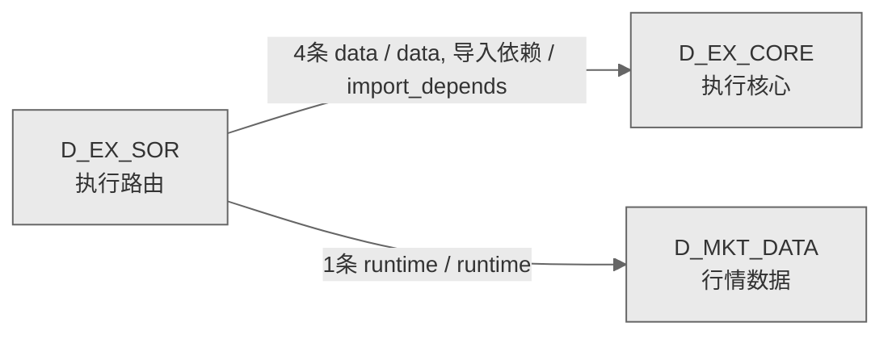

# 45_d_ex_sor / 执行路由域 / Execution Routing

> **功能简介 / Overview**: 执行路由，负责订单路由、智能拆单和执行场所选择

> **文档作用 / Purpose**: 展示 执行路由（D_EX_SOR）功能域的域内依赖关系、跨域依赖关系，模块信息（成熟度/中英文名/大白话/文件路径）内嵌于 Mermaid 节点，供架构审查和域治理参考。

> 本文档由 generate_domain_doc.py 从 depgraph (PostgreSQL) 自动生成
> 数据源: depgraph (PostgreSQL) nodes表 + edges表

> **[可缩放 HTML 版 / Zoomable HTML](http://localhost:8765/docs/02_enterprise_architecture/02_domain_architecture_docs/_zoomable_html/45_d_ex_sor.html)** — Ctrl+滚轮缩放 ｜ 双击重置 ｜ Ctrl+Shift+D 切换拖动/选择模式

## 域基本信息 / Domain Overview

| 字段 | 值 | Field | Value |
|------|------|-------|-------|
| 编号 | 45 | Number | 45 |
| 域ID | D_EX_SOR | Domain ID | D_EX_SOR |
| 域名称 | 执行路由 | Domain Name | Execution Routing |
| 层级 | L2 业务域层 | Layer | L2 Domain |
| 模块数 | 17 | Module Count | 17 |
| 域内依赖 | 5 | Internal Dependencies | 5 |
| 跨域入边 | 0 | Cross-domain Incoming | 0 |
| 跨域出边 | 5 | Cross-domain Outgoing | 5 |
| 设计态模块 | 10 | Design Modules | 10 |
| 生产态模块 | 7 | Production Modules | 7 |
| 容量 | 7/150 (正常) | Capacity | 7/150 (正常) |
| 描述 | 执行路由，负责订单路由、智能拆单和执行场所选择 | Description | 执行路由，负责订单路由、智能拆单和执行场所选择 |

## 域内依赖图 / Internal Dependency Diagram

> 依赖图内嵌在本文档中，IDE 可直接渲染；网页版可 Ctrl+滚轮缩放 + 拖动平移查看细节。
>
> **图例说明 / Legend**：
> - 🟦 **蓝色 = 运营态模块**（production，已上线运行）
> - 🟧 **橙色虚线 = 设计态模块**（design，蓝图阶段，代码未写）
> - **实线箭头 = 运营态依赖**（已生效的依赖关系）
> - **虚线箭头 = 非运营态依赖**（计划中/验证中的依赖关系）

### 全景图（全部模块，颜色区分运营态/设计态）

> 展示全部 17 个模块（生产态 7 + 设计态 10），含跨域依赖外部节点。节点含成熟度+名称+大白话/简介+文件路径。

```mermaid
%%{init: {'theme': 'base', 'themeVariables': {'primaryColor': '#eaeaea', 'primaryTextColor': '#333333', 'primaryBorderColor': '#666666', 'lineColor': '#666666', 'secondaryColor': '#eaeaea', 'tertiaryColor': '#eaeaea', 'fontSize': '14px'}}}%%
flowchart TD
    src_zephyr_ex_sor_init_py["(生产态 / production) 包入口 / __init__<br/>ex_sor的包入口，把这一层的子模块归到一起<br/>统一管理，用到谁才加载谁，避免一次性全加<br/>载拖慢启动。<br/>文件: ex_sor/__init__.py"]
    src_zephyr_ex_sor_extensions_init_py["(生产态 / production) 包入口 / __init__<br/>_extensions的包入口，把这一层的子模块归<br/>到一起统一管理，用到谁才加载谁，避免一次<br/>性全加载拖慢启动。<br/>文件: _extensions/__init__.py"]
    src_zephyr_ex_sor_api_init_py["(生产态 / production) 包入口 / __init__<br/>接口的包入口，把这一层的子模块归到一起统<br/>一管理，用到谁才加载谁，避免一次性全加载<br/>拖慢启动。<br/>文件: api/__init__.py"]
    src_zephyr_ex_sor_core_init_py["(生产态 / production) 包入口 / __init__<br/>core的包入口，把这一层的子模块归到一起统<br/>一管理，用到谁才加载谁，避免一次性全加载<br/>拖慢启动。<br/>文件: core/__init__.py"]
    src_zephyr_ex_sor_core_algo_execution_selector_py["(设计态 / design) 算法执行选择器 / algo_<br/>execution_selector<br/>算法执行选择器，SOR执行的选择器，按条件<br/>选择最优项。<br/>文件: core/algo_execution_selector.py<br/>⛔ 智能订单路由域，设计已就绪，等待开发排<br/>期"]
    src_zephyr_ex_sor_core_broker_adapter_manager_py["(设计态 / design) 经纪人适配器管理器 /<br/>broker_adapter_manager<br/>经纪人适配器管理器，core的适配器，把外部<br/>接口适配成内部统一格式。<br/>文件: core/broker_adapter_manager.py<br/>⛔ 智能订单路由域，设计已就绪，等待开发排<br/>期"]
    src_zephyr_ex_sor_core_optimal_order_router_py["(设计态 / design) optimal订单路由器 /<br/>optimal_order_router<br/>optimal订单路由器，core的路由器，按规则<br/>把请求分发到对应处理方。<br/>文件: core/optimal_order_router.py<br/>⛔ 智能订单路由域，设计已就绪，等待开发排<br/>期"]
    src_zephyr_ex_sor_infrastructure_init_py["(生产态 / production) 包入口 / __init__<br/>基础设施的包入口，把这一层的子模块归到一<br/>起统一管理，用到谁才加载谁，避免一次性全<br/>加载拖慢启动。<br/>文件: infrastructure/__init__.py"]
    src_zephyr_ex_sor_models_init_py["(生产态 / production) 包入口 / __init__<br/>模型的包入口，把这一层的子模块归到一起统<br/>一管理，用到谁才加载谁，避免一次性全加载<br/>拖慢启动。<br/>文件: models/__init__.py"]
    src_zephyr_ex_sor_services_init_py["(生产态 / production) 包入口 / __init__<br/>services的包入口，把这一层的子模块归到一<br/>起统一管理，用到谁才加载谁，避免一次性全<br/>加载拖慢启动。<br/>文件: services/__init__.py"]
    src_zephyr_ex_sor_services_execution_quality_scorer_py["(设计态 / design) 执行质量评分器 /<br/>execution_quality_scorer<br/>执行质量评分器（execution_quality_<br/>scorer.py）<br/>文件: services/execution_quality_<br/>scorer.py<br/>⛔ 智能订单路由域，设计已就绪，等待开发排<br/>期"]
    src_zephyr_ex_sor_services_slippage_analyzer_py["(设计态 / design) 滑点分析器 / slippage_<br/>analyzer<br/>滑点分析器，services的分析器，分析数据找<br/>出问题或规律。<br/>文件: services/slippage_analyzer.py<br/>⛔ 智能订单路由域，设计已就绪，等待开发排<br/>期"]
    src_zephyr_ex_sor_services_transaction_cost_optimizer_py["(设计态 / design) 交易成本优化器 /<br/>transaction_cost_optimizer<br/>交易成本优化器，服务的优化器，优化参数或<br/>配置。<br/>文件: services/transaction_cost_<br/>optimizer.py<br/>⛔ 智能订单路由域，设计已就绪，等待开发排<br/>期"]
    src_zephyr_ex_sor_init_py ~~~ src_zephyr_ex_sor_extensions_init_py
    src_zephyr_ex_sor_extensions_init_py ~~~ src_zephyr_ex_sor_api_init_py
    src_zephyr_ex_sor_api_init_py ~~~ src_zephyr_ex_sor_core_init_py
    src_zephyr_ex_sor_core_init_py ~~~ src_zephyr_ex_sor_core_algo_execution_selector_py
    src_zephyr_ex_sor_core_algo_execution_selector_py ~~~ src_zephyr_ex_sor_core_broker_adapter_manager_py
    src_zephyr_ex_sor_core_broker_adapter_manager_py ~~~ src_zephyr_ex_sor_core_optimal_order_router_py
    src_zephyr_ex_sor_core_optimal_order_router_py ~~~ src_zephyr_ex_sor_infrastructure_init_py
    src_zephyr_ex_sor_infrastructure_init_py ~~~ src_zephyr_ex_sor_models_init_py
    src_zephyr_ex_sor_models_init_py ~~~ src_zephyr_ex_sor_services_init_py
    src_zephyr_ex_sor_services_init_py ~~~ src_zephyr_ex_sor_services_execution_quality_scorer_py
    src_zephyr_ex_sor_services_execution_quality_scorer_py ~~~ src_zephyr_ex_sor_services_slippage_analyzer_py
    src_zephyr_ex_sor_services_slippage_analyzer_py ~~~ src_zephyr_ex_sor_services_transaction_cost_optimizer_py
    src_zephyr_ex_sor_core_execution_scheduler_py["(设计态 / design) 执行调度器 /<br/>execution_scheduler<br/>执行调度器，core的调度器，按时间或优先级<br/>安排任务执行。<br/>文件: core/execution_scheduler.py<br/>⛔ 智能订单路由域，设计已就绪，等待开发排<br/>期"]
    src_zephyr_ex_sor_core_algo_trading_engine_py["(设计态 / design) 算法交易引擎 / algo_<br/>trading_engine<br/>算法交易引擎，core的引擎，执行核心逻辑的<br/>处理引擎。<br/>文件: core/algo_trading_engine.py<br/>⛔ 智能订单路由域，设计已就绪，等待开发排<br/>期"]
    src_zephyr_ex_sor_core_broker_api_connector_py["(设计态 / design) 券商api连接器 /<br/>broker_api_connector<br/>券商api连接器（broker_api_connector.py）<br/>文件: core/broker_api_connector.py<br/>⛔ 智能订单路由域，设计已就绪，等待开发排<br/>期"]
    src_zephyr_ex_sor_core_api_rate_limiter_py["(设计态 / design) API率限制器 / api_<br/>rate_limiter<br/>API率限制器，SOR执行的限制器，限制流量或<br/>频率。<br/>文件: core/api_rate_limiter.py<br/>⛔ 智能订单路由域，设计已就绪，等待开发排<br/>期"]
    src_zephyr_ex_sor_core_optimal_order_router_py -.->|runtime / runtime| src_zephyr_ex_sor_core_execution_scheduler_py
    src_zephyr_ex_sor_core_execution_scheduler_py -.->|runtime / runtime| src_zephyr_ex_sor_core_algo_trading_engine_py
    src_zephyr_ex_sor_core_algo_trading_engine_py -.->|runtime / runtime| src_zephyr_ex_sor_core_broker_api_connector_py
    src_zephyr_ex_sor_core_algo_execution_selector_py -.->|runtime / runtime| src_zephyr_ex_sor_core_algo_trading_engine_py
    src_zephyr_ex_sor_core_broker_api_connector_py -.->|runtime / runtime| src_zephyr_ex_sor_core_api_rate_limiter_py
    D_MKT_DATA["(设计态 / design) 行情数据 / Market Data<br/>行情数据，负责市场行情数据的采集、分发和<br/>订阅管理<br/>跨域节点 / cross-domain"]
    src_zephyr_ex_sor_core_init_py -.->|runtime / runtime| D_MKT_DATA
    D_EX_CORE["(生产态 / production) 执行核心 /<br/>Execution Core<br/>执行核心，负责订单执行引擎、执行策略和执<br/>行管理<br/>跨域节点 / cross-domain"]
    src_zephyr_ex_sor_core_broker_adapter_manager_py -.->|导入依赖 / import_depends| D_EX_CORE
    src_zephyr_ex_sor_services_slippage_analyzer_py -.->|data / data| D_EX_CORE
    src_zephyr_ex_sor_services_execution_quality_scorer_py -.->|data / data| D_EX_CORE
    src_zephyr_ex_sor_services_transaction_cost_optimizer_py -.->|data / data| D_EX_CORE
    classDef production fill:#e1f5fe,stroke:#01579b,stroke-width:2px,color:#000
    classDef design fill:#fff3e0,stroke:#e65100,stroke-width:2px,color:#000,stroke-dasharray: 5 5
    classDef external_prod fill:#e8f4fd,stroke:#0277bd,stroke-width:1px,color:#000
    classDef external_design fill:#fff8e7,stroke:#ef6c00,stroke-width:1px,color:#000,stroke-dasharray: 5 5
    class src_zephyr_ex_sor_init_py,src_zephyr_ex_sor_extensions_init_py,src_zephyr_ex_sor_api_init_py,src_zephyr_ex_sor_core_init_py,src_zephyr_ex_sor_infrastructure_init_py,src_zephyr_ex_sor_models_init_py,src_zephyr_ex_sor_services_init_py production
    class src_zephyr_ex_sor_core_algo_execution_selector_py,src_zephyr_ex_sor_core_algo_trading_engine_py,src_zephyr_ex_sor_core_api_rate_limiter_py,src_zephyr_ex_sor_core_broker_adapter_manager_py,src_zephyr_ex_sor_core_broker_api_connector_py,src_zephyr_ex_sor_core_execution_scheduler_py,src_zephyr_ex_sor_core_optimal_order_router_py,src_zephyr_ex_sor_services_execution_quality_scorer_py,src_zephyr_ex_sor_services_slippage_analyzer_py,src_zephyr_ex_sor_services_transaction_cost_optimizer_py design
    class D_EX_CORE external_prod
    class D_MKT_DATA external_design
```

### 运营态的图（仅 design_maturity=production 的模块和域内依赖）

> 仅展示已上线运行的模块（共 7 个），不含跨域外部节点。跨域依赖见下方跨域依赖章节。

```mermaid
%%{init: {'theme': 'base', 'themeVariables': {'primaryColor': '#eaeaea', 'primaryTextColor': '#333333', 'primaryBorderColor': '#666666', 'lineColor': '#666666', 'secondaryColor': '#eaeaea', 'tertiaryColor': '#eaeaea', 'fontSize': '14px'}}}%%
flowchart TD
    src_zephyr_ex_sor_init_py["(生产态 / production) 包入口 / __init__<br/>ex_sor的包入口，把这一层的子模块归到一起<br/>统一管理，用到谁才加载谁，避免一次性全加<br/>载拖慢启动。<br/>文件: ex_sor/__init__.py"]
    src_zephyr_ex_sor_extensions_init_py["(生产态 / production) 包入口 / __init__<br/>_extensions的包入口，把这一层的子模块归<br/>到一起统一管理，用到谁才加载谁，避免一次<br/>性全加载拖慢启动。<br/>文件: _extensions/__init__.py"]
    src_zephyr_ex_sor_api_init_py["(生产态 / production) 包入口 / __init__<br/>接口的包入口，把这一层的子模块归到一起统<br/>一管理，用到谁才加载谁，避免一次性全加载<br/>拖慢启动。<br/>文件: api/__init__.py"]
    src_zephyr_ex_sor_core_init_py["(生产态 / production) 包入口 / __init__<br/>core的包入口，把这一层的子模块归到一起统<br/>一管理，用到谁才加载谁，避免一次性全加载<br/>拖慢启动。<br/>文件: core/__init__.py"]
    src_zephyr_ex_sor_infrastructure_init_py["(生产态 / production) 包入口 / __init__<br/>基础设施的包入口，把这一层的子模块归到一<br/>起统一管理，用到谁才加载谁，避免一次性全<br/>加载拖慢启动。<br/>文件: infrastructure/__init__.py"]
    src_zephyr_ex_sor_models_init_py["(生产态 / production) 包入口 / __init__<br/>模型的包入口，把这一层的子模块归到一起统<br/>一管理，用到谁才加载谁，避免一次性全加载<br/>拖慢启动。<br/>文件: models/__init__.py"]
    src_zephyr_ex_sor_services_init_py["(生产态 / production) 包入口 / __init__<br/>services的包入口，把这一层的子模块归到一<br/>起统一管理，用到谁才加载谁，避免一次性全<br/>加载拖慢启动。<br/>文件: services/__init__.py"]
    src_zephyr_ex_sor_init_py ~~~ src_zephyr_ex_sor_extensions_init_py
    src_zephyr_ex_sor_extensions_init_py ~~~ src_zephyr_ex_sor_api_init_py
    src_zephyr_ex_sor_api_init_py ~~~ src_zephyr_ex_sor_core_init_py
    src_zephyr_ex_sor_core_init_py ~~~ src_zephyr_ex_sor_infrastructure_init_py
    src_zephyr_ex_sor_infrastructure_init_py ~~~ src_zephyr_ex_sor_models_init_py
    src_zephyr_ex_sor_models_init_py ~~~ src_zephyr_ex_sor_services_init_py
    classDef production fill:#e1f5fe,stroke:#01579b,stroke-width:2px,color:#000
    classDef design fill:#fff3e0,stroke:#e65100,stroke-width:2px,color:#000,stroke-dasharray: 5 5
    classDef external_prod fill:#e8f4fd,stroke:#0277bd,stroke-width:1px,color:#000
    classDef external_design fill:#fff8e7,stroke:#ef6c00,stroke-width:1px,color:#000,stroke-dasharray: 5 5
    class src_zephyr_ex_sor_init_py,src_zephyr_ex_sor_extensions_init_py,src_zephyr_ex_sor_api_init_py,src_zephyr_ex_sor_core_init_py,src_zephyr_ex_sor_infrastructure_init_py,src_zephyr_ex_sor_models_init_py,src_zephyr_ex_sor_services_init_py production
```

### 设计态的图（仅 design_maturity=design 的模块和域内依赖）

> 仅展示蓝图阶段、代码未写的设计态模块（共 10 个），不含跨域外部节点。

```mermaid
%%{init: {'theme': 'base', 'themeVariables': {'primaryColor': '#eaeaea', 'primaryTextColor': '#333333', 'primaryBorderColor': '#666666', 'lineColor': '#666666', 'secondaryColor': '#eaeaea', 'tertiaryColor': '#eaeaea', 'fontSize': '14px'}}}%%
flowchart TD
    src_zephyr_ex_sor_core_algo_execution_selector_py["(设计态 / design) 算法执行选择器 / algo_<br/>execution_selector<br/>算法执行选择器，SOR执行的选择器，按条件<br/>选择最优项。<br/>文件: core/algo_execution_selector.py<br/>⛔ 智能订单路由域，设计已就绪，等待开发排<br/>期"]
    src_zephyr_ex_sor_core_broker_adapter_manager_py["(设计态 / design) 经纪人适配器管理器 /<br/>broker_adapter_manager<br/>经纪人适配器管理器，core的适配器，把外部<br/>接口适配成内部统一格式。<br/>文件: core/broker_adapter_manager.py<br/>⛔ 智能订单路由域，设计已就绪，等待开发排<br/>期"]
    src_zephyr_ex_sor_core_optimal_order_router_py["(设计态 / design) optimal订单路由器 /<br/>optimal_order_router<br/>optimal订单路由器，core的路由器，按规则<br/>把请求分发到对应处理方。<br/>文件: core/optimal_order_router.py<br/>⛔ 智能订单路由域，设计已就绪，等待开发排<br/>期"]
    src_zephyr_ex_sor_services_execution_quality_scorer_py["(设计态 / design) 执行质量评分器 /<br/>execution_quality_scorer<br/>执行质量评分器（execution_quality_<br/>scorer.py）<br/>文件: services/execution_quality_<br/>scorer.py<br/>⛔ 智能订单路由域，设计已就绪，等待开发排<br/>期"]
    src_zephyr_ex_sor_services_slippage_analyzer_py["(设计态 / design) 滑点分析器 / slippage_<br/>analyzer<br/>滑点分析器，services的分析器，分析数据找<br/>出问题或规律。<br/>文件: services/slippage_analyzer.py<br/>⛔ 智能订单路由域，设计已就绪，等待开发排<br/>期"]
    src_zephyr_ex_sor_services_transaction_cost_optimizer_py["(设计态 / design) 交易成本优化器 /<br/>transaction_cost_optimizer<br/>交易成本优化器，服务的优化器，优化参数或<br/>配置。<br/>文件: services/transaction_cost_<br/>optimizer.py<br/>⛔ 智能订单路由域，设计已就绪，等待开发排<br/>期"]
    src_zephyr_ex_sor_core_algo_execution_selector_py ~~~ src_zephyr_ex_sor_core_broker_adapter_manager_py
    src_zephyr_ex_sor_core_broker_adapter_manager_py ~~~ src_zephyr_ex_sor_core_optimal_order_router_py
    src_zephyr_ex_sor_core_optimal_order_router_py ~~~ src_zephyr_ex_sor_services_execution_quality_scorer_py
    src_zephyr_ex_sor_services_execution_quality_scorer_py ~~~ src_zephyr_ex_sor_services_slippage_analyzer_py
    src_zephyr_ex_sor_services_slippage_analyzer_py ~~~ src_zephyr_ex_sor_services_transaction_cost_optimizer_py
    src_zephyr_ex_sor_core_execution_scheduler_py["(设计态 / design) 执行调度器 /<br/>execution_scheduler<br/>执行调度器，core的调度器，按时间或优先级<br/>安排任务执行。<br/>文件: core/execution_scheduler.py<br/>⛔ 智能订单路由域，设计已就绪，等待开发排<br/>期"]
    src_zephyr_ex_sor_core_algo_trading_engine_py["(设计态 / design) 算法交易引擎 / algo_<br/>trading_engine<br/>算法交易引擎，core的引擎，执行核心逻辑的<br/>处理引擎。<br/>文件: core/algo_trading_engine.py<br/>⛔ 智能订单路由域，设计已就绪，等待开发排<br/>期"]
    src_zephyr_ex_sor_core_broker_api_connector_py["(设计态 / design) 券商api连接器 /<br/>broker_api_connector<br/>券商api连接器（broker_api_connector.py）<br/>文件: core/broker_api_connector.py<br/>⛔ 智能订单路由域，设计已就绪，等待开发排<br/>期"]
    src_zephyr_ex_sor_core_api_rate_limiter_py["(设计态 / design) API率限制器 / api_<br/>rate_limiter<br/>API率限制器，SOR执行的限制器，限制流量或<br/>频率。<br/>文件: core/api_rate_limiter.py<br/>⛔ 智能订单路由域，设计已就绪，等待开发排<br/>期"]
    src_zephyr_ex_sor_core_optimal_order_router_py -.->|runtime / runtime| src_zephyr_ex_sor_core_execution_scheduler_py
    src_zephyr_ex_sor_core_execution_scheduler_py -.->|runtime / runtime| src_zephyr_ex_sor_core_algo_trading_engine_py
    src_zephyr_ex_sor_core_algo_trading_engine_py -.->|runtime / runtime| src_zephyr_ex_sor_core_broker_api_connector_py
    src_zephyr_ex_sor_core_algo_execution_selector_py -.->|runtime / runtime| src_zephyr_ex_sor_core_algo_trading_engine_py
    src_zephyr_ex_sor_core_broker_api_connector_py -.->|runtime / runtime| src_zephyr_ex_sor_core_api_rate_limiter_py
    classDef production fill:#e1f5fe,stroke:#01579b,stroke-width:2px,color:#000
    classDef design fill:#fff3e0,stroke:#e65100,stroke-width:2px,color:#000,stroke-dasharray: 5 5
    classDef external_prod fill:#e8f4fd,stroke:#0277bd,stroke-width:1px,color:#000
    classDef external_design fill:#fff8e7,stroke:#ef6c00,stroke-width:1px,color:#000,stroke-dasharray: 5 5
    class src_zephyr_ex_sor_core_algo_execution_selector_py,src_zephyr_ex_sor_core_algo_trading_engine_py,src_zephyr_ex_sor_core_api_rate_limiter_py,src_zephyr_ex_sor_core_broker_adapter_manager_py,src_zephyr_ex_sor_core_broker_api_connector_py,src_zephyr_ex_sor_core_execution_scheduler_py,src_zephyr_ex_sor_core_optimal_order_router_py,src_zephyr_ex_sor_services_execution_quality_scorer_py,src_zephyr_ex_sor_services_slippage_analyzer_py,src_zephyr_ex_sor_services_transaction_cost_optimizer_py design
```

## 跨域依赖 / Cross-domain Dependencies

### 本域依赖的其他域（出边）/ Depends On

| # | 本域模块 / Source Module | → | 外部域-目标模块 / Target Module | 依赖类型 / Type |
|:--:|---------|:--:|---------|---------|
| 1 | 经纪人适配器管理器 / broker_adapter_manager (core/broker_... | → | D_EX_CORE 执行核心: 执行引擎 / D_EXECUTION_CORE — Execution Engine (ex_core/... | 导入依赖 / import_depends |
| 2 | 执行质量评分器 / execution_quality_scorer (services/execu... | → | D_EX_CORE 执行核心: 执行报告 / execution_report (ex_core/execution_report.py) | data / data |
| 3 | 滑点分析器 / slippage_analyzer (services/slippage_analyze... | → | D_EX_CORE 执行核心: 执行报告 / execution_report (ex_core/execution_report.py) | data / data |
| 4 | 交易成本优化器 / transaction_cost_optimizer (services/tra... | → | D_EX_CORE 执行核心: 执行报告 / execution_report (ex_core/execution_report.py) | data / data |
| 5 | 包入口 / __init__ (core/__init__.py) | → | D_MKT_DATA 行情数据: 故障切换 (failover/) | runtime / runtime |

### 依赖本域的其他域（入边）/ Depended By

无跨域入边依赖 / No cross-domain incoming dependencies

### 跨域依赖图 / Cross-domain Dependency Diagram

> 本域与 2 个外部域直接连接（出边 5 条 + 入边 0 条 = 5 条）。只显示直接连接的域，不展开具体节点。

## 说明 / Notes

- **数据源 / Data Source**: `depgraph (PostgreSQL)` 的 `nodes`、`edges`、`domains` 表
- **生成器 / Generator**: `generate_domain_doc.py`（G2+G10 合并）
- **维护方式 / Maintenance**: 自动生成，全景图更新时刷新
- **文件名规则 / File Naming**: `{编号:02d}_{域ID小写}.md`，如 `16_d_trading.md`
- **图例说明 / Legend**: `[production]`=已上线 / `[design]`=设计中 / `[unknown]`=未知
