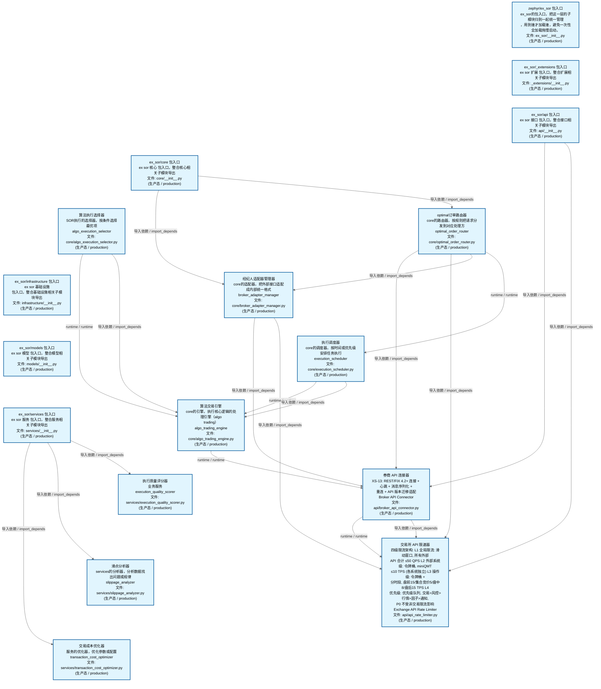
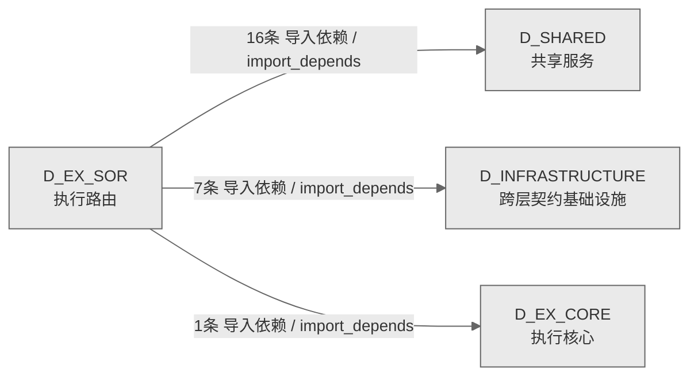

# 45_d_ex_sor / 执行路由域 / Execution Routing

> **功能简介 / Overview**: 执行路由，负责订单路由、智能拆单和执行场所选择

> **文档作用 / Purpose**: 展示 执行路由（D_EX_SOR）功能域的域内依赖关系、跨域依赖关系，模块信息（成熟度/中英文名/大白话/文件路径）内嵌于 Mermaid 节点，供架构审查和域治理参考。

> 本文档由 generate_domain_doc.py 从 depgraph (PostgreSQL) 自动生成
> 数据源: depgraph (PostgreSQL) nodes表 + edges表

> **[可缩放 HTML 版 / Zoomable HTML](http://localhost:8765/docs/02_enterprise_architecture/02_domain_architecture_docs/_zoomable_html/45_d_ex_sor.html)** — Ctrl+滚轮缩放 ｜ 双击重置 ｜ Ctrl+Shift+D 切换拖动/选择模式

## 域基本信息 / Domain Overview

| 字段 | 值 | Field | Value |
|------|------|-------|-------|
| 编号 | 45 | Number | 45 |
| 域ID | D_EX_SOR | Domain ID | D_EX_SOR |
| 域名称 | 执行路由 | Domain Name | Execution Routing |
| 层级 | L2 业务域层 | Layer | L2 Domain |
| 模块数 | 17 | Module Count | 17 |
| 域内依赖 | 20 | Internal Dependencies | 20 |
| 跨域入边 | 0 | Cross-domain Incoming | 0 |
| 跨域出边 | 24 | Cross-domain Outgoing | 24 |
| 设计态模块 | 0 | Design Modules | 0 |
| 生产态模块 | 17 | Production Modules | 17 |
| 容量 | 17/150 (正常) | Capacity | 17/150 (正常) |
| 描述 | 执行路由，负责订单路由、智能拆单和执行场所选择 | Description | 执行路由，负责订单路由、智能拆单和执行场所选择 |

## 域内依赖图 / Internal Dependency Diagram

> 依赖图内嵌在本文档中，IDE 可直接渲染；网页版可 Ctrl+滚轮缩放 + 拖动平移查看细节。
>
> **图例说明 / Legend**：
> - 🟦 **蓝色 = 运营态模块**（production，已上线运行）
> - 🟧 **橙色虚线 = 设计态模块**（design，蓝图阶段，代码未写）
> - **实线箭头 = 运营态依赖**（已生效的依赖关系）
> - **虚线箭头 = 非运营态依赖**（计划中/验证中的依赖关系）

### 全景图（全部模块，颜色区分运营态/设计态）

> 展示全部 17 个模块（生产态 17 + 设计态 0），含跨域依赖外部节点。节点含成熟度+名称+大白话/简介+文件路径。

```mermaid
%%{init: {'theme': 'base', 'themeVariables': {'primaryColor': '#eaeaea', 'primaryTextColor': '#333333', 'primaryBorderColor': '#666666', 'lineColor': '#666666', 'secondaryColor': '#eaeaea', 'tertiaryColor': '#eaeaea', 'fontSize': '14px'}}}%%
flowchart TD
    src_zephyr_ex_sor_init_py["zephyr/ex_sor 包入口<br/>ex_sor的包入口，把这一层的子模块归到一起统一管理<br/>，用到谁才加载谁，避免一次性全加载拖慢启动。<br/>文件: ex_sor/__init__.py<br/>(生产态 / production)"]
    src_zephyr_ex_sor_extensions_init_py["ex_sor/_extensions 包入口<br/>ex sor 扩展 包入口，整合扩展相关子模块导出<br/>文件: _extensions/__init__.py<br/>(生产态 / production)"]
    src_zephyr_ex_sor_api_init_py["ex_sor/api 包入口<br/>ex sor 接口 包入口，整合接口相关子模块导出<br/>文件: api/__init__.py<br/>(生产态 / production)"]
    src_zephyr_ex_sor_core_init_py["ex_sor/core 包入口<br/>ex sor 核心 包入口，整合核心相关子模块导出<br/>文件: core/__init__.py<br/>(生产态 / production)"]
    src_zephyr_ex_sor_core_algo_execution_selector_py["算法执行选择器<br/>SOR执行的选择器，按条件选择最优项<br/>algo_execution_selector<br/>文件: core/algo_execution_selector.py<br/>(生产态 / production)"]
    src_zephyr_ex_sor_infrastructure_init_py["ex_sor/infrastructure 包入口<br/>ex sor 基础设施<br/>包入口，整合基础设施相关子模块导出<br/>文件: infrastructure/__init__.py<br/>(生产态 / production)"]
    src_zephyr_ex_sor_models_init_py["ex_sor/models 包入口<br/>ex sor 模型 包入口，整合模型相关子模块导出<br/>文件: models/__init__.py<br/>(生产态 / production)"]
    src_zephyr_ex_sor_services_init_py["ex_sor/services 包入口<br/>ex sor 服务 包入口，整合服务相关子模块导出<br/>文件: services/__init__.py<br/>(生产态 / production)"]
    src_zephyr_ex_sor_init_py ~~~ src_zephyr_ex_sor_extensions_init_py
    src_zephyr_ex_sor_extensions_init_py ~~~ src_zephyr_ex_sor_api_init_py
    src_zephyr_ex_sor_api_init_py ~~~ src_zephyr_ex_sor_core_init_py
    src_zephyr_ex_sor_core_init_py ~~~ src_zephyr_ex_sor_core_algo_execution_selector_py
    src_zephyr_ex_sor_core_algo_execution_selector_py ~~~ src_zephyr_ex_sor_infrastructure_init_py
    src_zephyr_ex_sor_infrastructure_init_py ~~~ src_zephyr_ex_sor_models_init_py
    src_zephyr_ex_sor_models_init_py ~~~ src_zephyr_ex_sor_services_init_py
    src_zephyr_ex_sor_core_optimal_order_router_py["optimal订单路由器<br/>core的路由器，按规则把请求分发到对应处理方<br/>optimal_order_router<br/>文件: core/optimal_order_router.py<br/>(生产态 / production)"]
    src_zephyr_ex_sor_services_execution_quality_scorer_py["执行质量评分器<br/>业务服务<br/>execution_quality_scorer<br/>文件: services/execution_quality_scorer.py<br/>(生产态 / production)"]
    src_zephyr_ex_sor_services_slippage_analyzer_py["滑点分析器<br/>services的分析器，分析数据找出问题或规律<br/>slippage_analyzer<br/>文件: services/slippage_analyzer.py<br/>(生产态 / production)"]
    src_zephyr_ex_sor_services_transaction_cost_optimizer_py["交易成本优化器<br/>服务的优化器，优化参数或配置<br/>transaction_cost_optimizer<br/>文件: services/transaction_cost_optimizer.py<br/>(生产态 / production)"]
    src_zephyr_ex_sor_core_optimal_order_router_py ~~~ src_zephyr_ex_sor_services_execution_quality_scorer_py
    src_zephyr_ex_sor_services_execution_quality_scorer_py ~~~ src_zephyr_ex_sor_services_slippage_analyzer_py
    src_zephyr_ex_sor_services_slippage_analyzer_py ~~~ src_zephyr_ex_sor_services_transaction_cost_optimizer_py
    src_zephyr_ex_sor_core_broker_adapter_manager_py["经纪人适配器管理器<br/>core的适配器，把外部接口适配成内部统一格式<br/>broker_adapter_manager<br/>文件: core/broker_adapter_manager.py<br/>(生产态 / production)"]
    src_zephyr_ex_sor_core_execution_scheduler_py["执行调度器<br/>core的调度器，按时间或优先级安排任务执行<br/>execution_scheduler<br/>文件: core/execution_scheduler.py<br/>(生产态 / production)"]
    src_zephyr_ex_sor_core_broker_adapter_manager_py ~~~ src_zephyr_ex_sor_core_execution_scheduler_py
    src_zephyr_ex_sor_core_algo_trading_engine_py["算法交易引擎<br/>core的引擎，执行核心逻辑的处理引擎（algo<br/>trading）<br/>algo_trading_engine<br/>文件: core/algo_trading_engine.py<br/>(生产态 / production)"]
    src_zephyr_ex_sor_api_broker_api_connector_py["券商 API 连接器<br/>XS-13: REST/FIX 4.2+ 连接 + 心跳 + 消息序列化 +<br/>重连 + API 版本迁移适配<br/>Broker API Connector<br/>文件: api/broker_api_connector.py<br/>(生产态 / production)"]
    src_zephyr_ex_sor_api_api_rate_limiter_py["交易所 API 限速器<br/>四级限流架构: L1 全局限流: 滑动窗口, 所有外部<br/>API 合计 ≤50 QPS L2 外部系统级: 令牌桶, miniQMT<br/>≤10 TPS (各系统独立) L3 操作级: 令牌桶 +<br/>分时段, 盘前15/集合竞价5/盘中8/盘后15 TPS L4<br/>优先级: 优先级队列, 交易>风控>行情>因子>通知,<br/>P0 不受非交易限流影响<br/>Exchange API Rate Limiter<br/>文件: api/api_rate_limiter.py<br/>(生产态 / production)"]
    src_zephyr_ex_sor_api_broker_api_connector_py -->|runtime / runtime| src_zephyr_ex_sor_api_api_rate_limiter_py
    src_zephyr_ex_sor_api_broker_api_connector_py -->|导入依赖 / import_depends| src_zephyr_ex_sor_api_api_rate_limiter_py
    src_zephyr_ex_sor_api_init_py -->|导入依赖 / import_depends| src_zephyr_ex_sor_api_broker_api_connector_py
    src_zephyr_ex_sor_api_init_py -->|导入依赖 / import_depends| src_zephyr_ex_sor_api_api_rate_limiter_py
    src_zephyr_ex_sor_core_broker_adapter_manager_py -->|导入依赖 / import_depends| src_zephyr_ex_sor_api_broker_api_connector_py
    src_zephyr_ex_sor_core_broker_adapter_manager_py -->|导入依赖 / import_depends| src_zephyr_ex_sor_api_api_rate_limiter_py
    src_zephyr_ex_sor_core_execution_scheduler_py -->|runtime / runtime| src_zephyr_ex_sor_core_algo_trading_engine_py
    src_zephyr_ex_sor_core_execution_scheduler_py -->|导入依赖 / import_depends| src_zephyr_ex_sor_core_algo_trading_engine_py
    src_zephyr_ex_sor_core_init_py -->|导入依赖 / import_depends| src_zephyr_ex_sor_core_broker_adapter_manager_py
    src_zephyr_ex_sor_core_init_py -->|导入依赖 / import_depends| src_zephyr_ex_sor_core_optimal_order_router_py
    src_zephyr_ex_sor_core_algo_trading_engine_py -->|runtime / runtime| src_zephyr_ex_sor_api_broker_api_connector_py
    src_zephyr_ex_sor_core_algo_execution_selector_py -->|runtime / runtime| src_zephyr_ex_sor_core_algo_trading_engine_py
    src_zephyr_ex_sor_core_algo_execution_selector_py -->|导入依赖 / import_depends| src_zephyr_ex_sor_core_algo_trading_engine_py
    src_zephyr_ex_sor_core_optimal_order_router_py -->|导入依赖 / import_depends| src_zephyr_ex_sor_api_broker_api_connector_py
    src_zephyr_ex_sor_core_optimal_order_router_py -->|导入依赖 / import_depends| src_zephyr_ex_sor_api_api_rate_limiter_py
    src_zephyr_ex_sor_core_optimal_order_router_py -->|导入依赖 / import_depends| src_zephyr_ex_sor_core_broker_adapter_manager_py
    src_zephyr_ex_sor_core_optimal_order_router_py -->|runtime / runtime| src_zephyr_ex_sor_core_execution_scheduler_py
    src_zephyr_ex_sor_services_init_py -->|导入依赖 / import_depends| src_zephyr_ex_sor_services_transaction_cost_optimizer_py
    src_zephyr_ex_sor_services_init_py -->|导入依赖 / import_depends| src_zephyr_ex_sor_services_slippage_analyzer_py
    src_zephyr_ex_sor_services_init_py -->|导入依赖 / import_depends| src_zephyr_ex_sor_services_execution_quality_scorer_py
    D_EX_CORE["执行核心<br/>执行核心，负责订单执行引擎、执行策略和执行管理<br/>Execution Core<br/>跨域节点 / cross-domain<br/>(生产态 / production)"]
    src_zephyr_ex_sor_core_broker_adapter_manager_py -->|导入依赖 / import_depends| D_EX_CORE
    D_SHARED["共享服务<br/>共享服务，负责跨域共享的工具、协议和基础服务<br/>Shared Services<br/>跨域节点 / cross-domain<br/>(生产态 / production)"]
    src_zephyr_ex_sor_core_algo_execution_selector_py -->|导入依赖 / import_depends| D_SHARED
    D_INFRASTRUCTURE["跨层契约基础设施<br/>跨层契约基础设施，负责跨层契约定义、共享契约管理<br/>和契约校验<br/>Cross-Layer Contract Infrastructure<br/>跨域节点 / cross-domain<br/>(生产态 / production)"]
    src_zephyr_ex_sor_api_broker_api_connector_py -->|导入依赖 / import_depends| D_INFRASTRUCTURE
    src_zephyr_ex_sor_core_execution_scheduler_py -->|导入依赖 / import_depends| D_SHARED
    src_zephyr_ex_sor_api_api_rate_limiter_py -->|导入依赖 / import_depends| D_SHARED
    src_zephyr_ex_sor_core_algo_trading_engine_py -->|导入依赖 / import_depends| D_INFRASTRUCTURE
    src_zephyr_ex_sor_core_optimal_order_router_py -->|导入依赖 / import_depends| D_SHARED
    src_zephyr_ex_sor_services_transaction_cost_optimizer_py -->|导入依赖 / import_depends| D_SHARED
    src_zephyr_ex_sor_core_optimal_order_router_py -->|导入依赖 / import_depends| D_INFRASTRUCTURE
    src_zephyr_ex_sor_core_broker_adapter_manager_py -->|导入依赖 / import_depends| D_SHARED
    src_zephyr_ex_sor_api_broker_api_connector_py -->|导入依赖 / import_depends| D_SHARED
    src_zephyr_ex_sor_core_broker_adapter_manager_py -->|导入依赖 / import_depends| D_INFRASTRUCTURE
    src_zephyr_ex_sor_services_slippage_analyzer_py -->|导入依赖 / import_depends| D_SHARED
    src_zephyr_ex_sor_services_execution_quality_scorer_py -->|导入依赖 / import_depends| D_SHARED
    src_zephyr_ex_sor_services_execution_quality_scorer_py -->|导入依赖 / import_depends| D_SHARED
    classDef production fill:#e1f5fe,stroke:#01579b,stroke-width:2px,color:#000
    classDef design fill:#fff3e0,stroke:#e65100,stroke-width:2px,color:#000,stroke-dasharray: 5 5
    classDef external_prod fill:#e8f4fd,stroke:#0277bd,stroke-width:1px,color:#000
    classDef external_design fill:#fff8e7,stroke:#ef6c00,stroke-width:1px,color:#000,stroke-dasharray: 5 5
    class src_zephyr_ex_sor_init_py,src_zephyr_ex_sor_extensions_init_py,src_zephyr_ex_sor_api_init_py,src_zephyr_ex_sor_api_api_rate_limiter_py,src_zephyr_ex_sor_api_broker_api_connector_py,src_zephyr_ex_sor_core_init_py,src_zephyr_ex_sor_core_algo_execution_selector_py,src_zephyr_ex_sor_core_algo_trading_engine_py,src_zephyr_ex_sor_core_broker_adapter_manager_py,src_zephyr_ex_sor_core_execution_scheduler_py,src_zephyr_ex_sor_core_optimal_order_router_py,src_zephyr_ex_sor_infrastructure_init_py,src_zephyr_ex_sor_models_init_py,src_zephyr_ex_sor_services_init_py,src_zephyr_ex_sor_services_execution_quality_scorer_py,src_zephyr_ex_sor_services_slippage_analyzer_py,src_zephyr_ex_sor_services_transaction_cost_optimizer_py production
    class D_EX_CORE,D_SHARED,D_INFRASTRUCTURE external_prod
```

### 运营态的图（仅 design_maturity=production 的模块和域内依赖）

> 仅展示已上线运行的模块（共 17 个），不含跨域外部节点。跨域依赖见下方跨域依赖章节。

### 设计态的图（仅 design_maturity=design 的模块和域内依赖）

> 仅展示蓝图阶段、代码未写的设计态模块（共 0 个），不含跨域外部节点。

> （无模块 / No modules）

## 跨域依赖 / Cross-domain Dependencies

### 本域依赖的其他域（出边）/ Depends On

| # | 本域模块 / Source Module | → | 外部域-目标模块 / Target Module | 依赖类型 / Type |
|:--:|---------|:--:|---------|---------|
| 1 | 经纪人适配器管理器 / broker_adapter_manager (core/broker_... | → | D_EX_CORE 执行核心: 执行引擎 / D_EXECUTION_CORE — Execution Engine (ex_core/... | 导入依赖 / import_depends |
| 2 | 券商 API 连接器 / Broker API Connector (api/broker_api_co... | → | D_INFRASTRUCTURE 跨层契约基础设施: 成交 / fill (contracts/fill.py) | 导入依赖 / import_depends |
| 3 | 券商 API 连接器 / Broker API Connector (api/broker_api_co... | → | D_INFRASTRUCTURE 跨层契约基础设施: 订单 / order (contracts/order.py) | 导入依赖 / import_depends |
| 4 | 算法执行选择器 / algo_execution_selector (core/algo_execu... | → | D_INFRASTRUCTURE 跨层契约基础设施: 订单 / order (contracts/order.py) | 导入依赖 / import_depends |
| 5 | 算法交易引擎 / algo_trading_engine (core/algo_trading_eng... | → | D_INFRASTRUCTURE 跨层契约基础设施: 订单 / order (contracts/order.py) | 导入依赖 / import_depends |
| 6 | 经纪人适配器管理器 / broker_adapter_manager (core/broker_... | → | D_INFRASTRUCTURE 跨层契约基础设施: 成交 / fill (contracts/fill.py) | 导入依赖 / import_depends |
| 7 | 经纪人适配器管理器 / broker_adapter_manager (core/broker_... | → | D_INFRASTRUCTURE 跨层契约基础设施: 订单 / order (contracts/order.py) | 导入依赖 / import_depends |
| 8 | optimal订单路由器 / optimal_order_router (core/optimal_or... | → | D_INFRASTRUCTURE 跨层契约基础设施: 订单 / order (contracts/order.py) | 导入依赖 / import_depends |
| 9 | 交易所 API 限速器 / Exchange API Rate Limiter (api/api_ra... | → | D_SHARED 共享服务: 错误 / errors (foundation/errors.py) | 导入依赖 / import_depends |
| 10 | 券商 API 连接器 / Broker API Connector (api/broker_api_co... | → | D_SHARED 共享服务: 订单枚举 / order_enums (enums/order_enums.py) | 导入依赖 / import_depends |
| 11 | 券商 API 连接器 / Broker API Connector (api/broker_api_co... | → | D_SHARED 共享服务: 错误 / errors (foundation/errors.py) | 导入依赖 / import_depends |
| 12 | 算法执行选择器 / algo_execution_selector (core/algo_execu... | → | D_SHARED 共享服务: 订单枚举 / order_enums (enums/order_enums.py) | 导入依赖 / import_depends |
| 13 | 算法执行选择器 / algo_execution_selector (core/algo_execu... | → | D_SHARED 共享服务: 错误 / errors (foundation/errors.py) | 导入依赖 / import_depends |
| 14 | 算法交易引擎 / algo_trading_engine (core/algo_trading_eng... | → | D_SHARED 共享服务: 订单枚举 / order_enums (enums/order_enums.py) | 导入依赖 / import_depends |
| 15 | 算法交易引擎 / algo_trading_engine (core/algo_trading_eng... | → | D_SHARED 共享服务: 错误 / errors (foundation/errors.py) | 导入依赖 / import_depends |
| 16 | 经纪人适配器管理器 / broker_adapter_manager (core/broker_... | → | D_SHARED 共享服务: 错误 / errors (foundation/errors.py) | 导入依赖 / import_depends |
| 17 | 执行调度器 / execution_scheduler (core/execution_schedule... | → | D_SHARED 共享服务: 错误 / errors (foundation/errors.py) | 导入依赖 / import_depends |
| 18 | optimal订单路由器 / optimal_order_router (core/optimal_or... | → | D_SHARED 共享服务: 错误 / errors (foundation/errors.py) | 导入依赖 / import_depends |
| 19 | 执行质量评分器 / execution_quality_scorer (services/execu... | → | D_SHARED 共享服务: 订单枚举 / order_enums (enums/order_enums.py) | 导入依赖 / import_depends |
| 20 | 执行质量评分器 / execution_quality_scorer (services/execu... | → | D_SHARED 共享服务: 错误 / errors (foundation/errors.py) | 导入依赖 / import_depends |
| 21 | 滑点分析器 / slippage_analyzer (services/slippage_analyze... | → | D_SHARED 共享服务: 订单枚举 / order_enums (enums/order_enums.py) | 导入依赖 / import_depends |
| 22 | 滑点分析器 / slippage_analyzer (services/slippage_analyze... | → | D_SHARED 共享服务: 错误 / errors (foundation/errors.py) | 导入依赖 / import_depends |
| 23 | 交易成本优化器 / transaction_cost_optimizer (services/tra... | → | D_SHARED 共享服务: 订单枚举 / order_enums (enums/order_enums.py) | 导入依赖 / import_depends |
| 24 | 交易成本优化器 / transaction_cost_optimizer (services/tra... | → | D_SHARED 共享服务: 错误 / errors (foundation/errors.py) | 导入依赖 / import_depends |

### 依赖本域的其他域（入边）/ Depended By

无跨域入边依赖 / No cross-domain incoming dependencies

### 跨域依赖图 / Cross-domain Dependency Diagram

> 本域与 3 个外部域直接连接（出边 24 条 + 入边 0 条 = 24 条）。只显示直接连接的域，不展开具体节点。

## 说明 / Notes

- **数据源 / Data Source**: `depgraph (PostgreSQL)` 的 `nodes`、`edges`、`domains` 表
- **生成器 / Generator**: `generate_domain_doc.py`（G2+G10 合并）
- **维护方式 / Maintenance**: 自动生成，全景图更新时刷新
- **文件名规则 / File Naming**: `{编号:02d}_{域ID小写}.md`，如 `16_d_trading.md`
- **图例说明 / Legend**: `[production]`=已上线 / `[design]`=设计中 / `[unknown]`=未知
