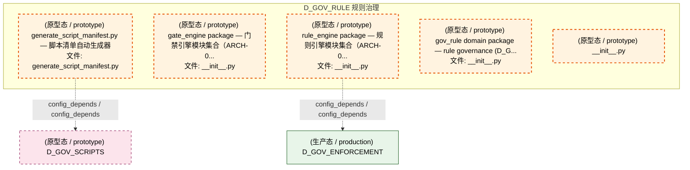
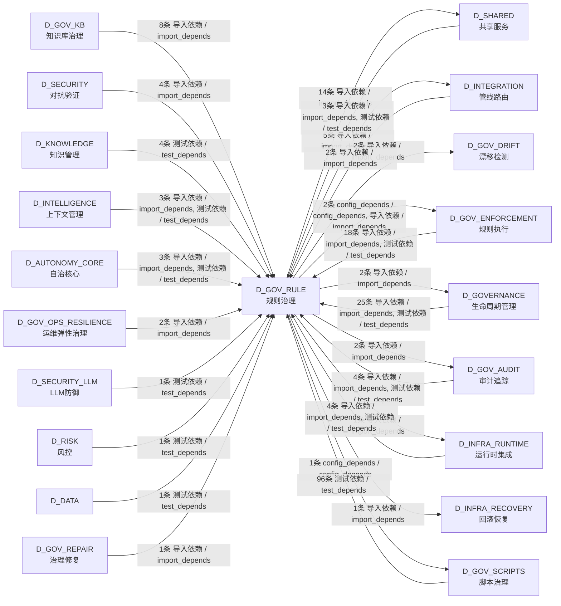

# 45_d_gov_rule / rule_governance / 规则治理 / Rule Governance

> **功能简介 / Overview**: 规则治理，负责规则注册、规则版本和规则依赖管理

> **文档作用 / Purpose**: 展示 规则治理（D_GOV_RULE）功能域的模块清单、域内依赖关系、跨域依赖关系、架构分层视图，供架构审查和域治理参考。

> 本文档由 generate_domain_doc.py 从 depgraph (PostgreSQL) 自动生成
> 最后更新: 2026-07-14 23:11:18
> 数据源: depgraph (PostgreSQL) nodes表 + edges表

## 域基本信息 / Domain Overview

| 字段 | 值 | Field | Value |
|------|------|-------|-------|
| 编号 | 45 | Number | 45 |
| 域ID | D_GOV_RULE | Domain ID | D_GOV_RULE |
| 域名称 | 规则治理 | Domain Name | Rule Governance |
| 层级 | L2 业务域层 | Layer | L2 Domain |
| 模块数 | 36 | Module Count | 36 |
| 域内依赖 | 13 | Internal Dependencies | 13 |
| 跨域入边 | 180 | Cross-domain Incoming | 180 |
| 跨域出边 | 30 | Cross-domain Outgoing | 30 |
| 设计态模块 | 0 | Design Modules | 0 |
| 原型态模块 | 5 | Prototype Modules | 5 |
| 生产态模块 | 31 | Production Modules | 31 |
| 容量 | 31/150 (正常) | Capacity | 31/150 (正常) |
| 描述 | 规则配置管理 | Description | 规则配置管理 |

## 模块分层清单 / Module Layered List

> 按 architecture_layer 分组的模块清单（共 36 个模块 / 36 modules）。

### L2 领域层 / Domain Layer (36 modules)

| # | 模块路径 / Module Path | 模块名称 / Module Name (功能简介 / Description) | 成熟度 / Maturity | 蓝图 / Blueprint |
|:--:|---------|---------|:---:|:---:|
| 1 | scripts/governance/generators/generate_script_manifest.py | generate_script_manifest.py — 脚本清单自动生成器 | 原型态 / prototype | [MOD-INF-005](../../03_modules/_domain_governance/governance_automation/blueprint.md) |
| 2 | src/zephyr/gov_enforcement/rule_enforcement/adaptive_thre... | 自适应阈值——从历史 FAIL/PASS 数据学习门禁参数... | 生产态 / production | [MOD-GATE_ENGINE](../../03_modules/_cross_layer/gate_engine/blueprint.md) |
| 3 | src/zephyr/gov_enforcement/rule_enforcement/adversarial_s... | Adversarial sample generator and 5 attack strat... | 生产态 / production | [MOD-GATE_ENGINE](../../03_modules/_cross_layer/gate_engine/blueprint.md) |
| 4 | src/zephyr/gov_enforcement/rule_enforcement/ai_capability... | ZephyrAlpha — gates/ai_capability_guard.py | 生产态 / production | [MOD-GATE_ENGINE](../../03_modules/_cross_layer/gate_engine/blueprint.md) |
| 5 | src/zephyr/gov_enforcement/rule_enforcement/anti_pattern_... | Anti-Patterns 防护引擎（Anti-Pattern Guard） | 生产态 / production | [MOD-GATE_ENGINE](../../03_modules/_cross_layer/gate_engine/blueprint.md) |
| 6 | src/zephyr/gov_enforcement/rule_enforcement/can_i_deploy.py | Can-I-Deploy 预部署门禁（GATE-CDC-1） | 生产态 / production | [MOD-GATE_ENGINE](../../03_modules/_cross_layer/gate_engine/blueprint.md) |
| 7 | src/zephyr/gov_enforcement/rule_enforcement/capability_ch... | 能力检查器（Capability Checker） | 生产态 / production | [MOD-GATE_ENGINE](../../03_modules/_cross_layer/gate_engine/blueprint.md) |
| 8 | src/zephyr/gov_enforcement/rule_enforcement/cbac_matrix.py | CBAC 能力矩阵（Capability-Based Access Control ... | 生产态 / production | [MOD-GATE_ENGINE](../../03_modules/_cross_layer/gate_engine/blueprint.md) |
| 9 | src/zephyr/gov_enforcement/rule_enforcement/cdc_broker.py | CDC 契约经纪人（Consumer-Driven Contract Broker... | 生产态 / production | [MOD-GATE_ENGINE](../../03_modules/_cross_layer/gate_engine/blueprint.md) |
| 10 | src/zephyr/gov_enforcement/rule_enforcement/circuit_break... | CircuitBreakerGateway (CBG) — 模块间调用单向熔断器 | 生产态 / production | [MOD-GATE_ENGINE](../../03_modules/_cross_layer/gate_engine/blueprint.md) |
| 11 | src/zephyr/gov_enforcement/rule_enforcement/contract_temp... | ContractTemplateManager: manage MCP tool contra... | 生产态 / production | [MOD-GATE_ENGINE](../../03_modules/_cross_layer/gate_engine/blueprint.md) |
| 12 | src/zephyr/gov_enforcement/rule_enforcement/end_to_end_wa... | 端到端场景走查验证器（End-to-End Walkthrough Va... | 生产态 / production | [MOD-GATE_ENGINE](../../03_modules/_cross_layer/gate_engine/blueprint.md) |
| 13 | src/zephyr/gov_enforcement/rule_enforcement/gate_engine/_... | gate_engine package — 门禁引擎模块集合（ARCH-0... | 原型态 / prototype | [MOD-GATE_ENGINE](../../03_modules/_cross_layer/gate_engine/blueprint.md) |
| 14 | src/zephyr/gov_enforcement/rule_enforcement/gate_engine/a... | AdversarialValidationGate — validates outputs ... | 生产态 / production | [MOD-GATE_ENGINE](../../03_modules/_cross_layer/gate_engine/blueprint.md) |
| 15 | src/zephyr/gov_enforcement/rule_enforcement/gate_engine/g... | 门禁上下文传播——GateContext 构建/序列化/跨模... | 生产态 / production | [MOD-GATE_ENGINE](../../03_modules/_cross_layer/gate_engine/blueprint.md) |
| 16 | src/zephyr/gov_enforcement/rule_enforcement/gate_engine/g... | GateEngine — KMS G1-G6 + Orc G0/G7 + 交易 G10-... | 生产态 / production | [MOD-GATE_ENGINE](../../03_modules/_cross_layer/gate_engine/blueprint.md) |
| 17 | src/zephyr/gov_enforcement/rule_enforcement/gate_engine/g... | Owner 紧急旁路——时间限定的门禁临时绕过 + 审计... | 生产态 / production | [MOD-GATE_ENGINE](../../03_modules/_cross_layer/gate_engine/blueprint.md) |
| 18 | src/zephyr/gov_enforcement/rule_enforcement/gate_engine/g... | 门禁评估管线——排序解析、组合逻辑（AND/OR/NOT... | 生产态 / production | [MOD-GATE_ENGINE](../../03_modules/_cross_layer/gate_engine/blueprint.md) |
| 19 | src/zephyr/gov_enforcement/rule_enforcement/gate_engine/g... | 门禁模拟器——dry-run 全链路门禁演练，不修改任... | 生产态 / production | [MOD-GATE_ENGINE](../../03_modules/_cross_layer/gate_engine/blueprint.md) |
| 20 | src/zephyr/gov_enforcement/rule_enforcement/gate_types.py | gate_types.py | 生产态 / production | [MOD-GATE_ENGINE](../../03_modules/_cross_layer/gate_engine/blueprint.md) |
| 21 | src/zephyr/gov_enforcement/rule_enforcement/integration_t... | 集成测试运行器（Integration Test Runner） | 生产态 / production | [MOD-GATE_ENGINE](../../03_modules/_cross_layer/gate_engine/blueprint.md) |
| 22 | src/zephyr/gov_enforcement/rule_enforcement/invariants/en... | EN-001 — Circular Dependency Scanner | 生产态 / production | [MOD-GATE_ENGINE](../../03_modules/_cross_layer/gate_engine/blueprint.md) |
| 23 | src/zephyr/gov_enforcement/rule_enforcement/invariants/en... | EN-003 — Contract Compatibility Checker | 生产态 / production | [MOD-GATE_ENGINE](../../03_modules/_cross_layer/gate_engine/blueprint.md) |
| 24 | src/zephyr/gov_enforcement/rule_enforcement/invariants/en... | EN-process-lifecycle-gateway — 进程创建入口校... | 生产态 / production | [MOD-INF-016](../../03_modules/_cross_layer/shared_core/blueprint.md) |
| 25 | src/zephyr/gov_enforcement/rule_enforcement/invariants/ze... | zero_residue_check.py | 生产态 / production | [MOD-GATE_ENGINE](../../03_modules/_cross_layer/gate_engine/blueprint.md) |
| 26 | src/zephyr/gov_enforcement/rule_enforcement/kiss_enforcer.py | KISS 约束执行器（CT-KISS-001）——AI产出复杂度... | 生产态 / production | [MOD-GATE_ENGINE](../../03_modules/_cross_layer/gate_engine/blueprint.md) |
| 27 | src/zephyr/gov_enforcement/rule_enforcement/risk_ssot.py | risk_ssot — 从 ``config/risk_params.yaml`` 加... | 生产态 / production | [MOD-GATE_ENGINE](../../03_modules/_cross_layer/gate_engine/blueprint.md) |
| 28 | src/zephyr/gov_enforcement/rule_enforcement/rule_engine/_... | rule_engine package — 规则引擎模块集合（ARCH-0... | 原型态 / prototype |  |
| 29 | src/zephyr/gov_enforcement/rule_enforcement/rule_engine/r... | RuleLoader — 规则加载核心 API | 生产态 / production |  |
| 30 | src/zephyr/gov_enforcement/rule_enforcement/secrets_guard.py | Secrets 守护（CT-SECRETS-001）——.env校验+git ... | 生产态 / production | [MOD-GATE_ENGINE](../../03_modules/_cross_layer/gate_engine/blueprint.md) |
| 31 | src/zephyr/gov_enforcement/rule_enforcement/task_completi... | TaskCompletionGate: scan for residual files out... | 生产态 / production | [MOD-GATE_ENGINE](../../03_modules/_cross_layer/gate_engine/blueprint.md) |
| 32 | src/zephyr/gov_enforcement/rule_enforcement/task_types.py | task_types.py | 生产态 / production | [MOD-GATE_ENGINE](../../03_modules/_cross_layer/gate_engine/blueprint.md) |
| 33 | src/zephyr/gov_enforcement/rule_enforcement/triple_alignm... | G-TRIPLE-ALIGN: 蓝图↔代码↔依赖图三方对齐门禁 | 生产态 / production | [MOD-GATE_ENGINE](../../03_modules/_cross_layer/gate_engine/blueprint.md) |
| 34 | src/zephyr/gov_rule/__init__.py | gov_rule domain package — rule governance (D_G... | 原型态 / prototype |  |
| 35 | src/zephyr/gov_rule/constitutional_update/__init__.py | __init__.py | 原型态 / prototype |  |
| 36 | src/zephyr/gov_rule/constitutional_update/constitutional_... | constitutional_update.py —— 宪法自愈（Phase 1... | 生产态 / production | [MOD-GOVERNANCE](../../03_modules/_domain_governance/blueprint.md) |

## 域内依赖图 / Internal Dependency Diagram

> 依赖图内嵌在本文档中，IDE 可直接渲染显示。参考 decision_index.md 设计，分四个视图：合并全景图、运营态子图、设计态子图、原型态子图（按 design_maturity 实际值拆分）。
>
> **图例说明 / Legend**：
> - **实线边框 = 运营态模块**（production，已上线运行）
> - **虚线边框 = 设计态模块**（design，蓝图阶段，代码未写）
> - **虚线边框 = 原型态模块**（prototype，代码已写，验证中未稳定上线）
> - **实线箭头 = 运营态依赖**（已生效的依赖关系）
> - **虚线箭头 = 非运营态依赖**（计划中/验证中的依赖关系）

### 合并全景图（全部模块，标签标注成熟度）

> 展示全部 36 个模块（生产态 31 + 设计态 0 + 原型态 5），标签标注成熟度。

#### 第 1 页 / 共 2 页

```mermaid
graph TD
    subgraph D_GOV_RULE["D_GOV_RULE 规则治理"]
        scripts_governance_generators_generate_script_manifest_py["(原型态 / prototype) generate_script_manifest.py — 脚本清单自动生成器<br/>文件: generate_script_manifest.py"]
        src_zephyr_gov_enforcement_rule_enforcement_adaptive_threshold_py["(生产态 / production) 自适应阈值——从历史 FAIL/PASS 数据学习门禁参数...<br/>文件: adaptive_threshold.py"]
        src_zephyr_gov_enforcement_rule_enforcement_adversarial_strategies_py["(生产态 / production) Adversarial sample generator and 5 attack strat...<br/>文件: adversarial_strategies.py"]
        src_zephyr_gov_enforcement_rule_enforcement_ai_capability_guard_py["(生产态 / production) ZephyrAlpha — gates/ai_capability_guard.py<br/>文件: ai_capability_guard.py"]
        src_zephyr_gov_enforcement_rule_enforcement_anti_pattern_guard_py["(生产态 / production) Anti-Patterns 防护引擎（Anti-Pattern Guard）<br/>文件: anti_pattern_guard.py"]
        src_zephyr_gov_enforcement_rule_enforcement_can_i_deploy_py["(生产态 / production) Can-I-Deploy 预部署门禁（GATE-CDC-1）<br/>文件: can_i_deploy.py"]
        src_zephyr_gov_enforcement_rule_enforcement_capability_checker_py["(生产态 / production) 能力检查器（Capability Checker）<br/>文件: capability_checker.py"]
        src_zephyr_gov_enforcement_rule_enforcement_cbac_matrix_py["(生产态 / production) CBAC 能力矩阵（Capability-Based Access Control ...<br/>文件: cbac_matrix.py"]
        src_zephyr_gov_enforcement_rule_enforcement_cdc_broker_py["(生产态 / production) CDC 契约经纪人（Consumer-Driven Contract Broker...<br/>文件: cdc_broker.py"]
        src_zephyr_gov_enforcement_rule_enforcement_circuit_breaker_py["(生产态 / production) CircuitBreakerGateway (CBG) — 模块间调用单向熔断器<br/>文件: circuit_breaker.py"]
        src_zephyr_gov_enforcement_rule_enforcement_contract_template_manager_py["(生产态 / production) ContractTemplateManager: manage MCP tool contra...<br/>文件: contract_template_manager.py"]
        src_zephyr_gov_enforcement_rule_enforcement_end_to_end_walkthrough_py["(生产态 / production) 端到端场景走查验证器（End-to-End Walkthrough Va...<br/>文件: end_to_end_walkthrough.py"]
        src_zephyr_gov_enforcement_rule_enforcement_gate_engine_init_py["(原型态 / prototype) gate_engine package — 门禁引擎模块集合（ARCH-0...<br/>文件: __init__.py"]
        src_zephyr_gov_enforcement_rule_enforcement_gate_engine_adversarial_validation_py["(生产态 / production) AdversarialValidationGate — validates outputs ...<br/>文件: adversarial_validation.py"]
        src_zephyr_gov_enforcement_rule_enforcement_gate_engine_gate_context_py["(生产态 / production) 门禁上下文传播——GateContext 构建/序列化/跨模...<br/>文件: gate_context.py"]
        src_zephyr_gov_enforcement_rule_enforcement_gate_engine_gate_engine_py["(生产态 / production) GateEngine — KMS G1-G6 + Orc G0/G7 + 交易 G10-...<br/>文件: gate_engine.py"]
        src_zephyr_gov_enforcement_rule_enforcement_gate_engine_gate_override_py["(生产态 / production) Owner 紧急旁路——时间限定的门禁临时绕过 + 审计...<br/>文件: gate_override.py"]
        src_zephyr_gov_enforcement_rule_enforcement_gate_engine_gate_pipeline_py["(生产态 / production) 门禁评估管线——排序解析、组合逻辑（AND/OR/NOT...<br/>文件: gate_pipeline.py"]
        src_zephyr_gov_enforcement_rule_enforcement_gate_engine_gate_simulator_py["(生产态 / production) 门禁模拟器——dry-run 全链路门禁演练，不修改任...<br/>文件: gate_simulator.py"]
        src_zephyr_gov_enforcement_rule_enforcement_gate_types_py["(生产态 / production) gate_types.py"]
        src_zephyr_gov_enforcement_rule_enforcement_integration_test_runner_py["(生产态 / production) 集成测试运行器（Integration Test Runner）<br/>文件: integration_test_runner.py"]
        src_zephyr_gov_enforcement_rule_enforcement_invariants_en_001_circular_dependency_py["(生产态 / production) EN-001 — Circular Dependency Scanner<br/>文件: en_001_circular_dependency.py"]
        src_zephyr_gov_enforcement_rule_enforcement_invariants_en_003_contract_compatibility_py["(生产态 / production) EN-003 — Contract Compatibility Checker<br/>文件: en_003_contract_compatibility.py"]
        src_zephyr_gov_enforcement_rule_enforcement_invariants_en_process_lifecycle_gateway_py["(生产态 / production) EN-process-lifecycle-gateway — 进程创建入口校...<br/>文件: en_process_lifecycle_gateway.py"]
        src_zephyr_gov_enforcement_rule_enforcement_invariants_zero_residue_check_py["(生产态 / production) zero_residue_check.py"]
        src_zephyr_gov_enforcement_rule_enforcement_kiss_enforcer_py["(生产态 / production) KISS 约束执行器（CT-KISS-001）——AI产出复杂度...<br/>文件: kiss_enforcer.py"]
        src_zephyr_gov_enforcement_rule_enforcement_risk_ssot_py["(生产态 / production) risk_ssot — 从 ``config/risk_params.yaml`` 加...<br/>文件: risk_ssot.py"]
        src_zephyr_gov_enforcement_rule_enforcement_rule_engine_init_py["(原型态 / prototype) rule_engine package — 规则引擎模块集合（ARCH-0...<br/>文件: __init__.py"]
        src_zephyr_gov_enforcement_rule_enforcement_rule_engine_rule_engine_py["(生产态 / production) RuleLoader — 规则加载核心 API<br/>文件: rule_engine.py"]
        src_zephyr_gov_enforcement_rule_enforcement_secrets_guard_py["(生产态 / production) Secrets 守护（CT-SECRETS-001）——.env校验+git ...<br/>文件: secrets_guard.py"]
    end
    src_zephyr_gov_enforcement_rule_enforcement_capability_checker_py -->|导入依赖 / import_depends| src_zephyr_gov_enforcement_rule_enforcement_cbac_matrix_py
    src_zephyr_gov_enforcement_rule_enforcement_gate_engine_gate_engine_py -->|导入依赖 / import_depends| src_zephyr_gov_enforcement_rule_enforcement_circuit_breaker_py
    src_zephyr_gov_enforcement_rule_enforcement_gate_engine_gate_engine_py -->|导入依赖 / import_depends| src_zephyr_gov_enforcement_rule_enforcement_gate_types_py
    src_zephyr_gov_enforcement_rule_enforcement_gate_engine_gate_engine_py -->|导入依赖 / import_depends| src_zephyr_gov_enforcement_rule_enforcement_risk_ssot_py
    src_zephyr_gov_enforcement_rule_enforcement_gate_engine_gate_engine_py -->|导入依赖 / import_depends| src_zephyr_gov_enforcement_rule_enforcement_invariants_en_003_contract_compatibility_py
    src_zephyr_gov_enforcement_rule_enforcement_gate_engine_gate_engine_py -->|导入依赖 / import_depends| src_zephyr_gov_enforcement_rule_enforcement_invariants_en_001_circular_dependency_py
    src_zephyr_gov_enforcement_rule_enforcement_gate_engine_gate_engine_py -->|导入依赖 / import_depends| src_zephyr_gov_enforcement_rule_enforcement_invariants_zero_residue_check_py
    src_zephyr_gov_enforcement_rule_enforcement_gate_engine_gate_pipeline_py -->|导入依赖 / import_depends| src_zephyr_gov_enforcement_rule_enforcement_gate_engine_gate_context_py
    src_zephyr_gov_enforcement_rule_enforcement_gate_engine_init_py -.->|config_depends / config_depends| src_zephyr_gov_enforcement_rule_enforcement_gate_engine_gate_context_py
    src_zephyr_gov_enforcement_rule_enforcement_gate_engine_gate_simulator_py -->|导入依赖 / import_depends| src_zephyr_gov_enforcement_rule_enforcement_gate_engine_gate_context_py
    src_zephyr_gov_enforcement_rule_enforcement_gate_engine_gate_simulator_py -->|导入依赖 / import_depends| src_zephyr_gov_enforcement_rule_enforcement_gate_engine_gate_pipeline_py
    D_SHARED["(生产态 / production) D_SHARED"]
    src_zephyr_gov_enforcement_rule_enforcement_invariants_zero_residue_check_py -->|导入依赖 / import_depends| D_SHARED
    D_GOVERNANCE["(生产态 / production) D_GOVERNANCE"]
    src_zephyr_gov_enforcement_rule_enforcement_rule_engine_rule_engine_py -->|导入依赖 / import_depends| D_GOVERNANCE
    src_zephyr_gov_enforcement_rule_enforcement_invariants_en_003_contract_compatibility_py -->|导入依赖 / import_depends| D_SHARED
    src_zephyr_gov_enforcement_rule_enforcement_invariants_en_001_circular_dependency_py -->|导入依赖 / import_depends| D_SHARED
    src_zephyr_gov_enforcement_rule_enforcement_circuit_breaker_py -->|导入依赖 / import_depends| D_SHARED
    D_GOV_AUDIT["(生产态 / production) D_GOV_AUDIT"]
    src_zephyr_gov_enforcement_rule_enforcement_capability_checker_py -->|导入依赖 / import_depends| D_GOV_AUDIT
    D_GOV_DRIFT["(生产态 / production) D_GOV_DRIFT"]
    src_zephyr_gov_enforcement_rule_enforcement_gate_engine_gate_engine_py -->|导入依赖 / import_depends| D_GOV_DRIFT
    src_zephyr_gov_enforcement_rule_enforcement_gate_engine_gate_engine_py -->|导入依赖 / import_depends| D_GOV_DRIFT
    D_GOV_ENFORCEMENT["(生产态 / production) D_GOV_ENFORCEMENT"]
    src_zephyr_gov_enforcement_rule_enforcement_gate_engine_gate_engine_py -->|导入依赖 / import_depends| D_GOV_ENFORCEMENT
    src_zephyr_gov_enforcement_rule_enforcement_circuit_breaker_py -->|导入依赖 / import_depends| D_SHARED
    D_INTEGRATION["(生产态 / production) D_INTEGRATION"]
    src_zephyr_gov_enforcement_rule_enforcement_contract_template_manager_py -->|导入依赖 / import_depends| D_INTEGRATION
    D_INFRA_RECOVERY["(生产态 / production) D_INFRA_RECOVERY"]
    src_zephyr_gov_enforcement_rule_enforcement_gate_engine_gate_engine_py -->|导入依赖 / import_depends| D_INFRA_RECOVERY
    src_zephyr_gov_enforcement_rule_enforcement_gate_types_py -->|导入依赖 / import_depends| D_INTEGRATION
    src_zephyr_gov_enforcement_rule_enforcement_circuit_breaker_py -->|导入依赖 / import_depends| D_SHARED
    src_zephyr_gov_enforcement_rule_enforcement_contract_template_manager_py -->|导入依赖 / import_depends| D_SHARED
    D_GOV_AUDIT -->|导入依赖 / import_depends| src_zephyr_gov_enforcement_rule_enforcement_gate_engine_gate_context_py
    D_GOV_ENFORCEMENT -.->|测试依赖 / test_depends| src_zephyr_gov_enforcement_rule_enforcement_rule_engine_rule_engine_py
    D_GOV_SCRIPTS["(原型态 / prototype) D_GOV_SCRIPTS"]
    D_GOV_SCRIPTS -.->|测试依赖 / test_depends| src_zephyr_gov_enforcement_rule_enforcement_gate_engine_gate_engine_py
    D_GOVERNANCE -.->|测试依赖 / test_depends| src_zephyr_gov_enforcement_rule_enforcement_secrets_guard_py
    D_GOV_KB["(生产态 / production) D_GOV_KB"]
    D_GOV_KB -->|导入依赖 / import_depends| src_zephyr_gov_enforcement_rule_enforcement_gate_engine_gate_engine_py
    D_INTEGRATION -.->|导入依赖 / import_depends| src_zephyr_gov_enforcement_rule_enforcement_gate_types_py
    D_GOV_ENFORCEMENT -.->|测试依赖 / test_depends| src_zephyr_gov_enforcement_rule_enforcement_gate_engine_gate_context_py
    D_GOVERNANCE -.->|测试依赖 / test_depends| src_zephyr_gov_enforcement_rule_enforcement_integration_test_runner_py
    D_GOV_SCRIPTS -.->|测试依赖 / test_depends| src_zephyr_gov_enforcement_rule_enforcement_gate_engine_gate_engine_py
    D_GOVERNANCE -.->|测试依赖 / test_depends| src_zephyr_gov_enforcement_rule_enforcement_kiss_enforcer_py
    D_GOV_ENFORCEMENT -->|导入依赖 / import_depends| src_zephyr_gov_enforcement_rule_enforcement_end_to_end_walkthrough_py
    D_GOV_ENFORCEMENT -->|导入依赖 / import_depends| src_zephyr_gov_enforcement_rule_enforcement_gate_engine_gate_simulator_py
    D_GOV_AUDIT -.->|测试依赖 / test_depends| src_zephyr_gov_enforcement_rule_enforcement_gate_engine_gate_engine_py
    D_GOVERNANCE -->|导入依赖 / import_depends| src_zephyr_gov_enforcement_rule_enforcement_gate_types_py
    D_GOVERNANCE -.->|测试依赖 / test_depends| src_zephyr_gov_enforcement_rule_enforcement_adversarial_strategies_py
    classDef production fill:#e1f5fe,stroke:#01579b,stroke-width:2px,color:#000
    classDef design fill:#fff3e0,stroke:#e65100,stroke-width:2px,color:#000,stroke-dasharray: 5 5
    classDef external_prod fill:#e8f5e9,stroke:#1b5e20,stroke-width:1px,color:#000
    classDef external_design fill:#fce4ec,stroke:#880e4f,stroke-width:1px,color:#000,stroke-dasharray: 5 5
    class src_zephyr_gov_enforcement_rule_enforcement_adaptive_threshold_py,src_zephyr_gov_enforcement_rule_enforcement_adversarial_strategies_py,src_zephyr_gov_enforcement_rule_enforcement_ai_capability_guard_py,src_zephyr_gov_enforcement_rule_enforcement_anti_pattern_guard_py,src_zephyr_gov_enforcement_rule_enforcement_can_i_deploy_py,src_zephyr_gov_enforcement_rule_enforcement_capability_checker_py,src_zephyr_gov_enforcement_rule_enforcement_cbac_matrix_py,src_zephyr_gov_enforcement_rule_enforcement_cdc_broker_py,src_zephyr_gov_enforcement_rule_enforcement_circuit_breaker_py,src_zephyr_gov_enforcement_rule_enforcement_contract_template_manager_py,src_zephyr_gov_enforcement_rule_enforcement_end_to_end_walkthrough_py,src_zephyr_gov_enforcement_rule_enforcement_gate_engine_adversarial_validation_py,src_zephyr_gov_enforcement_rule_enforcement_gate_engine_gate_context_py,src_zephyr_gov_enforcement_rule_enforcement_gate_engine_gate_engine_py,src_zephyr_gov_enforcement_rule_enforcement_gate_engine_gate_override_py,src_zephyr_gov_enforcement_rule_enforcement_gate_engine_gate_pipeline_py,src_zephyr_gov_enforcement_rule_enforcement_gate_engine_gate_simulator_py,src_zephyr_gov_enforcement_rule_enforcement_gate_types_py,src_zephyr_gov_enforcement_rule_enforcement_integration_test_runner_py,src_zephyr_gov_enforcement_rule_enforcement_invariants_en_001_circular_dependency_py,src_zephyr_gov_enforcement_rule_enforcement_invariants_en_003_contract_compatibility_py,src_zephyr_gov_enforcement_rule_enforcement_invariants_en_process_lifecycle_gateway_py,src_zephyr_gov_enforcement_rule_enforcement_invariants_zero_residue_check_py,src_zephyr_gov_enforcement_rule_enforcement_kiss_enforcer_py,src_zephyr_gov_enforcement_rule_enforcement_risk_ssot_py,src_zephyr_gov_enforcement_rule_enforcement_rule_engine_rule_engine_py,src_zephyr_gov_enforcement_rule_enforcement_secrets_guard_py production
    class scripts_governance_generators_generate_script_manifest_py,src_zephyr_gov_enforcement_rule_enforcement_gate_engine_init_py,src_zephyr_gov_enforcement_rule_enforcement_rule_engine_init_py design
    class D_SHARED,D_GOVERNANCE,D_GOV_AUDIT,D_GOV_DRIFT,D_GOV_ENFORCEMENT,D_INTEGRATION,D_INFRA_RECOVERY,D_GOV_KB external_prod
    class D_GOV_SCRIPTS external_design
```

#### 第 2 页 / 共 2 页

```mermaid
graph TD
    subgraph D_GOV_RULE["D_GOV_RULE 规则治理"]
        src_zephyr_gov_enforcement_rule_enforcement_task_completion_gate_py["(生产态 / production) TaskCompletionGate: scan for residual files out...<br/>文件: task_completion_gate.py"]
        src_zephyr_gov_enforcement_rule_enforcement_task_types_py["(生产态 / production) task_types.py"]
        src_zephyr_gov_enforcement_rule_enforcement_triple_alignment_py["(生产态 / production) G-TRIPLE-ALIGN: 蓝图↔代码↔依赖图三方对齐门禁<br/>文件: triple_alignment.py"]
        src_zephyr_gov_rule_init_py["(原型态 / prototype) gov_rule domain package — rule governance (D_G...<br/>文件: __init__.py"]
        src_zephyr_gov_rule_constitutional_update_init_py["(原型态 / prototype) __init__.py"]
        src_zephyr_gov_rule_constitutional_update_constitutional_update_py["(生产态 / production) constitutional_update.py —— 宪法自愈（Phase 1...<br/>文件: constitutional_update.py"]
    end
    src_zephyr_gov_rule_constitutional_update_init_py -.->|导入依赖 / import_depends| src_zephyr_gov_rule_constitutional_update_constitutional_update_py
    D_INFRA_RUNTIME["(生产态 / production) D_INFRA_RUNTIME"]
    src_zephyr_gov_enforcement_rule_enforcement_task_completion_gate_py -->|导入依赖 / import_depends| D_INFRA_RUNTIME
    D_SHARED["(生产态 / production) D_SHARED"]
    src_zephyr_gov_rule_constitutional_update_constitutional_update_py -->|导入依赖 / import_depends| D_SHARED
    src_zephyr_gov_rule_constitutional_update_constitutional_update_py -->|导入依赖 / import_depends| D_SHARED
    src_zephyr_gov_enforcement_rule_enforcement_triple_alignment_py -->|导入依赖 / import_depends| D_SHARED
    D_GOVERNANCE["(生产态 / production) D_GOVERNANCE"]
    src_zephyr_gov_enforcement_rule_enforcement_triple_alignment_py -->|导入依赖 / import_depends| D_GOVERNANCE
    D_INTEGRATION["(生产态 / production) D_INTEGRATION"]
    src_zephyr_gov_enforcement_rule_enforcement_task_types_py -->|导入依赖 / import_depends| D_INTEGRATION
    src_zephyr_gov_enforcement_rule_enforcement_task_types_py -->|导入依赖 / import_depends| D_INTEGRATION
    src_zephyr_gov_enforcement_rule_enforcement_task_types_py -->|导入依赖 / import_depends| D_INTEGRATION
    D_GOV_REPAIR["(生产态 / production) D_GOV_REPAIR"]
    D_GOV_REPAIR -->|导入依赖 / import_depends| src_zephyr_gov_rule_constitutional_update_constitutional_update_py
    D_INFRA_RUNTIME -->|导入依赖 / import_depends| src_zephyr_gov_enforcement_rule_enforcement_task_types_py
    D_GOV_SCRIPTS["(原型态 / prototype) D_GOV_SCRIPTS"]
    D_GOV_SCRIPTS -.->|测试依赖 / test_depends| src_zephyr_gov_enforcement_rule_enforcement_task_types_py
    D_GOV_SCRIPTS -.->|测试依赖 / test_depends| src_zephyr_gov_enforcement_rule_enforcement_task_types_py
    D_GOV_SCRIPTS -.->|测试依赖 / test_depends| src_zephyr_gov_enforcement_rule_enforcement_task_types_py
    D_AUTONOMY_CORE["(原型态 / prototype) D_AUTONOMY_CORE"]
    D_AUTONOMY_CORE -.->|测试依赖 / test_depends| src_zephyr_gov_enforcement_rule_enforcement_task_types_py
    D_GOV_SCRIPTS -.->|测试依赖 / test_depends| src_zephyr_gov_enforcement_rule_enforcement_task_types_py
    D_INFRA_RUNTIME -->|导入依赖 / import_depends| src_zephyr_gov_enforcement_rule_enforcement_triple_alignment_py
    D_GOV_SCRIPTS -.->|测试依赖 / test_depends| src_zephyr_gov_enforcement_rule_enforcement_task_types_py
    D_SHARED -.->|测试依赖 / test_depends| src_zephyr_gov_enforcement_rule_enforcement_task_types_py
    D_GOV_SCRIPTS -.->|测试依赖 / test_depends| src_zephyr_gov_enforcement_rule_enforcement_task_types_py
    D_GOVERNANCE -->|导入依赖 / import_depends| src_zephyr_gov_enforcement_rule_enforcement_task_types_py
    D_INTEGRATION -->|导入依赖 / import_depends| src_zephyr_gov_enforcement_rule_enforcement_task_types_py
    D_GOV_SCRIPTS -.->|测试依赖 / test_depends| src_zephyr_gov_enforcement_rule_enforcement_task_types_py
    D_GOV_SCRIPTS -.->|测试依赖 / test_depends| src_zephyr_gov_enforcement_rule_enforcement_task_types_py
    classDef production fill:#e1f5fe,stroke:#01579b,stroke-width:2px,color:#000
    classDef design fill:#fff3e0,stroke:#e65100,stroke-width:2px,color:#000,stroke-dasharray: 5 5
    classDef external_prod fill:#e8f5e9,stroke:#1b5e20,stroke-width:1px,color:#000
    classDef external_design fill:#fce4ec,stroke:#880e4f,stroke-width:1px,color:#000,stroke-dasharray: 5 5
    class src_zephyr_gov_enforcement_rule_enforcement_task_completion_gate_py,src_zephyr_gov_enforcement_rule_enforcement_task_types_py,src_zephyr_gov_enforcement_rule_enforcement_triple_alignment_py,src_zephyr_gov_rule_constitutional_update_constitutional_update_py production
    class src_zephyr_gov_rule_init_py,src_zephyr_gov_rule_constitutional_update_init_py design
    class D_INFRA_RUNTIME,D_SHARED,D_GOVERNANCE,D_INTEGRATION,D_GOV_REPAIR external_prod
    class D_GOV_SCRIPTS,D_AUTONOMY_CORE external_design
```

### 运营态子图（仅 design_maturity=production 的模块和依赖）

> 仅展示已上线运行的模块（共 31 个，11 条域内依赖）。

```mermaid
graph TD
    subgraph D_GOV_RULE["D_GOV_RULE 规则治理"]
        src_zephyr_gov_enforcement_rule_enforcement_adaptive_threshold_py["(生产态 / production) 自适应阈值——从历史 FAIL/PASS 数据学习门禁参数...<br/>文件: adaptive_threshold.py"]
        src_zephyr_gov_enforcement_rule_enforcement_adversarial_strategies_py["(生产态 / production) Adversarial sample generator and 5 attack strat...<br/>文件: adversarial_strategies.py"]
        src_zephyr_gov_enforcement_rule_enforcement_ai_capability_guard_py["(生产态 / production) ZephyrAlpha — gates/ai_capability_guard.py<br/>文件: ai_capability_guard.py"]
        src_zephyr_gov_enforcement_rule_enforcement_anti_pattern_guard_py["(生产态 / production) Anti-Patterns 防护引擎（Anti-Pattern Guard）<br/>文件: anti_pattern_guard.py"]
        src_zephyr_gov_enforcement_rule_enforcement_can_i_deploy_py["(生产态 / production) Can-I-Deploy 预部署门禁（GATE-CDC-1）<br/>文件: can_i_deploy.py"]
        src_zephyr_gov_enforcement_rule_enforcement_capability_checker_py["(生产态 / production) 能力检查器（Capability Checker）<br/>文件: capability_checker.py"]
        src_zephyr_gov_enforcement_rule_enforcement_cbac_matrix_py["(生产态 / production) CBAC 能力矩阵（Capability-Based Access Control ...<br/>文件: cbac_matrix.py"]
        src_zephyr_gov_enforcement_rule_enforcement_cdc_broker_py["(生产态 / production) CDC 契约经纪人（Consumer-Driven Contract Broker...<br/>文件: cdc_broker.py"]
        src_zephyr_gov_enforcement_rule_enforcement_circuit_breaker_py["(生产态 / production) CircuitBreakerGateway (CBG) — 模块间调用单向熔断器<br/>文件: circuit_breaker.py"]
        src_zephyr_gov_enforcement_rule_enforcement_contract_template_manager_py["(生产态 / production) ContractTemplateManager: manage MCP tool contra...<br/>文件: contract_template_manager.py"]
        src_zephyr_gov_enforcement_rule_enforcement_end_to_end_walkthrough_py["(生产态 / production) 端到端场景走查验证器（End-to-End Walkthrough Va...<br/>文件: end_to_end_walkthrough.py"]
        src_zephyr_gov_enforcement_rule_enforcement_gate_engine_adversarial_validation_py["(生产态 / production) AdversarialValidationGate — validates outputs ...<br/>文件: adversarial_validation.py"]
        src_zephyr_gov_enforcement_rule_enforcement_gate_engine_gate_context_py["(生产态 / production) 门禁上下文传播——GateContext 构建/序列化/跨模...<br/>文件: gate_context.py"]
        src_zephyr_gov_enforcement_rule_enforcement_gate_engine_gate_engine_py["(生产态 / production) GateEngine — KMS G1-G6 + Orc G0/G7 + 交易 G10-...<br/>文件: gate_engine.py"]
        src_zephyr_gov_enforcement_rule_enforcement_gate_engine_gate_override_py["(生产态 / production) Owner 紧急旁路——时间限定的门禁临时绕过 + 审计...<br/>文件: gate_override.py"]
        src_zephyr_gov_enforcement_rule_enforcement_gate_engine_gate_pipeline_py["(生产态 / production) 门禁评估管线——排序解析、组合逻辑（AND/OR/NOT...<br/>文件: gate_pipeline.py"]
        src_zephyr_gov_enforcement_rule_enforcement_gate_engine_gate_simulator_py["(生产态 / production) 门禁模拟器——dry-run 全链路门禁演练，不修改任...<br/>文件: gate_simulator.py"]
        src_zephyr_gov_enforcement_rule_enforcement_gate_types_py["(生产态 / production) gate_types.py"]
        src_zephyr_gov_enforcement_rule_enforcement_integration_test_runner_py["(生产态 / production) 集成测试运行器（Integration Test Runner）<br/>文件: integration_test_runner.py"]
        src_zephyr_gov_enforcement_rule_enforcement_invariants_en_001_circular_dependency_py["(生产态 / production) EN-001 — Circular Dependency Scanner<br/>文件: en_001_circular_dependency.py"]
        src_zephyr_gov_enforcement_rule_enforcement_invariants_en_003_contract_compatibility_py["(生产态 / production) EN-003 — Contract Compatibility Checker<br/>文件: en_003_contract_compatibility.py"]
        src_zephyr_gov_enforcement_rule_enforcement_invariants_en_process_lifecycle_gateway_py["(生产态 / production) EN-process-lifecycle-gateway — 进程创建入口校...<br/>文件: en_process_lifecycle_gateway.py"]
        src_zephyr_gov_enforcement_rule_enforcement_invariants_zero_residue_check_py["(生产态 / production) zero_residue_check.py"]
        src_zephyr_gov_enforcement_rule_enforcement_kiss_enforcer_py["(生产态 / production) KISS 约束执行器（CT-KISS-001）——AI产出复杂度...<br/>文件: kiss_enforcer.py"]
        src_zephyr_gov_enforcement_rule_enforcement_risk_ssot_py["(生产态 / production) risk_ssot — 从 ``config/risk_params.yaml`` 加...<br/>文件: risk_ssot.py"]
        src_zephyr_gov_enforcement_rule_enforcement_rule_engine_rule_engine_py["(生产态 / production) RuleLoader — 规则加载核心 API<br/>文件: rule_engine.py"]
        src_zephyr_gov_enforcement_rule_enforcement_secrets_guard_py["(生产态 / production) Secrets 守护（CT-SECRETS-001）——.env校验+git ...<br/>文件: secrets_guard.py"]
        src_zephyr_gov_enforcement_rule_enforcement_task_completion_gate_py["(生产态 / production) TaskCompletionGate: scan for residual files out...<br/>文件: task_completion_gate.py"]
        src_zephyr_gov_enforcement_rule_enforcement_task_types_py["(生产态 / production) task_types.py"]
        src_zephyr_gov_enforcement_rule_enforcement_triple_alignment_py["(生产态 / production) G-TRIPLE-ALIGN: 蓝图↔代码↔依赖图三方对齐门禁<br/>文件: triple_alignment.py"]
        src_zephyr_gov_rule_constitutional_update_constitutional_update_py["(生产态 / production) constitutional_update.py —— 宪法自愈（Phase 1...<br/>文件: constitutional_update.py"]
    end
    src_zephyr_gov_enforcement_rule_enforcement_capability_checker_py -->|导入依赖 / import_depends| src_zephyr_gov_enforcement_rule_enforcement_cbac_matrix_py
    src_zephyr_gov_enforcement_rule_enforcement_gate_engine_gate_engine_py -->|导入依赖 / import_depends| src_zephyr_gov_enforcement_rule_enforcement_circuit_breaker_py
    src_zephyr_gov_enforcement_rule_enforcement_gate_engine_gate_engine_py -->|导入依赖 / import_depends| src_zephyr_gov_enforcement_rule_enforcement_gate_types_py
    src_zephyr_gov_enforcement_rule_enforcement_gate_engine_gate_engine_py -->|导入依赖 / import_depends| src_zephyr_gov_enforcement_rule_enforcement_risk_ssot_py
    src_zephyr_gov_enforcement_rule_enforcement_gate_engine_gate_engine_py -->|导入依赖 / import_depends| src_zephyr_gov_enforcement_rule_enforcement_task_types_py
    src_zephyr_gov_enforcement_rule_enforcement_gate_engine_gate_engine_py -->|导入依赖 / import_depends| src_zephyr_gov_enforcement_rule_enforcement_invariants_en_003_contract_compatibility_py
    src_zephyr_gov_enforcement_rule_enforcement_gate_engine_gate_engine_py -->|导入依赖 / import_depends| src_zephyr_gov_enforcement_rule_enforcement_invariants_en_001_circular_dependency_py
    src_zephyr_gov_enforcement_rule_enforcement_gate_engine_gate_engine_py -->|导入依赖 / import_depends| src_zephyr_gov_enforcement_rule_enforcement_invariants_zero_residue_check_py
    src_zephyr_gov_enforcement_rule_enforcement_gate_engine_gate_pipeline_py -->|导入依赖 / import_depends| src_zephyr_gov_enforcement_rule_enforcement_gate_engine_gate_context_py
    src_zephyr_gov_enforcement_rule_enforcement_gate_engine_gate_simulator_py -->|导入依赖 / import_depends| src_zephyr_gov_enforcement_rule_enforcement_gate_engine_gate_context_py
    src_zephyr_gov_enforcement_rule_enforcement_gate_engine_gate_simulator_py -->|导入依赖 / import_depends| src_zephyr_gov_enforcement_rule_enforcement_gate_engine_gate_pipeline_py
    D_INFRA_RUNTIME["(生产态 / production) D_INFRA_RUNTIME"]
    src_zephyr_gov_enforcement_rule_enforcement_task_completion_gate_py -->|导入依赖 / import_depends| D_INFRA_RUNTIME
    D_SHARED["(生产态 / production) D_SHARED"]
    src_zephyr_gov_rule_constitutional_update_constitutional_update_py -->|导入依赖 / import_depends| D_SHARED
    src_zephyr_gov_rule_constitutional_update_constitutional_update_py -->|导入依赖 / import_depends| D_SHARED
    src_zephyr_gov_enforcement_rule_enforcement_invariants_zero_residue_check_py -->|导入依赖 / import_depends| D_SHARED
    D_GOVERNANCE["(生产态 / production) D_GOVERNANCE"]
    src_zephyr_gov_enforcement_rule_enforcement_rule_engine_rule_engine_py -->|导入依赖 / import_depends| D_GOVERNANCE
    src_zephyr_gov_enforcement_rule_enforcement_invariants_en_003_contract_compatibility_py -->|导入依赖 / import_depends| D_SHARED
    src_zephyr_gov_enforcement_rule_enforcement_triple_alignment_py -->|导入依赖 / import_depends| D_SHARED
    src_zephyr_gov_enforcement_rule_enforcement_invariants_en_001_circular_dependency_py -->|导入依赖 / import_depends| D_SHARED
    src_zephyr_gov_enforcement_rule_enforcement_triple_alignment_py -->|导入依赖 / import_depends| D_GOVERNANCE
    src_zephyr_gov_enforcement_rule_enforcement_circuit_breaker_py -->|导入依赖 / import_depends| D_SHARED
    D_GOV_AUDIT["(生产态 / production) D_GOV_AUDIT"]
    src_zephyr_gov_enforcement_rule_enforcement_capability_checker_py -->|导入依赖 / import_depends| D_GOV_AUDIT
    D_INTEGRATION["(生产态 / production) D_INTEGRATION"]
    src_zephyr_gov_enforcement_rule_enforcement_task_types_py -->|导入依赖 / import_depends| D_INTEGRATION
    src_zephyr_gov_enforcement_rule_enforcement_task_types_py -->|导入依赖 / import_depends| D_INTEGRATION
    D_GOV_DRIFT["(生产态 / production) D_GOV_DRIFT"]
    src_zephyr_gov_enforcement_rule_enforcement_gate_engine_gate_engine_py -->|导入依赖 / import_depends| D_GOV_DRIFT
    src_zephyr_gov_enforcement_rule_enforcement_gate_engine_gate_engine_py -->|导入依赖 / import_depends| D_GOV_DRIFT
    D_GOV_REPAIR["(生产态 / production) D_GOV_REPAIR"]
    D_GOV_REPAIR -->|导入依赖 / import_depends| src_zephyr_gov_rule_constitutional_update_constitutional_update_py
    D_INFRA_RUNTIME -->|导入依赖 / import_depends| src_zephyr_gov_enforcement_rule_enforcement_task_types_py
    D_GOV_AUDIT -->|导入依赖 / import_depends| src_zephyr_gov_enforcement_rule_enforcement_gate_engine_gate_context_py
    D_GOV_ENFORCEMENT["(原型态 / prototype) D_GOV_ENFORCEMENT"]
    D_GOV_ENFORCEMENT -.->|测试依赖 / test_depends| src_zephyr_gov_enforcement_rule_enforcement_rule_engine_rule_engine_py
    D_GOV_SCRIPTS["(原型态 / prototype) D_GOV_SCRIPTS"]
    D_GOV_SCRIPTS -.->|测试依赖 / test_depends| src_zephyr_gov_enforcement_rule_enforcement_gate_engine_gate_engine_py
    D_GOVERNANCE -.->|测试依赖 / test_depends| src_zephyr_gov_enforcement_rule_enforcement_secrets_guard_py
    D_GOV_KB["(生产态 / production) D_GOV_KB"]
    D_GOV_KB -->|导入依赖 / import_depends| src_zephyr_gov_enforcement_rule_enforcement_gate_engine_gate_engine_py
    D_INTEGRATION -.->|导入依赖 / import_depends| src_zephyr_gov_enforcement_rule_enforcement_gate_types_py
    D_GOV_SCRIPTS -.->|测试依赖 / test_depends| src_zephyr_gov_enforcement_rule_enforcement_task_types_py
    D_GOV_ENFORCEMENT -.->|测试依赖 / test_depends| src_zephyr_gov_enforcement_rule_enforcement_gate_engine_gate_context_py
    D_GOV_SCRIPTS -.->|测试依赖 / test_depends| src_zephyr_gov_enforcement_rule_enforcement_task_types_py
    D_GOV_SCRIPTS -.->|测试依赖 / test_depends| src_zephyr_gov_enforcement_rule_enforcement_task_types_py
    D_GOVERNANCE -.->|测试依赖 / test_depends| src_zephyr_gov_enforcement_rule_enforcement_integration_test_runner_py
    D_GOV_SCRIPTS -.->|测试依赖 / test_depends| src_zephyr_gov_enforcement_rule_enforcement_gate_engine_gate_engine_py
    D_GOVERNANCE -.->|测试依赖 / test_depends| src_zephyr_gov_enforcement_rule_enforcement_kiss_enforcer_py
    classDef production fill:#e1f5fe,stroke:#01579b,stroke-width:2px,color:#000
    classDef design fill:#fff3e0,stroke:#e65100,stroke-width:2px,color:#000,stroke-dasharray: 5 5
    classDef external_prod fill:#e8f5e9,stroke:#1b5e20,stroke-width:1px,color:#000
    classDef external_design fill:#fce4ec,stroke:#880e4f,stroke-width:1px,color:#000,stroke-dasharray: 5 5
    class src_zephyr_gov_enforcement_rule_enforcement_adaptive_threshold_py,src_zephyr_gov_enforcement_rule_enforcement_adversarial_strategies_py,src_zephyr_gov_enforcement_rule_enforcement_ai_capability_guard_py,src_zephyr_gov_enforcement_rule_enforcement_anti_pattern_guard_py,src_zephyr_gov_enforcement_rule_enforcement_can_i_deploy_py,src_zephyr_gov_enforcement_rule_enforcement_capability_checker_py,src_zephyr_gov_enforcement_rule_enforcement_cbac_matrix_py,src_zephyr_gov_enforcement_rule_enforcement_cdc_broker_py,src_zephyr_gov_enforcement_rule_enforcement_circuit_breaker_py,src_zephyr_gov_enforcement_rule_enforcement_contract_template_manager_py,src_zephyr_gov_enforcement_rule_enforcement_end_to_end_walkthrough_py,src_zephyr_gov_enforcement_rule_enforcement_gate_engine_adversarial_validation_py,src_zephyr_gov_enforcement_rule_enforcement_gate_engine_gate_context_py,src_zephyr_gov_enforcement_rule_enforcement_gate_engine_gate_engine_py,src_zephyr_gov_enforcement_rule_enforcement_gate_engine_gate_override_py,src_zephyr_gov_enforcement_rule_enforcement_gate_engine_gate_pipeline_py,src_zephyr_gov_enforcement_rule_enforcement_gate_engine_gate_simulator_py,src_zephyr_gov_enforcement_rule_enforcement_gate_types_py,src_zephyr_gov_enforcement_rule_enforcement_integration_test_runner_py,src_zephyr_gov_enforcement_rule_enforcement_invariants_en_001_circular_dependency_py,src_zephyr_gov_enforcement_rule_enforcement_invariants_en_003_contract_compatibility_py,src_zephyr_gov_enforcement_rule_enforcement_invariants_en_process_lifecycle_gateway_py,src_zephyr_gov_enforcement_rule_enforcement_invariants_zero_residue_check_py,src_zephyr_gov_enforcement_rule_enforcement_kiss_enforcer_py,src_zephyr_gov_enforcement_rule_enforcement_risk_ssot_py,src_zephyr_gov_enforcement_rule_enforcement_rule_engine_rule_engine_py,src_zephyr_gov_enforcement_rule_enforcement_secrets_guard_py,src_zephyr_gov_enforcement_rule_enforcement_task_completion_gate_py,src_zephyr_gov_enforcement_rule_enforcement_task_types_py,src_zephyr_gov_enforcement_rule_enforcement_triple_alignment_py,src_zephyr_gov_rule_constitutional_update_constitutional_update_py production
    class D_INFRA_RUNTIME,D_SHARED,D_GOVERNANCE,D_GOV_AUDIT,D_INTEGRATION,D_GOV_DRIFT,D_GOV_REPAIR,D_GOV_KB external_prod
    class D_GOV_ENFORCEMENT,D_GOV_SCRIPTS external_design
```

### 设计态子图（仅 design_maturity=design 的模块和依赖）

> 仅展示蓝图阶段、代码未写的设计态模块（共 0 个，0 条域内依赖）。

> （无设计态模块 / No design modules）

### 原型态子图（仅 design_maturity=prototype 的模块和依赖）

> 仅展示代码已写、验证中未稳定上线的原型态模块（共 5 个，0 条域内依赖）。

## 跨域依赖 / Cross-domain Dependencies

### 本域依赖的其他域（出边）/ Depends On

| # | 本域模块 / Source Module | → | 外部域-目标模块 / Target Module | 依赖类型 / Type |
|:--:|---------|:--:|---------|---------|
| 1 | RuleLoader — 规则加载核心 API (rule_engine.py) | → | D_GOVERNANCE 生命周期管理: depgraph Schema DDL + 版本化迁移框架 (depgraph_... | 导入依赖 / import_depends |
| 2 | G-TRIPLE-ALIGN: 蓝图↔代码↔依赖图三方对齐门禁 ... | → | D_GOVERNANCE 生命周期管理: depgraph Schema DDL + 版本化迁移框架 (depgraph_... | 导入依赖 / import_depends |
| 3 | 能力检查器（Capability Checker） (capability_ch... | → | D_GOV_AUDIT 审计追踪: bridge.py | 导入依赖 / import_depends |
| 4 | Owner 紧急旁路——时间限定的门禁临时绕过 + 审计... | → | D_GOV_AUDIT 审计追踪: bridge.py | 导入依赖 / import_depends |
| 5 | GateEngine — KMS G1-G6 + Orc G0/G7 + 交易 G10-... | → | D_GOV_DRIFT 漂移检测: Drift Detector 基础设施 — drift_infrastructure... | 导入依赖 / import_depends |
| 6 | GateEngine — KMS G1-G6 + Orc G0/G7 + 交易 G10-... | → | D_GOV_DRIFT 漂移检测: EN-002 — Enforcement Mode Validator (en_002_en... | 导入依赖 / import_depends |
| 7 | GateEngine — KMS G1-G6 + Orc G0/G7 + 交易 G10-... | → | D_GOV_ENFORCEMENT 规则执行: PostDocReviewScanner — Session 关门时文档内容.... | 导入依赖 / import_depends |
| 8 | rule_engine package — 规则引擎模块集合（ARCH-0... | → | D_GOV_ENFORCEMENT 规则执行: Rule Canary Manager — v0.10.0 规则金丝雀: 1%用... | config_depends / config_depends |
| 9 | generate_script_manifest.py — 脚本清单自动生成... | → | D_GOV_SCRIPTS 脚本治理: __init__.py | config_depends / config_depends |
| 10 | GateEngine — KMS G1-G6 + Orc G0/G7 + 交易 G10-... | → | D_INFRA_RECOVERY 回滚恢复: CT-RBK-GATE-001 集成契约落地——Rollback System... | 导入依赖 / import_depends |
| 11 | TaskCompletionGate: scan for residual files out... | → | D_INFRA_RUNTIME 运行时集成: Task Lifecycle Manager — G0-G7 任务生命周期门... | 导入依赖 / import_depends |
| 12 | ContractTemplateManager: manage MCP tool contra... | → | D_INTEGRATION 管线路由: schemas.py | 导入依赖 / import_depends |
| 13 | gate_types.py | → | D_INTEGRATION 管线路由: schemas.py | 导入依赖 / import_depends |
| 14 | task_types.py | → | D_INTEGRATION 管线路由: base_config.py | 导入依赖 / import_depends |
| 15 | task_types.py | → | D_INTEGRATION 管线路由: execution_model.py | 导入依赖 / import_depends |
| 16 | task_types.py | → | D_INTEGRATION 管线路由: severity_types.py | 导入依赖 / import_depends |
| 17 | CircuitBreakerGateway (CBG) — 模块间调用单向熔... | → | D_SHARED 共享服务: paths.py — 项目路径常量 SSoT（Single Source of... | 导入依赖 / import_depends |
| 18 | CircuitBreakerGateway (CBG) — 模块间调用单向熔... | → | D_SHARED 共享服务: CBAC 能力检查器 (Capability-Based Access Contro... | 导入依赖 / import_depends |
| 19 | CircuitBreakerGateway (CBG) — 模块间调用单向熔... | → | D_SHARED 共享服务: db_utils.py — SQLite 连接公共 API（SSoT: zephy... | 导入依赖 / import_depends |
| 20 | ContractTemplateManager: manage MCP tool contra... | → | D_SHARED 共享服务: serialization.py —— 统一序列化/反序列化基础设... | 导入依赖 / import_depends |
| 21 | GateEngine — KMS G1-G6 + Orc G0/G7 + 交易 G10-... | → | D_SHARED 共享服务: io_cache.py - File-level I/O cache with LRU evi... | 导入依赖 / import_depends |
| 22 | GateEngine — KMS G1-G6 + Orc G0/G7 + 交易 G10-... | → | D_SHARED 共享服务: paths.py — 项目路径常量 SSoT（Single Source of... | 导入依赖 / import_depends |
| 23 | GateEngine — KMS G1-G6 + Orc G0/G7 + 交易 G10-... | → | D_SHARED 共享服务: db_utils.py — SQLite 连接公共 API（SSoT: zephy... | 导入依赖 / import_depends |
| 24 | EN-001 — Circular Dependency Scanner (en_001_c... | → | D_SHARED 共享服务: paths.py — 项目路径常量 SSoT（Single Source of... | 导入依赖 / import_depends |
| 25 | EN-003 — Contract Compatibility Checker (en_00... | → | D_SHARED 共享服务: paths.py — 项目路径常量 SSoT（Single Source of... | 导入依赖 / import_depends |
| 26 | EN-process-lifecycle-gateway — 进程创建入口校.... | → | D_SHARED 共享服务: paths.py — 项目路径常量 SSoT（Single Source of... | 导入依赖 / import_depends |
| 27 | zero_residue_check.py | → | D_SHARED 共享服务: paths.py — 项目路径常量 SSoT（Single Source of... | 导入依赖 / import_depends |
| 28 | G-TRIPLE-ALIGN: 蓝图↔代码↔依赖图三方对齐门禁 ... | → | D_SHARED 共享服务: paths.py — 项目路径常量 SSoT（Single Source of... | 导入依赖 / import_depends |
| 29 | constitutional_update.py —— 宪法自愈（Phase 1... | → | D_SHARED 共享服务: file_utils.py —— 安全文件操作工具（Phase 3 新... | 导入依赖 / import_depends |
| 30 | constitutional_update.py —— 宪法自愈（Phase 1... | → | D_SHARED 共享服务: session_audit.py —— Session 审计轨迹（Phase 1... | 导入依赖 / import_depends |

### 依赖本域的其他域（入边）/ Depended By

| # | 外部域-源模块 / Source Module | → | 本域模块 / Target Module | 依赖类型 / Type |
|:--:|---------|:--:|---------|---------|
| 1 | D_AUTONOMY_CORE 自治核心: skill_executor.py | → | GateEngine — KMS G1-G6 + Orc G0/G7 + 交易 G10-... | 导入依赖 / import_depends |
| 2 | D_AUTONOMY_CORE 自治核心: test_auto_split.py | → | task_types.py | 测试依赖 / test_depends |
| 3 | D_AUTONOMY_CORE 自治核心: test_task_types.py | → | task_types.py | 测试依赖 / test_depends |
| 4 | D_DATA: test_db_transition.py | → | task_types.py | 测试依赖 / test_depends |
| 5 | D_GOVERNANCE 生命周期管理: CBG 熔断器重置 CLI (CircuitBreakerGateway Reset... | → | CircuitBreakerGateway (CBG) — 模块间调用单向熔... | 导入依赖 / import_depends |
| 6 | D_GOVERNANCE 生命周期管理: CBG 熔断器重置 CLI (CircuitBreakerGateway Reset... | → | CircuitBreakerGateway (CBG) — 模块间调用单向熔... | 导入依赖 / import_depends |
| 7 | D_GOVERNANCE 生命周期管理: create_task_from_finding.py — Finding → 任务.... | → | task_types.py | 导入依赖 / import_depends |
| 8 | D_GOVERNANCE 生命周期管理: Gate Engine Bootstrap Self-Check — Quis custod... | → | GateEngine — KMS G1-G6 + Orc G0/G7 + 交易 G10-... | 导入依赖 / import_depends |
| 9 | D_GOVERNANCE 生命周期管理: validate_gate_engine_external.py — Gate Engine... | → | CircuitBreakerGateway (CBG) — 模块间调用单向熔... | 导入依赖 / import_depends |
| 10 | D_GOVERNANCE 生命周期管理: validate_gate_engine_external.py — Gate Engine... | → | GateEngine — KMS G1-G6 + Orc G0/G7 + 交易 G10-... | 导入依赖 / import_depends |
| 11 | D_GOVERNANCE 生命周期管理: transition — 状态机转换 Mixin（从 task_repo.py... | → | gate_types.py | 导入依赖 / import_depends |
| 12 | D_GOVERNANCE 生命周期管理: transition — 状态机转换 Mixin（从 task_repo.py... | → | task_types.py | 导入依赖 / import_depends |
| 13 | D_GOVERNANCE 生命周期管理: TaskRepository — 任务登记表 CRUD + 状态机（T-1... | → | GateEngine — KMS G1-G6 + Orc G0/G7 + 交易 G10-... | 导入依赖 / import_depends |
| 14 | D_GOVERNANCE 生命周期管理: TaskRepository — 任务登记表 CRUD + 状态机（T-1... | → | gate_types.py | 导入依赖 / import_depends |
| 15 | D_GOVERNANCE 生命周期管理: test_base_repo.py | → | task_types.py | 测试依赖 / test_depends |
| 16 | D_GOVERNANCE 生命周期管理: test_adversarial_gate_integration.py | → | Adversarial sample generator and 5 attack strat... | 测试依赖 / test_depends |
| 17 | D_GOVERNANCE 生命周期管理: test_adversarial_gate_integration.py | → | AdversarialValidationGate — validates outputs ... | 测试依赖 / test_depends |
| 18 | D_GOVERNANCE 生命周期管理: test_adversarial_validation_gate.py | → | AdversarialValidationGate — validates outputs ... | 测试依赖 / test_depends |
| 19 | D_GOVERNANCE 生命周期管理: test_en_001_circular_dependency.py | → | EN-001 — Circular Dependency Scanner (en_001_c... | 测试依赖 / test_depends |
| 20 | D_GOVERNANCE 生命周期管理: test_en_003_contract_compatibility.py | → | EN-003 — Contract Compatibility Checker (en_00... | 测试依赖 / test_depends |
| 21 | D_GOVERNANCE 生命周期管理: test_en_process_lifecycle_gateway.py | → | EN-process-lifecycle-gateway — 进程创建入口校.... | 测试依赖 / test_depends |
| 22 | D_GOVERNANCE 生命周期管理: test_zero_residue_check.py | → | zero_residue_check.py | 测试依赖 / test_depends |
| 23 | D_GOVERNANCE 生命周期管理: test_adaptive_threshold.py | → | 自适应阈值——从历史 FAIL/PASS 数据学习门禁参数... | 测试依赖 / test_depends |
| 24 | D_GOVERNANCE 生命周期管理: test_adversarial_strategies.py | → | Adversarial sample generator and 5 attack strat... | 测试依赖 / test_depends |
| 25 | D_GOVERNANCE 生命周期管理: test_end_to_end_walkthrough.py | → | 端到端场景走查验证器（End-to-End Walkthrough Va... | 测试依赖 / test_depends |
| 26 | D_GOVERNANCE 生命周期管理: test_integration_test_runner.py | → | 集成测试运行器（Integration Test Runner） (inte... | 测试依赖 / test_depends |
| 27 | D_GOVERNANCE 生命周期管理: test_kiss_enforcer.py | → | KISS 约束执行器（CT-KISS-001）——AI产出复杂度.... | 测试依赖 / test_depends |
| 28 | D_GOVERNANCE 生命周期管理: test_secrets_guard.py | → | Secrets 守护（CT-SECRETS-001）——.env校验+git ... | 测试依赖 / test_depends |
| 29 | D_GOVERNANCE 生命周期管理: test_triple_alignment.py | → | G-TRIPLE-ALIGN: 蓝图↔代码↔依赖图三方对齐门禁 ... | 测试依赖 / test_depends |
| 30 | D_GOV_AUDIT 审计追踪: 审计链验证工具——独立重放门禁判定+Hash链完整性... | → | 门禁上下文传播——GateContext 构建/序列化/跨模.... | 导入依赖 / import_depends |
| 31 | D_GOV_AUDIT 审计追踪: test_audit_chain_verifier.py | → | 门禁上下文传播——GateContext 构建/序列化/跨模.... | 测试依赖 / test_depends |
| 32 | D_GOV_AUDIT 审计追踪: test_audit_red_blue_e2e.py | → | GateEngine — KMS G1-G6 + Orc G0/G7 + 交易 G10-... | 测试依赖 / test_depends |
| 33 | D_GOV_AUDIT 审计追踪: test_ba_integration_test_runner.py | → | 集成测试运行器（Integration Test Runner） (inte... | 测试依赖 / test_depends |
| 34 | D_GOV_ENFORCEMENT 规则执行: ZephyrAlpha 门禁子包 (__init__.py) | → | 自适应阈值——从历史 FAIL/PASS 数据学习门禁参数... | 导入依赖 / import_depends |
| 35 | D_GOV_ENFORCEMENT 规则执行: ZephyrAlpha 门禁子包 (__init__.py) | → | ZephyrAlpha — gates/ai_capability_guard.py (ai... | 导入依赖 / import_depends |
| 36 | D_GOV_ENFORCEMENT 规则执行: ZephyrAlpha 门禁子包 (__init__.py) | → | 端到端场景走查验证器（End-to-End Walkthrough Va... | 导入依赖 / import_depends |
| 37 | D_GOV_ENFORCEMENT 规则执行: ZephyrAlpha 门禁子包 (__init__.py) | → | Owner 紧急旁路——时间限定的门禁临时绕过 + 审计... | 导入依赖 / import_depends |
| 38 | D_GOV_ENFORCEMENT 规则执行: ZephyrAlpha 门禁子包 (__init__.py) | → | 门禁模拟器——dry-run 全链路门禁演练，不修改任.... | 导入依赖 / import_depends |
| 39 | D_GOV_ENFORCEMENT 规则执行: ZephyrAlpha 门禁子包 (__init__.py) | → | 集成测试运行器（Integration Test Runner） (inte... | 导入依赖 / import_depends |
| 40 | D_GOV_ENFORCEMENT 规则执行: ZephyrAlpha 门禁子包 (__init__.py) | → | KISS 约束执行器（CT-KISS-001）——AI产出复杂度.... | 导入依赖 / import_depends |
| 41 | D_GOV_ENFORCEMENT 规则执行: ZephyrAlpha 门禁子包 (__init__.py) | → | Secrets 守护（CT-SECRETS-001）——.env校验+git ... | 导入依赖 / import_depends |
| 42 | D_GOV_ENFORCEMENT 规则执行: test_gate_context.py | → | 门禁上下文传播——GateContext 构建/序列化/跨模.... | 测试依赖 / test_depends |
| 43 | D_GOV_ENFORCEMENT 规则执行: test_gate_override.py | → | Owner 紧急旁路——时间限定的门禁临时绕过 + 审计... | 测试依赖 / test_depends |
| 44 | D_GOV_ENFORCEMENT 规则执行: test_gate_pipeline.py | → | 门禁上下文传播——GateContext 构建/序列化/跨模.... | 测试依赖 / test_depends |
| 45 | D_GOV_ENFORCEMENT 规则执行: test_gate_pipeline.py | → | 门禁评估管线——排序解析、组合逻辑（AND/OR/NOT.... | 测试依赖 / test_depends |
| 46 | D_GOV_ENFORCEMENT 规则执行: test_gate_simulator.py | → | 门禁上下文传播——GateContext 构建/序列化/跨模.... | 测试依赖 / test_depends |
| 47 | D_GOV_ENFORCEMENT 规则执行: test_gate_simulator.py | → | 门禁评估管线——排序解析、组合逻辑（AND/OR/NOT.... | 测试依赖 / test_depends |
| 48 | D_GOV_ENFORCEMENT 规则执行: test_gate_simulator.py | → | 门禁模拟器——dry-run 全链路门禁演练，不修改任.... | 测试依赖 / test_depends |
| 49 | D_GOV_ENFORCEMENT 规则执行: test_gate_types.py | → | gate_types.py | 测试依赖 / test_depends |
| 50 | D_GOV_ENFORCEMENT 规则执行: test_rule_e2e.py | → | RuleLoader — 规则加载核心 API (rule_engine.py) | 测试依赖 / test_depends |
| 51 | D_GOV_ENFORCEMENT 规则执行: test_rule_integration.py | → | RuleLoader — 规则加载核心 API (rule_engine.py) | 测试依赖 / test_depends |
| 52 | D_GOV_KB 知识库治理: G1 Ingest 门禁 — 知识流水线入口校验（T-2-13-A... | → | GateEngine — KMS G1-G6 + Orc G0/G7 + 交易 G10-... | 导入依赖 / import_depends |
| 53 | D_GOV_KB 知识库治理: G1 Ingest 门禁 — 知识流水线入口校验（T-2-13-A... | → | gate_types.py | 导入依赖 / import_depends |
| 54 | D_GOV_KB 知识库治理: G4 Activate 门禁 — 人工激活（T-2-13-D） (activ... | → | GateEngine — KMS G1-G6 + Orc G0/G7 + 交易 G10-... | 导入依赖 / import_depends |
| 55 | D_GOV_KB 知识库治理: G4 Activate 门禁 — 人工激活（T-2-13-D） (activ... | → | gate_types.py | 导入依赖 / import_depends |
| 56 | D_GOV_KB 知识库治理: G3 Evaluate 门禁 — 深度评估（T-2-13-C） (analy... | → | GateEngine — KMS G1-G6 + Orc G0/G7 + 交易 G10-... | 导入依赖 / import_depends |
| 57 | D_GOV_KB 知识库治理: G3 Evaluate 门禁 — 深度评估（T-2-13-C） (analy... | → | gate_types.py | 导入依赖 / import_depends |
| 58 | D_GOV_KB 知识库治理: G5 Extract 门禁 — 知识升格（T-2-13-E） (extrac... | → | GateEngine — KMS G1-G6 + Orc G0/G7 + 交易 G10-... | 导入依赖 / import_depends |
| 59 | D_GOV_KB 知识库治理: G5 Extract 门禁 — 知识升格（T-2-13-E） (extrac... | → | gate_types.py | 导入依赖 / import_depends |
| 60 | D_GOV_OPS_RESILIENCE 运维弹性治理: G2 Triage 门禁 — 知识分类评分（T-2-13-B） (tri... | → | GateEngine — KMS G1-G6 + Orc G0/G7 + 交易 G10-... | 导入依赖 / import_depends |
| 61 | D_GOV_OPS_RESILIENCE 运维弹性治理: G2 Triage 门禁 — 知识分类评分（T-2-13-B） (tri... | → | gate_types.py | 导入依赖 / import_depends |
| 62 | D_GOV_REPAIR 治理修复: Agent 治理八件套 · Governance Domain — DOM-GO... | → | constitutional_update.py —— 宪法自愈（Phase 1... | 导入依赖 / import_depends |
| 63 | D_GOV_SCRIPTS 脚本治理: Test gate g_trae_003 for rule TRAE-003 — calls... | → | GateEngine — KMS G1-G6 + Orc G0/G7 + 交易 G10-... | 测试依赖 / test_depends |
| 64 | D_GOV_SCRIPTS 脚本治理: Test gate g_trae_003 for rule TRAE-003 — calls... | → | task_types.py | 测试依赖 / test_depends |
| 65 | D_GOV_SCRIPTS 脚本治理: Test gate g_trae_004 for rule TRAE-004 — calls... | → | GateEngine — KMS G1-G6 + Orc G0/G7 + 交易 G10-... | 测试依赖 / test_depends |
| 66 | D_GOV_SCRIPTS 脚本治理: Test gate g_trae_004 for rule TRAE-004 — calls... | → | task_types.py | 测试依赖 / test_depends |
| 67 | D_GOV_SCRIPTS 脚本治理: Test gate g_trae_006 for rule TRAE-006 — calls... | → | GateEngine — KMS G1-G6 + Orc G0/G7 + 交易 G10-... | 测试依赖 / test_depends |
| 68 | D_GOV_SCRIPTS 脚本治理: Test gate g_trae_006 for rule TRAE-006 — calls... | → | task_types.py | 测试依赖 / test_depends |
| 69 | D_GOV_SCRIPTS 脚本治理: Test gate g_trae_007 for rule TRAE-007 — calls... | → | GateEngine — KMS G1-G6 + Orc G0/G7 + 交易 G10-... | 测试依赖 / test_depends |
| 70 | D_GOV_SCRIPTS 脚本治理: Test gate g_trae_007 for rule TRAE-007 — calls... | → | task_types.py | 测试依赖 / test_depends |
| 71 | D_GOV_SCRIPTS 脚本治理: Test gate g_trae_008 for rule TRAE-008 — calls... | → | GateEngine — KMS G1-G6 + Orc G0/G7 + 交易 G10-... | 测试依赖 / test_depends |
| 72 | D_GOV_SCRIPTS 脚本治理: Test gate g_trae_008 for rule TRAE-008 — calls... | → | task_types.py | 测试依赖 / test_depends |
| 73 | D_GOV_SCRIPTS 脚本治理: Test gate g_trae_009 for rule TRAE-009 — calls... | → | GateEngine — KMS G1-G6 + Orc G0/G7 + 交易 G10-... | 测试依赖 / test_depends |
| 74 | D_GOV_SCRIPTS 脚本治理: Test gate g_trae_009 for rule TRAE-009 — calls... | → | task_types.py | 测试依赖 / test_depends |
| 75 | D_GOV_SCRIPTS 脚本治理: Test gate g_trae_010 for rule TRAE-010 — calls... | → | GateEngine — KMS G1-G6 + Orc G0/G7 + 交易 G10-... | 测试依赖 / test_depends |
| 76 | D_GOV_SCRIPTS 脚本治理: Test gate g_trae_010 for rule TRAE-010 — calls... | → | task_types.py | 测试依赖 / test_depends |
| 77 | D_GOV_SCRIPTS 脚本治理: Test gate g_trae_011 for rule TRAE-011 — calls... | → | GateEngine — KMS G1-G6 + Orc G0/G7 + 交易 G10-... | 测试依赖 / test_depends |
| 78 | D_GOV_SCRIPTS 脚本治理: Test gate g_trae_011 for rule TRAE-011 — calls... | → | task_types.py | 测试依赖 / test_depends |
| 79 | D_GOV_SCRIPTS 脚本治理: Test gate g_trae_012 for rule TRAE-012 — calls... | → | GateEngine — KMS G1-G6 + Orc G0/G7 + 交易 G10-... | 测试依赖 / test_depends |
| 80 | D_GOV_SCRIPTS 脚本治理: Test gate g_trae_012 for rule TRAE-012 — calls... | → | task_types.py | 测试依赖 / test_depends |
| 81 | D_GOV_SCRIPTS 脚本治理: Test gate g_trae_016 for rule TRAE-016 — calls... | → | GateEngine — KMS G1-G6 + Orc G0/G7 + 交易 G10-... | 测试依赖 / test_depends |
| 82 | D_GOV_SCRIPTS 脚本治理: Test gate g_trae_016 for rule TRAE-016 — calls... | → | task_types.py | 测试依赖 / test_depends |
| 83 | D_GOV_SCRIPTS 脚本治理: Test gate g_trae_017 for rule TRAE-017 — calls... | → | GateEngine — KMS G1-G6 + Orc G0/G7 + 交易 G10-... | 测试依赖 / test_depends |
| 84 | D_GOV_SCRIPTS 脚本治理: Test gate g_trae_017 for rule TRAE-017 — calls... | → | task_types.py | 测试依赖 / test_depends |
| 85 | D_GOV_SCRIPTS 脚本治理: Test gate g_trae_018 for rule TRAE-018 — calls... | → | GateEngine — KMS G1-G6 + Orc G0/G7 + 交易 G10-... | 测试依赖 / test_depends |
| 86 | D_GOV_SCRIPTS 脚本治理: Test gate g_trae_018 for rule TRAE-018 — calls... | → | task_types.py | 测试依赖 / test_depends |
| 87 | D_GOV_SCRIPTS 脚本治理: Test gate g_trae_020 for rule TRAE-020 — calls... | → | GateEngine — KMS G1-G6 + Orc G0/G7 + 交易 G10-... | 测试依赖 / test_depends |
| 88 | D_GOV_SCRIPTS 脚本治理: Test gate g_trae_020 for rule TRAE-020 — calls... | → | task_types.py | 测试依赖 / test_depends |
| 89 | D_GOV_SCRIPTS 脚本治理: Test gate g_trae_021 for rule TRAE-021 — calls... | → | GateEngine — KMS G1-G6 + Orc G0/G7 + 交易 G10-... | 测试依赖 / test_depends |
| 90 | D_GOV_SCRIPTS 脚本治理: Test gate g_trae_021 for rule TRAE-021 — calls... | → | task_types.py | 测试依赖 / test_depends |
| 91 | D_GOV_SCRIPTS 脚本治理: Test gate g_trae_022 for rule TRAE-022 — calls... | → | GateEngine — KMS G1-G6 + Orc G0/G7 + 交易 G10-... | 测试依赖 / test_depends |
| 92 | D_GOV_SCRIPTS 脚本治理: Test gate g_trae_022 for rule TRAE-022 — calls... | → | task_types.py | 测试依赖 / test_depends |
| 93 | D_GOV_SCRIPTS 脚本治理: Test gate g_trae_023 for rule TRAE-023 — calls... | → | GateEngine — KMS G1-G6 + Orc G0/G7 + 交易 G10-... | 测试依赖 / test_depends |
| 94 | D_GOV_SCRIPTS 脚本治理: Test gate g_trae_023 for rule TRAE-023 — calls... | → | task_types.py | 测试依赖 / test_depends |
| 95 | D_GOV_SCRIPTS 脚本治理: Test gate g_trae_024 for rule TRAE-024 — calls... | → | GateEngine — KMS G1-G6 + Orc G0/G7 + 交易 G10-... | 测试依赖 / test_depends |
| 96 | D_GOV_SCRIPTS 脚本治理: Test gate g_trae_024 for rule TRAE-024 — calls... | → | task_types.py | 测试依赖 / test_depends |
| 97 | D_GOV_SCRIPTS 脚本治理: Test gate g_trae_025 for rule TRAE-025 — calls... | → | GateEngine — KMS G1-G6 + Orc G0/G7 + 交易 G10-... | 测试依赖 / test_depends |
| 98 | D_GOV_SCRIPTS 脚本治理: Test gate g_trae_025 for rule TRAE-025 — calls... | → | task_types.py | 测试依赖 / test_depends |
| 99 | D_GOV_SCRIPTS 脚本治理: Test gate g_trae_026 for rule TRAE-026 — calls... | → | GateEngine — KMS G1-G6 + Orc G0/G7 + 交易 G10-... | 测试依赖 / test_depends |
| 100 | D_GOV_SCRIPTS 脚本治理: Test gate g_trae_026 for rule TRAE-026 — calls... | → | task_types.py | 测试依赖 / test_depends |
| 101 | D_GOV_SCRIPTS 脚本治理: Test gate g_trae_027 for rule TRAE-027 — calls... | → | GateEngine — KMS G1-G6 + Orc G0/G7 + 交易 G10-... | 测试依赖 / test_depends |
| 102 | D_GOV_SCRIPTS 脚本治理: Test gate g_trae_027 for rule TRAE-027 — calls... | → | task_types.py | 测试依赖 / test_depends |
| 103 | D_GOV_SCRIPTS 脚本治理: Test gate g_trae_028 for rule TRAE-028 — calls... | → | GateEngine — KMS G1-G6 + Orc G0/G7 + 交易 G10-... | 测试依赖 / test_depends |
| 104 | D_GOV_SCRIPTS 脚本治理: Test gate g_trae_028 for rule TRAE-028 — calls... | → | task_types.py | 测试依赖 / test_depends |
| 105 | D_GOV_SCRIPTS 脚本治理: Test gate g_trae_029 for rule TRAE-029 — calls... | → | GateEngine — KMS G1-G6 + Orc G0/G7 + 交易 G10-... | 测试依赖 / test_depends |
| 106 | D_GOV_SCRIPTS 脚本治理: Test gate g_trae_029 for rule TRAE-029 — calls... | → | task_types.py | 测试依赖 / test_depends |
| 107 | D_GOV_SCRIPTS 脚本治理: Test gate g_trae_030 for rule TRAE-030 — calls... | → | GateEngine — KMS G1-G6 + Orc G0/G7 + 交易 G10-... | 测试依赖 / test_depends |
| 108 | D_GOV_SCRIPTS 脚本治理: Test gate g_trae_030 for rule TRAE-030 — calls... | → | task_types.py | 测试依赖 / test_depends |
| 109 | D_GOV_SCRIPTS 脚本治理: Test gate g_trae_031 for rule TRAE-031 — calls... | → | GateEngine — KMS G1-G6 + Orc G0/G7 + 交易 G10-... | 测试依赖 / test_depends |
| 110 | D_GOV_SCRIPTS 脚本治理: Test gate g_trae_031 for rule TRAE-031 — calls... | → | task_types.py | 测试依赖 / test_depends |
| 111 | D_GOV_SCRIPTS 脚本治理: Test gate g_trae_032 for rule TRAE-032 — calls... | → | GateEngine — KMS G1-G6 + Orc G0/G7 + 交易 G10-... | 测试依赖 / test_depends |
| 112 | D_GOV_SCRIPTS 脚本治理: Test gate g_trae_032 for rule TRAE-032 — calls... | → | task_types.py | 测试依赖 / test_depends |
| 113 | D_GOV_SCRIPTS 脚本治理: Test gate g_trae_033 for rule TRAE-033 — calls... | → | GateEngine — KMS G1-G6 + Orc G0/G7 + 交易 G10-... | 测试依赖 / test_depends |
| 114 | D_GOV_SCRIPTS 脚本治理: Test gate g_trae_033 for rule TRAE-033 — calls... | → | task_types.py | 测试依赖 / test_depends |
| 115 | D_GOV_SCRIPTS 脚本治理: Test gate g_trae_034 for rule TRAE-034 — calls... | → | GateEngine — KMS G1-G6 + Orc G0/G7 + 交易 G10-... | 测试依赖 / test_depends |
| 116 | D_GOV_SCRIPTS 脚本治理: Test gate g_trae_034 for rule TRAE-034 — calls... | → | task_types.py | 测试依赖 / test_depends |
| 117 | D_GOV_SCRIPTS 脚本治理: Test gate g_trae_035 for rule TRAE-035 — calls... | → | GateEngine — KMS G1-G6 + Orc G0/G7 + 交易 G10-... | 测试依赖 / test_depends |
| 118 | D_GOV_SCRIPTS 脚本治理: Test gate g_trae_035 for rule TRAE-035 — calls... | → | task_types.py | 测试依赖 / test_depends |
| 119 | D_GOV_SCRIPTS 脚本治理: Test gate g_trae_036 for rule TRAE-036 — calls... | → | GateEngine — KMS G1-G6 + Orc G0/G7 + 交易 G10-... | 测试依赖 / test_depends |
| 120 | D_GOV_SCRIPTS 脚本治理: Test gate g_trae_036 for rule TRAE-036 — calls... | → | task_types.py | 测试依赖 / test_depends |
| 121 | D_GOV_SCRIPTS 脚本治理: Test gate g_trae_037 for rule TRAE-037 — calls... | → | GateEngine — KMS G1-G6 + Orc G0/G7 + 交易 G10-... | 测试依赖 / test_depends |
| 122 | D_GOV_SCRIPTS 脚本治理: Test gate g_trae_037 for rule TRAE-037 — calls... | → | task_types.py | 测试依赖 / test_depends |
| 123 | D_GOV_SCRIPTS 脚本治理: Test gate g_trae_038 for rule TRAE-038 — calls... | → | GateEngine — KMS G1-G6 + Orc G0/G7 + 交易 G10-... | 测试依赖 / test_depends |
| 124 | D_GOV_SCRIPTS 脚本治理: Test gate g_trae_038 for rule TRAE-038 — calls... | → | task_types.py | 测试依赖 / test_depends |
| 125 | D_GOV_SCRIPTS 脚本治理: Test gate g_trae_039 for rule TRAE-039 — calls... | → | GateEngine — KMS G1-G6 + Orc G0/G7 + 交易 G10-... | 测试依赖 / test_depends |
| 126 | D_GOV_SCRIPTS 脚本治理: Test gate g_trae_039 for rule TRAE-039 — calls... | → | task_types.py | 测试依赖 / test_depends |
| 127 | D_GOV_SCRIPTS 脚本治理: Test gate g_trae_040 for rule TRAE-040 — calls... | → | GateEngine — KMS G1-G6 + Orc G0/G7 + 交易 G10-... | 测试依赖 / test_depends |
| 128 | D_GOV_SCRIPTS 脚本治理: Test gate g_trae_040 for rule TRAE-040 — calls... | → | task_types.py | 测试依赖 / test_depends |
| 129 | D_GOV_SCRIPTS 脚本治理: Test gate g_trae_041 for rule TRAE-041 — calls... | → | GateEngine — KMS G1-G6 + Orc G0/G7 + 交易 G10-... | 测试依赖 / test_depends |
| 130 | D_GOV_SCRIPTS 脚本治理: Test gate g_trae_041 for rule TRAE-041 — calls... | → | task_types.py | 测试依赖 / test_depends |
| 131 | D_GOV_SCRIPTS 脚本治理: Test gate g_trae_042 for rule TRAE-042 — calls... | → | GateEngine — KMS G1-G6 + Orc G0/G7 + 交易 G10-... | 测试依赖 / test_depends |
| 132 | D_GOV_SCRIPTS 脚本治理: Test gate g_trae_042 for rule TRAE-042 — calls... | → | task_types.py | 测试依赖 / test_depends |
| 133 | D_GOV_SCRIPTS 脚本治理: Test gate g_trae_043 for rule TRAE-043 — calls... | → | GateEngine — KMS G1-G6 + Orc G0/G7 + 交易 G10-... | 测试依赖 / test_depends |
| 134 | D_GOV_SCRIPTS 脚本治理: Test gate g_trae_043 for rule TRAE-043 — calls... | → | task_types.py | 测试依赖 / test_depends |
| 135 | D_GOV_SCRIPTS 脚本治理: Test gate g_trae_044 for rule TRAE-044 — calls... | → | GateEngine — KMS G1-G6 + Orc G0/G7 + 交易 G10-... | 测试依赖 / test_depends |
| 136 | D_GOV_SCRIPTS 脚本治理: Test gate g_trae_044 for rule TRAE-044 — calls... | → | task_types.py | 测试依赖 / test_depends |
| 137 | D_GOV_SCRIPTS 脚本治理: Test gate g_trae_045 for rule TRAE-045 — calls... | → | GateEngine — KMS G1-G6 + Orc G0/G7 + 交易 G10-... | 测试依赖 / test_depends |
| 138 | D_GOV_SCRIPTS 脚本治理: Test gate g_trae_045 for rule TRAE-045 — calls... | → | task_types.py | 测试依赖 / test_depends |
| 139 | D_GOV_SCRIPTS 脚本治理: Test gate g_trae_046 for rule TRAE-046 — calls... | → | GateEngine — KMS G1-G6 + Orc G0/G7 + 交易 G10-... | 测试依赖 / test_depends |
| 140 | D_GOV_SCRIPTS 脚本治理: Test gate g_trae_046 for rule TRAE-046 — calls... | → | task_types.py | 测试依赖 / test_depends |
| 141 | D_GOV_SCRIPTS 脚本治理: Test gate g_trae_047 for rule TRAE-047 — calls... | → | GateEngine — KMS G1-G6 + Orc G0/G7 + 交易 G10-... | 测试依赖 / test_depends |
| 142 | D_GOV_SCRIPTS 脚本治理: Test gate g_trae_047 for rule TRAE-047 — calls... | → | task_types.py | 测试依赖 / test_depends |
| 143 | D_GOV_SCRIPTS 脚本治理: Test gate g_trae_048 for rule TRAE-048 — calls... | → | GateEngine — KMS G1-G6 + Orc G0/G7 + 交易 G10-... | 测试依赖 / test_depends |
| 144 | D_GOV_SCRIPTS 脚本治理: Test gate g_trae_048 for rule TRAE-048 — calls... | → | task_types.py | 测试依赖 / test_depends |
| 145 | D_GOV_SCRIPTS 脚本治理: Test gate g_trae_049 for rule TRAE-049 — calls... | → | GateEngine — KMS G1-G6 + Orc G0/G7 + 交易 G10-... | 测试依赖 / test_depends |
| 146 | D_GOV_SCRIPTS 脚本治理: Test gate g_trae_049 for rule TRAE-049 — calls... | → | task_types.py | 测试依赖 / test_depends |
| 147 | D_GOV_SCRIPTS 脚本治理: Test gate g_trae_050 for rule TRAE-050 — calls... | → | GateEngine — KMS G1-G6 + Orc G0/G7 + 交易 G10-... | 测试依赖 / test_depends |
| 148 | D_GOV_SCRIPTS 脚本治理: Test gate g_trae_050 for rule TRAE-050 — calls... | → | task_types.py | 测试依赖 / test_depends |
| 149 | D_GOV_SCRIPTS 脚本治理: Test gate g_trae_051 for rule TRAE-051 — calls... | → | GateEngine — KMS G1-G6 + Orc G0/G7 + 交易 G10-... | 测试依赖 / test_depends |
| 150 | D_GOV_SCRIPTS 脚本治理: Test gate g_trae_051 for rule TRAE-051 — calls... | → | task_types.py | 测试依赖 / test_depends |
| 151 | D_GOV_SCRIPTS 脚本治理: Test gate g_trae_052 for rule TRAE-052 — calls... | → | GateEngine — KMS G1-G6 + Orc G0/G7 + 交易 G10-... | 测试依赖 / test_depends |
| 152 | D_GOV_SCRIPTS 脚本治理: Test gate g_trae_052 for rule TRAE-052 — calls... | → | task_types.py | 测试依赖 / test_depends |
| 153 | D_GOV_SCRIPTS 脚本治理: Test gate g_trae_053 for rule TRAE-053 — calls... | → | GateEngine — KMS G1-G6 + Orc G0/G7 + 交易 G10-... | 测试依赖 / test_depends |
| 154 | D_GOV_SCRIPTS 脚本治理: Test gate g_trae_053 for rule TRAE-053 — calls... | → | task_types.py | 测试依赖 / test_depends |
| 155 | D_GOV_SCRIPTS 脚本治理: Test gate g_trae_054 for rule TRAE-054 — calls... | → | GateEngine — KMS G1-G6 + Orc G0/G7 + 交易 G10-... | 测试依赖 / test_depends |
| 156 | D_GOV_SCRIPTS 脚本治理: Test gate g_trae_054 for rule TRAE-054 — calls... | → | task_types.py | 测试依赖 / test_depends |
| 157 | D_GOV_SCRIPTS 脚本治理: Test gate g_trae_055 for rule TRAE-055 — calls... | → | GateEngine — KMS G1-G6 + Orc G0/G7 + 交易 G10-... | 测试依赖 / test_depends |
| 158 | D_GOV_SCRIPTS 脚本治理: Test gate g_trae_055 for rule TRAE-055 — calls... | → | task_types.py | 测试依赖 / test_depends |
| 159 | D_INFRA_RUNTIME 运行时集成: Task Lifecycle Manager — G0-G7 任务生命周期门... | → | task_types.py | 导入依赖 / import_depends |
| 160 | D_INFRA_RUNTIME 运行时集成: AutoRuntimeCore — 三层运行时运营中心（系统大脑... | → | G-TRIPLE-ALIGN: 蓝图↔代码↔依赖图三方对齐门禁 ... | 导入依赖 / import_depends |
| 161 | D_INFRA_RUNTIME 运行时集成: boot_hooks.py | → | G-TRIPLE-ALIGN: 蓝图↔代码↔依赖图三方对齐门禁 ... | 导入依赖 / import_depends |
| 162 | D_INFRA_RUNTIME 运行时集成: test_preemption_manager.py | → | task_types.py | 测试依赖 / test_depends |
| 163 | D_INTEGRATION 管线路由: ZephyrAlpha MCP Task Manager Server (task_manag... | → | task_types.py | 导入依赖 / import_depends |
| 164 | D_INTEGRATION 管线路由: Structural Protocol interfaces for cross-module... | → | gate_types.py | 导入依赖 / import_depends |
| 165 | D_INTELLIGENCE 上下文管理: G4 Activate 门禁 — 人工激活（T-2-13-D） (activ... | → | GateEngine — KMS G1-G6 + Orc G0/G7 + 交易 G10-... | 导入依赖 / import_depends |
| 166 | D_INTELLIGENCE 上下文管理: G4 Activate 门禁 — 人工激活（T-2-13-D） (activ... | → | gate_types.py | 导入依赖 / import_depends |
| 167 | D_INTELLIGENCE 上下文管理: test_ai_capability_guard.py | → | ZephyrAlpha — gates/ai_capability_guard.py (ai... | 测试依赖 / test_depends |
| 168 | D_KNOWLEDGE 知识管理: test_kb_activate.py | → | gate_types.py | 测试依赖 / test_depends |
| 169 | D_KNOWLEDGE 知识管理: test_kb_analyze.py | → | gate_types.py | 测试依赖 / test_depends |
| 170 | D_KNOWLEDGE 知识管理: test_kb_extract.py | → | gate_types.py | 测试依赖 / test_depends |
| 171 | D_KNOWLEDGE 知识管理: test_kb_migration_gate.py | → | task_types.py | 测试依赖 / test_depends |
| 172 | D_RISK 风控: test_risk_ssot.py | → | risk_ssot — 从 ``config/risk_params.yaml`` 加.... | 测试依赖 / test_depends |
| 173 | D_SECURITY 对抗验证: judge.py | → | gate_types.py | 导入依赖 / import_depends |
| 174 | D_SECURITY 对抗验证: constitution_guard.py | → | GateEngine — KMS G1-G6 + Orc G0/G7 + 交易 G10-... | 导入依赖 / import_depends |
| 175 | D_SECURITY 对抗验证: defense_runner.py | → | GateEngine — KMS G1-G6 + Orc G0/G7 + 交易 G10-... | 导入依赖 / import_depends |
| 176 | D_SECURITY 对抗验证: defense_runner.py | → | task_types.py | 导入依赖 / import_depends |
| 177 | D_SECURITY_LLM LLM防御: test_db.py | → | task_types.py | 测试依赖 / test_depends |
| 178 | D_SHARED 共享服务: A2A Coordination — shared interface definition... | → | task_types.py | 导入依赖 / import_depends |
| 179 | D_SHARED 共享服务: test_file_task_mapper_root.py | → | task_types.py | 测试依赖 / test_depends |
| 180 | D_SHARED 共享服务: test_utils_testing.py | → | task_types.py | 测试依赖 / test_depends |

### 跨域依赖图 / Cross-domain Dependency Diagram

> 本域与 19 个外部域直接连接（出边 30 条 + 入边 180 条 = 210 条）。只显示直接连接的域，不展开具体节点。

## 说明 / Notes

- **数据源 / Data Source**: `depgraph (PostgreSQL)` 的 `nodes`、`edges`、`domains` 表
- **生成器 / Generator**: `generate_domain_doc.py`（G2+G10 合并）
- **维护方式 / Maintenance**: 自动生成，全景图更新时刷新
- **文件名规则 / File Naming**: `{编号:02d}_{域ID小写}.md`，如 `16_d_trading.md`
- **图例说明 / Legend**: `[production]`=已上线 / `[design]`=设计中 / `[prototype]`=原型 / `[unknown]`=未知
