# 45_d_pf_core / 组合核心

> **文档作用 / Purpose**: 展示 组合核心（D-PF_CORE）功能域的模块清单、域内依赖关系和跨域依赖关系，供架构审查和域治理参考。

> 本文档由 generate_domain_doc.py 从 depgraph.db 自动生成
> 最后更新: 2026-06-26 19:04:16
> 数据源: depgraph.db nodes表 + edges表

## 域基本信息 / Domain Overview

| 字段 | 值 | Field | Value |
|------|------|-------|-------|
| 编号 | 45 | Number | 45 |
| 域ID | D-PF_CORE | Domain ID | D-PF_CORE |
| 域名称 | 组合核心 | Domain Name | 组合核心 |
| 层级 | L2_domain | Layer | L2_domain |
| 模块数 | 44 | Module Count | 44 |
| 域内依赖 | 0 | Internal Dependencies | 0 |
| 跨域入边 | 6 | Cross-domain Incoming | 6 |
| 跨域出边 | 14 | Cross-domain Outgoing | 14 |
| 设计态模块 | 26 | Design Modules | 26 |
| 原型态模块 | 12 | Prototype Modules | 12 |
| 生产态模块 | 6 | Production Modules | 6 |
| 容量 | 6/150 (正常) | Capacity | 6/150 (正常) |
| 描述 | 组合核心域。负责投资组合核心引擎，包括组合优化器、风险预算分配、基准跟踪、再平衡引擎。 | Description | 组合核心域。负责投资组合核心引擎，包括组合优化器、风险预算分配、基准跟踪、再平衡引擎。 |

## 模块清单 / Module List

共 44 个模块（按路径排序，全部显示）

| 模块路径 / Module Path | 模块名称 / Module Name | 设计成熟度 / Maturity | 构建状态 / Build Status |
|---------|---------|-----------|---------|
|  | A-001 | design | stable |
|  | MS-02 | design | generated |
|  | MT-02 | design | generated |
|  | MS-04 | design | generated |
|  | MT-03 | design | generated |
|  | MS-03 | design | generated |
|  | MS-05 | design | generated |
|  | MT-05 | design | generated |
|  | MT-04 | design | generated |
|  | D-ALT-DATA-03 | design | generated |
|  | D-ALT-DATA-11 | design | generated |
|  | D-ALT-DATA-06 | design | generated |
|  | D-ALT-DATA-07 | design | generated |
|  | D-ALT-DATA-09 | design | generated |
|  | D-ALT-DATA-10 | design | generated |
|  | D-ALT-DATA-13 | design | generated |
|  | D-ALT-DATA-15 | design | generated |
|  | D-ALT-DATA-17 | design | generated |
|  | D-ALT-DATA-06扩展 | design | generated |
|  | D-ALT-DATA-14 | design | generated |
|  | D-CROSS-ASSET-03 | design | generated |
|  | D-CROSS-ASSET-13 | design | generated |
|  | AP-07 | design | generated |
|  | AP-09 | design | generated |
|  | RK-10 | design | generated |
|  | PA-01 | design | generated |
| src/zephyr/pf_core/__init__.py |  | prototype | generated |
| src/zephyr/pf_core/_extensions/__init__.py |  | prototype | deprecated |
| src/zephyr/pf_core/analytics_base.py |  | production | generated |
| src/zephyr/pf_core/api/__init__.py |  | prototype | deprecated |
| src/zephyr/pf_core/compliance_rule.py |  | production | generated |
| src/zephyr/pf_core/core/__init__.py |  | prototype | deprecated |
| src/zephyr/pf_core/default_attribution_engine.py |  | production | generated |
| src/zephyr/pf_core/default_tca_engine.py |  | production | generated |
| src/zephyr/pf_core/infrastructure/__init__.py |  | prototype | deprecated |
| src/zephyr/pf_core/performance_attribution_engine/__init__.py |  | prototype | generated |
| src/zephyr/pf_core/performance_attribution_report.py |  | production | generated |
| src/zephyr/pf_core/risk_limits.py |  | prototype | generated |
| src/zephyr/pf_core/services/__init__.py |  | prototype | deprecated |
| src/zephyr/pf_core/strategies/__init__.py |  | prototype | generated |
| src/zephyr/pf_core/strategies/default_equity_strategy.py |  | prototype | generated |
| src/zephyr/pf_core/strategy_base.py |  | production | generated |
| src/zephyr/pf_core/strategy_engine/__init__.py |  | prototype | generated |
| src/zephyr/pf_core/strategy_registry.py |  | prototype | generated |

## 域内依赖图 / Internal Dependency Diagram

> 依赖图内嵌在本文档中，IDE 可直接渲染显示。每30个节点一组分页显示。
>
> **图例说明 / Legend**：
> - **实线边框 = 运营态模块**（production，已上线运行）
> - **虚线边框 = 设计态模块**（design，还在设计中）
> - **实线箭头 = 运营态依赖**（已生效的依赖关系）
> - **虚线箭头 = 设计态依赖**（计划中的依赖关系）

### 第 1 页 / 共 2 页 / Page 1 of 2

### 第 2 页 / 共 2 页 / Page 2 of 2

```mermaid
graph TD
    subgraph D_PF_CORE["D-PF_CORE 组合核心"]
        src_zephyr_pf_core_compliance_rule_py["src/zephyr/pf_core/compliance_rule.py production"]
        src_zephyr_pf_core_core_init_py["src/zephyr/pf_core/core/__init__.py prototype"]
        src_zephyr_pf_core_default_attribution_engine_py["src/zephyr/pf_core/default_attribution_engine.py production"]
        src_zephyr_pf_core_default_tca_engine_py["src/zephyr/pf_core/default_tca_engine.py production"]
        src_zephyr_pf_core_infrastructure_init_py["src/zephyr/pf_core/infrastructure/__init__.py prototype"]
        src_zephyr_pf_core_performance_attribution_engine_init_py["src/zephyr/pf_core/performance_attribution_engi... prototype"]
        src_zephyr_pf_core_performance_attribution_report_py["src/zephyr/pf_core/performance_attribution_repo... production"]
        src_zephyr_pf_core_risk_limits_py["src/zephyr/pf_core/risk_limits.py prototype"]
        src_zephyr_pf_core_services_init_py["src/zephyr/pf_core/services/__init__.py prototype"]
        src_zephyr_pf_core_strategies_init_py["src/zephyr/pf_core/strategies/__init__.py prototype"]
        src_zephyr_pf_core_strategies_default_equity_strategy_py["src/zephyr/pf_core/strategies/default_equity_st... prototype"]
        src_zephyr_pf_core_strategy_base_py["src/zephyr/pf_core/strategy_base.py production"]
        src_zephyr_pf_core_strategy_engine_init_py["src/zephyr/pf_core/strategy_engine/__init__.py prototype"]
        src_zephyr_pf_core_strategy_registry_py["src/zephyr/pf_core/strategy_registry.py prototype"]
    end
    D_GOVERNANCE["D-GOVERNANCE prototype"]
    src_zephyr_pf_core_default_attribution_engine_py -.->|import_depends| D_GOVERNANCE
    src_zephyr_pf_core_compliance_rule_py -.->|import_depends| D_GOVERNANCE
    src_zephyr_pf_core_risk_limits_py -.->|import_depends| D_GOVERNANCE
    src_zephyr_pf_core_default_tca_engine_py -.->|import_depends| D_GOVERNANCE
    src_zephyr_pf_core_performance_attribution_report_py -.->|import_depends| D_GOVERNANCE
    src_zephyr_pf_core_strategy_base_py -.->|import_depends| D_GOVERNANCE
    src_zephyr_pf_core_strategy_registry_py -.->|import_depends| D_GOVERNANCE
    src_zephyr_pf_core_performance_attribution_engine_init_py -.->|import_depends| D_GOVERNANCE
    src_zephyr_pf_core_strategies_default_equity_strategy_py -.->|import_depends| D_GOVERNANCE
    D_TRADING["D-TRADING production"]
    src_zephyr_pf_core_strategies_default_equity_strategy_py -.->|import_depends| D_TRADING
    src_zephyr_pf_core_strategy_engine_init_py -.->|import_depends| D_GOVERNANCE
    src_zephyr_pf_core_strategies_init_py -.->|import_depends| D_GOVERNANCE
    D_GOVERNANCE -.->|test_depends| src_zephyr_pf_core_default_attribution_engine_py
    D_GOVERNANCE -.->|test_depends| src_zephyr_pf_core_compliance_rule_py
    D_GOVERNANCE -.->|test_depends| src_zephyr_pf_core_default_tca_engine_py
    D_GOVERNANCE -.->|test_depends| src_zephyr_pf_core_default_tca_engine_py
    D_GOVERNANCE -.->|test_depends| src_zephyr_pf_core_default_tca_engine_py
    classDef production fill:#e1f5fe,stroke:#01579b,stroke-width:2px,color:#000
    classDef design fill:#fff3e0,stroke:#e65100,stroke-width:2px,color:#000,stroke-dasharray: 5 5
    classDef external_prod fill:#e8f5e9,stroke:#1b5e20,stroke-width:1px,color:#000
    classDef external_design fill:#fce4ec,stroke:#880e4f,stroke-width:1px,color:#000,stroke-dasharray: 5 5
    class src_zephyr_pf_core_compliance_rule_py,src_zephyr_pf_core_default_attribution_engine_py,src_zephyr_pf_core_default_tca_engine_py,src_zephyr_pf_core_performance_attribution_report_py,src_zephyr_pf_core_strategy_base_py production
    class src_zephyr_pf_core_core_init_py,src_zephyr_pf_core_infrastructure_init_py,src_zephyr_pf_core_performance_attribution_engine_init_py,src_zephyr_pf_core_risk_limits_py,src_zephyr_pf_core_services_init_py,src_zephyr_pf_core_strategies_init_py,src_zephyr_pf_core_strategies_default_equity_strategy_py,src_zephyr_pf_core_strategy_engine_init_py,src_zephyr_pf_core_strategy_registry_py design
    class D_TRADING external_prod
    class D_GOVERNANCE external_design
```

## 跨域依赖 / Cross-domain Dependencies

### 本域依赖的其他域（出边）/ Depends On

| 目标域 / Target Domain | 依赖数 / Count | 依赖类型 / Type |
|--------|:---:|---------|
| D-GOVERNANCE | 12 | contract,import_depends |
| D-TRADING | 1 | import_depends |
| D-REPORTING | 1 | import_depends |

### 依赖本域的其他域（入边）/ Depended By

| 源域 / Source Domain | 依赖数 / Count | 依赖类型 / Type |
|------|:---:|---------|
| D-GOVERNANCE | 6 | test_depends |

## 说明 / Notes

- **数据源 / Data Source**: `depgraph.db` 的 `nodes`、`edges`、`domains` 表
- **生成器 / Generator**: `generate_domain_doc.py`
- **维护方式 / Maintenance**: 自动生成，全景图更新时刷新
- **文件名规则 / File Naming**: `{编号:02d}_{域ID小写}.md`，如 `16_d_trading.md`
