# 45_d_pf_core / 组合核心

> **文档作用 / Purpose**: 展示 组合核心（D_PF_CORE）功能域的模块清单、域内依赖关系、跨域依赖关系、架构分层视图，供架构审查和域治理参考。

> 本文档由 generate_domain_doc.py 从 depgraph (PostgreSQL) 自动生成
> 最后更新: 2026-07-01 03:00:38
> 数据源: depgraph (PostgreSQL) nodes表 + edges表

## 域基本信息 / Domain Overview

| 字段 | 值 | Field | Value |
|------|------|-------|-------|
| 编号 | 45 | Number | 45 |
| 域ID | D_PF_CORE | Domain ID | D_PF_CORE |
| 域名称 | 组合核心 | Domain Name | 组合核心 |
| 层级 | L2_domain | Layer | L2_domain |
| 模块数 | 39 | Module Count | 39 |
| 域内依赖 | 0 | Internal Dependencies | 0 |
| 跨域入边 | 6 | Cross-domain Incoming | 6 |
| 跨域出边 | 14 | Cross-domain Outgoing | 14 |
| 设计态模块 | 26 | Design Modules | 26 |
| 原型态模块 | 7 | Prototype Modules | 7 |
| 生产态模块 | 6 | Production Modules | 6 |
| 容量 | 6/150 (正常) | Capacity | 6/150 (正常) |
| 描述 | 组合核心域。负责投资组合核心引擎，包括组合优化器、风险预算分配、基准跟踪、再平衡引擎。 | Description | 组合核心域。负责投资组合核心引擎，包括组合优化器、风险预算分配、基准跟踪、再平衡引擎。 |

## 域内依赖图 / Internal Dependency Diagram

> 依赖图内嵌在本文档中，IDE 可直接渲染显示。每30个节点一组分页显示。
>
> **图例说明 / Legend**：
> - **实线边框 = 运营态模块**（production，已上线运行）
> - **虚线边框 = 设计态模块**（design，还在设计中）
> - **实线箭头 = 运营态依赖**（已生效的依赖关系）
> - **虚线箭头 = 设计态依赖**（计划中的依赖关系）

### 第 1 页 / 共 2 页 / Page 1 of 2

```mermaid
graph TD
    subgraph D_PF_CORE["D_PF_CORE 组合核心"]
        D_ALT_DATA_17["D-ALT-DATA-17 design"]
        D_ALT_DATA_06["D-ALT-DATA-06 design"]
        D_ALT_DATA_07["D-ALT-DATA-07 design"]
        MS_02["MS-02 design"]
        MT_02["MT-02 design"]
        MT_05["MT-05 design"]
        D_ALT_DATA_09["D-ALT-DATA-09 design"]
        D_ALT_DATA_10["D-ALT-DATA-10 design"]
        MS_04["MS-04 design"]
        MS_03["MS-03 design"]
        MS_05["MS-05 design"]
        MT_04["MT-04 design"]
        D_ALT_DATA_03["D-ALT-DATA-03 design"]
        D_ALT_DATA_11["D-ALT-DATA-11 design"]
        D_ALT_DATA_13["D-ALT-DATA-13 design"]
        D_ALT_DATA_15["D-ALT-DATA-15 design"]
        D_ALT_DATA_06_1["D-ALT-DATA-06扩展 design"]
        A_001["A-001 design"]
        D_CROSS_ASSET_13["D-CROSS-ASSET-13 design"]
        AP_07["AP-07 design"]
        AP_09["AP-09 design"]
        RK_10["RK-10 design"]
        PA_01["PA-01 design"]
        D_CROSS_ASSET_03["D-CROSS-ASSET-03 design"]
        D_ALT_DATA_14["D-ALT-DATA-14 design"]
        MT_03["MT-03 design"]
        src_zephyr_pf_core_init_py["src/zephyr/pf_core/__init__.py prototype"]
        src_zephyr_pf_core_analytics_base_py["src/zephyr/pf_core/analytics_base.py production"]
        src_zephyr_pf_core_compliance_rule_py["src/zephyr/pf_core/compliance_rule.py production"]
        src_zephyr_pf_core_default_attribution_engine_py["src/zephyr/pf_core/default_attribution_engine.py production"]
    end
    D_GOVERNANCE["D_GOVERNANCE prototype"]
    src_zephyr_pf_core_default_attribution_engine_py -.->|import_depends| D_GOVERNANCE
    src_zephyr_pf_core_compliance_rule_py -.->|import_depends| D_GOVERNANCE
    D_REPORTING["D_REPORTING prototype"]
    src_zephyr_pf_core_analytics_base_py -.->|import_depends| D_REPORTING
    classDef production fill:#e1f5fe,stroke:#01579b,stroke-width:2px,color:#000
    classDef design fill:#fff3e0,stroke:#e65100,stroke-width:2px,color:#000,stroke-dasharray: 5 5
    classDef external_prod fill:#e8f5e9,stroke:#1b5e20,stroke-width:1px,color:#000
    classDef external_design fill:#fce4ec,stroke:#880e4f,stroke-width:1px,color:#000,stroke-dasharray: 5 5
    class src_zephyr_pf_core_analytics_base_py,src_zephyr_pf_core_compliance_rule_py,src_zephyr_pf_core_default_attribution_engine_py production
    class D_ALT_DATA_17,D_ALT_DATA_06,D_ALT_DATA_07,MS_02,MT_02,MT_05,D_ALT_DATA_09,D_ALT_DATA_10,MS_04,MS_03,MS_05,MT_04,D_ALT_DATA_03,D_ALT_DATA_11,D_ALT_DATA_13,D_ALT_DATA_15,D_ALT_DATA_06_1,A_001,D_CROSS_ASSET_13,AP_07,AP_09,RK_10,PA_01,D_CROSS_ASSET_03,D_ALT_DATA_14,MT_03,src_zephyr_pf_core_init_py design
    class D_GOVERNANCE,D_REPORTING external_design
```



### 第 2 页 / 共 2 页 / Page 2 of 2

```mermaid
graph TD
    subgraph D_PF_CORE["D_PF_CORE 组合核心"]
        src_zephyr_pf_core_default_tca_engine_py["src/zephyr/pf_core/default_tca_engine.py production"]
        src_zephyr_pf_core_performance_attribution_engine_init_py["src/zephyr/pf_core/performance_attribution_engi... prototype"]
        src_zephyr_pf_core_performance_attribution_report_py["src/zephyr/pf_core/performance_attribution_repo... production"]
        src_zephyr_pf_core_risk_limits_py["src/zephyr/pf_core/risk_limits.py prototype"]
        src_zephyr_pf_core_strategies_init_py["src/zephyr/pf_core/strategies/__init__.py prototype"]
        src_zephyr_pf_core_strategies_default_equity_strategy_py["src/zephyr/pf_core/strategies/default_equity_st... prototype"]
        src_zephyr_pf_core_strategy_base_py["src/zephyr/pf_core/strategy_base.py production"]
        src_zephyr_pf_core_strategy_engine_init_py["src/zephyr/pf_core/strategy_engine/__init__.py prototype"]
        src_zephyr_pf_core_strategy_registry_py["src/zephyr/pf_core/strategy_registry.py prototype"]
    end
    D_GOVERNANCE["D_GOVERNANCE prototype"]
    src_zephyr_pf_core_default_tca_engine_py -.->|import_depends| D_GOVERNANCE
    src_zephyr_pf_core_performance_attribution_report_py -.->|import_depends| D_GOVERNANCE
    src_zephyr_pf_core_strategy_base_py -.->|import_depends| D_GOVERNANCE
    src_zephyr_pf_core_strategy_registry_py -.->|import_depends| D_GOVERNANCE
    src_zephyr_pf_core_performance_attribution_engine_init_py -.->|import_depends| D_GOVERNANCE
    src_zephyr_pf_core_strategies_default_equity_strategy_py -.->|import_depends| D_GOVERNANCE
    D_TRADING["D_TRADING production"]
    src_zephyr_pf_core_strategies_default_equity_strategy_py -.->|import_depends| D_TRADING
    src_zephyr_pf_core_strategy_engine_init_py -.->|import_depends| D_GOVERNANCE
    src_zephyr_pf_core_strategies_init_py -.->|import_depends| D_GOVERNANCE
    classDef production fill:#e1f5fe,stroke:#01579b,stroke-width:2px,color:#000
    classDef design fill:#fff3e0,stroke:#e65100,stroke-width:2px,color:#000,stroke-dasharray: 5 5
    classDef external_prod fill:#e8f5e9,stroke:#1b5e20,stroke-width:1px,color:#000
    classDef external_design fill:#fce4ec,stroke:#880e4f,stroke-width:1px,color:#000,stroke-dasharray: 5 5
    class src_zephyr_pf_core_default_tca_engine_py,src_zephyr_pf_core_performance_attribution_report_py,src_zephyr_pf_core_strategy_base_py production
    class src_zephyr_pf_core_performance_attribution_engine_init_py,src_zephyr_pf_core_risk_limits_py,src_zephyr_pf_core_strategies_init_py,src_zephyr_pf_core_strategies_default_equity_strategy_py,src_zephyr_pf_core_strategy_engine_init_py,src_zephyr_pf_core_strategy_registry_py design
    class D_TRADING external_prod
    class D_GOVERNANCE external_design
```



## 跨域依赖 / Cross-domain Dependencies

### 本域依赖的其他域（出边）/ Depends On

| 目标域 / Target Domain | 依赖数 / Count | 依赖类型 / Type |
|--------|:---:|---------|
| D_GOVERNANCE | 12 | contract,import_depends |
| D_REPORTING | 1 | import_depends |
| D_TRADING | 1 | import_depends |

### 依赖本域的其他域（入边）/ Depended By

| 源域 / Source Domain | 依赖数 / Count | 依赖类型 / Type |
|------|:---:|---------|
| D_GOVERNANCE | 6 | test_depends |

## 架构分层视图 / Architecture Overview

> 按 architecture_layer 分层显示 组合核心（D_PF_CORE）的模块分布。共 39 个模块 / 39 modules。

```

┌──────────────────────────────────────────────────────────────────┐
│              L2 领域层 / Domain Layer (39 modules)               │
├──────────────────────────────────────────────────────────────────┤
│   D-ALT-DATA-17  [design]                                        │
│   D-ALT-DATA-06  [design]                                        │
│   D-ALT-DATA-07  [design]                                        │
│   MS-02  [design]                                                │
│   MT-02  [design]                                                │
│   MT-05  [design]                                                │
│   D-ALT-DATA-09  [design]                                        │
│   D-ALT-DATA-10  [design]                                        │
│   MS-04  [design]                                                │
│   MS-03  [design]                                                │
│   MS-05  [design]                                                │
│   MT-04  [design]                                                │
│   D-ALT-DATA-03  [design]                                        │
│   D-ALT-DATA-11  [design]                                        │
│   D-ALT-DATA-13  [design]                                        │
│   D-ALT-DATA-15  [design]                                        │
│   D-ALT-DATA-06扩展  [design]                                    │
│   A-001  [design]                                                │
│   ...还有 21 个模块 / 21 more modules                            │
└──────────────────────────────────────────────────────────────────┘

```

## 模块分层清单 / Module Layered List

> 按 architecture_layer 分组的模块清单（共 39 个模块 / 39 modules）。

### L2 领域层 / Domain Layer (39 modules)

| # | 模块路径 / Module Path | 模块名称 / Module Name | 成熟度 / Maturity | 构建状态 / Build Status |
|:--:|---------|---------|:---:|:---:|
| 1 |  | D-ALT-DATA-17 | design | generated |
| 2 |  | D-ALT-DATA-06 | design | generated |
| 3 |  | D-ALT-DATA-07 | design | generated |
| 4 |  | MS-02 | design | generated |
| 5 |  | MT-02 | design | generated |
| 6 |  | MT-05 | design | generated |
| 7 |  | D-ALT-DATA-09 | design | generated |
| 8 |  | D-ALT-DATA-10 | design | generated |
| 9 |  | MS-04 | design | generated |
| 10 |  | MS-03 | design | generated |
| 11 |  | MS-05 | design | generated |
| 12 |  | MT-04 | design | generated |
| 13 |  | D-ALT-DATA-03 | design | generated |
| 14 |  | D-ALT-DATA-11 | design | generated |
| 15 |  | D-ALT-DATA-13 | design | generated |
| 16 |  | D-ALT-DATA-15 | design | generated |
| 17 |  | D-ALT-DATA-06扩展 | design | generated |
| 18 |  | A-001 | design | stable |
| 19 |  | D-CROSS-ASSET-13 | design | generated |
| 20 |  | AP-07 | design | generated |
| 21 |  | AP-09 | design | generated |
| 22 |  | RK-10 | design | generated |
| 23 |  | PA-01 | design | generated |
| 24 |  | D-CROSS-ASSET-03 | design | generated |
| 25 |  | D-ALT-DATA-14 | design | generated |
| 26 |  | MT-03 | design | generated |
| 27 | src/zephyr/pf_core/__init__.py | src/zephyr/pf_core/__init__.py | prototype | generated |
| 28 | src/zephyr/pf_core/analytics_base.py | src/zephyr/pf_core/analytics_base.py | production | generated |
| 29 | src/zephyr/pf_core/compliance_rule.py | src/zephyr/pf_core/compliance_rule.py | production | generated |
| 30 | src/zephyr/pf_core/default_attribution_engine.py | src/zephyr/pf_core/default_attributio... | production | generated |
| 31 | src/zephyr/pf_core/default_tca_engine.py | src/zephyr/pf_core/default_tca_engine.py | production | generated |
| 32 | src/zephyr/pf_core/performance_attribution_engine/__init_... | src/zephyr/pf_core/performance_attrib... | prototype | generated |
| 33 | src/zephyr/pf_core/performance_attribution_report.py | src/zephyr/pf_core/performance_attrib... | production | generated |
| 34 | src/zephyr/pf_core/risk_limits.py | src/zephyr/pf_core/risk_limits.py | prototype | generated |
| 35 | src/zephyr/pf_core/strategies/__init__.py | src/zephyr/pf_core/strategies/__init_... | prototype | generated |
| 36 | src/zephyr/pf_core/strategies/default_equity_strategy.py | src/zephyr/pf_core/strategies/default... | prototype | generated |
| 37 | src/zephyr/pf_core/strategy_base.py | src/zephyr/pf_core/strategy_base.py | production | generated |
| 38 | src/zephyr/pf_core/strategy_engine/__init__.py | src/zephyr/pf_core/strategy_engine/__... | prototype | generated |
| 39 | src/zephyr/pf_core/strategy_registry.py | src/zephyr/pf_core/strategy_registry.py | prototype | generated |

## 依赖关系图 / Dependency Graph

> 域内模块依赖关系（共 0 条 / 0 edges）。按依赖类型分组，使用 → 表示方向。

（无域内依赖 / No internal dependencies）


## 说明 / Notes

- **数据源 / Data Source**: `depgraph (PostgreSQL)` 的 `nodes`、`edges`、`domains` 表
- **生成器 / Generator**: `generate_domain_doc.py`（G2+G10 合并）
- **维护方式 / Maintenance**: 自动生成，全景图更新时刷新
- **文件名规则 / File Naming**: `{编号:02d}_{域ID小写}.md`，如 `16_d_trading.md`
- **图例说明 / Legend**: `[production]`=已上线 / `[design]`=设计中 / `[prototype]`=原型 / `[unknown]`=未知
