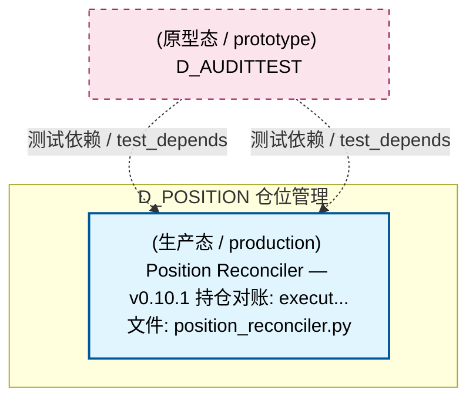
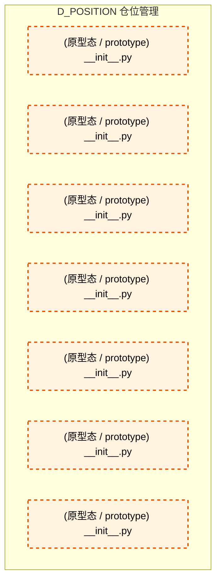

# 45_d_position / 仓位管理 / 仓位管理 / Position Management

> **功能简介 / Overview**: 仓位管理，负责持仓跟踪、仓位计算和盈亏分析

> **文档作用 / Purpose**: 展示 仓位管理（D_POSITION）功能域的模块清单、域内依赖关系、跨域依赖关系、架构分层视图，供架构审查和域治理参考。

> 本文档由 generate_domain_doc.py 从 depgraph (PostgreSQL) 自动生成
> 最后更新: 2026-07-10 02:51:51
> 数据源: depgraph (PostgreSQL) nodes表 + edges表

## 域基本信息 / Domain Overview

| 字段 | 值 | Field | Value |
|------|------|-------|-------|
| 编号 | 45 | Number | 45 |
| 域ID | D_POSITION | Domain ID | D_POSITION |
| 域名称 | 仓位管理 | Domain Name | Position Management |
| 层级 | L2 业务域层 | Layer | L2 Domain |
| 模块数 | 8 | Module Count | 8 |
| 域内依赖 | 1 | Internal Dependencies | 1 |
| 跨域入边 | 2 | Cross-domain Incoming | 2 |
| 跨域出边 | 0 | Cross-domain Outgoing | 0 |
| 设计态模块 | 0 | Design Modules | 0 |
| 原型态模块 | 7 | Prototype Modules | 7 |
| 生产态模块 | 1 | Production Modules | 1 |
| 容量 | 1/150 (正常) | Capacity | 1/150 (正常) |
| 描述 | 持仓跟踪、仓位计算、盈亏归因、仓位调整。仓位账本。 | Description | 持仓跟踪、仓位计算、盈亏归因、仓位调整。仓位账本。 |

## 模块分层清单 / Module Layered List

> 按 architecture_layer 分组的模块清单（共 8 个模块 / 8 modules）。

### L2 领域层 / Domain Layer (8 modules)

| # | 模块路径 / Module Path | 模块名称 / Module Name (功能简介 / Description) | 成熟度 / Maturity | 蓝图 / Blueprint |
|:--:|---------|---------|:---:|:---:|
| 1 | src/zephyr/position/__init__.py | __init__.py | 原型态 / prototype |  |
| 2 | src/zephyr/position/_extensions/__init__.py | __init__.py | 原型态 / prototype |  |
| 3 | src/zephyr/position/api/__init__.py | __init__.py | 原型态 / prototype |  |
| 4 | src/zephyr/position/core/__init__.py | __init__.py | 原型态 / prototype |  |
| 5 | src/zephyr/position/infrastructure/__init__.py | __init__.py | 原型态 / prototype |  |
| 6 | src/zephyr/position/models/__init__.py | __init__.py | 原型态 / prototype |  |
| 7 | src/zephyr/position/position_reconciler.py | Position Reconciler — v0.10.1 持仓对账: execut... | 生产态 / production | [MOD-INF-022](../../03_modules/_domain_autonomy_perm/escalation_protocol/blueprint.md) |
| 8 | src/zephyr/position/services/__init__.py | __init__.py | 原型态 / prototype |  |

## 域内依赖图 / Internal Dependency Diagram

> 依赖图内嵌在本文档中，IDE 可直接渲染显示。参考 decision_index.md 设计，分四个视图：合并全景图、运营态子图、设计态子图、原型态子图（按 design_maturity 实际值拆分）。
>
> **图例说明 / Legend**：
> - **实线边框 = 运营态模块**（production，已上线运行）
> - **虚线边框 = 设计态模块**（design，蓝图阶段，代码未写）
> - **虚线边框 = 原型态模块**（prototype，代码已写，验证中未稳定上线）
> - **实线箭头 = 运营态依赖**（已生效的依赖关系）
> - **虚线箭头 = 非运营态依赖**（计划中/验证中的依赖关系）

### 合并全景图（全部模块，标签标注成熟度）

> 展示全部 8 个模块（生产态 1 + 设计态 0 + 原型态 7），标签标注成熟度。

```mermaid
graph TD
    subgraph D_POSITION["D_POSITION 仓位管理"]
        src_zephyr_position_init_py["(原型态 / prototype) __init__.py"]
        src_zephyr_position_extensions_init_py["(原型态 / prototype) __init__.py"]
        src_zephyr_position_api_init_py["(原型态 / prototype) __init__.py"]
        src_zephyr_position_core_init_py["(原型态 / prototype) __init__.py"]
        src_zephyr_position_infrastructure_init_py["(原型态 / prototype) __init__.py"]
        src_zephyr_position_models_init_py["(原型态 / prototype) __init__.py"]
        src_zephyr_position_position_reconciler_py["(生产态 / production) Position Reconciler — v0.10.1 持仓对账: execut...<br/>文件: position_reconciler.py"]
        src_zephyr_position_services_init_py["(原型态 / prototype) __init__.py"]
    end
    src_zephyr_position_init_py -.->|config_depends / config_depends| src_zephyr_position_position_reconciler_py
    D_AUDITTEST["(原型态 / prototype) D_AUDITTEST"]
    D_AUDITTEST -.->|测试依赖 / test_depends| src_zephyr_position_position_reconciler_py
    D_AUDITTEST -.->|测试依赖 / test_depends| src_zephyr_position_position_reconciler_py
    classDef production fill:#e1f5fe,stroke:#01579b,stroke-width:2px,color:#000
    classDef design fill:#fff3e0,stroke:#e65100,stroke-width:2px,color:#000,stroke-dasharray: 5 5
    classDef external_prod fill:#e8f5e9,stroke:#1b5e20,stroke-width:1px,color:#000
    classDef external_design fill:#fce4ec,stroke:#880e4f,stroke-width:1px,color:#000,stroke-dasharray: 5 5
    class src_zephyr_position_position_reconciler_py production
    class src_zephyr_position_init_py,src_zephyr_position_extensions_init_py,src_zephyr_position_api_init_py,src_zephyr_position_core_init_py,src_zephyr_position_infrastructure_init_py,src_zephyr_position_models_init_py,src_zephyr_position_services_init_py design
    class D_AUDITTEST external_design
```

### 运营态子图（仅 design_maturity=production 的模块和依赖）

> 仅展示已上线运行的模块（共 1 个，0 条域内依赖）。

### 设计态子图（仅 design_maturity=design 的模块和依赖）

> 仅展示蓝图阶段、代码未写的设计态模块（共 0 个，0 条域内依赖）。

> （无设计态模块 / No design modules）

### 原型态子图（仅 design_maturity=prototype 的模块和依赖）

> 仅展示代码已写、验证中未稳定上线的原型态模块（共 7 个，0 条域内依赖）。

## 跨域依赖 / Cross-domain Dependencies

### 本域依赖的其他域（出边）/ Depends On

无跨域出边依赖 / No cross-domain outgoing dependencies

### 依赖本域的其他域（入边）/ Depended By

| # | 外部域-源模块 / Source Module | → | 本域模块 / Target Module | 依赖类型 / Type |
|:--:|---------|:--:|---------|---------|
| 1 | D_AUDITTEST 审计测试套件: test_e_position_reconciler.py | → | Position Reconciler — v0.10.1 持仓对账: execut... | 测试依赖 / test_depends |
| 2 | D_AUDITTEST 审计测试套件: test_position_reconciler.py | → | Position Reconciler — v0.10.1 持仓对账: execut... | 测试依赖 / test_depends |

### 跨域依赖图 / Cross-domain Dependency Diagram

> 本域与 1 个外部域直接连接（出边 0 条 + 入边 2 条 = 2 条）。只显示直接连接的域，不展开具体节点。

## 说明 / Notes

- **数据源 / Data Source**: `depgraph (PostgreSQL)` 的 `nodes`、`edges`、`domains` 表
- **生成器 / Generator**: `generate_domain_doc.py`（G2+G10 合并）
- **维护方式 / Maintenance**: 自动生成，全景图更新时刷新
- **文件名规则 / File Naming**: `{编号:02d}_{域ID小写}.md`，如 `16_d_trading.md`
- **图例说明 / Legend**: `[production]`=已上线 / `[design]`=设计中 / `[prototype]`=原型 / `[unknown]`=未知
