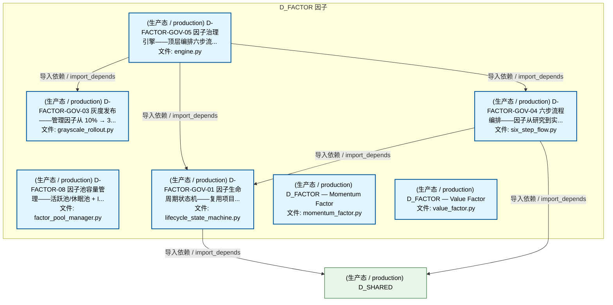
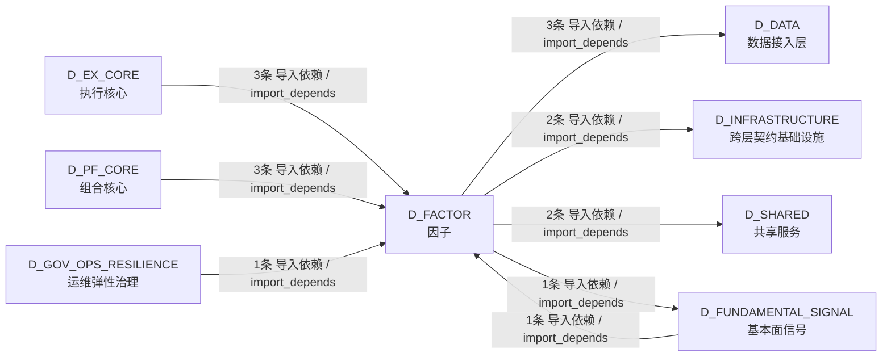

# 46_d_factor / 因子 / Factor

> **功能简介 / Overview**: 因子，负责因子计算、因子库管理和因子评价

> **文档作用 / Purpose**: 展示 因子（D_FACTOR）功能域的模块清单、域内依赖关系、跨域依赖关系、架构分层视图，供架构审查和域治理参考。

> 本文档由 generate_domain_doc.py 从 depgraph (PostgreSQL) 自动生成
> 数据源: depgraph (PostgreSQL) nodes表 + edges表

## 域基本信息 / Domain Overview

| 字段 | 值 | Field | Value |
|------|------|-------|-------|
| 编号 | 46 | Number | 46 |
| 域ID | D_FACTOR | Domain ID | D_FACTOR |
| 域名称 | 因子 | Domain Name | Factor |
| 层级 | L2 业务域层 | Layer | L2 Domain |
| 模块数 | 37 | Module Count | 37 |
| 域内依赖 | 38 | Internal Dependencies | 38 |
| 跨域入边 | 8 | Cross-domain Incoming | 8 |
| 跨域出边 | 8 | Cross-domain Outgoing | 8 |
| 设计态模块 | 0 | Design Modules | 0 |
| 生产态模块 | 37 | Production Modules | 37 |
| 容量 | 37/150 (正常) | Capacity | 37/150 (正常) |
| 描述 | 因子，负责因子计算、因子库管理和因子评价 | Description | 因子，负责因子计算、因子库管理和因子评价 |

## 模块分层清单 / Module Layered List

> 按 architecture_layer 分组的模块清单（共 37 个模块 / 37 modules）。

### L0 基础设施层 / Infrastructure Layer (37 modules)

| # | 模块路径 / Module Path | 模块名称 / Module Name (功能简介 / Description) | 成熟度 / Maturity | 蓝图 / Blueprint |
|:--:|---------|---------|:---:|:---:|
| 1 | src/zephyr/factor/alpha_signal_pipeline.py | alpha_signal_pipeline.py | 生产态 / production |  |
| 2 | src/zephyr/factor/analysis/__init__.py | D_FACTOR analysis 子包——因子分析与评估工具链。 | 生产态 / production |  |
| 3 | src/zephyr/factor/analysis/correlation_analyzer.py | D-FACTOR-ANA-04 因子相关性分析——计算因子间相... | 生产态 / production |  |
| 4 | src/zephyr/factor/analysis/correlation_dedup.py | D-FACTOR-ANA-05 因子相关性去重——基于相关性矩... | 生产态 / production |  |
| 5 | src/zephyr/factor/analysis/decay_monitor.py | D-FACTOR-ANA-08 衰减监控——监控因子 IC 衰减速... | 生产态 / production |  |
| 6 | src/zephyr/factor/analysis/factor_attribution.py | D-FACTOR-ANA-09 因子归因——按时间和行业维度分... | 生产态 / production |  |
| 7 | src/zephyr/factor/analysis/factor_optimization.py | D-FACTOR-ANA-11 因子优化——优化多因子合成权重... | 生产态 / production |  |
| 8 | src/zephyr/factor/analysis/ic_decay.py | D-FACTOR-ANA-03 IC 衰减分析——不同 lag 的 IC ... | 生产态 / production |  |
| 9 | src/zephyr/factor/analysis/ic_ir_calc.py | D-FACTOR-ANA-01 IC/IR 批量计算器——多因子 IC/I... | 生产态 / production |  |
| 10 | src/zephyr/factor/analysis/ic_ir_evaluator.py | D-FACTOR-ANA-02 多因子评估报告器——批量评估+格... | 生产态 / production |  |
| 11 | src/zephyr/factor/analysis/layered_backtest.py | D-FACTOR-ANA-06 分层回测——按因子值分组计算各... | 生产态 / production |  |
| 12 | src/zephyr/factor/analysis/multifactor_synthesis.py | D-FACTOR-ANA-10 多因子合成——将多个因子值合成... | 生产态 / production |  |
| 13 | src/zephyr/factor/analysis/three_level_judgment.py | D-FACTOR-ANA-07 三级判定——按 IC 均值将因子分... | 生产态 / production |  |
| 14 | src/zephyr/factor/bus_factor_defense.py | bus_factor_defense.py | 生产态 / production |  |
| 15 | src/zephyr/factor/core/backpressure/__init__.py | D_FACTOR core backpressure 子包——进程内在途并... | 生产态 / production |  |
| 16 | src/zephyr/factor/core/batch_output/__init__.py | D_FACTOR core batch_output 子包——FactorSignal... | 生产态 / production |  |
| 17 | src/zephyr/factor/core/config_manager/__init__.py | D_FACTOR core config_manager 子包——core 基础... | 生产态 / production |  |
| 18 | src/zephyr/factor/core/ctr001_consumer/__init__.py | CTR-001 NormalizedMarketData 消费者包入口。 | 生产态 / production |  |
| 19 | src/zephyr/factor/core/ctr001_consumer/converter.py | CTR-001 NormalizedMarketData 消费者——数据适配层。 | 生产态 / production |  |
| 20 | src/zephyr/factor/core/ctr002_producer/__init__.py | CTR-002 FactorSignal 生产者包入口。 | 生产态 / production |  |
| 21 | src/zephyr/factor/core/ctr002_producer/converter.py | CTR-002 FactorSignal 生产者——信号适配层。 | 生产态 / production |  |
| 22 | src/zephyr/factor/core/dag_manager/__init__.py | D_FACTOR core dag_manager 子包——DAG 调度执行器。 | 生产态 / production |  |
| 23 | src/zephyr/factor/core/dist_feature_eng/__init__.py | D_FACTOR core dist_feature_eng 子包——分布式特... | 生产态 / production |  |
| 24 | src/zephyr/factor/core/evaluation/__init__.py | D-FACTOR-03 因子评估包——IC/IR/OOS 正率/过拟合... | 生产态 / production |  |
| 25 | src/zephyr/factor/core/evaluation/backtest.py | D-FACTOR-03 因子评估回测运行器——端到端因子评估。 | 生产态 / production |  |
| 26 | src/zephyr/factor/core/evaluation/metrics.py | D-FACTOR-03 因子评估指标——纯函数模块（无 IO ... | 生产态 / production |  |
| 27 | src/zephyr/factor/core/factor_dag/__init__.py | D_FACTOR core factor_dag 子包——因子 DAG 数据... | 生产态 / production |  |
| 28 | src/zephyr/factor/factor_base.py | ZephyrAlpha — D_FACTOR Alpha Factor Layer | 生产态 / production |  |
| 29 | src/zephyr/factor/governance/__init__.py | D_FACTOR governance 子包——因子生命周期治理工具链。 | 生产态 / production |  |
| 30 | src/zephyr/factor/governance/abs001_gate.py | D-FACTOR-GOV-02 ABS001 上线门禁——因子进入灰度... | 生产态 / production |  |
| 31 | src/zephyr/factor/governance/engine.py | D-FACTOR-GOV-05 因子治理引擎——顶层编排六步流... | 生产态 / production |  |
| 32 | src/zephyr/factor/governance/factor_pool_manager.py | D-FACTOR-08 因子池容量管理——活跃池/休眠池 + I... | 生产态 / production |  |
| 33 | src/zephyr/factor/governance/grayscale_rollout.py | D-FACTOR-GOV-03 灰度发布——管理因子从 10% → 3... | 生产态 / production |  |
| 34 | src/zephyr/factor/governance/lifecycle_state_machine.py | D-FACTOR-GOV-01 因子生命周期状态机——复用项目... | 生产态 / production |  |
| 35 | src/zephyr/factor/governance/six_step_flow.py | D-FACTOR-GOV-04 六步流程编排——因子从研究到实... | 生产态 / production |  |
| 36 | src/zephyr/factor/momentum_factor.py | D_FACTOR — Momentum Factor | 生产态 / production |  |
| 37 | src/zephyr/factor/value_factor.py | D_FACTOR — Value Factor | 生产态 / production |  |

## 域内依赖图 / Internal Dependency Diagram

> 依赖图内嵌在本文档中，IDE 可直接渲染显示。参考 decision_index.md 设计，分三个视图：合并全景图、运营态子图、设计态子图（按 design_maturity 实际值拆分）。
>
> **图例说明 / Legend**：
> - **实线边框 = 运营态模块**（production，已上线运行）
> - **虚线边框 = 设计态模块**（design，蓝图阶段，代码未写）
> - **实线箭头 = 运营态依赖**（已生效的依赖关系）
> - **虚线箭头 = 非运营态依赖**（计划中/验证中的依赖关系）

### 合并全景图（全部模块，标签标注成熟度）

> 展示全部 37 个模块（生产态 37 + 设计态 0），标签标注成熟度。

#### 第 1 页 / 共 2 页

```mermaid
graph TD
    subgraph D_FACTOR["D_FACTOR 因子"]
        src_zephyr_factor_alpha_signal_pipeline_py["(生产态 / production) alpha_signal_pipeline.py"]
        src_zephyr_factor_analysis_init_py["(生产态 / production) D_FACTOR analysis 子包——因子分析与评估工具链。<br/>文件: __init__.py"]
        src_zephyr_factor_analysis_correlation_analyzer_py["(生产态 / production) D-FACTOR-ANA-04 因子相关性分析——计算因子间相...<br/>文件: correlation_analyzer.py"]
        src_zephyr_factor_analysis_correlation_dedup_py["(生产态 / production) D-FACTOR-ANA-05 因子相关性去重——基于相关性矩...<br/>文件: correlation_dedup.py"]
        src_zephyr_factor_analysis_decay_monitor_py["(生产态 / production) D-FACTOR-ANA-08 衰减监控——监控因子 IC 衰减速...<br/>文件: decay_monitor.py"]
        src_zephyr_factor_analysis_factor_attribution_py["(生产态 / production) D-FACTOR-ANA-09 因子归因——按时间和行业维度分...<br/>文件: factor_attribution.py"]
        src_zephyr_factor_analysis_factor_optimization_py["(生产态 / production) D-FACTOR-ANA-11 因子优化——优化多因子合成权重...<br/>文件: factor_optimization.py"]
        src_zephyr_factor_analysis_ic_decay_py["(生产态 / production) D-FACTOR-ANA-03 IC 衰减分析——不同 lag 的 IC ...<br/>文件: ic_decay.py"]
        src_zephyr_factor_analysis_ic_ir_calc_py["(生产态 / production) D-FACTOR-ANA-01 IC/IR 批量计算器——多因子 IC/I...<br/>文件: ic_ir_calc.py"]
        src_zephyr_factor_analysis_ic_ir_evaluator_py["(生产态 / production) D-FACTOR-ANA-02 多因子评估报告器——批量评估+格...<br/>文件: ic_ir_evaluator.py"]
        src_zephyr_factor_analysis_layered_backtest_py["(生产态 / production) D-FACTOR-ANA-06 分层回测——按因子值分组计算各...<br/>文件: layered_backtest.py"]
        src_zephyr_factor_analysis_multifactor_synthesis_py["(生产态 / production) D-FACTOR-ANA-10 多因子合成——将多个因子值合成...<br/>文件: multifactor_synthesis.py"]
        src_zephyr_factor_analysis_three_level_judgment_py["(生产态 / production) D-FACTOR-ANA-07 三级判定——按 IC 均值将因子分...<br/>文件: three_level_judgment.py"]
        src_zephyr_factor_bus_factor_defense_py["(生产态 / production) bus_factor_defense.py"]
        src_zephyr_factor_core_backpressure_init_py["(生产态 / production) D_FACTOR core backpressure 子包——进程内在途并...<br/>文件: __init__.py"]
        src_zephyr_factor_core_batch_output_init_py["(生产态 / production) D_FACTOR core batch_output 子包——FactorSignal...<br/>文件: __init__.py"]
        src_zephyr_factor_core_config_manager_init_py["(生产态 / production) D_FACTOR core config_manager 子包——core 基础...<br/>文件: __init__.py"]
        src_zephyr_factor_core_ctr001_consumer_init_py["(生产态 / production) CTR-001 NormalizedMarketData 消费者包入口。<br/>文件: __init__.py"]
        src_zephyr_factor_core_ctr001_consumer_converter_py["(生产态 / production) CTR-001 NormalizedMarketData 消费者——数据适配层。<br/>文件: converter.py"]
        src_zephyr_factor_core_ctr002_producer_init_py["(生产态 / production) CTR-002 FactorSignal 生产者包入口。<br/>文件: __init__.py"]
        src_zephyr_factor_core_ctr002_producer_converter_py["(生产态 / production) CTR-002 FactorSignal 生产者——信号适配层。<br/>文件: converter.py"]
        src_zephyr_factor_core_dag_manager_init_py["(生产态 / production) D_FACTOR core dag_manager 子包——DAG 调度执行器。<br/>文件: __init__.py"]
        src_zephyr_factor_core_dist_feature_eng_init_py["(生产态 / production) D_FACTOR core dist_feature_eng 子包——分布式特...<br/>文件: __init__.py"]
        src_zephyr_factor_core_evaluation_init_py["(生产态 / production) D-FACTOR-03 因子评估包——IC/IR/OOS 正率/过拟合...<br/>文件: __init__.py"]
        src_zephyr_factor_core_evaluation_backtest_py["(生产态 / production) D-FACTOR-03 因子评估回测运行器——端到端因子评估。<br/>文件: backtest.py"]
        src_zephyr_factor_core_evaluation_metrics_py["(生产态 / production) D-FACTOR-03 因子评估指标——纯函数模块（无 IO ...<br/>文件: metrics.py"]
        src_zephyr_factor_core_factor_dag_init_py["(生产态 / production) D_FACTOR core factor_dag 子包——因子 DAG 数据...<br/>文件: __init__.py"]
        src_zephyr_factor_factor_base_py["(生产态 / production) ZephyrAlpha — D_FACTOR Alpha Factor Layer<br/>文件: factor_base.py"]
        src_zephyr_factor_governance_init_py["(生产态 / production) D_FACTOR governance 子包——因子生命周期治理工具链。<br/>文件: __init__.py"]
        src_zephyr_factor_governance_abs001_gate_py["(生产态 / production) D-FACTOR-GOV-02 ABS001 上线门禁——因子进入灰度...<br/>文件: abs001_gate.py"]
    end
    src_zephyr_factor_alpha_signal_pipeline_py -->|导入依赖 / import_depends| src_zephyr_factor_factor_base_py
    src_zephyr_factor_analysis_correlation_dedup_py -->|导入依赖 / import_depends| src_zephyr_factor_analysis_correlation_analyzer_py
    src_zephyr_factor_analysis_factor_attribution_py -->|导入依赖 / import_depends| src_zephyr_factor_analysis_init_py
    src_zephyr_factor_analysis_ic_ir_evaluator_py -->|导入依赖 / import_depends| src_zephyr_factor_core_evaluation_backtest_py
    src_zephyr_factor_analysis_ic_ir_calc_py -->|导入依赖 / import_depends| src_zephyr_factor_core_evaluation_backtest_py
    src_zephyr_factor_analysis_decay_monitor_py -->|导入依赖 / import_depends| src_zephyr_factor_analysis_ic_decay_py
    src_zephyr_factor_analysis_decay_monitor_py -->|导入依赖 / import_depends| src_zephyr_factor_analysis_init_py
    src_zephyr_factor_analysis_factor_optimization_py -->|导入依赖 / import_depends| src_zephyr_factor_analysis_init_py
    src_zephyr_factor_analysis_factor_optimization_py -->|导入依赖 / import_depends| src_zephyr_factor_analysis_multifactor_synthesis_py
    src_zephyr_factor_analysis_factor_optimization_py -->|导入依赖 / import_depends| src_zephyr_factor_core_evaluation_metrics_py
    src_zephyr_factor_analysis_layered_backtest_py -->|导入依赖 / import_depends| src_zephyr_factor_analysis_init_py
    src_zephyr_factor_analysis_ic_decay_py -->|导入依赖 / import_depends| src_zephyr_factor_factor_base_py
    src_zephyr_factor_analysis_ic_decay_py -->|导入依赖 / import_depends| src_zephyr_factor_core_evaluation_metrics_py
    src_zephyr_factor_analysis_ic_decay_py -->|导入依赖 / import_depends| src_zephyr_factor_core_evaluation_backtest_py
    src_zephyr_factor_analysis_three_level_judgment_py -->|导入依赖 / import_depends| src_zephyr_factor_analysis_init_py
    src_zephyr_factor_analysis_three_level_judgment_py -->|导入依赖 / import_depends| src_zephyr_factor_core_evaluation_backtest_py
    src_zephyr_factor_core_ctr001_consumer_init_py -->|导入依赖 / import_depends| src_zephyr_factor_core_ctr001_consumer_converter_py
    src_zephyr_factor_core_ctr002_producer_init_py -->|导入依赖 / import_depends| src_zephyr_factor_core_ctr002_producer_converter_py
    src_zephyr_factor_core_evaluation_init_py -->|导入依赖 / import_depends| src_zephyr_factor_core_evaluation_metrics_py
    src_zephyr_factor_core_evaluation_init_py -->|导入依赖 / import_depends| src_zephyr_factor_core_evaluation_backtest_py
    src_zephyr_factor_core_evaluation_backtest_py -->|导入依赖 / import_depends| src_zephyr_factor_factor_base_py
    src_zephyr_factor_core_evaluation_backtest_py -->|导入依赖 / import_depends| src_zephyr_factor_core_evaluation_metrics_py
    src_zephyr_factor_governance_abs001_gate_py -->|导入依赖 / import_depends| src_zephyr_factor_core_evaluation_backtest_py
    src_zephyr_factor_governance_abs001_gate_py -->|导入依赖 / import_depends| src_zephyr_factor_governance_init_py
    D_FUNDAMENTAL_SIGNAL["(生产态 / production) D_FUNDAMENTAL_SIGNAL"]
    src_zephyr_factor_alpha_signal_pipeline_py -->|导入依赖 / import_depends| D_FUNDAMENTAL_SIGNAL
    D_INFRASTRUCTURE["(生产态 / production) D_INFRASTRUCTURE"]
    src_zephyr_factor_core_ctr002_producer_converter_py -->|导入依赖 / import_depends| D_INFRASTRUCTURE
    src_zephyr_factor_core_ctr001_consumer_converter_py -->|导入依赖 / import_depends| D_INFRASTRUCTURE
    D_DATA["(生产态 / production) D_DATA"]
    src_zephyr_factor_core_evaluation_backtest_py -->|导入依赖 / import_depends| D_DATA
    src_zephyr_factor_core_evaluation_backtest_py -->|导入依赖 / import_depends| D_DATA
    src_zephyr_factor_core_evaluation_backtest_py -->|导入依赖 / import_depends| D_DATA
    D_PF_CORE["(生产态 / production) D_PF_CORE"]
    D_PF_CORE -->|导入依赖 / import_depends| src_zephyr_factor_core_evaluation_backtest_py
    D_PF_CORE -->|导入依赖 / import_depends| src_zephyr_factor_analysis_multifactor_synthesis_py
    D_PF_CORE -->|导入依赖 / import_depends| src_zephyr_factor_factor_base_py
    D_EX_CORE["(生产态 / production) D_EX_CORE"]
    D_EX_CORE -->|导入依赖 / import_depends| src_zephyr_factor_analysis_multifactor_synthesis_py
    D_EX_CORE -->|导入依赖 / import_depends| src_zephyr_factor_core_evaluation_backtest_py
    D_EX_CORE -->|导入依赖 / import_depends| src_zephyr_factor_factor_base_py
    D_FUNDAMENTAL_SIGNAL -->|导入依赖 / import_depends| src_zephyr_factor_factor_base_py
    D_GOV_OPS_RESILIENCE["(生产态 / production) D_GOV_OPS_RESILIENCE"]
    D_GOV_OPS_RESILIENCE -->|导入依赖 / import_depends| src_zephyr_factor_bus_factor_defense_py
    classDef production fill:#e1f5fe,stroke:#01579b,stroke-width:2px,color:#000
    classDef design fill:#fff3e0,stroke:#e65100,stroke-width:2px,color:#000,stroke-dasharray: 5 5
    classDef external_prod fill:#e8f5e9,stroke:#1b5e20,stroke-width:1px,color:#000
    classDef external_design fill:#fce4ec,stroke:#880e4f,stroke-width:1px,color:#000,stroke-dasharray: 5 5
    class src_zephyr_factor_alpha_signal_pipeline_py,src_zephyr_factor_analysis_init_py,src_zephyr_factor_analysis_correlation_analyzer_py,src_zephyr_factor_analysis_correlation_dedup_py,src_zephyr_factor_analysis_decay_monitor_py,src_zephyr_factor_analysis_factor_attribution_py,src_zephyr_factor_analysis_factor_optimization_py,src_zephyr_factor_analysis_ic_decay_py,src_zephyr_factor_analysis_ic_ir_calc_py,src_zephyr_factor_analysis_ic_ir_evaluator_py,src_zephyr_factor_analysis_layered_backtest_py,src_zephyr_factor_analysis_multifactor_synthesis_py,src_zephyr_factor_analysis_three_level_judgment_py,src_zephyr_factor_bus_factor_defense_py,src_zephyr_factor_core_backpressure_init_py,src_zephyr_factor_core_batch_output_init_py,src_zephyr_factor_core_config_manager_init_py,src_zephyr_factor_core_ctr001_consumer_init_py,src_zephyr_factor_core_ctr001_consumer_converter_py,src_zephyr_factor_core_ctr002_producer_init_py,src_zephyr_factor_core_ctr002_producer_converter_py,src_zephyr_factor_core_dag_manager_init_py,src_zephyr_factor_core_dist_feature_eng_init_py,src_zephyr_factor_core_evaluation_init_py,src_zephyr_factor_core_evaluation_backtest_py,src_zephyr_factor_core_evaluation_metrics_py,src_zephyr_factor_core_factor_dag_init_py,src_zephyr_factor_factor_base_py,src_zephyr_factor_governance_init_py,src_zephyr_factor_governance_abs001_gate_py production
    class D_FUNDAMENTAL_SIGNAL,D_INFRASTRUCTURE,D_DATA,D_PF_CORE,D_EX_CORE,D_GOV_OPS_RESILIENCE external_prod
```

#### 第 2 页 / 共 2 页

### 运营态子图（仅 design_maturity=production 的模块和依赖）

> 仅展示已上线运行的模块（共 37 个，38 条域内依赖）。

```mermaid
graph TD
    subgraph D_FACTOR["D_FACTOR 因子"]
        src_zephyr_factor_alpha_signal_pipeline_py["(生产态 / production) alpha_signal_pipeline.py"]
        src_zephyr_factor_analysis_init_py["(生产态 / production) D_FACTOR analysis 子包——因子分析与评估工具链。<br/>文件: __init__.py"]
        src_zephyr_factor_analysis_correlation_analyzer_py["(生产态 / production) D-FACTOR-ANA-04 因子相关性分析——计算因子间相...<br/>文件: correlation_analyzer.py"]
        src_zephyr_factor_analysis_correlation_dedup_py["(生产态 / production) D-FACTOR-ANA-05 因子相关性去重——基于相关性矩...<br/>文件: correlation_dedup.py"]
        src_zephyr_factor_analysis_decay_monitor_py["(生产态 / production) D-FACTOR-ANA-08 衰减监控——监控因子 IC 衰减速...<br/>文件: decay_monitor.py"]
        src_zephyr_factor_analysis_factor_attribution_py["(生产态 / production) D-FACTOR-ANA-09 因子归因——按时间和行业维度分...<br/>文件: factor_attribution.py"]
        src_zephyr_factor_analysis_factor_optimization_py["(生产态 / production) D-FACTOR-ANA-11 因子优化——优化多因子合成权重...<br/>文件: factor_optimization.py"]
        src_zephyr_factor_analysis_ic_decay_py["(生产态 / production) D-FACTOR-ANA-03 IC 衰减分析——不同 lag 的 IC ...<br/>文件: ic_decay.py"]
        src_zephyr_factor_analysis_ic_ir_calc_py["(生产态 / production) D-FACTOR-ANA-01 IC/IR 批量计算器——多因子 IC/I...<br/>文件: ic_ir_calc.py"]
        src_zephyr_factor_analysis_ic_ir_evaluator_py["(生产态 / production) D-FACTOR-ANA-02 多因子评估报告器——批量评估+格...<br/>文件: ic_ir_evaluator.py"]
        src_zephyr_factor_analysis_layered_backtest_py["(生产态 / production) D-FACTOR-ANA-06 分层回测——按因子值分组计算各...<br/>文件: layered_backtest.py"]
        src_zephyr_factor_analysis_multifactor_synthesis_py["(生产态 / production) D-FACTOR-ANA-10 多因子合成——将多个因子值合成...<br/>文件: multifactor_synthesis.py"]
        src_zephyr_factor_analysis_three_level_judgment_py["(生产态 / production) D-FACTOR-ANA-07 三级判定——按 IC 均值将因子分...<br/>文件: three_level_judgment.py"]
        src_zephyr_factor_bus_factor_defense_py["(生产态 / production) bus_factor_defense.py"]
        src_zephyr_factor_core_backpressure_init_py["(生产态 / production) D_FACTOR core backpressure 子包——进程内在途并...<br/>文件: __init__.py"]
        src_zephyr_factor_core_batch_output_init_py["(生产态 / production) D_FACTOR core batch_output 子包——FactorSignal...<br/>文件: __init__.py"]
        src_zephyr_factor_core_config_manager_init_py["(生产态 / production) D_FACTOR core config_manager 子包——core 基础...<br/>文件: __init__.py"]
        src_zephyr_factor_core_ctr001_consumer_init_py["(生产态 / production) CTR-001 NormalizedMarketData 消费者包入口。<br/>文件: __init__.py"]
        src_zephyr_factor_core_ctr001_consumer_converter_py["(生产态 / production) CTR-001 NormalizedMarketData 消费者——数据适配层。<br/>文件: converter.py"]
        src_zephyr_factor_core_ctr002_producer_init_py["(生产态 / production) CTR-002 FactorSignal 生产者包入口。<br/>文件: __init__.py"]
        src_zephyr_factor_core_ctr002_producer_converter_py["(生产态 / production) CTR-002 FactorSignal 生产者——信号适配层。<br/>文件: converter.py"]
        src_zephyr_factor_core_dag_manager_init_py["(生产态 / production) D_FACTOR core dag_manager 子包——DAG 调度执行器。<br/>文件: __init__.py"]
        src_zephyr_factor_core_dist_feature_eng_init_py["(生产态 / production) D_FACTOR core dist_feature_eng 子包——分布式特...<br/>文件: __init__.py"]
        src_zephyr_factor_core_evaluation_init_py["(生产态 / production) D-FACTOR-03 因子评估包——IC/IR/OOS 正率/过拟合...<br/>文件: __init__.py"]
        src_zephyr_factor_core_evaluation_backtest_py["(生产态 / production) D-FACTOR-03 因子评估回测运行器——端到端因子评估。<br/>文件: backtest.py"]
        src_zephyr_factor_core_evaluation_metrics_py["(生产态 / production) D-FACTOR-03 因子评估指标——纯函数模块（无 IO ...<br/>文件: metrics.py"]
        src_zephyr_factor_core_factor_dag_init_py["(生产态 / production) D_FACTOR core factor_dag 子包——因子 DAG 数据...<br/>文件: __init__.py"]
        src_zephyr_factor_factor_base_py["(生产态 / production) ZephyrAlpha — D_FACTOR Alpha Factor Layer<br/>文件: factor_base.py"]
        src_zephyr_factor_governance_init_py["(生产态 / production) D_FACTOR governance 子包——因子生命周期治理工具链。<br/>文件: __init__.py"]
        src_zephyr_factor_governance_abs001_gate_py["(生产态 / production) D-FACTOR-GOV-02 ABS001 上线门禁——因子进入灰度...<br/>文件: abs001_gate.py"]
        src_zephyr_factor_governance_engine_py["(生产态 / production) D-FACTOR-GOV-05 因子治理引擎——顶层编排六步流...<br/>文件: engine.py"]
        src_zephyr_factor_governance_factor_pool_manager_py["(生产态 / production) D-FACTOR-08 因子池容量管理——活跃池/休眠池 + I...<br/>文件: factor_pool_manager.py"]
        src_zephyr_factor_governance_grayscale_rollout_py["(生产态 / production) D-FACTOR-GOV-03 灰度发布——管理因子从 10% → 3...<br/>文件: grayscale_rollout.py"]
        src_zephyr_factor_governance_lifecycle_state_machine_py["(生产态 / production) D-FACTOR-GOV-01 因子生命周期状态机——复用项目...<br/>文件: lifecycle_state_machine.py"]
        src_zephyr_factor_governance_six_step_flow_py["(生产态 / production) D-FACTOR-GOV-04 六步流程编排——因子从研究到实...<br/>文件: six_step_flow.py"]
        src_zephyr_factor_momentum_factor_py["(生产态 / production) D_FACTOR — Momentum Factor<br/>文件: momentum_factor.py"]
        src_zephyr_factor_value_factor_py["(生产态 / production) D_FACTOR — Value Factor<br/>文件: value_factor.py"]
    end
    src_zephyr_factor_alpha_signal_pipeline_py -->|导入依赖 / import_depends| src_zephyr_factor_factor_base_py
    src_zephyr_factor_value_factor_py -->|导入依赖 / import_depends| src_zephyr_factor_factor_base_py
    src_zephyr_factor_analysis_correlation_dedup_py -->|导入依赖 / import_depends| src_zephyr_factor_analysis_correlation_analyzer_py
    src_zephyr_factor_momentum_factor_py -->|导入依赖 / import_depends| src_zephyr_factor_factor_base_py
    src_zephyr_factor_analysis_factor_attribution_py -->|导入依赖 / import_depends| src_zephyr_factor_analysis_init_py
    src_zephyr_factor_analysis_ic_ir_evaluator_py -->|导入依赖 / import_depends| src_zephyr_factor_core_evaluation_backtest_py
    src_zephyr_factor_analysis_ic_ir_calc_py -->|导入依赖 / import_depends| src_zephyr_factor_core_evaluation_backtest_py
    src_zephyr_factor_analysis_decay_monitor_py -->|导入依赖 / import_depends| src_zephyr_factor_analysis_ic_decay_py
    src_zephyr_factor_analysis_decay_monitor_py -->|导入依赖 / import_depends| src_zephyr_factor_analysis_init_py
    src_zephyr_factor_analysis_factor_optimization_py -->|导入依赖 / import_depends| src_zephyr_factor_analysis_init_py
    src_zephyr_factor_analysis_factor_optimization_py -->|导入依赖 / import_depends| src_zephyr_factor_analysis_multifactor_synthesis_py
    src_zephyr_factor_analysis_factor_optimization_py -->|导入依赖 / import_depends| src_zephyr_factor_core_evaluation_metrics_py
    src_zephyr_factor_analysis_layered_backtest_py -->|导入依赖 / import_depends| src_zephyr_factor_analysis_init_py
    src_zephyr_factor_analysis_ic_decay_py -->|导入依赖 / import_depends| src_zephyr_factor_factor_base_py
    src_zephyr_factor_analysis_ic_decay_py -->|导入依赖 / import_depends| src_zephyr_factor_core_evaluation_metrics_py
    src_zephyr_factor_analysis_ic_decay_py -->|导入依赖 / import_depends| src_zephyr_factor_core_evaluation_backtest_py
    src_zephyr_factor_analysis_three_level_judgment_py -->|导入依赖 / import_depends| src_zephyr_factor_analysis_init_py
    src_zephyr_factor_analysis_three_level_judgment_py -->|导入依赖 / import_depends| src_zephyr_factor_core_evaluation_backtest_py
    src_zephyr_factor_core_ctr001_consumer_init_py -->|导入依赖 / import_depends| src_zephyr_factor_core_ctr001_consumer_converter_py
    src_zephyr_factor_core_ctr002_producer_init_py -->|导入依赖 / import_depends| src_zephyr_factor_core_ctr002_producer_converter_py
    src_zephyr_factor_core_evaluation_init_py -->|导入依赖 / import_depends| src_zephyr_factor_core_evaluation_metrics_py
    src_zephyr_factor_core_evaluation_init_py -->|导入依赖 / import_depends| src_zephyr_factor_core_evaluation_backtest_py
    src_zephyr_factor_core_evaluation_backtest_py -->|导入依赖 / import_depends| src_zephyr_factor_factor_base_py
    src_zephyr_factor_core_evaluation_backtest_py -->|导入依赖 / import_depends| src_zephyr_factor_core_evaluation_metrics_py
    src_zephyr_factor_governance_abs001_gate_py -->|导入依赖 / import_depends| src_zephyr_factor_core_evaluation_backtest_py
    src_zephyr_factor_governance_abs001_gate_py -->|导入依赖 / import_depends| src_zephyr_factor_governance_init_py
    src_zephyr_factor_governance_engine_py -->|导入依赖 / import_depends| src_zephyr_factor_core_evaluation_backtest_py
    src_zephyr_factor_governance_engine_py -->|导入依赖 / import_depends| src_zephyr_factor_governance_grayscale_rollout_py
    src_zephyr_factor_governance_engine_py -->|导入依赖 / import_depends| src_zephyr_factor_governance_six_step_flow_py
    src_zephyr_factor_governance_engine_py -->|导入依赖 / import_depends| src_zephyr_factor_governance_lifecycle_state_machine_py
    src_zephyr_factor_governance_grayscale_rollout_py -->|导入依赖 / import_depends| src_zephyr_factor_core_evaluation_backtest_py
    src_zephyr_factor_governance_grayscale_rollout_py -->|导入依赖 / import_depends| src_zephyr_factor_governance_abs001_gate_py
    src_zephyr_factor_governance_grayscale_rollout_py -->|导入依赖 / import_depends| src_zephyr_factor_governance_init_py
    src_zephyr_factor_governance_factor_pool_manager_py -->|导入依赖 / import_depends| src_zephyr_factor_governance_init_py
    src_zephyr_factor_governance_six_step_flow_py -->|导入依赖 / import_depends| src_zephyr_factor_core_evaluation_backtest_py
    src_zephyr_factor_governance_six_step_flow_py -->|导入依赖 / import_depends| src_zephyr_factor_governance_abs001_gate_py
    src_zephyr_factor_governance_six_step_flow_py -->|导入依赖 / import_depends| src_zephyr_factor_governance_lifecycle_state_machine_py
    src_zephyr_factor_governance_lifecycle_state_machine_py -->|导入依赖 / import_depends| src_zephyr_factor_governance_init_py
    D_SHARED["(生产态 / production) D_SHARED"]
    src_zephyr_factor_governance_lifecycle_state_machine_py -->|导入依赖 / import_depends| D_SHARED
    D_INFRASTRUCTURE["(生产态 / production) D_INFRASTRUCTURE"]
    src_zephyr_factor_core_ctr001_consumer_converter_py -->|导入依赖 / import_depends| D_INFRASTRUCTURE
    D_DATA["(生产态 / production) D_DATA"]
    src_zephyr_factor_core_evaluation_backtest_py -->|导入依赖 / import_depends| D_DATA
    src_zephyr_factor_governance_six_step_flow_py -->|导入依赖 / import_depends| D_SHARED
    src_zephyr_factor_core_ctr002_producer_converter_py -->|导入依赖 / import_depends| D_INFRASTRUCTURE
    src_zephyr_factor_core_evaluation_backtest_py -->|导入依赖 / import_depends| D_DATA
    src_zephyr_factor_core_evaluation_backtest_py -->|导入依赖 / import_depends| D_DATA
    D_FUNDAMENTAL_SIGNAL["(生产态 / production) D_FUNDAMENTAL_SIGNAL"]
    src_zephyr_factor_alpha_signal_pipeline_py -->|导入依赖 / import_depends| D_FUNDAMENTAL_SIGNAL
    D_PF_CORE["(生产态 / production) D_PF_CORE"]
    D_PF_CORE -->|导入依赖 / import_depends| src_zephyr_factor_core_evaluation_backtest_py
    D_PF_CORE -->|导入依赖 / import_depends| src_zephyr_factor_analysis_multifactor_synthesis_py
    D_PF_CORE -->|导入依赖 / import_depends| src_zephyr_factor_factor_base_py
    D_EX_CORE["(生产态 / production) D_EX_CORE"]
    D_EX_CORE -->|导入依赖 / import_depends| src_zephyr_factor_analysis_multifactor_synthesis_py
    D_EX_CORE -->|导入依赖 / import_depends| src_zephyr_factor_core_evaluation_backtest_py
    D_EX_CORE -->|导入依赖 / import_depends| src_zephyr_factor_factor_base_py
    D_FUNDAMENTAL_SIGNAL -->|导入依赖 / import_depends| src_zephyr_factor_factor_base_py
    D_GOV_OPS_RESILIENCE["(生产态 / production) D_GOV_OPS_RESILIENCE"]
    D_GOV_OPS_RESILIENCE -->|导入依赖 / import_depends| src_zephyr_factor_bus_factor_defense_py
    classDef production fill:#e1f5fe,stroke:#01579b,stroke-width:2px,color:#000
    classDef design fill:#fff3e0,stroke:#e65100,stroke-width:2px,color:#000,stroke-dasharray: 5 5
    classDef external_prod fill:#e8f5e9,stroke:#1b5e20,stroke-width:1px,color:#000
    classDef external_design fill:#fce4ec,stroke:#880e4f,stroke-width:1px,color:#000,stroke-dasharray: 5 5
    class src_zephyr_factor_alpha_signal_pipeline_py,src_zephyr_factor_analysis_init_py,src_zephyr_factor_analysis_correlation_analyzer_py,src_zephyr_factor_analysis_correlation_dedup_py,src_zephyr_factor_analysis_decay_monitor_py,src_zephyr_factor_analysis_factor_attribution_py,src_zephyr_factor_analysis_factor_optimization_py,src_zephyr_factor_analysis_ic_decay_py,src_zephyr_factor_analysis_ic_ir_calc_py,src_zephyr_factor_analysis_ic_ir_evaluator_py,src_zephyr_factor_analysis_layered_backtest_py,src_zephyr_factor_analysis_multifactor_synthesis_py,src_zephyr_factor_analysis_three_level_judgment_py,src_zephyr_factor_bus_factor_defense_py,src_zephyr_factor_core_backpressure_init_py,src_zephyr_factor_core_batch_output_init_py,src_zephyr_factor_core_config_manager_init_py,src_zephyr_factor_core_ctr001_consumer_init_py,src_zephyr_factor_core_ctr001_consumer_converter_py,src_zephyr_factor_core_ctr002_producer_init_py,src_zephyr_factor_core_ctr002_producer_converter_py,src_zephyr_factor_core_dag_manager_init_py,src_zephyr_factor_core_dist_feature_eng_init_py,src_zephyr_factor_core_evaluation_init_py,src_zephyr_factor_core_evaluation_backtest_py,src_zephyr_factor_core_evaluation_metrics_py,src_zephyr_factor_core_factor_dag_init_py,src_zephyr_factor_factor_base_py,src_zephyr_factor_governance_init_py,src_zephyr_factor_governance_abs001_gate_py,src_zephyr_factor_governance_engine_py,src_zephyr_factor_governance_factor_pool_manager_py,src_zephyr_factor_governance_grayscale_rollout_py,src_zephyr_factor_governance_lifecycle_state_machine_py,src_zephyr_factor_governance_six_step_flow_py,src_zephyr_factor_momentum_factor_py,src_zephyr_factor_value_factor_py production
    class D_SHARED,D_INFRASTRUCTURE,D_DATA,D_FUNDAMENTAL_SIGNAL,D_PF_CORE,D_EX_CORE,D_GOV_OPS_RESILIENCE external_prod
```

### 设计态子图（仅 design_maturity=design 的模块和依赖）

> 仅展示蓝图阶段、代码未写的设计态模块（共 0 个，0 条域内依赖）。

> （无设计态模块 / No design modules）

## 跨域依赖 / Cross-domain Dependencies

### 本域依赖的其他域（出边）/ Depends On

| # | 本域模块 / Source Module | → | 外部域-目标模块 / Target Module | 依赖类型 / Type |
|:--:|---------|:--:|---------|---------|
| 1 | D-FACTOR-03 因子评估回测运行器——端到端因子评... | → | D_DATA 数据接入层: zephyr.data — 数据源集成器（MOD-L00-004）。 (_... | 导入依赖 / import_depends |
| 2 | D-FACTOR-03 因子评估回测运行器——端到端因子评... | → | D_DATA 数据接入层: ClickHouse 统一读取层（裁定 #ARCH-CH-007）。 (c... | 导入依赖 / import_depends |
| 3 | D-FACTOR-03 因子评估回测运行器——端到端因子评... | → | D_DATA 数据接入层: 表名/品类注册表消费层（裁定 #ARCH-CH-024 Phase ... | 导入依赖 / import_depends |
| 4 | alpha_signal_pipeline.py | → | D_FUNDAMENTAL_SIGNAL 基本面信号: AlphaSignalPipeline D_FACTOR->D_SIGNAL跨层集成... | 导入依赖 / import_depends |
| 5 | CTR-001 NormalizedMarketData 消费者——数据适配... | → | D_INFRASTRUCTURE 跨层契约基础设施: market_data.py | 导入依赖 / import_depends |
| 6 | CTR-002 FactorSignal 生产者——信号适配层。 (co... | → | D_INFRASTRUCTURE 跨层契约基础设施: factor_signal.py | 导入依赖 / import_depends |
| 7 | D-FACTOR-GOV-01 因子生命周期状态机——复用项目.... | → | D_SHARED 共享服务: StateMachine[S] — 通用状态机泛型基类 (MOD-INF-... | 导入依赖 / import_depends |
| 8 | D-FACTOR-GOV-04 六步流程编排——因子从研究到实.... | → | D_SHARED 共享服务: StateMachine[S] — 通用状态机泛型基类 (MOD-INF-... | 导入依赖 / import_depends |

### 依赖本域的其他域（入边）/ Depended By

| # | 外部域-源模块 / Source Module | → | 本域模块 / Target Module | 依赖类型 / Type |
|:--:|---------|:--:|---------|---------|
| 1 | D_EX_CORE 执行核心: D_EXECUTION_CORE — 信号源 / 价格源 callable 工... | → | D-FACTOR-ANA-10 多因子合成——将多个因子值合成.... | 导入依赖 / import_depends |
| 2 | D_EX_CORE 执行核心: D_EXECUTION_CORE — 信号源 / 价格源 callable 工... | → | D-FACTOR-03 因子评估回测运行器——端到端因子评... | 导入依赖 / import_depends |
| 3 | D_EX_CORE 执行核心: D_EXECUTION_CORE — 信号源 / 价格源 callable 工... | → | ZephyrAlpha — D_FACTOR Alpha Factor Layer (fac... | 导入依赖 / import_depends |
| 4 | D_FUNDAMENTAL_SIGNAL 基本面信号: AlphaSignalPipeline D_FACTOR->D_SIGNAL跨层集成... | → | ZephyrAlpha — D_FACTOR Alpha Factor Layer (fac... | 导入依赖 / import_depends |
| 5 | D_GOV_OPS_RESILIENCE 运维弹性治理: bus_factor_defense.py | → | bus_factor_defense.py | 导入依赖 / import_depends |
| 6 | D_PF_CORE 组合核心: D_PORTFOLIO_CORE — StrategyRunner 策略运行器（... | → | D-FACTOR-ANA-10 多因子合成——将多个因子值合成.... | 导入依赖 / import_depends |
| 7 | D_PF_CORE 组合核心: D_PORTFOLIO_CORE — StrategyRunner 策略运行器（... | → | D-FACTOR-03 因子评估回测运行器——端到端因子评... | 导入依赖 / import_depends |
| 8 | D_PF_CORE 组合核心: D_PORTFOLIO_CORE — StrategyRunner 策略运行器（... | → | ZephyrAlpha — D_FACTOR Alpha Factor Layer (fac... | 导入依赖 / import_depends |

### 跨域依赖图 / Cross-domain Dependency Diagram

> 本域与 7 个外部域直接连接（出边 8 条 + 入边 8 条 = 16 条）。只显示直接连接的域，不展开具体节点。

## 说明 / Notes

- **数据源 / Data Source**: `depgraph (PostgreSQL)` 的 `nodes`、`edges`、`domains` 表
- **生成器 / Generator**: `generate_domain_doc.py`（G2+G10 合并）
- **维护方式 / Maintenance**: 自动生成，全景图更新时刷新
- **文件名规则 / File Naming**: `{编号:02d}_{域ID小写}.md`，如 `16_d_trading.md`
- **图例说明 / Legend**: `[production]`=已上线 / `[design]`=设计中 / `[unknown]`=未知
