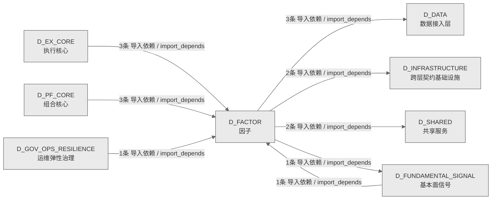

# 46_d_factor / 因子域 / Factor

> **功能简介 / Overview**: 因子，负责因子计算、因子库管理和因子评价

> **文档作用 / Purpose**: 展示 因子（D_FACTOR）功能域的域内依赖关系、跨域依赖关系，模块信息（成熟度/中英文名/大白话/文件路径）内嵌于 Mermaid 节点，供架构审查和域治理参考。

> 本文档由 generate_domain_doc.py 从 depgraph (PostgreSQL) 自动生成
> 数据源: depgraph (PostgreSQL) nodes表 + edges表

> **[可缩放 HTML 版 / Zoomable HTML](http://localhost:8765/docs/02_enterprise_architecture/02_domain_architecture_docs/_zoomable_html/46_d_factor.html)** — Ctrl+滚轮缩放 ｜ 双击重置 ｜ Ctrl+Shift+D 切换拖动/选择模式

## 域基本信息 / Domain Overview

| 字段 | 值 | Field | Value |
|------|------|-------|-------|
| 编号 | 46 | Number | 46 |
| 域ID | D_FACTOR | Domain ID | D_FACTOR |
| 域名称 | 因子 | Domain Name | Factor |
| 层级 | L2 业务域层 | Layer | L2 Domain |
| 模块数 | 37 | Module Count | 37 |
| 域内依赖 | 38 | Internal Dependencies | 38 |
| 跨域入边 | 8 | Cross-domain Incoming | 8 |
| 跨域出边 | 8 | Cross-domain Outgoing | 8 |
| 设计态模块 | 0 | Design Modules | 0 |
| 生产态模块 | 37 | Production Modules | 37 |
| 容量 | 37/150 (正常) | Capacity | 37/150 (正常) |
| 描述 | 因子，负责因子计算、因子库管理和因子评价 | Description | 因子，负责因子计算、因子库管理和因子评价 |

## 域内依赖图 / Internal Dependency Diagram

> 依赖图内嵌在本文档中，IDE 可直接渲染；网页版可 Ctrl+滚轮缩放 + 拖动平移查看细节。全景图用颜色区分运营态/设计态，不再分页/拆子图。
>
> **图例说明 / Legend**：
> - 🟦 **蓝色 = 运营态模块**（production，已上线运行）
> - 🟧 **橙色虚线 = 设计态模块**（design，蓝图阶段，代码未写）
> - **实线箭头 = 运营态依赖**（已生效的依赖关系）
> - **虚线箭头 = 非运营态依赖**（计划中/验证中的依赖关系）

### 全景依赖图（全部模块，颜色区分运营态/设计态）

> 展示全部 37 个模块（生产态 37 + 设计态 0），节点含成熟度+中英文名+大白话+文件路径。

```mermaid
%%{init: {'theme': 'base', 'themeVariables': {'primaryColor': '#eaeaea', 'primaryTextColor': '#333333', 'primaryBorderColor': '#666666', 'lineColor': '#666666', 'secondaryColor': '#eaeaea', 'tertiaryColor': '#eaeaea', 'fontSize': '14px'}}}%%
flowchart TD
    src_zephyr_factor_alpha_signal_pipeline_py["(生产态 / production)<br/>文件: factor/alpha_signal_pipeline.py"]
    src_zephyr_factor_analysis_correlation_dedup_py["(生产态 / production) D-FACTOR-ANA-05 因子相关性去重——基于相关性矩阵去除冗余因子。<br/>D-FACTOR-ANA-05 因子相关性去重——基于相关性矩阵去除冗余因子。<br/>文件: analysis/correlation_dedup.py"]
    src_zephyr_factor_analysis_decay_monitor_py["(生产态 / production) D-FACTOR-ANA-08 衰减监控——监控因子 IC 衰减速度，半衰期低于阈值告警。<br/>D-FACTOR-ANA-08 衰减监控——监控因子 IC 衰减速度，半衰期低于阈值告警。<br/>文件: analysis/decay_monitor.py"]
    src_zephyr_factor_analysis_factor_attribution_py["(生产态 / production) D-FACTOR-ANA-09 因子归因——按时间和行业维度分解因子表现。<br/>D-FACTOR-ANA-09 因子归因——按时间和行业维度分解因子表现。<br/>文件: analysis/factor_attribution.py"]
    src_zephyr_factor_analysis_factor_optimization_py["(生产态 / production) D-FACTOR-ANA-11 因子优化——优化多因子合成权重以最大化目标函数。<br/>D-FACTOR-ANA-11 因子优化——优化多因子合成权重以最大化目标函数。<br/>文件: analysis/factor_optimization.py"]
    src_zephyr_factor_analysis_ic_ir_calc_py["(生产态 / production) D-FACTOR-ANA-01 IC/IR 批量计算器——多因子 IC/IR 指标汇总表。<br/>D-FACTOR-ANA-01 IC/IR 批量计算器——多因子 IC/IR 指标汇总表。<br/>文件: analysis/ic_ir_calc.py"]
    src_zephyr_factor_analysis_ic_ir_evaluator_py["(生产态 / production) D-FACTOR-ANA-02 多因子评估报告器——批量评估+格式化报告。<br/>D-FACTOR-ANA-02 多因子评估报告器——批量评估+格式化报告。<br/>文件: analysis/ic_ir_evaluator.py"]
    src_zephyr_factor_analysis_layered_backtest_py["(生产态 / production) D-FACTOR-ANA-06 分层回测——按因子值分组计算各层收益与多空收益差。<br/>D-FACTOR-ANA-06 分层回测——按因子值分组计算各层收益与多空收益差。<br/>文件: analysis/layered_backtest.py"]
    src_zephyr_factor_analysis_three_level_judgment_py["(生产态 / production) D-FACTOR-ANA-07 三级判定——按 IC 均值将因子分为优秀/合格/淘汰。<br/>D-FACTOR-ANA-07 三级判定——按 IC 均值将因子分为优秀/合格/淘汰。<br/>文件: analysis/three_level_judgment.py"]
    src_zephyr_factor_bus_factor_defense_py["(生产态 / production)<br/>文件: factor/bus_factor_defense.py"]
    src_zephyr_factor_core_backpressure_init_py["(生产态 / production) D_FACTOR core backpressure 子包——进程内在途并发限流器。<br/>D_FACTOR core backpressure 子包——进程内在途并发限流器。<br/>文件: backpressure/__init__.py"]
    src_zephyr_factor_core_batch_output_init_py["(生产态 / production) D_FACTOR core batch_output 子包——FactorSignal 批量缓冲写入器。<br/>D_FACTOR core batch_output 子包——FactorSignal 批量缓冲写入器。<br/>文件: batch_output/__init__.py"]
    src_zephyr_factor_core_config_manager_init_py["(生产态 / production) D_FACTOR core config_manager 子包——core 基础设施模块策略参数加载器。<br/>D_FACTOR core config_manager 子包——core 基础设施模块策略参数加载器。<br/>文件: config_manager/__init__.py"]
    src_zephyr_factor_core_ctr001_consumer_init_py["(生产态 / production) CTR-001 NormalizedMarketData 消费者包入口。<br/>CTR-001 NormalizedMarketData 消费者包入口。<br/>文件: ctr001_consumer/__init__.py"]
    src_zephyr_factor_core_ctr002_producer_init_py["(生产态 / production) CTR-002 FactorSignal 生产者包入口。<br/>CTR-002 FactorSignal 生产者包入口。<br/>文件: ctr002_producer/__init__.py"]
    src_zephyr_factor_core_dag_manager_init_py["(生产态 / production) D_FACTOR core dag_manager 子包——DAG 调度执行器。<br/>D_FACTOR core dag_manager 子包——DAG 调度执行器。<br/>文件: dag_manager/__init__.py"]
    src_zephyr_factor_core_dist_feature_eng_init_py["(生产态 / production) D_FACTOR core dist_feature_eng 子包——分布式特征工程引擎。<br/>D_FACTOR core dist_feature_eng 子包——分布式特征工程引擎。<br/>文件: dist_feature_eng/__init__.py"]
    src_zephyr_factor_core_evaluation_init_py["(生产态 / production) D-FACTOR-03 因子评估包——IC/IR/OOS 正率/过拟合检测。<br/>D-FACTOR-03 因子评估包——IC/IR/OOS 正率/过拟合检测。<br/>文件: evaluation/__init__.py"]
    src_zephyr_factor_core_factor_dag_init_py["(生产态 / production) D_FACTOR core factor_dag 子包——因子 DAG 数据结构 + Kahn 拓扑分层。<br/>D_FACTOR core factor_dag 子包——因子 DAG 数据结构 + Kahn 拓扑分层。<br/>文件: factor_dag/__init__.py"]
    src_zephyr_factor_governance_engine_py["(生产态 / production) D-FACTOR-GOV-05 因子治理引擎——顶层编排六步流程+灰度发布。<br/>D-FACTOR-GOV-05 因子治理引擎——顶层编排六步流程+灰度发布。<br/>文件: governance/engine.py"]
    src_zephyr_factor_governance_factor_pool_manager_py["(生产态 / production) D-FACTOR-08 因子池容量管理——活跃池/休眠池 + IC末位淘汰 + 批量裁剪。<br/>D-FACTOR-08 因子池容量管理——活跃池/休眠池 + IC末位淘汰 + 批量裁剪。<br/>文件: governance/factor_pool_manager.py"]
    src_zephyr_factor_momentum_factor_py["(生产态 / production) D_FACTOR — Momentum Factor<br/>D_FACTOR — Momentum Factor<br/>文件: factor/momentum_factor.py"]
    src_zephyr_factor_value_factor_py["(生产态 / production) D_FACTOR — Value Factor<br/>D_FACTOR — Value Factor<br/>文件: factor/value_factor.py"]
    src_zephyr_factor_alpha_signal_pipeline_py ~~~ src_zephyr_factor_analysis_correlation_dedup_py
    src_zephyr_factor_analysis_correlation_dedup_py ~~~ src_zephyr_factor_analysis_decay_monitor_py
    src_zephyr_factor_analysis_decay_monitor_py ~~~ src_zephyr_factor_analysis_factor_attribution_py
    src_zephyr_factor_analysis_factor_attribution_py ~~~ src_zephyr_factor_analysis_factor_optimization_py
    src_zephyr_factor_analysis_factor_optimization_py ~~~ src_zephyr_factor_analysis_ic_ir_calc_py
    src_zephyr_factor_analysis_ic_ir_calc_py ~~~ src_zephyr_factor_analysis_ic_ir_evaluator_py
    src_zephyr_factor_analysis_ic_ir_evaluator_py ~~~ src_zephyr_factor_analysis_layered_backtest_py
    src_zephyr_factor_analysis_layered_backtest_py ~~~ src_zephyr_factor_analysis_three_level_judgment_py
    src_zephyr_factor_analysis_three_level_judgment_py ~~~ src_zephyr_factor_bus_factor_defense_py
    src_zephyr_factor_bus_factor_defense_py ~~~ src_zephyr_factor_core_backpressure_init_py
    src_zephyr_factor_core_backpressure_init_py ~~~ src_zephyr_factor_core_batch_output_init_py
    src_zephyr_factor_core_batch_output_init_py ~~~ src_zephyr_factor_core_config_manager_init_py
    src_zephyr_factor_core_config_manager_init_py ~~~ src_zephyr_factor_core_ctr001_consumer_init_py
    src_zephyr_factor_core_ctr001_consumer_init_py ~~~ src_zephyr_factor_core_ctr002_producer_init_py
    src_zephyr_factor_core_ctr002_producer_init_py ~~~ src_zephyr_factor_core_dag_manager_init_py
    src_zephyr_factor_core_dag_manager_init_py ~~~ src_zephyr_factor_core_dist_feature_eng_init_py
    src_zephyr_factor_core_dist_feature_eng_init_py ~~~ src_zephyr_factor_core_evaluation_init_py
    src_zephyr_factor_core_evaluation_init_py ~~~ src_zephyr_factor_core_factor_dag_init_py
    src_zephyr_factor_core_factor_dag_init_py ~~~ src_zephyr_factor_governance_engine_py
    src_zephyr_factor_governance_engine_py ~~~ src_zephyr_factor_governance_factor_pool_manager_py
    src_zephyr_factor_governance_factor_pool_manager_py ~~~ src_zephyr_factor_momentum_factor_py
    src_zephyr_factor_momentum_factor_py ~~~ src_zephyr_factor_value_factor_py
    src_zephyr_factor_analysis_init_py["(生产态 / production) D_FACTOR analysis 子包——因子分析与评估工具链。<br/>D_FACTOR analysis 子包——因子分析与评估工具链。<br/>文件: analysis/__init__.py"]
    src_zephyr_factor_analysis_correlation_analyzer_py["(生产态 / production) D-FACTOR-ANA-04 因子相关性分析——计算因子间相关性矩阵。<br/>D-FACTOR-ANA-04 因子相关性分析——计算因子间相关性矩阵。<br/>文件: analysis/correlation_analyzer.py"]
    src_zephyr_factor_analysis_ic_decay_py["(生产态 / production) D-FACTOR-ANA-03 IC 衰减分析——不同 lag 的 IC 衰减曲线与半衰期。<br/>D-FACTOR-ANA-03 IC 衰减分析——不同 lag 的 IC 衰减曲线与半衰期。<br/>文件: analysis/ic_decay.py"]
    src_zephyr_factor_analysis_multifactor_synthesis_py["(生产态 / production) D-FACTOR-ANA-10 多因子合成——将多个因子值合成为综合信号。<br/>D-FACTOR-ANA-10 多因子合成——将多个因子值合成为综合信号。<br/>文件: analysis/multifactor_synthesis.py"]
    src_zephyr_factor_core_ctr001_consumer_converter_py["(生产态 / production) CTR-001 NormalizedMarketData 消费者——数据适配层。<br/>CTR-001 NormalizedMarketData 消费者——数据适配层。<br/>文件: ctr001_consumer/converter.py"]
    src_zephyr_factor_core_ctr002_producer_converter_py["(生产态 / production) CTR-002 FactorSignal 生产者——信号适配层。<br/>CTR-002 FactorSignal 生产者——信号适配层。<br/>文件: ctr002_producer/converter.py"]
    src_zephyr_factor_governance_grayscale_rollout_py["(生产态 / production) D-FACTOR-GOV-03 灰度发布——管理因子从 10% → 30% → 100% 的放量阶梯。<br/>D-FACTOR-GOV-03 灰度发布——管理因子从 10% → 30% → 100% 的放量阶梯。<br/>文件: governance/grayscale_rollout.py"]
    src_zephyr_factor_governance_six_step_flow_py["(生产态 / production) D-FACTOR-GOV-04 六步流程编排——因子从研究到实盘的治理流程。<br/>D-FACTOR-GOV-04 六步流程编排——因子从研究到实盘的治理流程。<br/>文件: governance/six_step_flow.py"]
    src_zephyr_factor_analysis_init_py ~~~ src_zephyr_factor_analysis_correlation_analyzer_py
    src_zephyr_factor_analysis_correlation_analyzer_py ~~~ src_zephyr_factor_analysis_ic_decay_py
    src_zephyr_factor_analysis_ic_decay_py ~~~ src_zephyr_factor_analysis_multifactor_synthesis_py
    src_zephyr_factor_analysis_multifactor_synthesis_py ~~~ src_zephyr_factor_core_ctr001_consumer_converter_py
    src_zephyr_factor_core_ctr001_consumer_converter_py ~~~ src_zephyr_factor_core_ctr002_producer_converter_py
    src_zephyr_factor_core_ctr002_producer_converter_py ~~~ src_zephyr_factor_governance_grayscale_rollout_py
    src_zephyr_factor_governance_grayscale_rollout_py ~~~ src_zephyr_factor_governance_six_step_flow_py
    src_zephyr_factor_governance_abs001_gate_py["(生产态 / production) D-FACTOR-GOV-02 ABS001 上线门禁——因子进入灰度前的质量检查。<br/>D-FACTOR-GOV-02 ABS001 上线门禁——因子进入灰度前的质量检查。<br/>文件: governance/abs001_gate.py"]
    src_zephyr_factor_governance_lifecycle_state_machine_py["(生产态 / production) D-FACTOR-GOV-01 因子生命周期状态机——复用项目级 StateMachine 泛型基类。<br/>D-FACTOR-GOV-01 因子生命周期状态机——复用项目级 StateMachine 泛型基类。<br/>文件: governance/lifecycle_state_machine.py"]
    src_zephyr_factor_governance_abs001_gate_py ~~~ src_zephyr_factor_governance_lifecycle_state_machine_py
    src_zephyr_factor_core_evaluation_backtest_py["(生产态 / production) D-FACTOR-03 因子评估回测运行器——端到端因子评估。<br/>D-FACTOR-03 因子评估回测运行器——端到端因子评估。<br/>文件: evaluation/backtest.py"]
    src_zephyr_factor_governance_init_py["(生产态 / production) D_FACTOR governance 子包——因子生命周期治理工具链。<br/>D_FACTOR governance 子包——因子生命周期治理工具链。<br/>文件: governance/__init__.py"]
    src_zephyr_factor_core_evaluation_backtest_py ~~~ src_zephyr_factor_governance_init_py
    src_zephyr_factor_core_evaluation_metrics_py["(生产态 / production) D-FACTOR-03 因子评估指标——纯函数模块（无 IO 依赖）。<br/>D-FACTOR-03 因子评估指标——纯函数模块（无 IO 依赖）。<br/>文件: evaluation/metrics.py"]
    src_zephyr_factor_factor_base_py["(生产态 / production) ZephyrAlpha — D_FACTOR Alpha Factor Layer<br/>ZephyrAlpha — D_FACTOR Alpha Factor Layer<br/>文件: factor/factor_base.py"]
    src_zephyr_factor_core_evaluation_metrics_py ~~~ src_zephyr_factor_factor_base_py
    src_zephyr_factor_alpha_signal_pipeline_py -->|导入依赖 / import_depends| src_zephyr_factor_factor_base_py
    src_zephyr_factor_value_factor_py -->|导入依赖 / import_depends| src_zephyr_factor_factor_base_py
    src_zephyr_factor_analysis_decay_monitor_py -->|导入依赖 / import_depends| src_zephyr_factor_analysis_ic_decay_py
    src_zephyr_factor_analysis_decay_monitor_py -->|导入依赖 / import_depends| src_zephyr_factor_analysis_init_py
    src_zephyr_factor_analysis_correlation_dedup_py -->|导入依赖 / import_depends| src_zephyr_factor_analysis_correlation_analyzer_py
    src_zephyr_factor_momentum_factor_py -->|导入依赖 / import_depends| src_zephyr_factor_factor_base_py
    src_zephyr_factor_analysis_ic_ir_evaluator_py -->|导入依赖 / import_depends| src_zephyr_factor_core_evaluation_backtest_py
    src_zephyr_factor_analysis_ic_ir_calc_py -->|导入依赖 / import_depends| src_zephyr_factor_core_evaluation_backtest_py
    src_zephyr_factor_analysis_ic_decay_py -->|导入依赖 / import_depends| src_zephyr_factor_factor_base_py
    src_zephyr_factor_analysis_ic_decay_py -->|导入依赖 / import_depends| src_zephyr_factor_core_evaluation_metrics_py
    src_zephyr_factor_analysis_ic_decay_py -->|导入依赖 / import_depends| src_zephyr_factor_core_evaluation_backtest_py
    src_zephyr_factor_analysis_factor_attribution_py -->|导入依赖 / import_depends| src_zephyr_factor_analysis_init_py
    src_zephyr_factor_analysis_factor_optimization_py -->|导入依赖 / import_depends| src_zephyr_factor_analysis_init_py
    src_zephyr_factor_analysis_factor_optimization_py -->|导入依赖 / import_depends| src_zephyr_factor_analysis_multifactor_synthesis_py
    src_zephyr_factor_analysis_factor_optimization_py -->|导入依赖 / import_depends| src_zephyr_factor_core_evaluation_metrics_py
    src_zephyr_factor_analysis_three_level_judgment_py -->|导入依赖 / import_depends| src_zephyr_factor_analysis_init_py
    src_zephyr_factor_analysis_three_level_judgment_py -->|导入依赖 / import_depends| src_zephyr_factor_core_evaluation_backtest_py
    src_zephyr_factor_analysis_layered_backtest_py -->|导入依赖 / import_depends| src_zephyr_factor_analysis_init_py
    src_zephyr_factor_core_ctr001_consumer_init_py -->|导入依赖 / import_depends| src_zephyr_factor_core_ctr001_consumer_converter_py
    src_zephyr_factor_governance_engine_py -->|导入依赖 / import_depends| src_zephyr_factor_core_evaluation_backtest_py
    src_zephyr_factor_governance_engine_py -->|导入依赖 / import_depends| src_zephyr_factor_governance_grayscale_rollout_py
    src_zephyr_factor_governance_engine_py -->|导入依赖 / import_depends| src_zephyr_factor_governance_lifecycle_state_machine_py
    src_zephyr_factor_governance_engine_py -->|导入依赖 / import_depends| src_zephyr_factor_governance_six_step_flow_py
    src_zephyr_factor_governance_factor_pool_manager_py -->|导入依赖 / import_depends| src_zephyr_factor_governance_init_py
    src_zephyr_factor_core_evaluation_init_py -->|导入依赖 / import_depends| src_zephyr_factor_core_evaluation_metrics_py
    src_zephyr_factor_core_evaluation_init_py -->|导入依赖 / import_depends| src_zephyr_factor_core_evaluation_backtest_py
    src_zephyr_factor_core_ctr002_producer_init_py -->|导入依赖 / import_depends| src_zephyr_factor_core_ctr002_producer_converter_py
    src_zephyr_factor_core_evaluation_backtest_py -->|导入依赖 / import_depends| src_zephyr_factor_factor_base_py
    src_zephyr_factor_core_evaluation_backtest_py -->|导入依赖 / import_depends| src_zephyr_factor_core_evaluation_metrics_py
    src_zephyr_factor_governance_abs001_gate_py -->|导入依赖 / import_depends| src_zephyr_factor_core_evaluation_backtest_py
    src_zephyr_factor_governance_abs001_gate_py -->|导入依赖 / import_depends| src_zephyr_factor_governance_init_py
    src_zephyr_factor_governance_grayscale_rollout_py -->|导入依赖 / import_depends| src_zephyr_factor_core_evaluation_backtest_py
    src_zephyr_factor_governance_grayscale_rollout_py -->|导入依赖 / import_depends| src_zephyr_factor_governance_abs001_gate_py
    src_zephyr_factor_governance_grayscale_rollout_py -->|导入依赖 / import_depends| src_zephyr_factor_governance_init_py
    src_zephyr_factor_governance_lifecycle_state_machine_py -->|导入依赖 / import_depends| src_zephyr_factor_governance_init_py
    src_zephyr_factor_governance_six_step_flow_py -->|导入依赖 / import_depends| src_zephyr_factor_core_evaluation_backtest_py
    src_zephyr_factor_governance_six_step_flow_py -->|导入依赖 / import_depends| src_zephyr_factor_governance_abs001_gate_py
    src_zephyr_factor_governance_six_step_flow_py -->|导入依赖 / import_depends| src_zephyr_factor_governance_lifecycle_state_machine_py
    D_SHARED["(生产态 / production) 共享服务 / Shared Services<br/>共享服务，负责跨域共享的工具、协议和基础服务<br/>跨域节点 / cross-domain"]
    src_zephyr_factor_governance_lifecycle_state_machine_py -->|导入依赖 / import_depends| D_SHARED
    D_INFRASTRUCTURE["(生产态 / production) 跨层契约基础设施 / Cross-Layer Contract Infrastructure<br/>跨层契约基础设施，负责跨层契约定义、共享契约管理和契约校验<br/>跨域节点 / cross-domain"]
    src_zephyr_factor_core_ctr001_consumer_converter_py -->|导入依赖 / import_depends| D_INFRASTRUCTURE
    D_DATA["(生产态 / production) 数据接入层 / Data Access Layer<br/>数据接入层，负责数据源接入、数据集成和数据标准化<br/>跨域节点 / cross-domain"]
    src_zephyr_factor_core_evaluation_backtest_py -->|导入依赖 / import_depends| D_DATA
    src_zephyr_factor_core_evaluation_backtest_py -->|导入依赖 / import_depends| D_DATA
    src_zephyr_factor_governance_six_step_flow_py -->|导入依赖 / import_depends| D_SHARED
    src_zephyr_factor_core_ctr002_producer_converter_py -->|导入依赖 / import_depends| D_INFRASTRUCTURE
    src_zephyr_factor_core_evaluation_backtest_py -->|导入依赖 / import_depends| D_DATA
    D_FUNDAMENTAL_SIGNAL["(生产态 / production) 基本面信号 / Fundamental Signal<br/>基本面信号，负责基于财务数据的基本面信号生成<br/>跨域节点 / cross-domain"]
    src_zephyr_factor_alpha_signal_pipeline_py -->|导入依赖 / import_depends| D_FUNDAMENTAL_SIGNAL
    D_FUNDAMENTAL_SIGNAL -->|导入依赖 / import_depends| src_zephyr_factor_factor_base_py
    D_GOV_OPS_RESILIENCE["(生产态 / production) 运维弹性治理 / Ops Resilience Governance<br/>运维弹性治理，负责运维治理、安全治理、弹性治理和升级协议<br/>跨域节点 / cross-domain"]
    D_GOV_OPS_RESILIENCE -->|导入依赖 / import_depends| src_zephyr_factor_bus_factor_defense_py
    D_PF_CORE["(生产态 / production) 组合核心 / Portfolio Core<br/>组合核心，负责投资组合构建、持仓管理和组合优化<br/>跨域节点 / cross-domain"]
    D_PF_CORE -->|导入依赖 / import_depends| src_zephyr_factor_analysis_multifactor_synthesis_py
    D_PF_CORE -->|导入依赖 / import_depends| src_zephyr_factor_core_evaluation_backtest_py
    D_EX_CORE["(生产态 / production) 执行核心 / Execution Core<br/>执行核心，负责订单执行引擎、执行策略和执行管理<br/>跨域节点 / cross-domain"]
    D_EX_CORE -->|导入依赖 / import_depends| src_zephyr_factor_core_evaluation_backtest_py
    D_EX_CORE -->|导入依赖 / import_depends| src_zephyr_factor_factor_base_py
    D_EX_CORE -->|导入依赖 / import_depends| src_zephyr_factor_analysis_multifactor_synthesis_py
    D_PF_CORE -->|导入依赖 / import_depends| src_zephyr_factor_factor_base_py
    classDef production fill:#e1f5fe,stroke:#01579b,stroke-width:2px,color:#000
    classDef design fill:#fff3e0,stroke:#e65100,stroke-width:2px,color:#000,stroke-dasharray: 5 5
    classDef external_prod fill:#e8f4fd,stroke:#0277bd,stroke-width:1px,color:#000
    classDef external_design fill:#fff8e7,stroke:#ef6c00,stroke-width:1px,color:#000,stroke-dasharray: 5 5
    class src_zephyr_factor_alpha_signal_pipeline_py,src_zephyr_factor_analysis_init_py,src_zephyr_factor_analysis_correlation_analyzer_py,src_zephyr_factor_analysis_correlation_dedup_py,src_zephyr_factor_analysis_decay_monitor_py,src_zephyr_factor_analysis_factor_attribution_py,src_zephyr_factor_analysis_factor_optimization_py,src_zephyr_factor_analysis_ic_decay_py,src_zephyr_factor_analysis_ic_ir_calc_py,src_zephyr_factor_analysis_ic_ir_evaluator_py,src_zephyr_factor_analysis_layered_backtest_py,src_zephyr_factor_analysis_multifactor_synthesis_py,src_zephyr_factor_analysis_three_level_judgment_py,src_zephyr_factor_bus_factor_defense_py,src_zephyr_factor_core_backpressure_init_py,src_zephyr_factor_core_batch_output_init_py,src_zephyr_factor_core_config_manager_init_py,src_zephyr_factor_core_ctr001_consumer_init_py,src_zephyr_factor_core_ctr001_consumer_converter_py,src_zephyr_factor_core_ctr002_producer_init_py,src_zephyr_factor_core_ctr002_producer_converter_py,src_zephyr_factor_core_dag_manager_init_py,src_zephyr_factor_core_dist_feature_eng_init_py,src_zephyr_factor_core_evaluation_init_py,src_zephyr_factor_core_evaluation_backtest_py,src_zephyr_factor_core_evaluation_metrics_py,src_zephyr_factor_core_factor_dag_init_py,src_zephyr_factor_factor_base_py,src_zephyr_factor_governance_init_py,src_zephyr_factor_governance_abs001_gate_py,src_zephyr_factor_governance_engine_py,src_zephyr_factor_governance_factor_pool_manager_py,src_zephyr_factor_governance_grayscale_rollout_py,src_zephyr_factor_governance_lifecycle_state_machine_py,src_zephyr_factor_governance_six_step_flow_py,src_zephyr_factor_momentum_factor_py,src_zephyr_factor_value_factor_py production
    class D_SHARED,D_INFRASTRUCTURE,D_DATA,D_FUNDAMENTAL_SIGNAL,D_GOV_OPS_RESILIENCE,D_PF_CORE,D_EX_CORE external_prod
```

## 跨域依赖 / Cross-domain Dependencies

### 本域依赖的其他域（出边）/ Depends On

| # | 本域模块 / Source Module | → | 外部域-目标模块 / Target Module | 依赖类型 / Type |
|:--:|---------|:--:|---------|---------|
| 1 | D-FACTOR-03 因子评估回测运行器——端到端因子评估。 (evalu... | → | D_DATA 数据接入层: zephyr.data — 数据源集成器（MOD-L00-004）。 (data/__init... | 导入依赖 / import_depends |
| 2 | D-FACTOR-03 因子评估回测运行器——端到端因子评估。 (evalu... | → | D_DATA 数据接入层: ClickHouse 统一读取层（裁定 #ARCH-CH-007）。 (data/ch_rea... | 导入依赖 / import_depends |
| 3 | D-FACTOR-03 因子评估回测运行器——端到端因子评估。 (evalu... | → | D_DATA 数据接入层: 表名/品类注册表消费层（裁定 #ARCH-CH-024 Phase 2）。 (dat... | 导入依赖 / import_depends |
| 4 | factor/alpha_signal_pipeline.py | → | D_FUNDAMENTAL_SIGNAL 基本面信号: Alpha 信号管线 / Alpha Signal Pipeline (signal_fundamenta... | 导入依赖 / import_depends |
| 5 | CTR-001 NormalizedMarketData 消费者——数据适配层。 (ctr0... | → | D_INFRASTRUCTURE 跨层契约基础设施: contracts/market_data.py | 导入依赖 / import_depends |
| 6 | CTR-002 FactorSignal 生产者——信号适配层。 (ctr002_produ... | → | D_INFRASTRUCTURE 跨层契约基础设施: contracts/factor_signal.py | 导入依赖 / import_depends |
| 7 | D-FACTOR-GOV-01 因子生命周期状态机——复用项目级 StateMac... | → | D_SHARED 共享服务: StateMachine[S] — 通用状态机泛型基类 (MOD-INF-038) (life... | 导入依赖 / import_depends |
| 8 | D-FACTOR-GOV-04 六步流程编排——因子从研究到实盘的治理流... | → | D_SHARED 共享服务: StateMachine[S] — 通用状态机泛型基类 (MOD-INF-038) (life... | 导入依赖 / import_depends |

### 依赖本域的其他域（入边）/ Depended By

| # | 外部域-源模块 / Source Module | → | 本域模块 / Target Module | 依赖类型 / Type |
|:--:|---------|:--:|---------|---------|
| 1 | D_EX_CORE 执行核心: D_EXECUTION_CORE — 信号源 / 价格源 callable 工厂 (ex_cor... | → | D-FACTOR-ANA-10 多因子合成——将多个因子值合成为综合信号... | 导入依赖 / import_depends |
| 2 | D_EX_CORE 执行核心: D_EXECUTION_CORE — 信号源 / 价格源 callable 工厂 (ex_cor... | → | D-FACTOR-03 因子评估回测运行器——端到端因子评估。 (evalu... | 导入依赖 / import_depends |
| 3 | D_EX_CORE 执行核心: D_EXECUTION_CORE — 信号源 / 价格源 callable 工厂 (ex_cor... | → | ZephyrAlpha — D_FACTOR Alpha Factor Layer (factor/factor... | 导入依赖 / import_depends |
| 4 | D_FUNDAMENTAL_SIGNAL 基本面信号: Alpha 信号管线 / Alpha Signal Pipeline (signal_fundamenta... | → | ZephyrAlpha — D_FACTOR Alpha Factor Layer (factor/factor... | 导入依赖 / import_depends |
| 5 | D_GOV_OPS_RESILIENCE 运维弹性治理: resilience_governance/bus_factor_defense.py | → | factor/bus_factor_defense.py | 导入依赖 / import_depends |
| 6 | D_PF_CORE 组合核心: D_PORTFOLIO_CORE — StrategyRunner 策略运行器（胶水层） (... | → | D-FACTOR-ANA-10 多因子合成——将多个因子值合成为综合信号... | 导入依赖 / import_depends |
| 7 | D_PF_CORE 组合核心: D_PORTFOLIO_CORE — StrategyRunner 策略运行器（胶水层） (... | → | D-FACTOR-03 因子评估回测运行器——端到端因子评估。 (evalu... | 导入依赖 / import_depends |
| 8 | D_PF_CORE 组合核心: D_PORTFOLIO_CORE — StrategyRunner 策略运行器（胶水层） (... | → | ZephyrAlpha — D_FACTOR Alpha Factor Layer (factor/factor... | 导入依赖 / import_depends |

### 跨域依赖图 / Cross-domain Dependency Diagram

> 本域与 7 个外部域直接连接（出边 8 条 + 入边 8 条 = 16 条）。只显示直接连接的域，不展开具体节点。



## 说明 / Notes

- **数据源 / Data Source**: `depgraph (PostgreSQL)` 的 `nodes`、`edges`、`domains` 表
- **生成器 / Generator**: `generate_domain_doc.py`（G2+G10 合并）
- **维护方式 / Maintenance**: 自动生成，全景图更新时刷新
- **文件名规则 / File Naming**: `{编号:02d}_{域ID小写}.md`，如 `16_d_trading.md`
- **图例说明 / Legend**: `[production]`=已上线 / `[design]`=设计中 / `[unknown]`=未知
