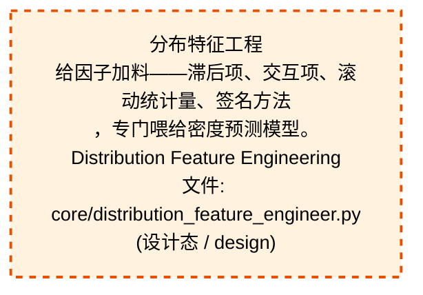
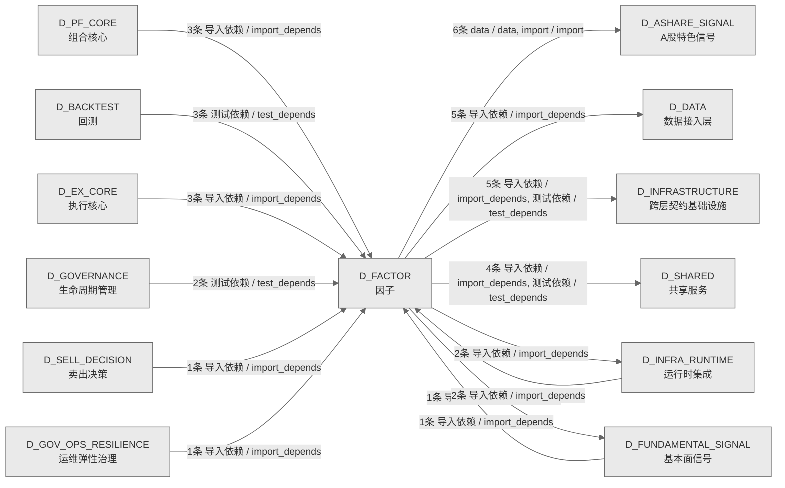

# 46_d_factor / 因子域 / Factor

> **功能简介 / Overview**: 因子，负责因子计算、因子库管理和因子评价

> **文档作用 / Purpose**: 展示 因子（D_FACTOR）功能域的域内依赖关系、跨域依赖关系，模块信息（成熟度/中英文名/大白话/文件路径）内嵌于 Mermaid 节点，供架构审查和域治理参考。

> 本文档由 generate_domain_doc.py 从 depgraph (PostgreSQL) 自动生成
> 数据源: depgraph (PostgreSQL) nodes表 + edges表

> **[可缩放 HTML 版 / Zoomable HTML](http://localhost:8765/docs/02_enterprise_architecture/02_domain_architecture_docs/_zoomable_html/46_d_factor.html)** — Ctrl+滚轮缩放 ｜ 双击重置 ｜ Ctrl+Shift+D 切换拖动/选择模式

## 域基本信息 / Domain Overview

| 字段 | 值 | Field | Value |
|------|------|-------|-------|
| 编号 | 46 | Number | 46 |
| 域ID | D_FACTOR | Domain ID | D_FACTOR |
| 域名称 | 因子 | Domain Name | Factor |
| 层级 | L2 业务域层 | Layer | L2 Domain |
| 模块数 | 66 | Module Count | 66 |
| 域内依赖 | 71 | Internal Dependencies | 71 |
| 跨域入边 | 16 | Cross-domain Incoming | 16 |
| 跨域出边 | 23 | Cross-domain Outgoing | 23 |
| 设计态模块 | 1 | Design Modules | 1 |
| 生产态模块 | 65 | Production Modules | 65 |
| 容量 | 65/150 (正常) | Capacity | 65/150 (正常) |
| 描述 | 因子，负责因子计算、因子库管理和因子评价 | Description | 因子，负责因子计算、因子库管理和因子评价 |

## 域内依赖图 / Internal Dependency Diagram

> 依赖图内嵌在本文档中，IDE 可直接渲染；网页版可 Ctrl+滚轮缩放 + 拖动平移查看细节。
>
> **图例说明 / Legend**：
> - 🟦 **蓝色 = 运营态模块**（production，已上线运行）
> - 🟧 **橙色虚线 = 设计态模块**（design，蓝图阶段，代码未写）
> - **实线箭头 = 运营态依赖**（已生效的依赖关系）
> - **虚线箭头 = 非运营态依赖**（计划中/验证中的依赖关系）

### 全景图（全部模块，颜色区分运营态/设计态）

> 展示全部 66 个模块（生产态 65 + 设计态 1），含跨域依赖外部节点。节点含成熟度+名称+大白话/简介+文件路径。

```mermaid
%%{init: {'theme': 'base', 'themeVariables': {'primaryColor': '#eaeaea', 'primaryTextColor': '#333333', 'primaryBorderColor': '#666666', 'lineColor': '#666666', 'secondaryColor': '#eaeaea', 'tertiaryColor': '#eaeaea', 'fontSize': '14px'}}}%%
flowchart TD
    src_zephyr_factor_init_py["D_FACTOR Alpha Factor Layer<br/>ZephyrAlpha — D_FACTOR Alpha Factor Layer<br/>Init<br/>文件: factor/__init__.py<br/>(生产态 / production)"]
    src_zephyr_factor_alpha_signal_pipeline_py["阿尔法信号管线<br/>依赖管线、D-SIGLEGACY-01工作<br/>alpha_signal_pipeline<br/>文件: factor/alpha_signal_pipeline.py<br/>(生产态 / production)"]
    src_zephyr_factor_analysis_correlation_dedup_py["D-FACTOR-ANA-05<br/>因子相关性去重——基于相关性矩阵去除冗余因子。<br/>因子相关性去重器，计算因子间相关性矩阵，识别并去<br/>除高度相关的冗余因子，减少特征共线性。<br/>correlation_dedup<br/>文件: analysis/correlation_dedup.py<br/>(生产态 / production)"]
    src_zephyr_factor_analysis_decay_monitor_py["D-FACTOR-ANA-08 衰减监控——监控因子 IC<br/>衰减速度，半衰期低于<br/>阈值告警<br/>decay_monitor<br/>文件: analysis/decay_monitor.py<br/>(生产态 / production)"]
    src_zephyr_factor_analysis_factor_attribution_py["D-FACTOR-ANA-09<br/>因子归因——按时间和行业维度分解因子表现。<br/>时间归因：将 IC 时间序列按月<br/>（或其他频率）聚合，看各月 IC 表现。<br/>factor_attribution<br/>文件: analysis/factor_attribution.py<br/>(生产态 / production)"]
    src_zephyr_factor_analysis_factor_optimization_py["D-FACTOR-ANA-11<br/>因子优化——优化多因子合成权重以最大化目标函数。<br/>提供两种优化目标：<br/>factor_optimization<br/>文件: analysis/factor_optimization.py<br/>(生产态 / production)"]
    src_zephyr_factor_analysis_ic_ir_calc_py["D-FACTOR-ANA-01 IC/IR 批量计算器——多因子 IC/IR<br/>指<br/>标汇总表<br/>ic_ir_calc<br/>文件: analysis/ic_ir_calc.py<br/>(生产态 / production)"]
    src_zephyr_factor_analysis_ic_ir_evaluator_py["D-FACTOR-ANA-02<br/>多因子评估报告器——批量评估+格式化报告。<br/>封装 evaluate_factor，返回结构化<br/>EvaluationResult 字典，并提供格式化报告输出。<br/>ic_ir_evaluator<br/>文件: analysis/ic_ir_evaluator.py<br/>(生产态 / production)"]
    src_zephyr_factor_analysis_layered_backtest_py["D-FACTOR-ANA-06<br/>分层回测——按因子值分组计算各层收益与多空收益差<br/>将每个截面的标的按因子值分为 n_layers 组<br/>（默认5分位），计算各层的平均收益，<br/>layered_backtest<br/>文件: analysis/layered_backtest.py<br/>(生产态 / production)"]
    src_zephyr_factor_analysis_three_level_judgment_py["D-FACTOR-ANA-07 三级判定——按 IC<br/>均值将因子分为优秀/合格/<br/>07 三级判定——按 IC 均值将因子分为优秀/合格/淘汰<br/>three_level_judgment<br/>文件: analysis/three_level_judgment.py<br/>(生产态 / production)"]
    src_zephyr_factor_core_backpressure_init_py["core/backpressure 包入口<br/>D_FACTOR core backpressure<br/>子包——进程内在途并发限流器。<br/>文件: backpressure/__init__.py<br/>(生产态 / production)"]
    src_zephyr_factor_core_batch_output_init_py["core/batch_output 包入口<br/>D_FACTOR core batch_output 子包——FactorSignal<br/>批量缓冲写入器。<br/>文件: batch_output/__init__.py<br/>(生产态 / production)"]
    src_zephyr_factor_core_config_manager_init_py["core/config_manager 包入口<br/>D_FACTOR core config_manager 子包——core<br/>基础设施模块策略参数加载器。<br/>文件: config_manager/__init__.py<br/>(生产态 / production)"]
    src_zephyr_factor_core_ctr001_consumer_init_py["core/ctr001_consumer 包入口<br/>包入口，PIT铁律——仅使用timestamp做截面对齐<br/>文件: ctr001_consumer/__init__.py<br/>(生产态 / production)"]
    src_zephyr_factor_core_ctr002_producer_init_py["core/ctr002_producer 包入口<br/>包入口，PIT铁律——as_of_date必须对齐因子计算的数<br/>据截面日期<br/>文件: ctr002_producer/__init__.py<br/>(生产态 / production)"]
    src_zephyr_factor_core_dag_manager_init_py["core/dag_manager 包入口<br/>输入 FactorDAG +<br/>数据，按拓扑层串行推进、层内并发执行因子计算<br/>（ThreadPoolExecutor），<br/>文件: dag_manager/__init__.py<br/>(生产态 / production)"]
    src_zephyr_factor_core_dist_feature_eng_init_py["core/dist_feature_eng 包入口<br/>D_FACTOR core dist_feature_eng<br/>子包——分布式特征工程引擎。<br/>文件: dist_feature_eng/__init__.py<br/>(生产态 / production)"]
    src_zephyr_factor_core_evaluation_init_py["D-FACTOR-03 因子评估包——IC/IR/OOS 正率<br/>/过拟合检测。<br/>- metrics: 纯函数模块（无 IO<br/>依赖），可独立用合成数据测试<br/>文件: evaluation/__init__.py<br/>(生产态 / production)"]
    src_zephyr_factor_intraday_snapshot_factors_py["盘中横截面因子<br/>这个模块提供两个盘中实时因子：一个是最新成交价，<br/>直接读取当前tick的收盘价作为基准；另一个是累计成<br/>交均价，用成交额除以成交量算出当日平均成交价，成<br/>交量为零时回退用最新价避免除零报错。专为解决盘中<br/>三秒周期只有快照数据、没有历史窗口无法算传统时序<br/>因子的问题。<br/>intraday_snapshot_factors<br/>Cross-sectional factors computed from latest<br/>tick snapshot<br/>文件: factor/intraday_snapshot_factors.py<br/>(生产态 / production)"]
    src_zephyr_factor_value_factor_py["价值因子<br/>估值因子。使用简易 PE proxy（价格<br/>/年化盈利估算）。<br/>D_FACTOR — Value Factor<br/>文件: factor/value_factor.py<br/>(生产态 / production)"]
    tests_alpha_signal_test_l02_alpha_factor_py["Test L02 Alpha Factor<br/>alpha signal包的test_l02_alpha_factor模块<br/>文件: alpha_signal/test_l02_alpha_factor.py<br/>(生产态 / production)"]
    tests_factor_test_abs001_gate_py["—纯逻辑模块<br/>D-FACTOR-GOV-02 ABS001<br/>上线门禁测试——纯逻辑模块（无 IO 依赖）。<br/>Test Abs001 Gate<br/>文件: factor/test_abs001_gate.py<br/>(生产态 / production)"]
    tests_factor_test_backpressure_py["—limiter.py<br/>D_FACTOR core backpressure 测试——limiter.py。<br/>Test Backpressure<br/>文件: factor/test_backpressure.py<br/>(生产态 / production)"]
    tests_factor_test_batch_output_py["—buffer.py<br/>D_FACTOR core batch_output 测试——buffer.py。<br/>Test Batch Output<br/>文件: factor/test_batch_output.py<br/>(生产态 / production)"]
    tests_factor_test_config_manager_py["—loader.py<br/>D_FACTOR core config_manager 测试——loader.py。<br/>Test Config Manager<br/>文件: factor/test_config_manager.py<br/>(生产态 / production)"]
    tests_factor_test_ctr001_consumer_py["—converter + filter_quality<br/>CTR-001 NormalizedMarketData<br/>消费者测试——converter + filter_quality。<br/>Test Ctr001 Consumer<br/>文件: factor/test_ctr001_consumer.py<br/>(生产态 / production)"]
    tests_factor_test_ctr002_producer_py["—to_signals<br/>CTR-002 FactorSignal 生产者测试——to_signals。<br/>Test Ctr002 Producer<br/>文件: factor/test_ctr002_producer.py<br/>(生产态 / production)"]
    tests_factor_test_dag_executor_dual_mode_py["—executor 双模切换 + 时间窗口<br/>D_FACTOR-04 Pipeline 双模运行测试——executor<br/>双模切换 + 时间窗口。<br/>Test Dag Executor Dual Mode<br/>文件: factor/test_dag_executor_dual_mode.py<br/>(生产态 / production)"]
    tests_factor_test_dag_manager_py["—executor.py<br/>D_FACTOR core dag_manager 测试——executor.py。<br/>Test Dag Manager<br/>文件: factor/test_dag_manager.py<br/>(生产态 / production)"]
    tests_factor_test_dist_feature_eng_py["—engine.py<br/>D_FACTOR core dist_feature_eng 测试——engine.py。<br/>Test Dist Feature Eng<br/>文件: factor/test_dist_feature_eng.py<br/>(生产态 / production)"]
    tests_factor_test_evaluation_metrics_py["—纯函数模块<br/>D-FACTOR-03 因子评估指标测试——纯函数模块（无 IO<br/>依赖）。<br/>Test Evaluation Metrics<br/>文件: factor/test_evaluation_metrics.py<br/>(生产态 / production)"]
    tests_factor_test_factor_dag_py["—dag.py<br/>D_FACTOR core factor_dag 测试——dag.py。<br/>Test Factor Dag<br/>文件: factor/test_factor_dag.py<br/>(生产态 / production)"]
    tests_factor_test_factor_pool_manager_py["—纯逻辑模块<br/>D-FACTOR-08 因子池容量管理测试——纯逻辑模块（无<br/>IO 依赖）。<br/>Test Factor Pool Manager<br/>文件: factor/test_factor_pool_manager.py<br/>(生产态 / production)"]
    tests_factor_test_governance_engine_py["—纯逻辑模块<br/>D-FACTOR-GOV-05 因子治理引擎测试——纯逻辑模块<br/>（无 IO 依赖）。<br/>Test Governance Engine<br/>文件: factor/test_governance_engine.py<br/>(生产态 / production)"]
    tests_factor_test_grayscale_rollout_py["—纯逻辑模块<br/>D-FACTOR-GOV-03 灰度发布测试——纯逻辑模块（无 IO<br/>依赖）。<br/>Test Grayscale Rollout<br/>文件: factor/test_grayscale_rollout.py<br/>(生产态 / production)"]
    tests_factor_test_incremental_compute_py["—纯逻辑模块<br/>D-FACTOR-01 incremental_compute()<br/>滑动窗口测试——纯逻辑模块（无 IO 依赖）。<br/>Test Incremental Compute<br/>文件: factor/test_incremental_compute.py<br/>(生产态 / production)"]
    tests_factor_test_intraday_factor_loop_py["—盘中3秒因子调度循环<br/>IntradayFactorLoop<br/>单元测试——盘中3秒因子调度循环。<br/>Test Intraday Factor Loop<br/>文件: factor/test_intraday_factor_loop.py<br/>(生产态 / production)"]
    tests_factor_test_lifecycle_state_machine_py["—纯逻辑模块<br/>D-FACTOR-GOV-01<br/>因子生命周期状态机测试——纯逻辑模块（无 IO<br/>依赖）。<br/>Test Lifecycle State Machine<br/>文件: factor/test_lifecycle_state_machine.py<br/>(生产态 / production)"]
    tests_factor_test_six_step_flow_py["—纯逻辑模块<br/>D-FACTOR-GOV-04 六步流程编排测试——纯逻辑模块<br/>（无 IO 依赖）。<br/>Test Six Step Flow<br/>文件: factor/test_six_step_flow.py<br/>(生产态 / production)"]
    src_zephyr_factor_init_py ~~~ src_zephyr_factor_alpha_signal_pipeline_py
    src_zephyr_factor_alpha_signal_pipeline_py ~~~ src_zephyr_factor_analysis_correlation_dedup_py
    src_zephyr_factor_analysis_correlation_dedup_py ~~~ src_zephyr_factor_analysis_decay_monitor_py
    src_zephyr_factor_analysis_decay_monitor_py ~~~ src_zephyr_factor_analysis_factor_attribution_py
    src_zephyr_factor_analysis_factor_attribution_py ~~~ src_zephyr_factor_analysis_factor_optimization_py
    src_zephyr_factor_analysis_factor_optimization_py ~~~ src_zephyr_factor_analysis_ic_ir_calc_py
    src_zephyr_factor_analysis_ic_ir_calc_py ~~~ src_zephyr_factor_analysis_ic_ir_evaluator_py
    src_zephyr_factor_analysis_ic_ir_evaluator_py ~~~ src_zephyr_factor_analysis_layered_backtest_py
    src_zephyr_factor_analysis_layered_backtest_py ~~~ src_zephyr_factor_analysis_three_level_judgment_py
    src_zephyr_factor_analysis_three_level_judgment_py ~~~ src_zephyr_factor_core_backpressure_init_py
    src_zephyr_factor_core_backpressure_init_py ~~~ src_zephyr_factor_core_batch_output_init_py
    src_zephyr_factor_core_batch_output_init_py ~~~ src_zephyr_factor_core_config_manager_init_py
    src_zephyr_factor_core_config_manager_init_py ~~~ src_zephyr_factor_core_ctr001_consumer_init_py
    src_zephyr_factor_core_ctr001_consumer_init_py ~~~ src_zephyr_factor_core_ctr002_producer_init_py
    src_zephyr_factor_core_ctr002_producer_init_py ~~~ src_zephyr_factor_core_dag_manager_init_py
    src_zephyr_factor_core_dag_manager_init_py ~~~ src_zephyr_factor_core_dist_feature_eng_init_py
    src_zephyr_factor_core_dist_feature_eng_init_py ~~~ src_zephyr_factor_core_evaluation_init_py
    src_zephyr_factor_core_evaluation_init_py ~~~ src_zephyr_factor_intraday_snapshot_factors_py
    src_zephyr_factor_intraday_snapshot_factors_py ~~~ src_zephyr_factor_value_factor_py
    src_zephyr_factor_value_factor_py ~~~ tests_alpha_signal_test_l02_alpha_factor_py
    tests_alpha_signal_test_l02_alpha_factor_py ~~~ tests_factor_test_abs001_gate_py
    tests_factor_test_abs001_gate_py ~~~ tests_factor_test_backpressure_py
    tests_factor_test_backpressure_py ~~~ tests_factor_test_batch_output_py
    tests_factor_test_batch_output_py ~~~ tests_factor_test_config_manager_py
    tests_factor_test_config_manager_py ~~~ tests_factor_test_ctr001_consumer_py
    tests_factor_test_ctr001_consumer_py ~~~ tests_factor_test_ctr002_producer_py
    tests_factor_test_ctr002_producer_py ~~~ tests_factor_test_dag_executor_dual_mode_py
    tests_factor_test_dag_executor_dual_mode_py ~~~ tests_factor_test_dag_manager_py
    tests_factor_test_dag_manager_py ~~~ tests_factor_test_dist_feature_eng_py
    tests_factor_test_dist_feature_eng_py ~~~ tests_factor_test_evaluation_metrics_py
    tests_factor_test_evaluation_metrics_py ~~~ tests_factor_test_factor_dag_py
    tests_factor_test_factor_dag_py ~~~ tests_factor_test_factor_pool_manager_py
    tests_factor_test_factor_pool_manager_py ~~~ tests_factor_test_governance_engine_py
    tests_factor_test_governance_engine_py ~~~ tests_factor_test_grayscale_rollout_py
    tests_factor_test_grayscale_rollout_py ~~~ tests_factor_test_incremental_compute_py
    tests_factor_test_incremental_compute_py ~~~ tests_factor_test_intraday_factor_loop_py
    tests_factor_test_intraday_factor_loop_py ~~~ tests_factor_test_lifecycle_state_machine_py
    tests_factor_test_lifecycle_state_machine_py ~~~ tests_factor_test_six_step_flow_py
    src_zephyr_factor_analysis_init_py["factor/analysis 包入口<br/>D_FACTOR analysis 子包——因子分析与评估工具链。<br/>文件: analysis/__init__.py<br/>(生产态 / production)"]
    src_zephyr_factor_analysis_correlation_analyzer_py["D-FACTOR-ANA-04<br/>因子相关性分析——计算因子间相关性矩阵。<br/>纯函数模块，无 IO<br/>依赖。计算多个因子值序列之间的 Spearman rank<br/>correlation，<br/>correlation_analyzer<br/>文件: analysis/correlation_analyzer.py<br/>(生产态 / production)"]
    src_zephyr_factor_analysis_ic_decay_py["D-FACTOR-ANA-03 IC 衰减分析——不同 lag 的 IC<br/>衰减曲<br/>线与半衰期<br/>ic_decay<br/>文件: analysis/ic_decay.py<br/>(生产态 / production)"]
    src_zephyr_factor_analysis_multifactor_synthesis_py["D-FACTOR-ANA-10<br/>多因子合成——将多个因子值合成为综合信号。<br/>提供三种合成方法：<br/>multifactor_synthesis<br/>文件: analysis/multifactor_synthesis.py<br/>(生产态 / production)"]
    src_zephyr_factor_bus_factor_defense_py["总线因子防御<br/>总线因子风险评估器，按 SAFE/AT_RISK/DANGER<br/>三级评估关键人员依赖风险，结合模块归属分析单点故<br/>障。<br/>bus_factor_defense<br/>文件: factor/bus_factor_defense.py<br/>(生产态 / production)"]
    src_zephyr_factor_core_batch_output_buffer_py["—FactorSignal 批量缓冲写入器<br/>D_FACTOR core batch_output.buffer——FactorSignal<br/>批量缓冲写入器。<br/>文件: batch_output/buffer.py<br/>(生产态 / production)"]
    src_zephyr_factor_core_config_manager_loader_py["—加载 core/_config.yaml 策略参数<br/>D_FACTOR core config_manager 加载器——加载 core<br/>/_config.yaml 策略参数。<br/>Loader<br/>文件: config_manager/loader.py<br/>(生产态 / production)"]
    src_zephyr_factor_core_ctr001_consumer_converter_py["转换器<br/>CTR-001 NormalizedMarketData<br/>消费者——数据适配层。<br/>converter<br/>文件: ctr001_consumer/converter.py<br/>(生产态 / production)"]
    src_zephyr_factor_core_ctr002_producer_converter_py["转换器<br/>CTR-002 FactorSignal 生产者——信号适配层。<br/>converter<br/>文件: ctr002_producer/converter.py<br/>(生产态 / production)"]
    src_zephyr_factor_core_dist_feature_eng_engine_py["—分布式特征工程引擎<br/>D_FACTOR core<br/>dist_feature_eng.engine——分布式特征工程引擎。<br/>文件: dist_feature_eng/engine.py<br/>(生产态 / production)"]
    src_zephyr_factor_core_intraday_factor_loop_py["—3秒拉 tick → DataFrame → DagExecutor → H1 Redis<br/>盘中因子调度循环——3秒拉 tick → DataFrame →<br/>DagExecutor → H1 Redis。<br/>Intraday Factor Loop<br/>文件: core/intraday_factor_loop.py<br/>(生产态 / production)"]
    src_zephyr_factor_governance_engine_py["D-FACTOR-GOV-05<br/>因子治理引擎——顶层编排六步流程+灰度发布。<br/>提供因子从提交到实盘的完整治理入口。<br/>engine<br/>文件: governance/engine.py<br/>(生产态 / production)"]
    src_zephyr_factor_governance_factor_pool_manager_py["D-FACTOR-08 因子池容量管理——活跃池/休眠池 +<br/>IC末位淘汰 +<br/>批量裁剪<br/>factor_pool_manager<br/>文件: governance/factor_pool_manager.py<br/>(生产态 / production)"]
    src_zephyr_factor_momentum_factor_py["动量因子<br/>20 日动量因子。计算过去 20<br/>个交易日的价格变化率。<br/>D_FACTOR — Momentum Factor<br/>文件: factor/momentum_factor.py<br/>(生产态 / production)"]
    src_zephyr_factor_analysis_init_py ~~~ src_zephyr_factor_analysis_correlation_analyzer_py
    src_zephyr_factor_analysis_correlation_analyzer_py ~~~ src_zephyr_factor_analysis_ic_decay_py
    src_zephyr_factor_analysis_ic_decay_py ~~~ src_zephyr_factor_analysis_multifactor_synthesis_py
    src_zephyr_factor_analysis_multifactor_synthesis_py ~~~ src_zephyr_factor_bus_factor_defense_py
    src_zephyr_factor_bus_factor_defense_py ~~~ src_zephyr_factor_core_batch_output_buffer_py
    src_zephyr_factor_core_batch_output_buffer_py ~~~ src_zephyr_factor_core_config_manager_loader_py
    src_zephyr_factor_core_config_manager_loader_py ~~~ src_zephyr_factor_core_ctr001_consumer_converter_py
    src_zephyr_factor_core_ctr001_consumer_converter_py ~~~ src_zephyr_factor_core_ctr002_producer_converter_py
    src_zephyr_factor_core_ctr002_producer_converter_py ~~~ src_zephyr_factor_core_dist_feature_eng_engine_py
    src_zephyr_factor_core_dist_feature_eng_engine_py ~~~ src_zephyr_factor_core_intraday_factor_loop_py
    src_zephyr_factor_core_intraday_factor_loop_py ~~~ src_zephyr_factor_governance_engine_py
    src_zephyr_factor_governance_engine_py ~~~ src_zephyr_factor_governance_factor_pool_manager_py
    src_zephyr_factor_governance_factor_pool_manager_py ~~~ src_zephyr_factor_momentum_factor_py
    src_zephyr_factor_core_dag_manager_executor_py["—DAG 调度执行器<br/>D_FACTOR core dag_manager.executor——DAG<br/>调度执行器。<br/>文件: dag_manager/executor.py<br/>(生产态 / production)"]
    src_zephyr_factor_core_factor_dag_init_py["core/factor_dag 包入口<br/>D_FACTOR core factor_dag 子包——因子 DAG<br/>数据结构 + Kahn 拓扑分层。<br/>文件: factor_dag/__init__.py<br/>(生产态 / production)"]
    src_zephyr_factor_governance_grayscale_rollout_py["D-FACTOR-GOV-03 灰度发布——管理因子从 10% → 30% →<br/>100% 的放量阶梯<br/>grayscale_rollout<br/>文件: governance/grayscale_rollout.py<br/>(生产态 / production)"]
    src_zephyr_factor_governance_six_step_flow_py["D-FACTOR-GOV-04<br/>六步流程编排——因子从研究到实盘的治理流程。<br/>六步：研究 → 开发 → 回测验证 → 纸面交易 →<br/>灰度放量 → 实盘上线<br/>six_step_flow<br/>文件: governance/six_step_flow.py<br/>(生产态 / production)"]
    src_zephyr_factor_core_dag_manager_executor_py ~~~ src_zephyr_factor_core_factor_dag_init_py
    src_zephyr_factor_core_factor_dag_init_py ~~~ src_zephyr_factor_governance_grayscale_rollout_py
    src_zephyr_factor_governance_grayscale_rollout_py ~~~ src_zephyr_factor_governance_six_step_flow_py
    src_zephyr_factor_core_backpressure_limiter_py["—进程内在途并发限流器<br/>D_FACTOR core<br/>backpressure.limiter——进程内在途并发限流器。<br/>文件: backpressure/limiter.py<br/>(生产态 / production)"]
    src_zephyr_factor_core_factor_dag_dag_py["—因子 DAG 数据结构 + Kahn 拓扑分层算法<br/>D_FACTOR core factor_dag.dag——因子 DAG 数据结构<br/>+ Kahn 拓扑分层算法。<br/>文件: factor_dag/dag.py<br/>(生产态 / production)"]
    src_zephyr_factor_governance_abs001_gate_py["D-FACTOR-GOV-02 ABS001<br/>上线门禁——因子进入灰度前的质量检<br/>检查4项指标，全部通过才允许因子从 paper →<br/>grayscale：<br/>abs001_gate<br/>文件: governance/abs001_gate.py<br/>(生产态 / production)"]
    src_zephyr_factor_governance_lifecycle_state_machine_py["生命周期状态machine<br/>D-FACTOR-GOV-01 因子生命周期状态机——复用项目级<br/>StateMachine 泛型基类。<br/>lifecycle_state_machine<br/>文件: governance/lifecycle_state_machine.py<br/>(生产态 / production)"]
    src_zephyr_factor_core_backpressure_limiter_py ~~~ src_zephyr_factor_core_factor_dag_dag_py
    src_zephyr_factor_core_factor_dag_dag_py ~~~ src_zephyr_factor_governance_abs001_gate_py
    src_zephyr_factor_governance_abs001_gate_py ~~~ src_zephyr_factor_governance_lifecycle_state_machine_py
    src_zephyr_factor_core_evaluation_backtest_py["D-FACTOR-03 因子评估回测运行器——端到端因子评估。<br/>封装 ch_reader 数据访问 + metrics<br/>纯函数计算，实现：<br/>backtest<br/>文件: evaluation/backtest.py<br/>(生产态 / production)"]
    src_zephyr_factor_governance_init_py["factor/governance 包入口<br/>D_FACTOR governance<br/>子包——因子生命周期治理工具链。<br/>文件: governance/__init__.py<br/>(生产态 / production)"]
    src_zephyr_factor_core_evaluation_backtest_py ~~~ src_zephyr_factor_governance_init_py
    src_zephyr_factor_core_evaluation_metrics_py["D-FACTOR-03 因子评估指标——纯函数模块（无 IO<br/>依赖）。<br/>提供 IC/IR/OOS正率/过拟合检测的计算函数。<br/>metrics<br/>文件: evaluation/metrics.py<br/>(生产态 / production)"]
    src_zephyr_factor_factor_base_py["因子基类<br/>锁定文件（🔒）：任何修改必须先建 KB 决策记录。<br/>文件: factor/factor_base.py<br/>(生产态 / production)"]
    src_zephyr_factor_core_evaluation_metrics_py ~~~ src_zephyr_factor_factor_base_py
    src_zephyr_factor_core_distribution_feature_engineer_py["分布特征工程<br/>给因子加料——滞后项、交互项、滚动统计量、签名方法<br/>，专门喂给密度预测模型。<br/>Distribution Feature Engineering<br/>文件: core/distribution_feature_engineer.py<br/>(设计态 / design)"]
    src_zephyr_factor_alpha_signal_pipeline_py -->|导入依赖 / import_depends| src_zephyr_factor_factor_base_py
    src_zephyr_factor_value_factor_py -->|导入依赖 / import_depends| src_zephyr_factor_factor_base_py
    src_zephyr_factor_init_py -->|导入依赖 / import_depends| src_zephyr_factor_bus_factor_defense_py
    src_zephyr_factor_init_py -->|导入依赖 / import_depends| src_zephyr_factor_factor_base_py
    src_zephyr_factor_factor_base_py -.->|data / data| src_zephyr_factor_core_distribution_feature_engineer_py
    src_zephyr_factor_intraday_snapshot_factors_py -->|导入依赖 / import_depends| src_zephyr_factor_factor_base_py
    src_zephyr_factor_analysis_correlation_dedup_py -->|导入依赖 / import_depends| src_zephyr_factor_analysis_correlation_analyzer_py
    src_zephyr_factor_momentum_factor_py -->|导入依赖 / import_depends| src_zephyr_factor_factor_base_py
    src_zephyr_factor_analysis_ic_decay_py -->|导入依赖 / import_depends| src_zephyr_factor_factor_base_py
    src_zephyr_factor_analysis_ic_decay_py -->|导入依赖 / import_depends| src_zephyr_factor_core_evaluation_backtest_py
    src_zephyr_factor_analysis_ic_decay_py -->|导入依赖 / import_depends| src_zephyr_factor_core_evaluation_metrics_py
    src_zephyr_factor_analysis_decay_monitor_py -->|导入依赖 / import_depends| src_zephyr_factor_analysis_ic_decay_py
    src_zephyr_factor_analysis_decay_monitor_py -->|导入依赖 / import_depends| src_zephyr_factor_analysis_init_py
    src_zephyr_factor_analysis_factor_attribution_py -->|导入依赖 / import_depends| src_zephyr_factor_analysis_init_py
    src_zephyr_factor_analysis_layered_backtest_py -->|导入依赖 / import_depends| src_zephyr_factor_analysis_init_py
    src_zephyr_factor_analysis_ic_ir_calc_py -->|导入依赖 / import_depends| src_zephyr_factor_core_evaluation_backtest_py
    src_zephyr_factor_analysis_factor_optimization_py -->|导入依赖 / import_depends| src_zephyr_factor_analysis_multifactor_synthesis_py
    src_zephyr_factor_analysis_factor_optimization_py -->|导入依赖 / import_depends| src_zephyr_factor_analysis_init_py
    src_zephyr_factor_analysis_factor_optimization_py -->|导入依赖 / import_depends| src_zephyr_factor_core_evaluation_metrics_py
    src_zephyr_factor_core_intraday_factor_loop_py -->|导入依赖 / import_depends| src_zephyr_factor_factor_base_py
    src_zephyr_factor_core_intraday_factor_loop_py -->|导入依赖 / import_depends| src_zephyr_factor_core_dag_manager_executor_py
    src_zephyr_factor_core_intraday_factor_loop_py -->|导入依赖 / import_depends| src_zephyr_factor_core_factor_dag_init_py
    src_zephyr_factor_analysis_ic_ir_evaluator_py -->|导入依赖 / import_depends| src_zephyr_factor_core_evaluation_backtest_py
    src_zephyr_factor_core_backpressure_init_py -->|导入依赖 / import_depends| src_zephyr_factor_core_backpressure_limiter_py
    src_zephyr_factor_analysis_three_level_judgment_py -->|导入依赖 / import_depends| src_zephyr_factor_analysis_init_py
    src_zephyr_factor_analysis_three_level_judgment_py -->|导入依赖 / import_depends| src_zephyr_factor_core_evaluation_backtest_py
    src_zephyr_factor_core_ctr001_consumer_init_py -->|导入依赖 / import_depends| src_zephyr_factor_core_ctr001_consumer_converter_py
    src_zephyr_factor_core_config_manager_init_py -->|导入依赖 / import_depends| src_zephyr_factor_core_config_manager_loader_py
    src_zephyr_factor_core_batch_output_init_py -->|导入依赖 / import_depends| src_zephyr_factor_core_batch_output_buffer_py
    src_zephyr_factor_core_dag_manager_executor_py -->|导入依赖 / import_depends| src_zephyr_factor_factor_base_py
    src_zephyr_factor_core_dag_manager_executor_py -->|导入依赖 / import_depends| src_zephyr_factor_core_backpressure_limiter_py
    src_zephyr_factor_core_dag_manager_executor_py -->|导入依赖 / import_depends| src_zephyr_factor_core_factor_dag_dag_py
    src_zephyr_factor_core_dag_manager_init_py -->|导入依赖 / import_depends| src_zephyr_factor_core_dag_manager_executor_py
    src_zephyr_factor_core_ctr002_producer_init_py -->|导入依赖 / import_depends| src_zephyr_factor_core_ctr002_producer_converter_py
    src_zephyr_factor_core_evaluation_init_py -->|导入依赖 / import_depends| src_zephyr_factor_core_evaluation_backtest_py
    src_zephyr_factor_core_evaluation_init_py -->|导入依赖 / import_depends| src_zephyr_factor_core_evaluation_metrics_py
    src_zephyr_factor_core_evaluation_backtest_py -->|导入依赖 / import_depends| src_zephyr_factor_factor_base_py
    src_zephyr_factor_core_evaluation_backtest_py -->|导入依赖 / import_depends| src_zephyr_factor_core_evaluation_metrics_py
    src_zephyr_factor_governance_abs001_gate_py -->|导入依赖 / import_depends| src_zephyr_factor_core_evaluation_backtest_py
    src_zephyr_factor_governance_abs001_gate_py -->|导入依赖 / import_depends| src_zephyr_factor_governance_init_py
    src_zephyr_factor_core_dist_feature_eng_init_py -->|导入依赖 / import_depends| src_zephyr_factor_core_dist_feature_eng_engine_py
    src_zephyr_factor_core_dist_feature_eng_engine_py -->|导入依赖 / import_depends| src_zephyr_factor_factor_base_py
    src_zephyr_factor_core_dist_feature_eng_engine_py -->|导入依赖 / import_depends| src_zephyr_factor_core_backpressure_limiter_py
    src_zephyr_factor_core_dist_feature_eng_engine_py -->|导入依赖 / import_depends| src_zephyr_factor_core_factor_dag_dag_py
    src_zephyr_factor_core_factor_dag_init_py -->|导入依赖 / import_depends| src_zephyr_factor_core_factor_dag_dag_py
    src_zephyr_factor_core_factor_dag_dag_py -->|导入依赖 / import_depends| src_zephyr_factor_factor_base_py
    src_zephyr_factor_governance_engine_py -->|导入依赖 / import_depends| src_zephyr_factor_core_evaluation_backtest_py
    src_zephyr_factor_governance_engine_py -->|导入依赖 / import_depends| src_zephyr_factor_governance_lifecycle_state_machine_py
    src_zephyr_factor_governance_engine_py -->|导入依赖 / import_depends| src_zephyr_factor_governance_six_step_flow_py
    src_zephyr_factor_governance_engine_py -->|导入依赖 / import_depends| src_zephyr_factor_governance_grayscale_rollout_py
    src_zephyr_factor_governance_factor_pool_manager_py -->|导入依赖 / import_depends| src_zephyr_factor_governance_init_py
    src_zephyr_factor_governance_lifecycle_state_machine_py -->|导入依赖 / import_depends| src_zephyr_factor_governance_init_py
    src_zephyr_factor_governance_six_step_flow_py -->|导入依赖 / import_depends| src_zephyr_factor_core_evaluation_backtest_py
    src_zephyr_factor_governance_six_step_flow_py -->|导入依赖 / import_depends| src_zephyr_factor_governance_abs001_gate_py
    src_zephyr_factor_governance_six_step_flow_py -->|导入依赖 / import_depends| src_zephyr_factor_governance_lifecycle_state_machine_py
    src_zephyr_factor_governance_grayscale_rollout_py -->|导入依赖 / import_depends| src_zephyr_factor_core_evaluation_backtest_py
    src_zephyr_factor_governance_grayscale_rollout_py -->|导入依赖 / import_depends| src_zephyr_factor_governance_abs001_gate_py
    src_zephyr_factor_governance_grayscale_rollout_py -->|导入依赖 / import_depends| src_zephyr_factor_governance_init_py
    tests_factor_test_abs001_gate_py -->|测试依赖 / test_depends| src_zephyr_factor_core_evaluation_backtest_py
    tests_factor_test_abs001_gate_py -->|测试依赖 / test_depends| src_zephyr_factor_governance_abs001_gate_py
    tests_factor_test_factor_pool_manager_py -->|测试依赖 / test_depends| src_zephyr_factor_governance_factor_pool_manager_py
    tests_factor_test_grayscale_rollout_py -->|测试依赖 / test_depends| src_zephyr_factor_core_evaluation_backtest_py
    tests_factor_test_grayscale_rollout_py -->|测试依赖 / test_depends| src_zephyr_factor_governance_grayscale_rollout_py
    tests_factor_test_incremental_compute_py -->|测试依赖 / test_depends| src_zephyr_factor_factor_base_py
    tests_factor_test_incremental_compute_py -->|测试依赖 / test_depends| src_zephyr_factor_momentum_factor_py
    tests_factor_test_governance_engine_py -->|测试依赖 / test_depends| src_zephyr_factor_core_evaluation_backtest_py
    tests_factor_test_governance_engine_py -->|测试依赖 / test_depends| src_zephyr_factor_governance_engine_py
    tests_factor_test_intraday_factor_loop_py -->|测试依赖 / test_depends| src_zephyr_factor_core_intraday_factor_loop_py
    tests_factor_test_lifecycle_state_machine_py -->|测试依赖 / test_depends| src_zephyr_factor_governance_lifecycle_state_machine_py
    tests_factor_test_six_step_flow_py -->|测试依赖 / test_depends| src_zephyr_factor_core_evaluation_backtest_py
    tests_factor_test_six_step_flow_py -->|测试依赖 / test_depends| src_zephyr_factor_governance_six_step_flow_py
    D_ASHARE_SIGNAL["A股特色信号<br/>A 股特色信号，负责 A<br/>股市场特色交易信号的生成和管理<br/>A-Share Signal<br/>跨域节点 / cross-domain<br/>(设计态 / design)"]
    src_zephyr_factor_factor_base_py -.->|data / data| D_ASHARE_SIGNAL
    src_zephyr_factor_factor_base_py -.->|data / data| D_ASHARE_SIGNAL
    src_zephyr_factor_factor_base_py -.->|data / data| D_ASHARE_SIGNAL
    src_zephyr_factor_factor_base_py -.->|data / data| D_ASHARE_SIGNAL
    src_zephyr_factor_factor_base_py -.->|data / data| D_ASHARE_SIGNAL
    src_zephyr_factor_core_distribution_feature_engineer_py -.->|import / import| D_ASHARE_SIGNAL
    D_SHARED["共享服务<br/>共享服务，负责跨域共享的工具、协议和基础服务<br/>Shared Services<br/>跨域节点 / cross-domain<br/>(生产态 / production)"]
    tests_factor_test_lifecycle_state_machine_py -->|测试依赖 / test_depends| D_SHARED
    D_DATA["数据接入层<br/>数据接入层，负责数据源接入、数据集成和数据标准化<br/>Data Access Layer<br/>跨域节点 / cross-domain<br/>(生产态 / production)"]
    src_zephyr_factor_core_evaluation_backtest_py -->|导入依赖 / import_depends| D_DATA
    src_zephyr_factor_core_batch_output_buffer_py -->|导入依赖 / import_depends| D_DATA
    D_INFRASTRUCTURE["跨层契约基础设施<br/>跨层契约基础设施，负责跨层契约定义、共享契约管理<br/>和契约校验<br/>Cross-Layer Contract Infrastructure<br/>跨域节点 / cross-domain<br/>(生产态 / production)"]
    src_zephyr_factor_core_batch_output_buffer_py -->|导入依赖 / import_depends| D_INFRASTRUCTURE
    D_INFRA_RUNTIME["运行时集成<br/>运行时集成，负责组件生命周期编排、启动钩子和运行<br/>时上下文管理<br/>Runtime Integration<br/>跨域节点 / cross-domain<br/>(生产态 / production)"]
    src_zephyr_factor_core_intraday_factor_loop_py -->|导入依赖 / import_depends| D_INFRA_RUNTIME
    src_zephyr_factor_core_evaluation_backtest_py -->|导入依赖 / import_depends| D_DATA
    src_zephyr_factor_core_factor_dag_dag_py -->|导入依赖 / import_depends| D_SHARED
    src_zephyr_factor_core_batch_output_buffer_py -->|导入依赖 / import_depends| D_DATA
    src_zephyr_factor_core_evaluation_backtest_py -->|导入依赖 / import_depends| D_DATA
    D_SELL_DECISION["卖出决策<br/>卖出决策，负责卖出信号生成、卖出时机判断和退出策<br/>略<br/>Sell Decision<br/>跨域节点 / cross-domain<br/>(设计态 / design)"]
    D_SELL_DECISION -.->|导入依赖 / import_depends| src_zephyr_factor_core_intraday_factor_loop_py
    D_PF_CORE["组合核心<br/>组合核心，负责投资组合构建、持仓管理和组合优化<br/>Portfolio Core<br/>跨域节点 / cross-domain<br/>(生产态 / production)"]
    D_PF_CORE -->|导入依赖 / import_depends| src_zephyr_factor_analysis_multifactor_synthesis_py
    D_GOVERNANCE["生命周期管理<br/>生命周期管理，负责蓝图/模块<br/>/任务的声明周期管理和元数据治理<br/>Lifecycle Management<br/>跨域节点 / cross-domain<br/>(生产态 / production)"]
    D_GOVERNANCE -->|测试依赖 / test_depends| src_zephyr_factor_factor_base_py
    D_PF_CORE -->|导入依赖 / import_depends| src_zephyr_factor_core_evaluation_backtest_py
    D_BACKTEST["回测<br/>回测，负责历史数据回测、回测引擎和回测报告<br/>Backtest<br/>跨域节点 / cross-domain<br/>(生产态 / production)"]
    D_BACKTEST -->|测试依赖 / test_depends| src_zephyr_factor_factor_base_py
    D_BACKTEST -->|测试依赖 / test_depends| src_zephyr_factor_core_evaluation_metrics_py
    D_INFRA_RUNTIME -->|导入依赖 / import_depends| src_zephyr_factor_core_intraday_factor_loop_py
    D_PF_CORE -->|导入依赖 / import_depends| src_zephyr_factor_factor_base_py
    D_GOVERNANCE -->|测试依赖 / test_depends| src_zephyr_factor_bus_factor_defense_py
    D_GOV_OPS_RESILIENCE["运维弹性治理<br/>运维弹性治理，负责运维治理、安全治理、弹性治理和<br/>升级协议<br/>Ops Resilience Governance<br/>跨域节点 / cross-domain<br/>(生产态 / production)"]
    D_GOV_OPS_RESILIENCE -->|导入依赖 / import_depends| src_zephyr_factor_bus_factor_defense_py
    D_EX_CORE["执行核心<br/>执行核心，负责订单执行引擎、执行策略和执行管理<br/>Execution Core<br/>跨域节点 / cross-domain<br/>(生产态 / production)"]
    D_EX_CORE -->|导入依赖 / import_depends| src_zephyr_factor_factor_base_py
    D_INFRA_RUNTIME -->|导入依赖 / import_depends| src_zephyr_factor_intraday_snapshot_factors_py
    D_BACKTEST -->|测试依赖 / test_depends| src_zephyr_factor_value_factor_py
    D_FUNDAMENTAL_SIGNAL["基本面信号<br/>基本面信号，负责基于财务数据的基本面信号生成<br/>Fundamental Signal<br/>跨域节点 / cross-domain<br/>(生产态 / production)"]
    D_FUNDAMENTAL_SIGNAL -->|导入依赖 / import_depends| src_zephyr_factor_factor_base_py
    D_EX_CORE -->|导入依赖 / import_depends| src_zephyr_factor_analysis_multifactor_synthesis_py
    classDef production fill:#e1f5fe,stroke:#01579b,stroke-width:2px,color:#000
    classDef design fill:#fff3e0,stroke:#e65100,stroke-width:2px,color:#000,stroke-dasharray: 5 5
    classDef external_prod fill:#e8f4fd,stroke:#0277bd,stroke-width:1px,color:#000
    classDef external_design fill:#fff8e7,stroke:#ef6c00,stroke-width:1px,color:#000,stroke-dasharray: 5 5
    class src_zephyr_factor_init_py,src_zephyr_factor_alpha_signal_pipeline_py,src_zephyr_factor_analysis_init_py,src_zephyr_factor_analysis_correlation_analyzer_py,src_zephyr_factor_analysis_correlation_dedup_py,src_zephyr_factor_analysis_decay_monitor_py,src_zephyr_factor_analysis_factor_attribution_py,src_zephyr_factor_analysis_factor_optimization_py,src_zephyr_factor_analysis_ic_decay_py,src_zephyr_factor_analysis_ic_ir_calc_py,src_zephyr_factor_analysis_ic_ir_evaluator_py,src_zephyr_factor_analysis_layered_backtest_py,src_zephyr_factor_analysis_multifactor_synthesis_py,src_zephyr_factor_analysis_three_level_judgment_py,src_zephyr_factor_bus_factor_defense_py,src_zephyr_factor_core_backpressure_init_py,src_zephyr_factor_core_backpressure_limiter_py,src_zephyr_factor_core_batch_output_init_py,src_zephyr_factor_core_batch_output_buffer_py,src_zephyr_factor_core_config_manager_init_py,src_zephyr_factor_core_config_manager_loader_py,src_zephyr_factor_core_ctr001_consumer_init_py,src_zephyr_factor_core_ctr001_consumer_converter_py,src_zephyr_factor_core_ctr002_producer_init_py,src_zephyr_factor_core_ctr002_producer_converter_py,src_zephyr_factor_core_dag_manager_init_py,src_zephyr_factor_core_dag_manager_executor_py,src_zephyr_factor_core_dist_feature_eng_init_py,src_zephyr_factor_core_dist_feature_eng_engine_py,src_zephyr_factor_core_evaluation_init_py,src_zephyr_factor_core_evaluation_backtest_py,src_zephyr_factor_core_evaluation_metrics_py,src_zephyr_factor_core_factor_dag_init_py,src_zephyr_factor_core_factor_dag_dag_py,src_zephyr_factor_core_intraday_factor_loop_py,src_zephyr_factor_factor_base_py,src_zephyr_factor_governance_init_py,src_zephyr_factor_governance_abs001_gate_py,src_zephyr_factor_governance_engine_py,src_zephyr_factor_governance_factor_pool_manager_py,src_zephyr_factor_governance_grayscale_rollout_py,src_zephyr_factor_governance_lifecycle_state_machine_py,src_zephyr_factor_governance_six_step_flow_py,src_zephyr_factor_intraday_snapshot_factors_py,src_zephyr_factor_momentum_factor_py,src_zephyr_factor_value_factor_py,tests_alpha_signal_test_l02_alpha_factor_py,tests_factor_test_abs001_gate_py,tests_factor_test_backpressure_py,tests_factor_test_batch_output_py,tests_factor_test_config_manager_py,tests_factor_test_ctr001_consumer_py,tests_factor_test_ctr002_producer_py,tests_factor_test_dag_executor_dual_mode_py,tests_factor_test_dag_manager_py,tests_factor_test_dist_feature_eng_py,tests_factor_test_evaluation_metrics_py,tests_factor_test_factor_dag_py,tests_factor_test_factor_pool_manager_py,tests_factor_test_governance_engine_py,tests_factor_test_grayscale_rollout_py,tests_factor_test_incremental_compute_py,tests_factor_test_intraday_factor_loop_py,tests_factor_test_lifecycle_state_machine_py,tests_factor_test_six_step_flow_py production
    class src_zephyr_factor_core_distribution_feature_engineer_py design
    class D_SHARED,D_DATA,D_INFRASTRUCTURE,D_INFRA_RUNTIME,D_PF_CORE,D_GOVERNANCE,D_BACKTEST,D_GOV_OPS_RESILIENCE,D_EX_CORE,D_FUNDAMENTAL_SIGNAL external_prod
    class D_ASHARE_SIGNAL,D_SELL_DECISION external_design
```

### 运营态的图（仅 design_maturity=production 的模块和域内依赖）

> 仅展示已上线运行的模块（共 65 个），不含跨域外部节点。跨域依赖见下方跨域依赖章节。

```mermaid
%%{init: {'theme': 'base', 'themeVariables': {'primaryColor': '#eaeaea', 'primaryTextColor': '#333333', 'primaryBorderColor': '#666666', 'lineColor': '#666666', 'secondaryColor': '#eaeaea', 'tertiaryColor': '#eaeaea', 'fontSize': '14px'}}}%%
flowchart TD
    src_zephyr_factor_init_py["D_FACTOR Alpha Factor Layer<br/>ZephyrAlpha — D_FACTOR Alpha Factor Layer<br/>Init<br/>文件: factor/__init__.py<br/>(生产态 / production)"]
    src_zephyr_factor_alpha_signal_pipeline_py["阿尔法信号管线<br/>依赖管线、D-SIGLEGACY-01工作<br/>alpha_signal_pipeline<br/>文件: factor/alpha_signal_pipeline.py<br/>(生产态 / production)"]
    src_zephyr_factor_analysis_correlation_dedup_py["D-FACTOR-ANA-05<br/>因子相关性去重——基于相关性矩阵去除冗余因子。<br/>因子相关性去重器，计算因子间相关性矩阵，识别并去<br/>除高度相关的冗余因子，减少特征共线性。<br/>correlation_dedup<br/>文件: analysis/correlation_dedup.py<br/>(生产态 / production)"]
    src_zephyr_factor_analysis_decay_monitor_py["D-FACTOR-ANA-08 衰减监控——监控因子 IC<br/>衰减速度，半衰期低于<br/>阈值告警<br/>decay_monitor<br/>文件: analysis/decay_monitor.py<br/>(生产态 / production)"]
    src_zephyr_factor_analysis_factor_attribution_py["D-FACTOR-ANA-09<br/>因子归因——按时间和行业维度分解因子表现。<br/>时间归因：将 IC 时间序列按月<br/>（或其他频率）聚合，看各月 IC 表现。<br/>factor_attribution<br/>文件: analysis/factor_attribution.py<br/>(生产态 / production)"]
    src_zephyr_factor_analysis_factor_optimization_py["D-FACTOR-ANA-11<br/>因子优化——优化多因子合成权重以最大化目标函数。<br/>提供两种优化目标：<br/>factor_optimization<br/>文件: analysis/factor_optimization.py<br/>(生产态 / production)"]
    src_zephyr_factor_analysis_ic_ir_calc_py["D-FACTOR-ANA-01 IC/IR 批量计算器——多因子 IC/IR<br/>指<br/>标汇总表<br/>ic_ir_calc<br/>文件: analysis/ic_ir_calc.py<br/>(生产态 / production)"]
    src_zephyr_factor_analysis_ic_ir_evaluator_py["D-FACTOR-ANA-02<br/>多因子评估报告器——批量评估+格式化报告。<br/>封装 evaluate_factor，返回结构化<br/>EvaluationResult 字典，并提供格式化报告输出。<br/>ic_ir_evaluator<br/>文件: analysis/ic_ir_evaluator.py<br/>(生产态 / production)"]
    src_zephyr_factor_analysis_layered_backtest_py["D-FACTOR-ANA-06<br/>分层回测——按因子值分组计算各层收益与多空收益差<br/>将每个截面的标的按因子值分为 n_layers 组<br/>（默认5分位），计算各层的平均收益，<br/>layered_backtest<br/>文件: analysis/layered_backtest.py<br/>(生产态 / production)"]
    src_zephyr_factor_analysis_three_level_judgment_py["D-FACTOR-ANA-07 三级判定——按 IC<br/>均值将因子分为优秀/合格/<br/>07 三级判定——按 IC 均值将因子分为优秀/合格/淘汰<br/>three_level_judgment<br/>文件: analysis/three_level_judgment.py<br/>(生产态 / production)"]
    src_zephyr_factor_core_backpressure_init_py["core/backpressure 包入口<br/>D_FACTOR core backpressure<br/>子包——进程内在途并发限流器。<br/>文件: backpressure/__init__.py<br/>(生产态 / production)"]
    src_zephyr_factor_core_batch_output_init_py["core/batch_output 包入口<br/>D_FACTOR core batch_output 子包——FactorSignal<br/>批量缓冲写入器。<br/>文件: batch_output/__init__.py<br/>(生产态 / production)"]
    src_zephyr_factor_core_config_manager_init_py["core/config_manager 包入口<br/>D_FACTOR core config_manager 子包——core<br/>基础设施模块策略参数加载器。<br/>文件: config_manager/__init__.py<br/>(生产态 / production)"]
    src_zephyr_factor_core_ctr001_consumer_init_py["core/ctr001_consumer 包入口<br/>包入口，PIT铁律——仅使用timestamp做截面对齐<br/>文件: ctr001_consumer/__init__.py<br/>(生产态 / production)"]
    src_zephyr_factor_core_ctr002_producer_init_py["core/ctr002_producer 包入口<br/>包入口，PIT铁律——as_of_date必须对齐因子计算的数<br/>据截面日期<br/>文件: ctr002_producer/__init__.py<br/>(生产态 / production)"]
    src_zephyr_factor_core_dag_manager_init_py["core/dag_manager 包入口<br/>输入 FactorDAG +<br/>数据，按拓扑层串行推进、层内并发执行因子计算<br/>（ThreadPoolExecutor），<br/>文件: dag_manager/__init__.py<br/>(生产态 / production)"]
    src_zephyr_factor_core_dist_feature_eng_init_py["core/dist_feature_eng 包入口<br/>D_FACTOR core dist_feature_eng<br/>子包——分布式特征工程引擎。<br/>文件: dist_feature_eng/__init__.py<br/>(生产态 / production)"]
    src_zephyr_factor_core_evaluation_init_py["D-FACTOR-03 因子评估包——IC/IR/OOS 正率<br/>/过拟合检测。<br/>- metrics: 纯函数模块（无 IO<br/>依赖），可独立用合成数据测试<br/>文件: evaluation/__init__.py<br/>(生产态 / production)"]
    src_zephyr_factor_intraday_snapshot_factors_py["盘中横截面因子<br/>这个模块提供两个盘中实时因子：一个是最新成交价，<br/>直接读取当前tick的收盘价作为基准；另一个是累计成<br/>交均价，用成交额除以成交量算出当日平均成交价，成<br/>交量为零时回退用最新价避免除零报错。专为解决盘中<br/>三秒周期只有快照数据、没有历史窗口无法算传统时序<br/>因子的问题。<br/>intraday_snapshot_factors<br/>Cross-sectional factors computed from latest<br/>tick snapshot<br/>文件: factor/intraday_snapshot_factors.py<br/>(生产态 / production)"]
    src_zephyr_factor_value_factor_py["价值因子<br/>估值因子。使用简易 PE proxy（价格<br/>/年化盈利估算）。<br/>D_FACTOR — Value Factor<br/>文件: factor/value_factor.py<br/>(生产态 / production)"]
    tests_alpha_signal_test_l02_alpha_factor_py["Test L02 Alpha Factor<br/>alpha signal包的test_l02_alpha_factor模块<br/>文件: alpha_signal/test_l02_alpha_factor.py<br/>(生产态 / production)"]
    tests_factor_test_abs001_gate_py["—纯逻辑模块<br/>D-FACTOR-GOV-02 ABS001<br/>上线门禁测试——纯逻辑模块（无 IO 依赖）。<br/>Test Abs001 Gate<br/>文件: factor/test_abs001_gate.py<br/>(生产态 / production)"]
    tests_factor_test_backpressure_py["—limiter.py<br/>D_FACTOR core backpressure 测试——limiter.py。<br/>Test Backpressure<br/>文件: factor/test_backpressure.py<br/>(生产态 / production)"]
    tests_factor_test_batch_output_py["—buffer.py<br/>D_FACTOR core batch_output 测试——buffer.py。<br/>Test Batch Output<br/>文件: factor/test_batch_output.py<br/>(生产态 / production)"]
    tests_factor_test_config_manager_py["—loader.py<br/>D_FACTOR core config_manager 测试——loader.py。<br/>Test Config Manager<br/>文件: factor/test_config_manager.py<br/>(生产态 / production)"]
    tests_factor_test_ctr001_consumer_py["—converter + filter_quality<br/>CTR-001 NormalizedMarketData<br/>消费者测试——converter + filter_quality。<br/>Test Ctr001 Consumer<br/>文件: factor/test_ctr001_consumer.py<br/>(生产态 / production)"]
    tests_factor_test_ctr002_producer_py["—to_signals<br/>CTR-002 FactorSignal 生产者测试——to_signals。<br/>Test Ctr002 Producer<br/>文件: factor/test_ctr002_producer.py<br/>(生产态 / production)"]
    tests_factor_test_dag_executor_dual_mode_py["—executor 双模切换 + 时间窗口<br/>D_FACTOR-04 Pipeline 双模运行测试——executor<br/>双模切换 + 时间窗口。<br/>Test Dag Executor Dual Mode<br/>文件: factor/test_dag_executor_dual_mode.py<br/>(生产态 / production)"]
    tests_factor_test_dag_manager_py["—executor.py<br/>D_FACTOR core dag_manager 测试——executor.py。<br/>Test Dag Manager<br/>文件: factor/test_dag_manager.py<br/>(生产态 / production)"]
    tests_factor_test_dist_feature_eng_py["—engine.py<br/>D_FACTOR core dist_feature_eng 测试——engine.py。<br/>Test Dist Feature Eng<br/>文件: factor/test_dist_feature_eng.py<br/>(生产态 / production)"]
    tests_factor_test_evaluation_metrics_py["—纯函数模块<br/>D-FACTOR-03 因子评估指标测试——纯函数模块（无 IO<br/>依赖）。<br/>Test Evaluation Metrics<br/>文件: factor/test_evaluation_metrics.py<br/>(生产态 / production)"]
    tests_factor_test_factor_dag_py["—dag.py<br/>D_FACTOR core factor_dag 测试——dag.py。<br/>Test Factor Dag<br/>文件: factor/test_factor_dag.py<br/>(生产态 / production)"]
    tests_factor_test_factor_pool_manager_py["—纯逻辑模块<br/>D-FACTOR-08 因子池容量管理测试——纯逻辑模块（无<br/>IO 依赖）。<br/>Test Factor Pool Manager<br/>文件: factor/test_factor_pool_manager.py<br/>(生产态 / production)"]
    tests_factor_test_governance_engine_py["—纯逻辑模块<br/>D-FACTOR-GOV-05 因子治理引擎测试——纯逻辑模块<br/>（无 IO 依赖）。<br/>Test Governance Engine<br/>文件: factor/test_governance_engine.py<br/>(生产态 / production)"]
    tests_factor_test_grayscale_rollout_py["—纯逻辑模块<br/>D-FACTOR-GOV-03 灰度发布测试——纯逻辑模块（无 IO<br/>依赖）。<br/>Test Grayscale Rollout<br/>文件: factor/test_grayscale_rollout.py<br/>(生产态 / production)"]
    tests_factor_test_incremental_compute_py["—纯逻辑模块<br/>D-FACTOR-01 incremental_compute()<br/>滑动窗口测试——纯逻辑模块（无 IO 依赖）。<br/>Test Incremental Compute<br/>文件: factor/test_incremental_compute.py<br/>(生产态 / production)"]
    tests_factor_test_intraday_factor_loop_py["—盘中3秒因子调度循环<br/>IntradayFactorLoop<br/>单元测试——盘中3秒因子调度循环。<br/>Test Intraday Factor Loop<br/>文件: factor/test_intraday_factor_loop.py<br/>(生产态 / production)"]
    tests_factor_test_lifecycle_state_machine_py["—纯逻辑模块<br/>D-FACTOR-GOV-01<br/>因子生命周期状态机测试——纯逻辑模块（无 IO<br/>依赖）。<br/>Test Lifecycle State Machine<br/>文件: factor/test_lifecycle_state_machine.py<br/>(生产态 / production)"]
    tests_factor_test_six_step_flow_py["—纯逻辑模块<br/>D-FACTOR-GOV-04 六步流程编排测试——纯逻辑模块<br/>（无 IO 依赖）。<br/>Test Six Step Flow<br/>文件: factor/test_six_step_flow.py<br/>(生产态 / production)"]
    src_zephyr_factor_init_py ~~~ src_zephyr_factor_alpha_signal_pipeline_py
    src_zephyr_factor_alpha_signal_pipeline_py ~~~ src_zephyr_factor_analysis_correlation_dedup_py
    src_zephyr_factor_analysis_correlation_dedup_py ~~~ src_zephyr_factor_analysis_decay_monitor_py
    src_zephyr_factor_analysis_decay_monitor_py ~~~ src_zephyr_factor_analysis_factor_attribution_py
    src_zephyr_factor_analysis_factor_attribution_py ~~~ src_zephyr_factor_analysis_factor_optimization_py
    src_zephyr_factor_analysis_factor_optimization_py ~~~ src_zephyr_factor_analysis_ic_ir_calc_py
    src_zephyr_factor_analysis_ic_ir_calc_py ~~~ src_zephyr_factor_analysis_ic_ir_evaluator_py
    src_zephyr_factor_analysis_ic_ir_evaluator_py ~~~ src_zephyr_factor_analysis_layered_backtest_py
    src_zephyr_factor_analysis_layered_backtest_py ~~~ src_zephyr_factor_analysis_three_level_judgment_py
    src_zephyr_factor_analysis_three_level_judgment_py ~~~ src_zephyr_factor_core_backpressure_init_py
    src_zephyr_factor_core_backpressure_init_py ~~~ src_zephyr_factor_core_batch_output_init_py
    src_zephyr_factor_core_batch_output_init_py ~~~ src_zephyr_factor_core_config_manager_init_py
    src_zephyr_factor_core_config_manager_init_py ~~~ src_zephyr_factor_core_ctr001_consumer_init_py
    src_zephyr_factor_core_ctr001_consumer_init_py ~~~ src_zephyr_factor_core_ctr002_producer_init_py
    src_zephyr_factor_core_ctr002_producer_init_py ~~~ src_zephyr_factor_core_dag_manager_init_py
    src_zephyr_factor_core_dag_manager_init_py ~~~ src_zephyr_factor_core_dist_feature_eng_init_py
    src_zephyr_factor_core_dist_feature_eng_init_py ~~~ src_zephyr_factor_core_evaluation_init_py
    src_zephyr_factor_core_evaluation_init_py ~~~ src_zephyr_factor_intraday_snapshot_factors_py
    src_zephyr_factor_intraday_snapshot_factors_py ~~~ src_zephyr_factor_value_factor_py
    src_zephyr_factor_value_factor_py ~~~ tests_alpha_signal_test_l02_alpha_factor_py
    tests_alpha_signal_test_l02_alpha_factor_py ~~~ tests_factor_test_abs001_gate_py
    tests_factor_test_abs001_gate_py ~~~ tests_factor_test_backpressure_py
    tests_factor_test_backpressure_py ~~~ tests_factor_test_batch_output_py
    tests_factor_test_batch_output_py ~~~ tests_factor_test_config_manager_py
    tests_factor_test_config_manager_py ~~~ tests_factor_test_ctr001_consumer_py
    tests_factor_test_ctr001_consumer_py ~~~ tests_factor_test_ctr002_producer_py
    tests_factor_test_ctr002_producer_py ~~~ tests_factor_test_dag_executor_dual_mode_py
    tests_factor_test_dag_executor_dual_mode_py ~~~ tests_factor_test_dag_manager_py
    tests_factor_test_dag_manager_py ~~~ tests_factor_test_dist_feature_eng_py
    tests_factor_test_dist_feature_eng_py ~~~ tests_factor_test_evaluation_metrics_py
    tests_factor_test_evaluation_metrics_py ~~~ tests_factor_test_factor_dag_py
    tests_factor_test_factor_dag_py ~~~ tests_factor_test_factor_pool_manager_py
    tests_factor_test_factor_pool_manager_py ~~~ tests_factor_test_governance_engine_py
    tests_factor_test_governance_engine_py ~~~ tests_factor_test_grayscale_rollout_py
    tests_factor_test_grayscale_rollout_py ~~~ tests_factor_test_incremental_compute_py
    tests_factor_test_incremental_compute_py ~~~ tests_factor_test_intraday_factor_loop_py
    tests_factor_test_intraday_factor_loop_py ~~~ tests_factor_test_lifecycle_state_machine_py
    tests_factor_test_lifecycle_state_machine_py ~~~ tests_factor_test_six_step_flow_py
    src_zephyr_factor_analysis_init_py["factor/analysis 包入口<br/>D_FACTOR analysis 子包——因子分析与评估工具链。<br/>文件: analysis/__init__.py<br/>(生产态 / production)"]
    src_zephyr_factor_analysis_correlation_analyzer_py["D-FACTOR-ANA-04<br/>因子相关性分析——计算因子间相关性矩阵。<br/>纯函数模块，无 IO<br/>依赖。计算多个因子值序列之间的 Spearman rank<br/>correlation，<br/>correlation_analyzer<br/>文件: analysis/correlation_analyzer.py<br/>(生产态 / production)"]
    src_zephyr_factor_analysis_ic_decay_py["D-FACTOR-ANA-03 IC 衰减分析——不同 lag 的 IC<br/>衰减曲<br/>线与半衰期<br/>ic_decay<br/>文件: analysis/ic_decay.py<br/>(生产态 / production)"]
    src_zephyr_factor_analysis_multifactor_synthesis_py["D-FACTOR-ANA-10<br/>多因子合成——将多个因子值合成为综合信号。<br/>提供三种合成方法：<br/>multifactor_synthesis<br/>文件: analysis/multifactor_synthesis.py<br/>(生产态 / production)"]
    src_zephyr_factor_bus_factor_defense_py["总线因子防御<br/>总线因子风险评估器，按 SAFE/AT_RISK/DANGER<br/>三级评估关键人员依赖风险，结合模块归属分析单点故<br/>障。<br/>bus_factor_defense<br/>文件: factor/bus_factor_defense.py<br/>(生产态 / production)"]
    src_zephyr_factor_core_batch_output_buffer_py["—FactorSignal 批量缓冲写入器<br/>D_FACTOR core batch_output.buffer——FactorSignal<br/>批量缓冲写入器。<br/>文件: batch_output/buffer.py<br/>(生产态 / production)"]
    src_zephyr_factor_core_config_manager_loader_py["—加载 core/_config.yaml 策略参数<br/>D_FACTOR core config_manager 加载器——加载 core<br/>/_config.yaml 策略参数。<br/>Loader<br/>文件: config_manager/loader.py<br/>(生产态 / production)"]
    src_zephyr_factor_core_ctr001_consumer_converter_py["转换器<br/>CTR-001 NormalizedMarketData<br/>消费者——数据适配层。<br/>converter<br/>文件: ctr001_consumer/converter.py<br/>(生产态 / production)"]
    src_zephyr_factor_core_ctr002_producer_converter_py["转换器<br/>CTR-002 FactorSignal 生产者——信号适配层。<br/>converter<br/>文件: ctr002_producer/converter.py<br/>(生产态 / production)"]
    src_zephyr_factor_core_dist_feature_eng_engine_py["—分布式特征工程引擎<br/>D_FACTOR core<br/>dist_feature_eng.engine——分布式特征工程引擎。<br/>文件: dist_feature_eng/engine.py<br/>(生产态 / production)"]
    src_zephyr_factor_core_intraday_factor_loop_py["—3秒拉 tick → DataFrame → DagExecutor → H1 Redis<br/>盘中因子调度循环——3秒拉 tick → DataFrame →<br/>DagExecutor → H1 Redis。<br/>Intraday Factor Loop<br/>文件: core/intraday_factor_loop.py<br/>(生产态 / production)"]
    src_zephyr_factor_governance_engine_py["D-FACTOR-GOV-05<br/>因子治理引擎——顶层编排六步流程+灰度发布。<br/>提供因子从提交到实盘的完整治理入口。<br/>engine<br/>文件: governance/engine.py<br/>(生产态 / production)"]
    src_zephyr_factor_governance_factor_pool_manager_py["D-FACTOR-08 因子池容量管理——活跃池/休眠池 +<br/>IC末位淘汰 +<br/>批量裁剪<br/>factor_pool_manager<br/>文件: governance/factor_pool_manager.py<br/>(生产态 / production)"]
    src_zephyr_factor_momentum_factor_py["动量因子<br/>20 日动量因子。计算过去 20<br/>个交易日的价格变化率。<br/>D_FACTOR — Momentum Factor<br/>文件: factor/momentum_factor.py<br/>(生产态 / production)"]
    src_zephyr_factor_analysis_init_py ~~~ src_zephyr_factor_analysis_correlation_analyzer_py
    src_zephyr_factor_analysis_correlation_analyzer_py ~~~ src_zephyr_factor_analysis_ic_decay_py
    src_zephyr_factor_analysis_ic_decay_py ~~~ src_zephyr_factor_analysis_multifactor_synthesis_py
    src_zephyr_factor_analysis_multifactor_synthesis_py ~~~ src_zephyr_factor_bus_factor_defense_py
    src_zephyr_factor_bus_factor_defense_py ~~~ src_zephyr_factor_core_batch_output_buffer_py
    src_zephyr_factor_core_batch_output_buffer_py ~~~ src_zephyr_factor_core_config_manager_loader_py
    src_zephyr_factor_core_config_manager_loader_py ~~~ src_zephyr_factor_core_ctr001_consumer_converter_py
    src_zephyr_factor_core_ctr001_consumer_converter_py ~~~ src_zephyr_factor_core_ctr002_producer_converter_py
    src_zephyr_factor_core_ctr002_producer_converter_py ~~~ src_zephyr_factor_core_dist_feature_eng_engine_py
    src_zephyr_factor_core_dist_feature_eng_engine_py ~~~ src_zephyr_factor_core_intraday_factor_loop_py
    src_zephyr_factor_core_intraday_factor_loop_py ~~~ src_zephyr_factor_governance_engine_py
    src_zephyr_factor_governance_engine_py ~~~ src_zephyr_factor_governance_factor_pool_manager_py
    src_zephyr_factor_governance_factor_pool_manager_py ~~~ src_zephyr_factor_momentum_factor_py
    src_zephyr_factor_core_dag_manager_executor_py["—DAG 调度执行器<br/>D_FACTOR core dag_manager.executor——DAG<br/>调度执行器。<br/>文件: dag_manager/executor.py<br/>(生产态 / production)"]
    src_zephyr_factor_core_factor_dag_init_py["core/factor_dag 包入口<br/>D_FACTOR core factor_dag 子包——因子 DAG<br/>数据结构 + Kahn 拓扑分层。<br/>文件: factor_dag/__init__.py<br/>(生产态 / production)"]
    src_zephyr_factor_governance_grayscale_rollout_py["D-FACTOR-GOV-03 灰度发布——管理因子从 10% → 30% →<br/>100% 的放量阶梯<br/>grayscale_rollout<br/>文件: governance/grayscale_rollout.py<br/>(生产态 / production)"]
    src_zephyr_factor_governance_six_step_flow_py["D-FACTOR-GOV-04<br/>六步流程编排——因子从研究到实盘的治理流程。<br/>六步：研究 → 开发 → 回测验证 → 纸面交易 →<br/>灰度放量 → 实盘上线<br/>six_step_flow<br/>文件: governance/six_step_flow.py<br/>(生产态 / production)"]
    src_zephyr_factor_core_dag_manager_executor_py ~~~ src_zephyr_factor_core_factor_dag_init_py
    src_zephyr_factor_core_factor_dag_init_py ~~~ src_zephyr_factor_governance_grayscale_rollout_py
    src_zephyr_factor_governance_grayscale_rollout_py ~~~ src_zephyr_factor_governance_six_step_flow_py
    src_zephyr_factor_core_backpressure_limiter_py["—进程内在途并发限流器<br/>D_FACTOR core<br/>backpressure.limiter——进程内在途并发限流器。<br/>文件: backpressure/limiter.py<br/>(生产态 / production)"]
    src_zephyr_factor_core_factor_dag_dag_py["—因子 DAG 数据结构 + Kahn 拓扑分层算法<br/>D_FACTOR core factor_dag.dag——因子 DAG 数据结构<br/>+ Kahn 拓扑分层算法。<br/>文件: factor_dag/dag.py<br/>(生产态 / production)"]
    src_zephyr_factor_governance_abs001_gate_py["D-FACTOR-GOV-02 ABS001<br/>上线门禁——因子进入灰度前的质量检<br/>检查4项指标，全部通过才允许因子从 paper →<br/>grayscale：<br/>abs001_gate<br/>文件: governance/abs001_gate.py<br/>(生产态 / production)"]
    src_zephyr_factor_governance_lifecycle_state_machine_py["生命周期状态machine<br/>D-FACTOR-GOV-01 因子生命周期状态机——复用项目级<br/>StateMachine 泛型基类。<br/>lifecycle_state_machine<br/>文件: governance/lifecycle_state_machine.py<br/>(生产态 / production)"]
    src_zephyr_factor_core_backpressure_limiter_py ~~~ src_zephyr_factor_core_factor_dag_dag_py
    src_zephyr_factor_core_factor_dag_dag_py ~~~ src_zephyr_factor_governance_abs001_gate_py
    src_zephyr_factor_governance_abs001_gate_py ~~~ src_zephyr_factor_governance_lifecycle_state_machine_py
    src_zephyr_factor_core_evaluation_backtest_py["D-FACTOR-03 因子评估回测运行器——端到端因子评估。<br/>封装 ch_reader 数据访问 + metrics<br/>纯函数计算，实现：<br/>backtest<br/>文件: evaluation/backtest.py<br/>(生产态 / production)"]
    src_zephyr_factor_governance_init_py["factor/governance 包入口<br/>D_FACTOR governance<br/>子包——因子生命周期治理工具链。<br/>文件: governance/__init__.py<br/>(生产态 / production)"]
    src_zephyr_factor_core_evaluation_backtest_py ~~~ src_zephyr_factor_governance_init_py
    src_zephyr_factor_core_evaluation_metrics_py["D-FACTOR-03 因子评估指标——纯函数模块（无 IO<br/>依赖）。<br/>提供 IC/IR/OOS正率/过拟合检测的计算函数。<br/>metrics<br/>文件: evaluation/metrics.py<br/>(生产态 / production)"]
    src_zephyr_factor_factor_base_py["因子基类<br/>锁定文件（🔒）：任何修改必须先建 KB 决策记录。<br/>文件: factor/factor_base.py<br/>(生产态 / production)"]
    src_zephyr_factor_core_evaluation_metrics_py ~~~ src_zephyr_factor_factor_base_py
    src_zephyr_factor_alpha_signal_pipeline_py -->|导入依赖 / import_depends| src_zephyr_factor_factor_base_py
    src_zephyr_factor_value_factor_py -->|导入依赖 / import_depends| src_zephyr_factor_factor_base_py
    src_zephyr_factor_init_py -->|导入依赖 / import_depends| src_zephyr_factor_bus_factor_defense_py
    src_zephyr_factor_init_py -->|导入依赖 / import_depends| src_zephyr_factor_factor_base_py
    src_zephyr_factor_intraday_snapshot_factors_py -->|导入依赖 / import_depends| src_zephyr_factor_factor_base_py
    src_zephyr_factor_analysis_correlation_dedup_py -->|导入依赖 / import_depends| src_zephyr_factor_analysis_correlation_analyzer_py
    src_zephyr_factor_momentum_factor_py -->|导入依赖 / import_depends| src_zephyr_factor_factor_base_py
    src_zephyr_factor_analysis_ic_decay_py -->|导入依赖 / import_depends| src_zephyr_factor_factor_base_py
    src_zephyr_factor_analysis_ic_decay_py -->|导入依赖 / import_depends| src_zephyr_factor_core_evaluation_backtest_py
    src_zephyr_factor_analysis_ic_decay_py -->|导入依赖 / import_depends| src_zephyr_factor_core_evaluation_metrics_py
    src_zephyr_factor_analysis_decay_monitor_py -->|导入依赖 / import_depends| src_zephyr_factor_analysis_ic_decay_py
    src_zephyr_factor_analysis_decay_monitor_py -->|导入依赖 / import_depends| src_zephyr_factor_analysis_init_py
    src_zephyr_factor_analysis_factor_attribution_py -->|导入依赖 / import_depends| src_zephyr_factor_analysis_init_py
    src_zephyr_factor_analysis_layered_backtest_py -->|导入依赖 / import_depends| src_zephyr_factor_analysis_init_py
    src_zephyr_factor_analysis_ic_ir_calc_py -->|导入依赖 / import_depends| src_zephyr_factor_core_evaluation_backtest_py
    src_zephyr_factor_analysis_factor_optimization_py -->|导入依赖 / import_depends| src_zephyr_factor_analysis_multifactor_synthesis_py
    src_zephyr_factor_analysis_factor_optimization_py -->|导入依赖 / import_depends| src_zephyr_factor_analysis_init_py
    src_zephyr_factor_analysis_factor_optimization_py -->|导入依赖 / import_depends| src_zephyr_factor_core_evaluation_metrics_py
    src_zephyr_factor_core_intraday_factor_loop_py -->|导入依赖 / import_depends| src_zephyr_factor_factor_base_py
    src_zephyr_factor_core_intraday_factor_loop_py -->|导入依赖 / import_depends| src_zephyr_factor_core_dag_manager_executor_py
    src_zephyr_factor_core_intraday_factor_loop_py -->|导入依赖 / import_depends| src_zephyr_factor_core_factor_dag_init_py
    src_zephyr_factor_analysis_ic_ir_evaluator_py -->|导入依赖 / import_depends| src_zephyr_factor_core_evaluation_backtest_py
    src_zephyr_factor_core_backpressure_init_py -->|导入依赖 / import_depends| src_zephyr_factor_core_backpressure_limiter_py
    src_zephyr_factor_analysis_three_level_judgment_py -->|导入依赖 / import_depends| src_zephyr_factor_analysis_init_py
    src_zephyr_factor_analysis_three_level_judgment_py -->|导入依赖 / import_depends| src_zephyr_factor_core_evaluation_backtest_py
    src_zephyr_factor_core_ctr001_consumer_init_py -->|导入依赖 / import_depends| src_zephyr_factor_core_ctr001_consumer_converter_py
    src_zephyr_factor_core_config_manager_init_py -->|导入依赖 / import_depends| src_zephyr_factor_core_config_manager_loader_py
    src_zephyr_factor_core_batch_output_init_py -->|导入依赖 / import_depends| src_zephyr_factor_core_batch_output_buffer_py
    src_zephyr_factor_core_dag_manager_executor_py -->|导入依赖 / import_depends| src_zephyr_factor_factor_base_py
    src_zephyr_factor_core_dag_manager_executor_py -->|导入依赖 / import_depends| src_zephyr_factor_core_backpressure_limiter_py
    src_zephyr_factor_core_dag_manager_executor_py -->|导入依赖 / import_depends| src_zephyr_factor_core_factor_dag_dag_py
    src_zephyr_factor_core_dag_manager_init_py -->|导入依赖 / import_depends| src_zephyr_factor_core_dag_manager_executor_py
    src_zephyr_factor_core_ctr002_producer_init_py -->|导入依赖 / import_depends| src_zephyr_factor_core_ctr002_producer_converter_py
    src_zephyr_factor_core_evaluation_init_py -->|导入依赖 / import_depends| src_zephyr_factor_core_evaluation_backtest_py
    src_zephyr_factor_core_evaluation_init_py -->|导入依赖 / import_depends| src_zephyr_factor_core_evaluation_metrics_py
    src_zephyr_factor_core_evaluation_backtest_py -->|导入依赖 / import_depends| src_zephyr_factor_factor_base_py
    src_zephyr_factor_core_evaluation_backtest_py -->|导入依赖 / import_depends| src_zephyr_factor_core_evaluation_metrics_py
    src_zephyr_factor_governance_abs001_gate_py -->|导入依赖 / import_depends| src_zephyr_factor_core_evaluation_backtest_py
    src_zephyr_factor_governance_abs001_gate_py -->|导入依赖 / import_depends| src_zephyr_factor_governance_init_py
    src_zephyr_factor_core_dist_feature_eng_init_py -->|导入依赖 / import_depends| src_zephyr_factor_core_dist_feature_eng_engine_py
    src_zephyr_factor_core_dist_feature_eng_engine_py -->|导入依赖 / import_depends| src_zephyr_factor_factor_base_py
    src_zephyr_factor_core_dist_feature_eng_engine_py -->|导入依赖 / import_depends| src_zephyr_factor_core_backpressure_limiter_py
    src_zephyr_factor_core_dist_feature_eng_engine_py -->|导入依赖 / import_depends| src_zephyr_factor_core_factor_dag_dag_py
    src_zephyr_factor_core_factor_dag_init_py -->|导入依赖 / import_depends| src_zephyr_factor_core_factor_dag_dag_py
    src_zephyr_factor_core_factor_dag_dag_py -->|导入依赖 / import_depends| src_zephyr_factor_factor_base_py
    src_zephyr_factor_governance_engine_py -->|导入依赖 / import_depends| src_zephyr_factor_core_evaluation_backtest_py
    src_zephyr_factor_governance_engine_py -->|导入依赖 / import_depends| src_zephyr_factor_governance_lifecycle_state_machine_py
    src_zephyr_factor_governance_engine_py -->|导入依赖 / import_depends| src_zephyr_factor_governance_six_step_flow_py
    src_zephyr_factor_governance_engine_py -->|导入依赖 / import_depends| src_zephyr_factor_governance_grayscale_rollout_py
    src_zephyr_factor_governance_factor_pool_manager_py -->|导入依赖 / import_depends| src_zephyr_factor_governance_init_py
    src_zephyr_factor_governance_lifecycle_state_machine_py -->|导入依赖 / import_depends| src_zephyr_factor_governance_init_py
    src_zephyr_factor_governance_six_step_flow_py -->|导入依赖 / import_depends| src_zephyr_factor_core_evaluation_backtest_py
    src_zephyr_factor_governance_six_step_flow_py -->|导入依赖 / import_depends| src_zephyr_factor_governance_abs001_gate_py
    src_zephyr_factor_governance_six_step_flow_py -->|导入依赖 / import_depends| src_zephyr_factor_governance_lifecycle_state_machine_py
    src_zephyr_factor_governance_grayscale_rollout_py -->|导入依赖 / import_depends| src_zephyr_factor_core_evaluation_backtest_py
    src_zephyr_factor_governance_grayscale_rollout_py -->|导入依赖 / import_depends| src_zephyr_factor_governance_abs001_gate_py
    src_zephyr_factor_governance_grayscale_rollout_py -->|导入依赖 / import_depends| src_zephyr_factor_governance_init_py
    tests_factor_test_abs001_gate_py -->|测试依赖 / test_depends| src_zephyr_factor_core_evaluation_backtest_py
    tests_factor_test_abs001_gate_py -->|测试依赖 / test_depends| src_zephyr_factor_governance_abs001_gate_py
    tests_factor_test_factor_pool_manager_py -->|测试依赖 / test_depends| src_zephyr_factor_governance_factor_pool_manager_py
    tests_factor_test_grayscale_rollout_py -->|测试依赖 / test_depends| src_zephyr_factor_core_evaluation_backtest_py
    tests_factor_test_grayscale_rollout_py -->|测试依赖 / test_depends| src_zephyr_factor_governance_grayscale_rollout_py
    tests_factor_test_incremental_compute_py -->|测试依赖 / test_depends| src_zephyr_factor_factor_base_py
    tests_factor_test_incremental_compute_py -->|测试依赖 / test_depends| src_zephyr_factor_momentum_factor_py
    tests_factor_test_governance_engine_py -->|测试依赖 / test_depends| src_zephyr_factor_core_evaluation_backtest_py
    tests_factor_test_governance_engine_py -->|测试依赖 / test_depends| src_zephyr_factor_governance_engine_py
    tests_factor_test_intraday_factor_loop_py -->|测试依赖 / test_depends| src_zephyr_factor_core_intraday_factor_loop_py
    tests_factor_test_lifecycle_state_machine_py -->|测试依赖 / test_depends| src_zephyr_factor_governance_lifecycle_state_machine_py
    tests_factor_test_six_step_flow_py -->|测试依赖 / test_depends| src_zephyr_factor_core_evaluation_backtest_py
    tests_factor_test_six_step_flow_py -->|测试依赖 / test_depends| src_zephyr_factor_governance_six_step_flow_py
    classDef production fill:#e1f5fe,stroke:#01579b,stroke-width:2px,color:#000
    classDef design fill:#fff3e0,stroke:#e65100,stroke-width:2px,color:#000,stroke-dasharray: 5 5
    classDef external_prod fill:#e8f4fd,stroke:#0277bd,stroke-width:1px,color:#000
    classDef external_design fill:#fff8e7,stroke:#ef6c00,stroke-width:1px,color:#000,stroke-dasharray: 5 5
    class src_zephyr_factor_init_py,src_zephyr_factor_alpha_signal_pipeline_py,src_zephyr_factor_analysis_init_py,src_zephyr_factor_analysis_correlation_analyzer_py,src_zephyr_factor_analysis_correlation_dedup_py,src_zephyr_factor_analysis_decay_monitor_py,src_zephyr_factor_analysis_factor_attribution_py,src_zephyr_factor_analysis_factor_optimization_py,src_zephyr_factor_analysis_ic_decay_py,src_zephyr_factor_analysis_ic_ir_calc_py,src_zephyr_factor_analysis_ic_ir_evaluator_py,src_zephyr_factor_analysis_layered_backtest_py,src_zephyr_factor_analysis_multifactor_synthesis_py,src_zephyr_factor_analysis_three_level_judgment_py,src_zephyr_factor_bus_factor_defense_py,src_zephyr_factor_core_backpressure_init_py,src_zephyr_factor_core_backpressure_limiter_py,src_zephyr_factor_core_batch_output_init_py,src_zephyr_factor_core_batch_output_buffer_py,src_zephyr_factor_core_config_manager_init_py,src_zephyr_factor_core_config_manager_loader_py,src_zephyr_factor_core_ctr001_consumer_init_py,src_zephyr_factor_core_ctr001_consumer_converter_py,src_zephyr_factor_core_ctr002_producer_init_py,src_zephyr_factor_core_ctr002_producer_converter_py,src_zephyr_factor_core_dag_manager_init_py,src_zephyr_factor_core_dag_manager_executor_py,src_zephyr_factor_core_dist_feature_eng_init_py,src_zephyr_factor_core_dist_feature_eng_engine_py,src_zephyr_factor_core_evaluation_init_py,src_zephyr_factor_core_evaluation_backtest_py,src_zephyr_factor_core_evaluation_metrics_py,src_zephyr_factor_core_factor_dag_init_py,src_zephyr_factor_core_factor_dag_dag_py,src_zephyr_factor_core_intraday_factor_loop_py,src_zephyr_factor_factor_base_py,src_zephyr_factor_governance_init_py,src_zephyr_factor_governance_abs001_gate_py,src_zephyr_factor_governance_engine_py,src_zephyr_factor_governance_factor_pool_manager_py,src_zephyr_factor_governance_grayscale_rollout_py,src_zephyr_factor_governance_lifecycle_state_machine_py,src_zephyr_factor_governance_six_step_flow_py,src_zephyr_factor_intraday_snapshot_factors_py,src_zephyr_factor_momentum_factor_py,src_zephyr_factor_value_factor_py,tests_alpha_signal_test_l02_alpha_factor_py,tests_factor_test_abs001_gate_py,tests_factor_test_backpressure_py,tests_factor_test_batch_output_py,tests_factor_test_config_manager_py,tests_factor_test_ctr001_consumer_py,tests_factor_test_ctr002_producer_py,tests_factor_test_dag_executor_dual_mode_py,tests_factor_test_dag_manager_py,tests_factor_test_dist_feature_eng_py,tests_factor_test_evaluation_metrics_py,tests_factor_test_factor_dag_py,tests_factor_test_factor_pool_manager_py,tests_factor_test_governance_engine_py,tests_factor_test_grayscale_rollout_py,tests_factor_test_incremental_compute_py,tests_factor_test_intraday_factor_loop_py,tests_factor_test_lifecycle_state_machine_py,tests_factor_test_six_step_flow_py production
```

### 设计态的图（仅 design_maturity=design 的模块和域内依赖）

> 仅展示蓝图阶段、代码未写的设计态模块（共 1 个），不含跨域外部节点。



## 跨域依赖 / Cross-domain Dependencies

### 本域依赖的其他域（出边）/ Depends On

| # | 本域模块 / Source Module | → | 外部域-目标模块 / Target Module | 依赖类型 / Type |
|:--:|---------|:--:|---------|---------|
| 1 | 分布特征工程 / Distribution Feature Engineering (core/dis... | → | D_ASHARE_SIGNAL A股特色信号: 收益率条件密度预测 / Conditional Density Prediction (sign... | import / import |
| 2 | 因子基类 / ZephyrAlpha — D_FACTOR Alpha Factor Layer (fa... | → | D_ASHARE_SIGNAL A股特色信号: 知识图谱与因果推演 / Knowledge Graph & Causal Inference (... | data / data |
| 3 | 因子基类 / ZephyrAlpha — D_FACTOR Alpha Factor Layer (fa... | → | D_ASHARE_SIGNAL A股特色信号: 初筛漏斗 / Coarse Screening Funnel (signal_ashare/coarse_... | data / data |
| 4 | 因子基类 / ZephyrAlpha — D_FACTOR Alpha Factor Layer (fa... | → | D_ASHARE_SIGNAL A股特色信号: 收益率条件密度预测 / Conditional Density Prediction (sign... | data / data |
| 5 | 因子基类 / ZephyrAlpha — D_FACTOR Alpha Factor Layer (fa... | → | D_ASHARE_SIGNAL A股特色信号: 精筛评分 / Fine Scoring (signal_ashare/fine_scoring_engin... | data / data |
| 6 | 因子基类 / ZephyrAlpha — D_FACTOR Alpha Factor Layer (fa... | → | D_ASHARE_SIGNAL A股特色信号: Market State Sensor (signal_ashare/market_state_sensor.py) | data / data |
| 7 | —FactorSignal 批量缓冲写入器 / Buffer (batch_output/buff... | → | D_DATA 数据接入层: 包入口 / __init__ (data/__init__.py) | 导入依赖 / import_depends |
| 8 | —FactorSignal 批量缓冲写入器 / Buffer (batch_output/buff... | → | D_DATA 数据接入层: ch写入器 / ch_writer (data/ch_writer.py) | 导入依赖 / import_depends |
| 9 | D-FACTOR-03 因子评估回测运行器——端到端因子评估。 / back... | → | D_DATA 数据接入层: 包入口 / __init__ (data/__init__.py) | 导入依赖 / import_depends |
| 10 | D-FACTOR-03 因子评估回测运行器——端到端因子评估。 / back... | → | D_DATA 数据接入层: ch读取器 / ch_reader (data/ch_reader.py) | 导入依赖 / import_depends |
| 11 | D-FACTOR-03 因子评估回测运行器——端到端因子评估。 / back... | → | D_DATA 数据接入层: table注册表 / table_registry (data/table_registry.py) | 导入依赖 / import_depends |
| 12 | 阿尔法信号管线 / alpha_signal_pipeline (factor/alpha_sign... | → | D_FUNDAMENTAL_SIGNAL 基本面信号: 管线 / Alpha Signal Pipeline (signal_fundamental/pipeline... | 导入依赖 / import_depends |
| 13 | —FactorSignal 批量缓冲写入器 / Buffer (batch_output/buff... | → | D_INFRASTRUCTURE 跨层契约基础设施: Factor Signal (contracts/factor_signal.py) | 导入依赖 / import_depends |
| 14 | 转换器 / converter (ctr001_consumer/converter.py) | → | D_INFRASTRUCTURE 跨层契约基础设施: Market Data (contracts/market_data.py) | 导入依赖 / import_depends |
| 15 | 转换器 / converter (ctr002_producer/converter.py) | → | D_INFRASTRUCTURE 跨层契约基础设施: Factor Signal (contracts/factor_signal.py) | 导入依赖 / import_depends |
| 16 | Test Ctr001 Consumer (factor/test_ctr001_consumer.py) | → | D_INFRASTRUCTURE 跨层契约基础设施: Market Data (contracts/market_data.py) | 测试依赖 / test_depends |
| 17 | Test Ctr002 Producer (factor/test_ctr002_producer.py) | → | D_INFRASTRUCTURE 跨层契约基础设施: Factor Signal (contracts/factor_signal.py) | 测试依赖 / test_depends |
| 18 | —3秒拉 tick → DataFrame → DagExecutor → H1 Redis / In... | → | D_INFRA_RUNTIME 运行时集成: —连接 D-FACTOR/SIGNAL/RISK 与 H1 热缓存 / H1 Integration... | 导入依赖 / import_depends |
| 19 | —3秒拉 tick → DataFrame → DagExecutor → H1 Redis / In... | → | D_INFRA_RUNTIME 运行时集成: H1 Redis 热缓存 Key Schema / H1 Redis Schema (h1_redis_ho... | 导入依赖 / import_depends |
| 20 | —因子 DAG 数据结构 + Kahn 拓扑分层算法 / Dag (factor_dag... | → | D_SHARED 共享服务: Schemas (schema/schemas.py) | 导入依赖 / import_depends |
| 21 | 生命周期状态machine / lifecycle_state_machine (governance... | → | D_SHARED 共享服务: State Machine (lifecycle/state_machine.py) | 导入依赖 / import_depends |
| 22 | D-FACTOR-GOV-04 六步流程编排——因子从研究到实盘的治理流... | → | D_SHARED 共享服务: State Machine (lifecycle/state_machine.py) | 导入依赖 / import_depends |
| 23 | —纯逻辑模块 / Test Lifecycle State Machine (factor/test_... | → | D_SHARED 共享服务: State Machine (lifecycle/state_machine.py) | 测试依赖 / test_depends |

### 依赖本域的其他域（入边）/ Depended By

| # | 外部域-源模块 / Source Module | → | 本域模块 / Target Module | 依赖类型 / Type |
|:--:|---------|:--:|---------|---------|
| 1 | D_BACKTEST 回测: BacktestDataHandler PIT 财务数据合并测试 / Test Data Hand... | → | 价值因子 / D_FACTOR — Value Factor (factor/value_factor.py) | 测试依赖 / test_depends |
| 2 | D_BACKTEST 回测: —D-FACTOR → D-BACKTEST 数据流验证 / Test Backtest Facto... | → | D-FACTOR-03 因子评估指标——纯函数模块（无 IO 依赖）。 / ... | 测试依赖 / test_depends |
| 3 | D_BACKTEST 回测: —D-FACTOR → D-BACKTEST 数据流验证 / Test Backtest Facto... | → | 因子基类 / ZephyrAlpha — D_FACTOR Alpha Factor Layer (fa... | 测试依赖 / test_depends |
| 4 | D_EX_CORE 执行核心: 信号提供器 / signal_providers (ex_core/signal_providers.py) | → | D-FACTOR-ANA-10 多因子合成——将多个因子值合成为综合信号... | 导入依赖 / import_depends |
| 5 | D_EX_CORE 执行核心: 信号提供器 / signal_providers (ex_core/signal_providers.py) | → | D-FACTOR-03 因子评估回测运行器——端到端因子评估。 / back... | 导入依赖 / import_depends |
| 6 | D_EX_CORE 执行核心: 信号提供器 / signal_providers (ex_core/signal_providers.py) | → | 因子基类 / ZephyrAlpha — D_FACTOR Alpha Factor Layer (fa... | 导入依赖 / import_depends |
| 7 | D_FUNDAMENTAL_SIGNAL 基本面信号: 管线 / Alpha Signal Pipeline (signal_fundamental/pipeline... | → | 因子基类 / ZephyrAlpha — D_FACTOR Alpha Factor Layer (fa... | 导入依赖 / import_depends |
| 8 | D_GOVERNANCE 生命周期管理: Test Bus Factor Defense (trading/test_bus_factor_defense.py) | → | 总线因子防御 / bus_factor_defense (factor/bus_factor_defe... | 测试依赖 / test_depends |
| 9 | D_GOVERNANCE 生命周期管理: Test Phase E Main Flow (trading/test_phase_e_main_flow.py) | → | 因子基类 / ZephyrAlpha — D_FACTOR Alpha Factor Layer (fa... | 测试依赖 / test_depends |
| 10 | D_GOV_OPS_RESILIENCE 运维弹性治理: Bus Factor Defense (resilience_governance/bus_factor_defe... | → | 总线因子防御 / bus_factor_defense (factor/bus_factor_defe... | 导入依赖 / import_depends |
| 11 | D_INFRA_RUNTIME 运行时集成: —单进程串起 tick_subscriber + IntradayFactorLoop / Intra... | → | —3秒拉 tick → DataFrame → DagExecutor → H1 Redis / In... | 导入依赖 / import_depends |
| 12 | D_INFRA_RUNTIME 运行时集成: —单进程串起 tick_subscriber + IntradayFactorLoop / Intra... | → | 盘中横截面因子 / intraday_snapshot_factors (factor/intrad... | 导入依赖 / import_depends |
| 13 | D_PF_CORE 组合核心: StrategyRunner 策略运行器 / Strategy Runner (strategy_eng... | → | D-FACTOR-ANA-10 多因子合成——将多个因子值合成为综合信号... | 导入依赖 / import_depends |
| 14 | D_PF_CORE 组合核心: StrategyRunner 策略运行器 / Strategy Runner (strategy_eng... | → | D-FACTOR-03 因子评估回测运行器——端到端因子评估。 / back... | 导入依赖 / import_depends |
| 15 | D_PF_CORE 组合核心: StrategyRunner 策略运行器 / Strategy Runner (strategy_eng... | → | 因子基类 / ZephyrAlpha — D_FACTOR Alpha Factor Layer (fa... | 导入依赖 / import_depends |
| 16 | D_SELL_DECISION 卖出决策: T Trade Coordinator (core/t_trade_coordinator.py) | → | —3秒拉 tick → DataFrame → DagExecutor → H1 Redis / In... | 导入依赖 / import_depends |

### 跨域依赖图 / Cross-domain Dependency Diagram

> 本域与 12 个外部域直接连接（出边 23 条 + 入边 16 条 = 39 条）。只显示直接连接的域，不展开具体节点。



## 说明 / Notes

- **数据源 / Data Source**: `depgraph (PostgreSQL)` 的 `nodes`、`edges`、`domains` 表
- **生成器 / Generator**: `generate_domain_doc.py`（G2+G10 合并）
- **维护方式 / Maintenance**: 自动生成，全景图更新时刷新
- **文件名规则 / File Naming**: `{编号:02d}_{域ID小写}.md`，如 `16_d_trading.md`
- **图例说明 / Legend**: `[production]`=已上线 / `[design]`=设计中 / `[unknown]`=未知
