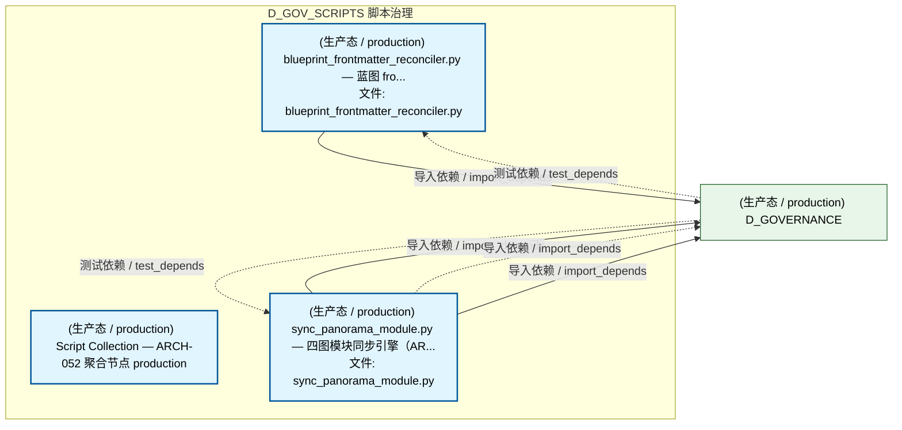
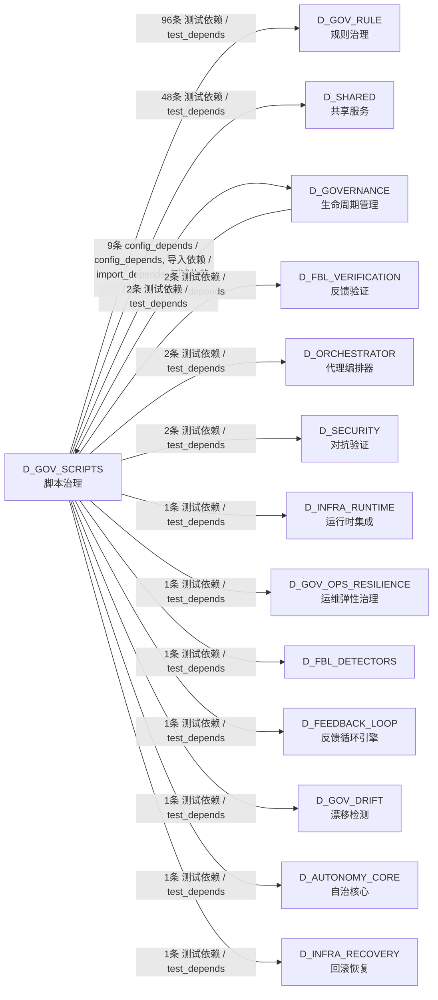

# 46_d_gov_scripts / script_governance / 脚本治理 / Script Governance

> **功能简介 / Overview**: 脚本治理，负责脚本生命周期管理和脚本质量门禁

> **文档作用 / Purpose**: 展示 脚本治理（D_GOV_SCRIPTS）功能域的模块清单、域内依赖关系、跨域依赖关系、架构分层视图，供架构审查和域治理参考。

> 本文档由 generate_domain_doc.py 从 depgraph (PostgreSQL) 自动生成
> 最后更新: 2026-07-13 14:27:36
> 数据源: depgraph (PostgreSQL) nodes表 + edges表

## 域基本信息 / Domain Overview

| 字段 | 值 | Field | Value |
|------|------|-------|-------|
| 编号 | 46 | Number | 46 |
| 域ID | D_GOV_SCRIPTS | Domain ID | D_GOV_SCRIPTS |
| 域名称 | 脚本治理 | Domain Name | Script Governance |
| 层级 | L2 业务域层 | Layer | L2 Domain |
| 模块数 | 74 | Module Count | 74 |
| 域内依赖 | 0 | Internal Dependencies | 0 |
| 跨域入边 | 2 | Cross-domain Incoming | 2 |
| 跨域出边 | 166 | Cross-domain Outgoing | 166 |
| 设计态模块 | 0 | Design Modules | 0 |
| 原型态模块 | 71 | Prototype Modules | 71 |
| 生产态模块 | 3 | Production Modules | 3 |
| 容量 | 3/150 (正常) | Capacity | 3/150 (正常) |
| 描述 | Phase Manager阶段管理 | Description | Phase Manager阶段管理 |

## 模块分层清单 / Module Layered List

> 按 architecture_layer 分组的模块清单（共 74 个模块 / 74 modules）。

### L1 基础层 / Foundation Layer (1 modules)

| # | 模块路径 / Module Path | 模块名称 / Module Name (功能简介 / Description) | 成熟度 / Maturity | 蓝图 / Blueprint |
|:--:|---------|---------|:---:|:---:|
| 1 | docs/01_policies_and_standards/_registry/catalogs/scripts... | [聚合节点 / Aggregated] 脚本集 / Script Collection (430 items) | 生产态 / production |  |
| ↳1 |   ↳ scripts/governance/__init__.py |  | - | - |
| ↳2 |   ↳ scripts/governance/_archive/one_off/analyze_orphan_c... |  | - | - |
| ↳3 |   ↳ scripts/governance/_archive/one_off/audit_post_sync_... |  | - | - |
| ↳4 |   ↳ scripts/governance/_archive/one_off/check_exam_case_... |  | - | - |
| ↳5 |   ↳ scripts/governance/_archive/one_off/check_rule_cover... |  | - | - |
| ↳6 |   ↳ scripts/governance/_archive/one_off/create_alignment... |  | - | - |
| ↳7 |   ↳ scripts/governance/_archive/one_off/dm105_depgraph_t... |  | - | - |
| ↳8 |   ↳ scripts/governance/_archive/one_off/fix_broken_post_... |  | - | - |
| ↳9 |   ↳ scripts/governance/_archive/one_off/group_orphan_mod... |  | - | - |
| ↳10 |   ↳ scripts/governance/_archive/one_off/list_phase0_tasks.py |  | - | - |
| ↳11 |   ↳ scripts/governance/_archive/one_off/migrate_clean_bu... |  | - | - |
| ↳12 |   ↳ scripts/governance/_archive/one_off/migrate_domain_i... |  | - | - |
| ↳13 |   ↳ scripts/governance/_archive/one_off/perf_depgraph_ba... |  | - | - |
| ↳14 |   ↳ scripts/governance/_archive/one_off/phase_a_backup.py |  | - | - |
| ↳15 |   ↳ scripts/governance/_archive/one_off/rename_kebab_to_... |  | - | - |
| ↳16 |   ↳ scripts/governance/_archive/one_off/rename_whitelist... |  | - | - |
| ↳17 |   ↳ scripts/governance/_archive/one_off/test_lock_scenar... |  | - | - |
| ↳18 |   ↳ scripts/governance/_archive/one_off/verify_final_del... |  | - | - |
| ↳19 |   ↳ scripts/governance/_archive/one_off/verify_rule_yaml... |  | - | - |
| ↳20 |   ↳ scripts/governance/_archive/prototype/adversarial_log.py |  | - | - |
| ↳21 |   ↳ scripts/governance/_archive/prototype/adversarial_sy... |  | - | - |
| ↳22 |   ↳ scripts/governance/_archive/prototype/audit_domain_n... |  | - | - |
| ↳23 |   ↳ scripts/governance/_archive/prototype/changelog.py |  | - | - |
| ↳24 |   ↳ scripts/governance/_archive/prototype/check_audit_rb... |  | - | - |
| ↳25 |   ↳ scripts/governance/_archive/prototype/construction_g... |  | - | - |
| ↳26 |   ↳ scripts/governance/_archive/prototype/generate_asset... |  | - | - |
| ↳27 |   ↳ scripts/governance/_archive/prototype/generate_nav_t... |  | - | - |
| ↳28 |   ↳ scripts/governance/_archive/prototype/rebuild_audit_... |  | - | - |
| ↳29 |   ↳ scripts/governance/_archive/prototype/scan_ground_tr... |  | - | - |
| ↳30 |   ↳ scripts/governance/_archive/prototype/session_simula... |  | - | - |
| ↳31 |   ↳ scripts/governance/_archive/prototype/sync_blueprint... |  | - | - |
| ↳32 |   ↳ scripts/governance/_archive/vms_ri/ri_boundary_check.py |  | - | - |
| ↳33 |   ↳ scripts/governance/_archive/vms_ri/ri_build_completi... |  | - | - |
| ↳34 |   ↳ scripts/governance/_archive/vms_ri/vms_blindspot_che... |  | - | - |
| ↳35 |   ↳ scripts/governance/_archive/vms_ri/vms_build_complet... |  | - | - |
| ↳36 |   ↳ scripts/governance/_archive/vms_ri/vms_cron_monitor.py |  | - | - |
| ↳37 |   ↳ scripts/governance/_archive/vms_ri/vms_cross_file_ch... |  | - | - |
| ↳38 |   ↳ scripts/governance/_archive/vms_ri/vms_health_check.py |  | - | - |
| ↳39 |   ↳ scripts/governance/_archive/vms_ri/vms_migrate.py |  | - | - |
| ↳40 |   ↳ scripts/governance/_archive/vms_ri/vms_migration_dry... |  | - | - |
| ↳41 |   ↳ scripts/governance/_archive/vms_ri/vms_phase_rollback.py |  | - | - |
| ↳42 |   ↳ scripts/governance/_archive/vms_ri/vms_version_sync_... |  | - | - |
| ↳43 |   ↳ scripts/governance/_shared/__init__.py |  | - | - |
| ↳44 |   ↳ scripts/governance/_shared/base.py |  | - | - |
| ↳45 |   ↳ scripts/governance/_shared/constants.py |  | - | - |
| ↳46 |   ↳ scripts/governance/_shared/deprecated_paths.yaml |  | - | - |
| ↳47 |   ↳ scripts/governance/_shared/encoding.py |  | - | - |
| ↳48 |   ↳ scripts/governance/_shared/file_utils.py |  | - | - |
| ↳49 |   ↳ scripts/governance/_shared/frontmatter.py |  | - | - |
| ↳50 |   ↳ scripts/governance/_shared/libcst_docstring_adder.py |  | - | - |
| ↳51 |   ↳ scripts/governance/_shared/plugin_contract_schema.yaml |  | - | - |
| ↳52 |   ↳ scripts/governance/_shared/registry_entry_count.py |  | - | - |
| ↳53 |   ↳ scripts/governance/_shared/thresholds.py |  | - | - |
| ↳54 |   ↳ scripts/governance/_shared/thresholds.yaml |  | - | - |
| ↳55 |   ↳ scripts/governance/_shared/walk.py |  | - | - |
| ↳56 |   ↳ scripts/governance/_shared/yaml_utils.py |  | - | - |
| ↳57 |   ↳ scripts/governance/_sync/check_p0_status.py |  | - | - |
| ↳58 |   ↳ scripts/governance/_sync/cleanup_p0_auto_bridged.py |  | - | - |
| ↳59 |   ↳ scripts/governance/_sync/cleanup_p0_ops_pending.py |  | - | - |
| ↳60 |   ↳ scripts/governance/_sync/fix_orphan_deps.py |  | - | - |
| ↳61 |   ↳ scripts/governance/_tasks/__init__.py |  | - | - |
| ↳62 |   ↳ scripts/governance/_tasks/list_phase0_tasks.py |  | - | - |
| ↳63 |   ↳ scripts/governance/_tasks/task_show.py |  | - | - |
| ↳64 |   ↳ scripts/governance/_tasks/task_summary.py |  | - | - |
| ↳65 |   ↳ scripts/governance/apply_dataflowgraph.py |  | - | - |
| ↳66 |   ↳ scripts/governance/apply_decisiongraph.py |  | - | - |
| ↳67 |   ↳ scripts/governance/apply_depgraph.py |  | - | - |
| ↳68 |   ↳ scripts/governance/architecture_health_dashboard.py |  | - | - |
| ↳69 |   ↳ scripts/governance/ast_import_rewriter.py |  | - | - |
| ↳70 |   ↳ scripts/governance/d10_performance/__init__.py |  | - | - |
| ↳71 |   ↳ scripts/governance/d10_performance/collect_system_th... |  | - | - |
| ↳72 |   ↳ scripts/governance/d11_compliance/__init__.py |  | - | - |
| ↳73 |   ↳ scripts/governance/d11_compliance/audit_registration.py |  | - | - |
| ↳74 |   ↳ scripts/governance/d11_compliance/check_ssot_gate.py |  | - | - |
| ↳75 |   ↳ scripts/governance/d11_compliance/check_test_structu... |  | - | - |
| ↳76 |   ↳ scripts/governance/d11_compliance/ci_self_check.py |  | - | - |
| ↳77 |   ↳ scripts/governance/d11_compliance/fix_shared_bypass.py |  | - | - |
| ↳78 |   ↳ scripts/governance/d11_compliance/g9_compliance_check.py |  | - | - |
| ↳79 |   ↳ scripts/governance/d11_compliance/task_self_check.py |  | - | - |
| ↳80 |   ↳ scripts/governance/d11_compliance/validate_blueprint... |  | - | - |
| ↳81 |   ↳ scripts/governance/d11_compliance/validate_commit_ga... |  | - | - |
| ↳82 |   ↳ scripts/governance/d11_compliance/validate_commit_me... |  | - | - |
| ↳83 |   ↳ scripts/governance/d11_compliance/validate_exit_codes.py |  | - | - |
| ↳84 |   ↳ scripts/governance/d11_compliance/validate_frozen_re... |  | - | - |
| ↳85 |   ↳ scripts/governance/d11_compliance/validate_manifest_... |  | - | - |
| ↳86 |   ↳ scripts/governance/d11_compliance/validate_no_utf8_b... |  | - | - |
| ↳87 |   ↳ scripts/governance/d11_compliance/validate_script_na... |  | - | - |
| ↳88 |   ↳ scripts/governance/d11_compliance/validate_script_qu... |  | - | - |
| ↳89 |   ↳ scripts/governance/d11_compliance/validate_task_deco... |  | - | - |
| ↳90 |   ↳ scripts/governance/d11_compliance/validate_truth_sou... |  | - | - |
| ↳91 |   ↳ scripts/governance/d11_compliance/validate_vocabular... |  | - | - |
| ↳92 |   ↳ scripts/governance/d11_compliance/verify_audit_integ... |  | - | - |
| ↳93 |   ↳ scripts/governance/d11_compliance/verify_key_imports.py |  | - | - |
| ↳94 |   ↳ scripts/governance/d11_compliance/verify_schema_heal... |  | - | - |
| ↳95 |   ↳ scripts/governance/d12_ai_hallucination/__init__.py |  | - | - |
| ↳96 |   ↳ scripts/governance/d12_ai_hallucination/check_logger... |  | - | - |
| ↳97 |   ↳ scripts/governance/d12_ai_hallucination/validate_gat... |  | - | - |
| ↳98 |   ↳ scripts/governance/d12_ai_hallucination/validate_ses... |  | - | - |
| ↳99 |   ↳ scripts/governance/d12_ai_hallucination/validate_ses... |  | - | - |
| ↳100 |   ↳ scripts/governance/d1_structure/__init__.py |  | - | - |
| | | > (仅显示前 100 个 items，共 430 个) | | |

### L2 领域层 / Domain Layer (73 modules)

| # | 模块路径 / Module Path | 模块名称 / Module Name (功能简介 / Description) | 成熟度 / Maturity | 蓝图 / Blueprint |
|:--:|---------|---------|:---:|:---:|
| 1 | scripts/governance/ast_import_rewriter.py | AST-based import rewriter for governance direct... | 原型态 / prototype |  |
| 2 | scripts/governance/d5_architecture/panorama_common.py | panorama_common.py — 四图投票共享工具（ARCH-05... | 原型态 / prototype |  |
| 3 | scripts/governance/d5_architecture/syncers/blueprint_fron... | blueprint_frontmatter_reconciler.py — 蓝图 fro... | 生产态 / production |  |
| 4 | scripts/governance/sync_panorama_module.py | sync_panorama_module.py — 四图模块同步引擎（AR... | 生产态 / production |  |
| 5 | tests/blueprint/test_blueprint_bloat_monitor.py | test_blueprint_bloat_monitor.py | 原型态 / prototype | [MOD-INF-022](../../03_modules/_domain_autonomy_perm/escalation_protocol/blueprint.md) |
| 6 | tests/blueprint/test_blueprint_code_consistency.py | test_blueprint_code_consistency.py | 原型态 / prototype | [MOD-INF-022](../../03_modules/_domain_autonomy_perm/escalation_protocol/blueprint.md) |
| 7 | tests/blueprint/test_blueprint_code_reconciler.py | test_blueprint_code_reconciler.py | 原型态 / prototype | [MOD-GATE_ENGINE](../../03_modules/_cross_layer/gate_engine/blueprint.md) |
| 8 | tests/blueprint/test_blueprint_fidelity.py | test_blueprint_fidelity.py | 原型态 / prototype | [MOD-INF-018](../../03_modules/_domain_autonomy_core/agent_role_based_access_control/blueprint.md) |
| 9 | tests/blueprint/test_blueprint_metrics.py | test_blueprint_metrics.py | 原型态 / prototype | [MOD-INF-015](../../03_modules/_domain_infrastructure_operations/system_telemetry/blueprint.md) |
| 10 | tests/blueprint/test_blueprint_reconciler.py | test_blueprint_reconciler.py | 原型态 / prototype | [MOD-INF-022](../../03_modules/_domain_autonomy_perm/escalation_protocol/blueprint.md) |
| 11 | tests/blueprint/test_blueprint_scorer.py | test_blueprint_scorer.py | 原型态 / prototype | [MOD-INF-039](../../03_modules/_cross_layer/agent_orchestrator/blueprint.md) |
| 12 | tests/blueprint/test_blueprint_validator.py | test_blueprint_validator.py | 原型态 / prototype | [MOD-GATE_ENGINE](../../03_modules/_cross_layer/gate_engine/blueprint.md) |
| 13 | tests/blueprint/test_gen_inherited.py | test_gen_inherited.py | 原型态 / prototype | [MOD-INF-021](../../03_modules/_domain_autonomy_core/rollback_system/blueprint.md) |
| 14 | tests/dependency/test_dependency_auditor.py | test_dependency_auditor.py | 原型态 / prototype | [MOD-INF-018](../../03_modules/_domain_autonomy_core/agent_role_based_access_control/blueprint.md) |
| 15 | tests/dependency/test_dependency_freshness_monitor.py | test_dependency_freshness_monitor.py | 原型态 / prototype | [MOD-FEEDBACK_LOOP](../../03_modules/_cross_layer/feedback_loop/blueprint.md) |
| 16 | tests/dependency/test_dependency_lock.py | test_dependency_lock.py | 原型态 / prototype | [MOD-INF-039](../../03_modules/_cross_layer/agent_orchestrator/blueprint.md) |
| 17 | tests/dependency/test_dependency_manager.py | test_dependency_manager.py | 原型态 / prototype | [MOD-INF-023](../../03_modules/_domain_governance/drift_detector/blueprint.md) |
| 18 | tests/dependency/test_dependency_root.py | test_dependency_root.py | 原型态 / prototype | [MOD-INF-026](../../03_modules/_domain_infrastructure_operations/asset_inventory/blueprint.md) |
| 19 | tests/dependency/test_dependency_tracker.py | test_dependency_tracker.py | 原型态 / prototype | [MOD-INF-019](../../03_modules/_domain_autonomy_core/agent_spec/blueprint.md) |
| 20 | tests/git/test_git_bisector.py | test_git_bisector.py | 原型态 / prototype | [MOD-INF-033](../../03_modules/_cross_layer/behavioral_auditor/blueprint.md) |
| 21 | tests/git/test_git_hook_pre_scanner.py | test_git_hook_pre_scanner.py | 原型态 / prototype | [MOD-INF-021](../../03_modules/_domain_autonomy_core/rollback_system/blueprint.md) |
| 22 | tests/git/test_git_infra_snapshot.py | test_git_infra_snapshot.py | 原型态 / prototype | [MOD-INF-021](../../03_modules/_domain_autonomy_core/rollback_system/blueprint.md) |
| 23 | tests/git/test_lock_release_uncommitted.py | DM-202919 验收测试: lock_files.py release 加 gi... | 原型态 / prototype | [MOD-INF-005](../../03_modules/_domain_governance/governance_automation/blueprint.md) |
| 24 | tests/governance/scripts_governance/test_check_vocab_hard... | test_check_vocab_hardcode.py — GATE-VOCAB 检测... | 原型态 / prototype |  |
| 25 | tests/governance/scripts_governance/test_pre_write_gate.py | test_pre_write_gate.py — _check_session_overla... | 原型态 / prototype |  |
| 26 | tests/trae_rules/test_g_trae_003.py | Test gate g_trae_003 for rule TRAE-003 — calls... | 原型态 / prototype |  |
| 27 | tests/trae_rules/test_g_trae_004.py | Test gate g_trae_004 for rule TRAE-004 — calls... | 原型态 / prototype |  |
| 28 | tests/trae_rules/test_g_trae_006.py | Test gate g_trae_006 for rule TRAE-006 — calls... | 原型态 / prototype |  |
| 29 | tests/trae_rules/test_g_trae_007.py | Test gate g_trae_007 for rule TRAE-007 — calls... | 原型态 / prototype |  |
| 30 | tests/trae_rules/test_g_trae_008.py | Test gate g_trae_008 for rule TRAE-008 — calls... | 原型态 / prototype |  |
| 31 | tests/trae_rules/test_g_trae_009.py | Test gate g_trae_009 for rule TRAE-009 — calls... | 原型态 / prototype |  |
| 32 | tests/trae_rules/test_g_trae_010.py | Test gate g_trae_010 for rule TRAE-010 — calls... | 原型态 / prototype |  |
| 33 | tests/trae_rules/test_g_trae_011.py | Test gate g_trae_011 for rule TRAE-011 — calls... | 原型态 / prototype |  |
| 34 | tests/trae_rules/test_g_trae_012.py | Test gate g_trae_012 for rule TRAE-012 — calls... | 原型态 / prototype |  |
| 35 | tests/trae_rules/test_g_trae_016.py | Test gate g_trae_016 for rule TRAE-016 — calls... | 原型态 / prototype |  |
| 36 | tests/trae_rules/test_g_trae_017.py | Test gate g_trae_017 for rule TRAE-017 — calls... | 原型态 / prototype |  |
| 37 | tests/trae_rules/test_g_trae_018.py | Test gate g_trae_018 for rule TRAE-018 — calls... | 原型态 / prototype |  |
| 38 | tests/trae_rules/test_g_trae_020.py | Test gate g_trae_020 for rule TRAE-020 — calls... | 原型态 / prototype |  |
| 39 | tests/trae_rules/test_g_trae_021.py | Test gate g_trae_021 for rule TRAE-021 — calls... | 原型态 / prototype |  |
| 40 | tests/trae_rules/test_g_trae_022.py | Test gate g_trae_022 for rule TRAE-022 — calls... | 原型态 / prototype |  |
| 41 | tests/trae_rules/test_g_trae_023.py | Test gate g_trae_023 for rule TRAE-023 — calls... | 原型态 / prototype |  |
| 42 | tests/trae_rules/test_g_trae_024.py | Test gate g_trae_024 for rule TRAE-024 — calls... | 原型态 / prototype |  |
| 43 | tests/trae_rules/test_g_trae_025.py | Test gate g_trae_025 for rule TRAE-025 — calls... | 原型态 / prototype |  |
| 44 | tests/trae_rules/test_g_trae_026.py | Test gate g_trae_026 for rule TRAE-026 — calls... | 原型态 / prototype |  |
| 45 | tests/trae_rules/test_g_trae_027.py | Test gate g_trae_027 for rule TRAE-027 — calls... | 原型态 / prototype |  |
| 46 | tests/trae_rules/test_g_trae_028.py | Test gate g_trae_028 for rule TRAE-028 — calls... | 原型态 / prototype |  |
| 47 | tests/trae_rules/test_g_trae_029.py | Test gate g_trae_029 for rule TRAE-029 — calls... | 原型态 / prototype |  |
| 48 | tests/trae_rules/test_g_trae_030.py | Test gate g_trae_030 for rule TRAE-030 — calls... | 原型态 / prototype |  |
| 49 | tests/trae_rules/test_g_trae_031.py | Test gate g_trae_031 for rule TRAE-031 — calls... | 原型态 / prototype |  |
| 50 | tests/trae_rules/test_g_trae_032.py | Test gate g_trae_032 for rule TRAE-032 — calls... | 原型态 / prototype |  |
| 51 | tests/trae_rules/test_g_trae_033.py | Test gate g_trae_033 for rule TRAE-033 — calls... | 原型态 / prototype |  |
| 52 | tests/trae_rules/test_g_trae_034.py | Test gate g_trae_034 for rule TRAE-034 — calls... | 原型态 / prototype |  |
| 53 | tests/trae_rules/test_g_trae_035.py | Test gate g_trae_035 for rule TRAE-035 — calls... | 原型态 / prototype |  |
| 54 | tests/trae_rules/test_g_trae_036.py | Test gate g_trae_036 for rule TRAE-036 — calls... | 原型态 / prototype |  |
| 55 | tests/trae_rules/test_g_trae_037.py | Test gate g_trae_037 for rule TRAE-037 — calls... | 原型态 / prototype |  |
| 56 | tests/trae_rules/test_g_trae_038.py | Test gate g_trae_038 for rule TRAE-038 — calls... | 原型态 / prototype |  |
| 57 | tests/trae_rules/test_g_trae_039.py | Test gate g_trae_039 for rule TRAE-039 — calls... | 原型态 / prototype |  |
| 58 | tests/trae_rules/test_g_trae_040.py | Test gate g_trae_040 for rule TRAE-040 — calls... | 原型态 / prototype |  |
| 59 | tests/trae_rules/test_g_trae_041.py | Test gate g_trae_041 for rule TRAE-041 — calls... | 原型态 / prototype |  |
| 60 | tests/trae_rules/test_g_trae_042.py | Test gate g_trae_042 for rule TRAE-042 — calls... | 原型态 / prototype |  |
| 61 | tests/trae_rules/test_g_trae_043.py | Test gate g_trae_043 for rule TRAE-043 — calls... | 原型态 / prototype |  |
| 62 | tests/trae_rules/test_g_trae_044.py | Test gate g_trae_044 for rule TRAE-044 — calls... | 原型态 / prototype |  |
| 63 | tests/trae_rules/test_g_trae_045.py | Test gate g_trae_045 for rule TRAE-045 — calls... | 原型态 / prototype |  |
| 64 | tests/trae_rules/test_g_trae_046.py | Test gate g_trae_046 for rule TRAE-046 — calls... | 原型态 / prototype |  |
| 65 | tests/trae_rules/test_g_trae_047.py | Test gate g_trae_047 for rule TRAE-047 — calls... | 原型态 / prototype |  |
| 66 | tests/trae_rules/test_g_trae_048.py | Test gate g_trae_048 for rule TRAE-048 — calls... | 原型态 / prototype |  |
| 67 | tests/trae_rules/test_g_trae_049.py | Test gate g_trae_049 for rule TRAE-049 — calls... | 原型态 / prototype |  |
| 68 | tests/trae_rules/test_g_trae_050.py | Test gate g_trae_050 for rule TRAE-050 — calls... | 原型态 / prototype |  |
| 69 | tests/trae_rules/test_g_trae_051.py | Test gate g_trae_051 for rule TRAE-051 — calls... | 原型态 / prototype |  |
| 70 | tests/trae_rules/test_g_trae_052.py | Test gate g_trae_052 for rule TRAE-052 — calls... | 原型态 / prototype |  |
| 71 | tests/trae_rules/test_g_trae_053.py | Test gate g_trae_053 for rule TRAE-053 — calls... | 原型态 / prototype |  |
| 72 | tests/trae_rules/test_g_trae_054.py | Test gate g_trae_054 for rule TRAE-054 — calls... | 原型态 / prototype |  |
| 73 | tests/trae_rules/test_g_trae_055.py | Test gate g_trae_055 for rule TRAE-055 — calls... | 原型态 / prototype |  |

## 域内依赖图 / Internal Dependency Diagram

> 依赖图内嵌在本文档中，IDE 可直接渲染显示。参考 decision_index.md 设计，分四个视图：合并全景图、运营态子图、设计态子图、原型态子图（按 design_maturity 实际值拆分）。
>
> **图例说明 / Legend**：
> - **实线边框 = 运营态模块**（production，已上线运行）
> - **虚线边框 = 设计态模块**（design，蓝图阶段，代码未写）
> - **虚线边框 = 原型态模块**（prototype，代码已写，验证中未稳定上线）
> - **实线箭头 = 运营态依赖**（已生效的依赖关系）
> - **虚线箭头 = 非运营态依赖**（计划中/验证中的依赖关系）

### 合并全景图（全部模块，标签标注成熟度）

> 展示全部 74 个模块（生产态 3 + 设计态 0 + 原型态 71），标签标注成熟度。

#### 第 1 页 / 共 3 页

```mermaid
graph TD
    subgraph D_GOV_SCRIPTS["D_GOV_SCRIPTS 脚本治理"]
        docs_01_policies_and_standards_registry_catalogs_scripts_registry_yaml["(生产态 / production)  Script Collection — ARCH-052 聚合节点 production"]
        scripts_governance_ast_import_rewriter_py["(原型态 / prototype) AST-based import rewriter for governance direct...<br/>文件: ast_import_rewriter.py"]
        scripts_governance_d5_architecture_panorama_common_py["(原型态 / prototype) panorama_common.py — 四图投票共享工具（ARCH-05...<br/>文件: panorama_common.py"]
        scripts_governance_d5_architecture_syncers_blueprint_frontmatter_reconciler_py["(生产态 / production) blueprint_frontmatter_reconciler.py — 蓝图 fro...<br/>文件: blueprint_frontmatter_reconciler.py"]
        scripts_governance_sync_panorama_module_py["(生产态 / production) sync_panorama_module.py — 四图模块同步引擎（AR...<br/>文件: sync_panorama_module.py"]
        tests_blueprint_test_blueprint_bloat_monitor_py["(原型态 / prototype) test_blueprint_bloat_monitor.py"]
        tests_blueprint_test_blueprint_code_consistency_py["(原型态 / prototype) test_blueprint_code_consistency.py"]
        tests_blueprint_test_blueprint_code_reconciler_py["(原型态 / prototype) test_blueprint_code_reconciler.py"]
        tests_blueprint_test_blueprint_fidelity_py["(原型态 / prototype) test_blueprint_fidelity.py"]
        tests_blueprint_test_blueprint_metrics_py["(原型态 / prototype) test_blueprint_metrics.py"]
        tests_blueprint_test_blueprint_reconciler_py["(原型态 / prototype) test_blueprint_reconciler.py"]
        tests_blueprint_test_blueprint_scorer_py["(原型态 / prototype) test_blueprint_scorer.py"]
        tests_blueprint_test_blueprint_validator_py["(原型态 / prototype) test_blueprint_validator.py"]
        tests_blueprint_test_gen_inherited_py["(原型态 / prototype) test_gen_inherited.py"]
        tests_dependency_test_dependency_auditor_py["(原型态 / prototype) test_dependency_auditor.py"]
        tests_dependency_test_dependency_freshness_monitor_py["(原型态 / prototype) test_dependency_freshness_monitor.py"]
        tests_dependency_test_dependency_lock_py["(原型态 / prototype) test_dependency_lock.py"]
        tests_dependency_test_dependency_manager_py["(原型态 / prototype) test_dependency_manager.py"]
        tests_dependency_test_dependency_root_py["(原型态 / prototype) test_dependency_root.py"]
        tests_dependency_test_dependency_tracker_py["(原型态 / prototype) test_dependency_tracker.py"]
        tests_git_test_git_bisector_py["(原型态 / prototype) test_git_bisector.py"]
        tests_git_test_git_hook_pre_scanner_py["(原型态 / prototype) test_git_hook_pre_scanner.py"]
        tests_git_test_git_infra_snapshot_py["(原型态 / prototype) test_git_infra_snapshot.py"]
        tests_git_test_lock_release_uncommitted_py["(原型态 / prototype) DM-202919 验收测试: lock_files.py release 加 gi...<br/>文件: test_lock_release_uncommitted.py"]
        tests_governance_scripts_governance_test_check_vocab_hardcode_py["(原型态 / prototype) test_check_vocab_hardcode.py — GATE-VOCAB 检测...<br/>文件: test_check_vocab_hardcode.py"]
        tests_governance_scripts_governance_test_pre_write_gate_py["(原型态 / prototype) test_pre_write_gate.py — _check_session_overla...<br/>文件: test_pre_write_gate.py"]
        tests_trae_rules_test_g_trae_003_py["(原型态 / prototype) Test gate g_trae_003 for rule TRAE-003 — calls...<br/>文件: test_g_trae_003.py"]
        tests_trae_rules_test_g_trae_004_py["(原型态 / prototype) Test gate g_trae_004 for rule TRAE-004 — calls...<br/>文件: test_g_trae_004.py"]
        tests_trae_rules_test_g_trae_006_py["(原型态 / prototype) Test gate g_trae_006 for rule TRAE-006 — calls...<br/>文件: test_g_trae_006.py"]
        tests_trae_rules_test_g_trae_007_py["(原型态 / prototype) Test gate g_trae_007 for rule TRAE-007 — calls...<br/>文件: test_g_trae_007.py"]
    end
    D_GOVERNANCE["(生产态 / production) D_GOVERNANCE"]
    tests_blueprint_test_blueprint_bloat_monitor_py -.->|测试依赖 / test_depends| D_GOVERNANCE
    tests_blueprint_test_blueprint_code_consistency_py -.->|测试依赖 / test_depends| D_GOVERNANCE
    D_FBL_VERIFICATION["(生产态 / production) D_FBL_VERIFICATION"]
    tests_blueprint_test_blueprint_code_reconciler_py -.->|测试依赖 / test_depends| D_FBL_VERIFICATION
    tests_blueprint_test_blueprint_validator_py -.->|测试依赖 / test_depends| D_FBL_VERIFICATION
    D_SECURITY["(生产态 / production) D_SECURITY"]
    tests_blueprint_test_blueprint_fidelity_py -.->|测试依赖 / test_depends| D_SECURITY
    tests_blueprint_test_blueprint_reconciler_py -.->|测试依赖 / test_depends| D_GOVERNANCE
    D_ORCHESTRATOR["(生产态 / production) D_ORCHESTRATOR"]
    tests_blueprint_test_blueprint_scorer_py -.->|测试依赖 / test_depends| D_ORCHESTRATOR
    D_FEEDBACK_LOOP["(生产态 / production) D_FEEDBACK_LOOP"]
    tests_blueprint_test_gen_inherited_py -.->|测试依赖 / test_depends| D_FEEDBACK_LOOP
    D_FBL_DETECTORS["(生产态 / production) D_FBL_DETECTORS"]
    tests_dependency_test_dependency_freshness_monitor_py -.->|测试依赖 / test_depends| D_FBL_DETECTORS
    tests_dependency_test_dependency_auditor_py -.->|测试依赖 / test_depends| D_SECURITY
    tests_dependency_test_dependency_lock_py -.->|测试依赖 / test_depends| D_ORCHESTRATOR
    D_INFRA_RUNTIME["(生产态 / production) D_INFRA_RUNTIME"]
    tests_dependency_test_dependency_root_py -.->|测试依赖 / test_depends| D_INFRA_RUNTIME
    D_AUTONOMY_CORE["(生产态 / production) D_AUTONOMY_CORE"]
    tests_dependency_test_dependency_tracker_py -.->|测试依赖 / test_depends| D_AUTONOMY_CORE
    D_GOV_DRIFT["(生产态 / production) D_GOV_DRIFT"]
    tests_git_test_git_bisector_py -.->|测试依赖 / test_depends| D_GOV_DRIFT
    D_GOV_OPS_RESILIENCE["(生产态 / production) D_GOV_OPS_RESILIENCE"]
    tests_git_test_git_hook_pre_scanner_py -.->|测试依赖 / test_depends| D_GOV_OPS_RESILIENCE
    D_GOVERNANCE -.->|测试依赖 / test_depends| scripts_governance_d5_architecture_syncers_blueprint_frontmatter_reconciler_py
    D_GOVERNANCE -.->|测试依赖 / test_depends| scripts_governance_sync_panorama_module_py
    classDef production fill:#e1f5fe,stroke:#01579b,stroke-width:2px,color:#000
    classDef design fill:#fff3e0,stroke:#e65100,stroke-width:2px,color:#000,stroke-dasharray: 5 5
    classDef external_prod fill:#e8f5e9,stroke:#1b5e20,stroke-width:1px,color:#000
    classDef external_design fill:#fce4ec,stroke:#880e4f,stroke-width:1px,color:#000,stroke-dasharray: 5 5
    class docs_01_policies_and_standards_registry_catalogs_scripts_registry_yaml,scripts_governance_d5_architecture_syncers_blueprint_frontmatter_reconciler_py,scripts_governance_sync_panorama_module_py production
    class scripts_governance_ast_import_rewriter_py,scripts_governance_d5_architecture_panorama_common_py,tests_blueprint_test_blueprint_bloat_monitor_py,tests_blueprint_test_blueprint_code_consistency_py,tests_blueprint_test_blueprint_code_reconciler_py,tests_blueprint_test_blueprint_fidelity_py,tests_blueprint_test_blueprint_metrics_py,tests_blueprint_test_blueprint_reconciler_py,tests_blueprint_test_blueprint_scorer_py,tests_blueprint_test_blueprint_validator_py,tests_blueprint_test_gen_inherited_py,tests_dependency_test_dependency_auditor_py,tests_dependency_test_dependency_freshness_monitor_py,tests_dependency_test_dependency_lock_py,tests_dependency_test_dependency_manager_py,tests_dependency_test_dependency_root_py,tests_dependency_test_dependency_tracker_py,tests_git_test_git_bisector_py,tests_git_test_git_hook_pre_scanner_py,tests_git_test_git_infra_snapshot_py,tests_git_test_lock_release_uncommitted_py,tests_governance_scripts_governance_test_check_vocab_hardcode_py,tests_governance_scripts_governance_test_pre_write_gate_py,tests_trae_rules_test_g_trae_003_py,tests_trae_rules_test_g_trae_004_py,tests_trae_rules_test_g_trae_006_py,tests_trae_rules_test_g_trae_007_py design
    class D_GOVERNANCE,D_FBL_VERIFICATION,D_SECURITY,D_ORCHESTRATOR,D_FEEDBACK_LOOP,D_FBL_DETECTORS,D_INFRA_RUNTIME,D_AUTONOMY_CORE,D_GOV_DRIFT,D_GOV_OPS_RESILIENCE external_prod
```

#### 第 2 页 / 共 3 页

```mermaid
graph TD
    subgraph D_GOV_SCRIPTS["D_GOV_SCRIPTS 脚本治理"]
        tests_trae_rules_test_g_trae_008_py["(原型态 / prototype) Test gate g_trae_008 for rule TRAE-008 — calls...<br/>文件: test_g_trae_008.py"]
        tests_trae_rules_test_g_trae_009_py["(原型态 / prototype) Test gate g_trae_009 for rule TRAE-009 — calls...<br/>文件: test_g_trae_009.py"]
        tests_trae_rules_test_g_trae_010_py["(原型态 / prototype) Test gate g_trae_010 for rule TRAE-010 — calls...<br/>文件: test_g_trae_010.py"]
        tests_trae_rules_test_g_trae_011_py["(原型态 / prototype) Test gate g_trae_011 for rule TRAE-011 — calls...<br/>文件: test_g_trae_011.py"]
        tests_trae_rules_test_g_trae_012_py["(原型态 / prototype) Test gate g_trae_012 for rule TRAE-012 — calls...<br/>文件: test_g_trae_012.py"]
        tests_trae_rules_test_g_trae_016_py["(原型态 / prototype) Test gate g_trae_016 for rule TRAE-016 — calls...<br/>文件: test_g_trae_016.py"]
        tests_trae_rules_test_g_trae_017_py["(原型态 / prototype) Test gate g_trae_017 for rule TRAE-017 — calls...<br/>文件: test_g_trae_017.py"]
        tests_trae_rules_test_g_trae_018_py["(原型态 / prototype) Test gate g_trae_018 for rule TRAE-018 — calls...<br/>文件: test_g_trae_018.py"]
        tests_trae_rules_test_g_trae_020_py["(原型态 / prototype) Test gate g_trae_020 for rule TRAE-020 — calls...<br/>文件: test_g_trae_020.py"]
        tests_trae_rules_test_g_trae_021_py["(原型态 / prototype) Test gate g_trae_021 for rule TRAE-021 — calls...<br/>文件: test_g_trae_021.py"]
        tests_trae_rules_test_g_trae_022_py["(原型态 / prototype) Test gate g_trae_022 for rule TRAE-022 — calls...<br/>文件: test_g_trae_022.py"]
        tests_trae_rules_test_g_trae_023_py["(原型态 / prototype) Test gate g_trae_023 for rule TRAE-023 — calls...<br/>文件: test_g_trae_023.py"]
        tests_trae_rules_test_g_trae_024_py["(原型态 / prototype) Test gate g_trae_024 for rule TRAE-024 — calls...<br/>文件: test_g_trae_024.py"]
        tests_trae_rules_test_g_trae_025_py["(原型态 / prototype) Test gate g_trae_025 for rule TRAE-025 — calls...<br/>文件: test_g_trae_025.py"]
        tests_trae_rules_test_g_trae_026_py["(原型态 / prototype) Test gate g_trae_026 for rule TRAE-026 — calls...<br/>文件: test_g_trae_026.py"]
        tests_trae_rules_test_g_trae_027_py["(原型态 / prototype) Test gate g_trae_027 for rule TRAE-027 — calls...<br/>文件: test_g_trae_027.py"]
        tests_trae_rules_test_g_trae_028_py["(原型态 / prototype) Test gate g_trae_028 for rule TRAE-028 — calls...<br/>文件: test_g_trae_028.py"]
        tests_trae_rules_test_g_trae_029_py["(原型态 / prototype) Test gate g_trae_029 for rule TRAE-029 — calls...<br/>文件: test_g_trae_029.py"]
        tests_trae_rules_test_g_trae_030_py["(原型态 / prototype) Test gate g_trae_030 for rule TRAE-030 — calls...<br/>文件: test_g_trae_030.py"]
        tests_trae_rules_test_g_trae_031_py["(原型态 / prototype) Test gate g_trae_031 for rule TRAE-031 — calls...<br/>文件: test_g_trae_031.py"]
        tests_trae_rules_test_g_trae_032_py["(原型态 / prototype) Test gate g_trae_032 for rule TRAE-032 — calls...<br/>文件: test_g_trae_032.py"]
        tests_trae_rules_test_g_trae_033_py["(原型态 / prototype) Test gate g_trae_033 for rule TRAE-033 — calls...<br/>文件: test_g_trae_033.py"]
        tests_trae_rules_test_g_trae_034_py["(原型态 / prototype) Test gate g_trae_034 for rule TRAE-034 — calls...<br/>文件: test_g_trae_034.py"]
        tests_trae_rules_test_g_trae_035_py["(原型态 / prototype) Test gate g_trae_035 for rule TRAE-035 — calls...<br/>文件: test_g_trae_035.py"]
        tests_trae_rules_test_g_trae_036_py["(原型态 / prototype) Test gate g_trae_036 for rule TRAE-036 — calls...<br/>文件: test_g_trae_036.py"]
        tests_trae_rules_test_g_trae_037_py["(原型态 / prototype) Test gate g_trae_037 for rule TRAE-037 — calls...<br/>文件: test_g_trae_037.py"]
        tests_trae_rules_test_g_trae_038_py["(原型态 / prototype) Test gate g_trae_038 for rule TRAE-038 — calls...<br/>文件: test_g_trae_038.py"]
        tests_trae_rules_test_g_trae_039_py["(原型态 / prototype) Test gate g_trae_039 for rule TRAE-039 — calls...<br/>文件: test_g_trae_039.py"]
        tests_trae_rules_test_g_trae_040_py["(原型态 / prototype) Test gate g_trae_040 for rule TRAE-040 — calls...<br/>文件: test_g_trae_040.py"]
        tests_trae_rules_test_g_trae_041_py["(原型态 / prototype) Test gate g_trae_041 for rule TRAE-041 — calls...<br/>文件: test_g_trae_041.py"]
    end
    D_GOV_RULE["(生产态 / production) D_GOV_RULE"]
    tests_trae_rules_test_g_trae_008_py -.->|测试依赖 / test_depends| D_GOV_RULE
    tests_trae_rules_test_g_trae_008_py -.->|测试依赖 / test_depends| D_GOV_RULE
    D_SHARED["(生产态 / production) D_SHARED"]
    tests_trae_rules_test_g_trae_008_py -.->|测试依赖 / test_depends| D_SHARED
    tests_trae_rules_test_g_trae_010_py -.->|测试依赖 / test_depends| D_GOV_RULE
    tests_trae_rules_test_g_trae_010_py -.->|测试依赖 / test_depends| D_GOV_RULE
    tests_trae_rules_test_g_trae_010_py -.->|测试依赖 / test_depends| D_SHARED
    tests_trae_rules_test_g_trae_009_py -.->|测试依赖 / test_depends| D_GOV_RULE
    tests_trae_rules_test_g_trae_009_py -.->|测试依赖 / test_depends| D_GOV_RULE
    tests_trae_rules_test_g_trae_009_py -.->|测试依赖 / test_depends| D_SHARED
    tests_trae_rules_test_g_trae_012_py -.->|测试依赖 / test_depends| D_GOV_RULE
    tests_trae_rules_test_g_trae_012_py -.->|测试依赖 / test_depends| D_GOV_RULE
    tests_trae_rules_test_g_trae_012_py -.->|测试依赖 / test_depends| D_SHARED
    tests_trae_rules_test_g_trae_011_py -.->|测试依赖 / test_depends| D_GOV_RULE
    tests_trae_rules_test_g_trae_011_py -.->|测试依赖 / test_depends| D_GOV_RULE
    tests_trae_rules_test_g_trae_011_py -.->|测试依赖 / test_depends| D_SHARED
    classDef production fill:#e1f5fe,stroke:#01579b,stroke-width:2px,color:#000
    classDef design fill:#fff3e0,stroke:#e65100,stroke-width:2px,color:#000,stroke-dasharray: 5 5
    classDef external_prod fill:#e8f5e9,stroke:#1b5e20,stroke-width:1px,color:#000
    classDef external_design fill:#fce4ec,stroke:#880e4f,stroke-width:1px,color:#000,stroke-dasharray: 5 5
    class tests_trae_rules_test_g_trae_008_py,tests_trae_rules_test_g_trae_009_py,tests_trae_rules_test_g_trae_010_py,tests_trae_rules_test_g_trae_011_py,tests_trae_rules_test_g_trae_012_py,tests_trae_rules_test_g_trae_016_py,tests_trae_rules_test_g_trae_017_py,tests_trae_rules_test_g_trae_018_py,tests_trae_rules_test_g_trae_020_py,tests_trae_rules_test_g_trae_021_py,tests_trae_rules_test_g_trae_022_py,tests_trae_rules_test_g_trae_023_py,tests_trae_rules_test_g_trae_024_py,tests_trae_rules_test_g_trae_025_py,tests_trae_rules_test_g_trae_026_py,tests_trae_rules_test_g_trae_027_py,tests_trae_rules_test_g_trae_028_py,tests_trae_rules_test_g_trae_029_py,tests_trae_rules_test_g_trae_030_py,tests_trae_rules_test_g_trae_031_py,tests_trae_rules_test_g_trae_032_py,tests_trae_rules_test_g_trae_033_py,tests_trae_rules_test_g_trae_034_py,tests_trae_rules_test_g_trae_035_py,tests_trae_rules_test_g_trae_036_py,tests_trae_rules_test_g_trae_037_py,tests_trae_rules_test_g_trae_038_py,tests_trae_rules_test_g_trae_039_py,tests_trae_rules_test_g_trae_040_py,tests_trae_rules_test_g_trae_041_py design
    class D_GOV_RULE,D_SHARED external_prod
```

#### 第 3 页 / 共 3 页

### 运营态子图（仅 design_maturity=production 的模块和依赖）

> 仅展示已上线运行的模块（共 3 个，0 条域内依赖）。

### 设计态子图（仅 design_maturity=design 的模块和依赖）

> 仅展示蓝图阶段、代码未写的设计态模块（共 0 个，0 条域内依赖）。

> （无设计态模块 / No design modules）

### 原型态子图（仅 design_maturity=prototype 的模块和依赖）

> 仅展示代码已写、验证中未稳定上线的原型态模块（共 71 个，0 条域内依赖）。

```mermaid
graph TD
    subgraph D_GOV_SCRIPTS["D_GOV_SCRIPTS 脚本治理"]
        scripts_governance_ast_import_rewriter_py["(原型态 / prototype) AST-based import rewriter for governance direct...<br/>文件: ast_import_rewriter.py"]
        scripts_governance_d5_architecture_panorama_common_py["(原型态 / prototype) panorama_common.py — 四图投票共享工具（ARCH-05...<br/>文件: panorama_common.py"]
        tests_blueprint_test_blueprint_bloat_monitor_py["(原型态 / prototype) test_blueprint_bloat_monitor.py"]
        tests_blueprint_test_blueprint_code_consistency_py["(原型态 / prototype) test_blueprint_code_consistency.py"]
        tests_blueprint_test_blueprint_code_reconciler_py["(原型态 / prototype) test_blueprint_code_reconciler.py"]
        tests_blueprint_test_blueprint_fidelity_py["(原型态 / prototype) test_blueprint_fidelity.py"]
        tests_blueprint_test_blueprint_metrics_py["(原型态 / prototype) test_blueprint_metrics.py"]
        tests_blueprint_test_blueprint_reconciler_py["(原型态 / prototype) test_blueprint_reconciler.py"]
        tests_blueprint_test_blueprint_scorer_py["(原型态 / prototype) test_blueprint_scorer.py"]
        tests_blueprint_test_blueprint_validator_py["(原型态 / prototype) test_blueprint_validator.py"]
        tests_blueprint_test_gen_inherited_py["(原型态 / prototype) test_gen_inherited.py"]
        tests_dependency_test_dependency_auditor_py["(原型态 / prototype) test_dependency_auditor.py"]
        tests_dependency_test_dependency_freshness_monitor_py["(原型态 / prototype) test_dependency_freshness_monitor.py"]
        tests_dependency_test_dependency_lock_py["(原型态 / prototype) test_dependency_lock.py"]
        tests_dependency_test_dependency_manager_py["(原型态 / prototype) test_dependency_manager.py"]
        tests_dependency_test_dependency_root_py["(原型态 / prototype) test_dependency_root.py"]
        tests_dependency_test_dependency_tracker_py["(原型态 / prototype) test_dependency_tracker.py"]
        tests_git_test_git_bisector_py["(原型态 / prototype) test_git_bisector.py"]
        tests_git_test_git_hook_pre_scanner_py["(原型态 / prototype) test_git_hook_pre_scanner.py"]
        tests_git_test_git_infra_snapshot_py["(原型态 / prototype) test_git_infra_snapshot.py"]
        tests_git_test_lock_release_uncommitted_py["(原型态 / prototype) DM-202919 验收测试: lock_files.py release 加 gi...<br/>文件: test_lock_release_uncommitted.py"]
        tests_governance_scripts_governance_test_check_vocab_hardcode_py["(原型态 / prototype) test_check_vocab_hardcode.py — GATE-VOCAB 检测...<br/>文件: test_check_vocab_hardcode.py"]
        tests_governance_scripts_governance_test_pre_write_gate_py["(原型态 / prototype) test_pre_write_gate.py — _check_session_overla...<br/>文件: test_pre_write_gate.py"]
        tests_trae_rules_test_g_trae_003_py["(原型态 / prototype) Test gate g_trae_003 for rule TRAE-003 — calls...<br/>文件: test_g_trae_003.py"]
        tests_trae_rules_test_g_trae_004_py["(原型态 / prototype) Test gate g_trae_004 for rule TRAE-004 — calls...<br/>文件: test_g_trae_004.py"]
        tests_trae_rules_test_g_trae_006_py["(原型态 / prototype) Test gate g_trae_006 for rule TRAE-006 — calls...<br/>文件: test_g_trae_006.py"]
        tests_trae_rules_test_g_trae_007_py["(原型态 / prototype) Test gate g_trae_007 for rule TRAE-007 — calls...<br/>文件: test_g_trae_007.py"]
        tests_trae_rules_test_g_trae_008_py["(原型态 / prototype) Test gate g_trae_008 for rule TRAE-008 — calls...<br/>文件: test_g_trae_008.py"]
        tests_trae_rules_test_g_trae_009_py["(原型态 / prototype) Test gate g_trae_009 for rule TRAE-009 — calls...<br/>文件: test_g_trae_009.py"]
        tests_trae_rules_test_g_trae_010_py["(原型态 / prototype) Test gate g_trae_010 for rule TRAE-010 — calls...<br/>文件: test_g_trae_010.py"]
        tests_trae_rules_test_g_trae_011_py["(原型态 / prototype) Test gate g_trae_011 for rule TRAE-011 — calls...<br/>文件: test_g_trae_011.py"]
        tests_trae_rules_test_g_trae_012_py["(原型态 / prototype) Test gate g_trae_012 for rule TRAE-012 — calls...<br/>文件: test_g_trae_012.py"]
        tests_trae_rules_test_g_trae_016_py["(原型态 / prototype) Test gate g_trae_016 for rule TRAE-016 — calls...<br/>文件: test_g_trae_016.py"]
        tests_trae_rules_test_g_trae_017_py["(原型态 / prototype) Test gate g_trae_017 for rule TRAE-017 — calls...<br/>文件: test_g_trae_017.py"]
        tests_trae_rules_test_g_trae_018_py["(原型态 / prototype) Test gate g_trae_018 for rule TRAE-018 — calls...<br/>文件: test_g_trae_018.py"]
        tests_trae_rules_test_g_trae_020_py["(原型态 / prototype) Test gate g_trae_020 for rule TRAE-020 — calls...<br/>文件: test_g_trae_020.py"]
        tests_trae_rules_test_g_trae_021_py["(原型态 / prototype) Test gate g_trae_021 for rule TRAE-021 — calls...<br/>文件: test_g_trae_021.py"]
        tests_trae_rules_test_g_trae_022_py["(原型态 / prototype) Test gate g_trae_022 for rule TRAE-022 — calls...<br/>文件: test_g_trae_022.py"]
        tests_trae_rules_test_g_trae_023_py["(原型态 / prototype) Test gate g_trae_023 for rule TRAE-023 — calls...<br/>文件: test_g_trae_023.py"]
        tests_trae_rules_test_g_trae_024_py["(原型态 / prototype) Test gate g_trae_024 for rule TRAE-024 — calls...<br/>文件: test_g_trae_024.py"]
        tests_trae_rules_test_g_trae_025_py["(原型态 / prototype) Test gate g_trae_025 for rule TRAE-025 — calls...<br/>文件: test_g_trae_025.py"]
        tests_trae_rules_test_g_trae_026_py["(原型态 / prototype) Test gate g_trae_026 for rule TRAE-026 — calls...<br/>文件: test_g_trae_026.py"]
        tests_trae_rules_test_g_trae_027_py["(原型态 / prototype) Test gate g_trae_027 for rule TRAE-027 — calls...<br/>文件: test_g_trae_027.py"]
        tests_trae_rules_test_g_trae_028_py["(原型态 / prototype) Test gate g_trae_028 for rule TRAE-028 — calls...<br/>文件: test_g_trae_028.py"]
        tests_trae_rules_test_g_trae_029_py["(原型态 / prototype) Test gate g_trae_029 for rule TRAE-029 — calls...<br/>文件: test_g_trae_029.py"]
        tests_trae_rules_test_g_trae_030_py["(原型态 / prototype) Test gate g_trae_030 for rule TRAE-030 — calls...<br/>文件: test_g_trae_030.py"]
        tests_trae_rules_test_g_trae_031_py["(原型态 / prototype) Test gate g_trae_031 for rule TRAE-031 — calls...<br/>文件: test_g_trae_031.py"]
        tests_trae_rules_test_g_trae_032_py["(原型态 / prototype) Test gate g_trae_032 for rule TRAE-032 — calls...<br/>文件: test_g_trae_032.py"]
        tests_trae_rules_test_g_trae_033_py["(原型态 / prototype) Test gate g_trae_033 for rule TRAE-033 — calls...<br/>文件: test_g_trae_033.py"]
        tests_trae_rules_test_g_trae_034_py["(原型态 / prototype) Test gate g_trae_034 for rule TRAE-034 — calls...<br/>文件: test_g_trae_034.py"]
        tests_trae_rules_test_g_trae_035_py["(原型态 / prototype) Test gate g_trae_035 for rule TRAE-035 — calls...<br/>文件: test_g_trae_035.py"]
        tests_trae_rules_test_g_trae_036_py["(原型态 / prototype) Test gate g_trae_036 for rule TRAE-036 — calls...<br/>文件: test_g_trae_036.py"]
        tests_trae_rules_test_g_trae_037_py["(原型态 / prototype) Test gate g_trae_037 for rule TRAE-037 — calls...<br/>文件: test_g_trae_037.py"]
        tests_trae_rules_test_g_trae_038_py["(原型态 / prototype) Test gate g_trae_038 for rule TRAE-038 — calls...<br/>文件: test_g_trae_038.py"]
        tests_trae_rules_test_g_trae_039_py["(原型态 / prototype) Test gate g_trae_039 for rule TRAE-039 — calls...<br/>文件: test_g_trae_039.py"]
        tests_trae_rules_test_g_trae_040_py["(原型态 / prototype) Test gate g_trae_040 for rule TRAE-040 — calls...<br/>文件: test_g_trae_040.py"]
        tests_trae_rules_test_g_trae_041_py["(原型态 / prototype) Test gate g_trae_041 for rule TRAE-041 — calls...<br/>文件: test_g_trae_041.py"]
        tests_trae_rules_test_g_trae_042_py["(原型态 / prototype) Test gate g_trae_042 for rule TRAE-042 — calls...<br/>文件: test_g_trae_042.py"]
        tests_trae_rules_test_g_trae_043_py["(原型态 / prototype) Test gate g_trae_043 for rule TRAE-043 — calls...<br/>文件: test_g_trae_043.py"]
        tests_trae_rules_test_g_trae_044_py["(原型态 / prototype) Test gate g_trae_044 for rule TRAE-044 — calls...<br/>文件: test_g_trae_044.py"]
        tests_trae_rules_test_g_trae_045_py["(原型态 / prototype) Test gate g_trae_045 for rule TRAE-045 — calls...<br/>文件: test_g_trae_045.py"]
        tests_trae_rules_test_g_trae_046_py["(原型态 / prototype) Test gate g_trae_046 for rule TRAE-046 — calls...<br/>文件: test_g_trae_046.py"]
        tests_trae_rules_test_g_trae_047_py["(原型态 / prototype) Test gate g_trae_047 for rule TRAE-047 — calls...<br/>文件: test_g_trae_047.py"]
        tests_trae_rules_test_g_trae_048_py["(原型态 / prototype) Test gate g_trae_048 for rule TRAE-048 — calls...<br/>文件: test_g_trae_048.py"]
        tests_trae_rules_test_g_trae_049_py["(原型态 / prototype) Test gate g_trae_049 for rule TRAE-049 — calls...<br/>文件: test_g_trae_049.py"]
        tests_trae_rules_test_g_trae_050_py["(原型态 / prototype) Test gate g_trae_050 for rule TRAE-050 — calls...<br/>文件: test_g_trae_050.py"]
        tests_trae_rules_test_g_trae_051_py["(原型态 / prototype) Test gate g_trae_051 for rule TRAE-051 — calls...<br/>文件: test_g_trae_051.py"]
        tests_trae_rules_test_g_trae_052_py["(原型态 / prototype) Test gate g_trae_052 for rule TRAE-052 — calls...<br/>文件: test_g_trae_052.py"]
        tests_trae_rules_test_g_trae_053_py["(原型态 / prototype) Test gate g_trae_053 for rule TRAE-053 — calls...<br/>文件: test_g_trae_053.py"]
        tests_trae_rules_test_g_trae_054_py["(原型态 / prototype) Test gate g_trae_054 for rule TRAE-054 — calls...<br/>文件: test_g_trae_054.py"]
        tests_trae_rules_test_g_trae_055_py["(原型态 / prototype) Test gate g_trae_055 for rule TRAE-055 — calls...<br/>文件: test_g_trae_055.py"]
    end
    D_GOVERNANCE["(生产态 / production) D_GOVERNANCE"]
    scripts_governance_ast_import_rewriter_py -.->|config_depends / config_depends| D_GOVERNANCE
    scripts_governance_d5_architecture_panorama_common_py -.->|config_depends / config_depends| D_GOVERNANCE
    tests_blueprint_test_blueprint_bloat_monitor_py -.->|测试依赖 / test_depends| D_GOVERNANCE
    tests_blueprint_test_blueprint_code_consistency_py -.->|测试依赖 / test_depends| D_GOVERNANCE
    D_FBL_VERIFICATION["(生产态 / production) D_FBL_VERIFICATION"]
    tests_blueprint_test_blueprint_code_reconciler_py -.->|测试依赖 / test_depends| D_FBL_VERIFICATION
    tests_blueprint_test_blueprint_validator_py -.->|测试依赖 / test_depends| D_FBL_VERIFICATION
    D_SECURITY["(生产态 / production) D_SECURITY"]
    tests_blueprint_test_blueprint_fidelity_py -.->|测试依赖 / test_depends| D_SECURITY
    tests_blueprint_test_blueprint_reconciler_py -.->|测试依赖 / test_depends| D_GOVERNANCE
    D_ORCHESTRATOR["(生产态 / production) D_ORCHESTRATOR"]
    tests_blueprint_test_blueprint_scorer_py -.->|测试依赖 / test_depends| D_ORCHESTRATOR
    D_FEEDBACK_LOOP["(生产态 / production) D_FEEDBACK_LOOP"]
    tests_blueprint_test_gen_inherited_py -.->|测试依赖 / test_depends| D_FEEDBACK_LOOP
    D_FBL_DETECTORS["(生产态 / production) D_FBL_DETECTORS"]
    tests_dependency_test_dependency_freshness_monitor_py -.->|测试依赖 / test_depends| D_FBL_DETECTORS
    tests_dependency_test_dependency_auditor_py -.->|测试依赖 / test_depends| D_SECURITY
    tests_dependency_test_dependency_lock_py -.->|测试依赖 / test_depends| D_ORCHESTRATOR
    D_INFRA_RUNTIME["(生产态 / production) D_INFRA_RUNTIME"]
    tests_dependency_test_dependency_root_py -.->|测试依赖 / test_depends| D_INFRA_RUNTIME
    D_AUTONOMY_CORE["(生产态 / production) D_AUTONOMY_CORE"]
    tests_dependency_test_dependency_tracker_py -.->|测试依赖 / test_depends| D_AUTONOMY_CORE
    classDef production fill:#e1f5fe,stroke:#01579b,stroke-width:2px,color:#000
    classDef design fill:#fff3e0,stroke:#e65100,stroke-width:2px,color:#000,stroke-dasharray: 5 5
    classDef external_prod fill:#e8f5e9,stroke:#1b5e20,stroke-width:1px,color:#000
    classDef external_design fill:#fce4ec,stroke:#880e4f,stroke-width:1px,color:#000,stroke-dasharray: 5 5
    class scripts_governance_ast_import_rewriter_py,scripts_governance_d5_architecture_panorama_common_py,tests_blueprint_test_blueprint_bloat_monitor_py,tests_blueprint_test_blueprint_code_consistency_py,tests_blueprint_test_blueprint_code_reconciler_py,tests_blueprint_test_blueprint_fidelity_py,tests_blueprint_test_blueprint_metrics_py,tests_blueprint_test_blueprint_reconciler_py,tests_blueprint_test_blueprint_scorer_py,tests_blueprint_test_blueprint_validator_py,tests_blueprint_test_gen_inherited_py,tests_dependency_test_dependency_auditor_py,tests_dependency_test_dependency_freshness_monitor_py,tests_dependency_test_dependency_lock_py,tests_dependency_test_dependency_manager_py,tests_dependency_test_dependency_root_py,tests_dependency_test_dependency_tracker_py,tests_git_test_git_bisector_py,tests_git_test_git_hook_pre_scanner_py,tests_git_test_git_infra_snapshot_py,tests_git_test_lock_release_uncommitted_py,tests_governance_scripts_governance_test_check_vocab_hardcode_py,tests_governance_scripts_governance_test_pre_write_gate_py,tests_trae_rules_test_g_trae_003_py,tests_trae_rules_test_g_trae_004_py,tests_trae_rules_test_g_trae_006_py,tests_trae_rules_test_g_trae_007_py,tests_trae_rules_test_g_trae_008_py,tests_trae_rules_test_g_trae_009_py,tests_trae_rules_test_g_trae_010_py,tests_trae_rules_test_g_trae_011_py,tests_trae_rules_test_g_trae_012_py,tests_trae_rules_test_g_trae_016_py,tests_trae_rules_test_g_trae_017_py,tests_trae_rules_test_g_trae_018_py,tests_trae_rules_test_g_trae_020_py,tests_trae_rules_test_g_trae_021_py,tests_trae_rules_test_g_trae_022_py,tests_trae_rules_test_g_trae_023_py,tests_trae_rules_test_g_trae_024_py,tests_trae_rules_test_g_trae_025_py,tests_trae_rules_test_g_trae_026_py,tests_trae_rules_test_g_trae_027_py,tests_trae_rules_test_g_trae_028_py,tests_trae_rules_test_g_trae_029_py,tests_trae_rules_test_g_trae_030_py,tests_trae_rules_test_g_trae_031_py,tests_trae_rules_test_g_trae_032_py,tests_trae_rules_test_g_trae_033_py,tests_trae_rules_test_g_trae_034_py,tests_trae_rules_test_g_trae_035_py,tests_trae_rules_test_g_trae_036_py,tests_trae_rules_test_g_trae_037_py,tests_trae_rules_test_g_trae_038_py,tests_trae_rules_test_g_trae_039_py,tests_trae_rules_test_g_trae_040_py,tests_trae_rules_test_g_trae_041_py,tests_trae_rules_test_g_trae_042_py,tests_trae_rules_test_g_trae_043_py,tests_trae_rules_test_g_trae_044_py,tests_trae_rules_test_g_trae_045_py,tests_trae_rules_test_g_trae_046_py,tests_trae_rules_test_g_trae_047_py,tests_trae_rules_test_g_trae_048_py,tests_trae_rules_test_g_trae_049_py,tests_trae_rules_test_g_trae_050_py,tests_trae_rules_test_g_trae_051_py,tests_trae_rules_test_g_trae_052_py,tests_trae_rules_test_g_trae_053_py,tests_trae_rules_test_g_trae_054_py,tests_trae_rules_test_g_trae_055_py design
    class D_GOVERNANCE,D_FBL_VERIFICATION,D_SECURITY,D_ORCHESTRATOR,D_FEEDBACK_LOOP,D_FBL_DETECTORS,D_INFRA_RUNTIME,D_AUTONOMY_CORE external_prod
```

## 跨域依赖 / Cross-domain Dependencies

### 本域依赖的其他域（出边）/ Depends On

| # | 本域模块 / Source Module | → | 外部域-目标模块 / Target Module | 依赖类型 / Type |
|:--:|---------|:--:|---------|---------|
| 1 | test_dependency_tracker.py | → | D_AUTONOMY_CORE 自治核心: dependency_tracker.py — 依赖追踪 (DD116, TASK-... | 测试依赖 / test_depends |
| 2 | test_dependency_freshness_monitor.py | → | D_FBL_DETECTORS: Dependency Freshness Monitor — v0.38.0 R474 (d... | 测试依赖 / test_depends |
| 3 | test_blueprint_code_reconciler.py | → | D_FBL_VERIFICATION 反馈验证: Blueprint-Code Reconciler — v0.14.0 R195 (blue... | 测试依赖 / test_depends |
| 4 | test_blueprint_validator.py | → | D_FBL_VERIFICATION 反馈验证: Blueprint Validator — v0.8.0 R108 (blueprint_v... | 测试依赖 / test_depends |
| 5 | test_gen_inherited.py | → | D_FEEDBACK_LOOP 反馈循环引擎: _gen_inherited.py | 测试依赖 / test_depends |
| 6 | AST-based import rewriter for governance direct... | → | D_GOVERNANCE 生命周期管理: __init__.py | config_depends / config_depends |
| 7 | panorama_common.py — 四图投票共享工具（ARCH-05... | → | D_GOVERNANCE 生命周期管理: __init__.py | config_depends / config_depends |
| 8 | blueprint_frontmatter_reconciler.py — 蓝图 fro... | → | D_GOVERNANCE 生命周期管理: depgraph Schema DDL + 版本化迁移框架 (depgraph_... | 导入依赖 / import_depends |
| 9 | sync_panorama_module.py — 四图模块同步引擎（AR... | → | D_GOVERNANCE 生命周期管理: depgraph Schema DDL + 版本化迁移框架 (depgraph_... | 导入依赖 / import_depends |
| 10 | sync_panorama_module.py — 四图模块同步引擎（AR... | → | D_GOVERNANCE 生命周期管理: dataflowgraph Schema DDL + 连接入口 (dataflowgr... | 导入依赖 / import_depends |
| 11 | sync_panorama_module.py — 四图模块同步引擎（AR... | → | D_GOVERNANCE 生命周期管理: decisiongraph Schema DDL + 不变量声明 (decision... | 导入依赖 / import_depends |
| 12 | test_blueprint_bloat_monitor.py | → | D_GOVERNANCE 生命周期管理: Blueprint Bloat Monitor — v0.11.0 蓝图膨胀监控... | 测试依赖 / test_depends |
| 13 | test_blueprint_code_consistency.py | → | D_GOVERNANCE 生命周期管理: Blueprint-Code Consistency Gate — MOD-INF-022.... | 测试依赖 / test_depends |
| 14 | test_blueprint_reconciler.py | → | D_GOVERNANCE 生命周期管理: Blueprint Reconciler — v0.10.0 蓝图实现一致性.... | 测试依赖 / test_depends |
| 15 | test_git_bisector.py | → | D_GOV_DRIFT 漂移检测: Git Bisector — git_bisector.py (git_bisector.py) | 测试依赖 / test_depends |
| 16 | test_git_hook_pre_scanner.py | → | D_GOV_OPS_RESILIENCE 运维弹性治理: Git Hook Pre-Scanner — v0.14.0 Git操作Hook预扫... | 测试依赖 / test_depends |
| 17 | Test gate g_trae_003 for rule TRAE-003 — calls... | → | D_GOV_RULE 规则治理: GateEngine — KMS G1-G6 + Orc G0/G7 + 交易 G10-... | 测试依赖 / test_depends |
| 18 | Test gate g_trae_003 for rule TRAE-003 — calls... | → | D_GOV_RULE 规则治理: task_types.py | 测试依赖 / test_depends |
| 19 | Test gate g_trae_004 for rule TRAE-004 — calls... | → | D_GOV_RULE 规则治理: GateEngine — KMS G1-G6 + Orc G0/G7 + 交易 G10-... | 测试依赖 / test_depends |
| 20 | Test gate g_trae_004 for rule TRAE-004 — calls... | → | D_GOV_RULE 规则治理: task_types.py | 测试依赖 / test_depends |
| 21 | Test gate g_trae_006 for rule TRAE-006 — calls... | → | D_GOV_RULE 规则治理: GateEngine — KMS G1-G6 + Orc G0/G7 + 交易 G10-... | 测试依赖 / test_depends |
| 22 | Test gate g_trae_006 for rule TRAE-006 — calls... | → | D_GOV_RULE 规则治理: task_types.py | 测试依赖 / test_depends |
| 23 | Test gate g_trae_007 for rule TRAE-007 — calls... | → | D_GOV_RULE 规则治理: GateEngine — KMS G1-G6 + Orc G0/G7 + 交易 G10-... | 测试依赖 / test_depends |
| 24 | Test gate g_trae_007 for rule TRAE-007 — calls... | → | D_GOV_RULE 规则治理: task_types.py | 测试依赖 / test_depends |
| 25 | Test gate g_trae_008 for rule TRAE-008 — calls... | → | D_GOV_RULE 规则治理: GateEngine — KMS G1-G6 + Orc G0/G7 + 交易 G10-... | 测试依赖 / test_depends |
| 26 | Test gate g_trae_008 for rule TRAE-008 — calls... | → | D_GOV_RULE 规则治理: task_types.py | 测试依赖 / test_depends |
| 27 | Test gate g_trae_009 for rule TRAE-009 — calls... | → | D_GOV_RULE 规则治理: GateEngine — KMS G1-G6 + Orc G0/G7 + 交易 G10-... | 测试依赖 / test_depends |
| 28 | Test gate g_trae_009 for rule TRAE-009 — calls... | → | D_GOV_RULE 规则治理: task_types.py | 测试依赖 / test_depends |
| 29 | Test gate g_trae_010 for rule TRAE-010 — calls... | → | D_GOV_RULE 规则治理: GateEngine — KMS G1-G6 + Orc G0/G7 + 交易 G10-... | 测试依赖 / test_depends |
| 30 | Test gate g_trae_010 for rule TRAE-010 — calls... | → | D_GOV_RULE 规则治理: task_types.py | 测试依赖 / test_depends |
| 31 | Test gate g_trae_011 for rule TRAE-011 — calls... | → | D_GOV_RULE 规则治理: GateEngine — KMS G1-G6 + Orc G0/G7 + 交易 G10-... | 测试依赖 / test_depends |
| 32 | Test gate g_trae_011 for rule TRAE-011 — calls... | → | D_GOV_RULE 规则治理: task_types.py | 测试依赖 / test_depends |
| 33 | Test gate g_trae_012 for rule TRAE-012 — calls... | → | D_GOV_RULE 规则治理: GateEngine — KMS G1-G6 + Orc G0/G7 + 交易 G10-... | 测试依赖 / test_depends |
| 34 | Test gate g_trae_012 for rule TRAE-012 — calls... | → | D_GOV_RULE 规则治理: task_types.py | 测试依赖 / test_depends |
| 35 | Test gate g_trae_016 for rule TRAE-016 — calls... | → | D_GOV_RULE 规则治理: GateEngine — KMS G1-G6 + Orc G0/G7 + 交易 G10-... | 测试依赖 / test_depends |
| 36 | Test gate g_trae_016 for rule TRAE-016 — calls... | → | D_GOV_RULE 规则治理: task_types.py | 测试依赖 / test_depends |
| 37 | Test gate g_trae_017 for rule TRAE-017 — calls... | → | D_GOV_RULE 规则治理: GateEngine — KMS G1-G6 + Orc G0/G7 + 交易 G10-... | 测试依赖 / test_depends |
| 38 | Test gate g_trae_017 for rule TRAE-017 — calls... | → | D_GOV_RULE 规则治理: task_types.py | 测试依赖 / test_depends |
| 39 | Test gate g_trae_018 for rule TRAE-018 — calls... | → | D_GOV_RULE 规则治理: GateEngine — KMS G1-G6 + Orc G0/G7 + 交易 G10-... | 测试依赖 / test_depends |
| 40 | Test gate g_trae_018 for rule TRAE-018 — calls... | → | D_GOV_RULE 规则治理: task_types.py | 测试依赖 / test_depends |
| 41 | Test gate g_trae_020 for rule TRAE-020 — calls... | → | D_GOV_RULE 规则治理: GateEngine — KMS G1-G6 + Orc G0/G7 + 交易 G10-... | 测试依赖 / test_depends |
| 42 | Test gate g_trae_020 for rule TRAE-020 — calls... | → | D_GOV_RULE 规则治理: task_types.py | 测试依赖 / test_depends |
| 43 | Test gate g_trae_021 for rule TRAE-021 — calls... | → | D_GOV_RULE 规则治理: GateEngine — KMS G1-G6 + Orc G0/G7 + 交易 G10-... | 测试依赖 / test_depends |
| 44 | Test gate g_trae_021 for rule TRAE-021 — calls... | → | D_GOV_RULE 规则治理: task_types.py | 测试依赖 / test_depends |
| 45 | Test gate g_trae_022 for rule TRAE-022 — calls... | → | D_GOV_RULE 规则治理: GateEngine — KMS G1-G6 + Orc G0/G7 + 交易 G10-... | 测试依赖 / test_depends |
| 46 | Test gate g_trae_022 for rule TRAE-022 — calls... | → | D_GOV_RULE 规则治理: task_types.py | 测试依赖 / test_depends |
| 47 | Test gate g_trae_023 for rule TRAE-023 — calls... | → | D_GOV_RULE 规则治理: GateEngine — KMS G1-G6 + Orc G0/G7 + 交易 G10-... | 测试依赖 / test_depends |
| 48 | Test gate g_trae_023 for rule TRAE-023 — calls... | → | D_GOV_RULE 规则治理: task_types.py | 测试依赖 / test_depends |
| 49 | Test gate g_trae_024 for rule TRAE-024 — calls... | → | D_GOV_RULE 规则治理: GateEngine — KMS G1-G6 + Orc G0/G7 + 交易 G10-... | 测试依赖 / test_depends |
| 50 | Test gate g_trae_024 for rule TRAE-024 — calls... | → | D_GOV_RULE 规则治理: task_types.py | 测试依赖 / test_depends |
| 51 | Test gate g_trae_025 for rule TRAE-025 — calls... | → | D_GOV_RULE 规则治理: GateEngine — KMS G1-G6 + Orc G0/G7 + 交易 G10-... | 测试依赖 / test_depends |
| 52 | Test gate g_trae_025 for rule TRAE-025 — calls... | → | D_GOV_RULE 规则治理: task_types.py | 测试依赖 / test_depends |
| 53 | Test gate g_trae_026 for rule TRAE-026 — calls... | → | D_GOV_RULE 规则治理: GateEngine — KMS G1-G6 + Orc G0/G7 + 交易 G10-... | 测试依赖 / test_depends |
| 54 | Test gate g_trae_026 for rule TRAE-026 — calls... | → | D_GOV_RULE 规则治理: task_types.py | 测试依赖 / test_depends |
| 55 | Test gate g_trae_027 for rule TRAE-027 — calls... | → | D_GOV_RULE 规则治理: GateEngine — KMS G1-G6 + Orc G0/G7 + 交易 G10-... | 测试依赖 / test_depends |
| 56 | Test gate g_trae_027 for rule TRAE-027 — calls... | → | D_GOV_RULE 规则治理: task_types.py | 测试依赖 / test_depends |
| 57 | Test gate g_trae_028 for rule TRAE-028 — calls... | → | D_GOV_RULE 规则治理: GateEngine — KMS G1-G6 + Orc G0/G7 + 交易 G10-... | 测试依赖 / test_depends |
| 58 | Test gate g_trae_028 for rule TRAE-028 — calls... | → | D_GOV_RULE 规则治理: task_types.py | 测试依赖 / test_depends |
| 59 | Test gate g_trae_029 for rule TRAE-029 — calls... | → | D_GOV_RULE 规则治理: GateEngine — KMS G1-G6 + Orc G0/G7 + 交易 G10-... | 测试依赖 / test_depends |
| 60 | Test gate g_trae_029 for rule TRAE-029 — calls... | → | D_GOV_RULE 规则治理: task_types.py | 测试依赖 / test_depends |
| 61 | Test gate g_trae_030 for rule TRAE-030 — calls... | → | D_GOV_RULE 规则治理: GateEngine — KMS G1-G6 + Orc G0/G7 + 交易 G10-... | 测试依赖 / test_depends |
| 62 | Test gate g_trae_030 for rule TRAE-030 — calls... | → | D_GOV_RULE 规则治理: task_types.py | 测试依赖 / test_depends |
| 63 | Test gate g_trae_031 for rule TRAE-031 — calls... | → | D_GOV_RULE 规则治理: GateEngine — KMS G1-G6 + Orc G0/G7 + 交易 G10-... | 测试依赖 / test_depends |
| 64 | Test gate g_trae_031 for rule TRAE-031 — calls... | → | D_GOV_RULE 规则治理: task_types.py | 测试依赖 / test_depends |
| 65 | Test gate g_trae_032 for rule TRAE-032 — calls... | → | D_GOV_RULE 规则治理: GateEngine — KMS G1-G6 + Orc G0/G7 + 交易 G10-... | 测试依赖 / test_depends |
| 66 | Test gate g_trae_032 for rule TRAE-032 — calls... | → | D_GOV_RULE 规则治理: task_types.py | 测试依赖 / test_depends |
| 67 | Test gate g_trae_033 for rule TRAE-033 — calls... | → | D_GOV_RULE 规则治理: GateEngine — KMS G1-G6 + Orc G0/G7 + 交易 G10-... | 测试依赖 / test_depends |
| 68 | Test gate g_trae_033 for rule TRAE-033 — calls... | → | D_GOV_RULE 规则治理: task_types.py | 测试依赖 / test_depends |
| 69 | Test gate g_trae_034 for rule TRAE-034 — calls... | → | D_GOV_RULE 规则治理: GateEngine — KMS G1-G6 + Orc G0/G7 + 交易 G10-... | 测试依赖 / test_depends |
| 70 | Test gate g_trae_034 for rule TRAE-034 — calls... | → | D_GOV_RULE 规则治理: task_types.py | 测试依赖 / test_depends |
| 71 | Test gate g_trae_035 for rule TRAE-035 — calls... | → | D_GOV_RULE 规则治理: GateEngine — KMS G1-G6 + Orc G0/G7 + 交易 G10-... | 测试依赖 / test_depends |
| 72 | Test gate g_trae_035 for rule TRAE-035 — calls... | → | D_GOV_RULE 规则治理: task_types.py | 测试依赖 / test_depends |
| 73 | Test gate g_trae_036 for rule TRAE-036 — calls... | → | D_GOV_RULE 规则治理: GateEngine — KMS G1-G6 + Orc G0/G7 + 交易 G10-... | 测试依赖 / test_depends |
| 74 | Test gate g_trae_036 for rule TRAE-036 — calls... | → | D_GOV_RULE 规则治理: task_types.py | 测试依赖 / test_depends |
| 75 | Test gate g_trae_037 for rule TRAE-037 — calls... | → | D_GOV_RULE 规则治理: GateEngine — KMS G1-G6 + Orc G0/G7 + 交易 G10-... | 测试依赖 / test_depends |
| 76 | Test gate g_trae_037 for rule TRAE-037 — calls... | → | D_GOV_RULE 规则治理: task_types.py | 测试依赖 / test_depends |
| 77 | Test gate g_trae_038 for rule TRAE-038 — calls... | → | D_GOV_RULE 规则治理: GateEngine — KMS G1-G6 + Orc G0/G7 + 交易 G10-... | 测试依赖 / test_depends |
| 78 | Test gate g_trae_038 for rule TRAE-038 — calls... | → | D_GOV_RULE 规则治理: task_types.py | 测试依赖 / test_depends |
| 79 | Test gate g_trae_039 for rule TRAE-039 — calls... | → | D_GOV_RULE 规则治理: GateEngine — KMS G1-G6 + Orc G0/G7 + 交易 G10-... | 测试依赖 / test_depends |
| 80 | Test gate g_trae_039 for rule TRAE-039 — calls... | → | D_GOV_RULE 规则治理: task_types.py | 测试依赖 / test_depends |
| 81 | Test gate g_trae_040 for rule TRAE-040 — calls... | → | D_GOV_RULE 规则治理: GateEngine — KMS G1-G6 + Orc G0/G7 + 交易 G10-... | 测试依赖 / test_depends |
| 82 | Test gate g_trae_040 for rule TRAE-040 — calls... | → | D_GOV_RULE 规则治理: task_types.py | 测试依赖 / test_depends |
| 83 | Test gate g_trae_041 for rule TRAE-041 — calls... | → | D_GOV_RULE 规则治理: GateEngine — KMS G1-G6 + Orc G0/G7 + 交易 G10-... | 测试依赖 / test_depends |
| 84 | Test gate g_trae_041 for rule TRAE-041 — calls... | → | D_GOV_RULE 规则治理: task_types.py | 测试依赖 / test_depends |
| 85 | Test gate g_trae_042 for rule TRAE-042 — calls... | → | D_GOV_RULE 规则治理: GateEngine — KMS G1-G6 + Orc G0/G7 + 交易 G10-... | 测试依赖 / test_depends |
| 86 | Test gate g_trae_042 for rule TRAE-042 — calls... | → | D_GOV_RULE 规则治理: task_types.py | 测试依赖 / test_depends |
| 87 | Test gate g_trae_043 for rule TRAE-043 — calls... | → | D_GOV_RULE 规则治理: GateEngine — KMS G1-G6 + Orc G0/G7 + 交易 G10-... | 测试依赖 / test_depends |
| 88 | Test gate g_trae_043 for rule TRAE-043 — calls... | → | D_GOV_RULE 规则治理: task_types.py | 测试依赖 / test_depends |
| 89 | Test gate g_trae_044 for rule TRAE-044 — calls... | → | D_GOV_RULE 规则治理: GateEngine — KMS G1-G6 + Orc G0/G7 + 交易 G10-... | 测试依赖 / test_depends |
| 90 | Test gate g_trae_044 for rule TRAE-044 — calls... | → | D_GOV_RULE 规则治理: task_types.py | 测试依赖 / test_depends |
| 91 | Test gate g_trae_045 for rule TRAE-045 — calls... | → | D_GOV_RULE 规则治理: GateEngine — KMS G1-G6 + Orc G0/G7 + 交易 G10-... | 测试依赖 / test_depends |
| 92 | Test gate g_trae_045 for rule TRAE-045 — calls... | → | D_GOV_RULE 规则治理: task_types.py | 测试依赖 / test_depends |
| 93 | Test gate g_trae_046 for rule TRAE-046 — calls... | → | D_GOV_RULE 规则治理: GateEngine — KMS G1-G6 + Orc G0/G7 + 交易 G10-... | 测试依赖 / test_depends |
| 94 | Test gate g_trae_046 for rule TRAE-046 — calls... | → | D_GOV_RULE 规则治理: task_types.py | 测试依赖 / test_depends |
| 95 | Test gate g_trae_047 for rule TRAE-047 — calls... | → | D_GOV_RULE 规则治理: GateEngine — KMS G1-G6 + Orc G0/G7 + 交易 G10-... | 测试依赖 / test_depends |
| 96 | Test gate g_trae_047 for rule TRAE-047 — calls... | → | D_GOV_RULE 规则治理: task_types.py | 测试依赖 / test_depends |
| 97 | Test gate g_trae_048 for rule TRAE-048 — calls... | → | D_GOV_RULE 规则治理: GateEngine — KMS G1-G6 + Orc G0/G7 + 交易 G10-... | 测试依赖 / test_depends |
| 98 | Test gate g_trae_048 for rule TRAE-048 — calls... | → | D_GOV_RULE 规则治理: task_types.py | 测试依赖 / test_depends |
| 99 | Test gate g_trae_049 for rule TRAE-049 — calls... | → | D_GOV_RULE 规则治理: GateEngine — KMS G1-G6 + Orc G0/G7 + 交易 G10-... | 测试依赖 / test_depends |
| 100 | Test gate g_trae_049 for rule TRAE-049 — calls... | → | D_GOV_RULE 规则治理: task_types.py | 测试依赖 / test_depends |
| 101 | Test gate g_trae_050 for rule TRAE-050 — calls... | → | D_GOV_RULE 规则治理: GateEngine — KMS G1-G6 + Orc G0/G7 + 交易 G10-... | 测试依赖 / test_depends |
| 102 | Test gate g_trae_050 for rule TRAE-050 — calls... | → | D_GOV_RULE 规则治理: task_types.py | 测试依赖 / test_depends |
| 103 | Test gate g_trae_051 for rule TRAE-051 — calls... | → | D_GOV_RULE 规则治理: GateEngine — KMS G1-G6 + Orc G0/G7 + 交易 G10-... | 测试依赖 / test_depends |
| 104 | Test gate g_trae_051 for rule TRAE-051 — calls... | → | D_GOV_RULE 规则治理: task_types.py | 测试依赖 / test_depends |
| 105 | Test gate g_trae_052 for rule TRAE-052 — calls... | → | D_GOV_RULE 规则治理: GateEngine — KMS G1-G6 + Orc G0/G7 + 交易 G10-... | 测试依赖 / test_depends |
| 106 | Test gate g_trae_052 for rule TRAE-052 — calls... | → | D_GOV_RULE 规则治理: task_types.py | 测试依赖 / test_depends |
| 107 | Test gate g_trae_053 for rule TRAE-053 — calls... | → | D_GOV_RULE 规则治理: GateEngine — KMS G1-G6 + Orc G0/G7 + 交易 G10-... | 测试依赖 / test_depends |
| 108 | Test gate g_trae_053 for rule TRAE-053 — calls... | → | D_GOV_RULE 规则治理: task_types.py | 测试依赖 / test_depends |
| 109 | Test gate g_trae_054 for rule TRAE-054 — calls... | → | D_GOV_RULE 规则治理: GateEngine — KMS G1-G6 + Orc G0/G7 + 交易 G10-... | 测试依赖 / test_depends |
| 110 | Test gate g_trae_054 for rule TRAE-054 — calls... | → | D_GOV_RULE 规则治理: task_types.py | 测试依赖 / test_depends |
| 111 | Test gate g_trae_055 for rule TRAE-055 — calls... | → | D_GOV_RULE 规则治理: GateEngine — KMS G1-G6 + Orc G0/G7 + 交易 G10-... | 测试依赖 / test_depends |
| 112 | Test gate g_trae_055 for rule TRAE-055 — calls... | → | D_GOV_RULE 规则治理: task_types.py | 测试依赖 / test_depends |
| 113 | test_git_infra_snapshot.py | → | D_INFRA_RECOVERY 回滚恢复: GitInfraSnapshot — Git 基础设施快照与污染防护... | 测试依赖 / test_depends |
| 114 | test_dependency_root.py | → | D_INFRA_RUNTIME 运行时集成: MOD-INF-026 §18 — 资产依赖图。 (dependency.py) | 测试依赖 / test_depends |
| 115 | test_blueprint_scorer.py | → | D_ORCHESTRATOR 代理编排器: BlueprintScorer — 蓝图路由统一打分逻辑 (bluepr... | 测试依赖 / test_depends |
| 116 | test_dependency_lock.py | → | D_ORCHESTRATOR 代理编排器: 外部依赖版本锁（CT-DEPS）——Python包版本锁定+h... | 测试依赖 / test_depends |
| 117 | test_blueprint_fidelity.py | → | D_SECURITY 对抗验证: BlueprintFidelity — 蓝图保真度检查. (blueprint... | 测试依赖 / test_depends |
| 118 | test_dependency_auditor.py | → | D_SECURITY 对抗验证: Stub module: zephyr.security.access_control.dep... | 测试依赖 / test_depends |
| 119 | Test gate g_trae_003 for rule TRAE-003 — calls... | → | D_SHARED 共享服务: paths.py — 项目路径常量 SSoT（Single Source of... | 测试依赖 / test_depends |
| 120 | Test gate g_trae_004 for rule TRAE-004 — calls... | → | D_SHARED 共享服务: paths.py — 项目路径常量 SSoT（Single Source of... | 测试依赖 / test_depends |
| 121 | Test gate g_trae_006 for rule TRAE-006 — calls... | → | D_SHARED 共享服务: paths.py — 项目路径常量 SSoT（Single Source of... | 测试依赖 / test_depends |
| 122 | Test gate g_trae_007 for rule TRAE-007 — calls... | → | D_SHARED 共享服务: paths.py — 项目路径常量 SSoT（Single Source of... | 测试依赖 / test_depends |
| 123 | Test gate g_trae_008 for rule TRAE-008 — calls... | → | D_SHARED 共享服务: paths.py — 项目路径常量 SSoT（Single Source of... | 测试依赖 / test_depends |
| 124 | Test gate g_trae_009 for rule TRAE-009 — calls... | → | D_SHARED 共享服务: paths.py — 项目路径常量 SSoT（Single Source of... | 测试依赖 / test_depends |
| 125 | Test gate g_trae_010 for rule TRAE-010 — calls... | → | D_SHARED 共享服务: paths.py — 项目路径常量 SSoT（Single Source of... | 测试依赖 / test_depends |
| 126 | Test gate g_trae_011 for rule TRAE-011 — calls... | → | D_SHARED 共享服务: paths.py — 项目路径常量 SSoT（Single Source of... | 测试依赖 / test_depends |
| 127 | Test gate g_trae_012 for rule TRAE-012 — calls... | → | D_SHARED 共享服务: paths.py — 项目路径常量 SSoT（Single Source of... | 测试依赖 / test_depends |
| 128 | Test gate g_trae_016 for rule TRAE-016 — calls... | → | D_SHARED 共享服务: paths.py — 项目路径常量 SSoT（Single Source of... | 测试依赖 / test_depends |
| 129 | Test gate g_trae_017 for rule TRAE-017 — calls... | → | D_SHARED 共享服务: paths.py — 项目路径常量 SSoT（Single Source of... | 测试依赖 / test_depends |
| 130 | Test gate g_trae_018 for rule TRAE-018 — calls... | → | D_SHARED 共享服务: paths.py — 项目路径常量 SSoT（Single Source of... | 测试依赖 / test_depends |
| 131 | Test gate g_trae_020 for rule TRAE-020 — calls... | → | D_SHARED 共享服务: paths.py — 项目路径常量 SSoT（Single Source of... | 测试依赖 / test_depends |
| 132 | Test gate g_trae_021 for rule TRAE-021 — calls... | → | D_SHARED 共享服务: paths.py — 项目路径常量 SSoT（Single Source of... | 测试依赖 / test_depends |
| 133 | Test gate g_trae_022 for rule TRAE-022 — calls... | → | D_SHARED 共享服务: paths.py — 项目路径常量 SSoT（Single Source of... | 测试依赖 / test_depends |
| 134 | Test gate g_trae_023 for rule TRAE-023 — calls... | → | D_SHARED 共享服务: paths.py — 项目路径常量 SSoT（Single Source of... | 测试依赖 / test_depends |
| 135 | Test gate g_trae_024 for rule TRAE-024 — calls... | → | D_SHARED 共享服务: paths.py — 项目路径常量 SSoT（Single Source of... | 测试依赖 / test_depends |
| 136 | Test gate g_trae_025 for rule TRAE-025 — calls... | → | D_SHARED 共享服务: paths.py — 项目路径常量 SSoT（Single Source of... | 测试依赖 / test_depends |
| 137 | Test gate g_trae_026 for rule TRAE-026 — calls... | → | D_SHARED 共享服务: paths.py — 项目路径常量 SSoT（Single Source of... | 测试依赖 / test_depends |
| 138 | Test gate g_trae_027 for rule TRAE-027 — calls... | → | D_SHARED 共享服务: paths.py — 项目路径常量 SSoT（Single Source of... | 测试依赖 / test_depends |
| 139 | Test gate g_trae_028 for rule TRAE-028 — calls... | → | D_SHARED 共享服务: paths.py — 项目路径常量 SSoT（Single Source of... | 测试依赖 / test_depends |
| 140 | Test gate g_trae_029 for rule TRAE-029 — calls... | → | D_SHARED 共享服务: paths.py — 项目路径常量 SSoT（Single Source of... | 测试依赖 / test_depends |
| 141 | Test gate g_trae_030 for rule TRAE-030 — calls... | → | D_SHARED 共享服务: paths.py — 项目路径常量 SSoT（Single Source of... | 测试依赖 / test_depends |
| 142 | Test gate g_trae_031 for rule TRAE-031 — calls... | → | D_SHARED 共享服务: paths.py — 项目路径常量 SSoT（Single Source of... | 测试依赖 / test_depends |
| 143 | Test gate g_trae_032 for rule TRAE-032 — calls... | → | D_SHARED 共享服务: paths.py — 项目路径常量 SSoT（Single Source of... | 测试依赖 / test_depends |
| 144 | Test gate g_trae_033 for rule TRAE-033 — calls... | → | D_SHARED 共享服务: paths.py — 项目路径常量 SSoT（Single Source of... | 测试依赖 / test_depends |
| 145 | Test gate g_trae_034 for rule TRAE-034 — calls... | → | D_SHARED 共享服务: paths.py — 项目路径常量 SSoT（Single Source of... | 测试依赖 / test_depends |
| 146 | Test gate g_trae_035 for rule TRAE-035 — calls... | → | D_SHARED 共享服务: paths.py — 项目路径常量 SSoT（Single Source of... | 测试依赖 / test_depends |
| 147 | Test gate g_trae_036 for rule TRAE-036 — calls... | → | D_SHARED 共享服务: paths.py — 项目路径常量 SSoT（Single Source of... | 测试依赖 / test_depends |
| 148 | Test gate g_trae_037 for rule TRAE-037 — calls... | → | D_SHARED 共享服务: paths.py — 项目路径常量 SSoT（Single Source of... | 测试依赖 / test_depends |
| 149 | Test gate g_trae_038 for rule TRAE-038 — calls... | → | D_SHARED 共享服务: paths.py — 项目路径常量 SSoT（Single Source of... | 测试依赖 / test_depends |
| 150 | Test gate g_trae_039 for rule TRAE-039 — calls... | → | D_SHARED 共享服务: paths.py — 项目路径常量 SSoT（Single Source of... | 测试依赖 / test_depends |
| 151 | Test gate g_trae_040 for rule TRAE-040 — calls... | → | D_SHARED 共享服务: paths.py — 项目路径常量 SSoT（Single Source of... | 测试依赖 / test_depends |
| 152 | Test gate g_trae_041 for rule TRAE-041 — calls... | → | D_SHARED 共享服务: paths.py — 项目路径常量 SSoT（Single Source of... | 测试依赖 / test_depends |
| 153 | Test gate g_trae_042 for rule TRAE-042 — calls... | → | D_SHARED 共享服务: paths.py — 项目路径常量 SSoT（Single Source of... | 测试依赖 / test_depends |
| 154 | Test gate g_trae_043 for rule TRAE-043 — calls... | → | D_SHARED 共享服务: paths.py — 项目路径常量 SSoT（Single Source of... | 测试依赖 / test_depends |
| 155 | Test gate g_trae_044 for rule TRAE-044 — calls... | → | D_SHARED 共享服务: paths.py — 项目路径常量 SSoT（Single Source of... | 测试依赖 / test_depends |
| 156 | Test gate g_trae_045 for rule TRAE-045 — calls... | → | D_SHARED 共享服务: paths.py — 项目路径常量 SSoT（Single Source of... | 测试依赖 / test_depends |
| 157 | Test gate g_trae_046 for rule TRAE-046 — calls... | → | D_SHARED 共享服务: paths.py — 项目路径常量 SSoT（Single Source of... | 测试依赖 / test_depends |
| 158 | Test gate g_trae_047 for rule TRAE-047 — calls... | → | D_SHARED 共享服务: paths.py — 项目路径常量 SSoT（Single Source of... | 测试依赖 / test_depends |
| 159 | Test gate g_trae_048 for rule TRAE-048 — calls... | → | D_SHARED 共享服务: paths.py — 项目路径常量 SSoT（Single Source of... | 测试依赖 / test_depends |
| 160 | Test gate g_trae_049 for rule TRAE-049 — calls... | → | D_SHARED 共享服务: paths.py — 项目路径常量 SSoT（Single Source of... | 测试依赖 / test_depends |
| 161 | Test gate g_trae_050 for rule TRAE-050 — calls... | → | D_SHARED 共享服务: paths.py — 项目路径常量 SSoT（Single Source of... | 测试依赖 / test_depends |
| 162 | Test gate g_trae_051 for rule TRAE-051 — calls... | → | D_SHARED 共享服务: paths.py — 项目路径常量 SSoT（Single Source of... | 测试依赖 / test_depends |
| 163 | Test gate g_trae_052 for rule TRAE-052 — calls... | → | D_SHARED 共享服务: paths.py — 项目路径常量 SSoT（Single Source of... | 测试依赖 / test_depends |
| 164 | Test gate g_trae_053 for rule TRAE-053 — calls... | → | D_SHARED 共享服务: paths.py — 项目路径常量 SSoT（Single Source of... | 测试依赖 / test_depends |
| 165 | Test gate g_trae_054 for rule TRAE-054 — calls... | → | D_SHARED 共享服务: paths.py — 项目路径常量 SSoT（Single Source of... | 测试依赖 / test_depends |
| 166 | Test gate g_trae_055 for rule TRAE-055 — calls... | → | D_SHARED 共享服务: paths.py — 项目路径常量 SSoT（Single Source of... | 测试依赖 / test_depends |

### 依赖本域的其他域（入边）/ Depended By

| # | 外部域-源模块 / Source Module | → | 本域模块 / Target Module | 依赖类型 / Type |
|:--:|---------|:--:|---------|---------|
| 1 | D_GOVERNANCE 生命周期管理: test_blueprint_frontmatter_reconciler.py — 蓝.... | → | blueprint_frontmatter_reconciler.py — 蓝图 fro... | 测试依赖 / test_depends |
| 2 | D_GOVERNANCE 生命周期管理: test_sync_panorama_module.py — 四图模块同步引.... | → | sync_panorama_module.py — 四图模块同步引擎（AR... | 测试依赖 / test_depends |

### 跨域依赖图 / Cross-domain Dependency Diagram

> 本域与 13 个外部域直接连接（出边 166 条 + 入边 2 条 = 168 条）。只显示直接连接的域，不展开具体节点。

## 说明 / Notes

- **数据源 / Data Source**: `depgraph (PostgreSQL)` 的 `nodes`、`edges`、`domains` 表
- **生成器 / Generator**: `generate_domain_doc.py`（G2+G10 合并）
- **维护方式 / Maintenance**: 自动生成，全景图更新时刷新
- **文件名规则 / File Naming**: `{编号:02d}_{域ID小写}.md`，如 `16_d_trading.md`
- **图例说明 / Legend**: `[production]`=已上线 / `[design]`=设计中 / `[prototype]`=原型 / `[unknown]`=未知
