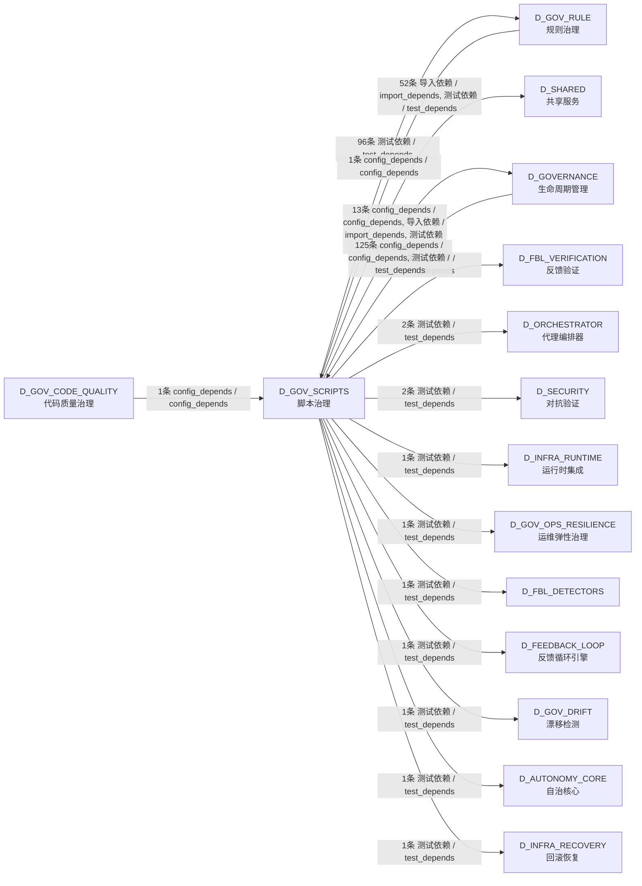

# 46_d_gov_scripts / script_governance / 脚本治理 / Script Governance

> **功能简介 / Overview**: 脚本治理，负责脚本生命周期管理和脚本质量门禁

> **文档作用 / Purpose**: 展示 脚本治理（D_GOV_SCRIPTS）功能域的模块清单、域内依赖关系、跨域依赖关系、架构分层视图，供架构审查和域治理参考。

> 本文档由 generate_domain_doc.py 从 depgraph (PostgreSQL) 自动生成
> 最后更新: 2026-07-13 23:42:17
> 数据源: depgraph (PostgreSQL) nodes表 + edges表

## 域基本信息 / Domain Overview

| 字段 | 值 | Field | Value |
|------|------|-------|-------|
| 编号 | 46 | Number | 46 |
| 域ID | D_GOV_SCRIPTS | Domain ID | D_GOV_SCRIPTS |
| 域名称 | 脚本治理 | Domain Name | Script Governance |
| 层级 | L2 业务域层 | Layer | L2 Domain |
| 模块数 | 104 | Module Count | 104 |
| 域内依赖 | 6 | Internal Dependencies | 6 |
| 跨域入边 | 127 | Cross-domain Incoming | 127 |
| 跨域出边 | 174 | Cross-domain Outgoing | 174 |
| 设计态模块 | 0 | Design Modules | 0 |
| 原型态模块 | 97 | Prototype Modules | 97 |
| 生产态模块 | 7 | Production Modules | 7 |
| 容量 | 7/150 (正常) | Capacity | 7/150 (正常) |
| 描述 | Phase Manager阶段管理 | Description | Phase Manager阶段管理 |

## 模块分层清单 / Module Layered List

> 按 architecture_layer 分组的模块清单（共 104 个模块 / 104 modules）。

### L1 基础层 / Foundation Layer (1 modules)

| # | 模块路径 / Module Path | 模块名称 / Module Name (功能简介 / Description) | 成熟度 / Maturity | 蓝图 / Blueprint |
|:--:|---------|---------|:---:|:---:|
| 1 | docs/01_policies_and_standards/_registry/catalogs/scripts... | [聚合节点 / Aggregated] 脚本集 / Script Collection (430 items) | 生产态 / production |  |
| ↳1 |   ↳ scripts/governance/__init__.py |  | - | - |
| ↳2 |   ↳ scripts/governance/_archive/one_off/analyze_orphan_c... |  | - | - |
| ↳3 |   ↳ scripts/governance/_archive/one_off/audit_post_sync_... |  | - | - |
| ↳4 |   ↳ scripts/governance/_archive/one_off/check_exam_case_... |  | - | - |
| ↳5 |   ↳ scripts/governance/_archive/one_off/check_rule_cover... |  | - | - |
| ↳6 |   ↳ scripts/governance/_archive/one_off/create_alignment... |  | - | - |
| ↳7 |   ↳ scripts/governance/_archive/one_off/dm105_depgraph_t... |  | - | - |
| ↳8 |   ↳ scripts/governance/_archive/one_off/fix_broken_post_... |  | - | - |
| ↳9 |   ↳ scripts/governance/_archive/one_off/group_orphan_mod... |  | - | - |
| ↳10 |   ↳ scripts/governance/_archive/one_off/list_phase0_tasks.py |  | - | - |
| ↳11 |   ↳ scripts/governance/_archive/one_off/migrate_clean_bu... |  | - | - |
| ↳12 |   ↳ scripts/governance/_archive/one_off/migrate_domain_i... |  | - | - |
| ↳13 |   ↳ scripts/governance/_archive/one_off/perf_depgraph_ba... |  | - | - |
| ↳14 |   ↳ scripts/governance/_archive/one_off/phase_a_backup.py |  | - | - |
| ↳15 |   ↳ scripts/governance/_archive/one_off/rename_kebab_to_... |  | - | - |
| ↳16 |   ↳ scripts/governance/_archive/one_off/rename_whitelist... |  | - | - |
| ↳17 |   ↳ scripts/governance/_archive/one_off/test_lock_scenar... |  | - | - |
| ↳18 |   ↳ scripts/governance/_archive/one_off/verify_final_del... |  | - | - |
| ↳19 |   ↳ scripts/governance/_archive/one_off/verify_rule_yaml... |  | - | - |
| ↳20 |   ↳ scripts/governance/_archive/prototype/adversarial_log.py |  | - | - |
| ↳21 |   ↳ scripts/governance/_archive/prototype/adversarial_sy... |  | - | - |
| ↳22 |   ↳ scripts/governance/_archive/prototype/audit_domain_n... |  | - | - |
| ↳23 |   ↳ scripts/governance/_archive/prototype/changelog.py |  | - | - |
| ↳24 |   ↳ scripts/governance/_archive/prototype/check_audit_rb... |  | - | - |
| ↳25 |   ↳ scripts/governance/_archive/prototype/construction_g... |  | - | - |
| ↳26 |   ↳ scripts/governance/_archive/prototype/generate_asset... |  | - | - |
| ↳27 |   ↳ scripts/governance/_archive/prototype/generate_nav_t... |  | - | - |
| ↳28 |   ↳ scripts/governance/_archive/prototype/rebuild_audit_... |  | - | - |
| ↳29 |   ↳ scripts/governance/_archive/prototype/scan_ground_tr... |  | - | - |
| ↳30 |   ↳ scripts/governance/_archive/prototype/session_simula... |  | - | - |
| ↳31 |   ↳ scripts/governance/_archive/prototype/sync_blueprint... |  | - | - |
| ↳32 |   ↳ scripts/governance/_archive/vms_ri/ri_boundary_check.py |  | - | - |
| ↳33 |   ↳ scripts/governance/_archive/vms_ri/ri_build_completi... |  | - | - |
| ↳34 |   ↳ scripts/governance/_archive/vms_ri/vms_blindspot_che... |  | - | - |
| ↳35 |   ↳ scripts/governance/_archive/vms_ri/vms_build_complet... |  | - | - |
| ↳36 |   ↳ scripts/governance/_archive/vms_ri/vms_cron_monitor.py |  | - | - |
| ↳37 |   ↳ scripts/governance/_archive/vms_ri/vms_cross_file_ch... |  | - | - |
| ↳38 |   ↳ scripts/governance/_archive/vms_ri/vms_health_check.py |  | - | - |
| ↳39 |   ↳ scripts/governance/_archive/vms_ri/vms_migrate.py |  | - | - |
| ↳40 |   ↳ scripts/governance/_archive/vms_ri/vms_migration_dry... |  | - | - |
| ↳41 |   ↳ scripts/governance/_archive/vms_ri/vms_phase_rollback.py |  | - | - |
| ↳42 |   ↳ scripts/governance/_archive/vms_ri/vms_version_sync_... |  | - | - |
| ↳43 |   ↳ scripts/governance/_shared/__init__.py |  | - | - |
| ↳44 |   ↳ scripts/governance/_shared/base.py |  | - | - |
| ↳45 |   ↳ scripts/governance/_shared/constants.py |  | - | - |
| ↳46 |   ↳ scripts/governance/_shared/deprecated_paths.yaml |  | - | - |
| ↳47 |   ↳ scripts/governance/_shared/encoding.py |  | - | - |
| ↳48 |   ↳ scripts/governance/_shared/file_utils.py |  | - | - |
| ↳49 |   ↳ scripts/governance/_shared/frontmatter.py |  | - | - |
| ↳50 |   ↳ scripts/governance/_shared/libcst_docstring_adder.py |  | - | - |
| ↳51 |   ↳ scripts/governance/_shared/plugin_contract_schema.yaml |  | - | - |
| ↳52 |   ↳ scripts/governance/_shared/registry_entry_count.py |  | - | - |
| ↳53 |   ↳ scripts/governance/_shared/thresholds.py |  | - | - |
| ↳54 |   ↳ scripts/governance/_shared/thresholds.yaml |  | - | - |
| ↳55 |   ↳ scripts/governance/_shared/walk.py |  | - | - |
| ↳56 |   ↳ scripts/governance/_shared/yaml_utils.py |  | - | - |
| ↳57 |   ↳ scripts/governance/_sync/check_p0_status.py |  | - | - |
| ↳58 |   ↳ scripts/governance/_sync/cleanup_p0_auto_bridged.py |  | - | - |
| ↳59 |   ↳ scripts/governance/_sync/cleanup_p0_ops_pending.py |  | - | - |
| ↳60 |   ↳ scripts/governance/_sync/fix_orphan_deps.py |  | - | - |
| ↳61 |   ↳ scripts/governance/_tasks/__init__.py |  | - | - |
| ↳62 |   ↳ scripts/governance/_tasks/list_phase0_tasks.py |  | - | - |
| ↳63 |   ↳ scripts/governance/_tasks/task_show.py |  | - | - |
| ↳64 |   ↳ scripts/governance/_tasks/task_summary.py |  | - | - |
| ↳65 |   ↳ scripts/governance/apply_dataflowgraph.py |  | - | - |
| ↳66 |   ↳ scripts/governance/apply_decisiongraph.py |  | - | - |
| ↳67 |   ↳ scripts/governance/apply_depgraph.py |  | - | - |
| ↳68 |   ↳ scripts/governance/architecture_health_dashboard.py |  | - | - |
| ↳69 |   ↳ scripts/governance/ast_import_rewriter.py |  | - | - |
| ↳70 |   ↳ scripts/governance/d10_performance/__init__.py |  | - | - |
| ↳71 |   ↳ scripts/governance/d10_performance/collect_system_th... |  | - | - |
| ↳72 |   ↳ scripts/governance/d11_compliance/__init__.py |  | - | - |
| ↳73 |   ↳ scripts/governance/d11_compliance/audit_registration.py |  | - | - |
| ↳74 |   ↳ scripts/governance/d11_compliance/check_ssot_gate.py |  | - | - |
| ↳75 |   ↳ scripts/governance/d11_compliance/check_test_structu... |  | - | - |
| ↳76 |   ↳ scripts/governance/d11_compliance/ci_self_check.py |  | - | - |
| ↳77 |   ↳ scripts/governance/d11_compliance/fix_shared_bypass.py |  | - | - |
| ↳78 |   ↳ scripts/governance/d11_compliance/g9_compliance_check.py |  | - | - |
| ↳79 |   ↳ scripts/governance/d11_compliance/task_self_check.py |  | - | - |
| ↳80 |   ↳ scripts/governance/d11_compliance/validate_blueprint... |  | - | - |
| ↳81 |   ↳ scripts/governance/d11_compliance/validate_commit_ga... |  | - | - |
| ↳82 |   ↳ scripts/governance/d11_compliance/validate_commit_me... |  | - | - |
| ↳83 |   ↳ scripts/governance/d11_compliance/validate_exit_codes.py |  | - | - |
| ↳84 |   ↳ scripts/governance/d11_compliance/validate_frozen_re... |  | - | - |
| ↳85 |   ↳ scripts/governance/d11_compliance/validate_manifest_... |  | - | - |
| ↳86 |   ↳ scripts/governance/d11_compliance/validate_no_utf8_b... |  | - | - |
| ↳87 |   ↳ scripts/governance/d11_compliance/validate_script_na... |  | - | - |
| ↳88 |   ↳ scripts/governance/d11_compliance/validate_script_qu... |  | - | - |
| ↳89 |   ↳ scripts/governance/d11_compliance/validate_task_deco... |  | - | - |
| ↳90 |   ↳ scripts/governance/d11_compliance/validate_truth_sou... |  | - | - |
| ↳91 |   ↳ scripts/governance/d11_compliance/validate_vocabular... |  | - | - |
| ↳92 |   ↳ scripts/governance/d11_compliance/verify_audit_integ... |  | - | - |
| ↳93 |   ↳ scripts/governance/d11_compliance/verify_key_imports.py |  | - | - |
| ↳94 |   ↳ scripts/governance/d11_compliance/verify_schema_heal... |  | - | - |
| ↳95 |   ↳ scripts/governance/d12_ai_hallucination/__init__.py |  | - | - |
| ↳96 |   ↳ scripts/governance/d12_ai_hallucination/check_logger... |  | - | - |
| ↳97 |   ↳ scripts/governance/d12_ai_hallucination/validate_gat... |  | - | - |
| ↳98 |   ↳ scripts/governance/d12_ai_hallucination/validate_ses... |  | - | - |
| ↳99 |   ↳ scripts/governance/d12_ai_hallucination/validate_ses... |  | - | - |
| ↳100 |   ↳ scripts/governance/d1_structure/__init__.py |  | - | - |
| | | > (仅显示前 100 个 items，共 430 个) | | |

### L2 领域层 / Domain Layer (103 modules)

| # | 模块路径 / Module Path | 模块名称 / Module Name (功能简介 / Description) | 成熟度 / Maturity | 蓝图 / Blueprint |
|:--:|---------|---------|:---:|:---:|
| 1 | scripts/governance/__init__.py | __init__.py | 生产态 / production |  |
| 2 | scripts/governance/_archive/one_off/analyze_orphan_consum... | analyze_orphan_consumers.py | 原型态 / prototype |  |
| 3 | scripts/governance/_archive/one_off/check_rule_coverage.py | governance/check_rule_coverage 脚本 — 规则文件... | 原型态 / prototype |  |
| 4 | scripts/governance/_archive/one_off/group_orphan_modules.py | 按域分组统计 ORPHAN MODULES — 用于建任务卡批量... | 原型态 / prototype |  |
| 5 | scripts/governance/_archive/one_off/migrate_clean_build_s... | OPS-2026062504: 数据清洗 depgraph (PostgreSQL) ... | 原型态 / prototype |  |
| 6 | scripts/governance/_archive/one_off/migrate_domain_id_hyp... | 域ID连字符→下划线迁移脚本（分层分批执行） | 原型态 / prototype |  |
| 7 | scripts/governance/_archive/one_off/perf_depgraph_baselin... | [INVARIANTS] 只读访问 depgraph（mode=ro）；禁止... | 原型态 / prototype |  |
| 8 | scripts/governance/_shared/__init__.py | __init__.py | 原型态 / prototype |  |
| 9 | scripts/governance/_shared/deprecated_paths.yaml | deprecated_paths.yaml | 生产态 / production | [MOD-INF-005](../../03_modules/_domain_governance/governance_automation/blueprint.md) |
| 10 | scripts/governance/_shared/plugin_contract_schema.yaml | plugin_contract_schema.yaml | 生产态 / production | [MOD-INF-005](../../03_modules/_domain_governance/governance_automation/blueprint.md) |
| 11 | scripts/governance/_shared/thresholds.yaml | thresholds.yaml | 生产态 / production | [MOD-INF-005](../../03_modules/_domain_governance/governance_automation/blueprint.md) |
| 12 | scripts/governance/_tasks/__init__.py | __init__.py | 原型态 / prototype |  |
| 13 | scripts/governance/ast_import_rewriter.py | AST-based import rewriter for governance direct... | 原型态 / prototype |  |
| 14 | scripts/governance/d10_performance/__init__.py | __init__.py | 原型态 / prototype | [MOD-INF-005](../../03_modules/_domain_governance/governance_automation/blueprint.md) |
| 15 | scripts/governance/d11_compliance/__init__.py | __init__.py | 原型态 / prototype |  |
| 16 | scripts/governance/d11_compliance/check_test_structure.py | 测试结构合规门禁——检查 test_*.py 文件结构，防... | 原型态 / prototype |  |
| 17 | scripts/governance/d11_compliance/verify_key_imports.py | governance/verify_key_imports 脚本 — 关键模块... | 原型态 / prototype |  |
| 18 | scripts/governance/d12_ai_hallucination/__init__.py | D12 AI 幻觉审计维度 | 原型态 / prototype | [MOD-INF-005](../../03_modules/_domain_governance/governance_automation/blueprint.md) |
| 19 | scripts/governance/d1_structure/__init__.py | __init__.py | 原型态 / prototype |  |
| 20 | scripts/governance/d2_links/__init__.py | D2 链接完整性 — 文档内/文档间交叉引用有效性审计。 | 原型态 / prototype | [MOD-INF-005](../../03_modules/_domain_governance/governance_automation/blueprint.md) |
| 21 | scripts/governance/d4_paths/__init__.py | D4 路径有效性 — 文件系统中路径引用/落位合规性... | 原型态 / prototype | [MOD-INF-005](../../03_modules/_domain_governance/governance_automation/blueprint.md) |
| 22 | scripts/governance/d5_architecture/panorama_common.py | panorama_common.py — 四图投票共享工具（ARCH-05... | 原型态 / prototype |  |
| 23 | scripts/governance/d5_architecture/syncers/blueprint_fron... | blueprint_frontmatter_reconciler.py — 蓝图 fro... | 生产态 / production |  |
| 24 | scripts/governance/d6_security/__init__.py | D6 安全漏洞 — 代码/配置/依赖安全风险审计。 | 原型态 / prototype | [MOD-INF-005](../../03_modules/_domain_governance/governance_automation/blueprint.md) |
| 25 | scripts/governance/d7_code/__init__.py | D7 代码质量 — Python 代码静态分析与质量合规审计。 | 原型态 / prototype | [MOD-INF-005](../../03_modules/_domain_governance/governance_automation/blueprint.md) |
| 26 | scripts/governance/d8_doc_sync/__init__.py | D8 文档代码同步审计维度 | 原型态 / prototype | [MOD-INF-005](../../03_modules/_domain_governance/governance_automation/blueprint.md) |
| 27 | scripts/governance/d9_knowledge/__init__.py | D9 知识覆盖审计维度 | 原型态 / prototype | [MOD-INF-005](../../03_modules/_domain_governance/governance_automation/blueprint.md) |
| 28 | scripts/governance/generators/__init__.py | __init__.py | 原型态 / prototype | [MOD-INF-005](../../03_modules/_domain_governance/governance_automation/blueprint.md) |
| 29 | scripts/governance/git_hooks/post_commit_guard.sh | post_commit_guard.sh | 原型态 / prototype |  |
| 30 | scripts/governance/migrate_sqlite_to_pg/migrate_data.py | SQLite → PostgreSQL 数据迁移脚本 | 原型态 / prototype |  |
| 31 | scripts/governance/observability/__init__.py | __init__.py | 原型态 / prototype | [MOD-INF-005](../../03_modules/_domain_governance/governance_automation/blueprint.md) |
| 32 | scripts/governance/sync_panorama_module.py | sync_panorama_module.py — 四图模块同步引擎（AR... | 生产态 / production |  |
| 33 | scripts/governance/test_concurrent_safety.ps1 | test_concurrent_safety.ps1 | 原型态 / prototype |  |
| 34 | scripts/governance/vms/__init__.py | __init__.py | 原型态 / prototype |  |
| 35 | tests/blueprint/test_blueprint_bloat_monitor.py | test_blueprint_bloat_monitor.py | 原型态 / prototype | [MOD-INF-022](../../03_modules/_domain_autonomy_perm/escalation_protocol/blueprint.md) |
| 36 | tests/blueprint/test_blueprint_code_consistency.py | test_blueprint_code_consistency.py | 原型态 / prototype | [MOD-INF-022](../../03_modules/_domain_autonomy_perm/escalation_protocol/blueprint.md) |
| 37 | tests/blueprint/test_blueprint_code_reconciler.py | test_blueprint_code_reconciler.py | 原型态 / prototype | [MOD-GATE_ENGINE](../../03_modules/_cross_layer/gate_engine/blueprint.md) |
| 38 | tests/blueprint/test_blueprint_fidelity.py | test_blueprint_fidelity.py | 原型态 / prototype | [MOD-INF-018](../../03_modules/_domain_autonomy_core/agent_role_based_access_control/blueprint.md) |
| 39 | tests/blueprint/test_blueprint_metrics.py | test_blueprint_metrics.py | 原型态 / prototype | [MOD-INF-015](../../03_modules/_domain_infrastructure_operations/system_telemetry/blueprint.md) |
| 40 | tests/blueprint/test_blueprint_reconciler.py | test_blueprint_reconciler.py | 原型态 / prototype | [MOD-INF-022](../../03_modules/_domain_autonomy_perm/escalation_protocol/blueprint.md) |
| 41 | tests/blueprint/test_blueprint_scorer.py | test_blueprint_scorer.py | 原型态 / prototype | [MOD-INF-039](../../03_modules/_cross_layer/agent_orchestrator/blueprint.md) |
| 42 | tests/blueprint/test_blueprint_validator.py | test_blueprint_validator.py | 原型态 / prototype | [MOD-GATE_ENGINE](../../03_modules/_cross_layer/gate_engine/blueprint.md) |
| 43 | tests/blueprint/test_gen_inherited.py | test_gen_inherited.py | 原型态 / prototype | [MOD-INF-021](../../03_modules/_domain_autonomy_core/rollback_system/blueprint.md) |
| 44 | tests/dependency/test_dependency_auditor.py | test_dependency_auditor.py | 原型态 / prototype | [MOD-INF-018](../../03_modules/_domain_autonomy_core/agent_role_based_access_control/blueprint.md) |
| 45 | tests/dependency/test_dependency_freshness_monitor.py | test_dependency_freshness_monitor.py | 原型态 / prototype | [MOD-FEEDBACK_LOOP](../../03_modules/_cross_layer/feedback_loop/blueprint.md) |
| 46 | tests/dependency/test_dependency_lock.py | test_dependency_lock.py | 原型态 / prototype | [MOD-INF-039](../../03_modules/_cross_layer/agent_orchestrator/blueprint.md) |
| 47 | tests/dependency/test_dependency_manager.py | test_dependency_manager.py | 原型态 / prototype | [MOD-INF-023](../../03_modules/_domain_governance/drift_detector/blueprint.md) |
| 48 | tests/dependency/test_dependency_root.py | test_dependency_root.py | 原型态 / prototype | [MOD-INF-026](../../03_modules/_domain_infrastructure_operations/asset_inventory/blueprint.md) |
| 49 | tests/dependency/test_dependency_tracker.py | test_dependency_tracker.py | 原型态 / prototype | [MOD-INF-019](../../03_modules/_domain_autonomy_core/agent_spec/blueprint.md) |
| 50 | tests/git/test_git_bisector.py | test_git_bisector.py | 原型态 / prototype | [MOD-INF-033](../../03_modules/_cross_layer/behavioral_auditor/blueprint.md) |
| 51 | tests/git/test_git_hook_pre_scanner.py | test_git_hook_pre_scanner.py | 原型态 / prototype | [MOD-INF-021](../../03_modules/_domain_autonomy_core/rollback_system/blueprint.md) |
| 52 | tests/git/test_git_infra_snapshot.py | test_git_infra_snapshot.py | 原型态 / prototype | [MOD-INF-021](../../03_modules/_domain_autonomy_core/rollback_system/blueprint.md) |
| 53 | tests/git/test_lock_release_uncommitted.py | DM-202919 验收测试: lock_files.py release 加 gi... | 原型态 / prototype | [MOD-INF-005](../../03_modules/_domain_governance/governance_automation/blueprint.md) |
| 54 | tests/governance/scripts_governance/test_check_vocab_hard... | test_check_vocab_hardcode.py — GATE-VOCAB 检测... | 原型态 / prototype |  |
| 55 | tests/governance/scripts_governance/test_pre_write_gate.py | test_pre_write_gate.py — _check_session_overla... | 原型态 / prototype |  |
| 56 | tests/trae_rules/test_g_trae_003.py | Test gate g_trae_003 for rule TRAE-003 — calls... | 原型态 / prototype |  |
| 57 | tests/trae_rules/test_g_trae_004.py | Test gate g_trae_004 for rule TRAE-004 — calls... | 原型态 / prototype |  |
| 58 | tests/trae_rules/test_g_trae_006.py | Test gate g_trae_006 for rule TRAE-006 — calls... | 原型态 / prototype |  |
| 59 | tests/trae_rules/test_g_trae_007.py | Test gate g_trae_007 for rule TRAE-007 — calls... | 原型态 / prototype |  |
| 60 | tests/trae_rules/test_g_trae_008.py | Test gate g_trae_008 for rule TRAE-008 — calls... | 原型态 / prototype |  |
| 61 | tests/trae_rules/test_g_trae_009.py | Test gate g_trae_009 for rule TRAE-009 — calls... | 原型态 / prototype |  |
| 62 | tests/trae_rules/test_g_trae_010.py | Test gate g_trae_010 for rule TRAE-010 — calls... | 原型态 / prototype |  |
| 63 | tests/trae_rules/test_g_trae_011.py | Test gate g_trae_011 for rule TRAE-011 — calls... | 原型态 / prototype |  |
| 64 | tests/trae_rules/test_g_trae_012.py | Test gate g_trae_012 for rule TRAE-012 — calls... | 原型态 / prototype |  |
| 65 | tests/trae_rules/test_g_trae_016.py | Test gate g_trae_016 for rule TRAE-016 — calls... | 原型态 / prototype |  |
| 66 | tests/trae_rules/test_g_trae_017.py | Test gate g_trae_017 for rule TRAE-017 — calls... | 原型态 / prototype |  |
| 67 | tests/trae_rules/test_g_trae_018.py | Test gate g_trae_018 for rule TRAE-018 — calls... | 原型态 / prototype |  |
| 68 | tests/trae_rules/test_g_trae_020.py | Test gate g_trae_020 for rule TRAE-020 — calls... | 原型态 / prototype |  |
| 69 | tests/trae_rules/test_g_trae_021.py | Test gate g_trae_021 for rule TRAE-021 — calls... | 原型态 / prototype |  |
| 70 | tests/trae_rules/test_g_trae_022.py | Test gate g_trae_022 for rule TRAE-022 — calls... | 原型态 / prototype |  |
| 71 | tests/trae_rules/test_g_trae_023.py | Test gate g_trae_023 for rule TRAE-023 — calls... | 原型态 / prototype |  |
| 72 | tests/trae_rules/test_g_trae_024.py | Test gate g_trae_024 for rule TRAE-024 — calls... | 原型态 / prototype |  |
| 73 | tests/trae_rules/test_g_trae_025.py | Test gate g_trae_025 for rule TRAE-025 — calls... | 原型态 / prototype |  |
| 74 | tests/trae_rules/test_g_trae_026.py | Test gate g_trae_026 for rule TRAE-026 — calls... | 原型态 / prototype |  |
| 75 | tests/trae_rules/test_g_trae_027.py | Test gate g_trae_027 for rule TRAE-027 — calls... | 原型态 / prototype |  |
| 76 | tests/trae_rules/test_g_trae_028.py | Test gate g_trae_028 for rule TRAE-028 — calls... | 原型态 / prototype |  |
| 77 | tests/trae_rules/test_g_trae_029.py | Test gate g_trae_029 for rule TRAE-029 — calls... | 原型态 / prototype |  |
| 78 | tests/trae_rules/test_g_trae_030.py | Test gate g_trae_030 for rule TRAE-030 — calls... | 原型态 / prototype |  |
| 79 | tests/trae_rules/test_g_trae_031.py | Test gate g_trae_031 for rule TRAE-031 — calls... | 原型态 / prototype |  |
| 80 | tests/trae_rules/test_g_trae_032.py | Test gate g_trae_032 for rule TRAE-032 — calls... | 原型态 / prototype |  |
| 81 | tests/trae_rules/test_g_trae_033.py | Test gate g_trae_033 for rule TRAE-033 — calls... | 原型态 / prototype |  |
| 82 | tests/trae_rules/test_g_trae_034.py | Test gate g_trae_034 for rule TRAE-034 — calls... | 原型态 / prototype |  |
| 83 | tests/trae_rules/test_g_trae_035.py | Test gate g_trae_035 for rule TRAE-035 — calls... | 原型态 / prototype |  |
| 84 | tests/trae_rules/test_g_trae_036.py | Test gate g_trae_036 for rule TRAE-036 — calls... | 原型态 / prototype |  |
| 85 | tests/trae_rules/test_g_trae_037.py | Test gate g_trae_037 for rule TRAE-037 — calls... | 原型态 / prototype |  |
| 86 | tests/trae_rules/test_g_trae_038.py | Test gate g_trae_038 for rule TRAE-038 — calls... | 原型态 / prototype |  |
| 87 | tests/trae_rules/test_g_trae_039.py | Test gate g_trae_039 for rule TRAE-039 — calls... | 原型态 / prototype |  |
| 88 | tests/trae_rules/test_g_trae_040.py | Test gate g_trae_040 for rule TRAE-040 — calls... | 原型态 / prototype |  |
| 89 | tests/trae_rules/test_g_trae_041.py | Test gate g_trae_041 for rule TRAE-041 — calls... | 原型态 / prototype |  |
| 90 | tests/trae_rules/test_g_trae_042.py | Test gate g_trae_042 for rule TRAE-042 — calls... | 原型态 / prototype |  |
| 91 | tests/trae_rules/test_g_trae_043.py | Test gate g_trae_043 for rule TRAE-043 — calls... | 原型态 / prototype |  |
| 92 | tests/trae_rules/test_g_trae_044.py | Test gate g_trae_044 for rule TRAE-044 — calls... | 原型态 / prototype |  |
| 93 | tests/trae_rules/test_g_trae_045.py | Test gate g_trae_045 for rule TRAE-045 — calls... | 原型态 / prototype |  |
| 94 | tests/trae_rules/test_g_trae_046.py | Test gate g_trae_046 for rule TRAE-046 — calls... | 原型态 / prototype |  |
| 95 | tests/trae_rules/test_g_trae_047.py | Test gate g_trae_047 for rule TRAE-047 — calls... | 原型态 / prototype |  |
| 96 | tests/trae_rules/test_g_trae_048.py | Test gate g_trae_048 for rule TRAE-048 — calls... | 原型态 / prototype |  |
| 97 | tests/trae_rules/test_g_trae_049.py | Test gate g_trae_049 for rule TRAE-049 — calls... | 原型态 / prototype |  |
| 98 | tests/trae_rules/test_g_trae_050.py | Test gate g_trae_050 for rule TRAE-050 — calls... | 原型态 / prototype |  |
| 99 | tests/trae_rules/test_g_trae_051.py | Test gate g_trae_051 for rule TRAE-051 — calls... | 原型态 / prototype |  |
| 100 | tests/trae_rules/test_g_trae_052.py | Test gate g_trae_052 for rule TRAE-052 — calls... | 原型态 / prototype |  |
| 101 | tests/trae_rules/test_g_trae_053.py | Test gate g_trae_053 for rule TRAE-053 — calls... | 原型态 / prototype |  |
| 102 | tests/trae_rules/test_g_trae_054.py | Test gate g_trae_054 for rule TRAE-054 — calls... | 原型态 / prototype |  |
| 103 | tests/trae_rules/test_g_trae_055.py | Test gate g_trae_055 for rule TRAE-055 — calls... | 原型态 / prototype |  |

## 域内依赖图 / Internal Dependency Diagram

> 依赖图内嵌在本文档中，IDE 可直接渲染显示。参考 decision_index.md 设计，分四个视图：合并全景图、运营态子图、设计态子图、原型态子图（按 design_maturity 实际值拆分）。
>
> **图例说明 / Legend**：
> - **实线边框 = 运营态模块**（production，已上线运行）
> - **虚线边框 = 设计态模块**（design，蓝图阶段，代码未写）
> - **虚线边框 = 原型态模块**（prototype，代码已写，验证中未稳定上线）
> - **实线箭头 = 运营态依赖**（已生效的依赖关系）
> - **虚线箭头 = 非运营态依赖**（计划中/验证中的依赖关系）

### 合并全景图（全部模块，标签标注成熟度）

> 展示全部 104 个模块（生产态 7 + 设计态 0 + 原型态 97），标签标注成熟度。

#### 第 1 页 / 共 4 页

```mermaid
graph TD
    subgraph D_GOV_SCRIPTS["D_GOV_SCRIPTS 脚本治理"]
        docs_01_policies_and_standards_registry_catalogs_scripts_registry_yaml["(生产态 / production)  Script Collection — ARCH-052 聚合节点 production"]
        scripts_governance_init_py["(生产态 / production) __init__.py"]
        scripts_governance_archive_one_off_analyze_orphan_consumers_py["(原型态 / prototype) analyze_orphan_consumers.py"]
        scripts_governance_archive_one_off_check_rule_coverage_py["(原型态 / prototype) governance/check_rule_coverage 脚本 — 规则文件...<br/>文件: check_rule_coverage.py"]
        scripts_governance_archive_one_off_group_orphan_modules_py["(原型态 / prototype) 按域分组统计 ORPHAN MODULES — 用于建任务卡批量...<br/>文件: group_orphan_modules.py"]
        scripts_governance_archive_one_off_migrate_clean_build_status_py["(原型态 / prototype) OPS-2026062504: 数据清洗 depgraph (PostgreSQL) ...<br/>文件: migrate_clean_build_status.py"]
        scripts_governance_archive_one_off_migrate_domain_id_hyphen_to_underscore_py["(原型态 / prototype) 域ID连字符→下划线迁移脚本（分层分批执行）<br/>文件: migrate_domain_id_hyphen_to_underscore.py"]
        scripts_governance_archive_one_off_perf_depgraph_baseline_py["(原型态 / prototype) (INVARIANTS) 只读访问 depgraph（mode=ro）；禁止...<br/>文件: perf_depgraph_baseline.py"]
        scripts_governance_shared_init_py["(原型态 / prototype) __init__.py"]
        scripts_governance_shared_deprecated_paths_yaml["(生产态 / production) deprecated_paths.yaml"]
        scripts_governance_shared_plugin_contract_schema_yaml["(生产态 / production) plugin_contract_schema.yaml"]
        scripts_governance_shared_thresholds_yaml["(生产态 / production) thresholds.yaml"]
        scripts_governance_tasks_init_py["(原型态 / prototype) __init__.py"]
        scripts_governance_ast_import_rewriter_py["(原型态 / prototype) AST-based import rewriter for governance direct...<br/>文件: ast_import_rewriter.py"]
        scripts_governance_d10_performance_init_py["(原型态 / prototype) __init__.py"]
        scripts_governance_d11_compliance_init_py["(原型态 / prototype) __init__.py"]
        scripts_governance_d11_compliance_check_test_structure_py["(原型态 / prototype) 测试结构合规门禁——检查 test_*.py 文件结构，防...<br/>文件: check_test_structure.py"]
        scripts_governance_d11_compliance_verify_key_imports_py["(原型态 / prototype) governance/verify_key_imports 脚本 — 关键模块...<br/>文件: verify_key_imports.py"]
        scripts_governance_d12_ai_hallucination_init_py["(原型态 / prototype) D12 AI 幻觉审计维度<br/>文件: __init__.py"]
        scripts_governance_d1_structure_init_py["(原型态 / prototype) __init__.py"]
        scripts_governance_d2_links_init_py["(原型态 / prototype) D2 链接完整性 — 文档内/文档间交叉引用有效性审计。<br/>文件: __init__.py"]
        scripts_governance_d4_paths_init_py["(原型态 / prototype) D4 路径有效性 — 文件系统中路径引用/落位合规性...<br/>文件: __init__.py"]
        scripts_governance_d5_architecture_panorama_common_py["(原型态 / prototype) panorama_common.py — 四图投票共享工具（ARCH-05...<br/>文件: panorama_common.py"]
        scripts_governance_d5_architecture_syncers_blueprint_frontmatter_reconciler_py["(生产态 / production) blueprint_frontmatter_reconciler.py — 蓝图 fro...<br/>文件: blueprint_frontmatter_reconciler.py"]
        scripts_governance_d6_security_init_py["(原型态 / prototype) D6 安全漏洞 — 代码/配置/依赖安全风险审计。<br/>文件: __init__.py"]
        scripts_governance_d7_code_init_py["(原型态 / prototype) D7 代码质量 — Python 代码静态分析与质量合规审计。<br/>文件: __init__.py"]
        scripts_governance_d8_doc_sync_init_py["(原型态 / prototype) D8 文档代码同步审计维度<br/>文件: __init__.py"]
        scripts_governance_d9_knowledge_init_py["(原型态 / prototype) D9 知识覆盖审计维度<br/>文件: __init__.py"]
        scripts_governance_generators_init_py["(原型态 / prototype) __init__.py"]
        scripts_governance_git_hooks_post_commit_guard_sh["(原型态 / prototype) post_commit_guard.sh"]
    end
    scripts_governance_ast_import_rewriter_py -.->|config_depends / config_depends| scripts_governance_init_py
    scripts_governance_d11_compliance_verify_key_imports_py -.->|config_depends / config_depends| scripts_governance_d11_compliance_init_py
    scripts_governance_shared_deprecated_paths_yaml -.->|config_depends / config_depends| scripts_governance_shared_init_py
    scripts_governance_shared_plugin_contract_schema_yaml -.->|config_depends / config_depends| scripts_governance_shared_init_py
    scripts_governance_shared_thresholds_yaml -.->|config_depends / config_depends| scripts_governance_shared_init_py
    D_SHARED["(生产态 / production) D_SHARED"]
    scripts_governance_d11_compliance_check_test_structure_py -.->|导入依赖 / import_depends| D_SHARED
    D_GOVERNANCE["(原型态 / prototype) D_GOVERNANCE"]
    scripts_governance_d2_links_init_py -.->|config_depends / config_depends| D_GOVERNANCE
    scripts_governance_d5_architecture_panorama_common_py -.->|config_depends / config_depends| D_GOVERNANCE
    scripts_governance_archive_one_off_check_rule_coverage_py -.->|config_depends / config_depends| D_GOVERNANCE
    scripts_governance_archive_one_off_analyze_orphan_consumers_py -.->|导入依赖 / import_depends| D_SHARED
    scripts_governance_archive_one_off_migrate_clean_build_status_py -.->|config_depends / config_depends| D_GOVERNANCE
    scripts_governance_archive_one_off_group_orphan_modules_py -.->|config_depends / config_depends| D_GOVERNANCE
    scripts_governance_archive_one_off_perf_depgraph_baseline_py -.->|导入依赖 / import_depends| D_SHARED
    scripts_governance_archive_one_off_migrate_domain_id_hyphen_to_underscore_py -.->|config_depends / config_depends| D_GOVERNANCE
    scripts_governance_d5_architecture_syncers_blueprint_frontmatter_reconciler_py -->|导入依赖 / import_depends| D_GOVERNANCE
    D_GOVERNANCE -.->|测试依赖 / test_depends| scripts_governance_d5_architecture_syncers_blueprint_frontmatter_reconciler_py
    D_GOVERNANCE -.->|config_depends / config_depends| scripts_governance_d11_compliance_init_py
    D_GOVERNANCE -.->|config_depends / config_depends| scripts_governance_d2_links_init_py
    D_GOVERNANCE -.->|config_depends / config_depends| scripts_governance_d6_security_init_py
    D_GOVERNANCE -.->|config_depends / config_depends| scripts_governance_d6_security_init_py
    D_GOVERNANCE -.->|config_depends / config_depends| scripts_governance_d6_security_init_py
    D_GOVERNANCE -.->|config_depends / config_depends| scripts_governance_d6_security_init_py
    D_GOVERNANCE -.->|config_depends / config_depends| scripts_governance_d6_security_init_py
    D_GOVERNANCE -.->|config_depends / config_depends| scripts_governance_d7_code_init_py
    D_GOVERNANCE -.->|config_depends / config_depends| scripts_governance_d7_code_init_py
    D_GOVERNANCE -.->|config_depends / config_depends| scripts_governance_d7_code_init_py
    D_GOVERNANCE -.->|config_depends / config_depends| scripts_governance_d7_code_init_py
    D_GOVERNANCE -.->|config_depends / config_depends| scripts_governance_d7_code_init_py
    D_GOVERNANCE -.->|config_depends / config_depends| scripts_governance_d7_code_init_py
    D_GOVERNANCE -.->|config_depends / config_depends| scripts_governance_d7_code_init_py
    classDef production fill:#e1f5fe,stroke:#01579b,stroke-width:2px,color:#000
    classDef design fill:#fff3e0,stroke:#e65100,stroke-width:2px,color:#000,stroke-dasharray: 5 5
    classDef external_prod fill:#e8f5e9,stroke:#1b5e20,stroke-width:1px,color:#000
    classDef external_design fill:#fce4ec,stroke:#880e4f,stroke-width:1px,color:#000,stroke-dasharray: 5 5
    class docs_01_policies_and_standards_registry_catalogs_scripts_registry_yaml,scripts_governance_init_py,scripts_governance_shared_deprecated_paths_yaml,scripts_governance_shared_plugin_contract_schema_yaml,scripts_governance_shared_thresholds_yaml,scripts_governance_d5_architecture_syncers_blueprint_frontmatter_reconciler_py production
    class scripts_governance_archive_one_off_analyze_orphan_consumers_py,scripts_governance_archive_one_off_check_rule_coverage_py,scripts_governance_archive_one_off_group_orphan_modules_py,scripts_governance_archive_one_off_migrate_clean_build_status_py,scripts_governance_archive_one_off_migrate_domain_id_hyphen_to_underscore_py,scripts_governance_archive_one_off_perf_depgraph_baseline_py,scripts_governance_shared_init_py,scripts_governance_tasks_init_py,scripts_governance_ast_import_rewriter_py,scripts_governance_d10_performance_init_py,scripts_governance_d11_compliance_init_py,scripts_governance_d11_compliance_check_test_structure_py,scripts_governance_d11_compliance_verify_key_imports_py,scripts_governance_d12_ai_hallucination_init_py,scripts_governance_d1_structure_init_py,scripts_governance_d2_links_init_py,scripts_governance_d4_paths_init_py,scripts_governance_d5_architecture_panorama_common_py,scripts_governance_d6_security_init_py,scripts_governance_d7_code_init_py,scripts_governance_d8_doc_sync_init_py,scripts_governance_d9_knowledge_init_py,scripts_governance_generators_init_py,scripts_governance_git_hooks_post_commit_guard_sh design
    class D_SHARED external_prod
    class D_GOVERNANCE external_design
```



#### 第 2 页 / 共 4 页

```mermaid
graph TD
    subgraph D_GOV_SCRIPTS["D_GOV_SCRIPTS 脚本治理"]
        scripts_governance_migrate_sqlite_to_pg_migrate_data_py["(原型态 / prototype) SQLite → PostgreSQL 数据迁移脚本<br/>文件: migrate_data.py"]
        scripts_governance_observability_init_py["(原型态 / prototype) __init__.py"]
        scripts_governance_sync_panorama_module_py["(生产态 / production) sync_panorama_module.py — 四图模块同步引擎（AR...<br/>文件: sync_panorama_module.py"]
        scripts_governance_test_concurrent_safety_ps1["(原型态 / prototype) test_concurrent_safety.ps1"]
        scripts_governance_vms_init_py["(原型态 / prototype) __init__.py"]
        tests_blueprint_test_blueprint_bloat_monitor_py["(原型态 / prototype) test_blueprint_bloat_monitor.py"]
        tests_blueprint_test_blueprint_code_consistency_py["(原型态 / prototype) test_blueprint_code_consistency.py"]
        tests_blueprint_test_blueprint_code_reconciler_py["(原型态 / prototype) test_blueprint_code_reconciler.py"]
        tests_blueprint_test_blueprint_fidelity_py["(原型态 / prototype) test_blueprint_fidelity.py"]
        tests_blueprint_test_blueprint_metrics_py["(原型态 / prototype) test_blueprint_metrics.py"]
        tests_blueprint_test_blueprint_reconciler_py["(原型态 / prototype) test_blueprint_reconciler.py"]
        tests_blueprint_test_blueprint_scorer_py["(原型态 / prototype) test_blueprint_scorer.py"]
        tests_blueprint_test_blueprint_validator_py["(原型态 / prototype) test_blueprint_validator.py"]
        tests_blueprint_test_gen_inherited_py["(原型态 / prototype) test_gen_inherited.py"]
        tests_dependency_test_dependency_auditor_py["(原型态 / prototype) test_dependency_auditor.py"]
        tests_dependency_test_dependency_freshness_monitor_py["(原型态 / prototype) test_dependency_freshness_monitor.py"]
        tests_dependency_test_dependency_lock_py["(原型态 / prototype) test_dependency_lock.py"]
        tests_dependency_test_dependency_manager_py["(原型态 / prototype) test_dependency_manager.py"]
        tests_dependency_test_dependency_root_py["(原型态 / prototype) test_dependency_root.py"]
        tests_dependency_test_dependency_tracker_py["(原型态 / prototype) test_dependency_tracker.py"]
        tests_git_test_git_bisector_py["(原型态 / prototype) test_git_bisector.py"]
        tests_git_test_git_hook_pre_scanner_py["(原型态 / prototype) test_git_hook_pre_scanner.py"]
        tests_git_test_git_infra_snapshot_py["(原型态 / prototype) test_git_infra_snapshot.py"]
        tests_git_test_lock_release_uncommitted_py["(原型态 / prototype) DM-202919 验收测试: lock_files.py release 加 gi...<br/>文件: test_lock_release_uncommitted.py"]
        tests_governance_scripts_governance_test_check_vocab_hardcode_py["(原型态 / prototype) test_check_vocab_hardcode.py — GATE-VOCAB 检测...<br/>文件: test_check_vocab_hardcode.py"]
        tests_governance_scripts_governance_test_pre_write_gate_py["(原型态 / prototype) test_pre_write_gate.py — _check_session_overla...<br/>文件: test_pre_write_gate.py"]
        tests_trae_rules_test_g_trae_003_py["(原型态 / prototype) Test gate g_trae_003 for rule TRAE-003 — calls...<br/>文件: test_g_trae_003.py"]
        tests_trae_rules_test_g_trae_004_py["(原型态 / prototype) Test gate g_trae_004 for rule TRAE-004 — calls...<br/>文件: test_g_trae_004.py"]
        tests_trae_rules_test_g_trae_006_py["(原型态 / prototype) Test gate g_trae_006 for rule TRAE-006 — calls...<br/>文件: test_g_trae_006.py"]
        tests_trae_rules_test_g_trae_007_py["(原型态 / prototype) Test gate g_trae_007 for rule TRAE-007 — calls...<br/>文件: test_g_trae_007.py"]
    end
    D_SHARED["(生产态 / production) D_SHARED"]
    scripts_governance_migrate_sqlite_to_pg_migrate_data_py -.->|导入依赖 / import_depends| D_SHARED
    D_GOVERNANCE["(生产态 / production) D_GOVERNANCE"]
    tests_blueprint_test_blueprint_bloat_monitor_py -.->|测试依赖 / test_depends| D_GOVERNANCE
    tests_blueprint_test_blueprint_code_consistency_py -.->|测试依赖 / test_depends| D_GOVERNANCE
    D_FBL_VERIFICATION["(生产态 / production) D_FBL_VERIFICATION"]
    tests_blueprint_test_blueprint_code_reconciler_py -.->|测试依赖 / test_depends| D_FBL_VERIFICATION
    tests_blueprint_test_blueprint_reconciler_py -.->|测试依赖 / test_depends| D_GOVERNANCE
    D_SECURITY["(生产态 / production) D_SECURITY"]
    tests_blueprint_test_blueprint_fidelity_py -.->|测试依赖 / test_depends| D_SECURITY
    D_ORCHESTRATOR["(生产态 / production) D_ORCHESTRATOR"]
    tests_blueprint_test_blueprint_scorer_py -.->|测试依赖 / test_depends| D_ORCHESTRATOR
    tests_blueprint_test_blueprint_validator_py -.->|测试依赖 / test_depends| D_FBL_VERIFICATION
    D_FEEDBACK_LOOP["(生产态 / production) D_FEEDBACK_LOOP"]
    tests_blueprint_test_gen_inherited_py -.->|测试依赖 / test_depends| D_FEEDBACK_LOOP
    tests_dependency_test_dependency_lock_py -.->|测试依赖 / test_depends| D_ORCHESTRATOR
    tests_dependency_test_dependency_auditor_py -.->|测试依赖 / test_depends| D_SECURITY
    D_FBL_DETECTORS["(生产态 / production) D_FBL_DETECTORS"]
    tests_dependency_test_dependency_freshness_monitor_py -.->|测试依赖 / test_depends| D_FBL_DETECTORS
    D_AUTONOMY_CORE["(生产态 / production) D_AUTONOMY_CORE"]
    tests_dependency_test_dependency_tracker_py -.->|测试依赖 / test_depends| D_AUTONOMY_CORE
    D_INFRA_RUNTIME["(生产态 / production) D_INFRA_RUNTIME"]
    tests_dependency_test_dependency_root_py -.->|测试依赖 / test_depends| D_INFRA_RUNTIME
    D_GOV_DRIFT["(生产态 / production) D_GOV_DRIFT"]
    tests_git_test_git_bisector_py -.->|测试依赖 / test_depends| D_GOV_DRIFT
    D_GOVERNANCE -.->|测试依赖 / test_depends| scripts_governance_sync_panorama_module_py
    D_GOVERNANCE -.->|config_depends / config_depends| scripts_governance_vms_init_py
    D_GOVERNANCE -.->|config_depends / config_depends| scripts_governance_vms_init_py
    D_GOVERNANCE -.->|config_depends / config_depends| scripts_governance_vms_init_py
    D_GOVERNANCE -.->|config_depends / config_depends| scripts_governance_vms_init_py
    D_GOVERNANCE -.->|config_depends / config_depends| scripts_governance_vms_init_py
    classDef production fill:#e1f5fe,stroke:#01579b,stroke-width:2px,color:#000
    classDef design fill:#fff3e0,stroke:#e65100,stroke-width:2px,color:#000,stroke-dasharray: 5 5
    classDef external_prod fill:#e8f5e9,stroke:#1b5e20,stroke-width:1px,color:#000
    classDef external_design fill:#fce4ec,stroke:#880e4f,stroke-width:1px,color:#000,stroke-dasharray: 5 5
    class scripts_governance_sync_panorama_module_py production
    class scripts_governance_migrate_sqlite_to_pg_migrate_data_py,scripts_governance_observability_init_py,scripts_governance_test_concurrent_safety_ps1,scripts_governance_vms_init_py,tests_blueprint_test_blueprint_bloat_monitor_py,tests_blueprint_test_blueprint_code_consistency_py,tests_blueprint_test_blueprint_code_reconciler_py,tests_blueprint_test_blueprint_fidelity_py,tests_blueprint_test_blueprint_metrics_py,tests_blueprint_test_blueprint_reconciler_py,tests_blueprint_test_blueprint_scorer_py,tests_blueprint_test_blueprint_validator_py,tests_blueprint_test_gen_inherited_py,tests_dependency_test_dependency_auditor_py,tests_dependency_test_dependency_freshness_monitor_py,tests_dependency_test_dependency_lock_py,tests_dependency_test_dependency_manager_py,tests_dependency_test_dependency_root_py,tests_dependency_test_dependency_tracker_py,tests_git_test_git_bisector_py,tests_git_test_git_hook_pre_scanner_py,tests_git_test_git_infra_snapshot_py,tests_git_test_lock_release_uncommitted_py,tests_governance_scripts_governance_test_check_vocab_hardcode_py,tests_governance_scripts_governance_test_pre_write_gate_py,tests_trae_rules_test_g_trae_003_py,tests_trae_rules_test_g_trae_004_py,tests_trae_rules_test_g_trae_006_py,tests_trae_rules_test_g_trae_007_py design
    class D_SHARED,D_GOVERNANCE,D_FBL_VERIFICATION,D_SECURITY,D_ORCHESTRATOR,D_FEEDBACK_LOOP,D_FBL_DETECTORS,D_AUTONOMY_CORE,D_INFRA_RUNTIME,D_GOV_DRIFT external_prod
```



#### 第 3 页 / 共 4 页

```mermaid
graph TD
    subgraph D_GOV_SCRIPTS["D_GOV_SCRIPTS 脚本治理"]
        tests_trae_rules_test_g_trae_008_py["(原型态 / prototype) Test gate g_trae_008 for rule TRAE-008 — calls...<br/>文件: test_g_trae_008.py"]
        tests_trae_rules_test_g_trae_009_py["(原型态 / prototype) Test gate g_trae_009 for rule TRAE-009 — calls...<br/>文件: test_g_trae_009.py"]
        tests_trae_rules_test_g_trae_010_py["(原型态 / prototype) Test gate g_trae_010 for rule TRAE-010 — calls...<br/>文件: test_g_trae_010.py"]
        tests_trae_rules_test_g_trae_011_py["(原型态 / prototype) Test gate g_trae_011 for rule TRAE-011 — calls...<br/>文件: test_g_trae_011.py"]
        tests_trae_rules_test_g_trae_012_py["(原型态 / prototype) Test gate g_trae_012 for rule TRAE-012 — calls...<br/>文件: test_g_trae_012.py"]
        tests_trae_rules_test_g_trae_016_py["(原型态 / prototype) Test gate g_trae_016 for rule TRAE-016 — calls...<br/>文件: test_g_trae_016.py"]
        tests_trae_rules_test_g_trae_017_py["(原型态 / prototype) Test gate g_trae_017 for rule TRAE-017 — calls...<br/>文件: test_g_trae_017.py"]
        tests_trae_rules_test_g_trae_018_py["(原型态 / prototype) Test gate g_trae_018 for rule TRAE-018 — calls...<br/>文件: test_g_trae_018.py"]
        tests_trae_rules_test_g_trae_020_py["(原型态 / prototype) Test gate g_trae_020 for rule TRAE-020 — calls...<br/>文件: test_g_trae_020.py"]
        tests_trae_rules_test_g_trae_021_py["(原型态 / prototype) Test gate g_trae_021 for rule TRAE-021 — calls...<br/>文件: test_g_trae_021.py"]
        tests_trae_rules_test_g_trae_022_py["(原型态 / prototype) Test gate g_trae_022 for rule TRAE-022 — calls...<br/>文件: test_g_trae_022.py"]
        tests_trae_rules_test_g_trae_023_py["(原型态 / prototype) Test gate g_trae_023 for rule TRAE-023 — calls...<br/>文件: test_g_trae_023.py"]
        tests_trae_rules_test_g_trae_024_py["(原型态 / prototype) Test gate g_trae_024 for rule TRAE-024 — calls...<br/>文件: test_g_trae_024.py"]
        tests_trae_rules_test_g_trae_025_py["(原型态 / prototype) Test gate g_trae_025 for rule TRAE-025 — calls...<br/>文件: test_g_trae_025.py"]
        tests_trae_rules_test_g_trae_026_py["(原型态 / prototype) Test gate g_trae_026 for rule TRAE-026 — calls...<br/>文件: test_g_trae_026.py"]
        tests_trae_rules_test_g_trae_027_py["(原型态 / prototype) Test gate g_trae_027 for rule TRAE-027 — calls...<br/>文件: test_g_trae_027.py"]
        tests_trae_rules_test_g_trae_028_py["(原型态 / prototype) Test gate g_trae_028 for rule TRAE-028 — calls...<br/>文件: test_g_trae_028.py"]
        tests_trae_rules_test_g_trae_029_py["(原型态 / prototype) Test gate g_trae_029 for rule TRAE-029 — calls...<br/>文件: test_g_trae_029.py"]
        tests_trae_rules_test_g_trae_030_py["(原型态 / prototype) Test gate g_trae_030 for rule TRAE-030 — calls...<br/>文件: test_g_trae_030.py"]
        tests_trae_rules_test_g_trae_031_py["(原型态 / prototype) Test gate g_trae_031 for rule TRAE-031 — calls...<br/>文件: test_g_trae_031.py"]
        tests_trae_rules_test_g_trae_032_py["(原型态 / prototype) Test gate g_trae_032 for rule TRAE-032 — calls...<br/>文件: test_g_trae_032.py"]
        tests_trae_rules_test_g_trae_033_py["(原型态 / prototype) Test gate g_trae_033 for rule TRAE-033 — calls...<br/>文件: test_g_trae_033.py"]
        tests_trae_rules_test_g_trae_034_py["(原型态 / prototype) Test gate g_trae_034 for rule TRAE-034 — calls...<br/>文件: test_g_trae_034.py"]
        tests_trae_rules_test_g_trae_035_py["(原型态 / prototype) Test gate g_trae_035 for rule TRAE-035 — calls...<br/>文件: test_g_trae_035.py"]
        tests_trae_rules_test_g_trae_036_py["(原型态 / prototype) Test gate g_trae_036 for rule TRAE-036 — calls...<br/>文件: test_g_trae_036.py"]
        tests_trae_rules_test_g_trae_037_py["(原型态 / prototype) Test gate g_trae_037 for rule TRAE-037 — calls...<br/>文件: test_g_trae_037.py"]
        tests_trae_rules_test_g_trae_038_py["(原型态 / prototype) Test gate g_trae_038 for rule TRAE-038 — calls...<br/>文件: test_g_trae_038.py"]
        tests_trae_rules_test_g_trae_039_py["(原型态 / prototype) Test gate g_trae_039 for rule TRAE-039 — calls...<br/>文件: test_g_trae_039.py"]
        tests_trae_rules_test_g_trae_040_py["(原型态 / prototype) Test gate g_trae_040 for rule TRAE-040 — calls...<br/>文件: test_g_trae_040.py"]
        tests_trae_rules_test_g_trae_041_py["(原型态 / prototype) Test gate g_trae_041 for rule TRAE-041 — calls...<br/>文件: test_g_trae_041.py"]
    end
    D_GOV_RULE["(生产态 / production) D_GOV_RULE"]
    tests_trae_rules_test_g_trae_008_py -.->|测试依赖 / test_depends| D_GOV_RULE
    tests_trae_rules_test_g_trae_008_py -.->|测试依赖 / test_depends| D_GOV_RULE
    D_SHARED["(生产态 / production) D_SHARED"]
    tests_trae_rules_test_g_trae_008_py -.->|测试依赖 / test_depends| D_SHARED
    tests_trae_rules_test_g_trae_010_py -.->|测试依赖 / test_depends| D_GOV_RULE
    tests_trae_rules_test_g_trae_010_py -.->|测试依赖 / test_depends| D_GOV_RULE
    tests_trae_rules_test_g_trae_010_py -.->|测试依赖 / test_depends| D_SHARED
    tests_trae_rules_test_g_trae_009_py -.->|测试依赖 / test_depends| D_GOV_RULE
    tests_trae_rules_test_g_trae_009_py -.->|测试依赖 / test_depends| D_GOV_RULE
    tests_trae_rules_test_g_trae_009_py -.->|测试依赖 / test_depends| D_SHARED
    tests_trae_rules_test_g_trae_012_py -.->|测试依赖 / test_depends| D_SHARED
    tests_trae_rules_test_g_trae_012_py -.->|测试依赖 / test_depends| D_GOV_RULE
    tests_trae_rules_test_g_trae_012_py -.->|测试依赖 / test_depends| D_GOV_RULE
    tests_trae_rules_test_g_trae_016_py -.->|测试依赖 / test_depends| D_SHARED
    tests_trae_rules_test_g_trae_016_py -.->|测试依赖 / test_depends| D_GOV_RULE
    tests_trae_rules_test_g_trae_016_py -.->|测试依赖 / test_depends| D_GOV_RULE
    classDef production fill:#e1f5fe,stroke:#01579b,stroke-width:2px,color:#000
    classDef design fill:#fff3e0,stroke:#e65100,stroke-width:2px,color:#000,stroke-dasharray: 5 5
    classDef external_prod fill:#e8f5e9,stroke:#1b5e20,stroke-width:1px,color:#000
    classDef external_design fill:#fce4ec,stroke:#880e4f,stroke-width:1px,color:#000,stroke-dasharray: 5 5
    class tests_trae_rules_test_g_trae_008_py,tests_trae_rules_test_g_trae_009_py,tests_trae_rules_test_g_trae_010_py,tests_trae_rules_test_g_trae_011_py,tests_trae_rules_test_g_trae_012_py,tests_trae_rules_test_g_trae_016_py,tests_trae_rules_test_g_trae_017_py,tests_trae_rules_test_g_trae_018_py,tests_trae_rules_test_g_trae_020_py,tests_trae_rules_test_g_trae_021_py,tests_trae_rules_test_g_trae_022_py,tests_trae_rules_test_g_trae_023_py,tests_trae_rules_test_g_trae_024_py,tests_trae_rules_test_g_trae_025_py,tests_trae_rules_test_g_trae_026_py,tests_trae_rules_test_g_trae_027_py,tests_trae_rules_test_g_trae_028_py,tests_trae_rules_test_g_trae_029_py,tests_trae_rules_test_g_trae_030_py,tests_trae_rules_test_g_trae_031_py,tests_trae_rules_test_g_trae_032_py,tests_trae_rules_test_g_trae_033_py,tests_trae_rules_test_g_trae_034_py,tests_trae_rules_test_g_trae_035_py,tests_trae_rules_test_g_trae_036_py,tests_trae_rules_test_g_trae_037_py,tests_trae_rules_test_g_trae_038_py,tests_trae_rules_test_g_trae_039_py,tests_trae_rules_test_g_trae_040_py,tests_trae_rules_test_g_trae_041_py design
    class D_GOV_RULE,D_SHARED external_prod
```



#### 第 4 页 / 共 4 页

```mermaid
graph TD
    subgraph D_GOV_SCRIPTS["D_GOV_SCRIPTS 脚本治理"]
        tests_trae_rules_test_g_trae_042_py["(原型态 / prototype) Test gate g_trae_042 for rule TRAE-042 — calls...<br/>文件: test_g_trae_042.py"]
        tests_trae_rules_test_g_trae_043_py["(原型态 / prototype) Test gate g_trae_043 for rule TRAE-043 — calls...<br/>文件: test_g_trae_043.py"]
        tests_trae_rules_test_g_trae_044_py["(原型态 / prototype) Test gate g_trae_044 for rule TRAE-044 — calls...<br/>文件: test_g_trae_044.py"]
        tests_trae_rules_test_g_trae_045_py["(原型态 / prototype) Test gate g_trae_045 for rule TRAE-045 — calls...<br/>文件: test_g_trae_045.py"]
        tests_trae_rules_test_g_trae_046_py["(原型态 / prototype) Test gate g_trae_046 for rule TRAE-046 — calls...<br/>文件: test_g_trae_046.py"]
        tests_trae_rules_test_g_trae_047_py["(原型态 / prototype) Test gate g_trae_047 for rule TRAE-047 — calls...<br/>文件: test_g_trae_047.py"]
        tests_trae_rules_test_g_trae_048_py["(原型态 / prototype) Test gate g_trae_048 for rule TRAE-048 — calls...<br/>文件: test_g_trae_048.py"]
        tests_trae_rules_test_g_trae_049_py["(原型态 / prototype) Test gate g_trae_049 for rule TRAE-049 — calls...<br/>文件: test_g_trae_049.py"]
        tests_trae_rules_test_g_trae_050_py["(原型态 / prototype) Test gate g_trae_050 for rule TRAE-050 — calls...<br/>文件: test_g_trae_050.py"]
        tests_trae_rules_test_g_trae_051_py["(原型态 / prototype) Test gate g_trae_051 for rule TRAE-051 — calls...<br/>文件: test_g_trae_051.py"]
        tests_trae_rules_test_g_trae_052_py["(原型态 / prototype) Test gate g_trae_052 for rule TRAE-052 — calls...<br/>文件: test_g_trae_052.py"]
        tests_trae_rules_test_g_trae_053_py["(原型态 / prototype) Test gate g_trae_053 for rule TRAE-053 — calls...<br/>文件: test_g_trae_053.py"]
        tests_trae_rules_test_g_trae_054_py["(原型态 / prototype) Test gate g_trae_054 for rule TRAE-054 — calls...<br/>文件: test_g_trae_054.py"]
        tests_trae_rules_test_g_trae_055_py["(原型态 / prototype) Test gate g_trae_055 for rule TRAE-055 — calls...<br/>文件: test_g_trae_055.py"]
    end
    D_SHARED["(生产态 / production) D_SHARED"]
    tests_trae_rules_test_g_trae_042_py -.->|测试依赖 / test_depends| D_SHARED
    D_GOV_RULE["(生产态 / production) D_GOV_RULE"]
    tests_trae_rules_test_g_trae_042_py -.->|测试依赖 / test_depends| D_GOV_RULE
    tests_trae_rules_test_g_trae_042_py -.->|测试依赖 / test_depends| D_GOV_RULE
    tests_trae_rules_test_g_trae_046_py -.->|测试依赖 / test_depends| D_GOV_RULE
    tests_trae_rules_test_g_trae_046_py -.->|测试依赖 / test_depends| D_GOV_RULE
    tests_trae_rules_test_g_trae_046_py -.->|测试依赖 / test_depends| D_SHARED
    tests_trae_rules_test_g_trae_044_py -.->|测试依赖 / test_depends| D_SHARED
    tests_trae_rules_test_g_trae_044_py -.->|测试依赖 / test_depends| D_GOV_RULE
    tests_trae_rules_test_g_trae_044_py -.->|测试依赖 / test_depends| D_GOV_RULE
    tests_trae_rules_test_g_trae_043_py -.->|测试依赖 / test_depends| D_SHARED
    tests_trae_rules_test_g_trae_043_py -.->|测试依赖 / test_depends| D_GOV_RULE
    tests_trae_rules_test_g_trae_043_py -.->|测试依赖 / test_depends| D_GOV_RULE
    tests_trae_rules_test_g_trae_045_py -.->|测试依赖 / test_depends| D_SHARED
    tests_trae_rules_test_g_trae_045_py -.->|测试依赖 / test_depends| D_GOV_RULE
    tests_trae_rules_test_g_trae_045_py -.->|测试依赖 / test_depends| D_GOV_RULE
    classDef production fill:#e1f5fe,stroke:#01579b,stroke-width:2px,color:#000
    classDef design fill:#fff3e0,stroke:#e65100,stroke-width:2px,color:#000,stroke-dasharray: 5 5
    classDef external_prod fill:#e8f5e9,stroke:#1b5e20,stroke-width:1px,color:#000
    classDef external_design fill:#fce4ec,stroke:#880e4f,stroke-width:1px,color:#000,stroke-dasharray: 5 5
    class tests_trae_rules_test_g_trae_042_py,tests_trae_rules_test_g_trae_043_py,tests_trae_rules_test_g_trae_044_py,tests_trae_rules_test_g_trae_045_py,tests_trae_rules_test_g_trae_046_py,tests_trae_rules_test_g_trae_047_py,tests_trae_rules_test_g_trae_048_py,tests_trae_rules_test_g_trae_049_py,tests_trae_rules_test_g_trae_050_py,tests_trae_rules_test_g_trae_051_py,tests_trae_rules_test_g_trae_052_py,tests_trae_rules_test_g_trae_053_py,tests_trae_rules_test_g_trae_054_py,tests_trae_rules_test_g_trae_055_py design
    class D_SHARED,D_GOV_RULE external_prod
```



### 运营态子图（仅 design_maturity=production 的模块和依赖）

> 仅展示已上线运行的模块（共 7 个，0 条域内依赖）。

```mermaid
graph TD
    subgraph D_GOV_SCRIPTS["D_GOV_SCRIPTS 脚本治理"]
        docs_01_policies_and_standards_registry_catalogs_scripts_registry_yaml["(生产态 / production)  Script Collection — ARCH-052 聚合节点 production"]
        scripts_governance_init_py["(生产态 / production) __init__.py"]
        scripts_governance_shared_deprecated_paths_yaml["(生产态 / production) deprecated_paths.yaml"]
        scripts_governance_shared_plugin_contract_schema_yaml["(生产态 / production) plugin_contract_schema.yaml"]
        scripts_governance_shared_thresholds_yaml["(生产态 / production) thresholds.yaml"]
        scripts_governance_d5_architecture_syncers_blueprint_frontmatter_reconciler_py["(生产态 / production) blueprint_frontmatter_reconciler.py — 蓝图 fro...<br/>文件: blueprint_frontmatter_reconciler.py"]
        scripts_governance_sync_panorama_module_py["(生产态 / production) sync_panorama_module.py — 四图模块同步引擎（AR...<br/>文件: sync_panorama_module.py"]
    end
    D_GOVERNANCE["(生产态 / production) D_GOVERNANCE"]
    scripts_governance_sync_panorama_module_py -->|导入依赖 / import_depends| D_GOVERNANCE
    scripts_governance_sync_panorama_module_py -.->|导入依赖 / import_depends| D_GOVERNANCE
    scripts_governance_sync_panorama_module_py -->|导入依赖 / import_depends| D_GOVERNANCE
    scripts_governance_d5_architecture_syncers_blueprint_frontmatter_reconciler_py -->|导入依赖 / import_depends| D_GOVERNANCE
    D_GOVERNANCE -.->|测试依赖 / test_depends| scripts_governance_d5_architecture_syncers_blueprint_frontmatter_reconciler_py
    D_GOVERNANCE -.->|测试依赖 / test_depends| scripts_governance_sync_panorama_module_py
    D_GOVERNANCE -.->|测试依赖 / test_depends| scripts_governance_init_py
    D_GOVERNANCE -.->|config_depends / config_depends| scripts_governance_init_py
    D_GOVERNANCE -.->|config_depends / config_depends| scripts_governance_init_py
    D_GOVERNANCE -.->|config_depends / config_depends| scripts_governance_init_py
    D_GOVERNANCE -.->|config_depends / config_depends| scripts_governance_init_py
    D_GOVERNANCE -.->|config_depends / config_depends| scripts_governance_init_py
    classDef production fill:#e1f5fe,stroke:#01579b,stroke-width:2px,color:#000
    classDef design fill:#fff3e0,stroke:#e65100,stroke-width:2px,color:#000,stroke-dasharray: 5 5
    classDef external_prod fill:#e8f5e9,stroke:#1b5e20,stroke-width:1px,color:#000
    classDef external_design fill:#fce4ec,stroke:#880e4f,stroke-width:1px,color:#000,stroke-dasharray: 5 5
    class docs_01_policies_and_standards_registry_catalogs_scripts_registry_yaml,scripts_governance_init_py,scripts_governance_shared_deprecated_paths_yaml,scripts_governance_shared_plugin_contract_schema_yaml,scripts_governance_shared_thresholds_yaml,scripts_governance_d5_architecture_syncers_blueprint_frontmatter_reconciler_py,scripts_governance_sync_panorama_module_py production
    class D_GOVERNANCE external_prod
```



### 设计态子图（仅 design_maturity=design 的模块和依赖）

> 仅展示蓝图阶段、代码未写的设计态模块（共 0 个，0 条域内依赖）。

> （无设计态模块 / No design modules）

### 原型态子图（仅 design_maturity=prototype 的模块和依赖）

> 仅展示代码已写、验证中未稳定上线的原型态模块（共 97 个，1 条域内依赖）。

```mermaid
graph TD
    subgraph D_GOV_SCRIPTS["D_GOV_SCRIPTS 脚本治理"]
        scripts_governance_archive_one_off_analyze_orphan_consumers_py["(原型态 / prototype) analyze_orphan_consumers.py"]
        scripts_governance_archive_one_off_check_rule_coverage_py["(原型态 / prototype) governance/check_rule_coverage 脚本 — 规则文件...<br/>文件: check_rule_coverage.py"]
        scripts_governance_archive_one_off_group_orphan_modules_py["(原型态 / prototype) 按域分组统计 ORPHAN MODULES — 用于建任务卡批量...<br/>文件: group_orphan_modules.py"]
        scripts_governance_archive_one_off_migrate_clean_build_status_py["(原型态 / prototype) OPS-2026062504: 数据清洗 depgraph (PostgreSQL) ...<br/>文件: migrate_clean_build_status.py"]
        scripts_governance_archive_one_off_migrate_domain_id_hyphen_to_underscore_py["(原型态 / prototype) 域ID连字符→下划线迁移脚本（分层分批执行）<br/>文件: migrate_domain_id_hyphen_to_underscore.py"]
        scripts_governance_archive_one_off_perf_depgraph_baseline_py["(原型态 / prototype) (INVARIANTS) 只读访问 depgraph（mode=ro）；禁止...<br/>文件: perf_depgraph_baseline.py"]
        scripts_governance_shared_init_py["(原型态 / prototype) __init__.py"]
        scripts_governance_tasks_init_py["(原型态 / prototype) __init__.py"]
        scripts_governance_ast_import_rewriter_py["(原型态 / prototype) AST-based import rewriter for governance direct...<br/>文件: ast_import_rewriter.py"]
        scripts_governance_d10_performance_init_py["(原型态 / prototype) __init__.py"]
        scripts_governance_d11_compliance_init_py["(原型态 / prototype) __init__.py"]
        scripts_governance_d11_compliance_check_test_structure_py["(原型态 / prototype) 测试结构合规门禁——检查 test_*.py 文件结构，防...<br/>文件: check_test_structure.py"]
        scripts_governance_d11_compliance_verify_key_imports_py["(原型态 / prototype) governance/verify_key_imports 脚本 — 关键模块...<br/>文件: verify_key_imports.py"]
        scripts_governance_d12_ai_hallucination_init_py["(原型态 / prototype) D12 AI 幻觉审计维度<br/>文件: __init__.py"]
        scripts_governance_d1_structure_init_py["(原型态 / prototype) __init__.py"]
        scripts_governance_d2_links_init_py["(原型态 / prototype) D2 链接完整性 — 文档内/文档间交叉引用有效性审计。<br/>文件: __init__.py"]
        scripts_governance_d4_paths_init_py["(原型态 / prototype) D4 路径有效性 — 文件系统中路径引用/落位合规性...<br/>文件: __init__.py"]
        scripts_governance_d5_architecture_panorama_common_py["(原型态 / prototype) panorama_common.py — 四图投票共享工具（ARCH-05...<br/>文件: panorama_common.py"]
        scripts_governance_d6_security_init_py["(原型态 / prototype) D6 安全漏洞 — 代码/配置/依赖安全风险审计。<br/>文件: __init__.py"]
        scripts_governance_d7_code_init_py["(原型态 / prototype) D7 代码质量 — Python 代码静态分析与质量合规审计。<br/>文件: __init__.py"]
        scripts_governance_d8_doc_sync_init_py["(原型态 / prototype) D8 文档代码同步审计维度<br/>文件: __init__.py"]
        scripts_governance_d9_knowledge_init_py["(原型态 / prototype) D9 知识覆盖审计维度<br/>文件: __init__.py"]
        scripts_governance_generators_init_py["(原型态 / prototype) __init__.py"]
        scripts_governance_git_hooks_post_commit_guard_sh["(原型态 / prototype) post_commit_guard.sh"]
        scripts_governance_migrate_sqlite_to_pg_migrate_data_py["(原型态 / prototype) SQLite → PostgreSQL 数据迁移脚本<br/>文件: migrate_data.py"]
        scripts_governance_observability_init_py["(原型态 / prototype) __init__.py"]
        scripts_governance_test_concurrent_safety_ps1["(原型态 / prototype) test_concurrent_safety.ps1"]
        scripts_governance_vms_init_py["(原型态 / prototype) __init__.py"]
        tests_blueprint_test_blueprint_bloat_monitor_py["(原型态 / prototype) test_blueprint_bloat_monitor.py"]
        tests_blueprint_test_blueprint_code_consistency_py["(原型态 / prototype) test_blueprint_code_consistency.py"]
        tests_blueprint_test_blueprint_code_reconciler_py["(原型态 / prototype) test_blueprint_code_reconciler.py"]
        tests_blueprint_test_blueprint_fidelity_py["(原型态 / prototype) test_blueprint_fidelity.py"]
        tests_blueprint_test_blueprint_metrics_py["(原型态 / prototype) test_blueprint_metrics.py"]
        tests_blueprint_test_blueprint_reconciler_py["(原型态 / prototype) test_blueprint_reconciler.py"]
        tests_blueprint_test_blueprint_scorer_py["(原型态 / prototype) test_blueprint_scorer.py"]
        tests_blueprint_test_blueprint_validator_py["(原型态 / prototype) test_blueprint_validator.py"]
        tests_blueprint_test_gen_inherited_py["(原型态 / prototype) test_gen_inherited.py"]
        tests_dependency_test_dependency_auditor_py["(原型态 / prototype) test_dependency_auditor.py"]
        tests_dependency_test_dependency_freshness_monitor_py["(原型态 / prototype) test_dependency_freshness_monitor.py"]
        tests_dependency_test_dependency_lock_py["(原型态 / prototype) test_dependency_lock.py"]
        tests_dependency_test_dependency_manager_py["(原型态 / prototype) test_dependency_manager.py"]
        tests_dependency_test_dependency_root_py["(原型态 / prototype) test_dependency_root.py"]
        tests_dependency_test_dependency_tracker_py["(原型态 / prototype) test_dependency_tracker.py"]
        tests_git_test_git_bisector_py["(原型态 / prototype) test_git_bisector.py"]
        tests_git_test_git_hook_pre_scanner_py["(原型态 / prototype) test_git_hook_pre_scanner.py"]
        tests_git_test_git_infra_snapshot_py["(原型态 / prototype) test_git_infra_snapshot.py"]
        tests_git_test_lock_release_uncommitted_py["(原型态 / prototype) DM-202919 验收测试: lock_files.py release 加 gi...<br/>文件: test_lock_release_uncommitted.py"]
        tests_governance_scripts_governance_test_check_vocab_hardcode_py["(原型态 / prototype) test_check_vocab_hardcode.py — GATE-VOCAB 检测...<br/>文件: test_check_vocab_hardcode.py"]
        tests_governance_scripts_governance_test_pre_write_gate_py["(原型态 / prototype) test_pre_write_gate.py — _check_session_overla...<br/>文件: test_pre_write_gate.py"]
        tests_trae_rules_test_g_trae_003_py["(原型态 / prototype) Test gate g_trae_003 for rule TRAE-003 — calls...<br/>文件: test_g_trae_003.py"]
        tests_trae_rules_test_g_trae_004_py["(原型态 / prototype) Test gate g_trae_004 for rule TRAE-004 — calls...<br/>文件: test_g_trae_004.py"]
        tests_trae_rules_test_g_trae_006_py["(原型态 / prototype) Test gate g_trae_006 for rule TRAE-006 — calls...<br/>文件: test_g_trae_006.py"]
        tests_trae_rules_test_g_trae_007_py["(原型态 / prototype) Test gate g_trae_007 for rule TRAE-007 — calls...<br/>文件: test_g_trae_007.py"]
        tests_trae_rules_test_g_trae_008_py["(原型态 / prototype) Test gate g_trae_008 for rule TRAE-008 — calls...<br/>文件: test_g_trae_008.py"]
        tests_trae_rules_test_g_trae_009_py["(原型态 / prototype) Test gate g_trae_009 for rule TRAE-009 — calls...<br/>文件: test_g_trae_009.py"]
        tests_trae_rules_test_g_trae_010_py["(原型态 / prototype) Test gate g_trae_010 for rule TRAE-010 — calls...<br/>文件: test_g_trae_010.py"]
        tests_trae_rules_test_g_trae_011_py["(原型态 / prototype) Test gate g_trae_011 for rule TRAE-011 — calls...<br/>文件: test_g_trae_011.py"]
        tests_trae_rules_test_g_trae_012_py["(原型态 / prototype) Test gate g_trae_012 for rule TRAE-012 — calls...<br/>文件: test_g_trae_012.py"]
        tests_trae_rules_test_g_trae_016_py["(原型态 / prototype) Test gate g_trae_016 for rule TRAE-016 — calls...<br/>文件: test_g_trae_016.py"]
        tests_trae_rules_test_g_trae_017_py["(原型态 / prototype) Test gate g_trae_017 for rule TRAE-017 — calls...<br/>文件: test_g_trae_017.py"]
        tests_trae_rules_test_g_trae_018_py["(原型态 / prototype) Test gate g_trae_018 for rule TRAE-018 — calls...<br/>文件: test_g_trae_018.py"]
        tests_trae_rules_test_g_trae_020_py["(原型态 / prototype) Test gate g_trae_020 for rule TRAE-020 — calls...<br/>文件: test_g_trae_020.py"]
        tests_trae_rules_test_g_trae_021_py["(原型态 / prototype) Test gate g_trae_021 for rule TRAE-021 — calls...<br/>文件: test_g_trae_021.py"]
        tests_trae_rules_test_g_trae_022_py["(原型态 / prototype) Test gate g_trae_022 for rule TRAE-022 — calls...<br/>文件: test_g_trae_022.py"]
        tests_trae_rules_test_g_trae_023_py["(原型态 / prototype) Test gate g_trae_023 for rule TRAE-023 — calls...<br/>文件: test_g_trae_023.py"]
        tests_trae_rules_test_g_trae_024_py["(原型态 / prototype) Test gate g_trae_024 for rule TRAE-024 — calls...<br/>文件: test_g_trae_024.py"]
        tests_trae_rules_test_g_trae_025_py["(原型态 / prototype) Test gate g_trae_025 for rule TRAE-025 — calls...<br/>文件: test_g_trae_025.py"]
        tests_trae_rules_test_g_trae_026_py["(原型态 / prototype) Test gate g_trae_026 for rule TRAE-026 — calls...<br/>文件: test_g_trae_026.py"]
        tests_trae_rules_test_g_trae_027_py["(原型态 / prototype) Test gate g_trae_027 for rule TRAE-027 — calls...<br/>文件: test_g_trae_027.py"]
        tests_trae_rules_test_g_trae_028_py["(原型态 / prototype) Test gate g_trae_028 for rule TRAE-028 — calls...<br/>文件: test_g_trae_028.py"]
        tests_trae_rules_test_g_trae_029_py["(原型态 / prototype) Test gate g_trae_029 for rule TRAE-029 — calls...<br/>文件: test_g_trae_029.py"]
        tests_trae_rules_test_g_trae_030_py["(原型态 / prototype) Test gate g_trae_030 for rule TRAE-030 — calls...<br/>文件: test_g_trae_030.py"]
        tests_trae_rules_test_g_trae_031_py["(原型态 / prototype) Test gate g_trae_031 for rule TRAE-031 — calls...<br/>文件: test_g_trae_031.py"]
        tests_trae_rules_test_g_trae_032_py["(原型态 / prototype) Test gate g_trae_032 for rule TRAE-032 — calls...<br/>文件: test_g_trae_032.py"]
        tests_trae_rules_test_g_trae_033_py["(原型态 / prototype) Test gate g_trae_033 for rule TRAE-033 — calls...<br/>文件: test_g_trae_033.py"]
        tests_trae_rules_test_g_trae_034_py["(原型态 / prototype) Test gate g_trae_034 for rule TRAE-034 — calls...<br/>文件: test_g_trae_034.py"]
        tests_trae_rules_test_g_trae_035_py["(原型态 / prototype) Test gate g_trae_035 for rule TRAE-035 — calls...<br/>文件: test_g_trae_035.py"]
        tests_trae_rules_test_g_trae_036_py["(原型态 / prototype) Test gate g_trae_036 for rule TRAE-036 — calls...<br/>文件: test_g_trae_036.py"]
        tests_trae_rules_test_g_trae_037_py["(原型态 / prototype) Test gate g_trae_037 for rule TRAE-037 — calls...<br/>文件: test_g_trae_037.py"]
        tests_trae_rules_test_g_trae_038_py["(原型态 / prototype) Test gate g_trae_038 for rule TRAE-038 — calls...<br/>文件: test_g_trae_038.py"]
        tests_trae_rules_test_g_trae_039_py["(原型态 / prototype) Test gate g_trae_039 for rule TRAE-039 — calls...<br/>文件: test_g_trae_039.py"]
        tests_trae_rules_test_g_trae_040_py["(原型态 / prototype) Test gate g_trae_040 for rule TRAE-040 — calls...<br/>文件: test_g_trae_040.py"]
        tests_trae_rules_test_g_trae_041_py["(原型态 / prototype) Test gate g_trae_041 for rule TRAE-041 — calls...<br/>文件: test_g_trae_041.py"]
        tests_trae_rules_test_g_trae_042_py["(原型态 / prototype) Test gate g_trae_042 for rule TRAE-042 — calls...<br/>文件: test_g_trae_042.py"]
        tests_trae_rules_test_g_trae_043_py["(原型态 / prototype) Test gate g_trae_043 for rule TRAE-043 — calls...<br/>文件: test_g_trae_043.py"]
        tests_trae_rules_test_g_trae_044_py["(原型态 / prototype) Test gate g_trae_044 for rule TRAE-044 — calls...<br/>文件: test_g_trae_044.py"]
        tests_trae_rules_test_g_trae_045_py["(原型态 / prototype) Test gate g_trae_045 for rule TRAE-045 — calls...<br/>文件: test_g_trae_045.py"]
        tests_trae_rules_test_g_trae_046_py["(原型态 / prototype) Test gate g_trae_046 for rule TRAE-046 — calls...<br/>文件: test_g_trae_046.py"]
        tests_trae_rules_test_g_trae_047_py["(原型态 / prototype) Test gate g_trae_047 for rule TRAE-047 — calls...<br/>文件: test_g_trae_047.py"]
        tests_trae_rules_test_g_trae_048_py["(原型态 / prototype) Test gate g_trae_048 for rule TRAE-048 — calls...<br/>文件: test_g_trae_048.py"]
        tests_trae_rules_test_g_trae_049_py["(原型态 / prototype) Test gate g_trae_049 for rule TRAE-049 — calls...<br/>文件: test_g_trae_049.py"]
        tests_trae_rules_test_g_trae_050_py["(原型态 / prototype) Test gate g_trae_050 for rule TRAE-050 — calls...<br/>文件: test_g_trae_050.py"]
        tests_trae_rules_test_g_trae_051_py["(原型态 / prototype) Test gate g_trae_051 for rule TRAE-051 — calls...<br/>文件: test_g_trae_051.py"]
        tests_trae_rules_test_g_trae_052_py["(原型态 / prototype) Test gate g_trae_052 for rule TRAE-052 — calls...<br/>文件: test_g_trae_052.py"]
        tests_trae_rules_test_g_trae_053_py["(原型态 / prototype) Test gate g_trae_053 for rule TRAE-053 — calls...<br/>文件: test_g_trae_053.py"]
        tests_trae_rules_test_g_trae_054_py["(原型态 / prototype) Test gate g_trae_054 for rule TRAE-054 — calls...<br/>文件: test_g_trae_054.py"]
        tests_trae_rules_test_g_trae_055_py["(原型态 / prototype) Test gate g_trae_055 for rule TRAE-055 — calls...<br/>文件: test_g_trae_055.py"]
    end
    scripts_governance_d11_compliance_verify_key_imports_py -.->|config_depends / config_depends| scripts_governance_d11_compliance_init_py
    D_INFRA_RECOVERY["(生产态 / production) D_INFRA_RECOVERY"]
    tests_git_test_git_infra_snapshot_py -.->|测试依赖 / test_depends| D_INFRA_RECOVERY
    D_GOV_OPS_RESILIENCE["(生产态 / production) D_GOV_OPS_RESILIENCE"]
    tests_git_test_git_hook_pre_scanner_py -.->|测试依赖 / test_depends| D_GOV_OPS_RESILIENCE
    D_FBL_DETECTORS["(生产态 / production) D_FBL_DETECTORS"]
    tests_dependency_test_dependency_freshness_monitor_py -.->|测试依赖 / test_depends| D_FBL_DETECTORS
    D_SHARED["(生产态 / production) D_SHARED"]
    scripts_governance_d11_compliance_check_test_structure_py -.->|导入依赖 / import_depends| D_SHARED
    scripts_governance_migrate_sqlite_to_pg_migrate_data_py -.->|导入依赖 / import_depends| D_SHARED
    scripts_governance_archive_one_off_perf_depgraph_baseline_py -.->|导入依赖 / import_depends| D_SHARED
    tests_trae_rules_test_g_trae_003_py -.->|测试依赖 / test_depends| D_SHARED
    D_GOV_RULE["(生产态 / production) D_GOV_RULE"]
    tests_trae_rules_test_g_trae_003_py -.->|测试依赖 / test_depends| D_GOV_RULE
    tests_trae_rules_test_g_trae_003_py -.->|测试依赖 / test_depends| D_GOV_RULE
    tests_trae_rules_test_g_trae_004_py -.->|测试依赖 / test_depends| D_SHARED
    tests_trae_rules_test_g_trae_004_py -.->|测试依赖 / test_depends| D_GOV_RULE
    tests_trae_rules_test_g_trae_004_py -.->|测试依赖 / test_depends| D_GOV_RULE
    tests_trae_rules_test_g_trae_006_py -.->|测试依赖 / test_depends| D_SHARED
    tests_trae_rules_test_g_trae_006_py -.->|测试依赖 / test_depends| D_GOV_RULE
    tests_trae_rules_test_g_trae_006_py -.->|测试依赖 / test_depends| D_GOV_RULE
    D_GOVERNANCE["(原型态 / prototype) D_GOVERNANCE"]
    D_GOVERNANCE -.->|config_depends / config_depends| scripts_governance_d11_compliance_init_py
    D_GOVERNANCE -.->|config_depends / config_depends| scripts_governance_d2_links_init_py
    D_GOVERNANCE -.->|config_depends / config_depends| scripts_governance_d6_security_init_py
    D_GOVERNANCE -.->|config_depends / config_depends| scripts_governance_d6_security_init_py
    D_GOVERNANCE -.->|config_depends / config_depends| scripts_governance_d6_security_init_py
    D_GOVERNANCE -.->|config_depends / config_depends| scripts_governance_d6_security_init_py
    D_GOVERNANCE -.->|config_depends / config_depends| scripts_governance_d6_security_init_py
    D_GOVERNANCE -.->|config_depends / config_depends| scripts_governance_d7_code_init_py
    D_GOVERNANCE -.->|config_depends / config_depends| scripts_governance_d7_code_init_py
    D_GOVERNANCE -.->|config_depends / config_depends| scripts_governance_d7_code_init_py
    D_GOVERNANCE -.->|config_depends / config_depends| scripts_governance_d7_code_init_py
    D_GOVERNANCE -.->|config_depends / config_depends| scripts_governance_d7_code_init_py
    D_GOVERNANCE -.->|config_depends / config_depends| scripts_governance_d7_code_init_py
    D_GOVERNANCE -.->|config_depends / config_depends| scripts_governance_d7_code_init_py
    D_GOVERNANCE -.->|config_depends / config_depends| scripts_governance_d7_code_init_py
    classDef production fill:#e1f5fe,stroke:#01579b,stroke-width:2px,color:#000
    classDef design fill:#fff3e0,stroke:#e65100,stroke-width:2px,color:#000,stroke-dasharray: 5 5
    classDef external_prod fill:#e8f5e9,stroke:#1b5e20,stroke-width:1px,color:#000
    classDef external_design fill:#fce4ec,stroke:#880e4f,stroke-width:1px,color:#000,stroke-dasharray: 5 5
    class scripts_governance_archive_one_off_analyze_orphan_consumers_py,scripts_governance_archive_one_off_check_rule_coverage_py,scripts_governance_archive_one_off_group_orphan_modules_py,scripts_governance_archive_one_off_migrate_clean_build_status_py,scripts_governance_archive_one_off_migrate_domain_id_hyphen_to_underscore_py,scripts_governance_archive_one_off_perf_depgraph_baseline_py,scripts_governance_shared_init_py,scripts_governance_tasks_init_py,scripts_governance_ast_import_rewriter_py,scripts_governance_d10_performance_init_py,scripts_governance_d11_compliance_init_py,scripts_governance_d11_compliance_check_test_structure_py,scripts_governance_d11_compliance_verify_key_imports_py,scripts_governance_d12_ai_hallucination_init_py,scripts_governance_d1_structure_init_py,scripts_governance_d2_links_init_py,scripts_governance_d4_paths_init_py,scripts_governance_d5_architecture_panorama_common_py,scripts_governance_d6_security_init_py,scripts_governance_d7_code_init_py,scripts_governance_d8_doc_sync_init_py,scripts_governance_d9_knowledge_init_py,scripts_governance_generators_init_py,scripts_governance_git_hooks_post_commit_guard_sh,scripts_governance_migrate_sqlite_to_pg_migrate_data_py,scripts_governance_observability_init_py,scripts_governance_test_concurrent_safety_ps1,scripts_governance_vms_init_py,tests_blueprint_test_blueprint_bloat_monitor_py,tests_blueprint_test_blueprint_code_consistency_py,tests_blueprint_test_blueprint_code_reconciler_py,tests_blueprint_test_blueprint_fidelity_py,tests_blueprint_test_blueprint_metrics_py,tests_blueprint_test_blueprint_reconciler_py,tests_blueprint_test_blueprint_scorer_py,tests_blueprint_test_blueprint_validator_py,tests_blueprint_test_gen_inherited_py,tests_dependency_test_dependency_auditor_py,tests_dependency_test_dependency_freshness_monitor_py,tests_dependency_test_dependency_lock_py,tests_dependency_test_dependency_manager_py,tests_dependency_test_dependency_root_py,tests_dependency_test_dependency_tracker_py,tests_git_test_git_bisector_py,tests_git_test_git_hook_pre_scanner_py,tests_git_test_git_infra_snapshot_py,tests_git_test_lock_release_uncommitted_py,tests_governance_scripts_governance_test_check_vocab_hardcode_py,tests_governance_scripts_governance_test_pre_write_gate_py,tests_trae_rules_test_g_trae_003_py,tests_trae_rules_test_g_trae_004_py,tests_trae_rules_test_g_trae_006_py,tests_trae_rules_test_g_trae_007_py,tests_trae_rules_test_g_trae_008_py,tests_trae_rules_test_g_trae_009_py,tests_trae_rules_test_g_trae_010_py,tests_trae_rules_test_g_trae_011_py,tests_trae_rules_test_g_trae_012_py,tests_trae_rules_test_g_trae_016_py,tests_trae_rules_test_g_trae_017_py,tests_trae_rules_test_g_trae_018_py,tests_trae_rules_test_g_trae_020_py,tests_trae_rules_test_g_trae_021_py,tests_trae_rules_test_g_trae_022_py,tests_trae_rules_test_g_trae_023_py,tests_trae_rules_test_g_trae_024_py,tests_trae_rules_test_g_trae_025_py,tests_trae_rules_test_g_trae_026_py,tests_trae_rules_test_g_trae_027_py,tests_trae_rules_test_g_trae_028_py,tests_trae_rules_test_g_trae_029_py,tests_trae_rules_test_g_trae_030_py,tests_trae_rules_test_g_trae_031_py,tests_trae_rules_test_g_trae_032_py,tests_trae_rules_test_g_trae_033_py,tests_trae_rules_test_g_trae_034_py,tests_trae_rules_test_g_trae_035_py,tests_trae_rules_test_g_trae_036_py,tests_trae_rules_test_g_trae_037_py,tests_trae_rules_test_g_trae_038_py,tests_trae_rules_test_g_trae_039_py,tests_trae_rules_test_g_trae_040_py,tests_trae_rules_test_g_trae_041_py,tests_trae_rules_test_g_trae_042_py,tests_trae_rules_test_g_trae_043_py,tests_trae_rules_test_g_trae_044_py,tests_trae_rules_test_g_trae_045_py,tests_trae_rules_test_g_trae_046_py,tests_trae_rules_test_g_trae_047_py,tests_trae_rules_test_g_trae_048_py,tests_trae_rules_test_g_trae_049_py,tests_trae_rules_test_g_trae_050_py,tests_trae_rules_test_g_trae_051_py,tests_trae_rules_test_g_trae_052_py,tests_trae_rules_test_g_trae_053_py,tests_trae_rules_test_g_trae_054_py,tests_trae_rules_test_g_trae_055_py design
    class D_INFRA_RECOVERY,D_GOV_OPS_RESILIENCE,D_FBL_DETECTORS,D_SHARED,D_GOV_RULE external_prod
    class D_GOVERNANCE external_design
```

## 跨域依赖 / Cross-domain Dependencies

### 本域依赖的其他域（出边）/ Depends On

| # | 本域模块 / Source Module | → | 外部域-目标模块 / Target Module | 依赖类型 / Type |
|:--:|---------|:--:|---------|---------|
| 1 | test_dependency_tracker.py | → | D_AUTONOMY_CORE 自治核心: dependency_tracker.py — 依赖追踪 (DD116, TASK-... | 测试依赖 / test_depends |
| 2 | test_dependency_freshness_monitor.py | → | D_FBL_DETECTORS: Dependency Freshness Monitor — v0.38.0 R474 (d... | 测试依赖 / test_depends |
| 3 | test_blueprint_code_reconciler.py | → | D_FBL_VERIFICATION 反馈验证: Blueprint-Code Reconciler — v0.14.0 R195 (blue... | 测试依赖 / test_depends |
| 4 | test_blueprint_validator.py | → | D_FBL_VERIFICATION 反馈验证: Blueprint Validator — v0.8.0 R108 (blueprint_v... | 测试依赖 / test_depends |
| 5 | test_gen_inherited.py | → | D_FEEDBACK_LOOP 反馈循环引擎: _gen_inherited.py | 测试依赖 / test_depends |
| 6 | governance/check_rule_coverage 脚本 — 规则文件... | → | D_GOVERNANCE 生命周期管理: 考试题库一致性检查——根因治本，防止"定义-注册.... | config_depends / config_depends |
| 7 | 按域分组统计 ORPHAN MODULES — 用于建任务卡批量... | → | D_GOVERNANCE 生命周期管理: 考试题库一致性检查——根因治本，防止"定义-注册.... | config_depends / config_depends |
| 8 | OPS-2026062504: 数据清洗 depgraph (PostgreSQL) ... | → | D_GOVERNANCE 生命周期管理: 考试题库一致性检查——根因治本，防止"定义-注册.... | config_depends / config_depends |
| 9 | 域ID连字符→下划线迁移脚本（分层分批执行） (mig... | → | D_GOVERNANCE 生命周期管理: 考试题库一致性检查——根因治本，防止"定义-注册.... | config_depends / config_depends |
| 10 | D2 链接完整性 — 文档内/文档间交叉引用有效性审... | → | D_GOVERNANCE 生命周期管理: detect_relative_references.py — 相对路径引用检... | config_depends / config_depends |
| 11 | panorama_common.py — 四图投票共享工具（ARCH-05... | → | D_GOVERNANCE 生命周期管理: __init__.py | config_depends / config_depends |
| 12 | blueprint_frontmatter_reconciler.py — 蓝图 fro... | → | D_GOVERNANCE 生命周期管理: depgraph Schema DDL + 版本化迁移框架 (depgraph_... | 导入依赖 / import_depends |
| 13 | sync_panorama_module.py — 四图模块同步引擎（AR... | → | D_GOVERNANCE 生命周期管理: depgraph Schema DDL + 版本化迁移框架 (depgraph_... | 导入依赖 / import_depends |
| 14 | sync_panorama_module.py — 四图模块同步引擎（AR... | → | D_GOVERNANCE 生命周期管理: dataflowgraph Schema DDL + 连接入口 (dataflowgr... | 导入依赖 / import_depends |
| 15 | sync_panorama_module.py — 四图模块同步引擎（AR... | → | D_GOVERNANCE 生命周期管理: decisiongraph Schema DDL + 不变量声明 (decision... | 导入依赖 / import_depends |
| 16 | test_blueprint_bloat_monitor.py | → | D_GOVERNANCE 生命周期管理: Blueprint Bloat Monitor — v0.11.0 蓝图膨胀监控... | 测试依赖 / test_depends |
| 17 | test_blueprint_code_consistency.py | → | D_GOVERNANCE 生命周期管理: Blueprint-Code Consistency Gate — MOD-INF-022.... | 测试依赖 / test_depends |
| 18 | test_blueprint_reconciler.py | → | D_GOVERNANCE 生命周期管理: Blueprint Reconciler — v0.10.0 蓝图实现一致性.... | 测试依赖 / test_depends |
| 19 | test_git_bisector.py | → | D_GOV_DRIFT 漂移检测: Git Bisector — git_bisector.py (git_bisector.py) | 测试依赖 / test_depends |
| 20 | test_git_hook_pre_scanner.py | → | D_GOV_OPS_RESILIENCE 运维弹性治理: Git Hook Pre-Scanner — v0.14.0 Git操作Hook预扫... | 测试依赖 / test_depends |
| 21 | Test gate g_trae_003 for rule TRAE-003 — calls... | → | D_GOV_RULE 规则治理: GateEngine — KMS G1-G6 + Orc G0/G7 + 交易 G10-... | 测试依赖 / test_depends |
| 22 | Test gate g_trae_003 for rule TRAE-003 — calls... | → | D_GOV_RULE 规则治理: task_types.py | 测试依赖 / test_depends |
| 23 | Test gate g_trae_004 for rule TRAE-004 — calls... | → | D_GOV_RULE 规则治理: GateEngine — KMS G1-G6 + Orc G0/G7 + 交易 G10-... | 测试依赖 / test_depends |
| 24 | Test gate g_trae_004 for rule TRAE-004 — calls... | → | D_GOV_RULE 规则治理: task_types.py | 测试依赖 / test_depends |
| 25 | Test gate g_trae_006 for rule TRAE-006 — calls... | → | D_GOV_RULE 规则治理: GateEngine — KMS G1-G6 + Orc G0/G7 + 交易 G10-... | 测试依赖 / test_depends |
| 26 | Test gate g_trae_006 for rule TRAE-006 — calls... | → | D_GOV_RULE 规则治理: task_types.py | 测试依赖 / test_depends |
| 27 | Test gate g_trae_007 for rule TRAE-007 — calls... | → | D_GOV_RULE 规则治理: GateEngine — KMS G1-G6 + Orc G0/G7 + 交易 G10-... | 测试依赖 / test_depends |
| 28 | Test gate g_trae_007 for rule TRAE-007 — calls... | → | D_GOV_RULE 规则治理: task_types.py | 测试依赖 / test_depends |
| 29 | Test gate g_trae_008 for rule TRAE-008 — calls... | → | D_GOV_RULE 规则治理: GateEngine — KMS G1-G6 + Orc G0/G7 + 交易 G10-... | 测试依赖 / test_depends |
| 30 | Test gate g_trae_008 for rule TRAE-008 — calls... | → | D_GOV_RULE 规则治理: task_types.py | 测试依赖 / test_depends |
| 31 | Test gate g_trae_009 for rule TRAE-009 — calls... | → | D_GOV_RULE 规则治理: GateEngine — KMS G1-G6 + Orc G0/G7 + 交易 G10-... | 测试依赖 / test_depends |
| 32 | Test gate g_trae_009 for rule TRAE-009 — calls... | → | D_GOV_RULE 规则治理: task_types.py | 测试依赖 / test_depends |
| 33 | Test gate g_trae_010 for rule TRAE-010 — calls... | → | D_GOV_RULE 规则治理: GateEngine — KMS G1-G6 + Orc G0/G7 + 交易 G10-... | 测试依赖 / test_depends |
| 34 | Test gate g_trae_010 for rule TRAE-010 — calls... | → | D_GOV_RULE 规则治理: task_types.py | 测试依赖 / test_depends |
| 35 | Test gate g_trae_011 for rule TRAE-011 — calls... | → | D_GOV_RULE 规则治理: GateEngine — KMS G1-G6 + Orc G0/G7 + 交易 G10-... | 测试依赖 / test_depends |
| 36 | Test gate g_trae_011 for rule TRAE-011 — calls... | → | D_GOV_RULE 规则治理: task_types.py | 测试依赖 / test_depends |
| 37 | Test gate g_trae_012 for rule TRAE-012 — calls... | → | D_GOV_RULE 规则治理: GateEngine — KMS G1-G6 + Orc G0/G7 + 交易 G10-... | 测试依赖 / test_depends |
| 38 | Test gate g_trae_012 for rule TRAE-012 — calls... | → | D_GOV_RULE 规则治理: task_types.py | 测试依赖 / test_depends |
| 39 | Test gate g_trae_016 for rule TRAE-016 — calls... | → | D_GOV_RULE 规则治理: GateEngine — KMS G1-G6 + Orc G0/G7 + 交易 G10-... | 测试依赖 / test_depends |
| 40 | Test gate g_trae_016 for rule TRAE-016 — calls... | → | D_GOV_RULE 规则治理: task_types.py | 测试依赖 / test_depends |
| 41 | Test gate g_trae_017 for rule TRAE-017 — calls... | → | D_GOV_RULE 规则治理: GateEngine — KMS G1-G6 + Orc G0/G7 + 交易 G10-... | 测试依赖 / test_depends |
| 42 | Test gate g_trae_017 for rule TRAE-017 — calls... | → | D_GOV_RULE 规则治理: task_types.py | 测试依赖 / test_depends |
| 43 | Test gate g_trae_018 for rule TRAE-018 — calls... | → | D_GOV_RULE 规则治理: GateEngine — KMS G1-G6 + Orc G0/G7 + 交易 G10-... | 测试依赖 / test_depends |
| 44 | Test gate g_trae_018 for rule TRAE-018 — calls... | → | D_GOV_RULE 规则治理: task_types.py | 测试依赖 / test_depends |
| 45 | Test gate g_trae_020 for rule TRAE-020 — calls... | → | D_GOV_RULE 规则治理: GateEngine — KMS G1-G6 + Orc G0/G7 + 交易 G10-... | 测试依赖 / test_depends |
| 46 | Test gate g_trae_020 for rule TRAE-020 — calls... | → | D_GOV_RULE 规则治理: task_types.py | 测试依赖 / test_depends |
| 47 | Test gate g_trae_021 for rule TRAE-021 — calls... | → | D_GOV_RULE 规则治理: GateEngine — KMS G1-G6 + Orc G0/G7 + 交易 G10-... | 测试依赖 / test_depends |
| 48 | Test gate g_trae_021 for rule TRAE-021 — calls... | → | D_GOV_RULE 规则治理: task_types.py | 测试依赖 / test_depends |
| 49 | Test gate g_trae_022 for rule TRAE-022 — calls... | → | D_GOV_RULE 规则治理: GateEngine — KMS G1-G6 + Orc G0/G7 + 交易 G10-... | 测试依赖 / test_depends |
| 50 | Test gate g_trae_022 for rule TRAE-022 — calls... | → | D_GOV_RULE 规则治理: task_types.py | 测试依赖 / test_depends |
| 51 | Test gate g_trae_023 for rule TRAE-023 — calls... | → | D_GOV_RULE 规则治理: GateEngine — KMS G1-G6 + Orc G0/G7 + 交易 G10-... | 测试依赖 / test_depends |
| 52 | Test gate g_trae_023 for rule TRAE-023 — calls... | → | D_GOV_RULE 规则治理: task_types.py | 测试依赖 / test_depends |
| 53 | Test gate g_trae_024 for rule TRAE-024 — calls... | → | D_GOV_RULE 规则治理: GateEngine — KMS G1-G6 + Orc G0/G7 + 交易 G10-... | 测试依赖 / test_depends |
| 54 | Test gate g_trae_024 for rule TRAE-024 — calls... | → | D_GOV_RULE 规则治理: task_types.py | 测试依赖 / test_depends |
| 55 | Test gate g_trae_025 for rule TRAE-025 — calls... | → | D_GOV_RULE 规则治理: GateEngine — KMS G1-G6 + Orc G0/G7 + 交易 G10-... | 测试依赖 / test_depends |
| 56 | Test gate g_trae_025 for rule TRAE-025 — calls... | → | D_GOV_RULE 规则治理: task_types.py | 测试依赖 / test_depends |
| 57 | Test gate g_trae_026 for rule TRAE-026 — calls... | → | D_GOV_RULE 规则治理: GateEngine — KMS G1-G6 + Orc G0/G7 + 交易 G10-... | 测试依赖 / test_depends |
| 58 | Test gate g_trae_026 for rule TRAE-026 — calls... | → | D_GOV_RULE 规则治理: task_types.py | 测试依赖 / test_depends |
| 59 | Test gate g_trae_027 for rule TRAE-027 — calls... | → | D_GOV_RULE 规则治理: GateEngine — KMS G1-G6 + Orc G0/G7 + 交易 G10-... | 测试依赖 / test_depends |
| 60 | Test gate g_trae_027 for rule TRAE-027 — calls... | → | D_GOV_RULE 规则治理: task_types.py | 测试依赖 / test_depends |
| 61 | Test gate g_trae_028 for rule TRAE-028 — calls... | → | D_GOV_RULE 规则治理: GateEngine — KMS G1-G6 + Orc G0/G7 + 交易 G10-... | 测试依赖 / test_depends |
| 62 | Test gate g_trae_028 for rule TRAE-028 — calls... | → | D_GOV_RULE 规则治理: task_types.py | 测试依赖 / test_depends |
| 63 | Test gate g_trae_029 for rule TRAE-029 — calls... | → | D_GOV_RULE 规则治理: GateEngine — KMS G1-G6 + Orc G0/G7 + 交易 G10-... | 测试依赖 / test_depends |
| 64 | Test gate g_trae_029 for rule TRAE-029 — calls... | → | D_GOV_RULE 规则治理: task_types.py | 测试依赖 / test_depends |
| 65 | Test gate g_trae_030 for rule TRAE-030 — calls... | → | D_GOV_RULE 规则治理: GateEngine — KMS G1-G6 + Orc G0/G7 + 交易 G10-... | 测试依赖 / test_depends |
| 66 | Test gate g_trae_030 for rule TRAE-030 — calls... | → | D_GOV_RULE 规则治理: task_types.py | 测试依赖 / test_depends |
| 67 | Test gate g_trae_031 for rule TRAE-031 — calls... | → | D_GOV_RULE 规则治理: GateEngine — KMS G1-G6 + Orc G0/G7 + 交易 G10-... | 测试依赖 / test_depends |
| 68 | Test gate g_trae_031 for rule TRAE-031 — calls... | → | D_GOV_RULE 规则治理: task_types.py | 测试依赖 / test_depends |
| 69 | Test gate g_trae_032 for rule TRAE-032 — calls... | → | D_GOV_RULE 规则治理: GateEngine — KMS G1-G6 + Orc G0/G7 + 交易 G10-... | 测试依赖 / test_depends |
| 70 | Test gate g_trae_032 for rule TRAE-032 — calls... | → | D_GOV_RULE 规则治理: task_types.py | 测试依赖 / test_depends |
| 71 | Test gate g_trae_033 for rule TRAE-033 — calls... | → | D_GOV_RULE 规则治理: GateEngine — KMS G1-G6 + Orc G0/G7 + 交易 G10-... | 测试依赖 / test_depends |
| 72 | Test gate g_trae_033 for rule TRAE-033 — calls... | → | D_GOV_RULE 规则治理: task_types.py | 测试依赖 / test_depends |
| 73 | Test gate g_trae_034 for rule TRAE-034 — calls... | → | D_GOV_RULE 规则治理: GateEngine — KMS G1-G6 + Orc G0/G7 + 交易 G10-... | 测试依赖 / test_depends |
| 74 | Test gate g_trae_034 for rule TRAE-034 — calls... | → | D_GOV_RULE 规则治理: task_types.py | 测试依赖 / test_depends |
| 75 | Test gate g_trae_035 for rule TRAE-035 — calls... | → | D_GOV_RULE 规则治理: GateEngine — KMS G1-G6 + Orc G0/G7 + 交易 G10-... | 测试依赖 / test_depends |
| 76 | Test gate g_trae_035 for rule TRAE-035 — calls... | → | D_GOV_RULE 规则治理: task_types.py | 测试依赖 / test_depends |
| 77 | Test gate g_trae_036 for rule TRAE-036 — calls... | → | D_GOV_RULE 规则治理: GateEngine — KMS G1-G6 + Orc G0/G7 + 交易 G10-... | 测试依赖 / test_depends |
| 78 | Test gate g_trae_036 for rule TRAE-036 — calls... | → | D_GOV_RULE 规则治理: task_types.py | 测试依赖 / test_depends |
| 79 | Test gate g_trae_037 for rule TRAE-037 — calls... | → | D_GOV_RULE 规则治理: GateEngine — KMS G1-G6 + Orc G0/G7 + 交易 G10-... | 测试依赖 / test_depends |
| 80 | Test gate g_trae_037 for rule TRAE-037 — calls... | → | D_GOV_RULE 规则治理: task_types.py | 测试依赖 / test_depends |
| 81 | Test gate g_trae_038 for rule TRAE-038 — calls... | → | D_GOV_RULE 规则治理: GateEngine — KMS G1-G6 + Orc G0/G7 + 交易 G10-... | 测试依赖 / test_depends |
| 82 | Test gate g_trae_038 for rule TRAE-038 — calls... | → | D_GOV_RULE 规则治理: task_types.py | 测试依赖 / test_depends |
| 83 | Test gate g_trae_039 for rule TRAE-039 — calls... | → | D_GOV_RULE 规则治理: GateEngine — KMS G1-G6 + Orc G0/G7 + 交易 G10-... | 测试依赖 / test_depends |
| 84 | Test gate g_trae_039 for rule TRAE-039 — calls... | → | D_GOV_RULE 规则治理: task_types.py | 测试依赖 / test_depends |
| 85 | Test gate g_trae_040 for rule TRAE-040 — calls... | → | D_GOV_RULE 规则治理: GateEngine — KMS G1-G6 + Orc G0/G7 + 交易 G10-... | 测试依赖 / test_depends |
| 86 | Test gate g_trae_040 for rule TRAE-040 — calls... | → | D_GOV_RULE 规则治理: task_types.py | 测试依赖 / test_depends |
| 87 | Test gate g_trae_041 for rule TRAE-041 — calls... | → | D_GOV_RULE 规则治理: GateEngine — KMS G1-G6 + Orc G0/G7 + 交易 G10-... | 测试依赖 / test_depends |
| 88 | Test gate g_trae_041 for rule TRAE-041 — calls... | → | D_GOV_RULE 规则治理: task_types.py | 测试依赖 / test_depends |
| 89 | Test gate g_trae_042 for rule TRAE-042 — calls... | → | D_GOV_RULE 规则治理: GateEngine — KMS G1-G6 + Orc G0/G7 + 交易 G10-... | 测试依赖 / test_depends |
| 90 | Test gate g_trae_042 for rule TRAE-042 — calls... | → | D_GOV_RULE 规则治理: task_types.py | 测试依赖 / test_depends |
| 91 | Test gate g_trae_043 for rule TRAE-043 — calls... | → | D_GOV_RULE 规则治理: GateEngine — KMS G1-G6 + Orc G0/G7 + 交易 G10-... | 测试依赖 / test_depends |
| 92 | Test gate g_trae_043 for rule TRAE-043 — calls... | → | D_GOV_RULE 规则治理: task_types.py | 测试依赖 / test_depends |
| 93 | Test gate g_trae_044 for rule TRAE-044 — calls... | → | D_GOV_RULE 规则治理: GateEngine — KMS G1-G6 + Orc G0/G7 + 交易 G10-... | 测试依赖 / test_depends |
| 94 | Test gate g_trae_044 for rule TRAE-044 — calls... | → | D_GOV_RULE 规则治理: task_types.py | 测试依赖 / test_depends |
| 95 | Test gate g_trae_045 for rule TRAE-045 — calls... | → | D_GOV_RULE 规则治理: GateEngine — KMS G1-G6 + Orc G0/G7 + 交易 G10-... | 测试依赖 / test_depends |
| 96 | Test gate g_trae_045 for rule TRAE-045 — calls... | → | D_GOV_RULE 规则治理: task_types.py | 测试依赖 / test_depends |
| 97 | Test gate g_trae_046 for rule TRAE-046 — calls... | → | D_GOV_RULE 规则治理: GateEngine — KMS G1-G6 + Orc G0/G7 + 交易 G10-... | 测试依赖 / test_depends |
| 98 | Test gate g_trae_046 for rule TRAE-046 — calls... | → | D_GOV_RULE 规则治理: task_types.py | 测试依赖 / test_depends |
| 99 | Test gate g_trae_047 for rule TRAE-047 — calls... | → | D_GOV_RULE 规则治理: GateEngine — KMS G1-G6 + Orc G0/G7 + 交易 G10-... | 测试依赖 / test_depends |
| 100 | Test gate g_trae_047 for rule TRAE-047 — calls... | → | D_GOV_RULE 规则治理: task_types.py | 测试依赖 / test_depends |
| 101 | Test gate g_trae_048 for rule TRAE-048 — calls... | → | D_GOV_RULE 规则治理: GateEngine — KMS G1-G6 + Orc G0/G7 + 交易 G10-... | 测试依赖 / test_depends |
| 102 | Test gate g_trae_048 for rule TRAE-048 — calls... | → | D_GOV_RULE 规则治理: task_types.py | 测试依赖 / test_depends |
| 103 | Test gate g_trae_049 for rule TRAE-049 — calls... | → | D_GOV_RULE 规则治理: GateEngine — KMS G1-G6 + Orc G0/G7 + 交易 G10-... | 测试依赖 / test_depends |
| 104 | Test gate g_trae_049 for rule TRAE-049 — calls... | → | D_GOV_RULE 规则治理: task_types.py | 测试依赖 / test_depends |
| 105 | Test gate g_trae_050 for rule TRAE-050 — calls... | → | D_GOV_RULE 规则治理: GateEngine — KMS G1-G6 + Orc G0/G7 + 交易 G10-... | 测试依赖 / test_depends |
| 106 | Test gate g_trae_050 for rule TRAE-050 — calls... | → | D_GOV_RULE 规则治理: task_types.py | 测试依赖 / test_depends |
| 107 | Test gate g_trae_051 for rule TRAE-051 — calls... | → | D_GOV_RULE 规则治理: GateEngine — KMS G1-G6 + Orc G0/G7 + 交易 G10-... | 测试依赖 / test_depends |
| 108 | Test gate g_trae_051 for rule TRAE-051 — calls... | → | D_GOV_RULE 规则治理: task_types.py | 测试依赖 / test_depends |
| 109 | Test gate g_trae_052 for rule TRAE-052 — calls... | → | D_GOV_RULE 规则治理: GateEngine — KMS G1-G6 + Orc G0/G7 + 交易 G10-... | 测试依赖 / test_depends |
| 110 | Test gate g_trae_052 for rule TRAE-052 — calls... | → | D_GOV_RULE 规则治理: task_types.py | 测试依赖 / test_depends |
| 111 | Test gate g_trae_053 for rule TRAE-053 — calls... | → | D_GOV_RULE 规则治理: GateEngine — KMS G1-G6 + Orc G0/G7 + 交易 G10-... | 测试依赖 / test_depends |
| 112 | Test gate g_trae_053 for rule TRAE-053 — calls... | → | D_GOV_RULE 规则治理: task_types.py | 测试依赖 / test_depends |
| 113 | Test gate g_trae_054 for rule TRAE-054 — calls... | → | D_GOV_RULE 规则治理: GateEngine — KMS G1-G6 + Orc G0/G7 + 交易 G10-... | 测试依赖 / test_depends |
| 114 | Test gate g_trae_054 for rule TRAE-054 — calls... | → | D_GOV_RULE 规则治理: task_types.py | 测试依赖 / test_depends |
| 115 | Test gate g_trae_055 for rule TRAE-055 — calls... | → | D_GOV_RULE 规则治理: GateEngine — KMS G1-G6 + Orc G0/G7 + 交易 G10-... | 测试依赖 / test_depends |
| 116 | Test gate g_trae_055 for rule TRAE-055 — calls... | → | D_GOV_RULE 规则治理: task_types.py | 测试依赖 / test_depends |
| 117 | test_git_infra_snapshot.py | → | D_INFRA_RECOVERY 回滚恢复: GitInfraSnapshot — Git 基础设施快照与污染防护... | 测试依赖 / test_depends |
| 118 | test_dependency_root.py | → | D_INFRA_RUNTIME 运行时集成: MOD-INF-026 §18 — 资产依赖图。 (dependency.py) | 测试依赖 / test_depends |
| 119 | test_blueprint_scorer.py | → | D_ORCHESTRATOR 代理编排器: BlueprintScorer — 蓝图路由统一打分逻辑 (bluepr... | 测试依赖 / test_depends |
| 120 | test_dependency_lock.py | → | D_ORCHESTRATOR 代理编排器: 外部依赖版本锁（CT-DEPS）——Python包版本锁定+h... | 测试依赖 / test_depends |
| 121 | test_blueprint_fidelity.py | → | D_SECURITY 对抗验证: BlueprintFidelity — 蓝图保真度检查. (blueprint... | 测试依赖 / test_depends |
| 122 | test_dependency_auditor.py | → | D_SECURITY 对抗验证: Stub module: zephyr.security.access_control.dep... | 测试依赖 / test_depends |
| 123 | analyze_orphan_consumers.py | → | D_SHARED 共享服务: paths.py — 项目路径常量 SSoT（Single Source of... | 导入依赖 / import_depends |
| 124 | [INVARIANTS] 只读访问 depgraph（mode=ro）；禁止... | → | D_SHARED 共享服务: paths.py — 项目路径常量 SSoT（Single Source of... | 导入依赖 / import_depends |
| 125 | 测试结构合规门禁——检查 test_*.py 文件结构，防... | → | D_SHARED 共享服务: paths.py — 项目路径常量 SSoT（Single Source of... | 导入依赖 / import_depends |
| 126 | SQLite → PostgreSQL 数据迁移脚本 (migrate_data.py) | → | D_SHARED 共享服务: paths.py — 项目路径常量 SSoT（Single Source of... | 导入依赖 / import_depends |
| 127 | Test gate g_trae_003 for rule TRAE-003 — calls... | → | D_SHARED 共享服务: paths.py — 项目路径常量 SSoT（Single Source of... | 测试依赖 / test_depends |
| 128 | Test gate g_trae_004 for rule TRAE-004 — calls... | → | D_SHARED 共享服务: paths.py — 项目路径常量 SSoT（Single Source of... | 测试依赖 / test_depends |
| 129 | Test gate g_trae_006 for rule TRAE-006 — calls... | → | D_SHARED 共享服务: paths.py — 项目路径常量 SSoT（Single Source of... | 测试依赖 / test_depends |
| 130 | Test gate g_trae_007 for rule TRAE-007 — calls... | → | D_SHARED 共享服务: paths.py — 项目路径常量 SSoT（Single Source of... | 测试依赖 / test_depends |
| 131 | Test gate g_trae_008 for rule TRAE-008 — calls... | → | D_SHARED 共享服务: paths.py — 项目路径常量 SSoT（Single Source of... | 测试依赖 / test_depends |
| 132 | Test gate g_trae_009 for rule TRAE-009 — calls... | → | D_SHARED 共享服务: paths.py — 项目路径常量 SSoT（Single Source of... | 测试依赖 / test_depends |
| 133 | Test gate g_trae_010 for rule TRAE-010 — calls... | → | D_SHARED 共享服务: paths.py — 项目路径常量 SSoT（Single Source of... | 测试依赖 / test_depends |
| 134 | Test gate g_trae_011 for rule TRAE-011 — calls... | → | D_SHARED 共享服务: paths.py — 项目路径常量 SSoT（Single Source of... | 测试依赖 / test_depends |
| 135 | Test gate g_trae_012 for rule TRAE-012 — calls... | → | D_SHARED 共享服务: paths.py — 项目路径常量 SSoT（Single Source of... | 测试依赖 / test_depends |
| 136 | Test gate g_trae_016 for rule TRAE-016 — calls... | → | D_SHARED 共享服务: paths.py — 项目路径常量 SSoT（Single Source of... | 测试依赖 / test_depends |
| 137 | Test gate g_trae_017 for rule TRAE-017 — calls... | → | D_SHARED 共享服务: paths.py — 项目路径常量 SSoT（Single Source of... | 测试依赖 / test_depends |
| 138 | Test gate g_trae_018 for rule TRAE-018 — calls... | → | D_SHARED 共享服务: paths.py — 项目路径常量 SSoT（Single Source of... | 测试依赖 / test_depends |
| 139 | Test gate g_trae_020 for rule TRAE-020 — calls... | → | D_SHARED 共享服务: paths.py — 项目路径常量 SSoT（Single Source of... | 测试依赖 / test_depends |
| 140 | Test gate g_trae_021 for rule TRAE-021 — calls... | → | D_SHARED 共享服务: paths.py — 项目路径常量 SSoT（Single Source of... | 测试依赖 / test_depends |
| 141 | Test gate g_trae_022 for rule TRAE-022 — calls... | → | D_SHARED 共享服务: paths.py — 项目路径常量 SSoT（Single Source of... | 测试依赖 / test_depends |
| 142 | Test gate g_trae_023 for rule TRAE-023 — calls... | → | D_SHARED 共享服务: paths.py — 项目路径常量 SSoT（Single Source of... | 测试依赖 / test_depends |
| 143 | Test gate g_trae_024 for rule TRAE-024 — calls... | → | D_SHARED 共享服务: paths.py — 项目路径常量 SSoT（Single Source of... | 测试依赖 / test_depends |
| 144 | Test gate g_trae_025 for rule TRAE-025 — calls... | → | D_SHARED 共享服务: paths.py — 项目路径常量 SSoT（Single Source of... | 测试依赖 / test_depends |
| 145 | Test gate g_trae_026 for rule TRAE-026 — calls... | → | D_SHARED 共享服务: paths.py — 项目路径常量 SSoT（Single Source of... | 测试依赖 / test_depends |
| 146 | Test gate g_trae_027 for rule TRAE-027 — calls... | → | D_SHARED 共享服务: paths.py — 项目路径常量 SSoT（Single Source of... | 测试依赖 / test_depends |
| 147 | Test gate g_trae_028 for rule TRAE-028 — calls... | → | D_SHARED 共享服务: paths.py — 项目路径常量 SSoT（Single Source of... | 测试依赖 / test_depends |
| 148 | Test gate g_trae_029 for rule TRAE-029 — calls... | → | D_SHARED 共享服务: paths.py — 项目路径常量 SSoT（Single Source of... | 测试依赖 / test_depends |
| 149 | Test gate g_trae_030 for rule TRAE-030 — calls... | → | D_SHARED 共享服务: paths.py — 项目路径常量 SSoT（Single Source of... | 测试依赖 / test_depends |
| 150 | Test gate g_trae_031 for rule TRAE-031 — calls... | → | D_SHARED 共享服务: paths.py — 项目路径常量 SSoT（Single Source of... | 测试依赖 / test_depends |
| 151 | Test gate g_trae_032 for rule TRAE-032 — calls... | → | D_SHARED 共享服务: paths.py — 项目路径常量 SSoT（Single Source of... | 测试依赖 / test_depends |
| 152 | Test gate g_trae_033 for rule TRAE-033 — calls... | → | D_SHARED 共享服务: paths.py — 项目路径常量 SSoT（Single Source of... | 测试依赖 / test_depends |
| 153 | Test gate g_trae_034 for rule TRAE-034 — calls... | → | D_SHARED 共享服务: paths.py — 项目路径常量 SSoT（Single Source of... | 测试依赖 / test_depends |
| 154 | Test gate g_trae_035 for rule TRAE-035 — calls... | → | D_SHARED 共享服务: paths.py — 项目路径常量 SSoT（Single Source of... | 测试依赖 / test_depends |
| 155 | Test gate g_trae_036 for rule TRAE-036 — calls... | → | D_SHARED 共享服务: paths.py — 项目路径常量 SSoT（Single Source of... | 测试依赖 / test_depends |
| 156 | Test gate g_trae_037 for rule TRAE-037 — calls... | → | D_SHARED 共享服务: paths.py — 项目路径常量 SSoT（Single Source of... | 测试依赖 / test_depends |
| 157 | Test gate g_trae_038 for rule TRAE-038 — calls... | → | D_SHARED 共享服务: paths.py — 项目路径常量 SSoT（Single Source of... | 测试依赖 / test_depends |
| 158 | Test gate g_trae_039 for rule TRAE-039 — calls... | → | D_SHARED 共享服务: paths.py — 项目路径常量 SSoT（Single Source of... | 测试依赖 / test_depends |
| 159 | Test gate g_trae_040 for rule TRAE-040 — calls... | → | D_SHARED 共享服务: paths.py — 项目路径常量 SSoT（Single Source of... | 测试依赖 / test_depends |
| 160 | Test gate g_trae_041 for rule TRAE-041 — calls... | → | D_SHARED 共享服务: paths.py — 项目路径常量 SSoT（Single Source of... | 测试依赖 / test_depends |
| 161 | Test gate g_trae_042 for rule TRAE-042 — calls... | → | D_SHARED 共享服务: paths.py — 项目路径常量 SSoT（Single Source of... | 测试依赖 / test_depends |
| 162 | Test gate g_trae_043 for rule TRAE-043 — calls... | → | D_SHARED 共享服务: paths.py — 项目路径常量 SSoT（Single Source of... | 测试依赖 / test_depends |
| 163 | Test gate g_trae_044 for rule TRAE-044 — calls... | → | D_SHARED 共享服务: paths.py — 项目路径常量 SSoT（Single Source of... | 测试依赖 / test_depends |
| 164 | Test gate g_trae_045 for rule TRAE-045 — calls... | → | D_SHARED 共享服务: paths.py — 项目路径常量 SSoT（Single Source of... | 测试依赖 / test_depends |
| 165 | Test gate g_trae_046 for rule TRAE-046 — calls... | → | D_SHARED 共享服务: paths.py — 项目路径常量 SSoT（Single Source of... | 测试依赖 / test_depends |
| 166 | Test gate g_trae_047 for rule TRAE-047 — calls... | → | D_SHARED 共享服务: paths.py — 项目路径常量 SSoT（Single Source of... | 测试依赖 / test_depends |
| 167 | Test gate g_trae_048 for rule TRAE-048 — calls... | → | D_SHARED 共享服务: paths.py — 项目路径常量 SSoT（Single Source of... | 测试依赖 / test_depends |
| 168 | Test gate g_trae_049 for rule TRAE-049 — calls... | → | D_SHARED 共享服务: paths.py — 项目路径常量 SSoT（Single Source of... | 测试依赖 / test_depends |
| 169 | Test gate g_trae_050 for rule TRAE-050 — calls... | → | D_SHARED 共享服务: paths.py — 项目路径常量 SSoT（Single Source of... | 测试依赖 / test_depends |
| 170 | Test gate g_trae_051 for rule TRAE-051 — calls... | → | D_SHARED 共享服务: paths.py — 项目路径常量 SSoT（Single Source of... | 测试依赖 / test_depends |
| 171 | Test gate g_trae_052 for rule TRAE-052 — calls... | → | D_SHARED 共享服务: paths.py — 项目路径常量 SSoT（Single Source of... | 测试依赖 / test_depends |
| 172 | Test gate g_trae_053 for rule TRAE-053 — calls... | → | D_SHARED 共享服务: paths.py — 项目路径常量 SSoT（Single Source of... | 测试依赖 / test_depends |
| 173 | Test gate g_trae_054 for rule TRAE-054 — calls... | → | D_SHARED 共享服务: paths.py — 项目路径常量 SSoT（Single Source of... | 测试依赖 / test_depends |
| 174 | Test gate g_trae_055 for rule TRAE-055 — calls... | → | D_SHARED 共享服务: paths.py — 项目路径常量 SSoT（Single Source of... | 测试依赖 / test_depends |

### 依赖本域的其他域（入边）/ Depended By

| # | 外部域-源模块 / Source Module | → | 本域模块 / Target Module | 依赖类型 / Type |
|:--:|---------|:--:|---------|---------|
| 1 | D_GOVERNANCE 生命周期管理: encoding.py — UTF-8 编码安全工具 (encoding.py) | → | __init__.py | config_depends / config_depends |
| 2 | D_GOVERNANCE 生命周期管理: libcst_docstring_adder.py — Lossless docstring... | → | __init__.py | config_depends / config_depends |
| 3 | D_GOVERNANCE 生命周期管理: 登记表主条目计数——与 generate_registry_master... | → | __init__.py | config_depends / config_depends |
| 4 | D_GOVERNANCE 生命周期管理: thresholds.py — 阈值集中配置加载器 (thresholds.py) | → | __init__.py | config_depends / config_depends |
| 5 | D_GOVERNANCE 生命周期管理: walk.py — 目录遍历共享工具 (walk.py) | → | __init__.py | config_depends / config_depends |
| 6 | D_GOVERNANCE 生命周期管理: [INVARIANTS] 仅查询不修改; 连接失败→exit 1 (li... | → | __init__.py | config_depends / config_depends |
| 7 | D_GOVERNANCE 生命周期管理: architecture_health_dashboard.py — 架构健康度.... | → | __init__.py | config_depends / config_depends |
| 8 | D_GOVERNANCE 生命周期管理: collect_system_threads.py — 全系统线程数快照采... | → | __init__.py | config_depends / config_depends |
| 9 | D_GOVERNANCE 生命周期管理: audit_registration.py — 孤儿注册检测（RULE-TWO... | → | __init__.py | config_depends / config_depends |
| 10 | D_GOVERNANCE 生命周期管理: CI Entry: Self-Check — Drift Detector 自身完整... | → | __init__.py | config_depends / config_depends |
| 11 | D_GOVERNANCE 生命周期管理: fix_shared_bypass.py - D-D-07 auto-fix tool (va... | → | __init__.py | config_depends / config_depends |
| 12 | D_GOVERNANCE 生命周期管理: validate_commit_gateway.py — GATE-COMMIT-GW 门... | → | __init__.py | config_depends / config_depends |
| 13 | D_GOVERNANCE 生命周期管理: validate_commit_message.py — Conventional Comm... | → | __init__.py | config_depends / config_depends |
| 14 | D_GOVERNANCE 生命周期管理: validate_exit_codes.py — 审计脚本退出码规范门... | → | __init__.py | config_depends / config_depends |
| 15 | D_GOVERNANCE 生命周期管理: validate_frozen_requirements.py — 依赖版本锁定... | → | __init__.py | config_depends / config_depends |
| 16 | D_GOVERNANCE 生命周期管理: Module docstring — see module-level docstring ... | → | __init__.py | config_depends / config_depends |
| 17 | D_GOVERNANCE 生命周期管理: validate_no_utf8_bom.py — UTF-8 BOM 检测门禁 (... | → | __init__.py | config_depends / config_depends |
| 18 | D_GOVERNANCE 生命周期管理: validate_script_naming.py — 审计脚本命名规范门... | → | __init__.py | config_depends / config_depends |
| 19 | D_GOVERNANCE 生命周期管理: validate_script_quality.py — 治理脚本质量合规... | → | __init__.py | config_depends / config_depends |
| 20 | D_GOVERNANCE 生命周期管理: validate_task_decomposition_bypass.py — Task D... | → | __init__.py | config_depends / config_depends |
| 21 | D_GOVERNANCE 生命周期管理: Module docstring — see module-level docstring ... | → | __init__.py | config_depends / config_depends |
| 22 | D_GOVERNANCE 生命周期管理: verify_audit_integrity.py — MOD-INF-020 · 零.... | → | __init__.py | config_depends / config_depends |
| 23 | D_GOVERNANCE 生命周期管理: ===============================================... | → | D12 AI 幻觉审计维度 (__init__.py) | config_depends / config_depends |
| 24 | D_GOVERNANCE 生命周期管理: validate_gate_prompt_conflict.py — Gate-Prompt... | → | D12 AI 幻觉审计维度 (__init__.py) | config_depends / config_depends |
| 25 | D_GOVERNANCE 生命周期管理: validate_session_budget.py — Session 操作预算.... | → | D12 AI 幻觉审计维度 (__init__.py) | config_depends / config_depends |
| 26 | D_GOVERNANCE 生命周期管理: validate_session_gate_check.py — Session 门禁.... | → | D12 AI 幻觉审计维度 (__init__.py) | config_depends / config_depends |
| 27 | D_GOVERNANCE 生命周期管理: audit_config_format.py — config/ 目录格式/注释... | → | __init__.py | config_depends / config_depends |
| 28 | D_GOVERNANCE 生命周期管理: audit_directory_integrity.py — 01_policies_and... | → | __init__.py | config_depends / config_depends |
| 29 | D_GOVERNANCE 生命周期管理: audit_directory_scalability.py -- 物理结构可扩.... | → | __init__.py | config_depends / config_depends |
| 30 | D_GOVERNANCE 生命周期管理: audit_findings_by_scope.py — 按目录范围筛选 Fi... | → | __init__.py | config_depends / config_depends |
| 31 | D_GOVERNANCE 生命周期管理: Batch create index.md for all directories under... | → | __init__.py | config_depends / config_depends |
| 32 | D_GOVERNANCE 生命周期管理: GATE-DIRECTORY-CONTRACT: Directory Contract val... | → | __init__.py | config_depends / config_depends |
| 33 | D_GOVERNANCE 生命周期管理: check_index_integrity.py — 索引完整性校验 (che... | → | __init__.py | config_depends / config_depends |
| 34 | D_GOVERNANCE 生命周期管理: cleanup_stash.py — git stash 堆积治理（OPS-202... | → | __init__.py | config_depends / config_depends |
| 35 | D_GOVERNANCE 生命周期管理: detect_orphan_py.py — 项目根目录孤儿 .py 文件... | → | __init__.py | config_depends / config_depends |
| 36 | D_GOVERNANCE 生命周期管理: detect_residual_files.py — 残留物检测 (detect_... | → | __init__.py | config_depends / config_depends |
| 37 | D_GOVERNANCE 生命周期管理: detect_temp_files.py | → | __init__.py | config_depends / config_depends |
| 38 | D_GOVERNANCE 生命周期管理: 草稿区生命周期归档器 (Drafts Zone Lifecycle Arc... | → | __init__.py | config_depends / config_depends |
| 39 | D_GOVERNANCE 生命周期管理: generate_missing_index_md.py — 扫描目录树，为.... | → | __init__.py | config_depends / config_depends |
| 40 | D_GOVERNANCE 生命周期管理: run_script_smoke_test.py — 治理脚本冒烟测试运... | → | __init__.py | config_depends / config_depends |
| 41 | D_GOVERNANCE 生命周期管理: sync_index_from_manifest.py — 从 script_manife... | → | __init__.py | config_depends / config_depends |
| 42 | D_GOVERNANCE 生命周期管理: sync_policies_index.py — 从磁盘实际扫描，自动.... | → | __init__.py | config_depends / config_depends |
| 43 | D_GOVERNANCE 生命周期管理: validate_config_integrity.py — 运行时配置完整.... | → | __init__.py | config_depends / config_depends |
| 44 | D_GOVERNANCE 生命周期管理: validate_d1_output_sanity.py — D1 产出物合理性... | → | __init__.py | config_depends / config_depends |
| 45 | D_GOVERNANCE 生命周期管理: validate_immutable_core.py — immutable_core 文... | → | __init__.py | config_depends / config_depends |
| 46 | D_GOVERNANCE 生命周期管理: Module docstring — see module-level docstring ... | → | __init__.py | config_depends / config_depends |
| 47 | D_GOVERNANCE 生命周期管理: validate_read_before_write.py — 先读后写校验（... | → | __init__.py | config_depends / config_depends |
| 48 | D_GOVERNANCE 生命周期管理: 检测文档/数据文件中的断链与幽灵引用。 (audit_br... | → | D2 链接完整性 — 文档内/文档间交叉引用有效性审... | config_depends / config_depends |
| 49 | D_GOVERNANCE 生命周期管理: detect_deprecated_path_writes.py — 废弃路径写.... | → | D4 路径有效性 — 文件系统中路径引用/落位合规性.... | config_depends / config_depends |
| 50 | D_GOVERNANCE 生命周期管理: detect_excessive_file_moves.py — 文件过度搬迁... | → | D4 路径有效性 — 文件系统中路径引用/落位合规性.... | config_depends / config_depends |
| 51 | D_GOVERNANCE 生命周期管理: detect_ruins_references.py — 残骸/废弃路径引用... | → | D4 路径有效性 — 文件系统中路径引用/落位合规性.... | config_depends / config_depends |
| 52 | D_GOVERNANCE 生命周期管理: detect_split_delete_ref_commit.py — 删除引用分... | → | D4 路径有效性 — 文件系统中路径引用/落位合规性.... | config_depends / config_depends |
| 53 | D_GOVERNANCE 生命周期管理: check_protected_paths.py — 受保护路径写入检查.... | → | D6 安全漏洞 — 代码/配置/依赖安全风险审计。 (__... | config_depends / config_depends |
| 54 | D_GOVERNANCE 生命周期管理: detect_anchor_file_deletion.py — 锚点文件删除... | → | D6 安全漏洞 — 代码/配置/依赖安全风险审计。 (__... | config_depends / config_depends |
| 55 | D_GOVERNANCE 生命周期管理: detect_git_dangerous.py — 危险 Git 命令检测 (d... | → | D6 安全漏洞 — 代码/配置/依赖安全风险审计。 (__... | config_depends / config_depends |
| 56 | D_GOVERNANCE 生命周期管理: detect_keywords_in_logs.py — 日志输出敏感关键.... | → | D6 安全漏洞 — 代码/配置/依赖安全风险审计。 (__... | config_depends / config_depends |
| 57 | D_GOVERNANCE 生命周期管理: detect_permanent_file_deletion.py — 永久文件删... | → | D6 安全漏洞 — 代码/配置/依赖安全风险审计。 (__... | config_depends / config_depends |
| 58 | D_GOVERNANCE 生命周期管理: detect_secrets.py — 密钥/Token/凭证硬编码检测 ... | → | D6 安全漏洞 — 代码/配置/依赖安全风险审计。 (__... | config_depends / config_depends |
| 59 | D_GOVERNANCE 生命周期管理: detect_shell_dangerous.py — 危险 Shell 命令检... | → | D6 安全漏洞 — 代码/配置/依赖安全风险审计。 (__... | config_depends / config_depends |
| 60 | D_GOVERNANCE 生命周期管理: detect_shell_true.py — shell=True 调用检测 (de... | → | D6 安全漏洞 — 代码/配置/依赖安全风险审计。 (__... | config_depends / config_depends |
| 61 | D_GOVERNANCE 生命周期管理: detect_threading_lock.py — threading.Lock 导入... | → | D6 安全漏洞 — 代码/配置/依赖安全风险审计。 (__... | config_depends / config_depends |
| 62 | D_GOVERNANCE 生命周期管理: detect_vague_terms.py — 模糊/不确定术语检测 (d... | → | D6 安全漏洞 — 代码/配置/依赖安全风险审计。 (__... | config_depends / config_depends |
| 63 | D_GOVERNANCE 生命周期管理: CI Entry: Adversarial Validation — Red-Blue Dr... | → | D6 安全漏洞 — 代码/配置/依赖安全风险审计。 (__... | config_depends / config_depends |
| 64 | D_GOVERNANCE 生命周期管理: 对标 architecture_principles.md §1bis R2 安全.... | → | D6 安全漏洞 — 代码/配置/依赖安全风险审计。 (__... | config_depends / config_depends |
| 65 | D_GOVERNANCE 生命周期管理: 对标 06-security_architecture.md §6.3 L3-Audit... | → | D6 安全漏洞 — 代码/配置/依赖安全风险审计。 (__... | config_depends / config_depends |
| 66 | D_GOVERNANCE 生命周期管理: validate_gate_discipline.py — 门禁纪律校验 (va... | → | D6 安全漏洞 — 代码/配置/依赖安全风险审计。 (__... | config_depends / config_depends |
| 67 | D_GOVERNANCE 生命周期管理: 行为说明 (check_ai_capability_boundary.py) | → | D7 代码质量 — Python 代码静态分析与质量合规审... | config_depends / config_depends |
| 68 | D_GOVERNANCE 生命周期管理: check_encoding.py — 编码合规校验（INJ-007） (c... | → | D7 代码质量 — Python 代码静态分析与质量合规审... | config_depends / config_depends |
| 69 | D_GOVERNANCE 生命周期管理: check_idempotency.py — 幂等性缺失检查（HC-9） ... | → | D7 代码质量 — Python 代码静态分析与质量合规审... | config_depends / config_depends |
| 70 | D_GOVERNANCE 生命周期管理: check_pit_compliance.py — PIT 合规检查（HC-10... | → | D7 代码质量 — Python 代码静态分析与质量合规审... | config_depends / config_depends |
| 71 | D_GOVERNANCE 生命周期管理: check_pure_shim.py — GATE-NO-PURE-SHIM 检测器.... | → | D7 代码质量 — Python 代码静态分析与质量合规审... | config_depends / config_depends |
| 72 | D_GOVERNANCE 生命周期管理: detect_absolute_path_hardcoding.py — 绝对路径.... | → | D7 代码质量 — Python 代码静态分析与质量合规审... | config_depends / config_depends |
| 73 | D_GOVERNANCE 生命周期管理: detect_direct_llm_calls.py — 裸调 LLM API 检测... | → | D7 代码质量 — Python 代码静态分析与质量合规审... | config_depends / config_depends |
| 74 | D_GOVERNANCE 生命周期管理: detect_forward_reference — 前向引用检测扫描器... | → | D7 代码质量 — Python 代码静态分析与质量合规审... | config_depends / config_depends |
| 75 | D_GOVERNANCE 生命周期管理: detect_missing_encoding.py — open() 缺 encodin... | → | D7 代码质量 — Python 代码静态分析与质量合规审... | config_depends / config_depends |
| 76 | D_GOVERNANCE 生命周期管理: detect_pydantic_any_fields.py — Pydantic Any .... | → | D7 代码质量 — Python 代码静态分析与质量合规审... | config_depends / config_depends |
| 77 | D_GOVERNANCE 生命周期管理: detect_silent_degradation.py — 静默降级检测 (d... | → | D7 代码质量 — Python 代码静态分析与质量合规审... | config_depends / config_depends |
| 78 | D_GOVERNANCE 生命周期管理: N-06 module_id scope 前缀检测修复脚本。 (fix_n0... | → | D7 代码质量 — Python 代码静态分析与质量合规审... | config_depends / config_depends |
| 79 | D_GOVERNANCE 生命周期管理: N-12 KE 条目命名格式批量修复脚本。 (fix_n12_ke_... | → | D7 代码质量 — Python 代码静态分析与质量合规审... | config_depends / config_depends |
| 80 | D_GOVERNANCE 生命周期管理: N-13 YAML/JSON/MD 文件名 snake_case 批量修复脚... | → | D7 代码质量 — Python 代码静态分析与质量合规审... | config_depends / config_depends |
| 81 | D_GOVERNANCE 生命周期管理: N-14 __init__.py 缺少 __all__ 批量修复脚本。 (f... | → | D7 代码质量 — Python 代码静态分析与质量合规审... | config_depends / config_depends |
| 82 | D_GOVERNANCE 生命周期管理: N-15 BLUEPRINT 头部路径不存在批量修复脚本。 (fi... | → | D7 代码质量 — Python 代码静态分析与质量合规审... | config_depends / config_depends |
| 83 | D_GOVERNANCE 生命周期管理: fix_naming_manual — 手动修复少量命名违规(N-11/... | → | D7 代码质量 — Python 代码静态分析与质量合规审... | config_depends / config_depends |
| 84 | D_GOVERNANCE 生命周期管理: fix_orphan_exports.py — 批量修复孤儿模块导出（... | → | D7 代码质量 — Python 代码静态分析与质量合规审... | config_depends / config_depends |
| 85 | D_GOVERNANCE 生命周期管理: rewrite_imports.py — 批量重写 Python import 路... | → | D7 代码质量 — Python 代码静态分析与质量合规审... | config_depends / config_depends |
| 86 | D_GOVERNANCE 生命周期管理: validate_contracts_purity.py — 契约纯度校验 (v... | → | D7 代码质量 — Python 代码静态分析与质量合规审... | config_depends / config_depends |
| 87 | D_GOVERNANCE 生命周期管理: validate_docstring_coverage.py — Docstring 覆.... | → | D7 代码质量 — Python 代码静态分析与质量合规审... | config_depends / config_depends |
| 88 | D_GOVERNANCE 生命周期管理: validate_fle_action_metadata.py — FLE Action .... | → | D7 代码质量 — Python 代码静态分析与质量合规审... | config_depends / config_depends |
| 89 | D_GOVERNANCE 生命周期管理: validate_fle_imports.py — FLE import 接口合规... | → | D7 代码质量 — Python 代码静态分析与质量合规审... | config_depends / config_depends |
| 90 | D_GOVERNANCE 生命周期管理: validate_import_style.py — 导入风格一致性校验 ... | → | D7 代码质量 — Python 代码静态分析与质量合规审... | config_depends / config_depends |
| 91 | D_GOVERNANCE 生命周期管理: validate_init_all.py — __init__.py __all__ 完.... | → | D7 代码质量 — Python 代码静态分析与质量合规审... | config_depends / config_depends |
| 92 | D_GOVERNANCE 生命周期管理: validate_kb_write_provenance.py — 知识库写入 p... | → | D7 代码质量 — Python 代码静态分析与质量合规审... | config_depends / config_depends |
| 93 | D_GOVERNANCE 生命周期管理: validate_python_syntax.py — Python 语法完整性... | → | D7 代码质量 — Python 代码静态分析与质量合规审... | config_depends / config_depends |
| 94 | D_GOVERNANCE 生命周期管理: validate_test_assertion_depth.py — 测试断言深.... | → | D7 代码质量 — Python 代码静态分析与质量合规审... | config_depends / config_depends |
| 95 | D_GOVERNANCE 生命周期管理: validate_test_coverage.py — 测试覆盖率治理校验... | → | D7 代码质量 — Python 代码静态分析与质量合规审... | config_depends / config_depends |
| 96 | D_GOVERNANCE 生命周期管理: validate_type_annotation_coverage.py — 类型注.... | → | D7 代码质量 — Python 代码静态分析与质量合规审... | config_depends / config_depends |
| 97 | D_GOVERNANCE 生命周期管理: validate_unused_imports.py — 未使用导入检测 (v... | → | D7 代码质量 — Python 代码静态分析与质量合规审... | config_depends / config_depends |
| 98 | D_GOVERNANCE 生命周期管理: audit_rename_completeness.py — 改名完整性审计.... | → | D8 文档代码同步审计维度 (__init__.py) | config_depends / config_depends |
| 99 | D_GOVERNANCE 生命周期管理: 全自动注册表同步器 (auto_sync_all_registries.py) | → | D8 文档代码同步审计维度 (__init__.py) | config_depends / config_depends |
| 100 | D_GOVERNANCE 生命周期管理: detect_ai_products_in_docs.py — AI 产物位置检... | → | D8 文档代码同步审计维度 (__init__.py) | config_depends / config_depends |
| 101 | D_GOVERNANCE 生命周期管理: detect_dated_snapshots.py — 带日期快照文件检测... | → | D8 文档代码同步审计维度 (__init__.py) | config_depends / config_depends |
| 102 | D_GOVERNANCE 生命周期管理: Checks that every RULE-ZERO through RULE-N in .... | → | D8 文档代码同步审计维度 (__init__.py) | config_depends / config_depends |
| 103 | D_GOVERNANCE 生命周期管理: update_progress.py — 从 domain_progress.json .... | → | D8 文档代码同步审计维度 (__init__.py) | config_depends / config_depends |
| 104 | D_GOVERNANCE 生命周期管理: validate_document_lifecycle.py — 文档生命周期... | → | D8 文档代码同步审计维度 (__init__.py) | config_depends / config_depends |
| 105 | D_GOVERNANCE 生命周期管理: validate_document_ttl.py — 文档 TTL 过期检测 (... | → | D8 文档代码同步审计维度 (__init__.py) | config_depends / config_depends |
| 106 | D_GOVERNANCE 生命周期管理: detect_duplicated_normative_language.py — 规范... | → | D9 知识覆盖审计维度 (__init__.py) | config_depends / config_depends |
| 107 | D_GOVERNANCE 生命周期管理: detect_orphan_documents.py — 孤立文档检测 (det... | → | D9 知识覆盖审计维度 (__init__.py) | config_depends / config_depends |
| 108 | D_GOVERNANCE 生命周期管理: 从磁盘扫描生成路径全景图的tree段（运营态目录结.... | → | __init__.py | config_depends / config_depends |
| 109 | D_GOVERNANCE 生命周期管理: fix_module_manifest_layout.py — 校正治理脚本模... | → | __init__.py | config_depends / config_depends |
| 110 | D_GOVERNANCE 生命周期管理: generate_gate_registry.py — 门禁登记表自动生成... | → | __init__.py | config_depends / config_depends |
| 111 | D_GOVERNANCE 生命周期管理: generate_registry_master_index.py — 登记表总索... | → | __init__.py | config_depends / config_depends |
| 112 | D_GOVERNANCE 生命周期管理: inject_manifests.py — __manifest__ 批量注入器 ... | → | __init__.py | config_depends / config_depends |
| 113 | D_GOVERNANCE 生命周期管理: refresh_master_entries.py — 登记表总索引 entri... | → | __init__.py | config_depends / config_depends |
| 114 | D_GOVERNANCE 生命周期管理: sync_audit_protocol_numbers.py — 从 SSoT 注册.... | → | __init__.py | config_depends / config_depends |
| 115 | D_GOVERNANCE 生命周期管理: run_gate_chain.py — 顺序运行多个门禁脚本，任一... | → | __init__.py | config_depends / config_depends |
| 116 | D_GOVERNANCE 生命周期管理: status.py — 审计系统状态仪表盘 (status.py) | → | __init__.py | config_depends / config_depends |
| 117 | D_GOVERNANCE 生命周期管理: sync 完整性校验脚本：验证 YAML→DB 同步的一致性... | → | __init__.py | config_depends / config_depends |
| 118 | D_GOVERNANCE 生命周期管理: VMS 盲点闭合检查器 — MOD-INF-011 · R1(33) + R... | → | __init__.py | config_depends / config_depends |
| 119 | D_GOVERNANCE 生命周期管理: VMS Build Completion Check — MOD-INF-011 · TA... | → | __init__.py | config_depends / config_depends |
| 120 | D_GOVERNANCE 生命周期管理: VMS 跨文件内容一致性检查器 — MOD-INF-011 · TA... | → | __init__.py | config_depends / config_depends |
| 121 | D_GOVERNANCE 生命周期管理: VMS Phase 回滚方案 — MOD-INF-011 · TASK-INF-0... | → | __init__.py | config_depends / config_depends |
| 122 | D_GOVERNANCE 生命周期管理: VMS 版本同步检查器 — MOD-INF-011 · TASK-INF-0... | → | __init__.py | config_depends / config_depends |
| 123 | D_GOVERNANCE 生命周期管理: test_ssot_gate — SSoT 创建门禁红蓝变异测试。 (... | → | __init__.py | 测试依赖 / test_depends |
| 124 | D_GOVERNANCE 生命周期管理: test_blueprint_frontmatter_reconciler.py — 蓝.... | → | blueprint_frontmatter_reconciler.py — 蓝图 fro... | 测试依赖 / test_depends |
| 125 | D_GOVERNANCE 生命周期管理: test_sync_panorama_module.py — 四图模块同步引.... | → | sync_panorama_module.py — 四图模块同步引擎（AR... | 测试依赖 / test_depends |
| 126 | D_GOV_CODE_QUALITY 代码质量治理: check_module_id_consistency.py — module_id 全.... | → | D7 代码质量 — Python 代码静态分析与质量合规审... | config_depends / config_depends |
| 127 | D_GOV_RULE 规则治理: generate_script_manifest.py — 脚本清单自动生成... | → | __init__.py | config_depends / config_depends |

### 跨域依赖图 / Cross-domain Dependency Diagram

> 本域与 14 个外部域直接连接（出边 174 条 + 入边 127 条 = 301 条）。只显示直接连接的域，不展开具体节点。



## 说明 / Notes

- **数据源 / Data Source**: `depgraph (PostgreSQL)` 的 `nodes`、`edges`、`domains` 表
- **生成器 / Generator**: `generate_domain_doc.py`（G2+G10 合并）
- **维护方式 / Maintenance**: 自动生成，全景图更新时刷新
- **文件名规则 / File Naming**: `{编号:02d}_{域ID小写}.md`，如 `16_d_trading.md`
- **图例说明 / Legend**: `[production]`=已上线 / `[design]`=设计中 / `[prototype]`=原型 / `[unknown]`=未知
