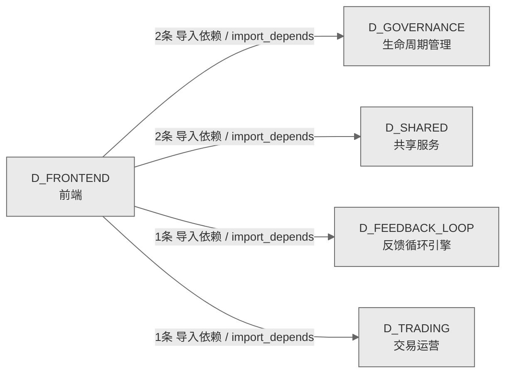

# 47_d_frontend / 前端 / Frontend

> **功能简介 / Overview**: 前端，负责用户界面展示、交互可视化和前端状态管理

> **文档作用 / Purpose**: 展示 前端（D_FRONTEND）功能域的模块清单、域内依赖关系、跨域依赖关系、架构分层视图，供架构审查和域治理参考。

> 本文档由 generate_domain_doc.py 从 depgraph (PostgreSQL) 自动生成
> 数据源: depgraph (PostgreSQL) nodes表 + edges表

## 域基本信息 / Domain Overview

| 字段 | 值 | Field | Value |
|------|------|-------|-------|
| 编号 | 47 | Number | 47 |
| 域ID | D_FRONTEND | Domain ID | D_FRONTEND |
| 域名称 | 前端 | Domain Name | Frontend |
| 层级 | L2 业务域层 | Layer | L2 Domain |
| 模块数 | 12 | Module Count | 12 |
| 域内依赖 | 18 | Internal Dependencies | 18 |
| 跨域入边 | 0 | Cross-domain Incoming | 0 |
| 跨域出边 | 6 | Cross-domain Outgoing | 6 |
| 设计态模块 | 0 | Design Modules | 0 |
| 生产态模块 | 12 | Production Modules | 12 |
| 容量 | 12/150 (正常) | Capacity | 12/150 (正常) |
| 描述 | 前端，负责用户界面展示、交互可视化和前端状态管理 | Description | 前端，负责用户界面展示、交互可视化和前端状态管理 |

## 模块分层清单 / Module Layered List

> 按 architecture_layer 分组的模块清单（共 12 个模块 / 12 modules）。

### L0 基础设施层 / Infrastructure Layer (12 modules)

| # | 模块路径 / Module Path | 模块名称 / Module Name (功能简介 / Description) | 成熟度 / Maturity | 蓝图 / Blueprint |
|:--:|---------|---------|:---:|:---:|
| 1 | scripts/tests/test_frontend_components.py | 5个前端组件综合验证脚本（TTL=task_bound，施工完... | 生产态 / production |  |
| 2 | src/zephyr/frontend/dashboard/app.py | ZephyrAlpha Dashboard · Streamlit 仪表盘（已弃... | 生产态 / production |  |
| 3 | src/zephyr/frontend/dashboard/app_panel.py | app_panel · Panel 仪表盘主应用入口（v3.1.0, #A... | 生产态 / production |  |
| 4 | src/zephyr/frontend/dashboard/components/backtest_perform... | backtest_performance · 掘金量化风格绩效分析可... | 生产态 / production |  |
| 5 | src/zephyr/frontend/dashboard/components/backtest_results.py | backtest_results · 回测结果可视化组件（v3.0.0 ... | 生产态 / production |  |
| 6 | src/zephyr/frontend/dashboard/components/chart_factory.py | chart_factory · 图表统一工厂（v3.0.0新增, #ARC... | 生产态 / production |  |
| 7 | src/zephyr/frontend/dashboard/components/fitness_function... | fitness_functions · Fitness Functions 仪表盘组... | 生产态 / production |  |
| 8 | src/zephyr/frontend/dashboard/components/order_book.py | order_book · 5档盘口实时展示组件（v3.0.0 Panel... | 生产态 / production |  |
| 9 | src/zephyr/frontend/dashboard/components/position_monitor.py | position_monitor · 实盘持仓监控组件（v3.0.0 Pa... | 生产态 / production |  |
| 10 | src/zephyr/frontend/dashboard/components/tick_replay.py | tick_replay · Tick 回放可视化组件（v3.0.0 Pane... | 生产态 / production |  |
| 11 | src/zephyr/frontend/dashboard/components/trade_panel.py | trade_panel · 实盘交易面板组件（v3.0.0 Panel+H... | 生产态 / production |  |
| 12 | src/zephyr/frontend/interface_base.py | D_FRONTEND — Human-AI Interface Layer Skeleton | 生产态 / production |  |

## 域内依赖图 / Internal Dependency Diagram

> 依赖图内嵌在本文档中，IDE 可直接渲染显示。参考 decision_index.md 设计，分三个视图：合并全景图、运营态子图、设计态子图（按 design_maturity 实际值拆分）。
>
> **图例说明 / Legend**：
> - **实线边框 = 运营态模块**（production，已上线运行）
> - **虚线边框 = 设计态模块**（design，蓝图阶段，代码未写）
> - **实线箭头 = 运营态依赖**（已生效的依赖关系）
> - **虚线箭头 = 非运营态依赖**（计划中/验证中的依赖关系）

### 合并全景图（全部模块，标签标注成熟度）

> 展示全部 12 个模块（生产态 12 + 设计态 0），标签标注成熟度。

### 运营态子图（仅 design_maturity=production 的模块和依赖）

> 仅展示已上线运行的模块（共 12 个，18 条域内依赖）。

```mermaid
%%{init: {'theme': 'base', 'themeVariables': {'primaryColor': '#eaeaea', 'primaryTextColor': '#333333', 'primaryBorderColor': '#666666', 'lineColor': '#666666', 'secondaryColor': '#eaeaea', 'tertiaryColor': '#eaeaea', 'fontSize': '14px'}}}%%
flowchart TD
    scripts_tests_test_frontend_components_py["(生产态 / production) 5个前端组件综合验证脚本（TTL=task_bound，施工完...<br/>文件: test_frontend_components.py"]
    src_zephyr_frontend_dashboard_app_py["(生产态 / production) ZephyrAlpha Dashboard · Streamlit 仪表盘（已弃...<br/>文件: app.py"]
    src_zephyr_frontend_dashboard_app_panel_py["(生产态 / production) app_panel · Panel 仪表盘主应用入口（v3.1.0, #A...<br/>文件: app_panel.py"]
    src_zephyr_frontend_interface_base_py["(生产态 / production) D_FRONTEND — Human-AI Interface Layer Skeleton<br/>文件: interface_base.py"]
    scripts_tests_test_frontend_components_py ~~~ src_zephyr_frontend_dashboard_app_py
    src_zephyr_frontend_dashboard_app_py ~~~ src_zephyr_frontend_dashboard_app_panel_py
    src_zephyr_frontend_dashboard_app_panel_py ~~~ src_zephyr_frontend_interface_base_py
    src_zephyr_frontend_dashboard_components_backtest_performance_py["(生产态 / production) backtest_performance · 掘金量化风格绩效分析可...<br/>文件: backtest_performance.py"]
    src_zephyr_frontend_dashboard_components_backtest_results_py["(生产态 / production) backtest_results · 回测结果可视化组件（v3.0.0 ...<br/>文件: backtest_results.py"]
    src_zephyr_frontend_dashboard_components_fitness_functions_py["(生产态 / production) fitness_functions · Fitness Functions 仪表盘组...<br/>文件: fitness_functions.py"]
    src_zephyr_frontend_dashboard_components_order_book_py["(生产态 / production) order_book · 5档盘口实时展示组件（v3.0.0 Panel...<br/>文件: order_book.py"]
    src_zephyr_frontend_dashboard_components_position_monitor_py["(生产态 / production) position_monitor · 实盘持仓监控组件（v3.0.0 Pa...<br/>文件: position_monitor.py"]
    src_zephyr_frontend_dashboard_components_tick_replay_py["(生产态 / production) tick_replay · Tick 回放可视化组件（v3.0.0 Pane...<br/>文件: tick_replay.py"]
    src_zephyr_frontend_dashboard_components_trade_panel_py["(生产态 / production) trade_panel · 实盘交易面板组件（v3.0.0 Panel+H...<br/>文件: trade_panel.py"]
    src_zephyr_frontend_dashboard_components_backtest_performance_py ~~~ src_zephyr_frontend_dashboard_components_backtest_results_py
    src_zephyr_frontend_dashboard_components_backtest_results_py ~~~ src_zephyr_frontend_dashboard_components_fitness_functions_py
    src_zephyr_frontend_dashboard_components_fitness_functions_py ~~~ src_zephyr_frontend_dashboard_components_order_book_py
    src_zephyr_frontend_dashboard_components_order_book_py ~~~ src_zephyr_frontend_dashboard_components_position_monitor_py
    src_zephyr_frontend_dashboard_components_position_monitor_py ~~~ src_zephyr_frontend_dashboard_components_tick_replay_py
    src_zephyr_frontend_dashboard_components_tick_replay_py ~~~ src_zephyr_frontend_dashboard_components_trade_panel_py
    src_zephyr_frontend_dashboard_components_chart_factory_py["(生产态 / production) chart_factory · 图表统一工厂（v3.0.0新增, #ARC...<br/>文件: chart_factory.py"]
    src_zephyr_frontend_dashboard_app_py -->|导入依赖 / import_depends| src_zephyr_frontend_dashboard_components_fitness_functions_py
    src_zephyr_frontend_dashboard_app_panel_py -->|导入依赖 / import_depends| src_zephyr_frontend_dashboard_components_backtest_results_py
    src_zephyr_frontend_dashboard_app_panel_py -->|导入依赖 / import_depends| src_zephyr_frontend_dashboard_components_backtest_performance_py
    src_zephyr_frontend_dashboard_app_panel_py -->|导入依赖 / import_depends| src_zephyr_frontend_dashboard_components_fitness_functions_py
    src_zephyr_frontend_dashboard_app_panel_py -->|导入依赖 / import_depends| src_zephyr_frontend_dashboard_components_order_book_py
    src_zephyr_frontend_dashboard_app_panel_py -->|导入依赖 / import_depends| src_zephyr_frontend_dashboard_components_position_monitor_py
    src_zephyr_frontend_dashboard_app_panel_py -->|导入依赖 / import_depends| src_zephyr_frontend_dashboard_components_trade_panel_py
    src_zephyr_frontend_dashboard_app_panel_py -->|导入依赖 / import_depends| src_zephyr_frontend_dashboard_components_tick_replay_py
    src_zephyr_frontend_dashboard_components_backtest_results_py -->|导入依赖 / import_depends| src_zephyr_frontend_dashboard_components_chart_factory_py
    src_zephyr_frontend_dashboard_components_order_book_py -->|导入依赖 / import_depends| src_zephyr_frontend_dashboard_components_chart_factory_py
    src_zephyr_frontend_dashboard_components_position_monitor_py -->|导入依赖 / import_depends| src_zephyr_frontend_dashboard_components_chart_factory_py
    src_zephyr_frontend_dashboard_components_trade_panel_py -->|导入依赖 / import_depends| src_zephyr_frontend_dashboard_components_chart_factory_py
    src_zephyr_frontend_dashboard_components_tick_replay_py -->|导入依赖 / import_depends| src_zephyr_frontend_dashboard_components_chart_factory_py
    scripts_tests_test_frontend_components_py -->|导入依赖 / import_depends| src_zephyr_frontend_dashboard_components_backtest_results_py
    scripts_tests_test_frontend_components_py -->|导入依赖 / import_depends| src_zephyr_frontend_dashboard_components_order_book_py
    scripts_tests_test_frontend_components_py -->|导入依赖 / import_depends| src_zephyr_frontend_dashboard_components_position_monitor_py
    scripts_tests_test_frontend_components_py -->|导入依赖 / import_depends| src_zephyr_frontend_dashboard_components_trade_panel_py
    scripts_tests_test_frontend_components_py -->|导入依赖 / import_depends| src_zephyr_frontend_dashboard_components_tick_replay_py
    D_FEEDBACK_LOOP["(生产态 / production) D_FEEDBACK_LOOP"]
    src_zephyr_frontend_dashboard_components_fitness_functions_py -->|导入依赖 / import_depends| D_FEEDBACK_LOOP
    D_GOVERNANCE["(生产态 / production) D_GOVERNANCE"]
    src_zephyr_frontend_dashboard_app_panel_py -->|导入依赖 / import_depends| D_GOVERNANCE
    D_SHARED["(生产态 / production) D_SHARED"]
    src_zephyr_frontend_dashboard_components_trade_panel_py -->|导入依赖 / import_depends| D_SHARED
    src_zephyr_frontend_dashboard_app_panel_py -->|导入依赖 / import_depends| D_GOVERNANCE
    src_zephyr_frontend_dashboard_components_chart_factory_py -->|导入依赖 / import_depends| D_SHARED
    D_TRADING["(生产态 / production) D_TRADING"]
    src_zephyr_frontend_dashboard_components_trade_panel_py -->|导入依赖 / import_depends| D_TRADING
    classDef production fill:#e8edf2,stroke:#0277bd,stroke-width:2px,color:#1a1a1a
    classDef design fill:#f0ebe3,stroke:#bf360c,stroke-width:2px,color:#1a1a1a,stroke-dasharray: 5 5
    classDef external_prod fill:#e8efe9,stroke:#1b5e20,stroke-width:1px,color:#1a1a1a
    classDef external_design fill:#efe5ea,stroke:#880e4f,stroke-width:1px,color:#1a1a1a,stroke-dasharray: 5 5
    class scripts_tests_test_frontend_components_py,src_zephyr_frontend_dashboard_app_py,src_zephyr_frontend_dashboard_app_panel_py,src_zephyr_frontend_dashboard_components_backtest_performance_py,src_zephyr_frontend_dashboard_components_backtest_results_py,src_zephyr_frontend_dashboard_components_chart_factory_py,src_zephyr_frontend_dashboard_components_fitness_functions_py,src_zephyr_frontend_dashboard_components_order_book_py,src_zephyr_frontend_dashboard_components_position_monitor_py,src_zephyr_frontend_dashboard_components_tick_replay_py,src_zephyr_frontend_dashboard_components_trade_panel_py,src_zephyr_frontend_interface_base_py production
    class D_FEEDBACK_LOOP,D_GOVERNANCE,D_SHARED,D_TRADING external_prod
```

### 设计态子图（仅 design_maturity=design 的模块和依赖）

> 仅展示蓝图阶段、代码未写的设计态模块（共 0 个，0 条域内依赖）。

> （无设计态模块 / No design modules）

## 跨域依赖 / Cross-domain Dependencies

### 本域依赖的其他域（出边）/ Depends On

| # | 本域模块 / Source Module | → | 外部域-目标模块 / Target Module | 依赖类型 / Type |
|:--:|---------|:--:|---------|---------|
| 1 | fitness_functions · Fitness Functions 仪表盘组... | → | D_FEEDBACK_LOOP 反馈循环引擎: fitness_functions.py | 导入依赖 / import_depends |
| 2 | app_panel · Panel 仪表盘主应用入口（v3.1.0, #A... | → | D_GOVERNANCE 生命周期管理: SQLite 元数据层 Schema DDL + 版本化迁移框架（T-... | 导入依赖 / import_depends |
| 3 | app_panel · Panel 仪表盘主应用入口（v3.1.0, #A... | → | D_GOVERNANCE 生命周期管理: TaskRepository — 任务登记表 CRUD + 状态机（T-1... | 导入依赖 / import_depends |
| 4 | chart_factory · 图表统一工厂（v3.0.0新增, #ARC... | → | D_SHARED 共享服务: serialization.py —— 统一序列化/反序列化基础设... | 导入依赖 / import_depends |
| 5 | trade_panel · 实盘交易面板组件（v3.0.0 Panel+H... | → | D_SHARED 共享服务: time_utils.py —— 时间/日期工具（Phase 9 新增 ... | 导入依赖 / import_depends |
| 6 | trade_panel · 实盘交易面板组件（v3.0.0 Panel+H... | → | D_TRADING 交易运营: Re-export wrapper: Order 真源在 zephyr.shared.c... | 导入依赖 / import_depends |

### 依赖本域的其他域（入边）/ Depended By

无跨域入边依赖 / No cross-domain incoming dependencies

### 跨域依赖图 / Cross-domain Dependency Diagram

> 本域与 4 个外部域直接连接（出边 6 条 + 入边 0 条 = 6 条）。只显示直接连接的域，不展开具体节点。

## 说明 / Notes

- **数据源 / Data Source**: `depgraph (PostgreSQL)` 的 `nodes`、`edges`、`domains` 表
- **生成器 / Generator**: `generate_domain_doc.py`（G2+G10 合并）
- **维护方式 / Maintenance**: 自动生成，全景图更新时刷新
- **文件名规则 / File Naming**: `{编号:02d}_{域ID小写}.md`，如 `16_d_trading.md`
- **图例说明 / Legend**: `[production]`=已上线 / `[design]`=设计中 / `[unknown]`=未知
