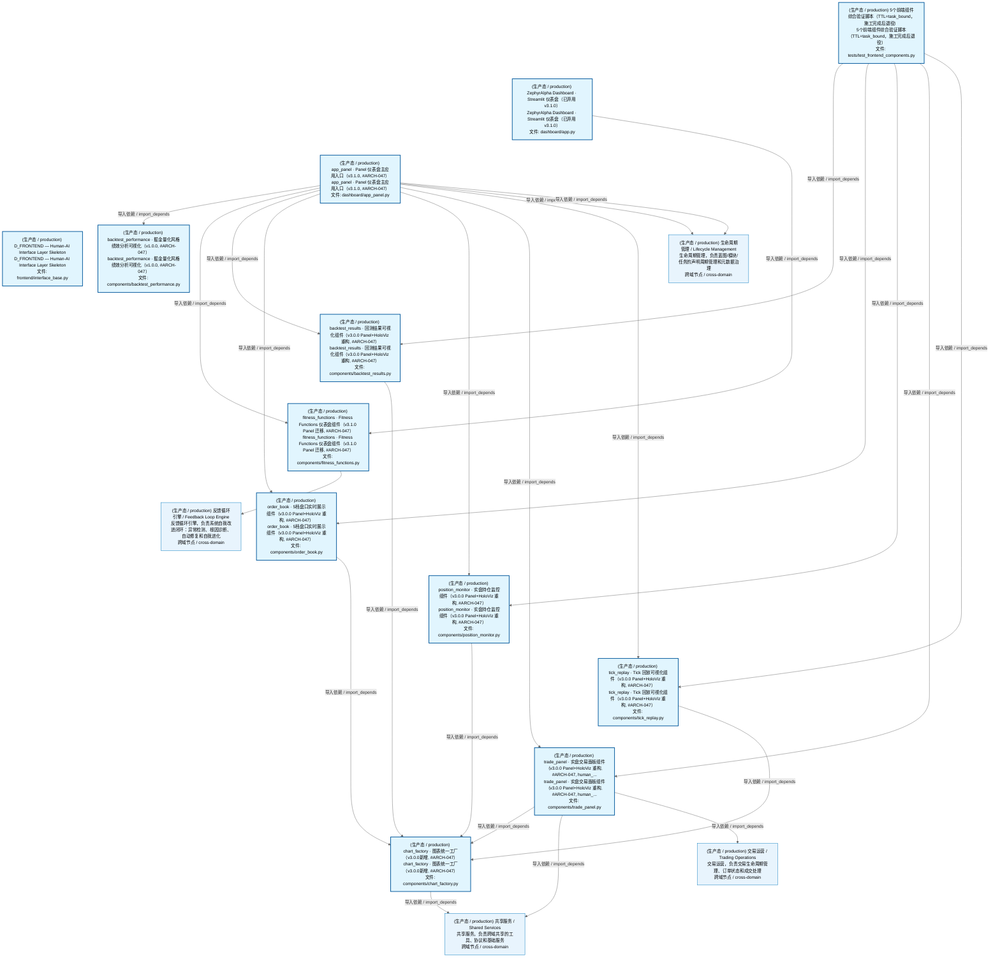
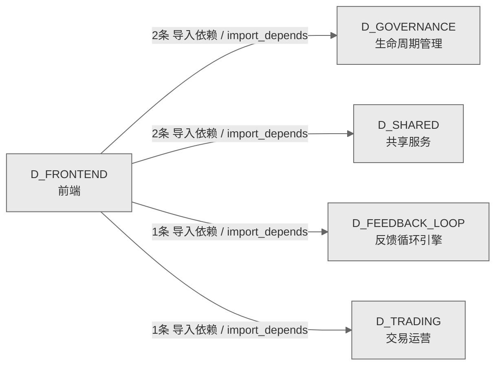

# 47_d_frontend / 前端域 / Frontend

> **功能简介 / Overview**: 前端，负责用户界面展示、交互可视化和前端状态管理

> **文档作用 / Purpose**: 展示 前端（D_FRONTEND）功能域的域内依赖关系、跨域依赖关系，模块信息（成熟度/中英文名/大白话/文件路径）内嵌于 Mermaid 节点，供架构审查和域治理参考。

> 本文档由 generate_domain_doc.py 从 depgraph (PostgreSQL) 自动生成
> 数据源: depgraph (PostgreSQL) nodes表 + edges表

> **[可缩放 HTML 版 / Zoomable HTML](http://localhost:8765/docs/02_enterprise_architecture/02_domain_architecture_docs/_zoomable_html/47_d_frontend.html)** — Ctrl+滚轮缩放 ｜ 双击重置 ｜ Ctrl+Shift+D 切换拖动/选择模式

## 域基本信息 / Domain Overview

| 字段 | 值 | Field | Value |
|------|------|-------|-------|
| 编号 | 47 | Number | 47 |
| 域ID | D_FRONTEND | Domain ID | D_FRONTEND |
| 域名称 | 前端 | Domain Name | Frontend |
| 层级 | L2 业务域层 | Layer | L2 Domain |
| 模块数 | 12 | Module Count | 12 |
| 域内依赖 | 18 | Internal Dependencies | 18 |
| 跨域入边 | 0 | Cross-domain Incoming | 0 |
| 跨域出边 | 6 | Cross-domain Outgoing | 6 |
| 设计态模块 | 0 | Design Modules | 0 |
| 生产态模块 | 12 | Production Modules | 12 |
| 容量 | 12/150 (正常) | Capacity | 12/150 (正常) |
| 描述 | 前端，负责用户界面展示、交互可视化和前端状态管理 | Description | 前端，负责用户界面展示、交互可视化和前端状态管理 |

## 域内依赖图 / Internal Dependency Diagram

> 依赖图内嵌在本文档中，IDE 可直接渲染；网页版可 Ctrl+滚轮缩放 + 拖动平移查看细节。全景图用颜色区分运营态/设计态，不再分页/拆子图。
>
> **图例说明 / Legend**：
> - 🟦 **蓝色 = 运营态模块**（production，已上线运行）
> - 🟧 **橙色虚线 = 设计态模块**（design，蓝图阶段，代码未写）
> - **实线箭头 = 运营态依赖**（已生效的依赖关系）
> - **虚线箭头 = 非运营态依赖**（计划中/验证中的依赖关系）

### 全景依赖图（全部模块，颜色区分运营态/设计态）

> 展示全部 12 个模块（生产态 12 + 设计态 0），节点含成熟度+中英文名+大白话+文件路径。

## 跨域依赖 / Cross-domain Dependencies

### 本域依赖的其他域（出边）/ Depends On

| # | 本域模块 / Source Module | → | 外部域-目标模块 / Target Module | 依赖类型 / Type |
|:--:|---------|:--:|---------|---------|
| 1 | fitness_functions · Fitness Functions 仪表盘组件（v3.1.0... | → | D_FEEDBACK_LOOP 反馈循环引擎: feedback_loop/fitness_functions.py | 导入依赖 / import_depends |
| 2 | app_panel · Panel 仪表盘主应用入口（v3.1.0, #ARCH-047） ... | → | D_GOVERNANCE 生命周期管理: SQLite 元数据层 Schema DDL + 版本化迁移框架（T-1-02 + SH-... | 导入依赖 / import_depends |
| 3 | app_panel · Panel 仪表盘主应用入口（v3.1.0, #ARCH-047） ... | → | D_GOVERNANCE 生命周期管理: TaskRepository — 任务登记表 CRUD + 状态机（T-1-04） (per... | 导入依赖 / import_depends |
| 4 | chart_factory · 图表统一工厂（v3.0.0新增, #ARCH-047） (c... | → | D_SHARED 共享服务: serialization.py —— 统一序列化/反序列化基础设施（Phase ... | 导入依赖 / import_depends |
| 5 | trade_panel · 实盘交易面板组件（v3.0.0 Panel+HoloViz 重... | → | D_SHARED 共享服务: time_utils.py —— 时间/日期工具（Phase 9 新增 | 盲点 B19... | 导入依赖 / import_depends |
| 6 | trade_panel · 实盘交易面板组件（v3.0.0 Panel+HoloViz 重... | → | D_TRADING 交易运营: Re-export wrapper: Order 真源在 zephyr.shared.contracts.o... | 导入依赖 / import_depends |

### 依赖本域的其他域（入边）/ Depended By

无跨域入边依赖 / No cross-domain incoming dependencies

### 跨域依赖图 / Cross-domain Dependency Diagram

> 本域与 4 个外部域直接连接（出边 6 条 + 入边 0 条 = 6 条）。只显示直接连接的域，不展开具体节点。

## 说明 / Notes

- **数据源 / Data Source**: `depgraph (PostgreSQL)` 的 `nodes`、`edges`、`domains` 表
- **生成器 / Generator**: `generate_domain_doc.py`（G2+G10 合并）
- **维护方式 / Maintenance**: 自动生成，全景图更新时刷新
- **文件名规则 / File Naming**: `{编号:02d}_{域ID小写}.md`，如 `16_d_trading.md`
- **图例说明 / Legend**: `[production]`=已上线 / `[design]`=设计中 / `[unknown]`=未知
