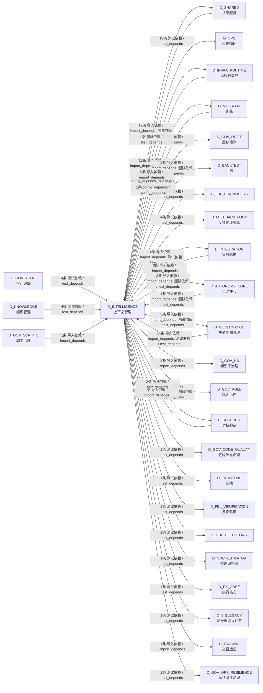

# 47_d_intelligence / context_management / 上下文管理 / Context Management

> **功能简介 / Overview**: 上下文管理，负责 AI 上下文窗口管理、记忆检索和上下文压缩

> **文档作用 / Purpose**: 展示 上下文管理（D_INTELLIGENCE）功能域的模块清单、域内依赖关系、跨域依赖关系、架构分层视图，供架构审查和域治理参考。

> 本文档由 generate_domain_doc.py 从 depgraph (PostgreSQL) 自动生成
> 最后更新: 2026-07-17 00:08:21
> 数据源: depgraph (PostgreSQL) nodes表 + edges表

## 域基本信息 / Domain Overview

| 字段 | 值 | Field | Value |
|------|------|-------|-------|
| 编号 | 47 | Number | 47 |
| 域ID | D_INTELLIGENCE | Domain ID | D_INTELLIGENCE |
| 域名称 | 上下文管理 | Domain Name | Context Management |
| 层级 | L2 业务域层 | Layer | L2 Domain |
| 模块数 | 109 | Module Count | 109 |
| 域内依赖 | 55 | Internal Dependencies | 55 |
| 跨域入边 | 38 | Cross-domain Incoming | 38 |
| 跨域出边 | 95 | Cross-domain Outgoing | 95 |
| 设计态模块 | 0 | Design Modules | 0 |
| 原型态模块 | 88 | Prototype Modules | 88 |
| 生产态模块 | 21 | Production Modules | 21 |
| 容量 | 21/150 (正常) | Capacity | 21/150 (正常) |
| 描述 | 上下文预算管理(context_budget/token_budget) | Description | 上下文预算管理(context_budget/token_budget) |

## 模块分层清单 / Module Layered List

> 按 architecture_layer 分组的模块清单（共 109 个模块 / 109 modules）。

### L2 领域层 / Domain Layer (109 modules)

| # | 模块路径 / Module Path | 模块名称 / Module Name (功能简介 / Description) | 成熟度 / Maturity | 蓝图 / Blueprint |
|:--:|---------|---------|:---:|:---:|
| 1 | scripts/calibrate_model_diff.py | 模型能力差异校准脚本（P1-3 治本）。 | 生产态 / production | [MOD-INF-034](../../03_modules/_cross_layer/model_profiler/blueprint.md) |
| 2 | scripts/quick_profile.py | 模型快速能力画像脚本 (P2 三级模式 Quick 入口)。 | 原型态 / prototype | [MOD-INF-034](../../03_modules/_cross_layer/model_profiler/blueprint.md) |
| 3 | src/zephyr/intelligence/__init__.py | Intelligence Domain | 原型态 / prototype | [MOD-INF-036](../../03_modules/_cross_layer/model_capability_exam/blueprint.md) |
| 4 | src/zephyr/intelligence/_extensions/__init__.py | __init__.py | 原型态 / prototype |  |
| 5 | src/zephyr/intelligence/api/__init__.py | __init__.py | 原型态 / prototype |  |
| 6 | src/zephyr/intelligence/core/__init__.py | __init__.py | 原型态 / prototype |  |
| 7 | src/zephyr/intelligence/infrastructure/__init__.py | __init__.py | 原型态 / prototype |  |
| 8 | src/zephyr/intelligence/model_drift_detector.py | ModelDriftDetector — LLM 模型行为漂移检测。 | 生产态 / production | [MOD-INF-021](../../03_modules/_domain_autonomy_core/rollback_system/blueprint.md) |
| 9 | src/zephyr/intelligence/model_evaluation/activate.py | G4 Activate 门禁 — 人工激活（T-2-13-D） | 生产态 / production | [MOD-INF-036](../../03_modules/_cross_layer/model_capability_exam/blueprint.md) |
| 10 | src/zephyr/intelligence/model_evaluation/experiment_track... | D_RESEARCH — Research & Innovation Concrete Im... | 原型态 / prototype | [MOD-INF-036](../../03_modules/_cross_layer/model_capability_exam/blueprint.md) |
| 11 | src/zephyr/intelligence/model_evaluation/implementations/... | Intelligence — Model Evaluation Concrete Imple... | 原型态 / prototype | [MOD-INF-036](../../03_modules/_cross_layer/model_capability_exam/blueprint.md) |
| 12 | src/zephyr/intelligence/model_evaluation/implementations/... | D_ML_TRAIN — Default Inference Engine | 生产态 / production | [MOD-INF-036](../../03_modules/_cross_layer/model_capability_exam/blueprint.md) |
| 13 | src/zephyr/intelligence/model_evaluation/inference_base.py | inference_base.py | 生产态 / production | [MOD-INF-036](../../03_modules/_cross_layer/model_capability_exam/blueprint.md) |
| 14 | src/zephyr/intelligence/model_evaluation/notebook_integra... | D_RESEARCH Research & Innovation | 原型态 / prototype | [MOD-INF-036](../../03_modules/_cross_layer/model_capability_exam/blueprint.md) |
| 15 | src/zephyr/intelligence/model_evaluation/reranker.py | Cross-Encoder 重排序层 — BGE-reranker-v2-m3（T... | 生产态 / production | [MOD-INF-036](../../03_modules/_cross_layer/model_capability_exam/blueprint.md) |
| 16 | src/zephyr/intelligence/model_evaluation/sync_engine.py | KB->VMS 同步引擎 — sync_to_vms() 生产者 | 原型态 / prototype | [MOD-INF-036](../../03_modules/_cross_layer/model_capability_exam/blueprint.md) |
| 17 | src/zephyr/intelligence/model_evaluation/target_lib/__ini... | __init__.py | 原型态 / prototype |  |
| 18 | src/zephyr/intelligence/model_evaluation/unified_memory_a... | UnifiedMemoryAPI — RI-02 统一记忆 API（M2 跨模... | 生产态 / production | [MOD-INF-036](../../03_modules/_cross_layer/model_capability_exam/blueprint.md) |
| 19 | src/zephyr/intelligence/model_profiling/__init__.py | Model Profiling — 本地 + 远程模型性能基准测试 | 原型态 / prototype | [MOD-INF-034](../../03_modules/_cross_layer/model_profiler/blueprint.md) |
| 20 | src/zephyr/intelligence/model_profiling/benchmark_suite.py | BenchmarkSuite — 多维度模型性能测试用例集 | 原型态 / prototype | [MOD-INF-034](../../03_modules/_cross_layer/model_profiler/blueprint.md) |
| 21 | src/zephyr/intelligence/model_profiling/capability_passpo... | CapabilityPassport --- AI 模型能力护照 | 生产态 / production | [MOD-INF-034](../../03_modules/_cross_layer/model_profiler/blueprint.md) |
| 22 | src/zephyr/intelligence/model_profiling/case_assembler.py | 真实多文件注入装配器（Phase 3 极限深度）。 | 原型态 / prototype | [MOD-INF-034](../../03_modules/_cross_layer/model_profiler/blueprint.md) |
| 23 | src/zephyr/intelligence/model_profiling/cli.py | model-profiler.cli — 模型性能检测命令行入口 | 生产态 / production | [MOD-INF-034](../../03_modules/_cross_layer/model_profiler/blueprint.md) |
| 24 | src/zephyr/intelligence/model_profiling/deepseek_v4_chat.py | DeepSeekV4Chat --- DeepSeek V4 系列模型 API 客户端 | 生产态 / production | [MOD-INF-034](../../03_modules/_cross_layer/model_profiler/blueprint.md) |
| 25 | src/zephyr/intelligence/model_profiling/exam_executor.py | ExamExecutor --- 执行式代码评测（HumanEval pass... | 原型态 / prototype | [MOD-INF-034](../../03_modules/_cross_layer/model_profiler/blueprint.md) |
| 26 | src/zephyr/intelligence/model_profiling/exam_judge.py | ExamJudge --- LLM-as-judge 评分器 | 生产态 / production | [MOD-INF-034](../../03_modules/_cross_layer/model_profiler/blueprint.md) |
| 27 | src/zephyr/intelligence/model_profiling/exam_orchestrator.py | ExamOrchestrator --- 五轴入职考试主控 | 生产态 / production | [MOD-INF-034](../../03_modules/_cross_layer/model_profiler/blueprint.md) |
| 28 | src/zephyr/intelligence/model_profiling/exam_rubric.py | ExamRubric --- 奥赛题结构化多维清单评分（v3.0.5... | 原型态 / prototype | [MOD-INF-034](../../03_modules/_cross_layer/model_profiler/blueprint.md) |
| 29 | src/zephyr/intelligence/model_profiling/exam_test_cases.py | ExamTestCases --- v3.0.5 扩展考试题库（96 题 / ... | 生产态 / production | [MOD-INF-034](../../03_modules/_cross_layer/model_profiler/blueprint.md) |
| 30 | src/zephyr/intelligence/model_profiling/job_matcher.py | JobMatcher --- 模型岗位匹配器 | 生产态 / production | [MOD-INF-034](../../03_modules/_cross_layer/model_profiler/blueprint.md) |
| 31 | src/zephyr/intelligence/model_profiling/model_discovery.py | ModelDiscovery — 枚举所有本地 Ollama 模型 + 远... | 生产态 / production | [MOD-INF-034](../../03_modules/_cross_layer/model_profiler/blueprint.md) |
| 32 | src/zephyr/intelligence/model_profiling/pipeline_routing/... | Model Profiler — Pipeline Routing variant | 原型态 / prototype | [MOD-INF-034](../../03_modules/_cross_layer/model_profiler/blueprint.md) |
| 33 | src/zephyr/intelligence/model_profiling/pipeline_routing/... | BenchmarkSuite — 多维度模型性能测试用例集 | 生产态 / production | [MOD-INF-034](../../03_modules/_cross_layer/model_profiler/blueprint.md) |
| 34 | src/zephyr/intelligence/model_profiling/pipeline_routing/... | model-profiler.cli — 模型性能检测命令行入口 | 原型态 / prototype | [MOD-INF-034](../../03_modules/_cross_layer/model_profiler/blueprint.md) |
| 35 | src/zephyr/intelligence/model_profiling/pipeline_routing/... | ModelProfiler — 核心性能分析引擎 | 生产态 / production | [MOD-INF-034](../../03_modules/_cross_layer/model_profiler/blueprint.md) |
| 36 | src/zephyr/intelligence/model_profiling/pipeline_routing/... | Results Writer — 持久化 benchmark 结果，支持历... | 生产态 / production | [MOD-INF-034](../../03_modules/_cross_layer/model_profiler/blueprint.md) |
| 37 | src/zephyr/intelligence/model_profiling/pipeline_routing/... | ModelTaskMatrix — 任务×模型性能学习引擎 | 生产态 / production | [MOD-INF-034](../../03_modules/_cross_layer/model_profiler/blueprint.md) |
| 38 | src/zephyr/intelligence/model_profiling/profiler.py | ModelProfiler — 核心性能分析引擎 | 原型态 / prototype | [MOD-INF-034](../../03_modules/_cross_layer/model_profiler/blueprint.md) |
| 39 | src/zephyr/intelligence/model_profiling/provider_data.py | provider_data.py | 生产态 / production | [MOD-INF-034](../../03_modules/_cross_layer/model_profiler/blueprint.md) |
| 40 | src/zephyr/intelligence/model_profiling/results_writer.py | Results Writer — 持久化 benchmark 结果，支持历... | 生产态 / production | [MOD-INF-034](../../03_modules/_cross_layer/model_profiler/blueprint.md) |
| 41 | src/zephyr/intelligence/model_profiling/task_model_learne... | ModelTaskMatrix — 任务×模型性能学习引擎 | 原型态 / prototype | [MOD-INF-034](../../03_modules/_cross_layer/model_profiler/blueprint.md) |
| 42 | src/zephyr/intelligence/models/__init__.py | __init__.py | 原型态 / prototype |  |
| 43 | src/zephyr/intelligence/services/__init__.py | __init__.py | 原型态 / prototype |  |
| 44 | src/zephyr/ml_train/__init__.py | D_ML_TRAIN — ML Training Domain | 原型态 / prototype | [MOD-L11-001](../../03_modules/_domain_machine_learning_train/blueprint.md) |
| 45 | src/zephyr/ml_train/_extensions/__init__.py | __init__.py | 原型态 / prototype |  |
| 46 | src/zephyr/ml_train/api/__init__.py | __init__.py | 原型态 / prototype |  |
| 47 | src/zephyr/ml_train/core/__init__.py | __init__.py | 原型态 / prototype |  |
| 48 | src/zephyr/ml_train/implementations/__init__.py | D_ML_TRAIN — ML Training Concrete Implementations | 原型态 / prototype | [MOD-L11-001](../../03_modules/_domain_machine_learning_train/blueprint.md) |
| 49 | src/zephyr/ml_train/infrastructure/__init__.py | __init__.py | 原型态 / prototype |  |
| 50 | src/zephyr/ml_train/models/__init__.py | __init__.py | 原型态 / prototype |  |
| 51 | src/zephyr/ml_train/services/__init__.py | __init__.py | 原型态 / prototype |  |
| 52 | src/zephyr/research/__init__.py | MOD-L09-001 Research Innovation Core. | 原型态 / prototype |  |
| 53 | tests/ai/test_ai_audit_logger.py | test_ai_audit_logger.py | 原型态 / prototype | [MOD-INF-035](../../03_modules/_cross_layer/auto_runtime_core/blueprint.md) |
| 54 | tests/ai/test_ai_capability_guard.py | test_ai_capability_guard.py | 原型态 / prototype | [MOD-GATE_ENGINE](../../03_modules/_cross_layer/gate_engine/blueprint.md) |
| 55 | tests/ai/test_ai_comment_veracity.py | test_ai_comment_veracity.py | 原型态 / prototype | [MOD-FEEDBACK_LOOP](../../03_modules/_cross_layer/feedback_loop/blueprint.md) |
| 56 | tests/ai/test_ai_construction_detectors.py | test_ai_construction_detectors.py | 原型态 / prototype | [MOD-INF-033](../../03_modules/_cross_layer/behavioral_auditor/blueprint.md) |
| 57 | tests/ai/test_ai_context_injector.py | test_ai_context_injector.py | 原型态 / prototype | [MOD-INF-033](../../03_modules/_cross_layer/behavioral_auditor/blueprint.md) |
| 58 | tests/ai/test_l08_human_ai_interface.py | test_l08_human_ai_interface.py | 原型态 / prototype | [MOD-L08-001](../../03_modules/_domain_frontend/blueprint.md) |
| 59 | tests/budget/test_budget_enforcer_rbac_bridge.py | test_budget_enforcer_rbac_bridge.py | 原型态 / prototype | [MOD-INF-024](../../03_modules/_domain_autonomy_perm/budget_enforcer/blueprint.md) |
| 60 | tests/budget/test_budget_engine_root.py | test_budget_engine_root.py | 原型态 / prototype | [MOD-INF-024](../../03_modules/_domain_autonomy_perm/budget_enforcer/blueprint.md) |
| 61 | tests/budget/test_budget_event_driven.py | DM-201503: F4 事件驱动预算执行——超限/IPI/螺旋... | 原型态 / prototype | [MOD-INF-024](../../03_modules/_domain_autonomy_perm/budget_enforcer/blueprint.md) |
| 62 | tests/budget/test_budget_forecaster.py | test_budget_forecaster.py | 原型态 / prototype | [MOD-INF-019](../../03_modules/_domain_autonomy_core/agent_spec/blueprint.md) |
| 63 | tests/budget/test_budget_handler.py | test_budget_handler.py | 原型态 / prototype | [MOD-INF-022](../../03_modules/_domain_autonomy_perm/escalation_protocol/blueprint.md) |
| 64 | tests/budget/test_budget_lifecycle_e2e.py | DM-201505: F4 自动化集成测试——完整生命周期端到端。 | 原型态 / prototype | [MOD-INF-024](../../03_modules/_domain_autonomy_perm/budget_enforcer/blueprint.md) |
| 65 | tests/budget/test_budget_models.py | test_budget_models.py | 原型态 / prototype | [MOD-INF-024](../../03_modules/_domain_autonomy_perm/budget_enforcer/blueprint.md) |
| 66 | tests/budget/test_budget_profile_manager.py | test_budget_profile_manager.py | 原型态 / prototype | [MOD-INF-024](../../03_modules/_domain_autonomy_perm/budget_enforcer/blueprint.md) |
| 67 | tests/budget/test_budget_shutdown.py | DM-201504: F4 BudgetEngine自动关闭——shutdown... | 原型态 / prototype | [MOD-INF-024](../../03_modules/_domain_autonomy_perm/budget_enforcer/blueprint.md) |
| 68 | tests/budget/test_budget_telemetry_bridge.py | test_budget_telemetry_bridge.py | 原型态 / prototype | [MOD-INF-015](../../03_modules/_domain_infrastructure_operations/system_telemetry/blueprint.md) |
| 69 | tests/budget/test_budget_tracker.py | test_budget_tracker.py | 原型态 / prototype | [MOD-INF-024](../../03_modules/_domain_autonomy_perm/budget_enforcer/blueprint.md) |
| 70 | tests/budget/test_error_budget.py | test_error_budget.py | 原型态 / prototype | [MOD-FEEDBACK_LOOP](../../03_modules/_cross_layer/feedback_loop/blueprint.md) |
| 71 | tests/decision/test_decision_auditor.py | test_decision_auditor.py | 原型态 / prototype | [MOD-INF-017](../../03_modules/_domain_governance/code_dedup_engine/blueprint.md) |
| 72 | tests/decision/test_decision_engine.py | test_decision_engine.py | 原型态 / prototype | [MOD-FEEDBACK_LOOP](../../03_modules/_cross_layer/feedback_loop/blueprint.md) |
| 73 | tests/decision/test_decision_explainer_root.py | test_decision_explainer_root.py | 原型态 / prototype | [MOD-INF-018](../../03_modules/_domain_autonomy_core/agent_role_based_access_control/blueprint.md) |
| 74 | tests/decision/test_decision_provenance.py | test_decision_provenance.py | 原型态 / prototype | [MOD-FEEDBACK_LOOP](../../03_modules/_cross_layer/feedback_loop/blueprint.md) |
| 75 | tests/decision/test_decision_registry.py | test_decision_registry.py | 原型态 / prototype | [MOD-INF-018](../../03_modules/_domain_autonomy_core/agent_role_based_access_control/blueprint.md) |
| 76 | tests/model/test_benchmark_suite.py | test_benchmark_suite.py | 原型态 / prototype | [MOD-INF-034](../../03_modules/_cross_layer/model_profiler/blueprint.md) |
| 77 | tests/model/test_calibrate_model_diff.py | calibrate_model_diff.py 单元测试（P1-3 配套, 零... | 原型态 / prototype | [MOD-INF-034](../../03_modules/_cross_layer/model_profiler/blueprint.md) |
| 78 | tests/model/test_cli.py | test_cli.py | 原型态 / prototype | [MOD-INF-034](../../03_modules/_cross_layer/model_profiler/blueprint.md) |
| 79 | tests/model/test_deepseek_v4_chat.py | test_deepseek_v4_chat.py | 原型态 / prototype | [MOD-INF-034](../../03_modules/_cross_layer/model_profiler/blueprint.md) |
| 80 | tests/model/test_exam_orchestrator.py | test_exam_orchestrator.py | 原型态 / prototype | [MOD-INF-034](../../03_modules/_cross_layer/model_profiler/blueprint.md) |
| 81 | tests/model/test_exam_test_cases.py | test_exam_test_cases.py | 原型态 / prototype | [MOD-INF-034](../../03_modules/_cross_layer/model_profiler/blueprint.md) |
| 82 | tests/model/test_job_matcher.py | test_job_matcher.py | 原型态 / prototype | [MOD-INF-034](../../03_modules/_cross_layer/model_profiler/blueprint.md) |
| 83 | tests/model/test_l09_research_innovation.py | test_l09_research_innovation.py | 原型态 / prototype | [MOD-L09-001](../../03_modules/_domain_research/blueprint.md) |
| 84 | tests/model/test_l11_ml_platform.py | test_l11_ml_platform.py | 原型态 / prototype | [MOD-L11-001](../../03_modules/_domain_machine_learning_train/blueprint.md) |
| 85 | tests/model/test_local_model.py | test_local_model.py | 原型态 / prototype | [MOD-INF-042](../../03_modules/_domain_integration/blueprint.md) |
| 86 | tests/model/test_model_capability_exam.py | test_model_capability_exam.py | 原型态 / prototype | [MOD-INF-036](../../03_modules/_cross_layer/model_capability_exam/blueprint.md) |
| 87 | tests/model/test_model_discovery.py | test_model_discovery.py | 原型态 / prototype | [MOD-INF-034](../../03_modules/_cross_layer/model_profiler/blueprint.md) |
| 88 | tests/model/test_model_drift_detector.py | test_model_drift_detector.py | 原型态 / prototype | [MOD-INF-021](../../03_modules/_domain_autonomy_core/rollback_system/blueprint.md) |
| 89 | tests/model/test_model_drift_monitor.py | test_model_drift_monitor.py | 原型态 / prototype | [MOD-INF-023](../../03_modules/_domain_governance/drift_detector/blueprint.md) |
| 90 | tests/model/test_model_health.py | test_model_health.py | 原型态 / prototype | [MOD-FEEDBACK_LOOP](../../03_modules/_cross_layer/feedback_loop/blueprint.md) |
| 91 | tests/model/test_model_rotation.py | test_model_rotation.py | 原型态 / prototype | [MOD-FEEDBACK_LOOP](../../03_modules/_cross_layer/feedback_loop/blueprint.md) |
| 92 | tests/model/test_model_rotation_v2.py | test_model_rotation_v2.py | 原型态 / prototype | [MOD-FEEDBACK_LOOP](../../03_modules/_cross_layer/feedback_loop/blueprint.md) |
| 93 | tests/model/test_model_router.py | test_model_router.py | 原型态 / prototype | [MOD-INF-009](../../03_modules/_cross_layer/pipeline/blueprint.md) |
| 94 | tests/model/test_model_version_detector.py | test_model_version_detector.py | 原型态 / prototype | [MOD-INF-021](../../03_modules/_domain_autonomy_core/rollback_system/blueprint.md) |
| 95 | tests/model/test_model_version_semantic_drift.py | test_model_version_semantic_drift.py | 原型态 / prototype | [MOD-FEEDBACK_LOOP](../../03_modules/_cross_layer/feedback_loop/blueprint.md) |
| 96 | tests/model/test_profiler.py | test_profiler.py | 原型态 / prototype | [MOD-INF-034](../../03_modules/_cross_layer/model_profiler/blueprint.md) |
| 97 | tests/model/test_provider_data.py | test_provider_data.py | 原型态 / prototype | [MOD-INF-034](../../03_modules/_cross_layer/model_profiler/blueprint.md) |
| 98 | tests/model/test_results_writer.py | test_results_writer.py | 原型态 / prototype | [MOD-INF-034](../../03_modules/_cross_layer/model_profiler/blueprint.md) |
| 99 | tests/pipeline/conftest.py | Pipeline 测试全局配置——阻止单元测试命中真实 L... | 原型态 / prototype | [MOD-INF-009](../../03_modules/_cross_layer/pipeline/blueprint.md) |
| 100 | tests/pipeline/test_alpha_signal_pipeline.py | test_alpha_signal_pipeline.py | 原型态 / prototype | [MOD-INF-002](../../03_modules/_domain_infrastructure_runtime/runtime_integration/blueprint.md) |
| 101 | tests/pipeline/test_integration_test_pipeline.py | test_integration_test_pipeline.py | 原型态 / prototype | [MOD-FEEDBACK_LOOP](../../03_modules/_cross_layer/feedback_loop/blueprint.md) |
| 102 | tests/pipeline/test_pipeline_agent_bridge.py | test_pipeline_agent_bridge.py | 原型态 / prototype | [MOD-INF-009](../../03_modules/_cross_layer/pipeline/blueprint.md) |
| 103 | tests/pipeline/test_pipeline_bridge.py | test_pipeline_bridge.py | 原型态 / prototype | [MOD-INF-019](../../03_modules/_domain_autonomy_core/agent_spec/blueprint.md) |
| 104 | tests/pipeline/test_pipeline_cost_tracker.py | test_pipeline_cost_tracker.py | 原型态 / prototype | [MOD-INF-009](../../03_modules/_cross_layer/pipeline/blueprint.md) |
| 105 | tests/pipeline/test_pipeline_lock.py | test_pipeline_lock.py | 原型态 / prototype | [MOD-INF-009](../../03_modules/_cross_layer/pipeline/blueprint.md) |
| 106 | tests/pipeline/test_pipeline_models.py | test_pipeline_models.py | 原型态 / prototype | [MOD-INF-009](../../03_modules/_cross_layer/pipeline/blueprint.md) |
| 107 | tests/pipeline/test_pipeline_orchestrator_auto.py | DM-202010: PipelineOrchestrator 自动启动/周期运... | 原型态 / prototype | [MOD-INF-034](../../03_modules/_cross_layer/model_profiler/blueprint.md) |
| 108 | tests/pipeline/test_pipeline_orchestrator_root.py | test_pipeline_orchestrator_root.py | 原型态 / prototype | [MOD-INF-019](../../03_modules/_domain_autonomy_core/agent_spec/blueprint.md) |
| 109 | tests/pipeline/test_pipeline_roadmap.py | test_pipeline_roadmap.py | 原型态 / prototype | [MOD-INF-009](../../03_modules/_cross_layer/pipeline/blueprint.md) |

## 域内依赖图 / Internal Dependency Diagram

> 依赖图内嵌在本文档中，IDE 可直接渲染显示。参考 decision_index.md 设计，分四个视图：合并全景图、运营态子图、设计态子图、原型态子图（按 design_maturity 实际值拆分）。
>
> **图例说明 / Legend**：
> - **实线边框 = 运营态模块**（production，已上线运行）
> - **虚线边框 = 设计态模块**（design，蓝图阶段，代码未写）
> - **虚线边框 = 原型态模块**（prototype，代码已写，验证中未稳定上线）
> - **实线箭头 = 运营态依赖**（已生效的依赖关系）
> - **虚线箭头 = 非运营态依赖**（计划中/验证中的依赖关系）

### 合并全景图（全部模块，标签标注成熟度）

> 展示全部 109 个模块（生产态 21 + 设计态 0 + 原型态 88），标签标注成熟度。

#### 第 1 页 / 共 4 页

```mermaid
graph TD
    subgraph D_INTELLIGENCE["D_INTELLIGENCE 上下文管理"]
        scripts_calibrate_model_diff_py["(生产态 / production) 模型能力差异校准脚本（P1-3 治本）。<br/>文件: calibrate_model_diff.py"]
        scripts_quick_profile_py["(原型态 / prototype) 模型快速能力画像脚本 (P2 三级模式 Quick 入口)。<br/>文件: quick_profile.py"]
        src_zephyr_intelligence_init_py["(原型态 / prototype) Intelligence Domain<br/>文件: __init__.py"]
        src_zephyr_intelligence_extensions_init_py["(原型态 / prototype) __init__.py"]
        src_zephyr_intelligence_api_init_py["(原型态 / prototype) __init__.py"]
        src_zephyr_intelligence_core_init_py["(原型态 / prototype) __init__.py"]
        src_zephyr_intelligence_infrastructure_init_py["(原型态 / prototype) __init__.py"]
        src_zephyr_intelligence_model_drift_detector_py["(生产态 / production) ModelDriftDetector — LLM 模型行为漂移检测。<br/>文件: model_drift_detector.py"]
        src_zephyr_intelligence_model_evaluation_activate_py["(生产态 / production) G4 Activate 门禁 — 人工激活（T-2-13-D）<br/>文件: activate.py"]
        src_zephyr_intelligence_model_evaluation_experiment_tracker_init_py["(原型态 / prototype) D_RESEARCH — Research & Innovation Concrete Im...<br/>文件: __init__.py"]
        src_zephyr_intelligence_model_evaluation_implementations_init_py["(原型态 / prototype) Intelligence — Model Evaluation Concrete Imple...<br/>文件: __init__.py"]
        src_zephyr_intelligence_model_evaluation_implementations_default_inference_engine_py["(生产态 / production) D_ML_TRAIN — Default Inference Engine<br/>文件: default_inference_engine.py"]
        src_zephyr_intelligence_model_evaluation_inference_base_py["(生产态 / production) inference_base.py"]
        src_zephyr_intelligence_model_evaluation_notebook_integration_init_py["(原型态 / prototype) D_RESEARCH Research & Innovation<br/>文件: __init__.py"]
        src_zephyr_intelligence_model_evaluation_reranker_py["(生产态 / production) Cross-Encoder 重排序层 — BGE-reranker-v2-m3（T...<br/>文件: reranker.py"]
        src_zephyr_intelligence_model_evaluation_sync_engine_py["(原型态 / prototype) KB->VMS 同步引擎 — sync_to_vms() 生产者<br/>文件: sync_engine.py"]
        src_zephyr_intelligence_model_evaluation_target_lib_init_py["(原型态 / prototype) __init__.py"]
        src_zephyr_intelligence_model_evaluation_unified_memory_api_py["(生产态 / production) UnifiedMemoryAPI — RI-02 统一记忆 API（M2 跨模...<br/>文件: unified_memory_api.py"]
        src_zephyr_intelligence_model_profiling_init_py["(原型态 / prototype) Model Profiling — 本地 + 远程模型性能基准测试<br/>文件: __init__.py"]
        src_zephyr_intelligence_model_profiling_benchmark_suite_py["(原型态 / prototype) BenchmarkSuite — 多维度模型性能测试用例集<br/>文件: benchmark_suite.py"]
        src_zephyr_intelligence_model_profiling_capability_passport_py["(生产态 / production) CapabilityPassport --- AI 模型能力护照<br/>文件: capability_passport.py"]
        src_zephyr_intelligence_model_profiling_case_assembler_py["(原型态 / prototype) 真实多文件注入装配器（Phase 3 极限深度）。<br/>文件: case_assembler.py"]
        src_zephyr_intelligence_model_profiling_cli_py["(生产态 / production) model-profiler.cli — 模型性能检测命令行入口<br/>文件: cli.py"]
        src_zephyr_intelligence_model_profiling_deepseek_v4_chat_py["(生产态 / production) DeepSeekV4Chat --- DeepSeek V4 系列模型 API 客户端<br/>文件: deepseek_v4_chat.py"]
        src_zephyr_intelligence_model_profiling_exam_executor_py["(原型态 / prototype) ExamExecutor --- 执行式代码评测（HumanEval pass...<br/>文件: exam_executor.py"]
        src_zephyr_intelligence_model_profiling_exam_judge_py["(生产态 / production) ExamJudge --- LLM-as-judge 评分器<br/>文件: exam_judge.py"]
        src_zephyr_intelligence_model_profiling_exam_orchestrator_py["(生产态 / production) ExamOrchestrator --- 五轴入职考试主控<br/>文件: exam_orchestrator.py"]
        src_zephyr_intelligence_model_profiling_exam_rubric_py["(原型态 / prototype) ExamRubric --- 奥赛题结构化多维清单评分（v3.0.5...<br/>文件: exam_rubric.py"]
        src_zephyr_intelligence_model_profiling_exam_test_cases_py["(生产态 / production) ExamTestCases --- v3.0.5 扩展考试题库（96 题 / ...<br/>文件: exam_test_cases.py"]
        src_zephyr_intelligence_model_profiling_job_matcher_py["(生产态 / production) JobMatcher --- 模型岗位匹配器<br/>文件: job_matcher.py"]
    end
    src_zephyr_intelligence_init_py -.->|config_depends / config_depends| src_zephyr_intelligence_model_drift_detector_py
    src_zephyr_intelligence_model_evaluation_implementations_init_py -.->|导入依赖 / import_depends| src_zephyr_intelligence_model_evaluation_implementations_default_inference_engine_py
    src_zephyr_intelligence_model_profiling_cli_py -.->|导入依赖 / import_depends| src_zephyr_intelligence_model_profiling_init_py
    src_zephyr_intelligence_model_profiling_exam_test_cases_py -.->|导入依赖 / import_depends| src_zephyr_intelligence_model_profiling_case_assembler_py
    src_zephyr_intelligence_model_profiling_job_matcher_py -->|导入依赖 / import_depends| src_zephyr_intelligence_model_profiling_capability_passport_py
    src_zephyr_intelligence_model_profiling_exam_orchestrator_py -->|导入依赖 / import_depends| src_zephyr_intelligence_model_profiling_capability_passport_py
    src_zephyr_intelligence_model_profiling_exam_orchestrator_py -.->|导入依赖 / import_depends| src_zephyr_intelligence_model_profiling_exam_executor_py
    src_zephyr_intelligence_model_profiling_exam_orchestrator_py -->|导入依赖 / import_depends| src_zephyr_intelligence_model_profiling_exam_judge_py
    src_zephyr_intelligence_model_profiling_exam_orchestrator_py -.->|导入依赖 / import_depends| src_zephyr_intelligence_model_profiling_exam_rubric_py
    src_zephyr_intelligence_model_profiling_exam_orchestrator_py -->|导入依赖 / import_depends| src_zephyr_intelligence_model_profiling_exam_test_cases_py
    src_zephyr_intelligence_model_profiling_exam_orchestrator_py -->|导入依赖 / import_depends| src_zephyr_intelligence_model_profiling_job_matcher_py
    src_zephyr_intelligence_model_profiling_init_py -.->|导入依赖 / import_depends| src_zephyr_intelligence_model_profiling_benchmark_suite_py
    scripts_calibrate_model_diff_py -->|导入依赖 / import_depends| src_zephyr_intelligence_model_profiling_capability_passport_py
    scripts_quick_profile_py -.->|导入依赖 / import_depends| src_zephyr_intelligence_model_profiling_capability_passport_py
    scripts_quick_profile_py -.->|导入依赖 / import_depends| src_zephyr_intelligence_model_profiling_job_matcher_py
    scripts_quick_profile_py -.->|导入依赖 / import_depends| src_zephyr_intelligence_model_profiling_exam_orchestrator_py
    D_INTEGRATION["(生产态 / production) D_INTEGRATION"]
    src_zephyr_intelligence_model_evaluation_sync_engine_py -.->|导入依赖 / import_depends| D_INTEGRATION
    D_GOVERNANCE["(生产态 / production) D_GOVERNANCE"]
    src_zephyr_intelligence_model_evaluation_sync_engine_py -.->|导入依赖 / import_depends| D_GOVERNANCE
    D_AUTONOMY_CORE["(生产态 / production) D_AUTONOMY_CORE"]
    src_zephyr_intelligence_model_evaluation_sync_engine_py -.->|导入依赖 / import_depends| D_AUTONOMY_CORE
    D_BACKTEST["(生产态 / production) D_BACKTEST"]
    src_zephyr_intelligence_model_evaluation_experiment_tracker_init_py -.->|导入依赖 / import_depends| D_BACKTEST
    src_zephyr_intelligence_model_evaluation_implementations_init_py -.->|导入依赖 / import_depends| D_BACKTEST
    src_zephyr_intelligence_model_evaluation_notebook_integration_init_py -.->|导入依赖 / import_depends| D_BACKTEST
    D_SHARED["(生产态 / production) D_SHARED"]
    src_zephyr_intelligence_model_profiling_case_assembler_py -.->|导入依赖 / import_depends| D_SHARED
    scripts_quick_profile_py -.->|导入依赖 / import_depends| D_INTEGRATION
    src_zephyr_intelligence_model_drift_detector_py -->|导入依赖 / import_depends| D_SHARED
    D_ML_TRAIN["(原型态 / prototype) D_ML_TRAIN"]
    src_zephyr_intelligence_model_evaluation_inference_base_py -.->|导入依赖 / import_depends| D_ML_TRAIN
    src_zephyr_intelligence_model_evaluation_inference_base_py -.->|导入依赖 / import_depends| D_ML_TRAIN
    D_GOV_KB["(生产态 / production) D_GOV_KB"]
    src_zephyr_intelligence_model_evaluation_activate_py -->|导入依赖 / import_depends| D_GOV_KB
    D_GOV_RULE["(生产态 / production) D_GOV_RULE"]
    src_zephyr_intelligence_model_evaluation_activate_py -->|导入依赖 / import_depends| D_GOV_RULE
    src_zephyr_intelligence_model_evaluation_activate_py -->|导入依赖 / import_depends| D_GOV_RULE
    src_zephyr_intelligence_model_evaluation_unified_memory_api_py -->|导入依赖 / import_depends| D_GOV_KB
    D_GOVERNANCE -.->|测试依赖 / test_depends| src_zephyr_intelligence_model_profiling_capability_passport_py
    D_INFRA_RUNTIME["(生产态 / production) D_INFRA_RUNTIME"]
    D_INFRA_RUNTIME -->|导入依赖 / import_depends| src_zephyr_intelligence_model_profiling_capability_passport_py
    D_GOVERNANCE -.->|导入依赖 / import_depends| src_zephyr_intelligence_model_profiling_capability_passport_py
    D_GOVERNANCE -.->|导入依赖 / import_depends| src_zephyr_intelligence_model_profiling_exam_rubric_py
    D_GOVERNANCE -.->|导入依赖 / import_depends| src_zephyr_intelligence_model_profiling_exam_test_cases_py
    D_INFRA_RUNTIME -.->|导入依赖 / import_depends| src_zephyr_intelligence_model_profiling_init_py
    D_GOVERNANCE -.->|导入依赖 / import_depends| src_zephyr_intelligence_model_profiling_exam_orchestrator_py
    D_KNOWLEDGE["(原型态 / prototype) D_KNOWLEDGE"]
    D_KNOWLEDGE -.->|测试依赖 / test_depends| src_zephyr_intelligence_model_evaluation_activate_py
    D_KNOWLEDGE -.->|测试依赖 / test_depends| src_zephyr_intelligence_model_evaluation_unified_memory_api_py
    D_SHARED -.->|测试依赖 / test_depends| src_zephyr_intelligence_model_evaluation_inference_base_py
    D_AUTONOMY_CORE -->|导入依赖 / import_depends| src_zephyr_intelligence_model_evaluation_reranker_py
    D_GOV_SCRIPTS["(原型态 / prototype) D_GOV_SCRIPTS"]
    D_GOV_SCRIPTS -.->|导入依赖 / import_depends| src_zephyr_intelligence_model_profiling_exam_test_cases_py
    D_SECURITY["(原型态 / prototype) D_SECURITY"]
    D_SECURITY -.->|导入依赖 / import_depends| src_zephyr_intelligence_model_evaluation_unified_memory_api_py
    D_KNOWLEDGE -.->|测试依赖 / test_depends| src_zephyr_intelligence_model_evaluation_reranker_py
    D_INTEGRATION -->|导入依赖 / import_depends| src_zephyr_intelligence_model_evaluation_reranker_py
    classDef production fill:#e1f5fe,stroke:#01579b,stroke-width:2px,color:#000
    classDef design fill:#fff3e0,stroke:#e65100,stroke-width:2px,color:#000,stroke-dasharray: 5 5
    classDef external_prod fill:#e8f5e9,stroke:#1b5e20,stroke-width:1px,color:#000
    classDef external_design fill:#fce4ec,stroke:#880e4f,stroke-width:1px,color:#000,stroke-dasharray: 5 5
    class scripts_calibrate_model_diff_py,src_zephyr_intelligence_model_drift_detector_py,src_zephyr_intelligence_model_evaluation_activate_py,src_zephyr_intelligence_model_evaluation_implementations_default_inference_engine_py,src_zephyr_intelligence_model_evaluation_inference_base_py,src_zephyr_intelligence_model_evaluation_reranker_py,src_zephyr_intelligence_model_evaluation_unified_memory_api_py,src_zephyr_intelligence_model_profiling_capability_passport_py,src_zephyr_intelligence_model_profiling_cli_py,src_zephyr_intelligence_model_profiling_deepseek_v4_chat_py,src_zephyr_intelligence_model_profiling_exam_judge_py,src_zephyr_intelligence_model_profiling_exam_orchestrator_py,src_zephyr_intelligence_model_profiling_exam_test_cases_py,src_zephyr_intelligence_model_profiling_job_matcher_py production
    class scripts_quick_profile_py,src_zephyr_intelligence_init_py,src_zephyr_intelligence_extensions_init_py,src_zephyr_intelligence_api_init_py,src_zephyr_intelligence_core_init_py,src_zephyr_intelligence_infrastructure_init_py,src_zephyr_intelligence_model_evaluation_experiment_tracker_init_py,src_zephyr_intelligence_model_evaluation_implementations_init_py,src_zephyr_intelligence_model_evaluation_notebook_integration_init_py,src_zephyr_intelligence_model_evaluation_sync_engine_py,src_zephyr_intelligence_model_evaluation_target_lib_init_py,src_zephyr_intelligence_model_profiling_init_py,src_zephyr_intelligence_model_profiling_benchmark_suite_py,src_zephyr_intelligence_model_profiling_case_assembler_py,src_zephyr_intelligence_model_profiling_exam_executor_py,src_zephyr_intelligence_model_profiling_exam_rubric_py design
    class D_INTEGRATION,D_GOVERNANCE,D_AUTONOMY_CORE,D_BACKTEST,D_SHARED,D_GOV_KB,D_GOV_RULE,D_INFRA_RUNTIME external_prod
    class D_ML_TRAIN,D_KNOWLEDGE,D_GOV_SCRIPTS,D_SECURITY external_design
```



#### 第 2 页 / 共 4 页

```mermaid
graph TD
    subgraph D_INTELLIGENCE["D_INTELLIGENCE 上下文管理"]
        src_zephyr_intelligence_model_profiling_model_discovery_py["(生产态 / production) ModelDiscovery — 枚举所有本地 Ollama 模型 + 远...<br/>文件: model_discovery.py"]
        src_zephyr_intelligence_model_profiling_pipeline_routing_init_py["(原型态 / prototype) Model Profiler — Pipeline Routing variant<br/>文件: __init__.py"]
        src_zephyr_intelligence_model_profiling_pipeline_routing_benchmark_suite_py["(生产态 / production) BenchmarkSuite — 多维度模型性能测试用例集<br/>文件: benchmark_suite.py"]
        src_zephyr_intelligence_model_profiling_pipeline_routing_cli_py["(原型态 / prototype) model-profiler.cli — 模型性能检测命令行入口<br/>文件: cli.py"]
        src_zephyr_intelligence_model_profiling_pipeline_routing_profiler_py["(生产态 / production) ModelProfiler — 核心性能分析引擎<br/>文件: profiler.py"]
        src_zephyr_intelligence_model_profiling_pipeline_routing_results_writer_py["(生产态 / production) Results Writer — 持久化 benchmark 结果，支持历...<br/>文件: results_writer.py"]
        src_zephyr_intelligence_model_profiling_pipeline_routing_task_model_learner_py["(生产态 / production) ModelTaskMatrix — 任务×模型性能学习引擎<br/>文件: task_model_learner.py"]
        src_zephyr_intelligence_model_profiling_profiler_py["(原型态 / prototype) ModelProfiler — 核心性能分析引擎<br/>文件: profiler.py"]
        src_zephyr_intelligence_model_profiling_provider_data_py["(生产态 / production) provider_data.py"]
        src_zephyr_intelligence_model_profiling_results_writer_py["(生产态 / production) Results Writer — 持久化 benchmark 结果，支持历...<br/>文件: results_writer.py"]
        src_zephyr_intelligence_model_profiling_task_model_learner_py["(原型态 / prototype) ModelTaskMatrix — 任务×模型性能学习引擎<br/>文件: task_model_learner.py"]
        src_zephyr_intelligence_models_init_py["(原型态 / prototype) __init__.py"]
        src_zephyr_intelligence_services_init_py["(原型态 / prototype) __init__.py"]
        src_zephyr_ml_train_init_py["(原型态 / prototype) D_ML_TRAIN — ML Training Domain<br/>文件: __init__.py"]
        src_zephyr_ml_train_extensions_init_py["(原型态 / prototype) __init__.py"]
        src_zephyr_ml_train_api_init_py["(原型态 / prototype) __init__.py"]
        src_zephyr_ml_train_core_init_py["(原型态 / prototype) __init__.py"]
        src_zephyr_ml_train_implementations_init_py["(原型态 / prototype) D_ML_TRAIN — ML Training Concrete Implementations<br/>文件: __init__.py"]
        src_zephyr_ml_train_infrastructure_init_py["(原型态 / prototype) __init__.py"]
        src_zephyr_ml_train_models_init_py["(原型态 / prototype) __init__.py"]
        src_zephyr_ml_train_services_init_py["(原型态 / prototype) __init__.py"]
        src_zephyr_research_init_py["(原型态 / prototype) MOD-L09-001 Research Innovation Core.<br/>文件: __init__.py"]
        tests_ai_test_ai_audit_logger_py["(原型态 / prototype) test_ai_audit_logger.py"]
        tests_ai_test_ai_capability_guard_py["(原型态 / prototype) test_ai_capability_guard.py"]
        tests_ai_test_ai_comment_veracity_py["(原型态 / prototype) test_ai_comment_veracity.py"]
        tests_ai_test_ai_construction_detectors_py["(原型态 / prototype) test_ai_construction_detectors.py"]
        tests_ai_test_ai_context_injector_py["(原型态 / prototype) test_ai_context_injector.py"]
        tests_ai_test_l08_human_ai_interface_py["(原型态 / prototype) test_l08_human_ai_interface.py"]
        tests_budget_test_budget_enforcer_rbac_bridge_py["(原型态 / prototype) test_budget_enforcer_rbac_bridge.py"]
        tests_budget_test_budget_engine_root_py["(原型态 / prototype) test_budget_engine_root.py"]
    end
    src_zephyr_intelligence_model_profiling_model_discovery_py -->|导入依赖 / import_depends| src_zephyr_intelligence_model_profiling_provider_data_py
    src_zephyr_intelligence_model_profiling_results_writer_py -.->|导入依赖 / import_depends| src_zephyr_intelligence_model_profiling_profiler_py
    src_zephyr_intelligence_model_profiling_profiler_py -.->|导入依赖 / import_depends| src_zephyr_intelligence_model_profiling_model_discovery_py
    src_zephyr_intelligence_model_profiling_pipeline_routing_results_writer_py -->|导入依赖 / import_depends| src_zephyr_intelligence_model_profiling_pipeline_routing_profiler_py
    src_zephyr_intelligence_model_profiling_pipeline_routing_cli_py -.->|导入依赖 / import_depends| src_zephyr_intelligence_model_profiling_model_discovery_py
    src_zephyr_intelligence_model_profiling_pipeline_routing_cli_py -.->|导入依赖 / import_depends| src_zephyr_intelligence_model_profiling_pipeline_routing_results_writer_py
    src_zephyr_intelligence_model_profiling_pipeline_routing_cli_py -.->|导入依赖 / import_depends| src_zephyr_intelligence_model_profiling_pipeline_routing_profiler_py
    src_zephyr_intelligence_model_profiling_pipeline_routing_profiler_py -->|导入依赖 / import_depends| src_zephyr_intelligence_model_profiling_model_discovery_py
    src_zephyr_intelligence_model_profiling_pipeline_routing_profiler_py -->|导入依赖 / import_depends| src_zephyr_intelligence_model_profiling_pipeline_routing_benchmark_suite_py
    src_zephyr_intelligence_model_profiling_pipeline_routing_init_py -.->|导入依赖 / import_depends| src_zephyr_intelligence_model_profiling_model_discovery_py
    src_zephyr_intelligence_model_profiling_pipeline_routing_init_py -.->|导入依赖 / import_depends| src_zephyr_intelligence_model_profiling_pipeline_routing_benchmark_suite_py
    src_zephyr_intelligence_model_profiling_pipeline_routing_init_py -.->|导入依赖 / import_depends| src_zephyr_intelligence_model_profiling_pipeline_routing_task_model_learner_py
    src_zephyr_intelligence_model_profiling_pipeline_routing_init_py -.->|导入依赖 / import_depends| src_zephyr_intelligence_model_profiling_pipeline_routing_cli_py
    src_zephyr_intelligence_model_profiling_pipeline_routing_init_py -.->|导入依赖 / import_depends| src_zephyr_intelligence_model_profiling_pipeline_routing_profiler_py
    D_INFRA_RUNTIME["(生产态 / production) D_INFRA_RUNTIME"]
    tests_ai_test_ai_audit_logger_py -.->|测试依赖 / test_depends| D_INFRA_RUNTIME
    D_SHARED["(生产态 / production) D_SHARED"]
    src_zephyr_intelligence_model_profiling_pipeline_routing_profiler_py -->|导入依赖 / import_depends| D_SHARED
    src_zephyr_intelligence_model_profiling_profiler_py -.->|导入依赖 / import_depends| D_SHARED
    src_zephyr_intelligence_model_profiling_profiler_py -.->|导入依赖 / import_depends| D_SHARED
    D_GOV_DRIFT["(生产态 / production) D_GOV_DRIFT"]
    tests_ai_test_ai_construction_detectors_py -.->|测试依赖 / test_depends| D_GOV_DRIFT
    src_zephyr_intelligence_model_profiling_results_writer_py -->|导入依赖 / import_depends| D_SHARED
    D_OPS["(生产态 / production) D_OPS"]
    tests_budget_test_budget_engine_root_py -.->|测试依赖 / test_depends| D_OPS
    D_ML_TRAIN["(原型态 / prototype) D_ML_TRAIN"]
    src_zephyr_ml_train_implementations_init_py -.->|导入依赖 / import_depends| D_ML_TRAIN
    D_FBL_VERIFICATION["(生产态 / production) D_FBL_VERIFICATION"]
    tests_ai_test_ai_comment_veracity_py -.->|测试依赖 / test_depends| D_FBL_VERIFICATION
    D_FRONTEND["(生产态 / production) D_FRONTEND"]
    tests_ai_test_l08_human_ai_interface_py -.->|测试依赖 / test_depends| D_FRONTEND
    tests_ai_test_ai_context_injector_py -.->|测试依赖 / test_depends| D_GOV_DRIFT
    src_zephyr_intelligence_model_profiling_pipeline_routing_task_model_learner_py -->|导入依赖 / import_depends| D_INFRA_RUNTIME
    D_GOV_RULE["(生产态 / production) D_GOV_RULE"]
    tests_ai_test_ai_capability_guard_py -.->|测试依赖 / test_depends| D_GOV_RULE
    tests_ai_test_ai_capability_guard_py -.->|测试依赖 / test_depends| D_SHARED
    src_zephyr_intelligence_model_profiling_model_discovery_py -.->|导入依赖 / import_depends| D_SHARED
    D_GOVERNANCE["(生产态 / production) D_GOVERNANCE"]
    D_GOVERNANCE -->|导入依赖 / import_depends| src_zephyr_intelligence_model_profiling_results_writer_py
    D_GOVERNANCE -->|导入依赖 / import_depends| src_zephyr_intelligence_model_profiling_provider_data_py
    D_INTEGRATION["(生产态 / production) D_INTEGRATION"]
    D_INTEGRATION -->|导入依赖 / import_depends| src_zephyr_intelligence_model_profiling_pipeline_routing_profiler_py
    D_INTEGRATION -->|导入依赖 / import_depends| src_zephyr_intelligence_model_profiling_pipeline_routing_results_writer_py
    D_AUTONOMY_CORE["(原型态 / prototype) D_AUTONOMY_CORE"]
    D_AUTONOMY_CORE -.->|测试依赖 / test_depends| src_zephyr_intelligence_model_profiling_pipeline_routing_task_model_learner_py
    D_INFRA_RUNTIME -.->|导入依赖 / import_depends| src_zephyr_intelligence_model_profiling_task_model_learner_py
    D_INFRA_RUNTIME -->|导入依赖 / import_depends| src_zephyr_intelligence_model_profiling_results_writer_py
    D_GOV_AUDIT["(原型态 / prototype) D_GOV_AUDIT"]
    D_GOV_AUDIT -.->|测试依赖 / test_depends| src_zephyr_intelligence_model_profiling_results_writer_py
    classDef production fill:#e1f5fe,stroke:#01579b,stroke-width:2px,color:#000
    classDef design fill:#fff3e0,stroke:#e65100,stroke-width:2px,color:#000,stroke-dasharray: 5 5
    classDef external_prod fill:#e8f5e9,stroke:#1b5e20,stroke-width:1px,color:#000
    classDef external_design fill:#fce4ec,stroke:#880e4f,stroke-width:1px,color:#000,stroke-dasharray: 5 5
    class src_zephyr_intelligence_model_profiling_model_discovery_py,src_zephyr_intelligence_model_profiling_pipeline_routing_benchmark_suite_py,src_zephyr_intelligence_model_profiling_pipeline_routing_profiler_py,src_zephyr_intelligence_model_profiling_pipeline_routing_results_writer_py,src_zephyr_intelligence_model_profiling_pipeline_routing_task_model_learner_py,src_zephyr_intelligence_model_profiling_provider_data_py,src_zephyr_intelligence_model_profiling_results_writer_py production
    class src_zephyr_intelligence_model_profiling_pipeline_routing_init_py,src_zephyr_intelligence_model_profiling_pipeline_routing_cli_py,src_zephyr_intelligence_model_profiling_profiler_py,src_zephyr_intelligence_model_profiling_task_model_learner_py,src_zephyr_intelligence_models_init_py,src_zephyr_intelligence_services_init_py,src_zephyr_ml_train_init_py,src_zephyr_ml_train_extensions_init_py,src_zephyr_ml_train_api_init_py,src_zephyr_ml_train_core_init_py,src_zephyr_ml_train_implementations_init_py,src_zephyr_ml_train_infrastructure_init_py,src_zephyr_ml_train_models_init_py,src_zephyr_ml_train_services_init_py,src_zephyr_research_init_py,tests_ai_test_ai_audit_logger_py,tests_ai_test_ai_capability_guard_py,tests_ai_test_ai_comment_veracity_py,tests_ai_test_ai_construction_detectors_py,tests_ai_test_ai_context_injector_py,tests_ai_test_l08_human_ai_interface_py,tests_budget_test_budget_enforcer_rbac_bridge_py,tests_budget_test_budget_engine_root_py design
    class D_INFRA_RUNTIME,D_SHARED,D_GOV_DRIFT,D_OPS,D_FBL_VERIFICATION,D_FRONTEND,D_GOV_RULE,D_GOVERNANCE,D_INTEGRATION external_prod
    class D_ML_TRAIN,D_AUTONOMY_CORE,D_GOV_AUDIT external_design
```



#### 第 3 页 / 共 4 页


#### 第 4 页 / 共 4 页

```mermaid
graph TD
    subgraph D_INTELLIGENCE["D_INTELLIGENCE 上下文管理"]
        tests_model_test_model_rotation_py["(原型态 / prototype) test_model_rotation.py"]
        tests_model_test_model_rotation_v2_py["(原型态 / prototype) test_model_rotation_v2.py"]
        tests_model_test_model_router_py["(原型态 / prototype) test_model_router.py"]
        tests_model_test_model_version_detector_py["(原型态 / prototype) test_model_version_detector.py"]
        tests_model_test_model_version_semantic_drift_py["(原型态 / prototype) test_model_version_semantic_drift.py"]
        tests_model_test_profiler_py["(原型态 / prototype) test_profiler.py"]
        tests_model_test_provider_data_py["(原型态 / prototype) test_provider_data.py"]
        tests_model_test_results_writer_py["(原型态 / prototype) test_results_writer.py"]
        tests_pipeline_conftest_py["(原型态 / prototype) Pipeline 测试全局配置——阻止单元测试命中真实 L...<br/>文件: conftest.py"]
        tests_pipeline_test_alpha_signal_pipeline_py["(原型态 / prototype) test_alpha_signal_pipeline.py"]
        tests_pipeline_test_integration_test_pipeline_py["(原型态 / prototype) test_integration_test_pipeline.py"]
        tests_pipeline_test_pipeline_agent_bridge_py["(原型态 / prototype) test_pipeline_agent_bridge.py"]
        tests_pipeline_test_pipeline_bridge_py["(原型态 / prototype) test_pipeline_bridge.py"]
        tests_pipeline_test_pipeline_cost_tracker_py["(原型态 / prototype) test_pipeline_cost_tracker.py"]
        tests_pipeline_test_pipeline_lock_py["(原型态 / prototype) test_pipeline_lock.py"]
        tests_pipeline_test_pipeline_models_py["(原型态 / prototype) test_pipeline_models.py"]
        tests_pipeline_test_pipeline_orchestrator_auto_py["(原型态 / prototype) DM-202010: PipelineOrchestrator 自动启动/周期运...<br/>文件: test_pipeline_orchestrator_auto.py"]
        tests_pipeline_test_pipeline_orchestrator_root_py["(原型态 / prototype) test_pipeline_orchestrator_root.py"]
        tests_pipeline_test_pipeline_roadmap_py["(原型态 / prototype) test_pipeline_roadmap.py"]
    end
    D_AUTONOMY_CORE["(生产态 / production) D_AUTONOMY_CORE"]
    tests_pipeline_test_pipeline_bridge_py -.->|测试依赖 / test_depends| D_AUTONOMY_CORE
    D_FEEDBACK_LOOP["(生产态 / production) D_FEEDBACK_LOOP"]
    tests_pipeline_test_integration_test_pipeline_py -.->|测试依赖 / test_depends| D_FEEDBACK_LOOP
    D_INFRA_RUNTIME["(生产态 / production) D_INFRA_RUNTIME"]
    tests_pipeline_test_pipeline_cost_tracker_py -.->|测试依赖 / test_depends| D_INFRA_RUNTIME
    tests_pipeline_test_pipeline_cost_tracker_py -.->|测试依赖 / test_depends| D_INFRA_RUNTIME
    D_GOVERNANCE["(生产态 / production) D_GOVERNANCE"]
    tests_model_test_model_version_detector_py -.->|测试依赖 / test_depends| D_GOVERNANCE
    D_INTEGRATION["(生产态 / production) D_INTEGRATION"]
    tests_pipeline_test_pipeline_orchestrator_root_py -.->|测试依赖 / test_depends| D_INTEGRATION
    D_FBL_DIAGNOSERS["(生产态 / production) D_FBL_DIAGNOSERS"]
    tests_model_test_model_rotation_v2_py -.->|测试依赖 / test_depends| D_FBL_DIAGNOSERS
    tests_model_test_model_version_semantic_drift_py -.->|测试依赖 / test_depends| D_FBL_DIAGNOSERS
    tests_pipeline_test_pipeline_orchestrator_auto_py -.->|测试依赖 / test_depends| D_INFRA_RUNTIME
    tests_pipeline_test_pipeline_orchestrator_auto_py -.->|测试依赖 / test_depends| D_INTEGRATION
    tests_model_test_model_rotation_py -.->|测试依赖 / test_depends| D_FBL_DIAGNOSERS
    tests_pipeline_test_pipeline_roadmap_py -.->|测试依赖 / test_depends| D_INFRA_RUNTIME
    tests_pipeline_test_pipeline_models_py -.->|测试依赖 / test_depends| D_INFRA_RUNTIME
    D_SIGLEGACY["(生产态 / production) D_SIGLEGACY"]
    tests_pipeline_test_alpha_signal_pipeline_py -.->|测试依赖 / test_depends| D_SIGLEGACY
    tests_pipeline_test_pipeline_bridge_py -.->|测试依赖 / test_depends| D_AUTONOMY_CORE
    classDef production fill:#e1f5fe,stroke:#01579b,stroke-width:2px,color:#000
    classDef design fill:#fff3e0,stroke:#e65100,stroke-width:2px,color:#000,stroke-dasharray: 5 5
    classDef external_prod fill:#e8f5e9,stroke:#1b5e20,stroke-width:1px,color:#000
    classDef external_design fill:#fce4ec,stroke:#880e4f,stroke-width:1px,color:#000,stroke-dasharray: 5 5
    class tests_model_test_model_rotation_py,tests_model_test_model_rotation_v2_py,tests_model_test_model_router_py,tests_model_test_model_version_detector_py,tests_model_test_model_version_semantic_drift_py,tests_model_test_profiler_py,tests_model_test_provider_data_py,tests_model_test_results_writer_py,tests_pipeline_conftest_py,tests_pipeline_test_alpha_signal_pipeline_py,tests_pipeline_test_integration_test_pipeline_py,tests_pipeline_test_pipeline_agent_bridge_py,tests_pipeline_test_pipeline_bridge_py,tests_pipeline_test_pipeline_cost_tracker_py,tests_pipeline_test_pipeline_lock_py,tests_pipeline_test_pipeline_models_py,tests_pipeline_test_pipeline_orchestrator_auto_py,tests_pipeline_test_pipeline_orchestrator_root_py,tests_pipeline_test_pipeline_roadmap_py design
    class D_AUTONOMY_CORE,D_FEEDBACK_LOOP,D_INFRA_RUNTIME,D_GOVERNANCE,D_INTEGRATION,D_FBL_DIAGNOSERS,D_SIGLEGACY external_prod
```



### 运营态子图（仅 design_maturity=production 的模块和依赖）

> 仅展示已上线运行的模块（共 21 个，12 条域内依赖）。

```mermaid
graph TD
    subgraph D_INTELLIGENCE["D_INTELLIGENCE 上下文管理"]
        scripts_calibrate_model_diff_py["(生产态 / production) 模型能力差异校准脚本（P1-3 治本）。<br/>文件: calibrate_model_diff.py"]
        src_zephyr_intelligence_model_drift_detector_py["(生产态 / production) ModelDriftDetector — LLM 模型行为漂移检测。<br/>文件: model_drift_detector.py"]
        src_zephyr_intelligence_model_evaluation_activate_py["(生产态 / production) G4 Activate 门禁 — 人工激活（T-2-13-D）<br/>文件: activate.py"]
        src_zephyr_intelligence_model_evaluation_implementations_default_inference_engine_py["(生产态 / production) D_ML_TRAIN — Default Inference Engine<br/>文件: default_inference_engine.py"]
        src_zephyr_intelligence_model_evaluation_inference_base_py["(生产态 / production) inference_base.py"]
        src_zephyr_intelligence_model_evaluation_reranker_py["(生产态 / production) Cross-Encoder 重排序层 — BGE-reranker-v2-m3（T...<br/>文件: reranker.py"]
        src_zephyr_intelligence_model_evaluation_unified_memory_api_py["(生产态 / production) UnifiedMemoryAPI — RI-02 统一记忆 API（M2 跨模...<br/>文件: unified_memory_api.py"]
        src_zephyr_intelligence_model_profiling_capability_passport_py["(生产态 / production) CapabilityPassport --- AI 模型能力护照<br/>文件: capability_passport.py"]
        src_zephyr_intelligence_model_profiling_cli_py["(生产态 / production) model-profiler.cli — 模型性能检测命令行入口<br/>文件: cli.py"]
        src_zephyr_intelligence_model_profiling_deepseek_v4_chat_py["(生产态 / production) DeepSeekV4Chat --- DeepSeek V4 系列模型 API 客户端<br/>文件: deepseek_v4_chat.py"]
        src_zephyr_intelligence_model_profiling_exam_judge_py["(生产态 / production) ExamJudge --- LLM-as-judge 评分器<br/>文件: exam_judge.py"]
        src_zephyr_intelligence_model_profiling_exam_orchestrator_py["(生产态 / production) ExamOrchestrator --- 五轴入职考试主控<br/>文件: exam_orchestrator.py"]
        src_zephyr_intelligence_model_profiling_exam_test_cases_py["(生产态 / production) ExamTestCases --- v3.0.5 扩展考试题库（96 题 / ...<br/>文件: exam_test_cases.py"]
        src_zephyr_intelligence_model_profiling_job_matcher_py["(生产态 / production) JobMatcher --- 模型岗位匹配器<br/>文件: job_matcher.py"]
        src_zephyr_intelligence_model_profiling_model_discovery_py["(生产态 / production) ModelDiscovery — 枚举所有本地 Ollama 模型 + 远...<br/>文件: model_discovery.py"]
        src_zephyr_intelligence_model_profiling_pipeline_routing_benchmark_suite_py["(生产态 / production) BenchmarkSuite — 多维度模型性能测试用例集<br/>文件: benchmark_suite.py"]
        src_zephyr_intelligence_model_profiling_pipeline_routing_profiler_py["(生产态 / production) ModelProfiler — 核心性能分析引擎<br/>文件: profiler.py"]
        src_zephyr_intelligence_model_profiling_pipeline_routing_results_writer_py["(生产态 / production) Results Writer — 持久化 benchmark 结果，支持历...<br/>文件: results_writer.py"]
        src_zephyr_intelligence_model_profiling_pipeline_routing_task_model_learner_py["(生产态 / production) ModelTaskMatrix — 任务×模型性能学习引擎<br/>文件: task_model_learner.py"]
        src_zephyr_intelligence_model_profiling_provider_data_py["(生产态 / production) provider_data.py"]
        src_zephyr_intelligence_model_profiling_results_writer_py["(生产态 / production) Results Writer — 持久化 benchmark 结果，支持历...<br/>文件: results_writer.py"]
    end
    src_zephyr_intelligence_model_profiling_cli_py -->|导入依赖 / import_depends| src_zephyr_intelligence_model_profiling_results_writer_py
    src_zephyr_intelligence_model_profiling_model_discovery_py -->|导入依赖 / import_depends| src_zephyr_intelligence_model_profiling_provider_data_py
    src_zephyr_intelligence_model_profiling_job_matcher_py -->|导入依赖 / import_depends| src_zephyr_intelligence_model_profiling_capability_passport_py
    src_zephyr_intelligence_model_profiling_exam_orchestrator_py -->|导入依赖 / import_depends| src_zephyr_intelligence_model_profiling_capability_passport_py
    src_zephyr_intelligence_model_profiling_exam_orchestrator_py -->|导入依赖 / import_depends| src_zephyr_intelligence_model_profiling_exam_judge_py
    src_zephyr_intelligence_model_profiling_exam_orchestrator_py -->|导入依赖 / import_depends| src_zephyr_intelligence_model_profiling_provider_data_py
    src_zephyr_intelligence_model_profiling_exam_orchestrator_py -->|导入依赖 / import_depends| src_zephyr_intelligence_model_profiling_exam_test_cases_py
    src_zephyr_intelligence_model_profiling_exam_orchestrator_py -->|导入依赖 / import_depends| src_zephyr_intelligence_model_profiling_job_matcher_py
    src_zephyr_intelligence_model_profiling_pipeline_routing_results_writer_py -->|导入依赖 / import_depends| src_zephyr_intelligence_model_profiling_pipeline_routing_profiler_py
    src_zephyr_intelligence_model_profiling_pipeline_routing_profiler_py -->|导入依赖 / import_depends| src_zephyr_intelligence_model_profiling_model_discovery_py
    src_zephyr_intelligence_model_profiling_pipeline_routing_profiler_py -->|导入依赖 / import_depends| src_zephyr_intelligence_model_profiling_pipeline_routing_benchmark_suite_py
    scripts_calibrate_model_diff_py -->|导入依赖 / import_depends| src_zephyr_intelligence_model_profiling_capability_passport_py
    D_SHARED["(生产态 / production) D_SHARED"]
    src_zephyr_intelligence_model_profiling_pipeline_routing_profiler_py -->|导入依赖 / import_depends| D_SHARED
    src_zephyr_intelligence_model_evaluation_implementations_default_inference_engine_py -.->|导入依赖 / import_depends| D_SHARED
    D_TRADING["(生产态 / production) D_TRADING"]
    src_zephyr_intelligence_model_evaluation_implementations_default_inference_engine_py -->|导入依赖 / import_depends| D_TRADING
    src_zephyr_intelligence_model_profiling_capability_passport_py -->|导入依赖 / import_depends| D_SHARED
    src_zephyr_intelligence_model_profiling_deepseek_v4_chat_py -->|导入依赖 / import_depends| D_SHARED
    D_ML_TRAIN["(原型态 / prototype) D_ML_TRAIN"]
    src_zephyr_intelligence_model_evaluation_inference_base_py -.->|导入依赖 / import_depends| D_ML_TRAIN
    src_zephyr_intelligence_model_profiling_job_matcher_py -->|导入依赖 / import_depends| D_SHARED
    src_zephyr_intelligence_model_profiling_results_writer_py -->|导入依赖 / import_depends| D_SHARED
    src_zephyr_intelligence_model_profiling_capability_passport_py -->|导入依赖 / import_depends| D_SHARED
    D_GOV_RULE["(生产态 / production) D_GOV_RULE"]
    src_zephyr_intelligence_model_evaluation_activate_py -->|导入依赖 / import_depends| D_GOV_RULE
    src_zephyr_intelligence_model_evaluation_activate_py -->|导入依赖 / import_depends| D_GOV_RULE
    D_GOV_KB["(生产态 / production) D_GOV_KB"]
    src_zephyr_intelligence_model_evaluation_unified_memory_api_py -->|导入依赖 / import_depends| D_GOV_KB
    src_zephyr_intelligence_model_evaluation_implementations_default_inference_engine_py -.->|导入依赖 / import_depends| D_ML_TRAIN
    src_zephyr_intelligence_model_evaluation_unified_memory_api_py -->|导入依赖 / import_depends| D_SHARED
    src_zephyr_intelligence_model_evaluation_activate_py -->|导入依赖 / import_depends| D_GOV_KB
    D_GOVERNANCE["(生产态 / production) D_GOVERNANCE"]
    D_GOVERNANCE -->|导入依赖 / import_depends| src_zephyr_intelligence_model_profiling_results_writer_py
    D_GOVERNANCE -.->|测试依赖 / test_depends| src_zephyr_intelligence_model_profiling_capability_passport_py
    D_INFRA_RUNTIME["(生产态 / production) D_INFRA_RUNTIME"]
    D_INFRA_RUNTIME -->|导入依赖 / import_depends| src_zephyr_intelligence_model_profiling_capability_passport_py
    D_GOVERNANCE -.->|导入依赖 / import_depends| src_zephyr_intelligence_model_profiling_capability_passport_py
    D_GOVERNANCE -->|导入依赖 / import_depends| src_zephyr_intelligence_model_profiling_provider_data_py
    D_GOVERNANCE -.->|导入依赖 / import_depends| src_zephyr_intelligence_model_profiling_exam_test_cases_py
    D_INTEGRATION["(生产态 / production) D_INTEGRATION"]
    D_INTEGRATION -->|导入依赖 / import_depends| src_zephyr_intelligence_model_profiling_pipeline_routing_profiler_py
    D_GOVERNANCE -.->|导入依赖 / import_depends| src_zephyr_intelligence_model_profiling_exam_orchestrator_py
    D_KNOWLEDGE["(原型态 / prototype) D_KNOWLEDGE"]
    D_KNOWLEDGE -.->|测试依赖 / test_depends| src_zephyr_intelligence_model_evaluation_activate_py
    D_KNOWLEDGE -.->|测试依赖 / test_depends| src_zephyr_intelligence_model_evaluation_unified_memory_api_py
    D_SHARED -.->|测试依赖 / test_depends| src_zephyr_intelligence_model_evaluation_inference_base_py
    D_AUTONOMY_CORE["(生产态 / production) D_AUTONOMY_CORE"]
    D_AUTONOMY_CORE -->|导入依赖 / import_depends| src_zephyr_intelligence_model_evaluation_reranker_py
    D_GOV_SCRIPTS["(原型态 / prototype) D_GOV_SCRIPTS"]
    D_GOV_SCRIPTS -.->|导入依赖 / import_depends| src_zephyr_intelligence_model_profiling_exam_test_cases_py
    D_INTEGRATION -->|导入依赖 / import_depends| src_zephyr_intelligence_model_profiling_pipeline_routing_results_writer_py
    D_SECURITY["(原型态 / prototype) D_SECURITY"]
    D_SECURITY -.->|导入依赖 / import_depends| src_zephyr_intelligence_model_evaluation_unified_memory_api_py
    classDef production fill:#e1f5fe,stroke:#01579b,stroke-width:2px,color:#000
    classDef design fill:#fff3e0,stroke:#e65100,stroke-width:2px,color:#000,stroke-dasharray: 5 5
    classDef external_prod fill:#e8f5e9,stroke:#1b5e20,stroke-width:1px,color:#000
    classDef external_design fill:#fce4ec,stroke:#880e4f,stroke-width:1px,color:#000,stroke-dasharray: 5 5
    class scripts_calibrate_model_diff_py,src_zephyr_intelligence_model_drift_detector_py,src_zephyr_intelligence_model_evaluation_activate_py,src_zephyr_intelligence_model_evaluation_implementations_default_inference_engine_py,src_zephyr_intelligence_model_evaluation_inference_base_py,src_zephyr_intelligence_model_evaluation_reranker_py,src_zephyr_intelligence_model_evaluation_unified_memory_api_py,src_zephyr_intelligence_model_profiling_capability_passport_py,src_zephyr_intelligence_model_profiling_cli_py,src_zephyr_intelligence_model_profiling_deepseek_v4_chat_py,src_zephyr_intelligence_model_profiling_exam_judge_py,src_zephyr_intelligence_model_profiling_exam_orchestrator_py,src_zephyr_intelligence_model_profiling_exam_test_cases_py,src_zephyr_intelligence_model_profiling_job_matcher_py,src_zephyr_intelligence_model_profiling_model_discovery_py,src_zephyr_intelligence_model_profiling_pipeline_routing_benchmark_suite_py,src_zephyr_intelligence_model_profiling_pipeline_routing_profiler_py,src_zephyr_intelligence_model_profiling_pipeline_routing_results_writer_py,src_zephyr_intelligence_model_profiling_pipeline_routing_task_model_learner_py,src_zephyr_intelligence_model_profiling_provider_data_py,src_zephyr_intelligence_model_profiling_results_writer_py production
    class D_SHARED,D_TRADING,D_GOV_RULE,D_GOV_KB,D_GOVERNANCE,D_INFRA_RUNTIME,D_INTEGRATION,D_AUTONOMY_CORE external_prod
    class D_ML_TRAIN,D_KNOWLEDGE,D_GOV_SCRIPTS,D_SECURITY external_design
```



### 设计态子图（仅 design_maturity=design 的模块和依赖）

> 仅展示蓝图阶段、代码未写的设计态模块（共 0 个，0 条域内依赖）。

> （无设计态模块 / No design modules）

### 原型态子图（仅 design_maturity=prototype 的模块和依赖）

> 仅展示代码已写、验证中未稳定上线的原型态模块（共 88 个，5 条域内依赖）。

```mermaid
graph TD
    subgraph D_INTELLIGENCE["D_INTELLIGENCE 上下文管理"]
        scripts_quick_profile_py["(原型态 / prototype) 模型快速能力画像脚本 (P2 三级模式 Quick 入口)。<br/>文件: quick_profile.py"]
        src_zephyr_intelligence_init_py["(原型态 / prototype) Intelligence Domain<br/>文件: __init__.py"]
        src_zephyr_intelligence_extensions_init_py["(原型态 / prototype) __init__.py"]
        src_zephyr_intelligence_api_init_py["(原型态 / prototype) __init__.py"]
        src_zephyr_intelligence_core_init_py["(原型态 / prototype) __init__.py"]
        src_zephyr_intelligence_infrastructure_init_py["(原型态 / prototype) __init__.py"]
        src_zephyr_intelligence_model_evaluation_experiment_tracker_init_py["(原型态 / prototype) D_RESEARCH — Research & Innovation Concrete Im...<br/>文件: __init__.py"]
        src_zephyr_intelligence_model_evaluation_implementations_init_py["(原型态 / prototype) Intelligence — Model Evaluation Concrete Imple...<br/>文件: __init__.py"]
        src_zephyr_intelligence_model_evaluation_notebook_integration_init_py["(原型态 / prototype) D_RESEARCH Research & Innovation<br/>文件: __init__.py"]
        src_zephyr_intelligence_model_evaluation_sync_engine_py["(原型态 / prototype) KB->VMS 同步引擎 — sync_to_vms() 生产者<br/>文件: sync_engine.py"]
        src_zephyr_intelligence_model_evaluation_target_lib_init_py["(原型态 / prototype) __init__.py"]
        src_zephyr_intelligence_model_profiling_init_py["(原型态 / prototype) Model Profiling — 本地 + 远程模型性能基准测试<br/>文件: __init__.py"]
        src_zephyr_intelligence_model_profiling_benchmark_suite_py["(原型态 / prototype) BenchmarkSuite — 多维度模型性能测试用例集<br/>文件: benchmark_suite.py"]
        src_zephyr_intelligence_model_profiling_case_assembler_py["(原型态 / prototype) 真实多文件注入装配器（Phase 3 极限深度）。<br/>文件: case_assembler.py"]
        src_zephyr_intelligence_model_profiling_exam_executor_py["(原型态 / prototype) ExamExecutor --- 执行式代码评测（HumanEval pass...<br/>文件: exam_executor.py"]
        src_zephyr_intelligence_model_profiling_exam_rubric_py["(原型态 / prototype) ExamRubric --- 奥赛题结构化多维清单评分（v3.0.5...<br/>文件: exam_rubric.py"]
        src_zephyr_intelligence_model_profiling_pipeline_routing_init_py["(原型态 / prototype) Model Profiler — Pipeline Routing variant<br/>文件: __init__.py"]
        src_zephyr_intelligence_model_profiling_pipeline_routing_cli_py["(原型态 / prototype) model-profiler.cli — 模型性能检测命令行入口<br/>文件: cli.py"]
        src_zephyr_intelligence_model_profiling_profiler_py["(原型态 / prototype) ModelProfiler — 核心性能分析引擎<br/>文件: profiler.py"]
        src_zephyr_intelligence_model_profiling_task_model_learner_py["(原型态 / prototype) ModelTaskMatrix — 任务×模型性能学习引擎<br/>文件: task_model_learner.py"]
        src_zephyr_intelligence_models_init_py["(原型态 / prototype) __init__.py"]
        src_zephyr_intelligence_services_init_py["(原型态 / prototype) __init__.py"]
        src_zephyr_ml_train_init_py["(原型态 / prototype) D_ML_TRAIN — ML Training Domain<br/>文件: __init__.py"]
        src_zephyr_ml_train_extensions_init_py["(原型态 / prototype) __init__.py"]
        src_zephyr_ml_train_api_init_py["(原型态 / prototype) __init__.py"]
        src_zephyr_ml_train_core_init_py["(原型态 / prototype) __init__.py"]
        src_zephyr_ml_train_implementations_init_py["(原型态 / prototype) D_ML_TRAIN — ML Training Concrete Implementations<br/>文件: __init__.py"]
        src_zephyr_ml_train_infrastructure_init_py["(原型态 / prototype) __init__.py"]
        src_zephyr_ml_train_models_init_py["(原型态 / prototype) __init__.py"]
        src_zephyr_ml_train_services_init_py["(原型态 / prototype) __init__.py"]
        src_zephyr_research_init_py["(原型态 / prototype) MOD-L09-001 Research Innovation Core.<br/>文件: __init__.py"]
        tests_ai_test_ai_audit_logger_py["(原型态 / prototype) test_ai_audit_logger.py"]
        tests_ai_test_ai_capability_guard_py["(原型态 / prototype) test_ai_capability_guard.py"]
        tests_ai_test_ai_comment_veracity_py["(原型态 / prototype) test_ai_comment_veracity.py"]
        tests_ai_test_ai_construction_detectors_py["(原型态 / prototype) test_ai_construction_detectors.py"]
        tests_ai_test_ai_context_injector_py["(原型态 / prototype) test_ai_context_injector.py"]
        tests_ai_test_l08_human_ai_interface_py["(原型态 / prototype) test_l08_human_ai_interface.py"]
        tests_budget_test_budget_enforcer_rbac_bridge_py["(原型态 / prototype) test_budget_enforcer_rbac_bridge.py"]
        tests_budget_test_budget_engine_root_py["(原型态 / prototype) test_budget_engine_root.py"]
        tests_budget_test_budget_event_driven_py["(原型态 / prototype) DM-201503: F4 事件驱动预算执行——超限/IPI/螺旋...<br/>文件: test_budget_event_driven.py"]
        tests_budget_test_budget_forecaster_py["(原型态 / prototype) test_budget_forecaster.py"]
        tests_budget_test_budget_handler_py["(原型态 / prototype) test_budget_handler.py"]
        tests_budget_test_budget_lifecycle_e2e_py["(原型态 / prototype) DM-201505: F4 自动化集成测试——完整生命周期端到端。<br/>文件: test_budget_lifecycle_e2e.py"]
        tests_budget_test_budget_models_py["(原型态 / prototype) test_budget_models.py"]
        tests_budget_test_budget_profile_manager_py["(原型态 / prototype) test_budget_profile_manager.py"]
        tests_budget_test_budget_shutdown_py["(原型态 / prototype) DM-201504: F4 BudgetEngine自动关闭——shutdown...<br/>文件: test_budget_shutdown.py"]
        tests_budget_test_budget_telemetry_bridge_py["(原型态 / prototype) test_budget_telemetry_bridge.py"]
        tests_budget_test_budget_tracker_py["(原型态 / prototype) test_budget_tracker.py"]
        tests_budget_test_error_budget_py["(原型态 / prototype) test_error_budget.py"]
        tests_decision_test_decision_auditor_py["(原型态 / prototype) test_decision_auditor.py"]
        tests_decision_test_decision_engine_py["(原型态 / prototype) test_decision_engine.py"]
        tests_decision_test_decision_explainer_root_py["(原型态 / prototype) test_decision_explainer_root.py"]
        tests_decision_test_decision_provenance_py["(原型态 / prototype) test_decision_provenance.py"]
        tests_decision_test_decision_registry_py["(原型态 / prototype) test_decision_registry.py"]
        tests_model_test_benchmark_suite_py["(原型态 / prototype) test_benchmark_suite.py"]
        tests_model_test_calibrate_model_diff_py["(原型态 / prototype) calibrate_model_diff.py 单元测试（P1-3 配套, 零...<br/>文件: test_calibrate_model_diff.py"]
        tests_model_test_cli_py["(原型态 / prototype) test_cli.py"]
        tests_model_test_deepseek_v4_chat_py["(原型态 / prototype) test_deepseek_v4_chat.py"]
        tests_model_test_exam_orchestrator_py["(原型态 / prototype) test_exam_orchestrator.py"]
        tests_model_test_exam_test_cases_py["(原型态 / prototype) test_exam_test_cases.py"]
        tests_model_test_job_matcher_py["(原型态 / prototype) test_job_matcher.py"]
        tests_model_test_l09_research_innovation_py["(原型态 / prototype) test_l09_research_innovation.py"]
        tests_model_test_l11_ml_platform_py["(原型态 / prototype) test_l11_ml_platform.py"]
        tests_model_test_local_model_py["(原型态 / prototype) test_local_model.py"]
        tests_model_test_model_capability_exam_py["(原型态 / prototype) test_model_capability_exam.py"]
        tests_model_test_model_discovery_py["(原型态 / prototype) test_model_discovery.py"]
        tests_model_test_model_drift_detector_py["(原型态 / prototype) test_model_drift_detector.py"]
        tests_model_test_model_drift_monitor_py["(原型态 / prototype) test_model_drift_monitor.py"]
        tests_model_test_model_health_py["(原型态 / prototype) test_model_health.py"]
        tests_model_test_model_rotation_py["(原型态 / prototype) test_model_rotation.py"]
        tests_model_test_model_rotation_v2_py["(原型态 / prototype) test_model_rotation_v2.py"]
        tests_model_test_model_router_py["(原型态 / prototype) test_model_router.py"]
        tests_model_test_model_version_detector_py["(原型态 / prototype) test_model_version_detector.py"]
        tests_model_test_model_version_semantic_drift_py["(原型态 / prototype) test_model_version_semantic_drift.py"]
        tests_model_test_profiler_py["(原型态 / prototype) test_profiler.py"]
        tests_model_test_provider_data_py["(原型态 / prototype) test_provider_data.py"]
        tests_model_test_results_writer_py["(原型态 / prototype) test_results_writer.py"]
        tests_pipeline_conftest_py["(原型态 / prototype) Pipeline 测试全局配置——阻止单元测试命中真实 L...<br/>文件: conftest.py"]
        tests_pipeline_test_alpha_signal_pipeline_py["(原型态 / prototype) test_alpha_signal_pipeline.py"]
        tests_pipeline_test_integration_test_pipeline_py["(原型态 / prototype) test_integration_test_pipeline.py"]
        tests_pipeline_test_pipeline_agent_bridge_py["(原型态 / prototype) test_pipeline_agent_bridge.py"]
        tests_pipeline_test_pipeline_bridge_py["(原型态 / prototype) test_pipeline_bridge.py"]
        tests_pipeline_test_pipeline_cost_tracker_py["(原型态 / prototype) test_pipeline_cost_tracker.py"]
        tests_pipeline_test_pipeline_lock_py["(原型态 / prototype) test_pipeline_lock.py"]
        tests_pipeline_test_pipeline_models_py["(原型态 / prototype) test_pipeline_models.py"]
        tests_pipeline_test_pipeline_orchestrator_auto_py["(原型态 / prototype) DM-202010: PipelineOrchestrator 自动启动/周期运...<br/>文件: test_pipeline_orchestrator_auto.py"]
        tests_pipeline_test_pipeline_orchestrator_root_py["(原型态 / prototype) test_pipeline_orchestrator_root.py"]
        tests_pipeline_test_pipeline_roadmap_py["(原型态 / prototype) test_pipeline_roadmap.py"]
    end
    src_zephyr_intelligence_model_profiling_profiler_py -.->|导入依赖 / import_depends| src_zephyr_intelligence_model_profiling_benchmark_suite_py
    src_zephyr_intelligence_model_profiling_init_py -.->|导入依赖 / import_depends| src_zephyr_intelligence_model_profiling_benchmark_suite_py
    src_zephyr_intelligence_model_profiling_init_py -.->|导入依赖 / import_depends| src_zephyr_intelligence_model_profiling_task_model_learner_py
    src_zephyr_intelligence_model_profiling_init_py -.->|导入依赖 / import_depends| src_zephyr_intelligence_model_profiling_profiler_py
    src_zephyr_intelligence_model_profiling_pipeline_routing_init_py -.->|导入依赖 / import_depends| src_zephyr_intelligence_model_profiling_pipeline_routing_cli_py
    D_BACKTEST["(生产态 / production) D_BACKTEST"]
    tests_model_test_l09_research_innovation_py -.->|测试依赖 / test_depends| D_BACKTEST
    D_INFRA_RUNTIME["(生产态 / production) D_INFRA_RUNTIME"]
    tests_ai_test_ai_audit_logger_py -.->|测试依赖 / test_depends| D_INFRA_RUNTIME
    D_AUTONOMY_CORE["(生产态 / production) D_AUTONOMY_CORE"]
    tests_pipeline_test_pipeline_bridge_py -.->|测试依赖 / test_depends| D_AUTONOMY_CORE
    src_zephyr_intelligence_model_evaluation_experiment_tracker_init_py -.->|导入依赖 / import_depends| D_BACKTEST
    D_OPS["(生产态 / production) D_OPS"]
    tests_budget_test_budget_models_py -.->|测试依赖 / test_depends| D_OPS
    D_GOV_DRIFT["(生产态 / production) D_GOV_DRIFT"]
    tests_model_test_model_drift_monitor_py -.->|测试依赖 / test_depends| D_GOV_DRIFT
    D_FEEDBACK_LOOP["(生产态 / production) D_FEEDBACK_LOOP"]
    tests_pipeline_test_integration_test_pipeline_py -.->|测试依赖 / test_depends| D_FEEDBACK_LOOP
    tests_pipeline_test_pipeline_cost_tracker_py -.->|测试依赖 / test_depends| D_INFRA_RUNTIME
    tests_pipeline_test_pipeline_cost_tracker_py -.->|测试依赖 / test_depends| D_INFRA_RUNTIME
    src_zephyr_intelligence_model_evaluation_implementations_init_py -.->|导入依赖 / import_depends| D_BACKTEST
    D_GOVERNANCE["(生产态 / production) D_GOVERNANCE"]
    tests_model_test_model_version_detector_py -.->|测试依赖 / test_depends| D_GOVERNANCE
    D_INTEGRATION["(生产态 / production) D_INTEGRATION"]
    tests_pipeline_test_pipeline_orchestrator_root_py -.->|测试依赖 / test_depends| D_INTEGRATION
    D_FBL_DIAGNOSERS["(生产态 / production) D_FBL_DIAGNOSERS"]
    tests_model_test_model_rotation_v2_py -.->|测试依赖 / test_depends| D_FBL_DIAGNOSERS
    tests_model_test_model_version_semantic_drift_py -.->|测试依赖 / test_depends| D_FBL_DIAGNOSERS
    tests_budget_test_budget_tracker_py -.->|测试依赖 / test_depends| D_OPS
    D_GOVERNANCE -.->|导入依赖 / import_depends| src_zephyr_intelligence_model_profiling_exam_rubric_py
    D_INFRA_RUNTIME -.->|导入依赖 / import_depends| src_zephyr_intelligence_model_profiling_init_py
    D_INFRA_RUNTIME -.->|导入依赖 / import_depends| src_zephyr_intelligence_model_profiling_task_model_learner_py
    D_INFRA_RUNTIME -.->|导入依赖 / import_depends| src_zephyr_intelligence_model_evaluation_sync_engine_py
    classDef production fill:#e1f5fe,stroke:#01579b,stroke-width:2px,color:#000
    classDef design fill:#fff3e0,stroke:#e65100,stroke-width:2px,color:#000,stroke-dasharray: 5 5
    classDef external_prod fill:#e8f5e9,stroke:#1b5e20,stroke-width:1px,color:#000
    classDef external_design fill:#fce4ec,stroke:#880e4f,stroke-width:1px,color:#000,stroke-dasharray: 5 5
    class scripts_quick_profile_py,src_zephyr_intelligence_init_py,src_zephyr_intelligence_extensions_init_py,src_zephyr_intelligence_api_init_py,src_zephyr_intelligence_core_init_py,src_zephyr_intelligence_infrastructure_init_py,src_zephyr_intelligence_model_evaluation_experiment_tracker_init_py,src_zephyr_intelligence_model_evaluation_implementations_init_py,src_zephyr_intelligence_model_evaluation_notebook_integration_init_py,src_zephyr_intelligence_model_evaluation_sync_engine_py,src_zephyr_intelligence_model_evaluation_target_lib_init_py,src_zephyr_intelligence_model_profiling_init_py,src_zephyr_intelligence_model_profiling_benchmark_suite_py,src_zephyr_intelligence_model_profiling_case_assembler_py,src_zephyr_intelligence_model_profiling_exam_executor_py,src_zephyr_intelligence_model_profiling_exam_rubric_py,src_zephyr_intelligence_model_profiling_pipeline_routing_init_py,src_zephyr_intelligence_model_profiling_pipeline_routing_cli_py,src_zephyr_intelligence_model_profiling_profiler_py,src_zephyr_intelligence_model_profiling_task_model_learner_py,src_zephyr_intelligence_models_init_py,src_zephyr_intelligence_services_init_py,src_zephyr_ml_train_init_py,src_zephyr_ml_train_extensions_init_py,src_zephyr_ml_train_api_init_py,src_zephyr_ml_train_core_init_py,src_zephyr_ml_train_implementations_init_py,src_zephyr_ml_train_infrastructure_init_py,src_zephyr_ml_train_models_init_py,src_zephyr_ml_train_services_init_py,src_zephyr_research_init_py,tests_ai_test_ai_audit_logger_py,tests_ai_test_ai_capability_guard_py,tests_ai_test_ai_comment_veracity_py,tests_ai_test_ai_construction_detectors_py,tests_ai_test_ai_context_injector_py,tests_ai_test_l08_human_ai_interface_py,tests_budget_test_budget_enforcer_rbac_bridge_py,tests_budget_test_budget_engine_root_py,tests_budget_test_budget_event_driven_py,tests_budget_test_budget_forecaster_py,tests_budget_test_budget_handler_py,tests_budget_test_budget_lifecycle_e2e_py,tests_budget_test_budget_models_py,tests_budget_test_budget_profile_manager_py,tests_budget_test_budget_shutdown_py,tests_budget_test_budget_telemetry_bridge_py,tests_budget_test_budget_tracker_py,tests_budget_test_error_budget_py,tests_decision_test_decision_auditor_py,tests_decision_test_decision_engine_py,tests_decision_test_decision_explainer_root_py,tests_decision_test_decision_provenance_py,tests_decision_test_decision_registry_py,tests_model_test_benchmark_suite_py,tests_model_test_calibrate_model_diff_py,tests_model_test_cli_py,tests_model_test_deepseek_v4_chat_py,tests_model_test_exam_orchestrator_py,tests_model_test_exam_test_cases_py,tests_model_test_job_matcher_py,tests_model_test_l09_research_innovation_py,tests_model_test_l11_ml_platform_py,tests_model_test_local_model_py,tests_model_test_model_capability_exam_py,tests_model_test_model_discovery_py,tests_model_test_model_drift_detector_py,tests_model_test_model_drift_monitor_py,tests_model_test_model_health_py,tests_model_test_model_rotation_py,tests_model_test_model_rotation_v2_py,tests_model_test_model_router_py,tests_model_test_model_version_detector_py,tests_model_test_model_version_semantic_drift_py,tests_model_test_profiler_py,tests_model_test_provider_data_py,tests_model_test_results_writer_py,tests_pipeline_conftest_py,tests_pipeline_test_alpha_signal_pipeline_py,tests_pipeline_test_integration_test_pipeline_py,tests_pipeline_test_pipeline_agent_bridge_py,tests_pipeline_test_pipeline_bridge_py,tests_pipeline_test_pipeline_cost_tracker_py,tests_pipeline_test_pipeline_lock_py,tests_pipeline_test_pipeline_models_py,tests_pipeline_test_pipeline_orchestrator_auto_py,tests_pipeline_test_pipeline_orchestrator_root_py,tests_pipeline_test_pipeline_roadmap_py design
    class D_BACKTEST,D_INFRA_RUNTIME,D_AUTONOMY_CORE,D_OPS,D_GOV_DRIFT,D_FEEDBACK_LOOP,D_GOVERNANCE,D_INTEGRATION,D_FBL_DIAGNOSERS external_prod
```

## 跨域依赖 / Cross-domain Dependencies

### 本域依赖的其他域（出边）/ Depends On

| # | 本域模块 / Source Module | → | 外部域-目标模块 / Target Module | 依赖类型 / Type |
|:--:|---------|:--:|---------|---------|
| 1 | KB->VMS 同步引擎 — sync_to_vms() 生产者 (sync_... | → | D_AUTONOMY_CORE 自治核心: VectorBridge — CE↔VMS 检索桥接 (Connect CT-CE... | 导入依赖 / import_depends |
| 2 | test_pipeline_bridge.py | → | D_AUTONOMY_CORE 自治核心: PipelineSkillBridge — Agent Spec -> Pipeline .... | 测试依赖 / test_depends |
| 3 | test_pipeline_bridge.py | → | D_AUTONOMY_CORE 自治核心: trigger_router.py | 测试依赖 / test_depends |
| 4 | D_RESEARCH — Research & Innovation Concrete Im... | → | D_BACKTEST 回测: L_BACKTEST — Vectorized Backtest Engine (vecto... | 导入依赖 / import_depends |
| 5 | Intelligence — Model Evaluation Concrete Imple... | → | D_BACKTEST 回测: L_BACKTEST — Vectorized Backtest Engine (vecto... | 导入依赖 / import_depends |
| 6 | D_RESEARCH Research & Innovation (__init__.py) | → | D_BACKTEST 回测: L_BACKTEST — Backtest Engine Layer (engine_bas... | 导入依赖 / import_depends |
| 7 | test_l09_research_innovation.py | → | D_BACKTEST 回测: L_BACKTEST — Backtest Engine Layer (engine_bas... | 测试依赖 / test_depends |
| 8 | test_cli.py | → | D_EX_CORE 执行核心: D_EXECUTION_CORE Trade Execution — Re-export w... | 测试依赖 / test_depends |
| 9 | test_decision_provenance.py | → | D_FBL_DETECTORS: Decision Provenance — v0.12.0 R166 (decision_p... | 测试依赖 / test_depends |
| 10 | test_model_health.py | → | D_FBL_DIAGNOSERS: Model Health Monitor — v0.5.0 R40 (model_healt... | 测试依赖 / test_depends |
| 11 | test_model_rotation.py | → | D_FBL_DIAGNOSERS: Model Rotation — v0.9.0 R125 (model_rotation.py) | 测试依赖 / test_depends |
| 12 | test_model_rotation_v2.py | → | D_FBL_DIAGNOSERS: Model Rotation v2 — v0.10.0 R140 (model_rotati... | 测试依赖 / test_depends |
| 13 | test_model_version_semantic_drift.py | → | D_FBL_DIAGNOSERS: Model Version Semantic Drift Monitor — v0.39.0... | 测试依赖 / test_depends |
| 14 | test_ai_comment_veracity.py | → | D_FBL_VERIFICATION 反馈验证: AI Comment Veracity — v0.37.0 R459 (ai_comment... | 测试依赖 / test_depends |
| 15 | test_error_budget.py | → | D_FEEDBACK_LOOP 反馈循环引擎: Error Budget 状态机——monthly budget + burn_ra... | 测试依赖 / test_depends |
| 16 | test_decision_engine.py | → | D_FEEDBACK_LOOP 反馈循环引擎: Feedback Loop Decision Engine (decision_engine.py) | 测试依赖 / test_depends |
| 17 | test_decision_engine.py | → | D_FEEDBACK_LOOP 反馈循环引擎: protocols.py | 测试依赖 / test_depends |
| 18 | test_integration_test_pipeline.py | → | D_FEEDBACK_LOOP 反馈循环引擎: E2E Integration Test Pipeline — TASK-MOD-FEEDB... | 测试依赖 / test_depends |
| 19 | test_l08_human_ai_interface.py | → | D_FRONTEND 前端: D_FRONTEND — Human-AI Interface Layer Skeleton... | 测试依赖 / test_depends |
| 20 | KB->VMS 同步引擎 — sync_to_vms() 生产者 (sync_... | → | D_GOVERNANCE 生命周期管理: SQLite 元数据层 Schema DDL + 版本化迁移框架（T-... | 导入依赖 / import_depends |
| 21 | test_budget_enforcer_rbac_bridge.py | → | D_GOVERNANCE 生命周期管理: G-CT-007 契约：Budget -> RBAC 配额限制. (rbac_b... | 测试依赖 / test_depends |
| 22 | test_model_version_detector.py | → | D_GOVERNANCE 生命周期管理: Model Version Detector — v0.10.0 模型版本突变.... | 测试依赖 / test_depends |
| 23 | test_decision_auditor.py | → | D_GOV_CODE_QUALITY 代码质量治理: 决策审计链 — DecisionFingerprint 不可变追加日... | 测试依赖 / test_depends |
| 24 | test_ai_construction_detectors.py | → | D_GOV_DRIFT 漂移检测: Drift Detector AI 施工检测器 — ai_construction... | 测试依赖 / test_depends |
| 25 | test_ai_construction_detectors.py | → | D_GOV_DRIFT 漂移检测: Drift Detector 数据模型 — drift_models.py (dri... | 测试依赖 / test_depends |
| 26 | test_ai_context_injector.py | → | D_GOV_DRIFT 漂移检测: AI Context Injector — 施工前预检D-023-16 · §... | 测试依赖 / test_depends |
| 27 | DM-201504: F4 BudgetEngine自动关闭——shutdown.... | → | D_GOV_DRIFT 漂移检测: spiral_ews.py | 测试依赖 / test_depends |
| 28 | test_model_drift_monitor.py | → | D_GOV_DRIFT 漂移检测: model_drift_monitor.py | 测试依赖 / test_depends |
| 29 | G4 Activate 门禁 — 人工激活（T-2-13-D） (activ... | → | D_GOV_KB 知识库治理: KB 五阶段门禁 evaluate 用的最小合法 Task（对齐 ... | 导入依赖 / import_depends |
| 30 | UnifiedMemoryAPI — RI-02 统一记忆 API（M2 跨模... | → | D_GOV_KB 知识库治理: Re-export shim — 真源在 zephyr.gov_kb.storage.... | 导入依赖 / import_depends |
| 31 | UnifiedMemoryAPI — RI-02 统一记忆 API（M2 跨模... | → | D_GOV_KB 知识库治理: VMSMemoryBackend — UnifiedMemoryAPI 的 VMS 后.... | 导入依赖 / import_depends |
| 32 | DM-201504: F4 BudgetEngine自动关闭——shutdown.... | → | D_GOV_OPS_RESILIENCE 运维弹性治理: ipi_defense.py | 测试依赖 / test_depends |
| 33 | G4 Activate 门禁 — 人工激活（T-2-13-D） (activ... | → | D_GOV_RULE 规则治理: GateEngine — KMS G1-G6 + Orc G0/G7 + 交易 G10-... | 导入依赖 / import_depends |
| 34 | G4 Activate 门禁 — 人工激活（T-2-13-D） (activ... | → | D_GOV_RULE 规则治理: gate_types.py | 导入依赖 / import_depends |
| 35 | test_ai_capability_guard.py | → | D_GOV_RULE 规则治理: ZephyrAlpha — gates/ai_capability_guard.py (ai... | 测试依赖 / test_depends |
| 36 | ModelTaskMatrix — 任务×模型性能学习引擎 (task... | → | D_INFRA_RUNTIME 运行时集成: Pipeline 数据模型 (models.py) | 导入依赖 / import_depends |
| 37 | test_ai_audit_logger.py | → | D_INFRA_RUNTIME 运行时集成: AiAuditLogger — AI 行为审计日志 (ai_audit_logg... | 测试依赖 / test_depends |
| 38 | test_budget_forecaster.py | → | D_INFRA_RUNTIME 运行时集成: budget_forecaster.py — Token 预算预测 (DD120-e... | 测试依赖 / test_depends |
| 39 | DM-201504: F4 BudgetEngine自动关闭——shutdown.... | → | D_INFRA_RUNTIME 运行时集成: boot_hooks.py | 测试依赖 / test_depends |
| 40 | test_model_router.py | → | D_INFRA_RUNTIME 运行时集成: ModelRouter — 模型路由与降级链管理 (model_rout... | 测试依赖 / test_depends |
| 41 | test_pipeline_agent_bridge.py | → | D_INFRA_RUNTIME 运行时集成: Pipeline 数据模型 (models.py) | 测试依赖 / test_depends |
| 42 | test_pipeline_agent_bridge.py | → | D_INFRA_RUNTIME 运行时集成: Pipeline -> Agent Bridge — 双编排器桥接层 (pip... | 测试依赖 / test_depends |
| 43 | test_pipeline_cost_tracker.py | → | D_INFRA_RUNTIME 运行时集成: CostTracker —— LLM 调用成本追踪器（SRC-0025）... | 测试依赖 / test_depends |
| 44 | test_pipeline_cost_tracker.py | → | D_INFRA_RUNTIME 运行时集成: Pipeline 数据模型 (models.py) | 测试依赖 / test_depends |
| 45 | test_pipeline_lock.py | → | D_INFRA_RUNTIME 运行时集成: Pipeline Lock — 双管线并发锁 (pipeline_lock.py) | 测试依赖 / test_depends |
| 46 | test_pipeline_models.py | → | D_INFRA_RUNTIME 运行时集成: Pipeline 数据模型 (models.py) | 测试依赖 / test_depends |
| 47 | DM-202010: PipelineOrchestrator 自动启动/周期运... | → | D_INFRA_RUNTIME 运行时集成: Pipeline 数据模型 (models.py) | 测试依赖 / test_depends |
| 48 | test_pipeline_roadmap.py | → | D_INFRA_RUNTIME 运行时集成: Pipeline 未来版本路线图——v0.10.0 -> v0.12.0 .... | 测试依赖 / test_depends |
| 49 | 模型快速能力画像脚本 (P2 三级模式 Quick 入口)。... | → | D_INTEGRATION 管线路由: OllamaChat — 通过 Ollama HTTP API 进行本地 LLM... | 导入依赖 / import_depends |
| 50 | KB->VMS 同步引擎 — sync_to_vms() 生产者 (sync_... | → | D_INTEGRATION 管线路由: InMemoryFakeVMS — MOD-INF-011 · 零依赖测试双... | 导入依赖 / import_depends |
| 51 | DM-202010: PipelineOrchestrator 自动启动/周期运... | → | D_INTEGRATION 管线路由: PipelineOrchestrator — M1-M11 管线协调器 (pipe... | 测试依赖 / test_depends |
| 52 | test_pipeline_orchestrator_root.py | → | D_INTEGRATION 管线路由: PipelineOrchestrator — M1-M11 管线协调器 (pipe... | 测试依赖 / test_depends |
| 53 | D_ML_TRAIN — Default Inference Engine (default... | → | D_ML_TRAIN 训练: D_ML_TRAIN — ML Inference Base (inference_base.py) | 导入依赖 / import_depends |
| 54 | D_ML_TRAIN — Default Inference Engine (default... | → | D_ML_TRAIN 训练: D_ML_TRAIN — ML Training Base (trainer_base.py) | 导入依赖 / import_depends |
| 55 | inference_base.py | → | D_ML_TRAIN 训练: D_ML_TRAIN — ML Inference Base (inference_base.py) | 导入依赖 / import_depends |
| 56 | inference_base.py | → | D_ML_TRAIN 训练: D_ML_TRAIN — ML Training Base (trainer_base.py) | 导入依赖 / import_depends |
| 57 | D_ML_TRAIN — ML Training Domain (__init__.py) | → | D_ML_TRAIN 训练: D_ML_TRAIN — ML Training Base (trainer_base.py) | config_depends / config_depends |
| 58 | D_ML_TRAIN — ML Training Concrete Implementati... | → | D_ML_TRAIN 训练: D_ML_TRAIN — Default Inference Engine (default... | 导入依赖 / import_depends |
| 59 | test_budget_engine_root.py | → | D_OPS 反馈循环: Budget Enforcer core engine — MOD-INF-024 (bud... | 测试依赖 / test_depends |
| 60 | test_budget_engine_root.py | → | D_OPS 反馈循环: Budget Enforcer data models — MOD-INF-024 (bud... | 测试依赖 / test_depends |
| 61 | DM-201503: F4 事件驱动预算执行——超限/IPI/螺旋... | → | D_OPS 反馈循环: Budget Enforcer core engine — MOD-INF-024 (bud... | 测试依赖 / test_depends |
| 62 | DM-201503: F4 事件驱动预算执行——超限/IPI/螺旋... | → | D_OPS 反馈循环: Budget Enforcer data models — MOD-INF-024 (bud... | 测试依赖 / test_depends |
| 63 | test_budget_handler.py | → | D_OPS 反馈循环: G-CT-006 消费端 — Escalation.on_budget_alert()... | 测试依赖 / test_depends |
| 64 | DM-201505: F4 自动化集成测试——完整生命周期端... | → | D_OPS 反馈循环: Budget Enforcer core engine — MOD-INF-024 (bud... | 测试依赖 / test_depends |
| 65 | DM-201505: F4 自动化集成测试——完整生命周期端... | → | D_OPS 反馈循环: Budget Enforcer data models — MOD-INF-024 (bud... | 测试依赖 / test_depends |
| 66 | test_budget_models.py | → | D_OPS 反馈循环: Budget Enforcer data models — MOD-INF-024 (bud... | 测试依赖 / test_depends |
| 67 | test_budget_profile_manager.py | → | D_OPS 反馈循环: budget_profile_manager.py | 测试依赖 / test_depends |
| 68 | DM-201504: F4 BudgetEngine自动关闭——shutdown.... | → | D_OPS 反馈循环: Budget Enforcer core engine — MOD-INF-024 (bud... | 测试依赖 / test_depends |
| 69 | DM-201504: F4 BudgetEngine自动关闭——shutdown.... | → | D_OPS 反馈循环: Budget Enforcer data models — MOD-INF-024 (bud... | 测试依赖 / test_depends |
| 70 | test_budget_tracker.py | → | D_OPS 反馈循环: Budget Enforcer data models — MOD-INF-024 (bud... | 测试依赖 / test_depends |
| 71 | test_budget_tracker.py | → | D_OPS 反馈循环: budget_tracker.py | 测试依赖 / test_depends |
| 72 | test_pipeline_agent_bridge.py | → | D_ORCHESTRATOR 代理编排器: AgentOrchestrator · 多角色 Agent 路由、工具链.... | 测试依赖 / test_depends |
| 73 | test_decision_explainer_root.py | → | D_SECURITY 对抗验证: Stub module: zephyr.security.access_control.dec... | 测试依赖 / test_depends |
| 74 | test_decision_registry.py | → | D_SECURITY 对抗验证: Stub module: zephyr.security.access_control.dec... | 测试依赖 / test_depends |
| 75 | ModelDriftDetector — LLM 模型行为漂移检测。 (m... | → | D_SHARED 共享服务: paths.py — 项目路径常量 SSoT（Single Source of... | 导入依赖 / import_depends |
| 76 | D_ML_TRAIN — Default Inference Engine (default... | → | D_SHARED 共享服务: model_serving_response.py | 导入依赖 / import_depends |
| 77 | D_ML_TRAIN — Default Inference Engine (default... | → | D_SHARED 共享服务: paths.py — 项目路径常量 SSoT（Single Source of... | 导入依赖 / import_depends |
| 78 | UnifiedMemoryAPI — RI-02 统一记忆 API（M2 跨模... | → | D_SHARED 共享服务: CBAC 能力检查器 (Capability-Based Access Contro... | 导入依赖 / import_depends |
| 79 | CapabilityPassport --- AI 模型能力护照 (capabil... | → | D_SHARED 共享服务: paths.py — 项目路径常量 SSoT（Single Source of... | 导入依赖 / import_depends |
| 80 | CapabilityPassport --- AI 模型能力护照 (capabil... | → | D_SHARED 共享服务: serialization.py —— 统一序列化/反序列化基础设... | 导入依赖 / import_depends |
| 81 | CapabilityPassport --- AI 模型能力护照 (capabil... | → | D_SHARED 共享服务: secrets.py —— Secrets 管理抽象（Phase 7 新增 ... | 导入依赖 / import_depends |
| 82 | 真实多文件注入装配器（Phase 3 极限深度）。 (cas... | → | D_SHARED 共享服务: paths.py — 项目路径常量 SSoT（Single Source of... | 导入依赖 / import_depends |
| 83 | DeepSeekV4Chat --- DeepSeek V4 系列模型 API 客... | → | D_SHARED 共享服务: secrets.py —— Secrets 管理抽象（Phase 7 新增 ... | 导入依赖 / import_depends |
| 84 | JobMatcher --- 模型岗位匹配器 (job_matcher.py) | → | D_SHARED 共享服务: paths.py — 项目路径常量 SSoT（Single Source of... | 导入依赖 / import_depends |
| 85 | ModelDiscovery — 枚举所有本地 Ollama 模型 + 远... | → | D_SHARED 共享服务: constants.py —— 共享枚举 & 常量集中 re-export... | 导入依赖 / import_depends |
| 86 | ModelProfiler — 核心性能分析引擎 (profiler.py) | → | D_SHARED 共享服务: time_utils.py —— 时间/日期工具（Phase 9 新增 ... | 导入依赖 / import_depends |
| 87 | Results Writer — 持久化 benchmark 结果，支持历... | → | D_SHARED 共享服务: time_utils.py —— 时间/日期工具（Phase 9 新增 ... | 导入依赖 / import_depends |
| 88 | ModelProfiler — 核心性能分析引擎 (profiler.py) | → | D_SHARED 共享服务: constants.py —— 共享枚举 & 常量集中 re-export... | 导入依赖 / import_depends |
| 89 | ModelProfiler — 核心性能分析引擎 (profiler.py) | → | D_SHARED 共享服务: time_utils.py —— 时间/日期工具（Phase 9 新增 ... | 导入依赖 / import_depends |
| 90 | Results Writer — 持久化 benchmark 结果，支持历... | → | D_SHARED 共享服务: time_utils.py —— 时间/日期工具（Phase 9 新增 ... | 导入依赖 / import_depends |
| 91 | test_ai_capability_guard.py | → | D_SHARED 共享服务: paths.py — 项目路径常量 SSoT（Single Source of... | 测试依赖 / test_depends |
| 92 | DM-201503: F4 事件驱动预算执行——超限/IPI/螺旋... | → | D_SHARED 共享服务: EventBus — 事件总线（带背压控制）(M-07) (event... | 测试依赖 / test_depends |
| 93 | test_budget_handler.py | → | D_SHARED 共享服务: budget_alert.py | 测试依赖 / test_depends |
| 94 | test_alpha_signal_pipeline.py | → | D_SIGLEGACY 信号遗留设计态: AlphaSignalPipeline D_FACTOR->D_SIGNAL跨层集成... | 测试依赖 / test_depends |
| 95 | D_ML_TRAIN — Default Inference Engine (default... | → | D_TRADING 交易运营: model_serving_request.py | 导入依赖 / import_depends |

### 依赖本域的其他域（入边）/ Depended By

| # | 外部域-源模块 / Source Module | → | 本域模块 / Target Module | 依赖类型 / Type |
|:--:|---------|:--:|---------|---------|
| 1 | D_AUTONOMY_CORE 自治核心: ContextAssembler — 上下文装配、校验、影子留档 ... | → | Cross-Encoder 重排序层 — BGE-reranker-v2-m3（T... | 导入依赖 / import_depends |
| 2 | D_AUTONOMY_CORE 自治核心: ContextAssembler — 上下文装配、校验、影子留档 ... | → | UnifiedMemoryAPI — RI-02 统一记忆 API（M2 跨模... | 导入依赖 / import_depends |
| 3 | D_AUTONOMY_CORE 自治核心: test_task_gate.py | → | CapabilityPassport --- AI 模型能力护照 (capabil... | 测试依赖 / test_depends |
| 4 | D_AUTONOMY_CORE 自治核心: test_task_model_learner.py | → | ModelTaskMatrix — 任务×模型性能学习引擎 (task... | 测试依赖 / test_depends |
| 5 | D_GOVERNANCE 生命周期管理: C-track 端到端演示 —— 全流水线一次性运行 (dem... | → | D_ML_TRAIN — Default Inference Engine (default... | 导入依赖 / import_depends |
| 6 | D_GOVERNANCE 生命周期管理: 诊断 breadth_failed 能力的根因。 (diagnose_brea... | → | DeepSeekV4Chat --- DeepSeek V4 系列模型 API 客... | 导入依赖 / import_depends |
| 7 | D_GOVERNANCE 生命周期管理: 诊断 breadth_failed 能力的根因。 (diagnose_brea... | → | ExamOrchestrator --- 五轴入职考试主控 (exam_orc... | 导入依赖 / import_depends |
| 8 | D_GOVERNANCE 生命周期管理: 诊断 breadth_failed 能力的根因。 (diagnose_brea... | → | ExamTestCases --- v3.0.5 扩展考试题库（96 题 / ... | 导入依赖 / import_depends |
| 9 | D_GOVERNANCE 生命周期管理: DeepSeek V4 入职考试运行脚本 (run_deepseek_v4_e... | → | DeepSeekV4Chat --- DeepSeek V4 系列模型 API 客... | 导入依赖 / import_depends |
| 10 | D_GOVERNANCE 生命周期管理: DeepSeek V4 入职考试运行脚本 (run_deepseek_v4_e... | → | ExamOrchestrator --- 五轴入职考试主控 (exam_orc... | 导入依赖 / import_depends |
| 11 | D_GOVERNANCE 生命周期管理: Ollama 入职考试运行脚本 (run_ollama_exam.py) | → | ExamOrchestrator --- 五轴入职考试主控 (exam_orc... | 导入依赖 / import_depends |
| 12 | D_GOVERNANCE 生命周期管理: 考试系统评分逻辑单元测试（合成数据，零成本，不.... | → | CapabilityPassport --- AI 模型能力护照 (capabil... | 导入依赖 / import_depends |
| 13 | D_GOVERNANCE 生命周期管理: 考试系统评分逻辑单元测试（合成数据，零成本，不.... | → | ExamOrchestrator --- 五轴入职考试主控 (exam_orc... | 导入依赖 / import_depends |
| 14 | D_GOVERNANCE 生命周期管理: 考试系统评分逻辑单元测试（合成数据，零成本，不.... | → | ExamRubric --- 奥赛题结构化多维清单评分（v3.0.5... | 导入依赖 / import_depends |
| 15 | D_GOVERNANCE 生命周期管理: 考试系统评分逻辑单元测试（合成数据，零成本，不.... | → | ExamTestCases --- v3.0.5 扩展考试题库（96 题 / ... | 导入依赖 / import_depends |
| 16 | D_GOVERNANCE 生命周期管理: model_router.py | → | provider_data.py | 导入依赖 / import_depends |
| 17 | D_GOVERNANCE 生命周期管理: model_router.py | → | Results Writer — 持久化 benchmark 结果，支持历... | 导入依赖 / import_depends |
| 18 | D_GOVERNANCE 生命周期管理: test_capability_passport.py | → | CapabilityPassport --- AI 模型能力护照 (capabil... | 测试依赖 / test_depends |
| 19 | D_GOV_AUDIT 审计追踪: DM-202009: F10 红蓝对抗测试套件。 (test_f10_red... | → | CapabilityPassport --- AI 模型能力护照 (capabil... | 测试依赖 / test_depends |
| 20 | D_GOV_AUDIT 审计追踪: DM-202009: F10 红蓝对抗测试套件。 (test_f10_red... | → | ExamOrchestrator --- 五轴入职考试主控 (exam_orc... | 测试依赖 / test_depends |
| 21 | D_GOV_AUDIT 审计追踪: DM-202009: F10 红蓝对抗测试套件。 (test_f10_red... | → | ExamTestCases --- v3.0.5 扩展考试题库（96 题 / ... | 测试依赖 / test_depends |
| 22 | D_GOV_AUDIT 审计追踪: DM-202009: F10 红蓝对抗测试套件。 (test_f10_red... | → | Results Writer — 持久化 benchmark 结果，支持历... | 测试依赖 / test_depends |
| 23 | D_GOV_SCRIPTS 脚本治理: 考试题库一致性检查——根因治本，防止"定义-注册.... | → | ExamTestCases --- v3.0.5 扩展考试题库（96 题 / ... | 导入依赖 / import_depends |
| 24 | D_INFRA_RUNTIME 运行时集成: AutoRuntimeCore — 三层运行时运营中心（系统大脑... | → | Model Profiling — 本地 + 远程模型性能基准测试 ... | 导入依赖 / import_depends |
| 25 | D_INFRA_RUNTIME 运行时集成: AutoRuntimeCore — 三层运行时运营中心（系统大脑... | → | Results Writer — 持久化 benchmark 结果，支持历... | 导入依赖 / import_depends |
| 26 | D_INFRA_RUNTIME 运行时集成: AutoRuntimeCore — 三层运行时运营中心（系统大脑... | → | ModelTaskMatrix — 任务×模型性能学习引擎 (task... | 导入依赖 / import_depends |
| 27 | D_INFRA_RUNTIME 运行时集成: boot_hooks.py | → | KB->VMS 同步引擎 — sync_to_vms() 生产者 (sync_... | 导入依赖 / import_depends |
| 28 | D_INFRA_RUNTIME 运行时集成: TaskGate --- 任务门控 (task_gate.py) | → | CapabilityPassport --- AI 模型能力护照 (capabil... | 导入依赖 / import_depends |
| 29 | D_INTEGRATION 管线路由: PipelineOrchestrator — M1-M11 管线协调器 (pipe... | → | Cross-Encoder 重排序层 — BGE-reranker-v2-m3（T... | 导入依赖 / import_depends |
| 30 | D_INTEGRATION 管线路由: PipelineOrchestrator — M1-M11 管线协调器 (pipe... | → | ModelProfiler — 核心性能分析引擎 (profiler.py) | 导入依赖 / import_depends |
| 31 | D_INTEGRATION 管线路由: PipelineOrchestrator — M1-M11 管线协调器 (pipe... | → | Results Writer — 持久化 benchmark 结果，支持历... | 导入依赖 / import_depends |
| 32 | D_KNOWLEDGE 知识管理: test_kb_activate.py | → | G4 Activate 门禁 — 人工激活（T-2-13-D） (activ... | 测试依赖 / test_depends |
| 33 | D_KNOWLEDGE 知识管理: test_kb_pipeline_activate.py | → | G4 Activate 门禁 — 人工激活（T-2-13-D） (activ... | 测试依赖 / test_depends |
| 34 | D_KNOWLEDGE 知识管理: test_kb_reranker.py | → | Cross-Encoder 重排序层 — BGE-reranker-v2-m3（T... | 测试依赖 / test_depends |
| 35 | D_KNOWLEDGE 知识管理: test_kb_unified_memory_api.py | → | UnifiedMemoryAPI — RI-02 统一记忆 API（M2 跨模... | 测试依赖 / test_depends |
| 36 | D_ML_TRAIN 训练: Intelligence — Model Evaluation Domain (__init... | → | inference_base.py | config_depends / config_depends |
| 37 | D_SECURITY 对抗验证: kb_bridge.py | → | UnifiedMemoryAPI — RI-02 统一记忆 API（M2 跨模... | 导入依赖 / import_depends |
| 38 | D_SHARED 共享服务: test_cross_layer.py | → | inference_base.py | 测试依赖 / test_depends |

### 跨域依赖图 / Cross-domain Dependency Diagram

> 本域与 26 个外部域直接连接（出边 95 条 + 入边 38 条 = 133 条）。只显示直接连接的域，不展开具体节点。



## 说明 / Notes

- **数据源 / Data Source**: `depgraph (PostgreSQL)` 的 `nodes`、`edges`、`domains` 表
- **生成器 / Generator**: `generate_domain_doc.py`（G2+G10 合并）
- **维护方式 / Maintenance**: 自动生成，全景图更新时刷新
- **文件名规则 / File Naming**: `{编号:02d}_{域ID小写}.md`，如 `16_d_trading.md`
- **图例说明 / Legend**: `[production]`=已上线 / `[design]`=设计中 / `[prototype]`=原型 / `[unknown]`=未知
