# 47_d_risk / 风控

> **文档作用 / Purpose**: 展示 风控（D-RISK）功能域的模块清单、域内依赖关系和跨域依赖关系，供架构审查和域治理参考。

> 本文档由 generate_domain_doc.py 从 depgraph.db 自动生成
> 最后更新: 2026-06-25 18:42:45
> 数据源: depgraph.db nodes表 + edges表

## 域基本信息 / Domain Overview

| 字段 | 值 | Field | Value |
|------|------|-------|-------|
| 编号 | 47 | Number | 47 |
| 域ID | D-RISK | Domain ID | D-RISK |
| 域名称 | 风控 | Domain Name | 风控 |
| 层级 | L2_domain | Layer | L2_domain |
| 模块数 | 82 | Module Count | 82 |
| 域内依赖 | 16 | Internal Dependencies | 16 |
| 跨域入边 | 17 | Cross-domain Incoming | 17 |
| 跨域出边 | 13 | Cross-domain Outgoing | 13 |
| 设计态模块 | 57 | Design Modules | 57 |
| 原型态模块 | 16 | Prototype Modules | 16 |
| 生产态模块 | 9 | Production Modules | 9 |
| 容量 | 9/150 (正常) | Capacity | 9/150 (正常) |
| 描述 | 风险度量、风险限额、压力测试、实时风控。交易安全阀。 | Description | 风险度量、风险限额、压力测试、实时风控。交易安全阀。 |

## 模块清单 / Module List

共 82 个模块（按路径排序，全部显示）

| 模块路径 / Module Path | 模块名称 / Module Name | 设计成熟度 / Maturity | 构建状态 / Build Status |
|---------|---------|-----------|---------|
| src/zephyr/risk/__init__.py |  | prototype | generated |
| src/zephyr/risk/_extensions/__init__.py |  | prototype | deprecated |
| src/zephyr/risk/api/__init__.py |  | prototype | deprecated |
| src/zephyr/risk/core/__init__.py |  | prototype | deprecated |
| src/zephyr/risk/cross_asset/__init__.py |  | prototype | generated |
| src/zephyr/risk/cross_asset/cross_asset_risk_decomposer/__init__.py |  | prototype | deprecated |
| src/zephyr/risk/cross_asset/cross_market_data_adapter/__init__.py |  | prototype | generated |
| src/zephyr/risk/cross_asset/cross_market_data_adapter/ml_experiment_pipeline.py |  | prototype | generated |
| src/zephyr/risk/cross_asset/currency_hedger_and_fixed_income/__init__.py |  | prototype | deprecated |
| src/zephyr/risk/cross_asset/risk_manager.py |  | prototype | generated |
| src/zephyr/risk/cross_asset/risk_manager_base.py |  | prototype | generated |
| src/zephyr/risk/implementations/__init__.py |  | prototype | generated |
| src/zephyr/risk/implementations/default_position_limit_checker.py |  | production | generated |
| src/zephyr/risk/implementations/default_risk_limits_calculator.py |  | production | generated |
| src/zephyr/risk/implementations/default_risk_manager_orchestrator.py |  | production | generated |
| src/zephyr/risk/implementations/default_risk_validator.py |  | production | generated |
| src/zephyr/risk/implementations/default_stop_loss_engine.py |  | production | generated |
| src/zephyr/risk/infrastructure/__init__.py |  | prototype | deprecated |
| src/zephyr/risk/oms_risk_engine.py |  | prototype | generated |
| src/zephyr/risk/risk_limits.py |  | prototype | generated |
| src/zephyr/risk/risk_manager.py |  | production | generated |
| src/zephyr/risk/risk_manager_base.py |  | production | generated |
| src/zephyr/risk/risk_validator.py |  | production | generated |
| src/zephyr/risk/services/__init__.py |  | prototype | deprecated |
| src/zephyr/risk/stop_loss.py |  | production | generated |
| 风控-策略管理/D-RISK-01 | Risk Policy Manager | design | planned |
| 风控-组合监控/D-RISK-03 | Portfolio Risk Monitor | design | planned |
| 风控域-A股特色/D-RISK-27 | A-Share Stop-Loss Rule Engine | design | planned |
| 风控域-A股特色/D-RISK-29 | A-Share PDF Tail Risk Auto-Hedger | design | planned |
| 风控域-A股特色/D-RISK-30 | A-Share Loss Limit Enforcer | design | planned |
| 风控域-A股特色/D-RISK-32 | A-Share Contrarian Dedicated Stop-Loss | design | planned |
| 风控域-A股特色/D-RISK-34 | A-Share First-Minute Stop-Loss Executor | design | planned |
| 风控域-A股特色/D-RISK-36 | A-Share Multi-Level Loss Circuit Breaker | design | planned |
| 风控域-A股特色/D-RISK-39 | A-Share Cascading Circuit Breaker | design | planned |
| 风控域-Kill Switch/D-RISK-54 | Kill Switch Cooldown Manager | design | planned |
| 风控域-Kill Switch/D-RISK-66 | Kill Switch Multi-Domain Notifier | design | planned |
| 风控域-Kill Switch/D-RISK-83 | Kill Switch New Order Rejector | design | planned |
| 风控域-VaR/D-RISK-07 | VaR Calculator | design | planned |
| 风控域-VaR/D-RISK-41 | Historical Data Representativeness Va... | design | planned |
| 风控域-VaR/D-RISK-43 | VaR Fast Pre-Screen Alerter | design | planned |
| 风控域-VaR/D-RISK-45 | Two-Tier Alert Strategy Engine | design | planned |
| 风控域-VaR/D-RISK-47 | VaR Cross-Validation Engine | design | planned |
| 风控域-VaR/D-RISK-71 | VaR Phase Independence Guarantor | design | planned |
| 风控域-VaR/D-RISK-73 | Monte Carlo Precision Level Manager | design | planned |
| 风控域-分析引擎/D-RISK-06 | Scenario Analyzer | design | planned |
| 风控域-分析引擎/D-RISK-103 | 风险预算调整器 | design | planned |
| 风控域-分析引擎/D-RISK-16 | Counterfactual Analyzer | design | planned |
| 风控域-回测/D-RISK-24 | Risk Policy Backtester | design | planned |
| 风控域-基础设施/D-RISK-121 | 风控域仓储接口 | design | planned |
| 风控域-基础设施/D-RISK-21 | Risk Rule DSL Compiler | design | planned |
| 风控域-基础设施/D-RISK-50 | Position Write Authority Arbiter | design | planned |
| 风控域-基础设施/D-RISK-56 | Rule Engine vs Statistical Engine Router | design | planned |
| 风控域-基础设施/D-RISK-77 | Risk Policy SQLite Schema Designer | design | planned |
| 风控域-契约/D-RISK-80 | CTR-006 PositionSnapshot Provider | design | planned |
| 风控域-契约/D-RISK-87 | CTR-004 Order Consumer | design | planned |
| 风控域-审计/D-RISK-15 | Risk Breach Logger | design | planned |
| 风控域-报告/D-RISK-23 | Risk Report Auto-Generator | design | planned |
| 风控域-止损/D-RISK-64 | ATR Dynamic Stop Loss Calculator | design | planned |
| 风控域-盘中监控/D-RISK-08 | Liquidity Risk Monitor | design | planned |
| 风控域-盘中监控/D-RISK-13 | Concentration Risk Monitor | design | planned |
| 风控域-盘中监控/D-RISK-18 | Crowding Risk Monitor | design | planned |
| 风控域-盘中监控/D-RISK-63 | Sector Concentration Real-Time Calcul... | design | planned |
| 风控域-盘中监控/D-RISK-70 | Enforcement 3-Level Executor | design | planned |
| 风控域-盘中监控/D-RISK-97 | 保证金比例安全检查器 | design | planned |
| 风控域-盘中监控/D-RISK-99 | 动态仓位调整器 | design | planned |
| 风控域-盘前拦截/D-RISK-53 | Pre-Trade Idempotency Guarantor | design | planned |
| 风控域-盘前拦截/D-RISK-78 | Pre-Trade 50ms SLA Monitor | design | planned |
| 风控域-规则引擎/D-RISK-105 | 风险规则用户配置器 | design | planned |
| 风控域-规则引擎/D-RISK-109 | 风控规则验证与压力测试器 | design | planned |
| 风控域-规则引擎/D-RISK-113 | 风控规则DSL引擎 | design | planned |
| 风控域-规则引擎/D-RISK-117 | 风控规则版本化与热更新器 | design | planned |
| 风控域-迁移/D-RISK-86 | DefaultRiskValidator to Configurable ... | design | planned |
| 风控域-远期❌/D-RISK-09 | Counterparty Risk Manager | design | planned |
| 风控域-远期❌/D-RISK-19 | Climate Risk Engine | design | planned |
| 风控域-远期❌/D-RISK-48 | Monte Carlo Batch Backtester | design | planned |
| 风控域-远期❌/D-RISK-95 | AI增强风控引擎 | design | planned |
| 风控域-门禁/D-RISK-92 | Strategy Correlation Gate Checker | design | planned |
| 风控域-预测/D-RISK-25 | Limit Consumption Predictor | design | planned |
| 风控域-风险报告/D-RISK-101 | 每日风险报告生成器 | design | planned |
| 风控域-风险报告/D-RISK-22 | Risk Dashboard Generator | design | planned |
| 风控域-风险报告/D-RISK-90 | RiskDashboardSnapshot CTR-P1-008 Builder | design | planned |
| 风控域-风险治理/D-RISK-49 | Risk Policy Persister | design | planned |

## 域内依赖图 / Internal Dependency Diagram

> 依赖图内嵌在本文档中，IDE 可直接渲染显示。每30个节点一组分页显示。
>
> **图例说明 / Legend**：
> - **实线边框 = 运营态模块**（production，已上线运行）
> - **虚线边框 = 设计态模块**（design，还在设计中）
> - **实线箭头 = 运营态依赖**（已生效的依赖关系）
> - **虚线箭头 = 设计态依赖**（计划中的依赖关系）

### 第 1 页 / 共 3 页 / Page 1 of 3

```mermaid
graph TD
    subgraph D_RISK["D-RISK 风控"]
        src_zephyr_risk_init_py["src/zephyr/risk/__init__.py prototype"]
        src_zephyr_risk_extensions_init_py["src/zephyr/risk/_extensions/__init__.py prototype"]
        src_zephyr_risk_api_init_py["src/zephyr/risk/api/__init__.py prototype"]
        src_zephyr_risk_core_init_py["src/zephyr/risk/core/__init__.py prototype"]
        src_zephyr_risk_cross_asset_init_py["src/zephyr/risk/cross_asset/__init__.py prototype"]
        src_zephyr_risk_cross_asset_cross_asset_risk_decomposer_init_py["src/zephyr/risk/cross_asset/cross_asset_risk_de... prototype"]
        src_zephyr_risk_cross_asset_cross_market_data_adapter_init_py["src/zephyr/risk/cross_asset/cross_market_data_a... prototype"]
        src_zephyr_risk_cross_asset_cross_market_data_adapter_ml_experiment_pipeline_py["src/zephyr/risk/cross_asset/cross_market_data_a... prototype"]
        src_zephyr_risk_cross_asset_currency_hedger_and_fixed_income_init_py["src/zephyr/risk/cross_asset/currency_hedger_and... prototype"]
        src_zephyr_risk_cross_asset_risk_manager_py["src/zephyr/risk/cross_asset/risk_manager.py prototype"]
        src_zephyr_risk_cross_asset_risk_manager_base_py["src/zephyr/risk/cross_asset/risk_manager_base.py prototype"]
        src_zephyr_risk_implementations_init_py["src/zephyr/risk/implementations/__init__.py prototype"]
        src_zephyr_risk_implementations_default_position_limit_checker_py["src/zephyr/risk/implementations/default_positio... production"]
        src_zephyr_risk_implementations_default_risk_limits_calculator_py["src/zephyr/risk/implementations/default_risk_li... production"]
        src_zephyr_risk_implementations_default_risk_manager_orchestrator_py["src/zephyr/risk/implementations/default_risk_ma... production"]
        src_zephyr_risk_implementations_default_risk_validator_py["src/zephyr/risk/implementations/default_risk_va... production"]
        src_zephyr_risk_implementations_default_stop_loss_engine_py["src/zephyr/risk/implementations/default_stop_lo... production"]
        src_zephyr_risk_infrastructure_init_py["src/zephyr/risk/infrastructure/__init__.py prototype"]
        src_zephyr_risk_oms_risk_engine_py["src/zephyr/risk/oms_risk_engine.py prototype"]
        src_zephyr_risk_risk_limits_py["src/zephyr/risk/risk_limits.py prototype"]
        src_zephyr_risk_risk_manager_py["src/zephyr/risk/risk_manager.py production"]
        src_zephyr_risk_risk_manager_base_py["src/zephyr/risk/risk_manager_base.py production"]
        src_zephyr_risk_risk_validator_py["src/zephyr/risk/risk_validator.py production"]
        src_zephyr_risk_services_init_py["src/zephyr/risk/services/__init__.py prototype"]
        src_zephyr_risk_stop_loss_py["src/zephyr/risk/stop_loss.py production"]
        D_RISK_01["Risk Policy Manager design"]
        D_RISK_03["Portfolio Risk Monitor design"]
        A_D_RISK_27["A-Share Stop-Loss Rule Engine design"]
        A_D_RISK_29["A-Share PDF Tail Risk Auto-Hedger design"]
        A_D_RISK_30["A-Share Loss Limit Enforcer design"]
    end
    src_zephyr_risk_cross_asset_init_py -.->|import_depends| src_zephyr_risk_cross_asset_risk_manager_py
    src_zephyr_risk_cross_asset_init_py -.->|import_depends| src_zephyr_risk_cross_asset_risk_manager_base_py
    src_zephyr_risk_implementations_default_position_limit_checker_py -->|import_depends| src_zephyr_risk_risk_manager_py
    src_zephyr_risk_implementations_default_position_limit_checker_py -->|import_depends| src_zephyr_risk_risk_manager_base_py
    src_zephyr_risk_cross_asset_cross_market_data_adapter_init_py -.->|config_depends| src_zephyr_risk_cross_asset_cross_market_data_adapter_ml_experiment_pipeline_py
    src_zephyr_risk_implementations_default_stop_loss_engine_py -->|import_depends| src_zephyr_risk_risk_manager_base_py
    src_zephyr_risk_implementations_default_risk_manager_orchestrator_py -->|import_depends| src_zephyr_risk_risk_manager_py
    src_zephyr_risk_implementations_default_risk_manager_orchestrator_py -->|import_depends| src_zephyr_risk_risk_manager_base_py
    src_zephyr_risk_implementations_default_risk_manager_orchestrator_py -->|import_depends| src_zephyr_risk_implementations_default_position_limit_checker_py
    src_zephyr_risk_implementations_default_risk_manager_orchestrator_py -->|import_depends| src_zephyr_risk_implementations_default_stop_loss_engine_py
    src_zephyr_risk_implementations_default_risk_manager_orchestrator_py -->|import_depends| src_zephyr_risk_implementations_default_risk_validator_py
    src_zephyr_risk_implementations_default_risk_manager_orchestrator_py -->|import_depends| src_zephyr_risk_implementations_default_risk_limits_calculator_py
    src_zephyr_risk_implementations_default_risk_validator_py -->|import_depends| src_zephyr_risk_risk_manager_py
    src_zephyr_risk_implementations_default_risk_validator_py -->|import_depends| src_zephyr_risk_risk_validator_py
    src_zephyr_risk_implementations_default_risk_limits_calculator_py -->|import_depends| src_zephyr_risk_risk_manager_py
    src_zephyr_risk_implementations_init_py -.->|config_depends| src_zephyr_risk_implementations_default_position_limit_checker_py
    D_GOVERNANCE["D-GOVERNANCE production"]
    src_zephyr_risk_oms_risk_engine_py -.->|config_depends| D_GOVERNANCE
    D_TRADING["D-TRADING production"]
    src_zephyr_risk_risk_manager_py -->|import_depends| D_TRADING
    src_zephyr_risk_risk_manager_py -->|import_depends| D_TRADING
    src_zephyr_risk_risk_manager_py -->|import_depends| D_TRADING
    src_zephyr_risk_risk_manager_py -->|import_depends| D_TRADING
    src_zephyr_risk_risk_limits_py -.->|import_depends| D_TRADING
    src_zephyr_risk_cross_asset_risk_manager_py -.->|import_depends| D_TRADING
    src_zephyr_risk_cross_asset_risk_manager_py -.->|import_depends| D_TRADING
    src_zephyr_risk_cross_asset_risk_manager_py -.->|import_depends| D_TRADING
    src_zephyr_risk_cross_asset_risk_manager_py -.->|import_depends| D_TRADING
    D_SHARED["D-SHARED prototype"]
    src_zephyr_risk_cross_asset_cross_market_data_adapter_ml_experiment_pipeline_py -.->|import_depends| D_SHARED
    src_zephyr_risk_implementations_default_risk_limits_calculator_py -->|import_depends| D_TRADING
    D_GOV_SCRIPTS["D-GOV-SCRIPTS prototype"]
    D_GOV_SCRIPTS -.->|import_depends| src_zephyr_risk_risk_manager_py
    D_GOVERNANCE -.->|test_depends| src_zephyr_risk_risk_manager_py
    D_GOVERNANCE -.->|test_depends| src_zephyr_risk_risk_manager_py
    D_GOVERNANCE -.->|test_depends| src_zephyr_risk_risk_manager_py
    D_GOV_SCRIPTS -.->|import_depends| src_zephyr_risk_init_py
    D_GOV_SCRIPTS -.->|import_depends| src_zephyr_risk_stop_loss_py
    D_GOVERNANCE -.->|test_depends| src_zephyr_risk_stop_loss_py
    D_GOVERNANCE -.->|test_depends| src_zephyr_risk_stop_loss_py
    D_GOVERNANCE -.->|test_depends| src_zephyr_risk_implementations_default_position_limit_checker_py
    D_GOVERNANCE -.->|test_depends| src_zephyr_risk_implementations_default_stop_loss_engine_py
    D_GOVERNANCE -.->|test_depends| src_zephyr_risk_implementations_default_risk_manager_orchestrator_py
    D_GOVERNANCE -.->|test_depends| src_zephyr_risk_implementations_default_risk_validator_py
    D_GOVERNANCE -.->|test_depends| src_zephyr_risk_implementations_default_risk_validator_py
    D_GOVERNANCE -.->|test_depends| src_zephyr_risk_implementations_default_risk_validator_py
    D_GOVERNANCE -.->|test_depends| src_zephyr_risk_implementations_default_risk_validator_py
    classDef production fill:#e1f5fe,stroke:#01579b,stroke-width:2px,color:#000
    classDef design fill:#fff3e0,stroke:#e65100,stroke-width:2px,color:#000,stroke-dasharray: 5 5
    classDef external_prod fill:#e8f5e9,stroke:#1b5e20,stroke-width:1px,color:#000
    classDef external_design fill:#fce4ec,stroke:#880e4f,stroke-width:1px,color:#000,stroke-dasharray: 5 5
    class src_zephyr_risk_implementations_default_position_limit_checker_py,src_zephyr_risk_implementations_default_risk_limits_calculator_py,src_zephyr_risk_implementations_default_risk_manager_orchestrator_py,src_zephyr_risk_implementations_default_risk_validator_py,src_zephyr_risk_implementations_default_stop_loss_engine_py,src_zephyr_risk_risk_manager_py,src_zephyr_risk_risk_manager_base_py,src_zephyr_risk_risk_validator_py,src_zephyr_risk_stop_loss_py production
    class src_zephyr_risk_init_py,src_zephyr_risk_extensions_init_py,src_zephyr_risk_api_init_py,src_zephyr_risk_core_init_py,src_zephyr_risk_cross_asset_init_py,src_zephyr_risk_cross_asset_cross_asset_risk_decomposer_init_py,src_zephyr_risk_cross_asset_cross_market_data_adapter_init_py,src_zephyr_risk_cross_asset_cross_market_data_adapter_ml_experiment_pipeline_py,src_zephyr_risk_cross_asset_currency_hedger_and_fixed_income_init_py,src_zephyr_risk_cross_asset_risk_manager_py,src_zephyr_risk_cross_asset_risk_manager_base_py,src_zephyr_risk_implementations_init_py,src_zephyr_risk_infrastructure_init_py,src_zephyr_risk_oms_risk_engine_py,src_zephyr_risk_risk_limits_py,src_zephyr_risk_services_init_py,D_RISK_01,D_RISK_03,A_D_RISK_27,A_D_RISK_29,A_D_RISK_30 design
    class D_GOVERNANCE,D_TRADING external_prod
    class D_SHARED,D_GOV_SCRIPTS external_design
```

### 第 2 页 / 共 3 页 / Page 2 of 3

### 第 3 页 / 共 3 页 / Page 3 of 3

```mermaid
graph TD
    subgraph D_RISK["D-RISK 风控"]
        D_RISK_18["Crowding Risk Monitor design"]
        D_RISK_63["Sector Concentration Real-Time Calculator design"]
        D_RISK_70["Enforcement 3-Level Executor design"]
        D_RISK_97["保证金比例安全检查器 design"]
        D_RISK_99["动态仓位调整器 design"]
        D_RISK_53["Pre-Trade Idempotency Guarantor design"]
        D_RISK_78["Pre-Trade 50ms SLA Monitor design"]
        D_RISK_105["风险规则用户配置器 design"]
        D_RISK_109["风控规则验证与压力测试器 design"]
        D_RISK_113["风控规则DSL引擎 design"]
        D_RISK_117["风控规则版本化与热更新器 design"]
        D_RISK_86["DefaultRiskValidator to Configurable Rule Engin... design"]
        D_RISK_09["Counterparty Risk Manager design"]
        D_RISK_19["Climate Risk Engine design"]
        D_RISK_48["Monte Carlo Batch Backtester design"]
        D_RISK_95["AI增强风控引擎 design"]
        D_RISK_92["Strategy Correlation Gate Checker design"]
        D_RISK_25["Limit Consumption Predictor design"]
        D_RISK_101["每日风险报告生成器 design"]
        D_RISK_22["Risk Dashboard Generator design"]
        D_RISK_90["RiskDashboardSnapshot CTR-P1-008 Builder design"]
        D_RISK_49["Risk Policy Persister design"]
    end
    classDef production fill:#e1f5fe,stroke:#01579b,stroke-width:2px,color:#000
    classDef design fill:#fff3e0,stroke:#e65100,stroke-width:2px,color:#000,stroke-dasharray: 5 5
    classDef external_prod fill:#e8f5e9,stroke:#1b5e20,stroke-width:1px,color:#000
    classDef external_design fill:#fce4ec,stroke:#880e4f,stroke-width:1px,color:#000,stroke-dasharray: 5 5
    class D_RISK_18,D_RISK_63,D_RISK_70,D_RISK_97,D_RISK_99,D_RISK_53,D_RISK_78,D_RISK_105,D_RISK_109,D_RISK_113,D_RISK_117,D_RISK_86,D_RISK_09,D_RISK_19,D_RISK_48,D_RISK_95,D_RISK_92,D_RISK_25,D_RISK_101,D_RISK_22,D_RISK_90,D_RISK_49 design
```

## 跨域依赖 / Cross-domain Dependencies

### 本域依赖的其他域（出边）/ Depends On

| 目标域 / Target Domain | 依赖数 / Count | 依赖类型 / Type |
|--------|:---:|---------|
| D-TRADING | 11 | contract,import_depends |
| D-SHARED | 1 | import_depends |
| D-GOVERNANCE | 1 | config_depends |

### 依赖本域的其他域（入边）/ Depended By

| 源域 / Source Domain | 依赖数 / Count | 依赖类型 / Type |
|------|:---:|---------|
| D-GOVERNANCE | 14 | test_depends |
| D-GOV-SCRIPTS | 3 | import_depends |

## 说明 / Notes

- **数据源 / Data Source**: `depgraph.db` 的 `nodes`、`edges`、`domains` 表
- **生成器 / Generator**: `generate_domain_doc.py`
- **维护方式 / Maintenance**: 自动生成，全景图更新时刷新
- **文件名规则 / File Naming**: `{编号:02d}_{域ID小写}.md`，如 `16_d_trading.md`
