# 47_d_risk / 风控

> **文档作用 / Purpose**: 展示 风控（D_RISK）功能域的模块清单、域内依赖关系、跨域依赖关系、架构分层视图，供架构审查和域治理参考。

> 本文档由 generate_domain_doc.py 从 depgraph (PostgreSQL) 自动生成
> 最后更新: 2026-07-01 04:31:07
> 数据源: depgraph (PostgreSQL) nodes表 + edges表

## 域基本信息 / Domain Overview

| 字段 | 值 | Field | Value |
|------|------|-------|-------|
| 编号 | 47 | Number | 47 |
| 域ID | D_RISK | Domain ID | D_RISK |
| 域名称 | 风控 | Domain Name | 风控 |
| 层级 | L2_domain | Layer | L2_domain |
| 模块数 | 18 | Module Count | 18 |
| 域内依赖 | 16 | Internal Dependencies | 16 |
| 跨域入边 | 17 | Cross-domain Incoming | 17 |
| 跨域出边 | 12 | Cross-domain Outgoing | 12 |
| 设计态模块 | 0 | Design Modules | 0 |
| 原型态模块 | 9 | Prototype Modules | 9 |
| 生产态模块 | 9 | Production Modules | 9 |
| 容量 | 9/150 (正常) | Capacity | 9/150 (正常) |
| 描述 | 风险度量、风险限额、压力测试、实时风控。交易安全阀。 | Description | 风险度量、风险限额、压力测试、实时风控。交易安全阀。 |

## 域内依赖图 / Internal Dependency Diagram

> 依赖图内嵌在本文档中，IDE 可直接渲染显示。每30个节点一组分页显示。
>
> **图例说明 / Legend**：
> - **实线边框 = 运营态模块**（production，已上线运行）
> - **虚线边框 = 设计态模块**（design，还在设计中）
> - **实线箭头 = 运营态依赖**（已生效的依赖关系）
> - **虚线箭头 = 设计态依赖**（计划中的依赖关系）

```mermaid
graph TD
    subgraph D_RISK["D_RISK 风控"]
        src_zephyr_risk_init_py["src/zephyr/risk/__init__.py prototype"]
        src_zephyr_risk_cross_asset_init_py["src/zephyr/risk/cross_asset/__init__.py prototype"]
        src_zephyr_risk_cross_asset_cross_market_data_adapter_init_py["src/zephyr/risk/cross_asset/cross_market_data_a... prototype"]
        src_zephyr_risk_cross_asset_cross_market_data_adapter_ml_experiment_pipeline_py["src/zephyr/risk/cross_asset/cross_market_data_a... prototype"]
        src_zephyr_risk_cross_asset_risk_manager_py["src/zephyr/risk/cross_asset/risk_manager.py prototype"]
        src_zephyr_risk_cross_asset_risk_manager_base_py["src/zephyr/risk/cross_asset/risk_manager_base.py prototype"]
        src_zephyr_risk_implementations_init_py["src/zephyr/risk/implementations/__init__.py prototype"]
        src_zephyr_risk_implementations_default_position_limit_checker_py["src/zephyr/risk/implementations/default_positio... production"]
        src_zephyr_risk_implementations_default_risk_limits_calculator_py["src/zephyr/risk/implementations/default_risk_li... production"]
        src_zephyr_risk_implementations_default_risk_manager_orchestrator_py["src/zephyr/risk/implementations/default_risk_ma... production"]
        src_zephyr_risk_implementations_default_risk_validator_py["src/zephyr/risk/implementations/default_risk_va... production"]
        src_zephyr_risk_implementations_default_stop_loss_engine_py["src/zephyr/risk/implementations/default_stop_lo... production"]
        src_zephyr_risk_oms_risk_engine_py["src/zephyr/risk/oms_risk_engine.py prototype"]
        src_zephyr_risk_risk_limits_py["src/zephyr/risk/risk_limits.py prototype"]
        src_zephyr_risk_risk_manager_py["src/zephyr/risk/risk_manager.py production"]
        src_zephyr_risk_risk_manager_base_py["src/zephyr/risk/risk_manager_base.py production"]
        src_zephyr_risk_risk_validator_py["src/zephyr/risk/risk_validator.py production"]
        src_zephyr_risk_stop_loss_py["src/zephyr/risk/stop_loss.py production"]
    end
    src_zephyr_risk_cross_asset_init_py -.->|import_depends| src_zephyr_risk_cross_asset_risk_manager_py
    src_zephyr_risk_cross_asset_init_py -.->|import_depends| src_zephyr_risk_cross_asset_risk_manager_base_py
    src_zephyr_risk_implementations_default_position_limit_checker_py -->|import_depends| src_zephyr_risk_risk_manager_py
    src_zephyr_risk_implementations_default_position_limit_checker_py -->|import_depends| src_zephyr_risk_risk_manager_base_py
    src_zephyr_risk_cross_asset_cross_market_data_adapter_init_py -.->|config_depends| src_zephyr_risk_cross_asset_cross_market_data_adapter_ml_experiment_pipeline_py
    src_zephyr_risk_implementations_default_stop_loss_engine_py -->|import_depends| src_zephyr_risk_risk_manager_base_py
    src_zephyr_risk_implementations_default_risk_manager_orchestrator_py -->|import_depends| src_zephyr_risk_risk_manager_py
    src_zephyr_risk_implementations_default_risk_manager_orchestrator_py -->|import_depends| src_zephyr_risk_risk_manager_base_py
    src_zephyr_risk_implementations_default_risk_manager_orchestrator_py -->|import_depends| src_zephyr_risk_implementations_default_position_limit_checker_py
    src_zephyr_risk_implementations_default_risk_manager_orchestrator_py -->|import_depends| src_zephyr_risk_implementations_default_stop_loss_engine_py
    src_zephyr_risk_implementations_default_risk_manager_orchestrator_py -->|import_depends| src_zephyr_risk_implementations_default_risk_validator_py
    src_zephyr_risk_implementations_default_risk_manager_orchestrator_py -->|import_depends| src_zephyr_risk_implementations_default_risk_limits_calculator_py
    src_zephyr_risk_implementations_default_risk_validator_py -->|import_depends| src_zephyr_risk_risk_manager_py
    src_zephyr_risk_implementations_default_risk_validator_py -->|import_depends| src_zephyr_risk_risk_validator_py
    src_zephyr_risk_implementations_default_risk_limits_calculator_py -->|import_depends| src_zephyr_risk_risk_manager_py
    src_zephyr_risk_implementations_init_py -.->|config_depends| src_zephyr_risk_implementations_default_position_limit_checker_py
    D_GOVERNANCE["D_GOVERNANCE production"]
    src_zephyr_risk_oms_risk_engine_py -.->|config_depends| D_GOVERNANCE
    D_TRADING["D_TRADING production"]
    src_zephyr_risk_risk_manager_py -->|import_depends| D_TRADING
    src_zephyr_risk_risk_manager_py -->|import_depends| D_TRADING
    src_zephyr_risk_risk_manager_py -->|import_depends| D_TRADING
    src_zephyr_risk_risk_manager_py -->|import_depends| D_TRADING
    src_zephyr_risk_risk_limits_py -.->|import_depends| D_TRADING
    src_zephyr_risk_cross_asset_risk_manager_py -.->|import_depends| D_TRADING
    src_zephyr_risk_cross_asset_risk_manager_py -.->|import_depends| D_TRADING
    src_zephyr_risk_cross_asset_risk_manager_py -.->|import_depends| D_TRADING
    src_zephyr_risk_cross_asset_risk_manager_py -.->|import_depends| D_TRADING
    D_SHARED["D_SHARED prototype"]
    src_zephyr_risk_cross_asset_cross_market_data_adapter_ml_experiment_pipeline_py -.->|import_depends| D_SHARED
    src_zephyr_risk_implementations_default_risk_limits_calculator_py -->|import_depends| D_TRADING
    D_GOV_SCRIPTS["D_GOV_SCRIPTS prototype"]
    D_GOV_SCRIPTS -.->|import_depends| src_zephyr_risk_init_py
    D_GOV_SCRIPTS -.->|import_depends| src_zephyr_risk_risk_manager_py
    D_GOV_SCRIPTS -.->|import_depends| src_zephyr_risk_stop_loss_py
    classDef production fill:#e1f5fe,stroke:#01579b,stroke-width:2px,color:#000
    classDef design fill:#fff3e0,stroke:#e65100,stroke-width:2px,color:#000,stroke-dasharray: 5 5
    classDef external_prod fill:#e8f5e9,stroke:#1b5e20,stroke-width:1px,color:#000
    classDef external_design fill:#fce4ec,stroke:#880e4f,stroke-width:1px,color:#000,stroke-dasharray: 5 5
    class src_zephyr_risk_implementations_default_position_limit_checker_py,src_zephyr_risk_implementations_default_risk_limits_calculator_py,src_zephyr_risk_implementations_default_risk_manager_orchestrator_py,src_zephyr_risk_implementations_default_risk_validator_py,src_zephyr_risk_implementations_default_stop_loss_engine_py,src_zephyr_risk_risk_manager_py,src_zephyr_risk_risk_manager_base_py,src_zephyr_risk_risk_validator_py,src_zephyr_risk_stop_loss_py production
    class src_zephyr_risk_init_py,src_zephyr_risk_cross_asset_init_py,src_zephyr_risk_cross_asset_cross_market_data_adapter_init_py,src_zephyr_risk_cross_asset_cross_market_data_adapter_ml_experiment_pipeline_py,src_zephyr_risk_cross_asset_risk_manager_py,src_zephyr_risk_cross_asset_risk_manager_base_py,src_zephyr_risk_implementations_init_py,src_zephyr_risk_oms_risk_engine_py,src_zephyr_risk_risk_limits_py design
    class D_GOVERNANCE,D_TRADING external_prod
    class D_SHARED,D_GOV_SCRIPTS external_design
```



## 跨域依赖 / Cross-domain Dependencies

### 本域依赖的其他域（出边）/ Depends On

| 目标域 / Target Domain | 依赖数 / Count | 依赖类型 / Type |
|--------|:---:|---------|
| D_TRADING | 10 | import_depends |
| D_GOVERNANCE | 1 | config_depends |
| D_SHARED | 1 | import_depends |

### 依赖本域的其他域（入边）/ Depended By

| 源域 / Source Domain | 依赖数 / Count | 依赖类型 / Type |
|------|:---:|---------|
| D_GOVERNANCE | 14 | test_depends |
| D_GOV_SCRIPTS | 3 | import_depends |

## 架构分层视图 / Architecture Overview

> 按 architecture_layer 分层显示 风控（D_RISK）的模块分布。共 18 个模块 / 18 modules。

```

┌──────────────────────────────────────────────────────────────────┐
│             L1 基础层 / Foundation Layer (1 modules)             │
├──────────────────────────────────────────────────────────────────┤
│   src/zephyr/risk/oms_risk_engine.py  [prototype]                │
└──────────────────────────────────────────────────────────────────┘
                                  │
                                  ▼
┌──────────────────────────────────────────────────────────────────┐
│              L2 领域层 / Domain Layer (17 modules)               │
├──────────────────────────────────────────────────────────────────┤
│   src/zephyr/risk/__init__.py  [prototype]                       │
│   src/zephyr/risk/cross_asset/__init__.py  [prototype]           │
│   src/zephyr/risk/cross_asset/cross_market_data_adapter/__ini... │
│   src/zephyr/risk/cross_asset/cross_market_data_adapter/ml_ex... │
│   src/zephyr/risk/cross_asset/risk_manager.py  [prototype]       │
│   src/zephyr/risk/cross_asset/risk_manager_base.py  [prototype]  │
│   src/zephyr/risk/implementations/__init__.py  [prototype]       │
│   src/zephyr/risk/implementations/default_position_limit_chec... │
│   src/zephyr/risk/implementations/default_risk_limits_calcula... │
│   src/zephyr/risk/implementations/default_risk_manager_orches... │
│   src/zephyr/risk/implementations/default_risk_validator.py  ... │
│   src/zephyr/risk/implementations/default_stop_loss_engine.py... │
│   src/zephyr/risk/risk_limits.py  [prototype]                    │
│   src/zephyr/risk/risk_manager.py  [production]                  │
│   src/zephyr/risk/risk_manager_base.py  [production]             │
│   src/zephyr/risk/risk_validator.py  [production]                │
│   src/zephyr/risk/stop_loss.py  [production]                     │
└──────────────────────────────────────────────────────────────────┘

```

## 模块分层清单 / Module Layered List

> 按 architecture_layer 分组的模块清单（共 18 个模块 / 18 modules）。

### L1 基础层 / Foundation Layer (1 modules)

| # | 模块路径 / Module Path | 模块名称 / Module Name | 成熟度 / Maturity | 构建状态 / Build Status |
|:--:|---------|---------|:---:|:---:|
| 1 | src/zephyr/risk/oms_risk_engine.py | src/zephyr/risk/oms_risk_engine.py | prototype | generated |

### L2 领域层 / Domain Layer (17 modules)

| # | 模块路径 / Module Path | 模块名称 / Module Name | 成熟度 / Maturity | 构建状态 / Build Status |
|:--:|---------|---------|:---:|:---:|
| 1 | src/zephyr/risk/__init__.py | src/zephyr/risk/__init__.py | prototype | generated |
| 2 | src/zephyr/risk/cross_asset/__init__.py | src/zephyr/risk/cross_asset/__init__.py | prototype | generated |
| 3 | src/zephyr/risk/cross_asset/cross_market_data_adapter/__i... | src/zephyr/risk/cross_asset/cross_mar... | prototype | generated |
| 4 | src/zephyr/risk/cross_asset/cross_market_data_adapter/ml_... | src/zephyr/risk/cross_asset/cross_mar... | prototype | generated |
| 5 | src/zephyr/risk/cross_asset/risk_manager.py | src/zephyr/risk/cross_asset/risk_mana... | prototype | generated |
| 6 | src/zephyr/risk/cross_asset/risk_manager_base.py | src/zephyr/risk/cross_asset/risk_mana... | prototype | generated |
| 7 | src/zephyr/risk/implementations/__init__.py | src/zephyr/risk/implementations/__ini... | prototype | generated |
| 8 | src/zephyr/risk/implementations/default_position_limit_ch... | src/zephyr/risk/implementations/defau... | production | generated |
| 9 | src/zephyr/risk/implementations/default_risk_limits_calcu... | src/zephyr/risk/implementations/defau... | production | generated |
| 10 | src/zephyr/risk/implementations/default_risk_manager_orch... | src/zephyr/risk/implementations/defau... | production | generated |
| 11 | src/zephyr/risk/implementations/default_risk_validator.py | src/zephyr/risk/implementations/defau... | production | generated |
| 12 | src/zephyr/risk/implementations/default_stop_loss_engine.py | src/zephyr/risk/implementations/defau... | production | generated |
| 13 | src/zephyr/risk/risk_limits.py | src/zephyr/risk/risk_limits.py | prototype | generated |
| 14 | src/zephyr/risk/risk_manager.py | src/zephyr/risk/risk_manager.py | production | generated |
| 15 | src/zephyr/risk/risk_manager_base.py | src/zephyr/risk/risk_manager_base.py | production | generated |
| 16 | src/zephyr/risk/risk_validator.py | src/zephyr/risk/risk_validator.py | production | generated |
| 17 | src/zephyr/risk/stop_loss.py | src/zephyr/risk/stop_loss.py | production | generated |

## 依赖关系图 / Dependency Graph

> 域内模块依赖关系（共 16 条 / 16 edges）。按依赖类型分组，使用 → 表示方向。

```

┌──────────────────────────────────────────────────────────────────┐
│       依赖关系图 / Dependency Graph (共 16 条 / 16 edges)        │
├──────────────────────────────────────────────────────────────────┤
│   依赖类型数 / Dependency Types: 2                               │
│   [import_depends]: 14 条 / edges                                │
│   [config_depends]: 2 条 / edges                                 │
└──────────────────────────────────────────────────────────────────┘

┌──────────────────────────────────────────────────────────────────┐
│                 [import_depends] (14 条 / edges)                 │
├──────────────────────────────────────────────────────────────────┤
│   __init__.py → risk_manager.py                                  │
│   __init__.py → risk_manager_base.py                             │
│   default_position_limit_ch... → risk_manager.py                 │
│   default_position_limit_ch... → risk_manager_base.py            │
│   default_stop_loss_engine.py → risk_manager_base.py             │
│   default_risk_manager_orch... → risk_manager.py                 │
│   default_risk_manager_orch... → risk_manager_base.py            │
│   default_risk_manager_orch... → default_position_limit_ch...    │
│   default_risk_manager_orch... → default_stop_loss_engine.py     │
│   default_risk_manager_orch... → default_risk_validator.py       │
│   default_risk_manager_orch... → default_risk_limits_calcu...    │
│   default_risk_validator.py → risk_manager.py                    │
│   default_risk_validator.py → risk_validator.py                  │
│   default_risk_limits_calcu... → risk_manager.py                 │
└──────────────────────────────────────────────────────────────────┘

┌──────────────────────────────────────────────────────────────────┐
│                 [config_depends] (2 条 / edges)                  │
├──────────────────────────────────────────────────────────────────┤
│   __init__.py → ml_experiment_pipeline.py                        │
│   __init__.py → default_position_limit_ch...                     │
└──────────────────────────────────────────────────────────────────┘

```

## 说明 / Notes

- **数据源 / Data Source**: `depgraph (PostgreSQL)` 的 `nodes`、`edges`、`domains` 表
- **生成器 / Generator**: `generate_domain_doc.py`（G2+G10 合并）
- **维护方式 / Maintenance**: 自动生成，全景图更新时刷新
- **文件名规则 / File Naming**: `{编号:02d}_{域ID小写}.md`，如 `16_d_trading.md`
- **图例说明 / Legend**: `[production]`=已上线 / `[design]`=设计中 / `[prototype]`=原型 / `[unknown]`=未知
