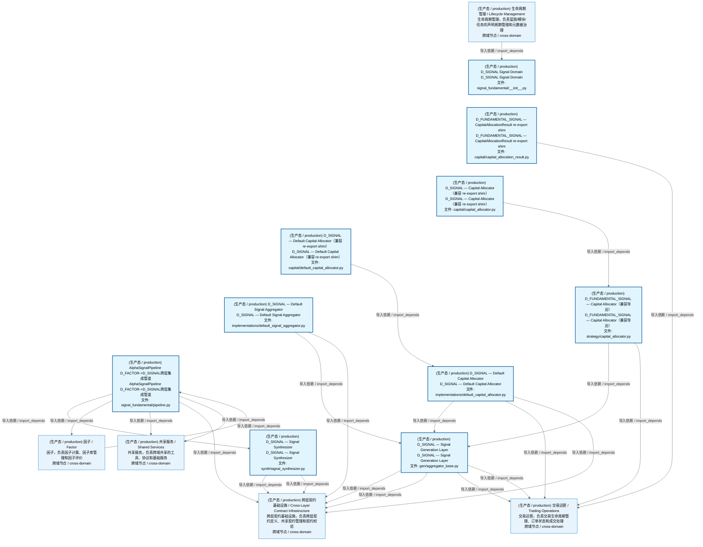
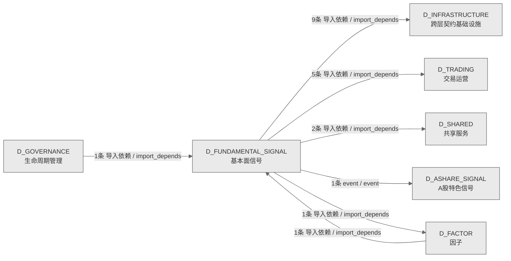

# 48_d_fundamental_signal / 基本面信号域 / Fundamental Signal

> **功能简介 / Overview**: 基本面信号，负责基于财务数据的基本面信号生成

> **文档作用 / Purpose**: 展示 基本面信号（D_FUNDAMENTAL_SIGNAL）功能域的域内依赖关系、跨域依赖关系，模块信息（成熟度/中英文名/大白话/文件路径）内嵌于 Mermaid 节点，供架构审查和域治理参考。

> 本文档由 generate_domain_doc.py 从 depgraph (PostgreSQL) 自动生成
> 数据源: depgraph (PostgreSQL) nodes表 + edges表

> **[可缩放 HTML 版 / Zoomable HTML](http://localhost:8765/docs/02_enterprise_architecture/02_domain_architecture_docs/48_d_fundamental_signal.html)** — Ctrl+滚轮缩放 ｜ 双击重置 ｜ Ctrl+Shift+D 切换拖动/选择模式

## 域基本信息 / Domain Overview

| 字段 | 值 | Field | Value |
|------|------|-------|-------|
| 编号 | 48 | Number | 48 |
| 域ID | D_FUNDAMENTAL_SIGNAL | Domain ID | D_FUNDAMENTAL_SIGNAL |
| 域名称 | 基本面信号 | Domain Name | Fundamental Signal |
| 层级 | L2 业务域层 | Layer | L2 Domain |
| 模块数 | 10 | Module Count | 10 |
| 域内依赖 | 6 | Internal Dependencies | 6 |
| 跨域入边 | 2 | Cross-domain Incoming | 2 |
| 跨域出边 | 18 | Cross-domain Outgoing | 18 |
| 设计态模块 | 0 | Design Modules | 0 |
| 生产态模块 | 10 | Production Modules | 10 |
| 容量 | 10/150 (正常) | Capacity | 10/150 (正常) |
| 描述 | 财务指标信号 | Description | 财务指标信号 |

## 域内依赖图 / Internal Dependency Diagram

> 依赖图内嵌在本文档中，IDE 可直接渲染；网页版可 Ctrl+滚轮缩放 + 拖动平移查看细节。含三个视图：全景图（颜色区分运营态/设计态）+ 运营态子图 + 设计态子图；全景图不分页。
>
> **图例说明 / Legend**：
> - 🟦 **蓝色 = 运营态模块**（production，已上线运行）
> - 🟧 **橙色虚线 = 设计态模块**（design，蓝图阶段，代码未写）
> - **实线箭头 = 运营态依赖**（已生效的依赖关系）
> - **虚线箭头 = 非运营态依赖**（计划中/验证中的依赖关系）

### 全景依赖图（全部模块，颜色区分运营态/设计态）

> 展示全部 10 个模块（生产态 10 + 设计态 0），节点含成熟度+中英文名+大白话+文件路径。

### 运营态子图（仅 design_maturity=production 的模块和依赖）

> 本域 10 个模块全部为运营态（production），上方全景图即运营态全貌，不再重复绘制。

### 设计态子图（仅 design_maturity=design 的模块和依赖）

> （无设计态模块 / No design modules）

## 跨域依赖 / Cross-domain Dependencies

### 本域依赖的其他域（出边）/ Depends On

| # | 本域模块 / Source Module | → | 外部域-目标模块 / Target Module | 依赖类型 / Type |
|:--:|---------|:--:|---------|---------|
| 1 | AlphaSignalPipeline D_FACTOR->D_SIGNAL跨层集成管道 (signa... | → | D_FACTOR 因子: ZephyrAlpha — D_FACTOR Alpha Factor Layer (factor/factor... | 导入依赖 / import_depends |
| 2 | D_SIGNAL — Signal Generation Layer (gen/aggregator_base.py) | → | D_INFRASTRUCTURE 跨层契约基础设施: contracts/factor_signal.py | 导入依赖 / import_depends |
| 3 | D_SIGNAL — Signal Generation Layer (gen/aggregator_base.py) | → | D_INFRASTRUCTURE 跨层契约基础设施: contracts/synthesized_signal.py | 导入依赖 / import_depends |
| 4 | D_SIGNAL — Default Signal Aggregator (implementations/de... | → | D_INFRASTRUCTURE 跨层契约基础设施: contracts/factor_signal.py | 导入依赖 / import_depends |
| 5 | D_SIGNAL — Default Signal Aggregator (implementations/de... | → | D_INFRASTRUCTURE 跨层契约基础设施: contracts/synthesized_signal.py | 导入依赖 / import_depends |
| 6 | AlphaSignalPipeline D_FACTOR->D_SIGNAL跨层集成管道 (signa... | → | D_INFRASTRUCTURE 跨层契约基础设施: contracts/factor_signal.py | 导入依赖 / import_depends |
| 7 | AlphaSignalPipeline D_FACTOR->D_SIGNAL跨层集成管道 (signa... | → | D_INFRASTRUCTURE 跨层契约基础设施: contracts/synthesized_signal.py | 导入依赖 / import_depends |
| 8 | D_SIGNAL — Default Capital Allocator (implementations/de... | → | D_INFRASTRUCTURE 跨层契约基础设施: contracts/synthesized_signal.py | 导入依赖 / import_depends |
| 9 | D_SIGNAL — Signal Synthesizer (synth/signal_synthesizer.py) | → | D_INFRASTRUCTURE 跨层契约基础设施: contracts/factor_signal.py | 导入依赖 / import_depends |
| 10 | D_SIGNAL — Signal Synthesizer (synth/signal_synthesizer.py) | → | D_INFRASTRUCTURE 跨层契约基础设施: contracts/synthesized_signal.py | 导入依赖 / import_depends |
| 11 | AlphaSignalPipeline D_FACTOR->D_SIGNAL跨层集成管道 (signa... | → | D_SHARED 共享服务: errors.py —— ZephyrAlpha 统一错误层次（Traditional Exce... | 导入依赖 / import_depends |
| 12 | AlphaSignalPipeline D_FACTOR->D_SIGNAL跨层集成管道 (signa... | → | D_SHARED 共享服务: time_utils.py —— 时间/日期工具（Phase 9 新增 \| 盲点 B19... | 导入依赖 / import_depends |
| 13 | D_FUNDAMENTAL_SIGNAL — CapitalAllocationResult re-export... | → | D_TRADING 交易运营: execution/capital_allocation_result.py | 导入依赖 / import_depends |
| 14 | D_SIGNAL — Signal Generation Layer (gen/aggregator_base.py) | → | D_TRADING 交易运营: execution/capital_allocation_result.py | 导入依赖 / import_depends |
| 15 | D_SIGNAL — Signal Generation Layer (gen/aggregator_base.py) | → | D_TRADING 交易运营: market/signal_degradation_warning.py | 导入依赖 / import_depends |
| 16 | D_FUNDAMENTAL_SIGNAL — Capital Allocator（兼容导出） (st... | → | D_TRADING 交易运营: execution/capital_allocation_result.py | 导入依赖 / import_depends |
| 17 | D_SIGNAL — Default Capital Allocator (implementations/de... | → | D_TRADING 交易运营: execution/capital_allocation_result.py | 导入依赖 / import_depends |

### 依赖本域的其他域（入边）/ Depended By

| # | 外部域-源模块 / Source Module | → | 本域模块 / Target Module | 依赖类型 / Type |
|:--:|---------|:--:|---------|---------|
| 1 | D_FACTOR 因子: factor/alpha_signal_pipeline.py | → | AlphaSignalPipeline D_FACTOR->D_SIGNAL跨层集成管道 (signa... | 导入依赖 / import_depends |
| 2 | D_GOVERNANCE 生命周期管理: C-track 端到端演示 —— 全流水线一次性运行 (construction/... | → | D_SIGNAL Signal Domain (signal_fundamental/__init__.py) | 导入依赖 / import_depends |

### 跨域依赖图 / Cross-domain Dependency Diagram

> 本域与 6 个外部域直接连接（出边 18 条 + 入边 2 条 = 20 条）。只显示直接连接的域，不展开具体节点。

## 说明 / Notes

- **数据源 / Data Source**: `depgraph (PostgreSQL)` 的 `nodes`、`edges`、`domains` 表
- **生成器 / Generator**: `generate_domain_doc.py`（G2+G10 合并）
- **维护方式 / Maintenance**: 自动生成，全景图更新时刷新
- **文件名规则 / File Naming**: `{编号:02d}_{域ID小写}.md`，如 `16_d_trading.md`
- **图例说明 / Legend**: `[production]`=已上线 / `[design]`=设计中 / `[unknown]`=未知
