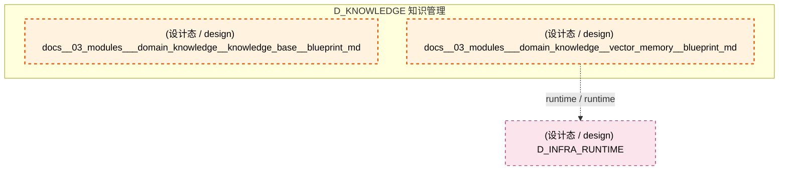
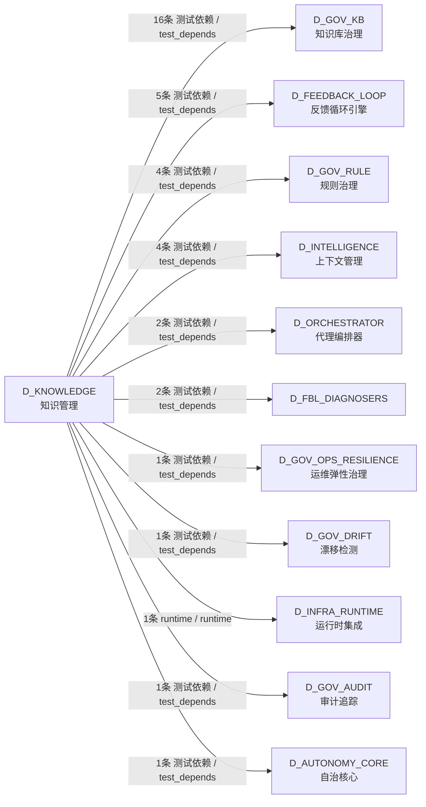

# 48_d_knowledge / vector_storage / 知识管理 / Knowledge Management

> **功能简介 / Overview**: 知识管理，负责知识库构建、向量索引和知识检索

> **文档作用 / Purpose**: 展示 知识管理（D_KNOWLEDGE）功能域的模块清单、域内依赖关系、跨域依赖关系、架构分层视图，供架构审查和域治理参考。

> 本文档由 generate_domain_doc.py 从 depgraph (PostgreSQL) 自动生成
> 最后更新: 2026-07-15 11:32:04
> 数据源: depgraph (PostgreSQL) nodes表 + edges表

## 域基本信息 / Domain Overview

| 字段 | 值 | Field | Value |
|------|------|-------|-------|
| 编号 | 48 | Number | 48 |
| 域ID | D_KNOWLEDGE | Domain ID | D_KNOWLEDGE |
| 域名称 | 知识管理 | Domain Name | Knowledge Management |
| 层级 | L2 业务域层 | Layer | L2 Domain |
| 模块数 | 43 | Module Count | 43 |
| 域内依赖 | 0 | Internal Dependencies | 0 |
| 跨域入边 | 0 | Cross-domain Incoming | 0 |
| 跨域出边 | 38 | Cross-domain Outgoing | 38 |
| 设计态模块 | 2 | Design Modules | 2 |
| 原型态模块 | 41 | Prototype Modules | 41 |
| 生产态模块 | 0 | Production Modules | 0 |
| 容量 | 0/150 (正常) | Capacity | 0/150 (正常) |
| 描述 | 八大Collection管理(decisions/code_context/lessons/knowledge/rules/blueprints/session_snapshots/execution_traces) | Description | 八大Collection管理(decisions/code_context/lessons/knowledge/rules/blueprints/session_snapshots/execution_traces) |

## 模块分层清单 / Module Layered List

> 按 architecture_layer 分组的模块清单（共 43 个模块 / 43 modules）。

### L1 基础层 / Foundation Layer (2 modules)

| # | 模块路径 / Module Path | 模块名称 / Module Name (功能简介 / Description) | 成熟度 / Maturity | 蓝图 / Blueprint |
|:--:|---------|---------|:---:|:---:|
| 1 | docs/03_modules/_domain_knowledge/knowledge_base/blueprin... | docs__03_modules___domain_knowledge__knowledge_base__blueprint_md | 设计态 / design | [MOD-KB-001](../../03_modules/_domain_knowledge/knowledge_base/blueprint.md) |
| 2 | docs/03_modules/_domain_knowledge/vector_memory/blueprint.md | docs__03_modules___domain_knowledge__vector_memory__blueprint_md | 设计态 / design | [MOD-INF-011](../../03_modules/_domain_knowledge/vector_memory/blueprint.md) |

### L2 领域层 / Domain Layer (41 modules)

| # | 模块路径 / Module Path | 模块名称 / Module Name (功能简介 / Description) | 成熟度 / Maturity | 蓝图 / Blueprint |
|:--:|---------|---------|:---:|:---:|
| 1 | src/zephyr/knowledge/__init__.py | __init__.py | 原型态 / prototype |  |
| 2 | src/zephyr/knowledge/_extensions/__init__.py | __init__.py | 原型态 / prototype |  |
| 3 | src/zephyr/knowledge/api/__init__.py | __init__.py | 原型态 / prototype |  |
| 4 | src/zephyr/knowledge/core/__init__.py | __init__.py | 原型态 / prototype |  |
| 5 | src/zephyr/knowledge/infrastructure/__init__.py | __init__.py | 原型态 / prototype |  |
| 6 | src/zephyr/knowledge/models/__init__.py | __init__.py | 原型态 / prototype |  |
| 7 | src/zephyr/knowledge/services/__init__.py | __init__.py | 原型态 / prototype |  |
| 8 | tests/kb/test_kb_activate.py | test_kb_activate.py | 原型态 / prototype | [MOD-KB-001](../../03_modules/_domain_knowledge/knowledge_base/blueprint.md) |
| 9 | tests/kb/test_kb_analyze.py | test_kb_analyze.py | 原型态 / prototype | [MOD-KB-001](../../03_modules/_domain_knowledge/knowledge_base/blueprint.md) |
| 10 | tests/kb/test_kb_batch_ingest.py | test_kb_batch_ingest.py | 原型态 / prototype | [MOD-KB-001](../../03_modules/_domain_knowledge/knowledge_base/blueprint.md) |
| 11 | tests/kb/test_kb_bootstrap.py | test_kb_bootstrap.py | 原型态 / prototype | [MOD-KB-001](../../03_modules/_domain_knowledge/knowledge_base/blueprint.md) |
| 12 | tests/kb/test_kb_embedding_migrate.py | test_kb_embedding_migrate.py | 原型态 / prototype | [MOD-KB-001](../../03_modules/_domain_knowledge/knowledge_base/blueprint.md) |
| 13 | tests/kb/test_kb_extract.py | test_kb_extract.py | 原型态 / prototype | [MOD-KB-001](../../03_modules/_domain_knowledge/knowledge_base/blueprint.md) |
| 14 | tests/kb/test_kb_freeze.py | test_kb_freeze.py | 原型态 / prototype | [MOD-KB-001](../../03_modules/_domain_knowledge/knowledge_base/blueprint.md) |
| 15 | tests/kb/test_kb_gate.py | test_kb_gate.py | 原型态 / prototype | [MOD-INF-020](../../03_modules/_domain_governance/audit_trail/blueprint.md) |
| 16 | tests/kb/test_kb_gate_task.py | test_kb_gate_task.py | 原型态 / prototype | [MOD-KB-001](../../03_modules/_domain_knowledge/knowledge_base/blueprint.md) |
| 17 | tests/kb/test_kb_graph_validator.py | test_kb_graph_validator.py | 原型态 / prototype | [MOD-KB-001](../../03_modules/_domain_knowledge/knowledge_base/blueprint.md) |
| 18 | tests/kb/test_kb_ingest.py | test_kb_ingest.py | 原型态 / prototype | [MOD-KB-001](../../03_modules/_domain_knowledge/knowledge_base/blueprint.md) |
| 19 | tests/kb/test_kb_integrity.py | test_kb_integrity.py | 原型态 / prototype | [MOD-KB-001](../../03_modules/_domain_knowledge/knowledge_base/blueprint.md) |
| 20 | tests/kb/test_kb_migration_embedding.py | test_kb_migration_embedding.py | 原型态 / prototype | [MOD-KB-001](../../03_modules/_domain_knowledge/knowledge_base/blueprint.md) |
| 21 | tests/kb/test_kb_migration_gate.py | test_kb_migration_gate.py | 原型态 / prototype | [MOD-KB-001](../../03_modules/_domain_knowledge/knowledge_base/blueprint.md) |
| 22 | tests/kb/test_kb_pipeline_activate.py | test_kb_pipeline_activate.py | 原型态 / prototype | [MOD-KB-001](../../03_modules/_domain_knowledge/knowledge_base/blueprint.md) |
| 23 | tests/kb/test_kb_reranker.py | test_kb_reranker.py | 原型态 / prototype | [MOD-KB-001](../../03_modules/_domain_knowledge/knowledge_base/blueprint.md) |
| 24 | tests/kb/test_kb_self_test.py | test_kb_self_test.py | 原型态 / prototype | [MOD-KB-001](../../03_modules/_domain_knowledge/knowledge_base/blueprint.md) |
| 25 | tests/kb/test_kb_storage_backend.py | test_kb_storage_backend.py | 原型态 / prototype | [MOD-KB-001](../../03_modules/_domain_knowledge/knowledge_base/blueprint.md) |
| 26 | tests/kb/test_kb_triage.py | test_kb_triage.py | 原型态 / prototype | [MOD-KB-001](../../03_modules/_domain_knowledge/knowledge_base/blueprint.md) |
| 27 | tests/kb/test_kb_unified_memory_api.py | test_kb_unified_memory_api.py | 原型态 / prototype | [MOD-KB-001](../../03_modules/_domain_knowledge/knowledge_base/blueprint.md) |
| 28 | tests/kb/test_kb_verify.py | test_kb_verify.py | 原型态 / prototype | [MOD-KB-001](../../03_modules/_domain_knowledge/knowledge_base/blueprint.md) |
| 29 | tests/kb/test_kb_vms_memory_backend.py | test_kb_vms_memory_backend.py | 原型态 / prototype | [MOD-KB-001](../../03_modules/_domain_knowledge/knowledge_base/blueprint.md) |
| 30 | tests/kb/test_vector_memory_root.py | test_vector_memory_root.py | 原型态 / prototype | [MOD-INF-011](../../03_modules/_domain_knowledge/vector_memory/blueprint.md) |
| 31 | tests/knowledge_engine/test_ke_quality.py | test_ke_quality.py | 原型态 / prototype | [MOD-INF-039](../../03_modules/_cross_layer/agent_orchestrator/blueprint.md) |
| 32 | tests/knowledge_engine/test_ke_tombstone.py | test_ke_tombstone.py | 原型态 / prototype | [MOD-KB-001](../../03_modules/_domain_knowledge/knowledge_base/blueprint.md) |
| 33 | tests/knowledge_engine/test_knowledge_bus_factor_monitor.py | test_knowledge_bus_factor_monitor.py | 原型态 / prototype | [MOD-FEEDBACK_LOOP](../../03_modules/_cross_layer/feedback_loop/blueprint.md) |
| 34 | tests/knowledge_engine/test_knowledge_capture.py | test_knowledge_capture.py | 原型态 / prototype | [MOD-FEEDBACK_LOOP](../../03_modules/_cross_layer/feedback_loop/blueprint.md) |
| 35 | tests/knowledge_engine/test_knowledge_distillation.py | test_knowledge_distillation.py | 原型态 / prototype | [MOD-FEEDBACK_LOOP](../../03_modules/_cross_layer/feedback_loop/blueprint.md) |
| 36 | tests/knowledge_engine/test_knowledge_distiller.py | test_knowledge_distiller.py | 原型态 / prototype | [MOD-CONTEXT_ENGINE](../../03_modules/_cross_layer/context_engine/blueprint.md) |
| 37 | tests/knowledge_engine/test_knowledge_freshness.py | test_knowledge_freshness.py | 原型态 / prototype | [MOD-INF-039](../../03_modules/_cross_layer/agent_orchestrator/blueprint.md) |
| 38 | tests/knowledge_engine/test_knowledge_injection.py | test_knowledge_injection.py | 原型态 / prototype | [MOD-FEEDBACK_LOOP](../../03_modules/_cross_layer/feedback_loop/blueprint.md) |
| 39 | tests/knowledge_engine/test_knowledge_injection_pre_fligh... | test_knowledge_injection_pre_flight_verifier.py | 原型态 / prototype | [MOD-FEEDBACK_LOOP](../../03_modules/_cross_layer/feedback_loop/blueprint.md) |
| 40 | tests/knowledge_engine/test_knowledge_market.py | test_knowledge_market.py | 原型态 / prototype | [MOD-FEEDBACK_LOOP](../../03_modules/_cross_layer/feedback_loop/blueprint.md) |
| 41 | tests/knowledge_engine/test_knowledge_packaging.py | test_knowledge_packaging.py | 原型态 / prototype | [MOD-FEEDBACK_LOOP](../../03_modules/_cross_layer/feedback_loop/blueprint.md) |

## 域内依赖图 / Internal Dependency Diagram

> 依赖图内嵌在本文档中，IDE 可直接渲染显示。参考 decision_index.md 设计，分四个视图：合并全景图、运营态子图、设计态子图、原型态子图（按 design_maturity 实际值拆分）。
>
> **图例说明 / Legend**：
> - **实线边框 = 运营态模块**（production，已上线运行）
> - **虚线边框 = 设计态模块**（design，蓝图阶段，代码未写）
> - **虚线边框 = 原型态模块**（prototype，代码已写，验证中未稳定上线）
> - **实线箭头 = 运营态依赖**（已生效的依赖关系）
> - **虚线箭头 = 非运营态依赖**（计划中/验证中的依赖关系）

### 合并全景图（全部模块，标签标注成熟度）

> 展示全部 43 个模块（生产态 0 + 设计态 2 + 原型态 41），标签标注成熟度。

#### 第 1 页 / 共 2 页

#### 第 2 页 / 共 2 页

```mermaid
graph TD
    subgraph D_KNOWLEDGE["D_KNOWLEDGE 知识管理"]
        tests_kb_test_kb_vms_memory_backend_py["(原型态 / prototype) test_kb_vms_memory_backend.py"]
        tests_kb_test_vector_memory_root_py["(原型态 / prototype) test_vector_memory_root.py"]
        tests_knowledge_engine_test_ke_quality_py["(原型态 / prototype) test_ke_quality.py"]
        tests_knowledge_engine_test_ke_tombstone_py["(原型态 / prototype) test_ke_tombstone.py"]
        tests_knowledge_engine_test_knowledge_bus_factor_monitor_py["(原型态 / prototype) test_knowledge_bus_factor_monitor.py"]
        tests_knowledge_engine_test_knowledge_capture_py["(原型态 / prototype) test_knowledge_capture.py"]
        tests_knowledge_engine_test_knowledge_distillation_py["(原型态 / prototype) test_knowledge_distillation.py"]
        tests_knowledge_engine_test_knowledge_distiller_py["(原型态 / prototype) test_knowledge_distiller.py"]
        tests_knowledge_engine_test_knowledge_freshness_py["(原型态 / prototype) test_knowledge_freshness.py"]
        tests_knowledge_engine_test_knowledge_injection_py["(原型态 / prototype) test_knowledge_injection.py"]
        tests_knowledge_engine_test_knowledge_injection_pre_flight_verifier_py["(原型态 / prototype) test_knowledge_injection_pre_flight_verifier.py"]
        tests_knowledge_engine_test_knowledge_market_py["(原型态 / prototype) test_knowledge_market.py"]
        tests_knowledge_engine_test_knowledge_packaging_py["(原型态 / prototype) test_knowledge_packaging.py"]
    end
    D_GOV_KB["(生产态 / production) D_GOV_KB"]
    tests_kb_test_kb_vms_memory_backend_py -.->|测试依赖 / test_depends| D_GOV_KB
    tests_kb_test_kb_vms_memory_backend_py -.->|测试依赖 / test_depends| D_GOV_KB
    D_ORCHESTRATOR["(生产态 / production) D_ORCHESTRATOR"]
    tests_knowledge_engine_test_ke_quality_py -.->|测试依赖 / test_depends| D_ORCHESTRATOR
    D_FBL_DIAGNOSERS["(生产态 / production) D_FBL_DIAGNOSERS"]
    tests_knowledge_engine_test_knowledge_bus_factor_monitor_py -.->|测试依赖 / test_depends| D_FBL_DIAGNOSERS
    tests_knowledge_engine_test_ke_tombstone_py -.->|测试依赖 / test_depends| D_GOV_KB
    D_FEEDBACK_LOOP["(生产态 / production) D_FEEDBACK_LOOP"]
    tests_knowledge_engine_test_knowledge_distillation_py -.->|测试依赖 / test_depends| D_FEEDBACK_LOOP
    tests_knowledge_engine_test_knowledge_capture_py -.->|测试依赖 / test_depends| D_FEEDBACK_LOOP
    D_AUTONOMY_CORE["(生产态 / production) D_AUTONOMY_CORE"]
    tests_knowledge_engine_test_knowledge_distiller_py -.->|测试依赖 / test_depends| D_AUTONOMY_CORE
    tests_knowledge_engine_test_knowledge_injection_py -.->|测试依赖 / test_depends| D_FEEDBACK_LOOP
    tests_knowledge_engine_test_knowledge_freshness_py -.->|测试依赖 / test_depends| D_ORCHESTRATOR
    tests_knowledge_engine_test_knowledge_injection_pre_flight_verifier_py -.->|测试依赖 / test_depends| D_FEEDBACK_LOOP
    tests_knowledge_engine_test_knowledge_packaging_py -.->|测试依赖 / test_depends| D_FEEDBACK_LOOP
    tests_knowledge_engine_test_knowledge_market_py -.->|测试依赖 / test_depends| D_FBL_DIAGNOSERS
    classDef production fill:#e1f5fe,stroke:#01579b,stroke-width:2px,color:#000
    classDef design fill:#fff3e0,stroke:#e65100,stroke-width:2px,color:#000,stroke-dasharray: 5 5
    classDef external_prod fill:#e8f5e9,stroke:#1b5e20,stroke-width:1px,color:#000
    classDef external_design fill:#fce4ec,stroke:#880e4f,stroke-width:1px,color:#000,stroke-dasharray: 5 5
    class tests_kb_test_kb_vms_memory_backend_py,tests_kb_test_vector_memory_root_py,tests_knowledge_engine_test_ke_quality_py,tests_knowledge_engine_test_ke_tombstone_py,tests_knowledge_engine_test_knowledge_bus_factor_monitor_py,tests_knowledge_engine_test_knowledge_capture_py,tests_knowledge_engine_test_knowledge_distillation_py,tests_knowledge_engine_test_knowledge_distiller_py,tests_knowledge_engine_test_knowledge_freshness_py,tests_knowledge_engine_test_knowledge_injection_py,tests_knowledge_engine_test_knowledge_injection_pre_flight_verifier_py,tests_knowledge_engine_test_knowledge_market_py,tests_knowledge_engine_test_knowledge_packaging_py design
    class D_GOV_KB,D_ORCHESTRATOR,D_FBL_DIAGNOSERS,D_FEEDBACK_LOOP,D_AUTONOMY_CORE external_prod
```

### 运营态子图（仅 design_maturity=production 的模块和依赖）

> 仅展示已上线运行的模块（共 0 个，0 条域内依赖）。

> （无运营态模块 / No production modules）

### 设计态子图（仅 design_maturity=design 的模块和依赖）

> 仅展示蓝图阶段、代码未写的设计态模块（共 2 个，0 条域内依赖）。

### 原型态子图（仅 design_maturity=prototype 的模块和依赖）

> 仅展示代码已写、验证中未稳定上线的原型态模块（共 41 个，0 条域内依赖）。

## 跨域依赖 / Cross-domain Dependencies

### 本域依赖的其他域（出边）/ Depends On

| # | 本域模块 / Source Module | → | 外部域-目标模块 / Target Module | 依赖类型 / Type |
|:--:|---------|:--:|---------|---------|
| 1 | test_knowledge_distiller.py | → | D_AUTONOMY_CORE 自治核心: knowledge_distiller.py — 知识蒸馏 (B10, DD84, ... | 测试依赖 / test_depends |
| 2 | test_knowledge_bus_factor_monitor.py | → | D_FBL_DIAGNOSERS: Knowledge Bus Factor Monitor — v0.38.0 R481 (k... | 测试依赖 / test_depends |
| 3 | test_knowledge_market.py | → | D_FBL_DIAGNOSERS: Knowledge Market — v0.9.0 R126 (knowledge_mark... | 测试依赖 / test_depends |
| 4 | test_knowledge_capture.py | → | D_FEEDBACK_LOOP 反馈循环引擎: Knowledge Capture — v0.4.0 R30 (knowledge_capt... | 测试依赖 / test_depends |
| 5 | test_knowledge_distillation.py | → | D_FEEDBACK_LOOP 反馈循环引擎: Knowledge Distillation — v0.6.0 R52 (knowledge... | 测试依赖 / test_depends |
| 6 | test_knowledge_injection.py | → | D_FEEDBACK_LOOP 反馈循环引擎: Knowledge Injection — v0.8.0 R102 (knowledge_i... | 测试依赖 / test_depends |
| 7 | test_knowledge_injection_pre_flight_verifier.py | → | D_FEEDBACK_LOOP 反馈循环引擎: R515: KnowledgeInjectionPreFlightVerifier (know... | 测试依赖 / test_depends |
| 8 | test_knowledge_packaging.py | → | D_FEEDBACK_LOOP 反馈循环引擎: Knowledge Packaging — v0.9.0 R123 (knowledge_p... | 测试依赖 / test_depends |
| 9 | test_kb_gate.py | → | D_GOV_AUDIT 审计追踪: audit-trail.kb_gate — MOD-INF-020 · KB 审计门... | 测试依赖 / test_depends |
| 10 | test_kb_integrity.py | → | D_GOV_DRIFT 漂移检测: integrity.py | 测试依赖 / test_depends |
| 11 | test_kb_analyze.py | → | D_GOV_KB 知识库治理: G3 Evaluate 门禁 — 深度评估（T-2-13-C） (analy... | 测试依赖 / test_depends |
| 12 | test_kb_bootstrap.py | → | D_GOV_KB 知识库治理: 冷启动引导引擎 — 从存量文档自动生成首批KE（T-M... | 测试依赖 / test_depends |
| 13 | test_kb_embedding_migrate.py | → | D_GOV_KB 知识库治理: EmbeddingMigrate · Embedding 版本管理 + 迁移管... | 测试依赖 / test_depends |
| 14 | test_kb_extract.py | → | D_GOV_KB 知识库治理: G5 Extract 门禁 — 知识升格（T-2-13-E） (extrac... | 测试依赖 / test_depends |
| 15 | test_kb_freeze.py | → | D_GOV_KB 知识库治理: 紧急冻结/解冻/安全模式断路器 (freeze.py) | 测试依赖 / test_depends |
| 16 | test_kb_gate_task.py | → | D_GOV_KB 知识库治理: KB 五阶段门禁 evaluate 用的最小合法 Task（对齐 ... | 测试依赖 / test_depends |
| 17 | test_kb_graph_validator.py | → | D_GOV_KB 知识库治理: 知识图谱完整性校验器（T-2-11-C） (graph_validat... | 测试依赖 / test_depends |
| 18 | test_kb_migration_embedding.py | → | D_GOV_KB 知识库治理: EmbeddingMigrate · Embedding 版本管理 + 迁移管... | 测试依赖 / test_depends |
| 19 | test_kb_migration_gate.py | → | D_GOV_KB 知识库治理: KB 五阶段门禁 evaluate 用的最小合法 Task（对齐 ... | 测试依赖 / test_depends |
| 20 | test_kb_self_test.py | → | D_GOV_KB 知识库治理: KB 13项一键体检 + --self-test入口 (self_test.py) | 测试依赖 / test_depends |
| 21 | test_kb_storage_backend.py | → | D_GOV_KB 知识库治理: Re-export shim — 真源在 zephyr.gov_kb.storage.... | 测试依赖 / test_depends |
| 22 | test_kb_unified_memory_api.py | → | D_GOV_KB 知识库治理: Re-export shim — 真源在 zephyr.gov_kb.storage.... | 测试依赖 / test_depends |
| 23 | test_kb_verify.py | → | D_GOV_KB 知识库治理: 确定性事实核查 — 取代AI猜测 (verify.py) | 测试依赖 / test_depends |
| 24 | test_kb_vms_memory_backend.py | → | D_GOV_KB 知识库治理: Re-export shim — 真源在 zephyr.gov_kb.storage.... | 测试依赖 / test_depends |
| 25 | test_kb_vms_memory_backend.py | → | D_GOV_KB 知识库治理: VMSMemoryBackend — UnifiedMemoryAPI 的 VMS 后.... | 测试依赖 / test_depends |
| 26 | test_ke_tombstone.py | → | D_GOV_KB 知识库治理: SQLite墓碑表 + G2向量去重 (ke_tombstone.py) | 测试依赖 / test_depends |
| 27 | test_kb_triage.py | → | D_GOV_OPS_RESILIENCE 运维弹性治理: G2 Triage 门禁 — 知识分类评分（T-2-13-B） (tri... | 测试依赖 / test_depends |
| 28 | test_kb_activate.py | → | D_GOV_RULE 规则治理: gate_types.py | 测试依赖 / test_depends |
| 29 | test_kb_analyze.py | → | D_GOV_RULE 规则治理: gate_types.py | 测试依赖 / test_depends |
| 30 | test_kb_extract.py | → | D_GOV_RULE 规则治理: gate_types.py | 测试依赖 / test_depends |
| 31 | test_kb_migration_gate.py | → | D_GOV_RULE 规则治理: task_types.py | 测试依赖 / test_depends |
| 32 | blueprint.md | → | D_INFRA_RUNTIME 运行时集成: blueprint.md | runtime / runtime |
| 33 | test_kb_activate.py | → | D_INTELLIGENCE 上下文管理: G4 Activate 门禁 — 人工激活（T-2-13-D） (activ... | 测试依赖 / test_depends |
| 34 | test_kb_pipeline_activate.py | → | D_INTELLIGENCE 上下文管理: G4 Activate 门禁 — 人工激活（T-2-13-D） (activ... | 测试依赖 / test_depends |
| 35 | test_kb_reranker.py | → | D_INTELLIGENCE 上下文管理: Cross-Encoder 重排序层 — BGE-reranker-v2-m3（T... | 测试依赖 / test_depends |
| 36 | test_kb_unified_memory_api.py | → | D_INTELLIGENCE 上下文管理: UnifiedMemoryAPI — RI-02 统一记忆 API（M2 跨模... | 测试依赖 / test_depends |
| 37 | test_ke_quality.py | → | D_ORCHESTRATOR 代理编排器: 知识质量评分契约（CT-KE-QUALITY）——KE完整性+.... | 测试依赖 / test_depends |
| 38 | test_knowledge_freshness.py | → | D_ORCHESTRATOR 代理编排器: 知识新鲜度废止管理器（CT-KNOWLEDGE-FRESHNESS）.... | 测试依赖 / test_depends |

### 依赖本域的其他域（入边）/ Depended By

无跨域入边依赖 / No cross-domain incoming dependencies

### 跨域依赖图 / Cross-domain Dependency Diagram

> 本域与 11 个外部域直接连接（出边 38 条 + 入边 0 条 = 38 条）。只显示直接连接的域，不展开具体节点。

## 说明 / Notes

- **数据源 / Data Source**: `depgraph (PostgreSQL)` 的 `nodes`、`edges`、`domains` 表
- **生成器 / Generator**: `generate_domain_doc.py`（G2+G10 合并）
- **维护方式 / Maintenance**: 自动生成，全景图更新时刷新
- **文件名规则 / File Naming**: `{编号:02d}_{域ID小写}.md`，如 `16_d_trading.md`
- **图例说明 / Legend**: `[production]`=已上线 / `[design]`=设计中 / `[prototype]`=原型 / `[unknown]`=未知
