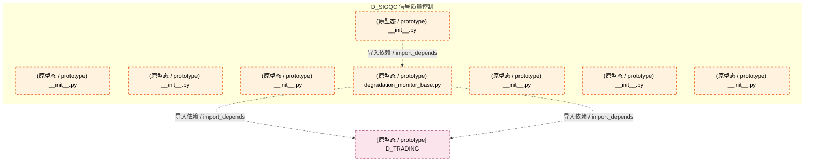

# 48_d_sigqc / signal_quality / 信号质量控制 / Signal Quality Control

> **功能简介 / Overview**: 信号质量控制与评估

> **文档作用 / Purpose**: 展示 信号质量控制（D_SIGQC）功能域的模块清单、域内依赖关系、跨域依赖关系、架构分层视图，供架构审查和域治理参考。

> 本文档由 generate_domain_doc.py 从 depgraph (PostgreSQL) 自动生成
> 最后更新: 2026-07-09 01:10:32
> 数据源: depgraph (PostgreSQL) nodes表 + edges表

## 域基本信息 / Domain Overview

| 字段 | 值 | Field | Value |
|------|------|-------|-------|
| 编号 | 48 | Number | 48 |
| 域ID | D_SIGQC | Domain ID | D_SIGQC |
| 域名称 | 信号质量控制 | Domain Name | Signal Quality Control |
| 层级 | L2 业务域层 | Layer | L2 Domain |
| 模块数 | 8 | Module Count | 8 |
| 域内依赖 | 1 | Internal Dependencies | 1 |
| 跨域入边 | 0 | Cross-domain Incoming | 0 |
| 跨域出边 | 2 | Cross-domain Outgoing | 2 |
| 设计态模块 | 0 | Design Modules | 0 |
| 原型态模块 | 8 | Prototype Modules | 8 |
| 生产态模块 | 0 | Production Modules | 0 |
| 容量 | 0/150 (正常) | Capacity | 0/150 (正常) |
| 描述 | 信号质量评估 | Description | 信号质量评估 |

## 域内依赖图 / Internal Dependency Diagram

> 依赖图内嵌在本文档中，IDE 可直接渲染显示。每30个节点一组分页显示。
>
> **图例说明 / Legend**：
> - **实线边框 = 运营态模块**（production，已上线运行）
> - **虚线边框 = 设计态模块**（design，还在设计中）
> - **实线箭头 = 运营态依赖**（已生效的依赖关系）
> - **虚线箭头 = 设计态依赖**（计划中的依赖关系）



## 跨域依赖 / Cross-domain Dependencies

### 本域依赖的其他域（出边）/ Depends On

| 目标域 / Target Domain | 依赖数 / Count | 依赖类型 / Type |
|--------|:---:|---------|
| D_TRADING | 2 | 导入依赖 / import_depends |

### 依赖本域的其他域（入边）/ Depended By

无跨域入边依赖 / No cross-domain incoming dependencies

## 架构分层视图 / Architecture Overview

> 按 architecture_layer 分层显示 信号质量控制（D_SIGQC）的模块分布。共 8 个模块 / 8 modules。

```

┌──────────────────────────────────────────────────────────────────┐
│       L2 领域层 / Domain Layer（共 8 个模块 / 8 modules）        │
├──────────────────────────────────────────────────────────────────┤
│   __init__.py [原型态 / prototype]                               │
│   __init__.py [原型态 / prototype]                               │
│   __init__.py [原型态 / prototype]                               │
│   __init__.py [原型态 / prototype]                               │
│   degradation_monitor_base.py [原型态 / prototype]               │
│   __init__.py [原型态 / prototype]                               │
│   __init__.py [原型态 / prototype]                               │
│   __init__.py [原型态 / prototype]                               │
└──────────────────────────────────────────────────────────────────┘

```

## 模块分层清单 / Module Layered List

> 按 architecture_layer 分组的模块清单（共 8 个模块 / 8 modules）。

### L2 领域层 / Domain Layer (8 modules)

| # | 模块路径 / Module Path | 模块名称 / Module Name | 功能简介 / Description | 成熟度 / Maturity | 构建状态 / Build Status |
|:--:|---------|---------|---------|:---:|:---:|
| 1 | src/zephyr/signal_quality/__init__.py | src/zephyr/signal_quality/__init__.py | D_SIGQC — Signal Quality Domain | prototype | generated |
| 2 | src/zephyr/signal_quality/_extensions/__init__.py | src/zephyr/signal_quality/_extensions... |  | prototype | generated |
| 3 | src/zephyr/signal_quality/api/__init__.py | src/zephyr/signal_quality/api/__init_... |  | prototype | generated |
| 4 | src/zephyr/signal_quality/core/__init__.py | src/zephyr/signal_quality/core/__init... |  | prototype | generated |
| 5 | src/zephyr/signal_quality/degradation_monitor_base.py | src/zephyr/signal_quality/degradation... | D_SIGQC — Signal Quality Degradation Monitor Base | prototype | generated |
| 6 | src/zephyr/signal_quality/infrastructure/__init__.py | src/zephyr/signal_quality/infrastruct... |  | prototype | generated |
| 7 | src/zephyr/signal_quality/models/__init__.py | src/zephyr/signal_quality/models/__in... |  | prototype | generated |
| 8 | src/zephyr/signal_quality/services/__init__.py | src/zephyr/signal_quality/services/__... |  | prototype | generated |

## 依赖关系图 / Dependency Graph

> 域内模块依赖关系（共 1 条 / 1 edges）。按依赖类型分组，使用 → 表示方向。

```

┌──────────────────────────────────────────────────────────────────┐
│        依赖关系图 / Dependency Graph (共 1 条 / 1 edges)         │
├──────────────────────────────────────────────────────────────────┤
│   依赖类型数 / Dependency Types: 1                               │
│   [import_depends]: 1 条 / edges                                 │
└──────────────────────────────────────────────────────────────────┘

┌──────────────────────────────────────────────────────────────────┐
│           [导入依赖 / import_depends]（1 条 / edges）            │
├──────────────────────────────────────────────────────────────────┤
│   __init__.py → degradation_monitor_base.py                      │
└──────────────────────────────────────────────────────────────────┘

```

## 说明 / Notes

- **数据源 / Data Source**: `depgraph (PostgreSQL)` 的 `nodes`、`edges`、`domains` 表
- **生成器 / Generator**: `generate_domain_doc.py`（G2+G10 合并）
- **维护方式 / Maintenance**: 自动生成，全景图更新时刷新
- **文件名规则 / File Naming**: `{编号:02d}_{域ID小写}.md`，如 `16_d_trading.md`
- **图例说明 / Legend**: `[生产态 / production]`=已上线 / `[设计态 / design]`=设计中 / `[原型态 / prototype]`=原型 / `[未知 / unknown]`=未知
