# 48_d_trading / 交易运营

> **文档作用 / Purpose**: 展示 交易运营（D_TRADING）功能域的模块清单、域内依赖关系、跨域依赖关系、架构分层视图，供架构审查和域治理参考。

> 本文档由 generate_domain_doc.py 从 depgraph (PostgreSQL) 自动生成
> 最后更新: 2026-07-06 12:08:50
> 数据源: depgraph (PostgreSQL) nodes表 + edges表

## 域基本信息 / Domain Overview

| 字段 | 值 | Field | Value |
|------|------|-------|-------|
| 编号 | 48 | Number | 48 |
| 域ID | D_TRADING | Domain ID | D_TRADING |
| 域名称 | 交易运营 | Domain Name | 交易运营 |
| 层级 | L2_domain | Layer | L2_domain |
| 模块数 | 464 | Module Count | 464 |
| 域内依赖 | 437 | Internal Dependencies | 437 |
| 跨域入边 | 735 | Cross-domain Incoming | 735 |
| 跨域出边 | 158 | Cross-domain Outgoing | 158 |
| 设计态模块 | 0 | Design Modules | 0 |
| 原型态模块 | 201 | Prototype Modules | 201 |
| 生产态模块 | 263 | Production Modules | 263 |
| 容量 | 280/150 (超容) | Capacity | 280/150 (超容) |
| 描述 | 交易会话、交易接口、交易日志、交易复盘。交易运营中枢。合规检查由D-GOV_ENFORCEMENT门禁层执行。 | Description | 交易会话、交易接口、交易日志、交易复盘。交易运营中枢。合规检查由D-GOV_ENFORCEMENT门禁层执行。 |

## 域内依赖图 / Internal Dependency Diagram

> 依赖图内嵌在本文档中，IDE 可直接渲染显示。每30个节点一组分页显示。
>
> **图例说明 / Legend**：
> - **实线边框 = 运营态模块**（production，已上线运行）
> - **虚线边框 = 设计态模块**（design，还在设计中）
> - **实线箭头 = 运营态依赖**（已生效的依赖关系）
> - **虚线箭头 = 设计态依赖**（计划中的依赖关系）

### 第 1 页 / 共 16 页 / Page 1 of 16

```mermaid
graph TD
    subgraph D_TRADING["D_TRADING 交易运营"]
        src_zephyr_trading_init_py["src/zephyr/trading/__init__.py production"]
        src_zephyr_trading_main_py["src/zephyr/trading/__main__.py prototype"]
        src_zephyr_trading_extensions_init_py["src/zephyr/trading/_extensions/__init__.py prototype"]
        src_zephyr_trading_action_dispatcher_py["src/zephyr/trading/action_dispatcher.py production"]
        src_zephyr_trading_admission_controller_py["src/zephyr/trading/admission_controller.py production"]
        src_zephyr_trading_ai_audit_logger_py["src/zephyr/trading/ai_audit_logger.py production"]
        src_zephyr_trading_api_init_py["src/zephyr/trading/api/__init__.py prototype"]
        src_zephyr_trading_auto_dispatcher_py["src/zephyr/trading/auto_dispatcher.py prototype"]
        src_zephyr_trading_auto_integrator_py["src/zephyr/trading/auto_integrator.py production"]
        src_zephyr_trading_auto_runtime_core_py["src/zephyr/trading/auto_runtime_core.py production"]
        src_zephyr_trading_auto_task_generator_py["src/zephyr/trading/auto_task_generator.py production"]
        src_zephyr_trading_boot_hooks_py["src/zephyr/trading/boot_hooks.py production"]
        src_zephyr_trading_capability_card_py["src/zephyr/trading/capability_card.py production"]
        src_zephyr_trading_capability_registry_py["src/zephyr/trading/capability_registry.py production"]
        src_zephyr_trading_capability_sync_py["src/zephyr/trading/capability_sync.py production"]
        src_zephyr_trading_core_init_py["src/zephyr/trading/core/__init__.py prototype"]
        src_zephyr_trading_dream_cycle_py["src/zephyr/trading/dream_cycle.py production"]
        src_zephyr_trading_feedback_loop_init_py["src/zephyr/trading/feedback_loop/__init__.py production"]
        src_zephyr_trading_feedback_loop_gen_inherited_py["src/zephyr/trading/feedback_loop/_gen_inherited.py production"]
        src_zephyr_trading_feedback_loop_actors_init_py["src/zephyr/trading/feedback_loop/actors/__init_... production"]
        src_zephyr_trading_feedback_loop_actors_action_selector_py["src/zephyr/trading/feedback_loop/actors/action_... production"]
        src_zephyr_trading_feedback_loop_actors_agent_lifecycle_py["src/zephyr/trading/feedback_loop/actors/agent_l... production"]
        src_zephyr_trading_feedback_loop_actors_api_version_contract_py["src/zephyr/trading/feedback_loop/actors/api_ver... production"]
        src_zephyr_trading_feedback_loop_actors_global_action_scheduler_py["src/zephyr/trading/feedback_loop/actors/global_... production"]
        src_zephyr_trading_feedback_loop_actors_incident_priority_triage_automator_py["src/zephyr/trading/feedback_loop/actors/inciden... production"]
        src_zephyr_trading_feedback_loop_actors_intent_driven_ops_py["src/zephyr/trading/feedback_loop/actors/intent_... production"]
        src_zephyr_trading_feedback_loop_actors_multi_agent_orchestrator_py["src/zephyr/trading/feedback_loop/actors/multi_a... production"]
        src_zephyr_trading_feedback_loop_actors_notification_personalizer_py["src/zephyr/trading/feedback_loop/actors/notific... production"]
        src_zephyr_trading_feedback_loop_actors_owner_absence_escalation_py["src/zephyr/trading/feedback_loop/actors/owner_a... production"]
        src_zephyr_trading_feedback_loop_actors_saga_compensator_py["src/zephyr/trading/feedback_loop/actors/saga_co... prototype"]
    end
    src_zephyr_trading_auto_integrator_py -->|import_depends| src_zephyr_trading_capability_card_py
    src_zephyr_trading_auto_integrator_py -->|import_depends| src_zephyr_trading_capability_registry_py
    src_zephyr_trading_auto_runtime_core_py -->|import_depends| src_zephyr_trading_ai_audit_logger_py
    src_zephyr_trading_auto_runtime_core_py -->|import_depends| src_zephyr_trading_auto_integrator_py
    src_zephyr_trading_auto_runtime_core_py -->|import_depends| src_zephyr_trading_capability_sync_py
    src_zephyr_trading_auto_runtime_core_py -->|import_depends| src_zephyr_trading_boot_hooks_py
    src_zephyr_trading_auto_runtime_core_py -->|import_depends| src_zephyr_trading_dream_cycle_py
    src_zephyr_trading_auto_runtime_core_py -->|import_depends| src_zephyr_trading_capability_registry_py
    src_zephyr_trading_auto_runtime_core_py -->|import_depends| src_zephyr_trading_feedback_loop_init_py
    src_zephyr_trading_capability_sync_py -->|import_depends| src_zephyr_trading_capability_card_py
    src_zephyr_trading_capability_sync_py -->|import_depends| src_zephyr_trading_capability_registry_py
    src_zephyr_trading_capability_registry_py -->|import_depends| src_zephyr_trading_capability_card_py
    src_zephyr_trading_main_py -.->|import_depends| src_zephyr_trading_auto_runtime_core_py
    src_zephyr_trading_feedback_loop_actors_init_py -->|import_depends| src_zephyr_trading_feedback_loop_actors_action_selector_py
    src_zephyr_trading_feedback_loop_actors_init_py -->|import_depends| src_zephyr_trading_feedback_loop_actors_agent_lifecycle_py
    src_zephyr_trading_feedback_loop_actors_init_py -->|import_depends| src_zephyr_trading_feedback_loop_actors_global_action_scheduler_py
    src_zephyr_trading_feedback_loop_actors_init_py -->|import_depends| src_zephyr_trading_feedback_loop_actors_incident_priority_triage_automator_py
    src_zephyr_trading_feedback_loop_actors_init_py -->|import_depends| src_zephyr_trading_feedback_loop_actors_notification_personalizer_py
    src_zephyr_trading_feedback_loop_actors_init_py -->|import_depends| src_zephyr_trading_feedback_loop_actors_multi_agent_orchestrator_py
    src_zephyr_trading_feedback_loop_actors_init_py -->|import_depends| src_zephyr_trading_feedback_loop_actors_api_version_contract_py
    src_zephyr_trading_feedback_loop_actors_init_py -->|import_depends| src_zephyr_trading_feedback_loop_actors_intent_driven_ops_py
    src_zephyr_trading_feedback_loop_actors_init_py -.->|import_depends| src_zephyr_trading_feedback_loop_actors_saga_compensator_py
    src_zephyr_trading_feedback_loop_actors_init_py -->|import_depends| src_zephyr_trading_feedback_loop_actors_owner_absence_escalation_py
    D_SHARED["D_SHARED production"]
    src_zephyr_trading_auto_runtime_core_py -->|import_depends| D_SHARED
    src_zephyr_trading_boot_hooks_py -->|import_depends| D_SHARED
    D_INFRA_RUNTIME["D_INFRA_RUNTIME production"]
    src_zephyr_trading_boot_hooks_py -->|import_depends| D_INFRA_RUNTIME
    src_zephyr_trading_boot_hooks_py -->|import_depends| D_INFRA_RUNTIME
    D_GOVERNANCE["D_GOVERNANCE production"]
    src_zephyr_trading_boot_hooks_py -->|import_depends| D_GOVERNANCE
    D_SECURITY["D_SECURITY production"]
    src_zephyr_trading_boot_hooks_py -->|import_depends| D_SECURITY
    src_zephyr_trading_boot_hooks_py -->|import_depends| D_SECURITY
    D_INTEGRATION["D_INTEGRATION production"]
    src_zephyr_trading_auto_runtime_core_py -->|import_depends| D_INTEGRATION
    src_zephyr_trading_auto_runtime_core_py -->|import_depends| D_GOVERNANCE
    src_zephyr_trading_boot_hooks_py -.->|import_depends| D_SHARED
    src_zephyr_trading_boot_hooks_py -->|import_depends| D_GOVERNANCE
    src_zephyr_trading_auto_dispatcher_py -.->|import_depends| D_GOVERNANCE
    D_INTELLIGENCE["D_INTELLIGENCE prototype"]
    src_zephyr_trading_auto_runtime_core_py -.->|import_depends| D_INTELLIGENCE
    D_AUTONOMY_CORE["D_AUTONOMY_CORE production"]
    src_zephyr_trading_boot_hooks_py -->|import_depends| D_AUTONOMY_CORE
    src_zephyr_trading_boot_hooks_py -->|import_depends| D_AUTONOMY_CORE
    D_AUDITTEST["D_AUDITTEST prototype"]
    D_AUDITTEST -.->|test_depends| src_zephyr_trading_feedback_loop_actors_multi_agent_orchestrator_py
    D_AUDITTEST -.->|test_depends| src_zephyr_trading_auto_integrator_py
    D_AUDITTEST -.->|test_depends| src_zephyr_trading_capability_card_py
    D_AUDITTEST -.->|test_depends| src_zephyr_trading_capability_registry_py
    D_AUDITTEST -.->|test_depends| src_zephyr_trading_auto_runtime_core_py
    D_AUDITTEST -.->|test_depends| src_zephyr_trading_capability_registry_py
    D_AUDITTEST -.->|test_depends| src_zephyr_trading_dream_cycle_py
    D_SECURITY -->|import_depends| src_zephyr_trading_capability_registry_py
    D_AUDITTEST -.->|test_depends| src_zephyr_trading_feedback_loop_actors_api_version_contract_py
    D_AUDITTEST -.->|test_depends| src_zephyr_trading_feedback_loop_actors_incident_priority_triage_automator_py
    D_AUDITTEST -.->|test_depends| src_zephyr_trading_feedback_loop_actors_owner_absence_escalation_py
    D_AUDITTEST -.->|test_depends| src_zephyr_trading_boot_hooks_py
    D_AUDITTEST -.->|test_depends| src_zephyr_trading_feedback_loop_gen_inherited_py
    D_AUDITTEST -.->|test_depends| src_zephyr_trading_init_py
    D_AUDITTEST -.->|test_depends| src_zephyr_trading_init_py
    classDef production fill:#e1f5fe,stroke:#01579b,stroke-width:2px,color:#000
    classDef design fill:#fff3e0,stroke:#e65100,stroke-width:2px,color:#000,stroke-dasharray: 5 5
    classDef external_prod fill:#e8f5e9,stroke:#1b5e20,stroke-width:1px,color:#000
    classDef external_design fill:#fce4ec,stroke:#880e4f,stroke-width:1px,color:#000,stroke-dasharray: 5 5
    class src_zephyr_trading_init_py,src_zephyr_trading_action_dispatcher_py,src_zephyr_trading_admission_controller_py,src_zephyr_trading_ai_audit_logger_py,src_zephyr_trading_auto_integrator_py,src_zephyr_trading_auto_runtime_core_py,src_zephyr_trading_auto_task_generator_py,src_zephyr_trading_boot_hooks_py,src_zephyr_trading_capability_card_py,src_zephyr_trading_capability_registry_py,src_zephyr_trading_capability_sync_py,src_zephyr_trading_dream_cycle_py,src_zephyr_trading_feedback_loop_init_py,src_zephyr_trading_feedback_loop_gen_inherited_py,src_zephyr_trading_feedback_loop_actors_init_py,src_zephyr_trading_feedback_loop_actors_action_selector_py,src_zephyr_trading_feedback_loop_actors_agent_lifecycle_py,src_zephyr_trading_feedback_loop_actors_api_version_contract_py,src_zephyr_trading_feedback_loop_actors_global_action_scheduler_py,src_zephyr_trading_feedback_loop_actors_incident_priority_triage_automator_py,src_zephyr_trading_feedback_loop_actors_intent_driven_ops_py,src_zephyr_trading_feedback_loop_actors_multi_agent_orchestrator_py,src_zephyr_trading_feedback_loop_actors_notification_personalizer_py,src_zephyr_trading_feedback_loop_actors_owner_absence_escalation_py production
    class src_zephyr_trading_main_py,src_zephyr_trading_extensions_init_py,src_zephyr_trading_api_init_py,src_zephyr_trading_auto_dispatcher_py,src_zephyr_trading_core_init_py,src_zephyr_trading_feedback_loop_actors_saga_compensator_py design
    class D_SHARED,D_INFRA_RUNTIME,D_GOVERNANCE,D_SECURITY,D_INTEGRATION,D_AUTONOMY_CORE external_prod
    class D_INTELLIGENCE,D_AUDITTEST external_design
```

### 第 2 页 / 共 16 页 / Page 2 of 16


### 第 3 页 / 共 16 页 / Page 3 of 16


### 第 4 页 / 共 16 页 / Page 4 of 16

```mermaid
graph TD
    subgraph D_TRADING["D_TRADING 交易运营"]
        src_zephyr_trading_feedback_loop_detectors_drift_init_py["src/zephyr/trading/feedback_loop/detectors/drif... prototype"]
        src_zephyr_trading_feedback_loop_detectors_drift_concept_drift_py["src/zephyr/trading/feedback_loop/detectors/drif... prototype"]
        src_zephyr_trading_feedback_loop_detectors_drift_config_drift_py["src/zephyr/trading/feedback_loop/detectors/drif... prototype"]
        src_zephyr_trading_feedback_loop_detectors_drift_context_window_contamination_detector_py["src/zephyr/trading/feedback_loop/detectors/drif... prototype"]
        src_zephyr_trading_feedback_loop_detectors_drift_diminishing_returns_detector_py["src/zephyr/trading/feedback_loop/detectors/drif... prototype"]
        src_zephyr_trading_feedback_loop_detectors_drift_ensemble_drift_py["src/zephyr/trading/feedback_loop/detectors/drif... prototype"]
        src_zephyr_trading_feedback_loop_detectors_drift_gradual_poisoning_detector_py["src/zephyr/trading/feedback_loop/detectors/drif... prototype"]
        src_zephyr_trading_feedback_loop_detectors_drift_trend_cycle_separator_py["src/zephyr/trading/feedback_loop/detectors/drif... prototype"]
        src_zephyr_trading_feedback_loop_detectors_guard_init_py["src/zephyr/trading/feedback_loop/detectors/guar... prototype"]
        src_zephyr_trading_feedback_loop_detectors_guard_alert_desensitization_curve_py["src/zephyr/trading/feedback_loop/detectors/guar... prototype"]
        src_zephyr_trading_feedback_loop_detectors_guard_guard_cascade_detector_py["src/zephyr/trading/feedback_loop/detectors/guar... prototype"]
        src_zephyr_trading_feedback_loop_detectors_guard_guard_oscillation_detector_py["src/zephyr/trading/feedback_loop/detectors/guar... prototype"]
        src_zephyr_trading_feedback_loop_detectors_guard_placebo_action_detector_py["src/zephyr/trading/feedback_loop/detectors/guar... prototype"]
        src_zephyr_trading_feedback_loop_detectors_guard_positive_feedback_defense_py["src/zephyr/trading/feedback_loop/detectors/guar... prototype"]
        src_zephyr_trading_feedback_loop_detectors_guard_recursive_diagnosis_trust_evaluator_py["src/zephyr/trading/feedback_loop/detectors/guar... prototype"]
        src_zephyr_trading_feedback_loop_detectors_guard_self_audit_py["src/zephyr/trading/feedback_loop/detectors/guar... prototype"]
        src_zephyr_trading_feedback_loop_detectors_guard_self_diagnosis_data_leak_detector_py["src/zephyr/trading/feedback_loop/detectors/guar... prototype"]
        src_zephyr_trading_feedback_loop_detectors_guard_self_ha_py["src/zephyr/trading/feedback_loop/detectors/guar... prototype"]
        src_zephyr_trading_feedback_loop_detectors_guard_temporal_coherence_of_self_model_py["src/zephyr/trading/feedback_loop/detectors/guar... prototype"]
        src_zephyr_trading_feedback_loop_detectors_reliability_init_py["src/zephyr/trading/feedback_loop/detectors/reli... prototype"]
        src_zephyr_trading_feedback_loop_detectors_reliability_autoscale_remediation_py["src/zephyr/trading/feedback_loop/detectors/reli... prototype"]
        src_zephyr_trading_feedback_loop_detectors_reliability_blast_radius_py["src/zephyr/trading/feedback_loop/detectors/reli... prototype"]
        src_zephyr_trading_feedback_loop_detectors_reliability_blast_radius_budget_py["src/zephyr/trading/feedback_loop/detectors/reli... prototype"]
        src_zephyr_trading_feedback_loop_detectors_reliability_capacity_forecast_py["src/zephyr/trading/feedback_loop/detectors/reli... prototype"]
        src_zephyr_trading_feedback_loop_detectors_reliability_chaos_engineering_py["src/zephyr/trading/feedback_loop/detectors/reli... prototype"]
        src_zephyr_trading_feedback_loop_detectors_reliability_ebpf_monitor_py["src/zephyr/trading/feedback_loop/detectors/reli... prototype"]
        src_zephyr_trading_feedback_loop_detectors_reliability_flag_lifecycle_py["src/zephyr/trading/feedback_loop/detectors/reli... prototype"]
        src_zephyr_trading_feedback_loop_detectors_reliability_maintenance_coordinator_py["src/zephyr/trading/feedback_loop/detectors/reli... prototype"]
        src_zephyr_trading_feedback_loop_detectors_reliability_metric_cardinality_guard_py["src/zephyr/trading/feedback_loop/detectors/reli... prototype"]
        src_zephyr_trading_feedback_loop_detectors_reliability_openfeature_py["src/zephyr/trading/feedback_loop/detectors/reli... prototype"]
    end
    src_zephyr_trading_feedback_loop_detectors_drift_concept_drift_py -.->|config_depends| src_zephyr_trading_feedback_loop_detectors_drift_init_py
    src_zephyr_trading_feedback_loop_detectors_drift_config_drift_py -.->|config_depends| src_zephyr_trading_feedback_loop_detectors_drift_init_py
    src_zephyr_trading_feedback_loop_detectors_drift_context_window_contamination_detector_py -.->|config_depends| src_zephyr_trading_feedback_loop_detectors_drift_init_py
    src_zephyr_trading_feedback_loop_detectors_drift_ensemble_drift_py -.->|config_depends| src_zephyr_trading_feedback_loop_detectors_drift_init_py
    src_zephyr_trading_feedback_loop_detectors_drift_diminishing_returns_detector_py -.->|config_depends| src_zephyr_trading_feedback_loop_detectors_drift_init_py
    src_zephyr_trading_feedback_loop_detectors_drift_gradual_poisoning_detector_py -.->|config_depends| src_zephyr_trading_feedback_loop_detectors_drift_init_py
    src_zephyr_trading_feedback_loop_detectors_guard_alert_desensitization_curve_py -.->|config_depends| src_zephyr_trading_feedback_loop_detectors_guard_init_py
    src_zephyr_trading_feedback_loop_detectors_drift_trend_cycle_separator_py -.->|config_depends| src_zephyr_trading_feedback_loop_detectors_drift_init_py
    src_zephyr_trading_feedback_loop_detectors_guard_guard_oscillation_detector_py -.->|config_depends| src_zephyr_trading_feedback_loop_detectors_guard_init_py
    src_zephyr_trading_feedback_loop_detectors_guard_guard_cascade_detector_py -.->|config_depends| src_zephyr_trading_feedback_loop_detectors_guard_init_py
    src_zephyr_trading_feedback_loop_detectors_guard_placebo_action_detector_py -.->|config_depends| src_zephyr_trading_feedback_loop_detectors_guard_init_py
    src_zephyr_trading_feedback_loop_detectors_guard_positive_feedback_defense_py -.->|config_depends| src_zephyr_trading_feedback_loop_detectors_guard_init_py
    src_zephyr_trading_feedback_loop_detectors_guard_recursive_diagnosis_trust_evaluator_py -.->|config_depends| src_zephyr_trading_feedback_loop_detectors_guard_init_py
    src_zephyr_trading_feedback_loop_detectors_guard_self_audit_py -.->|config_depends| src_zephyr_trading_feedback_loop_detectors_guard_init_py
    src_zephyr_trading_feedback_loop_detectors_guard_temporal_coherence_of_self_model_py -.->|config_depends| src_zephyr_trading_feedback_loop_detectors_guard_init_py
    src_zephyr_trading_feedback_loop_detectors_guard_self_diagnosis_data_leak_detector_py -.->|config_depends| src_zephyr_trading_feedback_loop_detectors_guard_init_py
    src_zephyr_trading_feedback_loop_detectors_reliability_autoscale_remediation_py -.->|config_depends| src_zephyr_trading_feedback_loop_detectors_reliability_init_py
    src_zephyr_trading_feedback_loop_detectors_guard_self_ha_py -.->|config_depends| src_zephyr_trading_feedback_loop_detectors_guard_init_py
    src_zephyr_trading_feedback_loop_detectors_reliability_blast_radius_py -.->|config_depends| src_zephyr_trading_feedback_loop_detectors_reliability_init_py
    src_zephyr_trading_feedback_loop_detectors_reliability_blast_radius_budget_py -.->|config_depends| src_zephyr_trading_feedback_loop_detectors_reliability_init_py
    src_zephyr_trading_feedback_loop_detectors_reliability_ebpf_monitor_py -.->|config_depends| src_zephyr_trading_feedback_loop_detectors_reliability_init_py
    src_zephyr_trading_feedback_loop_detectors_reliability_chaos_engineering_py -.->|config_depends| src_zephyr_trading_feedback_loop_detectors_reliability_init_py
    src_zephyr_trading_feedback_loop_detectors_reliability_metric_cardinality_guard_py -.->|config_depends| src_zephyr_trading_feedback_loop_detectors_reliability_init_py
    src_zephyr_trading_feedback_loop_detectors_reliability_maintenance_coordinator_py -.->|config_depends| src_zephyr_trading_feedback_loop_detectors_reliability_init_py
    src_zephyr_trading_feedback_loop_detectors_reliability_capacity_forecast_py -.->|config_depends| src_zephyr_trading_feedback_loop_detectors_reliability_init_py
    src_zephyr_trading_feedback_loop_detectors_reliability_flag_lifecycle_py -.->|config_depends| src_zephyr_trading_feedback_loop_detectors_reliability_init_py
    src_zephyr_trading_feedback_loop_detectors_reliability_openfeature_py -.->|config_depends| src_zephyr_trading_feedback_loop_detectors_reliability_init_py
    classDef production fill:#e1f5fe,stroke:#01579b,stroke-width:2px,color:#000
    classDef design fill:#fff3e0,stroke:#e65100,stroke-width:2px,color:#000,stroke-dasharray: 5 5
    classDef external_prod fill:#e8f5e9,stroke:#1b5e20,stroke-width:1px,color:#000
    classDef external_design fill:#fce4ec,stroke:#880e4f,stroke-width:1px,color:#000,stroke-dasharray: 5 5
    class src_zephyr_trading_feedback_loop_detectors_drift_init_py,src_zephyr_trading_feedback_loop_detectors_drift_concept_drift_py,src_zephyr_trading_feedback_loop_detectors_drift_config_drift_py,src_zephyr_trading_feedback_loop_detectors_drift_context_window_contamination_detector_py,src_zephyr_trading_feedback_loop_detectors_drift_diminishing_returns_detector_py,src_zephyr_trading_feedback_loop_detectors_drift_ensemble_drift_py,src_zephyr_trading_feedback_loop_detectors_drift_gradual_poisoning_detector_py,src_zephyr_trading_feedback_loop_detectors_drift_trend_cycle_separator_py,src_zephyr_trading_feedback_loop_detectors_guard_init_py,src_zephyr_trading_feedback_loop_detectors_guard_alert_desensitization_curve_py,src_zephyr_trading_feedback_loop_detectors_guard_guard_cascade_detector_py,src_zephyr_trading_feedback_loop_detectors_guard_guard_oscillation_detector_py,src_zephyr_trading_feedback_loop_detectors_guard_placebo_action_detector_py,src_zephyr_trading_feedback_loop_detectors_guard_positive_feedback_defense_py,src_zephyr_trading_feedback_loop_detectors_guard_recursive_diagnosis_trust_evaluator_py,src_zephyr_trading_feedback_loop_detectors_guard_self_audit_py,src_zephyr_trading_feedback_loop_detectors_guard_self_diagnosis_data_leak_detector_py,src_zephyr_trading_feedback_loop_detectors_guard_self_ha_py,src_zephyr_trading_feedback_loop_detectors_guard_temporal_coherence_of_self_model_py,src_zephyr_trading_feedback_loop_detectors_reliability_init_py,src_zephyr_trading_feedback_loop_detectors_reliability_autoscale_remediation_py,src_zephyr_trading_feedback_loop_detectors_reliability_blast_radius_py,src_zephyr_trading_feedback_loop_detectors_reliability_blast_radius_budget_py,src_zephyr_trading_feedback_loop_detectors_reliability_capacity_forecast_py,src_zephyr_trading_feedback_loop_detectors_reliability_chaos_engineering_py,src_zephyr_trading_feedback_loop_detectors_reliability_ebpf_monitor_py,src_zephyr_trading_feedback_loop_detectors_reliability_flag_lifecycle_py,src_zephyr_trading_feedback_loop_detectors_reliability_maintenance_coordinator_py,src_zephyr_trading_feedback_loop_detectors_reliability_metric_cardinality_guard_py,src_zephyr_trading_feedback_loop_detectors_reliability_openfeature_py design
```

### 第 5 页 / 共 16 页 / Page 5 of 16

```mermaid
graph TD
    subgraph D_TRADING["D_TRADING 交易运营"]
        src_zephyr_trading_feedback_loop_detectors_reliability_otel_adapter_py["src/zephyr/trading/feedback_loop/detectors/reli... prototype"]
        src_zephyr_trading_feedback_loop_detectors_reliability_regulatory_audit_py["src/zephyr/trading/feedback_loop/detectors/reli... prototype"]
        src_zephyr_trading_feedback_loop_detectors_reliability_resolution_tracker_py["src/zephyr/trading/feedback_loop/detectors/reli... prototype"]
        src_zephyr_trading_feedback_loop_detectors_reliability_runbook_executor_py["src/zephyr/trading/feedback_loop/detectors/reli... prototype"]
        src_zephyr_trading_feedback_loop_detectors_reliability_version_migrator_py["src/zephyr/trading/feedback_loop/detectors/reli... prototype"]
        src_zephyr_trading_feedback_loop_diagnosers_init_py["src/zephyr/trading/feedback_loop/diagnosers/__i... production"]
        src_zephyr_trading_feedback_loop_diagnosers_cognitive_init_py["src/zephyr/trading/feedback_loop/diagnosers/cog... prototype"]
        src_zephyr_trading_feedback_loop_diagnosers_cognitive_adaptive_param_tuning_py["src/zephyr/trading/feedback_loop/diagnosers/cog... prototype"]
        src_zephyr_trading_feedback_loop_diagnosers_cognitive_cognitive_load_py["src/zephyr/trading/feedback_loop/diagnosers/cog... prototype"]
        src_zephyr_trading_feedback_loop_diagnosers_cognitive_cognitive_load_budget_py["src/zephyr/trading/feedback_loop/diagnosers/cog... prototype"]
        src_zephyr_trading_feedback_loop_diagnosers_cognitive_collaborative_learning_py["src/zephyr/trading/feedback_loop/diagnosers/cog... prototype"]
        src_zephyr_trading_feedback_loop_diagnosers_cognitive_confidence_decomposer_py["src/zephyr/trading/feedback_loop/diagnosers/cog... prototype"]
        src_zephyr_trading_feedback_loop_diagnosers_cognitive_gamification_py["src/zephyr/trading/feedback_loop/diagnosers/cog... prototype"]
        src_zephyr_trading_feedback_loop_diagnosers_cognitive_meta_guard_latency_budget_py["src/zephyr/trading/feedback_loop/diagnosers/cog... prototype"]
        src_zephyr_trading_feedback_loop_diagnosers_cognitive_socratic_questions_py["src/zephyr/trading/feedback_loop/diagnosers/cog... prototype"]
        src_zephyr_trading_feedback_loop_diagnosers_cognitive_tone_adapter_py["src/zephyr/trading/feedback_loop/diagnosers/cog... prototype"]
        src_zephyr_trading_feedback_loop_diagnosers_cognitive_tone_adapter_v2_py["src/zephyr/trading/feedback_loop/diagnosers/cog... prototype"]
        src_zephyr_trading_feedback_loop_diagnosers_diagnosis_init_py["src/zephyr/trading/feedback_loop/diagnosers/dia... prototype"]
        src_zephyr_trading_feedback_loop_diagnosers_diagnosis_auto_diagnosis_py["src/zephyr/trading/feedback_loop/diagnosers/dia... prototype"]
        src_zephyr_trading_feedback_loop_diagnosers_diagnosis_causal_inference_engine_py["src/zephyr/trading/feedback_loop/diagnosers/dia... prototype"]
        src_zephyr_trading_feedback_loop_diagnosers_diagnosis_counterfactual_py["src/zephyr/trading/feedback_loop/diagnosers/dia... prototype"]
        src_zephyr_trading_feedback_loop_diagnosers_diagnosis_diagnosis_engine_py["src/zephyr/trading/feedback_loop/diagnosers/dia... prototype"]
        src_zephyr_trading_feedback_loop_diagnosers_diagnosis_diagnosis_kpi_py["src/zephyr/trading/feedback_loop/diagnosers/dia... prototype"]
        src_zephyr_trading_feedback_loop_diagnosers_diagnosis_impact_predictor_py["src/zephyr/trading/feedback_loop/diagnosers/dia... prototype"]
        src_zephyr_trading_feedback_loop_diagnosers_diagnosis_incident_knowledge_injector_py["src/zephyr/trading/feedback_loop/diagnosers/dia... prototype"]
        src_zephyr_trading_feedback_loop_diagnosers_diagnosis_interactive_diagnosis_py["src/zephyr/trading/feedback_loop/diagnosers/dia... prototype"]
        src_zephyr_trading_feedback_loop_diagnosers_diagnosis_knowledge_bus_factor_monitor_py["src/zephyr/trading/feedback_loop/diagnosers/dia... prototype"]
        src_zephyr_trading_feedback_loop_diagnosers_diagnosis_knowledge_market_py["src/zephyr/trading/feedback_loop/diagnosers/dia... prototype"]
        src_zephyr_trading_feedback_loop_diagnosers_diagnosis_mtti_tracker_py["src/zephyr/trading/feedback_loop/diagnosers/dia... prototype"]
        src_zephyr_trading_feedback_loop_diagnosers_diagnosis_nonstationary_effectiveness_py["src/zephyr/trading/feedback_loop/diagnosers/dia... prototype"]
    end
    src_zephyr_trading_feedback_loop_diagnosers_init_py -.->|import_depends| src_zephyr_trading_feedback_loop_diagnosers_cognitive_init_py
    src_zephyr_trading_feedback_loop_diagnosers_init_py -.->|import_depends| src_zephyr_trading_feedback_loop_diagnosers_diagnosis_init_py
    src_zephyr_trading_feedback_loop_diagnosers_cognitive_cognitive_load_py -.->|config_depends| src_zephyr_trading_feedback_loop_diagnosers_cognitive_init_py
    src_zephyr_trading_feedback_loop_diagnosers_cognitive_cognitive_load_budget_py -.->|config_depends| src_zephyr_trading_feedback_loop_diagnosers_cognitive_init_py
    src_zephyr_trading_feedback_loop_diagnosers_cognitive_adaptive_param_tuning_py -.->|config_depends| src_zephyr_trading_feedback_loop_diagnosers_cognitive_init_py
    src_zephyr_trading_feedback_loop_diagnosers_cognitive_gamification_py -.->|config_depends| src_zephyr_trading_feedback_loop_diagnosers_cognitive_init_py
    src_zephyr_trading_feedback_loop_diagnosers_cognitive_collaborative_learning_py -.->|config_depends| src_zephyr_trading_feedback_loop_diagnosers_cognitive_init_py
    src_zephyr_trading_feedback_loop_diagnosers_cognitive_confidence_decomposer_py -.->|config_depends| src_zephyr_trading_feedback_loop_diagnosers_cognitive_init_py
    src_zephyr_trading_feedback_loop_diagnosers_cognitive_tone_adapter_v2_py -.->|config_depends| src_zephyr_trading_feedback_loop_diagnosers_cognitive_init_py
    src_zephyr_trading_feedback_loop_diagnosers_cognitive_socratic_questions_py -.->|config_depends| src_zephyr_trading_feedback_loop_diagnosers_cognitive_init_py
    src_zephyr_trading_feedback_loop_diagnosers_cognitive_meta_guard_latency_budget_py -.->|config_depends| src_zephyr_trading_feedback_loop_diagnosers_cognitive_init_py
    src_zephyr_trading_feedback_loop_diagnosers_diagnosis_counterfactual_py -.->|config_depends| src_zephyr_trading_feedback_loop_diagnosers_diagnosis_init_py
    src_zephyr_trading_feedback_loop_diagnosers_diagnosis_auto_diagnosis_py -.->|config_depends| src_zephyr_trading_feedback_loop_diagnosers_diagnosis_init_py
    src_zephyr_trading_feedback_loop_diagnosers_cognitive_tone_adapter_py -.->|config_depends| src_zephyr_trading_feedback_loop_diagnosers_cognitive_init_py
    src_zephyr_trading_feedback_loop_diagnosers_diagnosis_causal_inference_engine_py -.->|config_depends| src_zephyr_trading_feedback_loop_diagnosers_diagnosis_init_py
    src_zephyr_trading_feedback_loop_diagnosers_diagnosis_impact_predictor_py -.->|config_depends| src_zephyr_trading_feedback_loop_diagnosers_diagnosis_init_py
    src_zephyr_trading_feedback_loop_diagnosers_diagnosis_incident_knowledge_injector_py -.->|config_depends| src_zephyr_trading_feedback_loop_diagnosers_diagnosis_init_py
    src_zephyr_trading_feedback_loop_diagnosers_diagnosis_diagnosis_kpi_py -.->|config_depends| src_zephyr_trading_feedback_loop_diagnosers_diagnosis_init_py
    src_zephyr_trading_feedback_loop_diagnosers_diagnosis_knowledge_bus_factor_monitor_py -.->|config_depends| src_zephyr_trading_feedback_loop_diagnosers_diagnosis_init_py
    src_zephyr_trading_feedback_loop_diagnosers_diagnosis_interactive_diagnosis_py -.->|config_depends| src_zephyr_trading_feedback_loop_diagnosers_diagnosis_init_py
    src_zephyr_trading_feedback_loop_diagnosers_diagnosis_knowledge_market_py -.->|config_depends| src_zephyr_trading_feedback_loop_diagnosers_diagnosis_init_py
    src_zephyr_trading_feedback_loop_diagnosers_diagnosis_mtti_tracker_py -.->|config_depends| src_zephyr_trading_feedback_loop_diagnosers_diagnosis_init_py
    src_zephyr_trading_feedback_loop_diagnosers_diagnosis_nonstationary_effectiveness_py -.->|config_depends| src_zephyr_trading_feedback_loop_diagnosers_diagnosis_init_py
    D_AUDITTEST["D_AUDITTEST prototype"]
    D_AUDITTEST -.->|test_depends| src_zephyr_trading_feedback_loop_diagnosers_init_py
    D_AUDITTEST -.->|test_depends| src_zephyr_trading_feedback_loop_diagnosers_init_py
    D_AUDITTEST -.->|test_depends| src_zephyr_trading_feedback_loop_diagnosers_init_py
    D_AUDITTEST -.->|test_depends| src_zephyr_trading_feedback_loop_diagnosers_init_py
    D_AUDITTEST -.->|test_depends| src_zephyr_trading_feedback_loop_diagnosers_init_py
    D_AUDITTEST -.->|test_depends| src_zephyr_trading_feedback_loop_diagnosers_init_py
    D_AUDITTEST -.->|test_depends| src_zephyr_trading_feedback_loop_diagnosers_init_py
    D_AUDITTEST -.->|test_depends| src_zephyr_trading_feedback_loop_diagnosers_init_py
    D_AUDITTEST -.->|test_depends| src_zephyr_trading_feedback_loop_diagnosers_init_py
    D_AUDITTEST -.->|test_depends| src_zephyr_trading_feedback_loop_diagnosers_init_py
    D_AUDITTEST -.->|test_depends| src_zephyr_trading_feedback_loop_diagnosers_init_py
    D_AUDITTEST -.->|test_depends| src_zephyr_trading_feedback_loop_diagnosers_init_py
    D_AUDITTEST -.->|test_depends| src_zephyr_trading_feedback_loop_diagnosers_init_py
    D_AUDITTEST -.->|test_depends| src_zephyr_trading_feedback_loop_diagnosers_init_py
    D_AUDITTEST -.->|test_depends| src_zephyr_trading_feedback_loop_diagnosers_init_py
    classDef production fill:#e1f5fe,stroke:#01579b,stroke-width:2px,color:#000
    classDef design fill:#fff3e0,stroke:#e65100,stroke-width:2px,color:#000,stroke-dasharray: 5 5
    classDef external_prod fill:#e8f5e9,stroke:#1b5e20,stroke-width:1px,color:#000
    classDef external_design fill:#fce4ec,stroke:#880e4f,stroke-width:1px,color:#000,stroke-dasharray: 5 5
    class src_zephyr_trading_feedback_loop_diagnosers_init_py production
    class src_zephyr_trading_feedback_loop_detectors_reliability_otel_adapter_py,src_zephyr_trading_feedback_loop_detectors_reliability_regulatory_audit_py,src_zephyr_trading_feedback_loop_detectors_reliability_resolution_tracker_py,src_zephyr_trading_feedback_loop_detectors_reliability_runbook_executor_py,src_zephyr_trading_feedback_loop_detectors_reliability_version_migrator_py,src_zephyr_trading_feedback_loop_diagnosers_cognitive_init_py,src_zephyr_trading_feedback_loop_diagnosers_cognitive_adaptive_param_tuning_py,src_zephyr_trading_feedback_loop_diagnosers_cognitive_cognitive_load_py,src_zephyr_trading_feedback_loop_diagnosers_cognitive_cognitive_load_budget_py,src_zephyr_trading_feedback_loop_diagnosers_cognitive_collaborative_learning_py,src_zephyr_trading_feedback_loop_diagnosers_cognitive_confidence_decomposer_py,src_zephyr_trading_feedback_loop_diagnosers_cognitive_gamification_py,src_zephyr_trading_feedback_loop_diagnosers_cognitive_meta_guard_latency_budget_py,src_zephyr_trading_feedback_loop_diagnosers_cognitive_socratic_questions_py,src_zephyr_trading_feedback_loop_diagnosers_cognitive_tone_adapter_py,src_zephyr_trading_feedback_loop_diagnosers_cognitive_tone_adapter_v2_py,src_zephyr_trading_feedback_loop_diagnosers_diagnosis_init_py,src_zephyr_trading_feedback_loop_diagnosers_diagnosis_auto_diagnosis_py,src_zephyr_trading_feedback_loop_diagnosers_diagnosis_causal_inference_engine_py,src_zephyr_trading_feedback_loop_diagnosers_diagnosis_counterfactual_py,src_zephyr_trading_feedback_loop_diagnosers_diagnosis_diagnosis_engine_py,src_zephyr_trading_feedback_loop_diagnosers_diagnosis_diagnosis_kpi_py,src_zephyr_trading_feedback_loop_diagnosers_diagnosis_impact_predictor_py,src_zephyr_trading_feedback_loop_diagnosers_diagnosis_incident_knowledge_injector_py,src_zephyr_trading_feedback_loop_diagnosers_diagnosis_interactive_diagnosis_py,src_zephyr_trading_feedback_loop_diagnosers_diagnosis_knowledge_bus_factor_monitor_py,src_zephyr_trading_feedback_loop_diagnosers_diagnosis_knowledge_market_py,src_zephyr_trading_feedback_loop_diagnosers_diagnosis_mtti_tracker_py,src_zephyr_trading_feedback_loop_diagnosers_diagnosis_nonstationary_effectiveness_py design
    class D_AUDITTEST external_design
```

### 第 6 页 / 共 16 页 / Page 6 of 16

```mermaid
graph TD
    subgraph D_TRADING["D_TRADING 交易运营"]
        src_zephyr_trading_feedback_loop_diagnosers_diagnosis_statistical_hygiene_auditor_py["src/zephyr/trading/feedback_loop/diagnosers/dia... prototype"]
        src_zephyr_trading_feedback_loop_diagnosers_diagnosis_vertical_self_assessment_py["src/zephyr/trading/feedback_loop/diagnosers/dia... prototype"]
        src_zephyr_trading_feedback_loop_diagnosers_health_init_py["src/zephyr/trading/feedback_loop/diagnosers/hea... prototype"]
        src_zephyr_trading_feedback_loop_diagnosers_health_action_composition_health_monitor_py["src/zephyr/trading/feedback_loop/diagnosers/hea... prototype"]
        src_zephyr_trading_feedback_loop_diagnosers_health_dr_resilience_metrics_py["src/zephyr/trading/feedback_loop/diagnosers/hea... prototype"]
        src_zephyr_trading_feedback_loop_diagnosers_health_e2e_integration_health_py["src/zephyr/trading/feedback_loop/diagnosers/hea... prototype"]
        src_zephyr_trading_feedback_loop_diagnosers_health_fle_dogfood_monitor_py["src/zephyr/trading/feedback_loop/diagnosers/hea... prototype"]
        src_zephyr_trading_feedback_loop_diagnosers_health_fle_self_slo_metrics_py["src/zephyr/trading/feedback_loop/diagnosers/hea... prototype"]
        src_zephyr_trading_feedback_loop_diagnosers_health_global_health_map_py["src/zephyr/trading/feedback_loop/diagnosers/hea... prototype"]
        src_zephyr_trading_feedback_loop_diagnosers_health_memory_self_check_py["src/zephyr/trading/feedback_loop/diagnosers/hea... prototype"]
        src_zephyr_trading_feedback_loop_diagnosers_health_model_health_py["src/zephyr/trading/feedback_loop/diagnosers/hea... prototype"]
        src_zephyr_trading_feedback_loop_diagnosers_health_self_benchmark_py["src/zephyr/trading/feedback_loop/diagnosers/hea... prototype"]
        src_zephyr_trading_feedback_loop_diagnosers_health_self_bottleneck_detector_py["src/zephyr/trading/feedback_loop/diagnosers/hea... prototype"]
        src_zephyr_trading_feedback_loop_diagnosers_health_self_health_monitor_py["src/zephyr/trading/feedback_loop/diagnosers/hea... prototype"]
        src_zephyr_trading_feedback_loop_diagnosers_health_self_llm_observability_py["src/zephyr/trading/feedback_loop/diagnosers/hea... prototype"]
        src_zephyr_trading_feedback_loop_diagnosers_reliability_init_py["src/zephyr/trading/feedback_loop/diagnosers/rel... prototype"]
        src_zephyr_trading_feedback_loop_diagnosers_reliability_amplification_guard_py["src/zephyr/trading/feedback_loop/diagnosers/rel... prototype"]
        src_zephyr_trading_feedback_loop_diagnosers_reliability_api_dependency_metrics_py["src/zephyr/trading/feedback_loop/diagnosers/rel... prototype"]
        src_zephyr_trading_feedback_loop_diagnosers_reliability_burn_rate_alerter_py["src/zephyr/trading/feedback_loop/diagnosers/rel... prototype"]
        src_zephyr_trading_feedback_loop_diagnosers_reliability_burnout_alarm_py["src/zephyr/trading/feedback_loop/diagnosers/rel... prototype"]
        src_zephyr_trading_feedback_loop_diagnosers_reliability_capacity_aware_repair_py["src/zephyr/trading/feedback_loop/diagnosers/rel... prototype"]
        src_zephyr_trading_feedback_loop_diagnosers_reliability_cold_start_conservative_mode_py["src/zephyr/trading/feedback_loop/diagnosers/rel... prototype"]
        src_zephyr_trading_feedback_loop_diagnosers_reliability_context_truncation_py["src/zephyr/trading/feedback_loop/diagnosers/rel... prototype"]
        src_zephyr_trading_feedback_loop_diagnosers_reliability_context_window_pressure_manager_py["src/zephyr/trading/feedback_loop/diagnosers/rel... prototype"]
        src_zephyr_trading_feedback_loop_diagnosers_reliability_cross_guard_conflict_detector_py["src/zephyr/trading/feedback_loop/diagnosers/rel... prototype"]
        src_zephyr_trading_feedback_loop_diagnosers_reliability_cross_session_consistency_validator_py["src/zephyr/trading/feedback_loop/diagnosers/rel... prototype"]
        src_zephyr_trading_feedback_loop_diagnosers_reliability_data_volume_growth_monitor_py["src/zephyr/trading/feedback_loop/diagnosers/rel... prototype"]
        src_zephyr_trading_feedback_loop_diagnosers_reliability_feedback_delay_compensator_py["src/zephyr/trading/feedback_loop/diagnosers/rel... prototype"]
        src_zephyr_trading_feedback_loop_diagnosers_reliability_guard_interaction_topology_mapper_py["src/zephyr/trading/feedback_loop/diagnosers/rel... prototype"]
        src_zephyr_trading_feedback_loop_diagnosers_reliability_guard_self_consistency_auditor_py["src/zephyr/trading/feedback_loop/diagnosers/rel... prototype"]
    end
    src_zephyr_trading_feedback_loop_diagnosers_health_action_composition_health_monitor_py -.->|config_depends| src_zephyr_trading_feedback_loop_diagnosers_health_init_py
    src_zephyr_trading_feedback_loop_diagnosers_health_dr_resilience_metrics_py -.->|config_depends| src_zephyr_trading_feedback_loop_diagnosers_health_init_py
    src_zephyr_trading_feedback_loop_diagnosers_health_fle_self_slo_metrics_py -.->|config_depends| src_zephyr_trading_feedback_loop_diagnosers_health_init_py
    src_zephyr_trading_feedback_loop_diagnosers_health_fle_dogfood_monitor_py -.->|config_depends| src_zephyr_trading_feedback_loop_diagnosers_health_init_py
    src_zephyr_trading_feedback_loop_diagnosers_health_e2e_integration_health_py -.->|config_depends| src_zephyr_trading_feedback_loop_diagnosers_health_init_py
    src_zephyr_trading_feedback_loop_diagnosers_health_global_health_map_py -.->|config_depends| src_zephyr_trading_feedback_loop_diagnosers_health_init_py
    src_zephyr_trading_feedback_loop_diagnosers_health_memory_self_check_py -.->|config_depends| src_zephyr_trading_feedback_loop_diagnosers_health_init_py
    src_zephyr_trading_feedback_loop_diagnosers_health_self_benchmark_py -.->|config_depends| src_zephyr_trading_feedback_loop_diagnosers_health_init_py
    src_zephyr_trading_feedback_loop_diagnosers_health_model_health_py -.->|config_depends| src_zephyr_trading_feedback_loop_diagnosers_health_init_py
    src_zephyr_trading_feedback_loop_diagnosers_health_self_bottleneck_detector_py -.->|config_depends| src_zephyr_trading_feedback_loop_diagnosers_health_init_py
    src_zephyr_trading_feedback_loop_diagnosers_health_self_health_monitor_py -.->|config_depends| src_zephyr_trading_feedback_loop_diagnosers_health_init_py
    src_zephyr_trading_feedback_loop_diagnosers_reliability_amplification_guard_py -.->|config_depends| src_zephyr_trading_feedback_loop_diagnosers_reliability_init_py
    src_zephyr_trading_feedback_loop_diagnosers_reliability_api_dependency_metrics_py -.->|config_depends| src_zephyr_trading_feedback_loop_diagnosers_reliability_init_py
    src_zephyr_trading_feedback_loop_diagnosers_health_self_llm_observability_py -.->|config_depends| src_zephyr_trading_feedback_loop_diagnosers_health_init_py
    src_zephyr_trading_feedback_loop_diagnosers_reliability_burn_rate_alerter_py -.->|config_depends| src_zephyr_trading_feedback_loop_diagnosers_reliability_init_py
    src_zephyr_trading_feedback_loop_diagnosers_reliability_burnout_alarm_py -.->|config_depends| src_zephyr_trading_feedback_loop_diagnosers_reliability_init_py
    src_zephyr_trading_feedback_loop_diagnosers_reliability_capacity_aware_repair_py -.->|config_depends| src_zephyr_trading_feedback_loop_diagnosers_reliability_init_py
    src_zephyr_trading_feedback_loop_diagnosers_reliability_cold_start_conservative_mode_py -.->|config_depends| src_zephyr_trading_feedback_loop_diagnosers_reliability_init_py
    src_zephyr_trading_feedback_loop_diagnosers_reliability_context_window_pressure_manager_py -.->|config_depends| src_zephyr_trading_feedback_loop_diagnosers_reliability_init_py
    src_zephyr_trading_feedback_loop_diagnosers_reliability_context_truncation_py -.->|config_depends| src_zephyr_trading_feedback_loop_diagnosers_reliability_init_py
    src_zephyr_trading_feedback_loop_diagnosers_reliability_cross_session_consistency_validator_py -.->|config_depends| src_zephyr_trading_feedback_loop_diagnosers_reliability_init_py
    src_zephyr_trading_feedback_loop_diagnosers_reliability_data_volume_growth_monitor_py -.->|config_depends| src_zephyr_trading_feedback_loop_diagnosers_reliability_init_py
    src_zephyr_trading_feedback_loop_diagnosers_reliability_cross_guard_conflict_detector_py -.->|config_depends| src_zephyr_trading_feedback_loop_diagnosers_reliability_init_py
    src_zephyr_trading_feedback_loop_diagnosers_reliability_feedback_delay_compensator_py -.->|config_depends| src_zephyr_trading_feedback_loop_diagnosers_reliability_init_py
    src_zephyr_trading_feedback_loop_diagnosers_reliability_guard_interaction_topology_mapper_py -.->|config_depends| src_zephyr_trading_feedback_loop_diagnosers_reliability_init_py
    src_zephyr_trading_feedback_loop_diagnosers_reliability_guard_self_consistency_auditor_py -.->|config_depends| src_zephyr_trading_feedback_loop_diagnosers_reliability_init_py
    classDef production fill:#e1f5fe,stroke:#01579b,stroke-width:2px,color:#000
    classDef design fill:#fff3e0,stroke:#e65100,stroke-width:2px,color:#000,stroke-dasharray: 5 5
    classDef external_prod fill:#e8f5e9,stroke:#1b5e20,stroke-width:1px,color:#000
    classDef external_design fill:#fce4ec,stroke:#880e4f,stroke-width:1px,color:#000,stroke-dasharray: 5 5
    class src_zephyr_trading_feedback_loop_diagnosers_diagnosis_statistical_hygiene_auditor_py,src_zephyr_trading_feedback_loop_diagnosers_diagnosis_vertical_self_assessment_py,src_zephyr_trading_feedback_loop_diagnosers_health_init_py,src_zephyr_trading_feedback_loop_diagnosers_health_action_composition_health_monitor_py,src_zephyr_trading_feedback_loop_diagnosers_health_dr_resilience_metrics_py,src_zephyr_trading_feedback_loop_diagnosers_health_e2e_integration_health_py,src_zephyr_trading_feedback_loop_diagnosers_health_fle_dogfood_monitor_py,src_zephyr_trading_feedback_loop_diagnosers_health_fle_self_slo_metrics_py,src_zephyr_trading_feedback_loop_diagnosers_health_global_health_map_py,src_zephyr_trading_feedback_loop_diagnosers_health_memory_self_check_py,src_zephyr_trading_feedback_loop_diagnosers_health_model_health_py,src_zephyr_trading_feedback_loop_diagnosers_health_self_benchmark_py,src_zephyr_trading_feedback_loop_diagnosers_health_self_bottleneck_detector_py,src_zephyr_trading_feedback_loop_diagnosers_health_self_health_monitor_py,src_zephyr_trading_feedback_loop_diagnosers_health_self_llm_observability_py,src_zephyr_trading_feedback_loop_diagnosers_reliability_init_py,src_zephyr_trading_feedback_loop_diagnosers_reliability_amplification_guard_py,src_zephyr_trading_feedback_loop_diagnosers_reliability_api_dependency_metrics_py,src_zephyr_trading_feedback_loop_diagnosers_reliability_burn_rate_alerter_py,src_zephyr_trading_feedback_loop_diagnosers_reliability_burnout_alarm_py,src_zephyr_trading_feedback_loop_diagnosers_reliability_capacity_aware_repair_py,src_zephyr_trading_feedback_loop_diagnosers_reliability_cold_start_conservative_mode_py,src_zephyr_trading_feedback_loop_diagnosers_reliability_context_truncation_py,src_zephyr_trading_feedback_loop_diagnosers_reliability_context_window_pressure_manager_py,src_zephyr_trading_feedback_loop_diagnosers_reliability_cross_guard_conflict_detector_py,src_zephyr_trading_feedback_loop_diagnosers_reliability_cross_session_consistency_validator_py,src_zephyr_trading_feedback_loop_diagnosers_reliability_data_volume_growth_monitor_py,src_zephyr_trading_feedback_loop_diagnosers_reliability_feedback_delay_compensator_py,src_zephyr_trading_feedback_loop_diagnosers_reliability_guard_interaction_topology_mapper_py,src_zephyr_trading_feedback_loop_diagnosers_reliability_guard_self_consistency_auditor_py design
```

### 第 7 页 / 共 16 页 / Page 7 of 16

```mermaid
graph TD
    subgraph D_TRADING["D_TRADING 交易运营"]
        src_zephyr_trading_feedback_loop_diagnosers_reliability_human_anomaly_flood_detector_py["src/zephyr/trading/feedback_loop/diagnosers/rel... prototype"]
        src_zephyr_trading_feedback_loop_diagnosers_reliability_latency_slo_py["src/zephyr/trading/feedback_loop/diagnosers/rel... prototype"]
        src_zephyr_trading_feedback_loop_diagnosers_reliability_llm_provider_integrity_py["src/zephyr/trading/feedback_loop/diagnosers/rel... prototype"]
        src_zephyr_trading_feedback_loop_diagnosers_reliability_llm_quality_regression_py["src/zephyr/trading/feedback_loop/diagnosers/rel... prototype"]
        src_zephyr_trading_feedback_loop_diagnosers_reliability_model_rotation_py["src/zephyr/trading/feedback_loop/diagnosers/rel... prototype"]
        src_zephyr_trading_feedback_loop_diagnosers_reliability_model_rotation_v2_py["src/zephyr/trading/feedback_loop/diagnosers/rel... prototype"]
        src_zephyr_trading_feedback_loop_diagnosers_reliability_model_version_semantic_drift_py["src/zephyr/trading/feedback_loop/diagnosers/rel... prototype"]
        src_zephyr_trading_feedback_loop_diagnosers_reliability_numerical_stability_guard_py["src/zephyr/trading/feedback_loop/diagnosers/rel... prototype"]
        src_zephyr_trading_feedback_loop_diagnosers_reliability_operational_seasonality_py["src/zephyr/trading/feedback_loop/diagnosers/rel... prototype"]
        src_zephyr_trading_feedback_loop_diagnosers_reliability_prompt_fingerprint_py["src/zephyr/trading/feedback_loop/diagnosers/rel... prototype"]
        src_zephyr_trading_feedback_loop_diagnosers_reliability_prompt_sanitizer_py["src/zephyr/trading/feedback_loop/diagnosers/rel... prototype"]
        src_zephyr_trading_feedback_loop_diagnosers_reliability_recovery_time_stats_py["src/zephyr/trading/feedback_loop/diagnosers/rel... prototype"]
        src_zephyr_trading_feedback_loop_diagnosers_reliability_regime_gain_scheduling_py["src/zephyr/trading/feedback_loop/diagnosers/rel... prototype"]
        src_zephyr_trading_feedback_loop_diagnosers_reliability_retirement_planner_py["src/zephyr/trading/feedback_loop/diagnosers/rel... prototype"]
        src_zephyr_trading_feedback_loop_diagnosers_reliability_slo_capacity_metrics_py["src/zephyr/trading/feedback_loop/diagnosers/rel... prototype"]
        src_zephyr_trading_feedback_loop_diagnosers_reliability_system_entropy_monitor_py["src/zephyr/trading/feedback_loop/diagnosers/rel... prototype"]
        src_zephyr_trading_feedback_loop_diagnosers_reliability_temporal_integrity_guard_py["src/zephyr/trading/feedback_loop/diagnosers/rel... prototype"]
        src_zephyr_trading_feedback_loop_diagnosers_reliability_timezone_semantic_reasoner_py["src/zephyr/trading/feedback_loop/diagnosers/rel... prototype"]
        src_zephyr_trading_feedback_loop_diagnosers_reliability_toil_quantification_py["src/zephyr/trading/feedback_loop/diagnosers/rel... prototype"]
        src_zephyr_trading_feedback_loop_diagnosers_reliability_value_added_baseline_py["src/zephyr/trading/feedback_loop/diagnosers/rel... prototype"]
        src_zephyr_trading_feedback_loop_diagnosers_reliability_zombie_fle_detector_py["src/zephyr/trading/feedback_loop/diagnosers/rel... prototype"]
        src_zephyr_trading_feedback_loop_docs_init_py["src/zephyr/trading/feedback_loop/docs/__init__.py production"]
        src_zephyr_trading_feedback_loop_docs_cold_start_manual_py["src/zephyr/trading/feedback_loop/docs/cold_star... production"]
        src_zephyr_trading_feedback_loop_error_budget_py["src/zephyr/trading/feedback_loop/error_budget.py production"]
        src_zephyr_trading_feedback_loop_eval_harness_py["src/zephyr/trading/feedback_loop/eval_harness.py production"]
        src_zephyr_trading_feedback_loop_evolution_init_py["src/zephyr/trading/feedback_loop/evolution/__in... prototype"]
        src_zephyr_trading_feedback_loop_evolution_auto_reward_py["src/zephyr/trading/feedback_loop/evolution/auto... production"]
        src_zephyr_trading_feedback_loop_evolution_conformal_prediction_py["src/zephyr/trading/feedback_loop/evolution/conf... production"]
        src_zephyr_trading_feedback_loop_evolution_cross_gen_validation_py["src/zephyr/trading/feedback_loop/evolution/cros... production"]
        src_zephyr_trading_feedback_loop_evolution_dynamic_threshold_py["src/zephyr/trading/feedback_loop/evolution/dyna... production"]
    end
    src_zephyr_trading_feedback_loop_docs_init_py -->|import_depends| src_zephyr_trading_feedback_loop_docs_cold_start_manual_py
    src_zephyr_trading_feedback_loop_evolution_init_py -.->|import_depends| src_zephyr_trading_feedback_loop_evolution_conformal_prediction_py
    src_zephyr_trading_feedback_loop_evolution_init_py -.->|import_depends| src_zephyr_trading_feedback_loop_evolution_cross_gen_validation_py
    src_zephyr_trading_feedback_loop_evolution_init_py -.->|import_depends| src_zephyr_trading_feedback_loop_evolution_auto_reward_py
    src_zephyr_trading_feedback_loop_evolution_init_py -.->|import_depends| src_zephyr_trading_feedback_loop_evolution_dynamic_threshold_py
    D_AUDITTEST["D_AUDITTEST prototype"]
    D_AUDITTEST -.->|test_depends| src_zephyr_trading_feedback_loop_evolution_auto_reward_py
    D_AUDITTEST -.->|test_depends| src_zephyr_trading_feedback_loop_evolution_conformal_prediction_py
    D_AUDITTEST -.->|test_depends| src_zephyr_trading_feedback_loop_docs_init_py
    D_AUDITTEST -.->|test_depends| src_zephyr_trading_feedback_loop_evolution_dynamic_threshold_py
    D_AUDITTEST -.->|test_depends| src_zephyr_trading_feedback_loop_eval_harness_py
    D_AUDITTEST -.->|test_depends| src_zephyr_trading_feedback_loop_evolution_dynamic_threshold_py
    D_AUDITTEST -.->|test_depends| src_zephyr_trading_feedback_loop_error_budget_py
    D_AUDITTEST -.->|test_depends| src_zephyr_trading_feedback_loop_error_budget_py
    D_AUDITTEST -.->|test_depends| src_zephyr_trading_feedback_loop_eval_harness_py
    D_AUDITTEST -.->|test_depends| src_zephyr_trading_feedback_loop_error_budget_py
    D_AUDITTEST -.->|test_depends| src_zephyr_trading_feedback_loop_evolution_conformal_prediction_py
    D_AUDITTEST -.->|test_depends| src_zephyr_trading_feedback_loop_docs_cold_start_manual_py
    D_AUDITTEST -.->|test_depends| src_zephyr_trading_feedback_loop_evolution_cross_gen_validation_py
    D_AUDITTEST -.->|test_depends| src_zephyr_trading_feedback_loop_evolution_auto_reward_py
    classDef production fill:#e1f5fe,stroke:#01579b,stroke-width:2px,color:#000
    classDef design fill:#fff3e0,stroke:#e65100,stroke-width:2px,color:#000,stroke-dasharray: 5 5
    classDef external_prod fill:#e8f5e9,stroke:#1b5e20,stroke-width:1px,color:#000
    classDef external_design fill:#fce4ec,stroke:#880e4f,stroke-width:1px,color:#000,stroke-dasharray: 5 5
    class src_zephyr_trading_feedback_loop_docs_init_py,src_zephyr_trading_feedback_loop_docs_cold_start_manual_py,src_zephyr_trading_feedback_loop_error_budget_py,src_zephyr_trading_feedback_loop_eval_harness_py,src_zephyr_trading_feedback_loop_evolution_auto_reward_py,src_zephyr_trading_feedback_loop_evolution_conformal_prediction_py,src_zephyr_trading_feedback_loop_evolution_cross_gen_validation_py,src_zephyr_trading_feedback_loop_evolution_dynamic_threshold_py production
    class src_zephyr_trading_feedback_loop_diagnosers_reliability_human_anomaly_flood_detector_py,src_zephyr_trading_feedback_loop_diagnosers_reliability_latency_slo_py,src_zephyr_trading_feedback_loop_diagnosers_reliability_llm_provider_integrity_py,src_zephyr_trading_feedback_loop_diagnosers_reliability_llm_quality_regression_py,src_zephyr_trading_feedback_loop_diagnosers_reliability_model_rotation_py,src_zephyr_trading_feedback_loop_diagnosers_reliability_model_rotation_v2_py,src_zephyr_trading_feedback_loop_diagnosers_reliability_model_version_semantic_drift_py,src_zephyr_trading_feedback_loop_diagnosers_reliability_numerical_stability_guard_py,src_zephyr_trading_feedback_loop_diagnosers_reliability_operational_seasonality_py,src_zephyr_trading_feedback_loop_diagnosers_reliability_prompt_fingerprint_py,src_zephyr_trading_feedback_loop_diagnosers_reliability_prompt_sanitizer_py,src_zephyr_trading_feedback_loop_diagnosers_reliability_recovery_time_stats_py,src_zephyr_trading_feedback_loop_diagnosers_reliability_regime_gain_scheduling_py,src_zephyr_trading_feedback_loop_diagnosers_reliability_retirement_planner_py,src_zephyr_trading_feedback_loop_diagnosers_reliability_slo_capacity_metrics_py,src_zephyr_trading_feedback_loop_diagnosers_reliability_system_entropy_monitor_py,src_zephyr_trading_feedback_loop_diagnosers_reliability_temporal_integrity_guard_py,src_zephyr_trading_feedback_loop_diagnosers_reliability_timezone_semantic_reasoner_py,src_zephyr_trading_feedback_loop_diagnosers_reliability_toil_quantification_py,src_zephyr_trading_feedback_loop_diagnosers_reliability_value_added_baseline_py,src_zephyr_trading_feedback_loop_diagnosers_reliability_zombie_fle_detector_py,src_zephyr_trading_feedback_loop_evolution_init_py design
    class D_AUDITTEST external_design
```

### 第 8 页 / 共 16 页 / Page 8 of 16

```mermaid
graph TD
    subgraph D_TRADING["D_TRADING 交易运营"]
        src_zephyr_trading_feedback_loop_evolution_ewc_kb_review_py["src/zephyr/trading/feedback_loop/evolution/ewc_... production"]
        src_zephyr_trading_feedback_loop_evolution_failure_replay_py["src/zephyr/trading/feedback_loop/evolution/fail... production"]
        src_zephyr_trading_feedback_loop_evolution_graduated_activation_protocol_py["src/zephyr/trading/feedback_loop/evolution/grad... production"]
        src_zephyr_trading_feedback_loop_evolution_hypernetwork_py["src/zephyr/trading/feedback_loop/evolution/hype... production"]
        src_zephyr_trading_feedback_loop_evolution_knowledge_distillation_py["src/zephyr/trading/feedback_loop/evolution/know... production"]
        src_zephyr_trading_feedback_loop_evolution_online_feature_importance_py["src/zephyr/trading/feedback_loop/evolution/onli... production"]
        src_zephyr_trading_feedback_loop_evolution_prompt_factory_governance_py["src/zephyr/trading/feedback_loop/evolution/prom... production"]
        src_zephyr_trading_feedback_loop_evolution_prompt_optimization_regression_detector_py["src/zephyr/trading/feedback_loop/evolution/prom... production"]
        src_zephyr_trading_feedback_loop_evolution_prompt_self_optimization_loop_py["src/zephyr/trading/feedback_loop/evolution/prom... production"]
        src_zephyr_trading_feedback_loop_evolution_self_modification_rate_limiter_py["src/zephyr/trading/feedback_loop/evolution/self... production"]
        src_zephyr_trading_feedback_loop_evolution_self_reflection_py["src/zephyr/trading/feedback_loop/evolution/self... production"]
        src_zephyr_trading_feedback_loop_evolution_self_upgrade_canary_py["src/zephyr/trading/feedback_loop/evolution/self... production"]
        src_zephyr_trading_feedback_loop_evolution_semantic_intent_preservation_guard_py["src/zephyr/trading/feedback_loop/evolution/sema... production"]
        src_zephyr_trading_feedback_loop_evolution_teacher_transfer_py["src/zephyr/trading/feedback_loop/evolution/teac... production"]
        src_zephyr_trading_feedback_loop_evolution_training_data_gov_py["src/zephyr/trading/feedback_loop/evolution/trai... production"]
        src_zephyr_trading_feedback_loop_evolution_engine_py["src/zephyr/trading/feedback_loop/evolution_engi... production"]
        src_zephyr_trading_feedback_loop_exceptions_py["src/zephyr/trading/feedback_loop/exceptions.py production"]
        src_zephyr_trading_feedback_loop_feedback_collector_py["src/zephyr/trading/feedback_loop/feedback_colle... production"]
        src_zephyr_trading_feedback_loop_fitness_functions_py["src/zephyr/trading/feedback_loop/fitness_functi... production"]
        src_zephyr_trading_feedback_loop_forensic_init_py["src/zephyr/trading/feedback_loop/forensic/__ini... prototype"]
        src_zephyr_trading_feedback_loop_forensic_architectural_sod_py["src/zephyr/trading/feedback_loop/forensic/archi... production"]
        src_zephyr_trading_feedback_loop_forensic_automated_rca_postmortem_generator_py["src/zephyr/trading/feedback_loop/forensic/autom... production"]
        src_zephyr_trading_feedback_loop_forensic_boot_integrity_attestation_py["src/zephyr/trading/feedback_loop/forensic/boot_... production"]
        src_zephyr_trading_feedback_loop_forensic_crypto_bootstrap_py["src/zephyr/trading/feedback_loop/forensic/crypt... production"]
        src_zephyr_trading_feedback_loop_forensic_deterministic_replay_py["src/zephyr/trading/feedback_loop/forensic/deter... production"]
        src_zephyr_trading_feedback_loop_forensic_external_verifier_py["src/zephyr/trading/feedback_loop/forensic/exter... production"]
        src_zephyr_trading_feedback_loop_forensic_fle_upgrade_safety_validator_py["src/zephyr/trading/feedback_loop/forensic/fle_u... production"]
        src_zephyr_trading_feedback_loop_forensic_guard_complexity_budget_py["src/zephyr/trading/feedback_loop/forensic/guard... production"]
        src_zephyr_trading_feedback_loop_forensic_guard_configuration_drift_monitor_py["src/zephyr/trading/feedback_loop/forensic/guard... production"]
        src_zephyr_trading_feedback_loop_forensic_interrupt_coherence_validator_py["src/zephyr/trading/feedback_loop/forensic/inter... production"]
    end
    src_zephyr_trading_feedback_loop_forensic_init_py -.->|import_depends| src_zephyr_trading_feedback_loop_forensic_boot_integrity_attestation_py
    src_zephyr_trading_feedback_loop_forensic_init_py -.->|import_depends| src_zephyr_trading_feedback_loop_forensic_architectural_sod_py
    src_zephyr_trading_feedback_loop_forensic_init_py -.->|import_depends| src_zephyr_trading_feedback_loop_forensic_crypto_bootstrap_py
    src_zephyr_trading_feedback_loop_forensic_init_py -.->|import_depends| src_zephyr_trading_feedback_loop_forensic_deterministic_replay_py
    src_zephyr_trading_feedback_loop_forensic_init_py -.->|import_depends| src_zephyr_trading_feedback_loop_forensic_automated_rca_postmortem_generator_py
    src_zephyr_trading_feedback_loop_forensic_init_py -.->|import_depends| src_zephyr_trading_feedback_loop_forensic_fle_upgrade_safety_validator_py
    src_zephyr_trading_feedback_loop_forensic_init_py -.->|import_depends| src_zephyr_trading_feedback_loop_forensic_external_verifier_py
    src_zephyr_trading_feedback_loop_forensic_init_py -.->|import_depends| src_zephyr_trading_feedback_loop_forensic_guard_complexity_budget_py
    src_zephyr_trading_feedback_loop_forensic_init_py -.->|import_depends| src_zephyr_trading_feedback_loop_forensic_guard_configuration_drift_monitor_py
    src_zephyr_trading_feedback_loop_forensic_init_py -.->|import_depends| src_zephyr_trading_feedback_loop_forensic_interrupt_coherence_validator_py
    D_SECURITY_LLM["D_SECURITY_LLM production"]
    src_zephyr_trading_feedback_loop_evolution_engine_py -->|import_depends| D_SECURITY_LLM
    D_SHARED["D_SHARED prototype"]
    src_zephyr_trading_feedback_loop_evolution_engine_py -.->|import_depends| D_SHARED
    D_INTEGRATION["D_INTEGRATION production"]
    src_zephyr_trading_feedback_loop_feedback_collector_py -->|import_depends| D_INTEGRATION
    D_AUDITTEST["D_AUDITTEST prototype"]
    D_AUDITTEST -.->|test_depends| src_zephyr_trading_feedback_loop_evolution_self_reflection_py
    D_AUDITTEST -.->|test_depends| src_zephyr_trading_feedback_loop_evolution_engine_py
    D_AUDITTEST -.->|test_depends| src_zephyr_trading_feedback_loop_evolution_engine_py
    D_AUDITTEST -.->|test_depends| src_zephyr_trading_feedback_loop_feedback_collector_py
    D_AUDITTEST -.->|test_depends| src_zephyr_trading_feedback_loop_evolution_engine_py
    D_AUDITTEST -.->|test_depends| src_zephyr_trading_feedback_loop_evolution_self_modification_rate_limiter_py
    D_AUDITTEST -.->|test_depends| src_zephyr_trading_feedback_loop_exceptions_py
    D_AUDITTEST -.->|test_depends| src_zephyr_trading_feedback_loop_feedback_collector_py
    D_AUDITTEST -.->|test_depends| src_zephyr_trading_feedback_loop_forensic_architectural_sod_py
    D_AUDITTEST -.->|test_depends| src_zephyr_trading_feedback_loop_forensic_automated_rca_postmortem_generator_py
    D_AUDITTEST -.->|test_depends| src_zephyr_trading_feedback_loop_evolution_prompt_self_optimization_loop_py
    D_AUDITTEST -.->|test_depends| src_zephyr_trading_feedback_loop_evolution_engine_py
    D_AUDITTEST -.->|test_depends| src_zephyr_trading_feedback_loop_exceptions_py
    D_AUDITTEST -.->|test_depends| src_zephyr_trading_feedback_loop_evolution_self_modification_rate_limiter_py
    D_AUDITTEST -.->|test_depends| src_zephyr_trading_feedback_loop_evolution_ewc_kb_review_py
    classDef production fill:#e1f5fe,stroke:#01579b,stroke-width:2px,color:#000
    classDef design fill:#fff3e0,stroke:#e65100,stroke-width:2px,color:#000,stroke-dasharray: 5 5
    classDef external_prod fill:#e8f5e9,stroke:#1b5e20,stroke-width:1px,color:#000
    classDef external_design fill:#fce4ec,stroke:#880e4f,stroke-width:1px,color:#000,stroke-dasharray: 5 5
    class src_zephyr_trading_feedback_loop_evolution_ewc_kb_review_py,src_zephyr_trading_feedback_loop_evolution_failure_replay_py,src_zephyr_trading_feedback_loop_evolution_graduated_activation_protocol_py,src_zephyr_trading_feedback_loop_evolution_hypernetwork_py,src_zephyr_trading_feedback_loop_evolution_knowledge_distillation_py,src_zephyr_trading_feedback_loop_evolution_online_feature_importance_py,src_zephyr_trading_feedback_loop_evolution_prompt_factory_governance_py,src_zephyr_trading_feedback_loop_evolution_prompt_optimization_regression_detector_py,src_zephyr_trading_feedback_loop_evolution_prompt_self_optimization_loop_py,src_zephyr_trading_feedback_loop_evolution_self_modification_rate_limiter_py,src_zephyr_trading_feedback_loop_evolution_self_reflection_py,src_zephyr_trading_feedback_loop_evolution_self_upgrade_canary_py,src_zephyr_trading_feedback_loop_evolution_semantic_intent_preservation_guard_py,src_zephyr_trading_feedback_loop_evolution_teacher_transfer_py,src_zephyr_trading_feedback_loop_evolution_training_data_gov_py,src_zephyr_trading_feedback_loop_evolution_engine_py,src_zephyr_trading_feedback_loop_exceptions_py,src_zephyr_trading_feedback_loop_feedback_collector_py,src_zephyr_trading_feedback_loop_fitness_functions_py,src_zephyr_trading_feedback_loop_forensic_architectural_sod_py,src_zephyr_trading_feedback_loop_forensic_automated_rca_postmortem_generator_py,src_zephyr_trading_feedback_loop_forensic_boot_integrity_attestation_py,src_zephyr_trading_feedback_loop_forensic_crypto_bootstrap_py,src_zephyr_trading_feedback_loop_forensic_deterministic_replay_py,src_zephyr_trading_feedback_loop_forensic_external_verifier_py,src_zephyr_trading_feedback_loop_forensic_fle_upgrade_safety_validator_py,src_zephyr_trading_feedback_loop_forensic_guard_complexity_budget_py,src_zephyr_trading_feedback_loop_forensic_guard_configuration_drift_monitor_py,src_zephyr_trading_feedback_loop_forensic_interrupt_coherence_validator_py production
    class src_zephyr_trading_feedback_loop_forensic_init_py design
    class D_SECURITY_LLM,D_INTEGRATION external_prod
    class D_SHARED,D_AUDITTEST external_design
```

### 第 9 页 / 共 16 页 / Page 9 of 16


### 第 10 页 / 共 16 页 / Page 10 of 16

```mermaid
graph TD
    subgraph D_TRADING["D_TRADING 交易运营"]
        src_zephyr_trading_feedback_loop_gates_emergency_takeover_py["src/zephyr/trading/feedback_loop/gates/emergenc... production"]
        src_zephyr_trading_feedback_loop_gates_federated_security_py["src/zephyr/trading/feedback_loop/gates/federate... production"]
        src_zephyr_trading_feedback_loop_gates_flag_lifecycle_manager_py["src/zephyr/trading/feedback_loop/gates/flag_lif... production"]
        src_zephyr_trading_feedback_loop_gates_license_compliance_py["src/zephyr/trading/feedback_loop/gates/license_... production"]
        src_zephyr_trading_feedback_loop_gates_llm_cost_router_py["src/zephyr/trading/feedback_loop/gates/llm_cost... production"]
        src_zephyr_trading_feedback_loop_gates_merkle_audit_root_py["src/zephyr/trading/feedback_loop/gates/merkle_a... production"]
        src_zephyr_trading_feedback_loop_gates_meta_performance_gate_py["src/zephyr/trading/feedback_loop/gates/meta_per... production"]
        src_zephyr_trading_feedback_loop_gates_parameterized_safety_gate_py["src/zephyr/trading/feedback_loop/gates/paramete... production"]
        src_zephyr_trading_feedback_loop_gates_safety_gate_l1_l27_py["src/zephyr/trading/feedback_loop/gates/safety_g... production"]
        src_zephyr_trading_feedback_loop_gates_scope_creep_monitor_py["src/zephyr/trading/feedback_loop/gates/scope_cr... production"]
        src_zephyr_trading_feedback_loop_generator_py["src/zephyr/trading/feedback_loop/generator.py production"]
        src_zephyr_trading_feedback_loop_metrics_collector_py["src/zephyr/trading/feedback_loop/metrics_collec... production"]
        src_zephyr_trading_feedback_loop_protocols_py["src/zephyr/trading/feedback_loop/protocols.py production"]
        src_zephyr_trading_feedback_loop_resilience_init_py["src/zephyr/trading/feedback_loop/resilience/__i... prototype"]
        src_zephyr_trading_feedback_loop_resilience_config_hot_reload_guard_py["src/zephyr/trading/feedback_loop/resilience/con... production"]
        src_zephyr_trading_feedback_loop_resilience_deadman_switch_py["src/zephyr/trading/feedback_loop/resilience/dea... production"]
        src_zephyr_trading_feedback_loop_resilience_dr_automation_py["src/zephyr/trading/feedback_loop/resilience/dr_... production"]
        src_zephyr_trading_feedback_loop_resilience_graceful_degradation_planner_py["src/zephyr/trading/feedback_loop/resilience/gra... production"]
        src_zephyr_trading_feedback_loop_resilience_multi_instance_coord_py["src/zephyr/trading/feedback_loop/resilience/mul... production"]
        src_zephyr_trading_feedback_loop_resilience_oscillation_damping_py["src/zephyr/trading/feedback_loop/resilience/osc... production"]
        src_zephyr_trading_feedback_loop_resilience_resource_starvation_aware_py["src/zephyr/trading/feedback_loop/resilience/res... production"]
        src_zephyr_trading_feedback_loop_resilience_self_api_throttle_defense_py["src/zephyr/trading/feedback_loop/resilience/sel... production"]
        src_zephyr_trading_feedback_loop_resilience_split_brain_quorum_py["src/zephyr/trading/feedback_loop/resilience/spl... production"]
        src_zephyr_trading_feedback_loop_scheduler_py["src/zephyr/trading/feedback_loop/scheduler.py production"]
        src_zephyr_trading_feedback_loop_scheduler_act_py["src/zephyr/trading/feedback_loop/scheduler_act.py production"]
        src_zephyr_trading_feedback_loop_scheduler_collect_detect_py["src/zephyr/trading/feedback_loop/scheduler_coll... production"]
        src_zephyr_trading_feedback_loop_scheduler_health_py["src/zephyr/trading/feedback_loop/scheduler_heal... production"]
        src_zephyr_trading_feedback_loop_scheduler_safety_py["src/zephyr/trading/feedback_loop/scheduler_safe... production"]
        src_zephyr_trading_feedback_loop_security_init_py["src/zephyr/trading/feedback_loop/security/__ini... prototype"]
        src_zephyr_trading_feedback_loop_security_agent_skill_guard_py["src/zephyr/trading/feedback_loop/security/agent... production"]
    end
    src_zephyr_trading_feedback_loop_scheduler_act_py -->|import_depends| src_zephyr_trading_feedback_loop_protocols_py
    src_zephyr_trading_feedback_loop_scheduler_act_py -->|import_depends| src_zephyr_trading_feedback_loop_resilience_graceful_degradation_planner_py
    src_zephyr_trading_feedback_loop_scheduler_act_py -->|import_depends| src_zephyr_trading_feedback_loop_resilience_oscillation_damping_py
    src_zephyr_trading_feedback_loop_scheduler_act_py -->|import_depends| src_zephyr_trading_feedback_loop_resilience_self_api_throttle_defense_py
    src_zephyr_trading_feedback_loop_scheduler_py -->|import_depends| src_zephyr_trading_feedback_loop_scheduler_act_py
    src_zephyr_trading_feedback_loop_scheduler_py -->|import_depends| src_zephyr_trading_feedback_loop_scheduler_collect_detect_py
    src_zephyr_trading_feedback_loop_scheduler_py -->|import_depends| src_zephyr_trading_feedback_loop_scheduler_health_py
    src_zephyr_trading_feedback_loop_scheduler_py -->|import_depends| src_zephyr_trading_feedback_loop_scheduler_safety_py
    src_zephyr_trading_feedback_loop_scheduler_health_py -->|import_depends| src_zephyr_trading_feedback_loop_resilience_graceful_degradation_planner_py
    src_zephyr_trading_feedback_loop_scheduler_health_py -->|import_depends| src_zephyr_trading_feedback_loop_resilience_self_api_throttle_defense_py
    src_zephyr_trading_feedback_loop_scheduler_safety_py -->|import_depends| src_zephyr_trading_feedback_loop_gates_safety_gate_l1_l27_py
    src_zephyr_trading_feedback_loop_scheduler_safety_py -->|import_depends| src_zephyr_trading_feedback_loop_resilience_config_hot_reload_guard_py
    src_zephyr_trading_feedback_loop_resilience_init_py -.->|import_depends| src_zephyr_trading_feedback_loop_resilience_config_hot_reload_guard_py
    src_zephyr_trading_feedback_loop_resilience_init_py -.->|import_depends| src_zephyr_trading_feedback_loop_resilience_deadman_switch_py
    src_zephyr_trading_feedback_loop_resilience_init_py -.->|import_depends| src_zephyr_trading_feedback_loop_resilience_dr_automation_py
    src_zephyr_trading_feedback_loop_resilience_init_py -.->|import_depends| src_zephyr_trading_feedback_loop_resilience_graceful_degradation_planner_py
    src_zephyr_trading_feedback_loop_resilience_init_py -.->|import_depends| src_zephyr_trading_feedback_loop_resilience_oscillation_damping_py
    src_zephyr_trading_feedback_loop_resilience_init_py -.->|import_depends| src_zephyr_trading_feedback_loop_resilience_multi_instance_coord_py
    src_zephyr_trading_feedback_loop_resilience_init_py -.->|import_depends| src_zephyr_trading_feedback_loop_resilience_resource_starvation_aware_py
    src_zephyr_trading_feedback_loop_resilience_init_py -.->|import_depends| src_zephyr_trading_feedback_loop_resilience_self_api_throttle_defense_py
    src_zephyr_trading_feedback_loop_resilience_init_py -.->|import_depends| src_zephyr_trading_feedback_loop_resilience_split_brain_quorum_py
    src_zephyr_trading_feedback_loop_security_init_py -.->|import_depends| src_zephyr_trading_feedback_loop_security_agent_skill_guard_py
    D_GOVERNANCE["D_GOVERNANCE production"]
    src_zephyr_trading_feedback_loop_scheduler_act_py -->|import_depends| D_GOVERNANCE
    D_INFRA_RECOVERY["D_INFRA_RECOVERY production"]
    src_zephyr_trading_feedback_loop_scheduler_act_py -->|import_depends| D_INFRA_RECOVERY
    src_zephyr_trading_feedback_loop_scheduler_py -->|import_depends| D_GOVERNANCE
    D_AUTONOMY_CORE["D_AUTONOMY_CORE production"]
    src_zephyr_trading_feedback_loop_scheduler_py -->|import_depends| D_AUTONOMY_CORE
    D_INTEGRATION["D_INTEGRATION production"]
    src_zephyr_trading_feedback_loop_scheduler_py -->|import_depends| D_INTEGRATION
    src_zephyr_trading_feedback_loop_scheduler_act_py -->|import_depends| D_GOVERNANCE
    D_INFRA_RUNTIME["D_INFRA_RUNTIME production"]
    src_zephyr_trading_feedback_loop_scheduler_py -->|import_depends| D_INFRA_RUNTIME
    D_INFRA_TELEMETRY["D_INFRA_TELEMETRY prototype"]
    src_zephyr_trading_feedback_loop_scheduler_py -.->|import_depends| D_INFRA_TELEMETRY
    D_SHARED["D_SHARED prototype"]
    src_zephyr_trading_feedback_loop_metrics_collector_py -.->|import_depends| D_SHARED
    src_zephyr_trading_feedback_loop_scheduler_py -->|import_depends| D_SHARED
    src_zephyr_trading_feedback_loop_metrics_collector_py -->|import_depends| D_GOVERNANCE
    src_zephyr_trading_feedback_loop_scheduler_py -.->|import_depends| D_SHARED
    src_zephyr_trading_feedback_loop_scheduler_py -->|import_depends| D_GOVERNANCE
    src_zephyr_trading_feedback_loop_scheduler_safety_py -->|import_depends| D_SHARED
    D_AUDITTEST["D_AUDITTEST prototype"]
    D_AUDITTEST -.->|test_depends| src_zephyr_trading_feedback_loop_gates_llm_cost_router_py
    D_AUDITTEST -.->|test_depends| src_zephyr_trading_feedback_loop_resilience_multi_instance_coord_py
    D_AUDITTEST -.->|test_depends| src_zephyr_trading_feedback_loop_gates_safety_gate_l1_l27_py
    D_AUDITTEST -.->|test_depends| src_zephyr_trading_feedback_loop_resilience_self_api_throttle_defense_py
    D_AUDITTEST -.->|test_depends| src_zephyr_trading_feedback_loop_gates_safety_gate_l1_l27_py
    D_AUDITTEST -.->|test_depends| src_zephyr_trading_feedback_loop_protocols_py
    D_AUDITTEST -.->|test_depends| src_zephyr_trading_feedback_loop_gates_flag_lifecycle_manager_py
    D_AUDITTEST -.->|test_depends| src_zephyr_trading_feedback_loop_gates_license_compliance_py
    D_AUDITTEST -.->|test_depends| src_zephyr_trading_feedback_loop_gates_llm_cost_router_py
    D_AUDITTEST -.->|test_depends| src_zephyr_trading_feedback_loop_gates_meta_performance_gate_py
    D_AUDITTEST -.->|test_depends| src_zephyr_trading_feedback_loop_gates_scope_creep_monitor_py
    D_AUDITTEST -.->|test_depends| src_zephyr_trading_feedback_loop_gates_parameterized_safety_gate_py
    classDef production fill:#e1f5fe,stroke:#01579b,stroke-width:2px,color:#000
    classDef design fill:#fff3e0,stroke:#e65100,stroke-width:2px,color:#000,stroke-dasharray: 5 5
    classDef external_prod fill:#e8f5e9,stroke:#1b5e20,stroke-width:1px,color:#000
    classDef external_design fill:#fce4ec,stroke:#880e4f,stroke-width:1px,color:#000,stroke-dasharray: 5 5
    class src_zephyr_trading_feedback_loop_gates_emergency_takeover_py,src_zephyr_trading_feedback_loop_gates_federated_security_py,src_zephyr_trading_feedback_loop_gates_flag_lifecycle_manager_py,src_zephyr_trading_feedback_loop_gates_license_compliance_py,src_zephyr_trading_feedback_loop_gates_llm_cost_router_py,src_zephyr_trading_feedback_loop_gates_merkle_audit_root_py,src_zephyr_trading_feedback_loop_gates_meta_performance_gate_py,src_zephyr_trading_feedback_loop_gates_parameterized_safety_gate_py,src_zephyr_trading_feedback_loop_gates_safety_gate_l1_l27_py,src_zephyr_trading_feedback_loop_gates_scope_creep_monitor_py,src_zephyr_trading_feedback_loop_generator_py,src_zephyr_trading_feedback_loop_metrics_collector_py,src_zephyr_trading_feedback_loop_protocols_py,src_zephyr_trading_feedback_loop_resilience_config_hot_reload_guard_py,src_zephyr_trading_feedback_loop_resilience_deadman_switch_py,src_zephyr_trading_feedback_loop_resilience_dr_automation_py,src_zephyr_trading_feedback_loop_resilience_graceful_degradation_planner_py,src_zephyr_trading_feedback_loop_resilience_multi_instance_coord_py,src_zephyr_trading_feedback_loop_resilience_oscillation_damping_py,src_zephyr_trading_feedback_loop_resilience_resource_starvation_aware_py,src_zephyr_trading_feedback_loop_resilience_self_api_throttle_defense_py,src_zephyr_trading_feedback_loop_resilience_split_brain_quorum_py,src_zephyr_trading_feedback_loop_scheduler_py,src_zephyr_trading_feedback_loop_scheduler_act_py,src_zephyr_trading_feedback_loop_scheduler_collect_detect_py,src_zephyr_trading_feedback_loop_scheduler_health_py,src_zephyr_trading_feedback_loop_scheduler_safety_py,src_zephyr_trading_feedback_loop_security_agent_skill_guard_py production
    class src_zephyr_trading_feedback_loop_resilience_init_py,src_zephyr_trading_feedback_loop_security_init_py design
    class D_GOVERNANCE,D_INFRA_RECOVERY,D_AUTONOMY_CORE,D_INTEGRATION,D_INFRA_RUNTIME external_prod
    class D_INFRA_TELEMETRY,D_SHARED,D_AUDITTEST external_design
```

### 第 11 页 / 共 16 页 / Page 11 of 16

```mermaid
graph TD
    subgraph D_TRADING["D_TRADING 交易运营"]
        src_zephyr_trading_feedback_loop_security_dep_cve_correlator_py["src/zephyr/trading/feedback_loop/security/dep_c... production"]
        src_zephyr_trading_feedback_loop_security_metric_prompt_scanner_py["src/zephyr/trading/feedback_loop/security/metri... production"]
        src_zephyr_trading_feedback_loop_security_remote_attestation_py["src/zephyr/trading/feedback_loop/security/remot... production"]
        src_zephyr_trading_feedback_loop_security_secret_rotation_py["src/zephyr/trading/feedback_loop/security/secre... production"]
        src_zephyr_trading_feedback_loop_security_wireheading_prevention_py["src/zephyr/trading/feedback_loop/security/wireh... production"]
        src_zephyr_trading_feedback_loop_self_diagnosis_py["src/zephyr/trading/feedback_loop/self_diagnosis.py production"]
        src_zephyr_trading_feedback_loop_session_learner_py["src/zephyr/trading/feedback_loop/session_learne... production"]
        src_zephyr_trading_feedback_loop_slo_manager_py["src/zephyr/trading/feedback_loop/slo_manager.py production"]
        src_zephyr_trading_feedback_loop_template_py["src/zephyr/trading/feedback_loop/template.py production"]
        src_zephyr_trading_feedback_loop_tests_e2e_init_py["src/zephyr/trading/feedback_loop/tests/e2e/__in... prototype"]
        src_zephyr_trading_feedback_loop_tests_e2e_integration_test_pipeline_py["src/zephyr/trading/feedback_loop/tests/e2e/inte... production"]
        src_zephyr_trading_feedback_loop_validator_py["src/zephyr/trading/feedback_loop/validator.py production"]
        src_zephyr_trading_feedback_loop_verifiers_init_py["src/zephyr/trading/feedback_loop/verifiers/__in... prototype"]
        src_zephyr_trading_feedback_loop_verifiers_ab_test_py["src/zephyr/trading/feedback_loop/verifiers/ab_t... production"]
        src_zephyr_trading_feedback_loop_verifiers_action_explainability_py["src/zephyr/trading/feedback_loop/verifiers/acti... production"]
        src_zephyr_trading_feedback_loop_verifiers_ai_comment_veracity_py["src/zephyr/trading/feedback_loop/verifiers/ai_c... production"]
        src_zephyr_trading_feedback_loop_verifiers_attack_simulator_py["src/zephyr/trading/feedback_loop/verifiers/atta... production"]
        src_zephyr_trading_feedback_loop_verifiers_auto_rollback_py["src/zephyr/trading/feedback_loop/verifiers/auto... production"]
        src_zephyr_trading_feedback_loop_verifiers_build_reproducibility_verifier_py["src/zephyr/trading/feedback_loop/verifiers/buil... production"]
        src_zephyr_trading_feedback_loop_verifiers_canary_repair_py["src/zephyr/trading/feedback_loop/verifiers/cana... production"]
        src_zephyr_trading_feedback_loop_verifiers_cascading_rollback_analyzer_py["src/zephyr/trading/feedback_loop/verifiers/casc... production"]
        src_zephyr_trading_feedback_loop_verifiers_cross_blueprint_contract_drift_py["src/zephyr/trading/feedback_loop/verifiers/cros... production"]
        src_zephyr_trading_feedback_loop_verifiers_cross_module_integration_py["src/zephyr/trading/feedback_loop/verifiers/cros... production"]
        src_zephyr_trading_feedback_loop_verifiers_cross_session_knowledge_integrity_py["src/zephyr/trading/feedback_loop/verifiers/cros... production"]
        src_zephyr_trading_feedback_loop_verifiers_digital_twin_sandbox_py["src/zephyr/trading/feedback_loop/verifiers/digi... production"]
        src_zephyr_trading_feedback_loop_verifiers_dry_run_sandbox_py["src/zephyr/trading/feedback_loop/verifiers/dry_... production"]
        src_zephyr_trading_feedback_loop_verifiers_federated_protocol_py["src/zephyr/trading/feedback_loop/verifiers/fede... production"]
        src_zephyr_trading_feedback_loop_verifiers_golden_test_external_py["src/zephyr/trading/feedback_loop/verifiers/gold... production"]
        src_zephyr_trading_feedback_loop_verifiers_no_llm_degradation_py["src/zephyr/trading/feedback_loop/verifiers/no_l... production"]
        src_zephyr_trading_feedback_loop_verifiers_pre_flight_simulator_py["src/zephyr/trading/feedback_loop/verifiers/pre_... production"]
    end
    src_zephyr_trading_feedback_loop_validator_py -->|import_depends| src_zephyr_trading_feedback_loop_template_py
    src_zephyr_trading_feedback_loop_tests_e2e_init_py -.->|import_depends| src_zephyr_trading_feedback_loop_tests_e2e_integration_test_pipeline_py
    src_zephyr_trading_feedback_loop_verifiers_init_py -.->|import_depends| src_zephyr_trading_feedback_loop_verifiers_action_explainability_py
    src_zephyr_trading_feedback_loop_verifiers_init_py -.->|import_depends| src_zephyr_trading_feedback_loop_verifiers_ab_test_py
    src_zephyr_trading_feedback_loop_verifiers_init_py -.->|import_depends| src_zephyr_trading_feedback_loop_verifiers_ai_comment_veracity_py
    src_zephyr_trading_feedback_loop_verifiers_init_py -.->|import_depends| src_zephyr_trading_feedback_loop_verifiers_attack_simulator_py
    src_zephyr_trading_feedback_loop_verifiers_init_py -.->|import_depends| src_zephyr_trading_feedback_loop_verifiers_auto_rollback_py
    src_zephyr_trading_feedback_loop_verifiers_init_py -.->|import_depends| src_zephyr_trading_feedback_loop_verifiers_build_reproducibility_verifier_py
    src_zephyr_trading_feedback_loop_verifiers_init_py -.->|import_depends| src_zephyr_trading_feedback_loop_verifiers_cascading_rollback_analyzer_py
    src_zephyr_trading_feedback_loop_verifiers_init_py -.->|import_depends| src_zephyr_trading_feedback_loop_verifiers_cross_blueprint_contract_drift_py
    src_zephyr_trading_feedback_loop_verifiers_init_py -.->|import_depends| src_zephyr_trading_feedback_loop_verifiers_canary_repair_py
    src_zephyr_trading_feedback_loop_verifiers_init_py -.->|import_depends| src_zephyr_trading_feedback_loop_verifiers_cross_module_integration_py
    src_zephyr_trading_feedback_loop_verifiers_init_py -.->|import_depends| src_zephyr_trading_feedback_loop_verifiers_cross_session_knowledge_integrity_py
    src_zephyr_trading_feedback_loop_verifiers_init_py -.->|import_depends| src_zephyr_trading_feedback_loop_verifiers_digital_twin_sandbox_py
    src_zephyr_trading_feedback_loop_verifiers_init_py -.->|import_depends| src_zephyr_trading_feedback_loop_verifiers_dry_run_sandbox_py
    src_zephyr_trading_feedback_loop_verifiers_init_py -.->|import_depends| src_zephyr_trading_feedback_loop_verifiers_federated_protocol_py
    src_zephyr_trading_feedback_loop_verifiers_init_py -.->|import_depends| src_zephyr_trading_feedback_loop_verifiers_no_llm_degradation_py
    src_zephyr_trading_feedback_loop_verifiers_init_py -.->|import_depends| src_zephyr_trading_feedback_loop_verifiers_pre_flight_simulator_py
    src_zephyr_trading_feedback_loop_verifiers_init_py -.->|import_depends| src_zephyr_trading_feedback_loop_verifiers_golden_test_external_py
    D_SHARED["D_SHARED production"]
    src_zephyr_trading_feedback_loop_security_secret_rotation_py -->|import_depends| D_SHARED
    D_AUDITTEST["D_AUDITTEST prototype"]
    D_AUDITTEST -.->|test_depends| src_zephyr_trading_feedback_loop_verifiers_pre_flight_simulator_py
    D_AUDITTEST -.->|test_depends| src_zephyr_trading_feedback_loop_template_py
    D_AUDITTEST -.->|test_depends| src_zephyr_trading_feedback_loop_self_diagnosis_py
    D_AUDITTEST -.->|test_depends| src_zephyr_trading_feedback_loop_verifiers_digital_twin_sandbox_py
    D_AUDITTEST -.->|test_depends| src_zephyr_trading_feedback_loop_slo_manager_py
    D_AUDITTEST -.->|test_depends| src_zephyr_trading_feedback_loop_validator_py
    D_AUDITTEST -.->|test_depends| src_zephyr_trading_feedback_loop_verifiers_no_llm_degradation_py
    D_AUDITTEST -.->|test_depends| src_zephyr_trading_feedback_loop_security_wireheading_prevention_py
    D_AUDITTEST -.->|test_depends| src_zephyr_trading_feedback_loop_validator_py
    D_AUDITTEST -.->|test_depends| src_zephyr_trading_feedback_loop_slo_manager_py
    D_AUDITTEST -.->|test_depends| src_zephyr_trading_feedback_loop_verifiers_dry_run_sandbox_py
    D_AUDITTEST -.->|test_depends| src_zephyr_trading_feedback_loop_verifiers_federated_protocol_py
    D_AUDITTEST -.->|test_depends| src_zephyr_trading_feedback_loop_verifiers_cross_module_integration_py
    D_AUDITTEST -.->|test_depends| src_zephyr_trading_feedback_loop_verifiers_attack_simulator_py
    D_AUDITTEST -.->|test_depends| src_zephyr_trading_feedback_loop_verifiers_auto_rollback_py
    classDef production fill:#e1f5fe,stroke:#01579b,stroke-width:2px,color:#000
    classDef design fill:#fff3e0,stroke:#e65100,stroke-width:2px,color:#000,stroke-dasharray: 5 5
    classDef external_prod fill:#e8f5e9,stroke:#1b5e20,stroke-width:1px,color:#000
    classDef external_design fill:#fce4ec,stroke:#880e4f,stroke-width:1px,color:#000,stroke-dasharray: 5 5
    class src_zephyr_trading_feedback_loop_security_dep_cve_correlator_py,src_zephyr_trading_feedback_loop_security_metric_prompt_scanner_py,src_zephyr_trading_feedback_loop_security_remote_attestation_py,src_zephyr_trading_feedback_loop_security_secret_rotation_py,src_zephyr_trading_feedback_loop_security_wireheading_prevention_py,src_zephyr_trading_feedback_loop_self_diagnosis_py,src_zephyr_trading_feedback_loop_session_learner_py,src_zephyr_trading_feedback_loop_slo_manager_py,src_zephyr_trading_feedback_loop_template_py,src_zephyr_trading_feedback_loop_tests_e2e_integration_test_pipeline_py,src_zephyr_trading_feedback_loop_validator_py,src_zephyr_trading_feedback_loop_verifiers_ab_test_py,src_zephyr_trading_feedback_loop_verifiers_action_explainability_py,src_zephyr_trading_feedback_loop_verifiers_ai_comment_veracity_py,src_zephyr_trading_feedback_loop_verifiers_attack_simulator_py,src_zephyr_trading_feedback_loop_verifiers_auto_rollback_py,src_zephyr_trading_feedback_loop_verifiers_build_reproducibility_verifier_py,src_zephyr_trading_feedback_loop_verifiers_canary_repair_py,src_zephyr_trading_feedback_loop_verifiers_cascading_rollback_analyzer_py,src_zephyr_trading_feedback_loop_verifiers_cross_blueprint_contract_drift_py,src_zephyr_trading_feedback_loop_verifiers_cross_module_integration_py,src_zephyr_trading_feedback_loop_verifiers_cross_session_knowledge_integrity_py,src_zephyr_trading_feedback_loop_verifiers_digital_twin_sandbox_py,src_zephyr_trading_feedback_loop_verifiers_dry_run_sandbox_py,src_zephyr_trading_feedback_loop_verifiers_federated_protocol_py,src_zephyr_trading_feedback_loop_verifiers_golden_test_external_py,src_zephyr_trading_feedback_loop_verifiers_no_llm_degradation_py,src_zephyr_trading_feedback_loop_verifiers_pre_flight_simulator_py production
    class src_zephyr_trading_feedback_loop_tests_e2e_init_py,src_zephyr_trading_feedback_loop_verifiers_init_py design
    class D_SHARED external_prod
    class D_AUDITTEST external_design
```

### 第 12 页 / 共 16 页 / Page 12 of 16

```mermaid
graph TD
    subgraph D_TRADING["D_TRADING 交易运营"]
        src_zephyr_trading_feedback_loop_verifiers_preventive_repair_py["src/zephyr/trading/feedback_loop/verifiers/prev... production"]
        src_zephyr_trading_feedback_loop_verifiers_rollback_integrity_py["src/zephyr/trading/feedback_loop/verifiers/roll... production"]
        src_zephyr_trading_feedback_loop_verifiers_sim2real_calibration_py["src/zephyr/trading/feedback_loop/verifiers/sim2... production"]
        src_zephyr_trading_feedback_loop_verifiers_stochastic_diagnosis_verifier_py["src/zephyr/trading/feedback_loop/verifiers/stoc... production"]
        src_zephyr_trading_feedback_loop_verifiers_toctou_revalidation_py["src/zephyr/trading/feedback_loop/verifiers/toct... production"]
        src_zephyr_trading_feedback_loop_verifiers_verification_engine_py["src/zephyr/trading/feedback_loop/verifiers/veri... production"]
        src_zephyr_trading_finalizer_py["src/zephyr/trading/finalizer.py production"]
        src_zephyr_trading_gpu_consensus_scheduler_py["src/zephyr/trading/gpu_consensus_scheduler.py production"]
        src_zephyr_trading_gpu_monitor_py["src/zephyr/trading/gpu_monitor.py prototype"]
        src_zephyr_trading_health_monitor_py["src/zephyr/trading/health_monitor.py production"]
        src_zephyr_trading_ide_health_daemon_py["src/zephyr/trading/ide_health_daemon.py production"]
        src_zephyr_trading_infrastructure_init_py["src/zephyr/trading/infrastructure/__init__.py prototype"]
        src_zephyr_trading_integration_registry_py["src/zephyr/trading/integration_registry.py production"]
        src_zephyr_trading_lifecycle_manager_py["src/zephyr/trading/lifecycle_manager.py production"]
        src_zephyr_trading_models_init_py["src/zephyr/trading/models/__init__.py prototype"]
        src_zephyr_trading_module_onboarding_scanner_py["src/zephyr/trading/module_onboarding_scanner.py production"]
        src_zephyr_trading_night_shift_queue_py["src/zephyr/trading/night_shift_queue.py production"]
        src_zephyr_trading_orchestrator_init_py["src/zephyr/trading/orchestrator/__init__.py production"]
        src_zephyr_trading_orchestrator_agent_health_monitor_py["src/zephyr/trading/orchestrator/agent_health_mo... production"]
        src_zephyr_trading_orchestrator_agent_orchestrator_py["src/zephyr/trading/orchestrator/agent_orchestra... production"]
        src_zephyr_trading_orchestrator_contracts_init_py["src/zephyr/trading/orchestrator/contracts/__ini... prototype"]
        src_zephyr_trading_orchestrator_contracts_alert_handler_py["src/zephyr/trading/orchestrator/contracts/alert... prototype"]
        src_zephyr_trading_orchestrator_contracts_construction_guide_py["src/zephyr/trading/orchestrator/contracts/const... production"]
        src_zephyr_trading_orchestrator_contracts_contract_registry_py["src/zephyr/trading/orchestrator/contracts/contr... production"]
        src_zephyr_trading_orchestrator_contracts_contract_router_py["src/zephyr/trading/orchestrator/contracts/contr... production"]
        src_zephyr_trading_orchestrator_contracts_design_decisions_py["src/zephyr/trading/orchestrator/contracts/desig... production"]
        src_zephyr_trading_orchestrator_contracts_finding_bridge_py["src/zephyr/trading/orchestrator/contracts/findi... production"]
        src_zephyr_trading_orchestrator_contracts_prompt_version_py["src/zephyr/trading/orchestrator/contracts/promp... production"]
        src_zephyr_trading_orchestrator_core_init_py["src/zephyr/trading/orchestrator/core/__init__.py production"]
        src_zephyr_trading_orchestrator_core_agent_orchestrator_py["src/zephyr/trading/orchestrator/core/agent_orch... prototype"]
    end
    src_zephyr_trading_lifecycle_manager_py -->|import_depends| src_zephyr_trading_finalizer_py
    src_zephyr_trading_lifecycle_manager_py -->|import_depends| src_zephyr_trading_health_monitor_py
    src_zephyr_trading_lifecycle_manager_py -->|import_depends| src_zephyr_trading_integration_registry_py
    src_zephyr_trading_lifecycle_manager_py -->|import_depends| src_zephyr_trading_night_shift_queue_py
    src_zephyr_trading_orchestrator_agent_health_monitor_py -->|import_depends| src_zephyr_trading_orchestrator_agent_orchestrator_py
    src_zephyr_trading_orchestrator_init_py -.->|import_depends| src_zephyr_trading_orchestrator_contracts_alert_handler_py
    src_zephyr_trading_orchestrator_contracts_contract_router_py -->|import_depends| src_zephyr_trading_orchestrator_contracts_contract_registry_py
    src_zephyr_trading_orchestrator_contracts_init_py -.->|config_depends| src_zephyr_trading_orchestrator_contracts_alert_handler_py
    D_OPS["D_OPS production"]
    src_zephyr_trading_finalizer_py -->|import_depends| D_OPS
    D_INTEGRATION["D_INTEGRATION production"]
    src_zephyr_trading_health_monitor_py -->|import_depends| D_INTEGRATION
    D_SHARED["D_SHARED production"]
    src_zephyr_trading_health_monitor_py -->|import_depends| D_SHARED
    src_zephyr_trading_orchestrator_contracts_alert_handler_py -.->|import_depends| D_SHARED
    D_GOVERNANCE["D_GOVERNANCE production"]
    src_zephyr_trading_orchestrator_contracts_alert_handler_py -.->|import_depends| D_GOVERNANCE
    src_zephyr_trading_orchestrator_contracts_alert_handler_py -.->|import_depends| D_INTEGRATION
    src_zephyr_trading_orchestrator_contracts_alert_handler_py -.->|import_depends| D_INTEGRATION
    src_zephyr_trading_orchestrator_core_agent_orchestrator_py -.->|import_depends| D_INTEGRATION
    D_SECURITY_LLM["D_SECURITY_LLM production"]
    src_zephyr_trading_orchestrator_core_agent_orchestrator_py -.->|import_depends| D_SECURITY_LLM
    D_INFRA_RUNTIME["D_INFRA_RUNTIME production"]
    src_zephyr_trading_orchestrator_core_agent_orchestrator_py -.->|import_depends| D_INFRA_RUNTIME
    src_zephyr_trading_health_monitor_py -->|import_depends| D_SHARED
    src_zephyr_trading_orchestrator_agent_health_monitor_py -->|import_depends| D_SHARED
    src_zephyr_trading_orchestrator_agent_orchestrator_py -->|import_depends| D_SECURITY_LLM
    src_zephyr_trading_ide_health_daemon_py -->|import_depends| D_INFRA_RUNTIME
    src_zephyr_trading_orchestrator_agent_orchestrator_py -->|import_depends| D_INFRA_RUNTIME
    D_AUDITTEST["D_AUDITTEST prototype"]
    D_AUDITTEST -.->|test_depends| src_zephyr_trading_feedback_loop_verifiers_preventive_repair_py
    D_AUDITTEST -.->|test_depends| src_zephyr_trading_module_onboarding_scanner_py
    D_AUDITTEST -.->|test_depends| src_zephyr_trading_health_monitor_py
    D_AUDITTEST -.->|test_depends| src_zephyr_trading_feedback_loop_verifiers_verification_engine_py
    D_AUDITTEST -.->|test_depends| src_zephyr_trading_lifecycle_manager_py
    D_AUDITTEST -.->|test_depends| src_zephyr_trading_health_monitor_py
    D_AUDITTEST -.->|test_depends| src_zephyr_trading_orchestrator_agent_orchestrator_py
    D_AUDITTEST -.->|test_depends| src_zephyr_trading_orchestrator_contracts_contract_registry_py
    D_AUDITTEST -.->|test_depends| src_zephyr_trading_orchestrator_contracts_contract_router_py
    D_AUDITTEST -.->|test_depends| src_zephyr_trading_orchestrator_contracts_prompt_version_py
    D_AUDITTEST -.->|test_depends| src_zephyr_trading_feedback_loop_verifiers_rollback_integrity_py
    D_AUDITTEST -.->|test_depends| src_zephyr_trading_orchestrator_agent_orchestrator_py
    D_GOVERNANCE -.->|import_depends| src_zephyr_trading_ide_health_daemon_py
    D_AUDITTEST -.->|test_depends| src_zephyr_trading_finalizer_py
    D_AUDITTEST -.->|test_depends| src_zephyr_trading_health_monitor_py
    classDef production fill:#e1f5fe,stroke:#01579b,stroke-width:2px,color:#000
    classDef design fill:#fff3e0,stroke:#e65100,stroke-width:2px,color:#000,stroke-dasharray: 5 5
    classDef external_prod fill:#e8f5e9,stroke:#1b5e20,stroke-width:1px,color:#000
    classDef external_design fill:#fce4ec,stroke:#880e4f,stroke-width:1px,color:#000,stroke-dasharray: 5 5
    class src_zephyr_trading_feedback_loop_verifiers_preventive_repair_py,src_zephyr_trading_feedback_loop_verifiers_rollback_integrity_py,src_zephyr_trading_feedback_loop_verifiers_sim2real_calibration_py,src_zephyr_trading_feedback_loop_verifiers_stochastic_diagnosis_verifier_py,src_zephyr_trading_feedback_loop_verifiers_toctou_revalidation_py,src_zephyr_trading_feedback_loop_verifiers_verification_engine_py,src_zephyr_trading_finalizer_py,src_zephyr_trading_gpu_consensus_scheduler_py,src_zephyr_trading_health_monitor_py,src_zephyr_trading_ide_health_daemon_py,src_zephyr_trading_integration_registry_py,src_zephyr_trading_lifecycle_manager_py,src_zephyr_trading_module_onboarding_scanner_py,src_zephyr_trading_night_shift_queue_py,src_zephyr_trading_orchestrator_init_py,src_zephyr_trading_orchestrator_agent_health_monitor_py,src_zephyr_trading_orchestrator_agent_orchestrator_py,src_zephyr_trading_orchestrator_contracts_construction_guide_py,src_zephyr_trading_orchestrator_contracts_contract_registry_py,src_zephyr_trading_orchestrator_contracts_contract_router_py,src_zephyr_trading_orchestrator_contracts_design_decisions_py,src_zephyr_trading_orchestrator_contracts_finding_bridge_py,src_zephyr_trading_orchestrator_contracts_prompt_version_py,src_zephyr_trading_orchestrator_core_init_py production
    class src_zephyr_trading_gpu_monitor_py,src_zephyr_trading_infrastructure_init_py,src_zephyr_trading_models_init_py,src_zephyr_trading_orchestrator_contracts_init_py,src_zephyr_trading_orchestrator_contracts_alert_handler_py,src_zephyr_trading_orchestrator_core_agent_orchestrator_py design
    class D_OPS,D_INTEGRATION,D_SHARED,D_GOVERNANCE,D_SECURITY_LLM,D_INFRA_RUNTIME external_prod
    class D_AUDITTEST external_design
```

### 第 13 页 / 共 16 页 / Page 13 of 16

```mermaid
graph TD
    subgraph D_TRADING["D_TRADING 交易运营"]
        src_zephyr_trading_orchestrator_core_task_queue_py["src/zephyr/trading/orchestrator/core/task_queue.py prototype"]
        src_zephyr_trading_orchestrator_deferred_queue_py["src/zephyr/trading/orchestrator/deferred_queue.py production"]
        src_zephyr_trading_orchestrator_execution_init_py["src/zephyr/trading/orchestrator/execution/__ini... prototype"]
        src_zephyr_trading_orchestrator_execution_batch_orchestrator_py["src/zephyr/trading/orchestrator/execution/batch... production"]
        src_zephyr_trading_orchestrator_execution_context_bridge_py["src/zephyr/trading/orchestrator/execution/conte... prototype"]
        src_zephyr_trading_orchestrator_execution_data_lifecycle_py["src/zephyr/trading/orchestrator/execution/data_... production"]
        src_zephyr_trading_orchestrator_execution_dispatch_table_py["src/zephyr/trading/orchestrator/execution/dispa... production"]
        src_zephyr_trading_orchestrator_execution_dlq_manager_py["src/zephyr/trading/orchestrator/execution/dlq_m... production"]
        src_zephyr_trading_orchestrator_execution_memory_writer_py["src/zephyr/trading/orchestrator/execution/memor... prototype"]
        src_zephyr_trading_orchestrator_execution_phase_executor_py["src/zephyr/trading/orchestrator/execution/phase... production"]
        src_zephyr_trading_orchestrator_execution_reconciliation_loop_py["src/zephyr/trading/orchestrator/execution/recon... production"]
        src_zephyr_trading_orchestrator_execution_script_runner_py["src/zephyr/trading/orchestrator/execution/scrip... prototype"]
        src_zephyr_trading_orchestrator_execution_task_context_builder_py["src/zephyr/trading/orchestrator/execution/task_... prototype"]
        src_zephyr_trading_orchestrator_execution_trigger_router_py["src/zephyr/trading/orchestrator/execution/trigg... production"]
        src_zephyr_trading_orchestrator_execution_wave_generator_py["src/zephyr/trading/orchestrator/execution/wave_... production"]
        src_zephyr_trading_orchestrator_failure_matcher_py["src/zephyr/trading/orchestrator/failure_matcher.py production"]
        src_zephyr_trading_orchestrator_fault_tolerance_init_py["src/zephyr/trading/orchestrator/fault_tolerance... prototype"]
        src_zephyr_trading_orchestrator_fault_tolerance_bulkhead_manager_py["src/zephyr/trading/orchestrator/fault_tolerance... production"]
        src_zephyr_trading_orchestrator_fault_tolerance_canary_manager_py["src/zephyr/trading/orchestrator/fault_tolerance... production"]
        src_zephyr_trading_orchestrator_fault_tolerance_chaos_engine_py["src/zephyr/trading/orchestrator/fault_tolerance... production"]
        src_zephyr_trading_orchestrator_fault_tolerance_chaos_hooks_py["src/zephyr/trading/orchestrator/fault_tolerance... production"]
        src_zephyr_trading_orchestrator_fault_tolerance_degrade_cascade_py["src/zephyr/trading/orchestrator/fault_tolerance... production"]
        src_zephyr_trading_orchestrator_fault_tolerance_disk_guard_py["src/zephyr/trading/orchestrator/fault_tolerance... production"]
        src_zephyr_trading_orchestrator_fault_tolerance_fault_types_py["src/zephyr/trading/orchestrator/fault_tolerance... production"]
        src_zephyr_trading_orchestrator_fault_tolerance_network_partition_py["src/zephyr/trading/orchestrator/fault_tolerance... production"]
        src_zephyr_trading_orchestrator_file_task_mapper_py["src/zephyr/trading/orchestrator/file_task_mappe... production"]
        src_zephyr_trading_orchestrator_governance_init_py["src/zephyr/trading/orchestrator/governance/__in... prototype"]
        src_zephyr_trading_orchestrator_governance_autonomy_guard_py["src/zephyr/trading/orchestrator/governance/auto... production"]
        src_zephyr_trading_orchestrator_governance_capacity_budget_py["src/zephyr/trading/orchestrator/governance/capa... production"]
        src_zephyr_trading_orchestrator_governance_dependency_lock_py["src/zephyr/trading/orchestrator/governance/depe... production"]
    end
    src_zephyr_trading_orchestrator_execution_context_bridge_py -.->|import_depends| src_zephyr_trading_orchestrator_execution_task_context_builder_py
    src_zephyr_trading_orchestrator_execution_init_py -.->|config_depends| src_zephyr_trading_orchestrator_execution_batch_orchestrator_py
    src_zephyr_trading_orchestrator_fault_tolerance_chaos_hooks_py -->|import_depends| src_zephyr_trading_orchestrator_fault_tolerance_chaos_engine_py
    src_zephyr_trading_orchestrator_fault_tolerance_chaos_hooks_py -->|import_depends| src_zephyr_trading_orchestrator_fault_tolerance_fault_types_py
    src_zephyr_trading_orchestrator_fault_tolerance_init_py -.->|config_depends| src_zephyr_trading_orchestrator_fault_tolerance_chaos_engine_py
    src_zephyr_trading_orchestrator_governance_init_py -.->|config_depends| src_zephyr_trading_orchestrator_governance_autonomy_guard_py
    D_GOVERNANCE["D_GOVERNANCE production"]
    src_zephyr_trading_orchestrator_failure_matcher_py -->|import_depends| D_GOVERNANCE
    D_INTEGRATION["D_INTEGRATION prototype"]
    src_zephyr_trading_orchestrator_execution_context_bridge_py -.->|import_depends| D_INTEGRATION
    D_SHARED["D_SHARED production"]
    src_zephyr_trading_orchestrator_execution_wave_generator_py -->|import_depends| D_SHARED
    src_zephyr_trading_orchestrator_execution_batch_orchestrator_py -.->|import_depends| D_SHARED
    src_zephyr_trading_orchestrator_execution_memory_writer_py -.->|import_depends| D_INTEGRATION
    src_zephyr_trading_orchestrator_execution_wave_generator_py -->|import_depends| D_SHARED
    src_zephyr_trading_orchestrator_fault_tolerance_chaos_hooks_py -.->|import_depends| D_SHARED
    src_zephyr_trading_orchestrator_file_task_mapper_py -->|import_depends| D_SHARED
    src_zephyr_trading_orchestrator_deferred_queue_py -.->|import_depends| D_SHARED
    src_zephyr_trading_orchestrator_file_task_mapper_py -->|import_depends| D_SHARED
    src_zephyr_trading_orchestrator_execution_trigger_router_py -->|import_depends| D_SHARED
    src_zephyr_trading_orchestrator_file_task_mapper_py -->|import_depends| D_SHARED
    src_zephyr_trading_orchestrator_deferred_queue_py -->|import_depends| D_SHARED
    src_zephyr_trading_orchestrator_core_task_queue_py -.->|import_depends| D_SHARED
    D_AUTONOMY_CORE["D_AUTONOMY_CORE production"]
    src_zephyr_trading_orchestrator_execution_memory_writer_py -.->|import_depends| D_AUTONOMY_CORE
    D_AUDITTEST["D_AUDITTEST prototype"]
    D_AUDITTEST -.->|test_depends| src_zephyr_trading_orchestrator_execution_data_lifecycle_py
    D_AUDITTEST -.->|test_depends| src_zephyr_trading_orchestrator_execution_trigger_router_py
    D_AUDITTEST -.->|test_depends| src_zephyr_trading_orchestrator_execution_wave_generator_py
    D_AUDITTEST -.->|test_depends| src_zephyr_trading_orchestrator_governance_autonomy_guard_py
    D_AUDITTEST -.->|test_depends| src_zephyr_trading_orchestrator_fault_tolerance_chaos_engine_py
    D_AUDITTEST -.->|test_depends| src_zephyr_trading_orchestrator_fault_tolerance_chaos_engine_py
    D_AUDITTEST -.->|test_depends| src_zephyr_trading_orchestrator_fault_tolerance_chaos_engine_py
    D_AUDITTEST -.->|test_depends| src_zephyr_trading_orchestrator_fault_tolerance_chaos_hooks_py
    D_AUDITTEST -.->|test_depends| src_zephyr_trading_orchestrator_fault_tolerance_network_partition_py
    D_AUDITTEST -.->|test_depends| src_zephyr_trading_orchestrator_governance_dependency_lock_py
    D_AUDITTEST -.->|test_depends| src_zephyr_trading_orchestrator_deferred_queue_py
    D_AUDITTEST -.->|test_depends| src_zephyr_trading_orchestrator_fault_tolerance_canary_manager_py
    D_AUDITTEST -.->|test_depends| src_zephyr_trading_orchestrator_file_task_mapper_py
    D_AUDITTEST -.->|test_depends| src_zephyr_trading_orchestrator_execution_batch_orchestrator_py
    D_AUDITTEST -.->|test_depends| src_zephyr_trading_orchestrator_fault_tolerance_fault_types_py
    classDef production fill:#e1f5fe,stroke:#01579b,stroke-width:2px,color:#000
    classDef design fill:#fff3e0,stroke:#e65100,stroke-width:2px,color:#000,stroke-dasharray: 5 5
    classDef external_prod fill:#e8f5e9,stroke:#1b5e20,stroke-width:1px,color:#000
    classDef external_design fill:#fce4ec,stroke:#880e4f,stroke-width:1px,color:#000,stroke-dasharray: 5 5
    class src_zephyr_trading_orchestrator_deferred_queue_py,src_zephyr_trading_orchestrator_execution_batch_orchestrator_py,src_zephyr_trading_orchestrator_execution_data_lifecycle_py,src_zephyr_trading_orchestrator_execution_dispatch_table_py,src_zephyr_trading_orchestrator_execution_dlq_manager_py,src_zephyr_trading_orchestrator_execution_phase_executor_py,src_zephyr_trading_orchestrator_execution_reconciliation_loop_py,src_zephyr_trading_orchestrator_execution_trigger_router_py,src_zephyr_trading_orchestrator_execution_wave_generator_py,src_zephyr_trading_orchestrator_failure_matcher_py,src_zephyr_trading_orchestrator_fault_tolerance_bulkhead_manager_py,src_zephyr_trading_orchestrator_fault_tolerance_canary_manager_py,src_zephyr_trading_orchestrator_fault_tolerance_chaos_engine_py,src_zephyr_trading_orchestrator_fault_tolerance_chaos_hooks_py,src_zephyr_trading_orchestrator_fault_tolerance_degrade_cascade_py,src_zephyr_trading_orchestrator_fault_tolerance_disk_guard_py,src_zephyr_trading_orchestrator_fault_tolerance_fault_types_py,src_zephyr_trading_orchestrator_fault_tolerance_network_partition_py,src_zephyr_trading_orchestrator_file_task_mapper_py,src_zephyr_trading_orchestrator_governance_autonomy_guard_py,src_zephyr_trading_orchestrator_governance_capacity_budget_py,src_zephyr_trading_orchestrator_governance_dependency_lock_py production
    class src_zephyr_trading_orchestrator_core_task_queue_py,src_zephyr_trading_orchestrator_execution_init_py,src_zephyr_trading_orchestrator_execution_context_bridge_py,src_zephyr_trading_orchestrator_execution_memory_writer_py,src_zephyr_trading_orchestrator_execution_script_runner_py,src_zephyr_trading_orchestrator_execution_task_context_builder_py,src_zephyr_trading_orchestrator_fault_tolerance_init_py,src_zephyr_trading_orchestrator_governance_init_py design
    class D_GOVERNANCE,D_SHARED,D_AUTONOMY_CORE external_prod
    class D_INTEGRATION,D_AUDITTEST external_design
```

### 第 14 页 / 共 16 页 / Page 14 of 16

```mermaid
graph TD
    subgraph D_TRADING["D_TRADING 交易运营"]
        src_zephyr_trading_orchestrator_governance_feature_flag_py["src/zephyr/trading/orchestrator/governance/feat... production"]
        src_zephyr_trading_orchestrator_governance_model_registry_py["src/zephyr/trading/orchestrator/governance/mode... production"]
        src_zephyr_trading_orchestrator_governance_path_index_py["src/zephyr/trading/orchestrator/governance/path... production"]
        src_zephyr_trading_orchestrator_governance_risk_registry_py["src/zephyr/trading/orchestrator/governance/risk... production"]
        src_zephyr_trading_orchestrator_governance_schema_migration_py["src/zephyr/trading/orchestrator/governance/sche... production"]
        src_zephyr_trading_orchestrator_governance_version_manifest_py["src/zephyr/trading/orchestrator/governance/vers... production"]
        src_zephyr_trading_orchestrator_hallucination_detector_py["src/zephyr/trading/orchestrator/hallucination_d... production"]
        src_zephyr_trading_orchestrator_lifecycle_init_py["src/zephyr/trading/orchestrator/lifecycle/__ini... prototype"]
        src_zephyr_trading_orchestrator_lifecycle_housekeeping_py["src/zephyr/trading/orchestrator/lifecycle/house... production"]
        src_zephyr_trading_orchestrator_lifecycle_incident_postmortem_py["src/zephyr/trading/orchestrator/lifecycle/incid... production"]
        src_zephyr_trading_orchestrator_lifecycle_rolling_upgrade_py["src/zephyr/trading/orchestrator/lifecycle/rolli... production"]
        src_zephyr_trading_orchestrator_lifecycle_session_conflict_py["src/zephyr/trading/orchestrator/lifecycle/sessi... production"]
        src_zephyr_trading_orchestrator_lifecycle_session_manager_py["src/zephyr/trading/orchestrator/lifecycle/sessi... production"]
        src_zephyr_trading_orchestrator_lifecycle_startup_sequencer_py["src/zephyr/trading/orchestrator/lifecycle/start... production"]
        src_zephyr_trading_orchestrator_lifecycle_state_propagation_py["src/zephyr/trading/orchestrator/lifecycle/state... production"]
        src_zephyr_trading_orchestrator_lifecycle_state_synchronizer_py["src/zephyr/trading/orchestrator/lifecycle/state... production"]
        src_zephyr_trading_orchestrator_lifecycle_system_transfer_py["src/zephyr/trading/orchestrator/lifecycle/syste... production"]
        src_zephyr_trading_orchestrator_lifecycle_teardown_manager_py["src/zephyr/trading/orchestrator/lifecycle/teard... production"]
        src_zephyr_trading_orchestrator_quality_init_py["src/zephyr/trading/orchestrator/quality/__init_... prototype"]
        src_zephyr_trading_orchestrator_quality_agent_quality_py["src/zephyr/trading/orchestrator/quality/agent_q... production"]
        src_zephyr_trading_orchestrator_quality_benchmark_runner_py["src/zephyr/trading/orchestrator/quality/benchma... production"]
        src_zephyr_trading_orchestrator_quality_blind_spot_closure_py["src/zephyr/trading/orchestrator/quality/blind_s... production"]
        src_zephyr_trading_orchestrator_quality_blueprint_scorer_py["src/zephyr/trading/orchestrator/quality/bluepri... production"]
        src_zephyr_trading_orchestrator_quality_ke_quality_py["src/zephyr/trading/orchestrator/quality/ke_qual... production"]
        src_zephyr_trading_orchestrator_quality_knowledge_freshness_py["src/zephyr/trading/orchestrator/quality/knowled... production"]
        src_zephyr_trading_orchestrator_quality_lean_scanner_py["src/zephyr/trading/orchestrator/quality/lean_sc... production"]
        src_zephyr_trading_orchestrator_quality_stability_guard_py["src/zephyr/trading/orchestrator/quality/stabili... production"]
        src_zephyr_trading_orchestrator_resilience_init_py["src/zephyr/trading/orchestrator/resilience/__in... prototype"]
        src_zephyr_trading_orchestrator_resilience_failure_matcher_py["src/zephyr/trading/orchestrator/resilience/fail... production"]
        src_zephyr_trading_orchestrator_rollback_manager_py["src/zephyr/trading/orchestrator/rollback_manage... production"]
    end
    src_zephyr_trading_orchestrator_lifecycle_init_py -.->|config_depends| src_zephyr_trading_orchestrator_lifecycle_housekeeping_py
    src_zephyr_trading_orchestrator_quality_init_py -.->|config_depends| src_zephyr_trading_orchestrator_quality_benchmark_runner_py
    src_zephyr_trading_orchestrator_resilience_init_py -.->|import_depends| src_zephyr_trading_orchestrator_resilience_failure_matcher_py
    D_SHARED["D_SHARED production"]
    src_zephyr_trading_orchestrator_rollback_manager_py -->|import_depends| D_SHARED
    src_zephyr_trading_orchestrator_lifecycle_state_synchronizer_py -->|import_depends| D_SHARED
    src_zephyr_trading_orchestrator_lifecycle_state_synchronizer_py -->|import_depends| D_SHARED
    D_GOVERNANCE["D_GOVERNANCE production"]
    src_zephyr_trading_orchestrator_resilience_failure_matcher_py -->|import_depends| D_GOVERNANCE
    src_zephyr_trading_orchestrator_lifecycle_state_synchronizer_py -->|import_depends| D_SHARED
    src_zephyr_trading_orchestrator_rollback_manager_py -->|import_depends| D_SHARED
    src_zephyr_trading_orchestrator_rollback_manager_py -->|import_depends| D_SHARED
    src_zephyr_trading_orchestrator_lifecycle_session_manager_py -->|import_depends| D_SHARED
    D_INTEGRATION["D_INTEGRATION production"]
    src_zephyr_trading_orchestrator_hallucination_detector_py -->|import_depends| D_INTEGRATION
    src_zephyr_trading_orchestrator_hallucination_detector_py -->|import_depends| D_SHARED
    D_AUDITTEST["D_AUDITTEST prototype"]
    D_AUDITTEST -.->|test_depends| src_zephyr_trading_orchestrator_lifecycle_session_manager_py
    D_AUDITTEST -.->|test_depends| src_zephyr_trading_orchestrator_lifecycle_incident_postmortem_py
    D_AUDITTEST -.->|test_depends| src_zephyr_trading_orchestrator_governance_schema_migration_py
    D_AUDITTEST -.->|test_depends| src_zephyr_trading_orchestrator_quality_stability_guard_py
    D_AUDITTEST -.->|test_depends| src_zephyr_trading_orchestrator_governance_risk_registry_py
    D_AUDITTEST -.->|test_depends| src_zephyr_trading_orchestrator_hallucination_detector_py
    D_AUDITTEST -.->|test_depends| src_zephyr_trading_orchestrator_quality_benchmark_runner_py
    D_AUDITTEST -.->|test_depends| src_zephyr_trading_orchestrator_quality_blind_spot_closure_py
    D_AUDITTEST -.->|test_depends| src_zephyr_trading_orchestrator_quality_agent_quality_py
    D_AUDITTEST -.->|test_depends| src_zephyr_trading_orchestrator_lifecycle_rolling_upgrade_py
    D_AUDITTEST -.->|test_depends| src_zephyr_trading_orchestrator_lifecycle_startup_sequencer_py
    D_AUDITTEST -.->|test_depends| src_zephyr_trading_orchestrator_lifecycle_state_propagation_py
    D_AUDITTEST -.->|test_depends| src_zephyr_trading_orchestrator_lifecycle_state_synchronizer_py
    D_AUDITTEST -.->|test_depends| src_zephyr_trading_orchestrator_lifecycle_teardown_manager_py
    D_AUDITTEST -.->|test_depends| src_zephyr_trading_orchestrator_governance_version_manifest_py
    classDef production fill:#e1f5fe,stroke:#01579b,stroke-width:2px,color:#000
    classDef design fill:#fff3e0,stroke:#e65100,stroke-width:2px,color:#000,stroke-dasharray: 5 5
    classDef external_prod fill:#e8f5e9,stroke:#1b5e20,stroke-width:1px,color:#000
    classDef external_design fill:#fce4ec,stroke:#880e4f,stroke-width:1px,color:#000,stroke-dasharray: 5 5
    class src_zephyr_trading_orchestrator_governance_feature_flag_py,src_zephyr_trading_orchestrator_governance_model_registry_py,src_zephyr_trading_orchestrator_governance_path_index_py,src_zephyr_trading_orchestrator_governance_risk_registry_py,src_zephyr_trading_orchestrator_governance_schema_migration_py,src_zephyr_trading_orchestrator_governance_version_manifest_py,src_zephyr_trading_orchestrator_hallucination_detector_py,src_zephyr_trading_orchestrator_lifecycle_housekeeping_py,src_zephyr_trading_orchestrator_lifecycle_incident_postmortem_py,src_zephyr_trading_orchestrator_lifecycle_rolling_upgrade_py,src_zephyr_trading_orchestrator_lifecycle_session_conflict_py,src_zephyr_trading_orchestrator_lifecycle_session_manager_py,src_zephyr_trading_orchestrator_lifecycle_startup_sequencer_py,src_zephyr_trading_orchestrator_lifecycle_state_propagation_py,src_zephyr_trading_orchestrator_lifecycle_state_synchronizer_py,src_zephyr_trading_orchestrator_lifecycle_system_transfer_py,src_zephyr_trading_orchestrator_lifecycle_teardown_manager_py,src_zephyr_trading_orchestrator_quality_agent_quality_py,src_zephyr_trading_orchestrator_quality_benchmark_runner_py,src_zephyr_trading_orchestrator_quality_blind_spot_closure_py,src_zephyr_trading_orchestrator_quality_blueprint_scorer_py,src_zephyr_trading_orchestrator_quality_ke_quality_py,src_zephyr_trading_orchestrator_quality_knowledge_freshness_py,src_zephyr_trading_orchestrator_quality_lean_scanner_py,src_zephyr_trading_orchestrator_quality_stability_guard_py,src_zephyr_trading_orchestrator_resilience_failure_matcher_py,src_zephyr_trading_orchestrator_rollback_manager_py production
    class src_zephyr_trading_orchestrator_lifecycle_init_py,src_zephyr_trading_orchestrator_quality_init_py,src_zephyr_trading_orchestrator_resilience_init_py design
    class D_SHARED,D_GOVERNANCE,D_INTEGRATION external_prod
    class D_AUDITTEST external_design
```

### 第 15 页 / 共 16 页 / Page 15 of 16

```mermaid
graph TD
    subgraph D_TRADING["D_TRADING 交易运营"]
        src_zephyr_trading_orchestrator_task_queue_py["src/zephyr/trading/orchestrator/task_queue.py production"]
        src_zephyr_trading_orphan_detector_py["src/zephyr/trading/orphan_detector.py prototype"]
        src_zephyr_trading_ports_py["src/zephyr/trading/ports.py prototype"]
        src_zephyr_trading_protection_index_py["src/zephyr/trading/protection_index.py production"]
        src_zephyr_trading_resource_optimization_py["src/zephyr/trading/resource_optimization.py production"]
        src_zephyr_trading_runtime_init_py["src/zephyr/trading/runtime/__init__.py prototype"]
        src_zephyr_trading_runtime_config_py["src/zephyr/trading/runtime_config.py production"]
        src_zephyr_trading_services_init_py["src/zephyr/trading/services/__init__.py prototype"]
        src_zephyr_trading_speed_baseline_checker_py["src/zephyr/trading/speed_baseline_checker.py prototype"]
        src_zephyr_trading_staging_area_py["src/zephyr/trading/staging_area.py production"]
        src_zephyr_trading_status_dashboard_py["src/zephyr/trading/status_dashboard.py production"]
        src_zephyr_trading_stop_gate_py["src/zephyr/trading/stop_gate.py production"]
        src_zephyr_trading_task_gate_py["src/zephyr/trading/task_gate.py production"]
        src_zephyr_trading_trading_contracts_init_py["src/zephyr/trading/trading_contracts/__init__.py prototype"]
        src_zephyr_trading_trading_contracts_execution_init_py["src/zephyr/trading/trading_contracts/execution/... prototype"]
        src_zephyr_trading_trading_contracts_execution_capital_allocation_result_py["src/zephyr/trading/trading_contracts/execution/... production"]
        src_zephyr_trading_trading_contracts_execution_execution_rejection_error_py["src/zephyr/trading/trading_contracts/execution/... prototype"]
        src_zephyr_trading_trading_contracts_execution_execution_report_py["src/zephyr/trading/trading_contracts/execution/... production"]
        src_zephyr_trading_trading_contracts_execution_fill_py["src/zephyr/trading/trading_contracts/execution/... production"]
        src_zephyr_trading_trading_contracts_execution_model_serving_request_py["src/zephyr/trading/trading_contracts/execution/... production"]
        src_zephyr_trading_trading_contracts_execution_order_py["src/zephyr/trading/trading_contracts/execution/... production"]
        src_zephyr_trading_trading_contracts_execution_position_py["src/zephyr/trading/trading_contracts/execution/... production"]
        src_zephyr_trading_trading_contracts_factories_py["src/zephyr/trading/trading_contracts/factories.py prototype"]
        src_zephyr_trading_trading_contracts_market_init_py["src/zephyr/trading/trading_contracts/market/__i... prototype"]
        src_zephyr_trading_trading_contracts_market_factor_monitor_report_py["src/zephyr/trading/trading_contracts/market/fac... prototype"]
        src_zephyr_trading_trading_contracts_market_factor_signal_py["src/zephyr/trading/trading_contracts/market/fac... production"]
        src_zephyr_trading_trading_contracts_market_instrument_py["src/zephyr/trading/trading_contracts/market/ins... prototype"]
        src_zephyr_trading_trading_contracts_market_macro_factor_signal_py["src/zephyr/trading/trading_contracts/market/mac... prototype"]
        src_zephyr_trading_trading_contracts_market_market_data_py["src/zephyr/trading/trading_contracts/market/mar... production"]
        src_zephyr_trading_trading_contracts_market_signal_degradation_warning_py["src/zephyr/trading/trading_contracts/market/sig... prototype"]
    end
    src_zephyr_trading_status_dashboard_py -.->|import_depends| src_zephyr_trading_orphan_detector_py
    src_zephyr_trading_trading_contracts_factories_py -.->|import_depends| src_zephyr_trading_trading_contracts_execution_order_py
    src_zephyr_trading_trading_contracts_factories_py -.->|import_depends| src_zephyr_trading_trading_contracts_market_factor_signal_py
    src_zephyr_trading_trading_contracts_init_py -.->|import_depends| src_zephyr_trading_trading_contracts_execution_capital_allocation_result_py
    src_zephyr_trading_trading_contracts_init_py -.->|import_depends| src_zephyr_trading_trading_contracts_execution_execution_rejection_error_py
    src_zephyr_trading_trading_contracts_init_py -.->|import_depends| src_zephyr_trading_trading_contracts_execution_execution_report_py
    src_zephyr_trading_trading_contracts_init_py -.->|import_depends| src_zephyr_trading_trading_contracts_execution_model_serving_request_py
    src_zephyr_trading_trading_contracts_init_py -.->|import_depends| src_zephyr_trading_trading_contracts_market_factor_monitor_report_py
    src_zephyr_trading_trading_contracts_init_py -.->|import_depends| src_zephyr_trading_trading_contracts_execution_fill_py
    src_zephyr_trading_trading_contracts_init_py -.->|import_depends| src_zephyr_trading_trading_contracts_execution_position_py
    src_zephyr_trading_trading_contracts_init_py -.->|import_depends| src_zephyr_trading_trading_contracts_execution_order_py
    src_zephyr_trading_trading_contracts_init_py -.->|import_depends| src_zephyr_trading_trading_contracts_market_macro_factor_signal_py
    src_zephyr_trading_trading_contracts_init_py -.->|import_depends| src_zephyr_trading_trading_contracts_market_signal_degradation_warning_py
    src_zephyr_trading_trading_contracts_init_py -.->|import_depends| src_zephyr_trading_trading_contracts_market_market_data_py
    src_zephyr_trading_trading_contracts_init_py -.->|import_depends| src_zephyr_trading_trading_contracts_market_factor_signal_py
    src_zephyr_trading_trading_contracts_init_py -.->|import_depends| src_zephyr_trading_trading_contracts_market_instrument_py
    src_zephyr_trading_trading_contracts_execution_init_py -.->|import_depends| src_zephyr_trading_trading_contracts_execution_capital_allocation_result_py
    src_zephyr_trading_trading_contracts_execution_init_py -.->|import_depends| src_zephyr_trading_trading_contracts_execution_execution_rejection_error_py
    src_zephyr_trading_trading_contracts_execution_init_py -.->|import_depends| src_zephyr_trading_trading_contracts_execution_execution_report_py
    src_zephyr_trading_trading_contracts_execution_init_py -.->|import_depends| src_zephyr_trading_trading_contracts_execution_model_serving_request_py
    src_zephyr_trading_trading_contracts_execution_init_py -.->|import_depends| src_zephyr_trading_trading_contracts_execution_fill_py
    src_zephyr_trading_trading_contracts_execution_init_py -.->|import_depends| src_zephyr_trading_trading_contracts_execution_position_py
    src_zephyr_trading_trading_contracts_execution_init_py -.->|import_depends| src_zephyr_trading_trading_contracts_execution_order_py
    src_zephyr_trading_trading_contracts_market_init_py -.->|import_depends| src_zephyr_trading_trading_contracts_market_factor_monitor_report_py
    src_zephyr_trading_trading_contracts_market_init_py -.->|import_depends| src_zephyr_trading_trading_contracts_market_macro_factor_signal_py
    src_zephyr_trading_trading_contracts_market_init_py -.->|import_depends| src_zephyr_trading_trading_contracts_market_signal_degradation_warning_py
    src_zephyr_trading_trading_contracts_market_init_py -.->|import_depends| src_zephyr_trading_trading_contracts_market_market_data_py
    src_zephyr_trading_trading_contracts_market_init_py -.->|import_depends| src_zephyr_trading_trading_contracts_market_factor_signal_py
    src_zephyr_trading_trading_contracts_market_init_py -.->|import_depends| src_zephyr_trading_trading_contracts_market_instrument_py
    D_GOV_ENFORCEMENT["D_GOV_ENFORCEMENT prototype"]
    src_zephyr_trading_trading_contracts_init_py -.->|import_depends| D_GOV_ENFORCEMENT
    D_SHARED["D_SHARED production"]
    src_zephyr_trading_resource_optimization_py -->|import_depends| D_SHARED
    src_zephyr_trading_runtime_config_py -->|import_depends| D_SHARED
    src_zephyr_trading_resource_optimization_py -->|import_depends| D_SHARED
    D_INFRA_RUNTIME["D_INFRA_RUNTIME production"]
    src_zephyr_trading_resource_optimization_py -->|import_depends| D_INFRA_RUNTIME
    src_zephyr_trading_resource_optimization_py -->|import_depends| D_INFRA_RUNTIME
    src_zephyr_trading_resource_optimization_py -->|import_depends| D_SHARED
    src_zephyr_trading_resource_optimization_py -->|import_depends| D_SHARED
    src_zephyr_trading_speed_baseline_checker_py -.->|import_depends| D_SHARED
    src_zephyr_trading_resource_optimization_py -->|import_depends| D_SHARED
    src_zephyr_trading_resource_optimization_py -->|import_depends| D_SHARED
    D_GOVERNANCE["D_GOVERNANCE production"]
    src_zephyr_trading_resource_optimization_py -->|import_depends| D_GOVERNANCE
    D_INTELLIGENCE["D_INTELLIGENCE production"]
    src_zephyr_trading_task_gate_py -->|import_depends| D_INTELLIGENCE
    src_zephyr_trading_resource_optimization_py -->|import_depends| D_SHARED
    src_zephyr_trading_resource_optimization_py -->|import_depends| D_INFRA_RUNTIME
    D_AUDITTEST["D_AUDITTEST prototype"]
    D_AUDITTEST -.->|test_depends| src_zephyr_trading_orchestrator_task_queue_py
    D_AUDITTEST -.->|test_depends| src_zephyr_trading_runtime_config_py
    D_FUNDAMENTAL_SIGNAL["D_FUNDAMENTAL_SIGNAL production"]
    D_FUNDAMENTAL_SIGNAL -->|import_depends| src_zephyr_trading_trading_contracts_market_factor_signal_py
    D_INTELLIGENCE -->|import_depends| src_zephyr_trading_trading_contracts_execution_model_serving_request_py
    D_AUDITTEST -.->|test_depends| src_zephyr_trading_protection_index_py
    D_FUNDAMENTAL_SIGNAL -.->|import_depends| src_zephyr_trading_trading_contracts_market_signal_degradation_warning_py
    D_FUNDAMENTAL_SIGNAL -->|import_depends| src_zephyr_trading_trading_contracts_execution_capital_allocation_result_py
    D_FUNDAMENTAL_SIGNAL -->|import_depends| src_zephyr_trading_trading_contracts_market_factor_signal_py
    D_FUNDAMENTAL_SIGNAL -.->|import_depends| src_zephyr_trading_trading_contracts_execution_capital_allocation_result_py
    D_GOVERNANCE -.->|import_depends| src_zephyr_trading_trading_contracts_execution_order_py
    D_GOVERNANCE -.->|import_depends| src_zephyr_trading_trading_contracts_execution_position_py
    D_FUNDAMENTAL_SIGNAL -.->|import_depends| src_zephyr_trading_trading_contracts_execution_capital_allocation_result_py
    classDef production fill:#e1f5fe,stroke:#01579b,stroke-width:2px,color:#000
    classDef design fill:#fff3e0,stroke:#e65100,stroke-width:2px,color:#000,stroke-dasharray: 5 5
    classDef external_prod fill:#e8f5e9,stroke:#1b5e20,stroke-width:1px,color:#000
    classDef external_design fill:#fce4ec,stroke:#880e4f,stroke-width:1px,color:#000,stroke-dasharray: 5 5
    class src_zephyr_trading_orchestrator_task_queue_py,src_zephyr_trading_protection_index_py,src_zephyr_trading_resource_optimization_py,src_zephyr_trading_runtime_config_py,src_zephyr_trading_staging_area_py,src_zephyr_trading_status_dashboard_py,src_zephyr_trading_stop_gate_py,src_zephyr_trading_task_gate_py,src_zephyr_trading_trading_contracts_execution_capital_allocation_result_py,src_zephyr_trading_trading_contracts_execution_execution_report_py,src_zephyr_trading_trading_contracts_execution_fill_py,src_zephyr_trading_trading_contracts_execution_model_serving_request_py,src_zephyr_trading_trading_contracts_execution_order_py,src_zephyr_trading_trading_contracts_execution_position_py,src_zephyr_trading_trading_contracts_market_factor_signal_py,src_zephyr_trading_trading_contracts_market_market_data_py production
    class src_zephyr_trading_orphan_detector_py,src_zephyr_trading_ports_py,src_zephyr_trading_runtime_init_py,src_zephyr_trading_services_init_py,src_zephyr_trading_speed_baseline_checker_py,src_zephyr_trading_trading_contracts_init_py,src_zephyr_trading_trading_contracts_execution_init_py,src_zephyr_trading_trading_contracts_execution_execution_rejection_error_py,src_zephyr_trading_trading_contracts_factories_py,src_zephyr_trading_trading_contracts_market_init_py,src_zephyr_trading_trading_contracts_market_factor_monitor_report_py,src_zephyr_trading_trading_contracts_market_instrument_py,src_zephyr_trading_trading_contracts_market_macro_factor_signal_py,src_zephyr_trading_trading_contracts_market_signal_degradation_warning_py design
    class D_SHARED,D_INFRA_RUNTIME,D_GOVERNANCE,D_INTELLIGENCE,D_FUNDAMENTAL_SIGNAL external_prod
    class D_GOV_ENFORCEMENT,D_AUDITTEST external_design
```

### 第 16 页 / 共 16 页 / Page 16 of 16

```mermaid
graph TD
    subgraph D_TRADING["D_TRADING 交易运营"]
        src_zephyr_trading_trading_contracts_market_synthesized_signal_py["src/zephyr/trading/trading_contracts/market/syn... production"]
        src_zephyr_trading_trading_contracts_portfolio_contracts_init_py["src/zephyr/trading/trading_contracts/portfolio/... prototype"]
        src_zephyr_trading_trading_contracts_risk_init_py["src/zephyr/trading/trading_contracts/risk/__ini... prototype"]
        src_zephyr_trading_trading_contracts_risk_compliance_rule_py["src/zephyr/trading/trading_contracts/risk/compl... prototype"]
        src_zephyr_trading_trading_contracts_risk_risk_dashboard_snapshot_py["src/zephyr/trading/trading_contracts/risk/risk_... production"]
        src_zephyr_trading_trading_contracts_risk_risk_limit_violation_error_py["src/zephyr/trading/trading_contracts/risk/risk_... production"]
        src_zephyr_trading_trading_contracts_risk_risk_limits_py["src/zephyr/trading/trading_contracts/risk/risk_... prototype"]
        src_zephyr_trading_trading_contracts_risk_risk_metrics_py["src/zephyr/trading/trading_contracts/risk/risk_... production"]
        src_zephyr_trading_trading_contracts_risk_risk_validator_protocol_py["src/zephyr/trading/trading_contracts/risk/risk_... production"]
        src_zephyr_trading_verdict_engine_py["src/zephyr/trading/verdict_engine.py production"]
        src_zephyr_trading_windows_service_py["src/zephyr/trading/windows_service.py prototype"]
        src_zephyr_trading_work_dag_py["src/zephyr/trading/work_dag.py production"]
        src_zephyr_trading_work_orchestrator_py["src/zephyr/trading/work_orchestrator.py production"]
        src_zephyr_trading_zombie_scanner_py["src/zephyr/trading/zombie_scanner.py prototype"]
    end
    src_zephyr_trading_work_orchestrator_py -->|import_depends| src_zephyr_trading_work_dag_py
    src_zephyr_trading_trading_contracts_risk_init_py -.->|import_depends| src_zephyr_trading_trading_contracts_risk_risk_limits_py
    src_zephyr_trading_trading_contracts_risk_init_py -.->|import_depends| src_zephyr_trading_trading_contracts_risk_risk_dashboard_snapshot_py
    src_zephyr_trading_trading_contracts_risk_init_py -.->|import_depends| src_zephyr_trading_trading_contracts_risk_risk_limit_violation_error_py
    src_zephyr_trading_trading_contracts_risk_init_py -.->|import_depends| src_zephyr_trading_trading_contracts_risk_risk_metrics_py
    src_zephyr_trading_trading_contracts_risk_init_py -.->|import_depends| src_zephyr_trading_trading_contracts_risk_risk_validator_protocol_py
    D_GOV_ENFORCEMENT["D_GOV_ENFORCEMENT prototype"]
    src_zephyr_trading_trading_contracts_risk_init_py -.->|import_depends| D_GOV_ENFORCEMENT
    D_SHARED["D_SHARED production"]
    src_zephyr_trading_zombie_scanner_py -.->|import_depends| D_SHARED
    D_INTEGRATION["D_INTEGRATION production"]
    src_zephyr_trading_work_dag_py -->|import_depends| D_INTEGRATION
    src_zephyr_trading_trading_contracts_risk_risk_limit_violation_error_py -.->|import_depends| D_SHARED
    D_GOVERNANCE["D_GOVERNANCE production"]
    src_zephyr_trading_verdict_engine_py -->|import_depends| D_GOVERNANCE
    D_FUNDAMENTAL_SIGNAL["D_FUNDAMENTAL_SIGNAL prototype"]
    D_FUNDAMENTAL_SIGNAL -.->|import_depends| src_zephyr_trading_trading_contracts_market_synthesized_signal_py
    D_FUNDAMENTAL_SIGNAL -->|import_depends| src_zephyr_trading_trading_contracts_market_synthesized_signal_py
    D_GOVERNANCE -.->|import_depends| src_zephyr_trading_trading_contracts_risk_risk_limit_violation_error_py
    D_AUDITTEST["D_AUDITTEST prototype"]
    D_AUDITTEST -.->|test_depends| src_zephyr_trading_verdict_engine_py
    D_GOVERNANCE -.->|import_depends| src_zephyr_trading_trading_contracts_risk_risk_limit_violation_error_py
    D_GOVERNANCE -.->|import_depends| src_zephyr_trading_trading_contracts_risk_risk_limits_py
    D_GOVERNANCE -.->|import_depends| src_zephyr_trading_trading_contracts_market_synthesized_signal_py
    D_GOVERNANCE -.->|import_depends| src_zephyr_trading_trading_contracts_risk_risk_validator_protocol_py
    D_AUDITTEST -.->|test_depends| src_zephyr_trading_work_dag_py
    D_GOVERNANCE -.->|import_depends| src_zephyr_trading_trading_contracts_risk_risk_validator_protocol_py
    D_AUDITTEST -.->|test_depends| src_zephyr_trading_verdict_engine_py
    D_AUDITTEST -.->|test_depends| src_zephyr_trading_work_orchestrator_py
    D_GOVERNANCE -.->|import_depends| src_zephyr_trading_trading_contracts_risk_risk_metrics_py
    D_AUDITTEST -.->|test_depends| src_zephyr_trading_work_dag_py
    classDef production fill:#e1f5fe,stroke:#01579b,stroke-width:2px,color:#000
    classDef design fill:#fff3e0,stroke:#e65100,stroke-width:2px,color:#000,stroke-dasharray: 5 5
    classDef external_prod fill:#e8f5e9,stroke:#1b5e20,stroke-width:1px,color:#000
    classDef external_design fill:#fce4ec,stroke:#880e4f,stroke-width:1px,color:#000,stroke-dasharray: 5 5
    class src_zephyr_trading_trading_contracts_market_synthesized_signal_py,src_zephyr_trading_trading_contracts_risk_risk_dashboard_snapshot_py,src_zephyr_trading_trading_contracts_risk_risk_limit_violation_error_py,src_zephyr_trading_trading_contracts_risk_risk_metrics_py,src_zephyr_trading_trading_contracts_risk_risk_validator_protocol_py,src_zephyr_trading_verdict_engine_py,src_zephyr_trading_work_dag_py,src_zephyr_trading_work_orchestrator_py production
    class src_zephyr_trading_trading_contracts_portfolio_contracts_init_py,src_zephyr_trading_trading_contracts_risk_init_py,src_zephyr_trading_trading_contracts_risk_compliance_rule_py,src_zephyr_trading_trading_contracts_risk_risk_limits_py,src_zephyr_trading_windows_service_py,src_zephyr_trading_zombie_scanner_py design
    class D_SHARED,D_INTEGRATION,D_GOVERNANCE external_prod
    class D_GOV_ENFORCEMENT,D_FUNDAMENTAL_SIGNAL,D_AUDITTEST external_design
```

## 跨域依赖 / Cross-domain Dependencies

### 本域依赖的其他域（出边）/ Depends On

| 目标域 / Target Domain | 依赖数 / Count | 依赖类型 / Type |
|--------|:---:|---------|
| D_SHARED | 59 | import_depends |
| D_GOVERNANCE | 26 | import_depends |
| D_INTEGRATION | 26 | import_depends |
| D_INFRA_RUNTIME | 16 | import_depends |
| D_SECURITY | 6 | import_depends |
| D_GOV_ENFORCEMENT | 5 | import_depends |
| D_INTELLIGENCE | 5 | import_depends |
| D_AUTONOMY_CORE | 4 | import_depends |
| D_SECURITY_LLM | 4 | import_depends |
| D_OPS | 3 | import_depends |
| D_INFRA_TELEMETRY | 2 | import_depends |
| D_INFRA_RECOVERY | 1 | import_depends |
| D_INFRA_A2A | 1 | import_depends |

### 依赖本域的其他域（入边）/ Depended By

| 源域 / Source Domain | 依赖数 / Count | 依赖类型 / Type |
|------|:---:|---------|
| D_AUDITTEST | 638 | test_depends |
| D_GOVERNANCE | 52 | import_depends |
| D_FUNDAMENTAL_SIGNAL | 14 | import_depends |
| D_REPORTING | 6 | import_depends |
| D_EX_CORE | 6 | import_depends |
| D_RISK | 3 | import_depends |
| D_SECURITY | 3 | import_depends |
| D_SIGQC | 2 | import_depends |
| D_FRONTEND | 2 | import_depends |
| D_GOV_SCRIPTS | 2 | import_depends |
| D_ML_TRAIN | 2 | import_depends |
| D_SHARED | 2 | import_depends |
| D_INTELLIGENCE | 1 | import_depends |
| D_INFRA_RUNTIME | 1 | import_depends |
| D_PF_CORE | 1 | import_depends |

## 架构分层视图 / Architecture Overview

> 按 architecture_layer 分层显示 交易运营（D_TRADING）的模块分布。共 464 个模块 / 464 modules。

```

┌──────────────────────────────────────────────────────────────────┐
│              L2 领域层 / Domain Layer (464 modules)              │
├──────────────────────────────────────────────────────────────────┤
│   src/zephyr/trading/__init__.py  [production]                   │
│   src/zephyr/trading/__main__.py  [prototype]                    │
│   src/zephyr/trading/_extensions/__init__.py  [prototype]        │
│   src/zephyr/trading/action_dispatcher.py  [production]          │
│   src/zephyr/trading/admission_controller.py  [production]       │
│   src/zephyr/trading/ai_audit_logger.py  [production]            │
│   src/zephyr/trading/api/__init__.py  [prototype]                │
│   src/zephyr/trading/auto_dispatcher.py  [prototype]             │
│   src/zephyr/trading/auto_integrator.py  [production]            │
│   src/zephyr/trading/auto_runtime_core.py  [production]          │
│   src/zephyr/trading/auto_task_generator.py  [production]        │
│   src/zephyr/trading/boot_hooks.py  [production]                 │
│   src/zephyr/trading/capability_card.py  [production]            │
│   src/zephyr/trading/capability_registry.py  [production]        │
│   src/zephyr/trading/capability_sync.py  [production]            │
│   src/zephyr/trading/core/__init__.py  [prototype]               │
│   src/zephyr/trading/dream_cycle.py  [production]                │
│   src/zephyr/trading/feedback_loop/__init__.py  [production]     │
│   ...还有 446 个模块 / 446 more modules                          │
└──────────────────────────────────────────────────────────────────┘

```

## 模块分层清单 / Module Layered List

> 按 architecture_layer 分组的模块清单（共 464 个模块 / 464 modules）。

### L2 领域层 / Domain Layer (464 modules)

| # | 模块路径 / Module Path | 模块名称 / Module Name | 成熟度 / Maturity | 构建状态 / Build Status |
|:--:|---------|---------|:---:|:---:|
| 1 | src/zephyr/trading/__init__.py | src/zephyr/trading/__init__.py | production | generated |
| 2 | src/zephyr/trading/__main__.py | src/zephyr/trading/__main__.py | prototype | generated |
| 3 | src/zephyr/trading/_extensions/__init__.py | src/zephyr/trading/_extensions/__init... | prototype | generated |
| 4 | src/zephyr/trading/action_dispatcher.py | src/zephyr/trading/action_dispatcher.py | production | generated |
| 5 | src/zephyr/trading/admission_controller.py | src/zephyr/trading/admission_controll... | production | generated |
| 6 | src/zephyr/trading/ai_audit_logger.py | src/zephyr/trading/ai_audit_logger.py | production | generated |
| 7 | src/zephyr/trading/api/__init__.py | src/zephyr/trading/api/__init__.py | prototype | generated |
| 8 | src/zephyr/trading/auto_dispatcher.py | src/zephyr/trading/auto_dispatcher.py | prototype | generated |
| 9 | src/zephyr/trading/auto_integrator.py | src/zephyr/trading/auto_integrator.py | production | generated |
| 10 | src/zephyr/trading/auto_runtime_core.py | src/zephyr/trading/auto_runtime_core.py | production | generated |
| 11 | src/zephyr/trading/auto_task_generator.py | src/zephyr/trading/auto_task_generato... | production | generated |
| 12 | src/zephyr/trading/boot_hooks.py | src/zephyr/trading/boot_hooks.py | production | generated |
| 13 | src/zephyr/trading/capability_card.py | src/zephyr/trading/capability_card.py | production | generated |
| 14 | src/zephyr/trading/capability_registry.py | src/zephyr/trading/capability_registr... | production | generated |
| 15 | src/zephyr/trading/capability_sync.py | src/zephyr/trading/capability_sync.py | production | generated |
| 16 | src/zephyr/trading/core/__init__.py | src/zephyr/trading/core/__init__.py | prototype | generated |
| 17 | src/zephyr/trading/dream_cycle.py | src/zephyr/trading/dream_cycle.py | production | generated |
| 18 | src/zephyr/trading/feedback_loop/__init__.py | src/zephyr/trading/feedback_loop/__in... | production | generated |
| 19 | src/zephyr/trading/feedback_loop/_gen_inherited.py | src/zephyr/trading/feedback_loop/_gen... | production | generated |
| 20 | src/zephyr/trading/feedback_loop/actors/__init__.py | src/zephyr/trading/feedback_loop/acto... | production | generated |
| 21 | src/zephyr/trading/feedback_loop/actors/action_selector.py | src/zephyr/trading/feedback_loop/acto... | production | generated |
| 22 | src/zephyr/trading/feedback_loop/actors/agent_lifecycle.py | src/zephyr/trading/feedback_loop/acto... | production | generated |
| 23 | src/zephyr/trading/feedback_loop/actors/api_version_contr... | src/zephyr/trading/feedback_loop/acto... | production | generated |
| 24 | src/zephyr/trading/feedback_loop/actors/global_action_sch... | src/zephyr/trading/feedback_loop/acto... | production | generated |
| 25 | src/zephyr/trading/feedback_loop/actors/incident_priority... | src/zephyr/trading/feedback_loop/acto... | production | generated |
| 26 | src/zephyr/trading/feedback_loop/actors/intent_driven_ops.py | src/zephyr/trading/feedback_loop/acto... | production | generated |
| 27 | src/zephyr/trading/feedback_loop/actors/multi_agent_orche... | src/zephyr/trading/feedback_loop/acto... | production | generated |
| 28 | src/zephyr/trading/feedback_loop/actors/notification_pers... | src/zephyr/trading/feedback_loop/acto... | production | generated |
| 29 | src/zephyr/trading/feedback_loop/actors/owner_absence_esc... | src/zephyr/trading/feedback_loop/acto... | production | generated |
| 30 | src/zephyr/trading/feedback_loop/actors/saga_compensator.py | src/zephyr/trading/feedback_loop/acto... | prototype | generated |
| 31 | src/zephyr/trading/feedback_loop/actors/secondary_alert_c... | src/zephyr/trading/feedback_loop/acto... | production | generated |
| 32 | src/zephyr/trading/feedback_loop/alert_dispatcher.py | src/zephyr/trading/feedback_loop/aler... | prototype | generated |
| 33 | src/zephyr/trading/feedback_loop/auto_evolution.py | src/zephyr/trading/feedback_loop/auto... | production | generated |
| 34 | src/zephyr/trading/feedback_loop/backpressure_bridge.py | src/zephyr/trading/feedback_loop/back... | production | generated |
| 35 | src/zephyr/trading/feedback_loop/collectors/__init__.py | src/zephyr/trading/feedback_loop/coll... | prototype | generated |
| 36 | src/zephyr/trading/feedback_loop/collectors/calendar_adap... | src/zephyr/trading/feedback_loop/coll... | production | generated |
| 37 | src/zephyr/trading/feedback_loop/collectors/config_timeli... | src/zephyr/trading/feedback_loop/coll... | production | generated |
| 38 | src/zephyr/trading/feedback_loop/collectors/data_quality_... | src/zephyr/trading/feedback_loop/coll... | production | generated |
| 39 | src/zephyr/trading/feedback_loop/collectors/feedback_coll... | src/zephyr/trading/feedback_loop/coll... | prototype | generated |
| 40 | src/zephyr/trading/feedback_loop/collectors/financial_str... | src/zephyr/trading/feedback_loop/coll... | production | generated |
| 41 | src/zephyr/trading/feedback_loop/collectors/kb_provenance.py | src/zephyr/trading/feedback_loop/coll... | production | generated |
| 42 | src/zephyr/trading/feedback_loop/collectors/knowledge_cap... | src/zephyr/trading/feedback_loop/coll... | production | generated |
| 43 | src/zephyr/trading/feedback_loop/collectors/knowledge_fre... | src/zephyr/trading/feedback_loop/coll... | production | generated |
| 44 | src/zephyr/trading/feedback_loop/collectors/knowledge_inj... | src/zephyr/trading/feedback_loop/coll... | production | generated |
| 45 | src/zephyr/trading/feedback_loop/collectors/knowledge_pac... | src/zephyr/trading/feedback_loop/coll... | production | generated |
| 46 | src/zephyr/trading/feedback_loop/collectors/known_unknown... | src/zephyr/trading/feedback_loop/coll... | production | generated |
| 47 | src/zephyr/trading/feedback_loop/collectors/llm_cost_acco... | src/zephyr/trading/feedback_loop/coll... | production | generated |
| 48 | src/zephyr/trading/feedback_loop/collectors/market_calend... | src/zephyr/trading/feedback_loop/coll... | production | generated |
| 49 | src/zephyr/trading/feedback_loop/collectors/market_event_... | src/zephyr/trading/feedback_loop/coll... | production | generated |
| 50 | src/zephyr/trading/feedback_loop/collectors/metrics_colle... | src/zephyr/trading/feedback_loop/coll... | prototype | generated |
| 51 | src/zephyr/trading/feedback_loop/collectors/notification_... | src/zephyr/trading/feedback_loop/coll... | production | generated |
| 52 | src/zephyr/trading/feedback_loop/collectors/schema_evolut... | src/zephyr/trading/feedback_loop/coll... | production | generated |
| 53 | src/zephyr/trading/feedback_loop/collectors/schema_migrat... | src/zephyr/trading/feedback_loop/coll... | production | generated |
| 54 | src/zephyr/trading/feedback_loop/collectors/temporal_even... | src/zephyr/trading/feedback_loop/coll... | production | generated |
| 55 | src/zephyr/trading/feedback_loop/collectors/token_finops.py | src/zephyr/trading/feedback_loop/coll... | production | generated |
| 56 | src/zephyr/trading/feedback_loop/config.py | src/zephyr/trading/feedback_loop/conf... | production | generated |
| 57 | src/zephyr/trading/feedback_loop/core.py | src/zephyr/trading/feedback_loop/core.py | prototype | generated |
| 58 | src/zephyr/trading/feedback_loop/db_bridge.py | src/zephyr/trading/feedback_loop/db_b... | production | generated |
| 59 | src/zephyr/trading/feedback_loop/db_writer.py | src/zephyr/trading/feedback_loop/db_w... | prototype | generated |
| 60 | src/zephyr/trading/feedback_loop/decision_engine.py | src/zephyr/trading/feedback_loop/deci... | production | generated |
| 61 | src/zephyr/trading/feedback_loop/detectors/__init__.py | src/zephyr/trading/feedback_loop/dete... | production | generated |
| 62 | src/zephyr/trading/feedback_loop/detectors/anomaly/__init... | src/zephyr/trading/feedback_loop/dete... | prototype | generated |
| 63 | src/zephyr/trading/feedback_loop/detectors/anomaly/anomal... | src/zephyr/trading/feedback_loop/dete... | prototype | generated |
| 64 | src/zephyr/trading/feedback_loop/detectors/anomaly/anomal... | src/zephyr/trading/feedback_loop/dete... | prototype | generated |
| 65 | src/zephyr/trading/feedback_loop/detectors/anomaly/emerge... | src/zephyr/trading/feedback_loop/dete... | prototype | generated |
| 66 | src/zephyr/trading/feedback_loop/detectors/anomaly/flappi... | src/zephyr/trading/feedback_loop/dete... | prototype | generated |
| 67 | src/zephyr/trading/feedback_loop/detectors/anomaly/heisen... | src/zephyr/trading/feedback_loop/dete... | prototype | generated |
| 68 | src/zephyr/trading/feedback_loop/detectors/anomaly/infini... | src/zephyr/trading/feedback_loop/dete... | prototype | generated |
| 69 | src/zephyr/trading/feedback_loop/detectors/anomaly/interm... | src/zephyr/trading/feedback_loop/dete... | prototype | generated |
| 70 | src/zephyr/trading/feedback_loop/detectors/anomaly/log_an... | src/zephyr/trading/feedback_loop/dete... | prototype | generated |
| 71 | src/zephyr/trading/feedback_loop/detectors/anomaly/silent... | src/zephyr/trading/feedback_loop/dete... | prototype | generated |
| 72 | src/zephyr/trading/feedback_loop/detectors/anomaly/synthe... | src/zephyr/trading/feedback_loop/dete... | prototype | generated |
| 73 | src/zephyr/trading/feedback_loop/detectors/anomaly/tempor... | src/zephyr/trading/feedback_loop/dete... | prototype | generated |
| 74 | src/zephyr/trading/feedback_loop/detectors/correlation/__... | src/zephyr/trading/feedback_loop/dete... | prototype | generated |
| 75 | src/zephyr/trading/feedback_loop/detectors/correlation/ac... | src/zephyr/trading/feedback_loop/dete... | prototype | generated |
| 76 | src/zephyr/trading/feedback_loop/detectors/correlation/ac... | src/zephyr/trading/feedback_loop/dete... | prototype | generated |
| 77 | src/zephyr/trading/feedback_loop/detectors/correlation/ac... | src/zephyr/trading/feedback_loop/dete... | prototype | generated |
| 78 | src/zephyr/trading/feedback_loop/detectors/correlation/ag... | src/zephyr/trading/feedback_loop/dete... | prototype | generated |
| 79 | src/zephyr/trading/feedback_loop/detectors/correlation/cr... | src/zephyr/trading/feedback_loop/dete... | prototype | generated |
| 80 | src/zephyr/trading/feedback_loop/detectors/correlation/cr... | src/zephyr/trading/feedback_loop/dete... | prototype | generated |
| 81 | src/zephyr/trading/feedback_loop/detectors/correlation/de... | src/zephyr/trading/feedback_loop/dete... | prototype | generated |
| 82 | src/zephyr/trading/feedback_loop/detectors/correlation/de... | src/zephyr/trading/feedback_loop/dete... | prototype | generated |
| 83 | src/zephyr/trading/feedback_loop/detectors/correlation/en... | src/zephyr/trading/feedback_loop/dete... | prototype | generated |
| 84 | src/zephyr/trading/feedback_loop/detectors/correlation/ex... | src/zephyr/trading/feedback_loop/dete... | prototype | generated |
| 85 | src/zephyr/trading/feedback_loop/detectors/correlation/ex... | src/zephyr/trading/feedback_loop/dete... | prototype | generated |
| 86 | src/zephyr/trading/feedback_loop/detectors/correlation/fl... | src/zephyr/trading/feedback_loop/dete... | prototype | generated |
| 87 | src/zephyr/trading/feedback_loop/detectors/correlation/mu... | src/zephyr/trading/feedback_loop/dete... | prototype | generated |
| 88 | src/zephyr/trading/feedback_loop/detectors/correlation/ru... | src/zephyr/trading/feedback_loop/dete... | prototype | generated |
| 89 | src/zephyr/trading/feedback_loop/detectors/correlation/tr... | src/zephyr/trading/feedback_loop/dete... | prototype | generated |
| 90 | src/zephyr/trading/feedback_loop/detectors/correlation/tr... | src/zephyr/trading/feedback_loop/dete... | prototype | generated |
| 91 | src/zephyr/trading/feedback_loop/detectors/drift/__init__.py | src/zephyr/trading/feedback_loop/dete... | prototype | generated |
| 92 | src/zephyr/trading/feedback_loop/detectors/drift/concept_... | src/zephyr/trading/feedback_loop/dete... | prototype | generated |
| 93 | src/zephyr/trading/feedback_loop/detectors/drift/config_d... | src/zephyr/trading/feedback_loop/dete... | prototype | generated |
| 94 | src/zephyr/trading/feedback_loop/detectors/drift/context_... | src/zephyr/trading/feedback_loop/dete... | prototype | generated |
| 95 | src/zephyr/trading/feedback_loop/detectors/drift/diminish... | src/zephyr/trading/feedback_loop/dete... | prototype | generated |
| 96 | src/zephyr/trading/feedback_loop/detectors/drift/ensemble... | src/zephyr/trading/feedback_loop/dete... | prototype | generated |
| 97 | src/zephyr/trading/feedback_loop/detectors/drift/gradual_... | src/zephyr/trading/feedback_loop/dete... | prototype | generated |
| 98 | src/zephyr/trading/feedback_loop/detectors/drift/trend_cy... | src/zephyr/trading/feedback_loop/dete... | prototype | generated |
| 99 | src/zephyr/trading/feedback_loop/detectors/guard/__init__.py | src/zephyr/trading/feedback_loop/dete... | prototype | generated |
| 100 | src/zephyr/trading/feedback_loop/detectors/guard/alert_de... | src/zephyr/trading/feedback_loop/dete... | prototype | generated |
| 101 | src/zephyr/trading/feedback_loop/detectors/guard/guard_ca... | src/zephyr/trading/feedback_loop/dete... | prototype | generated |
| 102 | src/zephyr/trading/feedback_loop/detectors/guard/guard_os... | src/zephyr/trading/feedback_loop/dete... | prototype | generated |
| 103 | src/zephyr/trading/feedback_loop/detectors/guard/placebo_... | src/zephyr/trading/feedback_loop/dete... | prototype | generated |
| 104 | src/zephyr/trading/feedback_loop/detectors/guard/positive... | src/zephyr/trading/feedback_loop/dete... | prototype | generated |
| 105 | src/zephyr/trading/feedback_loop/detectors/guard/recursiv... | src/zephyr/trading/feedback_loop/dete... | prototype | generated |
| 106 | src/zephyr/trading/feedback_loop/detectors/guard/self_aud... | src/zephyr/trading/feedback_loop/dete... | prototype | generated |
| 107 | src/zephyr/trading/feedback_loop/detectors/guard/self_dia... | src/zephyr/trading/feedback_loop/dete... | prototype | generated |
| 108 | src/zephyr/trading/feedback_loop/detectors/guard/self_ha.py | src/zephyr/trading/feedback_loop/dete... | prototype | generated |
| 109 | src/zephyr/trading/feedback_loop/detectors/guard/temporal... | src/zephyr/trading/feedback_loop/dete... | prototype | generated |
| 110 | src/zephyr/trading/feedback_loop/detectors/reliability/__... | src/zephyr/trading/feedback_loop/dete... | prototype | generated |
| 111 | src/zephyr/trading/feedback_loop/detectors/reliability/au... | src/zephyr/trading/feedback_loop/dete... | prototype | generated |
| 112 | src/zephyr/trading/feedback_loop/detectors/reliability/bl... | src/zephyr/trading/feedback_loop/dete... | prototype | generated |
| 113 | src/zephyr/trading/feedback_loop/detectors/reliability/bl... | src/zephyr/trading/feedback_loop/dete... | prototype | generated |
| 114 | src/zephyr/trading/feedback_loop/detectors/reliability/ca... | src/zephyr/trading/feedback_loop/dete... | prototype | generated |
| 115 | src/zephyr/trading/feedback_loop/detectors/reliability/ch... | src/zephyr/trading/feedback_loop/dete... | prototype | generated |
| 116 | src/zephyr/trading/feedback_loop/detectors/reliability/eb... | src/zephyr/trading/feedback_loop/dete... | prototype | generated |
| 117 | src/zephyr/trading/feedback_loop/detectors/reliability/fl... | src/zephyr/trading/feedback_loop/dete... | prototype | generated |
| 118 | src/zephyr/trading/feedback_loop/detectors/reliability/ma... | src/zephyr/trading/feedback_loop/dete... | prototype | generated |
| 119 | src/zephyr/trading/feedback_loop/detectors/reliability/me... | src/zephyr/trading/feedback_loop/dete... | prototype | generated |
| 120 | src/zephyr/trading/feedback_loop/detectors/reliability/op... | src/zephyr/trading/feedback_loop/dete... | prototype | generated |
| 121 | src/zephyr/trading/feedback_loop/detectors/reliability/ot... | src/zephyr/trading/feedback_loop/dete... | prototype | generated |
| 122 | src/zephyr/trading/feedback_loop/detectors/reliability/re... | src/zephyr/trading/feedback_loop/dete... | prototype | generated |
| 123 | src/zephyr/trading/feedback_loop/detectors/reliability/re... | src/zephyr/trading/feedback_loop/dete... | prototype | generated |
| 124 | src/zephyr/trading/feedback_loop/detectors/reliability/ru... | src/zephyr/trading/feedback_loop/dete... | prototype | generated |
| 125 | src/zephyr/trading/feedback_loop/detectors/reliability/ve... | src/zephyr/trading/feedback_loop/dete... | prototype | generated |
| 126 | src/zephyr/trading/feedback_loop/diagnosers/__init__.py | src/zephyr/trading/feedback_loop/diag... | production | generated |
| 127 | src/zephyr/trading/feedback_loop/diagnosers/cognitive/__i... | src/zephyr/trading/feedback_loop/diag... | prototype | generated |
| 128 | src/zephyr/trading/feedback_loop/diagnosers/cognitive/ada... | src/zephyr/trading/feedback_loop/diag... | prototype | generated |
| 129 | src/zephyr/trading/feedback_loop/diagnosers/cognitive/cog... | src/zephyr/trading/feedback_loop/diag... | prototype | generated |
| 130 | src/zephyr/trading/feedback_loop/diagnosers/cognitive/cog... | src/zephyr/trading/feedback_loop/diag... | prototype | generated |
| 131 | src/zephyr/trading/feedback_loop/diagnosers/cognitive/col... | src/zephyr/trading/feedback_loop/diag... | prototype | generated |
| 132 | src/zephyr/trading/feedback_loop/diagnosers/cognitive/con... | src/zephyr/trading/feedback_loop/diag... | prototype | generated |
| 133 | src/zephyr/trading/feedback_loop/diagnosers/cognitive/gam... | src/zephyr/trading/feedback_loop/diag... | prototype | generated |
| 134 | src/zephyr/trading/feedback_loop/diagnosers/cognitive/met... | src/zephyr/trading/feedback_loop/diag... | prototype | generated |
| 135 | src/zephyr/trading/feedback_loop/diagnosers/cognitive/soc... | src/zephyr/trading/feedback_loop/diag... | prototype | generated |
| 136 | src/zephyr/trading/feedback_loop/diagnosers/cognitive/ton... | src/zephyr/trading/feedback_loop/diag... | prototype | generated |
| 137 | src/zephyr/trading/feedback_loop/diagnosers/cognitive/ton... | src/zephyr/trading/feedback_loop/diag... | prototype | generated |
| 138 | src/zephyr/trading/feedback_loop/diagnosers/diagnosis/__i... | src/zephyr/trading/feedback_loop/diag... | prototype | generated |
| 139 | src/zephyr/trading/feedback_loop/diagnosers/diagnosis/aut... | src/zephyr/trading/feedback_loop/diag... | prototype | generated |
| 140 | src/zephyr/trading/feedback_loop/diagnosers/diagnosis/cau... | src/zephyr/trading/feedback_loop/diag... | prototype | generated |
| 141 | src/zephyr/trading/feedback_loop/diagnosers/diagnosis/cou... | src/zephyr/trading/feedback_loop/diag... | prototype | generated |
| 142 | src/zephyr/trading/feedback_loop/diagnosers/diagnosis/dia... | src/zephyr/trading/feedback_loop/diag... | prototype | generated |
| 143 | src/zephyr/trading/feedback_loop/diagnosers/diagnosis/dia... | src/zephyr/trading/feedback_loop/diag... | prototype | generated |
| 144 | src/zephyr/trading/feedback_loop/diagnosers/diagnosis/imp... | src/zephyr/trading/feedback_loop/diag... | prototype | generated |
| 145 | src/zephyr/trading/feedback_loop/diagnosers/diagnosis/inc... | src/zephyr/trading/feedback_loop/diag... | prototype | generated |
| 146 | src/zephyr/trading/feedback_loop/diagnosers/diagnosis/int... | src/zephyr/trading/feedback_loop/diag... | prototype | generated |
| 147 | src/zephyr/trading/feedback_loop/diagnosers/diagnosis/kno... | src/zephyr/trading/feedback_loop/diag... | prototype | generated |
| 148 | src/zephyr/trading/feedback_loop/diagnosers/diagnosis/kno... | src/zephyr/trading/feedback_loop/diag... | prototype | generated |
| 149 | src/zephyr/trading/feedback_loop/diagnosers/diagnosis/mtt... | src/zephyr/trading/feedback_loop/diag... | prototype | generated |
| 150 | src/zephyr/trading/feedback_loop/diagnosers/diagnosis/non... | src/zephyr/trading/feedback_loop/diag... | prototype | generated |
| 151 | src/zephyr/trading/feedback_loop/diagnosers/diagnosis/sta... | src/zephyr/trading/feedback_loop/diag... | prototype | generated |
| 152 | src/zephyr/trading/feedback_loop/diagnosers/diagnosis/ver... | src/zephyr/trading/feedback_loop/diag... | prototype | generated |
| 153 | src/zephyr/trading/feedback_loop/diagnosers/health/__init... | src/zephyr/trading/feedback_loop/diag... | prototype | generated |
| 154 | src/zephyr/trading/feedback_loop/diagnosers/health/action... | src/zephyr/trading/feedback_loop/diag... | prototype | generated |
| 155 | src/zephyr/trading/feedback_loop/diagnosers/health/dr_res... | src/zephyr/trading/feedback_loop/diag... | prototype | generated |
| 156 | src/zephyr/trading/feedback_loop/diagnosers/health/e2e_in... | src/zephyr/trading/feedback_loop/diag... | prototype | generated |
| 157 | src/zephyr/trading/feedback_loop/diagnosers/health/fle_do... | src/zephyr/trading/feedback_loop/diag... | prototype | generated |
| 158 | src/zephyr/trading/feedback_loop/diagnosers/health/fle_se... | src/zephyr/trading/feedback_loop/diag... | prototype | generated |
| 159 | src/zephyr/trading/feedback_loop/diagnosers/health/global... | src/zephyr/trading/feedback_loop/diag... | prototype | generated |
| 160 | src/zephyr/trading/feedback_loop/diagnosers/health/memory... | src/zephyr/trading/feedback_loop/diag... | prototype | generated |
| 161 | src/zephyr/trading/feedback_loop/diagnosers/health/model_... | src/zephyr/trading/feedback_loop/diag... | prototype | generated |
| 162 | src/zephyr/trading/feedback_loop/diagnosers/health/self_b... | src/zephyr/trading/feedback_loop/diag... | prototype | generated |
| 163 | src/zephyr/trading/feedback_loop/diagnosers/health/self_b... | src/zephyr/trading/feedback_loop/diag... | prototype | generated |
| 164 | src/zephyr/trading/feedback_loop/diagnosers/health/self_h... | src/zephyr/trading/feedback_loop/diag... | prototype | generated |
| 165 | src/zephyr/trading/feedback_loop/diagnosers/health/self_l... | src/zephyr/trading/feedback_loop/diag... | prototype | generated |
| 166 | src/zephyr/trading/feedback_loop/diagnosers/reliability/_... | src/zephyr/trading/feedback_loop/diag... | prototype | generated |
| 167 | src/zephyr/trading/feedback_loop/diagnosers/reliability/a... | src/zephyr/trading/feedback_loop/diag... | prototype | generated |
| 168 | src/zephyr/trading/feedback_loop/diagnosers/reliability/a... | src/zephyr/trading/feedback_loop/diag... | prototype | generated |
| 169 | src/zephyr/trading/feedback_loop/diagnosers/reliability/b... | src/zephyr/trading/feedback_loop/diag... | prototype | generated |
| 170 | src/zephyr/trading/feedback_loop/diagnosers/reliability/b... | src/zephyr/trading/feedback_loop/diag... | prototype | generated |
| 171 | src/zephyr/trading/feedback_loop/diagnosers/reliability/c... | src/zephyr/trading/feedback_loop/diag... | prototype | generated |
| 172 | src/zephyr/trading/feedback_loop/diagnosers/reliability/c... | src/zephyr/trading/feedback_loop/diag... | prototype | generated |
| 173 | src/zephyr/trading/feedback_loop/diagnosers/reliability/c... | src/zephyr/trading/feedback_loop/diag... | prototype | generated |
| 174 | src/zephyr/trading/feedback_loop/diagnosers/reliability/c... | src/zephyr/trading/feedback_loop/diag... | prototype | generated |
| 175 | src/zephyr/trading/feedback_loop/diagnosers/reliability/c... | src/zephyr/trading/feedback_loop/diag... | prototype | generated |
| 176 | src/zephyr/trading/feedback_loop/diagnosers/reliability/c... | src/zephyr/trading/feedback_loop/diag... | prototype | generated |
| 177 | src/zephyr/trading/feedback_loop/diagnosers/reliability/d... | src/zephyr/trading/feedback_loop/diag... | prototype | generated |
| 178 | src/zephyr/trading/feedback_loop/diagnosers/reliability/f... | src/zephyr/trading/feedback_loop/diag... | prototype | generated |
| 179 | src/zephyr/trading/feedback_loop/diagnosers/reliability/g... | src/zephyr/trading/feedback_loop/diag... | prototype | generated |
| 180 | src/zephyr/trading/feedback_loop/diagnosers/reliability/g... | src/zephyr/trading/feedback_loop/diag... | prototype | generated |
| 181 | src/zephyr/trading/feedback_loop/diagnosers/reliability/h... | src/zephyr/trading/feedback_loop/diag... | prototype | generated |
| 182 | src/zephyr/trading/feedback_loop/diagnosers/reliability/l... | src/zephyr/trading/feedback_loop/diag... | prototype | generated |
| 183 | src/zephyr/trading/feedback_loop/diagnosers/reliability/l... | src/zephyr/trading/feedback_loop/diag... | prototype | generated |
| 184 | src/zephyr/trading/feedback_loop/diagnosers/reliability/l... | src/zephyr/trading/feedback_loop/diag... | prototype | generated |
| 185 | src/zephyr/trading/feedback_loop/diagnosers/reliability/m... | src/zephyr/trading/feedback_loop/diag... | prototype | generated |
| 186 | src/zephyr/trading/feedback_loop/diagnosers/reliability/m... | src/zephyr/trading/feedback_loop/diag... | prototype | generated |
| 187 | src/zephyr/trading/feedback_loop/diagnosers/reliability/m... | src/zephyr/trading/feedback_loop/diag... | prototype | generated |
| 188 | src/zephyr/trading/feedback_loop/diagnosers/reliability/n... | src/zephyr/trading/feedback_loop/diag... | prototype | generated |
| 189 | src/zephyr/trading/feedback_loop/diagnosers/reliability/o... | src/zephyr/trading/feedback_loop/diag... | prototype | generated |
| 190 | src/zephyr/trading/feedback_loop/diagnosers/reliability/p... | src/zephyr/trading/feedback_loop/diag... | prototype | generated |
| 191 | src/zephyr/trading/feedback_loop/diagnosers/reliability/p... | src/zephyr/trading/feedback_loop/diag... | prototype | generated |
| 192 | src/zephyr/trading/feedback_loop/diagnosers/reliability/r... | src/zephyr/trading/feedback_loop/diag... | prototype | generated |
| 193 | src/zephyr/trading/feedback_loop/diagnosers/reliability/r... | src/zephyr/trading/feedback_loop/diag... | prototype | generated |
| 194 | src/zephyr/trading/feedback_loop/diagnosers/reliability/r... | src/zephyr/trading/feedback_loop/diag... | prototype | generated |
| 195 | src/zephyr/trading/feedback_loop/diagnosers/reliability/s... | src/zephyr/trading/feedback_loop/diag... | prototype | generated |
| 196 | src/zephyr/trading/feedback_loop/diagnosers/reliability/s... | src/zephyr/trading/feedback_loop/diag... | prototype | generated |
| 197 | src/zephyr/trading/feedback_loop/diagnosers/reliability/t... | src/zephyr/trading/feedback_loop/diag... | prototype | generated |
| 198 | src/zephyr/trading/feedback_loop/diagnosers/reliability/t... | src/zephyr/trading/feedback_loop/diag... | prototype | generated |
| 199 | src/zephyr/trading/feedback_loop/diagnosers/reliability/t... | src/zephyr/trading/feedback_loop/diag... | prototype | generated |
| 200 | src/zephyr/trading/feedback_loop/diagnosers/reliability/v... | src/zephyr/trading/feedback_loop/diag... | prototype | generated |

> (仅显示前 200 个模块，共 464 个)

## 依赖关系图 / Dependency Graph

> 域内模块依赖关系（共 437 条 / 437 edges）。按依赖类型分组，使用 → 表示方向。

```

┌──────────────────────────────────────────────────────────────────┐
│      依赖关系图 / Dependency Graph (共 437 条 / 437 edges)       │
├──────────────────────────────────────────────────────────────────┤
│   依赖类型数 / Dependency Types: 2                               │
│   [import_depends]: 302 条 / edges                               │
│   [config_depends]: 135 条 / edges                               │
└──────────────────────────────────────────────────────────────────┘

┌──────────────────────────────────────────────────────────────────┐
│                [import_depends] (302 条 / edges)                 │
├──────────────────────────────────────────────────────────────────┤
│   auto_integrator.py → capability_card.py                        │
│   auto_integrator.py → capability_registry.py                    │
│   auto_integrator.py → module_onboarding_scanner.py              │
│   auto_dispatcher.py → task_queue.py                             │
│   auto_dispatcher.py → context_bridge.py                         │
│   auto_dispatcher.py → script_runner.py                          │
│   auto_runtime_core.py → ai_audit_logger.py                      │
│   auto_runtime_core.py → auto_integrator.py                      │
│   auto_runtime_core.py → capability_sync.py                      │
│   auto_runtime_core.py → boot_hooks.py                           │
│   auto_runtime_core.py → dream_cycle.py                          │
│   auto_runtime_core.py → capability_registry.py                  │
│   auto_runtime_core.py → finalizer.py                            │
│   auto_runtime_core.py → health_monitor.py                       │
│   auto_runtime_core.py → lifecycle_manager.py                    │
│   auto_runtime_core.py → module_onboarding_scanner.py            │
│   auto_runtime_core.py → integration_registry.py                 │
│   auto_runtime_core.py → night_shift_queue.py                    │
│   auto_runtime_core.py → orphan_detector.py                      │
│   auto_runtime_core.py → resource_optimization.py                │
│   auto_runtime_core.py → status_dashboard.py                     │
│   auto_runtime_core.py → runtime_config.py                       │
│   auto_runtime_core.py → stop_gate.py                            │
│   auto_runtime_core.py → work_dag.py                             │
│   auto_runtime_core.py → work_orchestrator.py                    │
│   auto_runtime_core.py → scheduler.py                            │
│   auto_runtime_core.py → __init__.py                             │
│   capability_sync.py → capability_card.py                        │
│   capability_sync.py → capability_registry.py                    │
│   boot_hooks.py → finalizer.py                                   │
│   boot_hooks.py → ide_health_daemon.py                           │
│   boot_hooks.py → memory_writer.py                               │
│   capability_registry.py → capability_card.py                    │
│   health_monitor.py → resource_optimization.py                   │
│   gpu_consensus_scheduler.py → verdict_engine.py                 │
│   lifecycle_manager.py → ai_audit_logger.py                      │
│   lifecycle_manager.py → dream_cycle.py                          │
│   lifecycle_manager.py → capability_registry.py                  │
│   lifecycle_manager.py → finalizer.py                            │
│   lifecycle_manager.py → health_monitor.py                       │
│   lifecycle_manager.py → integration_registry.py                 │
│   lifecycle_manager.py → night_shift_queue.py                    │
│   lifecycle_manager.py → runtime_config.py                       │
│   lifecycle_manager.py → stop_gate.py                            │
│   lifecycle_manager.py → work_orchestrator.py                    │
│   lifecycle_manager.py → __init__.py                             │
│   module_onboarding_scanner.py → capability_registry.py          │
│   orphan_detector.py → capability_registry.py                    │
│   orphan_detector.py → module_onboarding_scanner.py              │
│   ...还有 253 条 / 253 more edges                                │
└──────────────────────────────────────────────────────────────────┘

**[config_depends]** (135 条 / edges) — 已达显示上限，省略 / limit reached

> (最多显示前 50 条依赖边，共 437 条)

```

## 说明 / Notes

- **数据源 / Data Source**: `depgraph (PostgreSQL)` 的 `nodes`、`edges`、`domains` 表
- **生成器 / Generator**: `generate_domain_doc.py`（G2+G10 合并）
- **维护方式 / Maintenance**: 自动生成，全景图更新时刷新
- **文件名规则 / File Naming**: `{编号:02d}_{域ID小写}.md`，如 `16_d_trading.md`
- **图例说明 / Legend**: `[production]`=已上线 / `[design]`=设计中 / `[prototype]`=原型 / `[unknown]`=未知
